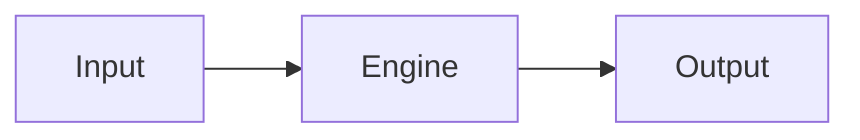

# <Document Title>

| Field | Value |
| --- | --- |
| Document ID | HES-<ID> |
| Owner | <Owner> |
| Status | Draft |
| Version | 0.1.0 |
| Last Reviewed | YYYY-MM-DD |
| Approval Authority | <Owner/TRB/CCB> |

## Purpose

State why this chapter exists and what engineering decision or behavior it governs.

## Scope

Define included systems, excluded systems, and dependencies.

## Responsibilities

List component, operator, reviewer, and implementation responsibilities.

## Architecture

Describe components, boundaries, invariants, and integration points.

## Data Structures

Define authoritative structures, identifiers, ordering rules, and serialization constraints.

## Algorithms

Describe deterministic algorithms, preconditions, postconditions, and error behavior.

## Mermaid Diagrams



## Rust Pseudocode

```rust
fn apply_event(state: &mut State, event: EngineEvent) -> Result<(), ApplyError> {
    // Pseudocode: preserve deterministic ordering and checked failure paths.
    Ok(())
}
```

## Failure Modes

Identify expected failures, detection signals, safe handling, and escalation.

## Replay

Explain replay inputs, ordering, idempotency, deterministic outputs, and verification.

## Recovery

Define recovery points, rollback constraints, snapshot use, and operator procedure.

## Performance

Document latency, throughput, memory, and scaling expectations with measurement method.

## Security

Document trust boundaries, authorization, secrets, data integrity, auditability, and abuse cases.

## Testing

List unit, integration, deterministic replay, property, conformance, and certification tests.

## Acceptance Criteria

- [ ] Requirements are explicit and verifiable.
- [ ] Failure modes and recovery behavior are documented.
- [ ] Cross-references are stable.

## Review Checklist

- [ ] Architecture reviewed.
- [ ] Algorithms reviewed.
- [ ] Security reviewed.
- [ ] Performance reviewed.
- [ ] Documentation reviewed.

## Codex Implementation Contract

Implementations generated from this chapter MUST preserve normative requirements, deterministic behavior, data ordering, error handling, and documented acceptance criteria. Codex-generated code MUST NOT infer behavior that conflicts with HES.

## References

- HES-000 Master Index
- Related ADRs
- Related RFCs
- Requirement IDs
