# VOLUME II: TRADING KERNEL INTERNALS

Volume II specifies implementation-grade hot-path internals for the HermesNet trading kernel. It extends the Volume I architecture without restating foundation material. The rules remain: book-local ordering, single-writer Book Core ownership, fixed-point arithmetic, deterministic event sourcing, deterministic replay, hot/cold path separation, and no database, Kafka, or cloud dependency in the pre-decision hot path.

## Chapter 1: Gateway Internals

### 1. Purpose

The Gateway accepts external client protocol traffic, authenticates it, normalizes order intent, applies admission controls, creates an `OrderEnvelope`, and submits that envelope to the Instrument Router through a bounded hot-path queue. The Gateway is a protocol and admission boundary only. It does not match orders, mutate book state, reserve balances, or publish externally visible order success before receiving an EngineEvent-derived decision.

### 2. Scope

In scope:

- HTTP REST gateway for request/response order entry, cancellation, amend, status, and administrative read-only endpoints.
- Signed REST gateway for private trading operations using API key and HMAC verification.
- WebSocket gateway for private command submission, private execution reports, and authenticated session state.
- FIX, OUCH, and SBE gateway boundary adapters that translate protocol frames into the same internal command model.
- Authentication, authorization, rate limiting, idempotency, request normalization, bounded queue admission, timeout handling, and private stream routing.
- Public market data routing boundary as a separate downstream subscription/publication plane.

Out of scope:

- Matching decisions.
- Book state mutation.
- Risk reservation mutation.
- Persistent DB transaction management in the pre-decision path.
- Kafka publication before order decision.

### 3. Non-Goals

- The Gateway does not implement price-time priority.
- The Gateway does not assign global sequence numbers.
- The Gateway does not provide durable order acceptance by itself; durable acceptance is defined by Book Core event append.
- The Gateway does not infer missing instrument metadata from a database during hot-path processing.
- The Gateway does not coalesce or reorder client commands for throughput.

### 4. Responsibilities

| Responsibility | Implementation requirement | Forbidden behavior |
|---|---|---|
| Protocol termination | Decode HTTP, WebSocket, FIX, OUCH, or SBE frames into canonical commands. | Passing protocol-specific structs into Book Core. |
| Authentication | Validate API key, HMAC, JWT/session, nonce/timestamp, and account status from in-memory auth cache. | Calling DB in the hot decision path. |
| Authorization | Validate account permissions, instrument permissions, trading mode, and role constraints. | Letting Router or Book Core discover missing permissions. |
| Rate limiting | Apply per-account, per-IP, per-key, and per-session token buckets. | Queueing unlimited requests while waiting for capacity. |
| Idempotency | Detect duplicate `client_order_id` within configured account/instrument scope. | Submitting duplicates that have a known terminal decision. |
| Normalization | Convert request values into fixed-point internal types and canonical enums. | Floating-point price or quantity storage. |
| Admission | Submit to Instrument Router only if bounded queue has capacity. | Blocking indefinitely or allocating unbounded queues. |
| Response routing | Correlate EngineEvents to REST response futures and private streams. | Publishing success before EngineEvent commit. |

### 5. Inputs and Outputs

#### Inputs

- REST requests: `POST /orders`, `DELETE /orders/{id}`, `PATCH /orders/{id}`, `GET /orders/{id}`.
- WebSocket private commands: `NewOrder`, `CancelOrder`, `AmendOrder`, `MassCancel`.
- FIX messages: `NewOrderSingle`, `OrderCancelRequest`, `OrderCancelReplaceRequest`.
- OUCH/SBE binary frames mapped by session adapters.
- Auth cache snapshots, permission cache snapshots, static instrument metadata snapshots, and router availability snapshots.

#### Outputs

- `OrderEnvelope` to Instrument Router.
- Synchronous REST response: accepted-for-processing, final immediate rejection, timeout, or duplicate result.
- Private execution reports to authenticated WebSocket/FIX/OUCH/SBE sessions.
- Metrics, traces, structured audit events, and security counters.

### 6. Internal Architecture

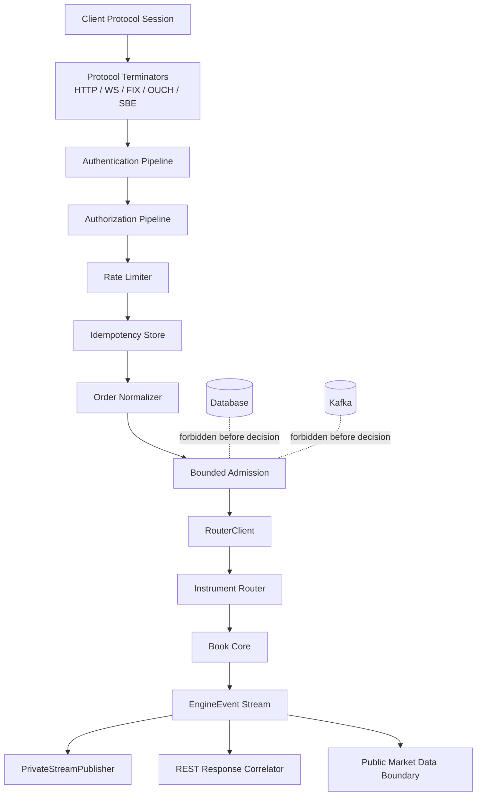

The Gateway is split into protocol adapters and protocol-neutral services. Protocol adapters perform decoding, framing, session I/O, and response encoding. Protocol-neutral services perform authentication, authorization, rate limiting, idempotency, normalization, and routing. All services required before router admission must operate from preloaded in-memory snapshots or lock-free/low-contention local structures.

### 7. Data Structures

```rust
pub struct GatewayRequest {
    pub protocol: Protocol,
    pub session_id: SessionId,
    pub remote_addr: IpAddr,
    pub received_at_ns: UnixNanos,
    pub headers: HeaderMap,
    pub payload: Bytes,
}

pub struct AuthenticatedPrincipal {
    pub account_id: AccountId,
    pub api_key_id: Option<ApiKeyId>,
    pub session_id: SessionId,
    pub permissions: PermissionBits,
    pub auth_epoch: u64,
}

pub struct OrderEnvelope {
    pub envelope_id: EnvelopeId,
    pub account_id: AccountId,
    pub instrument_id: InstrumentId,
    pub client_order_id: ClientOrderId,
    pub command: TradingCommand,
    pub fixed_price: Option<PriceFp>,
    pub fixed_qty: QuantityFp,
    pub side: Side,
    pub tif: TimeInForce,
    pub received_at_ns: UnixNanos,
    pub gateway_deadline_ns: UnixNanos,
    pub auth_epoch: u64,
    pub idempotency_key: IdempotencyKey,
    pub response_route: ResponseRoute,
}

pub enum GatewayDecision {
    Submitted { envelope_id: EnvelopeId },
    Rejected { code: RejectCode, reason: StaticStr },
    Duplicate { prior: PriorDecisionRef },
    Timeout { envelope_id: EnvelopeId },
}
```

### 8. Rust Module Layout

```text
crates/gateway/
  src/lib.rs
  src/http.rs              # REST endpoint decode/encode only
  src/websocket.rs         # WS session, private stream mux
  src/fix.rs               # FIX adapter boundary
  src/ouch.rs              # OUCH adapter boundary
  src/sbe.rs               # SBE adapter boundary
  src/auth.rs              # AuthService implementation over in-memory snapshots
  src/authorization.rs     # permission checks
  src/rate_limit.rs        # token buckets and overload policy
  src/idempotency.rs       # duplicate detection cache
  src/normalize.rs         # fixed-point canonicalization
  src/admission.rs         # bounded queue admission
  src/private_stream.rs    # private report routing
  src/public_boundary.rs   # market data boundary handoff
  src/metrics.rs
  src/errors.rs
```

### 9. Core Traits and Interfaces

```rust
pub trait GatewayService {
    fn handle_request(&self, req: GatewayRequest) -> GatewayDecision;
    fn handle_ws_frame(&self, session: SessionId, frame: WsFrame) -> GatewayDecision;
    fn on_engine_event(&self, event: &EngineEvent);
}

pub trait AuthService {
    fn authenticate(&self, req: &GatewayRequest) -> Result<AuthenticatedPrincipal, AuthError>;
    fn verify_api_key(&self, key_id: ApiKeyId, presented: SecretRef) -> Result<ApiKeyRecord, AuthError>;
    fn verify_hmac(&self, req: &GatewayRequest, key: &ApiKeyRecord) -> Result<(), AuthError>;
    fn validate_jwt_or_session(&self, req: &GatewayRequest) -> Result<SessionClaims, AuthError>;
}

pub trait RateLimiter {
    fn check_and_debit(&self, principal: &AuthenticatedPrincipal, cost: RateCost) -> Result<(), RateLimitError>;
    fn refund_on_not_submitted(&self, principal: &AuthenticatedPrincipal, cost: RateCost);
}

pub trait IdempotencyStore {
    fn reserve(&self, key: IdempotencyKey, ttl_ns: u64) -> IdempotencyDecision;
    fn complete(&self, key: IdempotencyKey, decision: EngineDecisionRef);
    fn mark_unknown_after_crash(&self, key: IdempotencyKey);
}

pub trait OrderNormalizer {
    fn normalize(&self, principal: &AuthenticatedPrincipal, req: CanonicalRequest) -> Result<OrderEnvelope, NormalizeError>;
}

pub trait RouterClient {
    fn try_submit(&self, envelope: OrderEnvelope) -> Result<SubmitRef, SubmitError>;
}

pub trait PrivateStreamPublisher {
    fn publish_execution_report(&self, account_id: AccountId, report: ExecutionReport);
    fn publish_reject(&self, account_id: AccountId, reject: PrivateReject);
}
```

### 10. Processing Flow

1. Decode protocol frame and reject malformed syntax before auth.
2. Authenticate using in-memory API key/JWT/session snapshots.
3. Verify HMAC over canonical method, path, timestamp, nonce, and body for signed REST.
4. Authorize account, instrument, command type, and trading mode.
5. Apply rate limit and overload tokens.
6. Reserve idempotency key scoped by `account_id + instrument_id + client_order_id + command_kind`.
7. Normalize into fixed-point `OrderEnvelope`.
8. Attempt bounded queue admission through `RouterClient::try_submit`.
9. On full queue, return `ENGINE_BUSY` and release/refund transient idempotency reservation unless the request is already in-flight.
10. Await correlated EngineEvent until gateway deadline for synchronous REST; WebSocket/FIX/OUCH sessions can receive asynchronous private reports.

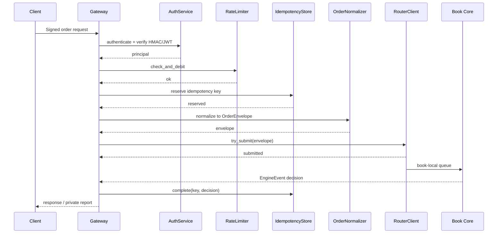

### 11. State Machines

#### Request admission state

```text
Received -> Decoded -> Authenticated -> Authorized -> RateLimited -> IdempotencyReserved -> Normalized -> Submitted -> Decided
Received -> Rejected
Submitted -> TimedOutAtGateway
Submitted -> DecidedAfterTimeout
```

A gateway timeout does not cancel the Book Core command. If the command was submitted, the idempotency entry remains `InFlight` until an EngineEvent completes it or replay recovery resolves it.

### 12. Sequence Diagrams

#### Gateway overload rejection sequence

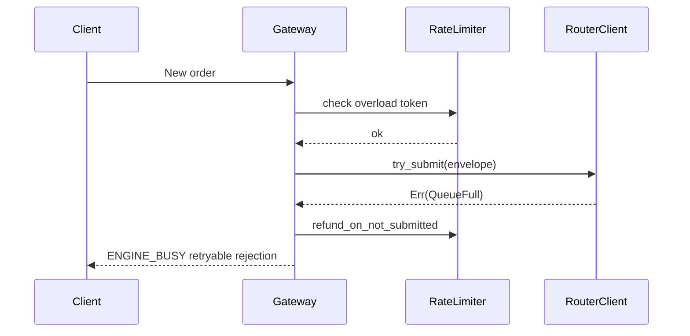

#### Duplicate order retry sequence

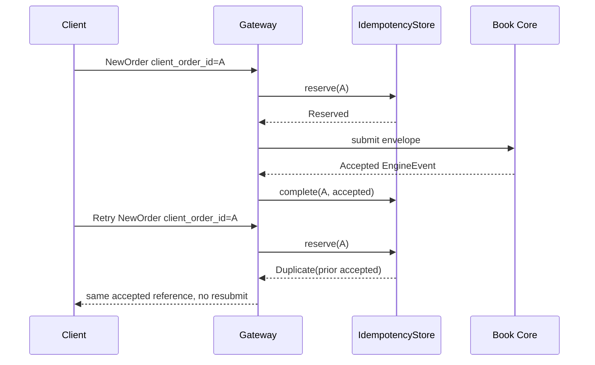

#### Gateway component diagram

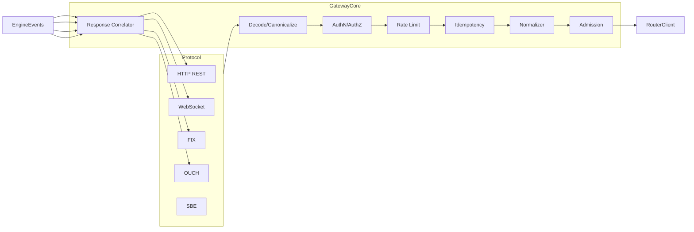

### 13. Memory Model

- Gateway hot-path request structs are allocated from per-worker pools where possible.
- Auth and instrument metadata are immutable snapshot references swapped atomically outside request handling.
- Idempotency entries are bounded by TTL and capacity; eviction cannot remove `InFlight` entries without marking them `Unknown` and forcing status reconciliation.
- `OrderEnvelope` owns all fields needed by Router and Book Core; it must not borrow request body buffers.
- HMAC secret material is stored in protected memory where supported and never copied into logs.

### 14. Threading and Concurrency Model

- Protocol I/O may run on multiple gateway workers.
- Each request is processed independently until `RouterClient::try_submit`.
- Gateway workers may submit to many instrument routes, but per-book order is preserved by the Router and bounded ring writer.
- No Gateway worker may hold a lock while calling `try_submit`.
- Response correlation can be sharded by `envelope_id` or `account_id` and must tolerate decision arrival after REST timeout.

### 15. Failure Modes

| Failure | Detection | Gateway behavior | Recovery expectation |
|---|---|---|---|
| Invalid HMAC | Constant-time compare fails. | Reject `AUTH_SIGNATURE_INVALID`. | Security counter increments; no router call. |
| Expired JWT/session | Session cache expiration. | Reject `AUTH_SESSION_EXPIRED`. | Client reauthenticates. |
| Unknown API key | Auth snapshot miss. | Reject `AUTH_KEY_UNKNOWN`. | No DB lookup in hot path. |
| Duplicate terminal order | Idempotency terminal hit. | Return prior decision reference. | No resubmit. |
| Duplicate in-flight order | Idempotency in-flight hit. | Return in-flight status or await same correlation. | Complete when EngineEvent arrives. |
| Router queue full | `try_submit` returns `QueueFull`. | Reject `ENGINE_BUSY`. | Client retries with same client id. |
| Gateway crash after submit | Missing local response state after restart. | Rebuild idempotency from event log/status query path; mark unresolved keys unknown. | Client retry receives prior decision or reconciliation response. |
| Engine decision after REST timeout | Correlation entry timed out. | Publish private report and persist idempotency terminal. | Client status endpoint shows final result. |

### 16. Backpressure and Overload Behaviour

Backpressure is explicit and bounded. The Gateway must never hide engine saturation behind unbounded in-memory queues.

- If local protocol worker queue is full, reject before auth with transport-level overload where safe.
- If rate-limiter overload bucket is empty, reject `RATE_LIMITED`.
- If router/book ring is full, reject `ENGINE_BUSY`.
- If idempotency store is at capacity, reject `GATEWAY_BUSY` unless the key already exists.
- If private stream subscriber is slow, drop or compact non-critical account snapshots but never drop terminal execution reports without forcing session resynchronization.

### 17. Observability

Required metrics:

- `gateway_requests_total{protocol,command,result}`
- `gateway_auth_failures_total{reason}`
- `gateway_hmac_verify_ns{quantile}`
- `gateway_rate_limited_total{scope}`
- `gateway_idempotency_hits_total{state}`
- `gateway_router_submit_ns{instrument}`
- `gateway_engine_busy_total{instrument,book}`
- `gateway_timeouts_total{command}`
- `gateway_private_report_lag_ns{account}`

Logs must include `envelope_id`, `account_id`, `instrument_id`, `client_order_id`, `protocol`, and rejection code. Logs must exclude secrets, raw HMAC keys, JWT bodies, and full request payloads containing sensitive data.

### 18. Performance Targets

| Operation | Target | Measurement point |
|---|---:|---|
| REST decode + canonicalization | <= 25 µs p99 | worker receive to canonical request |
| HMAC verification | <= 15 µs p99 | canonical bytes ready to auth result |
| Authz + metadata checks | <= 5 µs p99 | principal available to authz result |
| Idempotency reserve | <= 10 µs p99 | key construction to reservation decision |
| Normalize to envelope | <= 8 µs p99 | canonical request to owned envelope |
| Router `try_submit` | <= 5 µs p99 when ring not full | envelope ready to submit result |
| Busy rejection | <= 20 µs p99 after queue-full detection | queue-full to encoded response |

### 19. Security Considerations

- HMAC comparison must be constant-time.
- Signed REST timestamps must enforce a narrow replay window and nonce uniqueness per API key.
- JWT validation must pin issuer, audience, algorithm, and key epoch.
- API keys must be scoped to accounts and permissions; a key for one account cannot submit for another account.
- Authorization must reject halted instruments, liquidation-only accounts, disabled keys, and read-only sessions before Router submission.
- Rate limits must include account and credential dimensions to prevent key fan-out abuse.
- Private execution reports must be routed only to sessions authorized for the account.
- Public market data publishing must consume sanitized EngineEvents from the event boundary, not private order payloads.

### 20. Testing Strategy

| Test category | Required cases |
|---|---|
| Auth | valid/invalid HMAC, expired timestamp, replayed nonce, unknown key, disabled key, expired JWT, wrong audience. |
| Authorization | account mismatch, instrument permission denied, halted instrument, read-only key, trading-disabled account. |
| Idempotency | first submit, duplicate before decision, duplicate after accept, duplicate after reject, retry after gateway crash. |
| Admission | ring available, ring full, router unavailable, deadline exceeded, local overload. |
| Protocol parity | REST, WebSocket, FIX, OUCH, and SBE produce equivalent canonical commands. |
| Security | no secret logging, constant-time signature tests, malformed frame fuzzing, path canonicalization tests. |
| Replay integration | decision after gateway timeout completes idempotency on event replay. |

### 21. Codex Implementation Contract

A Codex implementation agent modifying Gateway code must:

1. Keep protocol adapters separate from canonical command services.
2. Preserve `OrderEnvelope` ownership; do not pass borrowed request buffers beyond normalization.
3. Use fixed-point types for price and quantity.
4. Never add DB, Kafka, or remote service calls before Book Core decision.
5. Treat `ENGINE_BUSY` as a terminal gateway rejection for that attempt and a retryable client outcome.
6. Add tests for every new rejection code and duplicate idempotency branch.
7. Ensure logs redact secrets by default.

### 22. Review Checklist

| Reviewer | Checklist |
|---|---|
| Rust backend engineer | Traits are object-safe or explicitly generic; no blocking call in hot path; error enums are exhaustive. |
| Exchange architect | Gateway does not sequence globally or mutate book state; accepted success follows EngineEvent. |
| QA engineer | Duplicate, timeout, overload, and protocol parity tests are present. |
| SRE | Metrics distinguish auth failure, rate limit, queue full, router unavailable, and timeout. |
| Security engineer | HMAC/JWT/API key handling is constant-time where required and secrets are redacted. |
| Codex agent | Module ownership is clear and forbidden dependencies are absent. |

## Chapter 2: Instrument Router Internals

### 1. Purpose

The Instrument Router maps each normalized `OrderEnvelope` to exactly one Book Core input ring based on instrument metadata, route table state, availability state, and failover policy. It preserves book-local ordering and propagates backpressure to the Gateway without inventing global sequencing or buffering indefinitely.

### 2. Scope

In scope:

- Instrument-to-BookCore mapping.
- Book shard registry and routing table.
- Primary/standby mapping.
- Canary symbols and feature-flagged route changes.
- Instrument availability and halt routing.
- Route cache refresh and hot reload safety.
- Bounded ring selection and `ENGINE_BUSY` propagation.

Out of scope:

- Gateway authentication and normalization.
- Matching and risk reservation.
- Global order sequencing.
- Durable event append.

### 3. Non-Goals

- The Router does not sequence orders globally.
- The Router does not reorder orders for the same book.
- The Router does not retry indefinitely on a full Book Core ring.
- The Router does not mutate Book Core state.
- The Router does not recover a Book Core by replaying events; it only changes routing state after safe failover control.

### 4. Responsibilities

| Responsibility | Implementation detail |
|---|---|
| Resolve instrument | Lookup `InstrumentId` in immutable `RouteTable` snapshot. |
| Validate tradability | Reject unknown, disabled, halted, or route-draining instruments before touching Book Core. |
| Select book | Pick primary or failover BookCoreHandle from `BookRoute`. |
| Preserve ordering | Use one ordered ring writer per target Book Core; never parallel-write same book through competing writers. |
| Propagate backpressure | Return `ENGINE_BUSY` on full ring or unavailable route. |
| Support hot reload | Atomically swap route table snapshots at epoch boundaries. |
| Support canaries | Apply route changes to configured canary symbols before broad migration. |

### 5. Inputs and Outputs

Inputs:

- `OrderEnvelope` from Gateway.
- Immutable `RouteTable` snapshot.
- Book availability heartbeats and health states.
- Feature flag snapshot.
- Instrument halt state snapshot.

Outputs:

- `RouteResolutionResult` to Gateway.
- Submitted command in target Book Core ring.
- Router metrics and structured route decision logs.

### 6. Internal Architecture

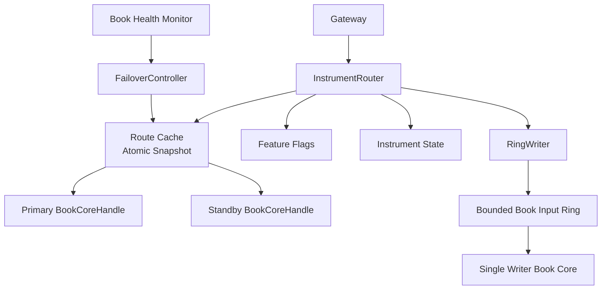

The Router is on the hot path but is not a decision engine. It performs pure selection and admission. It must be deterministic for a given route-table epoch and feature-flag epoch.

### 7. Data Structures

```rust
pub struct InstrumentRouter {
    route_table: ArcSwap<RouteTable>,
    failover: FailoverController,
    metrics: RouterMetrics,
}

pub struct RouteTable {
    pub epoch: RouteEpoch,
    pub routes: FxHashMap<InstrumentId, BookRoute>,
    pub canary_symbols: FxHashSet<InstrumentId>,
}

pub struct BookRoute {
    pub instrument_id: InstrumentId,
    pub primary: BookCoreHandle,
    pub standby: Option<BookCoreHandle>,
    pub state: InstrumentState,
    pub flags: RouteFlags,
    pub min_route_epoch: RouteEpoch,
}

pub struct BookCoreHandle {
    pub book_id: BookId,
    pub shard_id: ShardId,
    pub ring: RingWriter<OrderEnvelope>,
    pub availability: BookAvailability,
    pub writer_epoch: u64,
}

pub struct RingWriter<T> {
    pub ring_id: RingId,
    pub capacity: u32,
    pub producer: BoundedProducer<T>,
}

pub enum RouteResolutionResult {
    Submitted { book_id: BookId, route_epoch: RouteEpoch },
    Rejected { code: RejectCode, reason: StaticStr },
    Busy { book_id: Option<BookId>, reason: BusyReason },
}

pub enum InstrumentState {
    Trading,
    Halted { reason: HaltReason, since_ns: UnixNanos },
    PostOnly,
    CancelOnly,
    Disabled,
    Draining,
}

pub struct FailoverController {
    pub policy_epoch: u64,
    pub failover_state: AtomicFailoverMap,
}
```

### 8. Rust Module Layout

```text
crates/router/
  src/lib.rs
  src/instrument_router.rs
  src/route_table.rs
  src/book_registry.rs
  src/book_handle.rs
  src/ring_writer.rs
  src/failover.rs
  src/halt.rs
  src/feature_flags.rs
  src/cache_refresh.rs
  src/errors.rs
  src/metrics.rs
```

### 9. Core Traits and Interfaces

```rust
pub trait InstrumentRouterApi {
    fn route(&self, envelope: OrderEnvelope) -> RouteResolutionResult;
    fn current_epoch(&self) -> RouteEpoch;
}

pub trait RouteTableProvider {
    fn load_snapshot(&self) -> Arc<RouteTable>;
    fn validate_snapshot(&self, next: &RouteTable) -> Result<(), RouteTableError>;
}

pub trait BookRegistry {
    fn get(&self, book_id: BookId) -> Option<BookCoreHandle>;
    fn availability(&self, book_id: BookId) -> BookAvailability;
}

pub trait RingWriterApi<T> {
    fn try_push(&self, item: T) -> Result<(), RingPushError<T>>;
    fn remaining_capacity(&self) -> u32;
}

pub trait FailoverControl {
    fn active_handle(&self, route: &BookRoute) -> Result<BookCoreHandle, RouteError>;
    fn mark_primary_unavailable(&self, book_id: BookId, reason: FailoverReason);
}
```

### 10. Processing Flow

1. Load current `RouteTable` snapshot atomically.
2. Lookup `envelope.instrument_id`.
3. Reject `UNKNOWN_INSTRUMENT` if missing.
4. Check `InstrumentState`; reject halted/disabled instruments before touching Book Core.
5. Resolve active Book Core handle through failover policy.
6. Verify handle availability and writer epoch.
7. Attempt `RingWriter::try_push(envelope)`.
8. Return `Submitted` on push success.
9. Return `Busy` on full ring or unavailable active handle.

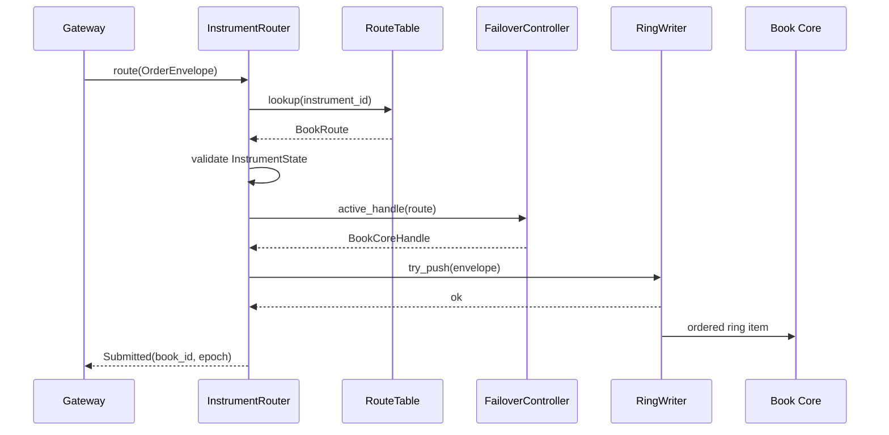

### 11. State Machines

#### Instrument route state

```text
Trading -> Halted -> Trading
Trading -> CancelOnly -> Trading
Trading -> Draining -> Disabled
Trading -> Draining -> Trading
Disabled -> Draining -> Trading
```

Only `Trading`, `PostOnly` for allowed post-only commands, and `CancelOnly` for cancel commands are routable. `Halted`, `Disabled`, and incompatible modes reject before Book Core.

#### Book availability state

```text
Available -> Degraded -> Unavailable -> Recovering -> Available
Available -> Draining -> StandbyPromoted
```

Routing to standby is permitted only after failover control has confirmed no split-brain writer exists for the same book-local sequence domain.

### 12. Sequence Diagrams

#### Route cache refresh sequence

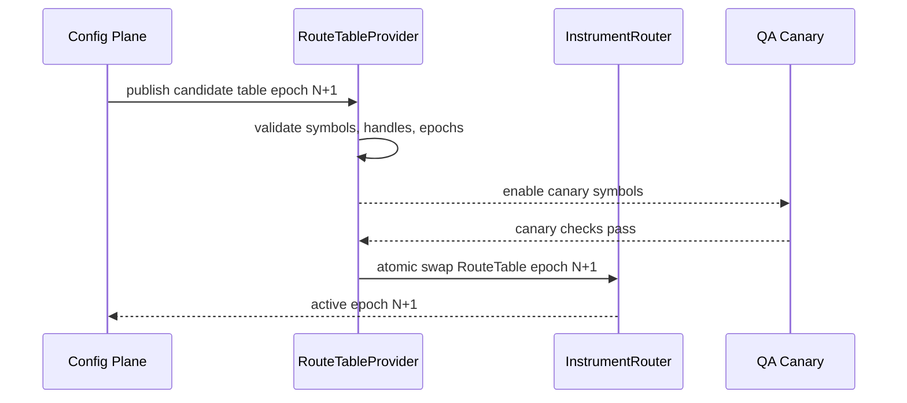

#### Primary/standby failover routing sequence

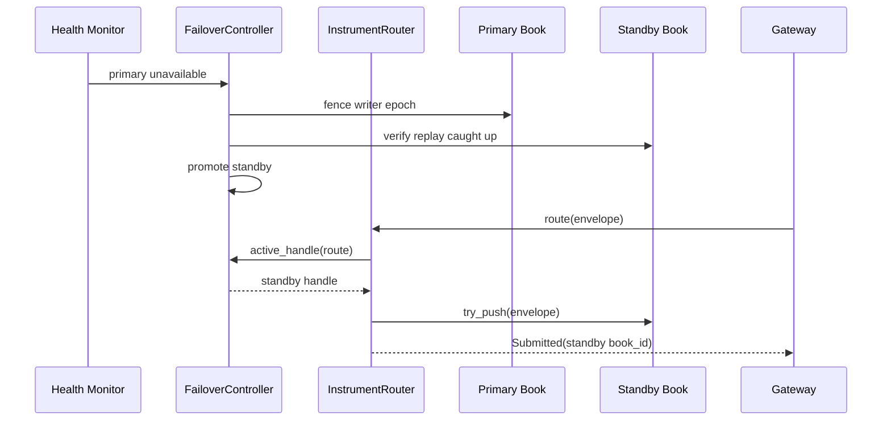

#### Instrument halt routing sequence

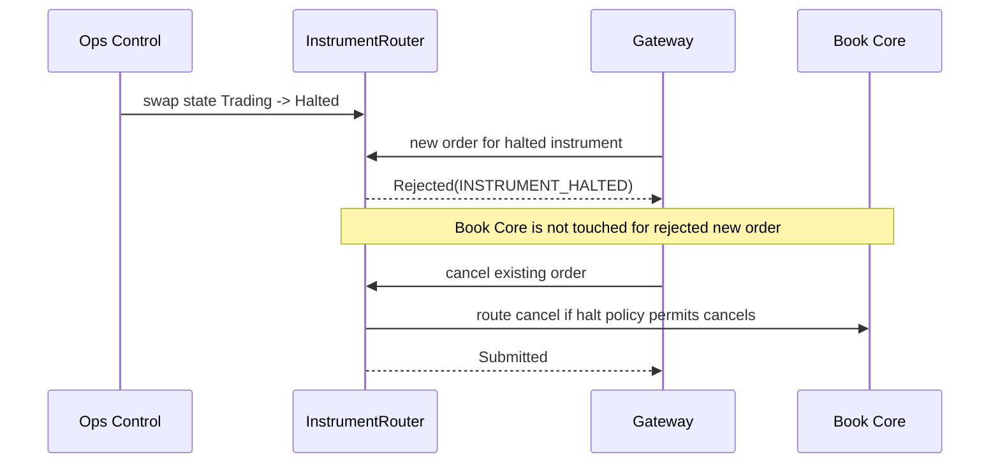

### 13. Memory Model

- `RouteTable` is immutable after construction and exchanged with atomic pointer swap.
- `BookRoute` holds handles by value or `Arc` to stable writer endpoints; it does not hold mutable book state.
- Ring writers own producer cursors; consumer cursors are owned by Book Core.
- Route cache refresh allocates outside the hot path, validates fully, then swaps one pointer.
- The Router does not copy large order payloads; it moves the owned `OrderEnvelope` into a selected ring or returns it on push failure for error handling.

### 14. Threading and Concurrency Model

- Multiple Gateway workers may call `InstrumentRouter::route` concurrently.
- A route operation reads immutable snapshots and performs one bounded ring push.
- For a given Book Core, ring writer configuration must preserve single producer semantics or use a proven MPSC ring that preserves arrival order per producer and deterministic merge policy. Preferred deployment is one Router writer task per Book Core to avoid ambiguous same-book ordering.
- Route-table swaps are atomic and wait-free for readers.
- Failover promotion must fence the old writer epoch before exposing the standby handle.

### 15. Failure Modes

| Failure | Detection | Router response | Safety property |
|---|---|---|---|
| Unknown instrument | Route table miss. | Reject `UNKNOWN_INSTRUMENT`. | Book Core untouched. |
| Halted instrument | `InstrumentState::Halted`. | Reject new/amend; route cancels only if policy allows. | Halt is enforced before matching. |
| Full book ring | `RingPushError::Full`. | Return `ENGINE_BUSY`. | No hidden backlog. |
| Primary unavailable | Health state or failed writer epoch. | Return busy or use promoted standby. | No split-brain writer. |
| Invalid hot reload | Snapshot validation fails. | Keep old route table. | Readers observe valid epoch only. |
| Feature flag mismatch | Flag epoch inconsistent. | Reject route-table activation. | Canary changes are controlled. |

### 16. Backpressure and Overload Behaviour

- The Router never blocks waiting for ring capacity.
- `RingWriter::try_push` is a single-attempt operation.
- Full rings produce `ENGINE_BUSY` with `book_id` where safe.
- Route-level degraded state can preemptively return busy before a ring is full.
- Gateway must surface busy to clients; it must not create a secondary unbounded queue.

### 17. Observability

Required metrics:

- `router_route_total{instrument,result,book_id}`
- `router_unknown_instrument_total{instrument}`
- `router_instrument_halted_total{instrument,command}`
- `router_ring_full_total{book_id}`
- `router_route_epoch{}`
- `router_failover_total{from_book,to_book,reason}`
- `router_route_latency_ns{quantile}`
- `router_ring_remaining_capacity{book_id}`

Structured route logs must include `envelope_id`, `instrument_id`, `route_epoch`, `book_id`, `instrument_state`, and `result`.

### 18. Performance Targets

| Operation | Target | Notes |
|---|---:|---|
| Route table lookup | <= 2 µs p99 | Immutable hash map or generated perfect map for active symbols. |
| Instrument state validation | <= 500 ns p99 | State stored in route entry. |
| Failover active handle selection | <= 1 µs p99 | Atomic state read only in normal case. |
| Ring push success | <= 2 µs p99 | No allocation, no blocking. |
| Ring full rejection | <= 2 µs p99 | Includes error construction. |
| Route table atomic swap | <= 50 µs control-plane operation | Not on order hot path. |

### 19. Security Considerations

- Route-table updates require authenticated control-plane authorization and signed configuration artifacts.
- Canary activation must not allow unauthorized instruments to trade.
- Instrument halt state is security relevant; stale route state must be observable and bounded by epoch monitoring.
- Router logs must not include private order payload beyond identifiers required for audit.
- Failover fencing must prevent two Book Cores from accepting commands for the same instrument sequence domain.

### 20. Testing Strategy

| Test category | Required cases |
|---|---|
| Routing | known instrument, unknown instrument, disabled instrument, canary instrument, post-only mode, cancel-only mode. |
| Ordering | concurrent submissions to same book preserve configured ring order; no reorder during route-table swap. |
| Backpressure | full ring returns `ENGINE_BUSY`; degraded route returns busy; Gateway receives propagated busy. |
| Hot reload | invalid snapshot rejected; valid snapshot swapped atomically; old in-flight route completes safely. |
| Failover | primary available, primary unavailable no standby, standby promoted after fence, split-brain prevention. |
| Halt | new order rejected, cancel allowed/denied by policy, halt epoch observed in metrics. |

### 21. Codex Implementation Contract

A Codex implementation agent modifying Router code must:

1. Keep Router logic limited to selection, validation, and bounded admission.
2. Never add global sequencing.
3. Never add unbounded queues or blocking retry loops.
4. Reject unknown or halted instruments before touching Book Core.
5. Preserve book-local order during route-table refresh and failover.
6. Add tests for route epochs, failover fencing, and ring-full propagation.

### 22. Review Checklist

| Reviewer | Checklist |
|---|---|
| Rust backend engineer | Route snapshots are immutable; ring push API cannot block indefinitely. |
| Exchange architect | Router does not sequence globally and does not mutate Book Core state. |
| QA engineer | Hot reload, halt, unknown instrument, and failover tests exist. |
| SRE | Route epoch, ring capacity, and failover metrics are dashboarded. |
| Security engineer | Route config activation is authenticated and split-brain is prevented. |
| Codex agent | Interfaces match `InstrumentRouter`, `RouteTable`, `BookRoute`, `BookCoreHandle`, `RingWriter`, `RouteResolutionResult`, `InstrumentState`, and `FailoverController`. |

## Chapter 3: Book Core Memory Model

### 1. Purpose

The Book Core Memory Model defines ownership, layout, allocation, cache behavior, and mutation invariants for the single-writer trading kernel. It is the implementation contract for deterministic, low-latency order processing. Every accepted command for a book is consumed by one Book Core thread that owns all mutable book state, generates EngineEvents atomically with state transitions, appends events before externally visible success, and supports replay into identical logical state.

### 2. Scope

In scope:

- Single-writer memory ownership for book state, risk cache, reservations, event buffers, and snapshot buffers.
- Owned, borrowed, and read-only snapshot state.
- Cache line alignment, false sharing avoidance, CPU pinning, and NUMA assumptions.
- Memory pools, arena allocation, object lifecycle, and zero steady-state allocation target.
- Layouts for order nodes, price levels, rings, event buffers, snapshot buffers, reservation map, risk cache, and hash chain buffer.

Out of scope:

- External database layout.
- Kafka or cloud archival storage.
- Full matching algorithm specification, which is expanded in Chapter 5.
- Full risk formula specification, which is expanded in Chapter 6.

### 3. Non-Goals

- No shared mutable order book state between threads.
- No lock acquisition inside `process_order`.
- No heap allocation in steady-state order matching.
- No floating-point arithmetic in memory-resident trading state.
- No global sequence counter across books.
- No runtime schema reflection in the hot path.

### 4. Responsibilities

| Component | Owned by | Responsibility |
|---|---|---|
| `BookCore` | Book thread | Consume input ring, mutate book state, emit EngineEvents. |
| `BookState` | Book thread | Hold all mutable per-book state. |
| `OrderBook` | Book thread | Maintain price levels and FIFO queues. |
| `RiskCache` | Book thread | Hold preloaded account/instrument limits relevant to this book. |
| `ReservationMap` | Book thread | Track risk reservations for active orders in this book. |
| `EventBuffer` | Book thread | Stage EngineEvents before append. |
| `AppendOnlyLog` | Book thread owned writer | Append committed events and hash chain entries. |
| `SnapshotBuffer` | Snapshot subsystem with immutable handoff | Copy or freeze read-only state for replay checkpoints. |

### 5. Inputs and Outputs

Inputs:

- `OrderEnvelope` from the book input ring.
- Control commands already routed to this book, such as halt transition, cancel-only mode, snapshot request, and drain request.
- Preloaded risk/account cache updates delivered through deterministic control events.

Outputs:

- `EngineEvent` entries appended to the append-only log.
- Private execution reports derived from EngineEvents.
- Public market data deltas derived from non-private EngineEvents.
- Snapshot artifacts created from read-only checkpoint buffers.

### 6. Internal Architecture

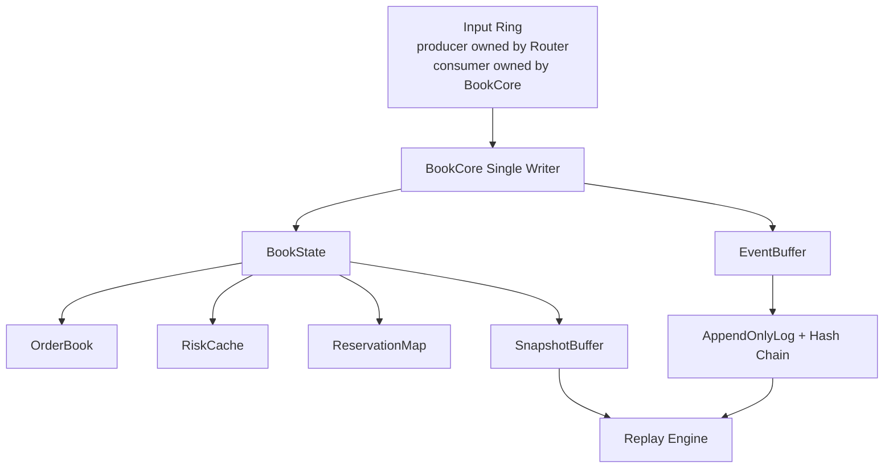

Book Core owns mutable state exclusively. Other threads may hold immutable snapshots or receive event-derived projections, but they cannot borrow mutable state from `BookState`.

### 7. Data Structures

```rust
#[repr(align(64))]
pub struct BookCore {
    pub book_id: BookId,
    pub instrument_id: InstrumentId,
    pub input: RingConsumer<OrderEnvelope>,
    pub state: BookState,
    pub event_buffer: EventBuffer,
    pub log: AppendOnlyLog,
    pub snapshot_buffer: SnapshotBuffer,
    pub pools: BookMemoryPools,
    pub clock: DeterministicClock,
}

pub struct BookState {
    pub seq: BookSeq,
    pub trading_state: TradingState,
    pub order_book: OrderBook,
    pub risk_cache: RiskCache,
    pub reservations: ReservationMap,
    pub last_event_hash: Hash256,
    pub stats: BookStats,
}

pub struct OrderBook {
    pub bids: PriceTree<PriceFp, PriceLevel>,
    pub asks: PriceTree<PriceFp, PriceLevel>,
    pub order_index: FixedHashMap<OrderId, OrderPtr>,
    pub client_index: FixedHashMap<ClientOrderKey, OrderId>,
}

#[repr(align(64))]
pub struct PriceLevel {
    pub price: PriceFp,
    pub total_qty: QuantityFp,
    pub head: Option<OrderPtr>,
    pub tail: Option<OrderPtr>,
    pub order_count: u32,
    pub _pad: [u8; 16],
}

pub struct OrderNode {
    pub order_id: OrderId,
    pub account_id: AccountId,
    pub client_order_id: ClientOrderId,
    pub price: PriceFp,
    pub remaining_qty: QuantityFp,
    pub reserved_qty: QuantityFp,
    pub side: Side,
    pub tif: TimeInForce,
    pub prev: Option<OrderPtr>,
    pub next: Option<OrderPtr>,
    pub pool_generation: u32,
}

pub struct RiskCache {
    pub account_limits: FixedHashMap<AccountId, AccountLimitCell>,
    pub instrument_limits: InstrumentLimitCell,
    pub account_positions: FixedHashMap<AccountId, PositionCell>,
}

pub struct ReservationMap {
    pub by_order: FixedHashMap<OrderId, ReservationCell>,
    pub by_account: FixedHashMap<AccountId, AccountReservationTotals>,
}

#[repr(align(64))]
pub struct EventBuffer {
    pub staged: FixedVec<EngineEvent, MAX_EVENTS_PER_COMMAND>,
    pub hash_chain: HashChainBuffer,
}

pub struct AppendOnlyLog {
    pub writer: LogWriter,
    pub current_segment: SegmentId,
    pub last_flushed_seq: BookSeq,
}

pub struct SnapshotBuffer {
    pub header: SnapshotHeader,
    pub arena_image: SnapshotArenaImage,
    pub order_index_image: SnapshotIndexImage,
    pub risk_image: SnapshotRiskImage,
}
```

### 8. Rust Module Layout

```text
crates/book_core/
  src/lib.rs
  src/core.rs              # BookCore loop and process_order boundary
  src/state.rs             # BookState and invariants
  src/order_book.rs        # OrderBook, PriceLevel, OrderNode
  src/memory_pool.rs       # slab/arena allocation
  src/ring.rs              # consumer-side input ring contracts
  src/events.rs            # EventBuffer and EngineEvent staging
  src/log.rs               # AppendOnlyLog writer boundary
  src/snapshot.rs          # SnapshotBuffer layout and handoff
  src/risk_cache.rs        # RiskCache and ReservationMap
  src/replay_alloc.rs      # deterministic replay allocation
  src/cache_align.rs       # alignment wrappers and padding
  src/tests/
```

### 9. Core Traits and Interfaces

```rust
pub trait BookCoreRuntime {
    fn run(&mut self) -> !;
    fn process_order(&mut self, envelope: OrderEnvelope) -> ProcessResult;
    fn process_control(&mut self, command: BookControlCommand) -> ProcessResult;
}

pub trait BookMemoryPool<T> {
    fn alloc(&mut self, value: T) -> Result<PoolPtr<T>, PoolExhausted>;
    fn free(&mut self, ptr: PoolPtr<T>);
    fn capacity(&self) -> usize;
    fn used(&self) -> usize;
}

pub trait EventAppender {
    fn stage(&mut self, event: EngineEvent);
    fn commit_staged(&mut self, log: &mut AppendOnlyLog) -> Result<CommitRef, LogError>;
    fn clear_staged_on_reject(&mut self);
}

pub trait SnapshotWriter {
    fn begin_snapshot(&mut self, state: &BookState) -> SnapshotToken;
    fn copy_chunk(&mut self, token: SnapshotToken, budget_bytes: usize) -> SnapshotProgress;
    fn publish_read_only(&mut self, token: SnapshotToken) -> ReadOnlySnapshot;
}
```

### 10. Processing Flow

1. Book Core polls its input ring consumer.
2. It moves one `OrderEnvelope` into `process_order`.
3. It validates deterministic preconditions using owned `BookState` and `RiskCache`.
4. It mutates `OrderBook` and `ReservationMap` using pool-owned nodes only.
5. It stages one or more EngineEvents in `EventBuffer`.
6. It appends staged events to `AppendOnlyLog`, updating the hash chain.
7. Only after successful append does it expose success through event publication.
8. If append fails before visibility, it must stop the book, mark state unsafe, and require replay or operator intervention.

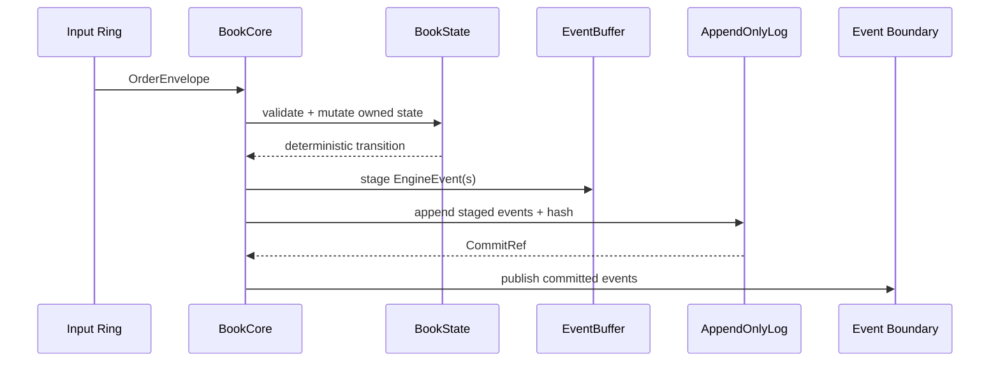

### 11. State Machines

#### Book Core run state

```text
Starting -> Replaying -> Live -> Draining -> Stopped
Live -> Faulted
Faulted -> Replaying
Draining -> Snapshotting -> Stopped
```

#### Object lifecycle

```text
FreePoolSlot -> AllocatedOrderNode -> LinkedInPriceLevel -> PartiallyFilled -> RemovedFromBook -> EventCommitted -> FreePoolSlot
```

An order node cannot return to the free pool until the cancel/fill/remove event that made it unreachable has been appended.

### 12. Sequence Diagrams

#### Hot path memory flow diagram


#### Ring buffer ownership diagram

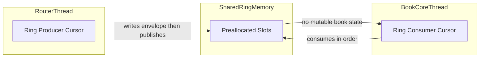

#### Snapshot memory layout diagram

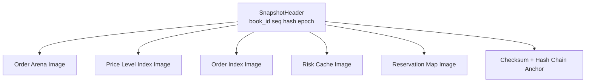

### 13. Memory Model

#### Ownership categories

| Category | Examples | Access rule |
|---|---|---|
| Owned mutable | `BookState`, `OrderBook`, `RiskCache`, `ReservationMap`, `EventBuffer` | Only Book Core thread mutates. |
| Borrowed immutable | `&InstrumentSpec`, read-only config snapshot | Borrow for duration of command; never store mutable refs. |
| Moved input | `OrderEnvelope` | Moved from ring into Book Core; not shared after consume. |
| Read-only snapshot | `ReadOnlySnapshot` | Published after copy/freeze; consumers cannot mutate. |
| Cold-path projection | DB/Kafka/materialized views | Derived from committed events, never consulted for hot decisions. |

#### Layout requirements

| Structure | Layout requirement | Rationale |
|---|---|---|
| `BookCore` | `repr(align(64))`; hot counters separated from cold config. | Prevent false sharing with adjacent runtime objects. |
| Ring slots | Power-of-two capacity; slot sequence padded to cache line. | Fast mask index and avoid producer/consumer cache ping-pong. |
| `PriceLevel` | Head/tail/aggregate quantity in one or two cache lines. | Common matching operations touch these fields together. |
| `OrderNode` | Intrusive prev/next pointers and fixed-point quantities. | Avoid per-node heap allocation and external linked-list boxes. |
| `EventBuffer` | Fixed max events per command with overflow fault policy. | No dynamic allocation during matching. |
| `RiskCache` | Account cells grouped by active instrument shard. | Improve locality for repeated account activity. |
| `ReservationMap` | Fixed-capacity hash table with deterministic probing. | Replay creates identical map shape and iteration order. |
| `HashChainBuffer` | Fixed staging buffer for event hashes. | Event append and hash update are atomic from Book Core perspective. |

#### CPU and NUMA assumptions

- Each active Book Core is pinned to a dedicated logical CPU where deployment capacity allows.
- Router producer for a hot book should run on the same NUMA node as the Book Core.
- Memory pools are allocated on the target NUMA node during startup warmup.
- Cross-NUMA route changes require draining or explicit latency budget approval.
- Hyperthread sibling placement must avoid placing noisy cold-path projection work next to a high-volume Book Core.

#### Allocator strategy

- Startup allocates slabs for order nodes, price levels, event staging, risk cells, reservations, input ring slots, and snapshot buffers.
- Steady-state `process_order` uses only pool allocation and fixed-capacity containers.
- Pool exhaustion is a deterministic rejection or book fault depending on the pool. Order-node exhaustion returns `ENGINE_CAPACITY_EXCEEDED`; event-buffer overflow faults the book because it violates event bounds.
- Replay uses the same pool capacities and deterministic allocation order to rebuild identical logical memory state.

### 14. Threading and Concurrency Model

- One Book Core thread owns one book or a configured small set of books only if each book has isolated state and deterministic polling policy.
- `process_order` is single-threaded and cannot acquire mutexes, rwlocks, async locks, or blocking channels.
- Input ring consumer is owned by Book Core; producer ownership belongs to Router.
- Event publication after log append may hand off immutable event copies to other threads.
- Snapshotting may be incremental, but any mutable traversal is controlled by the Book Core. Cold snapshot writers receive copied chunks or frozen immutable buffers.

### 15. Failure Modes

| Failure mode | Detection | Required behavior | Test |
|---|---|---|---|
| Order node pool exhausted | Pool `alloc` returns `PoolExhausted`. | Reject new order with capacity code; do not mutate book. | Fill pool then submit one more order. |
| Price level pool exhausted | Level allocation fails. | Reject if no mutation occurred; otherwise fault before visibility. | Submit unique prices beyond capacity. |
| Event buffer overflow | Staged event count exceeds bound. | Fault Book Core; require replay with corrected bound. | Fuzz command producing many fills. |
| Log append failure | `AppendOnlyLog` returns error. | Stop external success; mark book `Faulted`. | Inject log write failure. |
| Hash chain mismatch on replay | Recomputed hash differs. | Stop replay and quarantine segment. | Corrupt event segment. |
| Snapshot checksum mismatch | Trailer check fails. | Discard snapshot and replay from earlier checkpoint. | Corrupt snapshot bytes. |
| Shared mutable alias introduced | Static/lint/Miri detection. | Reject code change. | Miri/loom/unsafe audit. |
| Unexpected allocation in hot path | Allocation counter increments. | Fail benchmark/test. | Instrument global allocator in tests. |

### 16. Backpressure and Overload Behaviour

- Book Core signals overload by allowing input ring capacity to fall to zero; Router converts that to `ENGINE_BUSY`.
- Book Core does not allocate more memory to absorb bursts.
- Capacity rejections are deterministic and evented when the command reached Book Core.
- If memory pool usage exceeds warning thresholds, SRE metrics fire before hard exhaustion.
- Snapshot activity must yield to order processing and obey a byte/time budget per loop iteration.

### 17. Observability

Required metrics:

- `book_core_loop_ns{book_id}`
- `book_core_process_order_ns{book_id,command}`
- `book_core_ring_depth{book_id}`
- `book_core_pool_used{book_id,pool}`
- `book_core_event_append_ns{book_id}`
- `book_core_hash_chain_seq{book_id}`
- `book_core_snapshot_bytes_pending{book_id}`
- `book_core_replay_determinism_fail_total{book_id}`
- `book_core_hot_path_allocations_total{book_id}` expected to remain zero after warmup.

Tracing must be sampled outside the hot mutation section. Per-order debug logging is disabled in production hot path unless a canary symbol or emergency trace flag is enabled with explicit latency acceptance.

### 18. Performance Targets

#### Latency budget table

| Segment | Target p50 | Target p99 | Constraint |
|---|---:|---:|---|
| Ring consume | <= 250 ns | <= 1 µs | Cache-resident slot, no allocation. |
| Precondition validation | <= 1 µs | <= 4 µs | Risk cache local to book thread. |
| Add resting order | <= 2 µs | <= 8 µs | Existing price level. |
| Create new price level | <= 4 µs | <= 15 µs | Pool allocation only. |
| Match against one level | <= 3 µs | <= 10 µs | Excludes multi-level sweep. |
| Event staging | <= 500 ns | <= 2 µs | Fixed buffer. |
| Event append | <= 5 µs | <= 25 µs | Local append-only segment. |
| Snapshot incremental slice | <= 10 µs per loop budget | <= 50 µs | Must yield to order processing. |

#### Memory budget table

| Pool/buffer | Initial capacity per book | Sizing driver | Exhaustion behavior |
|---|---:|---|---|
| Input ring | 65,536 envelopes | Gateway burst and router fan-in. | Router returns `ENGINE_BUSY`. |
| Order node slab | 2,000,000 nodes | Max resting orders plus safety margin. | Reject new resting order. |
| Price level slab | 250,000 levels | Tick range and active depth. | Reject/fault based on mutation point. |
| Order index | 4,194,304 slots | Load factor <= 0.5 for active orders. | Reject capacity. |
| Client index | 4,194,304 slots | Duplicate detection at book level. | Reject capacity. |
| Reservation map | 4,194,304 slots | Active reserving orders. | Reject capacity. |
| Event buffer | 4,096 events/command | Worst-case sweep bound. | Fault if exceeded. |
| Hash chain buffer | 4,096 hashes/command | Mirrors event buffer. | Fault if exceeded. |
| Snapshot buffer | Configured by book size, double-buffered | Checkpoint latency target. | Delay snapshot; do not block matching indefinitely. |
| Risk cache | Active accounts for instrument shard | Account participation. | Reject if required account cell absent. |

### 19. Security Considerations

- Memory reuse must clear sensitive account/order fields before returning slots to pools if snapshots or diagnostics can expose freed memory.
- Unsafe Rust is allowed only in audited modules such as ring buffers or arena pointers, with documented aliasing invariants.
- Snapshot buffers must not include API secrets, JWTs, HMAC material, or private gateway credentials.
- Event hashes must include enough command and result data to detect tampering while respecting privacy boundaries for public projections.
- Replay must reject malformed events rather than attempting best-effort repair.

### 20. Testing Strategy

#### Testing matrix

| Test type | Required coverage | Tooling |
|---|---|---|
| Unit | Price level link/unlink, slab alloc/free, reservation insert/remove, event staging bounds. | Rust unit tests. |
| Property | Random command sequences preserve quantity, FIFO, reservation, and hash invariants. | proptest. |
| Determinism | Same event stream rebuilds identical logical state and hashes. | Replay harness. |
| Allocation | Zero heap allocation during warmed `process_order`. | Counting allocator. |
| Concurrency | Ring producer/consumer memory ordering and snapshot handoff. | loom where feasible. |
| Unsafe audit | Pointer generation checks and aliasing invariants. | Miri + manual review. |
| Performance | p50/p95/p99 latency by command shape and book depth. | Criterion/custom pinned benchmark. |
| Fault injection | log failure, pool exhaustion, hash mismatch, snapshot corruption. | deterministic fault hooks. |

### 21. Codex Implementation Contract

A Codex implementation agent modifying Book Core memory code must:

1. Preserve the invariant that only `BookCore` mutates `BookState`.
2. Add no lock acquisition inside `process_order`.
3. Add no heap allocation in warmed steady-state matching.
4. Use fixed-point numeric types only.
5. Ensure EngineEvent append occurs before externally visible success.
6. Keep state mutation and EngineEvent generation atomic from the Book Core perspective.
7. Update replay tests whenever memory layout or event generation changes.
8. Document every `unsafe` block with aliasing, lifetime, and threading invariants.
9. Keep replay allocation deterministic.
10. Add pool-exhaustion and snapshot/replay tests for new pools or buffers.

### 22. Architect Review Checklist

| Invariant | Review question |
|---|---|
| Single writer | Can any thread other than Book Core mutate `BookState` or children? |
| Event-before-success | Is success externally visible only after append commit? |
| Atomic transition | Can state mutation happen without corresponding EngineEvent? |
| Replay determinism | Does replay rebuild identical logical state and hash chain? |
| Fixed point | Are all prices, quantities, fees, and reservations fixed-point integers? |
| Zero allocation | Does warmed `process_order` avoid heap allocation? |
| No locks | Are mutexes/rwlocks/blocking channels absent from hot mutation code? |
| Cache locality | Are hot fields aligned and separated from cold fields? |
| Pool sizing | Is exhaustion behavior deterministic and tested? |
| Snapshot safety | Are snapshots read-only, checksummed, and free of secrets? |

## Chapter 4: Order Book Data Structures

### Purpose

Specify concrete price tree, price level, order queue, index, and intrusive node structures used by Book Core.

### Planned subsections

- Price ladder representation.
- Bid/ask ordering semantics.
- FIFO queue operations.
- Order ID and client ID indexes.
- Tick-size validation and fixed-point price encoding.
- Capacity planning and pool exhaustion behavior.

### Key questions to answer

- Which tree/map implementation is selected for active price levels?
- How are sparse versus dense tick ranges handled?
- How is FIFO preserved during partial fills, cancels, and amends?

### Required diagrams

- Price level tree layout.
- Intrusive order queue lifecycle.
- Index-to-node pointer relationship.

### Required Rust interfaces

- `OrderBookApi`
- `PriceLadder`
- `LevelQueue`
- `OrderIndex`
- `ClientOrderIndex`

### Required test matrices

- Add, cancel, amend, partial fill, full fill, level removal, index collision, pool exhaustion.

### Codex expansion task placeholder

TODO: Expand Chapter 4 into full implementation-grade specification with pseudocode, invariants, benchmarks, and review checklist.

## Chapter 5: Matching Engine Algorithms

### Purpose

Specify deterministic matching algorithms for limit, market, post-only, IOC, FOK, reduce-only, cancel, and amend commands.

### Planned subsections

- Price-time priority.
- TIF handling.
- Self-trade prevention.
- Multi-level sweep bounds.
- Event generation ordering.
- Deterministic rejection semantics.

### Key questions to answer

- What is the exact event sequence for each command shape?
- How are partial fills and residual resting quantities represented?
- What are the deterministic bounds for fill fan-out?

### Required diagrams

- Limit order match sequence.
- Market sweep sequence.
- Cancel/amend state transition.

### Required Rust interfaces

- `MatchingEngine`
- `MatchContext`
- `FillAccumulator`
- `SelfTradePolicy`

### Required test matrices

- Cross/no-cross, partial/full fill, IOC residual cancel, FOK all-or-none, post-only reject, self-trade policies.

### Codex expansion task placeholder

TODO: Expand Chapter 5 into full implementation-grade specification with algorithms, event sequences, and deterministic replay tests.

## Chapter 6: Risk Reservation Engine

### Purpose

Specify book-local risk checks and reservation mutations performed before and during matching.

### Planned subsections

- Pre-trade balance checks.
- Reservation creation, release, and adjustment.
- Position and exposure cache.
- Reduce-only enforcement.
- Risk cache update events.

### Key questions to answer

- Which risk checks are hard preconditions before book mutation?
- How are reservations reconciled with clearing events?
- How are stale risk cache entries detected?

### Required diagrams

- Reservation lifecycle.
- Risk check and match interaction.
- Clearing reconciliation flow.

### Required Rust interfaces

- `RiskReservationEngine`
- `RiskCacheReader`
- `ReservationLedger`
- `ExposureCalculator`

### Required test matrices

- Insufficient balance, reservation adjust after partial fill, cancel release, stale cache, reduce-only violation, replay reconciliation.

### Codex expansion task placeholder

TODO: Expand Chapter 6 into full implementation-grade specification with fixed-point formulas and reservation invariants.

## Chapter 7: Clearing Pipeline Internals

### Purpose

Specify post-match clearing event ingestion, deterministic settlement commands, account ledger updates, and reconciliation boundaries.

### Planned subsections

- Fill event consumption.
- Fee calculation inputs.
- Settlement ledger commands.
- Reservation release confirmations.
- Retry and idempotency.

### Key questions to answer

- Which clearing actions are synchronous versus asynchronous to matching?
- How are ledger idempotency keys derived?
- How are clearing failures surfaced without mutating Book Core history?

### Required diagrams

- Fill-to-settlement sequence.
- Clearing retry state machine.
- Reservation reconciliation diagram.

### Required Rust interfaces

- `ClearingPipeline`
- `SettlementCommandBuilder`
- `LedgerWriter`
- `ClearingReconciler`

### Required test matrices

- Fee rounding, duplicate fill event, ledger retry, partial settlement failure, reconciliation after restart.

### Codex expansion task placeholder

TODO: Expand Chapter 7 into full implementation-grade specification with ledger command schemas and failure recovery.

## Chapter 8: EngineEvent and Event Log Internals

### Purpose

Specify EngineEvent schema, append-only log layout, hash chain, segment management, and event publication boundary.

### Planned subsections

- Event taxonomy.
- Binary encoding.
- Hash chain construction.
- Segment rotation.
- Commit semantics.
- Public/private event derivation.

### Key questions to answer

- Which fields are included in the tamper-evident hash?
- What is the exact commit record format?
- How are schema upgrades handled deterministically?

### Required diagrams

- Event append sequence.
- Segment layout.
- Hash chain verification flow.

### Required Rust interfaces

- `EngineEvent`
- `EventEncoder`
- `LogSegmentWriter`
- `HashChain`
- `EventPublisher`

### Required test matrices

- Encode/decode compatibility, hash mismatch, segment rotation, partial write recovery, publication after commit only.

### Codex expansion task placeholder

TODO: Expand Chapter 8 into full implementation-grade specification with binary layouts and recovery algorithms.

## Chapter 9: Snapshot and Replay Engine

### Purpose

Specify checkpoint snapshot creation, replay bootstrapping, deterministic state reconstruction, and corruption handling.

### Planned subsections

- Snapshot trigger policy.
- Incremental snapshot copy.
- Replay from snapshot plus event tail.
- Determinism verification.
- Replay performance budgets.

### Key questions to answer

- What state is included in snapshots versus rebuilt from events?
- How are pool generations restored?
- How is replay halted on divergence?

### Required diagrams

- Snapshot lifecycle.
- Replay reconstruction sequence.
- Divergence quarantine flow.

### Required Rust interfaces

- `SnapshotManager`
- `ReplayEngine`
- `StateRebuilder`
- `DeterminismVerifier`

### Required test matrices

- Clean replay, snapshot corruption, event corruption, schema migration, pool generation restoration, replay speed benchmark.

### Codex expansion task placeholder

TODO: Expand Chapter 9 into full implementation-grade specification with snapshot formats and replay invariants.

## Chapter 10: Trading Kernel Performance Engineering

### Purpose

Specify benchmark methodology, CPU isolation, NUMA placement, memory tuning, profiling, and regression gates for the trading kernel.

### Planned subsections

- Benchmark scenarios.
- Hardware profiles.
- CPU pinning and interrupt isolation.
- NUMA allocation policy.
- Allocation counters.
- Latency histogram standards.
- Regression thresholds.

### Key questions to answer

- Which benchmark shapes gate release?
- What latency regression is release-blocking?
- How are p99 and p999 measured without coordinated omission?

### Required diagrams

- Benchmark harness topology.
- CPU/NUMA placement map.
- Performance regression gate flow.

### Required Rust interfaces

- `KernelBenchmarkHarness`
- `LatencyRecorder`
- `AllocationGuard`
- `PerfRegressionGate`

### Required test matrices

- Empty book, deep book, high cancel rate, multi-level sweep, ring saturation, snapshot interference, replay throughput.

### Codex expansion task placeholder

TODO: Expand Chapter 10 into full implementation-grade specification with benchmark commands, thresholds, and release gates.

## Volume II Initial Expansion Summary

1. Chapters added: Chapter 1 Gateway Internals, Chapter 2 Instrument Router Internals, Chapter 3 Book Core Memory Model, and structured outlines for Chapters 4 through 10.
2. Diagrams added: gateway request processing, gateway overload rejection, duplicate order retry, gateway component diagram, instrument routing, route cache refresh, primary/standby failover, instrument halt routing, Book Core ownership, hot path memory flow, ring buffer ownership, and snapshot memory layout.
3. Rust interfaces added: `GatewayService`, `AuthService`, `RateLimiter`, `IdempotencyStore`, `OrderNormalizer`, `RouterClient`, `PrivateStreamPublisher`, `InstrumentRouter`, `RouteTable`, `BookRoute`, `BookCoreHandle`, `RingWriter`, `RouteResolutionResult`, `InstrumentState`, `FailoverController`, `BookCore`, `BookState`, `OrderBook`, `PriceLevel`, `OrderNode`, `RiskCache`, `ReservationMap`, `EventBuffer`, `AppendOnlyLog`, and `SnapshotBuffer`.
4. Remaining TODO chapters: Chapter 4 Order Book Data Structures, Chapter 5 Matching Engine Algorithms, Chapter 6 Risk Reservation Engine, Chapter 7 Clearing Pipeline Internals, Chapter 8 EngineEvent and Event Log Internals, Chapter 9 Snapshot and Replay Engine, and Chapter 10 Trading Kernel Performance Engineering.
5. Known gaps: Chapters 4 through 10 still require full algorithmic expansion, exact binary/event schemas, benchmark commands, release-gate thresholds, and binding to automated test identifiers.
