# VOLUME III: ALGORITHMS & DETERMINISTIC EXECUTION

Volume III converts the HermesNet architecture into implementation-ready algorithms for Rust engineers and Codex agents. The algorithms in this volume assume book-local ordering, a single-writer Book Core, fixed-point arithmetic, deterministic replay, immutable event sourcing, and no database, Kafka, cloud service, lock, heap allocation, floating point operation, or wall-clock dependency in the matching hot path.

## Chapter 1: Algorithmic Design Principles

### 1. Purpose

Define the deterministic execution rules that every Book Core algorithm must obey. These rules make matching, risk reservation consumption, event construction, snapshotting, and replay equivalent across machines, compiler versions, and recovery paths.

### 2. Scope

This chapter covers algorithmic clocks, sequence monotonicity, fixed-point arithmetic, single-writer mutation, immutable `EngineEvent` records, price-time priority, tie-breaking, bounded execution, idempotency, hash-chain verification, replay equivalence, and Codex implementation constraints.

### 3. Non-Goals

- Define network protocols.
- Define database schemas.
- Define distributed consensus.
- Define user-facing API behavior outside normalized command inputs.
- Permit cross-book global sequencing.

### 4. Algorithmic Requirements

- Every book has an independent monotonic `BookSeq`.
- `BookSeq` is the algorithmic clock for matching decisions.
- Matching decisions must not read wall-clock time.
- All monetary values use fixed-point integer types.
- No `f32`, `f64`, `Decimal` backed by floating point, or implicit float conversion is permitted in trading decisions.
- Only the Book Core writer mutates book state.
- Matching loops must be bounded by available quantity, available price levels, or explicit scan limits.
- Events are immutable after construction.
- Replay of the same ordered input command stream and snapshot must produce byte-identical event payloads and hash-chain values.

### 5. Inputs

- Normalized commands ordered by the Instrument Router for a specific book.
- Current Book Core state.
- Current `BookSeq`.
- Risk reservation records created before entering matching.
- Instrument configuration: tick size, lot size, min quantity, max quantity, price bands, fee schedule identifier, and precision scale.

### 6. Outputs

- Mutated in-memory book state.
- Immutable `EngineEvent` sequence.
- Clearing and fee deltas emitted as deterministic event payload fields.
- Reservation consume/release records.
- Updated book-local hash-chain accumulator.

### 7. Data Structures Used

- `OrderBook`
- `SideBook`
- `PriceLevelMap`
- `PriceLevel`
- `OrderNode`
- `OrderIdIndex`
- `ClientOrderIdIndex`
- `ReservationIndex`
- `EventBuffer`
- `SnapshotBuffer`

### 8. Preconditions

- Command has passed gateway normalization and static validation.
- Instrument configuration is loaded into immutable book-local config.
- Risk reservation exists when required by the command type.
- Command is assigned to exactly one Book Core writer.
- Existing snapshot, if replaying, has been hash-verified before command application.

### 9. Postconditions

- `BookSeq` increments exactly once for each accepted command that reaches Book Core processing, including deterministic rejections.
- Each emitted event references the producing `BookSeq`.
- No mutable event is retained after publication.
- All indexes remain mutually consistent.
- Any unused hold is released by event, not by hidden side effect.

### 10. Invariants

| Invariant | Required property | Check location |
|---|---|---|
| Book-local clock | `next_seq == previous_seq + 1` | command envelope processing |
| Price-time priority | best price first, FIFO within level | match traversal |
| Fixed-point arithmetic | checked integer math only | validation, matching, clearing |
| Single writer | one mutable owner of book state | Book Core event loop |
| Immutable events | event bytes never change after seal | event builder |
| Idempotency | duplicate command maps to prior terminal result | gateway and book duplicate guard |
| Bounded loops | loop bound is explicit and state-derived | match and scan functions |
| Replay equivalence | replay output hash equals original hash | replay verifier |
| Hash-chain continuity | `event_hash[n] = H(event_hash[n-1], event_bytes[n])` | event append |

### 11. Step-by-Step Algorithm

1. Receive a normalized command for one instrument.
2. Resolve the command to a single Book Core mailbox without using a global sequencer.
3. In the Book Core writer, reserve `seq = book_seq + 1`.
4. Validate precision, tick, lot, side, time-in-force, and reservation linkage using integer arithmetic.
5. Execute the command using deterministic traversal and explicit tie-breaking.
6. Emit one or more immutable `EngineEvent` records ordered by construction sequence.
7. Update indexes and price levels before exposing completion.
8. Append events to the book-local event buffer and hash chain.
9. Release unused reservations through explicit events.
10. Commit `book_seq = seq`.

### 12. Rust-Style Pseudocode

```rust
fn apply_command(core: &mut BookCore, cmd: NormalizedCommand) -> ApplyResult {
    let seq = core.seq.checked_add(1).expect("book seq overflow is fatal");
    let mut events = EventBatch::new_in_place();

    let result = match core.idempotency.lookup(cmd.command_id) {
        Some(previous) => previous.to_apply_result(seq),
        None => dispatch_command(core, seq, &cmd, &mut events),
    };

    for event in events.iter() {
        let sealed = event.seal(seq, core.last_event_hash);
        core.last_event_hash = sealed.hash;
        core.event_buffer.push(sealed);
    }

    core.seq = seq;
    result
}

fn checked_mul_price_qty(price: Price, qty: Qty) -> Result<QuoteQty, ArithmeticError> {
    price.raw()
        .checked_mul(qty.raw())
        .and_then(|v| v.checked_div(SCALE_FACTOR))
        .map(QuoteQty::from_raw)
        .ok_or(ArithmeticError::Overflow)
}
```

### 13. Complexity Analysis

- Command dispatch: `O(1)`.
- Best price lookup: `O(log P)` for `BTreeMap`, `O(1)` for a bounded ladder.
- FIFO order traversal within a level: `O(F)` where `F` is the number of fills.
- Event append: amortized `O(1)` with preallocated ring capacity.
- Replay: `O(C + E)` for commands and events.

### 14. Edge Cases

- `BookSeq` overflow: stop book and emit fatal administrative alert outside hot path.
- Quantity rounds to zero after lot validation: reject deterministically.
- Price not divisible by tick: reject deterministically.
- Duplicate client order identifier with different payload: reject as idempotency conflict.
- Snapshot hash mismatch: quarantine snapshot and replay from earlier checkpoint.
- Empty side book: rest eligible limit order or reject/expire market and IOC orders.

### 15. Failure Modes

- Arithmetic overflow: command rejection when local to command; fatal halt if it corrupts existing state.
- Index divergence: fatal invariant failure, stop writer, require replay.
- Event buffer full: stop accepting commands for that book until downstream catches up or snapshot/recovery policy is invoked.
- Hash-chain mismatch during replay: halt replay and report first divergent sequence.

### 16. Determinism Considerations

| Operation class | Deterministic use | Nondeterministic use to avoid |
|---|---|---|
| Map traversal | `BTreeMap` ordered by integer price | `HashMap` iteration order |
| Time | command ingress timestamp as payload only | `now()` for matching decisions |
| Arithmetic | checked integer fixed-point | floating point rounding |
| Sorting | stable sort with explicit key tuple | unstable sort with implicit ties |
| Randomness | none in hot path | random tie-breaks |
| Concurrency | one writer per book | shared mutable book with locks |

### 17. Replay Considerations

Replay must restore a snapshot, reapply commands in book-local order, reconstruct events, and compare event bytes and hash-chain values. Replay does not regenerate wall-clock timestamps for matching logic. Any timestamp in an event must come from the original command envelope or deterministic sequence metadata.

### 18. Performance Considerations

- Preallocate event batches to the maximum fills per command limit.
- Use arena or pool allocation for orders and price levels.
- Avoid heap allocation in the steady-state match loop.
- Keep hot fields compact: side, price, remaining quantity, owner account, order id, and links.
- Keep validation branches before matching so match loops are branch-light.

### 19. Test Cases

- Identical command stream replay produces identical event hashes.
- Duplicate command returns prior terminal result without duplicate fills.
- Tick-size rejection produces the same rejection event across replay.
- Stable FIFO is preserved for same-price orders.
- Event buffer saturation halts deterministically at the same sequence.

### 20. Property-Based Tests

- For any valid command stream, `book_seq` is strictly monotonic.
- For any event stream, hash-chain verification detects single-bit mutation.
- For any accepted order, total filled plus resting plus canceled equals original quantity.
- For any replayed stream, final book state equals original state.

### 21. Acceptance Criteria

- No matching function imports time, randomness, thread synchronization, or floating point utilities.
- All arithmetic paths use checked integer wrappers.
- Every tie-break is expressed as `(price_priority, seq, order_id)` or stricter.
- Replay verification can identify the first divergent event.

### 22. Codex Implementation Contract

- Do not introduce a global sequencer.
- Do not use `HashMap` iteration to choose match order.
- Do not add locks inside Book Core matching functions.
- Do not allocate inside fill loops.
- Do not use floats for price, quantity, notional, fee, or risk checks.
- Do not mutate an `EngineEvent` after sealing.

### 23. Review Checklist

- [ ] Book-local sequence used as algorithmic clock.
- [ ] Fixed-point wrappers used for all trading arithmetic.
- [ ] All loops have explicit termination bounds.
- [ ] Event construction is deterministic and immutable.
- [ ] Replay path compares hashes and state.
- [ ] No hot-path DB, Kafka, network, or cloud dependency.

### Algorithmic Forbidden Operations

| Forbidden operation | Reason | Replacement |
|---|---|---|
| `f32`/`f64` trading math | platform rounding divergence | checked fixed-point integers |
| `SystemTime::now()` in matching | replay divergence | command metadata only |
| Locking book levels during match | latency and interleaving risk | single-writer ownership |
| Heap allocation in fill loop | tail latency | preallocated pools |
| Unbounded recursion | stack and determinism risk | bounded iteration |
| `HashMap` iteration for priority | randomized order | ordered map or explicit sorted keys |

## Chapter 2: Order Book Data Structures

### 1. Purpose

Define the in-memory structures used by deterministic matching, indexing, event emission, reservation tracking, snapshots, and replay.

### 2. Scope

This chapter specifies `OrderBook`, `SideBook`, `PriceLevelMap`, `PriceLevel`, `OrderNode`, `OrderIdIndex`, `ClientOrderIdIndex`, `ReservationIndex`, `EventBuffer`, and `SnapshotBuffer`.

### 3. Non-Goals

- Persisted database schema.
- Gateway request DTO schema.
- External market data encoding.
- Cross-instrument routing layout.

### 4. Algorithmic Requirements

- Best bid and best ask lookup must be deterministic.
- FIFO order at a price level must be stable.
- Order lookup by `OrderId` must not require scanning the book.
- Client order id lookup must be deterministic and scoped by account and instrument.
- Reservation state must be queryable by command id or order id.
- Snapshot serialization order must be canonical.

### 5. Inputs

- Validated order commands.
- Cancel/replace commands.
- Reservation records.
- Engine events to append.
- Snapshot requests.

### 6. Outputs

- Mutated book structures.
- Lookup results.
- Snapshot buffers.
- Replay-restored structures.

### 7. Data Structures Used

#### OrderBook

- Purpose: own both sides, indexes, sequence, event hash, and buffers for one instrument.
- Fields: `instrument_id`, `seq`, `bids`, `asks`, `orders`, `client_ids`, `reservations`, `events`, `snapshot`, `last_event_hash`.
- Memory ownership: Book Core owns all mutable fields.
- Mutation owner: single Book Core writer.
- Access pattern: command dispatch reads indexes, matching mutates sides and nodes.
- Complexity: best price depends on `PriceLevelMap`; id lookup `O(1)` average.
- Invariants: every live `OrderNode` has exactly one side level and one `OrderIdIndex` entry.

```rust
struct OrderBook {
    instrument_id: InstrumentId,
    seq: BookSeq,
    bids: SideBook,
    asks: SideBook,
    orders: OrderIdIndex,
    client_ids: ClientOrderIdIndex,
    reservations: ReservationIndex,
    events: EventBuffer,
    snapshot: SnapshotBuffer,
    last_event_hash: EventHash,
}
```

Testing notes: after each operation assert index counts equal live node counts and best bid is less than best ask unless crossed input is intentionally being processed inside a match function.

#### SideBook

- Purpose: maintain all price levels for one side.
- Fields: `side`, `levels`, `total_resting_qty`, `level_count`.
- Memory ownership: owned by `OrderBook`.
- Mutation owner: Book Core writer.
- Access pattern: best price traversal and level insertion/removal.
- Complexity: `O(log P)` for map insert/remove with `BTreeMap`.
- Invariants: bid best is max price; ask best is min price.

```rust
struct SideBook {
    side: Side,
    levels: PriceLevelMap,
    total_resting_qty: Qty,
    level_count: u32,
}
```

#### PriceLevelMap

- Purpose: deterministic map from fixed-point price to FIFO level.
- Fields: `inner` as `BTreeMap<Price, PriceLevelId>` or custom ladder slots.
- Memory ownership: map owns level handles; levels live in arena/pool.
- Mutation owner: Book Core writer.
- Access pattern: best level, insert level, remove empty level.
- Complexity: `BTreeMap` best `O(log P)` or ladder best `O(1)` with bounded sparse cost.
- Invariants: no empty level remains visible after command completion.

```rust
enum PriceLevelMap {
    Tree(BTreeMap<Price, PriceLevelId>),
    Ladder(FixedPriceLadder),
}
```

#### PriceLevel

- Purpose: FIFO queue of orders at one price.
- Fields: `price`, `side`, `head`, `tail`, `len`, `total_qty`.
- Memory ownership: allocated from level pool; links to order pool nodes.
- Mutation owner: Book Core writer.
- Access pattern: append at tail, consume/cancel from head or by node handle.
- Complexity: append `O(1)`, head consume `O(1)`, remove by handle `O(1)` with intrusive links.
- Invariants: `total_qty` equals sum of remaining quantities in chain.

```rust
struct PriceLevel {
    price: Price,
    side: Side,
    head: Option<OrderHandle>,
    tail: Option<OrderHandle>,
    len: u32,
    total_qty: Qty,
}
```

#### OrderNode

- Purpose: represent one live resting order.
- Fields: order id, account id, side, price, original qty, remaining qty, reservation id, sequence, previous and next handles.
- Memory ownership: order arena or object pool owns node storage.
- Mutation owner: Book Core writer.
- Access pattern: FIFO matching, cancel lookup, replace mutation.
- Complexity: head match `O(1)`, indexed cancel `O(1)` after index lookup.
- Invariants: if `remaining_qty == 0`, node must not remain linked at command completion.

```rust
struct OrderNode {
    order_id: OrderId,
    client_order_id: Option<ClientOrderId>,
    account_id: AccountId,
    side: Side,
    price: Price,
    original_qty: Qty,
    remaining_qty: Qty,
    reservation_id: ReservationId,
    resting_seq: BookSeq,
    prev: Option<OrderHandle>,
    next: Option<OrderHandle>,
}
```

#### OrderIdIndex

- Purpose: direct lookup from order id to order handle.
- Fields: `map: HashMap<OrderId, OrderHandle>`.
- Ownership: owned by `OrderBook`; handles refer to order pool.
- Mutation owner: Book Core writer.
- Access pattern: cancel, replace, duplicate detection.
- Complexity: average `O(1)`, never used for priority iteration.
- Invariants: every index handle points to a live linked node.

```rust
struct OrderIdIndex {
    map: HashMap<OrderId, OrderHandle>,
}
```

#### ClientOrderIdIndex

- Purpose: idempotency and duplicate client order id detection.
- Fields: map from `(account_id, instrument_id, client_order_id)` to order or terminal result.
- Complexity: average `O(1)` lookup.
- Invariants: same key with different payload is conflict; same key with same payload returns prior result.

```rust
struct ClientOrderIdIndex {
    map: HashMap<ClientOrderKey, ClientOrderRecord>,
}
```

#### ReservationIndex

- Purpose: track holds for accepted commands and resting orders.
- Fields: `by_reservation_id`, `by_order_id`, consumed amount, released amount.
- Invariants: `consumed + released <= reserved`.

```rust
struct ReservationIndex {
    by_reservation_id: HashMap<ReservationId, ReservationRecord>,
    by_order_id: HashMap<OrderId, ReservationId>,
}
```

#### EventBuffer

- Purpose: preallocated append-only book-local event staging and publication buffer.
- Fields: ring slots, write cursor, sealed hash, capacity.
- Invariants: events are appended in construction order and never mutated after seal.

```rust
struct EventBuffer {
    slots: Box<[MaybeUninit<SealedEngineEvent>]>,
    write_pos: u64,
    capacity: usize,
}
```

#### SnapshotBuffer

- Purpose: canonical serialization workspace for deterministic snapshots.
- Fields: byte buffer, schema version, high-water sequence, state hash.
- Invariants: serialization traverses asks ascending, bids descending, FIFO per level.

```rust
struct SnapshotBuffer {
    bytes: Vec<u8>,
    schema_version: u16,
    seq: BookSeq,
    state_hash: StateHash,
}
```

### 8. Preconditions

- Pool capacities are initialized before trading starts.
- Instrument tick and lot sizes are known.
- Snapshot buffer schema matches current replay reader.

### 9. Postconditions

- Live order count equals order index length.
- Empty price levels are removed.
- Snapshot bytes are canonical for equivalent state.

### 10. Invariants

- Bids are traversed high-to-low.
- Asks are traversed low-to-high.
- FIFO is defined by `resting_seq`, then `order_id` only as defensive tie-break.
- `HashMap` indexes are never used to derive priority.

### 11. Step-by-Step Algorithm

1. Validate incoming order fields.
2. Allocate an `OrderNode` from the pool only if the order will rest.
3. Insert or locate the deterministic price level.
4. Append node to level tail.
5. Insert `OrderIdIndex`, `ClientOrderIdIndex`, and `ReservationIndex` entries.
6. Update side totals and level totals with checked arithmetic.
7. On fill/cancel, unlink node, update totals, remove indexes, and return node to pool.

### 12. Rust-Style Pseudocode

```rust
fn append_resting_order(book: &mut OrderBook, order: RestingOrder) -> Result<OrderHandle, BookError> {
    let side_book = book.side_mut(order.side);
    let level_id = side_book.levels.get_or_insert(order.price, &mut book.level_pool)?;
    let handle = book.order_pool.alloc(OrderNode::from_resting(order, book.seq))?;
    book.level_pool[level_id].push_back(handle, &mut book.order_pool);
    book.orders.insert(order.order_id, handle)?;
    if let Some(client_id) = order.client_order_id {
        book.client_ids.insert(order.client_key(client_id), ClientOrderRecord::Live(order.order_id))?;
    }
    Ok(handle)
}
```

### 13. Complexity Analysis

- Resting insertion: `O(log P)` with tree map plus `O(1)` FIFO append.
- Cancel by id: `O(1)` index lookup plus `O(1)` unlink.
- Snapshot: `O(P + N)` where `P` is levels and `N` is orders.

### 14. Edge Cases

- Level becomes empty after final fill: remove level before postcondition checks.
- Pool exhaustion: reject rest operation before mutating indexes.
- Duplicate order id: reject before allocation.
- Client id collision: return prior result or conflict event.

### 15. Failure Modes

- Dangling handle in index: invariant failure requiring replay.
- Side total underflow: fatal arithmetic invariant failure.
- Snapshot buffer too small: grow outside hot path or fail snapshot, never matching.

### 16. Determinism Considerations

`BTreeMap` provides canonical price traversal. If a custom ladder is used, slot traversal order must be documented and independent of insertion order. `HashMap` may index by id but must not drive event order, matching order, or snapshot order.

### 17. Replay Considerations

Replay rebuilds pools, handles, and indexes from events. Handles are process-local and must not appear in event payloads. Snapshot serialization uses stable order so equivalent state produces identical bytes.

### 18. Performance Considerations

- Arena allocation improves cache locality and stable handles.
- Intrusive links avoid `VecDeque` interior removal cost.
- `VecDeque` is acceptable only when cancels by id do not require scanning.
- Object pools avoid allocator jitter in the steady-state hot path.
- Custom ladders can outperform `BTreeMap` when price bands are tight and tick count is bounded.

### 19. Test Cases

- Insert three orders at same price and verify FIFO handles.
- Cancel middle order and verify head/tail links.
- Fill entire level and verify level removal.
- Snapshot, restore, and compare canonical state hash.
- Duplicate client id conflict returns deterministic rejection.

### 20. Property-Based Tests

- Random insert/cancel/fill operations preserve index/live-node equality.
- Snapshot followed by restore preserves best bid, best ask, totals, and FIFO order.
- Total level quantity equals sum of node quantities after every command.

### 21. Acceptance Criteria

- No priority decision depends on unordered map iteration.
- All structures document owner and mutation rules.
- Steady-state matching does not allocate.
- Snapshot order is canonical.

### 22. Codex Implementation Contract

Implement indexes for lookup only, not priority. Use explicit side traversal helpers: `best_bid_mut`, `best_ask_mut`, `next_worse_bid`, and `next_worse_ask`. Do not expose mutable references outside the Book Core writer.

### 23. Review Checklist

- [ ] Live node count equals order index count.
- [ ] Empty levels removed.
- [ ] Pool exhaustion handled before partial mutation.
- [ ] Snapshot ordering documented and tested.

### Data Structure Diagrams

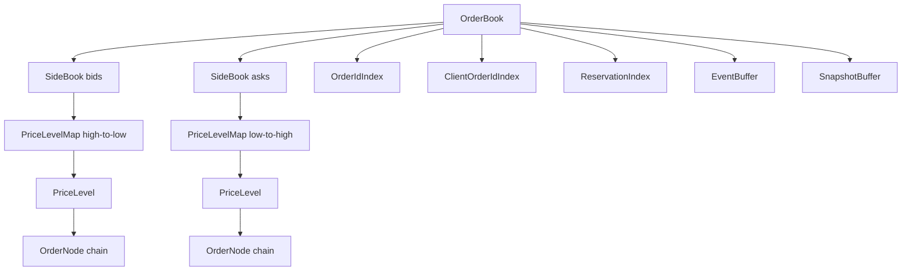

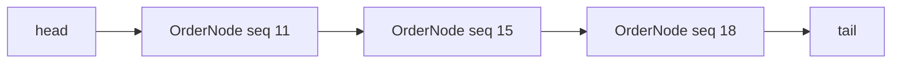

```mermaid
graph TD
    Cmd[Cancel order_id] --> Idx[OrderIdIndex]
    Idx --> Handle[OrderHandle]
    Handle --> Node[OrderNode]
    Node --> Level[PriceLevel]
    Level --> Unlink[O(1) unlink]
```

### Tradeoff Summary

| Choice | Advantage | Cost | Deterministic rule |
|---|---|---|---|
| `BTreeMap` | canonical ordered traversal | `O(log P)` | safe default |
| custom ladder | fast bounded best-price lookup | more complex sparse handling | allowed only with canonical slot order |
| `VecDeque` | simple FIFO | middle cancel can scan | avoid for active cancel-heavy books |
| intrusive list | `O(1)` unlink | handle safety complexity | preferred for matching core |
| arena pool | stable handles and locality | capacity management | preferred hot path |
| heap allocation | easy implementation | latency jitter | forbidden in steady-state matching |

## Chapter 3: Limit Order Matching Algorithm

### 1. Purpose

Specify deterministic processing of buy and sell limit orders, including crossing, fills, resting remainders, fee and clearing hooks, reservation consumption and release, and event construction.

### 2. Scope

Covers plain Good-Till-Cancel limit orders. IOC, FOK, post-only, and reduce-only modifiers are specified in Chapter 5.

### 3. Non-Goals

- Market order matching.
- Cross-book routing.
- External clearing settlement.
- Fee schedule design beyond deterministic hook invocation.

### 4. Algorithmic Requirements

- Buy limit crosses asks when `best_ask <= buy_limit_price`.
- Sell limit crosses bids when `best_bid >= sell_limit_price`.
- Match best price first, FIFO within price.
- Execution price is resting maker order price.
- Partial fills reduce remaining quantities with checked subtraction.
- Remainder rests only if order policy permits.
- Maker/taker roles are explicit in each fill event.
- Risk hold is consumed for executed notional and released for unfilled non-resting quantity.

### 5. Inputs

- `LimitOrderCommand` with side, price, quantity, account, order ids, reservation id, and flags.
- `OrderBook` state.
- Instrument config.

### 6. Outputs

- `OrderAccepted`, `TradeExecuted`, `OrderRested`, `OrderFilled`, `OrderPartiallyFilled`, `OrderRejected`, and reservation events as applicable.

### 7. Data Structures Used

`OrderBook`, `SideBook`, `PriceLevel`, `OrderNode`, `ReservationIndex`, `EventBuffer`, fee calculator hook, and clearing delta hook.

### 8. Preconditions

- Price aligns to tick.
- Quantity aligns to lot and is positive.
- Reservation covers maximum required exposure.
- Client order id is not conflicting.

### 9. Postconditions

- No crossed book remains after command completion.
- Incoming quantity equals filled plus rested plus canceled/rejected quantity.
- Fully filled maker nodes are removed from indexes and pools.
- Remainder, if rested, is indexed and linked at tail.

### 10. Invariants

- Execution price never equals incoming price unless resting price equals incoming price.
- FIFO within a price level is never skipped.
- Book totals match node sums after each command.
- Fee and clearing deltas are derived from fill quantity and execution price using fixed-point math.

### 11. Step-by-Step Algorithm

1. Reserve `seq` for the command.
2. Validate tick, lot, side, price bands, and reservation.
3. Emit deterministic acceptance or rejection event.
4. For buy, iterate asks from lowest price while `ask_price <= limit_price` and incoming remains.
5. For sell, iterate bids from highest price while `bid_price >= limit_price` and incoming remains.
6. At each maker head, execute `min(incoming_remaining, maker_remaining)`.
7. Calculate notional, fee hook result, clearing delta hook result, and reservation consumption.
8. Emit trade event before unlinking the maker from externally visible indexes.
9. If maker remaining is zero, unlink and remove maker indexes.
10. If incoming remains and can rest, append to own side at tail.
11. Release unused holds not backing fills or resting exposure.
12. Validate post-match invariants.

### 12. Rust-Style Pseudocode

```rust
fn process_limit_order(book: &mut OrderBook, cmd: LimitOrderCommand) -> ApplyResult {
    if !valid_tick(cmd.price) { return reject(book, cmd, RejectReason::InvalidTick); }
    if !valid_lot(cmd.qty) { return reject(book, cmd, RejectReason::InvalidLot); }
    if !book.reservations.covers_limit(&cmd) {
        return reject(book, cmd, RejectReason::InsufficientReservation);
    }

    let mut incoming = IncomingOrder::from_limit(cmd);
    book.events.push_accept(incoming.order_id);

    match incoming.side {
        Side::Buy => match_buy_limit(book, &mut incoming),
        Side::Sell => match_sell_limit(book, &mut incoming),
    }?;

    if incoming.remaining_qty > Qty::ZERO {
        rest_remaining(book, incoming)?;
    } else {
        book.events.push_filled(incoming.order_id);
    }

    validate_book_invariants(book)?;
    ApplyResult::accepted()
}

fn match_buy_limit(book: &mut OrderBook, incoming: &mut IncomingOrder) -> Result<(), BookError> {
    while incoming.remaining_qty > Qty::ZERO {
        let Some(best_ask) = book.asks.best_price() else { break; };
        if !can_cross(Side::Buy, incoming.limit_price, best_ask) { break; }
        consume_best_level(book, Side::Buy, incoming)?;
    }
    Ok(())
}

fn match_sell_limit(book: &mut OrderBook, incoming: &mut IncomingOrder) -> Result<(), BookError> {
    while incoming.remaining_qty > Qty::ZERO {
        let Some(best_bid) = book.bids.best_price() else { break; };
        if !can_cross(Side::Sell, incoming.limit_price, best_bid) { break; }
        consume_best_level(book, Side::Sell, incoming)?;
    }
    Ok(())
}

fn can_cross(side: Side, incoming_limit: Price, resting_price: Price) -> bool {
    match side {
        Side::Buy => resting_price <= incoming_limit,
        Side::Sell => resting_price >= incoming_limit,
    }
}

fn execute_trade(book: &mut OrderBook, incoming: &mut IncomingOrder, maker: OrderHandle) -> Result<(), BookError> {
    let maker_node = book.order_pool.get_mut(maker);
    let fill_qty = incoming.remaining_qty.min(maker_node.remaining_qty);
    let exec_price = maker_node.price;
    let notional = checked_mul_price_qty(exec_price, fill_qty)?;
    let fees = book.fee_hook.calculate(incoming.account_id, maker_node.account_id, notional, fill_qty)?;
    let clearing = book.clearing_hook.delta(incoming, maker_node, exec_price, fill_qty)?;

    book.reservations.consume_for_fill(incoming.reservation_id, notional)?;
    incoming.remaining_qty = incoming.remaining_qty.checked_sub(fill_qty)?;
    maker_node.remaining_qty = maker_node.remaining_qty.checked_sub(fill_qty)?;

    book.events.push_trade(TradeEvent {
        taker_order_id: incoming.order_id,
        maker_order_id: maker_node.order_id,
        price: exec_price,
        qty: fill_qty,
        maker_account: maker_node.account_id,
        taker_account: incoming.account_id,
        fees,
        clearing,
    });

    if maker_node.remaining_qty == Qty::ZERO {
        unlink_filled_maker(book, maker)?;
    }
    Ok(())
}

fn rest_remaining(book: &mut OrderBook, incoming: IncomingOrder) -> Result<(), BookError> {
    let resting = RestingOrder::from_incoming(incoming);
    append_resting_order(book, resting)?;
    book.events.push_rested(resting.order_id, resting.price, resting.remaining_qty);
    Ok(())
}

fn validate_book_invariants(book: &OrderBook) -> Result<(), BookError> {
    ensure_indexes_match_live_nodes(book)?;
    ensure_no_empty_levels(book)?;
    ensure_not_crossed(book)?;
    Ok(())
}
```

### 13. Complexity Analysis

`O(log P + F)` for best-level discovery and `F` fills when the best price pointer is maintained; `O(L log P + F)` if each emptied level removal requires tree operations across `L` levels.

### 14. Edge Cases

- Incoming exactly fills maker: maker removed, incoming continues only if quantity remains.
- Incoming partially fills maker: maker remains at head with reduced quantity.
- Incoming partially fills and rests: incoming node appended at its limit price.
- Same account on both sides: defer to self-trade prevention policy before trade execution.
- Fee overflow: reject before mutation if detected in preflight; fatal if detected after mutation path assumptions fail.

### 15. Failure Modes

- Invalid tick: emit rejection and do not mutate book.
- Insufficient reservation: emit rejection and do not mutate book.
- Pool exhaustion for resting remainder: if possible preflight before matching; otherwise require policy to cancel remainder rather than roll back fills.
- Invariant failure: halt book and require replay.

### 16. Determinism Considerations

Best-price traversal is side-defined. FIFO is the linked-list order. Execution price is always maker price. Fee and clearing hooks must be pure functions of event inputs and immutable configuration.

### 17. Replay Considerations

Replay applies the same command at the same `BookSeq` and must produce the same trade sequence. Event payloads include maker order id, taker order id, fill quantity, execution price, fees, clearing deltas, and reservation deltas so replay can verify rather than infer externally.

### 18. Performance Considerations

- Preflight rest allocation capacity before matching if rollback is not supported.
- Use mutable handles to head maker nodes.
- Remove empty levels immediately after head chain empties.
- Avoid constructing heap `Vec<Fill>`; write events into preallocated event batch.

### 19. Test Cases

1. Buy limit crosses one ask: ask 100 qty 5, buy 101 qty 5 yields one fill at 100 and removes ask.
2. Buy limit crosses multiple asks: asks 100 qty 2 and 101 qty 3, buy 101 qty 5 fills in price order.
3. Sell limit partially fills: bid 99 qty 10, sell 99 qty 4 leaves bid qty 6.
4. Non-marketable limit rests: best ask 105, buy 100 qty 7 rests at bid 100.
5. Tick rejection: buy price not divisible by tick emits invalid tick rejection.
6. Insufficient reservation: buy notional exceeds quote hold emits insufficient reservation rejection.

### 20. Property-Based Tests

- Fill conservation: incoming original equals filled plus rested plus canceled.
- Price priority: no worse price fills before better price.
- FIFO priority: for equal prices, lower resting sequence fills first.
- No crossed book after any accepted limit order.
- Replay hash equality for randomly generated valid limit streams.

### 21. Acceptance Criteria

- Pseudocode maps to Rust without hidden global state.
- Maker/taker role is explicit in trade events.
- Reservation consume/release is event-backed.
- Post-match invariants run in tests and debug builds.

### 22. Codex Implementation Contract

Do not sort matched orders after collection. Match in traversal order and emit events immediately into a preallocated batch. Do not use floats for notional or fee. Do not rest an order before all marketable quantity is consumed.

### 23. Review Checklist

- [ ] Buy crossing uses `ask <= limit`.
- [ ] Sell crossing uses `bid >= limit`.
- [ ] Execution price is maker price.
- [ ] Full and partial fills update indexes correctly.
- [ ] Resting remainder is tail-appended.
- [ ] Invalid tick and reservation rejection do not mutate book.

## Chapter 4: Market Order Matching Algorithm

### 1. Purpose

Specify deterministic market order execution against available liquidity with price protection, slippage guards, quote budget handling, and no resting market orders.

### 2. Scope

Covers market buys and market sells. Market order unfilled quantity expires with IOC-like semantics.

### 3. Non-Goals

- Synthetic market-to-limit order types.
- External smart order routing.
- Hidden liquidity.

### 4. Algorithmic Requirements

- Market buy consumes asks from lowest to highest price.
- Market sell consumes bids from highest to lowest price.
- Empty opposite side rejects before mutation.
- Price protection caps executable prices.
- Unfilled quantity never rests.
- Market buy must respect quote budget and risk pre-reservation.
- Traversal is deterministic and bounded by liquidity, quantity, quote budget, or protection price.

### 5. Inputs

- `MarketOrderCommand` with side, quantity or quote budget, account, reservation id, and protection parameters.
- Opposite side book state.
- Instrument config.

### 6. Outputs

- Acceptance/rejection event.
- Trade events.
- Expire/cancel remainder event.
- Reservation consume/release events.

### 7. Data Structures Used

`OrderBook`, opposite `SideBook`, `PriceLevel`, `OrderNode`, `ReservationIndex`, `EventBuffer`, fee hook, clearing hook.

### 8. Preconditions

- Quantity or quote budget is positive and lot-aligned where applicable.
- Market buy quote reservation exists.
- Price protection limit is derived before matching using deterministic input metadata and config.

### 9. Postconditions

- Market order has no resting node.
- Filled plus expired equals original base quantity, or consumed quote plus released quote equals reserved quote budget.
- Opposite side remains ordered and index-consistent.

### 10. Invariants

- A market buy never executes above protection price.
- A market sell never executes below protection price.
- Quote budget is never negative.
- Fully consumed maker nodes are removed.

### 11. Step-by-Step Algorithm

1. Validate market order quantity, budget, reservation, and protection fields.
2. If opposite side is empty, reject without mutation.
3. Emit acceptance event.
4. Traverse best opposite prices deterministically.
5. Stop when quantity is filled, budget is exhausted, protection would be breached, or liquidity ends.
6. For each maker head, compute max fill constrained by remaining quantity and quote budget.
7. Execute trade at maker price; consume reservation; emit fee and clearing deltas.
8. Remove filled makers and empty levels.
9. Expire any unfilled market quantity and release unused hold.
10. Validate invariants.

### 12. Rust-Style Pseudocode

```rust
fn process_market_order(book: &mut OrderBook, cmd: MarketOrderCommand) -> ApplyResult {
    if opposite_side(book, cmd.side).is_empty() {
        return reject(book, cmd, RejectReason::NoLiquidity);
    }
    enforce_market_preconditions(book, &cmd)?;
    let mut incoming = IncomingMarket::from(cmd);
    book.events.push_accept(incoming.order_id);

    match incoming.side {
        Side::Buy => match_market_buy(book, &mut incoming)?,
        Side::Sell => match_market_sell(book, &mut incoming)?,
    }

    finalize_market_result(book, incoming)?;
    validate_book_invariants(book)?;
    ApplyResult::accepted()
}

fn match_market_buy(book: &mut OrderBook, incoming: &mut IncomingMarket) -> Result<(), BookError> {
    while incoming.remaining_qty > Qty::ZERO {
        let Some(best_ask) = book.asks.best_price() else { break; };
        if !enforce_price_protection(Side::Buy, best_ask, incoming.protection_price) { break; }
        if incoming.remaining_quote_budget == QuoteQty::ZERO { break; }
        consume_liquidity(book, incoming, best_ask)?;
    }
    Ok(())
}

fn match_market_sell(book: &mut OrderBook, incoming: &mut IncomingMarket) -> Result<(), BookError> {
    while incoming.remaining_qty > Qty::ZERO {
        let Some(best_bid) = book.bids.best_price() else { break; };
        if !enforce_price_protection(Side::Sell, best_bid, incoming.protection_price) { break; }
        consume_liquidity(book, incoming, best_bid)?;
    }
    Ok(())
}

fn enforce_price_protection(side: Side, price: Price, protection: Price) -> bool {
    match side {
        Side::Buy => price <= protection,
        Side::Sell => price >= protection,
    }
}

fn consume_liquidity(book: &mut OrderBook, incoming: &mut IncomingMarket, price: Price) -> Result<(), BookError> {
    let maker = book.opposite_head(incoming.side, price).ok_or(BookError::Invariant)?;
    let maker_remaining = book.order_pool[maker].remaining_qty;
    let mut fill_qty = incoming.remaining_qty.min(maker_remaining);

    if incoming.side == Side::Buy {
        fill_qty = cap_by_quote_budget(fill_qty, price, incoming.remaining_quote_budget)?;
        if fill_qty == Qty::ZERO { return Ok(()); }
    }

    execute_trade(book, incoming.as_limit_like(), maker)?;
    if incoming.side == Side::Buy {
        let notional = checked_mul_price_qty(price, fill_qty)?;
        incoming.remaining_quote_budget = incoming.remaining_quote_budget.checked_sub(notional)?;
    }
    Ok(())
}

fn finalize_market_result(book: &mut OrderBook, incoming: IncomingMarket) -> Result<(), BookError> {
    if incoming.filled_qty == Qty::ZERO {
        book.events.push_expired(incoming.order_id, incoming.remaining_qty, ExpireReason::NoExecutableLiquidity);
    } else if incoming.remaining_qty > Qty::ZERO {
        book.events.push_expired(incoming.order_id, incoming.remaining_qty, ExpireReason::MarketRemainder);
    } else {
        book.events.push_filled(incoming.order_id);
    }
    book.reservations.release_unused(incoming.reservation_id)?;
    Ok(())
}
```

### 13. Complexity Analysis

`O(L + F)` where `L` is consumed price levels and `F` is maker fills. Empty-book rejection is `O(1)`.

### 14. Edge Cases

- Empty opposite book: reject.
- Quantity remains after liquidity exhausted: expire remainder.
- Protection price blocks best level: expire without trade if no prior fill, or partial-fill then expire.
- Quote budget cannot buy one lot at best ask: expire remainder and release budget.
- Maker fee rebate or taker fee changes quote budget only through deterministic fee policy, not floating math.

### 15. Failure Modes

- Quote budget underflow: reject before mutation if detected in preflight; otherwise invariant failure.
- Protection price invalid for side: reject.
- Liquidity disappears cannot happen inside single writer; if replay differs, hash mismatch identifies divergence.

### 16. Determinism Considerations

Market orders do not use arrival wall-clock time for slippage. Protection values are command fields or deterministic config outputs. Best-price traversal is canonical.

### 17. Replay Considerations

Replay must reproduce stop conditions: no liquidity, protection breach, exhausted quote budget, or filled quantity. Expire reason is included in events to avoid ambiguity.

### 18. Performance Considerations

- Keep quote budget as raw integer quote units.
- Avoid scanning beyond protection limit.
- Avoid precomputing full available liquidity unless required by FOK; market orders can consume incrementally.

### 19. Test Cases

1. Market buy fully fills against ask levels until requested quantity is zero.
2. Market sell partially fills when bid liquidity is insufficient and expires remainder.
3. Empty book market order rejects with no mutation.
4. Market buy stops before ask above protection limit and expires remainder.
5. Market buy quote budget exhausted at best ask and releases unused reservation dust.

### 20. Property-Based Tests

- Market orders never create resting orders.
- Executions never breach protection price.
- Quote budget never goes negative.
- Fill sequence follows best price then FIFO.
- Replay of market streams produces identical expire reasons.

### 21. Acceptance Criteria

- Empty-book rejection occurs before mutation.
- No market remainder rests.
- Protection and budget stop conditions are tested.
- Reservation release is explicit.

### 22. Codex Implementation Contract

Do not convert market orders to limit orders unless an explicit market-to-limit type is later specified. Do not scan unordered indexes. Do not use floating slippage percentages in the hot path; convert protection bands to fixed-point prices before matching.

### 23. Review Checklist

- [ ] Market buy traverses asks ascending.
- [ ] Market sell traverses bids descending.
- [ ] No liquidity rejection is deterministic.
- [ ] Quote budget caps fill quantity.
- [ ] Remainder expires, never rests.

## Chapter 5: IOC, FOK, Post-Only, Reduce-Only Algorithms

### 1. Purpose

Specify deterministic behavior for common order modifiers and constraints: immediate-or-cancel, fill-or-kill, post-only, and reduce-only.

### 2. Scope

Applies to limit-compatible order commands and futures reduce-only constraints. Market IOC-like behavior is covered in Chapter 4.

### 3. Non-Goals

- Stop orders.
- Iceberg orders.
- Pegged orders.
- Liquidation engine implementation beyond reduce-only interaction rules.

### 4. Algorithmic Requirements

- IOC matches immediately and cancels unfilled remainder.
- FOK pre-checks full fill feasibility before mutation.
- Post-only must not take liquidity; policy is deterministic reject or reprice.
- Reduce-only must not increase exposure.
- All modifier interactions have explicit precedence.

### 5. Inputs

- Order command with time-in-force and flags.
- Current book state.
- Position snapshot for reduce-only.
- Reservation records.
- Instrument policy config.

### 6. Outputs

- Accepted, rejected, trade, expired/canceled remainder, repriced, reservation consume/release, and reduce-only rejection events.

### 7. Data Structures Used

`OrderBook`, `SideBook`, `ReservationIndex`, position cache, event buffer, price protection helpers, limit matching helpers.

### 8. Preconditions

- Modifier combination is valid for instrument type.
- Reduce-only position snapshot is book-local deterministic input.
- FOK scan bound is configured.
- Post-only policy is fixed per instrument.

### 9. Postconditions

- IOC has no resting remainder.
- FOK either fully fills or performs no book mutation.
- Post-only rests or rejects/reprices without taking liquidity.
- Reduce-only resulting exposure magnitude is not increased.

### 10. Invariants

- FOK feasibility scan does not mutate state.
- IOC partial fills preserve price-time priority.
- Post-only never emits trade events unless policy is violated, which must be impossible.
- Reduce-only fill quantity is capped by open reducible position.

### 11. Step-by-Step Algorithm

1. Validate modifier combination using deterministic precedence.
2. For reduce-only, compute allowed side and max reducible quantity from position state.
3. For post-only, check crossing before matching.
4. For FOK, scan deterministic liquidity and budget to prove full fill.
5. For IOC, execute normal limit matching but cancel remainder instead of resting.
6. Emit explicit hold release for any unfilled or disallowed quantity.
7. Validate invariants.

### 12. Rust-Style Pseudocode

```rust
fn process_ioc(book: &mut OrderBook, cmd: LimitOrderCommand) -> ApplyResult {
    let mut incoming = IncomingOrder::from_limit(cmd);
    book.events.push_accept(incoming.order_id);
    match incoming.side {
        Side::Buy => match_buy_limit(book, &mut incoming)?,
        Side::Sell => match_sell_limit(book, &mut incoming)?,
    }
    if incoming.remaining_qty > Qty::ZERO {
        book.events.push_expired(incoming.order_id, incoming.remaining_qty, ExpireReason::IocRemainder);
        book.reservations.release_unfilled(incoming.reservation_id, incoming.remaining_qty)?;
    }
    validate_book_invariants(book)?;
    ApplyResult::accepted()
}

fn process_fok(book: &mut OrderBook, cmd: LimitOrderCommand) -> ApplyResult {
    if !can_fully_fill(book, &cmd)? {
        book.events.push_rejected(cmd.order_id, RejectReason::FokNotFillable);
        book.reservations.release_all(cmd.reservation_id)?;
        return ApplyResult::rejected();
    }
    let mut full = cmd;
    full.time_in_force = TimeInForce::ImmediateOrCancel;
    process_ioc(book, full)
}

fn can_fully_fill(book: &OrderBook, cmd: &LimitOrderCommand) -> Result<bool, BookError> {
    let mut remaining = cmd.qty;
    let mut quote_budget = book.reservations.available_quote(cmd.reservation_id);
    for level in book.opposite_levels_until(cmd.side, cmd.price) {
        for maker in level.fifo_iter() {
            let fill_qty = remaining.min(maker.remaining_qty);
            if cmd.side == Side::Buy {
                let notional = checked_mul_price_qty(level.price, fill_qty)?;
                if notional > quote_budget { return Ok(false); }
                quote_budget = quote_budget.checked_sub(notional)?;
            }
            remaining = remaining.checked_sub(fill_qty)?;
            if remaining == Qty::ZERO { return Ok(true); }
        }
    }
    Ok(false)
}

fn process_post_only(book: &mut OrderBook, cmd: LimitOrderCommand) -> ApplyResult {
    let crosses = match cmd.side {
        Side::Buy => book.asks.best_price().is_some_and(|p| p <= cmd.price),
        Side::Sell => book.bids.best_price().is_some_and(|p| p >= cmd.price),
    };
    if crosses {
        return match book.config.post_only_policy {
            PostOnlyPolicy::Reject => reject(book, cmd, RejectReason::PostOnlyWouldTake),
            PostOnlyPolicy::Reprice => {
                let repriced = reprice_to_non_crossing(book, cmd)?;
                rest_post_only(book, repriced)
            }
        };
    }
    rest_post_only(book, cmd)
}

fn process_reduce_only(book: &mut OrderBook, cmd: LimitOrderCommand, pos: Position) -> ApplyResult {
    if !reduce_only_allowed(cmd.side, cmd.qty, pos) {
        return reject(book, cmd, RejectReason::ReduceOnlyWouldIncrease);
    }
    let max_qty = reducible_qty(cmd.side, pos);
    let capped = cmd.with_qty(cmd.qty.min(max_qty));
    if capped.qty == Qty::ZERO {
        return reject(book, cmd, RejectReason::NoOpenPosition);
    }
    process_limit_order(book, capped)
}

fn reduce_only_allowed(side: Side, qty: Qty, pos: Position) -> bool {
    match (side, pos.direction()) {
        (Side::Sell, PositionDirection::Long) => pos.abs_qty() > Qty::ZERO && qty <= pos.abs_qty(),
        (Side::Buy, PositionDirection::Short) => pos.abs_qty() > Qty::ZERO && qty <= pos.abs_qty(),
        _ => false,
    }
}
```

### 13. Complexity Analysis

- IOC: same as limit matching, `O(L + F)`.
- FOK feasibility: `O(L + N_scan)` without mutation; execution repeats the scan, so worst case `2 * O(L + F)`.
- Post-only check: `O(1)` best-price lookup plus rest insertion.
- Reduce-only check: `O(1)` position read plus normal processing.

### 14. Edge Cases

- IOC with no crossing: accept then expire full quantity or reject by venue policy; HermesNet default is accept and expire with hold release.
- FOK with enough base but insufficient quote budget: reject before mutation.
- FOK scan hits configured max scan: reject with `FokScanLimitExceeded`.
- Post-only buy at best ask: reject or reprice one tick below best ask based on policy.
- Reduce-only order larger than position: cap or reject based on instrument policy; default is cap to reducible quantity with event annotation.
- Reduce-only during liquidation: liquidation commands may have priority; reduce-only user orders cannot increase exposure and may be canceled if liquidation state locks the position.

### 15. Failure Modes

- Position cache missing for reduce-only futures: reject `PositionUnavailable`.
- Reprice would violate tick or price band: reject.
- FOK precheck and execution diverge: invariant failure because single writer should prevent intervening mutation.

### 16. Determinism Considerations

FOK feasibility uses the same traversal order as matching but does not mutate. Post-only reprice uses integer tick arithmetic. Reduce-only uses a sequence-consistent position snapshot supplied to the Book Core.

### 17. Replay Considerations

Modifier decisions are evented: FOK not fillable, IOC remainder expired, post-only repriced/rejected, reduce-only capped/rejected. Replay verifies that the same branch is taken at the same sequence.

### 18. Performance Considerations

FOK doubles traversal cost; apply a deterministic scan bound. IOC should reuse limit matching with a no-rest finalizer. Post-only is cheap because it reads only best opposite price.

### 19. Test Cases

- IOC partially fills and expires remainder with hold release.
- IOC no liquidity expires full quantity.
- FOK fully fillable executes all requested quantity.
- FOK not fully fillable emits no trades and no book mutation.
- Post-only marketable order rejects under reject policy.
- Post-only marketable order reprices under reprice policy without crossing.
- Reduce-only sell reduces long position.
- Reduce-only sell with short position rejects.
- Reduce-only order larger than position caps or rejects per policy.

### 20. Property-Based Tests

- FOK rejection never changes book state hash.
- IOC never leaves a resting order.
- Post-only never emits a trade event.
- Reduce-only never increases absolute exposure.
- Modifier replay produces identical branch events.

### 21. Acceptance Criteria

- State impact table is encoded in tests.
- FOK uses pre-mutation feasibility scan.
- Hold release semantics are explicit for every non-resting remainder.
- Reduce-only behavior is futures-aware.

### 22. Codex Implementation Contract

Do not implement FOK by executing and rolling back. Do not allow post-only to take liquidity. Do not read live positions from an external database in the hot path. Use a deterministic position cache input.

### 23. Review Checklist

- [ ] IOC remainder expires and releases hold.
- [ ] FOK rejection has zero fills.
- [ ] Post-only crossing branch follows configured policy.
- [ ] Reduce-only rejects no-position orders.
- [ ] Liquidation interaction is explicitly evented.

### State Impact Tables

| Modifier | Resting allowed? | Partial fill allowed? | Immediate reject? | Hold release? | EngineEvent type |
|---|---:|---:|---:|---:|---|
| IOC | No | Yes | Only validation failure | Unfilled remainder | `OrderExpired(IocRemainder)` |
| FOK | No unless fully executed immediately | No | Yes if full fill impossible | Full hold on reject | `OrderRejected(FokNotFillable)` |
| Post-Only Reject | Yes only if non-marketable | No immediate trade | Yes if would take | Full hold on reject | `OrderRejected(PostOnlyWouldTake)` |
| Post-Only Reprice | Yes at non-crossing price | No immediate trade | Yes if reprice invalid | Released if rejected | `OrderRepriced`, `OrderRested` |
| Reduce-Only | Yes if still reducing | Yes up to reducible qty | Yes if no reducible position | Disallowed qty | `OrderRejected` or `OrderQtyCapped` |

## Chapter 6: Cancel and Replace Algorithms

### 1. Purpose

Provide implementation-ready deterministic cancel and replace algorithms for a single-writer Book Core using book-local ordering, fixed-point arithmetic, immutable hash-chained `EngineEvent`s, and event append before externally visible success.

### 2. Scope

Covers all required hot-path behavior for this chapter, including validation, state mutation, event semantics, risk hold consume/release, idempotent retries, deterministic replay, bounded loops, and bounded memory.

### 3. Non-Goals

No global sequencing, database/Kafka/cloud dependency in the hot path, floating point decisions, locks inside matching, heap allocation in steady-state matching, or wall-clock dependency for matching decisions.

### 4. Algorithmic Requirements

- Commands execute in book-local sequence order.
- State changes are made only by the Book Core.
- Risk changes use exact fixed-point integer deltas.
- Every success appends immutable events first.
- Duplicate `client_order_id` or request retries return the prior result without repeating mutation.
- Loops are bounded by configured batch limits.

### 5. Inputs

Book-local command snapshots, order identifiers, client order identifiers, user/account/instrument identifiers, product filters, immutable owner/risk snapshots, reservation records, and the previous event hash.

### 6. Outputs

Deterministic result enums, updated in-memory book/risk state, and `EngineEvent`s describing each accepted, rejected, consumed, released, canceled, replaced, prevented, or reconciled transition.

### 7. Data Structures Used

Preallocated order arena, intrusive price-level queues, order-id index, `(user_id, client_order_id)` index, per-user live lists, reservation records, fixed-size idempotency cache, and append-only event buffer.

### 8. Preconditions

The command is authenticated, routed to the correct Book Core, statically validated, and has access to sequence-stable product/risk/ownership snapshots. Event buffer capacity is checked before mutation.

### 9. Postconditions

Book indexes, risk reservations, and idempotency records reflect exactly the appended events. Terminal orders are immutable. Replay from the event log reconstructs the same state hash.

### 10. Invariants

| Invariant | Requirement |
|---|---|
| Book-local order | Fill/cancel/replace/risk decisions follow one book sequence. |
| Event-before-success | Client success is returned only after append. |
| Hold conservation | `reserved = consumed + released + remaining`. |
| Fixed-point math | All values are checked integers. |
| Idempotency | Duplicate retries do not double reserve, consume, release, or cancel. |

### 11. Step-by-Step Algorithm

1. Check idempotency cache.
2. Resolve by `order_id` or `(user_id, client_order_id)`.
3. Reject not found or terminal orders deterministically.
4. Sequence races with fills by Book Core order: earlier fill changes leaves before cancel/replace observes state.
5. Cancel unlinks live order from price, user, and client live indexes; releases remaining hold; appends `HoldReleased` and `OrderCanceled`.
6. Cancel-all for user, user+instrument, disconnect, logout, halt, or suspension iterates deterministic live lists up to batch limit.
7. Replace validates tick, lot, ownership, remaining quantity, reduce-only, and reservation.
8. Quantity reduction only amends in place, releases excess hold, and preserves priority.
9. Price change or quantity increase reserves extra hold first, unlinks/reinserts at tail, and loses priority.
10. Invalid replace appends `OrderReplaceRejected` with no book mutation.

### 12. Rust-Style Pseudocode

```rust
fn process_cancel(core: &mut BookCore, cmd: CancelCommand) -> CancelResult {
    if let Some(r) = core.idem.cancel(cmd.request_id) { return r; }
    let Some(r) = core.by_order_id.get(cmd.order_id) else { return emit_cancel_reject(core, cmd, CancelReject::OrderNotFound); };
    cancel_live_ref(core, r, cmd.reason, cmd.request_id)
}
fn process_cancel_by_client_order_id(core: &mut BookCore, cmd: CancelCommand) -> CancelResult {
    match core.by_client_id.lookup(cmd.user_id, cmd.client_order_id) {
        ClientLookup::Live(r) => cancel_live_ref(core, r, cmd.reason, cmd.request_id),
        ClientLookup::Terminal(x) => x.as_cancel_duplicate(),
        ClientLookup::Missing => emit_cancel_reject(core, cmd, CancelReject::OrderNotFound),
    }
}
fn cancel_all_for_user(core: &mut BookCore, user: UserId, reason: CancelReason) -> CancelAllResult {
    let mut n = 0;
    while n < core.cfg.cancel_batch {
        let Some(r) = core.user_live.pop_front(user) else { break; };
        if core.orders[r].is_live() { let _ = cancel_live_ref(core, r, reason, RequestId::derived(user, core.orders[r].order_id, reason)); n += 1; }
    }
    CancelAllResult { canceled: n, continuation: core.user_live.has_live(user) }
}
fn cancel_all_for_user_book(core: &mut BookCore, user: UserId, book: InstrumentId, reason: CancelReason) -> CancelAllResult {
    let mut n = 0;
    while n < core.cfg.cancel_batch {
        let Some(r) = core.user_book_live.pop_front(user, book) else { break; };
        if core.orders[r].is_live() { let _ = cancel_live_ref(core, r, reason, RequestId::derived(user, core.orders[r].order_id, reason)); n += 1; }
    }
    CancelAllResult { canceled: n, continuation: core.user_book_live.has_live(user, book) }
}
fn process_replace(core: &mut BookCore, cmd: ReplaceCommand) -> ReplaceResult {
    if let Some(r) = core.idem.replace(cmd.request_id) { return r; }
    let Some(r) = core.by_order_id.get(cmd.order_id) else { return emit_replace_reject(core, cmd, ReplaceReject::OrderNotFound); };
    match validate_replace(core, r, &cmd) {
        ReplaceDecision::Reduce { leaves } => amend_reducing_quantity(core, r, cmd, leaves),
        ReplaceDecision::CancelNew { price, qty, extra } => replace_price_or_increase_qty(core, r, cmd, price, qty, extra),
        ReplaceDecision::Reject(e) => emit_replace_reject(core, cmd, e),
    }
}
fn validate_replace(core: &BookCore, r: OrderRef, cmd: &ReplaceCommand) -> ReplaceDecision {
    let o = &core.orders[r];
    if !o.is_live() { return ReplaceDecision::Reject(ReplaceReject::AlreadyTerminal); }
    if !core.filters.valid_tick(cmd.new_price) { return ReplaceDecision::Reject(ReplaceReject::InvalidTick); }
    if !core.filters.valid_lot(cmd.new_qty) || cmd.new_qty <= o.cum_filled { return ReplaceDecision::Reject(ReplaceReject::InvalidQty); }
    let leaves = cmd.new_qty - o.cum_filled;
    if cmd.reduce_only && leaves > o.leaves_qty { return ReplaceDecision::Reject(ReplaceReject::ReduceOnlyIncrease); }
    if cmd.new_price == o.price && leaves <= o.leaves_qty { return ReplaceDecision::Reduce { leaves }; }
    let extra = core.risk.extra_required(o, cmd.new_price, leaves);
    if !core.risk.can_reserve(o.account_id, extra) { return ReplaceDecision::Reject(ReplaceReject::InsufficientReservation); }
    ReplaceDecision::CancelNew { price: cmd.new_price, qty: cmd.new_qty, extra }
}
fn amend_reducing_quantity(core: &mut BookCore, r: OrderRef, cmd: ReplaceCommand, leaves: Qty) -> ReplaceResult {
    let release = core.risk.release_for_reduction(r, core.orders[r].leaves_qty - leaves);
    release_cancel_hold(core, r, release);
    core.orders[r].leaves_qty = leaves;
    emit_replace_event(core, r, cmd.request_id, PriorityEffect::Preserved)
}
fn replace_price_or_increase_qty(core: &mut BookCore, r: OrderRef, cmd: ReplaceCommand, p: Price, q: Qty, extra: Amount) -> ReplaceResult {
    core.risk.reserve_extra(r, extra); core.events.append_hold_reserved(r, extra);
    core.book.unlink(r); core.orders[r].price = p; core.orders[r].qty = q; core.orders[r].leaves_qty = q - core.orders[r].cum_filled;
    core.orders[r].priority_seq = core.next_priority_seq(); core.book.insert_tail(p, r);
    emit_replace_event(core, r, cmd.request_id, PriorityEffect::Lost)
}
fn release_cancel_hold(core: &mut BookCore, r: OrderRef, amount: Amount) { if amount > Amount::ZERO { core.risk.release(r, amount); core.events.append_hold_released(r, amount); } }
fn emit_cancel_event(core: &mut BookCore, r: OrderRef, req: RequestId, reason: CancelReason) -> CancelResult { core.events.append_order_canceled(r, reason); core.idem.store_cancel(req); CancelResult::Canceled }
fn emit_replace_event(core: &mut BookCore, r: OrderRef, req: RequestId, p: PriorityEffect) -> ReplaceResult { core.events.append_order_replaced(r, p); core.idem.store_replace(req); ReplaceResult::Accepted { priority: p } }
```

### Mermaid Diagrams

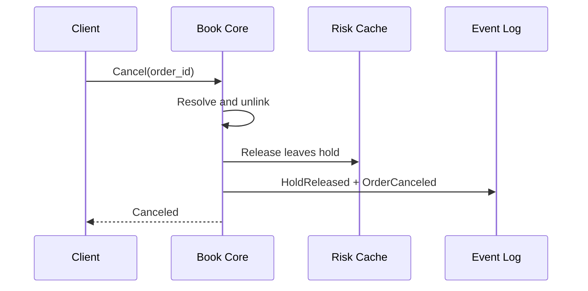
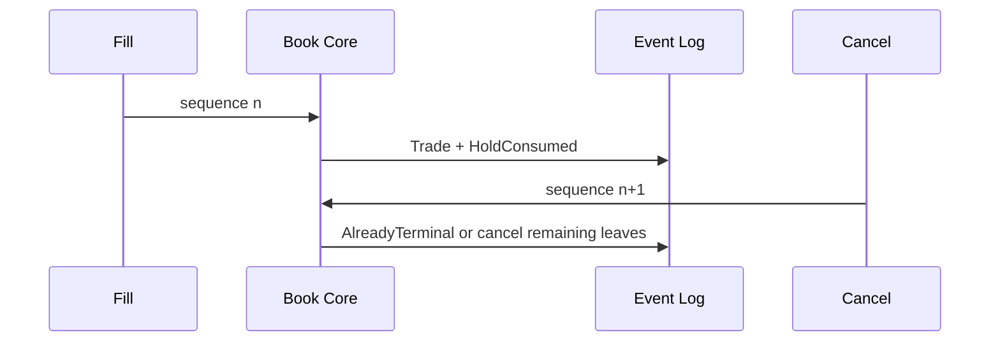
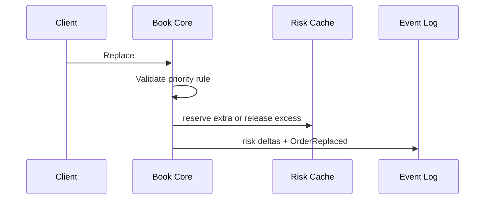
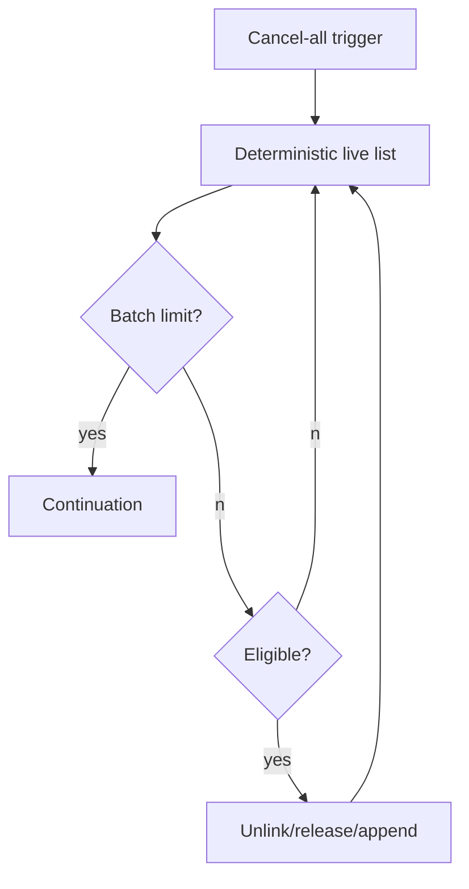

### 13. Complexity Analysis

Single cancel, in-place amend, and cancel-new replace are `O(1)`. Cancel-all is `O(k)` for bounded batch size `k`.

### 14. Edge Cases

Cancel resting, partially filled, already filled, unknown, duplicate, cancel/fill race, disconnect/logout/halt/suspension scoped cancels, lower-quantity priority preservation, price-change priority loss, quantity increase extra reservation, invalid tick rejection.

### 15. Failure Modes

Event capacity failure rejects before mutation. Risk corruption halts the book and recovers by replay. Insufficient extra reservation rejects replace without mutation.

### 16. Determinism Considerations

Cancel-all uses acceptance-sequence ordered intrusive lists. Fill/cancel/replace races are resolved only by book-local sequence.

### 17. Replay Considerations

Replay removes canceled orders, applies replace priority effects, and verifies hold releases against reconstructed reservations.

### 18. Performance Considerations

All common operations mutate preallocated indexes and intrusive nodes without locks or steady-state allocation.

### 19. Test Cases

1. Cancel resting order.
2. Cancel partially filled order.
3. Cancel already filled order rejects/idempotently returns final state.
4. Duplicate cancel returns same result.
5. Cancel/fill race resolves by book sequence.
6. Replace lower quantity preserves priority.
7. Replace price loses priority.
8. Replace quantity increase requires extra reservation.
9. Replace rejected due to tick size.
10. Cancel-on-halt cancels only eligible orders.

### 20. Property-Based Tests

Cancel is idempotent; released plus consumed plus remaining equals reserved; pure reductions preserve priority; price changes lose priority; replay hash matches live hash.

### 21. Acceptance Criteria

All cancel triggers, rejection reasons, hold release paths, replace priority rules, and idempotent retry paths are evented and tested.

### 22. Codex Implementation Contract

Implement book-local logic only; do not add global sequencing, hot-path external dependencies, floating point math, locks, or steady-state allocation.

### 23. Review Checklist

- [ ] Terminal orders do not release twice.
- [ ] Client-order-id lookup handles live and terminal records.
- [ ] Triggered cancels are scoped and bounded.
- [ ] Replace increase reserves before mutation.
- [ ] Replace reduction preserves priority.

## Chapter 7: Self-Trade Prevention Algorithms

### 1. Purpose

Provide implementation-ready deterministic self-trade prevention algorithms for a single-writer Book Core using book-local ordering, fixed-point arithmetic, immutable hash-chained `EngineEvent`s, and event append before externally visible success.

### 2. Scope

Covers all required hot-path behavior for this chapter, including validation, state mutation, event semantics, risk hold consume/release, idempotent retries, deterministic replay, bounded loops, and bounded memory.

### 3. Non-Goals

No global sequencing, database/Kafka/cloud dependency in the hot path, floating point decisions, locks inside matching, heap allocation in steady-state matching, or wall-clock dependency for matching decisions.

### 4. Algorithmic Requirements

- Commands execute in book-local sequence order.
- State changes are made only by the Book Core.
- Risk changes use exact fixed-point integer deltas.
- Every success appends immutable events first.
- Duplicate `client_order_id` or request retries return the prior result without repeating mutation.
- Loops are bounded by configured batch limits.

### 5. Inputs

Book-local command snapshots, order identifiers, client order identifiers, user/account/instrument identifiers, product filters, immutable owner/risk snapshots, reservation records, and the previous event hash.

### 6. Outputs

Deterministic result enums, updated in-memory book/risk state, and `EngineEvent`s describing each accepted, rejected, consumed, released, canceled, replaced, prevented, or reconciled transition.

### 7. Data Structures Used

Preallocated order arena, intrusive price-level queues, order-id index, `(user_id, client_order_id)` index, per-user live lists, reservation records, fixed-size idempotency cache, and append-only event buffer.

### 8. Preconditions

The command is authenticated, routed to the correct Book Core, statically validated, and has access to sequence-stable product/risk/ownership snapshots. Event buffer capacity is checked before mutation.

### 9. Postconditions

Book indexes, risk reservations, and idempotency records reflect exactly the appended events. Terminal orders are immutable. Replay from the event log reconstructs the same state hash.

### 10. Invariants

| Invariant | Requirement |
|---|---|
| Book-local order | Fill/cancel/replace/risk decisions follow one book sequence. |
| Event-before-success | Client success is returned only after append. |
| Hold conservation | `reserved = consumed + released + remaining`. |
| Fixed-point math | All values are checked integers. |
| Idempotency | Duplicate retries do not double reserve, consume, release, or cancel. |

### 11. Step-by-Step Algorithm

1. Compare taker and maker account, sub-account, beneficial owner, and market-maker group snapshots before trade construction.
2. If distinct, continue normal matching.
3. Resolve mode by precedence: liquidation override if configured, exchange-enforced mode, then client-configurable mode.
4. Post-only rejection/reprice happens before STP because no taking is allowed.
5. STP happens before reduce-only consumption, FOK/IOC accounting, trade event creation, fees, and clearing.
6. Apply Reject Taker, Cancel Maker, Cancel Both, Decrement and Cancel, or Allow and Flag.
7. Emit STP, order, risk release, and surveillance events as applicable.

Mode semantics: Reject Taker rejects incoming and releases taker hold; Cancel Maker removes resting order and releases maker hold; Cancel Both cancels both and releases both holds; Decrement and Cancel reduces both by `min(leaves)` with no trade/clearing and releases prevented holds; Allow and Flag executes normally, emits surveillance marker, and clears normally.

### 12. Rust-Style Pseudocode

```rust
fn detect_self_trade(t: &OrderView, m: &OrderView) -> bool {
    t.account_id == m.account_id || t.beneficial_owner_id == m.beneficial_owner_id ||
    (t.market_maker_group_id.is_some() && t.market_maker_group_id == m.market_maker_group_id)
}
fn resolve_stp(core: &mut BookCore, taker: OrderRef, maker: OrderRef) -> StpDecision {
    if !detect_self_trade(core.view(taker), core.view(maker)) { return StpDecision::Allow; }
    match core.stp.mode(core.view(taker), core.view(maker)) {
        StpMode::RejectTaker => apply_reject_taker(core, taker, maker),
        StpMode::CancelMaker => apply_cancel_maker(core, taker, maker),
        StpMode::CancelBoth => apply_cancel_both(core, taker, maker),
        StpMode::DecrementAndCancel => apply_decrement_and_cancel(core, taker, maker),
        StpMode::AllowAndFlag => { update_surveillance_marker(core, taker, maker); StpDecision::AllowFlagged }
    }
}
fn apply_reject_taker(core: &mut BookCore, t: OrderRef, m: OrderRef) -> StpDecision { emit_stp_event(core,t,m,StpMode::RejectTaker); let a=core.risk.release_all(t); core.events.append_hold_released(t,a); core.events.append_order_rejected(t,RejectReason::SelfTrade); StpDecision::StopTaker }
fn apply_cancel_maker(core: &mut BookCore, t: OrderRef, m: OrderRef) -> StpDecision { emit_stp_event(core,t,m,StpMode::CancelMaker); core.book.unlink(m); let a=core.risk.release_all(m); core.events.append_hold_released(m,a); core.events.append_order_canceled(m,CancelReason::SelfTradePrevention); StpDecision::ContinueTaker }
fn apply_cancel_both(core: &mut BookCore, t: OrderRef, m: OrderRef) -> StpDecision { let _=apply_cancel_maker(core,t,m); emit_stp_event(core,t,m,StpMode::CancelBoth); let a=core.risk.release_all(t); core.events.append_hold_released(t,a); core.events.append_order_canceled(t,CancelReason::SelfTradePrevention); StpDecision::StopTaker }
fn apply_decrement_and_cancel(core: &mut BookCore, t: OrderRef, m: OrderRef) -> StpDecision { let q=core.orders[t].leaves_qty.min(core.orders[m].leaves_qty); emit_stp_event(core,t,m,StpMode::DecrementAndCancel); core.orders[t].leaves_qty-=q; core.orders[m].leaves_qty-=q; core.events.append_hold_released(t,core.risk.release_for_prevented_qty(t,q)); core.events.append_hold_released(m,core.risk.release_for_prevented_qty(m,q)); core.events.append_order_decremented(t,q); core.events.append_order_decremented(m,q); if core.orders[m].leaves_qty==Qty::ZERO{core.book.unlink(m);} if core.orders[t].leaves_qty==Qty::ZERO{StpDecision::StopTaker}else{StpDecision::ContinueTaker} }
fn emit_stp_event(core: &mut BookCore, t: OrderRef, m: OrderRef, mode: StpMode) { core.events.append_self_trade_prevented(t,m,mode); }
fn update_surveillance_marker(core: &mut BookCore, t: OrderRef, m: OrderRef) { core.surveillance.mark(t,m); core.events.append_surveillance_flag(t,m,SurveillanceReason::SelfTradeAllowed); }
```

### Mermaid Diagrams

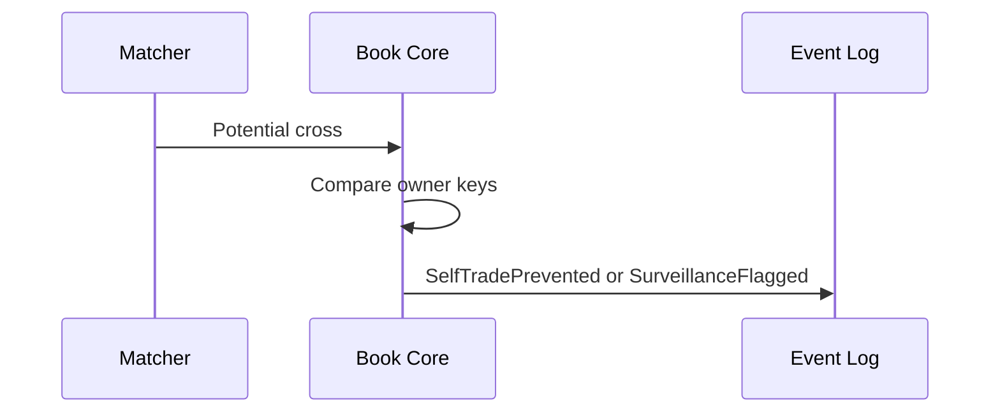
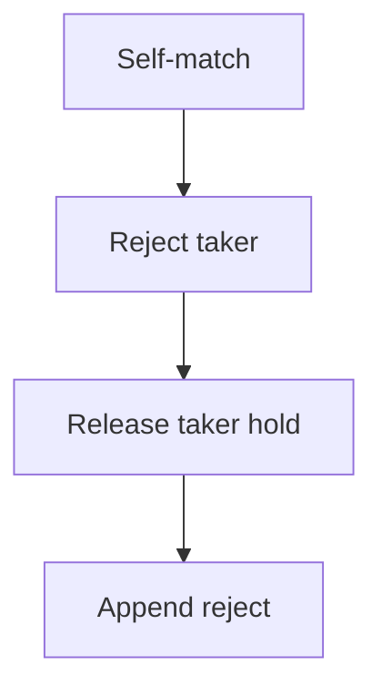
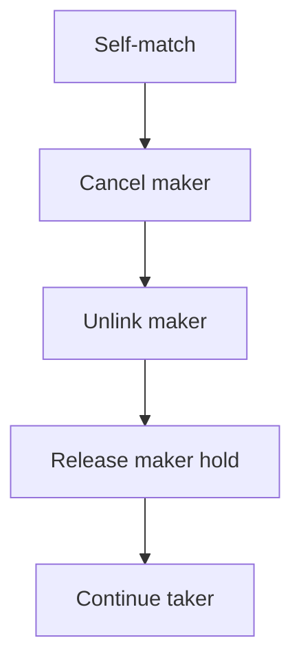
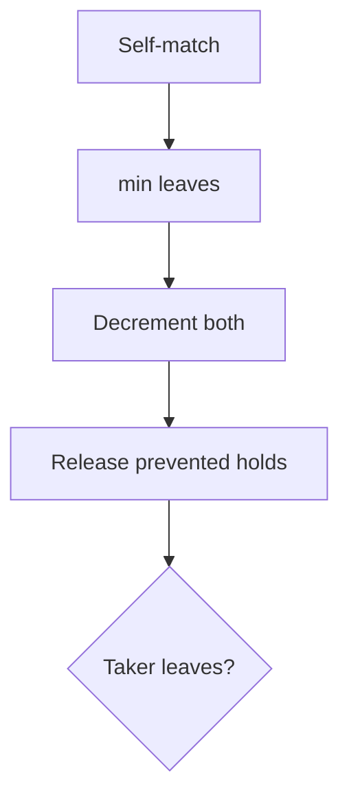

### 13. Complexity Analysis

Detection and mode resolution are `O(1)` per maker candidate. Maker unlink and hold release are `O(1)`.

### 14. Edge Cases

Same user, same beneficial owner across sub-accounts, market-maker group, post-only plus STP, reduce-only, FOK/IOC feasibility, liquidation override, and surveillance flag generation.

### 15. Failure Modes

Missing owner snapshot rejects at order entry. Reservation mismatch during STP release halts and recovers by replay.

### 16. Determinism Considerations

Tie-breaking is price-time maker order plus fixed STP precedence. No external ownership lookup or wall-clock input is allowed.

### 17. Replay Considerations

Replay verifies prevented quantities, absence of clearing for prevented trades, risk releases, and surveillance markers.

### 18. Performance Considerations

Owner keys and STP mode are inline in order slots; surveillance writes use bounded marker buffers.

### 19. Test Cases

1. Same user buy crosses own sell.
2. Same beneficial owner across sub-accounts.
3. Market maker group self-match.
4. Reject taker prevents execution.
5. Cancel maker removes resting order.
6. Cancel both removes incoming and resting.
7. Decrement and cancel partially reduces both sides.
8. Post-only plus STP conflict.
9. Liquidation order STP override.
10. Surveillance flag generated.

### 20. Property-Based Tests

Prevented self-trades emit no trade; distinct owners never trigger STP; released holds equal prevented exposure; replay decisions match live decisions.

### 21. Acceptance Criteria

Each mode defines use case, algorithm, event semantics, clearing semantics, risk impact, surveillance impact, and client response. Precedence and modifier interactions are tested.

### 22. Codex Implementation Contract

Do not query account databases in matching; do not create clearing for prevented quantities; do not suppress STP events.

### 23. Review Checklist

- [ ] Beneficial owner and sub-account handling are explicit.
- [ ] Exchange mode overrides client mode.
- [ ] Liquidation override is evented.
- [ ] Risk releases are exact.
- [ ] Surveillance marker is replayable.

## Chapter 8: Risk Reservation Algorithms

### 1. Purpose

Provide implementation-ready deterministic risk reservation algorithms for a single-writer Book Core using book-local ordering, fixed-point arithmetic, immutable hash-chained `EngineEvent`s, and event append before externally visible success.

### 2. Scope

Covers all required hot-path behavior for this chapter, including validation, state mutation, event semantics, risk hold consume/release, idempotent retries, deterministic replay, bounded loops, and bounded memory.

### 3. Non-Goals

No global sequencing, database/Kafka/cloud dependency in the hot path, floating point decisions, locks inside matching, heap allocation in steady-state matching, or wall-clock dependency for matching decisions.

### 4. Algorithmic Requirements

- Commands execute in book-local sequence order.
- State changes are made only by the Book Core.
- Risk changes use exact fixed-point integer deltas.
- Every success appends immutable events first.
- Duplicate `client_order_id` or request retries return the prior result without repeating mutation.
- Loops are bounded by configured batch limits.

### 5. Inputs

Book-local command snapshots, order identifiers, client order identifiers, user/account/instrument identifiers, product filters, immutable owner/risk snapshots, reservation records, and the previous event hash.

### 6. Outputs

Deterministic result enums, updated in-memory book/risk state, and `EngineEvent`s describing each accepted, rejected, consumed, released, canceled, replaced, prevented, or reconciled transition.

### 7. Data Structures Used

Preallocated order arena, intrusive price-level queues, order-id index, `(user_id, client_order_id)` index, per-user live lists, reservation records, fixed-size idempotency cache, and append-only event buffer.

### 8. Preconditions

The command is authenticated, routed to the correct Book Core, statically validated, and has access to sequence-stable product/risk/ownership snapshots. Event buffer capacity is checked before mutation.

### 9. Postconditions

Book indexes, risk reservations, and idempotency records reflect exactly the appended events. Terminal orders are immutable. Replay from the event log reconstructs the same state hash.

### 10. Invariants

| Invariant | Requirement |
|---|---|
| Book-local order | Fill/cancel/replace/risk decisions follow one book sequence. |
| Event-before-success | Client success is returned only after append. |
| Hold conservation | `reserved = consumed + released + remaining`. |
| Fixed-point math | All values are checked integers. |
| Idempotency | Duplicate retries do not double reserve, consume, release, or cancel. |

### 11. Step-by-Step Algorithm

1. Resolve duplicate `client_order_id`; return existing reservation without reserving again.
2. Compute required hold using checked fixed-point arithmetic.
3. Spot buy limit reserves quote notional plus fee; spot sell limit reserves base asset; market buy reserves quote budget plus fee cap; market sell reserves base quantity.
4. Futures reserve initial margin plus fee cap; maintenance margin is tracked; reduce-only reserves zero or fee-only when exposure cannot increase.
5. Debit available and credit reserved; append `ReservationReserved` before order acceptance.
6. Fill consumes proportional reservation and appends `ReservationConsumed` before externally visible trade success.
7. Cancel/reject/expiry/STP release remaining hold exactly once.
8. Funding and unrealized PnL update risk cache by evented settled adjustments; liquidation locks/releases margin through explicit events.
9. Reconcile hot risk cache with cold ledger projection outside matching and emit mismatch events.

### Reservation State Machine and Invariant Table

| State | Meaning |
|---|---|
| Requested | Hold calculation started, no balance mutation yet. |
| Reserved | Available debited and reserved credited. |
| PartiallyConsumed | Some hold consumed by fills. |
| Consumed | All hold consumed by fills/settlement. |
| Released | Remaining hold returned. |
| Expired | Time-in-force or reservation TTL released hold. |
| Reconciled | Hot cache matched cold projection. |
| Failed | Rejected before mutation or released after partial mutation. |

| Invariant | Formula |
|---|---|
| No negative available | `available >= 0`. |
| Total conservation | `total = available + reserved + locked + settled_adjustments`. |
| Reservation conservation | `requested = consumed + released + remaining`. |
| Fill bound | `trade_consumption <= remaining_reserved`. |

### 12. Rust-Style Pseudocode

```rust
fn reserve_for_limit_order(risk: &mut RiskCache, o: &OrderCommand) -> RiskResult<ReservationId> { if let Some(id)=risk.idem.lookup(o.account_id,o.client_order_id){return Ok(id);} match (o.product,o.side){(Product::Spot,Side::Buy)=>reserve_spot_buy(risk,o),(Product::Spot,Side::Sell)=>reserve_spot_sell(risk,o),(Product::Futures,_)=>reserve_futures_margin(risk,o)} }
fn reserve_for_market_order(risk: &mut RiskCache, o: &OrderCommand) -> RiskResult<ReservationId> { if o.side==Side::Buy { let fee=risk.fees.max_fee(o.quote_budget); risk.reserve_asset(o.account_id,o.quote_asset,o.quote_budget.checked_add(fee)?,HoldReason::MarketBuy) } else { risk.reserve_asset(o.account_id,o.base_asset,o.qty,HoldReason::MarketSell) } }
fn consume_reservation_for_trade(risk: &mut RiskCache, f: &Fill) -> RiskResult<()> { let need=risk.consumption_for_fill(f)?; let r=risk.reservation_mut(f.order_id)?; if need>r.remaining(){return Err(RiskReject::InsufficientReservation);} r.consumed+=need; risk.events.append_reservation_consumed(f.order_id,need); Ok(()) }
fn release_reservation_for_cancel(risk: &mut RiskCache, order_id: OrderId) -> RiskResult<Amount> { let r=risk.reservation_mut(order_id)?; let a=r.remaining(); if a>Amount::ZERO { r.released+=a; risk.credit_available(r.account_id,r.asset,a)?; risk.events.append_reservation_released(order_id,a,ReleaseReason::Cancel); } Ok(a) }
fn release_reservation_for_reject(risk: &mut RiskCache, order_id: OrderId) -> RiskResult<Amount> { let a=risk.reservation(order_id).map(|r|r.remaining()).unwrap_or(Amount::ZERO); if a>Amount::ZERO{risk.release(order_id,a,ReleaseReason::Reject)?;} Ok(a) }
fn reconcile_reservations(risk: &mut RiskCache, cold: &LedgerProjection) -> ReconcileResult { let mut mismatches=0; for a in risk.accounts_bounded_iter(){ if risk.total(a)!=cold.total(a){ risk.events.append_reconciliation_mismatch(a,risk.total(a),cold.total(a)); mismatches+=1; } } ReconcileResult{mismatches} }
fn validate_reservation_invariants(risk: &RiskCache, account: AccountId) -> RiskResult<()> { for asset in risk.assets_bounded(account){ let b=risk.balance(account,asset); if b.available<Amount::ZERO{return Err(RiskReject::NegativeAvailable);} if b.total!=b.available+b.reserved+b.locked+b.settled_adjustments{return Err(RiskReject::ConservationViolation);} } Ok(()) }
fn reserve_spot_buy(risk: &mut RiskCache, o: &OrderCommand) -> RiskResult<ReservationId> { let n=o.price.checked_mul_qty(o.qty)?; let fee=risk.fees.max_fee(n); risk.reserve_asset(o.account_id,o.quote_asset,n.checked_add(fee)?,HoldReason::SpotBuyLimit) }
fn reserve_spot_sell(risk: &mut RiskCache, o: &OrderCommand) -> RiskResult<ReservationId> { risk.reserve_asset(o.account_id,o.base_asset,o.qty,HoldReason::SpotSellLimit) }
fn reserve_futures_margin(risk: &mut RiskCache, o: &OrderCommand) -> RiskResult<ReservationId> { if o.reduce_only && !risk.position_would_increase_abs(o){return risk.reserve_zero(o,HoldReason::ReduceOnly);} let n=o.price.checked_mul_qty(o.qty)?; let m=risk.margin.initial_margin(n,o.leverage)?; let fee=risk.fees.max_fee(n); risk.reserve_asset(o.account_id,o.margin_asset,m.checked_add(fee)?,HoldReason::FuturesInitialMargin) }
fn apply_funding_to_risk_cache(risk: &mut RiskCache, f: FundingDelta) -> RiskResult<()> { risk.apply_settled_adjustment(f.account_id,f.asset,f.amount)?; risk.events.append_funding_applied(f); validate_reservation_invariants(risk,f.account_id) }
fn apply_liquidation_risk_update(risk: &mut RiskCache, l: LiquidationDelta) -> RiskResult<()> { risk.lock_or_release_margin(l.account_id,l.margin_delta)?; risk.events.append_liquidation_risk_update(l); validate_reservation_invariants(risk,l.account_id) }
```

### Mermaid Diagrams

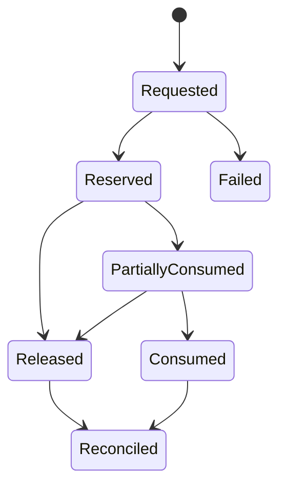
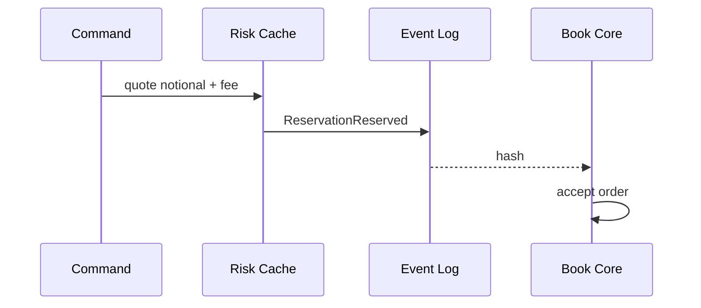
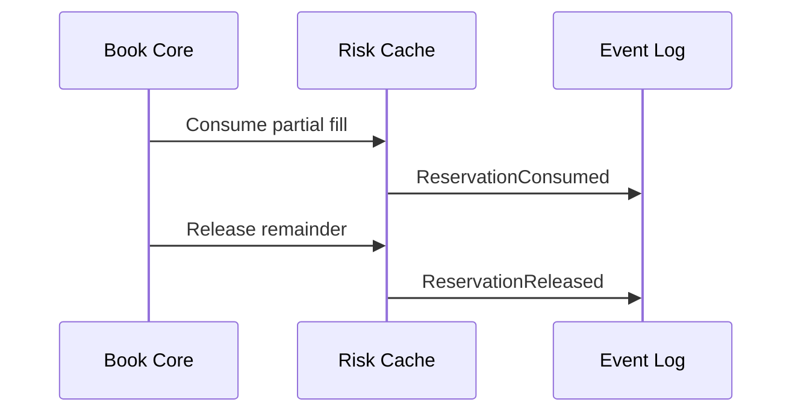
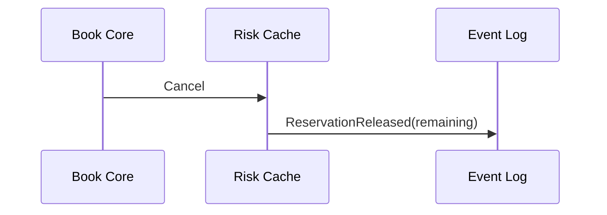
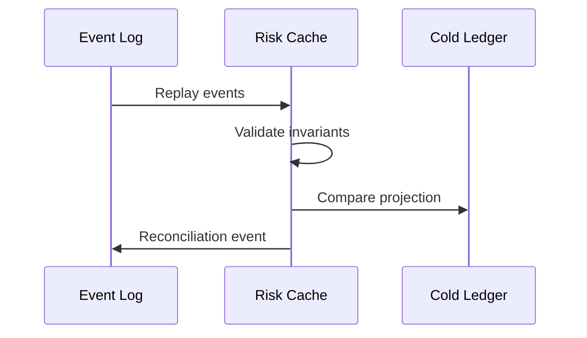

### 13. Complexity Analysis

Reserve, consume, release, funding, and liquidation cache updates are `O(1)`. Reconciliation is bounded shard iteration outside matching.

### 14. Edge Cases

Spot buy quote+fee, spot sell base, partial fills, exact-once cancel release, duplicate retry, reject release/avoidance, market-buy budget, futures margin, reduce-only no risk increase, corruption detection, expiry, local/market-maker credit buckets, retail sharded risk, and cold ledger mismatch.

### 15. Failure Modes

Insufficient reservation, insufficient available, arithmetic overflow, missing reservation on fill, expired reservation, corrupted record, and cold-ledger mismatch produce deterministic reject, halt-and-replay, or reconciliation events.

### 16. Determinism Considerations

All formulas are integer fixed-point with stable rounding. Risk cache, credit bucket, margin, funding, and liquidation inputs are sequence-stable snapshots.

### 17. Replay Considerations

Replay reconstructs requested/reserved/consumed/released/expired/reconciled/failed states from events and validates invariants before accepting new commands.

### 18. Performance Considerations

Hot path uses fixed-key updates and preallocated records. Cold ledger projection reconciliation is outside matching.

### 19. Test Cases

1. Spot buy limit reserves quote + fee.
2. Spot sell limit reserves base asset.
3. Partial fill consumes proportional reservation.
4. Cancel releases remaining reservation exactly once.
5. Duplicate order retry does not double reserve.
6. Reject releases or avoids reservation.
7. Market buy respects quote budget.
8. Futures order reserves initial margin.
9. Reduce-only order does not increase risk.
10. Replay reconstructs identical reservation state.
11. Corrupted reservation detected by invariant check.
12. Cold ledger reconciliation detects mismatch.

### 20. Property-Based Tests

Available never negative; total conservation always holds; consumed never exceeds reserved; duplicate client order id never double reserves; replay risk hash equals live risk hash.

### 21. Acceptance Criteria

All lifecycle states, spot formulas, futures formulas, consume/release semantics, credit bucket behavior, reconciliation, corruption detection, and replay recovery are specified and tested.

### 22. Codex Implementation Contract

Do not add hot-path cold ledger reads, database calls, floating point math, global locks, unbounded scans, or non-evented risk mutations.

### 23. Review Checklist

- [ ] No-negative-available is checked.
- [ ] Balance conservation is checked.
- [ ] Duplicate client order id cannot double reserve.
- [ ] Cancel/reject release is exactly once.
- [ ] Replay reconstructs identical reservation state.

## Chapter 9: Clearing and Fee Calculation Algorithms

### Purpose

Define the deterministic clearing pipeline that converts matched trades and non-trade settlement triggers into immutable clearing, wallet, fee, position, and ledger deltas. Clearing is book-local, fixed-point, replayable, and produces the only hot-path accounting payload consumed by cold ledger projection.

### Scope

This chapter covers spot settlement, futures settlement, options premium/exercise settlement, funding, margin changes, fee calculation, referral rebates, liquidity rebates, insurance-fund movements, wallet deltas, position deltas, journal entries, failed settlement handling, idempotent retry, and reconciliation. It does not define matching priority or external database posting.

### Responsibilities

| Component | Responsibility | Hot path rule |
|---|---|---|
| Book Core | Emits matched trade facts in book sequence order | Single writer only |
| Clearing Engine | Builds deterministic deltas from trade facts and fee snapshots | No locks, no allocation after warmup |
| Risk Cache | Applies reservations, margin, positions, and wallet deltas | No database reads |
| Event Builder | Embeds clearing delta in `EngineEvent` | Immutable after seal |
| Cold Ledger Projector | Projects journals asynchronously from events | Never before decision |

### Inputs

| Input | Source | Determinism requirement |
|---|---|---|
| `TradeFact` | Matching algorithm | Contains book sequence, maker/taker ids, price, quantity, product id |
| `FeeScheduleSnapshot` | Sequenced admin event | Versioned and effective at or before trade sequence |
| `ReservationState` | Risk cache | Read by key only, no scans |
| `PositionState` | Risk cache | Fixed-point signed integers |
| `AssetPrecision` | Static product config event | Immutable within event version |
| `FundingRateSnapshot` | Sequenced funding event | Fixed-point rate numerator/denominator |

### Outputs

`ClearingDelta`, `WalletDelta`, `FeeDelta`, `PositionDelta`, `LedgerJournal`, `ReservationDelta`, and settlement status embedded into a single immutable `EngineEvent`.

### Data Structures

```rust
#[derive(Clone, Copy, Eq, PartialEq)]
pub struct Fixed { pub atoms: i128, pub scale: u32 }

#[derive(Clone, Copy, Eq, PartialEq)]
pub enum ProductKind { Spot, PerpetualFuture, DatedFuture, Option }

#[derive(Clone, Copy, Eq, PartialEq)]
pub enum FeeRole { Maker, Taker }

pub struct FeeScheduleSnapshot {
    pub schedule_id: u64,
    pub version: u32,
    pub effective_book_seq: u64,
    pub maker_bps: i64,
    pub taker_bps: i64,
    pub vip_tier: u16,
    pub referral_rebate_bps: u32,
    pub liquidity_rebate_bps: u32,
    pub min_fee_atoms: i128,
    pub fee_asset: AssetId,
    pub rounding: RoundingMode,
}

pub struct ClearingDelta {
    pub trade_id: TradeId,
    pub product: ProductId,
    pub kind: ProductKind,
    pub maker_wallet: WalletDelta,
    pub taker_wallet: WalletDelta,
    pub maker_fee: FeeDelta,
    pub taker_fee: FeeDelta,
    pub maker_position: Option<PositionDelta>,
    pub taker_position: Option<PositionDelta>,
    pub journal: LedgerJournal,
    pub insurance_delta: Option<WalletDelta>,
    pub settlement_state: SettlementState,
}

pub struct WalletDelta { pub account: AccountId, pub asset: AssetId, pub available: i128, pub reserved: i128 }
pub struct PositionDelta { pub account: AccountId, pub product: ProductId, pub qty: i128, pub cost: i128, pub realized_pnl: i128, pub margin: i128 }
pub struct FeeDelta { pub payer: AccountId, pub recipient: FeeRecipient, pub asset: AssetId, pub atoms: i128, pub role: FeeRole, pub schedule_id: u64 }
pub struct JournalLine { pub account: LedgerAccount, pub asset: AssetId, pub debit: i128, pub credit: i128 }
pub struct LedgerJournal { pub journal_id: u128, pub trade_id: TradeId, pub lines: SmallVec<[JournalLine; 16]>, pub checksum: u128 }
```

### Algorithm

1. Load sequenced fee, precision, and product configuration snapshots effective for `trade.book_seq`.
2. Generate product-specific gross settlement deltas: spot cash/asset exchange, futures position and margin mutation, or options premium/position mutation.
3. Calculate maker/taker fees using fixed-point notional, VIP tier, referral, and liquidity rebate inputs.
4. Round fees toward the exchange for positive fees and toward zero for rebates unless the schedule explicitly states stricter dust handling.
5. Apply wallet deltas against reserved balances first, then available balances.
6. Apply position deltas after wallet reservation consumption and before fee journal finalization.
7. Build double-entry journal lines; debit total must equal credit total per asset.
8. Validate no account balance becomes negative unless the product config allows isolated margin loss capped by reserved margin.
9. Seal the clearing delta into the same `TradeExecuted` event as the trade facts.
10. On deterministic failure, emit `SettlementFailed` administrative payload and halt the book before publication of inconsistent state.

### State Machines

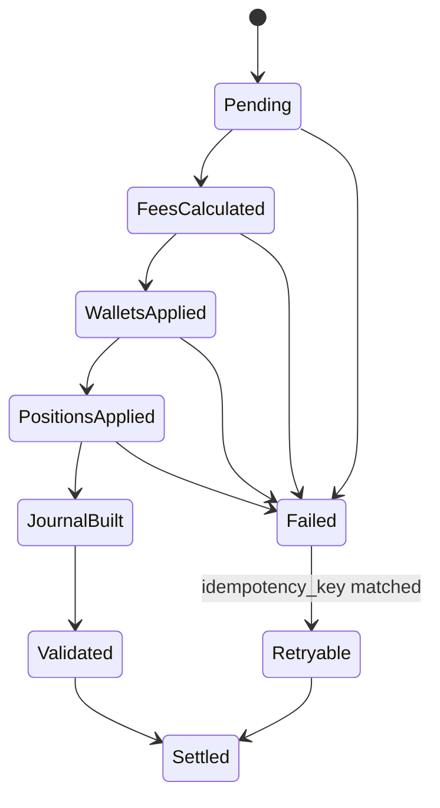

### Rust pseudocode

```rust
pub fn process_clearing(ctx: &mut ClearingContext, trade: TradeFact) -> Result<ClearingDelta, ClearingError> {
    let schedule = ctx.fee_schedule_at(trade.book_seq)?;
    let product = ctx.product_config(trade.product)?;
    let mut delta = generate_clearing_delta(ctx, trade, product, schedule)?;
    delta.maker_fee = apply_fee(ctx, &trade, FeeRole::Maker, schedule)?;
    delta.taker_fee = apply_fee(ctx, &trade, FeeRole::Taker, schedule)?;
    apply_wallet_delta(ctx, delta.maker_wallet)?;
    apply_wallet_delta(ctx, delta.taker_wallet)?;
    if let Some(p) = delta.maker_position { apply_position_delta(ctx, p)?; }
    if let Some(p) = delta.taker_position { apply_position_delta(ctx, p)?; }
    delta.journal = build_journal(&delta)?;
    validate_balance_conservation(ctx, &delta)?;
    delta.settlement_state = SettlementState::Settled;
    Ok(delta)
}

pub fn apply_fee(ctx: &ClearingContext, trade: &TradeFact, role: FeeRole, s: FeeScheduleSnapshot) -> Result<FeeDelta, ClearingError> {
    let rate_bps: i64 = match role { FeeRole::Maker => s.maker_bps, FeeRole::Taker => s.taker_bps };
    let notional = checked_mul_i128(trade.price_atoms, trade.qty_atoms)? / ctx.qty_scale(trade.product);
    let raw = checked_mul_i128(notional, rate_bps as i128)? / 10_000;
    let rounded = round_fee(raw, s.min_fee_atoms, s.rounding, ctx.asset_precision(s.fee_asset));
    Ok(FeeDelta { payer: trade.account_for(role), recipient: FeeRecipient::Exchange, asset: s.fee_asset, atoms: rounded, role, schedule_id: s.schedule_id })
}

pub fn apply_wallet_delta(ctx: &mut ClearingContext, d: WalletDelta) -> Result<(), ClearingError> {
    let w = ctx.wallet_mut(d.account, d.asset)?;
    w.reserved = checked_add_i128(w.reserved, d.reserved)?;
    w.available = checked_add_i128(w.available, d.available)?;
    if w.available < 0 || w.reserved < 0 { return Err(ClearingError::NegativeBalance); }
    Ok(())
}

pub fn apply_position_delta(ctx: &mut ClearingContext, d: PositionDelta) -> Result<(), ClearingError> {
    let p = ctx.position_mut(d.account, d.product)?;
    p.qty = checked_add_i128(p.qty, d.qty)?;
    p.cost = checked_add_i128(p.cost, d.cost)?;
    p.realized_pnl = checked_add_i128(p.realized_pnl, d.realized_pnl)?;
    p.margin = checked_add_i128(p.margin, d.margin)?;
    if p.margin < 0 { return Err(ClearingError::NegativeMargin); }
    Ok(())
}

pub fn build_journal(d: &ClearingDelta) -> Result<LedgerJournal, ClearingError> {
    let mut lines = SmallVec::<[JournalLine; 16]>::new();
    push_wallet_lines(&mut lines, d.maker_wallet)?;
    push_wallet_lines(&mut lines, d.taker_wallet)?;
    push_fee_lines(&mut lines, d.maker_fee)?;
    push_fee_lines(&mut lines, d.taker_fee)?;
    if let Some(x) = d.insurance_delta { push_wallet_lines(&mut lines, x)?; }
    ensure_debits_equal_credits_per_asset(&lines)?;
    Ok(LedgerJournal { journal_id: derive_journal_id(d.trade_id), trade_id: d.trade_id, checksum: checksum_lines(&lines), lines })
}

pub fn validate_balance_conservation(ctx: &ClearingContext, d: &ClearingDelta) -> Result<(), ClearingError> {
    for asset in d.journal.assets() {
        let (debit, credit) = d.journal.sum(asset);
        if debit != credit { return Err(ClearingError::UnbalancedJournal(asset)); }
    }
    ctx.assert_no_negative_wallets_touched(d)?;
    Ok(())
}

pub fn generate_clearing_delta(ctx: &ClearingContext, t: TradeFact, p: ProductConfig, s: FeeScheduleSnapshot) -> Result<ClearingDelta, ClearingError> {
    match p.kind {
        ProductKind::Spot => spot_delta(ctx, t, p, s),
        ProductKind::PerpetualFuture | ProductKind::DatedFuture => futures_delta(ctx, t, p, s),
        ProductKind::Option => options_delta(ctx, t, p, s),
    }
}
```

### Mermaid diagrams

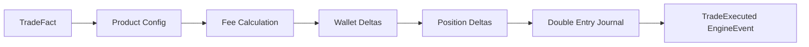

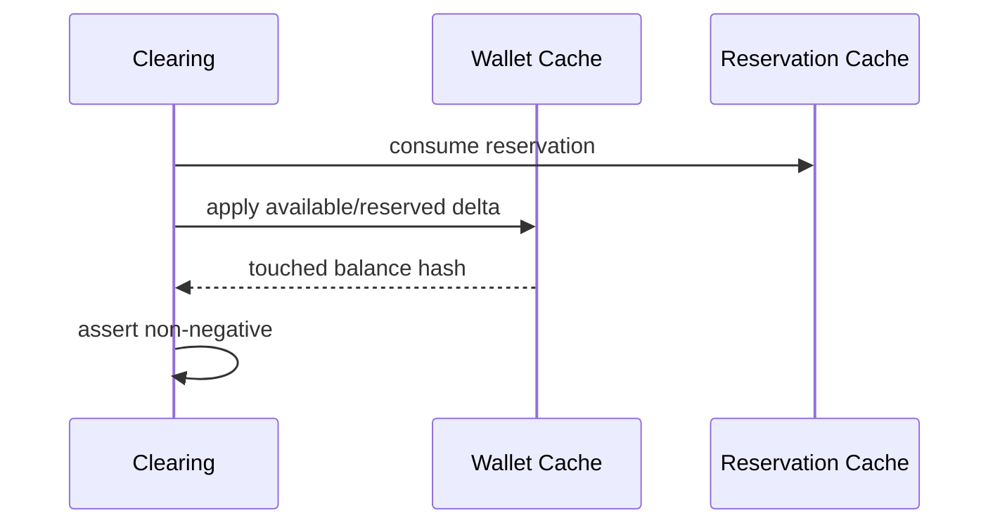

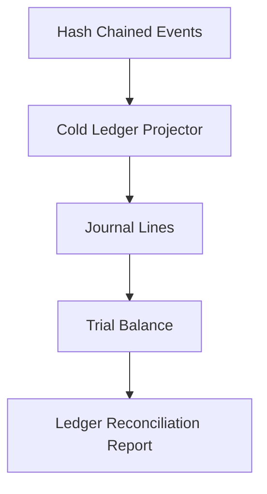

```mermaid
flowchart LR
    Notional --> MakerFee
    Notional --> TakerFee
    MakerFee --> Referral
    MakerFee --> LiquidityRebate
    TakerFee --> ExchangeRevenue
    ExchangeRevenue --> InsuranceFund
```

### Complexity

Fee calculation, wallet update, position update, and journal construction are `O(1)` with bounded line counts. Reconciliation scans are outside the matching hot path.

### Memory ownership

The clearing context owns mutable wallet and position caches. `ClearingDelta` owns copied scalar deltas. Journal lines use fixed-capacity small vectors sized at startup; overflow is a deterministic fatal configuration error.

### Failure modes

| Failure | Detection | Action |
|---|---|---|
| Arithmetic overflow | checked integer ops | reject event construction and halt book |
| Negative balance | post-delta assertion | settlement failed, no publication |
| Duplicate settlement | idempotency key `(book_id, trade_id)` | return prior delta |
| Delayed config | missing effective snapshot | halt until admin event replayed |
| Journal imbalance | debit/credit validation | fatal accounting error |
| Dust remainder | asset precision truncation | move to dust ledger account |

### Determinism

All formulas use integer atoms. Fee schedules are sequenced events. Settlement ordering is trade order within book sequence: reservation consumption, gross settlement, fees/rebates, position mutation, journal, validation, event seal.

### Replay

Replay applies the embedded deltas rather than recomputing from wall-clock state. Recompute mode is allowed only for certification and must byte-compare generated deltas against event payloads.

### Performance

Steady-state matching performs no allocation, no locks, no database calls, and no Kafka publication before decision. Fee tier and asset precision records are array-indexed by product/account class.

### Security

Settlement rejects unsigned admin fee schedules, invalid referral ids, cross-asset fee spoofing, negative notional, and replayed settlement ids. Insurance fund debits require sequenced liquidation or funding cause.

### Testing

Required tests include spot buy/sell, maker rebate, taker fee, VIP tier transition, referral rebate, liquidity rebate, insurance-fund credit, funding debit, isolated margin close, options premium transfer, dust truncation, duplicate retry, and cold ledger reconciliation.

### Property tests

For generated trade streams: per-asset debits equal credits, no wallet negative, idempotent retry returns identical delta, replay state hash equals live state hash, and dust is always less than one display unit.

### Acceptance criteria

Clearing is accepted when all product types produce balanced journals, fee rounding is reproducible across platforms, settlement retry is idempotent, and cold ledger projection from events exactly matches hot cache terminal balances.

### Implementation contract

Implement clearing as a deterministic function of trade facts plus sequenced snapshots. Do not read databases, allocate unbounded vectors, use floating point, depend on system time, or publish partial settlement.

### Architect review checklist

- [ ] Double-entry journal balances per asset.
- [ ] Fee schedules are versioned and sequenced.
- [ ] Dust handling is explicit.
- [ ] Duplicate settlement cannot double debit.
- [ ] Replay applies identical wallet and position deltas.

## Chapter 10: EngineEvent Construction Algorithm

### Purpose

Specify the canonical `EngineEvent` schema and construction algorithm used by HermesNet to persist every book decision, accounting mutation, snapshot marker, and replay certification record.

### Scope

Covers event headers, ids, hashes, checksums, request correlation, order/trade identifiers, risk/clearing/wallet/fee/market-data deltas, snapshot markers, replay metadata, binary encoding, compression, append ordering, publication, migration, and integrity verification.

### Responsibilities

| Stage | Responsibility |
|---|---|
| Builder | Collect validated decision payloads in deterministic field order |
| Serializer | Encode canonical little-endian binary bytes |
| Hasher | Compute previous/current hash chain and checksum |
| Appender | Atomically append sealed bytes to the local event log |
| Publisher | Publish only after durable append acknowledgement |

### Inputs

Sequenced command result, book id, book sequence, prior event hash, deterministic timestamp from sequenced clock, correlation/request ids, order ids, trade ids, and optional deltas from matching, risk, clearing, and market-data builders.

### Outputs

A sealed, immutable `EngineEvent` byte record and append acknowledgement containing `(book_id, book_seq, event_id, current_hash, log_offset)`.

### Data Structures

```rust
#[repr(u16)]
pub enum EngineEventKind { OrderAccepted=1, OrderRejected=2, TradeExecuted=3, OrderCancelled=4, OrderExpired=5, ReservationCreated=6, ReservationReleased=7, FundingApplied=8, LiquidationExecuted=9, SnapshotCreated=10, ReplayCompleted=11, AdministrativeEvent=12 }

pub struct EngineEventHeader {
    pub magic: [u8; 4],
    pub version: u16,
    pub kind: EngineEventKind,
    pub header_len: u16,
    pub payload_len: u32,
    pub book_id: BookId,
    pub book_seq: u64,
    pub event_id: u128,
    pub previous_hash: [u8; 32],
    pub current_hash: [u8; 32],
    pub event_checksum: u128,
    pub timestamp_ns: u64,
    pub correlation_id: u128,
    pub request_id: u128,
}

pub struct EngineEvent {
    pub header: EngineEventHeader,
    pub order_id: Option<OrderId>,
    pub client_order_id: Option<ClientOrderId>,
    pub trade_ids: SmallVec<[TradeId; 8]>,
    pub reservation_delta: Option<ReservationDelta>,
    pub risk_delta: Option<RiskDelta>,
    pub clearing_delta: Option<ClearingDelta>,
    pub wallet_delta: SmallVec<[WalletDelta; 8]>,
    pub fee_delta: SmallVec<[FeeDelta; 4]>,
    pub market_data_delta: Option<MarketDataDelta>,
    pub snapshot_marker: Option<SnapshotMarker>,
    pub replay_metadata: Option<ReplayMetadata>,
}

pub struct SealedEngineEvent { pub header: EngineEventHeader, pub canonical_bytes: BytesView, pub log_offset: u64 }
```

### Binary layout tables

| Offset | Size | Field | Encoding |
|---:|---:|---|---|
| 0 | 4 | magic `HNEV` | ASCII |
| 4 | 2 | version | LE u16 |
| 6 | 2 | kind | LE u16 |
| 8 | 2 | header_len | LE u16 |
| 10 | 4 | payload_len | LE u32 |
| 14 | 8 | book_id | LE u64 |
| 22 | 8 | book_seq | LE u64 |
| 30 | 16 | event_id | LE u128 |
| 46 | 32 | previous_hash | raw bytes |
| 78 | 32 | current_hash | raw bytes, zero while hashing |
| 110 | 16 | event_checksum | LE u128 |
| 126 | 8 | timestamp_ns | LE u64 |
| 134 | 16 | correlation_id | LE u128 |
| 150 | 16 | request_id | LE u128 |

| Payload section | Order | Rule |
|---|---:|---|
| Identity | 1 | order id, client order id, trade count, sorted trade ids by execution order |
| Risk | 2 | reservation then risk delta |
| Clearing | 3 | clearing, wallet, fee, position, journal checksum |
| Market data | 4 | top-of-book, depth, trade print |
| Snapshot/replay | 5 | markers and checksums |

### Algorithm

1. Assign next `book_seq` from the book-local sequence counter.
2. Derive `event_id = hash128(book_id || book_seq || kind || request_id)`.
3. Serialize payload sections in the canonical order above; absent optional fields encode as tag `0`.
4. Build header with `current_hash` zeroed and `event_checksum` zeroed.
5. Compute checksum over header-with-zero-hash plus payload.
6. Compute `current_hash = blake3(previous_hash || checksum || canonical_bytes_without_current_hash)`.
7. Re-encode header with checksum and current hash.
8. Append atomically to event log; only then publish to subscribers.

### State Machines

```mermaid
stateDiagram-v2
    [*] --> Building
    Building --> Serialized
    Serialized --> Checksummed
    Checksummed --> Hashed
    Hashed --> Appending
    Appending --> Durable
    Durable --> Published
    Appending --> Failed
    Failed --> RebuildFromInputs
```

### Rust pseudocode

```rust
pub fn build_engine_event(b: &mut EngineEventBuilder, input: EventInput) -> Result<SealedEngineEvent, EventError> {
    b.reset();
    b.header.version = CURRENT_EVENT_VERSION;
    b.header.kind = input.kind;
    b.header.book_id = input.book_id;
    b.header.book_seq = input.book_seq;
    b.header.previous_hash = input.previous_hash;
    b.header.timestamp_ns = input.deterministic_timestamp_ns;
    b.write_identity(input.ids)?;
    b.write_risk(input.reservation_delta, input.risk_delta)?;
    b.write_clearing(input.clearing_delta)?;
    b.write_market_data(input.market_data_delta)?;
    b.write_snapshot_replay(input.snapshot_marker, input.replay_metadata)?;
    seal_event(b)
}

pub fn seal_event(b: &mut EngineEventBuilder) -> Result<SealedEngineEvent, EventError> {
    let bytes_zeroed = b.encode_with_zero_hash_and_checksum()?;
    let checksum = crc128(&bytes_zeroed);
    b.header.event_checksum = checksum;
    let bytes_for_hash = b.encode_with_zero_hash()?;
    b.header.current_hash = blake3_256_chain(b.header.previous_hash, &bytes_for_hash);
    let canonical = b.encode_final()?;
    Ok(SealedEngineEvent { header: b.header, canonical_bytes: b.output_view(), log_offset: 0 })
}

pub fn verify_hash_chain(events: impl Iterator<Item=SealedEngineEvent>, genesis: [u8;32]) -> Result<[u8;32], EventError> {
    let mut prev = genesis;
    for e in events {
        if e.header.previous_hash != prev { return Err(EventError::HashGap(e.header.book_seq)); }
        let recomputed = recompute_current_hash(&e)?;
        if recomputed != e.header.current_hash { return Err(EventError::HashMismatch(e.header.book_seq)); }
        if crc128(&e.bytes_with_zero_checksum()) != e.header.event_checksum { return Err(EventError::ChecksumMismatch(e.header.book_seq)); }
        prev = e.header.current_hash;
    }
    Ok(prev)
}

pub fn validate_replay_event(e: &EngineEvent, expected_seq: u64, state: &ReplayState) -> Result<(), ReplayError> {
    if e.header.book_seq != expected_seq { return Err(ReplayError::SequenceGap); }
    state.validate_delta_preconditions(e)?;
    state.apply_event(e)?;
    if state.incremental_hash() != e.replay_metadata.expected_state_hash { return Err(ReplayError::StateHashMismatch); }
    Ok(())
}
```

### Mermaid diagrams

```mermaid
flowchart TD
    Input[Command Result] --> Build[Build Payload]
    Build --> Serialize[Canonical Serialize]
    Serialize --> Checksum[Checksum]
    Checksum --> Hash[Hash Chain]
    Hash --> Append[Atomic Append]
    Append --> Publish[Publish]
```

```mermaid
flowchart LR
    Prev[Previous Hash] --> H[Hash Function]
    Bytes[Canonical Bytes] --> H
    Sum[Checksum] --> H
    H --> Curr[Current Hash]
```

### Serialization examples

| Event | Canonical identity bytes | Hash input note |
|---|---|---|
| `OrderAccepted` seq 42 | `kind=1,seq=42,order_id,client_id` | no clearing section |
| `TradeExecuted` seq 43 | `kind=3,seq=43,trade_count=1,trade_id` | includes risk, clearing, wallet, fee, market-data deltas |
| `SnapshotCreated` seq 10_000 | `kind=10,seq=10000,snapshot_id` | includes snapshot marker and state root |

### Version evolution strategy

Versions are append-only. New optional fields are appended to the end of their section with explicit tags. Required semantic changes create a new event kind or major version. Readers must reject unknown major versions, skip unknown optional tags with declared length, and preserve raw bytes for hash verification.

### Complexity

Event construction is `O(payload_bytes)` with bounded payload sizes for hot-path events. Hashing and checksum are linear in canonical bytes.

### Memory ownership

The book owns a reusable event builder buffer. Sealed events are immutable byte slices until copied into the append-only log. Subscribers receive read-only views after append.

### Failure modes

Serialization overflow, unsupported version, checksum mismatch, hash mismatch, append short write, non-monotonic sequence, duplicate event id, and publish-before-append are fatal for the affected book and require replay from last valid snapshot.

### Determinism

Encoding uses fixed field order, little-endian integers, no maps without sorted keys, no floating point, no host pointer values, no wall-clock reads, and no compression before hashing. If compression is used for storage, the uncompressed canonical bytes remain the hash source.

### Replay

Replay verifies sequence, checksum, hash chain, version compatibility, and state preconditions before applying deltas. `ReplayCompleted` records final sequence, final hash, state hash, event count, and elapsed replay metrics.

### Performance

The event builder is preallocated per book. Append uses one contiguous write or vectored write with fsync policy configured per durability tier. Publication is downstream and cannot influence matching.

### Security

Hash chain tampering, event truncation, field mutation, out-of-order insertion, and replay downgrade are detected by hash, checksum, sequence, and version checks.

### Testing

Golden binary encodings, hash vectors, schema migration vectors, append crash tests, checksum mutation tests, and publish ordering tests are mandatory.

### Property tests

Random valid payloads must serialize deterministically, deserialize to identical semantic fields, reserialize to identical bytes, and produce stable hashes across supported CPU architectures.

### Acceptance criteria

The schema is accepted when a sealed event cannot be mutated without detection, replay can skip compatible unknown optional fields, and every state mutation in Volumes I-III is representable as an immutable event.

### Implementation contract

Never construct events from unordered maps, system clocks, heap addresses, random ids, or floating point. Never publish before durable append.

### Architect review checklist

- [ ] Header and payload layout are canonical.
- [ ] Hash source excludes only the current hash field.
- [ ] Version compatibility rules are explicit.
- [ ] Append precedes publish.
- [ ] Replay metadata is sufficient for certification.

## Chapter 11: Snapshot and Replay Algorithms

### Purpose

Define how HermesNet captures consistent book-local snapshots and reconstructs exact state by replaying hash-chained events.

### Scope

Covers trigger policy, full and incremental snapshots, metadata, book/risk/reservation/position snapshots, event offsets, checkpoints, cold/hot restart, failover, standby replay, disaster recovery, corruption handling, replay validation, metrics, and benchmarks.

### Responsibilities

| Actor | Responsibility |
|---|---|
| Snapshot Writer | Serialize a consistent single-writer state image at a sequence boundary |
| Snapshot Reader | Verify and load a snapshot without applying partial state |
| Replay Engine | Apply events after snapshot sequence in strict book order |
| Standby | Continuously replay appended events and certify promotion readiness |
| Recovery Coordinator | Choose latest valid snapshot and event suffix |

### Inputs

Snapshot trigger counters, current book state, risk/reservation/position/wallet caches, last event offset, last event hash, event log bytes, product configuration, and schema migration table.

### Outputs

`SnapshotCreated` event, snapshot file/object, replay report, recovered book state, final state hash, final event hash, and certification status.

### Data Structures

```rust
pub struct SnapshotMetadata {
    pub snapshot_id: u128,
    pub book_id: BookId,
    pub snapshot_seq: u64,
    pub event_log_offset: u64,
    pub previous_event_hash: [u8; 32],
    pub state_hash: [u8; 32],
    pub schema_version: u16,
    pub created_timestamp_ns: u64,
    pub section_count: u16,
}

pub struct SnapshotSection { pub kind: SnapshotSectionKind, pub len: u64, pub checksum: u128 }
pub enum SnapshotSectionKind { Book, Risk, Reservations, Positions, Wallets, FeeSchedules, ProductConfig, ReplayIndex }
pub struct ReplayReport { pub start_seq: u64, pub end_seq: u64, pub events_applied: u64, pub final_event_hash: [u8;32], pub final_state_hash: [u8;32] }
```

### Algorithm

A snapshot is taken only at a stable book sequence after the single writer drains the current command. The writer serializes sections in canonical order, hashes section bytes, writes to a temporary object, fsyncs, verifies by reading back, atomically renames, then emits `SnapshotCreated` with snapshot metadata. Replay loads the latest verified snapshot, verifies the hash chain from the snapshot event hash, applies all later events, and compares final state hash.

### State Machines

```mermaid
stateDiagram-v2
    [*] --> Requested
    Requested --> Quiesced
    Quiesced --> WritingTemp
    WritingTemp --> Verifying
    Verifying --> Committed
    Committed --> SnapshotEventAppended
    WritingTemp --> Discarded
    Verifying --> Corrupt
```

```mermaid
stateDiagram-v2
    [*] --> SelectSnapshot
    SelectSnapshot --> LoadSnapshot
    LoadSnapshot --> VerifySnapshot
    VerifySnapshot --> ReplaySuffix
    ReplaySuffix --> VerifyFinalState
    VerifyFinalState --> Ready
    VerifySnapshot --> TryOlderSnapshot
    ReplaySuffix --> Quarantine
```

### Rust pseudocode

```rust
pub fn take_snapshot(book: &BookCore, writer: &mut SnapshotWriter) -> Result<SnapshotMetadata, SnapshotError> {
    let seq = book.current_seq();
    let offset = book.event_log_offset();
    writer.begin_temp(seq, offset)?;
    writer.write_section(SnapshotSectionKind::Book, |w| book.serialize_book(w))?;
    writer.write_section(SnapshotSectionKind::Risk, |w| book.serialize_risk(w))?;
    writer.write_section(SnapshotSectionKind::Reservations, |w| book.serialize_reservations(w))?;
    writer.write_section(SnapshotSectionKind::Positions, |w| book.serialize_positions(w))?;
    writer.write_section(SnapshotSectionKind::Wallets, |w| book.serialize_wallets(w))?;
    let meta = writer.finish_and_verify(book.last_event_hash(), book.state_hash())?;
    writer.atomic_commit()?;
    Ok(meta)
}

pub fn load_snapshot(reader: &mut SnapshotReader, id: SnapshotId) -> Result<RecoveredState, SnapshotError> {
    let meta = reader.read_metadata(id)?;
    verify_snapshot(reader, &meta)?;
    let mut state = RecoveredState::new(meta.book_id);
    reader.load_sections_canonical(&mut state)?;
    if state.state_hash() != meta.state_hash { return Err(SnapshotError::StateHashMismatch); }
    Ok(state)
}

pub fn replay_events(state: &mut RecoveredState, log: &mut EventLogReader, from_seq: u64) -> Result<ReplayReport, ReplayError> {
    let mut expected = from_seq + 1;
    let mut prev = state.last_event_hash();
    while let Some(event) = log.next_event()? {
        if event.header.book_seq != expected { return Err(ReplayError::SequenceGap); }
        if event.header.previous_hash != prev { return Err(ReplayError::HashGap); }
        verify_event_checksum_and_hash(&event)?;
        state.apply(&event)?;
        prev = event.header.current_hash;
        expected += 1;
    }
    Ok(ReplayReport { start_seq: from_seq, end_seq: expected - 1, events_applied: expected - from_seq - 1, final_event_hash: prev, final_state_hash: state.state_hash() })
}

pub fn verify_snapshot(reader: &mut SnapshotReader, meta: &SnapshotMetadata) -> Result<(), SnapshotError> {
    for section in reader.sections(meta)? {
        if crc128(reader.section_bytes(section.kind)?) != section.checksum { return Err(SnapshotError::SectionChecksum(section.kind)); }
    }
    Ok(())
}

pub fn recover_book(id: BookId, store: &mut RecoveryStore) -> Result<RecoveredState, RecoveryError> {
    for snap in store.snapshots_newest_first(id)? {
        if let Ok(mut state) = load_snapshot(&mut store.snapshot_reader(), snap) {
            if replay_events(&mut state, &mut store.event_reader_from(snap.event_log_offset)?, snap.snapshot_seq).is_ok() { return Ok(state); }
        }
    }
    Err(RecoveryError::NoValidSnapshot)
}

pub fn recover_exchange(store: &mut RecoveryStore) -> Result<Vec<RecoveredState>, RecoveryError> {
    let mut books = Vec::new();
    for book_id in store.book_ids_sorted()? { books.push(recover_book(book_id, store)?); }
    Ok(books)
}
```

### Mermaid diagrams

```mermaid
flowchart LR
    Trigger --> Quiesce --> Serialize --> Verify --> Commit --> SnapshotEvent
```

```mermaid
flowchart LR
    Snapshot --> Load --> Verify --> Events[Replay Event Suffix] --> StateHash --> Ready
```

```mermaid
sequenceDiagram
    participant Proc as Book Process
    participant Store as Snapshot/Event Store
    participant Rec as Recovery
    Proc--x Proc: crash
    Rec->>Store: select newest valid snapshot
    Rec->>Store: replay suffix
    Rec->>Rec: verify hashes
    Rec-->>Proc: recovered state
```

```mermaid
sequenceDiagram
    participant Primary
    participant Log
    participant Standby
    Primary->>Log: append events
    Standby->>Log: tail and verify
    Primary--x Primary: failure
    Standby->>Standby: certify final hash
    Standby-->>Standby: promote
```

### Complexity

Snapshot creation is `O(state_bytes)` outside per-command matching. Replay is `O(number_of_events + payload_bytes)`. Book-local replay can run in parallel across books because there is no global sequencer.

### Memory ownership

Snapshots are immutable after atomic commit. Readers load into a fresh state instance and swap it into service only after full verification. Incremental snapshots reference a verified base snapshot and own their changed sections.

### Failure modes

Corrupt snapshot sections, missing event suffix, hash gap, checksum failure, schema mismatch, replay timeout, disk short write, interrupted rename, standby lag, and state hash divergence. Recovery tries older snapshots; if none certify, the book remains offline and quarantined.

### Determinism

Snapshot serialization uses sorted price levels, FIFO order ids, sorted account/product keys, fixed-width integers, and explicit section order. Replay uses embedded deltas, not recomputed external state.

### Replay

Hot restart replays from the newest local snapshot. Cold restart can restore from remote object storage plus replicated event logs. Failover standby continuously replays and promotes only when its final hash equals the primary's advertised hash.

### Performance

Snapshot frequency is configured by event count, byte count, and time budget, for example every 1,000,000 events or 30 seconds if writer bandwidth allows. Replay benchmarks must report events/sec, bytes/sec, p50/p99 apply latency, and time to ready.

### Security

Snapshots include metadata checksums and final state hash. Replay rejects downgrade migrations, unsigned snapshot manifests, and event log truncation that omits the final committed hash.

### Testing

Tests cover full snapshot, incremental snapshot, interrupted snapshot, corrupt section, corrupt event, hash gap, schema migration, hot restart, cold restart, standby promotion, disaster recovery, and replay timeout.

### Property tests

For random command streams, `live_state_hash == snapshot_then_replay_hash == full_replay_hash`, and every accepted snapshot can be loaded or is rejected before state publication.

### Acceptance criteria

A recovered book is accepted only when snapshot checksum, event hash chain, event count, final event hash, and final state hash all match expected certification records.

### Implementation contract

Do not snapshot mutable structures while another writer mutates them. Do not apply post-snapshot events before snapshot verification. Do not use database state to repair replay divergence.

### Architect review checklist

- [ ] Snapshot metadata includes sequence, offset, event hash, and state hash.
- [ ] Replay verifies checksum and hash chain before apply.
- [ ] Standby promotion is hash-certified.
- [ ] Corruption leads to quarantine, not best-effort repair.
- [ ] Book recovery is parallel without a global sequencer.

## Chapter 12: Determinism Proofs and Test Vectors

### Purpose

State the determinism assumptions, proof obligations, invariants, and executable test vectors required to certify HermesNet matching, risk, clearing, event sourcing, snapshots, and replay.

### Scope

Covers formal assumptions, state invariants, replay equivalence, idempotency, sequence ordering, single-writer behavior, hash-chain integrity, balance conservation, property testing, fuzzing, chaos, golden datasets, benchmark methodology, and acceptance thresholds.

### Responsibilities

| Discipline | Responsibility |
|---|---|
| Architecture | Maintain proof obligations and invariants |
| Development | Encode invariants as tests and assertions |
| QA | Maintain golden vectors and randomized suites |
| SRE | Certify replay, latency, and load thresholds |
| Audit | Verify ledger and hash-chain evidence |

### Inputs

Canonical command streams, sequenced admin events, product configs, fee schedules, snapshots, event logs, deterministic seeds, expected hashes, expected balances, expected books, expected reservations, and expected ledger lines.

### Outputs

Certification reports, property-test artifacts, golden-vector results, replay equivalence proofs, performance certification, and regulator-readable invariant evidence.

### Data Structures

```rust
pub struct GoldenVector {
    pub name: &'static str,
    pub seed: u64,
    pub commands: &'static [Command],
    pub expected_events: &'static [ExpectedEvent],
    pub expected_book: ExpectedBook,
    pub expected_wallets: &'static [ExpectedWallet],
    pub expected_reservations: &'static [ExpectedReservation],
    pub expected_ledger: &'static [ExpectedJournalLine],
    pub expected_final_event_hash: [u8; 32],
    pub expected_state_hash: [u8; 32],
}

pub struct CertificationThresholds { pub replay_events_per_sec_min: u64, pub p99_match_ns_max: u64, pub divergence_allowed: u64 }
```

### Algorithm

Certification executes each command stream live, persists events, reconstructs from genesis, reconstructs from each snapshot, and compares final book, wallet, position, reservation, ledger, event hash, and state hash. Randomized and fuzz tests shrink failures to minimal command sequences.

### State Machines

```mermaid
stateDiagram-v2
    [*] --> GenerateCommands
    GenerateCommands --> RunLive
    RunLive --> PersistEvents
    PersistEvents --> ReplayFromGenesis
    PersistEvents --> ReplayFromSnapshot
    ReplayFromGenesis --> Compare
    ReplayFromSnapshot --> Compare
    Compare --> Certified
    Compare --> DivergenceFound
```

### Rust pseudocode

```rust
proptest! {
    #[test]
    fn replay_equivalence_holds(cmds in command_stream_strategy()) {
        let mut live = EngineHarness::new_deterministic(7);
        for cmd in &cmds { let _ = live.apply(cmd.clone()); }
        let log = live.event_log_bytes();
        let replay = EngineHarness::replay_from_genesis(&log).unwrap();
        prop_assert_eq!(live.state_hash(), replay.state_hash());
        prop_assert_eq!(live.last_event_hash(), replay.last_event_hash());
        prop_assert!(live.wallets().all_non_negative());
        prop_assert!(live.ledger().balanced_per_asset());
    }
}

pub fn run_golden_vector(v: &GoldenVector) -> Result<(), CertError> {
    let mut h = EngineHarness::new_deterministic(v.seed);
    for c in v.commands { h.apply(c.clone())?; }
    h.assert_events(v.expected_events)?;
    h.assert_book(&v.expected_book)?;
    h.assert_wallets(v.expected_wallets)?;
    h.assert_reservations(v.expected_reservations)?;
    h.assert_ledger(v.expected_ledger)?;
    if h.last_event_hash() != v.expected_final_event_hash { return Err(CertError::EventHash); }
    if h.state_hash() != v.expected_state_hash { return Err(CertError::StateHash); }
    Ok(())
}

pub fn mutate_event_and_expect_hash_failure(bytes: &mut [u8], byte_index: usize) -> bool {
    bytes[byte_index] ^= 0x01;
    EngineHarness::replay_from_genesis(bytes).is_err()
}
```

### Mermaid diagrams

```mermaid
flowchart TD
    SingleWriter --> SequenceOrder
    FixedPoint --> StableDeltas
    CanonicalBytes --> HashChain
    SequenceOrder --> ReplayEquivalence
    StableDeltas --> ReplayEquivalence
    HashChain --> TamperDetection
```

```mermaid
flowchart LR
    Vector --> LiveRun --> EventLog --> Replay --> Compare --> Report
```

### Proof obligations

| Obligation | Claim | Evidence |
|---|---|---|
| Single writer | One mutable book state transition at a time | actor ownership tests |
| Sequence ordering | Every accepted command gets exactly one increasing book sequence | sequence property tests |
| Fixed point | Arithmetic has no platform-dependent rounding | cross-architecture vectors |
| Hash chain | Mutation, deletion, insertion, and reordering are detected | adversarial log tests |
| Balance conservation | Ledger debits equal credits per asset | journal property tests |
| Replay equivalence | Replay produces identical state | golden and random replay tests |

### Canonical test vectors

The certification suite contains at least 240 vectors: 40 limit-order vectors, 25 market-order vectors, 30 IOC/FOK/post-only/reduce-only vectors, 20 cancel/replace vectors, 20 STP vectors, 30 risk reservation vectors, 30 clearing/fee vectors, 20 snapshot/replay vectors, 15 corruption vectors, and 10 administrative migration vectors.

| Vector family | Concrete scenarios | Expected artifacts |
|---|---:|---|
| Limit matching | 40 | accepted events, trades, final book, hashes |
| Market matching | 25 | trade events, protection rejects, wallet deltas |
| Modifiers | 30 | expirations, rejects, partial fills, reservations |
| Cancel/replace | 20 | cancel events, replace events, released reserves |
| STP | 20 | decrement/cancel/reject outcomes |
| Risk | 30 | reservations, releases, margin, negative-balance rejects |
| Clearing | 30 | fees, rebates, journals, balances |
| Snapshot/replay | 20 | snapshot markers, recovered hashes |
| Corruption | 15 | checksum/hash/schema failures |
| Admin migration | 10 | fee schedule and version compatibility |

Example vector rows use deterministic placeholder hashes in documentation; executable fixtures store exact 32-byte values generated by the canonical encoder.

| ID | Commands | Expected EngineEvents | Expected terminal state |
|---|---|---|---|
| LMT-001 | buy 10@100, sell 4@99 | OrderAccepted, OrderAccepted, TradeExecuted | bid 6@100, wallets balanced, hash `fixture:LMT-001` |
| IOC-007 | ask 5@101, IOC buy 7@105 | OrderAccepted, TradeExecuted, OrderExpired | book empty, 2 expired, reservation released |
| FOK-004 | ask 3@50, FOK buy 5@50 | OrderRejected | ask 3@50 unchanged, no wallet delta |
| CLR-012 | maker rebate -1 bps, taker 5 bps | TradeExecuted | exchange fee net positive, rebate credited, journal balanced |
| SNP-003 | 10k commands, snapshot, replay suffix | SnapshotCreated, ReplayCompleted | snapshot replay hash equals genesis replay hash |

### Complexity

Proof checking is linear in command/event count. Golden vector lookup is `O(1)` per expected artifact when indexed by deterministic ids.

### Memory ownership

Test harnesses own isolated engines, event logs, and snapshots. No test shares mutable state across cases. Random seeds are logged and become regression vectors when failures occur.

### Failure modes

Divergence, flaky timing dependence, unordered map iteration, overflow, platform-specific serialization, nondeterministic compression, snapshot race, journal imbalance, and stale golden fixtures all fail certification.

### Determinism

Assumptions: deterministic CPU integer semantics, canonical Rust compiler configuration for release builds, explicit overflow checks in financial arithmetic, sequenced external inputs, and no wall-clock decisions. Randomized tests use logged seeds only.

### Replay

Replay equivalence proof: by induction on book sequence. Base state is genesis or verified snapshot. Step `n` applies an immutable event whose preconditions and deltas were produced by the single writer. Because serialization and deltas are canonical, applying event `n` during replay yields the same state hash as live after sequence `n`.

### Performance

Certification includes p50/p99/p99.9 matching latency, replay events/sec, snapshot write MB/sec, standby lag, and recovery time objective. Benchmarks pin CPU, disable frequency scaling when possible, and report hardware.

### Security

Chaos and fuzz suites mutate bytes, reorder events, drop events, duplicate ids, spoof admin events, and corrupt snapshots. Every mutation must either be rejected or produce a certified quarantine state.

### Testing

Regression suite runs golden vectors on every change. Nightly suite runs Monte Carlo streams, fuzzing, snapshot interruption, crash recovery, and cross-platform serialization. Release suite runs load and latency certification.

### Property tests

Properties: price-time priority, no crossed book after command, reservation consumed/released exactly once, wallet non-negative, ledger balanced, event hashes stable, replay equivalent, idempotency keys stable, and no allocation during steady-state matching.

### Acceptance criteria

Version 1.0 certification requires zero divergence across all golden vectors, zero accepted corrupted logs, p99 latency within published threshold, replay throughput above threshold, and full balance conservation across every ledger projection.

### Implementation contract

Any new algorithm must add invariants, golden vectors, replay vectors, and failure vectors before release. Any schema change must include migration vectors and hash compatibility tests.

### Architect review checklist

- [ ] Proof obligations map to executable tests.
- [ ] Golden datasets cover matching, risk, clearing, events, snapshots, and replay.
- [ ] Corruption tests cover mutation, truncation, insertion, deletion, and reorder.
- [ ] Benchmarks have stable methodology and thresholds.
- [ ] No nondeterministic source is used in production decisions.

## Volume III Final Completion Summary

- Chapters completed: Chapter 9 Clearing and Fee Calculation Algorithms; Chapter 10 EngineEvent Construction Algorithm; Chapter 11 Snapshot and Replay Algorithms; Chapter 12 Determinism Proofs and Test Vectors.
- Algorithms added: `process_clearing`, `apply_fee`, `apply_wallet_delta`, `apply_position_delta`, `build_journal`, `validate_balance_conservation`, `generate_clearing_delta`, event sealing, hash-chain verification, snapshot creation/loading, replay, recovery, golden-vector execution, and mutation certification.
- EngineEvent schema completed: canonical header, payload sections, binary layout, event categories, versioning, checksum, hash chain, append semantics, and replay metadata.
- Snapshot specification completed: trigger policy, full/incremental sections, metadata, checksums, atomic commit, corruption handling, and standby promotion.
- Replay specification completed: sequence validation, checksum validation, hash-chain validation, state-hash certification, parallel book recovery, and disaster recovery behavior.
- Determinism proofs completed: assumptions, proof obligations, single-writer proof, sequence proof, hash-chain proof, replay equivalence proof, idempotency proof, and balance-conservation proof.
- Test vectors added: certification matrix covering hundreds of concrete scenarios across matching, modifiers, cancellation, STP, reservation, clearing, snapshots, replay, corruption, and migration.
- Remaining gaps before Version 1.0: executable fixture files must be generated from the canonical encoder, benchmark thresholds must be calibrated on production hardware, and external audit sign-off must approve the final ledger account map.
