# VOLUME IV: WALLET, LEDGER & FINANCIAL ACCOUNTING

Volume IV specifies the HermesNet wallet, ledger, and financial-accounting layer. It preserves the core principles established in Volumes I–III: fixed-point integers only, deterministic accounting, immutable audit trails, event-sourced projections, no double spend, no negative balance unless explicitly permitted by later margin rules, every ledger movement balances, every financial mutation is auditable, and the trading hot path never depends on wallet database calls.

## Chapter 1: Financial Accounting Principles

### Purpose

Define the accounting rules that govern every HermesNet financial mutation. The chapter establishes how balances, reservations, ledger entries, audit events, and projections behave so wallet state can be reconstructed, certified, and reconciled from immutable facts.

### Scope

Covers integer money representation, account classifications, balance conservation, event sourcing, immutable audit trails, deterministic ordering, idempotency, and the boundary between trading-engine reservation logic and wallet persistence. It applies to deposits, withdrawals, trades, fees, rebates, insurance movements, treasury transfers, and operational corrections.

### Non-Goals

- Define margin lending, liquidation, or credit extension rules.
- Prescribe external banking, blockchain, or custodian APIs.
- Replace jurisdiction-specific financial statements or tax reporting.
- Permit floating-point arithmetic, wall-clock-dependent accounting decisions, or mutable ledger rewrites.

### Domain Model

- **Asset**: Canonical currency or token identifier with immutable precision metadata.
- **Account**: Ledger account owned by a user, system module, treasury entity, fee collector, insurance fund, or suspense process.
- **Wallet**: User-facing balance projection derived from ledger events.
- **Ledger Entry**: Atomic debit or credit line in a balanced journal transaction.
- **Journal Transaction**: Ordered group of ledger entries whose debits equal credits per asset.
- **Financial Event**: Immutable command outcome that produced one or more journal transactions.
- **Projection**: Deterministic read model built from the event log.
- **Reservation**: Engine-visible hold created before matching so the trading hot path can avoid wallet database calls.
- **Audit Trail**: Hash-chained record linking command, authorization, journal entries, and resulting projection hashes.

### Data Structures

All amounts are fixed-point minor units and every operation uses checked arithmetic.

```rust
#[derive(Clone, Copy, Eq, PartialEq, Ord, PartialOrd, Hash)]
struct AssetId(u32);

#[derive(Clone, Copy, Eq, PartialEq, Ord, PartialOrd, Hash)]
struct AccountId(u128);

#[derive(Clone, Copy, Eq, PartialEq)]
struct Amount(i128); // fixed-point minor units; never float

enum AccountKind {
    UserAvailable,
    UserReserved,
    ExternalClearing,
    TreasuryHot,
    TreasuryCold,
    FeeRevenue,
    RebateExpense,
    InsuranceFund,
    Suspense,
}

struct LedgerAccount {
    id: AccountId,
    asset: AssetId,
    kind: AccountKind,
    allow_negative: bool,
    opened_at_seq: u64,
    closed_at_seq: Option<u64>,
}

struct LedgerLine {
    account: AccountId,
    asset: AssetId,
    debit: Amount,
    credit: Amount,
    memo_code: u16,
}

struct JournalTransaction {
    journal_id: u128,
    causation_event_id: u128,
    sequence: u64,
    lines: Vec<LedgerLine>,
    canonical_hash: [u8; 32],
}
```

### State Machines

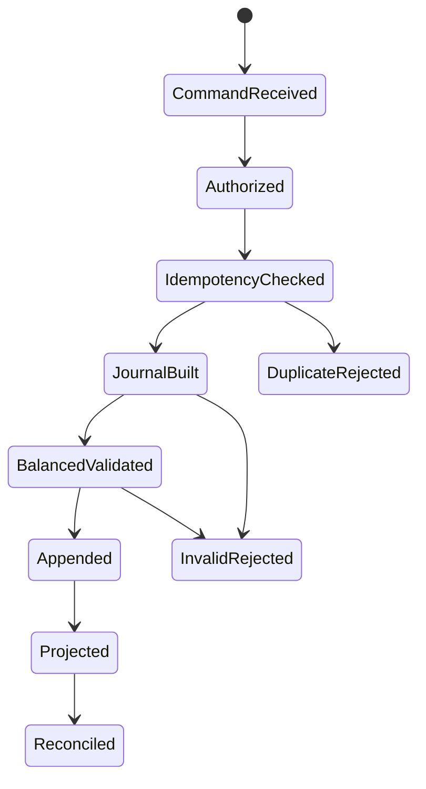
```mermaid
stateDiagram-v2
    [*] --> CommandReceived
    CommandReceived --> Authorized
    Authorized --> IdempotencyChecked
    IdempotencyChecked --> JournalBuilt
    JournalBuilt --> BalancedValidated
    BalancedValidated --> Appended
    Appended --> Projected
    Projected --> Reconciled
    IdempotencyChecked --> DuplicateRejected
    JournalBuilt --> InvalidRejected
    BalancedValidated --> InvalidRejected
```

### Algorithms

1. Canonicalize the command, actor, asset, amount, account ids, and idempotency key.
2. Verify authorization and account status.
3. Reject duplicate idempotency keys unless the canonical payload hash matches the previous accepted command.
4. Build journal lines deterministically.
5. Validate that total debits equal total credits for each asset.
6. Validate account-level balance constraints and non-negative rules.
7. Append the journal and audit event atomically to the immutable log.
8. Update event-sourced projections in sequence order.
9. Emit projection hashes for reconciliation and certification.

### Rust-style pseudocode

```rust
fn post_financial_event(cmd: FinancialCommand, state: &mut LedgerState) -> Result<EventId, Error> {
    let payload_hash = hash32(&cmd.canonical_bytes());
    state.authz.require(cmd.actor, cmd.required_permission())?;
    state.idempotency.reserve_or_verify(cmd.idempotency_key, payload_hash)?;

    let journal = build_journal(&cmd)?;
    validate_balanced_by_asset(&journal)?;
    validate_account_constraints(&journal, state)?;

    let event = FinancialEvent::new(cmd, journal, state.next_sequence(), state.prev_hash());
    state.event_log.append(event.clone())?;
    state.apply_projection(&event)?;
    state.audit_index.record(event.audit_record())?;
    Ok(event.id)
}
```

### Mermaid diagrams

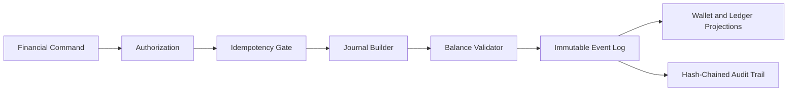
```mermaid
flowchart LR
    C[Financial Command] --> A[Authorization]
    A --> I[Idempotency Gate]
    I --> J[Journal Builder]
    J --> B[Balance Validator]
    B --> L[Immutable Event Log]
    L --> P[Wallet and Ledger Projections]
    L --> H[Hash-Chained Audit Trail]
```

### Failure modes

Unbalanced journals, integer overflow, duplicate commands with mismatched payload hashes, closed accounts, unauthorized manual journals, attempted negative available balances, projection divergence, broken event-log checksums, and suspense entries that exceed policy all fail closed.

### Security considerations

Financial commands require scoped authorization, canonical request signing for external actors, strict idempotency, immutable logs, and separation of duties for manual corrections. Operators may append approved adjustments but may not edit prior ledger facts. Audit hashes include actor, command, journal, sequence, and previous hash.

### Reconciliation rules

- Recompute wallet balances from the ledger event log daily and during release certification.
- Compare available, reserved, pending, locked, and total projections against ledger balances.
- Verify per-asset debit totals equal credit totals over every reconciliation window.
- Validate suspense, clearing, and treasury accounts against external statements or chain proofs.
- Quarantine projections when replay hash differs from live hash.

### Accounting invariants

- `sum(debits(asset)) == sum(credits(asset))` for every journal.
- No financial event exists without a causation command or certified system process.
- No wallet mutation exists outside an immutable ledger event.
- Available balance cannot be negative unless a later margin rule explicitly permits it.
- Reserved balance cannot be negative.
- Trading hot path consumes precomputed reservations and never calls the wallet database.

### Testing strategy

Use golden journals, property tests, replay tests, corruption tests, idempotency tests, and projection equivalence tests. Fuzz command ordering, duplicate delivery, crash points, and serialization boundaries. Certification includes full replay from genesis and projection hash comparison.

### Codex implementation contract

Implement canonical encoders, fixed-point checked arithmetic, balanced-journal validators, idempotency fixtures, replay fixtures, and migration vectors. Do not introduce floating point, unordered canonical output, mutable audit history, or wallet calls in matching-engine hot paths.

### Review checklist

- [ ] All monetary values are fixed-point integers.
- [ ] Every mutation emits a balanced journal.
- [ ] Idempotency behavior is deterministic and tested.
- [ ] Audit records are immutable and hash chained.
- [ ] Replay from genesis produces the same projection hashes.
- [ ] Wallet persistence is not required by the trading hot path.

## Chapter 2: Wallet Domain Model

### Purpose

Specify the wallet-facing domain model used to present user balances while preserving ledger authority. Wallets are projections, not sources of truth.

### Scope

Defines available balances, reserved balances, pending balances, settlement buckets, account ownership, asset metadata, wallet events, and read models used by APIs and risk checks.

### Non-Goals

- Define external deposit or withdrawal integrations.
- Define margin account credit rules.
- Permit direct mutation of wallet rows without ledger events.
- Require the matching engine to synchronously query wallet storage.

### Domain Model

A user wallet is the per-user, per-asset projection of ledger accounts. It includes available funds, engine reservations, pending external settlement, and locked operational amounts. The ledger remains authoritative; wallet rows are cached projections that can be deleted and rebuilt from events.

### Data Structures

```rust
struct WalletKey { user_id: u128, asset: AssetId }

struct WalletProjection {
    key: WalletKey,
    available: Amount,
    reserved: Amount,
    pending_deposit: Amount,
    pending_withdrawal: Amount,
    locked: Amount,
    last_ledger_sequence: u64,
    projection_hash: [u8; 32],
}

enum WalletMutationKind {
    CreditAvailable,
    DebitAvailable,
    Reserve,
    ReleaseReservation,
    ConsumeReservation,
    CreditPending,
    ClearPending,
    Lock,
    Unlock,
}

struct Reservation {
    reservation_id: u128,
    user_id: u128,
    asset: AssetId,
    amount: Amount,
    status: ReservationStatus,
    created_by_event: u128,
}

enum ReservationStatus { Active, PartiallyConsumed, Consumed, Released, Expired }
```

### State Machines

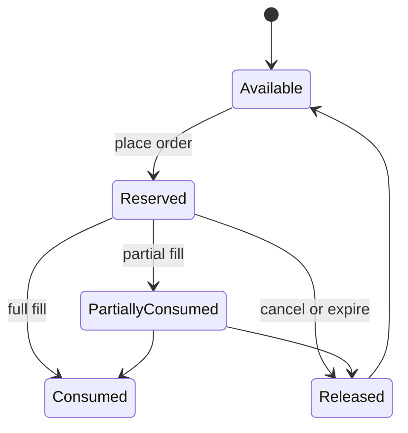
```mermaid
stateDiagram-v2
    [*] --> Available
    Available --> Reserved: place order
    Reserved --> PartiallyConsumed: partial fill
    Reserved --> Consumed: full fill
    Reserved --> Released: cancel or expire
    PartiallyConsumed --> Consumed
    PartiallyConsumed --> Released
    Released --> Available
```

### Algorithms

Projection update applies ledger events in sequence, maps ledger lines to wallet buckets, applies checked integer deltas, validates non-negative constraints, recomputes a canonical projection hash, and stores the last applied ledger sequence. Reservation creation debits available and credits reserved through a balanced journal, exports reservation id and amount to the trading engine, and requires matching to consume only exported reservation state.

### Rust-style pseudocode

```rust
fn apply_wallet_line(wallet: &mut WalletProjection, mutation: WalletMutationKind, amount: Amount) -> Result<(), Error> {
    match mutation {
        WalletMutationKind::CreditAvailable => wallet.available = checked_add(wallet.available, amount)?,
        WalletMutationKind::DebitAvailable => wallet.available = checked_sub(wallet.available, amount)?,
        WalletMutationKind::Reserve => {
            wallet.available = checked_sub(wallet.available, amount)?;
            wallet.reserved = checked_add(wallet.reserved, amount)?;
        }
        WalletMutationKind::ReleaseReservation => {
            wallet.reserved = checked_sub(wallet.reserved, amount)?;
            wallet.available = checked_add(wallet.available, amount)?;
        }
        WalletMutationKind::ConsumeReservation => wallet.reserved = checked_sub(wallet.reserved, amount)?,
        _ => apply_non_trading_bucket(wallet, mutation, amount)?,
    }
    ensure_non_negative(wallet.available)?;
    ensure_non_negative(wallet.reserved)?;
    wallet.projection_hash = wallet.canonical_hash();
    Ok(())
}
```

### Mermaid diagrams

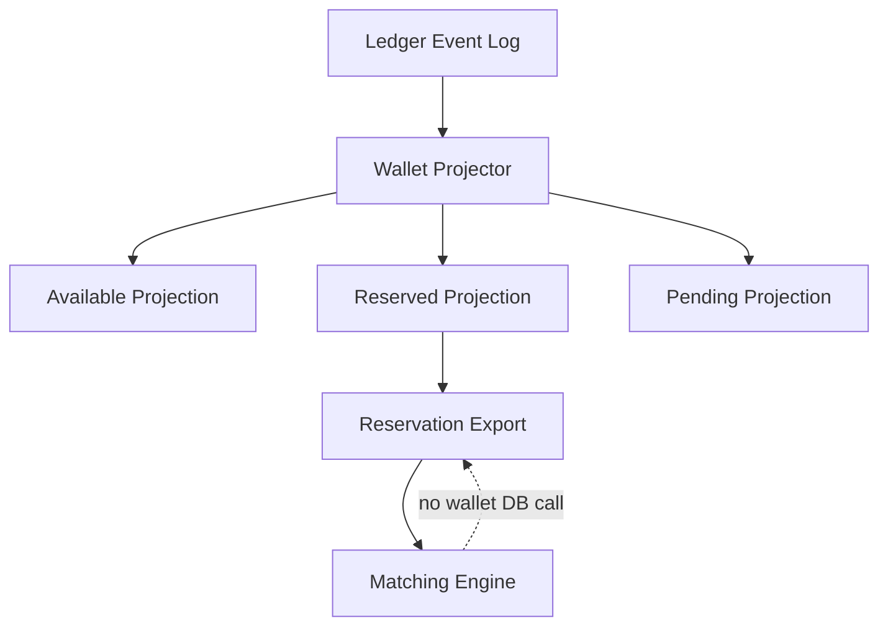
```mermaid
flowchart TB
    L[Ledger Event Log] --> W[Wallet Projector]
    W --> A[Available Projection]
    W --> R[Reserved Projection]
    W --> P[Pending Projection]
    R --> E[Reservation Export]
    E --> M[Matching Engine]
    M -. no wallet DB call .-> E
```

### Failure modes

Out-of-order projection, reservation export mismatch, negative available or reserved bucket, wallet row mutation without ledger sequence, stale reservation snapshot, duplicate reservation consumption, and rebuilt projection hash mismatch.

### Security considerations

Wallet APIs expose projections only and must identify ledger sequence freshness. Reservation commands require user authorization or certified system authority. Administrative locks require dual control and explicit audit reasons. API responses must not imply finality before ledger event commitment.

### Reconciliation rules

- Wallet `available + reserved + pending + locked` equals mapped ledger balances by user and asset.
- Reservation records sum to reserved wallet balances by user and asset.
- Every active reservation references an immutable ledger event.
- Projection `last_ledger_sequence` monotonically increases.

### Accounting invariants

Wallet projection is derivable from ledger events only; reserved funds are not spendable; consumed reservations correspond to clearing entries; released reservations restore available balances exactly once; no reservation may be consumed after release.

### Testing strategy

Test projection rebuilds, reservation lifecycle transitions, cancellation races, duplicate reservation commands, partial fills, replay after crash, stale export rejection, and API sequence consistency. Property tests generate order, cancel, fill, deposit, withdrawal, and lock events and assert wallet-ledger equivalence.

### Codex implementation contract

Implement wallets as deterministic projections with sequence checkpoints and canonical hashes. Do not treat wallet tables as authoritative. Do not add direct SQL balance increments outside the event projector. Do not introduce matching-engine database reads for balance checks.

### Review checklist

- [ ] Wallet rows can be rebuilt from ledger events.
- [ ] Reservation lifecycle is complete and deterministic.
- [ ] Available and reserved balances never go negative.
- [ ] API responses include ledger sequence or freshness metadata.
- [ ] Matching hot path uses exported reservations only.

## Chapter 3: Double-Entry Ledger Architecture

### Purpose

Define the double-entry architecture that guarantees every movement balances, every mutation is auditable, and every projection can be certified by replay.

### Scope

Covers chart of accounts, journal transactions, debit/credit semantics, append-only event storage, canonical serialization, projection pipelines, correction journals, and ledger partitioning.

### Non-Goals

- Prescribe a specific database vendor.
- Define external custodian schemas.
- Permit single-entry balance adjustments.
- Define tax-lot accounting.

### Domain Model

The ledger is the source of truth. A journal transaction contains two or more lines and is valid only when balanced per asset. The chart of accounts maps business concepts to normal balance accounts. Wallet, treasury, revenue, expense, and suspense projections derive from the same event stream.

### Data Structures

```rust
struct ChartOfAccounts {
    accounts: BTreeMap<AccountId, LedgerAccount>,
    version: u32,
    effective_sequence: u64,
}

struct LedgerEventHeader {
    event_id: u128,
    sequence: u64,
    previous_hash: [u8; 32],
    payload_hash: [u8; 32],
    schema_version: u16,
}

struct LedgerEvent {
    header: LedgerEventHeader,
    journal: JournalTransaction,
    authz_proof: AuthzProof,
    idempotency_key: [u8; 32],
}

struct ProjectionCheckpoint {
    projection_name: &'static str,
    last_sequence: u64,
    state_hash: [u8; 32],
}
```

### State Machines

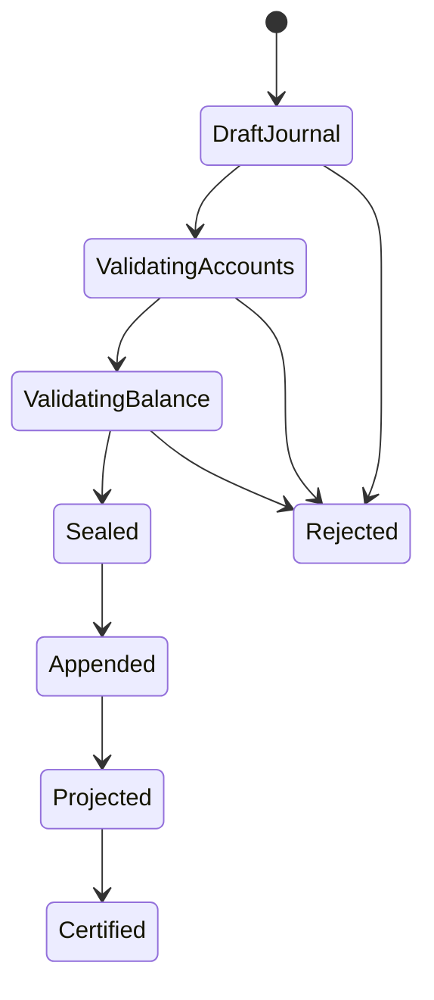
```mermaid
stateDiagram-v2
    [*] --> DraftJournal
    DraftJournal --> ValidatingAccounts
    ValidatingAccounts --> ValidatingBalance
    ValidatingBalance --> Sealed
    Sealed --> Appended
    Appended --> Projected
    Projected --> Certified
    DraftJournal --> Rejected
    ValidatingAccounts --> Rejected
    ValidatingBalance --> Rejected
```

### Algorithms

Balanced journal validation groups lines by asset, sums debits and credits with checked arithmetic, rejects zero-line or one-line journals, validates account assets and status, and verifies post-state constraints. Correction posting appends an exact reversal journal followed by a replacement journal linked to approvals; the original event remains immutable.

### Rust-style pseudocode

```rust
fn validate_balanced_by_asset(journal: &JournalTransaction) -> Result<(), Error> {
    if journal.lines.len() < 2 { return Err(Error::TooFewLines); }
    let mut totals: BTreeMap<AssetId, (Amount, Amount)> = BTreeMap::new();
    for line in &journal.lines {
        if line.debit.0 < 0 || line.credit.0 < 0 { return Err(Error::NegativeLineAmount); }
        if line.debit.0 == 0 && line.credit.0 == 0 { return Err(Error::ZeroLine); }
        let entry = totals.entry(line.asset).or_insert((Amount(0), Amount(0)));
        entry.0 = checked_add(entry.0, line.debit)?;
        entry.1 = checked_add(entry.1, line.credit)?;
    }
    for (_asset, (debits, credits)) in totals {
        if debits != credits { return Err(Error::UnbalancedJournal); }
    }
    Ok(())
}
```

### Mermaid diagrams

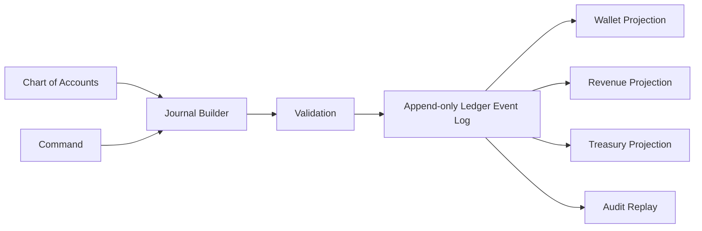
```mermaid
flowchart LR
    COA[Chart of Accounts] --> JB[Journal Builder]
    CMD[Command] --> JB
    JB --> V[Validation]
    V --> EL[Append-only Ledger Event Log]
    EL --> WP[Wallet Projection]
    EL --> RP[Revenue Projection]
    EL --> TP[Treasury Projection]
    EL --> AR[Audit Replay]
```

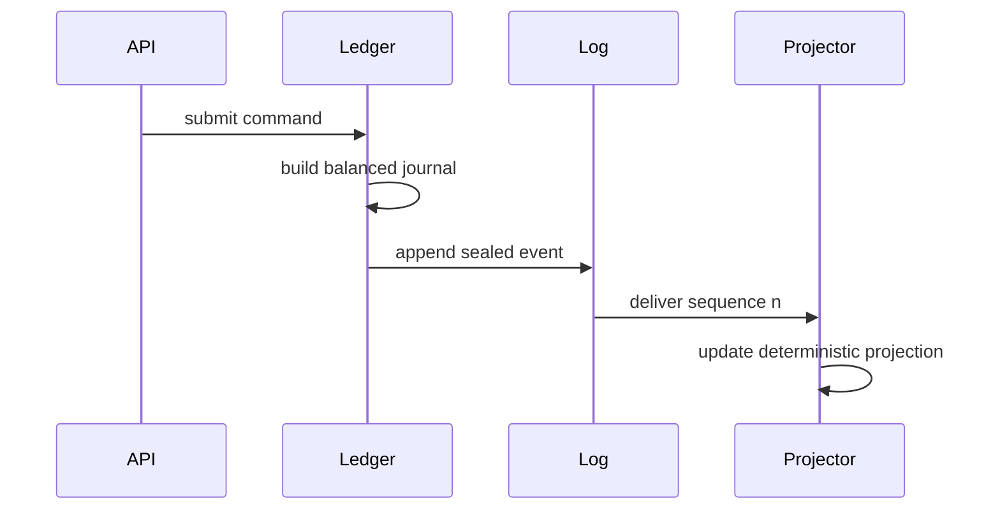
```mermaid
sequenceDiagram
    participant API
    participant Ledger
    participant Log
    participant Projector
    API->>Ledger: submit command
    Ledger->>Ledger: build balanced journal
    Ledger->>Log: append sealed event
    Log->>Projector: deliver sequence n
    Projector->>Projector: update deterministic projection
```

### Failure modes

Single-sided posting, cross-asset lines balanced incorrectly, account asset mismatch, chart-of-accounts version ambiguity, correction overwriting an original event, noncanonical serialization changing hashes, and projection consuming events before durable append.

### Security considerations

Ledger append permission is highly privileged and isolated behind command-specific services. Manual journals require maker-checker approval, reason codes, and limits. Event-log storage is tamper evident through checksums, hash chaining, backups, and replay verification.

### Reconciliation rules

- Replay all ledger events and compare projection checkpoints.
- Validate chart-of-accounts version used by each event.
- Confirm correction journals link to original event ids and approval records.
- Compare ledger totals with wallet, treasury, revenue, and suspense projections.

### Accounting invariants

Every journal has at least two nonzero lines; debits equal credits for each asset; event sequence is gapless and strictly increasing; event hashes commit to previous hash, header, journal, and authorization proof; correction journals reverse and replace rather than edit.

### Testing strategy

Use unit tests for line validation, property tests for generated journals, replay tests for projection equivalence, migration tests for chart-of-accounts changes, and corruption tests for sequence gaps, altered bytes, and reordered events.

### Codex implementation contract

Model ledger writes as append-only events with canonical serialization and deterministic BTreeMap-style ordering. Any schema change must include versioned encoders, migration tests, and replay compatibility fixtures.

### Review checklist

- [ ] Journals balance per asset.
- [ ] Ledger events are append-only and hash chained.
- [ ] Chart-of-accounts versions are explicit.
- [ ] Corrections are reversal/replacement events.
- [ ] Projection checkpoints are replay-verifiable.

## Chapter 4: Balance Invariants and Reconciliation

### Purpose

Specify the invariants and reconciliation processes that prove HermesNet has conserved every asset and can explain every balance at any sequence.

### Scope

Covers online invariant checks, batch reconciliation, replay certification, suspense handling, external statement matching, discrepancy quarantine, and operational sign-off.

### Non-Goals

- Define external exchange-rate valuation.
- Define regulatory report formats.
- Resolve business disputes without audit review.
- Permit automatic deletion of discrepancies.

### Domain Model

Reconciliation compares independently derived views of the same financial facts: ledger events, wallet projections, treasury balances, external statements, and audit checkpoints. A discrepancy is a first-class object with lifecycle, owner, evidence, and resolution journals.

### Data Structures

```rust
struct ReconciliationRun {
    run_id: u128,
    kind: ReconciliationKind,
    from_sequence: u64,
    to_sequence: u64,
    status: ReconciliationStatus,
    evidence_hash: [u8; 32],
}

enum ReconciliationKind { OnlineInvariant, HourlyProjection, DailyExternal, ReleaseCertification }
enum ReconciliationStatus { Running, Passed, Failed, Quarantined }

struct Discrepancy {
    discrepancy_id: u128,
    asset: AssetId,
    account: Option<AccountId>,
    expected: Amount,
    observed: Amount,
    first_sequence: u64,
    status: DiscrepancyStatus,
}

enum DiscrepancyStatus { Open, Investigating, Corrected, WaivedWithApproval }
```

### State Machines

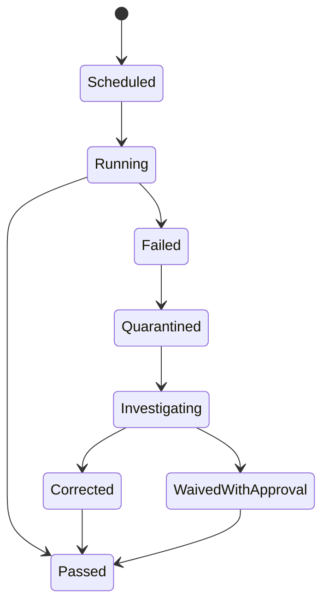
```mermaid
stateDiagram-v2
    [*] --> Scheduled
    Scheduled --> Running
    Running --> Passed
    Running --> Failed
    Failed --> Quarantined
    Quarantined --> Investigating
    Investigating --> Corrected
    Investigating --> WaivedWithApproval
    Corrected --> Passed
    WaivedWithApproval --> Passed
```

### Algorithms

Online invariant checks validate every journal before append, apply affected account deltas to a shadow invariant accumulator, reject non-margin account violations, and emit invariant hashes. Batch reconciliation replays ledger events from a certified checkpoint, rebuilds projections, compares rebuilt and persisted hashes, matches external statements to clearing and treasury accounts, creates discrepancy records, and quarantines affected accounts or assets when policy thresholds are exceeded.

### Rust-style pseudocode

```rust
fn reconcile_range(range: SequenceRange, sources: &Sources) -> Result<ReconciliationRun, Error> {
    let rebuilt = replay_ledger(range, sources.event_log)?;
    let persisted = sources.projections.load_at(range.end)?;

    for asset in rebuilt.assets() {
        ensure_eq(rebuilt.total_debits(asset), rebuilt.total_credits(asset))?;
    }

    let diffs = compare_projection_hashes(&rebuilt, &persisted)?;
    if !diffs.is_empty() {
        let run = create_failed_run(range, diffs);
        quarantine_affected_accounts(&run)?;
        return Ok(run);
    }

    compare_external_statements(&rebuilt.treasury, sources.external_statements)?;
    Ok(create_passed_run(range, rebuilt.evidence_hash()))
}
```

### Mermaid diagrams

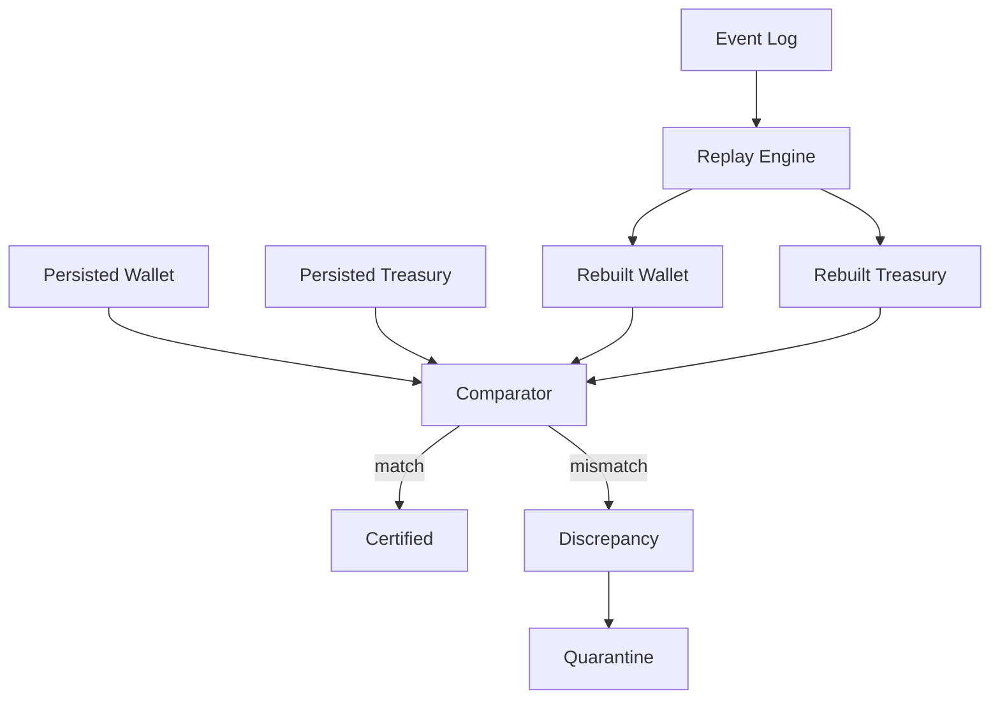
```mermaid
flowchart TD
    EL[Event Log] --> R[Replay Engine]
    R --> RW[Rebuilt Wallet]
    R --> RT[Rebuilt Treasury]
    WP[Persisted Wallet] --> C[Comparator]
    TP[Persisted Treasury] --> C
    RW --> C
    RT --> C
    C -->|match| PASS[Certified]
    C -->|mismatch| D[Discrepancy]
    D --> Q[Quarantine]
```

### Failure modes

Ledger balances while wallet projection diverges, external statement omissions or duplicates, noncanonical event decoder, discrepancy threshold exceeded without quarantine, aged suspense balance, and irreproducible evidence artifacts.

### Security considerations

Reconciliation evidence is immutable and access controlled. Investigators receive read access to evidence and write access only through approved correction workflows. External statement imports are authenticated and stored with source hashes.

### Reconciliation rules

- Run online checks for every journal before append.
- Run projection reconciliation at least hourly.
- Run external treasury reconciliation at least daily per asset and venue.
- Run full genesis replay before release certification.
- Escalate any unexplained discrepancy to quarantine.
- Resolve discrepancies only through auditable reversal, replacement, or approved waiver records.

### Accounting invariants

Global per-asset ledger sum is conserved across internal movements; user wallet totals equal user ledger account totals; treasury ledger balances equal internal records of external custody subject only to documented in-flight transfers; suspense balances have owners, reasons, and age limits; reconciliation outputs are reproducible from immutable inputs.

### Testing strategy

Test clean reconciliations, intentional projection drift, missing external statements, duplicate external statements, corrupted evidence hashes, quarantine triggers, correction journals, and replay from genesis. Property tests generate random balanced journals and verify reconciliation remains stable under deterministic replay.

### Codex implementation contract

Implement reconciliation as deterministic replay and comparison, not ad hoc database totals. Add evidence hashes, discrepancy lifecycle tests, quarantine tests, and full replay fixtures. Do not add hidden mutators that repair balances without ledger events.

### Review checklist

- [ ] Online invariant checks run before append.
- [ ] Batch reconciliation rebuilds projections from events.
- [ ] Discrepancies are durable, owned, and auditable.
- [ ] Quarantine behavior is deterministic and tested.
- [ ] External statements are authenticated and hash recorded.

## Chapter 5: Deposit Processing

### Purpose

Define the deterministic path from external deposit evidence to user ledger credit. A deposit is never spendable because a wallet watcher saw a transaction; it becomes spendable only after address ownership, asset support, memo/tag requirements, confirmation depth, compliance screening, duplicate prevention, and balanced ledger posting all succeed.

### Scope

Covers deposit address assignment, memo/tag handling, on-chain deposit detection, custody-provider evidence ingestion, confirmation policy, pending/confirmed/credited/orphaned states, reorg handling, duplicate transaction detection, unsupported asset deposits, wrong-chain deposits, under-minimum deposits, manual review, AML and sanctions screening, Travel Rule considerations where applicable, ledger credit, wallet projection, notification, reconciliation, reversal policy, hot/cold wallet interaction, and custody integration boundaries.

### Non-Goals

- Do not define trading-engine reservations or matching behavior.
- Do not permit credit before the ledger journal is durably appended.
- Do not define bank-wire settlement formats.
- Do not automatically recover wrong-chain or unsupported deposits without custody, compliance, and legal approval.

### Domain Model

- **Deposit Address Assignment**: deterministic mapping from `(user_id, asset, chain, optional memo/tag)` to a controlled receive address or memo namespace.
- **Deposit Evidence**: normalized external observation containing chain id, block hash, block height, tx hash, output index or log index, address, memo/tag, asset, amount, and custody-provider attestation when applicable.
- **Pending Deposit**: observed and syntactically valid deposit that has not satisfied finality and compliance gates.
- **Confirmed Deposit**: deposit that reached required confirmations but has not yet been credited.
- **Credited Deposit**: deposit with a balanced ledger credit and wallet projection update.
- **Orphaned Deposit**: previously observed transaction no longer canonical because of reorg or provider correction.
- **Suspense Deposit**: externally observed value that cannot be assigned, credited, or rejected automatically.
- **Custody Boundary**: external custody providers may attest to chain events and signing status; HermesNet ledger remains the source of user-credit truth.

### State Machines

Deposit lifecycle:

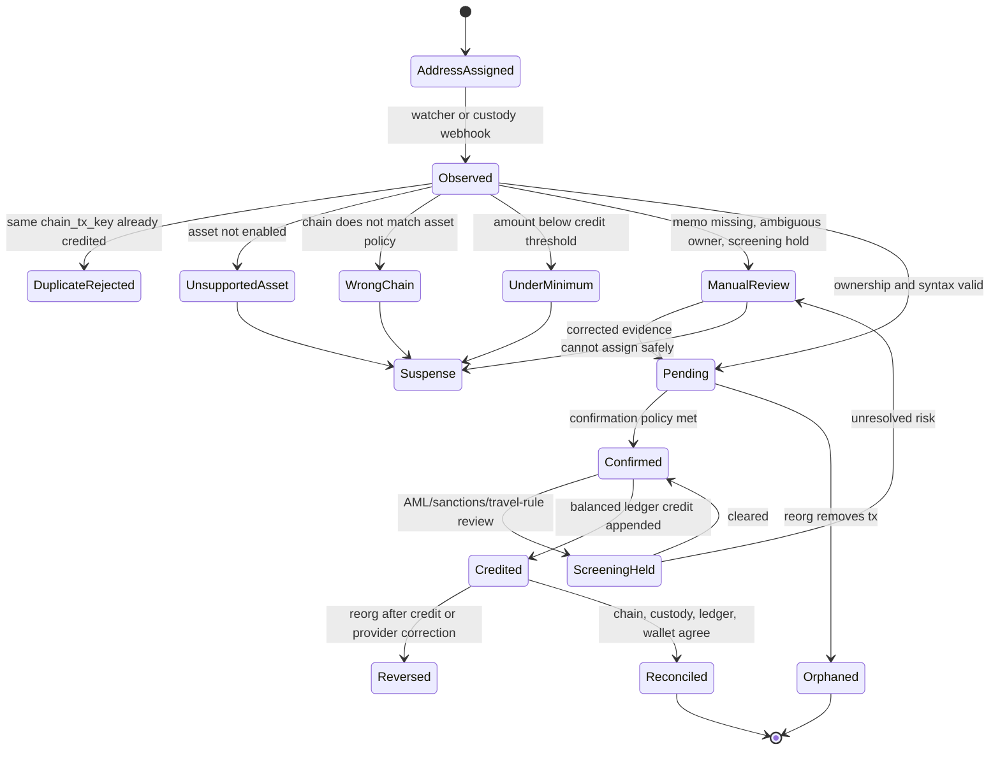
```mermaid
stateDiagram-v2
    [*] --> AddressAssigned
    AddressAssigned --> Observed: watcher or custody webhook
    Observed --> DuplicateRejected: same chain_tx_key already credited
    Observed --> UnsupportedAsset: asset not enabled
    Observed --> WrongChain: chain does not match asset policy
    Observed --> UnderMinimum: amount below credit threshold
    Observed --> ManualReview: memo missing, ambiguous owner, screening hold
    Observed --> Pending: ownership and syntax valid
    Pending --> Confirmed: confirmation policy met
    Pending --> Orphaned: reorg removes tx
    Confirmed --> ScreeningHeld: AML/sanctions/travel-rule review
    ScreeningHeld --> Confirmed: cleared
    ScreeningHeld --> ManualReview: unresolved risk
    Confirmed --> Credited: balanced ledger credit appended
    Credited --> Reversed: reorg after credit or provider correction
    Credited --> Reconciled: chain, custody, ledger, wallet agree
    ManualReview --> Pending: corrected evidence
    ManualReview --> Suspense: cannot assign safely
    UnsupportedAsset --> Suspense
    WrongChain --> Suspense
    UnderMinimum --> Suspense
    Orphaned --> [*]
    Reconciled --> [*]
```

### Algorithms

1. Assign deposit addresses only from approved wallet inventory. For memo/tag chains, reserve unique memo/tag values per user and asset; reject shared-address deposits with missing or mismatched memo/tag into suspense.
2. Ingest watcher and custody-provider events into canonical `DepositEvidence`; deduplicate by `(chain_id, tx_hash, output_index_or_log_index, asset)`.
3. Validate that chain, asset contract, address, memo/tag, amount precision, and minimum amount match active policy at the observed block height.
4. Apply confirmation policy by asset/chain risk tier. A transaction is confirmed only when `canonical_tip_height - included_height + 1 >= required_confirmations` and the block hash remains canonical.
5. Run AML, sanctions, and Travel Rule checks before credit. Screening decisions must be recorded with immutable evidence hashes and policy versions.
6. Credit only once. The ledger journal debits `ExternalClearing` or `TreasuryHot` and credits `UserAvailable` for the exact net credit amount; fees or recovery charges require separate balanced lines.
7. Reorg after credit posts a reversal journal and locks or debits the user account according to policy. If available balance is insufficient, route to `UserLocked` or approved receivable/suspense account; never silently mutate balances.
8. Reconcile deposits by comparing chain/custody evidence, deposit table state, ledger journal ids, wallet projection sequence, and treasury inventory.

### Data Structures

```rust
struct DepositAddressAssignment {
    assignment_id: u128,
    user_id: u128,
    asset: AssetId,
    chain: ChainId,
    address: String,
    memo_tag: Option<String>,
    status: AddressStatus,
    assigned_at_seq: u64,
}

enum DepositStatus { Observed, Pending, Confirmed, ScreeningHeld, ManualReview, Credited, Reconciled, Orphaned, Suspense, Reversed }

struct DepositEvidence {
    deposit_id: u128,
    chain: ChainId,
    tx_hash: [u8; 32],
    output_index: u32,
    block_height: u64,
    block_hash: [u8; 32],
    to_address: String,
    memo_tag: Option<String>,
    asset: AssetId,
    amount: Amount,
    observed_by: EvidenceSource,
    evidence_hash: [u8; 32],
}

struct DepositRecord {
    evidence: DepositEvidence,
    user_id: Option<u128>,
    status: DepositStatus,
    confirmations: u32,
    ledger_journal_id: Option<u128>,
    screening_case_id: Option<u128>,
    idempotency_key: [u8; 32],
}
```

### Rust-style pseudocode

```rust
fn detect_deposit(raw: ChainObservation, state: &mut DepositState) -> Result<DepositId, Error> {
    let ev = normalize_observation(raw)?;
    let key = chain_tx_key(ev.chain, ev.tx_hash, ev.output_index, ev.asset);
    if state.deposits.contains_key(&key) { return handle_duplicate_tx(key, &ev, state); }
    state.event_log.append(DepositEvent::Observed(ev.clone()))?;
    state.deposits.insert(key, DepositRecord::observed(ev));
    Ok(state.deposits[&key].evidence.deposit_id)
}

fn validate_deposit(id: DepositId, state: &mut DepositState) -> Result<(), Error> {
    let rec = state.deposits.get_mut_id(id)?;
    let policy = state.asset_policy.at_height(rec.evidence.asset, rec.evidence.chain, rec.evidence.block_height)?;
    if !policy.supported { rec.status = DepositStatus::Suspense; return Err(Error::UnsupportedAsset); }
    if rec.evidence.chain != policy.chain { return handle_wrong_chain_deposit(id, state); }
    if rec.evidence.amount < policy.minimum_deposit { rec.status = DepositStatus::Suspense; return Err(Error::UnderMinimumDeposit); }
    let assignment = state.address_book.lookup(&rec.evidence.to_address, rec.evidence.memo_tag.as_deref())
        .ok_or(Error::UnknownDepositOwner)?;
    rec.user_id = Some(assignment.user_id);
    rec.status = DepositStatus::Pending;
    state.event_log.append(DepositEvent::Validated(id, assignment.assignment_id))?;
    Ok(())
}

fn check_confirmations(id: DepositId, tip: ChainTip, state: &mut DepositState) -> Result<(), Error> {
    let rec = state.deposits.get_mut_id(id)?;
    if !state.chain.is_canonical(rec.evidence.chain, rec.evidence.block_height, rec.evidence.block_hash) {
        return handle_reorg(id, tip, state);
    }
    let required = state.asset_policy.confirmations(rec.evidence.asset, rec.evidence.chain);
    rec.confirmations = tip.height.saturating_sub(rec.evidence.block_height).saturating_add(1) as u32;
    if rec.confirmations >= required { rec.status = DepositStatus::Confirmed; }
    state.event_log.append(DepositEvent::ConfirmationsUpdated(id, rec.confirmations))?;
    Ok(())
}

fn screen_deposit(id: DepositId, state: &mut DepositState) -> Result<(), Error> {
    let rec = state.deposits.get_mut_id(id)?;
    let decision = state.compliance.screen_inbound(rec.evidence.canonical_bytes())?;
    rec.screening_case_id = Some(decision.case_id);
    match decision.result {
        ScreenResult::Clear => Ok(()),
        ScreenResult::Hold => { rec.status = DepositStatus::ScreeningHeld; Err(Error::ComplianceHold) }
        ScreenResult::Reject => { rec.status = DepositStatus::Suspense; Err(Error::ComplianceRejected) }
    }
}

fn credit_deposit(id: DepositId, ledger: &mut LedgerState, state: &mut DepositState) -> Result<u128, Error> {
    let rec = state.deposits.get_mut_id(id)?;
    ensure!(rec.status == DepositStatus::Confirmed, Error::NotConfirmed);
    let user = rec.user_id.ok_or(Error::UnknownDepositOwner)?;
    let key = rec.idempotency_key;
    let journal = JournalTransaction::new(key, vec![
        debit(account::external_clearing(rec.evidence.asset), rec.evidence.amount, memo::DEPOSIT_CLEARING),
        credit(account::user_available(user, rec.evidence.asset), rec.evidence.amount, memo::DEPOSIT_CREDIT),
    ])?;
    validate_balanced_by_asset(&journal)?;
    let journal_id = ledger.append_journal(journal, Causation::Deposit(id))?;
    rec.ledger_journal_id = Some(journal_id);
    rec.status = DepositStatus::Credited;
    state.notifications.enqueue(user, NotificationKind::DepositCredited(id));
    Ok(journal_id)
}

fn reconcile_deposit(id: DepositId, sources: &Sources) -> Result<(), Error> {
    let rec = sources.deposits.load(id)?;
    sources.chain.require_canonical(&rec.evidence)?;
    sources.ledger.require_journal(rec.ledger_journal_id.ok_or(Error::MissingJournal)?)?;
    sources.wallet.require_credit(rec.user_id.unwrap(), rec.evidence.asset, rec.evidence.amount, rec.ledger_journal_id.unwrap())?;
    sources.treasury.require_external_balance_at_least(rec.evidence.asset, rec.evidence.amount)?;
    Ok(())
}

fn handle_reorg(id: DepositId, tip: ChainTip, state: &mut DepositState) -> Result<(), Error> {
    let rec = state.deposits.get_mut_id(id)?;
    rec.status = DepositStatus::Orphaned;
    state.event_log.append(DepositEvent::Orphaned(id, tip.block_hash))?;
    if let Some(journal_id) = rec.ledger_journal_id {
        state.reversal_queue.push(DepositReversalRequest { deposit_id: id, original_journal_id: journal_id });
    }
    Ok(())
}

fn handle_duplicate_tx(key: ChainTxKey, ev: &DepositEvidence, state: &mut DepositState) -> Result<DepositId, Error> {
    let existing = state.deposits.get(&key).unwrap();
    if existing.evidence.evidence_hash != ev.evidence_hash { return Err(Error::DuplicateTxConflict); }
    Ok(existing.evidence.deposit_id)
}

fn handle_wrong_chain_deposit(id: DepositId, state: &mut DepositState) -> Result<(), Error> {
    let rec = state.deposits.get_mut_id(id)?;
    rec.status = DepositStatus::Suspense;
    state.review.create_case(id, ReviewReason::WrongChainDeposit)?;
    Err(Error::WrongChainDeposit)
}
```

### Mermaid diagrams

On-chain deposit to ledger credit:

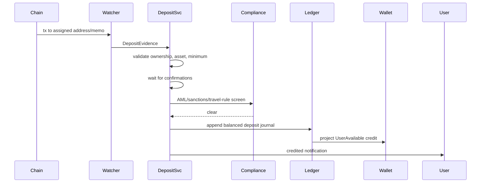
```mermaid
sequenceDiagram
    participant Chain
    participant Watcher
    participant DepositSvc
    participant Compliance
    participant Ledger
    participant Wallet
    participant User
    Chain->>Watcher: tx to assigned address/memo
    Watcher->>DepositSvc: DepositEvidence
    DepositSvc->>DepositSvc: validate ownership, asset, minimum
    DepositSvc->>DepositSvc: wait for confirmations
    DepositSvc->>Compliance: AML/sanctions/travel-rule screen
    Compliance-->>DepositSvc: clear
    DepositSvc->>Ledger: append balanced deposit journal
    Ledger->>Wallet: project UserAvailable credit
    DepositSvc->>User: credited notification
```

Reorg handling:

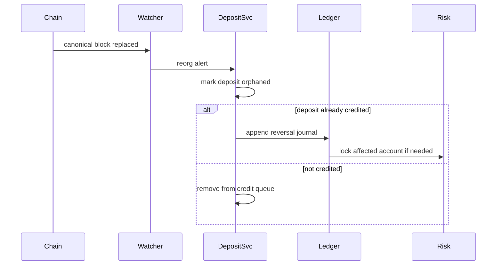
```mermaid
sequenceDiagram
    participant Chain
    participant Watcher
    participant DepositSvc
    participant Ledger
    participant Risk
    Chain->>Watcher: canonical block replaced
    Watcher->>DepositSvc: reorg alert
    DepositSvc->>DepositSvc: mark deposit orphaned
    alt deposit already credited
        DepositSvc->>Ledger: append reversal journal
        Ledger->>Risk: lock affected account if needed
    else not credited
        DepositSvc->>DepositSvc: remove from credit queue
    end
```

Deposit reconciliation flow:

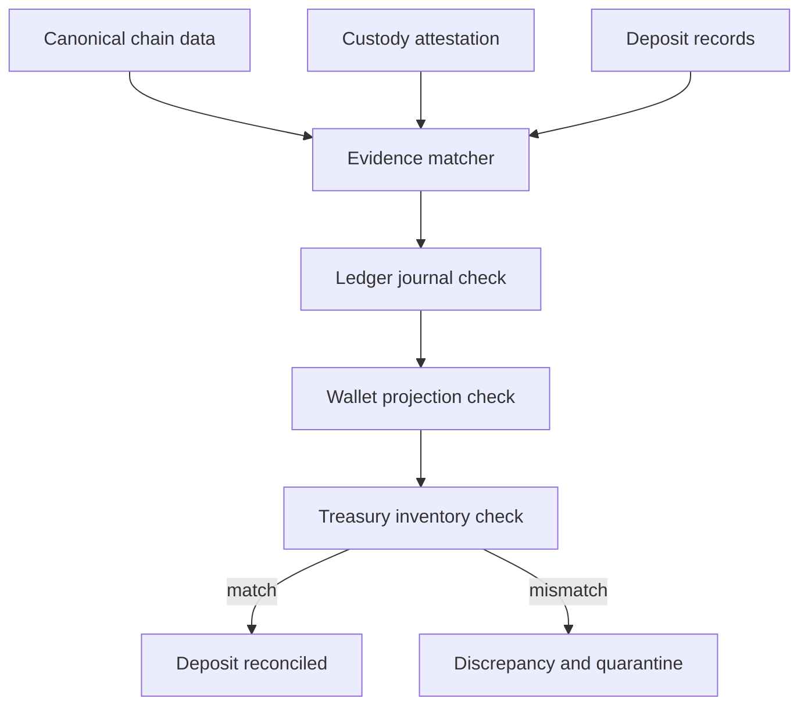
```mermaid
flowchart TD
    C[Canonical chain data] --> M[Evidence matcher]
    CP[Custody attestation] --> M
    D[Deposit records] --> M
    M --> L[Ledger journal check]
    L --> W[Wallet projection check]
    W --> T[Treasury inventory check]
    T -->|match| R[Deposit reconciled]
    T -->|mismatch| Q[Discrepancy and quarantine]
```

### Accounting entries

- Standard deposit credit: debit `ExternalClearing(asset)` and credit `UserAvailable(user, asset)` for the exact deposit amount.
- Deposit routed to suspense: debit `ExternalClearing(asset)` and credit `DepositSuspense(asset)` until ownership or disposition is approved.
- Reversal after credit: debit `UserAvailable` if sufficient, otherwise debit approved `UserReceivable` or `LossSuspense`, and credit `ExternalClearing` for the original amount. Any loss recognition requires a separate approved journal.
- Recovery fee: debit `DepositSuspense` or `UserAvailable` and credit `FeeRevenue` only under an explicit fee schedule.

### Ledger invariants

- A `(chain, tx_hash, output_index, asset)` can cause at most one credit journal.
- Credited deposits must have user ownership, finality proof, and screening evidence.
- Pending deposits are not available balances.
- Reversal journals must reference the original deposit journal.
- Unsupported, wrong-chain, and under-minimum deposits must remain in suspense or be returned through an approved withdrawal-like workflow.

### Failure modes

- **Duplicate observation**: return existing deposit id if payload hash matches; reject and investigate if it differs.
- **Missing memo/tag**: route to manual review and suspense; do not guess user ownership.
- **Reorg before credit**: mark orphaned and remove from credit queue.
- **Reorg after credit**: append reversal, notify user, and quarantine if funds are unavailable.
- **Unsupported/wrong-chain deposit**: record evidence, route to suspense, and require recovery approval.
- **Compliance hold**: freeze crediting while preserving pending evidence.
- **Custody webhook conflict**: prefer canonical chain verification or signed custodian correction with maker-checker approval.

### Security considerations

Deposit address generation must use approved custody derivation paths and never expose private keys. Watcher inputs are untrusted until canonicalized and confirmed. Compliance evidence must be immutable and access controlled. Manual recovery requires dual approval. Notifications must not leak sensitive AML case details. Custody-provider integrations stop at evidence and movement instructions; they cannot mutate HermesNet ledger balances.

### Reconciliation rules

- Every credited deposit reconciles to canonical chain evidence or signed custodian statement.
- Deposit suspense is reconciled daily by asset, age, owner hypothesis, and disposition status.
- Wallet credits must equal ledger credits at the credited ledger sequence.
- Treasury inventory must include credited external receipts net of in-flight sweeps.
- Reorg scans revisit all deposits inside the chain risk window.

### Observability

Emit metrics for observed deposits, pending age, confirmations, credited count, duplicate count, reorg count, screening holds, suspense amount, wrong-chain count, and reconciliation failures. Logs include deposit id, chain tx key, policy version, state transition, evidence hash, and journal id; never log full compliance details or secrets.

### Testing strategy

Unit test address lookup, memo/tag matching, confirmation counting, duplicate handling, suspense routing, journal construction, and notification idempotency. Integration test watcher-to-credit flows with custody webhooks and chain reorg fixtures. Replay tests rebuild deposits and wallet credits from immutable events.

### Property-based tests

Generate random chain observations, duplicates, reorg depths, memo combinations, confirmation policies, and screening outcomes. Assert no double credit, no credit before confirmations, balanced journals, deterministic state transitions, and exact replay of credited/suspense totals.

### Codex implementation contract

Implement deposits as event-sourced state transitions with idempotent chain tx keys, fixed-point amounts, balanced journals, compliance evidence links, and deterministic reorg handling. Do not credit from watcher callbacks directly. Do not call the matching hot path. Do not create ad hoc balance updates outside ledger append.

### Review checklist

- [ ] Address assignment and memo/tag ownership are explicit.
- [ ] Confirmation policy is versioned by asset and chain.
- [ ] Duplicate transactions cannot double credit.
- [ ] Reorg reversal is balanced and auditable.
- [ ] Unsupported and wrong-chain deposits route to suspense/manual review.
- [ ] AML, sanctions, and Travel Rule gates precede credit.

### Acceptance criteria

A deposit can be traced from address assignment through chain evidence, confirmations, screening, ledger credit, wallet projection, notification, and reconciliation. Every exceptional path ends in a deterministic state with auditable recovery.

## Chapter 6: Withdrawal Processing

### Purpose

Define safe user withdrawals from request to external settlement while preventing double spend, enforcing compliance, preserving hot/cold wallet controls, and ensuring every hold, debit, fee, cancellation, failure, and confirmation is balanced and auditable.

### Scope

Covers withdrawal request, available balance check, withdrawal hold, fee estimation, address validation, whitelist enforcement, 2FA, email confirmation, AML/sanctions screening, risk scoring, maker-checker approval, batching, hot wallet liquidity, cold refill request, HSM/MPC signing boundary, broadcast, confirmation tracking, failed/cancelled/frozen withdrawals, reversal policy, ledger debit, reconciliation, notification, emergency freeze, and admin override rules.

### Non-Goals

- Do not define private-key custody internals beyond the integration boundary.
- Do not permit withdrawals to bypass ledger holds.
- Do not use withdrawal services for treasury-only movements; those are Chapter 7 transfers.
- Do not allow admin override without immutable reason, approval, and journal evidence.

### Domain Model

- **Withdrawal Request**: user command with asset, amount, destination, chain, fee preference, idempotency key, and authentication evidence.
- **Withdrawal Hold**: ledger reservation debiting `UserAvailable` and crediting `UserWithdrawalHold` for amount plus internal fee estimate.
- **Approval Case**: maker-checker/risk/compliance decision object.
- **Withdrawal Batch**: deterministic group of approved withdrawals signed and broadcast together when chain supports batching.
- **Signing Request**: instruction sent to HSM/MPC/custodian with policy hash; signing service returns signed transaction or rejection.
- **External Settlement**: broadcast transaction and confirmation evidence.

### State Machines

Withdrawal lifecycle:

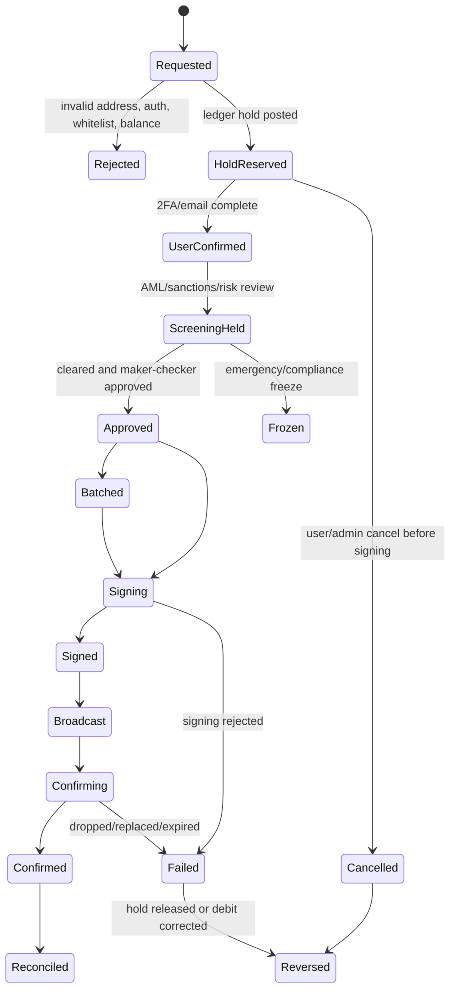
```mermaid
stateDiagram-v2
    [*] --> Requested
    Requested --> Rejected: invalid address, auth, whitelist, balance
    Requested --> HoldReserved: ledger hold posted
    HoldReserved --> UserConfirmed: 2FA/email complete
    UserConfirmed --> ScreeningHeld: AML/sanctions/risk review
    ScreeningHeld --> Approved: cleared and maker-checker approved
    ScreeningHeld --> Frozen: emergency/compliance freeze
    Approved --> Batched
    Approved --> Signing
    Batched --> Signing
    Signing --> Signed
    Signing --> Failed: signing rejected
    Signed --> Broadcast
    Broadcast --> Confirming
    Confirming --> Confirmed
    Confirming --> Failed: dropped/replaced/expired
    HoldReserved --> Cancelled: user/admin cancel before signing
    Failed --> Reversed: hold released or debit corrected
    Cancelled --> Reversed
    Confirmed --> Reconciled
```

### Algorithms

1. Canonicalize request and enforce idempotency.
2. Validate destination syntax, asset-chain support, whitelist status, travel-rule beneficiary requirements, 2FA, email confirmation, user/account status, and emergency freeze flags.
3. Estimate network and platform fees using versioned fee policy; compute hold amount with checked arithmetic.
4. Reserve withdrawal hold using a balanced journal before any external signing instruction.
5. Screen destination, user, velocity, sanctions, AML, and risk score. Escalate high-risk withdrawals to maker-checker approval.
6. Check hot wallet liquidity. If insufficient, create a Chapter 7 cold/warm refill request and keep withdrawal approved but unsignable until funded.
7. Sign only approved withdrawal batches through HSM/MPC/custodian policy. The signing boundary receives no permission to alter ledger state.
8. On broadcast, record tx hash and monitor confirmations. On final confirmation, settle hold into external clearing/treasury and fee revenue. On failure or cancellation, release hold through reversal journal.

### Data Structures

```rust
enum WithdrawalStatus { Requested, HoldReserved, UserConfirmed, ScreeningHeld, Approved, Batched, Signing, Signed, Broadcast, Confirming, Confirmed, Failed, Cancelled, Frozen, Reversed, Reconciled }

struct WithdrawalRequest {
    withdrawal_id: u128,
    user_id: u128,
    asset: AssetId,
    chain: ChainId,
    amount: Amount,
    destination: String,
    memo_tag: Option<String>,
    fee_quote: FeeQuote,
    idempotency_key: [u8; 32],
    auth_evidence_hash: [u8; 32],
}

struct WithdrawalRecord {
    request: WithdrawalRequest,
    status: WithdrawalStatus,
    hold_journal_id: Option<u128>,
    settlement_journal_id: Option<u128>,
    approval_case_id: Option<u128>,
    batch_id: Option<u128>,
    tx_hash: Option<[u8; 32]>,
    confirmations: u32,
}
```

### Rust-style pseudocode

```rust
fn request_withdrawal(cmd: WithdrawalCommand, state: &mut WithdrawalState) -> Result<WithdrawalId, Error> {
    let hash = hash32(&cmd.canonical_bytes());
    state.idempotency.reserve_or_verify(cmd.idempotency_key, hash)?;
    state.auth.require_2fa(cmd.user_id, cmd.auth_token)?;
    let rec = WithdrawalRecord::new(cmd.try_into()?);
    state.event_log.append(WithdrawalEvent::Requested(rec.request.clone()))?;
    state.withdrawals.insert(rec.request.withdrawal_id, rec);
    Ok(rec.request.withdrawal_id)
}

fn validate_withdrawal(id: WithdrawalId, state: &WithdrawalState) -> Result<(), Error> {
    let rec = state.withdrawals.get(&id)?;
    state.freeze.require_not_frozen(rec.request.user_id, rec.request.asset)?;
    state.address_policy.validate(rec.request.chain, rec.request.asset, &rec.request.destination, rec.request.memo_tag.as_deref())?;
    state.whitelist.require_allowed(rec.request.user_id, &rec.request.destination)?;
    state.email.require_confirmed(id)?;
    let total = checked_add(rec.request.amount, rec.request.fee_quote.max_fee)?;
    state.wallet.require_available(rec.request.user_id, rec.request.asset, total)?;
    Ok(())
}

fn reserve_withdrawal_hold(id: WithdrawalId, ledger: &mut LedgerState, state: &mut WithdrawalState) -> Result<u128, Error> {
    validate_withdrawal(id, state)?;
    let rec = state.withdrawals.get_mut(&id)?;
    let total = checked_add(rec.request.amount, rec.request.fee_quote.max_fee)?;
    let journal = JournalTransaction::new(rec.request.idempotency_key, vec![
        debit(account::user_available(rec.request.user_id, rec.request.asset), total, memo::WITHDRAWAL_HOLD),
        credit(account::user_withdrawal_hold(rec.request.user_id, rec.request.asset), total, memo::WITHDRAWAL_HOLD),
    ])?;
    let jid = ledger.append_journal(journal, Causation::WithdrawalHold(id))?;
    rec.hold_journal_id = Some(jid);
    rec.status = WithdrawalStatus::HoldReserved;
    Ok(jid)
}

fn screen_withdrawal(id: WithdrawalId, state: &mut WithdrawalState) -> Result<(), Error> {
    let rec = state.withdrawals.get_mut(&id)?;
    let decision = state.risk.screen_outbound(&rec.request)?;
    rec.approval_case_id = Some(decision.case_id);
    match decision.result {
        RiskResult::AutoClear => rec.status = WithdrawalStatus::Approved,
        RiskResult::MakerChecker => rec.status = WithdrawalStatus::ScreeningHeld,
        RiskResult::Freeze => rec.status = WithdrawalStatus::Frozen,
        RiskResult::Reject => rec.status = WithdrawalStatus::Failed,
    }
    Ok(())
}

fn approve_withdrawal(id: WithdrawalId, approval: Approval, state: &mut WithdrawalState) -> Result<(), Error> {
    state.approvals.require_maker_checker(approval, Permission::ApproveWithdrawal)?;
    let rec = state.withdrawals.get_mut(&id)?;
    ensure!(matches!(rec.status, WithdrawalStatus::ScreeningHeld | WithdrawalStatus::Approved), Error::BadState);
    rec.status = WithdrawalStatus::Approved;
    state.event_log.append(WithdrawalEvent::Approved(id, approval.evidence_hash))?;
    Ok(())
}

fn sign_withdrawal(id: WithdrawalId, signer: &Signer, state: &mut WithdrawalState) -> Result<SignedTx, Error> {
    let rec = state.withdrawals.get_mut(&id)?;
    ensure!(rec.status == WithdrawalStatus::Approved, Error::NotApproved);
    state.treasury.require_hot_liquidity(rec.request.asset, rec.request.amount)?;
    rec.status = WithdrawalStatus::Signing;
    signer.sign_with_policy(rec.request.signing_payload(), state.policy.signing_hash())
}

fn broadcast_withdrawal(id: WithdrawalId, tx: SignedTx, state: &mut WithdrawalState) -> Result<(), Error> {
    let tx_hash = state.chain.broadcast(tx)?;
    let rec = state.withdrawals.get_mut(&id)?;
    rec.tx_hash = Some(tx_hash);
    rec.status = WithdrawalStatus::Confirming;
    state.event_log.append(WithdrawalEvent::Broadcast(id, tx_hash))?;
    Ok(())
}

fn confirm_withdrawal(id: WithdrawalId, ledger: &mut LedgerState, state: &mut WithdrawalState) -> Result<(), Error> {
    let rec = state.withdrawals.get_mut(&id)?;
    state.chain.require_confirmed(rec.tx_hash.ok_or(Error::MissingTxHash)?, state.policy.confirmations(rec.request.asset, rec.request.chain))?;
    let actual_fee = state.chain.actual_fee(rec.tx_hash.unwrap())?;
    let refund = checked_sub(rec.request.fee_quote.max_fee, actual_fee)?;
    let mut lines = vec![
        debit(account::user_withdrawal_hold(rec.request.user_id, rec.request.asset), checked_add(rec.request.amount, rec.request.fee_quote.max_fee)?, memo::WITHDRAWAL_SETTLE),
        credit(account::external_clearing(rec.request.asset), rec.request.amount, memo::WITHDRAWAL_SENT),
        credit(account::fee_revenue(rec.request.asset), actual_fee, memo::WITHDRAWAL_FEE),
    ];
    if refund > Amount(0) { lines.push(credit(account::user_available(rec.request.user_id, rec.request.asset), refund, memo::FEE_REFUND)); }
    let jid = ledger.append_journal(JournalTransaction::new(hash32(&id.to_be_bytes()), lines)?, Causation::WithdrawalConfirmed(id))?;
    rec.settlement_journal_id = Some(jid);
    rec.status = WithdrawalStatus::Confirmed;
    Ok(())
}

fn fail_withdrawal(id: WithdrawalId, reason: FailureReason, ledger: &mut LedgerState, state: &mut WithdrawalState) -> Result<(), Error> {
    let rec = state.withdrawals.get_mut(&id)?;
    rec.status = WithdrawalStatus::Failed;
    release_withdrawal_hold(id, reason, ledger, state)
}

fn cancel_withdrawal(id: WithdrawalId, actor: Actor, ledger: &mut LedgerState, state: &mut WithdrawalState) -> Result<(), Error> {
    state.auth.can_cancel(actor, id)?;
    let rec = state.withdrawals.get_mut(&id)?;
    ensure!(!matches!(rec.status, WithdrawalStatus::Signing | WithdrawalStatus::Broadcast | WithdrawalStatus::Confirming | WithdrawalStatus::Confirmed), Error::TooLateToCancel);
    rec.status = WithdrawalStatus::Cancelled;
    release_withdrawal_hold(id, FailureReason::Cancelled, ledger, state)
}

fn reconcile_withdrawal(id: WithdrawalId, sources: &Sources) -> Result<(), Error> {
    let rec = sources.withdrawals.load(id)?;
    sources.ledger.require_journal(rec.hold_journal_id.ok_or(Error::MissingHold)?)?;
    if rec.status == WithdrawalStatus::Confirmed { sources.chain.require_confirmed_tx(rec.tx_hash.unwrap())?; }
    sources.wallet.require_hold_or_settlement_consistency(id)?;
    Ok(())
}
```

### Mermaid diagrams

Withdrawal approval sequence:

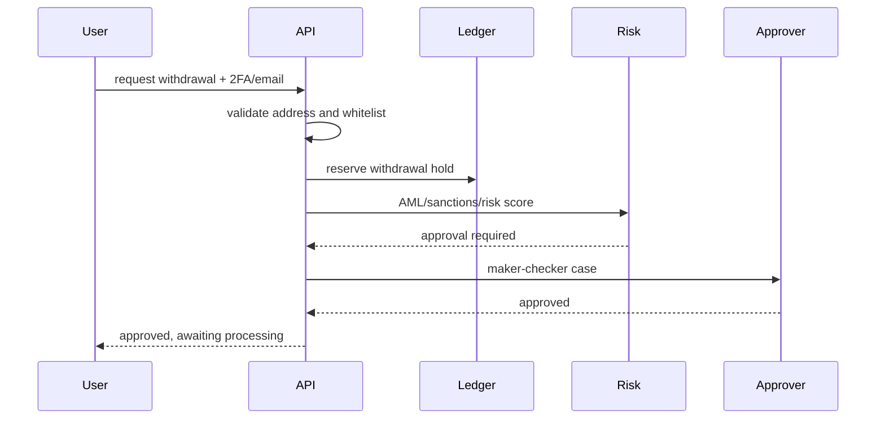
```mermaid
sequenceDiagram
    participant User
    participant API
    participant Ledger
    participant Risk
    participant Approver
    User->>API: request withdrawal + 2FA/email
    API->>API: validate address and whitelist
    API->>Ledger: reserve withdrawal hold
    API->>Risk: AML/sanctions/risk score
    Risk-->>API: approval required
    API->>Approver: maker-checker case
    Approver-->>API: approved
    API-->>User: approved, awaiting processing
```

Hot wallet signing sequence:

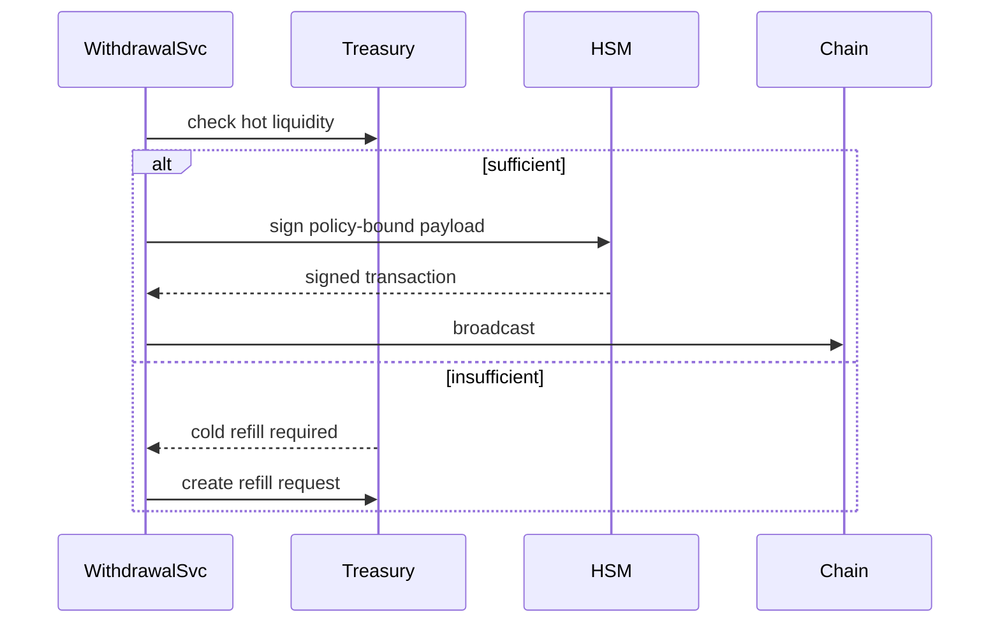
```mermaid
sequenceDiagram
    participant WithdrawalSvc
    participant Treasury
    participant HSM
    participant Chain
    WithdrawalSvc->>Treasury: check hot liquidity
    alt sufficient
        WithdrawalSvc->>HSM: sign policy-bound payload
        HSM-->>WithdrawalSvc: signed transaction
        WithdrawalSvc->>Chain: broadcast
    else insufficient
        Treasury-->>WithdrawalSvc: cold refill required
        WithdrawalSvc->>Treasury: create refill request
    end
```

Failed withdrawal recovery:

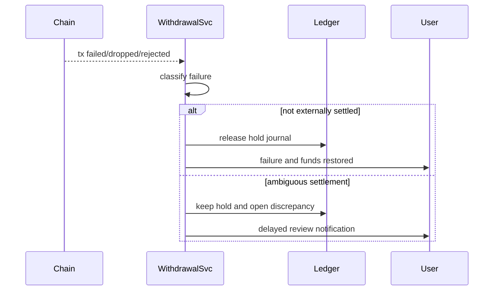
```mermaid
sequenceDiagram
    participant Chain
    participant WithdrawalSvc
    participant Ledger
    participant User
    Chain-->>WithdrawalSvc: tx failed/dropped/rejected
    WithdrawalSvc->>WithdrawalSvc: classify failure
    alt not externally settled
        WithdrawalSvc->>Ledger: release hold journal
        WithdrawalSvc->>User: failure and funds restored
    else ambiguous settlement
        WithdrawalSvc->>Ledger: keep hold and open discrepancy
        WithdrawalSvc->>User: delayed review notification
    end
```

### Accounting entries

- Hold: debit `UserAvailable`, credit `UserWithdrawalHold` for amount plus maximum fee.
- Confirmed settlement: debit `UserWithdrawalHold`, credit `ExternalClearing` for sent amount, credit `FeeRevenue` for actual fee, and credit `UserAvailable` for fee refund if estimate exceeded actual fee.
- Cancellation/failure before external settlement: debit `UserWithdrawalHold`, credit `UserAvailable` for the full held amount.
- Frozen withdrawal: no settlement journal; hold remains or is released only by approved policy.

### Ledger invariants

- No signing without an existing hold journal.
- No broadcast without approval and signing evidence.
- One withdrawal hold can settle, cancel, or fail exactly once.
- Confirmed withdrawal settlement must not exceed held amount.
- Admin override cannot skip balanced journals or approval evidence.

### Failure modes

Invalid address, missing memo/tag, whitelist miss, failed 2FA/email, insufficient available balance, compliance hold, hot wallet shortage, HSM rejection, custody outage, chain broadcast failure, dropped transaction, fee spike, partial batch failure, emergency freeze, and ambiguous confirmation. Recovery is hold release when no external settlement occurred, continued hold plus discrepancy when settlement is ambiguous, or final settlement when confirmed.

### Security considerations

Withdrawals require strong authentication, address whitelist cooling periods, velocity controls, sanctions screening, maker-checker for risk thresholds, policy-bound HSM/MPC signing, emergency freeze, and immutable admin override records. Signing systems cannot initiate ledger debits and ledger systems cannot access private keys.

### Reconciliation rules

- Reconcile each hold to a withdrawal record and user wallet pending withdrawal.
- Reconcile confirmed withdrawals to chain tx hashes and custody statements.
- Reconcile fee estimate, actual chain fee, fee revenue, and refunds.
- Reconcile batches by proving every output maps to one approved withdrawal or treasury movement.
- Age stalled holds and escalate by policy.

### Observability

Track request volume, rejection reasons, hold amount, screening holds, approval latency, hot-wallet shortages, signing failures, broadcast failures, confirmation latency, stuck withdrawals, cancelled count, and reconciliation discrepancies. Logs include withdrawal id, policy versions, journal ids, approval ids, batch ids, and tx hashes.

### Testing strategy

Test validation gates, hold posting, duplicate idempotency, whitelist enforcement, fee refunds, cancellation before signing, failed signing recovery, dropped tx recovery, batch mapping, emergency freeze, and admin override audit. Integration tests use fake chain and fake HSM/MPC.

### Property-based tests

Generate random withdrawal requests, balances, fee estimates, risk decisions, chain outcomes, and cancellation races. Assert no double debit, no settlement before hold, no negative available balance, one terminal outcome per withdrawal, and balanced journals across all paths.

### Codex implementation contract

Implement withdrawal state as event sourced, idempotent, and ledger-first. External signing/broadcast is a side effect only after hold and approval. Do not store private keys. Do not allow admin paths to mutate balances outside the ledger.

### Review checklist

- [ ] Hold precedes approval-to-sign execution.
- [ ] 2FA, email, whitelist, AML, sanctions, and risk gates are enforced.
- [ ] Maker-checker applies to configured thresholds and overrides.
- [ ] HSM/MPC boundary is policy-bound and ledger-independent.
- [ ] Failure and cancellation release holds only when safe.

### Acceptance criteria

Every withdrawal has a complete audit chain from user request to hold, approval, signing, broadcast, confirmation or recovery, balanced journal entries, notifications, and reconciliation evidence.

## Chapter 7: Treasury and Hot/Cold Wallet Management

### Purpose

Define custody inventory, liquidity management, hot/warm/cold wallet operations, and treasury controls that support deposits and withdrawals without placing wallet databases or custody calls on the trading hot path.

### Scope

Covers hot wallet purpose, warm wallet purpose, cold wallet purpose, custody boundaries, wallet inventory, liquidity thresholds, hot wallet refill, cold wallet sweep, treasury transfer approval, maker-checker controls, HSM/MPC boundary, key rotation, wallet address rotation, emergency freeze, compromised wallet response, chain outage response, reconciliation, balance proof, inventory reporting, internal wallet-pool settlement, and runbooks.

### Non-Goals

- Do not define user withdrawal validation; Chapter 6 owns it.
- Do not expose private-key material to application services.
- Do not use treasury transfers to hide ledger discrepancies.
- Do not make treasury inventory the source of user balances.

### Domain Model

- **Hot Wallet**: online liquidity pool used for routine withdrawal broadcasts; lowest balance consistent with service-level objectives.
- **Warm Wallet**: semi-online buffer requiring stronger approval and signing controls; used to refill hot wallets.
- **Cold Wallet**: offline or highly restricted custody used for long-term storage; used for sweeps and emergency reserves.
- **Wallet Inventory**: per-chain, per-asset inventory of addresses, custody location, status, thresholds, balances, and proof timestamps.
- **Treasury Transfer**: operational movement between internal wallet pools or custody providers, always maker-checker approved and ledger-recorded.
- **Balance Proof**: signed custodian statement, chain proof, or internal attestation used for reconciliation.

### State Machines

Treasury transfer lifecycle:

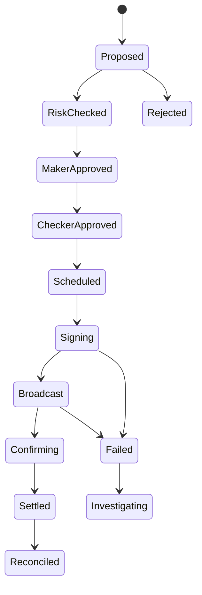
```mermaid
stateDiagram-v2
    [*] --> Proposed
    Proposed --> RiskChecked
    RiskChecked --> MakerApproved
    MakerApproved --> CheckerApproved
    CheckerApproved --> Scheduled
    Scheduled --> Signing
    Signing --> Broadcast
    Broadcast --> Confirming
    Confirming --> Settled
    Proposed --> Rejected
    Signing --> Failed
    Broadcast --> Failed
    Failed --> Investigating
    Settled --> Reconciled
```

Wallet status lifecycle:

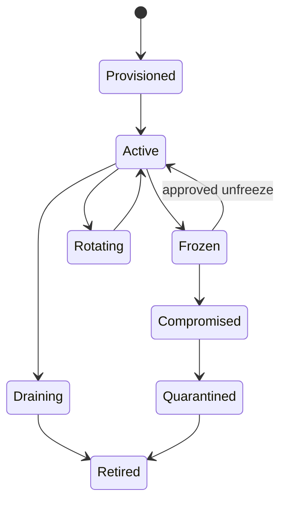
```mermaid
stateDiagram-v2
    [*] --> Provisioned
    Provisioned --> Active
    Active --> Draining
    Draining --> Retired
    Active --> Frozen
    Frozen --> Active: approved unfreeze
    Frozen --> Compromised
    Compromised --> Quarantined
    Quarantined --> Retired
    Active --> Rotating
    Rotating --> Active
```

### Algorithms

1. Evaluate hot-wallet liquidity using pending approved withdrawals, historical outflow percentile, chain congestion, refill lead time, and policy minimum/maximum thresholds.
2. Refill hot wallets from warm/cold wallets only through approved treasury transfers with explicit source, destination, amount, asset, chain, reason, and policy hash.
3. Sweep excess hot-wallet balance to cold storage when balance exceeds maximum threshold or risk signals increase.
4. Rotate wallet addresses by provisioning new addresses, disabling new deposits to old addresses, waiting for in-flight deposits, sweeping residuals, and retiring old addresses.
5. Freeze wallets immediately on compromise signals; disable deposit assignment, withdrawal signing, and treasury transfers except recovery movements approved by incident command.
6. Reconcile inventory by comparing ledger treasury accounts, chain balances, custody statements, pending transfers, and wallet statuses.

### Data Structures

```rust
enum WalletTier { Hot, Warm, Cold }
enum WalletStatus { Provisioned, Active, Draining, Frozen, Compromised, Quarantined, Retired, Rotating }

struct TreasuryWallet {
    wallet_id: u128,
    tier: WalletTier,
    asset: AssetId,
    chain: ChainId,
    address: String,
    custody_provider: Option<u128>,
    status: WalletStatus,
    min_liquidity: Amount,
    target_liquidity: Amount,
    max_liquidity: Amount,
}

struct TreasuryTransfer {
    transfer_id: u128,
    asset: AssetId,
    amount: Amount,
    source_wallet: u128,
    destination_wallet: u128,
    reason: TreasuryReason,
    status: TreasuryTransferStatus,
    approval_case_id: Option<u128>,
    tx_hash: Option<[u8; 32]>,
    journal_id: Option<u128>,
}
```

### Rust-style pseudocode

```rust
fn evaluate_hot_wallet_liquidity(asset: AssetId, chain: ChainId, state: &TreasuryState) -> LiquidityDecision {
    let hot = state.inventory.hot_wallet(asset, chain);
    let pending = state.withdrawals.approved_pending(asset, chain);
    let buffer = state.policy.outflow_buffer(asset, chain);
    let required = checked_add(pending, buffer).unwrap();
    if hot.available < required { LiquidityDecision::Refill(required - hot.available) }
    else if hot.available > hot.max_liquidity { LiquidityDecision::Sweep(hot.available - hot.target_liquidity) }
    else { LiquidityDecision::Noop }
}

fn initiate_treasury_transfer(cmd: TreasuryTransferCommand, state: &mut TreasuryState) -> Result<u128, Error> {
    state.auth.require(cmd.actor, Permission::ProposeTreasuryTransfer)?;
    state.inventory.require_transferable(cmd.source_wallet, cmd.destination_wallet, cmd.asset)?;
    let transfer = TreasuryTransfer::proposed(cmd)?;
    state.event_log.append(TreasuryEvent::Proposed(transfer.clone()))?;
    state.transfers.insert(transfer.transfer_id, transfer);
    Ok(transfer.transfer_id)
}

fn approve_treasury_transfer(id: u128, approval: Approval, state: &mut TreasuryState) -> Result<(), Error> {
    state.approvals.require_maker_checker(approval, Permission::ApproveTreasuryTransfer)?;
    let t = state.transfers.get_mut(&id)?;
    t.status = TreasuryTransferStatus::CheckerApproved;
    t.approval_case_id = Some(approval.case_id);
    state.event_log.append(TreasuryEvent::Approved(id, approval.evidence_hash))?;
    Ok(())
}

fn sweep_hot_wallet(wallet_id: u128, amount: Amount, state: &mut TreasuryState) -> Result<u128, Error> {
    let cold = state.inventory.default_cold_for(wallet_id)?;
    initiate_treasury_transfer(TreasuryTransferCommand::sweep(wallet_id, cold, amount), state)
}

fn refill_hot_wallet(asset: AssetId, chain: ChainId, amount: Amount, state: &mut TreasuryState) -> Result<u128, Error> {
    let hot = state.inventory.hot_wallet(asset, chain).wallet_id;
    let source = state.inventory.refill_source(asset, chain, amount)?;
    initiate_treasury_transfer(TreasuryTransferCommand::refill(source, hot, amount), state)
}

fn freeze_wallet(wallet_id: u128, reason: IncidentReason, state: &mut TreasuryState) -> Result<(), Error> {
    let w = state.inventory.get_mut(wallet_id)?;
    w.status = WalletStatus::Frozen;
    state.signing_policy.disable_wallet(wallet_id)?;
    state.deposit_policy.disable_new_assignments(wallet_id)?;
    state.event_log.append(TreasuryEvent::WalletFrozen(wallet_id, reason))?;
    Ok(())
}

fn rotate_wallet_address(wallet_id: u128, state: &mut TreasuryState) -> Result<u128, Error> {
    let old = state.inventory.get_mut(wallet_id)?;
    old.status = WalletStatus::Rotating;
    let new_wallet = state.custody.provision_same_policy(old)?;
    state.deposit_policy.redirect_new_assignments(old.wallet_id, new_wallet.wallet_id)?;
    state.event_log.append(TreasuryEvent::WalletRotated(old.wallet_id, new_wallet.wallet_id))?;
    Ok(new_wallet.wallet_id)
}

fn reconcile_wallet_inventory(state: &TreasuryState, ledger: &LedgerState) -> Result<InventoryReport, Error> {
    let proofs = state.custody.collect_balance_proofs()?;
    let chain_balances = state.chain.collect_balances(&state.inventory)?;
    let ledger_balances = ledger.treasury_balances()?;
    compare_inventory(proofs, chain_balances, ledger_balances, state.pending_transfers())
}
```

### Mermaid diagrams

Treasury architecture:

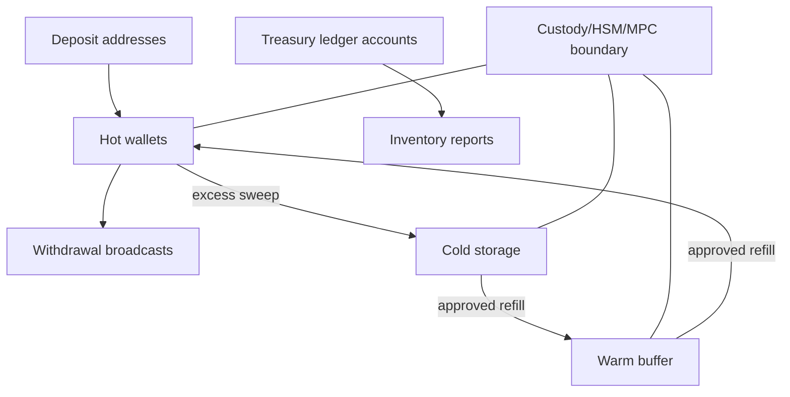
```mermaid
flowchart TB
    Deposits[Deposit addresses] --> Hot[Hot wallets]
    Hot --> Withdrawals[Withdrawal broadcasts]
    Hot -->|excess sweep| Cold[Cold storage]
    Cold -->|approved refill| Warm[Warm buffer]
    Warm -->|approved refill| Hot
    Custody[Custody/HSM/MPC boundary] --- Hot
    Custody --- Warm
    Custody --- Cold
    Ledger[Treasury ledger accounts] --> Reports[Inventory reports]
```

Hot wallet refill sequence:

```mermaid
sequenceDiagram
    participant Monitor
    participant Treasury
    participant Approvers
    participant HSM
    participant Chain
    Monitor->>Treasury: liquidity below threshold
    Treasury->>Approvers: propose refill
    Approvers-->>Treasury: maker-checker approval
    Treasury->>HSM: sign transfer from warm/cold
    HSM-->>Treasury: signed tx
    Treasury->>Chain: broadcast refill
    Chain-->>Treasury: confirmed
```

Cold wallet sweep sequence:

```mermaid
sequenceDiagram
    participant Monitor
    participant Treasury
    participant Approvers
    participant HSM
    participant Chain
    Monitor->>Treasury: hot balance above max
    Treasury->>Approvers: propose sweep
    Approvers-->>Treasury: approval
    Treasury->>HSM: sign sweep to cold
    Treasury->>Chain: broadcast
    Chain-->>Treasury: confirmed
```

Compromised wallet response:

```mermaid
flowchart TD
    A[Compromise signal] --> F[Freeze wallet]
    F --> D[Disable signing and deposits]
    D --> I[Incident command case]
    I --> P[Provision replacement wallet]
    I --> Q[Quarantine balances]
    Q --> R[Reconcile chain and ledger]
    R --> S[Approved recovery or loss journal]
```

### Accounting entries

- Internal treasury transfer: debit destination treasury account and credit source treasury account for the same asset and amount when custody movement is confirmed; pending in-flight may use `TreasuryTransit` as an intermediate account.
- Hot refill pending: debit `TreasuryTransit`, credit source wallet account; on receipt debit hot wallet account, credit `TreasuryTransit`.
- Sweep to cold mirrors the same transit pattern.
- Loss from compromised wallet requires governance approval: debit approved loss/insurance account and credit affected treasury wallet account.

### Ledger invariants

- Treasury transfers never alter user liabilities.
- Every custody movement maps to one approved transfer and balanced journal set.
- In-flight transit accounts must age within policy and reconcile to tx hashes.
- Frozen or compromised wallets cannot sign routine withdrawals or receive new deposit assignments.

### Failure modes

Hot wallet shortage triggers refill and withdrawal queue delay. Custody outage pauses signing and escalates SLA alerts. Chain outage pauses broadcasts and confirmations. Failed treasury transfer remains investigating until tx status is known. Compromised wallet is frozen, quarantined, reconciled, and recovered through incident runbook and approved journals.

### Security considerations

Separate treasury proposers, approvers, signers, and reconciliers. Enforce HSM/MPC policies, key rotation, address rotation, least privilege, withdrawal rate limits, signing allowlists, incident freezes, and immutable runbook evidence. No operator can both propose and approve the same treasury transfer.

### Reconciliation rules

- Compare chain balances, custody proofs, and ledger treasury accounts daily and after every large movement.
- Reconcile hot/warm/cold inventory by asset, chain, wallet id, and status.
- Reconcile transit accounts to pending tx hashes and confirmation status.
- Produce balance proof reports with evidence hashes and signer/custodian attestations.

### Observability

Track wallet balances, threshold breaches, pending refills, pending sweeps, frozen wallets, transit aging, custody API failures, signing latency, chain confirmation latency, and inventory discrepancies. Alerts fire for hot balance below minimum, cold movement without approval, stale transit, and wallet status/policy mismatch.

### Testing strategy

Test threshold decisions, approval enforcement, signer policy rejection, sweep/refill journals, wallet freeze, address rotation, compromised wallet runbook, chain outage handling, and inventory reconciliation with fake custody proofs.

### Property-based tests

Generate random inventory states, thresholds, withdrawals, deposits, and treasury transfers. Assert treasury movements conserve asset totals, never change user liabilities, never sign from frozen wallets, and reconcile transit accounts exactly.

### Codex implementation contract

Implement treasury as an event-sourced operational ledger with maker-checker approvals and custody evidence links. Keep custody signing behind typed interfaces. Do not embed private keys. Do not bypass approval for operational convenience.

### Review checklist

- [ ] Hot, warm, and cold wallet purposes and thresholds are explicit.
- [ ] Maker-checker controls apply to treasury movements.
- [ ] HSM/MPC boundary is isolated from ledger mutation.
- [ ] Freeze, compromise, chain outage, and rotation runbooks are specified.
- [ ] Inventory reports reconcile chain, custody, transit, and ledger.

### Acceptance criteria

Treasury can prove where every externally held asset unit resides, why every movement occurred, who approved it, how it was signed, when it settled, and how it reconciles to ledger balances.

## Chapter 8: Internal Transfers

### Purpose

Define deterministic internal movements between user accounts, subaccounts, product buckets, treasury pools, and administrative adjustment accounts without external chain settlement.

### Scope

Covers user-to-user transfer, account-to-subaccount transfer, spot-to-futures transfer, futures-to-spot transfer, portfolio bucket transfer, treasury internal movement, admin adjustment, reversal, idempotency, balance hold, validation, limits, AML/compliance checks, ledger entries, audit requirements, reconciliation, duplicate prevention, and failure recovery.

### Non-Goals

- Do not define external withdrawals or deposits.
- Do not create credit or margin outside approved margin rules.
- Do not use admin adjustments as silent corrections.
- Do not bypass product-specific eligibility rules.

### Domain Model

An internal transfer is a same-ledger, same-asset movement between two ledger accounts. It may be user initiated, system initiated, treasury initiated, or administrator initiated. Product transfers move value between spot, futures, portfolio, and reserved buckets but never call the matching hot path; they update projections consumed by product risk services after ledger commit.

### State Machines

```mermaid
stateDiagram-v2
    [*] --> Requested
    Requested --> Rejected: validation/compliance/limits fail
    Requested --> Reserved: optional source hold posted
    Reserved --> Approved: compliance or maker-checker clear
    Requested --> Approved: no hold required
    Approved --> Executed: balanced journal appended
    Executed --> Reconciled
    Executed --> ReversalRequested
    ReversalRequested --> Reversed: reversal journal appended
    Reserved --> Cancelled: hold released
```

### Algorithms

1. Canonicalize transfer command and idempotency key.
2. Validate source/destination ownership, account status, same asset, product eligibility, account freeze status, transfer limits, and compliance rules.
3. Reserve source funds for delayed or approval-required transfers by moving available to `TransferHold`.
4. Execute by posting balanced journal from source bucket or hold account to destination bucket.
5. Reverse only by appending a linked reversal journal; verify destination has sufficient available funds or route shortfall to approved suspense/receivable.
6. Reconcile transfer records to source/destination ledger lines and wallet/product projections.

### Data Structures

```rust
enum TransferKind { UserToUser, AccountToSubaccount, SpotToFutures, FuturesToSpot, PortfolioBucket, TreasuryInternal, AdminAdjustment }
enum InternalTransferStatus { Requested, Reserved, Approved, Executed, ReversalRequested, Reversed, Cancelled, Rejected, Reconciled }

struct InternalTransfer {
    transfer_id: u128,
    kind: TransferKind,
    asset: AssetId,
    amount: Amount,
    source: AccountId,
    destination: AccountId,
    requested_by: Actor,
    status: InternalTransferStatus,
    idempotency_key: [u8; 32],
    journal_id: Option<u128>,
    reversal_of: Option<u128>,
}
```

### Rust-style pseudocode

```rust
fn request_internal_transfer(cmd: TransferCommand, state: &mut TransferState) -> Result<u128, Error> {
    state.idempotency.reserve_or_verify(cmd.idempotency_key, hash32(&cmd.canonical_bytes()))?;
    let t = InternalTransfer::from_command(cmd)?;
    state.event_log.append(TransferEvent::Requested(t.clone()))?;
    state.transfers.insert(t.transfer_id, t);
    Ok(t.transfer_id)
}

fn validate_internal_transfer(id: u128, state: &TransferState) -> Result<(), Error> {
    let t = state.transfers.get(&id)?;
    ensure!(t.amount > Amount(0), Error::InvalidAmount);
    state.accounts.require_open(t.source)?;
    state.accounts.require_open(t.destination)?;
    state.accounts.require_same_asset(t.source, t.destination, t.asset)?;
    state.freeze.require_not_frozen_account(t.source)?;
    state.limits.require_within(t.requested_by, t.kind, t.asset, t.amount)?;
    state.compliance.require_internal_transfer_clear(t)?;
    Ok(())
}

fn reserve_transfer(id: u128, ledger: &mut LedgerState, state: &mut TransferState) -> Result<u128, Error> {
    validate_internal_transfer(id, state)?;
    let t = state.transfers.get_mut(&id)?;
    let hold = account::transfer_hold(t.source, t.asset);
    let journal = JournalTransaction::new(t.idempotency_key, vec![
        debit(t.source, t.amount, memo::TRANSFER_HOLD),
        credit(hold, t.amount, memo::TRANSFER_HOLD),
    ])?;
    let jid = ledger.append_journal(journal, Causation::InternalTransferHold(id))?;
    t.status = InternalTransferStatus::Reserved;
    t.journal_id = Some(jid);
    Ok(jid)
}

fn execute_internal_transfer(id: u128, ledger: &mut LedgerState, state: &mut TransferState) -> Result<u128, Error> {
    validate_internal_transfer(id, state)?;
    let t = state.transfers.get_mut(&id)?;
    let source = if t.status == InternalTransferStatus::Reserved { account::transfer_hold(t.source, t.asset) } else { t.source };
    let journal = JournalTransaction::new(hash32(&id.to_be_bytes()), vec![
        debit(source, t.amount, memo::TRANSFER_EXECUTE),
        credit(t.destination, t.amount, memo::TRANSFER_EXECUTE),
    ])?;
    let jid = ledger.append_journal(journal, Causation::InternalTransfer(id))?;
    t.status = InternalTransferStatus::Executed;
    t.journal_id = Some(jid);
    Ok(jid)
}

fn reverse_internal_transfer(id: u128, reason: ReversalReason, ledger: &mut LedgerState, state: &mut TransferState) -> Result<u128, Error> {
    let t = state.transfers.get(&id)?.clone();
    ensure!(t.status == InternalTransferStatus::Executed, Error::NotExecuted);
    state.approvals.require_reversal(reason.approval_case_id)?;
    let journal = JournalTransaction::new(hash32(&reason.canonical_bytes()), vec![
        debit(t.destination, t.amount, memo::TRANSFER_REVERSAL),
        credit(t.source, t.amount, memo::TRANSFER_REVERSAL),
    ])?;
    ledger.append_journal(journal, Causation::InternalTransferReversal(id))
}

fn reconcile_internal_transfer(id: u128, sources: &Sources) -> Result<(), Error> {
    let t = sources.transfers.load(id)?;
    let jid = t.journal_id.ok_or(Error::MissingJournal)?;
    sources.ledger.require_balanced_journal(jid)?;
    sources.projections.require_account_delta(t.source, -t.amount, jid)?;
    sources.projections.require_account_delta(t.destination, t.amount, jid)?;
    Ok(())
}
```

### Mermaid diagrams

Internal transfer lifecycle:

```mermaid
flowchart LR
    R[Requested] --> V[Validation]
    V -->|fail| X[Rejected]
    V --> H[Optional hold]
    H --> A[Approved]
    V --> A
    A --> J[Balanced journal]
    J --> P[Projection update]
    P --> C[Reconciled]
    J --> RV[Linked reversal if approved]
```

Spot-to-futures transfer:

```mermaid
sequenceDiagram
    participant User
    participant TransferSvc
    participant Ledger
    participant Spot
    participant Futures
    User->>TransferSvc: move spot to futures
    TransferSvc->>TransferSvc: validate eligibility and limits
    TransferSvc->>Ledger: debit spot, credit futures collateral
    Ledger->>Spot: update spot projection
    Ledger->>Futures: update collateral projection
```

Reversal sequence:

```mermaid
sequenceDiagram
    participant Ops
    participant Approval
    participant TransferSvc
    participant Ledger
    Ops->>Approval: request reversal with evidence
    Approval-->>TransferSvc: maker-checker approval
    TransferSvc->>Ledger: append linked reversal journal
    Ledger-->>TransferSvc: reversal journal id
```

### Accounting entries

- User-to-user: debit sender `UserAvailable`, credit recipient `UserAvailable`.
- Spot-to-futures: debit `SpotAvailable`, credit `FuturesCollateral`.
- Futures-to-spot: debit `FuturesCollateralAvailable`, credit `SpotAvailable`; blocked if margin rules require collateral.
- Admin adjustment: debit/credit user account against `AdminAdjustmentSuspense`, `FeeRevenue`, `LossExpense`, or another approved account; never single-sided.
- Reversal: exact opposite of original transfer lines, linked by causation id.

### Ledger invariants

- Transfers are same-asset balanced journals.
- Source account must have sufficient available funds unless explicitly permitted by approved margin rules.
- Idempotency key maps to one canonical transfer.
- Duplicate transfer requests cannot create duplicate journals.
- Reversals never delete original transfers.

### Failure modes

Insufficient balance, frozen account, destination closed, product eligibility failure, limit breach, compliance hold, duplicate request, projection failure after ledger append, and reversal shortfall. Recovery is deterministic: reject before journal, hold until approval, replay projection after append, or route approved reversal shortfall to suspense/receivable.

### Security considerations

Authorize by transfer kind, source ownership, and product permission. Require maker-checker for treasury internal movements and admin adjustments. Log reason codes and evidence hashes. Do not expose internal treasury accounts to user APIs.

### Reconciliation rules

- Transfer record must reference journal id and projection sequence.
- Source and destination account deltas must equal the transfer amount.
- Product projections must match ledger bucket balances.
- Admin adjustments require approval case and evidence hash.
- Aged reserved transfers are cancelled or escalated.

### Observability

Metrics include transfer count by kind, amount by asset, rejection reasons, holds, approval latency, reversal count, duplicate idempotency hits, and reconciliation failures.

### Testing strategy

Test each transfer kind, holds, duplicate prevention, frozen accounts, limit breaches, compliance holds, product eligibility, admin adjustments, reversals, and replay reconciliation.

### Property-based tests

Generate random accounts, assets, transfer kinds, balances, and reversal requests. Assert total asset conservation, no negative non-margin sources, idempotency, exact reversal behavior, and projection equivalence.

### Codex implementation contract

Implement transfers through the ledger journal API only. Add typed transfer kinds, policy validation, idempotency, approval links, and replay tests. Do not create hidden SQL balance moves.

### Review checklist

- [ ] Every transfer kind has explicit source and destination accounts.
- [ ] Holds and reversals are balanced and linked.
- [ ] Limits and compliance checks run before execution.
- [ ] Admin adjustments require evidence and approval.
- [ ] Product projections are derived from ledger events.

### Acceptance criteria

Every internal transfer is idempotent, authorized, balanced, replayable, and reconcilable from request through execution or reversal.

## Chapter 9: Insurance Fund Accounting

### Purpose

Define the accounting model for insurance funds used to absorb eligible liquidation shortfalls and bankruptcy losses while preserving auditability, governance controls, regulatory reporting, and deterministic interaction with ADL processes.

### Scope

Covers fund purpose, funding sources, liquidation shortfall coverage, bankruptcy loss accounting, ADL interaction, contribution and withdrawal rules, governance controls, audit trail, valuation, reconciliation, utilization events, replenishment, stress scenarios, and regulatory reporting.

### Non-Goals

- Do not define the liquidation engine itself.
- Do not guarantee coverage beyond available fund balance and governance policy.
- Do not permit discretionary fund withdrawals without approved purpose.
- Do not hide trading losses in fee revenue or suspense accounts.

### Domain Model

- **Insurance Fund Account**: segregated ledger account by asset or settlement currency.
- **Funding Source**: liquidation surplus, designated fee allocation, direct capital contribution, or approved recovery.
- **Utilization Event**: certified event that applies fund balance to a liquidation shortfall or bankruptcy loss.
- **ADL Boundary**: if fund coverage is insufficient or policy threshold is reached, the remaining loss is passed to the ADL process with an auditable handoff.
- **Fund Valuation**: deterministic marked value using approved price snapshots for reporting, not for ledger mutation.

### State Machines

Insurance fund utilization lifecycle:

```mermaid
stateDiagram-v2
    [*] --> ShortfallDetected
    ShortfallDetected --> EligibilityChecked
    EligibilityChecked --> Rejected: not covered
    EligibilityChecked --> Approved
    Approved --> FundReserved
    FundReserved --> Applied
    Applied --> ADLHandoff: residual remains
    Applied --> ReplenishmentScheduled
    ReplenishmentScheduled --> Replenished
    Applied --> Reconciled
```

### Algorithms

1. Consume liquidation shortfall events from the clearing ledger, not from ad hoc risk service totals.
2. Validate eligibility: market, asset, bankruptcy price, liquidation event id, loss amount, and no duplicate utilization.
3. Determine coverage as `min(shortfall, available_insurance_fund, policy_limit)`.
4. Post balanced journal debiting `InsuranceFund` and crediting `LiquidationLossClearing` for covered amount.
5. If residual remains, emit ADL handoff event with exact residual and evidence hash.
6. Replenish through configured fee allocations, liquidation surplus, or approved capital contributions.
7. Reconcile fund balance to all contributions, utilizations, valuations, and reports.

### Data Structures

```rust
enum InsuranceEventKind { Contribution, Utilization, BankruptcyLoss, Replenishment, Valuation }

struct InsuranceFundEvent {
    event_id: u128,
    market_id: u32,
    asset: AssetId,
    amount: Amount,
    kind: InsuranceEventKind,
    causation_event_id: u128,
    policy_version: u32,
    journal_id: Option<u128>,
}

struct FundUtilization {
    utilization_id: u128,
    liquidation_event_id: u128,
    shortfall: Amount,
    covered: Amount,
    residual_for_adl: Amount,
    status: UtilizationStatus,
}
```

### Rust-style pseudocode

```rust
fn apply_insurance_fund_credit(src: FundingSource, amount: Amount, ledger: &mut LedgerState) -> Result<u128, Error> {
    let source_account = account_for_funding_source(src)?;
    let journal = JournalTransaction::new(src.idempotency_key(), vec![
        debit(source_account, amount, memo::INSURANCE_FUNDING_SOURCE),
        credit(account::insurance_fund(src.asset()), amount, memo::INSURANCE_FUND_CREDIT),
    ])?;
    ledger.append_journal(journal, Causation::InsuranceContribution(src.event_id()))
}

fn cover_liquidation_shortfall(ev: LiquidationShortfall, ledger: &mut LedgerState, state: &mut InsuranceState) -> Result<FundUtilization, Error> {
    state.idempotency.reserve_or_verify(ev.liquidation_event_id, hash32(&ev.canonical_bytes()))?;
    state.policy.require_eligible(&ev)?;
    let available = ledger.available_balance(account::insurance_fund(ev.asset))?;
    let covered = min_amount(ev.shortfall, min_amount(available, state.policy.cover_limit(ev.market_id, ev.asset)));
    let residual = checked_sub(ev.shortfall, covered)?;
    if covered > Amount(0) {
        let journal = JournalTransaction::new(hash32(&ev.liquidation_event_id.to_be_bytes()), vec![
            debit(account::insurance_fund(ev.asset), covered, memo::INSURANCE_UTILIZATION),
            credit(account::liquidation_loss_clearing(ev.asset), covered, memo::SHORTFALL_COVERED),
        ])?;
        ledger.append_journal(journal, Causation::LiquidationShortfall(ev.liquidation_event_id))?;
    }
    if residual > Amount(0) { state.adl.emit_handoff(ev.market_id, ev.asset, residual, ev.evidence_hash)?; }
    Ok(FundUtilization::new(ev, covered, residual))
}

fn record_bankruptcy_loss(loss: BankruptcyLoss, ledger: &mut LedgerState) -> Result<u128, Error> {
    let journal = JournalTransaction::new(loss.idempotency_key, vec![
        debit(account::bankruptcy_loss_expense(loss.asset), loss.amount, memo::BANKRUPTCY_LOSS),
        credit(account::liquidation_loss_clearing(loss.asset), loss.amount, memo::LOSS_RECOGNIZED),
    ])?;
    ledger.append_journal(journal, Causation::BankruptcyLoss(loss.event_id))
}

fn replenish_insurance_fund(plan: ReplenishmentPlan, ledger: &mut LedgerState) -> Result<Vec<u128>, Error> {
    plan.sources.into_iter().map(|src| apply_insurance_fund_credit(src, src.amount, ledger)).collect()
}

fn reconcile_insurance_fund(asset: AssetId, sources: &Sources) -> Result<(), Error> {
    let ledger_balance = sources.ledger.balance(account::insurance_fund(asset))?;
    let contributions = sources.insurance.sum_contributions(asset)?;
    let utilizations = sources.insurance.sum_utilizations(asset)?;
    ensure_eq(ledger_balance, checked_sub(contributions, utilizations)?)?;
    sources.reports.require_latest_fund_report(asset, ledger_balance)?;
    Ok(())
}
```

### Mermaid diagrams

Liquidation shortfall coverage:

```mermaid
sequenceDiagram
    participant Clearing
    participant Insurance
    participant Ledger
    participant ADL
    Clearing->>Insurance: certified shortfall event
    Insurance->>Insurance: eligibility and coverage calculation
    Insurance->>Ledger: debit fund, credit loss clearing
    alt residual remains
        Insurance->>ADL: residual handoff event
    end
```

Insurance fund accounting flow:

```mermaid
flowchart TD
    S[Liquidation surplus / fee allocation / capital] --> C[Contribution journal]
    C --> F[Insurance fund account]
    L[Liquidation shortfall] --> U[Utilization decision]
    F --> U
    U --> J[Coverage journal]
    U --> A[ADL residual if insufficient]
    J --> R[Fund report and reconciliation]
```

### Accounting entries

- Contribution from liquidation surplus: debit `LiquidationSurplusClearing`, credit `InsuranceFund`.
- Fee allocation: debit `FeeRevenueAllocation`, credit `InsuranceFund`.
- Shortfall coverage: debit `InsuranceFund`, credit `LiquidationLossClearing`.
- Bankruptcy loss recognition: debit `BankruptcyLossExpense`, credit `LiquidationLossClearing`.
- Replenishment from capital: debit `OwnerCapital` or approved source, credit `InsuranceFund`.

### Ledger invariants

- Fund utilization cannot exceed available fund balance plus explicitly approved credit facility.
- Each liquidation shortfall can cause at most one utilization decision.
- Residual passed to ADL equals `shortfall - covered`.
- Fund reports derive from ledger journals, not spreadsheets.
- Governance approval is required for non-automated fund withdrawals.

### Failure modes

Duplicate shortfall event, ineligible loss, insufficient fund balance, stale valuation, missing governance approval, ADL handoff failure, and reconciliation mismatch. Recovery is reject duplicate, route ineligible loss to clearing review, emit residual ADL event, or quarantine fund reporting until reconciled.

### Security considerations

Restrict fund contribution and utilization permissions. Require governance approvals for discretionary withdrawals. Protect liquidation event integrity with hash links to EngineEvents. Publish only approved fund reports and redact sensitive account-level evidence where required.

### Reconciliation rules

- Daily reconcile fund balance by asset to contributions minus utilizations.
- Reconcile every utilization to a liquidation or bankruptcy event.
- Reconcile ADL residuals to ADL module inputs.
- Reconcile valuation reports to approved price snapshots and ledger quantities.

### Observability

Track fund balance, contributions, utilization amount, residual ADL amount, coverage ratio, stress depletion estimates, stale valuation age, and reconciliation discrepancies.

### Testing strategy

Test contributions, surplus allocation, shortfall coverage, partial coverage, ADL handoff, bankruptcy loss, replenishment, duplicate prevention, governance withdrawal approval, and fund reports.

### Property-based tests

Generate random contributions, shortfalls, policy limits, and liquidation events. Assert fund never goes negative, residual equals shortfall minus covered, duplicate utilization is rejected, and replay reconstructs fund balance.

### Codex implementation contract

Implement insurance fund accounting as ledger journals linked to liquidation EngineEvents and governance approvals. Do not implement discretionary balance edits. Include certification fixtures for full, partial, and zero coverage.

### Review checklist

- [ ] Funding sources are explicit and balanced.
- [ ] Utilization is linked to certified liquidation/bankruptcy events.
- [ ] ADL residual calculation is exact.
- [ ] Governance controls protect withdrawals.
- [ ] Reports and valuations reconcile to ledger.

### Acceptance criteria

The insurance fund can prove every inflow, outflow, utilization decision, residual ADL handoff, valuation, and report from immutable ledger and event evidence.

## Chapter 10: Fee, Rebate and Revenue Accounting

### Purpose

Define deterministic fee, rebate, incentive, and revenue accounting for trades and operational actions while preserving fixed-point arithmetic, tier policy versioning, rounding determinism, and balanced ledger entries.

### Scope

Covers maker fee, taker fee, VIP fee tiers, referral rebates, market maker rebates, liquidity incentives, fee accrual, fee settlement, revenue recognition, fee rounding, fee currency, rebate currency, negative fees/rebates, disputes, reconciliation, daily revenue report, and tax/reporting hooks.

### Non-Goals

- Do not define matching algorithms.
- Do not use floating-point percentages.
- Do not recognize revenue before the underlying event is final under policy.
- Do not pay rebates without a liability or expense journal.

### Domain Model

- **Fee Schedule**: versioned maker/taker/VIP/routing/incentive policy with integer basis points or parts-per-million rates.
- **Fee Assessment**: deterministic calculation attached to an EngineEvent or wallet event.
- **Rebate**: amount owed to referrer, user, or market maker; may be same or different asset under policy.
- **Revenue Accrual**: ledger recognition of earned fees.
- **Fee Dispute**: immutable case that may append reversal/reclassification journals.

### State Machines

```mermaid
stateDiagram-v2
    [*] --> Assessed
    Assessed --> Accrued
    Accrued --> Settled
    Settled --> Reconciled
    Accrued --> Disputed
    Disputed --> Adjusted
    Adjusted --> Reconciled
```

### Algorithms

1. Determine maker/taker side and VIP tier from the EngineEvent snapshot and fee schedule version effective at trade sequence.
2. Calculate fees using integer arithmetic: `fee = round_policy(notional_minor_units * rate_ppm / 1_000_000)`.
3. Apply fee currency rules: quote asset for spot by default, settlement asset for futures, or explicit promotional asset if funded.
4. Calculate referral and market-maker rebates from fee or notional according to versioned policy. Negative fees are treated as rebates/expenses, not negative revenue.
5. Accrue revenue by debiting user payable/settlement and crediting `FeeRevenue`; accrue rebates by debiting `RebateExpense` or contra-revenue and crediting `RebatePayable` or user available.
6. Settle fees and rebates during clearing or batch settlement with exact residual handling.
7. Reconcile daily by EngineEvents, ledger journals, fee assessments, revenue projection, and tax/reporting hooks.

### Data Structures

```rust
struct FeeSchedule { version: u32, maker_ppm: i64, taker_ppm: i64, vip_tiers: Vec<VipTier>, rounding: RoundingMode }
struct FeeAssessment { assessment_id: u128, trade_event_id: u128, user_id: u128, side: LiquiditySide, asset: AssetId, notional: Amount, fee: Amount, schedule_version: u32 }
struct RebateAssessment { rebate_id: u128, beneficiary: AccountId, asset: AssetId, amount: Amount, source_assessment_id: u128, rebate_kind: RebateKind }
```

### Rust-style pseudocode

```rust
fn calculate_fee(trade: &TradeEvent, user: UserId, schedule: &FeeSchedule) -> Result<FeeAssessment, Error> {
    let side = trade.liquidity_side(user)?;
    let tier = schedule.tier_for(trade.fee_snapshot(user));
    let rate_ppm = match side { LiquiditySide::Maker => tier.maker_ppm, LiquiditySide::Taker => tier.taker_ppm };
    let raw = checked_mul_i128(trade.notional_minor_units(), rate_ppm as i128)?;
    let fee = schedule.rounding.apply_div_ppm(raw, 1_000_000)?;
    Ok(FeeAssessment::new(trade.event_id, user, side, trade.fee_asset(), fee, schedule.version))
}

fn apply_rebate(fee: &FeeAssessment, policy: &RebatePolicy) -> Result<Option<RebateAssessment>, Error> {
    let rate = policy.rate_for(fee.user_id, fee.side, fee.schedule_version);
    if rate == 0 { return Ok(None); }
    let amount = policy.rounding.apply_div_ppm(checked_mul_i128(fee.fee.0, rate as i128)?, 1_000_000)?;
    Ok(Some(RebateAssessment::new(policy.beneficiary(fee), fee.asset, Amount(amount), fee.assessment_id)))
}

fn accrue_revenue(fee: &FeeAssessment, rebate: Option<&RebateAssessment>, ledger: &mut LedgerState) -> Result<u128, Error> {
    let mut lines = vec![
        debit(account::user_settlement(fee.user_id, fee.asset), fee.fee, memo::TRADE_FEE),
        credit(account::fee_revenue(fee.asset), fee.fee, memo::FEE_REVENUE),
    ];
    if let Some(r) = rebate {
        lines.push(debit(account::rebate_expense(r.asset), r.amount, memo::REBATE_EXPENSE));
        lines.push(credit(r.beneficiary, r.amount, memo::REBATE_PAYABLE));
    }
    ledger.append_journal(JournalTransaction::new(hash32(&fee.assessment_id.to_be_bytes()), lines)?, Causation::FeeAssessment(fee.assessment_id))
}

fn settle_fee(settlement: FeeSettlement, ledger: &mut LedgerState) -> Result<u128, Error> {
    ledger.append_journal(settlement.to_balanced_journal()?, Causation::FeeSettlement(settlement.settlement_id))
}

fn reconcile_fee_revenue(day: Date, sources: &Sources) -> Result<RevenueReport, Error> {
    let engine_fees = sources.engine.sum_fee_assessments(day)?;
    let ledger_revenue = sources.ledger.sum_account(account::fee_revenue_all(), day)?;
    let rebates = sources.ledger.sum_account(account::rebate_expense_all(), day)?;
    ensure_eq(engine_fees.gross, ledger_revenue.gross_assessments)?;
    Ok(RevenueReport::new(day, ledger_revenue, rebates, sources.tax.extract_hooks(day)?))
}
```

### Mermaid diagrams

Trade fee flow:

```mermaid
flowchart LR
    E[EngineEvent trade] --> F[Fee schedule lookup]
    F --> C[Integer fee calculation]
    C --> J[Fee accrual journal]
    J --> R[Revenue projection]
```

Rebate flow:

```mermaid
flowchart LR
    Fee[Fee assessment] --> P[Referral/MM policy]
    P --> Calc[Integer rebate calculation]
    Calc --> L[Debit rebate expense]
    L --> Pay[Credit rebate payable or user available]
```

Revenue recognition flow:

```mermaid
flowchart TD
    A[Accrued fees] --> S[Settlement finality]
    S --> Rev[Recognized revenue]
    Rev --> Tax[Tax/reporting hooks]
    Rev --> Daily[Daily revenue report]
    Daily --> Recon[Ledger reconciliation]
```

### Accounting entries

- Trade fee: debit `UserSettlement` or `UserAvailable`, credit `FeeRevenue`.
- Referral rebate: debit `RebateExpense` or `ContraRevenue`, credit `RebatePayable` or beneficiary `UserAvailable`.
- Market-maker negative fee: debit `LiquidityIncentiveExpense`, credit maker `UserAvailable`; gross fee revenue is not negative.
- Fee dispute refund: debit `FeeRevenueAdjustment` or `ContraRevenue`, credit user account.

### Ledger invariants

- Fee and rebate calculations use fixed-point integers and versioned schedules.
- Rounding residuals are deterministic and posted to approved residual accounts when material.
- Negative fees are represented as expenses/rebates, not negative credits to revenue.
- Every revenue amount links to a causation trade or operational event.

### Failure modes

Missing schedule snapshot, VIP tier mismatch, overflow, ambiguous fee currency, unsupported rebate asset, dispute after report close, and revenue reconciliation mismatch. Recovery is fail closed before accrual, correction journal after approval, or amended report version.

### Security considerations

Protect fee schedule changes with maker-checker and effective-sequence controls. Prevent users from selecting fee tiers. Audit referral relationships. Tax hooks receive reportable facts, not authority to mutate ledger.

### Reconciliation rules

- Engine fee assessments equal ledger fee accruals by trade id, user, asset, and schedule version.
- Rebate payables equal rebate assessments minus paid rebates.
- Daily revenue report equals ledger revenue accounts net of approved adjustments.
- Tax/reporting hooks reference immutable report versions.

### Observability

Track gross fees, net revenue, rebates, negative fees, rounding residuals, schedule version usage, dispute count, revenue adjustments, and reconciliation breaks.

### Testing strategy

Test maker/taker fees, VIP tiers, referral rebates, market-maker incentives, negative fees, rounding boundaries, overflow rejection, dispute refunds, daily reports, and reconciliation to EngineEvents.

### Property-based tests

Generate trades, rates, tiers, currencies, and rebate policies. Assert deterministic integer calculation, balanced journals, no negative revenue representation for rebates, and replay equivalence.

### Codex implementation contract

Implement fees from immutable event snapshots and versioned schedules. No floats. No runtime tier lookups that can change historical fees. Include golden vectors for every tier and rounding mode.

### Review checklist

- [ ] Fee schedules are versioned and effective-sequenced.
- [ ] Maker/taker/VIP calculations use integers only.
- [ ] Rebates and negative fees post as expenses or payables.
- [ ] Revenue reports reconcile to ledger and EngineEvents.
- [ ] Disputes create correction journals, not rewrites.

### Acceptance criteria

Every fee, rebate, incentive, revenue amount, dispute, report, and tax hook can be recalculated from immutable inputs and reconciled to balanced ledger journals.

## Chapter 11: Financial Reporting

### Purpose

Define deterministic financial reporting from the ledger and projections so users, operators, auditors, and regulators can obtain immutable, versioned, reproducible statements and evidence packs.

### Scope

Covers user statements, account statements, exchange balance sheet, asset-liability report, proof-of-reserves data boundary, daily reconciliation report, settlement report, deposit/withdrawal report, fee revenue report, insurance fund report, regulatory report, audit evidence pack, generation from ledger, immutability, versioning, and correction/amendment policy.

### Non-Goals

- Do not define jurisdiction-specific filing formats exhaustively.
- Do not expose private user data in proof-of-reserves outputs.
- Do not permit report edits in place.
- Do not use reports as sources of ledger truth.

### Domain Model

- **Report Definition**: versioned query and layout over ledger/projection inputs.
- **Report Run**: immutable generated artifact with input sequence range, policy versions, hashes, and signer.
- **Amendment**: new report version that supersedes a prior run while preserving the original artifact.
- **Audit Evidence Pack**: manifest of ledger ranges, journal hashes, reconciliation runs, approvals, external statements, and report artifacts.
- **Proof-of-Reserves Boundary**: exports liabilities and asset proofs using privacy-preserving commitments; excludes private keys and raw personal data.

### State Machines

```mermaid
stateDiagram-v2
    [*] --> Scheduled
    Scheduled --> InputLocked
    InputLocked --> Generated
    Generated --> Reviewed
    Reviewed --> Published
    Published --> Amended: correction required
    Amended --> Published
    Generated --> Failed
```

### Algorithms

1. Lock report input range by ledger sequence and projection checkpoint.
2. Rebuild required views from ledger events or certified checkpoints.
3. Generate deterministic report rows sorted by canonical keys.
4. Compute artifact hash, input manifest hash, and report definition hash.
5. Store immutable artifact and publish version metadata.
6. For corrections, append ledger correction if needed, generate new report version, and link amendment reason to prior report.

### Data Structures

```rust
enum ReportKind { UserStatement, AccountStatement, BalanceSheet, AssetLiability, DailyReconciliation, Settlement, DepositWithdrawal, FeeRevenue, InsuranceFund, Regulatory, AuditPack }
struct ReportRun { report_id: u128, kind: ReportKind, version: u32, from_sequence: u64, to_sequence: u64, artifact_hash: [u8; 32], manifest_hash: [u8; 32], supersedes: Option<u128> }
struct AuditPackManifest { pack_id: u128, ledger_hash_range: HashRange, reconciliation_runs: Vec<u128>, approval_cases: Vec<u128>, external_statement_hashes: Vec<[u8; 32]> }
```

### Rust-style pseudocode

```rust
fn generate_user_statement(user: UserId, range: SequenceRange, sources: &Sources) -> Result<ReportRun, Error> {
    let rows = sources.ledger.lines_for_user(user, range)?.canonical_sort();
    let balances = replay_user_balances(user, range, sources.event_log)?;
    sources.reconciliation.require_projection_match(user, range.end)?;
    build_immutable_report(ReportKind::UserStatement, range, StatementPayload { rows, balances })
}

fn generate_asset_liability_report(range: SequenceRange, sources: &Sources) -> Result<ReportRun, Error> {
    let liabilities = sources.ledger.user_liabilities_by_asset(range)?;
    let assets = sources.treasury.proven_assets_by_asset(range.end)?;
    let in_flight = sources.treasury.transit_accounts(range.end)?;
    build_immutable_report(ReportKind::AssetLiability, range, AssetLiabilityPayload { assets, liabilities, in_flight })
}

fn generate_daily_reconciliation_report(day: Date, sources: &Sources) -> Result<ReportRun, Error> {
    let range = sources.calendar.ledger_range_for_day(day)?;
    let run = sources.reconciliation.run_or_load(ReconciliationKind::DailyExternal, range)?;
    build_immutable_report(ReportKind::DailyReconciliation, range, run.evidence_payload())
}

fn generate_fee_revenue_report(day: Date, sources: &Sources) -> Result<ReportRun, Error> {
    let revenue = reconcile_fee_revenue(day, sources)?;
    build_immutable_report(ReportKind::FeeRevenue, sources.calendar.ledger_range_for_day(day)?, revenue)
}

fn generate_audit_pack(range: SequenceRange, sources: &Sources) -> Result<ReportRun, Error> {
    let manifest = AuditPackManifest::collect(range, sources)?;
    sources.event_log.verify_hash_range(range)?;
    sources.reconciliation.require_passed(range)?;
    build_immutable_report(ReportKind::AuditPack, range, manifest)
}
```

### Mermaid diagrams

Financial reporting pipeline:

```mermaid
flowchart TD
    L[Ledger event log] --> R[Replay/checkpoint builder]
    P[Certified projections] --> R
    E[External statements] --> R
    R --> G[Report generator]
    G --> H[Artifact and manifest hashes]
    H --> S[Immutable report store]
    S --> Pub[Published report metadata]
```

Audit evidence generation:

```mermaid
sequenceDiagram
    participant Auditor
    participant ReportSvc
    participant Ledger
    participant Recon
    participant Store
    Auditor->>ReportSvc: request audit pack
    ReportSvc->>Ledger: verify sequence hash range
    ReportSvc->>Recon: require passed runs
    ReportSvc->>Store: persist manifest and artifacts
    Store-->>Auditor: immutable pack id and hashes
```

### Accounting entries

Reporting does not create financial ledger entries. If a report identifies an error, remediation is a separate approved correction journal. Report amendment metadata links to the correction journal and prior report id.

### Ledger invariants

- Reports are read-only derivations from immutable ledger/projection inputs.
- A published report artifact is immutable; corrections create new versions.
- Report row ordering is canonical and reproducible.
- Proof-of-reserves liability exports must reconcile to ledger user liabilities at the stated sequence.

### Failure modes

Missing checkpoint, reconciliation not passed, external statement unavailable, artifact hash mismatch, privacy boundary violation, stale report definition, and post-close correction. Recovery is fail report generation, rerun after reconciliation, or publish an amended version with evidence.

### Security considerations

Apply least privilege to report access, redact personal data, protect audit packs, sign report artifacts, separate generation and approval roles, and enforce proof-of-reserves privacy commitments. Reports must not expose private keys, seed material, or raw AML notes.

### Reconciliation rules

- User/account statements equal ledger line history and opening/closing balances.
- Asset-liability report equals treasury proven assets minus user/system liabilities and transit accounts.
- Deposit/withdrawal report equals Chapter 5/6 reconciled records.
- Fee revenue report equals Chapter 10 revenue projection.
- Insurance fund report equals Chapter 9 fund ledger accounts.

### Observability

Track report generation duration, failures by reason, artifact hash mismatches, amendment count, stale input checkpoints, access events, and audit-pack downloads.

### Testing strategy

Test deterministic row ordering, report hashes, statement balances, asset-liability equality, privacy redaction, amendment versioning, audit pack manifests, and failure when reconciliation has not passed.

### Property-based tests

Generate ledger histories and report ranges. Assert reports are deterministic, opening plus activity equals closing, amendments never overwrite originals, and all report totals reconcile to ledger accounts.

### Codex implementation contract

Implement reports as immutable artifacts with manifest hashes and sequence ranges. Do not query mutable wallet totals without checkpoint hashes. Do not overwrite published report files. Include golden report fixtures.

### Review checklist

- [ ] Reports specify input ledger sequence range.
- [ ] Published artifacts are immutable and versioned.
- [ ] Correction policy creates amendments, not edits.
- [ ] Proof-of-reserves boundary protects privacy and secrets.
- [ ] Audit evidence packs include ledger, reconciliation, approvals, and external evidence.

### Acceptance criteria

Any report can be regenerated byte-for-byte from its manifest or superseded by an immutable amendment with explicit correction evidence.

## Chapter 12: Accounting Certification Tests

### Purpose

Define the executable certification suite proving that HermesNet wallet, ledger, treasury, revenue, insurance, reporting, and reconciliation behavior is deterministic, balanced, replayable, and resistant to double credit/debit failures.

### Scope

Covers balance conservation tests, double-entry tests, deposit credit tests, withdrawal debit tests, transfer tests, fee/rebate tests, insurance fund tests, ledger replay tests, reconciliation tests, negative balance tests, duplicate transaction tests, reorg tests, failed withdrawal tests, frozen account tests, admin adjustment tests, property-based accounting tests, golden accounting vectors, and audit certification matrix.

### Non-Goals

- Do not replace external audit sign-off.
- Do not certify private-key custody implementation.
- Do not use nondeterministic fixtures.
- Do not allow skipped certification tests in release builds.

### Domain Model

- **Certification Vector**: canonical input events, expected ledger journals, projection hashes, and report hashes.
- **Property Test**: generated event sequence constrained by accounting rules.
- **Replay Certification**: rebuild from genesis and compare all checkpoint hashes.
- **Audit Matrix**: mapping from accounting invariant to unit, integration, property, replay, and golden-vector tests.

### State Machines

```mermaid
stateDiagram-v2
    [*] --> FixtureLoaded
    FixtureLoaded --> UnitTests
    UnitTests --> PropertyTests
    PropertyTests --> GoldenVectors
    GoldenVectors --> ReplayCertification
    ReplayCertification --> ReconciliationCertification
    ReconciliationCertification --> AuditMatrixSigned
    UnitTests --> Failed
    PropertyTests --> Failed
    GoldenVectors --> Failed
    ReplayCertification --> Failed
```

### Algorithms

1. Load canonical chart of accounts, asset metadata, and policy versions.
2. Execute generated and golden event sequences through the same ledger APIs used in production.
3. Assert every journal balances by asset and all non-margin accounts remain non-negative.
4. Replay from genesis and compare wallet, treasury, revenue, insurance, and report hashes.
5. Inject duplicates, reorgs, failed withdrawals, frozen accounts, and admin adjustments.
6. Produce audit certification matrix with test ids, invariant ids, fixture hashes, and pass/fail evidence.

### Data Structures

```rust
struct GoldenVector { vector_id: &'static str, inputs_hash: [u8; 32], expected_journal_hashes: Vec<[u8; 32]>, expected_projection_hash: [u8; 32] }
struct CertificationResult { test_id: String, invariant_id: String, passed: bool, evidence_hash: [u8; 32] }
struct AuditCertificationMatrix { results: Vec<CertificationResult>, ledger_schema_version: u16, coa_version: u32 }
```

### Rust-style pseudocode

```rust
fn property_balance_conservation(events: Vec<FinancialCommand>) -> TestResult {
    let mut ledger = LedgerState::test();
    for cmd in events { let _ = post_financial_event(cmd, &mut ledger); }
    for asset in ledger.assets() { assert_eq!(ledger.total_debits(asset), ledger.total_credits(asset)); }
    TestResult::passed()
}

fn property_double_entry_balances(journals: Vec<JournalTransaction>) -> TestResult {
    for journal in journals { assert!(validate_balanced_by_asset(&journal).is_ok()); }
    TestResult::passed()
}

fn property_no_double_credit(obs: Vec<ChainObservation>) -> TestResult {
    let mut state = DepositState::test();
    for o in obs { let _ = detect_deposit(o, &mut state); }
    for key in state.chain_tx_keys() { assert!(state.credit_count(key) <= 1); }
    TestResult::passed()
}

fn property_no_double_debit(cmds: Vec<WithdrawalCommand>) -> TestResult {
    let mut env = TestEnv::new();
    for c in cmds { let _ = env.withdrawals.request_and_maybe_settle(c); }
    for id in env.withdrawals.ids() { assert!(env.withdrawals.terminal_debit_count(id) <= 1); }
    TestResult::passed()
}

fn property_replay_reconstructs_ledger(commands: Vec<FinancialCommand>) -> TestResult {
    let live = run_commands(commands.clone())?;
    let replayed = replay_ledger_from_events(live.event_log())?;
    assert_eq!(live.projection_hashes(), replayed.projection_hashes());
    TestResult::passed()
}

fn golden_vector_deposit_withdrawal_cycle() -> TestResult {
    let vector = load_golden("deposit_withdrawal_cycle_v1")?;
    let result = execute_vector(&vector)?;
    assert_eq!(result.journal_hashes, vector.expected_journal_hashes);
    assert_eq!(result.final_projection_hash, vector.expected_projection_hash);
    TestResult::passed()
}
```

### Mermaid diagrams

Accounting certification pipeline:

```mermaid
flowchart TD
    F[Fixtures and policies] --> U[Unit tests]
    U --> P[Property tests]
    P --> G[Golden accounting vectors]
    G --> R[Replay certification]
    R --> C[Reconciliation certification]
    C --> M[Audit certification matrix]
```

Ledger replay certification flow:

```mermaid
sequenceDiagram
    participant Runner
    participant Ledger
    participant Replay
    participant Matrix
    Runner->>Ledger: execute golden vector
    Ledger-->>Runner: event log and live hashes
    Runner->>Replay: replay from genesis
    Replay-->>Runner: rebuilt hashes
    Runner->>Matrix: record pass/fail evidence
```

### Accounting entries

Certification tests assert accounting entries rather than create production entries. Golden vectors must include expected entries for deposits, withdrawals, transfers, fees, rebates, insurance utilization, treasury transfer, admin adjustment, correction, and reversal.

### Ledger invariants

- Every generated and golden journal balances by asset.
- No non-margin account goes negative.
- No duplicate deposit creates more than one credit.
- No withdrawal creates more than one terminal debit.
- Replay reconstructs identical ledger and projection hashes.
- Frozen accounts reject financial mutations except approved freeze-management journals.

### Failure modes

Nondeterministic test ordering, fixture drift, unseeded randomness, environment-dependent hashes, skipped property shrinks, stale golden vectors, and incomplete audit matrix. Recovery is fixed seeds, canonical sorting, fixture hash pinning, mandatory shrink capture, and matrix gating in CI.

### Security considerations

Certification fixtures must not contain production secrets or personal data. Audit matrices are immutable release artifacts. Test-only bypasses must not compile into production builds.

### Reconciliation rules

- Certification runs compare ledger, wallet, treasury, revenue, insurance, and report projections.
- Golden vectors include expected reconciliation reports.
- Any failed reconciliation blocks release certification.
- Audit evidence includes fixture hashes, binary version, schema version, and pass/fail status.

### Observability

CI emits test counts, property seeds, shrinking artifacts, replay duration, fixture hashes, projection hashes, coverage by invariant, and certification matrix location.

### Testing strategy

Run unit tests for journal validators, integration tests for deposit/withdrawal/transfer flows, property tests for generated event sequences, golden vectors for canonical accounting scenarios, replay tests from genesis snapshots, reconciliation tests, negative balance tests, duplicate transaction tests, reorg tests, failed withdrawal tests, frozen account tests, and admin adjustment tests.

### Property-based tests

Properties include balance conservation, double-entry equality, no double credit, no double debit, replay equivalence, non-negative balances, idempotency stability, reversal exactness, fee rounding determinism, and report opening/activity/closing equality.

### Codex implementation contract

Implement certification as executable tests with deterministic seeds, fixture hashes, and CI gating. Any accounting code change must update or prove compatibility with golden vectors. Do not weaken invariants to pass tests.

### Review checklist

- [ ] Certification matrix maps every invariant to tests.
- [ ] Golden vectors cover deposit, withdrawal, transfer, fee, rebate, insurance, treasury, reports, reorg, and failure cases.
- [ ] Property tests use fixed seeds and capture shrunk failures.
- [ ] Replay certification compares all projection hashes.
- [ ] Failed certification blocks release.

### Acceptance criteria

A release passes only when unit, integration, property, golden-vector, replay, reconciliation, and audit-matrix checks prove deterministic balanced accounting across Volume IV.

## Volume IV Initial Expansion Summary

- Added the major Volume IV specification for wallet, ledger, and financial accounting after Volume III.
- Fully expanded Chapters 1–4: Financial Accounting Principles; Wallet Domain Model; Double-Entry Ledger Architecture; Balance Invariants and Reconciliation.
- Originally added structured outlines for Chapters 5–12; those chapters are now fully expanded in the final completion pass.
- Preserved HermesNet principles: fixed-point integers only, deterministic accounting, immutable audit trails, event-sourced projections, no double spend, non-negative balances unless future margin rules permit otherwise, balanced ledger movements, auditable financial mutations, and no wallet database calls in the trading hot path.

## Volume IV Final Completion Summary

- Expanded Chapters 5–12 in place without creating Volume V or modifying the frozen core-engine volumes.
- Completed deposit, withdrawal, treasury, internal transfer, insurance fund, fee/rebate/revenue, financial reporting, and accounting certification specifications.
- Added deterministic state machines, algorithms, Rust-style pseudocode, Mermaid diagrams, balanced accounting entries, ledger invariants, failure recovery, security controls, reconciliation rules, observability, testing strategy, property tests, Codex implementation contracts, review checklists, and acceptance criteria for each remaining Volume IV chapter.
- Preserved the Volumes I–III Freeze Note and maintained the HermesNet requirements for fixed-point integers, double-entry journals, immutable audit trails, event-sourced projections, maker-checker treasury controls, no double spend, and no wallet database calls in the trading hot path.


## Volumes I–III Freeze Note

- Volumes I–III are now treated as the baseline specification for the HermesNet core trading engine.
- Future edits to Volumes I–III should be limited to corrections, consistency updates, cross-references, and approved amendments.
- New major functionality should be added in later volumes rather than appended into Volumes I–III.
- Remaining major work belongs to Volume IV onward.

## Remaining Volumes Roadmap

- Volume IV – Wallet, Ledger & Financial Accounting
- Volume V – Futures, Margin & Liquidation
- Volume VI – Market Data & Connectivity
- Volume VII – Operations, SRE & Infrastructure
- Volume VIII – Security & Compliance
- Volume IX – Quality Engineering
- Volume X – Engineering Standards
