# VOLUME V
# FUTURES, MARGIN & LIQUIDATION

Volume V defines HermesNet derivatives trading. It extends the completed spot, matching, wallet, ledger, and accounting specifications without weakening their deterministic constraints.

## Volume V Global Constraints

- No global sequencer is introduced; every derivatives book remains book-local sequenced.
- The Book Core remains single-writer and owns order admission, matching, and book-local EngineEvent emission.
- All values are fixed-point integers with explicit scale; floating point is forbidden in production logic, replay, tests, and certification vectors.
- Risk, funding, liquidation, settlement, and position transitions are deterministic functions of prior EngineEvents, configuration events, oracle events, and book-local sequence.
- EngineEvents are immutable and hash-chained before any downstream publication.
- No database call, Kafka read, Kafka write, network oracle call, or wallet RPC is permitted before a trading decision in the hot path.
- Steady-state matching allocates no heap memory and takes no locks.
- Wallet and ledger effects are emitted as deterministic accounting intents and finalized by the wallet/ledger systems defined in Volume IV.

---

## Chapter 1 — Derivatives Architecture

### Purpose

Define the production architecture for HermesNet derivatives markets, including perpetual futures, delivery futures, contract specifications, position accounting, oracle inputs, funding, settlement, and subsystem boundaries.

### Scope

This chapter covers:

- Perpetual futures and delivery futures.
- Contract multipliers, tick sizes, lot sizes, quote assets, settlement assets, and margin assets.
- Mark price, index price, oracle ingestion, oracle validation, and deterministic oracle event replay.
- Position accounting and the relationship between matching, clearing, margin, funding, liquidation, wallet, ledger, and settlement.
- Multi-asset and multi-collateral support.
- Hot-path and cold-path boundaries.

### Business Context

Derivatives allow traders to express leveraged long or short exposure without immediate spot delivery of the base asset. HermesNet supports two contract families:

1. **Perpetual futures**: non-expiring contracts anchored to an index price by periodic funding payments between longs and shorts.
2. **Delivery futures**: expiring contracts settled at a deterministic delivery settlement price and delivery timestamp.

The derivatives system must prevent negative equity from ordinary order admission, maintain auditable financial accounting, and provide deterministic replay acceptable to operations, regulators, and external auditors.

### Engineering Context

Derivatives are implemented as additional deterministic engines around the existing matching and accounting architecture. Matching remains book-local. Risk pre-checks run before order admission using in-memory account risk snapshots. Position, margin, funding, and liquidation state transitions are derived from immutable EngineEvents.

### Responsibilities

- Define contract metadata and enforce it at admission.
- Route derivative orders through deterministic risk pre-checks.
- Convert fills into position deltas, fee intents, realized PnL intents, and margin recalculations.
- Consume deterministic oracle events for index price and mark price construction.
- Emit funding, settlement, margin, and liquidation events.
- Preserve replay equivalence between live operation and recovery.

### Non-Goals

- Options, Greeks, variance swaps, and exotic derivatives.
- Non-deterministic oracle sampling or weighted calculations using floating point.
- Cross-book atomic matching.
- Database-backed admission decisions.
- Global event sequencing.
- Regulatory reporting formats, which belong to later compliance volumes.

### Architecture

Derivatives are partitioned into deterministic engines:

- **Contract Registry**: versioned contract specifications.
- **Derivatives Gateway Adapter**: validates client intent and normalizes order input.
- **Risk Admission Engine**: checks margin, leverage, reduce-only, position limits, and reservation requirements.
- **Book Core**: performs book-local matching and emits fill events.
- **Clearing Engine**: converts fills to position, PnL, fee, and margin effects.
- **Margin Engine**: computes initial margin, maintenance margin, available margin, and margin ratio.
- **Funding Engine**: computes and settles funding for perpetual futures.
- **Oracle Engine**: validates index inputs and emits deterministic index/mark events.
- **Settlement Engine**: expires delivery futures and emits delivery settlement events.
- **Liquidation Engine**: consumes margin breach events and performs deterministic liquidation workflows.
- **Wallet/Ledger Bridge**: sends accounting intents to Volume IV systems.

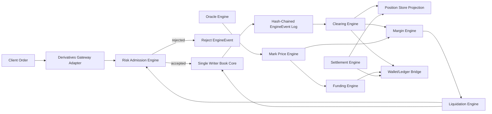

#### Hot Path

The hot path contains only deterministic, bounded, in-memory operations needed before order admission and matching:

1. Decode normalized command.
2. Load contract spec from immutable in-memory table.
3. Load account risk snapshot from prebuilt in-memory projection.
4. Validate tick size, lot size, reduce-only flag, post-only flag, max notional, position limit, and margin reservation.
5. Reserve required margin in the risk snapshot.
6. Submit command to the book-local single writer.
7. Emit immutable EngineEvent.

The hot path forbids database calls, Kafka operations, network oracle calls, locks, heap allocation in steady-state matching, and floating point.

#### Cold Path

The cold path includes configuration publication, oracle aggregation, ledger finalization, settlement reports, reconciliation, regulatory exports, and historical analytics. Cold-path work may use databases and queues only after deterministic EngineEvents have been produced.

### Domain Model

#### Contract Types

```text
ContractKind = Perpetual | Delivery
PositionSide = Long | Short | Flat
MarginMode = Cross | Isolated | Portfolio
SettlementStyle = CashSettled
```

#### Contract Specification

Every derivatives market has a versioned contract specification:

- `contract_id`: stable identifier.
- `book_id`: matching book identifier.
- `kind`: perpetual or delivery.
- `base_asset`: exposure asset.
- `quote_asset`: price denomination.
- `settlement_asset`: asset used for PnL and settlement.
- `margin_assets`: eligible collateral assets.
- `contract_multiplier`: fixed-point notional multiplier.
- `price_tick`: minimum price increment.
- `quantity_step`: minimum contract quantity increment.
- `min_quantity` and `max_quantity`.
- `max_position_quantity`.
- `initial_margin_rate`.
- `maintenance_margin_rate`.
- `fee_schedule_id`.
- `funding_interval_ns` for perpetual contracts.
- `delivery_time_ns` and `settlement_oracle_id` for delivery futures.
- `oracle_set_id` for index construction.
- `mark_price_policy_id`.
- `liquidation_policy_id`.
- `status`: draft, active, halt, reduce-only, expired.
- `version` and `activation_sequence`.

### Data Structures

```rust
#[derive(Clone, Copy, Eq, PartialEq)]
struct FixedI128 {
    raw: i128,
    scale: u32,
}

#[derive(Clone, Copy, Eq, PartialEq)]
struct ContractSpec {
    contract_id: ContractId,
    book_id: BookId,
    kind: ContractKind,
    base_asset: AssetId,
    quote_asset: AssetId,
    settlement_asset: AssetId,
    multiplier: i128,
    multiplier_scale: u32,
    price_tick: i64,
    qty_step: i64,
    min_qty: i64,
    max_qty: i64,
    max_position_qty: i64,
    initial_margin_ppm: i64,
    maintenance_margin_ppm: i64,
    funding_interval_ns: i64,
    delivery_time_ns: Option<i64>,
    status: ContractStatus,
    version: u64,
}

#[derive(Clone, Copy)]
struct OraclePriceEvent {
    oracle_set_id: OracleSetId,
    asset_pair: AssetPair,
    index_price: i64,
    mark_price: i64,
    price_scale: u32,
    valid_from_ns: i64,
    valid_until_ns: i64,
    source_bitmap: u64,
    sequence: u64,
}

#[derive(Clone, Copy)]
struct Position {
    account_id: AccountId,
    contract_id: ContractId,
    qty: i64,
    avg_entry_price: i64,
    realized_pnl: i128,
    funding_accumulator: i128,
    margin_mode: MarginMode,
    isolated_margin: i128,
    version: u64,
}
```

### State Machines

#### Contract State Machine

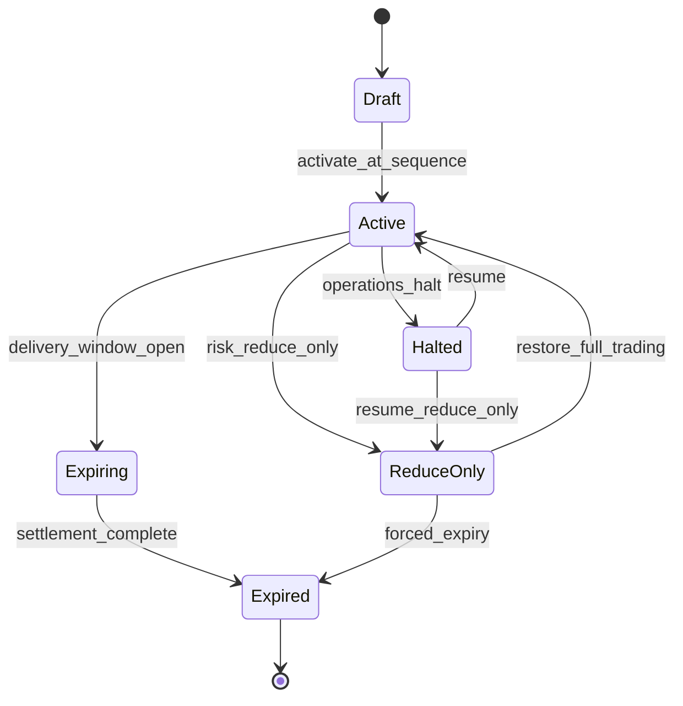

Valid transitions require signed configuration events. Contract metadata is append-only; changing a risk parameter creates a new spec version activated at a deterministic sequence or timestamp event.

#### Order Admission State Machine

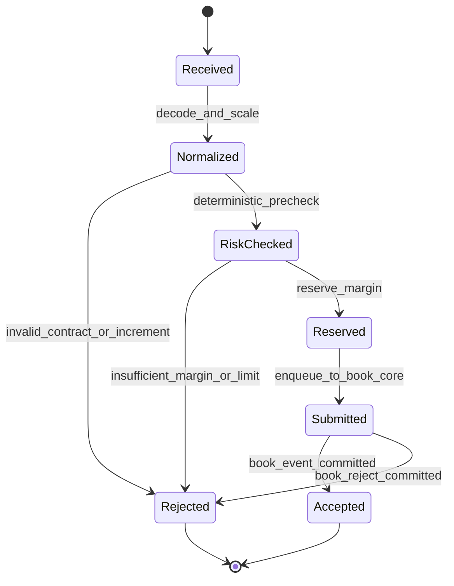

### Algorithms

#### Contract Increment Validation

```rust
fn validate_contract_increments(spec: &ContractSpec, price: i64, qty: i64) -> Result<(), RejectCode> {
    if spec.status != ContractStatus::Active && spec.status != ContractStatus::ReduceOnly {
        return Err(RejectCode::ContractNotTrading);
    }
    if price <= 0 || qty == 0 {
        return Err(RejectCode::NonPositivePriceOrQuantity);
    }
    if price % spec.price_tick != 0 {
        return Err(RejectCode::InvalidPriceTick);
    }
    let abs_qty = qty.abs();
    if abs_qty % spec.qty_step != 0 || abs_qty < spec.min_qty || abs_qty > spec.max_qty {
        return Err(RejectCode::InvalidQuantityStep);
    }
    Ok(())
}
```

#### Notional Calculation

```rust
fn notional_quote(price: i64, qty: i64, multiplier: i128, multiplier_scale: u32) -> i128 {
    let abs_qty = (qty as i128).abs();
    let raw = (price as i128) * abs_qty * multiplier;
    raw / pow10_i128(multiplier_scale)
}
```

#### Mark Price Construction

Mark price is not an oracle vote itself; it is a deterministic function of index price, bounded premium, and configured clamps.

```rust
fn compute_mark_price(index_price: i64, premium_ppm: i64, clamp_ppm: i64) -> i64 {
    let bounded = premium_ppm.clamp(-clamp_ppm, clamp_ppm);
    let adjustment = ((index_price as i128) * (bounded as i128)) / 1_000_000i128;
    let mark = (index_price as i128) + adjustment;
    assert!(mark > 0);
    mark as i64
}
```

#### Oracle Event Acceptance

```rust
fn accept_oracle_event(prev_seq: u64, event: OraclePriceEvent, now_ns: i64) -> Result<OraclePriceEvent, RejectCode> {
    if event.sequence != prev_seq + 1 {
        return Err(RejectCode::OracleSequenceGap);
    }
    if event.index_price <= 0 || event.mark_price <= 0 {
        return Err(RejectCode::InvalidOraclePrice);
    }
    if now_ns < event.valid_from_ns || now_ns >= event.valid_until_ns {
        return Err(RejectCode::OracleOutsideValidityWindow);
    }
    if event.source_bitmap.count_ones() < MIN_ORACLE_SOURCES {
        return Err(RejectCode::InsufficientOracleQuorum);
    }
    Ok(event)
}
```

### Rust pseudocode

```rust
fn admit_derivatives_order(cmd: NewOrderCommand, ctx: &mut AdmissionContext) -> EngineEvent {
    let spec = ctx.contracts.get_active(cmd.contract_id);
    if let Err(code) = validate_contract_increments(spec, cmd.limit_price, cmd.quantity) {
        return EngineEvent::order_rejected(cmd.id, code);
    }

    let mark = ctx.prices.mark_price(spec.contract_id);
    let risk = ctx.risk.account_snapshot(cmd.account_id);
    let reservation = ctx.margin.required_order_margin(spec, mark, &risk, &cmd);

    if !ctx.risk.can_reserve(cmd.account_id, reservation) {
        return EngineEvent::order_rejected(cmd.id, RejectCode::InsufficientAvailableMargin);
    }

    ctx.risk.reserve(cmd.account_id, cmd.id, reservation);
    ctx.book_core.submit(cmd)
}
```

### Mermaid diagrams

#### Engine Boundaries

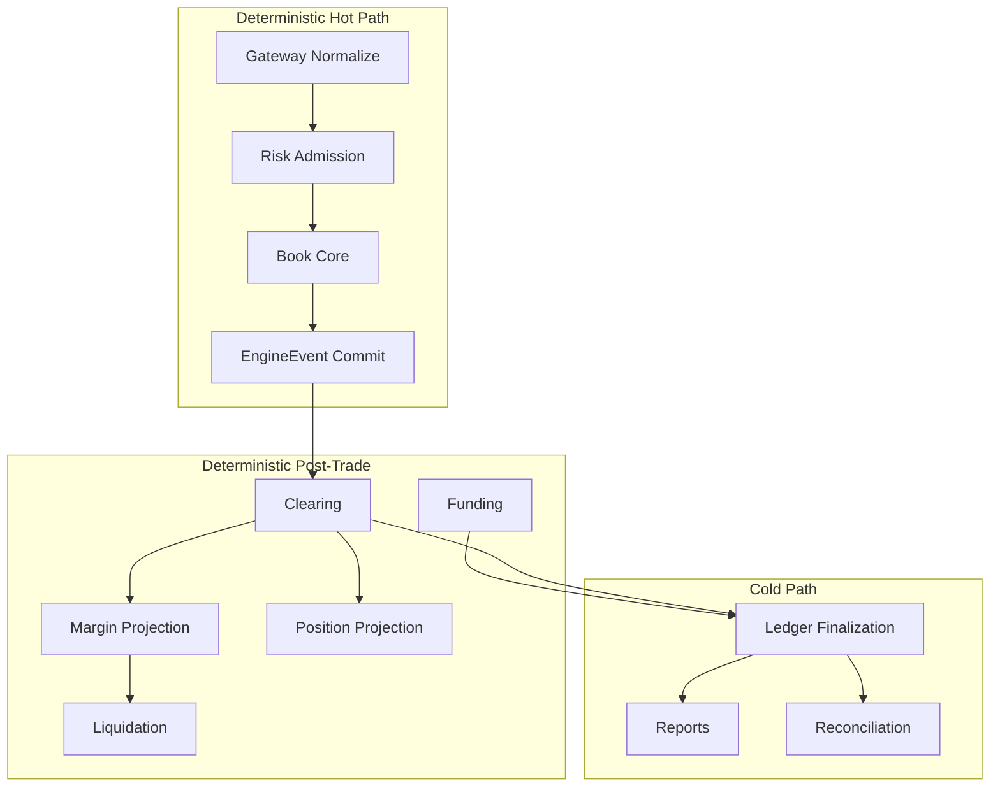

### Invariants

- A contract spec version is immutable after activation.
- Every accepted derivatives order references exactly one active contract spec version.
- Every price is divisible by `price_tick`.
- Every quantity is divisible by `quantity_step`.
- Position quantity is the signed sum of deterministic fill quantities.
- Mark price and index price are positive fixed-point integers.
- Funding exists only for perpetual futures.
- Delivery settlement exists only for delivery futures.
- Wallet balances are not mutated directly by matching.
- Every financial effect is represented as an accounting intent and later as balanced ledger entries.

### Failure modes

- Oracle sequence gap: reject oracle update and keep prior valid mark until expiry policy triggers halt.
- Contract config mismatch: reject orders referencing stale or unknown version.
- Margin projection lag: enter protective reject mode for affected accounts.
- Ledger bridge unavailable: continue EngineEvent emission only where accounting intents can be durably logged; otherwise halt affected markets.
- Mark price expiry: halt new risk-increasing orders and allow reduce-only flow if configured.

### Replay behaviour

Replay reconstructs contract versions, oracle prices, positions, funding accumulators, margin snapshots, and settlement state solely from configuration events and EngineEvents. Replay must produce identical account risk hashes, position hashes, funding hashes, and ledger-intent hashes.

### Recovery

On restart:

1. Load last durable EngineEvent hash.
2. Replay contract configuration events to active versions.
3. Replay oracle events to latest valid index and mark prices.
4. Replay fills into positions.
5. Recompute margin snapshots.
6. Rebuild reservations from open-order events.
7. Resume book-local sequencing from the last committed book sequence.

### Performance considerations

- Contract specs are stored in cache-aligned immutable arrays indexed by compact IDs.
- Risk snapshots use preallocated account slots.
- Mark price lookup is an array read, not a map lookup, in hot path.
- Admission uses integer arithmetic only.
- Post-trade clearing may batch ledger intents but may not reorder deterministic effects.

### Security considerations

- Oracle source configuration requires multi-party approval.
- Contract activation events are signed and hash-chained.
- Risk parameter reductions may be scheduled; risk parameter relaxations require explicit activation windows.
- Admin controls cannot mutate positions or balances directly.
- Replay hashes are monitored for tampering.

### Observability

Emit metrics for order rejects by reason, margin reservation latency, oracle age, mark/index divergence, funding interval status, settlement progress, liquidation queue depth, and replay hash mismatches. Logs must include contract ID, spec version, book sequence, account ID hash, and deterministic reject code.

### Testing strategy

- Unit-test fixed-point calculations and increment validation.
- Golden-vector test contract activation, fills, funding, settlement, and liquidation triggers.
- Replay-test every derivatives EngineEvent type.
- Fault-inject oracle gaps, mark expiry, and ledger bridge outage.
- Verify no floating-point operations exist in production derivatives modules.

### Property-based tests

- Any accepted order has valid tick and lot increments.
- Replaying fills in sequence reconstructs the same position quantity and average entry price.
- Mark price clamps never produce non-positive prices for valid positive indexes and valid clamp policies.
- Contract spec versions are immutable after activation.
- Wallet mutations are absent from the matching hot path.

### Acceptance criteria

- A perpetual and a delivery future can be configured, traded, replayed, and reconciled using deterministic EngineEvents.
- Hot-path decisions require no database, queue, lock, network, or floating-point operation.
- Replay hashes match live hashes for contract, oracle, position, margin, funding, and settlement projections.

### Codex Implementation Contract

- Implement derivatives code in modules with explicit ownership: contract registry, risk admission, clearing, margin, funding, settlement, liquidation, and ledger bridge.
- Use fixed-width integer types and checked arithmetic at module boundaries.
- Do not introduce global sequencing.
- Do not add direct wallet balance mutation to matching or clearing.
- Add replay tests for every new event type.

### Architect Review Checklist

- [ ] Contract metadata is immutable and versioned.
- [ ] Perpetual and delivery futures have separate deterministic lifecycle rules.
- [ ] Hot-path restrictions are preserved.
- [ ] Oracle, funding, margin, liquidation, and settlement boundaries are explicit.
- [ ] Multi-asset and multi-collateral support does not require floating point.
- [ ] Ledger effects are balanced and routed through Volume IV accounting.

---

## Chapter 2 — Margin Engine

### Purpose

Specify deterministic margin calculation, reservation, release, recalculation, leverage enforcement, collateral valuation, and risk thresholds for HermesNet derivatives accounts.

### Scope

This chapter covers initial margin, maintenance margin, margin ratio, available margin, used margin, reservation, release, leverage, cross margin, isolated margin overview, portfolio margin overview, haircuts, collateral eligibility, borrowing limits, negative equity prevention, margin calls, and risk thresholds.

### Business Context

Margin is the collateral control system that allows leveraged trading while protecting counterparties, the insurance fund, and the exchange. The engine must admit only orders that satisfy deterministic margin rules and must identify accounts that require liquidation before losses exceed available collateral.

### Engineering Context

The Margin Engine consumes account collateral projections, positions, open-order reservations, mark prices, funding accruals, and risk parameter versions. It produces account risk snapshots used by admission, clearing, liquidation, operations, and reporting.

### Responsibilities

- Calculate initial margin and maintenance margin.
- Maintain used, reserved, and available margin.
- Enforce leverage limits and borrowing limits.
- Apply collateral eligibility, haircuts, and discount factors.
- Prevent order admission that would create deterministic negative available margin.
- Emit margin call and liquidation trigger events.
- Recompute margin deterministically after fills, funding, deposits, withdrawals, transfers, oracle updates, fee changes, and configuration changes.

### Non-Goals

- Nonlinear portfolio margin expansion beyond the overview in this chapter.
- Manual credit overrides in the hot path.
- Floating-point VaR calculations.
- Undercollateralized credit products.

### Architecture

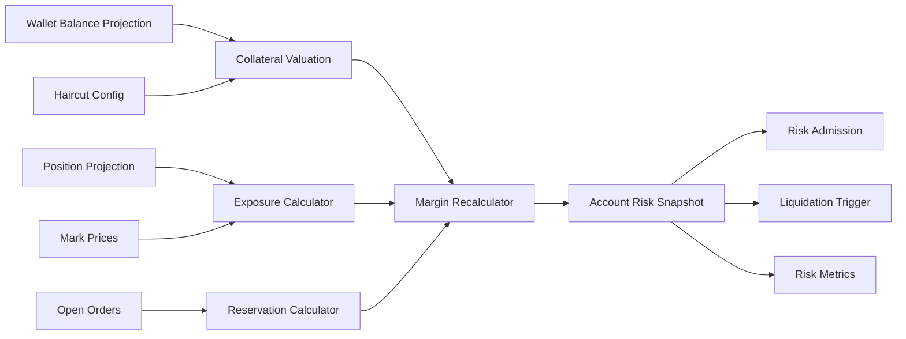

The Margin Engine is not the ledger. It reads wallet/ledger projections and emits deterministic risk events. Accounting remains with Volume IV.

### Domain Model

- **Equity**: discounted collateral value plus unrealized PnL plus settled realized PnL minus pending funding and fees.
- **Initial Margin (IM)**: collateral required to open or increase risk.
- **Maintenance Margin (MM)**: minimum collateral required to keep positions open.
- **Used Margin**: margin currently assigned to positions and accepted open orders.
- **Reserved Margin**: margin held for open orders not yet filled or canceled.
- **Available Margin**: equity minus used margin minus reserved margin, floored only for reporting; admission uses signed value.
- **Margin Ratio**: maintenance margin divided by equity using fixed-point scaled integer division.
- **Haircut**: deterministic reduction applied to collateral value.
- **Discount Factor**: deterministic asset valuation factor used for multi-collateral risk.

### Data Structures

```rust
struct CollateralRule {
    asset_id: AssetId,
    eligible: bool,
    haircut_ppm: i64,
    discount_ppm: i64,
    max_borrow_value: i128,
    version: u64,
}

struct MarginRequirement {
    initial: i128,
    maintenance: i128,
    reserved: i128,
    used: i128,
}

struct AccountRiskSnapshot {
    account_id: AccountId,
    equity: i128,
    discounted_collateral: i128,
    unrealized_pnl: i128,
    pending_funding: i128,
    pending_fees: i128,
    initial_margin: i128,
    maintenance_margin: i128,
    reserved_margin: i128,
    available_margin: i128,
    margin_ratio_ppm: i64,
    state: MarginState,
    version: u64,
}
```

### State Machines

#### Account Margin State

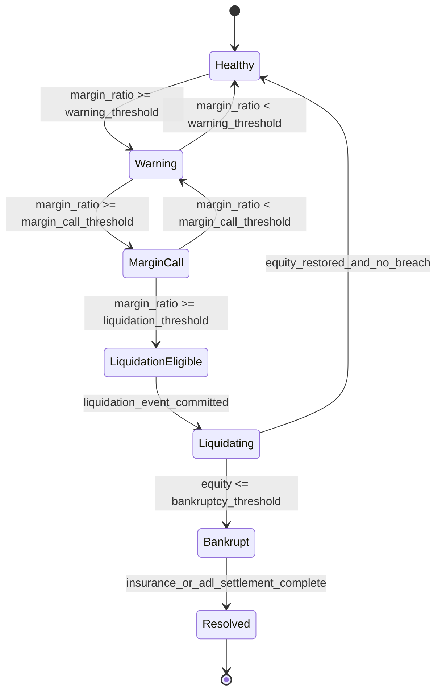

#### Margin Reservation State

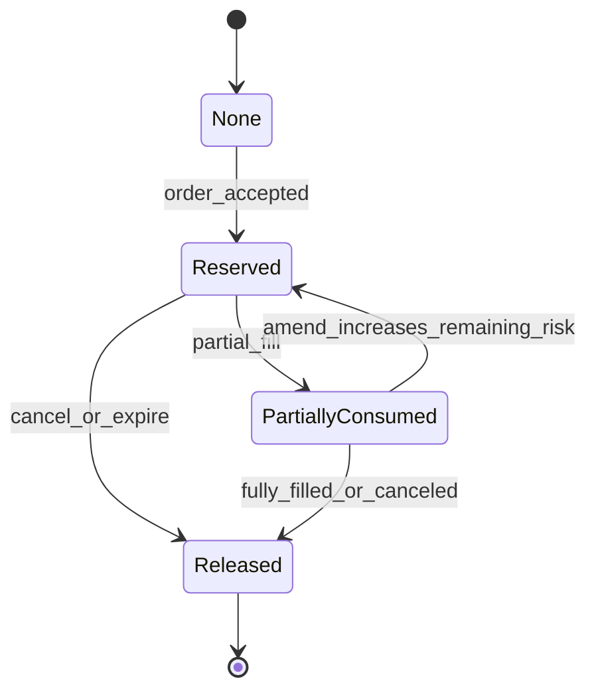

### Algorithms

#### Collateral Valuation

```rust
fn discounted_collateral(balance: i128, oracle_price: i64, rule: CollateralRule) -> i128 {
    if !rule.eligible || balance <= 0 {
        return 0;
    }
    let gross = balance.checked_mul(oracle_price as i128).expect("collateral overflow");
    let after_haircut = gross * (1_000_000i128 - rule.haircut_ppm as i128) / 1_000_000i128;
    after_haircut * (rule.discount_ppm as i128) / 1_000_000i128
}
```

#### Position Margin

```rust
fn position_margin(spec: &ContractSpec, mark_price: i64, qty: i64) -> MarginRequirement {
    let notional = notional_quote(mark_price, qty, spec.multiplier, spec.multiplier_scale);
    let initial = notional * (spec.initial_margin_ppm as i128) / 1_000_000i128;
    let maintenance = notional * (spec.maintenance_margin_ppm as i128) / 1_000_000i128;
    MarginRequirement { initial, maintenance, reserved: 0, used: initial }
}
```

#### Available Margin

```rust
fn available_margin(snapshot: &AccountRiskSnapshot) -> i128 {
    snapshot.equity - snapshot.initial_margin - snapshot.reserved_margin - snapshot.pending_fees.abs()
}
```

#### Order Reservation

```rust
fn required_order_reservation(spec: &ContractSpec, order: &NewOrderCommand, current_pos: i64) -> i128 {
    let risk_increasing_qty = risk_increasing_quantity(current_pos, order.quantity);
    if risk_increasing_qty == 0 {
        return 0;
    }
    let notional = notional_quote(order.limit_price, risk_increasing_qty, spec.multiplier, spec.multiplier_scale);
    notional * (spec.initial_margin_ppm as i128) / 1_000_000i128
}
```

#### Margin Ratio

```rust
fn margin_ratio_ppm(equity: i128, maintenance_margin: i128) -> i64 {
    if equity <= 0 {
        return i64::MAX;
    }
    ((maintenance_margin * 1_000_000i128) / equity) as i64
}
```

### Rust pseudocode

```rust
fn recalc_account_margin(account: AccountId, ctx: &RiskContext) -> AccountRiskSnapshot {
    let discounted_collateral = ctx.balances.iter_account(account)
        .map(|b| discounted_collateral(b.amount, ctx.oracle.asset_price(b.asset), ctx.collateral.rule(b.asset)))
        .sum::<i128>();

    let mut initial = 0i128;
    let mut maintenance = 0i128;
    let mut unrealized = 0i128;

    for pos in ctx.positions.iter_account(account) {
        let spec = ctx.contracts.get(pos.contract_id);
        let mark = ctx.prices.mark_price(pos.contract_id);
        let req = position_margin(spec, mark, pos.qty);
        initial += req.initial;
        maintenance += req.maintenance;
        unrealized += unrealized_pnl(pos, mark, spec);
    }

    let reserved = ctx.reservations.total(account);
    let pending_funding = ctx.funding.pending(account);
    let pending_fees = ctx.fees.pending(account);
    let equity = discounted_collateral + unrealized - pending_funding - pending_fees;
    let ratio = margin_ratio_ppm(equity, maintenance);
    let state = classify_margin_state(ratio, equity, ctx.thresholds);

    AccountRiskSnapshot {
        account_id: account,
        equity,
        discounted_collateral,
        unrealized_pnl: unrealized,
        pending_funding,
        pending_fees,
        initial_margin: initial,
        maintenance_margin: maintenance,
        reserved_margin: reserved,
        available_margin: equity - initial - reserved,
        margin_ratio_ppm: ratio,
        state,
        version: ctx.next_snapshot_version(account),
    }
}
```

### Mermaid diagrams

#### Recalculation Trigger Graph

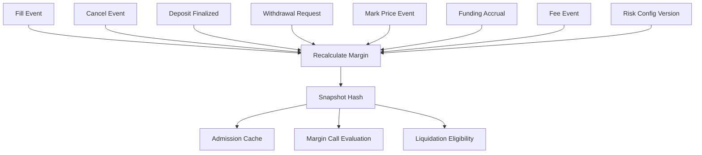

### Invariants

- Initial margin is greater than or equal to maintenance margin for every position.
- Available margin must be non-negative for a risk-increasing order to be admitted.
- Reduce-only orders may have zero reservation only if they cannot increase absolute exposure.
- Collateral with `eligible = false` contributes zero discounted value.
- Haircuts and discount factors are integer ppm values between zero and one million.
- Equity calculations include unrealized PnL and pending deterministic funding/fees.
- Borrowing limits cannot be exceeded by order admission.
- Margin state classification is a pure function of snapshot values and threshold config.

### Failure modes

- Missing mark price: reject risk-increasing orders for affected contracts.
- Collateral oracle stale: exclude affected collateral or enter protective mode by configuration.
- Arithmetic overflow: halt affected account and emit deterministic risk fault event.
- Reservation underflow: reject transition and require replay investigation.
- Snapshot lag: reject new risk-increasing orders for affected accounts.

### Replay behaviour

Replay recalculates margin after each triggering event and compares snapshot hashes. Reservation events are replayed from order accepted, fill, cancel, expire, and reject events. No persisted snapshot is authoritative over replayed state.

### Recovery

After restart, the engine rebuilds balances from ledger projections, positions from fills, reservations from open orders, funding from funding events, and marks from oracle events. It then emits no synthetic margin event unless the recomputed state crosses a threshold relative to the last committed margin state event.

### Performance considerations

- Maintain per-account dirty flags to avoid full-system recalculation.
- Store positions in contiguous per-account arrays with bounded maximum contracts.
- Use precomputed risk rates per contract version.
- Use checked arithmetic in debug and certification; production may use proven bounded arithmetic with overflow traps.
- Keep admission snapshot reads lock-free through single-writer publication and atomic pointer swap outside matching.

### Security considerations

- Admins cannot directly set equity or margin ratio.
- Collateral eligibility changes are versioned and auditable.
- Risk limit relaxations require delayed activation.
- Forced margin reductions are prohibited unless produced by deterministic settlement, funding, fee, withdrawal, transfer, or liquidation events.

### Observability

Metrics include account margin state counts, aggregate IM/MM, reservation totals, margin-call transitions, liquidation eligibility transitions, collateral haircut value, stale mark count, and rejected orders by margin reason.

### Testing strategy

- Unit-test IM, MM, equity, available margin, and margin ratio calculations.
- Golden-vector test cross-collateral valuations with haircuts.
- Integration-test order reservation and release through accept, fill, cancel, and amend flows.
- Replay-test every margin state transition.
- Fault-test stale mark, stale collateral price, overflow, and projection lag.

### Property-based tests

- For any valid position, IM >= MM >= 0.
- Releasing a reservation never decreases available margin.
- Increasing eligible collateral never worsens margin ratio if all other inputs are constant.
- Reduce-only orders never increase absolute exposure.
- Replay and live recalculation produce identical snapshot hashes.

### Acceptance criteria

- Risk-increasing orders are admitted only when deterministic available margin remains non-negative.
- Margin state transitions are reproducible during replay.
- Cross, isolated, and portfolio margin hooks exist without changing hot-path constraints.
- Collateral valuation uses only fixed-point integer arithmetic.

### Codex Implementation Contract

- Implement margin calculations as pure functions over explicit inputs.
- Add exhaustive tests for edge values, zero equity, negative equity, max notional, and overflow boundaries.
- Never use floating point, maps with nondeterministic iteration, wall-clock reads inside calculation, or database access.
- Emit deterministic events for margin call and liquidation eligibility transitions.

### Architect Review Checklist

- [ ] Margin terms are formally defined.
- [ ] Reservation and release states are complete.
- [ ] Collateral haircuts and eligibility are versioned.
- [ ] Negative equity prevention is enforced at admission.
- [ ] Replay behaviour is deterministic.
- [ ] Property tests cover monotonicity and conservation expectations.

---

## Chapter 3 — Funding Engine

### Purpose

Define deterministic funding calculation, funding settlement, funding ledger intents, replay, recovery, precision rules, suspension, and reconciliation for perpetual futures.

### Scope

This chapter covers funding rate, premium index, interest component, interval scheduling, calculation, settlement, ledger entries, EngineEvents, replay, recovery, reconciliation, edge cases, suspension, halt behavior, restart behavior, precision, invariants, examples, Rust pseudocode, and diagrams.

### Business Context

Perpetual futures do not expire. Funding transfers value between long and short position holders so the contract price remains anchored to the underlying index. Funding must be deterministic, auditable, balanced, and resilient to halts and restarts.

### Engineering Context

Funding is a deterministic post-trade engine. It consumes mark/index observations, position snapshots, contract funding configuration, and interval boundary events. It emits funding rate events, funding accrual events, and ledger intents. Funding does not alter the matching result.

### Responsibilities

- Compute premium index and interest component using fixed-point arithmetic.
- Clamp and publish funding rates at deterministic interval boundaries.
- Calculate per-position funding payments.
- Emit balanced ledger intents.
- Preserve funding replay across restart and recovery.
- Support funding suspension and halt policies.
- Reconcile funding totals with ledger entries.

### Non-Goals

- Funding for delivery futures.
- Non-deterministic sampling based on wall-clock arrival order.
- Floating-point annualized rate calculations.
- Manual post-facto funding edits.

### Architecture

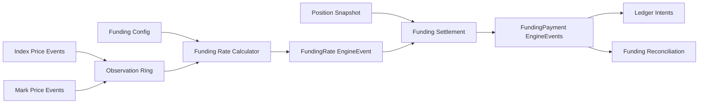

### Domain Model

- **Funding interval**: fixed duration in nanoseconds configured per contract.
- **Premium index**: fixed-point difference between mark price and index price divided by index price.
- **Interest component**: configured fixed-point rate representing quote/base interest differential.
- **Funding rate**: premium plus interest, clamped to configured bounds.
- **Funding payment**: position notional multiplied by funding rate, signed by position side.
- **Funding suspension**: config state where rate publication or settlement is paused by deterministic policy.

### Data Structures

```rust
struct FundingConfig {
    contract_id: ContractId,
    interval_ns: i64,
    premium_clamp_ppm: i64,
    funding_rate_clamp_ppm: i64,
    interest_ppm: i64,
    observation_capacity: usize,
    version: u64,
    status: FundingStatus,
}

struct FundingObservation {
    event_time_ns: i64,
    mark_price: i64,
    index_price: i64,
    premium_ppm: i64,
}

struct FundingRateEvent {
    contract_id: ContractId,
    interval_start_ns: i64,
    interval_end_ns: i64,
    premium_ppm: i64,
    interest_ppm: i64,
    funding_rate_ppm: i64,
    config_version: u64,
    sequence: u64,
}

struct FundingPaymentEvent {
    account_id: AccountId,
    contract_id: ContractId,
    interval_end_ns: i64,
    position_qty: i64,
    mark_price: i64,
    funding_rate_ppm: i64,
    payment: i128,
}
```

### State Machines

#### Funding Interval State

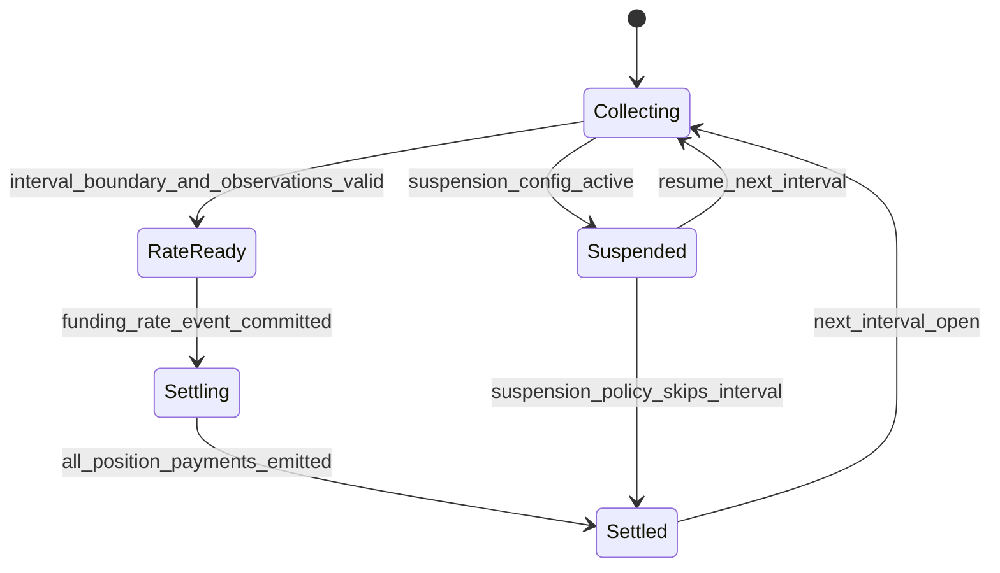

#### Funding Status State

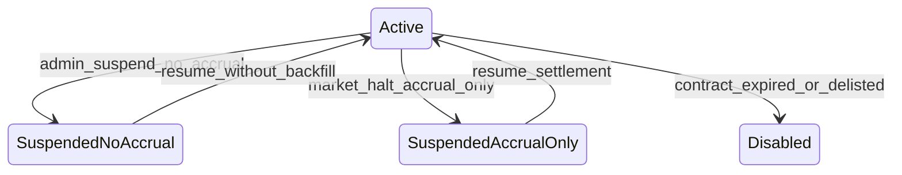

### Algorithms

#### Premium Index

```rust
fn premium_ppm(mark_price: i64, index_price: i64) -> i64 {
    assert!(mark_price > 0 && index_price > 0);
    (((mark_price as i128 - index_price as i128) * 1_000_000i128) / index_price as i128) as i64
}
```

#### Observation Aggregation

```rust
fn aggregate_premium_ppm(obs: &[FundingObservation]) -> i64 {
    assert!(!obs.is_empty());
    let mut weighted_sum = 0i128;
    let mut weight_total = 0i128;
    for item in obs {
        let weight = 1i128;
        weighted_sum += item.premium_ppm as i128 * weight;
        weight_total += weight;
    }
    (weighted_sum / weight_total) as i64
}
```

#### Funding Rate

```rust
fn funding_rate_ppm(premium_ppm: i64, interest_ppm: i64, cfg: &FundingConfig) -> i64 {
    let bounded_premium = premium_ppm.clamp(-cfg.premium_clamp_ppm, cfg.premium_clamp_ppm);
    let raw = bounded_premium + interest_ppm;
    raw.clamp(-cfg.funding_rate_clamp_ppm, cfg.funding_rate_clamp_ppm)
}
```

#### Funding Payment

```rust
fn funding_payment(spec: &ContractSpec, qty: i64, mark_price: i64, rate_ppm: i64) -> i128 {
    let signed_notional = (mark_price as i128) * (qty as i128) * spec.multiplier / pow10_i128(spec.multiplier_scale);
    signed_notional * (rate_ppm as i128) / 1_000_000i128
}
```

Positive payment means the account pays; negative payment means the account receives.

### Rust pseudocode

```rust
fn close_funding_interval(contract_id: ContractId, end_ns: i64, ctx: &mut FundingContext) -> Vec<EngineEvent> {
    let cfg = ctx.config.get(contract_id);
    if cfg.status == FundingStatus::SuspendedNoAccrual {
        return vec![EngineEvent::funding_interval_skipped(contract_id, end_ns, cfg.version)];
    }

    let observations = ctx.observations.for_interval(contract_id, end_ns - cfg.interval_ns, end_ns);
    if observations.is_empty() || ctx.market.is_delivery(contract_id) {
        return vec![EngineEvent::funding_suspended(contract_id, end_ns, FundingSuspendReason::NoValidObservation)];
    }

    let premium = aggregate_premium_ppm(observations);
    let rate = funding_rate_ppm(premium, cfg.interest_ppm, cfg);
    let rate_event = EngineEvent::funding_rate(contract_id, end_ns - cfg.interval_ns, end_ns, premium, cfg.interest_ppm, rate, cfg.version);

    let mut out = Vec::with_capacity(ctx.positions.count_open(contract_id) + 1);
    out.push(rate_event);
    for pos in ctx.positions.iter_open(contract_id) {
        let mark = ctx.prices.mark_price(contract_id);
        let payment = funding_payment(ctx.contracts.get(contract_id), pos.qty, mark, rate);
        out.push(EngineEvent::funding_payment(pos.account_id, contract_id, end_ns, pos.qty, mark, rate, payment));
    }
    out
}
```

### Mermaid diagrams

#### Funding Settlement Accounting

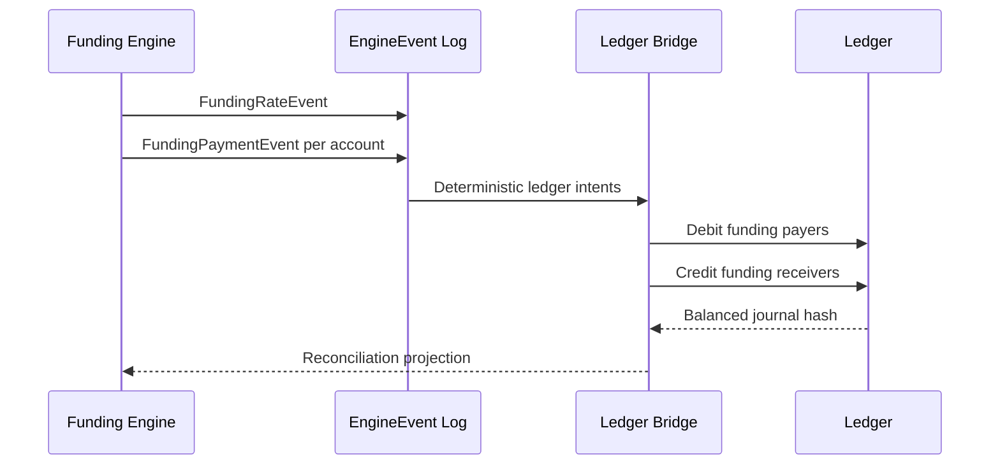

### Invariants

- Funding applies only to perpetual futures.
- Every funding interval has exactly one terminal state: settled, skipped, or suspended.
- Sum of funding payments for a contract interval must equal zero after deterministic residual handling.
- Funding rates are clamped to configured bounds.
- Funding payment uses interval-end position quantity unless configuration explicitly uses time-weighted position snapshots.
- Funding settlement emits balanced ledger intents.
- Funding replay never reads wall-clock time.

### Funding examples

Example: long position pays funding.

- Mark price: 20,100.00 scaled to cents.
- Index price: 20,000.00 scaled to cents.
- Premium: 5,000 ppm.
- Interest: 100 ppm.
- Funding rate: 5,100 ppm after clamps.
- Quantity: +10 contracts.
- Multiplier: 1.
- Signed notional: 201,000.00 quote units.
- Payment: 1,025.10 quote units paid by the long account and received by shorts after residual allocation.

Example: short position receives funding when rate is positive. The same notional with quantity `-10` produces a negative payment, which is a credit to the account.

### Failure modes

- Missing observations: suspend or skip interval according to funding policy.
- Mark/index non-positive: reject observation and potentially suspend funding.
- Residual rounding imbalance: allocate residual to deterministic insurance-fund adjustment account or largest absolute notional account by stable account ID tie-break.
- Restart during settlement: replay committed payment events and continue from the next unpaid deterministic account cursor.
- Ledger rejection: halt settlement finalization and raise reconciliation fault; do not recompute rate.

### Replay behaviour

Replay rebuilds observations, interval boundaries, funding rates, payment events, and ledger intents. If a restart occurs after rate event but before all payments are emitted, recovery continues with the same rate and deterministic position snapshot cursor.

### Recovery

Recovery scans the last funding interval state per contract. For `RateReady` or `Settling`, it replays emitted payments, computes the remaining account cursor, and emits missing payment events only if their predecessor hashes match. It never creates a second rate event for the same interval.

### Performance considerations

- Use fixed-capacity observation rings per contract.
- Precompute interval boundaries.
- Iterate positions in stable account ID order.
- Batch ledger intents while preserving deterministic ordering.
- Avoid allocation by reusing preallocated payment buffers for maximum open positions per contract.

### Security considerations

- Funding config changes are signed and versioned.
- Funding suspension cannot alter prior interval rates.
- Manual payment edits are prohibited.
- Oracle manipulation resistance depends on source quorum, clamps, and stale-price policy.

### Observability

Metrics include funding rate by contract, premium/index divergence, skipped intervals, suspended intervals, total paid, total received, residual adjustment, settlement latency, and reconciliation imbalance.

### Testing strategy

- Unit-test premium, interest, clamp, and payment calculations.
- Golden-vector test positive, negative, and zero rates.
- Integration-test funding ledger entries for balanced accounting.
- Replay-test restart before rate, after rate, mid-payment, and after ledger finalization.
- Fault-test missing oracle observations and halted markets.

### Property-based tests

- Funding rate always lies within configured clamp.
- Funding payment sign matches position side and rate sign.
- Sum of debits and credits equals zero after residual handling.
- Replay of funding intervals produces identical rate and payment hashes.
- Suspending funding never mutates positions.

### Acceptance criteria

- Every perpetual contract can produce deterministic funding rates and balanced funding settlements.
- Delivery futures never receive funding events.
- Funding recovery is idempotent after restart at every interval stage.
- Funding calculations use fixed-point integer arithmetic only.

### Codex Implementation Contract

- Implement funding as deterministic interval processors over event-sourced inputs.
- Store funding status as EngineEvents, not mutable operator notes.
- Add golden vectors for all rounding and residual allocation cases.
- Do not use wall-clock reads except when converted into deterministic time events outside the calculation.

### Architect Review Checklist

- [ ] Funding interval states are terminal and replayable.
- [ ] Rate calculation is deterministic and clamped.
- [ ] Payment calculation and residual allocation are balanced.
- [ ] Halt and suspension policies are explicit.
- [ ] Restart behavior cannot double-pay funding.
- [ ] Ledger reconciliation is required before completion.

---

## Chapter 4 — Position Lifecycle

### Purpose

Specify deterministic position transitions from opening through increase, decrease, close, reverse, funding adjustment, fee adjustment, mark-to-market, liquidation interaction, ledger interaction, replay, and recovery.

### Scope

This chapter covers open, increase, decrease, close, reverse, partial close, average entry price, average exit price, realized PnL, unrealized PnL, mark-to-market, funding adjustment, fee adjustment, liquidation interaction, margin interaction, risk interaction, wallet interaction, ledger interaction, replay, recovery, and position invariants.

### Business Context

Positions are the authoritative trading exposure records for derivatives accounts. They determine PnL, margin, funding, liquidation eligibility, settlement obligations, and accounting entries. Incorrect position transitions can create losses, false liquidations, or unbalanced accounting.

### Engineering Context

Positions are projections from fill EngineEvents plus deterministic adjustment events. The Book Core does not maintain account-level derivatives positions. Clearing consumes fills and emits position events and accounting intents.

### Responsibilities

- Maintain signed position quantity per account and contract.
- Maintain deterministic average entry price for open exposure.
- Calculate realized PnL when exposure is reduced or closed.
- Calculate unrealized PnL from mark price.
- Apply funding and fee adjustments as accounting effects.
- Integrate with margin recalculation and liquidation workflows.
- Rebuild positions exactly during replay.

### Non-Goals

- Tax-lot accounting.
- FIFO/LIFO realized PnL alternatives.
- Manual position editing.
- Floating-point PnL.

### Architecture

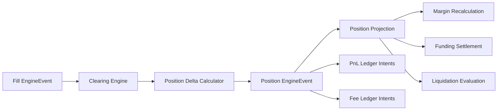

### Domain Model

- **Position quantity**: signed contracts; positive long, negative short, zero flat.
- **Average entry price**: weighted average price of the currently open exposure.
- **Average exit price**: weighted average price of the reduction portion of a fill or close sequence.
- **Realized PnL**: locked-in PnL from reducing exposure.
- **Unrealized PnL**: mark-to-market PnL for remaining open exposure.
- **Funding adjustment**: debit or credit from periodic funding.
- **Fee adjustment**: debit or credit from trading fees and rebates.

### Data Structures

```rust
struct FillInput {
    account_id: AccountId,
    contract_id: ContractId,
    side_qty: i64,
    price: i64,
    fee: i128,
    liquidity: LiquidityFlag,
    fill_id: FillId,
    book_sequence: u64,
}

struct PositionUpdate {
    old_qty: i64,
    new_qty: i64,
    old_avg_entry: i64,
    new_avg_entry: i64,
    realized_pnl: i128,
    closed_qty: i64,
    opened_qty: i64,
    avg_exit_price: i64,
}
```

### State Machines

#### Position Exposure State

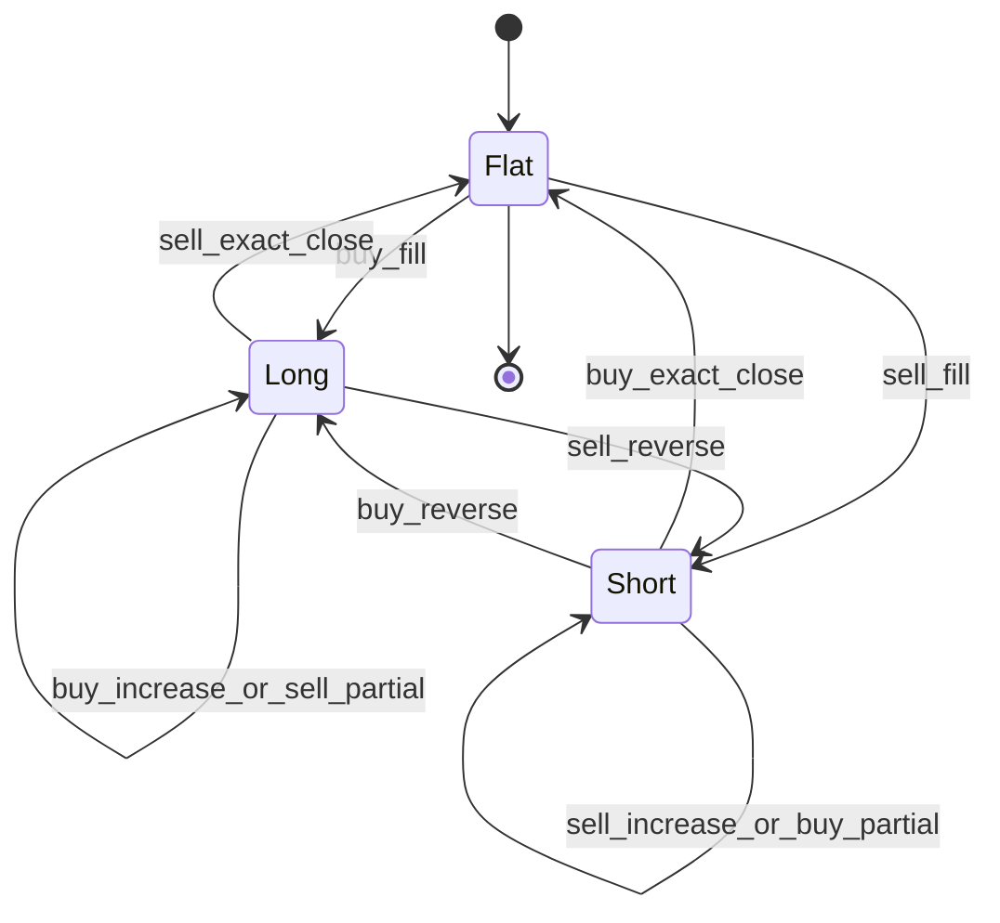

#### Position Event Processing State

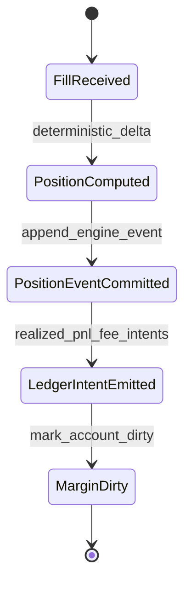

### Algorithms

#### Position Delta

```rust
fn apply_fill(pos: Position, fill: FillInput, spec: &ContractSpec) -> PositionUpdate {
    let old_qty = pos.qty;
    let fill_qty = fill.side_qty;

    if old_qty == 0 || same_sign(old_qty, fill_qty) {
        let new_qty = old_qty + fill_qty;
        let new_avg = weighted_avg_price(old_qty, pos.avg_entry_price, fill_qty, fill.price);
        return PositionUpdate { old_qty, new_qty, old_avg_entry: pos.avg_entry_price, new_avg_entry: new_avg, realized_pnl: 0, closed_qty: 0, opened_qty: fill_qty, avg_exit_price: 0 };
    }

    let closing_abs = old_qty.abs().min(fill_qty.abs());
    let realized = realized_pnl_for_close(old_qty.signum() * closing_abs, pos.avg_entry_price, fill.price, spec);
    let remaining = old_qty + fill_qty;

    if remaining == 0 {
        return PositionUpdate { old_qty, new_qty: 0, old_avg_entry: pos.avg_entry_price, new_avg_entry: 0, realized_pnl: realized, closed_qty: closing_abs, opened_qty: 0, avg_exit_price: fill.price };
    }

    if same_sign(old_qty, remaining) {
        return PositionUpdate { old_qty, new_qty: remaining, old_avg_entry: pos.avg_entry_price, new_avg_entry: pos.avg_entry_price, realized_pnl: realized, closed_qty: closing_abs, opened_qty: 0, avg_exit_price: fill.price };
    }

    let opened = remaining;
    PositionUpdate { old_qty, new_qty: remaining, old_avg_entry: pos.avg_entry_price, new_avg_entry: fill.price, realized_pnl: realized, closed_qty: closing_abs, opened_qty: opened, avg_exit_price: fill.price }
}
```

#### Weighted Average Entry Price

```rust
fn weighted_avg_price(old_qty: i64, old_avg: i64, fill_qty: i64, fill_price: i64) -> i64 {
    let old_abs = old_qty.abs() as i128;
    let fill_abs = fill_qty.abs() as i128;
    let numerator = old_abs * old_avg as i128 + fill_abs * fill_price as i128;
    let denominator = old_abs + fill_abs;
    (numerator / denominator) as i64
}
```

#### Realized PnL

```rust
fn realized_pnl_for_close(closed_signed_qty: i64, entry_price: i64, exit_price: i64, spec: &ContractSpec) -> i128 {
    let qty = closed_signed_qty as i128;
    let price_diff = exit_price as i128 - entry_price as i128;
    price_diff * qty * spec.multiplier / pow10_i128(spec.multiplier_scale)
}
```

For a long close, `closed_signed_qty` is positive and profit occurs when exit exceeds entry. For a short close, `closed_signed_qty` is negative and profit occurs when exit is below entry.

#### Unrealized PnL

```rust
fn unrealized_pnl(pos: Position, mark_price: i64, spec: &ContractSpec) -> i128 {
    if pos.qty == 0 {
        return 0;
    }
    let diff = mark_price as i128 - pos.avg_entry_price as i128;
    diff * pos.qty as i128 * spec.multiplier / pow10_i128(spec.multiplier_scale)
}
```

### Rust pseudocode

```rust
fn clear_fill(fill: FillInput, ctx: &mut ClearingContext) -> Vec<EngineEvent> {
    let spec = ctx.contracts.get(fill.contract_id);
    let pos = ctx.positions.get_or_flat(fill.account_id, fill.contract_id);
    let update = apply_fill(pos, fill, spec);

    let position_event = EngineEvent::position_updated(
        fill.account_id,
        fill.contract_id,
        fill.fill_id,
        update.old_qty,
        update.new_qty,
        update.old_avg_entry,
        update.new_avg_entry,
        update.realized_pnl,
        update.closed_qty,
        update.opened_qty,
    );

    ctx.positions.apply(position_event);

    let mut events = vec![position_event];
    if update.realized_pnl != 0 {
        events.push(EngineEvent::realized_pnl_intent(fill.account_id, fill.contract_id, update.realized_pnl));
    }
    if fill.fee != 0 {
        events.push(EngineEvent::fee_intent(fill.account_id, fill.contract_id, fill.fee, fill.liquidity));
    }
    events.push(EngineEvent::margin_recalc_requested(fill.account_id, fill.contract_id));
    events
}
```

### Mermaid diagrams

#### Fill Classification

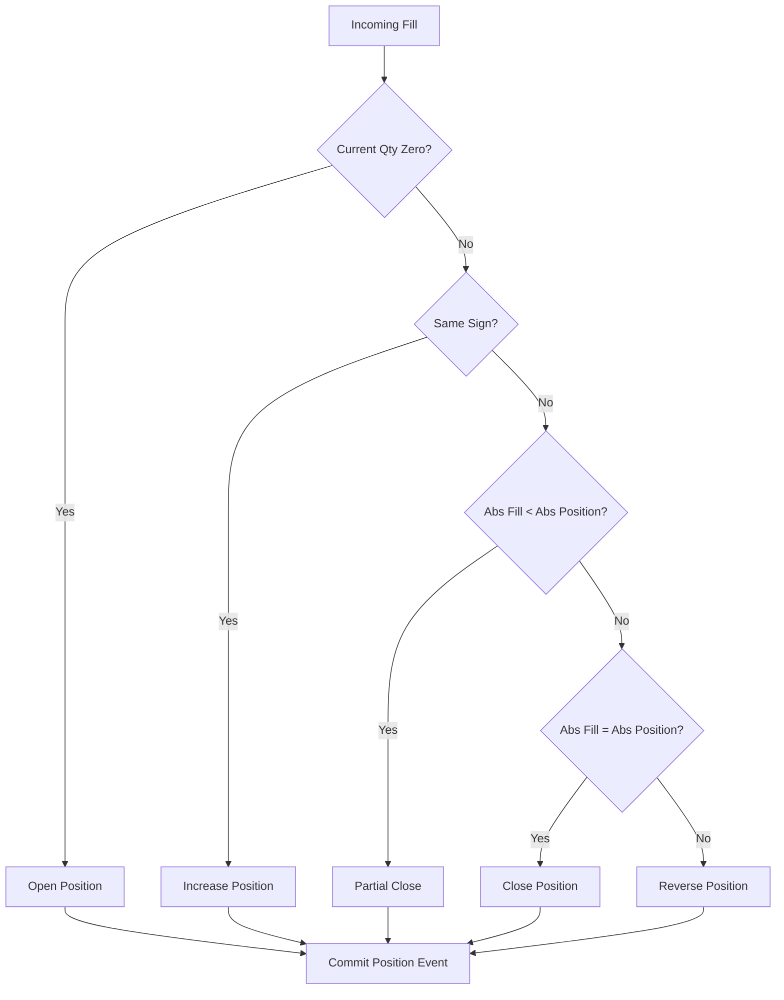

### Invariants

- Flat positions have quantity zero and average entry price zero.
- Non-flat positions have positive average entry price.
- Position quantity equals the signed sum of all replayed fills and liquidation fills.
- Realized PnL is emitted only for the closed portion of a fill.
- Increasing exposure does not realize PnL.
- Reversing exposure realizes PnL on the closed portion and sets average entry to the reversal fill price for the newly opened portion.
- Funding and fees do not change position quantity or average entry price.
- Mark-to-market does not create ledger entries until realized, funded, settled, or liquidated according to policy.

### Failure modes

- Fill references unknown contract: halt clearing for the book and emit deterministic fault.
- Position arithmetic overflow: halt affected account and book for investigation.
- Duplicate fill ID: reject duplicate projection update during replay and raise integrity fault.
- Ledger bridge unavailable: position event remains authoritative; accounting intent remains pending and reconciled later.
- Margin recalculation failure: account is placed in protective reject mode.

### Replay behaviour

Positions are rebuilt from fill and position events in book sequence order. During certification, replay recomputes every position update from fills and compares it to committed position events. Any mismatch is a consensus failure for the derivatives projection.

### Recovery

Recovery restores the last hash-chained position event, replays subsequent fill events, rebuilds open positions, recomputes realized PnL intents, and marks affected accounts dirty for margin recalculation. It does not infer missing fills from ledger entries.

### Performance considerations

- Store positions in fixed-capacity account-contract slots.
- Use direct contract ID indexing for spec lookup.
- Avoid heap allocation in fill clearing by using small fixed event arrays.
- Batch margin dirty notifications per account while preserving event order.
- Use integer division with documented rounding direction for average price and PnL.

### Security considerations

- Position corrections require compensating EngineEvents, never direct mutation.
- Operator tools may view but not edit position projections.
- Duplicate fill protection is mandatory.
- Reconciliation must compare position state with ledger realized PnL and funding entries.

### Observability

Metrics include open positions by contract, gross long/short exposure, realized PnL totals, unrealized PnL totals, reversals, average entry rounding residuals, duplicate fill faults, and margin dirty queue latency.

### Testing strategy

- Unit-test open, increase, partial close, full close, and reverse transitions.
- Golden-vector test long and short realized PnL.
- Integration-test fill-to-position-to-margin-to-ledger flow.
- Replay-test deterministic reconstruction from EngineEvents.
- Fault-test duplicate fills, overflow, unknown contract, and ledger outage.

### Property-based tests

- Position quantity equals sum of fills.
- Closing a position to zero resets average entry price to zero.
- Increasing exposure does not change realized PnL.
- Reversal realized PnL equals realized PnL for exactly the closed old exposure.
- Unrealized PnL is zero for flat positions.
- Replay position hash equals live position hash for any valid fill sequence.

### Acceptance criteria

- All position lifecycle transitions are deterministic and replayable.
- Realized and unrealized PnL use fixed-point integer arithmetic only.
- Funding and fees adjust account equity through accounting intents without mutating position quantity.
- Liquidation, margin, wallet, ledger, and risk integrations are explicit.

### Codex Implementation Contract

- Implement position transitions as pure functions with exhaustive tests.
- Use stable rounding rules and document them in test vectors.
- Never infer positions from wallet balances.
- Emit margin recalculation requests after every position-changing event.
- Add certification vectors for long, short, partial close, full close, and reverse flows.

### Architect Review Checklist

- [ ] Position state machine covers flat, long, short, close, and reverse.
- [ ] Average entry and realized PnL algorithms are deterministic.
- [ ] Funding and fees do not mutate quantity.
- [ ] Replay compares computed and committed position events.
- [ ] Wallet and ledger effects are represented as accounting intents.
- [ ] Liquidation integration is defined without special mutable paths.

---

## Chapter 5 — Liquidation Engine

### Purpose

Define the deterministic liquidation system for accounts that breach maintenance margin.

### Future subsections

- Liquidation eligibility.
- Liquidation price calculation.
- Bankruptcy price.
- Partial liquidation.
- Full liquidation.
- Liquidation order generation.
- Insurance fund interaction.
- Liquidation fee accounting.
- Position transfer rules.
- Halt and resume behavior.
- Replay and recovery.
- Operator controls and audit requirements.

### Required algorithms

- Maintenance breach detection.
- Liquidation priority ordering.
- Partial liquidation sizing.
- Bankruptcy price calculation.
- Insurance fund debit and credit calculation.
- Deterministic residual allocation.

### Required state machines

- Account liquidation lifecycle.
- Liquidation order lifecycle.
- Insurance fund claim lifecycle.
- Failed liquidation escalation lifecycle.

### Required Rust modules

- `liquidation::eligibility`
- `liquidation::sizing`
- `liquidation::orders`
- `liquidation::insurance`
- `liquidation::replay`
- `liquidation::tests`

### Required Mermaid diagrams

- Margin breach to liquidation flow.
- Partial liquidation loop.
- Insurance fund settlement sequence.
- Recovery after restart during liquidation.

### Required certification tests

- Healthy account never liquidates.
- Maintenance breach triggers deterministic liquidation.
- Partial liquidation restores margin when possible.
- Bankruptcy path charges insurance fund.
- Restart cannot duplicate liquidation orders.

### TODO expansion marker

TODO: Expand Chapter 5 into full implementation-grade specification.

---

## Chapter 6 — Auto-Deleveraging (ADL)

### Purpose

Define deterministic auto-deleveraging when liquidation and insurance fund capacity are insufficient.

### Future subsections

- ADL eligibility.
- Counterparty ranking.
- Profit and leverage ranking formula.
- ADL execution price.
- ADL event emission.
- User notification requirements.
- Ledger settlement.
- Replay and recovery.

### Required algorithms

- ADL rank score calculation.
- Stable tie-break ordering.
- Counterparty quantity selection.
- ADL settlement accounting.
- Insurance fund exhaustion detection.

### Required state machines

- ADL trigger lifecycle.
- ADL candidate lifecycle.
- ADL settlement lifecycle.

### Required Rust modules

- `adl::ranking`
- `adl::selection`
- `adl::settlement`
- `adl::events`
- `adl::replay`

### Required Mermaid diagrams

- Insurance exhaustion to ADL flow.
- Counterparty ranking and selection.
- ADL settlement sequence.

### Required certification tests

- Ranking is deterministic.
- Tie-breaks are stable.
- ADL reduces only selected counterparties.
- Settlement balances ledger entries.
- Replay cannot select different counterparties.

### TODO expansion marker

TODO: Expand Chapter 6 into full implementation-grade specification.

---

## Chapter 7 — Portfolio Margin

### Purpose

Define future portfolio-level margining for correlated derivatives exposure.

### Future subsections

- Portfolio risk model boundaries.
- Scenario grid specification.
- Stress loss calculation.
- Correlation assumptions.
- Product eligibility.
- Collateral offsets.
- Model governance.
- Replayable scenario events.

### Required algorithms

- Scenario loss calculation.
- Worst-case loss selection.
- Portfolio margin floor.
- Concentration add-on.
- Deterministic scenario versioning.

### Required state machines

- Portfolio margin eligibility lifecycle.
- Model version lifecycle.
- Scenario publication lifecycle.

### Required Rust modules

- `portfolio_margin::scenario`
- `portfolio_margin::model`
- `portfolio_margin::eligibility`
- `portfolio_margin::replay`

### Required Mermaid diagrams

- Portfolio margin calculation pipeline.
- Model version activation.
- Scenario replay flow.

### Required certification tests

- Scenario ordering is deterministic.
- Worst-case selection is stable.
- Margin floor cannot be bypassed.
- Model version replay matches live.

### TODO expansion marker

TODO: Expand Chapter 7 into full implementation-grade specification.

---

## Chapter 8 — Cross Margin

### Purpose

Define cross-margin behavior where eligible collateral supports multiple positions.

### Future subsections

- Cross account scope.
- Shared collateral pool.
- Position aggregation.
- Cross margin risk thresholds.
- Withdrawal restrictions.
- Transfer restrictions.
- Liquidation interaction.

### Required algorithms

- Shared equity calculation.
- Cross-position margin aggregation.
- Withdrawal availability calculation.
- Cross liquidation prioritization.

### Required state machines

- Cross account margin state.
- Cross collateral reservation state.
- Cross liquidation escalation state.

### Required Rust modules

- `cross_margin::equity`
- `cross_margin::reservation`
- `cross_margin::withdrawal_guard`
- `cross_margin::liquidation`

### Required Mermaid diagrams

- Cross collateral pool flow.
- Withdrawal pre-check flow.
- Cross margin liquidation flow.

### Required certification tests

- Shared collateral supports multiple positions deterministically.
- Withdrawal cannot breach maintenance margin.
- Cross liquidation order is deterministic.
- Replay reproduces shared equity.

### TODO expansion marker

TODO: Expand Chapter 8 into full implementation-grade specification.

---

## Chapter 9 — Isolated Margin

### Purpose

Define isolated margin behavior where collateral is assigned to a specific position or contract.

### Future subsections

- Isolated margin account model.
- Margin add and remove.
- Isolated leverage changes.
- Isolated liquidation price.
- Auto top-up policy.
- Position close and residual release.

### Required algorithms

- Isolated margin assignment.
- Isolated available margin calculation.
- Isolated liquidation price calculation.
- Residual margin release.

### Required state machines

- Isolated position margin state.
- Isolated margin transfer lifecycle.
- Isolated liquidation lifecycle.

### Required Rust modules

- `isolated_margin::account`
- `isolated_margin::transfer`
- `isolated_margin::risk`
- `isolated_margin::liquidation`

### Required Mermaid diagrams

- Isolated margin add/remove flow.
- Isolated liquidation trigger.
- Position close residual release.

### Required certification tests

- Isolated losses cannot consume unrelated cross collateral unless auto top-up is enabled.
- Margin removal cannot breach isolated maintenance margin.
- Closing position releases residual margin deterministically.
- Replay matches isolated margin state.

### TODO expansion marker

TODO: Expand Chapter 9 into full implementation-grade specification.

---

## Chapter 10 — Risk Monitoring

### Purpose

Define operational and automated monitoring for derivatives risk.

### Future subsections

- Real-time risk metrics.
- Account risk dashboards.
- Market risk dashboards.
- Oracle health monitoring.
- Margin breach alerts.
- Liquidation queue monitoring.
- Funding anomaly monitoring.
- Replay hash monitoring.

### Required algorithms

- Risk metric aggregation.
- Alert threshold evaluation.
- Oracle divergence detection.
- Liquidation backlog detection.
- Funding anomaly detection.

### Required state machines

- Alert lifecycle.
- Risk incident lifecycle.
- Market protective-mode lifecycle.

### Required Rust modules

- `risk_monitoring::metrics`
- `risk_monitoring::alerts`
- `risk_monitoring::oracle_health`
- `risk_monitoring::incident`

### Required Mermaid diagrams

- Risk metric pipeline.
- Alert state transitions.
- Protective-mode activation.

### Required certification tests

- Alerts fire deterministically from metric inputs.
- Replay hash mismatch triggers incident.
- Oracle divergence triggers configured action.
- Alert deduplication is stable.

### TODO expansion marker

TODO: Expand Chapter 10 into full implementation-grade specification.

---

## Chapter 11 — Stress Testing

### Purpose

Define deterministic stress testing for derivatives markets, accounts, collateral, funding, and liquidation systems.

### Future subsections

- Scenario definition.
- Historical replay scenarios.
- Synthetic shock scenarios.
- Liquidity stress.
- Oracle stress.
- Funding stress.
- Insurance fund stress.
- ADL stress.
- Certification reporting.

### Required algorithms

- Shock application.
- Scenario replay.
- Worst-loss aggregation.
- Liquidation cascade simulation.
- Insurance fund depletion simulation.

### Required state machines

- Stress scenario lifecycle.
- Stress run lifecycle.
- Stress certification lifecycle.

### Required Rust modules

- `stress::scenario`
- `stress::runner`
- `stress::liquidation_sim`
- `stress::report`

### Required Mermaid diagrams

- Stress run pipeline.
- Scenario version activation.
- Liquidation cascade simulation.

### Required certification tests

- Scenario replay is deterministic.
- Stress reports hash consistently.
- Liquidation cascade outputs are stable.
- Insurance fund depletion calculations are reproducible.

### TODO expansion marker

TODO: Expand Chapter 11 into full implementation-grade specification.

---

## Chapter 12 — Certification Tests

### Purpose

Define the mandatory certification suite for derivatives trading releases.

### Future subsections

- Unit certification.
- Integration certification.
- Replay certification.
- Golden vectors.
- Property-based tests.
- Fault injection.
- Performance gates.
- Security gates.
- Regulatory evidence bundles.

### Required algorithms

- Golden-vector execution.
- Replay hash comparison.
- Property seed capture.
- Certification report hashing.
- Deterministic failure minimization.

### Required state machines

- Certification run lifecycle.
- Release gate lifecycle.
- Failure triage lifecycle.

### Required Rust modules

- `certification::vectors`
- `certification::replay`
- `certification::properties`
- `certification::report`
- `certification::gates`

### Required Mermaid diagrams

- Certification pipeline.
- Release gate state machine.
- Replay certification flow.

### Required certification tests

- Contract configuration vectors.
- Margin vectors.
- Funding vectors.
- Position lifecycle vectors.
- Liquidation vectors.
- ADL vectors.
- Cross and isolated margin vectors.
- Stress and replay vectors.

### TODO expansion marker

TODO: Expand Chapter 12 into full implementation-grade specification.

---

## Volume V Initial Expansion Summary

- **Chapters completed**: Chapter 1 Derivatives Architecture; Chapter 2 Margin Engine; Chapter 3 Funding Engine; Chapter 4 Position Lifecycle.
- **Algorithms specified**: contract increment validation, notional calculation, mark price construction, oracle event acceptance, collateral valuation, position margin, available margin, order reservation, margin ratio, funding premium, funding aggregation, funding rate clamp, funding payment, fill classification, weighted average entry price, realized PnL, and unrealized PnL.
- **State machines added**: contract lifecycle, order admission, account margin state, margin reservation, funding interval, funding status, position exposure, and position event processing.
- **Rust pseudocode added**: derivatives order admission, margin recalculation, funding interval close, funding payment calculation, position delta application, and fill clearing.
- **Mermaid diagrams added**: derivatives engine topology, hot/cold path boundaries, margin recalculation graph, funding architecture, funding accounting sequence, position clearing flow, and fill classification flow.
- **Remaining chapters**: Chapter 5 Liquidation Engine; Chapter 6 Auto-Deleveraging; Chapter 7 Portfolio Margin; Chapter 8 Cross Margin; Chapter 9 Isolated Margin; Chapter 10 Risk Monitoring; Chapter 11 Stress Testing; Chapter 12 Certification Tests.
- **Estimated completion percentage of Volume V**: 40% complete. Chapters 1–4 are implementation-grade; Chapters 5–12 contain structured outlines awaiting full expansion.
