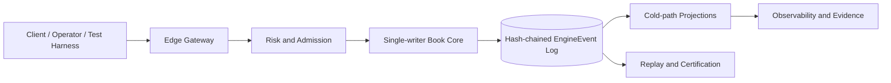
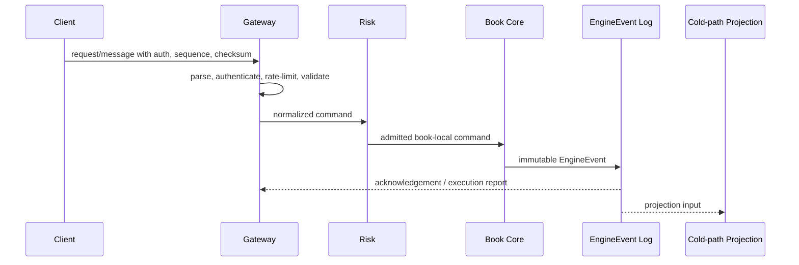
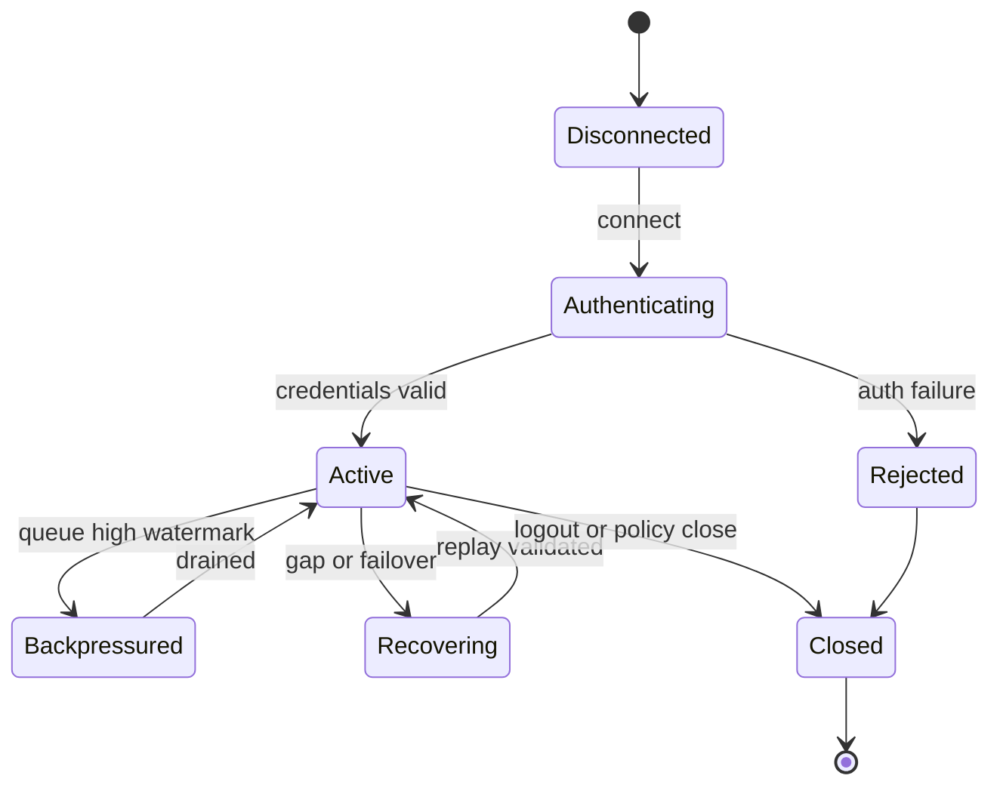

# VOLUME VI: MARKET DATA & CONNECTIVITY

## Purpose

Volume VI defines implementation-grade technical requirements for market data & connectivity in HermesNet. It is normative for engineering teams, Codex agents, SRE, security, compliance, and reviewers implementing or operating production exchange systems.

## Scope

The volume covers the planned chapters listed below and binds them to the cross-volume invariants established by Volumes I–V. It does not alter frozen volumes, define document versioning policy, create governance process, or generate DOCX/PDF artifacts.


## Normative Principles

All requirements in this volume preserve HermesNet invariants: no global sequencer, book-local ordering, a single-writer Book Core for each active book, fixed-point arithmetic for financial quantities, deterministic replay from immutable `EngineEvent` records, hash-chained event logs, hot/cold path separation, no database, Kafka, or cloud dependency in the trading hot path, auditable financial mutation, observable operation, logged security-sensitive action, and testable production process.

## Reference Architecture



## Chapters

1. REST API
2. WebSocket API
3. FIX Gateway
4. OUCH Gateway
5. SBE Protocol
6. Market Data Fanout
7. Snapshot and Delta Recovery
8. Private Streams
9. Protocol Versioning
10. Connectivity Certification Tests

## REST API

### Purpose

Defines JSON over HTTPS contracts for order entry, cancel, account, and market data endpoints. Requests use API key id, timestamp, nonce, and HMAC-SHA256 over method, path, query, body hash, and timestamp. Rate limits are per key, IP, account, and route; overload returns deterministic reject codes before Book Core admission. Order endpoints accept limit, market-protected, post-only, reduce-only where supported, time-in-force, client order id, fixed-point price, and fixed-point quantity. Cancel endpoints support by order id, client order id, book, side, and cancel-all with kill-switch scoping. Account endpoints expose cold-path balances, holds, positions, fills, fees, and drop-copy cursors. Market-data endpoints expose instrument metadata, trades, L1/L2/L3 snapshots, deltas by sequence, and checksum validation.

### Scope

This chapter applies to production services, certification harnesses, replay tooling, monitoring, operational runbooks, and implementation reviews that touch rest api. It excludes marketing claims, non-deterministic shortcuts, and any dependency that can block the Book Core hot path.

### Responsibilities

- Preserve book-local ordering and single-writer mutation.
- Validate fixed-point quantities and deterministic reject reasons before mutation.
- Emit immutable EngineEvents for accepted state changes.
- Maintain bounded queues, explicit sequence numbers, checksums, and replayable evidence.
- Expose metrics, logs, traces, alerts, and audit records appropriate to the domain.

### Architecture



### State Machines



### Algorithms and Contracts

```rust
pub struct RESTAPIContract {
    pub request_id: ClientRequestId,
    pub book_id: BookId,
    pub sequence: u64,
    pub checksum: u32,
}

pub fn validate_and_apply(input: &InboundMessage, state: &mut DeterministicState) -> Result<Vec<EngineEvent>, RejectReason> {
    input.verify_checksum()?;
    input.verify_monotonic_sequence(state.last_sequence)?;
    let command = input.to_book_local_command()?;
    let events = state.apply_single_writer(command)?;
    Ok(events)
}
```

Configuration example:

```yaml
component: rest-api
limits:
  inbound_messages_per_second: 5000
  max_queue_depth: 65536
  slow_consumer_threshold_ms: 250
recovery:
  require_contiguous_sequences: true
  validate_checksums: true
  replay_from_engine_events: true
security:
  audit_sensitive_actions: true
  reject_unsigned_mutations: true
```

### Failure Modes and Recovery

| Failure mode | Required behavior | Recovery evidence |
|---|---|---|
| Malformed input | Reject before Book Core admission | reject code, client id, checksum result |
| Sequence gap | Stop applying stream and enter recovery | last good sequence and replay cursor |
| Gateway overload | Shed at gateway with deterministic rejects | rate-limit metric and audit log |
| Slow consumer | Warn, throttle, disconnect, or require resnapshot | queue depth and disconnect reason |
| Core failover | Resume from hash-chain verified event cursor | previous and new active identity |

### Observability

Expose counters for accepted, rejected, throttled, replayed, disconnected, and recovered messages; gauges for queue depth, replay lag, and active sessions; histograms for parse, authentication, admission, acknowledgement, fanout, and end-to-end latency; structured logs with request id, account id, book id, sequence, EngineEvent hash, and reject reason.

### Security Considerations

Authenticate every mutating request, authorize account and role scope, verify HMAC or mTLS where applicable, prevent replay with timestamp and nonce windows, redact secrets from logs, audit administrative and private-data access, and fail closed when identity, sequence, or checksum validation is ambiguous.

### Testing Strategy

Test normal flow, malformed input, duplicate ids, sequence gaps, reconnect recovery, checksum mismatch, overload, failover, replay determinism, authorization denial, slow consumers, and cold-path projection lag. Golden vectors must include input bytes, normalized command, EngineEvent hash, and expected outbound messages.

### Acceptance Criteria

- No accepted mutation bypasses deterministic validation or audit logging.
- Recovery from a valid cursor yields byte-equivalent outward state.
- Backpressure never blocks the Book Core hot path.
- Sequence and checksum failures are detected and observable.
- Certification tests cover success, rejection, overload, and recovery paths.

### Codex Implementation Contract

Codex changes touching rest api must include deterministic tests, avoid hidden wall-clock dependence, preserve fixed-point arithmetic, avoid try/catch around imports, keep external dependencies out of the hot path, and update examples, diagrams, and acceptance criteria when contracts change.

### Review Checklist

- [ ] Contracts are explicit and versioned.
- [ ] Failure modes have recovery procedures.
- [ ] Metrics, logs, traces, and audit records are specified.
- [ ] Security-sensitive operations are authenticated, authorized, and logged.
- [ ] Tests include replay, overload, and negative cases.

## WebSocket API

### Purpose

Specifies public and private bidirectional sessions. Lifecycle is connect, authenticate if private, subscribe, receive snapshot, apply deltas, heartbeat, resubscribe or reconnect recovery, and close. Public streams carry trades, ticker, book deltas, and snapshots; private streams carry acknowledgements, execution reports, cancels, rejects, balances, positions, and drop copy. Backpressure is enforced with bounded queues, slow-consumer warnings, conflation only for explicitly conflatable ticker channels, and disconnect for lossless channels that exceed limits.

### Scope

This chapter applies to production services, certification harnesses, replay tooling, monitoring, operational runbooks, and implementation reviews that touch websocket api. It excludes marketing claims, non-deterministic shortcuts, and any dependency that can block the Book Core hot path.

### Responsibilities

- Preserve book-local ordering and single-writer mutation.
- Validate fixed-point quantities and deterministic reject reasons before mutation.
- Emit immutable EngineEvents for accepted state changes.
- Maintain bounded queues, explicit sequence numbers, checksums, and replayable evidence.
- Expose metrics, logs, traces, alerts, and audit records appropriate to the domain.

### Architecture


### State Machines


### Algorithms and Contracts

```rust
pub struct WebSocketAPIContract {
    pub request_id: ClientRequestId,
    pub book_id: BookId,
    pub sequence: u64,
    pub checksum: u32,
}

pub fn validate_and_apply(input: &InboundMessage, state: &mut DeterministicState) -> Result<Vec<EngineEvent>, RejectReason> {
    input.verify_checksum()?;
    input.verify_monotonic_sequence(state.last_sequence)?;
    let command = input.to_book_local_command()?;
    let events = state.apply_single_writer(command)?;
    Ok(events)
}
```

Configuration example:

```yaml
component: websocket-api
limits:
  inbound_messages_per_second: 5000
  max_queue_depth: 65536
  slow_consumer_threshold_ms: 250
recovery:
  require_contiguous_sequences: true
  validate_checksums: true
  replay_from_engine_events: true
security:
  audit_sensitive_actions: true
  reject_unsigned_mutations: true
```

### Failure Modes and Recovery

| Failure mode | Required behavior | Recovery evidence |
|---|---|---|
| Malformed input | Reject before Book Core admission | reject code, client id, checksum result |
| Sequence gap | Stop applying stream and enter recovery | last good sequence and replay cursor |
| Gateway overload | Shed at gateway with deterministic rejects | rate-limit metric and audit log |
| Slow consumer | Warn, throttle, disconnect, or require resnapshot | queue depth and disconnect reason |
| Core failover | Resume from hash-chain verified event cursor | previous and new active identity |

### Observability

Expose counters for accepted, rejected, throttled, replayed, disconnected, and recovered messages; gauges for queue depth, replay lag, and active sessions; histograms for parse, authentication, admission, acknowledgement, fanout, and end-to-end latency; structured logs with request id, account id, book id, sequence, EngineEvent hash, and reject reason.

### Security Considerations

Authenticate every mutating request, authorize account and role scope, verify HMAC or mTLS where applicable, prevent replay with timestamp and nonce windows, redact secrets from logs, audit administrative and private-data access, and fail closed when identity, sequence, or checksum validation is ambiguous.

### Testing Strategy

Test normal flow, malformed input, duplicate ids, sequence gaps, reconnect recovery, checksum mismatch, overload, failover, replay determinism, authorization denial, slow consumers, and cold-path projection lag. Golden vectors must include input bytes, normalized command, EngineEvent hash, and expected outbound messages.

### Acceptance Criteria

- No accepted mutation bypasses deterministic validation or audit logging.
- Recovery from a valid cursor yields byte-equivalent outward state.
- Backpressure never blocks the Book Core hot path.
- Sequence and checksum failures are detected and observable.
- Certification tests cover success, rejection, overload, and recovery paths.

### Codex Implementation Contract

Codex changes touching websocket api must include deterministic tests, avoid hidden wall-clock dependence, preserve fixed-point arithmetic, avoid try/catch around imports, keep external dependencies out of the hot path, and update examples, diagrams, and acceptance criteria when contracts change.

### Review Checklist

- [ ] Contracts are explicit and versioned.
- [ ] Failure modes have recovery procedures.
- [ ] Metrics, logs, traces, and audit records are specified.
- [ ] Security-sensitive operations are authenticated, authorized, and logged.
- [ ] Tests include replay, overload, and negative cases.

## FIX Gateway

### Purpose

Covers FIX session lifecycle: TCP/TLS/mTLS connect, Logon, sequence reset policy, heartbeat, TestRequest, ResendRequest, GapFill, application messages, Logout, and replay. Execution reports map all order state transitions with ExecID tied to EngineEvent hash and book-local sequence. Drop copy is a separate read-only FIX session class. FIX order, cancel, replace, and mass cancel messages are normalized before risk and Book Core admission.

### Scope

This chapter applies to production services, certification harnesses, replay tooling, monitoring, operational runbooks, and implementation reviews that touch fix gateway. It excludes marketing claims, non-deterministic shortcuts, and any dependency that can block the Book Core hot path.

### Responsibilities

- Preserve book-local ordering and single-writer mutation.
- Validate fixed-point quantities and deterministic reject reasons before mutation.
- Emit immutable EngineEvents for accepted state changes.
- Maintain bounded queues, explicit sequence numbers, checksums, and replayable evidence.
- Expose metrics, logs, traces, alerts, and audit records appropriate to the domain.

### Architecture


### State Machines


### Algorithms and Contracts

```rust
pub struct FIXGatewayContract {
    pub request_id: ClientRequestId,
    pub book_id: BookId,
    pub sequence: u64,
    pub checksum: u32,
}

pub fn validate_and_apply(input: &InboundMessage, state: &mut DeterministicState) -> Result<Vec<EngineEvent>, RejectReason> {
    input.verify_checksum()?;
    input.verify_monotonic_sequence(state.last_sequence)?;
    let command = input.to_book_local_command()?;
    let events = state.apply_single_writer(command)?;
    Ok(events)
}
```

Configuration example:

```yaml
component: fix-gateway
limits:
  inbound_messages_per_second: 5000
  max_queue_depth: 65536
  slow_consumer_threshold_ms: 250
recovery:
  require_contiguous_sequences: true
  validate_checksums: true
  replay_from_engine_events: true
security:
  audit_sensitive_actions: true
  reject_unsigned_mutations: true
```

### Failure Modes and Recovery

| Failure mode | Required behavior | Recovery evidence |
|---|---|---|
| Malformed input | Reject before Book Core admission | reject code, client id, checksum result |
| Sequence gap | Stop applying stream and enter recovery | last good sequence and replay cursor |
| Gateway overload | Shed at gateway with deterministic rejects | rate-limit metric and audit log |
| Slow consumer | Warn, throttle, disconnect, or require resnapshot | queue depth and disconnect reason |
| Core failover | Resume from hash-chain verified event cursor | previous and new active identity |

### Observability

Expose counters for accepted, rejected, throttled, replayed, disconnected, and recovered messages; gauges for queue depth, replay lag, and active sessions; histograms for parse, authentication, admission, acknowledgement, fanout, and end-to-end latency; structured logs with request id, account id, book id, sequence, EngineEvent hash, and reject reason.

### Security Considerations

Authenticate every mutating request, authorize account and role scope, verify HMAC or mTLS where applicable, prevent replay with timestamp and nonce windows, redact secrets from logs, audit administrative and private-data access, and fail closed when identity, sequence, or checksum validation is ambiguous.

### Testing Strategy

Test normal flow, malformed input, duplicate ids, sequence gaps, reconnect recovery, checksum mismatch, overload, failover, replay determinism, authorization denial, slow consumers, and cold-path projection lag. Golden vectors must include input bytes, normalized command, EngineEvent hash, and expected outbound messages.

### Acceptance Criteria

- No accepted mutation bypasses deterministic validation or audit logging.
- Recovery from a valid cursor yields byte-equivalent outward state.
- Backpressure never blocks the Book Core hot path.
- Sequence and checksum failures are detected and observable.
- Certification tests cover success, rejection, overload, and recovery paths.

### Codex Implementation Contract

Codex changes touching fix gateway must include deterministic tests, avoid hidden wall-clock dependence, preserve fixed-point arithmetic, avoid try/catch around imports, keep external dependencies out of the hot path, and update examples, diagrams, and acceptance criteria when contracts change.

### Review Checklist

- [ ] Contracts are explicit and versioned.
- [ ] Failure modes have recovery procedures.
- [ ] Metrics, logs, traces, and audit records are specified.
- [ ] Security-sensitive operations are authenticated, authorized, and logged.
- [ ] Tests include replay, overload, and negative cases.

## OUCH Gateway

### Purpose

Defines low-latency binary order entry with login, heartbeat, enter order, replace, cancel, accepted, replaced, canceled, executed, rejected, broken-trade, and logout messages. OUCH is lossless: gateway sequence numbers and book-local sequence numbers are explicit, and recovery uses replay from last accepted outbound sequence. Malformed messages are rejected without entering the hot path.

### Scope

This chapter applies to production services, certification harnesses, replay tooling, monitoring, operational runbooks, and implementation reviews that touch ouch gateway. It excludes marketing claims, non-deterministic shortcuts, and any dependency that can block the Book Core hot path.

### Responsibilities

- Preserve book-local ordering and single-writer mutation.
- Validate fixed-point quantities and deterministic reject reasons before mutation.
- Emit immutable EngineEvents for accepted state changes.
- Maintain bounded queues, explicit sequence numbers, checksums, and replayable evidence.
- Expose metrics, logs, traces, alerts, and audit records appropriate to the domain.

### Architecture


### State Machines


### Algorithms and Contracts

```rust
pub struct OUCHGatewayContract {
    pub request_id: ClientRequestId,
    pub book_id: BookId,
    pub sequence: u64,
    pub checksum: u32,
}

pub fn validate_and_apply(input: &InboundMessage, state: &mut DeterministicState) -> Result<Vec<EngineEvent>, RejectReason> {
    input.verify_checksum()?;
    input.verify_monotonic_sequence(state.last_sequence)?;
    let command = input.to_book_local_command()?;
    let events = state.apply_single_writer(command)?;
    Ok(events)
}
```

Configuration example:

```yaml
component: ouch-gateway
limits:
  inbound_messages_per_second: 5000
  max_queue_depth: 65536
  slow_consumer_threshold_ms: 250
recovery:
  require_contiguous_sequences: true
  validate_checksums: true
  replay_from_engine_events: true
security:
  audit_sensitive_actions: true
  reject_unsigned_mutations: true
```

### Failure Modes and Recovery

| Failure mode | Required behavior | Recovery evidence |
|---|---|---|
| Malformed input | Reject before Book Core admission | reject code, client id, checksum result |
| Sequence gap | Stop applying stream and enter recovery | last good sequence and replay cursor |
| Gateway overload | Shed at gateway with deterministic rejects | rate-limit metric and audit log |
| Slow consumer | Warn, throttle, disconnect, or require resnapshot | queue depth and disconnect reason |
| Core failover | Resume from hash-chain verified event cursor | previous and new active identity |

### Observability

Expose counters for accepted, rejected, throttled, replayed, disconnected, and recovered messages; gauges for queue depth, replay lag, and active sessions; histograms for parse, authentication, admission, acknowledgement, fanout, and end-to-end latency; structured logs with request id, account id, book id, sequence, EngineEvent hash, and reject reason.

### Security Considerations

Authenticate every mutating request, authorize account and role scope, verify HMAC or mTLS where applicable, prevent replay with timestamp and nonce windows, redact secrets from logs, audit administrative and private-data access, and fail closed when identity, sequence, or checksum validation is ambiguous.

### Testing Strategy

Test normal flow, malformed input, duplicate ids, sequence gaps, reconnect recovery, checksum mismatch, overload, failover, replay determinism, authorization denial, slow consumers, and cold-path projection lag. Golden vectors must include input bytes, normalized command, EngineEvent hash, and expected outbound messages.

### Acceptance Criteria

- No accepted mutation bypasses deterministic validation or audit logging.
- Recovery from a valid cursor yields byte-equivalent outward state.
- Backpressure never blocks the Book Core hot path.
- Sequence and checksum failures are detected and observable.
- Certification tests cover success, rejection, overload, and recovery paths.

### Codex Implementation Contract

Codex changes touching ouch gateway must include deterministic tests, avoid hidden wall-clock dependence, preserve fixed-point arithmetic, avoid try/catch around imports, keep external dependencies out of the hot path, and update examples, diagrams, and acceptance criteria when contracts change.

### Review Checklist

- [ ] Contracts are explicit and versioned.
- [ ] Failure modes have recovery procedures.
- [ ] Metrics, logs, traces, and audit records are specified.
- [ ] Security-sensitive operations are authenticated, authorized, and logged.
- [ ] Tests include replay, overload, and negative cases.

## SBE Protocol

### Purpose

Defines Simple Binary Encoding schema governance for market data and low-latency connectivity. Schemas use stable template ids, explicit semantic versions, fixed-width integers for fixed-point values, little-endian encoding unless stated, reserved fields for compatible extension, and CRC32C or equivalent checksums at frame boundaries. Decoders must reject unknown required fields and tolerate additive optional fields.

### Scope

This chapter applies to production services, certification harnesses, replay tooling, monitoring, operational runbooks, and implementation reviews that touch sbe protocol. It excludes marketing claims, non-deterministic shortcuts, and any dependency that can block the Book Core hot path.

### Responsibilities

- Preserve book-local ordering and single-writer mutation.
- Validate fixed-point quantities and deterministic reject reasons before mutation.
- Emit immutable EngineEvents for accepted state changes.
- Maintain bounded queues, explicit sequence numbers, checksums, and replayable evidence.
- Expose metrics, logs, traces, alerts, and audit records appropriate to the domain.

### Architecture


### State Machines


### Algorithms and Contracts

```rust
pub struct SBEProtocolContract {
    pub request_id: ClientRequestId,
    pub book_id: BookId,
    pub sequence: u64,
    pub checksum: u32,
}

pub fn validate_and_apply(input: &InboundMessage, state: &mut DeterministicState) -> Result<Vec<EngineEvent>, RejectReason> {
    input.verify_checksum()?;
    input.verify_monotonic_sequence(state.last_sequence)?;
    let command = input.to_book_local_command()?;
    let events = state.apply_single_writer(command)?;
    Ok(events)
}
```

Configuration example:

```yaml
component: sbe-protocol
limits:
  inbound_messages_per_second: 5000
  max_queue_depth: 65536
  slow_consumer_threshold_ms: 250
recovery:
  require_contiguous_sequences: true
  validate_checksums: true
  replay_from_engine_events: true
security:
  audit_sensitive_actions: true
  reject_unsigned_mutations: true
```

### Failure Modes and Recovery

| Failure mode | Required behavior | Recovery evidence |
|---|---|---|
| Malformed input | Reject before Book Core admission | reject code, client id, checksum result |
| Sequence gap | Stop applying stream and enter recovery | last good sequence and replay cursor |
| Gateway overload | Shed at gateway with deterministic rejects | rate-limit metric and audit log |
| Slow consumer | Warn, throttle, disconnect, or require resnapshot | queue depth and disconnect reason |
| Core failover | Resume from hash-chain verified event cursor | previous and new active identity |

### Observability

Expose counters for accepted, rejected, throttled, replayed, disconnected, and recovered messages; gauges for queue depth, replay lag, and active sessions; histograms for parse, authentication, admission, acknowledgement, fanout, and end-to-end latency; structured logs with request id, account id, book id, sequence, EngineEvent hash, and reject reason.

### Security Considerations

Authenticate every mutating request, authorize account and role scope, verify HMAC or mTLS where applicable, prevent replay with timestamp and nonce windows, redact secrets from logs, audit administrative and private-data access, and fail closed when identity, sequence, or checksum validation is ambiguous.

### Testing Strategy

Test normal flow, malformed input, duplicate ids, sequence gaps, reconnect recovery, checksum mismatch, overload, failover, replay determinism, authorization denial, slow consumers, and cold-path projection lag. Golden vectors must include input bytes, normalized command, EngineEvent hash, and expected outbound messages.

### Acceptance Criteria

- No accepted mutation bypasses deterministic validation or audit logging.
- Recovery from a valid cursor yields byte-equivalent outward state.
- Backpressure never blocks the Book Core hot path.
- Sequence and checksum failures are detected and observable.
- Certification tests cover success, rejection, overload, and recovery paths.

### Codex Implementation Contract

Codex changes touching sbe protocol must include deterministic tests, avoid hidden wall-clock dependence, preserve fixed-point arithmetic, avoid try/catch around imports, keep external dependencies out of the hot path, and update examples, diagrams, and acceptance criteria when contracts change.

### Review Checklist

- [ ] Contracts are explicit and versioned.
- [ ] Failure modes have recovery procedures.
- [ ] Metrics, logs, traces, and audit records are specified.
- [ ] Security-sensitive operations are authenticated, authorized, and logged.
- [ ] Tests include replay, overload, and negative cases.

## Market Data Fanout

### Purpose

Specifies fanout from immutable EngineEvents to public market data without feeding decisions back into the hot path. Fanout builds L1, L2, L3, trades, candles, and ticker projections from book-local events. Publisher queues are bounded, partitioned by book, and measured for lag; hot path never waits on subscribers, brokers, databases, or cloud services.

### Scope

This chapter applies to production services, certification harnesses, replay tooling, monitoring, operational runbooks, and implementation reviews that touch market data fanout. It excludes marketing claims, non-deterministic shortcuts, and any dependency that can block the Book Core hot path.

### Responsibilities

- Preserve book-local ordering and single-writer mutation.
- Validate fixed-point quantities and deterministic reject reasons before mutation.
- Emit immutable EngineEvents for accepted state changes.
- Maintain bounded queues, explicit sequence numbers, checksums, and replayable evidence.
- Expose metrics, logs, traces, alerts, and audit records appropriate to the domain.

### Architecture


### State Machines


### Algorithms and Contracts

```rust
pub struct MarketDataFanoutContract {
    pub request_id: ClientRequestId,
    pub book_id: BookId,
    pub sequence: u64,
    pub checksum: u32,
}

pub fn validate_and_apply(input: &InboundMessage, state: &mut DeterministicState) -> Result<Vec<EngineEvent>, RejectReason> {
    input.verify_checksum()?;
    input.verify_monotonic_sequence(state.last_sequence)?;
    let command = input.to_book_local_command()?;
    let events = state.apply_single_writer(command)?;
    Ok(events)
}
```

Configuration example:

```yaml
component: market-data-fanout
limits:
  inbound_messages_per_second: 5000
  max_queue_depth: 65536
  slow_consumer_threshold_ms: 250
recovery:
  require_contiguous_sequences: true
  validate_checksums: true
  replay_from_engine_events: true
security:
  audit_sensitive_actions: true
  reject_unsigned_mutations: true
```

### Failure Modes and Recovery

| Failure mode | Required behavior | Recovery evidence |
|---|---|---|
| Malformed input | Reject before Book Core admission | reject code, client id, checksum result |
| Sequence gap | Stop applying stream and enter recovery | last good sequence and replay cursor |
| Gateway overload | Shed at gateway with deterministic rejects | rate-limit metric and audit log |
| Slow consumer | Warn, throttle, disconnect, or require resnapshot | queue depth and disconnect reason |
| Core failover | Resume from hash-chain verified event cursor | previous and new active identity |

### Observability

Expose counters for accepted, rejected, throttled, replayed, disconnected, and recovered messages; gauges for queue depth, replay lag, and active sessions; histograms for parse, authentication, admission, acknowledgement, fanout, and end-to-end latency; structured logs with request id, account id, book id, sequence, EngineEvent hash, and reject reason.

### Security Considerations

Authenticate every mutating request, authorize account and role scope, verify HMAC or mTLS where applicable, prevent replay with timestamp and nonce windows, redact secrets from logs, audit administrative and private-data access, and fail closed when identity, sequence, or checksum validation is ambiguous.

### Testing Strategy

Test normal flow, malformed input, duplicate ids, sequence gaps, reconnect recovery, checksum mismatch, overload, failover, replay determinism, authorization denial, slow consumers, and cold-path projection lag. Golden vectors must include input bytes, normalized command, EngineEvent hash, and expected outbound messages.

### Acceptance Criteria

- No accepted mutation bypasses deterministic validation or audit logging.
- Recovery from a valid cursor yields byte-equivalent outward state.
- Backpressure never blocks the Book Core hot path.
- Sequence and checksum failures are detected and observable.
- Certification tests cover success, rejection, overload, and recovery paths.

### Codex Implementation Contract

Codex changes touching market data fanout must include deterministic tests, avoid hidden wall-clock dependence, preserve fixed-point arithmetic, avoid try/catch around imports, keep external dependencies out of the hot path, and update examples, diagrams, and acceptance criteria when contracts change.

### Review Checklist

- [ ] Contracts are explicit and versioned.
- [ ] Failure modes have recovery procedures.
- [ ] Metrics, logs, traces, and audit records are specified.
- [ ] Security-sensitive operations are authenticated, authorized, and logged.
- [ ] Tests include replay, overload, and negative cases.

## Snapshot and Delta Recovery

### Purpose

Defines snapshots as complete book images at a sequence, followed by ordered deltas. A client must load snapshot sequence S, discard deltas <= S, apply S+1..N contiguously, validate checksum, and reconnect if a gap occurs. Gateways provide bounded rewind buffers and cold-path historical recovery beyond buffer windows.

### Scope

This chapter applies to production services, certification harnesses, replay tooling, monitoring, operational runbooks, and implementation reviews that touch snapshot and delta recovery. It excludes marketing claims, non-deterministic shortcuts, and any dependency that can block the Book Core hot path.

### Responsibilities

- Preserve book-local ordering and single-writer mutation.
- Validate fixed-point quantities and deterministic reject reasons before mutation.
- Emit immutable EngineEvents for accepted state changes.
- Maintain bounded queues, explicit sequence numbers, checksums, and replayable evidence.
- Expose metrics, logs, traces, alerts, and audit records appropriate to the domain.

### Architecture


### State Machines


### Algorithms and Contracts

```rust
pub struct SnapshotandDeltaRecoveryContract {
    pub request_id: ClientRequestId,
    pub book_id: BookId,
    pub sequence: u64,
    pub checksum: u32,
}

pub fn validate_and_apply(input: &InboundMessage, state: &mut DeterministicState) -> Result<Vec<EngineEvent>, RejectReason> {
    input.verify_checksum()?;
    input.verify_monotonic_sequence(state.last_sequence)?;
    let command = input.to_book_local_command()?;
    let events = state.apply_single_writer(command)?;
    Ok(events)
}
```

Configuration example:

```yaml
component: snapshot-and-delta-recovery
limits:
  inbound_messages_per_second: 5000
  max_queue_depth: 65536
  slow_consumer_threshold_ms: 250
recovery:
  require_contiguous_sequences: true
  validate_checksums: true
  replay_from_engine_events: true
security:
  audit_sensitive_actions: true
  reject_unsigned_mutations: true
```

### Failure Modes and Recovery

| Failure mode | Required behavior | Recovery evidence |
|---|---|---|
| Malformed input | Reject before Book Core admission | reject code, client id, checksum result |
| Sequence gap | Stop applying stream and enter recovery | last good sequence and replay cursor |
| Gateway overload | Shed at gateway with deterministic rejects | rate-limit metric and audit log |
| Slow consumer | Warn, throttle, disconnect, or require resnapshot | queue depth and disconnect reason |
| Core failover | Resume from hash-chain verified event cursor | previous and new active identity |

### Observability

Expose counters for accepted, rejected, throttled, replayed, disconnected, and recovered messages; gauges for queue depth, replay lag, and active sessions; histograms for parse, authentication, admission, acknowledgement, fanout, and end-to-end latency; structured logs with request id, account id, book id, sequence, EngineEvent hash, and reject reason.

### Security Considerations

Authenticate every mutating request, authorize account and role scope, verify HMAC or mTLS where applicable, prevent replay with timestamp and nonce windows, redact secrets from logs, audit administrative and private-data access, and fail closed when identity, sequence, or checksum validation is ambiguous.

### Testing Strategy

Test normal flow, malformed input, duplicate ids, sequence gaps, reconnect recovery, checksum mismatch, overload, failover, replay determinism, authorization denial, slow consumers, and cold-path projection lag. Golden vectors must include input bytes, normalized command, EngineEvent hash, and expected outbound messages.

### Acceptance Criteria

- No accepted mutation bypasses deterministic validation or audit logging.
- Recovery from a valid cursor yields byte-equivalent outward state.
- Backpressure never blocks the Book Core hot path.
- Sequence and checksum failures are detected and observable.
- Certification tests cover success, rejection, overload, and recovery paths.

### Codex Implementation Contract

Codex changes touching snapshot and delta recovery must include deterministic tests, avoid hidden wall-clock dependence, preserve fixed-point arithmetic, avoid try/catch around imports, keep external dependencies out of the hot path, and update examples, diagrams, and acceptance criteria when contracts change.

### Review Checklist

- [ ] Contracts are explicit and versioned.
- [ ] Failure modes have recovery procedures.
- [ ] Metrics, logs, traces, and audit records are specified.
- [ ] Security-sensitive operations are authenticated, authorized, and logged.
- [ ] Tests include replay, overload, and negative cases.

## Private Streams

### Purpose

Defines authenticated user streams for order and account state. Private stream messages are sourced from EngineEvents and ledger projections, include monotonic per-account sequence numbers, and support resume tokens. All security-sensitive private subscriptions are audit logged. Drop-copy subscriptions are read-only and scoped by account, desk, or regulatory role.

### Scope

This chapter applies to production services, certification harnesses, replay tooling, monitoring, operational runbooks, and implementation reviews that touch private streams. It excludes marketing claims, non-deterministic shortcuts, and any dependency that can block the Book Core hot path.

### Responsibilities

- Preserve book-local ordering and single-writer mutation.
- Validate fixed-point quantities and deterministic reject reasons before mutation.
- Emit immutable EngineEvents for accepted state changes.
- Maintain bounded queues, explicit sequence numbers, checksums, and replayable evidence.
- Expose metrics, logs, traces, alerts, and audit records appropriate to the domain.

### Architecture


### State Machines


### Algorithms and Contracts

```rust
pub struct PrivateStreamsContract {
    pub request_id: ClientRequestId,
    pub book_id: BookId,
    pub sequence: u64,
    pub checksum: u32,
}

pub fn validate_and_apply(input: &InboundMessage, state: &mut DeterministicState) -> Result<Vec<EngineEvent>, RejectReason> {
    input.verify_checksum()?;
    input.verify_monotonic_sequence(state.last_sequence)?;
    let command = input.to_book_local_command()?;
    let events = state.apply_single_writer(command)?;
    Ok(events)
}
```

Configuration example:

```yaml
component: private-streams
limits:
  inbound_messages_per_second: 5000
  max_queue_depth: 65536
  slow_consumer_threshold_ms: 250
recovery:
  require_contiguous_sequences: true
  validate_checksums: true
  replay_from_engine_events: true
security:
  audit_sensitive_actions: true
  reject_unsigned_mutations: true
```

### Failure Modes and Recovery

| Failure mode | Required behavior | Recovery evidence |
|---|---|---|
| Malformed input | Reject before Book Core admission | reject code, client id, checksum result |
| Sequence gap | Stop applying stream and enter recovery | last good sequence and replay cursor |
| Gateway overload | Shed at gateway with deterministic rejects | rate-limit metric and audit log |
| Slow consumer | Warn, throttle, disconnect, or require resnapshot | queue depth and disconnect reason |
| Core failover | Resume from hash-chain verified event cursor | previous and new active identity |

### Observability

Expose counters for accepted, rejected, throttled, replayed, disconnected, and recovered messages; gauges for queue depth, replay lag, and active sessions; histograms for parse, authentication, admission, acknowledgement, fanout, and end-to-end latency; structured logs with request id, account id, book id, sequence, EngineEvent hash, and reject reason.

### Security Considerations

Authenticate every mutating request, authorize account and role scope, verify HMAC or mTLS where applicable, prevent replay with timestamp and nonce windows, redact secrets from logs, audit administrative and private-data access, and fail closed when identity, sequence, or checksum validation is ambiguous.

### Testing Strategy

Test normal flow, malformed input, duplicate ids, sequence gaps, reconnect recovery, checksum mismatch, overload, failover, replay determinism, authorization denial, slow consumers, and cold-path projection lag. Golden vectors must include input bytes, normalized command, EngineEvent hash, and expected outbound messages.

### Acceptance Criteria

- No accepted mutation bypasses deterministic validation or audit logging.
- Recovery from a valid cursor yields byte-equivalent outward state.
- Backpressure never blocks the Book Core hot path.
- Sequence and checksum failures are detected and observable.
- Certification tests cover success, rejection, overload, and recovery paths.

### Codex Implementation Contract

Codex changes touching private streams must include deterministic tests, avoid hidden wall-clock dependence, preserve fixed-point arithmetic, avoid try/catch around imports, keep external dependencies out of the hot path, and update examples, diagrams, and acceptance criteria when contracts change.

### Review Checklist

- [ ] Contracts are explicit and versioned.
- [ ] Failure modes have recovery procedures.
- [ ] Metrics, logs, traces, and audit records are specified.
- [ ] Security-sensitive operations are authenticated, authorized, and logged.
- [ ] Tests include replay, overload, and negative cases.

## Protocol Versioning

### Purpose

Defines compatibility rules for REST, WebSocket, FIX, OUCH, and SBE. Breaking changes require a new major route, channel, FIX dialect, OUCH version, or SBE schema id. Additive fields are optional by default. Gateways publish supported versions and deprecation windows; no protocol version may change deterministic Book Core behavior.

### Scope

This chapter applies to production services, certification harnesses, replay tooling, monitoring, operational runbooks, and implementation reviews that touch protocol versioning. It excludes marketing claims, non-deterministic shortcuts, and any dependency that can block the Book Core hot path.

### Responsibilities

- Preserve book-local ordering and single-writer mutation.
- Validate fixed-point quantities and deterministic reject reasons before mutation.
- Emit immutable EngineEvents for accepted state changes.
- Maintain bounded queues, explicit sequence numbers, checksums, and replayable evidence.
- Expose metrics, logs, traces, alerts, and audit records appropriate to the domain.

### Architecture


### State Machines


### Algorithms and Contracts

```rust
pub struct ProtocolVersioningContract {
    pub request_id: ClientRequestId,
    pub book_id: BookId,
    pub sequence: u64,
    pub checksum: u32,
}

pub fn validate_and_apply(input: &InboundMessage, state: &mut DeterministicState) -> Result<Vec<EngineEvent>, RejectReason> {
    input.verify_checksum()?;
    input.verify_monotonic_sequence(state.last_sequence)?;
    let command = input.to_book_local_command()?;
    let events = state.apply_single_writer(command)?;
    Ok(events)
}
```

Configuration example:

```yaml
component: protocol-versioning
limits:
  inbound_messages_per_second: 5000
  max_queue_depth: 65536
  slow_consumer_threshold_ms: 250
recovery:
  require_contiguous_sequences: true
  validate_checksums: true
  replay_from_engine_events: true
security:
  audit_sensitive_actions: true
  reject_unsigned_mutations: true
```

### Failure Modes and Recovery

| Failure mode | Required behavior | Recovery evidence |
|---|---|---|
| Malformed input | Reject before Book Core admission | reject code, client id, checksum result |
| Sequence gap | Stop applying stream and enter recovery | last good sequence and replay cursor |
| Gateway overload | Shed at gateway with deterministic rejects | rate-limit metric and audit log |
| Slow consumer | Warn, throttle, disconnect, or require resnapshot | queue depth and disconnect reason |
| Core failover | Resume from hash-chain verified event cursor | previous and new active identity |

### Observability

Expose counters for accepted, rejected, throttled, replayed, disconnected, and recovered messages; gauges for queue depth, replay lag, and active sessions; histograms for parse, authentication, admission, acknowledgement, fanout, and end-to-end latency; structured logs with request id, account id, book id, sequence, EngineEvent hash, and reject reason.

### Security Considerations

Authenticate every mutating request, authorize account and role scope, verify HMAC or mTLS where applicable, prevent replay with timestamp and nonce windows, redact secrets from logs, audit administrative and private-data access, and fail closed when identity, sequence, or checksum validation is ambiguous.

### Testing Strategy

Test normal flow, malformed input, duplicate ids, sequence gaps, reconnect recovery, checksum mismatch, overload, failover, replay determinism, authorization denial, slow consumers, and cold-path projection lag. Golden vectors must include input bytes, normalized command, EngineEvent hash, and expected outbound messages.

### Acceptance Criteria

- No accepted mutation bypasses deterministic validation or audit logging.
- Recovery from a valid cursor yields byte-equivalent outward state.
- Backpressure never blocks the Book Core hot path.
- Sequence and checksum failures are detected and observable.
- Certification tests cover success, rejection, overload, and recovery paths.

### Codex Implementation Contract

Codex changes touching protocol versioning must include deterministic tests, avoid hidden wall-clock dependence, preserve fixed-point arithmetic, avoid try/catch around imports, keep external dependencies out of the hot path, and update examples, diagrams, and acceptance criteria when contracts change.

### Review Checklist

- [ ] Contracts are explicit and versioned.
- [ ] Failure modes have recovery procedures.
- [ ] Metrics, logs, traces, and audit records are specified.
- [ ] Security-sensitive operations are authenticated, authorized, and logged.
- [ ] Tests include replay, overload, and negative cases.

## Connectivity Certification Tests

### Purpose

Defines conformance suites for order entry, cancel, replace, rejects, sequence recovery, snapshots, deltas, checksums, private streams, drop copy, overload, slow consumer handling, FIX resend, OUCH replay, SBE decode, and rate limits. Certification evidence includes transcripts, event hashes, latency histograms, and pass/fail manifests.

### Scope

This chapter applies to production services, certification harnesses, replay tooling, monitoring, operational runbooks, and implementation reviews that touch connectivity certification tests. It excludes marketing claims, non-deterministic shortcuts, and any dependency that can block the Book Core hot path.

### Responsibilities

- Preserve book-local ordering and single-writer mutation.
- Validate fixed-point quantities and deterministic reject reasons before mutation.
- Emit immutable EngineEvents for accepted state changes.
- Maintain bounded queues, explicit sequence numbers, checksums, and replayable evidence.
- Expose metrics, logs, traces, alerts, and audit records appropriate to the domain.

### Architecture


### State Machines

```mermaid
stateDiagram-v2
    [*] --> Disconnected
    Disconnected --> Authenticating: connect
    Authenticating --> Active: credentials valid
    Authenticating --> Rejected: auth failure
    Active --> Backpressured: queue high watermark
    Backpressured --> Active: drained
    Active --> Recovering: gap or failover
    Recovering --> Active: replay validated
    Active --> Closed: logout or policy close
    Rejected --> Closed
    Closed --> [*]
```

### Algorithms and Contracts

```rust
pub struct ConnectivityCertificationTestsContract {
    pub request_id: ClientRequestId,
    pub book_id: BookId,
    pub sequence: u64,
    pub checksum: u32,
}

pub fn validate_and_apply(input: &InboundMessage, state: &mut DeterministicState) -> Result<Vec<EngineEvent>, RejectReason> {
    input.verify_checksum()?;
    input.verify_monotonic_sequence(state.last_sequence)?;
    let command = input.to_book_local_command()?;
    let events = state.apply_single_writer(command)?;
    Ok(events)
}
```

Configuration example:

```yaml
component: connectivity-certification-tests
limits:
  inbound_messages_per_second: 5000
  max_queue_depth: 65536
  slow_consumer_threshold_ms: 250
recovery:
  require_contiguous_sequences: true
  validate_checksums: true
  replay_from_engine_events: true
security:
  audit_sensitive_actions: true
  reject_unsigned_mutations: true
```

### Failure Modes and Recovery

| Failure mode | Required behavior | Recovery evidence |
|---|---|---|
| Malformed input | Reject before Book Core admission | reject code, client id, checksum result |
| Sequence gap | Stop applying stream and enter recovery | last good sequence and replay cursor |
| Gateway overload | Shed at gateway with deterministic rejects | rate-limit metric and audit log |
| Slow consumer | Warn, throttle, disconnect, or require resnapshot | queue depth and disconnect reason |
| Core failover | Resume from hash-chain verified event cursor | previous and new active identity |

### Observability

Expose counters for accepted, rejected, throttled, replayed, disconnected, and recovered messages; gauges for queue depth, replay lag, and active sessions; histograms for parse, authentication, admission, acknowledgement, fanout, and end-to-end latency; structured logs with request id, account id, book id, sequence, EngineEvent hash, and reject reason.

### Security Considerations

Authenticate every mutating request, authorize account and role scope, verify HMAC or mTLS where applicable, prevent replay with timestamp and nonce windows, redact secrets from logs, audit administrative and private-data access, and fail closed when identity, sequence, or checksum validation is ambiguous.

### Testing Strategy

Test normal flow, malformed input, duplicate ids, sequence gaps, reconnect recovery, checksum mismatch, overload, failover, replay determinism, authorization denial, slow consumers, and cold-path projection lag. Golden vectors must include input bytes, normalized command, EngineEvent hash, and expected outbound messages.

### Acceptance Criteria

- No accepted mutation bypasses deterministic validation or audit logging.
- Recovery from a valid cursor yields byte-equivalent outward state.
- Backpressure never blocks the Book Core hot path.
- Sequence and checksum failures are detected and observable.
- Certification tests cover success, rejection, overload, and recovery paths.

### Codex Implementation Contract

Codex changes touching connectivity certification tests must include deterministic tests, avoid hidden wall-clock dependence, preserve fixed-point arithmetic, avoid try/catch around imports, keep external dependencies out of the hot path, and update examples, diagrams, and acceptance criteria when contracts change.

### Review Checklist

- [ ] Contracts are explicit and versioned.
- [ ] Failure modes have recovery procedures.
- [ ] Metrics, logs, traces, and audit records are specified.
- [ ] Security-sensitive operations are authenticated, authorized, and logged.
- [ ] Tests include replay, overload, and negative cases.

## Volume VI Final Completion Summary

Volume VI is complete for HES scope. It expands all planned chapters into production engineering requirements with architecture, state machines, algorithms or configuration examples, failure and recovery behavior, observability, security considerations, testing strategy, acceptance criteria, Codex implementation contracts, and review checklists. Remaining work is implementation and evidence generation in future non-HES repositories, not additional HES volume drafting.
