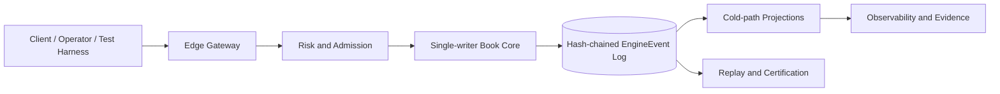
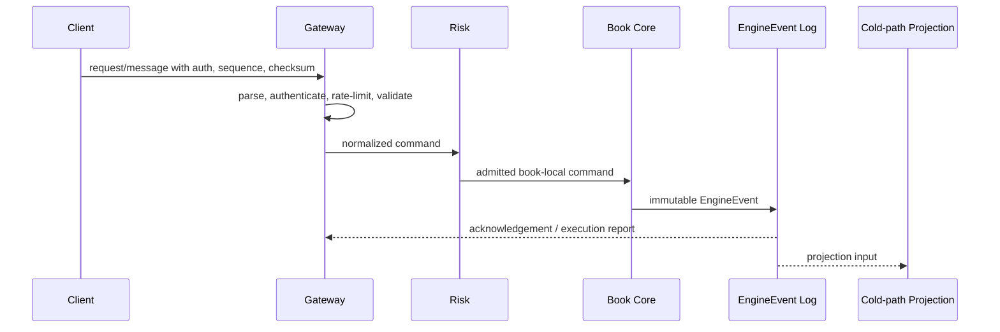
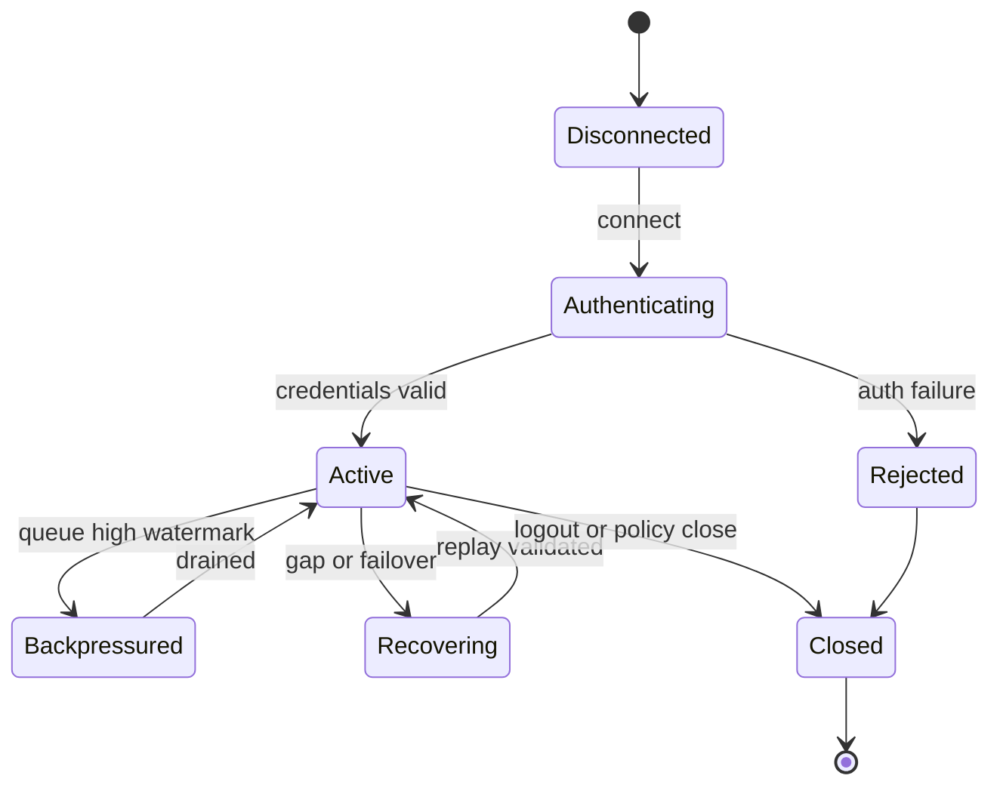

# VOLUME VII: OPERATIONS, SRE & INFRASTRUCTURE

## Purpose

Volume VII defines implementation-grade technical requirements for operations, sre & infrastructure in HermesNet. It is normative for engineering teams, Codex agents, SRE, security, compliance, and reviewers implementing or operating production exchange systems.

## Scope

The volume covers the planned chapters listed below and binds them to the cross-volume invariants established by Volumes I–V. It does not alter frozen volumes, define document versioning policy, create governance process, or generate DOCX/PDF artifacts.


## Normative Principles

All requirements in this volume preserve HermesNet invariants: no global sequencer, book-local ordering, a single-writer Book Core for each active book, fixed-point arithmetic for financial quantities, deterministic replay from immutable `EngineEvent` records, hash-chained event logs, hot/cold path separation, no database, Kafka, or cloud dependency in the trading hot path, auditable financial mutation, observable operation, logged security-sensitive action, and testable production process.

## Reference Architecture




## Volume VII Domain Requirements

Production topology separates edge gateways, risk admission, Book Core primaries, passive replicas, event-log storage, projection workers, observability collectors, and administrative systems. Environments include development, integration, certification, staging, disaster-recovery, and production; only production has live customer traffic. Blue/green deployment is required for stateless gateways and projections; canary deployment is allowed only by symbol, account cohort, or gateway pool and must have rollback within the documented RTO. Active/passive Book Core failover must promote only a hash-chain-verified passive with an exact event cursor and must never create dual writers. Maintenance mode rejects new risk-increasing orders while allowing cancels and controlled settlement. Market halt stops matching for affected books using a deterministic halt event. Kill switch can be account, desk, symbol, venue, or global and must be auditable. Infrastructure dependencies include Linux hosts, NICs, time synchronization, load balancers, object storage for cold backups, metrics, logs, traces, secret stores, and orchestration; none are allowed in the trading decision path. Node sizing, pod placement, CPU pinning, NUMA affinity, huge pages, IRQ affinity, and anti-affinity rules must be documented per environment. Observability architecture covers metrics, logs, traces, dashboards, alerts, SLO, SLI, error budget, RPO, RTO, DR drills, backup verification, restore procedures, incident severity levels, incident runbooks, and go-live checklists.

## Chapters

1. Deployment Architecture
2. Kubernetes Architecture
3. Observability
4. Monitoring and Alerting
5. Incident Response
6. Disaster Recovery
7. Backup and Restore
8. Capacity Planning
9. Runbooks
10. Production Readiness

## Deployment Architecture

### Purpose

Defines the production requirements for deployment architecture in Volume VII.

### Scope

This chapter applies to production services, certification harnesses, replay tooling, monitoring, operational runbooks, and implementation reviews that touch deployment architecture. It excludes marketing claims, non-deterministic shortcuts, and any dependency that can block the Book Core hot path.

### Responsibilities

- Preserve book-local ordering and single-writer mutation.
- Validate fixed-point quantities and deterministic reject reasons before mutation.
- Emit immutable EngineEvents for accepted state changes.
- Maintain bounded queues, explicit sequence numbers, checksums, and replayable evidence.
- Expose metrics, logs, traces, alerts, and audit records appropriate to the domain.

### Architecture



### State Machines



### Algorithms and Contracts

```rust
pub struct DeploymentArchitectureContract {
    pub request_id: ClientRequestId,
    pub book_id: BookId,
    pub sequence: u64,
    pub checksum: u32,
}

pub fn validate_and_apply(input: &InboundMessage, state: &mut DeterministicState) -> Result<Vec<EngineEvent>, RejectReason> {
    input.verify_checksum()?;
    input.verify_monotonic_sequence(state.last_sequence)?;
    let command = input.to_book_local_command()?;
    let events = state.apply_single_writer(command)?;
    Ok(events)
}
```

Configuration example:

```yaml
component: deployment-architecture
limits:
  inbound_messages_per_second: 5000
  max_queue_depth: 65536
  slow_consumer_threshold_ms: 250
recovery:
  require_contiguous_sequences: true
  validate_checksums: true
  replay_from_engine_events: true
security:
  audit_sensitive_actions: true
  reject_unsigned_mutations: true
```

### Failure Modes and Recovery

| Failure mode | Required behavior | Recovery evidence |
|---|---|---|
| Malformed input | Reject before Book Core admission | reject code, client id, checksum result |
| Sequence gap | Stop applying stream and enter recovery | last good sequence and replay cursor |
| Gateway overload | Shed at gateway with deterministic rejects | rate-limit metric and audit log |
| Slow consumer | Warn, throttle, disconnect, or require resnapshot | queue depth and disconnect reason |
| Core failover | Resume from hash-chain verified event cursor | previous and new active identity |

### Observability

Expose counters for accepted, rejected, throttled, replayed, disconnected, and recovered messages; gauges for queue depth, replay lag, and active sessions; histograms for parse, authentication, admission, acknowledgement, fanout, and end-to-end latency; structured logs with request id, account id, book id, sequence, EngineEvent hash, and reject reason.

### Security Considerations

Authenticate every mutating request, authorize account and role scope, verify HMAC or mTLS where applicable, prevent replay with timestamp and nonce windows, redact secrets from logs, audit administrative and private-data access, and fail closed when identity, sequence, or checksum validation is ambiguous.

### Testing Strategy

Test normal flow, malformed input, duplicate ids, sequence gaps, reconnect recovery, checksum mismatch, overload, failover, replay determinism, authorization denial, slow consumers, and cold-path projection lag. Golden vectors must include input bytes, normalized command, EngineEvent hash, and expected outbound messages.

### Acceptance Criteria

- No accepted mutation bypasses deterministic validation or audit logging.
- Recovery from a valid cursor yields byte-equivalent outward state.
- Backpressure never blocks the Book Core hot path.
- Sequence and checksum failures are detected and observable.
- Certification tests cover success, rejection, overload, and recovery paths.

### Codex Implementation Contract

Codex changes touching deployment architecture must include deterministic tests, avoid hidden wall-clock dependence, preserve fixed-point arithmetic, avoid try/catch around imports, keep external dependencies out of the hot path, and update examples, diagrams, and acceptance criteria when contracts change.

### Review Checklist

- [ ] Contracts are explicit and versioned.
- [ ] Failure modes have recovery procedures.
- [ ] Metrics, logs, traces, and audit records are specified.
- [ ] Security-sensitive operations are authenticated, authorized, and logged.
- [ ] Tests include replay, overload, and negative cases.

## Kubernetes Architecture

### Purpose

Defines the production requirements for kubernetes architecture in Volume VII.

### Scope

This chapter applies to production services, certification harnesses, replay tooling, monitoring, operational runbooks, and implementation reviews that touch kubernetes architecture. It excludes marketing claims, non-deterministic shortcuts, and any dependency that can block the Book Core hot path.

### Responsibilities

- Preserve book-local ordering and single-writer mutation.
- Validate fixed-point quantities and deterministic reject reasons before mutation.
- Emit immutable EngineEvents for accepted state changes.
- Maintain bounded queues, explicit sequence numbers, checksums, and replayable evidence.
- Expose metrics, logs, traces, alerts, and audit records appropriate to the domain.

### Architecture


### State Machines


### Algorithms and Contracts

```rust
pub struct KubernetesArchitectureContract {
    pub request_id: ClientRequestId,
    pub book_id: BookId,
    pub sequence: u64,
    pub checksum: u32,
}

pub fn validate_and_apply(input: &InboundMessage, state: &mut DeterministicState) -> Result<Vec<EngineEvent>, RejectReason> {
    input.verify_checksum()?;
    input.verify_monotonic_sequence(state.last_sequence)?;
    let command = input.to_book_local_command()?;
    let events = state.apply_single_writer(command)?;
    Ok(events)
}
```

Configuration example:

```yaml
component: kubernetes-architecture
limits:
  inbound_messages_per_second: 5000
  max_queue_depth: 65536
  slow_consumer_threshold_ms: 250
recovery:
  require_contiguous_sequences: true
  validate_checksums: true
  replay_from_engine_events: true
security:
  audit_sensitive_actions: true
  reject_unsigned_mutations: true
```

### Failure Modes and Recovery

| Failure mode | Required behavior | Recovery evidence |
|---|---|---|
| Malformed input | Reject before Book Core admission | reject code, client id, checksum result |
| Sequence gap | Stop applying stream and enter recovery | last good sequence and replay cursor |
| Gateway overload | Shed at gateway with deterministic rejects | rate-limit metric and audit log |
| Slow consumer | Warn, throttle, disconnect, or require resnapshot | queue depth and disconnect reason |
| Core failover | Resume from hash-chain verified event cursor | previous and new active identity |

### Observability

Expose counters for accepted, rejected, throttled, replayed, disconnected, and recovered messages; gauges for queue depth, replay lag, and active sessions; histograms for parse, authentication, admission, acknowledgement, fanout, and end-to-end latency; structured logs with request id, account id, book id, sequence, EngineEvent hash, and reject reason.

### Security Considerations

Authenticate every mutating request, authorize account and role scope, verify HMAC or mTLS where applicable, prevent replay with timestamp and nonce windows, redact secrets from logs, audit administrative and private-data access, and fail closed when identity, sequence, or checksum validation is ambiguous.

### Testing Strategy

Test normal flow, malformed input, duplicate ids, sequence gaps, reconnect recovery, checksum mismatch, overload, failover, replay determinism, authorization denial, slow consumers, and cold-path projection lag. Golden vectors must include input bytes, normalized command, EngineEvent hash, and expected outbound messages.

### Acceptance Criteria

- No accepted mutation bypasses deterministic validation or audit logging.
- Recovery from a valid cursor yields byte-equivalent outward state.
- Backpressure never blocks the Book Core hot path.
- Sequence and checksum failures are detected and observable.
- Certification tests cover success, rejection, overload, and recovery paths.

### Codex Implementation Contract

Codex changes touching kubernetes architecture must include deterministic tests, avoid hidden wall-clock dependence, preserve fixed-point arithmetic, avoid try/catch around imports, keep external dependencies out of the hot path, and update examples, diagrams, and acceptance criteria when contracts change.

### Review Checklist

- [ ] Contracts are explicit and versioned.
- [ ] Failure modes have recovery procedures.
- [ ] Metrics, logs, traces, and audit records are specified.
- [ ] Security-sensitive operations are authenticated, authorized, and logged.
- [ ] Tests include replay, overload, and negative cases.

## Observability

### Purpose

Defines the production requirements for observability in Volume VII.

### Scope

This chapter applies to production services, certification harnesses, replay tooling, monitoring, operational runbooks, and implementation reviews that touch observability. It excludes marketing claims, non-deterministic shortcuts, and any dependency that can block the Book Core hot path.

### Responsibilities

- Preserve book-local ordering and single-writer mutation.
- Validate fixed-point quantities and deterministic reject reasons before mutation.
- Emit immutable EngineEvents for accepted state changes.
- Maintain bounded queues, explicit sequence numbers, checksums, and replayable evidence.
- Expose metrics, logs, traces, alerts, and audit records appropriate to the domain.

### Architecture


### State Machines


### Algorithms and Contracts

```rust
pub struct ObservabilityContract {
    pub request_id: ClientRequestId,
    pub book_id: BookId,
    pub sequence: u64,
    pub checksum: u32,
}

pub fn validate_and_apply(input: &InboundMessage, state: &mut DeterministicState) -> Result<Vec<EngineEvent>, RejectReason> {
    input.verify_checksum()?;
    input.verify_monotonic_sequence(state.last_sequence)?;
    let command = input.to_book_local_command()?;
    let events = state.apply_single_writer(command)?;
    Ok(events)
}
```

Configuration example:

```yaml
component: observability
limits:
  inbound_messages_per_second: 5000
  max_queue_depth: 65536
  slow_consumer_threshold_ms: 250
recovery:
  require_contiguous_sequences: true
  validate_checksums: true
  replay_from_engine_events: true
security:
  audit_sensitive_actions: true
  reject_unsigned_mutations: true
```

### Failure Modes and Recovery

| Failure mode | Required behavior | Recovery evidence |
|---|---|---|
| Malformed input | Reject before Book Core admission | reject code, client id, checksum result |
| Sequence gap | Stop applying stream and enter recovery | last good sequence and replay cursor |
| Gateway overload | Shed at gateway with deterministic rejects | rate-limit metric and audit log |
| Slow consumer | Warn, throttle, disconnect, or require resnapshot | queue depth and disconnect reason |
| Core failover | Resume from hash-chain verified event cursor | previous and new active identity |

### Observability

Expose counters for accepted, rejected, throttled, replayed, disconnected, and recovered messages; gauges for queue depth, replay lag, and active sessions; histograms for parse, authentication, admission, acknowledgement, fanout, and end-to-end latency; structured logs with request id, account id, book id, sequence, EngineEvent hash, and reject reason.

### Security Considerations

Authenticate every mutating request, authorize account and role scope, verify HMAC or mTLS where applicable, prevent replay with timestamp and nonce windows, redact secrets from logs, audit administrative and private-data access, and fail closed when identity, sequence, or checksum validation is ambiguous.

### Testing Strategy

Test normal flow, malformed input, duplicate ids, sequence gaps, reconnect recovery, checksum mismatch, overload, failover, replay determinism, authorization denial, slow consumers, and cold-path projection lag. Golden vectors must include input bytes, normalized command, EngineEvent hash, and expected outbound messages.

### Acceptance Criteria

- No accepted mutation bypasses deterministic validation or audit logging.
- Recovery from a valid cursor yields byte-equivalent outward state.
- Backpressure never blocks the Book Core hot path.
- Sequence and checksum failures are detected and observable.
- Certification tests cover success, rejection, overload, and recovery paths.

### Codex Implementation Contract

Codex changes touching observability must include deterministic tests, avoid hidden wall-clock dependence, preserve fixed-point arithmetic, avoid try/catch around imports, keep external dependencies out of the hot path, and update examples, diagrams, and acceptance criteria when contracts change.

### Review Checklist

- [ ] Contracts are explicit and versioned.
- [ ] Failure modes have recovery procedures.
- [ ] Metrics, logs, traces, and audit records are specified.
- [ ] Security-sensitive operations are authenticated, authorized, and logged.
- [ ] Tests include replay, overload, and negative cases.

## Monitoring and Alerting

### Purpose

Defines the production requirements for monitoring and alerting in Volume VII.

### Scope

This chapter applies to production services, certification harnesses, replay tooling, monitoring, operational runbooks, and implementation reviews that touch monitoring and alerting. It excludes marketing claims, non-deterministic shortcuts, and any dependency that can block the Book Core hot path.

### Responsibilities

- Preserve book-local ordering and single-writer mutation.
- Validate fixed-point quantities and deterministic reject reasons before mutation.
- Emit immutable EngineEvents for accepted state changes.
- Maintain bounded queues, explicit sequence numbers, checksums, and replayable evidence.
- Expose metrics, logs, traces, alerts, and audit records appropriate to the domain.

### Architecture


### State Machines


### Algorithms and Contracts

```rust
pub struct MonitoringandAlertingContract {
    pub request_id: ClientRequestId,
    pub book_id: BookId,
    pub sequence: u64,
    pub checksum: u32,
}

pub fn validate_and_apply(input: &InboundMessage, state: &mut DeterministicState) -> Result<Vec<EngineEvent>, RejectReason> {
    input.verify_checksum()?;
    input.verify_monotonic_sequence(state.last_sequence)?;
    let command = input.to_book_local_command()?;
    let events = state.apply_single_writer(command)?;
    Ok(events)
}
```

Configuration example:

```yaml
component: monitoring-and-alerting
limits:
  inbound_messages_per_second: 5000
  max_queue_depth: 65536
  slow_consumer_threshold_ms: 250
recovery:
  require_contiguous_sequences: true
  validate_checksums: true
  replay_from_engine_events: true
security:
  audit_sensitive_actions: true
  reject_unsigned_mutations: true
```

### Failure Modes and Recovery

| Failure mode | Required behavior | Recovery evidence |
|---|---|---|
| Malformed input | Reject before Book Core admission | reject code, client id, checksum result |
| Sequence gap | Stop applying stream and enter recovery | last good sequence and replay cursor |
| Gateway overload | Shed at gateway with deterministic rejects | rate-limit metric and audit log |
| Slow consumer | Warn, throttle, disconnect, or require resnapshot | queue depth and disconnect reason |
| Core failover | Resume from hash-chain verified event cursor | previous and new active identity |

### Observability

Expose counters for accepted, rejected, throttled, replayed, disconnected, and recovered messages; gauges for queue depth, replay lag, and active sessions; histograms for parse, authentication, admission, acknowledgement, fanout, and end-to-end latency; structured logs with request id, account id, book id, sequence, EngineEvent hash, and reject reason.

### Security Considerations

Authenticate every mutating request, authorize account and role scope, verify HMAC or mTLS where applicable, prevent replay with timestamp and nonce windows, redact secrets from logs, audit administrative and private-data access, and fail closed when identity, sequence, or checksum validation is ambiguous.

### Testing Strategy

Test normal flow, malformed input, duplicate ids, sequence gaps, reconnect recovery, checksum mismatch, overload, failover, replay determinism, authorization denial, slow consumers, and cold-path projection lag. Golden vectors must include input bytes, normalized command, EngineEvent hash, and expected outbound messages.

### Acceptance Criteria

- No accepted mutation bypasses deterministic validation or audit logging.
- Recovery from a valid cursor yields byte-equivalent outward state.
- Backpressure never blocks the Book Core hot path.
- Sequence and checksum failures are detected and observable.
- Certification tests cover success, rejection, overload, and recovery paths.

### Codex Implementation Contract

Codex changes touching monitoring and alerting must include deterministic tests, avoid hidden wall-clock dependence, preserve fixed-point arithmetic, avoid try/catch around imports, keep external dependencies out of the hot path, and update examples, diagrams, and acceptance criteria when contracts change.

### Review Checklist

- [ ] Contracts are explicit and versioned.
- [ ] Failure modes have recovery procedures.
- [ ] Metrics, logs, traces, and audit records are specified.
- [ ] Security-sensitive operations are authenticated, authorized, and logged.
- [ ] Tests include replay, overload, and negative cases.

## Incident Response

### Purpose

Defines the production requirements for incident response in Volume VII.

### Scope

This chapter applies to production services, certification harnesses, replay tooling, monitoring, operational runbooks, and implementation reviews that touch incident response. It excludes marketing claims, non-deterministic shortcuts, and any dependency that can block the Book Core hot path.

### Responsibilities

- Preserve book-local ordering and single-writer mutation.
- Validate fixed-point quantities and deterministic reject reasons before mutation.
- Emit immutable EngineEvents for accepted state changes.
- Maintain bounded queues, explicit sequence numbers, checksums, and replayable evidence.
- Expose metrics, logs, traces, alerts, and audit records appropriate to the domain.

### Architecture


### State Machines


### Algorithms and Contracts

```rust
pub struct IncidentResponseContract {
    pub request_id: ClientRequestId,
    pub book_id: BookId,
    pub sequence: u64,
    pub checksum: u32,
}

pub fn validate_and_apply(input: &InboundMessage, state: &mut DeterministicState) -> Result<Vec<EngineEvent>, RejectReason> {
    input.verify_checksum()?;
    input.verify_monotonic_sequence(state.last_sequence)?;
    let command = input.to_book_local_command()?;
    let events = state.apply_single_writer(command)?;
    Ok(events)
}
```

Configuration example:

```yaml
component: incident-response
limits:
  inbound_messages_per_second: 5000
  max_queue_depth: 65536
  slow_consumer_threshold_ms: 250
recovery:
  require_contiguous_sequences: true
  validate_checksums: true
  replay_from_engine_events: true
security:
  audit_sensitive_actions: true
  reject_unsigned_mutations: true
```

### Failure Modes and Recovery

| Failure mode | Required behavior | Recovery evidence |
|---|---|---|
| Malformed input | Reject before Book Core admission | reject code, client id, checksum result |
| Sequence gap | Stop applying stream and enter recovery | last good sequence and replay cursor |
| Gateway overload | Shed at gateway with deterministic rejects | rate-limit metric and audit log |
| Slow consumer | Warn, throttle, disconnect, or require resnapshot | queue depth and disconnect reason |
| Core failover | Resume from hash-chain verified event cursor | previous and new active identity |

### Observability

Expose counters for accepted, rejected, throttled, replayed, disconnected, and recovered messages; gauges for queue depth, replay lag, and active sessions; histograms for parse, authentication, admission, acknowledgement, fanout, and end-to-end latency; structured logs with request id, account id, book id, sequence, EngineEvent hash, and reject reason.

### Security Considerations

Authenticate every mutating request, authorize account and role scope, verify HMAC or mTLS where applicable, prevent replay with timestamp and nonce windows, redact secrets from logs, audit administrative and private-data access, and fail closed when identity, sequence, or checksum validation is ambiguous.

### Testing Strategy

Test normal flow, malformed input, duplicate ids, sequence gaps, reconnect recovery, checksum mismatch, overload, failover, replay determinism, authorization denial, slow consumers, and cold-path projection lag. Golden vectors must include input bytes, normalized command, EngineEvent hash, and expected outbound messages.

### Acceptance Criteria

- No accepted mutation bypasses deterministic validation or audit logging.
- Recovery from a valid cursor yields byte-equivalent outward state.
- Backpressure never blocks the Book Core hot path.
- Sequence and checksum failures are detected and observable.
- Certification tests cover success, rejection, overload, and recovery paths.

### Codex Implementation Contract

Codex changes touching incident response must include deterministic tests, avoid hidden wall-clock dependence, preserve fixed-point arithmetic, avoid try/catch around imports, keep external dependencies out of the hot path, and update examples, diagrams, and acceptance criteria when contracts change.

### Review Checklist

- [ ] Contracts are explicit and versioned.
- [ ] Failure modes have recovery procedures.
- [ ] Metrics, logs, traces, and audit records are specified.
- [ ] Security-sensitive operations are authenticated, authorized, and logged.
- [ ] Tests include replay, overload, and negative cases.

## Disaster Recovery

### Purpose

Defines the production requirements for disaster recovery in Volume VII.

### Scope

This chapter applies to production services, certification harnesses, replay tooling, monitoring, operational runbooks, and implementation reviews that touch disaster recovery. It excludes marketing claims, non-deterministic shortcuts, and any dependency that can block the Book Core hot path.

### Responsibilities

- Preserve book-local ordering and single-writer mutation.
- Validate fixed-point quantities and deterministic reject reasons before mutation.
- Emit immutable EngineEvents for accepted state changes.
- Maintain bounded queues, explicit sequence numbers, checksums, and replayable evidence.
- Expose metrics, logs, traces, alerts, and audit records appropriate to the domain.

### Architecture


### State Machines


### Algorithms and Contracts

```rust
pub struct DisasterRecoveryContract {
    pub request_id: ClientRequestId,
    pub book_id: BookId,
    pub sequence: u64,
    pub checksum: u32,
}

pub fn validate_and_apply(input: &InboundMessage, state: &mut DeterministicState) -> Result<Vec<EngineEvent>, RejectReason> {
    input.verify_checksum()?;
    input.verify_monotonic_sequence(state.last_sequence)?;
    let command = input.to_book_local_command()?;
    let events = state.apply_single_writer(command)?;
    Ok(events)
}
```

Configuration example:

```yaml
component: disaster-recovery
limits:
  inbound_messages_per_second: 5000
  max_queue_depth: 65536
  slow_consumer_threshold_ms: 250
recovery:
  require_contiguous_sequences: true
  validate_checksums: true
  replay_from_engine_events: true
security:
  audit_sensitive_actions: true
  reject_unsigned_mutations: true
```

### Failure Modes and Recovery

| Failure mode | Required behavior | Recovery evidence |
|---|---|---|
| Malformed input | Reject before Book Core admission | reject code, client id, checksum result |
| Sequence gap | Stop applying stream and enter recovery | last good sequence and replay cursor |
| Gateway overload | Shed at gateway with deterministic rejects | rate-limit metric and audit log |
| Slow consumer | Warn, throttle, disconnect, or require resnapshot | queue depth and disconnect reason |
| Core failover | Resume from hash-chain verified event cursor | previous and new active identity |

### Observability

Expose counters for accepted, rejected, throttled, replayed, disconnected, and recovered messages; gauges for queue depth, replay lag, and active sessions; histograms for parse, authentication, admission, acknowledgement, fanout, and end-to-end latency; structured logs with request id, account id, book id, sequence, EngineEvent hash, and reject reason.

### Security Considerations

Authenticate every mutating request, authorize account and role scope, verify HMAC or mTLS where applicable, prevent replay with timestamp and nonce windows, redact secrets from logs, audit administrative and private-data access, and fail closed when identity, sequence, or checksum validation is ambiguous.

### Testing Strategy

Test normal flow, malformed input, duplicate ids, sequence gaps, reconnect recovery, checksum mismatch, overload, failover, replay determinism, authorization denial, slow consumers, and cold-path projection lag. Golden vectors must include input bytes, normalized command, EngineEvent hash, and expected outbound messages.

### Acceptance Criteria

- No accepted mutation bypasses deterministic validation or audit logging.
- Recovery from a valid cursor yields byte-equivalent outward state.
- Backpressure never blocks the Book Core hot path.
- Sequence and checksum failures are detected and observable.
- Certification tests cover success, rejection, overload, and recovery paths.

### Codex Implementation Contract

Codex changes touching disaster recovery must include deterministic tests, avoid hidden wall-clock dependence, preserve fixed-point arithmetic, avoid try/catch around imports, keep external dependencies out of the hot path, and update examples, diagrams, and acceptance criteria when contracts change.

### Review Checklist

- [ ] Contracts are explicit and versioned.
- [ ] Failure modes have recovery procedures.
- [ ] Metrics, logs, traces, and audit records are specified.
- [ ] Security-sensitive operations are authenticated, authorized, and logged.
- [ ] Tests include replay, overload, and negative cases.

## Backup and Restore

### Purpose

Defines the production requirements for backup and restore in Volume VII.

### Scope

This chapter applies to production services, certification harnesses, replay tooling, monitoring, operational runbooks, and implementation reviews that touch backup and restore. It excludes marketing claims, non-deterministic shortcuts, and any dependency that can block the Book Core hot path.

### Responsibilities

- Preserve book-local ordering and single-writer mutation.
- Validate fixed-point quantities and deterministic reject reasons before mutation.
- Emit immutable EngineEvents for accepted state changes.
- Maintain bounded queues, explicit sequence numbers, checksums, and replayable evidence.
- Expose metrics, logs, traces, alerts, and audit records appropriate to the domain.

### Architecture


### State Machines


### Algorithms and Contracts

```rust
pub struct BackupandRestoreContract {
    pub request_id: ClientRequestId,
    pub book_id: BookId,
    pub sequence: u64,
    pub checksum: u32,
}

pub fn validate_and_apply(input: &InboundMessage, state: &mut DeterministicState) -> Result<Vec<EngineEvent>, RejectReason> {
    input.verify_checksum()?;
    input.verify_monotonic_sequence(state.last_sequence)?;
    let command = input.to_book_local_command()?;
    let events = state.apply_single_writer(command)?;
    Ok(events)
}
```

Configuration example:

```yaml
component: backup-and-restore
limits:
  inbound_messages_per_second: 5000
  max_queue_depth: 65536
  slow_consumer_threshold_ms: 250
recovery:
  require_contiguous_sequences: true
  validate_checksums: true
  replay_from_engine_events: true
security:
  audit_sensitive_actions: true
  reject_unsigned_mutations: true
```

### Failure Modes and Recovery

| Failure mode | Required behavior | Recovery evidence |
|---|---|---|
| Malformed input | Reject before Book Core admission | reject code, client id, checksum result |
| Sequence gap | Stop applying stream and enter recovery | last good sequence and replay cursor |
| Gateway overload | Shed at gateway with deterministic rejects | rate-limit metric and audit log |
| Slow consumer | Warn, throttle, disconnect, or require resnapshot | queue depth and disconnect reason |
| Core failover | Resume from hash-chain verified event cursor | previous and new active identity |

### Observability

Expose counters for accepted, rejected, throttled, replayed, disconnected, and recovered messages; gauges for queue depth, replay lag, and active sessions; histograms for parse, authentication, admission, acknowledgement, fanout, and end-to-end latency; structured logs with request id, account id, book id, sequence, EngineEvent hash, and reject reason.

### Security Considerations

Authenticate every mutating request, authorize account and role scope, verify HMAC or mTLS where applicable, prevent replay with timestamp and nonce windows, redact secrets from logs, audit administrative and private-data access, and fail closed when identity, sequence, or checksum validation is ambiguous.

### Testing Strategy

Test normal flow, malformed input, duplicate ids, sequence gaps, reconnect recovery, checksum mismatch, overload, failover, replay determinism, authorization denial, slow consumers, and cold-path projection lag. Golden vectors must include input bytes, normalized command, EngineEvent hash, and expected outbound messages.

### Acceptance Criteria

- No accepted mutation bypasses deterministic validation or audit logging.
- Recovery from a valid cursor yields byte-equivalent outward state.
- Backpressure never blocks the Book Core hot path.
- Sequence and checksum failures are detected and observable.
- Certification tests cover success, rejection, overload, and recovery paths.

### Codex Implementation Contract

Codex changes touching backup and restore must include deterministic tests, avoid hidden wall-clock dependence, preserve fixed-point arithmetic, avoid try/catch around imports, keep external dependencies out of the hot path, and update examples, diagrams, and acceptance criteria when contracts change.

### Review Checklist

- [ ] Contracts are explicit and versioned.
- [ ] Failure modes have recovery procedures.
- [ ] Metrics, logs, traces, and audit records are specified.
- [ ] Security-sensitive operations are authenticated, authorized, and logged.
- [ ] Tests include replay, overload, and negative cases.

## Capacity Planning

### Purpose

Defines the production requirements for capacity planning in Volume VII.

### Scope

This chapter applies to production services, certification harnesses, replay tooling, monitoring, operational runbooks, and implementation reviews that touch capacity planning. It excludes marketing claims, non-deterministic shortcuts, and any dependency that can block the Book Core hot path.

### Responsibilities

- Preserve book-local ordering and single-writer mutation.
- Validate fixed-point quantities and deterministic reject reasons before mutation.
- Emit immutable EngineEvents for accepted state changes.
- Maintain bounded queues, explicit sequence numbers, checksums, and replayable evidence.
- Expose metrics, logs, traces, alerts, and audit records appropriate to the domain.

### Architecture


### State Machines


### Algorithms and Contracts

```rust
pub struct CapacityPlanningContract {
    pub request_id: ClientRequestId,
    pub book_id: BookId,
    pub sequence: u64,
    pub checksum: u32,
}

pub fn validate_and_apply(input: &InboundMessage, state: &mut DeterministicState) -> Result<Vec<EngineEvent>, RejectReason> {
    input.verify_checksum()?;
    input.verify_monotonic_sequence(state.last_sequence)?;
    let command = input.to_book_local_command()?;
    let events = state.apply_single_writer(command)?;
    Ok(events)
}
```

Configuration example:

```yaml
component: capacity-planning
limits:
  inbound_messages_per_second: 5000
  max_queue_depth: 65536
  slow_consumer_threshold_ms: 250
recovery:
  require_contiguous_sequences: true
  validate_checksums: true
  replay_from_engine_events: true
security:
  audit_sensitive_actions: true
  reject_unsigned_mutations: true
```

### Failure Modes and Recovery

| Failure mode | Required behavior | Recovery evidence |
|---|---|---|
| Malformed input | Reject before Book Core admission | reject code, client id, checksum result |
| Sequence gap | Stop applying stream and enter recovery | last good sequence and replay cursor |
| Gateway overload | Shed at gateway with deterministic rejects | rate-limit metric and audit log |
| Slow consumer | Warn, throttle, disconnect, or require resnapshot | queue depth and disconnect reason |
| Core failover | Resume from hash-chain verified event cursor | previous and new active identity |

### Observability

Expose counters for accepted, rejected, throttled, replayed, disconnected, and recovered messages; gauges for queue depth, replay lag, and active sessions; histograms for parse, authentication, admission, acknowledgement, fanout, and end-to-end latency; structured logs with request id, account id, book id, sequence, EngineEvent hash, and reject reason.

### Security Considerations

Authenticate every mutating request, authorize account and role scope, verify HMAC or mTLS where applicable, prevent replay with timestamp and nonce windows, redact secrets from logs, audit administrative and private-data access, and fail closed when identity, sequence, or checksum validation is ambiguous.

### Testing Strategy

Test normal flow, malformed input, duplicate ids, sequence gaps, reconnect recovery, checksum mismatch, overload, failover, replay determinism, authorization denial, slow consumers, and cold-path projection lag. Golden vectors must include input bytes, normalized command, EngineEvent hash, and expected outbound messages.

### Acceptance Criteria

- No accepted mutation bypasses deterministic validation or audit logging.
- Recovery from a valid cursor yields byte-equivalent outward state.
- Backpressure never blocks the Book Core hot path.
- Sequence and checksum failures are detected and observable.
- Certification tests cover success, rejection, overload, and recovery paths.

### Codex Implementation Contract

Codex changes touching capacity planning must include deterministic tests, avoid hidden wall-clock dependence, preserve fixed-point arithmetic, avoid try/catch around imports, keep external dependencies out of the hot path, and update examples, diagrams, and acceptance criteria when contracts change.

### Review Checklist

- [ ] Contracts are explicit and versioned.
- [ ] Failure modes have recovery procedures.
- [ ] Metrics, logs, traces, and audit records are specified.
- [ ] Security-sensitive operations are authenticated, authorized, and logged.
- [ ] Tests include replay, overload, and negative cases.

## Runbooks

### Purpose

Defines the production requirements for runbooks in Volume VII.

### Scope

This chapter applies to production services, certification harnesses, replay tooling, monitoring, operational runbooks, and implementation reviews that touch runbooks. It excludes marketing claims, non-deterministic shortcuts, and any dependency that can block the Book Core hot path.

### Responsibilities

- Preserve book-local ordering and single-writer mutation.
- Validate fixed-point quantities and deterministic reject reasons before mutation.
- Emit immutable EngineEvents for accepted state changes.
- Maintain bounded queues, explicit sequence numbers, checksums, and replayable evidence.
- Expose metrics, logs, traces, alerts, and audit records appropriate to the domain.

### Architecture


### State Machines


### Algorithms and Contracts

```rust
pub struct RunbooksContract {
    pub request_id: ClientRequestId,
    pub book_id: BookId,
    pub sequence: u64,
    pub checksum: u32,
}

pub fn validate_and_apply(input: &InboundMessage, state: &mut DeterministicState) -> Result<Vec<EngineEvent>, RejectReason> {
    input.verify_checksum()?;
    input.verify_monotonic_sequence(state.last_sequence)?;
    let command = input.to_book_local_command()?;
    let events = state.apply_single_writer(command)?;
    Ok(events)
}
```

Configuration example:

```yaml
component: runbooks
limits:
  inbound_messages_per_second: 5000
  max_queue_depth: 65536
  slow_consumer_threshold_ms: 250
recovery:
  require_contiguous_sequences: true
  validate_checksums: true
  replay_from_engine_events: true
security:
  audit_sensitive_actions: true
  reject_unsigned_mutations: true
```

### Failure Modes and Recovery

| Failure mode | Required behavior | Recovery evidence |
|---|---|---|
| Malformed input | Reject before Book Core admission | reject code, client id, checksum result |
| Sequence gap | Stop applying stream and enter recovery | last good sequence and replay cursor |
| Gateway overload | Shed at gateway with deterministic rejects | rate-limit metric and audit log |
| Slow consumer | Warn, throttle, disconnect, or require resnapshot | queue depth and disconnect reason |
| Core failover | Resume from hash-chain verified event cursor | previous and new active identity |

### Observability

Expose counters for accepted, rejected, throttled, replayed, disconnected, and recovered messages; gauges for queue depth, replay lag, and active sessions; histograms for parse, authentication, admission, acknowledgement, fanout, and end-to-end latency; structured logs with request id, account id, book id, sequence, EngineEvent hash, and reject reason.

### Security Considerations

Authenticate every mutating request, authorize account and role scope, verify HMAC or mTLS where applicable, prevent replay with timestamp and nonce windows, redact secrets from logs, audit administrative and private-data access, and fail closed when identity, sequence, or checksum validation is ambiguous.

### Testing Strategy

Test normal flow, malformed input, duplicate ids, sequence gaps, reconnect recovery, checksum mismatch, overload, failover, replay determinism, authorization denial, slow consumers, and cold-path projection lag. Golden vectors must include input bytes, normalized command, EngineEvent hash, and expected outbound messages.

### Acceptance Criteria

- No accepted mutation bypasses deterministic validation or audit logging.
- Recovery from a valid cursor yields byte-equivalent outward state.
- Backpressure never blocks the Book Core hot path.
- Sequence and checksum failures are detected and observable.
- Certification tests cover success, rejection, overload, and recovery paths.

### Codex Implementation Contract

Codex changes touching runbooks must include deterministic tests, avoid hidden wall-clock dependence, preserve fixed-point arithmetic, avoid try/catch around imports, keep external dependencies out of the hot path, and update examples, diagrams, and acceptance criteria when contracts change.

### Review Checklist

- [ ] Contracts are explicit and versioned.
- [ ] Failure modes have recovery procedures.
- [ ] Metrics, logs, traces, and audit records are specified.
- [ ] Security-sensitive operations are authenticated, authorized, and logged.
- [ ] Tests include replay, overload, and negative cases.

## Production Readiness

### Purpose

Defines the production requirements for production readiness in Volume VII.

### Scope

This chapter applies to production services, certification harnesses, replay tooling, monitoring, operational runbooks, and implementation reviews that touch production readiness. It excludes marketing claims, non-deterministic shortcuts, and any dependency that can block the Book Core hot path.

### Responsibilities

- Preserve book-local ordering and single-writer mutation.
- Validate fixed-point quantities and deterministic reject reasons before mutation.
- Emit immutable EngineEvents for accepted state changes.
- Maintain bounded queues, explicit sequence numbers, checksums, and replayable evidence.
- Expose metrics, logs, traces, alerts, and audit records appropriate to the domain.

### Architecture


### State Machines

```mermaid
stateDiagram-v2
    [*] --> Disconnected
    Disconnected --> Authenticating: connect
    Authenticating --> Active: credentials valid
    Authenticating --> Rejected: auth failure
    Active --> Backpressured: queue high watermark
    Backpressured --> Active: drained
    Active --> Recovering: gap or failover
    Recovering --> Active: replay validated
    Active --> Closed: logout or policy close
    Rejected --> Closed
    Closed --> [*]
```

### Algorithms and Contracts

```rust
pub struct ProductionReadinessContract {
    pub request_id: ClientRequestId,
    pub book_id: BookId,
    pub sequence: u64,
    pub checksum: u32,
}

pub fn validate_and_apply(input: &InboundMessage, state: &mut DeterministicState) -> Result<Vec<EngineEvent>, RejectReason> {
    input.verify_checksum()?;
    input.verify_monotonic_sequence(state.last_sequence)?;
    let command = input.to_book_local_command()?;
    let events = state.apply_single_writer(command)?;
    Ok(events)
}
```

Configuration example:

```yaml
component: production-readiness
limits:
  inbound_messages_per_second: 5000
  max_queue_depth: 65536
  slow_consumer_threshold_ms: 250
recovery:
  require_contiguous_sequences: true
  validate_checksums: true
  replay_from_engine_events: true
security:
  audit_sensitive_actions: true
  reject_unsigned_mutations: true
```

### Failure Modes and Recovery

| Failure mode | Required behavior | Recovery evidence |
|---|---|---|
| Malformed input | Reject before Book Core admission | reject code, client id, checksum result |
| Sequence gap | Stop applying stream and enter recovery | last good sequence and replay cursor |
| Gateway overload | Shed at gateway with deterministic rejects | rate-limit metric and audit log |
| Slow consumer | Warn, throttle, disconnect, or require resnapshot | queue depth and disconnect reason |
| Core failover | Resume from hash-chain verified event cursor | previous and new active identity |

### Observability

Expose counters for accepted, rejected, throttled, replayed, disconnected, and recovered messages; gauges for queue depth, replay lag, and active sessions; histograms for parse, authentication, admission, acknowledgement, fanout, and end-to-end latency; structured logs with request id, account id, book id, sequence, EngineEvent hash, and reject reason.

### Security Considerations

Authenticate every mutating request, authorize account and role scope, verify HMAC or mTLS where applicable, prevent replay with timestamp and nonce windows, redact secrets from logs, audit administrative and private-data access, and fail closed when identity, sequence, or checksum validation is ambiguous.

### Testing Strategy

Test normal flow, malformed input, duplicate ids, sequence gaps, reconnect recovery, checksum mismatch, overload, failover, replay determinism, authorization denial, slow consumers, and cold-path projection lag. Golden vectors must include input bytes, normalized command, EngineEvent hash, and expected outbound messages.

### Acceptance Criteria

- No accepted mutation bypasses deterministic validation or audit logging.
- Recovery from a valid cursor yields byte-equivalent outward state.
- Backpressure never blocks the Book Core hot path.
- Sequence and checksum failures are detected and observable.
- Certification tests cover success, rejection, overload, and recovery paths.

### Codex Implementation Contract

Codex changes touching production readiness must include deterministic tests, avoid hidden wall-clock dependence, preserve fixed-point arithmetic, avoid try/catch around imports, keep external dependencies out of the hot path, and update examples, diagrams, and acceptance criteria when contracts change.

### Review Checklist

- [ ] Contracts are explicit and versioned.
- [ ] Failure modes have recovery procedures.
- [ ] Metrics, logs, traces, and audit records are specified.
- [ ] Security-sensitive operations are authenticated, authorized, and logged.
- [ ] Tests include replay, overload, and negative cases.

## Volume VII Final Completion Summary

Volume VII is complete for HES scope. It expands all planned chapters into production engineering requirements with architecture, state machines, algorithms or configuration examples, failure and recovery behavior, observability, security considerations, testing strategy, acceptance criteria, Codex implementation contracts, and review checklists. Remaining work is implementation and evidence generation in future non-HES repositories, not additional HES volume drafting.
