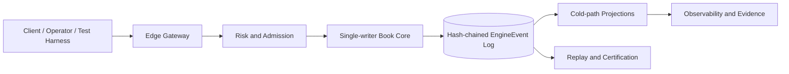
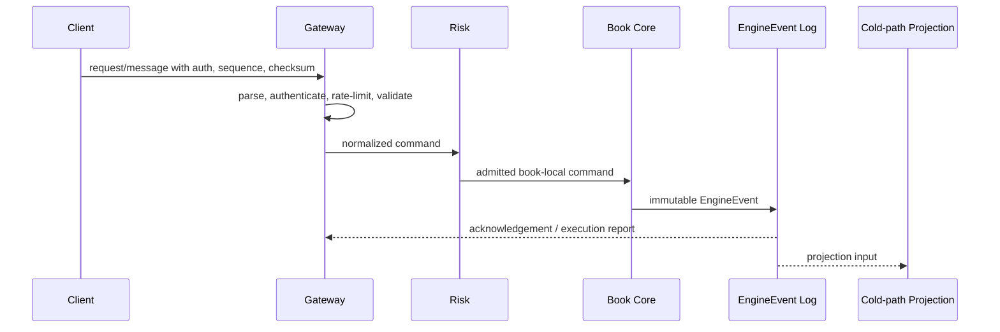
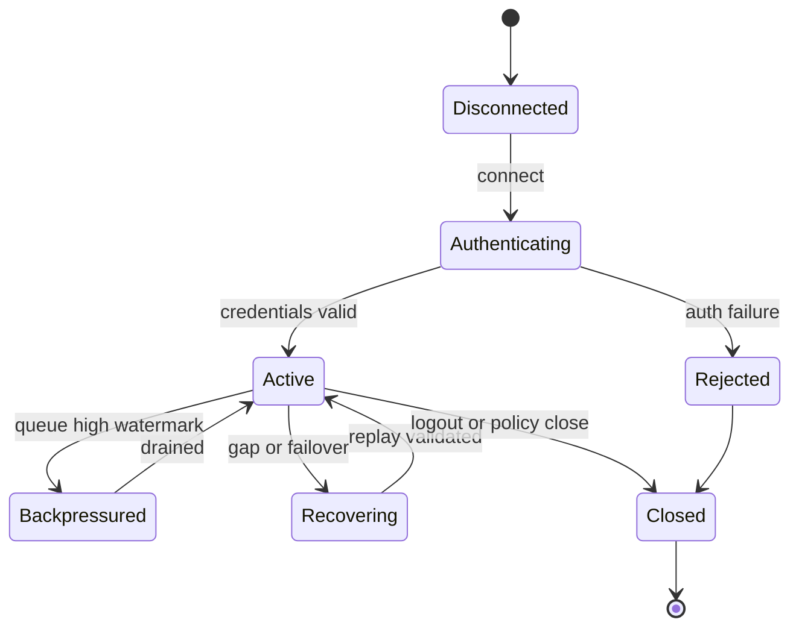

# VOLUME VIII: SECURITY & COMPLIANCE

## Purpose

Volume VIII defines implementation-grade technical requirements for security & compliance in HermesNet. It is normative for engineering teams, Codex agents, SRE, security, compliance, and reviewers implementing or operating production exchange systems.

## Scope

The volume covers the planned chapters listed below and binds them to the cross-volume invariants established by Volumes I–V. It does not alter frozen volumes, define document versioning policy, create governance process, or generate DOCX/PDF artifacts.


## Normative Principles

All requirements in this volume preserve HermesNet invariants: no global sequencer, book-local ordering, a single-writer Book Core for each active book, fixed-point arithmetic for financial quantities, deterministic replay from immutable `EngineEvent` records, hash-chained event logs, hot/cold path separation, no database, Kafka, or cloud dependency in the trading hot path, auditable financial mutation, observable operation, logged security-sensitive action, and testable production process.

## Reference Architecture




## Volume VIII Domain Requirements

Security architecture follows zero trust: authenticate every principal, authorize every action, encrypt every network boundary, minimize privilege, log every security-sensitive action, and verify policy continuously. API key security requires scoped keys, creation approval where privileged, secret display only once, HMAC signing, timestamp windows, nonce replay defense, rotation, revocation, and anomaly monitoring. Session security requires secure cookies where browser sessions exist, short-lived JWT access tokens, bounded refresh tokens, audience and issuer validation, explicit `kid`, no unsigned algorithms, and mTLS for service-to-service and privileged operator channels. Authorization combines RBAC for job function and ABAC for account, desk, region, environment, instrument, risk tier, KYC tier, and emergency state. Admin maker-checker is mandatory for privileged access, limit changes, sanctions overrides, withdrawal policy changes, and break-glass. Secrets lifecycle covers generation, storage in KMS, rotation, revocation, access review, escrow prohibition for API secrets, and tamper-evident audit. HSM/MPC wallet signing separates custody from trading; signing policy enforces quorum, withdrawal limits, destination allow lists, and evidence capture. Compliance workflow covers KYC lifecycle, AML screening, sanctions screening, suspicious activity reporting, travel rule data flow, regulatory evidence packs, breach response, security monitoring, threat model maintenance, and abuse prevention.

## Chapters

1. Security Architecture
2. Authentication
3. Authorization
4. RBAC and ABAC
5. Secrets and KMS
6. HSM / MPC
7. KYC
8. AML
9. Travel Rule
10. Audit and Regulatory Reporting

## Security Architecture

### Purpose

Defines the production requirements for security architecture in Volume VIII.

### Scope

This chapter applies to production services, certification harnesses, replay tooling, monitoring, operational runbooks, and implementation reviews that touch security architecture. It excludes marketing claims, non-deterministic shortcuts, and any dependency that can block the Book Core hot path.

### Responsibilities

- Preserve book-local ordering and single-writer mutation.
- Validate fixed-point quantities and deterministic reject reasons before mutation.
- Emit immutable EngineEvents for accepted state changes.
- Maintain bounded queues, explicit sequence numbers, checksums, and replayable evidence.
- Expose metrics, logs, traces, alerts, and audit records appropriate to the domain.

### Architecture



### State Machines



### Algorithms and Contracts

```rust
pub struct SecurityArchitectureContract {
    pub request_id: ClientRequestId,
    pub book_id: BookId,
    pub sequence: u64,
    pub checksum: u32,
}

pub fn validate_and_apply(input: &InboundMessage, state: &mut DeterministicState) -> Result<Vec<EngineEvent>, RejectReason> {
    input.verify_checksum()?;
    input.verify_monotonic_sequence(state.last_sequence)?;
    let command = input.to_book_local_command()?;
    let events = state.apply_single_writer(command)?;
    Ok(events)
}
```

Configuration example:

```yaml
component: security-architecture
limits:
  inbound_messages_per_second: 5000
  max_queue_depth: 65536
  slow_consumer_threshold_ms: 250
recovery:
  require_contiguous_sequences: true
  validate_checksums: true
  replay_from_engine_events: true
security:
  audit_sensitive_actions: true
  reject_unsigned_mutations: true
```

### Failure Modes and Recovery

| Failure mode | Required behavior | Recovery evidence |
|---|---|---|
| Malformed input | Reject before Book Core admission | reject code, client id, checksum result |
| Sequence gap | Stop applying stream and enter recovery | last good sequence and replay cursor |
| Gateway overload | Shed at gateway with deterministic rejects | rate-limit metric and audit log |
| Slow consumer | Warn, throttle, disconnect, or require resnapshot | queue depth and disconnect reason |
| Core failover | Resume from hash-chain verified event cursor | previous and new active identity |

### Observability

Expose counters for accepted, rejected, throttled, replayed, disconnected, and recovered messages; gauges for queue depth, replay lag, and active sessions; histograms for parse, authentication, admission, acknowledgement, fanout, and end-to-end latency; structured logs with request id, account id, book id, sequence, EngineEvent hash, and reject reason.

### Security Considerations

Authenticate every mutating request, authorize account and role scope, verify HMAC or mTLS where applicable, prevent replay with timestamp and nonce windows, redact secrets from logs, audit administrative and private-data access, and fail closed when identity, sequence, or checksum validation is ambiguous.

### Testing Strategy

Test normal flow, malformed input, duplicate ids, sequence gaps, reconnect recovery, checksum mismatch, overload, failover, replay determinism, authorization denial, slow consumers, and cold-path projection lag. Golden vectors must include input bytes, normalized command, EngineEvent hash, and expected outbound messages.

### Acceptance Criteria

- No accepted mutation bypasses deterministic validation or audit logging.
- Recovery from a valid cursor yields byte-equivalent outward state.
- Backpressure never blocks the Book Core hot path.
- Sequence and checksum failures are detected and observable.
- Certification tests cover success, rejection, overload, and recovery paths.

### Codex Implementation Contract

Codex changes touching security architecture must include deterministic tests, avoid hidden wall-clock dependence, preserve fixed-point arithmetic, avoid try/catch around imports, keep external dependencies out of the hot path, and update examples, diagrams, and acceptance criteria when contracts change.

### Review Checklist

- [ ] Contracts are explicit and versioned.
- [ ] Failure modes have recovery procedures.
- [ ] Metrics, logs, traces, and audit records are specified.
- [ ] Security-sensitive operations are authenticated, authorized, and logged.
- [ ] Tests include replay, overload, and negative cases.

## Authentication

### Purpose

Defines the production requirements for authentication in Volume VIII.

### Scope

This chapter applies to production services, certification harnesses, replay tooling, monitoring, operational runbooks, and implementation reviews that touch authentication. It excludes marketing claims, non-deterministic shortcuts, and any dependency that can block the Book Core hot path.

### Responsibilities

- Preserve book-local ordering and single-writer mutation.
- Validate fixed-point quantities and deterministic reject reasons before mutation.
- Emit immutable EngineEvents for accepted state changes.
- Maintain bounded queues, explicit sequence numbers, checksums, and replayable evidence.
- Expose metrics, logs, traces, alerts, and audit records appropriate to the domain.

### Architecture


### State Machines


### Algorithms and Contracts

```rust
pub struct AuthenticationContract {
    pub request_id: ClientRequestId,
    pub book_id: BookId,
    pub sequence: u64,
    pub checksum: u32,
}

pub fn validate_and_apply(input: &InboundMessage, state: &mut DeterministicState) -> Result<Vec<EngineEvent>, RejectReason> {
    input.verify_checksum()?;
    input.verify_monotonic_sequence(state.last_sequence)?;
    let command = input.to_book_local_command()?;
    let events = state.apply_single_writer(command)?;
    Ok(events)
}
```

Configuration example:

```yaml
component: authentication
limits:
  inbound_messages_per_second: 5000
  max_queue_depth: 65536
  slow_consumer_threshold_ms: 250
recovery:
  require_contiguous_sequences: true
  validate_checksums: true
  replay_from_engine_events: true
security:
  audit_sensitive_actions: true
  reject_unsigned_mutations: true
```

### Failure Modes and Recovery

| Failure mode | Required behavior | Recovery evidence |
|---|---|---|
| Malformed input | Reject before Book Core admission | reject code, client id, checksum result |
| Sequence gap | Stop applying stream and enter recovery | last good sequence and replay cursor |
| Gateway overload | Shed at gateway with deterministic rejects | rate-limit metric and audit log |
| Slow consumer | Warn, throttle, disconnect, or require resnapshot | queue depth and disconnect reason |
| Core failover | Resume from hash-chain verified event cursor | previous and new active identity |

### Observability

Expose counters for accepted, rejected, throttled, replayed, disconnected, and recovered messages; gauges for queue depth, replay lag, and active sessions; histograms for parse, authentication, admission, acknowledgement, fanout, and end-to-end latency; structured logs with request id, account id, book id, sequence, EngineEvent hash, and reject reason.

### Security Considerations

Authenticate every mutating request, authorize account and role scope, verify HMAC or mTLS where applicable, prevent replay with timestamp and nonce windows, redact secrets from logs, audit administrative and private-data access, and fail closed when identity, sequence, or checksum validation is ambiguous.

### Testing Strategy

Test normal flow, malformed input, duplicate ids, sequence gaps, reconnect recovery, checksum mismatch, overload, failover, replay determinism, authorization denial, slow consumers, and cold-path projection lag. Golden vectors must include input bytes, normalized command, EngineEvent hash, and expected outbound messages.

### Acceptance Criteria

- No accepted mutation bypasses deterministic validation or audit logging.
- Recovery from a valid cursor yields byte-equivalent outward state.
- Backpressure never blocks the Book Core hot path.
- Sequence and checksum failures are detected and observable.
- Certification tests cover success, rejection, overload, and recovery paths.

### Codex Implementation Contract

Codex changes touching authentication must include deterministic tests, avoid hidden wall-clock dependence, preserve fixed-point arithmetic, avoid try/catch around imports, keep external dependencies out of the hot path, and update examples, diagrams, and acceptance criteria when contracts change.

### Review Checklist

- [ ] Contracts are explicit and versioned.
- [ ] Failure modes have recovery procedures.
- [ ] Metrics, logs, traces, and audit records are specified.
- [ ] Security-sensitive operations are authenticated, authorized, and logged.
- [ ] Tests include replay, overload, and negative cases.

## Authorization

### Purpose

Defines the production requirements for authorization in Volume VIII.

### Scope

This chapter applies to production services, certification harnesses, replay tooling, monitoring, operational runbooks, and implementation reviews that touch authorization. It excludes marketing claims, non-deterministic shortcuts, and any dependency that can block the Book Core hot path.

### Responsibilities

- Preserve book-local ordering and single-writer mutation.
- Validate fixed-point quantities and deterministic reject reasons before mutation.
- Emit immutable EngineEvents for accepted state changes.
- Maintain bounded queues, explicit sequence numbers, checksums, and replayable evidence.
- Expose metrics, logs, traces, alerts, and audit records appropriate to the domain.

### Architecture


### State Machines


### Algorithms and Contracts

```rust
pub struct AuthorizationContract {
    pub request_id: ClientRequestId,
    pub book_id: BookId,
    pub sequence: u64,
    pub checksum: u32,
}

pub fn validate_and_apply(input: &InboundMessage, state: &mut DeterministicState) -> Result<Vec<EngineEvent>, RejectReason> {
    input.verify_checksum()?;
    input.verify_monotonic_sequence(state.last_sequence)?;
    let command = input.to_book_local_command()?;
    let events = state.apply_single_writer(command)?;
    Ok(events)
}
```

Configuration example:

```yaml
component: authorization
limits:
  inbound_messages_per_second: 5000
  max_queue_depth: 65536
  slow_consumer_threshold_ms: 250
recovery:
  require_contiguous_sequences: true
  validate_checksums: true
  replay_from_engine_events: true
security:
  audit_sensitive_actions: true
  reject_unsigned_mutations: true
```

### Failure Modes and Recovery

| Failure mode | Required behavior | Recovery evidence |
|---|---|---|
| Malformed input | Reject before Book Core admission | reject code, client id, checksum result |
| Sequence gap | Stop applying stream and enter recovery | last good sequence and replay cursor |
| Gateway overload | Shed at gateway with deterministic rejects | rate-limit metric and audit log |
| Slow consumer | Warn, throttle, disconnect, or require resnapshot | queue depth and disconnect reason |
| Core failover | Resume from hash-chain verified event cursor | previous and new active identity |

### Observability

Expose counters for accepted, rejected, throttled, replayed, disconnected, and recovered messages; gauges for queue depth, replay lag, and active sessions; histograms for parse, authentication, admission, acknowledgement, fanout, and end-to-end latency; structured logs with request id, account id, book id, sequence, EngineEvent hash, and reject reason.

### Security Considerations

Authenticate every mutating request, authorize account and role scope, verify HMAC or mTLS where applicable, prevent replay with timestamp and nonce windows, redact secrets from logs, audit administrative and private-data access, and fail closed when identity, sequence, or checksum validation is ambiguous.

### Testing Strategy

Test normal flow, malformed input, duplicate ids, sequence gaps, reconnect recovery, checksum mismatch, overload, failover, replay determinism, authorization denial, slow consumers, and cold-path projection lag. Golden vectors must include input bytes, normalized command, EngineEvent hash, and expected outbound messages.

### Acceptance Criteria

- No accepted mutation bypasses deterministic validation or audit logging.
- Recovery from a valid cursor yields byte-equivalent outward state.
- Backpressure never blocks the Book Core hot path.
- Sequence and checksum failures are detected and observable.
- Certification tests cover success, rejection, overload, and recovery paths.

### Codex Implementation Contract

Codex changes touching authorization must include deterministic tests, avoid hidden wall-clock dependence, preserve fixed-point arithmetic, avoid try/catch around imports, keep external dependencies out of the hot path, and update examples, diagrams, and acceptance criteria when contracts change.

### Review Checklist

- [ ] Contracts are explicit and versioned.
- [ ] Failure modes have recovery procedures.
- [ ] Metrics, logs, traces, and audit records are specified.
- [ ] Security-sensitive operations are authenticated, authorized, and logged.
- [ ] Tests include replay, overload, and negative cases.

## RBAC and ABAC

### Purpose

Defines the production requirements for rbac and abac in Volume VIII.

### Scope

This chapter applies to production services, certification harnesses, replay tooling, monitoring, operational runbooks, and implementation reviews that touch rbac and abac. It excludes marketing claims, non-deterministic shortcuts, and any dependency that can block the Book Core hot path.

### Responsibilities

- Preserve book-local ordering and single-writer mutation.
- Validate fixed-point quantities and deterministic reject reasons before mutation.
- Emit immutable EngineEvents for accepted state changes.
- Maintain bounded queues, explicit sequence numbers, checksums, and replayable evidence.
- Expose metrics, logs, traces, alerts, and audit records appropriate to the domain.

### Architecture


### State Machines


### Algorithms and Contracts

```rust
pub struct RBACandABACContract {
    pub request_id: ClientRequestId,
    pub book_id: BookId,
    pub sequence: u64,
    pub checksum: u32,
}

pub fn validate_and_apply(input: &InboundMessage, state: &mut DeterministicState) -> Result<Vec<EngineEvent>, RejectReason> {
    input.verify_checksum()?;
    input.verify_monotonic_sequence(state.last_sequence)?;
    let command = input.to_book_local_command()?;
    let events = state.apply_single_writer(command)?;
    Ok(events)
}
```

Configuration example:

```yaml
component: rbac-and-abac
limits:
  inbound_messages_per_second: 5000
  max_queue_depth: 65536
  slow_consumer_threshold_ms: 250
recovery:
  require_contiguous_sequences: true
  validate_checksums: true
  replay_from_engine_events: true
security:
  audit_sensitive_actions: true
  reject_unsigned_mutations: true
```

### Failure Modes and Recovery

| Failure mode | Required behavior | Recovery evidence |
|---|---|---|
| Malformed input | Reject before Book Core admission | reject code, client id, checksum result |
| Sequence gap | Stop applying stream and enter recovery | last good sequence and replay cursor |
| Gateway overload | Shed at gateway with deterministic rejects | rate-limit metric and audit log |
| Slow consumer | Warn, throttle, disconnect, or require resnapshot | queue depth and disconnect reason |
| Core failover | Resume from hash-chain verified event cursor | previous and new active identity |

### Observability

Expose counters for accepted, rejected, throttled, replayed, disconnected, and recovered messages; gauges for queue depth, replay lag, and active sessions; histograms for parse, authentication, admission, acknowledgement, fanout, and end-to-end latency; structured logs with request id, account id, book id, sequence, EngineEvent hash, and reject reason.

### Security Considerations

Authenticate every mutating request, authorize account and role scope, verify HMAC or mTLS where applicable, prevent replay with timestamp and nonce windows, redact secrets from logs, audit administrative and private-data access, and fail closed when identity, sequence, or checksum validation is ambiguous.

### Testing Strategy

Test normal flow, malformed input, duplicate ids, sequence gaps, reconnect recovery, checksum mismatch, overload, failover, replay determinism, authorization denial, slow consumers, and cold-path projection lag. Golden vectors must include input bytes, normalized command, EngineEvent hash, and expected outbound messages.

### Acceptance Criteria

- No accepted mutation bypasses deterministic validation or audit logging.
- Recovery from a valid cursor yields byte-equivalent outward state.
- Backpressure never blocks the Book Core hot path.
- Sequence and checksum failures are detected and observable.
- Certification tests cover success, rejection, overload, and recovery paths.

### Codex Implementation Contract

Codex changes touching rbac and abac must include deterministic tests, avoid hidden wall-clock dependence, preserve fixed-point arithmetic, avoid try/catch around imports, keep external dependencies out of the hot path, and update examples, diagrams, and acceptance criteria when contracts change.

### Review Checklist

- [ ] Contracts are explicit and versioned.
- [ ] Failure modes have recovery procedures.
- [ ] Metrics, logs, traces, and audit records are specified.
- [ ] Security-sensitive operations are authenticated, authorized, and logged.
- [ ] Tests include replay, overload, and negative cases.

## Secrets and KMS

### Purpose

Defines the production requirements for secrets and kms in Volume VIII.

### Scope

This chapter applies to production services, certification harnesses, replay tooling, monitoring, operational runbooks, and implementation reviews that touch secrets and kms. It excludes marketing claims, non-deterministic shortcuts, and any dependency that can block the Book Core hot path.

### Responsibilities

- Preserve book-local ordering and single-writer mutation.
- Validate fixed-point quantities and deterministic reject reasons before mutation.
- Emit immutable EngineEvents for accepted state changes.
- Maintain bounded queues, explicit sequence numbers, checksums, and replayable evidence.
- Expose metrics, logs, traces, alerts, and audit records appropriate to the domain.

### Architecture


### State Machines


### Algorithms and Contracts

```rust
pub struct SecretsandKMSContract {
    pub request_id: ClientRequestId,
    pub book_id: BookId,
    pub sequence: u64,
    pub checksum: u32,
}

pub fn validate_and_apply(input: &InboundMessage, state: &mut DeterministicState) -> Result<Vec<EngineEvent>, RejectReason> {
    input.verify_checksum()?;
    input.verify_monotonic_sequence(state.last_sequence)?;
    let command = input.to_book_local_command()?;
    let events = state.apply_single_writer(command)?;
    Ok(events)
}
```

Configuration example:

```yaml
component: secrets-and-kms
limits:
  inbound_messages_per_second: 5000
  max_queue_depth: 65536
  slow_consumer_threshold_ms: 250
recovery:
  require_contiguous_sequences: true
  validate_checksums: true
  replay_from_engine_events: true
security:
  audit_sensitive_actions: true
  reject_unsigned_mutations: true
```

### Failure Modes and Recovery

| Failure mode | Required behavior | Recovery evidence |
|---|---|---|
| Malformed input | Reject before Book Core admission | reject code, client id, checksum result |
| Sequence gap | Stop applying stream and enter recovery | last good sequence and replay cursor |
| Gateway overload | Shed at gateway with deterministic rejects | rate-limit metric and audit log |
| Slow consumer | Warn, throttle, disconnect, or require resnapshot | queue depth and disconnect reason |
| Core failover | Resume from hash-chain verified event cursor | previous and new active identity |

### Observability

Expose counters for accepted, rejected, throttled, replayed, disconnected, and recovered messages; gauges for queue depth, replay lag, and active sessions; histograms for parse, authentication, admission, acknowledgement, fanout, and end-to-end latency; structured logs with request id, account id, book id, sequence, EngineEvent hash, and reject reason.

### Security Considerations

Authenticate every mutating request, authorize account and role scope, verify HMAC or mTLS where applicable, prevent replay with timestamp and nonce windows, redact secrets from logs, audit administrative and private-data access, and fail closed when identity, sequence, or checksum validation is ambiguous.

### Testing Strategy

Test normal flow, malformed input, duplicate ids, sequence gaps, reconnect recovery, checksum mismatch, overload, failover, replay determinism, authorization denial, slow consumers, and cold-path projection lag. Golden vectors must include input bytes, normalized command, EngineEvent hash, and expected outbound messages.

### Acceptance Criteria

- No accepted mutation bypasses deterministic validation or audit logging.
- Recovery from a valid cursor yields byte-equivalent outward state.
- Backpressure never blocks the Book Core hot path.
- Sequence and checksum failures are detected and observable.
- Certification tests cover success, rejection, overload, and recovery paths.

### Codex Implementation Contract

Codex changes touching secrets and kms must include deterministic tests, avoid hidden wall-clock dependence, preserve fixed-point arithmetic, avoid try/catch around imports, keep external dependencies out of the hot path, and update examples, diagrams, and acceptance criteria when contracts change.

### Review Checklist

- [ ] Contracts are explicit and versioned.
- [ ] Failure modes have recovery procedures.
- [ ] Metrics, logs, traces, and audit records are specified.
- [ ] Security-sensitive operations are authenticated, authorized, and logged.
- [ ] Tests include replay, overload, and negative cases.

## HSM / MPC

### Purpose

Defines the production requirements for hsm / mpc in Volume VIII.

### Scope

This chapter applies to production services, certification harnesses, replay tooling, monitoring, operational runbooks, and implementation reviews that touch hsm / mpc. It excludes marketing claims, non-deterministic shortcuts, and any dependency that can block the Book Core hot path.

### Responsibilities

- Preserve book-local ordering and single-writer mutation.
- Validate fixed-point quantities and deterministic reject reasons before mutation.
- Emit immutable EngineEvents for accepted state changes.
- Maintain bounded queues, explicit sequence numbers, checksums, and replayable evidence.
- Expose metrics, logs, traces, alerts, and audit records appropriate to the domain.

### Architecture


### State Machines


### Algorithms and Contracts

```rust
pub struct HSM/MPCContract {
    pub request_id: ClientRequestId,
    pub book_id: BookId,
    pub sequence: u64,
    pub checksum: u32,
}

pub fn validate_and_apply(input: &InboundMessage, state: &mut DeterministicState) -> Result<Vec<EngineEvent>, RejectReason> {
    input.verify_checksum()?;
    input.verify_monotonic_sequence(state.last_sequence)?;
    let command = input.to_book_local_command()?;
    let events = state.apply_single_writer(command)?;
    Ok(events)
}
```

Configuration example:

```yaml
component: hsm---mpc
limits:
  inbound_messages_per_second: 5000
  max_queue_depth: 65536
  slow_consumer_threshold_ms: 250
recovery:
  require_contiguous_sequences: true
  validate_checksums: true
  replay_from_engine_events: true
security:
  audit_sensitive_actions: true
  reject_unsigned_mutations: true
```

### Failure Modes and Recovery

| Failure mode | Required behavior | Recovery evidence |
|---|---|---|
| Malformed input | Reject before Book Core admission | reject code, client id, checksum result |
| Sequence gap | Stop applying stream and enter recovery | last good sequence and replay cursor |
| Gateway overload | Shed at gateway with deterministic rejects | rate-limit metric and audit log |
| Slow consumer | Warn, throttle, disconnect, or require resnapshot | queue depth and disconnect reason |
| Core failover | Resume from hash-chain verified event cursor | previous and new active identity |

### Observability

Expose counters for accepted, rejected, throttled, replayed, disconnected, and recovered messages; gauges for queue depth, replay lag, and active sessions; histograms for parse, authentication, admission, acknowledgement, fanout, and end-to-end latency; structured logs with request id, account id, book id, sequence, EngineEvent hash, and reject reason.

### Security Considerations

Authenticate every mutating request, authorize account and role scope, verify HMAC or mTLS where applicable, prevent replay with timestamp and nonce windows, redact secrets from logs, audit administrative and private-data access, and fail closed when identity, sequence, or checksum validation is ambiguous.

### Testing Strategy

Test normal flow, malformed input, duplicate ids, sequence gaps, reconnect recovery, checksum mismatch, overload, failover, replay determinism, authorization denial, slow consumers, and cold-path projection lag. Golden vectors must include input bytes, normalized command, EngineEvent hash, and expected outbound messages.

### Acceptance Criteria

- No accepted mutation bypasses deterministic validation or audit logging.
- Recovery from a valid cursor yields byte-equivalent outward state.
- Backpressure never blocks the Book Core hot path.
- Sequence and checksum failures are detected and observable.
- Certification tests cover success, rejection, overload, and recovery paths.

### Codex Implementation Contract

Codex changes touching hsm / mpc must include deterministic tests, avoid hidden wall-clock dependence, preserve fixed-point arithmetic, avoid try/catch around imports, keep external dependencies out of the hot path, and update examples, diagrams, and acceptance criteria when contracts change.

### Review Checklist

- [ ] Contracts are explicit and versioned.
- [ ] Failure modes have recovery procedures.
- [ ] Metrics, logs, traces, and audit records are specified.
- [ ] Security-sensitive operations are authenticated, authorized, and logged.
- [ ] Tests include replay, overload, and negative cases.

## KYC

### Purpose

Defines the production requirements for kyc in Volume VIII.

### Scope

This chapter applies to production services, certification harnesses, replay tooling, monitoring, operational runbooks, and implementation reviews that touch kyc. It excludes marketing claims, non-deterministic shortcuts, and any dependency that can block the Book Core hot path.

### Responsibilities

- Preserve book-local ordering and single-writer mutation.
- Validate fixed-point quantities and deterministic reject reasons before mutation.
- Emit immutable EngineEvents for accepted state changes.
- Maintain bounded queues, explicit sequence numbers, checksums, and replayable evidence.
- Expose metrics, logs, traces, alerts, and audit records appropriate to the domain.

### Architecture


### State Machines


### Algorithms and Contracts

```rust
pub struct KYCContract {
    pub request_id: ClientRequestId,
    pub book_id: BookId,
    pub sequence: u64,
    pub checksum: u32,
}

pub fn validate_and_apply(input: &InboundMessage, state: &mut DeterministicState) -> Result<Vec<EngineEvent>, RejectReason> {
    input.verify_checksum()?;
    input.verify_monotonic_sequence(state.last_sequence)?;
    let command = input.to_book_local_command()?;
    let events = state.apply_single_writer(command)?;
    Ok(events)
}
```

Configuration example:

```yaml
component: kyc
limits:
  inbound_messages_per_second: 5000
  max_queue_depth: 65536
  slow_consumer_threshold_ms: 250
recovery:
  require_contiguous_sequences: true
  validate_checksums: true
  replay_from_engine_events: true
security:
  audit_sensitive_actions: true
  reject_unsigned_mutations: true
```

### Failure Modes and Recovery

| Failure mode | Required behavior | Recovery evidence |
|---|---|---|
| Malformed input | Reject before Book Core admission | reject code, client id, checksum result |
| Sequence gap | Stop applying stream and enter recovery | last good sequence and replay cursor |
| Gateway overload | Shed at gateway with deterministic rejects | rate-limit metric and audit log |
| Slow consumer | Warn, throttle, disconnect, or require resnapshot | queue depth and disconnect reason |
| Core failover | Resume from hash-chain verified event cursor | previous and new active identity |

### Observability

Expose counters for accepted, rejected, throttled, replayed, disconnected, and recovered messages; gauges for queue depth, replay lag, and active sessions; histograms for parse, authentication, admission, acknowledgement, fanout, and end-to-end latency; structured logs with request id, account id, book id, sequence, EngineEvent hash, and reject reason.

### Security Considerations

Authenticate every mutating request, authorize account and role scope, verify HMAC or mTLS where applicable, prevent replay with timestamp and nonce windows, redact secrets from logs, audit administrative and private-data access, and fail closed when identity, sequence, or checksum validation is ambiguous.

### Testing Strategy

Test normal flow, malformed input, duplicate ids, sequence gaps, reconnect recovery, checksum mismatch, overload, failover, replay determinism, authorization denial, slow consumers, and cold-path projection lag. Golden vectors must include input bytes, normalized command, EngineEvent hash, and expected outbound messages.

### Acceptance Criteria

- No accepted mutation bypasses deterministic validation or audit logging.
- Recovery from a valid cursor yields byte-equivalent outward state.
- Backpressure never blocks the Book Core hot path.
- Sequence and checksum failures are detected and observable.
- Certification tests cover success, rejection, overload, and recovery paths.

### Codex Implementation Contract

Codex changes touching kyc must include deterministic tests, avoid hidden wall-clock dependence, preserve fixed-point arithmetic, avoid try/catch around imports, keep external dependencies out of the hot path, and update examples, diagrams, and acceptance criteria when contracts change.

### Review Checklist

- [ ] Contracts are explicit and versioned.
- [ ] Failure modes have recovery procedures.
- [ ] Metrics, logs, traces, and audit records are specified.
- [ ] Security-sensitive operations are authenticated, authorized, and logged.
- [ ] Tests include replay, overload, and negative cases.

## AML

### Purpose

Defines the production requirements for aml in Volume VIII.

### Scope

This chapter applies to production services, certification harnesses, replay tooling, monitoring, operational runbooks, and implementation reviews that touch aml. It excludes marketing claims, non-deterministic shortcuts, and any dependency that can block the Book Core hot path.

### Responsibilities

- Preserve book-local ordering and single-writer mutation.
- Validate fixed-point quantities and deterministic reject reasons before mutation.
- Emit immutable EngineEvents for accepted state changes.
- Maintain bounded queues, explicit sequence numbers, checksums, and replayable evidence.
- Expose metrics, logs, traces, alerts, and audit records appropriate to the domain.

### Architecture


### State Machines


### Algorithms and Contracts

```rust
pub struct AMLContract {
    pub request_id: ClientRequestId,
    pub book_id: BookId,
    pub sequence: u64,
    pub checksum: u32,
}

pub fn validate_and_apply(input: &InboundMessage, state: &mut DeterministicState) -> Result<Vec<EngineEvent>, RejectReason> {
    input.verify_checksum()?;
    input.verify_monotonic_sequence(state.last_sequence)?;
    let command = input.to_book_local_command()?;
    let events = state.apply_single_writer(command)?;
    Ok(events)
}
```

Configuration example:

```yaml
component: aml
limits:
  inbound_messages_per_second: 5000
  max_queue_depth: 65536
  slow_consumer_threshold_ms: 250
recovery:
  require_contiguous_sequences: true
  validate_checksums: true
  replay_from_engine_events: true
security:
  audit_sensitive_actions: true
  reject_unsigned_mutations: true
```

### Failure Modes and Recovery

| Failure mode | Required behavior | Recovery evidence |
|---|---|---|
| Malformed input | Reject before Book Core admission | reject code, client id, checksum result |
| Sequence gap | Stop applying stream and enter recovery | last good sequence and replay cursor |
| Gateway overload | Shed at gateway with deterministic rejects | rate-limit metric and audit log |
| Slow consumer | Warn, throttle, disconnect, or require resnapshot | queue depth and disconnect reason |
| Core failover | Resume from hash-chain verified event cursor | previous and new active identity |

### Observability

Expose counters for accepted, rejected, throttled, replayed, disconnected, and recovered messages; gauges for queue depth, replay lag, and active sessions; histograms for parse, authentication, admission, acknowledgement, fanout, and end-to-end latency; structured logs with request id, account id, book id, sequence, EngineEvent hash, and reject reason.

### Security Considerations

Authenticate every mutating request, authorize account and role scope, verify HMAC or mTLS where applicable, prevent replay with timestamp and nonce windows, redact secrets from logs, audit administrative and private-data access, and fail closed when identity, sequence, or checksum validation is ambiguous.

### Testing Strategy

Test normal flow, malformed input, duplicate ids, sequence gaps, reconnect recovery, checksum mismatch, overload, failover, replay determinism, authorization denial, slow consumers, and cold-path projection lag. Golden vectors must include input bytes, normalized command, EngineEvent hash, and expected outbound messages.

### Acceptance Criteria

- No accepted mutation bypasses deterministic validation or audit logging.
- Recovery from a valid cursor yields byte-equivalent outward state.
- Backpressure never blocks the Book Core hot path.
- Sequence and checksum failures are detected and observable.
- Certification tests cover success, rejection, overload, and recovery paths.

### Codex Implementation Contract

Codex changes touching aml must include deterministic tests, avoid hidden wall-clock dependence, preserve fixed-point arithmetic, avoid try/catch around imports, keep external dependencies out of the hot path, and update examples, diagrams, and acceptance criteria when contracts change.

### Review Checklist

- [ ] Contracts are explicit and versioned.
- [ ] Failure modes have recovery procedures.
- [ ] Metrics, logs, traces, and audit records are specified.
- [ ] Security-sensitive operations are authenticated, authorized, and logged.
- [ ] Tests include replay, overload, and negative cases.

## Travel Rule

### Purpose

Defines the production requirements for travel rule in Volume VIII.

### Scope

This chapter applies to production services, certification harnesses, replay tooling, monitoring, operational runbooks, and implementation reviews that touch travel rule. It excludes marketing claims, non-deterministic shortcuts, and any dependency that can block the Book Core hot path.

### Responsibilities

- Preserve book-local ordering and single-writer mutation.
- Validate fixed-point quantities and deterministic reject reasons before mutation.
- Emit immutable EngineEvents for accepted state changes.
- Maintain bounded queues, explicit sequence numbers, checksums, and replayable evidence.
- Expose metrics, logs, traces, alerts, and audit records appropriate to the domain.

### Architecture


### State Machines


### Algorithms and Contracts

```rust
pub struct TravelRuleContract {
    pub request_id: ClientRequestId,
    pub book_id: BookId,
    pub sequence: u64,
    pub checksum: u32,
}

pub fn validate_and_apply(input: &InboundMessage, state: &mut DeterministicState) -> Result<Vec<EngineEvent>, RejectReason> {
    input.verify_checksum()?;
    input.verify_monotonic_sequence(state.last_sequence)?;
    let command = input.to_book_local_command()?;
    let events = state.apply_single_writer(command)?;
    Ok(events)
}
```

Configuration example:

```yaml
component: travel-rule
limits:
  inbound_messages_per_second: 5000
  max_queue_depth: 65536
  slow_consumer_threshold_ms: 250
recovery:
  require_contiguous_sequences: true
  validate_checksums: true
  replay_from_engine_events: true
security:
  audit_sensitive_actions: true
  reject_unsigned_mutations: true
```

### Failure Modes and Recovery

| Failure mode | Required behavior | Recovery evidence |
|---|---|---|
| Malformed input | Reject before Book Core admission | reject code, client id, checksum result |
| Sequence gap | Stop applying stream and enter recovery | last good sequence and replay cursor |
| Gateway overload | Shed at gateway with deterministic rejects | rate-limit metric and audit log |
| Slow consumer | Warn, throttle, disconnect, or require resnapshot | queue depth and disconnect reason |
| Core failover | Resume from hash-chain verified event cursor | previous and new active identity |

### Observability

Expose counters for accepted, rejected, throttled, replayed, disconnected, and recovered messages; gauges for queue depth, replay lag, and active sessions; histograms for parse, authentication, admission, acknowledgement, fanout, and end-to-end latency; structured logs with request id, account id, book id, sequence, EngineEvent hash, and reject reason.

### Security Considerations

Authenticate every mutating request, authorize account and role scope, verify HMAC or mTLS where applicable, prevent replay with timestamp and nonce windows, redact secrets from logs, audit administrative and private-data access, and fail closed when identity, sequence, or checksum validation is ambiguous.

### Testing Strategy

Test normal flow, malformed input, duplicate ids, sequence gaps, reconnect recovery, checksum mismatch, overload, failover, replay determinism, authorization denial, slow consumers, and cold-path projection lag. Golden vectors must include input bytes, normalized command, EngineEvent hash, and expected outbound messages.

### Acceptance Criteria

- No accepted mutation bypasses deterministic validation or audit logging.
- Recovery from a valid cursor yields byte-equivalent outward state.
- Backpressure never blocks the Book Core hot path.
- Sequence and checksum failures are detected and observable.
- Certification tests cover success, rejection, overload, and recovery paths.

### Codex Implementation Contract

Codex changes touching travel rule must include deterministic tests, avoid hidden wall-clock dependence, preserve fixed-point arithmetic, avoid try/catch around imports, keep external dependencies out of the hot path, and update examples, diagrams, and acceptance criteria when contracts change.

### Review Checklist

- [ ] Contracts are explicit and versioned.
- [ ] Failure modes have recovery procedures.
- [ ] Metrics, logs, traces, and audit records are specified.
- [ ] Security-sensitive operations are authenticated, authorized, and logged.
- [ ] Tests include replay, overload, and negative cases.

## Audit and Regulatory Reporting

### Purpose

Defines the production requirements for audit and regulatory reporting in Volume VIII.

### Scope

This chapter applies to production services, certification harnesses, replay tooling, monitoring, operational runbooks, and implementation reviews that touch audit and regulatory reporting. It excludes marketing claims, non-deterministic shortcuts, and any dependency that can block the Book Core hot path.

### Responsibilities

- Preserve book-local ordering and single-writer mutation.
- Validate fixed-point quantities and deterministic reject reasons before mutation.
- Emit immutable EngineEvents for accepted state changes.
- Maintain bounded queues, explicit sequence numbers, checksums, and replayable evidence.
- Expose metrics, logs, traces, alerts, and audit records appropriate to the domain.

### Architecture


### State Machines

```mermaid
stateDiagram-v2
    [*] --> Disconnected
    Disconnected --> Authenticating: connect
    Authenticating --> Active: credentials valid
    Authenticating --> Rejected: auth failure
    Active --> Backpressured: queue high watermark
    Backpressured --> Active: drained
    Active --> Recovering: gap or failover
    Recovering --> Active: replay validated
    Active --> Closed: logout or policy close
    Rejected --> Closed
    Closed --> [*]
```

### Algorithms and Contracts

```rust
pub struct AuditandRegulatoryReportingContract {
    pub request_id: ClientRequestId,
    pub book_id: BookId,
    pub sequence: u64,
    pub checksum: u32,
}

pub fn validate_and_apply(input: &InboundMessage, state: &mut DeterministicState) -> Result<Vec<EngineEvent>, RejectReason> {
    input.verify_checksum()?;
    input.verify_monotonic_sequence(state.last_sequence)?;
    let command = input.to_book_local_command()?;
    let events = state.apply_single_writer(command)?;
    Ok(events)
}
```

Configuration example:

```yaml
component: audit-and-regulatory-reporting
limits:
  inbound_messages_per_second: 5000
  max_queue_depth: 65536
  slow_consumer_threshold_ms: 250
recovery:
  require_contiguous_sequences: true
  validate_checksums: true
  replay_from_engine_events: true
security:
  audit_sensitive_actions: true
  reject_unsigned_mutations: true
```

### Failure Modes and Recovery

| Failure mode | Required behavior | Recovery evidence |
|---|---|---|
| Malformed input | Reject before Book Core admission | reject code, client id, checksum result |
| Sequence gap | Stop applying stream and enter recovery | last good sequence and replay cursor |
| Gateway overload | Shed at gateway with deterministic rejects | rate-limit metric and audit log |
| Slow consumer | Warn, throttle, disconnect, or require resnapshot | queue depth and disconnect reason |
| Core failover | Resume from hash-chain verified event cursor | previous and new active identity |

### Observability

Expose counters for accepted, rejected, throttled, replayed, disconnected, and recovered messages; gauges for queue depth, replay lag, and active sessions; histograms for parse, authentication, admission, acknowledgement, fanout, and end-to-end latency; structured logs with request id, account id, book id, sequence, EngineEvent hash, and reject reason.

### Security Considerations

Authenticate every mutating request, authorize account and role scope, verify HMAC or mTLS where applicable, prevent replay with timestamp and nonce windows, redact secrets from logs, audit administrative and private-data access, and fail closed when identity, sequence, or checksum validation is ambiguous.

### Testing Strategy

Test normal flow, malformed input, duplicate ids, sequence gaps, reconnect recovery, checksum mismatch, overload, failover, replay determinism, authorization denial, slow consumers, and cold-path projection lag. Golden vectors must include input bytes, normalized command, EngineEvent hash, and expected outbound messages.

### Acceptance Criteria

- No accepted mutation bypasses deterministic validation or audit logging.
- Recovery from a valid cursor yields byte-equivalent outward state.
- Backpressure never blocks the Book Core hot path.
- Sequence and checksum failures are detected and observable.
- Certification tests cover success, rejection, overload, and recovery paths.

### Codex Implementation Contract

Codex changes touching audit and regulatory reporting must include deterministic tests, avoid hidden wall-clock dependence, preserve fixed-point arithmetic, avoid try/catch around imports, keep external dependencies out of the hot path, and update examples, diagrams, and acceptance criteria when contracts change.

### Review Checklist

- [ ] Contracts are explicit and versioned.
- [ ] Failure modes have recovery procedures.
- [ ] Metrics, logs, traces, and audit records are specified.
- [ ] Security-sensitive operations are authenticated, authorized, and logged.
- [ ] Tests include replay, overload, and negative cases.

## Volume VIII Final Completion Summary

Volume VIII is complete for HES scope. It expands all planned chapters into production engineering requirements with architecture, state machines, algorithms or configuration examples, failure and recovery behavior, observability, security considerations, testing strategy, acceptance criteria, Codex implementation contracts, and review checklists. Remaining work is implementation and evidence generation in future non-HES repositories, not additional HES volume drafting.
