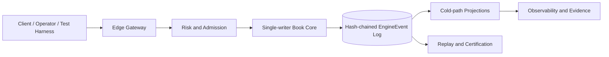
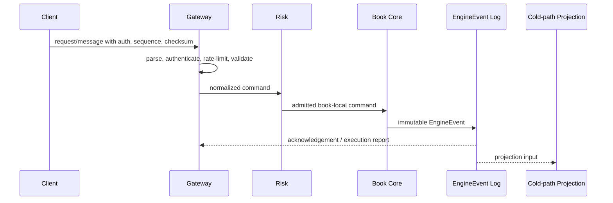
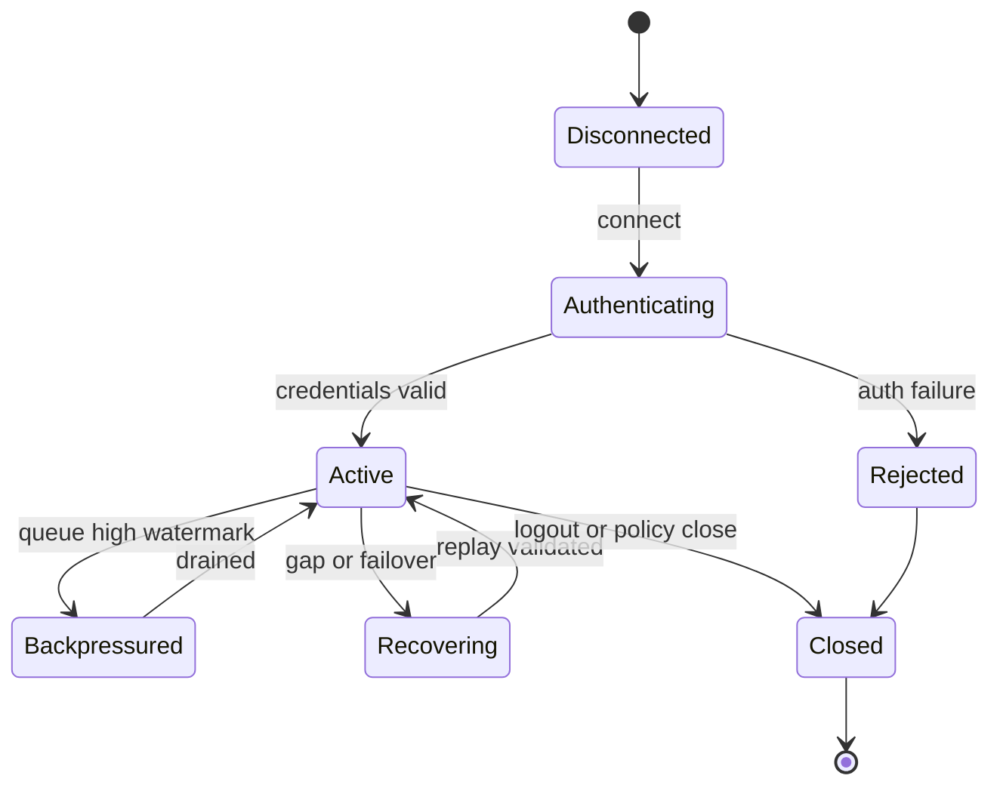

# VOLUME IX: QUALITY ENGINEERING

## Purpose

Volume IX defines implementation-grade technical requirements for quality engineering in HermesNet. It is normative for engineering teams, Codex agents, SRE, security, compliance, and reviewers implementing or operating production exchange systems.

## Scope

The volume covers the planned chapters listed below and binds them to the cross-volume invariants established by Volumes I–V. It does not alter frozen volumes, define document versioning policy, create governance process, or generate DOCX/PDF artifacts.


## Normative Principles

All requirements in this volume preserve HermesNet invariants: no global sequencer, book-local ordering, a single-writer Book Core for each active book, fixed-point arithmetic for financial quantities, deterministic replay from immutable `EngineEvent` records, hash-chained event logs, hot/cold path separation, no database, Kafka, or cloud dependency in the trading hot path, auditable financial mutation, observable operation, logged security-sensitive action, and testable production process.

## Reference Architecture




## Volume IX Domain Requirements

Quality engineering uses a test pyramid: fast Rust unit tests at the base, integration harnesses for service boundaries, property tests for invariants, deterministic replay tests for event logs, fuzz tests for malformed protocols, chaos tests for failures, performance benchmarks for latency and throughput, soak tests for endurance, certification suites for external contracts, and regression gates for release control. Rust unit test rules require deterministic inputs, fixed-point assertions, no hidden network dependency, and clear fixture ownership. Integration test harnesses must construct gateways, risk admission, Book Core, event log, projections, and clients with controllable clocks. Property-based testing must cover matching invariants, ledger balance, margin safety, idempotency, order conservation, and monotonic sequences. Replay testing validates event hash chains, golden vectors, byte-equivalent projections, and crash recovery. Fuzzing targets malformed REST, WebSocket, FIX, OUCH, SBE, snapshot, and delta messages. Chaos scenarios include gateway overload tests, Book Core crash tests, passive promotion, failover tests, network partitions, disk-full cold path, clock skew alarms, and kill-switch drills. Performance testing covers latency benchmarks, throughput benchmarks, memory benchmarks, allocator behavior, tail latency, and backpressure. Soak tests run multi-day workloads with release certification, regression gates, test data governance, automated CI execution, and acceptance thresholds.

## Chapters

1. Unit Testing
2. Integration Testing
3. Property Testing
4. Replay Testing
5. Fuzz Testing
6. Chaos Testing
7. Performance Testing
8. Soak Testing
9. Certification Framework
10. Regression Strategy

## Unit Testing

### Purpose

Defines the production requirements for unit testing in Volume IX.

### Scope

This chapter applies to production services, certification harnesses, replay tooling, monitoring, operational runbooks, and implementation reviews that touch unit testing. It excludes marketing claims, non-deterministic shortcuts, and any dependency that can block the Book Core hot path.

### Responsibilities

- Preserve book-local ordering and single-writer mutation.
- Validate fixed-point quantities and deterministic reject reasons before mutation.
- Emit immutable EngineEvents for accepted state changes.
- Maintain bounded queues, explicit sequence numbers, checksums, and replayable evidence.
- Expose metrics, logs, traces, alerts, and audit records appropriate to the domain.

### Architecture



### State Machines



### Algorithms and Contracts

```rust
pub struct UnitTestingContract {
    pub request_id: ClientRequestId,
    pub book_id: BookId,
    pub sequence: u64,
    pub checksum: u32,
}

pub fn validate_and_apply(input: &InboundMessage, state: &mut DeterministicState) -> Result<Vec<EngineEvent>, RejectReason> {
    input.verify_checksum()?;
    input.verify_monotonic_sequence(state.last_sequence)?;
    let command = input.to_book_local_command()?;
    let events = state.apply_single_writer(command)?;
    Ok(events)
}
```

Configuration example:

```yaml
component: unit-testing
limits:
  inbound_messages_per_second: 5000
  max_queue_depth: 65536
  slow_consumer_threshold_ms: 250
recovery:
  require_contiguous_sequences: true
  validate_checksums: true
  replay_from_engine_events: true
security:
  audit_sensitive_actions: true
  reject_unsigned_mutations: true
```

### Failure Modes and Recovery

| Failure mode | Required behavior | Recovery evidence |
|---|---|---|
| Malformed input | Reject before Book Core admission | reject code, client id, checksum result |
| Sequence gap | Stop applying stream and enter recovery | last good sequence and replay cursor |
| Gateway overload | Shed at gateway with deterministic rejects | rate-limit metric and audit log |
| Slow consumer | Warn, throttle, disconnect, or require resnapshot | queue depth and disconnect reason |
| Core failover | Resume from hash-chain verified event cursor | previous and new active identity |

### Observability

Expose counters for accepted, rejected, throttled, replayed, disconnected, and recovered messages; gauges for queue depth, replay lag, and active sessions; histograms for parse, authentication, admission, acknowledgement, fanout, and end-to-end latency; structured logs with request id, account id, book id, sequence, EngineEvent hash, and reject reason.

### Security Considerations

Authenticate every mutating request, authorize account and role scope, verify HMAC or mTLS where applicable, prevent replay with timestamp and nonce windows, redact secrets from logs, audit administrative and private-data access, and fail closed when identity, sequence, or checksum validation is ambiguous.

### Testing Strategy

Test normal flow, malformed input, duplicate ids, sequence gaps, reconnect recovery, checksum mismatch, overload, failover, replay determinism, authorization denial, slow consumers, and cold-path projection lag. Golden vectors must include input bytes, normalized command, EngineEvent hash, and expected outbound messages.

### Acceptance Criteria

- No accepted mutation bypasses deterministic validation or audit logging.
- Recovery from a valid cursor yields byte-equivalent outward state.
- Backpressure never blocks the Book Core hot path.
- Sequence and checksum failures are detected and observable.
- Certification tests cover success, rejection, overload, and recovery paths.

### Codex Implementation Contract

Codex changes touching unit testing must include deterministic tests, avoid hidden wall-clock dependence, preserve fixed-point arithmetic, avoid try/catch around imports, keep external dependencies out of the hot path, and update examples, diagrams, and acceptance criteria when contracts change.

### Review Checklist

- [ ] Contracts are explicit and versioned.
- [ ] Failure modes have recovery procedures.
- [ ] Metrics, logs, traces, and audit records are specified.
- [ ] Security-sensitive operations are authenticated, authorized, and logged.
- [ ] Tests include replay, overload, and negative cases.

## Integration Testing

### Purpose

Defines the production requirements for integration testing in Volume IX.

### Scope

This chapter applies to production services, certification harnesses, replay tooling, monitoring, operational runbooks, and implementation reviews that touch integration testing. It excludes marketing claims, non-deterministic shortcuts, and any dependency that can block the Book Core hot path.

### Responsibilities

- Preserve book-local ordering and single-writer mutation.
- Validate fixed-point quantities and deterministic reject reasons before mutation.
- Emit immutable EngineEvents for accepted state changes.
- Maintain bounded queues, explicit sequence numbers, checksums, and replayable evidence.
- Expose metrics, logs, traces, alerts, and audit records appropriate to the domain.

### Architecture


### State Machines


### Algorithms and Contracts

```rust
pub struct IntegrationTestingContract {
    pub request_id: ClientRequestId,
    pub book_id: BookId,
    pub sequence: u64,
    pub checksum: u32,
}

pub fn validate_and_apply(input: &InboundMessage, state: &mut DeterministicState) -> Result<Vec<EngineEvent>, RejectReason> {
    input.verify_checksum()?;
    input.verify_monotonic_sequence(state.last_sequence)?;
    let command = input.to_book_local_command()?;
    let events = state.apply_single_writer(command)?;
    Ok(events)
}
```

Configuration example:

```yaml
component: integration-testing
limits:
  inbound_messages_per_second: 5000
  max_queue_depth: 65536
  slow_consumer_threshold_ms: 250
recovery:
  require_contiguous_sequences: true
  validate_checksums: true
  replay_from_engine_events: true
security:
  audit_sensitive_actions: true
  reject_unsigned_mutations: true
```

### Failure Modes and Recovery

| Failure mode | Required behavior | Recovery evidence |
|---|---|---|
| Malformed input | Reject before Book Core admission | reject code, client id, checksum result |
| Sequence gap | Stop applying stream and enter recovery | last good sequence and replay cursor |
| Gateway overload | Shed at gateway with deterministic rejects | rate-limit metric and audit log |
| Slow consumer | Warn, throttle, disconnect, or require resnapshot | queue depth and disconnect reason |
| Core failover | Resume from hash-chain verified event cursor | previous and new active identity |

### Observability

Expose counters for accepted, rejected, throttled, replayed, disconnected, and recovered messages; gauges for queue depth, replay lag, and active sessions; histograms for parse, authentication, admission, acknowledgement, fanout, and end-to-end latency; structured logs with request id, account id, book id, sequence, EngineEvent hash, and reject reason.

### Security Considerations

Authenticate every mutating request, authorize account and role scope, verify HMAC or mTLS where applicable, prevent replay with timestamp and nonce windows, redact secrets from logs, audit administrative and private-data access, and fail closed when identity, sequence, or checksum validation is ambiguous.

### Testing Strategy

Test normal flow, malformed input, duplicate ids, sequence gaps, reconnect recovery, checksum mismatch, overload, failover, replay determinism, authorization denial, slow consumers, and cold-path projection lag. Golden vectors must include input bytes, normalized command, EngineEvent hash, and expected outbound messages.

### Acceptance Criteria

- No accepted mutation bypasses deterministic validation or audit logging.
- Recovery from a valid cursor yields byte-equivalent outward state.
- Backpressure never blocks the Book Core hot path.
- Sequence and checksum failures are detected and observable.
- Certification tests cover success, rejection, overload, and recovery paths.

### Codex Implementation Contract

Codex changes touching integration testing must include deterministic tests, avoid hidden wall-clock dependence, preserve fixed-point arithmetic, avoid try/catch around imports, keep external dependencies out of the hot path, and update examples, diagrams, and acceptance criteria when contracts change.

### Review Checklist

- [ ] Contracts are explicit and versioned.
- [ ] Failure modes have recovery procedures.
- [ ] Metrics, logs, traces, and audit records are specified.
- [ ] Security-sensitive operations are authenticated, authorized, and logged.
- [ ] Tests include replay, overload, and negative cases.

## Property Testing

### Purpose

Defines the production requirements for property testing in Volume IX.

### Scope

This chapter applies to production services, certification harnesses, replay tooling, monitoring, operational runbooks, and implementation reviews that touch property testing. It excludes marketing claims, non-deterministic shortcuts, and any dependency that can block the Book Core hot path.

### Responsibilities

- Preserve book-local ordering and single-writer mutation.
- Validate fixed-point quantities and deterministic reject reasons before mutation.
- Emit immutable EngineEvents for accepted state changes.
- Maintain bounded queues, explicit sequence numbers, checksums, and replayable evidence.
- Expose metrics, logs, traces, alerts, and audit records appropriate to the domain.

### Architecture


### State Machines


### Algorithms and Contracts

```rust
pub struct PropertyTestingContract {
    pub request_id: ClientRequestId,
    pub book_id: BookId,
    pub sequence: u64,
    pub checksum: u32,
}

pub fn validate_and_apply(input: &InboundMessage, state: &mut DeterministicState) -> Result<Vec<EngineEvent>, RejectReason> {
    input.verify_checksum()?;
    input.verify_monotonic_sequence(state.last_sequence)?;
    let command = input.to_book_local_command()?;
    let events = state.apply_single_writer(command)?;
    Ok(events)
}
```

Configuration example:

```yaml
component: property-testing
limits:
  inbound_messages_per_second: 5000
  max_queue_depth: 65536
  slow_consumer_threshold_ms: 250
recovery:
  require_contiguous_sequences: true
  validate_checksums: true
  replay_from_engine_events: true
security:
  audit_sensitive_actions: true
  reject_unsigned_mutations: true
```

### Failure Modes and Recovery

| Failure mode | Required behavior | Recovery evidence |
|---|---|---|
| Malformed input | Reject before Book Core admission | reject code, client id, checksum result |
| Sequence gap | Stop applying stream and enter recovery | last good sequence and replay cursor |
| Gateway overload | Shed at gateway with deterministic rejects | rate-limit metric and audit log |
| Slow consumer | Warn, throttle, disconnect, or require resnapshot | queue depth and disconnect reason |
| Core failover | Resume from hash-chain verified event cursor | previous and new active identity |

### Observability

Expose counters for accepted, rejected, throttled, replayed, disconnected, and recovered messages; gauges for queue depth, replay lag, and active sessions; histograms for parse, authentication, admission, acknowledgement, fanout, and end-to-end latency; structured logs with request id, account id, book id, sequence, EngineEvent hash, and reject reason.

### Security Considerations

Authenticate every mutating request, authorize account and role scope, verify HMAC or mTLS where applicable, prevent replay with timestamp and nonce windows, redact secrets from logs, audit administrative and private-data access, and fail closed when identity, sequence, or checksum validation is ambiguous.

### Testing Strategy

Test normal flow, malformed input, duplicate ids, sequence gaps, reconnect recovery, checksum mismatch, overload, failover, replay determinism, authorization denial, slow consumers, and cold-path projection lag. Golden vectors must include input bytes, normalized command, EngineEvent hash, and expected outbound messages.

### Acceptance Criteria

- No accepted mutation bypasses deterministic validation or audit logging.
- Recovery from a valid cursor yields byte-equivalent outward state.
- Backpressure never blocks the Book Core hot path.
- Sequence and checksum failures are detected and observable.
- Certification tests cover success, rejection, overload, and recovery paths.

### Codex Implementation Contract

Codex changes touching property testing must include deterministic tests, avoid hidden wall-clock dependence, preserve fixed-point arithmetic, avoid try/catch around imports, keep external dependencies out of the hot path, and update examples, diagrams, and acceptance criteria when contracts change.

### Review Checklist

- [ ] Contracts are explicit and versioned.
- [ ] Failure modes have recovery procedures.
- [ ] Metrics, logs, traces, and audit records are specified.
- [ ] Security-sensitive operations are authenticated, authorized, and logged.
- [ ] Tests include replay, overload, and negative cases.

## Replay Testing

### Purpose

Defines the production requirements for replay testing in Volume IX.

### Scope

This chapter applies to production services, certification harnesses, replay tooling, monitoring, operational runbooks, and implementation reviews that touch replay testing. It excludes marketing claims, non-deterministic shortcuts, and any dependency that can block the Book Core hot path.

### Responsibilities

- Preserve book-local ordering and single-writer mutation.
- Validate fixed-point quantities and deterministic reject reasons before mutation.
- Emit immutable EngineEvents for accepted state changes.
- Maintain bounded queues, explicit sequence numbers, checksums, and replayable evidence.
- Expose metrics, logs, traces, alerts, and audit records appropriate to the domain.

### Architecture


### State Machines


### Algorithms and Contracts

```rust
pub struct ReplayTestingContract {
    pub request_id: ClientRequestId,
    pub book_id: BookId,
    pub sequence: u64,
    pub checksum: u32,
}

pub fn validate_and_apply(input: &InboundMessage, state: &mut DeterministicState) -> Result<Vec<EngineEvent>, RejectReason> {
    input.verify_checksum()?;
    input.verify_monotonic_sequence(state.last_sequence)?;
    let command = input.to_book_local_command()?;
    let events = state.apply_single_writer(command)?;
    Ok(events)
}
```

Configuration example:

```yaml
component: replay-testing
limits:
  inbound_messages_per_second: 5000
  max_queue_depth: 65536
  slow_consumer_threshold_ms: 250
recovery:
  require_contiguous_sequences: true
  validate_checksums: true
  replay_from_engine_events: true
security:
  audit_sensitive_actions: true
  reject_unsigned_mutations: true
```

### Failure Modes and Recovery

| Failure mode | Required behavior | Recovery evidence |
|---|---|---|
| Malformed input | Reject before Book Core admission | reject code, client id, checksum result |
| Sequence gap | Stop applying stream and enter recovery | last good sequence and replay cursor |
| Gateway overload | Shed at gateway with deterministic rejects | rate-limit metric and audit log |
| Slow consumer | Warn, throttle, disconnect, or require resnapshot | queue depth and disconnect reason |
| Core failover | Resume from hash-chain verified event cursor | previous and new active identity |

### Observability

Expose counters for accepted, rejected, throttled, replayed, disconnected, and recovered messages; gauges for queue depth, replay lag, and active sessions; histograms for parse, authentication, admission, acknowledgement, fanout, and end-to-end latency; structured logs with request id, account id, book id, sequence, EngineEvent hash, and reject reason.

### Security Considerations

Authenticate every mutating request, authorize account and role scope, verify HMAC or mTLS where applicable, prevent replay with timestamp and nonce windows, redact secrets from logs, audit administrative and private-data access, and fail closed when identity, sequence, or checksum validation is ambiguous.

### Testing Strategy

Test normal flow, malformed input, duplicate ids, sequence gaps, reconnect recovery, checksum mismatch, overload, failover, replay determinism, authorization denial, slow consumers, and cold-path projection lag. Golden vectors must include input bytes, normalized command, EngineEvent hash, and expected outbound messages.

### Acceptance Criteria

- No accepted mutation bypasses deterministic validation or audit logging.
- Recovery from a valid cursor yields byte-equivalent outward state.
- Backpressure never blocks the Book Core hot path.
- Sequence and checksum failures are detected and observable.
- Certification tests cover success, rejection, overload, and recovery paths.

### Codex Implementation Contract

Codex changes touching replay testing must include deterministic tests, avoid hidden wall-clock dependence, preserve fixed-point arithmetic, avoid try/catch around imports, keep external dependencies out of the hot path, and update examples, diagrams, and acceptance criteria when contracts change.

### Review Checklist

- [ ] Contracts are explicit and versioned.
- [ ] Failure modes have recovery procedures.
- [ ] Metrics, logs, traces, and audit records are specified.
- [ ] Security-sensitive operations are authenticated, authorized, and logged.
- [ ] Tests include replay, overload, and negative cases.

## Fuzz Testing

### Purpose

Defines the production requirements for fuzz testing in Volume IX.

### Scope

This chapter applies to production services, certification harnesses, replay tooling, monitoring, operational runbooks, and implementation reviews that touch fuzz testing. It excludes marketing claims, non-deterministic shortcuts, and any dependency that can block the Book Core hot path.

### Responsibilities

- Preserve book-local ordering and single-writer mutation.
- Validate fixed-point quantities and deterministic reject reasons before mutation.
- Emit immutable EngineEvents for accepted state changes.
- Maintain bounded queues, explicit sequence numbers, checksums, and replayable evidence.
- Expose metrics, logs, traces, alerts, and audit records appropriate to the domain.

### Architecture


### State Machines


### Algorithms and Contracts

```rust
pub struct FuzzTestingContract {
    pub request_id: ClientRequestId,
    pub book_id: BookId,
    pub sequence: u64,
    pub checksum: u32,
}

pub fn validate_and_apply(input: &InboundMessage, state: &mut DeterministicState) -> Result<Vec<EngineEvent>, RejectReason> {
    input.verify_checksum()?;
    input.verify_monotonic_sequence(state.last_sequence)?;
    let command = input.to_book_local_command()?;
    let events = state.apply_single_writer(command)?;
    Ok(events)
}
```

Configuration example:

```yaml
component: fuzz-testing
limits:
  inbound_messages_per_second: 5000
  max_queue_depth: 65536
  slow_consumer_threshold_ms: 250
recovery:
  require_contiguous_sequences: true
  validate_checksums: true
  replay_from_engine_events: true
security:
  audit_sensitive_actions: true
  reject_unsigned_mutations: true
```

### Failure Modes and Recovery

| Failure mode | Required behavior | Recovery evidence |
|---|---|---|
| Malformed input | Reject before Book Core admission | reject code, client id, checksum result |
| Sequence gap | Stop applying stream and enter recovery | last good sequence and replay cursor |
| Gateway overload | Shed at gateway with deterministic rejects | rate-limit metric and audit log |
| Slow consumer | Warn, throttle, disconnect, or require resnapshot | queue depth and disconnect reason |
| Core failover | Resume from hash-chain verified event cursor | previous and new active identity |

### Observability

Expose counters for accepted, rejected, throttled, replayed, disconnected, and recovered messages; gauges for queue depth, replay lag, and active sessions; histograms for parse, authentication, admission, acknowledgement, fanout, and end-to-end latency; structured logs with request id, account id, book id, sequence, EngineEvent hash, and reject reason.

### Security Considerations

Authenticate every mutating request, authorize account and role scope, verify HMAC or mTLS where applicable, prevent replay with timestamp and nonce windows, redact secrets from logs, audit administrative and private-data access, and fail closed when identity, sequence, or checksum validation is ambiguous.

### Testing Strategy

Test normal flow, malformed input, duplicate ids, sequence gaps, reconnect recovery, checksum mismatch, overload, failover, replay determinism, authorization denial, slow consumers, and cold-path projection lag. Golden vectors must include input bytes, normalized command, EngineEvent hash, and expected outbound messages.

### Acceptance Criteria

- No accepted mutation bypasses deterministic validation or audit logging.
- Recovery from a valid cursor yields byte-equivalent outward state.
- Backpressure never blocks the Book Core hot path.
- Sequence and checksum failures are detected and observable.
- Certification tests cover success, rejection, overload, and recovery paths.

### Codex Implementation Contract

Codex changes touching fuzz testing must include deterministic tests, avoid hidden wall-clock dependence, preserve fixed-point arithmetic, avoid try/catch around imports, keep external dependencies out of the hot path, and update examples, diagrams, and acceptance criteria when contracts change.

### Review Checklist

- [ ] Contracts are explicit and versioned.
- [ ] Failure modes have recovery procedures.
- [ ] Metrics, logs, traces, and audit records are specified.
- [ ] Security-sensitive operations are authenticated, authorized, and logged.
- [ ] Tests include replay, overload, and negative cases.

## Chaos Testing

### Purpose

Defines the production requirements for chaos testing in Volume IX.

### Scope

This chapter applies to production services, certification harnesses, replay tooling, monitoring, operational runbooks, and implementation reviews that touch chaos testing. It excludes marketing claims, non-deterministic shortcuts, and any dependency that can block the Book Core hot path.

### Responsibilities

- Preserve book-local ordering and single-writer mutation.
- Validate fixed-point quantities and deterministic reject reasons before mutation.
- Emit immutable EngineEvents for accepted state changes.
- Maintain bounded queues, explicit sequence numbers, checksums, and replayable evidence.
- Expose metrics, logs, traces, alerts, and audit records appropriate to the domain.

### Architecture


### State Machines


### Algorithms and Contracts

```rust
pub struct ChaosTestingContract {
    pub request_id: ClientRequestId,
    pub book_id: BookId,
    pub sequence: u64,
    pub checksum: u32,
}

pub fn validate_and_apply(input: &InboundMessage, state: &mut DeterministicState) -> Result<Vec<EngineEvent>, RejectReason> {
    input.verify_checksum()?;
    input.verify_monotonic_sequence(state.last_sequence)?;
    let command = input.to_book_local_command()?;
    let events = state.apply_single_writer(command)?;
    Ok(events)
}
```

Configuration example:

```yaml
component: chaos-testing
limits:
  inbound_messages_per_second: 5000
  max_queue_depth: 65536
  slow_consumer_threshold_ms: 250
recovery:
  require_contiguous_sequences: true
  validate_checksums: true
  replay_from_engine_events: true
security:
  audit_sensitive_actions: true
  reject_unsigned_mutations: true
```

### Failure Modes and Recovery

| Failure mode | Required behavior | Recovery evidence |
|---|---|---|
| Malformed input | Reject before Book Core admission | reject code, client id, checksum result |
| Sequence gap | Stop applying stream and enter recovery | last good sequence and replay cursor |
| Gateway overload | Shed at gateway with deterministic rejects | rate-limit metric and audit log |
| Slow consumer | Warn, throttle, disconnect, or require resnapshot | queue depth and disconnect reason |
| Core failover | Resume from hash-chain verified event cursor | previous and new active identity |

### Observability

Expose counters for accepted, rejected, throttled, replayed, disconnected, and recovered messages; gauges for queue depth, replay lag, and active sessions; histograms for parse, authentication, admission, acknowledgement, fanout, and end-to-end latency; structured logs with request id, account id, book id, sequence, EngineEvent hash, and reject reason.

### Security Considerations

Authenticate every mutating request, authorize account and role scope, verify HMAC or mTLS where applicable, prevent replay with timestamp and nonce windows, redact secrets from logs, audit administrative and private-data access, and fail closed when identity, sequence, or checksum validation is ambiguous.

### Testing Strategy

Test normal flow, malformed input, duplicate ids, sequence gaps, reconnect recovery, checksum mismatch, overload, failover, replay determinism, authorization denial, slow consumers, and cold-path projection lag. Golden vectors must include input bytes, normalized command, EngineEvent hash, and expected outbound messages.

### Acceptance Criteria

- No accepted mutation bypasses deterministic validation or audit logging.
- Recovery from a valid cursor yields byte-equivalent outward state.
- Backpressure never blocks the Book Core hot path.
- Sequence and checksum failures are detected and observable.
- Certification tests cover success, rejection, overload, and recovery paths.

### Codex Implementation Contract

Codex changes touching chaos testing must include deterministic tests, avoid hidden wall-clock dependence, preserve fixed-point arithmetic, avoid try/catch around imports, keep external dependencies out of the hot path, and update examples, diagrams, and acceptance criteria when contracts change.

### Review Checklist

- [ ] Contracts are explicit and versioned.
- [ ] Failure modes have recovery procedures.
- [ ] Metrics, logs, traces, and audit records are specified.
- [ ] Security-sensitive operations are authenticated, authorized, and logged.
- [ ] Tests include replay, overload, and negative cases.

## Performance Testing

### Purpose

Defines the production requirements for performance testing in Volume IX.

### Scope

This chapter applies to production services, certification harnesses, replay tooling, monitoring, operational runbooks, and implementation reviews that touch performance testing. It excludes marketing claims, non-deterministic shortcuts, and any dependency that can block the Book Core hot path.

### Responsibilities

- Preserve book-local ordering and single-writer mutation.
- Validate fixed-point quantities and deterministic reject reasons before mutation.
- Emit immutable EngineEvents for accepted state changes.
- Maintain bounded queues, explicit sequence numbers, checksums, and replayable evidence.
- Expose metrics, logs, traces, alerts, and audit records appropriate to the domain.

### Architecture


### State Machines


### Algorithms and Contracts

```rust
pub struct PerformanceTestingContract {
    pub request_id: ClientRequestId,
    pub book_id: BookId,
    pub sequence: u64,
    pub checksum: u32,
}

pub fn validate_and_apply(input: &InboundMessage, state: &mut DeterministicState) -> Result<Vec<EngineEvent>, RejectReason> {
    input.verify_checksum()?;
    input.verify_monotonic_sequence(state.last_sequence)?;
    let command = input.to_book_local_command()?;
    let events = state.apply_single_writer(command)?;
    Ok(events)
}
```

Configuration example:

```yaml
component: performance-testing
limits:
  inbound_messages_per_second: 5000
  max_queue_depth: 65536
  slow_consumer_threshold_ms: 250
recovery:
  require_contiguous_sequences: true
  validate_checksums: true
  replay_from_engine_events: true
security:
  audit_sensitive_actions: true
  reject_unsigned_mutations: true
```

### Failure Modes and Recovery

| Failure mode | Required behavior | Recovery evidence |
|---|---|---|
| Malformed input | Reject before Book Core admission | reject code, client id, checksum result |
| Sequence gap | Stop applying stream and enter recovery | last good sequence and replay cursor |
| Gateway overload | Shed at gateway with deterministic rejects | rate-limit metric and audit log |
| Slow consumer | Warn, throttle, disconnect, or require resnapshot | queue depth and disconnect reason |
| Core failover | Resume from hash-chain verified event cursor | previous and new active identity |

### Observability

Expose counters for accepted, rejected, throttled, replayed, disconnected, and recovered messages; gauges for queue depth, replay lag, and active sessions; histograms for parse, authentication, admission, acknowledgement, fanout, and end-to-end latency; structured logs with request id, account id, book id, sequence, EngineEvent hash, and reject reason.

### Security Considerations

Authenticate every mutating request, authorize account and role scope, verify HMAC or mTLS where applicable, prevent replay with timestamp and nonce windows, redact secrets from logs, audit administrative and private-data access, and fail closed when identity, sequence, or checksum validation is ambiguous.

### Testing Strategy

Test normal flow, malformed input, duplicate ids, sequence gaps, reconnect recovery, checksum mismatch, overload, failover, replay determinism, authorization denial, slow consumers, and cold-path projection lag. Golden vectors must include input bytes, normalized command, EngineEvent hash, and expected outbound messages.

### Acceptance Criteria

- No accepted mutation bypasses deterministic validation or audit logging.
- Recovery from a valid cursor yields byte-equivalent outward state.
- Backpressure never blocks the Book Core hot path.
- Sequence and checksum failures are detected and observable.
- Certification tests cover success, rejection, overload, and recovery paths.

### Codex Implementation Contract

Codex changes touching performance testing must include deterministic tests, avoid hidden wall-clock dependence, preserve fixed-point arithmetic, avoid try/catch around imports, keep external dependencies out of the hot path, and update examples, diagrams, and acceptance criteria when contracts change.

### Review Checklist

- [ ] Contracts are explicit and versioned.
- [ ] Failure modes have recovery procedures.
- [ ] Metrics, logs, traces, and audit records are specified.
- [ ] Security-sensitive operations are authenticated, authorized, and logged.
- [ ] Tests include replay, overload, and negative cases.

## Soak Testing

### Purpose

Defines the production requirements for soak testing in Volume IX.

### Scope

This chapter applies to production services, certification harnesses, replay tooling, monitoring, operational runbooks, and implementation reviews that touch soak testing. It excludes marketing claims, non-deterministic shortcuts, and any dependency that can block the Book Core hot path.

### Responsibilities

- Preserve book-local ordering and single-writer mutation.
- Validate fixed-point quantities and deterministic reject reasons before mutation.
- Emit immutable EngineEvents for accepted state changes.
- Maintain bounded queues, explicit sequence numbers, checksums, and replayable evidence.
- Expose metrics, logs, traces, alerts, and audit records appropriate to the domain.

### Architecture


### State Machines


### Algorithms and Contracts

```rust
pub struct SoakTestingContract {
    pub request_id: ClientRequestId,
    pub book_id: BookId,
    pub sequence: u64,
    pub checksum: u32,
}

pub fn validate_and_apply(input: &InboundMessage, state: &mut DeterministicState) -> Result<Vec<EngineEvent>, RejectReason> {
    input.verify_checksum()?;
    input.verify_monotonic_sequence(state.last_sequence)?;
    let command = input.to_book_local_command()?;
    let events = state.apply_single_writer(command)?;
    Ok(events)
}
```

Configuration example:

```yaml
component: soak-testing
limits:
  inbound_messages_per_second: 5000
  max_queue_depth: 65536
  slow_consumer_threshold_ms: 250
recovery:
  require_contiguous_sequences: true
  validate_checksums: true
  replay_from_engine_events: true
security:
  audit_sensitive_actions: true
  reject_unsigned_mutations: true
```

### Failure Modes and Recovery

| Failure mode | Required behavior | Recovery evidence |
|---|---|---|
| Malformed input | Reject before Book Core admission | reject code, client id, checksum result |
| Sequence gap | Stop applying stream and enter recovery | last good sequence and replay cursor |
| Gateway overload | Shed at gateway with deterministic rejects | rate-limit metric and audit log |
| Slow consumer | Warn, throttle, disconnect, or require resnapshot | queue depth and disconnect reason |
| Core failover | Resume from hash-chain verified event cursor | previous and new active identity |

### Observability

Expose counters for accepted, rejected, throttled, replayed, disconnected, and recovered messages; gauges for queue depth, replay lag, and active sessions; histograms for parse, authentication, admission, acknowledgement, fanout, and end-to-end latency; structured logs with request id, account id, book id, sequence, EngineEvent hash, and reject reason.

### Security Considerations

Authenticate every mutating request, authorize account and role scope, verify HMAC or mTLS where applicable, prevent replay with timestamp and nonce windows, redact secrets from logs, audit administrative and private-data access, and fail closed when identity, sequence, or checksum validation is ambiguous.

### Testing Strategy

Test normal flow, malformed input, duplicate ids, sequence gaps, reconnect recovery, checksum mismatch, overload, failover, replay determinism, authorization denial, slow consumers, and cold-path projection lag. Golden vectors must include input bytes, normalized command, EngineEvent hash, and expected outbound messages.

### Acceptance Criteria

- No accepted mutation bypasses deterministic validation or audit logging.
- Recovery from a valid cursor yields byte-equivalent outward state.
- Backpressure never blocks the Book Core hot path.
- Sequence and checksum failures are detected and observable.
- Certification tests cover success, rejection, overload, and recovery paths.

### Codex Implementation Contract

Codex changes touching soak testing must include deterministic tests, avoid hidden wall-clock dependence, preserve fixed-point arithmetic, avoid try/catch around imports, keep external dependencies out of the hot path, and update examples, diagrams, and acceptance criteria when contracts change.

### Review Checklist

- [ ] Contracts are explicit and versioned.
- [ ] Failure modes have recovery procedures.
- [ ] Metrics, logs, traces, and audit records are specified.
- [ ] Security-sensitive operations are authenticated, authorized, and logged.
- [ ] Tests include replay, overload, and negative cases.

## Certification Framework

### Purpose

Defines the production requirements for certification framework in Volume IX.

### Scope

This chapter applies to production services, certification harnesses, replay tooling, monitoring, operational runbooks, and implementation reviews that touch certification framework. It excludes marketing claims, non-deterministic shortcuts, and any dependency that can block the Book Core hot path.

### Responsibilities

- Preserve book-local ordering and single-writer mutation.
- Validate fixed-point quantities and deterministic reject reasons before mutation.
- Emit immutable EngineEvents for accepted state changes.
- Maintain bounded queues, explicit sequence numbers, checksums, and replayable evidence.
- Expose metrics, logs, traces, alerts, and audit records appropriate to the domain.

### Architecture


### State Machines


### Algorithms and Contracts

```rust
pub struct CertificationFrameworkContract {
    pub request_id: ClientRequestId,
    pub book_id: BookId,
    pub sequence: u64,
    pub checksum: u32,
}

pub fn validate_and_apply(input: &InboundMessage, state: &mut DeterministicState) -> Result<Vec<EngineEvent>, RejectReason> {
    input.verify_checksum()?;
    input.verify_monotonic_sequence(state.last_sequence)?;
    let command = input.to_book_local_command()?;
    let events = state.apply_single_writer(command)?;
    Ok(events)
}
```

Configuration example:

```yaml
component: certification-framework
limits:
  inbound_messages_per_second: 5000
  max_queue_depth: 65536
  slow_consumer_threshold_ms: 250
recovery:
  require_contiguous_sequences: true
  validate_checksums: true
  replay_from_engine_events: true
security:
  audit_sensitive_actions: true
  reject_unsigned_mutations: true
```

### Failure Modes and Recovery

| Failure mode | Required behavior | Recovery evidence |
|---|---|---|
| Malformed input | Reject before Book Core admission | reject code, client id, checksum result |
| Sequence gap | Stop applying stream and enter recovery | last good sequence and replay cursor |
| Gateway overload | Shed at gateway with deterministic rejects | rate-limit metric and audit log |
| Slow consumer | Warn, throttle, disconnect, or require resnapshot | queue depth and disconnect reason |
| Core failover | Resume from hash-chain verified event cursor | previous and new active identity |

### Observability

Expose counters for accepted, rejected, throttled, replayed, disconnected, and recovered messages; gauges for queue depth, replay lag, and active sessions; histograms for parse, authentication, admission, acknowledgement, fanout, and end-to-end latency; structured logs with request id, account id, book id, sequence, EngineEvent hash, and reject reason.

### Security Considerations

Authenticate every mutating request, authorize account and role scope, verify HMAC or mTLS where applicable, prevent replay with timestamp and nonce windows, redact secrets from logs, audit administrative and private-data access, and fail closed when identity, sequence, or checksum validation is ambiguous.

### Testing Strategy

Test normal flow, malformed input, duplicate ids, sequence gaps, reconnect recovery, checksum mismatch, overload, failover, replay determinism, authorization denial, slow consumers, and cold-path projection lag. Golden vectors must include input bytes, normalized command, EngineEvent hash, and expected outbound messages.

### Acceptance Criteria

- No accepted mutation bypasses deterministic validation or audit logging.
- Recovery from a valid cursor yields byte-equivalent outward state.
- Backpressure never blocks the Book Core hot path.
- Sequence and checksum failures are detected and observable.
- Certification tests cover success, rejection, overload, and recovery paths.

### Codex Implementation Contract

Codex changes touching certification framework must include deterministic tests, avoid hidden wall-clock dependence, preserve fixed-point arithmetic, avoid try/catch around imports, keep external dependencies out of the hot path, and update examples, diagrams, and acceptance criteria when contracts change.

### Review Checklist

- [ ] Contracts are explicit and versioned.
- [ ] Failure modes have recovery procedures.
- [ ] Metrics, logs, traces, and audit records are specified.
- [ ] Security-sensitive operations are authenticated, authorized, and logged.
- [ ] Tests include replay, overload, and negative cases.

## Regression Strategy

### Purpose

Defines the production requirements for regression strategy in Volume IX.

### Scope

This chapter applies to production services, certification harnesses, replay tooling, monitoring, operational runbooks, and implementation reviews that touch regression strategy. It excludes marketing claims, non-deterministic shortcuts, and any dependency that can block the Book Core hot path.

### Responsibilities

- Preserve book-local ordering and single-writer mutation.
- Validate fixed-point quantities and deterministic reject reasons before mutation.
- Emit immutable EngineEvents for accepted state changes.
- Maintain bounded queues, explicit sequence numbers, checksums, and replayable evidence.
- Expose metrics, logs, traces, alerts, and audit records appropriate to the domain.

### Architecture


### State Machines

```mermaid
stateDiagram-v2
    [*] --> Disconnected
    Disconnected --> Authenticating: connect
    Authenticating --> Active: credentials valid
    Authenticating --> Rejected: auth failure
    Active --> Backpressured: queue high watermark
    Backpressured --> Active: drained
    Active --> Recovering: gap or failover
    Recovering --> Active: replay validated
    Active --> Closed: logout or policy close
    Rejected --> Closed
    Closed --> [*]
```

### Algorithms and Contracts

```rust
pub struct RegressionStrategyContract {
    pub request_id: ClientRequestId,
    pub book_id: BookId,
    pub sequence: u64,
    pub checksum: u32,
}

pub fn validate_and_apply(input: &InboundMessage, state: &mut DeterministicState) -> Result<Vec<EngineEvent>, RejectReason> {
    input.verify_checksum()?;
    input.verify_monotonic_sequence(state.last_sequence)?;
    let command = input.to_book_local_command()?;
    let events = state.apply_single_writer(command)?;
    Ok(events)
}
```

Configuration example:

```yaml
component: regression-strategy
limits:
  inbound_messages_per_second: 5000
  max_queue_depth: 65536
  slow_consumer_threshold_ms: 250
recovery:
  require_contiguous_sequences: true
  validate_checksums: true
  replay_from_engine_events: true
security:
  audit_sensitive_actions: true
  reject_unsigned_mutations: true
```

### Failure Modes and Recovery

| Failure mode | Required behavior | Recovery evidence |
|---|---|---|
| Malformed input | Reject before Book Core admission | reject code, client id, checksum result |
| Sequence gap | Stop applying stream and enter recovery | last good sequence and replay cursor |
| Gateway overload | Shed at gateway with deterministic rejects | rate-limit metric and audit log |
| Slow consumer | Warn, throttle, disconnect, or require resnapshot | queue depth and disconnect reason |
| Core failover | Resume from hash-chain verified event cursor | previous and new active identity |

### Observability

Expose counters for accepted, rejected, throttled, replayed, disconnected, and recovered messages; gauges for queue depth, replay lag, and active sessions; histograms for parse, authentication, admission, acknowledgement, fanout, and end-to-end latency; structured logs with request id, account id, book id, sequence, EngineEvent hash, and reject reason.

### Security Considerations

Authenticate every mutating request, authorize account and role scope, verify HMAC or mTLS where applicable, prevent replay with timestamp and nonce windows, redact secrets from logs, audit administrative and private-data access, and fail closed when identity, sequence, or checksum validation is ambiguous.

### Testing Strategy

Test normal flow, malformed input, duplicate ids, sequence gaps, reconnect recovery, checksum mismatch, overload, failover, replay determinism, authorization denial, slow consumers, and cold-path projection lag. Golden vectors must include input bytes, normalized command, EngineEvent hash, and expected outbound messages.

### Acceptance Criteria

- No accepted mutation bypasses deterministic validation or audit logging.
- Recovery from a valid cursor yields byte-equivalent outward state.
- Backpressure never blocks the Book Core hot path.
- Sequence and checksum failures are detected and observable.
- Certification tests cover success, rejection, overload, and recovery paths.

### Codex Implementation Contract

Codex changes touching regression strategy must include deterministic tests, avoid hidden wall-clock dependence, preserve fixed-point arithmetic, avoid try/catch around imports, keep external dependencies out of the hot path, and update examples, diagrams, and acceptance criteria when contracts change.

### Review Checklist

- [ ] Contracts are explicit and versioned.
- [ ] Failure modes have recovery procedures.
- [ ] Metrics, logs, traces, and audit records are specified.
- [ ] Security-sensitive operations are authenticated, authorized, and logged.
- [ ] Tests include replay, overload, and negative cases.

## Volume IX Final Completion Summary

Volume IX is complete for HES scope. It expands all planned chapters into production engineering requirements with architecture, state machines, algorithms or configuration examples, failure and recovery behavior, observability, security considerations, testing strategy, acceptance criteria, Codex implementation contracts, and review checklists. Remaining work is implementation and evidence generation in future non-HES repositories, not additional HES volume drafting.
