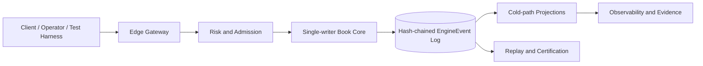
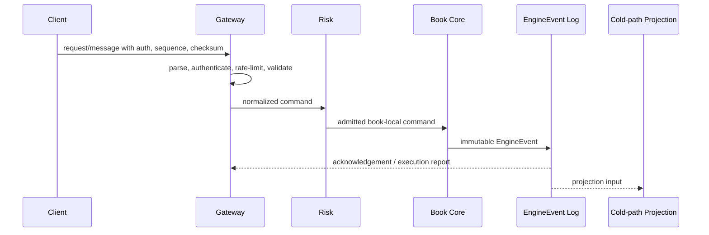
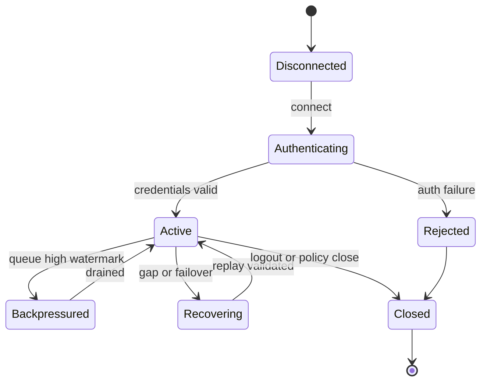

# VOLUME X: ENGINEERING STANDARDS

## Purpose

Volume X defines implementation-grade technical requirements for engineering standards in HermesNet. It is normative for engineering teams, Codex agents, SRE, security, compliance, and reviewers implementing or operating production exchange systems.

## Scope

The volume covers the planned chapters listed below and binds them to the cross-volume invariants established by Volumes I–V. It does not alter frozen volumes, define document versioning policy, create governance process, or generate DOCX/PDF artifacts.


## Normative Principles

All requirements in this volume preserve HermesNet invariants: no global sequencer, book-local ordering, a single-writer Book Core for each active book, fixed-point arithmetic for financial quantities, deterministic replay from immutable `EngineEvent` records, hash-chained event logs, hot/cold path separation, no database, Kafka, or cloud dependency in the trading hot path, auditable financial mutation, observable operation, logged security-sensitive action, and testable production process.

## Reference Architecture




## Volume X Domain Requirements

Engineering standards define Rust naming rules, module boundaries, crate ownership, error types, panic policy, logging policy, tracing policy, unsafe approval rules, dependency approval rules, dependency audit, benchmark methodology, PR checklist, code review gates, ADR usage, release branches, release candidates, rollback criteria, production readiness gates, and the engineering ownership model. Rust code uses snake_case functions and modules, UpperCamelCase types and traits, SCREAMING_SNAKE_CASE constants, explicit newtypes for money, price, quantity, account, order, and book identifiers, and crate-level documentation for public APIs. Module boundaries must isolate hot path, gateway, risk, ledger, projections, observability, and admin code. Error handling uses typed errors and deterministic reject reasons; panic is forbidden for recoverable production input. Logging and tracing must be structured, privacy-aware, sampled only where safe, and correlated with request id, sequence, and EngineEvent hash. Unsafe code requires written justification, reviewer approval, encapsulation, tests, and Miri or equivalent analysis where applicable. Dependencies require owner approval, license check, security audit, supply-chain review, and hot-path performance review. Benchmark standards require pinned hardware, controlled configuration, warm-up, percentiles, raw artifacts, and comparison against baselines. PRs require review gates, CI, tests, docs, acceptance criteria, rollback notes, and ownership sign-off. ADRs document durable architectural decisions. Release engineering uses release branches, release candidates, certification, rollback criteria, and production readiness gates.

## Chapters

1. Rust Coding Standards
2. Workspace and Crate Layout
3. Error Handling Standards
4. Logging Standards
5. Unsafe Code Policy
6. Dependency Policy
7. Benchmark Standards
8. Pull Request Review Policy
9. ADR Governance
10. Release Engineering

## Rust Coding Standards

### Purpose

Defines the production requirements for rust coding standards in Volume X.

### Scope

This chapter applies to production services, certification harnesses, replay tooling, monitoring, operational runbooks, and implementation reviews that touch rust coding standards. It excludes marketing claims, non-deterministic shortcuts, and any dependency that can block the Book Core hot path.

### Responsibilities

- Preserve book-local ordering and single-writer mutation.
- Validate fixed-point quantities and deterministic reject reasons before mutation.
- Emit immutable EngineEvents for accepted state changes.
- Maintain bounded queues, explicit sequence numbers, checksums, and replayable evidence.
- Expose metrics, logs, traces, alerts, and audit records appropriate to the domain.

### Architecture



### State Machines



### Algorithms and Contracts

```rust
pub struct RustCodingStandardsContract {
    pub request_id: ClientRequestId,
    pub book_id: BookId,
    pub sequence: u64,
    pub checksum: u32,
}

pub fn validate_and_apply(input: &InboundMessage, state: &mut DeterministicState) -> Result<Vec<EngineEvent>, RejectReason> {
    input.verify_checksum()?;
    input.verify_monotonic_sequence(state.last_sequence)?;
    let command = input.to_book_local_command()?;
    let events = state.apply_single_writer(command)?;
    Ok(events)
}
```

Configuration example:

```yaml
component: rust-coding-standards
limits:
  inbound_messages_per_second: 5000
  max_queue_depth: 65536
  slow_consumer_threshold_ms: 250
recovery:
  require_contiguous_sequences: true
  validate_checksums: true
  replay_from_engine_events: true
security:
  audit_sensitive_actions: true
  reject_unsigned_mutations: true
```

### Failure Modes and Recovery

| Failure mode | Required behavior | Recovery evidence |
|---|---|---|
| Malformed input | Reject before Book Core admission | reject code, client id, checksum result |
| Sequence gap | Stop applying stream and enter recovery | last good sequence and replay cursor |
| Gateway overload | Shed at gateway with deterministic rejects | rate-limit metric and audit log |
| Slow consumer | Warn, throttle, disconnect, or require resnapshot | queue depth and disconnect reason |
| Core failover | Resume from hash-chain verified event cursor | previous and new active identity |

### Observability

Expose counters for accepted, rejected, throttled, replayed, disconnected, and recovered messages; gauges for queue depth, replay lag, and active sessions; histograms for parse, authentication, admission, acknowledgement, fanout, and end-to-end latency; structured logs with request id, account id, book id, sequence, EngineEvent hash, and reject reason.

### Security Considerations

Authenticate every mutating request, authorize account and role scope, verify HMAC or mTLS where applicable, prevent replay with timestamp and nonce windows, redact secrets from logs, audit administrative and private-data access, and fail closed when identity, sequence, or checksum validation is ambiguous.

### Testing Strategy

Test normal flow, malformed input, duplicate ids, sequence gaps, reconnect recovery, checksum mismatch, overload, failover, replay determinism, authorization denial, slow consumers, and cold-path projection lag. Golden vectors must include input bytes, normalized command, EngineEvent hash, and expected outbound messages.

### Acceptance Criteria

- No accepted mutation bypasses deterministic validation or audit logging.
- Recovery from a valid cursor yields byte-equivalent outward state.
- Backpressure never blocks the Book Core hot path.
- Sequence and checksum failures are detected and observable.
- Certification tests cover success, rejection, overload, and recovery paths.

### Codex Implementation Contract

Codex changes touching rust coding standards must include deterministic tests, avoid hidden wall-clock dependence, preserve fixed-point arithmetic, avoid try/catch around imports, keep external dependencies out of the hot path, and update examples, diagrams, and acceptance criteria when contracts change.

### Review Checklist

- [ ] Contracts are explicit and versioned.
- [ ] Failure modes have recovery procedures.
- [ ] Metrics, logs, traces, and audit records are specified.
- [ ] Security-sensitive operations are authenticated, authorized, and logged.
- [ ] Tests include replay, overload, and negative cases.

## Workspace and Crate Layout

### Purpose

Defines the production requirements for workspace and crate layout in Volume X.

### Scope

This chapter applies to production services, certification harnesses, replay tooling, monitoring, operational runbooks, and implementation reviews that touch workspace and crate layout. It excludes marketing claims, non-deterministic shortcuts, and any dependency that can block the Book Core hot path.

### Responsibilities

- Preserve book-local ordering and single-writer mutation.
- Validate fixed-point quantities and deterministic reject reasons before mutation.
- Emit immutable EngineEvents for accepted state changes.
- Maintain bounded queues, explicit sequence numbers, checksums, and replayable evidence.
- Expose metrics, logs, traces, alerts, and audit records appropriate to the domain.

### Architecture


### State Machines


### Algorithms and Contracts

```rust
pub struct WorkspaceandCrateLayoutContract {
    pub request_id: ClientRequestId,
    pub book_id: BookId,
    pub sequence: u64,
    pub checksum: u32,
}

pub fn validate_and_apply(input: &InboundMessage, state: &mut DeterministicState) -> Result<Vec<EngineEvent>, RejectReason> {
    input.verify_checksum()?;
    input.verify_monotonic_sequence(state.last_sequence)?;
    let command = input.to_book_local_command()?;
    let events = state.apply_single_writer(command)?;
    Ok(events)
}
```

Configuration example:

```yaml
component: workspace-and-crate-layout
limits:
  inbound_messages_per_second: 5000
  max_queue_depth: 65536
  slow_consumer_threshold_ms: 250
recovery:
  require_contiguous_sequences: true
  validate_checksums: true
  replay_from_engine_events: true
security:
  audit_sensitive_actions: true
  reject_unsigned_mutations: true
```

### Failure Modes and Recovery

| Failure mode | Required behavior | Recovery evidence |
|---|---|---|
| Malformed input | Reject before Book Core admission | reject code, client id, checksum result |
| Sequence gap | Stop applying stream and enter recovery | last good sequence and replay cursor |
| Gateway overload | Shed at gateway with deterministic rejects | rate-limit metric and audit log |
| Slow consumer | Warn, throttle, disconnect, or require resnapshot | queue depth and disconnect reason |
| Core failover | Resume from hash-chain verified event cursor | previous and new active identity |

### Observability

Expose counters for accepted, rejected, throttled, replayed, disconnected, and recovered messages; gauges for queue depth, replay lag, and active sessions; histograms for parse, authentication, admission, acknowledgement, fanout, and end-to-end latency; structured logs with request id, account id, book id, sequence, EngineEvent hash, and reject reason.

### Security Considerations

Authenticate every mutating request, authorize account and role scope, verify HMAC or mTLS where applicable, prevent replay with timestamp and nonce windows, redact secrets from logs, audit administrative and private-data access, and fail closed when identity, sequence, or checksum validation is ambiguous.

### Testing Strategy

Test normal flow, malformed input, duplicate ids, sequence gaps, reconnect recovery, checksum mismatch, overload, failover, replay determinism, authorization denial, slow consumers, and cold-path projection lag. Golden vectors must include input bytes, normalized command, EngineEvent hash, and expected outbound messages.

### Acceptance Criteria

- No accepted mutation bypasses deterministic validation or audit logging.
- Recovery from a valid cursor yields byte-equivalent outward state.
- Backpressure never blocks the Book Core hot path.
- Sequence and checksum failures are detected and observable.
- Certification tests cover success, rejection, overload, and recovery paths.

### Codex Implementation Contract

Codex changes touching workspace and crate layout must include deterministic tests, avoid hidden wall-clock dependence, preserve fixed-point arithmetic, avoid try/catch around imports, keep external dependencies out of the hot path, and update examples, diagrams, and acceptance criteria when contracts change.

### Review Checklist

- [ ] Contracts are explicit and versioned.
- [ ] Failure modes have recovery procedures.
- [ ] Metrics, logs, traces, and audit records are specified.
- [ ] Security-sensitive operations are authenticated, authorized, and logged.
- [ ] Tests include replay, overload, and negative cases.

## Error Handling Standards

### Purpose

Defines the production requirements for error handling standards in Volume X.

### Scope

This chapter applies to production services, certification harnesses, replay tooling, monitoring, operational runbooks, and implementation reviews that touch error handling standards. It excludes marketing claims, non-deterministic shortcuts, and any dependency that can block the Book Core hot path.

### Responsibilities

- Preserve book-local ordering and single-writer mutation.
- Validate fixed-point quantities and deterministic reject reasons before mutation.
- Emit immutable EngineEvents for accepted state changes.
- Maintain bounded queues, explicit sequence numbers, checksums, and replayable evidence.
- Expose metrics, logs, traces, alerts, and audit records appropriate to the domain.

### Architecture


### State Machines


### Algorithms and Contracts

```rust
pub struct ErrorHandlingStandardsContract {
    pub request_id: ClientRequestId,
    pub book_id: BookId,
    pub sequence: u64,
    pub checksum: u32,
}

pub fn validate_and_apply(input: &InboundMessage, state: &mut DeterministicState) -> Result<Vec<EngineEvent>, RejectReason> {
    input.verify_checksum()?;
    input.verify_monotonic_sequence(state.last_sequence)?;
    let command = input.to_book_local_command()?;
    let events = state.apply_single_writer(command)?;
    Ok(events)
}
```

Configuration example:

```yaml
component: error-handling-standards
limits:
  inbound_messages_per_second: 5000
  max_queue_depth: 65536
  slow_consumer_threshold_ms: 250
recovery:
  require_contiguous_sequences: true
  validate_checksums: true
  replay_from_engine_events: true
security:
  audit_sensitive_actions: true
  reject_unsigned_mutations: true
```

### Failure Modes and Recovery

| Failure mode | Required behavior | Recovery evidence |
|---|---|---|
| Malformed input | Reject before Book Core admission | reject code, client id, checksum result |
| Sequence gap | Stop applying stream and enter recovery | last good sequence and replay cursor |
| Gateway overload | Shed at gateway with deterministic rejects | rate-limit metric and audit log |
| Slow consumer | Warn, throttle, disconnect, or require resnapshot | queue depth and disconnect reason |
| Core failover | Resume from hash-chain verified event cursor | previous and new active identity |

### Observability

Expose counters for accepted, rejected, throttled, replayed, disconnected, and recovered messages; gauges for queue depth, replay lag, and active sessions; histograms for parse, authentication, admission, acknowledgement, fanout, and end-to-end latency; structured logs with request id, account id, book id, sequence, EngineEvent hash, and reject reason.

### Security Considerations

Authenticate every mutating request, authorize account and role scope, verify HMAC or mTLS where applicable, prevent replay with timestamp and nonce windows, redact secrets from logs, audit administrative and private-data access, and fail closed when identity, sequence, or checksum validation is ambiguous.

### Testing Strategy

Test normal flow, malformed input, duplicate ids, sequence gaps, reconnect recovery, checksum mismatch, overload, failover, replay determinism, authorization denial, slow consumers, and cold-path projection lag. Golden vectors must include input bytes, normalized command, EngineEvent hash, and expected outbound messages.

### Acceptance Criteria

- No accepted mutation bypasses deterministic validation or audit logging.
- Recovery from a valid cursor yields byte-equivalent outward state.
- Backpressure never blocks the Book Core hot path.
- Sequence and checksum failures are detected and observable.
- Certification tests cover success, rejection, overload, and recovery paths.

### Codex Implementation Contract

Codex changes touching error handling standards must include deterministic tests, avoid hidden wall-clock dependence, preserve fixed-point arithmetic, avoid try/catch around imports, keep external dependencies out of the hot path, and update examples, diagrams, and acceptance criteria when contracts change.

### Review Checklist

- [ ] Contracts are explicit and versioned.
- [ ] Failure modes have recovery procedures.
- [ ] Metrics, logs, traces, and audit records are specified.
- [ ] Security-sensitive operations are authenticated, authorized, and logged.
- [ ] Tests include replay, overload, and negative cases.

## Logging Standards

### Purpose

Defines the production requirements for logging standards in Volume X.

### Scope

This chapter applies to production services, certification harnesses, replay tooling, monitoring, operational runbooks, and implementation reviews that touch logging standards. It excludes marketing claims, non-deterministic shortcuts, and any dependency that can block the Book Core hot path.

### Responsibilities

- Preserve book-local ordering and single-writer mutation.
- Validate fixed-point quantities and deterministic reject reasons before mutation.
- Emit immutable EngineEvents for accepted state changes.
- Maintain bounded queues, explicit sequence numbers, checksums, and replayable evidence.
- Expose metrics, logs, traces, alerts, and audit records appropriate to the domain.

### Architecture


### State Machines


### Algorithms and Contracts

```rust
pub struct LoggingStandardsContract {
    pub request_id: ClientRequestId,
    pub book_id: BookId,
    pub sequence: u64,
    pub checksum: u32,
}

pub fn validate_and_apply(input: &InboundMessage, state: &mut DeterministicState) -> Result<Vec<EngineEvent>, RejectReason> {
    input.verify_checksum()?;
    input.verify_monotonic_sequence(state.last_sequence)?;
    let command = input.to_book_local_command()?;
    let events = state.apply_single_writer(command)?;
    Ok(events)
}
```

Configuration example:

```yaml
component: logging-standards
limits:
  inbound_messages_per_second: 5000
  max_queue_depth: 65536
  slow_consumer_threshold_ms: 250
recovery:
  require_contiguous_sequences: true
  validate_checksums: true
  replay_from_engine_events: true
security:
  audit_sensitive_actions: true
  reject_unsigned_mutations: true
```

### Failure Modes and Recovery

| Failure mode | Required behavior | Recovery evidence |
|---|---|---|
| Malformed input | Reject before Book Core admission | reject code, client id, checksum result |
| Sequence gap | Stop applying stream and enter recovery | last good sequence and replay cursor |
| Gateway overload | Shed at gateway with deterministic rejects | rate-limit metric and audit log |
| Slow consumer | Warn, throttle, disconnect, or require resnapshot | queue depth and disconnect reason |
| Core failover | Resume from hash-chain verified event cursor | previous and new active identity |

### Observability

Expose counters for accepted, rejected, throttled, replayed, disconnected, and recovered messages; gauges for queue depth, replay lag, and active sessions; histograms for parse, authentication, admission, acknowledgement, fanout, and end-to-end latency; structured logs with request id, account id, book id, sequence, EngineEvent hash, and reject reason.

### Security Considerations

Authenticate every mutating request, authorize account and role scope, verify HMAC or mTLS where applicable, prevent replay with timestamp and nonce windows, redact secrets from logs, audit administrative and private-data access, and fail closed when identity, sequence, or checksum validation is ambiguous.

### Testing Strategy

Test normal flow, malformed input, duplicate ids, sequence gaps, reconnect recovery, checksum mismatch, overload, failover, replay determinism, authorization denial, slow consumers, and cold-path projection lag. Golden vectors must include input bytes, normalized command, EngineEvent hash, and expected outbound messages.

### Acceptance Criteria

- No accepted mutation bypasses deterministic validation or audit logging.
- Recovery from a valid cursor yields byte-equivalent outward state.
- Backpressure never blocks the Book Core hot path.
- Sequence and checksum failures are detected and observable.
- Certification tests cover success, rejection, overload, and recovery paths.

### Codex Implementation Contract

Codex changes touching logging standards must include deterministic tests, avoid hidden wall-clock dependence, preserve fixed-point arithmetic, avoid try/catch around imports, keep external dependencies out of the hot path, and update examples, diagrams, and acceptance criteria when contracts change.

### Review Checklist

- [ ] Contracts are explicit and versioned.
- [ ] Failure modes have recovery procedures.
- [ ] Metrics, logs, traces, and audit records are specified.
- [ ] Security-sensitive operations are authenticated, authorized, and logged.
- [ ] Tests include replay, overload, and negative cases.

## Unsafe Code Policy

### Purpose

Defines the production requirements for unsafe code policy in Volume X.

### Scope

This chapter applies to production services, certification harnesses, replay tooling, monitoring, operational runbooks, and implementation reviews that touch unsafe code policy. It excludes marketing claims, non-deterministic shortcuts, and any dependency that can block the Book Core hot path.

### Responsibilities

- Preserve book-local ordering and single-writer mutation.
- Validate fixed-point quantities and deterministic reject reasons before mutation.
- Emit immutable EngineEvents for accepted state changes.
- Maintain bounded queues, explicit sequence numbers, checksums, and replayable evidence.
- Expose metrics, logs, traces, alerts, and audit records appropriate to the domain.

### Architecture


### State Machines


### Algorithms and Contracts

```rust
pub struct UnsafeCodePolicyContract {
    pub request_id: ClientRequestId,
    pub book_id: BookId,
    pub sequence: u64,
    pub checksum: u32,
}

pub fn validate_and_apply(input: &InboundMessage, state: &mut DeterministicState) -> Result<Vec<EngineEvent>, RejectReason> {
    input.verify_checksum()?;
    input.verify_monotonic_sequence(state.last_sequence)?;
    let command = input.to_book_local_command()?;
    let events = state.apply_single_writer(command)?;
    Ok(events)
}
```

Configuration example:

```yaml
component: unsafe-code-policy
limits:
  inbound_messages_per_second: 5000
  max_queue_depth: 65536
  slow_consumer_threshold_ms: 250
recovery:
  require_contiguous_sequences: true
  validate_checksums: true
  replay_from_engine_events: true
security:
  audit_sensitive_actions: true
  reject_unsigned_mutations: true
```

### Failure Modes and Recovery

| Failure mode | Required behavior | Recovery evidence |
|---|---|---|
| Malformed input | Reject before Book Core admission | reject code, client id, checksum result |
| Sequence gap | Stop applying stream and enter recovery | last good sequence and replay cursor |
| Gateway overload | Shed at gateway with deterministic rejects | rate-limit metric and audit log |
| Slow consumer | Warn, throttle, disconnect, or require resnapshot | queue depth and disconnect reason |
| Core failover | Resume from hash-chain verified event cursor | previous and new active identity |

### Observability

Expose counters for accepted, rejected, throttled, replayed, disconnected, and recovered messages; gauges for queue depth, replay lag, and active sessions; histograms for parse, authentication, admission, acknowledgement, fanout, and end-to-end latency; structured logs with request id, account id, book id, sequence, EngineEvent hash, and reject reason.

### Security Considerations

Authenticate every mutating request, authorize account and role scope, verify HMAC or mTLS where applicable, prevent replay with timestamp and nonce windows, redact secrets from logs, audit administrative and private-data access, and fail closed when identity, sequence, or checksum validation is ambiguous.

### Testing Strategy

Test normal flow, malformed input, duplicate ids, sequence gaps, reconnect recovery, checksum mismatch, overload, failover, replay determinism, authorization denial, slow consumers, and cold-path projection lag. Golden vectors must include input bytes, normalized command, EngineEvent hash, and expected outbound messages.

### Acceptance Criteria

- No accepted mutation bypasses deterministic validation or audit logging.
- Recovery from a valid cursor yields byte-equivalent outward state.
- Backpressure never blocks the Book Core hot path.
- Sequence and checksum failures are detected and observable.
- Certification tests cover success, rejection, overload, and recovery paths.

### Codex Implementation Contract

Codex changes touching unsafe code policy must include deterministic tests, avoid hidden wall-clock dependence, preserve fixed-point arithmetic, avoid try/catch around imports, keep external dependencies out of the hot path, and update examples, diagrams, and acceptance criteria when contracts change.

### Review Checklist

- [ ] Contracts are explicit and versioned.
- [ ] Failure modes have recovery procedures.
- [ ] Metrics, logs, traces, and audit records are specified.
- [ ] Security-sensitive operations are authenticated, authorized, and logged.
- [ ] Tests include replay, overload, and negative cases.

## Dependency Policy

### Purpose

Defines the production requirements for dependency policy in Volume X.

### Scope

This chapter applies to production services, certification harnesses, replay tooling, monitoring, operational runbooks, and implementation reviews that touch dependency policy. It excludes marketing claims, non-deterministic shortcuts, and any dependency that can block the Book Core hot path.

### Responsibilities

- Preserve book-local ordering and single-writer mutation.
- Validate fixed-point quantities and deterministic reject reasons before mutation.
- Emit immutable EngineEvents for accepted state changes.
- Maintain bounded queues, explicit sequence numbers, checksums, and replayable evidence.
- Expose metrics, logs, traces, alerts, and audit records appropriate to the domain.

### Architecture


### State Machines


### Algorithms and Contracts

```rust
pub struct DependencyPolicyContract {
    pub request_id: ClientRequestId,
    pub book_id: BookId,
    pub sequence: u64,
    pub checksum: u32,
}

pub fn validate_and_apply(input: &InboundMessage, state: &mut DeterministicState) -> Result<Vec<EngineEvent>, RejectReason> {
    input.verify_checksum()?;
    input.verify_monotonic_sequence(state.last_sequence)?;
    let command = input.to_book_local_command()?;
    let events = state.apply_single_writer(command)?;
    Ok(events)
}
```

Configuration example:

```yaml
component: dependency-policy
limits:
  inbound_messages_per_second: 5000
  max_queue_depth: 65536
  slow_consumer_threshold_ms: 250
recovery:
  require_contiguous_sequences: true
  validate_checksums: true
  replay_from_engine_events: true
security:
  audit_sensitive_actions: true
  reject_unsigned_mutations: true
```

### Failure Modes and Recovery

| Failure mode | Required behavior | Recovery evidence |
|---|---|---|
| Malformed input | Reject before Book Core admission | reject code, client id, checksum result |
| Sequence gap | Stop applying stream and enter recovery | last good sequence and replay cursor |
| Gateway overload | Shed at gateway with deterministic rejects | rate-limit metric and audit log |
| Slow consumer | Warn, throttle, disconnect, or require resnapshot | queue depth and disconnect reason |
| Core failover | Resume from hash-chain verified event cursor | previous and new active identity |

### Observability

Expose counters for accepted, rejected, throttled, replayed, disconnected, and recovered messages; gauges for queue depth, replay lag, and active sessions; histograms for parse, authentication, admission, acknowledgement, fanout, and end-to-end latency; structured logs with request id, account id, book id, sequence, EngineEvent hash, and reject reason.

### Security Considerations

Authenticate every mutating request, authorize account and role scope, verify HMAC or mTLS where applicable, prevent replay with timestamp and nonce windows, redact secrets from logs, audit administrative and private-data access, and fail closed when identity, sequence, or checksum validation is ambiguous.

### Testing Strategy

Test normal flow, malformed input, duplicate ids, sequence gaps, reconnect recovery, checksum mismatch, overload, failover, replay determinism, authorization denial, slow consumers, and cold-path projection lag. Golden vectors must include input bytes, normalized command, EngineEvent hash, and expected outbound messages.

### Acceptance Criteria

- No accepted mutation bypasses deterministic validation or audit logging.
- Recovery from a valid cursor yields byte-equivalent outward state.
- Backpressure never blocks the Book Core hot path.
- Sequence and checksum failures are detected and observable.
- Certification tests cover success, rejection, overload, and recovery paths.

### Codex Implementation Contract

Codex changes touching dependency policy must include deterministic tests, avoid hidden wall-clock dependence, preserve fixed-point arithmetic, avoid try/catch around imports, keep external dependencies out of the hot path, and update examples, diagrams, and acceptance criteria when contracts change.

### Review Checklist

- [ ] Contracts are explicit and versioned.
- [ ] Failure modes have recovery procedures.
- [ ] Metrics, logs, traces, and audit records are specified.
- [ ] Security-sensitive operations are authenticated, authorized, and logged.
- [ ] Tests include replay, overload, and negative cases.

## Benchmark Standards

### Purpose

Defines the production requirements for benchmark standards in Volume X.

### Scope

This chapter applies to production services, certification harnesses, replay tooling, monitoring, operational runbooks, and implementation reviews that touch benchmark standards. It excludes marketing claims, non-deterministic shortcuts, and any dependency that can block the Book Core hot path.

### Responsibilities

- Preserve book-local ordering and single-writer mutation.
- Validate fixed-point quantities and deterministic reject reasons before mutation.
- Emit immutable EngineEvents for accepted state changes.
- Maintain bounded queues, explicit sequence numbers, checksums, and replayable evidence.
- Expose metrics, logs, traces, alerts, and audit records appropriate to the domain.

### Architecture


### State Machines


### Algorithms and Contracts

```rust
pub struct BenchmarkStandardsContract {
    pub request_id: ClientRequestId,
    pub book_id: BookId,
    pub sequence: u64,
    pub checksum: u32,
}

pub fn validate_and_apply(input: &InboundMessage, state: &mut DeterministicState) -> Result<Vec<EngineEvent>, RejectReason> {
    input.verify_checksum()?;
    input.verify_monotonic_sequence(state.last_sequence)?;
    let command = input.to_book_local_command()?;
    let events = state.apply_single_writer(command)?;
    Ok(events)
}
```

Configuration example:

```yaml
component: benchmark-standards
limits:
  inbound_messages_per_second: 5000
  max_queue_depth: 65536
  slow_consumer_threshold_ms: 250
recovery:
  require_contiguous_sequences: true
  validate_checksums: true
  replay_from_engine_events: true
security:
  audit_sensitive_actions: true
  reject_unsigned_mutations: true
```

### Failure Modes and Recovery

| Failure mode | Required behavior | Recovery evidence |
|---|---|---|
| Malformed input | Reject before Book Core admission | reject code, client id, checksum result |
| Sequence gap | Stop applying stream and enter recovery | last good sequence and replay cursor |
| Gateway overload | Shed at gateway with deterministic rejects | rate-limit metric and audit log |
| Slow consumer | Warn, throttle, disconnect, or require resnapshot | queue depth and disconnect reason |
| Core failover | Resume from hash-chain verified event cursor | previous and new active identity |

### Observability

Expose counters for accepted, rejected, throttled, replayed, disconnected, and recovered messages; gauges for queue depth, replay lag, and active sessions; histograms for parse, authentication, admission, acknowledgement, fanout, and end-to-end latency; structured logs with request id, account id, book id, sequence, EngineEvent hash, and reject reason.

### Security Considerations

Authenticate every mutating request, authorize account and role scope, verify HMAC or mTLS where applicable, prevent replay with timestamp and nonce windows, redact secrets from logs, audit administrative and private-data access, and fail closed when identity, sequence, or checksum validation is ambiguous.

### Testing Strategy

Test normal flow, malformed input, duplicate ids, sequence gaps, reconnect recovery, checksum mismatch, overload, failover, replay determinism, authorization denial, slow consumers, and cold-path projection lag. Golden vectors must include input bytes, normalized command, EngineEvent hash, and expected outbound messages.

### Acceptance Criteria

- No accepted mutation bypasses deterministic validation or audit logging.
- Recovery from a valid cursor yields byte-equivalent outward state.
- Backpressure never blocks the Book Core hot path.
- Sequence and checksum failures are detected and observable.
- Certification tests cover success, rejection, overload, and recovery paths.

### Codex Implementation Contract

Codex changes touching benchmark standards must include deterministic tests, avoid hidden wall-clock dependence, preserve fixed-point arithmetic, avoid try/catch around imports, keep external dependencies out of the hot path, and update examples, diagrams, and acceptance criteria when contracts change.

### Review Checklist

- [ ] Contracts are explicit and versioned.
- [ ] Failure modes have recovery procedures.
- [ ] Metrics, logs, traces, and audit records are specified.
- [ ] Security-sensitive operations are authenticated, authorized, and logged.
- [ ] Tests include replay, overload, and negative cases.

## Pull Request Review Policy

### Purpose

Defines the production requirements for pull request review policy in Volume X.

### Scope

This chapter applies to production services, certification harnesses, replay tooling, monitoring, operational runbooks, and implementation reviews that touch pull request review policy. It excludes marketing claims, non-deterministic shortcuts, and any dependency that can block the Book Core hot path.

### Responsibilities

- Preserve book-local ordering and single-writer mutation.
- Validate fixed-point quantities and deterministic reject reasons before mutation.
- Emit immutable EngineEvents for accepted state changes.
- Maintain bounded queues, explicit sequence numbers, checksums, and replayable evidence.
- Expose metrics, logs, traces, alerts, and audit records appropriate to the domain.

### Architecture


### State Machines


### Algorithms and Contracts

```rust
pub struct PullRequestReviewPolicyContract {
    pub request_id: ClientRequestId,
    pub book_id: BookId,
    pub sequence: u64,
    pub checksum: u32,
}

pub fn validate_and_apply(input: &InboundMessage, state: &mut DeterministicState) -> Result<Vec<EngineEvent>, RejectReason> {
    input.verify_checksum()?;
    input.verify_monotonic_sequence(state.last_sequence)?;
    let command = input.to_book_local_command()?;
    let events = state.apply_single_writer(command)?;
    Ok(events)
}
```

Configuration example:

```yaml
component: pull-request-review-policy
limits:
  inbound_messages_per_second: 5000
  max_queue_depth: 65536
  slow_consumer_threshold_ms: 250
recovery:
  require_contiguous_sequences: true
  validate_checksums: true
  replay_from_engine_events: true
security:
  audit_sensitive_actions: true
  reject_unsigned_mutations: true
```

### Failure Modes and Recovery

| Failure mode | Required behavior | Recovery evidence |
|---|---|---|
| Malformed input | Reject before Book Core admission | reject code, client id, checksum result |
| Sequence gap | Stop applying stream and enter recovery | last good sequence and replay cursor |
| Gateway overload | Shed at gateway with deterministic rejects | rate-limit metric and audit log |
| Slow consumer | Warn, throttle, disconnect, or require resnapshot | queue depth and disconnect reason |
| Core failover | Resume from hash-chain verified event cursor | previous and new active identity |

### Observability

Expose counters for accepted, rejected, throttled, replayed, disconnected, and recovered messages; gauges for queue depth, replay lag, and active sessions; histograms for parse, authentication, admission, acknowledgement, fanout, and end-to-end latency; structured logs with request id, account id, book id, sequence, EngineEvent hash, and reject reason.

### Security Considerations

Authenticate every mutating request, authorize account and role scope, verify HMAC or mTLS where applicable, prevent replay with timestamp and nonce windows, redact secrets from logs, audit administrative and private-data access, and fail closed when identity, sequence, or checksum validation is ambiguous.

### Testing Strategy

Test normal flow, malformed input, duplicate ids, sequence gaps, reconnect recovery, checksum mismatch, overload, failover, replay determinism, authorization denial, slow consumers, and cold-path projection lag. Golden vectors must include input bytes, normalized command, EngineEvent hash, and expected outbound messages.

### Acceptance Criteria

- No accepted mutation bypasses deterministic validation or audit logging.
- Recovery from a valid cursor yields byte-equivalent outward state.
- Backpressure never blocks the Book Core hot path.
- Sequence and checksum failures are detected and observable.
- Certification tests cover success, rejection, overload, and recovery paths.

### Codex Implementation Contract

Codex changes touching pull request review policy must include deterministic tests, avoid hidden wall-clock dependence, preserve fixed-point arithmetic, avoid try/catch around imports, keep external dependencies out of the hot path, and update examples, diagrams, and acceptance criteria when contracts change.

### Review Checklist

- [ ] Contracts are explicit and versioned.
- [ ] Failure modes have recovery procedures.
- [ ] Metrics, logs, traces, and audit records are specified.
- [ ] Security-sensitive operations are authenticated, authorized, and logged.
- [ ] Tests include replay, overload, and negative cases.

## ADR Governance

### Purpose

Defines the production requirements for adr governance in Volume X.

### Scope

This chapter applies to production services, certification harnesses, replay tooling, monitoring, operational runbooks, and implementation reviews that touch adr governance. It excludes marketing claims, non-deterministic shortcuts, and any dependency that can block the Book Core hot path.

### Responsibilities

- Preserve book-local ordering and single-writer mutation.
- Validate fixed-point quantities and deterministic reject reasons before mutation.
- Emit immutable EngineEvents for accepted state changes.
- Maintain bounded queues, explicit sequence numbers, checksums, and replayable evidence.
- Expose metrics, logs, traces, alerts, and audit records appropriate to the domain.

### Architecture


### State Machines


### Algorithms and Contracts

```rust
pub struct ADRGovernanceContract {
    pub request_id: ClientRequestId,
    pub book_id: BookId,
    pub sequence: u64,
    pub checksum: u32,
}

pub fn validate_and_apply(input: &InboundMessage, state: &mut DeterministicState) -> Result<Vec<EngineEvent>, RejectReason> {
    input.verify_checksum()?;
    input.verify_monotonic_sequence(state.last_sequence)?;
    let command = input.to_book_local_command()?;
    let events = state.apply_single_writer(command)?;
    Ok(events)
}
```

Configuration example:

```yaml
component: adr-governance
limits:
  inbound_messages_per_second: 5000
  max_queue_depth: 65536
  slow_consumer_threshold_ms: 250
recovery:
  require_contiguous_sequences: true
  validate_checksums: true
  replay_from_engine_events: true
security:
  audit_sensitive_actions: true
  reject_unsigned_mutations: true
```

### Failure Modes and Recovery

| Failure mode | Required behavior | Recovery evidence |
|---|---|---|
| Malformed input | Reject before Book Core admission | reject code, client id, checksum result |
| Sequence gap | Stop applying stream and enter recovery | last good sequence and replay cursor |
| Gateway overload | Shed at gateway with deterministic rejects | rate-limit metric and audit log |
| Slow consumer | Warn, throttle, disconnect, or require resnapshot | queue depth and disconnect reason |
| Core failover | Resume from hash-chain verified event cursor | previous and new active identity |

### Observability

Expose counters for accepted, rejected, throttled, replayed, disconnected, and recovered messages; gauges for queue depth, replay lag, and active sessions; histograms for parse, authentication, admission, acknowledgement, fanout, and end-to-end latency; structured logs with request id, account id, book id, sequence, EngineEvent hash, and reject reason.

### Security Considerations

Authenticate every mutating request, authorize account and role scope, verify HMAC or mTLS where applicable, prevent replay with timestamp and nonce windows, redact secrets from logs, audit administrative and private-data access, and fail closed when identity, sequence, or checksum validation is ambiguous.

### Testing Strategy

Test normal flow, malformed input, duplicate ids, sequence gaps, reconnect recovery, checksum mismatch, overload, failover, replay determinism, authorization denial, slow consumers, and cold-path projection lag. Golden vectors must include input bytes, normalized command, EngineEvent hash, and expected outbound messages.

### Acceptance Criteria

- No accepted mutation bypasses deterministic validation or audit logging.
- Recovery from a valid cursor yields byte-equivalent outward state.
- Backpressure never blocks the Book Core hot path.
- Sequence and checksum failures are detected and observable.
- Certification tests cover success, rejection, overload, and recovery paths.

### Codex Implementation Contract

Codex changes touching adr governance must include deterministic tests, avoid hidden wall-clock dependence, preserve fixed-point arithmetic, avoid try/catch around imports, keep external dependencies out of the hot path, and update examples, diagrams, and acceptance criteria when contracts change.

### Review Checklist

- [ ] Contracts are explicit and versioned.
- [ ] Failure modes have recovery procedures.
- [ ] Metrics, logs, traces, and audit records are specified.
- [ ] Security-sensitive operations are authenticated, authorized, and logged.
- [ ] Tests include replay, overload, and negative cases.

## Release Engineering

### Purpose

Defines the production requirements for release engineering in Volume X.

### Scope

This chapter applies to production services, certification harnesses, replay tooling, monitoring, operational runbooks, and implementation reviews that touch release engineering. It excludes marketing claims, non-deterministic shortcuts, and any dependency that can block the Book Core hot path.

### Responsibilities

- Preserve book-local ordering and single-writer mutation.
- Validate fixed-point quantities and deterministic reject reasons before mutation.
- Emit immutable EngineEvents for accepted state changes.
- Maintain bounded queues, explicit sequence numbers, checksums, and replayable evidence.
- Expose metrics, logs, traces, alerts, and audit records appropriate to the domain.

### Architecture


### State Machines

```mermaid
stateDiagram-v2
    [*] --> Disconnected
    Disconnected --> Authenticating: connect
    Authenticating --> Active: credentials valid
    Authenticating --> Rejected: auth failure
    Active --> Backpressured: queue high watermark
    Backpressured --> Active: drained
    Active --> Recovering: gap or failover
    Recovering --> Active: replay validated
    Active --> Closed: logout or policy close
    Rejected --> Closed
    Closed --> [*]
```

### Algorithms and Contracts

```rust
pub struct ReleaseEngineeringContract {
    pub request_id: ClientRequestId,
    pub book_id: BookId,
    pub sequence: u64,
    pub checksum: u32,
}

pub fn validate_and_apply(input: &InboundMessage, state: &mut DeterministicState) -> Result<Vec<EngineEvent>, RejectReason> {
    input.verify_checksum()?;
    input.verify_monotonic_sequence(state.last_sequence)?;
    let command = input.to_book_local_command()?;
    let events = state.apply_single_writer(command)?;
    Ok(events)
}
```

Configuration example:

```yaml
component: release-engineering
limits:
  inbound_messages_per_second: 5000
  max_queue_depth: 65536
  slow_consumer_threshold_ms: 250
recovery:
  require_contiguous_sequences: true
  validate_checksums: true
  replay_from_engine_events: true
security:
  audit_sensitive_actions: true
  reject_unsigned_mutations: true
```

### Failure Modes and Recovery

| Failure mode | Required behavior | Recovery evidence |
|---|---|---|
| Malformed input | Reject before Book Core admission | reject code, client id, checksum result |
| Sequence gap | Stop applying stream and enter recovery | last good sequence and replay cursor |
| Gateway overload | Shed at gateway with deterministic rejects | rate-limit metric and audit log |
| Slow consumer | Warn, throttle, disconnect, or require resnapshot | queue depth and disconnect reason |
| Core failover | Resume from hash-chain verified event cursor | previous and new active identity |

### Observability

Expose counters for accepted, rejected, throttled, replayed, disconnected, and recovered messages; gauges for queue depth, replay lag, and active sessions; histograms for parse, authentication, admission, acknowledgement, fanout, and end-to-end latency; structured logs with request id, account id, book id, sequence, EngineEvent hash, and reject reason.

### Security Considerations

Authenticate every mutating request, authorize account and role scope, verify HMAC or mTLS where applicable, prevent replay with timestamp and nonce windows, redact secrets from logs, audit administrative and private-data access, and fail closed when identity, sequence, or checksum validation is ambiguous.

### Testing Strategy

Test normal flow, malformed input, duplicate ids, sequence gaps, reconnect recovery, checksum mismatch, overload, failover, replay determinism, authorization denial, slow consumers, and cold-path projection lag. Golden vectors must include input bytes, normalized command, EngineEvent hash, and expected outbound messages.

### Acceptance Criteria

- No accepted mutation bypasses deterministic validation or audit logging.
- Recovery from a valid cursor yields byte-equivalent outward state.
- Backpressure never blocks the Book Core hot path.
- Sequence and checksum failures are detected and observable.
- Certification tests cover success, rejection, overload, and recovery paths.

### Codex Implementation Contract

Codex changes touching release engineering must include deterministic tests, avoid hidden wall-clock dependence, preserve fixed-point arithmetic, avoid try/catch around imports, keep external dependencies out of the hot path, and update examples, diagrams, and acceptance criteria when contracts change.

### Review Checklist

- [ ] Contracts are explicit and versioned.
- [ ] Failure modes have recovery procedures.
- [ ] Metrics, logs, traces, and audit records are specified.
- [ ] Security-sensitive operations are authenticated, authorized, and logged.
- [ ] Tests include replay, overload, and negative cases.

## Volume X Final Completion Summary

Volume X is complete for HES scope. It expands all planned chapters into production engineering requirements with architecture, state machines, algorithms or configuration examples, failure and recovery behavior, observability, security considerations, testing strategy, acceptance criteria, Codex implementation contracts, and review checklists. Remaining work is implementation and evidence generation in future non-HES repositories, not additional HES volume drafting.
