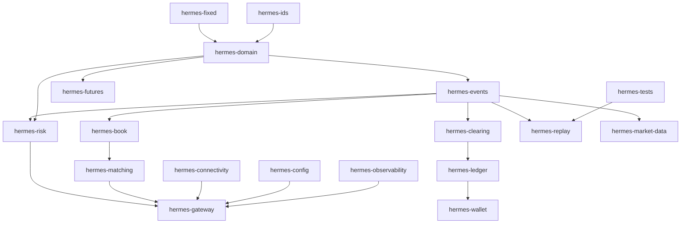

# HIH-001 Rust Workspace & Crate Architecture

## 1. Workspace purpose

The Rust workspace is the implementation boundary for HermesNet. It separates deterministic hot-path crates from cold-path adapters, keeps domain types shared and auditable, and makes replay equivalence possible from the first line of production implementation.

## 2. Cargo workspace layout

The future workspace should use a root `Cargo.toml` with `[workspace]`, `[workspace.package]`, `[workspace.dependencies]`, and explicit members under `crates/`. No production crate should be created until its contract is accepted.

## 3. Crate boundaries

Crate boundaries are ownership boundaries. A crate may expose contracts used by other crates, but it must not reach upward into orchestrators. Hot-path crates should be narrow and mostly synchronous.

## 4. Hot-path crates

Hot-path crates are `hermes-fixed`, `hermes-ids`, `hermes-domain`, `hermes-events`, `hermes-book`, `hermes-matching`, `hermes-risk`, `hermes-clearing`, and the deterministic subset of `hermes-replay`. They must avoid blocking I/O, async runtime dependency, database clients, unbounded channels, and steady-state heap allocation.

## 5. Cold-path crates

Cold-path crates are `hermes-gateway`, `hermes-connectivity`, `hermes-market-data`, `hermes-observability`, `hermes-config`, and deployment-facing binaries. They may use async runtimes and transport libraries but must translate into bounded deterministic commands before crossing into hot-path crates.

## 6. Shared domain crates

Shared domain crates define fixed values, IDs, instruments, sides, quantities, prices, account references, order commands, and immutable EngineEvents. They must be stable, versioned deliberately, and easy to fuzz.

## 7. Binary crates

Binary crates should be thin. They parse config, initialize observability, wire bounded queues, launch workers, and delegate business behavior to library crates. Business logic must not live in binaries.

## 8. Test crates

`hermes-tests` owns cross-crate integration fixtures, replay corpora, conformance scenarios, and deterministic simulation harnesses. Unit tests remain in each crate.

## 9. Benchmark crates

Benchmarks should live in crate-local `benches/` or a dedicated benchmark package once code exists. They must report throughput, p50/p95/p99 latency, allocations, event append latency, and replay speed.

## 10. Feature flags

Feature flags must be additive. Recommended flags: `serde`, `proptest`, `bench`, `std`, `sim`, `test-fixtures`, and transport-specific gateway flags. No flag may alter consensus-critical semantics.

## 11. Dependency policy

Dependencies require ownership review. Hot-path dependencies must be minimal, deterministic, audited, and version-pinned through workspace dependencies. Forbidden hot-path dependencies include DB clients, Kafka clients, HTTP clients, randomization without seeded control, time-zone libraries, and floating-point decimal libraries.

## 12. Error-handling strategy

Use typed error enums per crate. Hot-path errors should be small, copyable where practical, and non-allocating. Errors that become externally visible must map to EngineEvents or gateway rejection responses only after event append requirements are satisfied.

## 13. Fixed-point type strategy

All money, quantity, price, fee, margin, and settlement values use integer-backed fixed-point newtypes. The scale is part of the type contract. Arithmetic must define checked, saturating, or rejecting behavior explicitly. Floating point is forbidden in matching, risk, settlement, ledger, clearing, and replay.

## 14. ID type strategy

IDs are newtypes, not aliases. AccountId, OrderId, ClientOrderId, InstrumentId, BookId, EventId, Sequence, TradeId, ReservationId, and LedgerEntryId must have explicit serialization and display behavior. Parsing belongs at boundaries; core crates receive validated IDs.

## 15. Time type strategy

Core crates should use deterministic engine timestamps supplied by the sequencer or gateway boundary. Wall-clock reads are forbidden in matching and replay. Time values must be integer nanoseconds or a reviewed equivalent newtype.

## 16. Serialization strategy

Serialization is schema-controlled and feature-gated. EngineEvents require stable binary encoding for logs and optional human-readable encoding for tooling. Do not use serialization as an internal domain boundary substitute.

## 17. Logging/tracing strategy

Hot-path code emits structured counters or compact trace hooks only where allocation-free. Cold-path crates may use `tracing`. Logs are not the source of truth; EngineEvents are.

## 18. Configuration strategy

Configuration is parsed in `hermes-config`, validated into typed settings, and then passed to runtime construction. Hot-path crates receive concrete limits, scales, and capacities, not dynamic config maps.

## 19. Module ownership

Each module owns one invariant cluster. Public modules should be stable; internal helper modules can change. Cross-module calls must preserve explicit ordering: validate, reserve risk, match, append event, publish externally visible success.

## 20. Unsafe code policy

Default policy is `#![forbid(unsafe_code)]`. Any exception requires a written safety contract, benchmark justification, Miri or equivalent validation where possible, and review-gate approval.

## 21. Build profiles

Use release profiles for benchmark and production-like tests. Suggested profiles: `dev` with debug assertions, `test` deterministic, `bench` optimized with symbols, and `release` optimized with panic strategy reviewed. Do not allow profile differences to alter arithmetic semantics.

## 22. CI build matrix

CI should run formatting, clippy with denied warnings for core crates, unit tests, property tests, replay tests, docs build, feature matrix checks, MSRV checks, and benchmark smoke tests. Full benchmark suites may run nightly or on demand.

## 23. Suggested folder tree

```text
crates/
  hermes-fixed/
  hermes-ids/
  hermes-domain/
  hermes-events/
  hermes-book/
  hermes-matching/
  hermes-risk/
  hermes-clearing/
  hermes-wallet/
  hermes-ledger/
  hermes-futures/
  hermes-market-data/
  hermes-gateway/
  hermes-connectivity/
  hermes-replay/
  hermes-observability/
  hermes-config/
  hermes-tests/
```

## 24. Crate dependency graph




## 25. Implementation roadmap

1. Implement fixed types and arithmetic tests.
2. Implement ID newtypes and serialization tests.
3. Implement shared domain model.
4. Implement immutable EngineEvents and hash inputs.
5. Implement book state containers.
6. Implement matching logic with no steady-state heap allocation.
7. Implement risk reservations.
8. Implement clearing and event log append contracts.
9. Implement deterministic replay.
10. Implement gateway boundaries.
11. Implement wallet and ledger flows.
12. Implement futures and liquidation flows.
13. Implement market data projections.
14. Implement integration tests and benchmarks.

## 26. Codex implementation contracts

Codex tasks should name the target crate, files to create, forbidden dependencies, required tests, and expected invariants. Codex must not add production code outside the requested crate, must not modify HES for implementation convenience, and must preserve HES principles.

## Recommended `Cargo.toml` workspace outline

```toml
[workspace]
members = ["crates/*"]
resolver = "2"

[workspace.package]
edition = "2021"
license = "Proprietary"
rust-version = "1.80"

[workspace.dependencies]
serde = { version = "1", default-features = false, features = ["derive"] }
thiserror = "1"
tracing = "0.1"
proptest = "1"
criterion = "0.5"
```

## Crate contracts

### `hermes-domain`

- **Purpose:** Provide the `hermes-domain` responsibility in the HermesNet workspace while preserving deterministic boundaries.
- **Owns:** Public types, traits, and tests directly named by this crate's domain.
- **Must not own:** Cross-crate orchestration, network transport, persistent database adapters, or unrelated product policy.
- **Public modules:** `types`, `error`, `traits`, and domain-specific modules chosen during implementation.
- **Dependencies allowed:** Foundational crates below it in the dependency graph; `serde` only behind an explicit serialization feature where needed.
- **Dependencies forbidden:** Databases, Kafka clients, async runtimes, floating-point math crates, global allocator tricks, and any crate that makes hot-path behavior nondeterministic.
- **Core traits:** A small trait surface for deterministic operations; object safety is optional and should not force allocation.
- **Key structs/enums:** Newtype identifiers, fixed-point values, command/event structs, and error enums relevant to `hermes-domain`.
- **Test responsibility:** Unit tests for invariants and property tests for deterministic behavior.
- **Benchmark responsibility:** Steady-state latency, throughput, and allocation checks.
### `hermes-fixed`

- **Purpose:** Provide the `hermes-fixed` responsibility in the HermesNet workspace while preserving deterministic boundaries.
- **Owns:** Public types, traits, and tests directly named by this crate's domain.
- **Must not own:** Cross-crate orchestration, network transport, persistent database adapters, or unrelated product policy.
- **Public modules:** `types`, `error`, `traits`, and domain-specific modules chosen during implementation.
- **Dependencies allowed:** Foundational crates below it in the dependency graph; `serde` only behind an explicit serialization feature where needed.
- **Dependencies forbidden:** Databases, Kafka clients, async runtimes, floating-point math crates, global allocator tricks, and any crate that makes hot-path behavior nondeterministic.
- **Core traits:** A small trait surface for deterministic operations; object safety is optional and should not force allocation.
- **Key structs/enums:** Newtype identifiers, fixed-point values, command/event structs, and error enums relevant to `hermes-fixed`.
- **Test responsibility:** Unit tests for invariants and property tests for deterministic behavior.
- **Benchmark responsibility:** Steady-state latency, throughput, and allocation checks.
### `hermes-ids`

- **Purpose:** Provide the `hermes-ids` responsibility in the HermesNet workspace while preserving deterministic boundaries.
- **Owns:** Public types, traits, and tests directly named by this crate's domain.
- **Must not own:** Cross-crate orchestration, network transport, persistent database adapters, or unrelated product policy.
- **Public modules:** `types`, `error`, `traits`, and domain-specific modules chosen during implementation.
- **Dependencies allowed:** Foundational crates below it in the dependency graph; `serde` only behind an explicit serialization feature where needed.
- **Dependencies forbidden:** Databases, Kafka clients, async runtimes, floating-point math crates, global allocator tricks, and any crate that makes hot-path behavior nondeterministic.
- **Core traits:** A small trait surface for deterministic operations; object safety is optional and should not force allocation.
- **Key structs/enums:** Newtype identifiers, fixed-point values, command/event structs, and error enums relevant to `hermes-ids`.
- **Test responsibility:** Unit tests for invariants and property tests for deterministic behavior.
- **Benchmark responsibility:** Steady-state latency, throughput, and allocation checks.
### `hermes-events`

- **Purpose:** Provide the `hermes-events` responsibility in the HermesNet workspace while preserving deterministic boundaries.
- **Owns:** Public types, traits, and tests directly named by this crate's domain.
- **Must not own:** Cross-crate orchestration, network transport, persistent database adapters, or unrelated product policy.
- **Public modules:** `types`, `error`, `traits`, and domain-specific modules chosen during implementation.
- **Dependencies allowed:** Foundational crates below it in the dependency graph; `serde` only behind an explicit serialization feature where needed.
- **Dependencies forbidden:** Databases, Kafka clients, async runtimes, floating-point math crates, global allocator tricks, and any crate that makes hot-path behavior nondeterministic.
- **Core traits:** A small trait surface for deterministic operations; object safety is optional and should not force allocation.
- **Key structs/enums:** Newtype identifiers, fixed-point values, command/event structs, and error enums relevant to `hermes-events`.
- **Test responsibility:** Unit tests for invariants and property tests for deterministic behavior.
- **Benchmark responsibility:** Steady-state latency, throughput, and allocation checks.
### `hermes-book`

- **Purpose:** Provide the `hermes-book` responsibility in the HermesNet workspace while preserving deterministic boundaries.
- **Owns:** Public types, traits, and tests directly named by this crate's domain.
- **Must not own:** Cross-crate orchestration, network transport, persistent database adapters, or unrelated product policy.
- **Public modules:** `types`, `error`, `traits`, and domain-specific modules chosen during implementation.
- **Dependencies allowed:** Foundational crates below it in the dependency graph; `serde` only behind an explicit serialization feature where needed.
- **Dependencies forbidden:** Databases, Kafka clients, async runtimes, floating-point math crates, global allocator tricks, and any crate that makes hot-path behavior nondeterministic.
- **Core traits:** A small trait surface for deterministic operations; object safety is optional and should not force allocation.
- **Key structs/enums:** Newtype identifiers, fixed-point values, command/event structs, and error enums relevant to `hermes-book`.
- **Test responsibility:** Unit tests for invariants and property tests for deterministic behavior.
- **Benchmark responsibility:** Steady-state latency, throughput, and allocation checks.
### `hermes-matching`

- **Purpose:** Provide the `hermes-matching` responsibility in the HermesNet workspace while preserving deterministic boundaries.
- **Owns:** Public types, traits, and tests directly named by this crate's domain.
- **Must not own:** Cross-crate orchestration, network transport, persistent database adapters, or unrelated product policy.
- **Public modules:** `types`, `error`, `traits`, and domain-specific modules chosen during implementation.
- **Dependencies allowed:** Foundational crates below it in the dependency graph; `serde` only behind an explicit serialization feature where needed.
- **Dependencies forbidden:** Databases, Kafka clients, async runtimes, floating-point math crates, global allocator tricks, and any crate that makes hot-path behavior nondeterministic.
- **Core traits:** A small trait surface for deterministic operations; object safety is optional and should not force allocation.
- **Key structs/enums:** Newtype identifiers, fixed-point values, command/event structs, and error enums relevant to `hermes-matching`.
- **Test responsibility:** Unit tests for invariants and property tests for deterministic behavior.
- **Benchmark responsibility:** Steady-state latency, throughput, and allocation checks.
### `hermes-risk`

- **Purpose:** Provide the `hermes-risk` responsibility in the HermesNet workspace while preserving deterministic boundaries.
- **Owns:** Public types, traits, and tests directly named by this crate's domain.
- **Must not own:** Cross-crate orchestration, network transport, persistent database adapters, or unrelated product policy.
- **Public modules:** `types`, `error`, `traits`, and domain-specific modules chosen during implementation.
- **Dependencies allowed:** Foundational crates below it in the dependency graph; `serde` only behind an explicit serialization feature where needed.
- **Dependencies forbidden:** Databases, Kafka clients, async runtimes, floating-point math crates, global allocator tricks, and any crate that makes hot-path behavior nondeterministic.
- **Core traits:** A small trait surface for deterministic operations; object safety is optional and should not force allocation.
- **Key structs/enums:** Newtype identifiers, fixed-point values, command/event structs, and error enums relevant to `hermes-risk`.
- **Test responsibility:** Unit tests for invariants and property tests for deterministic behavior.
- **Benchmark responsibility:** Steady-state latency, throughput, and allocation checks.
### `hermes-clearing`

- **Purpose:** Provide the `hermes-clearing` responsibility in the HermesNet workspace while preserving deterministic boundaries.
- **Owns:** Public types, traits, and tests directly named by this crate's domain.
- **Must not own:** Cross-crate orchestration, network transport, persistent database adapters, or unrelated product policy.
- **Public modules:** `types`, `error`, `traits`, and domain-specific modules chosen during implementation.
- **Dependencies allowed:** Foundational crates below it in the dependency graph; `serde` only behind an explicit serialization feature where needed.
- **Dependencies forbidden:** Databases, Kafka clients, async runtimes, floating-point math crates, global allocator tricks, and any crate that makes hot-path behavior nondeterministic.
- **Core traits:** A small trait surface for deterministic operations; object safety is optional and should not force allocation.
- **Key structs/enums:** Newtype identifiers, fixed-point values, command/event structs, and error enums relevant to `hermes-clearing`.
- **Test responsibility:** Unit tests for invariants and property tests for deterministic behavior.
- **Benchmark responsibility:** Steady-state latency, throughput, and allocation checks.
### `hermes-wallet`

- **Purpose:** Provide the `hermes-wallet` responsibility in the HermesNet workspace while preserving deterministic boundaries.
- **Owns:** Public types, traits, and tests directly named by this crate's domain.
- **Must not own:** Cross-crate orchestration, network transport, persistent database adapters, or unrelated product policy.
- **Public modules:** `types`, `error`, `traits`, and domain-specific modules chosen during implementation.
- **Dependencies allowed:** Foundational crates below it in the dependency graph; `serde` only behind an explicit serialization feature where needed.
- **Dependencies forbidden:** Databases, Kafka clients, async runtimes, floating-point math crates, global allocator tricks, and any crate that makes hot-path behavior nondeterministic.
- **Core traits:** A small trait surface for deterministic operations; object safety is optional and should not force allocation.
- **Key structs/enums:** Newtype identifiers, fixed-point values, command/event structs, and error enums relevant to `hermes-wallet`.
- **Test responsibility:** Unit tests for invariants and property tests for deterministic behavior.
- **Benchmark responsibility:** Cold-path throughput and integration overhead where relevant.
### `hermes-ledger`

- **Purpose:** Provide the `hermes-ledger` responsibility in the HermesNet workspace while preserving deterministic boundaries.
- **Owns:** Public types, traits, and tests directly named by this crate's domain.
- **Must not own:** Cross-crate orchestration, network transport, persistent database adapters, or unrelated product policy.
- **Public modules:** `types`, `error`, `traits`, and domain-specific modules chosen during implementation.
- **Dependencies allowed:** Foundational crates below it in the dependency graph; `serde` only behind an explicit serialization feature where needed.
- **Dependencies forbidden:** Databases, Kafka clients, async runtimes, floating-point math crates, global allocator tricks, and any crate that makes hot-path behavior nondeterministic.
- **Core traits:** A small trait surface for deterministic operations; object safety is optional and should not force allocation.
- **Key structs/enums:** Newtype identifiers, fixed-point values, command/event structs, and error enums relevant to `hermes-ledger`.
- **Test responsibility:** Unit tests for invariants and property tests for deterministic behavior.
- **Benchmark responsibility:** Cold-path throughput and integration overhead where relevant.
### `hermes-futures`

- **Purpose:** Provide the `hermes-futures` responsibility in the HermesNet workspace while preserving deterministic boundaries.
- **Owns:** Public types, traits, and tests directly named by this crate's domain.
- **Must not own:** Cross-crate orchestration, network transport, persistent database adapters, or unrelated product policy.
- **Public modules:** `types`, `error`, `traits`, and domain-specific modules chosen during implementation.
- **Dependencies allowed:** Foundational crates below it in the dependency graph; `serde` only behind an explicit serialization feature where needed.
- **Dependencies forbidden:** Databases, Kafka clients, async runtimes, floating-point math crates, global allocator tricks, and any crate that makes hot-path behavior nondeterministic.
- **Core traits:** A small trait surface for deterministic operations; object safety is optional and should not force allocation.
- **Key structs/enums:** Newtype identifiers, fixed-point values, command/event structs, and error enums relevant to `hermes-futures`.
- **Test responsibility:** Unit tests for invariants and property tests for deterministic behavior.
- **Benchmark responsibility:** Cold-path throughput and integration overhead where relevant.
### `hermes-market-data`

- **Purpose:** Provide the `hermes-market-data` responsibility in the HermesNet workspace while preserving deterministic boundaries.
- **Owns:** Public types, traits, and tests directly named by this crate's domain.
- **Must not own:** Cross-crate orchestration, network transport, persistent database adapters, or unrelated product policy.
- **Public modules:** `types`, `error`, `traits`, and domain-specific modules chosen during implementation.
- **Dependencies allowed:** Foundational crates below it in the dependency graph; `serde` only behind an explicit serialization feature where needed.
- **Dependencies forbidden:** Databases, Kafka clients, async runtimes, floating-point math crates, global allocator tricks, and any crate that makes hot-path behavior nondeterministic.
- **Core traits:** A small trait surface for deterministic operations; object safety is optional and should not force allocation.
- **Key structs/enums:** Newtype identifiers, fixed-point values, command/event structs, and error enums relevant to `hermes-market-data`.
- **Test responsibility:** Unit tests for invariants and property tests for deterministic behavior.
- **Benchmark responsibility:** Cold-path throughput and integration overhead where relevant.
### `hermes-gateway`

- **Purpose:** Provide the `hermes-gateway` responsibility in the HermesNet workspace while preserving deterministic boundaries.
- **Owns:** Public types, traits, and tests directly named by this crate's domain.
- **Must not own:** Cross-crate orchestration, network transport, persistent database adapters, or unrelated product policy.
- **Public modules:** `types`, `error`, `traits`, and domain-specific modules chosen during implementation.
- **Dependencies allowed:** Foundational crates below it in the dependency graph; `serde` only behind an explicit serialization feature where needed.
- **Dependencies forbidden:** Databases, Kafka clients, async runtimes, floating-point math crates, global allocator tricks, and any crate that makes hot-path behavior nondeterministic.
- **Core traits:** A small trait surface for deterministic operations; object safety is optional and should not force allocation.
- **Key structs/enums:** Newtype identifiers, fixed-point values, command/event structs, and error enums relevant to `hermes-gateway`.
- **Test responsibility:** Unit tests for invariants and property tests for deterministic behavior.
- **Benchmark responsibility:** Cold-path throughput and integration overhead where relevant.
### `hermes-connectivity`

- **Purpose:** Provide the `hermes-connectivity` responsibility in the HermesNet workspace while preserving deterministic boundaries.
- **Owns:** Public types, traits, and tests directly named by this crate's domain.
- **Must not own:** Cross-crate orchestration, network transport, persistent database adapters, or unrelated product policy.
- **Public modules:** `types`, `error`, `traits`, and domain-specific modules chosen during implementation.
- **Dependencies allowed:** Foundational crates below it in the dependency graph; `serde` only behind an explicit serialization feature where needed.
- **Dependencies forbidden:** Databases, Kafka clients, async runtimes, floating-point math crates, global allocator tricks, and any crate that makes hot-path behavior nondeterministic.
- **Core traits:** A small trait surface for deterministic operations; object safety is optional and should not force allocation.
- **Key structs/enums:** Newtype identifiers, fixed-point values, command/event structs, and error enums relevant to `hermes-connectivity`.
- **Test responsibility:** Unit tests for invariants and property tests for deterministic behavior.
- **Benchmark responsibility:** Cold-path throughput and integration overhead where relevant.
### `hermes-replay`

- **Purpose:** Provide the `hermes-replay` responsibility in the HermesNet workspace while preserving deterministic boundaries.
- **Owns:** Public types, traits, and tests directly named by this crate's domain.
- **Must not own:** Cross-crate orchestration, network transport, persistent database adapters, or unrelated product policy.
- **Public modules:** `types`, `error`, `traits`, and domain-specific modules chosen during implementation.
- **Dependencies allowed:** Foundational crates below it in the dependency graph; `serde` only behind an explicit serialization feature where needed.
- **Dependencies forbidden:** Databases, Kafka clients, async runtimes, floating-point math crates, global allocator tricks, and any crate that makes hot-path behavior nondeterministic.
- **Core traits:** A small trait surface for deterministic operations; object safety is optional and should not force allocation.
- **Key structs/enums:** Newtype identifiers, fixed-point values, command/event structs, and error enums relevant to `hermes-replay`.
- **Test responsibility:** Unit tests for invariants and property tests for deterministic behavior.
- **Benchmark responsibility:** Steady-state latency, throughput, and allocation checks.
### `hermes-observability`

- **Purpose:** Provide the `hermes-observability` responsibility in the HermesNet workspace while preserving deterministic boundaries.
- **Owns:** Public types, traits, and tests directly named by this crate's domain.
- **Must not own:** Cross-crate orchestration, network transport, persistent database adapters, or unrelated product policy.
- **Public modules:** `types`, `error`, `traits`, and domain-specific modules chosen during implementation.
- **Dependencies allowed:** Foundational crates below it in the dependency graph; `serde` only behind an explicit serialization feature where needed.
- **Dependencies forbidden:** Databases, Kafka clients, async runtimes, floating-point math crates, global allocator tricks, and any crate that makes hot-path behavior nondeterministic.
- **Core traits:** A small trait surface for deterministic operations; object safety is optional and should not force allocation.
- **Key structs/enums:** Newtype identifiers, fixed-point values, command/event structs, and error enums relevant to `hermes-observability`.
- **Test responsibility:** Unit tests for invariants and property tests for deterministic behavior.
- **Benchmark responsibility:** Cold-path throughput and integration overhead where relevant.
### `hermes-config`

- **Purpose:** Provide the `hermes-config` responsibility in the HermesNet workspace while preserving deterministic boundaries.
- **Owns:** Public types, traits, and tests directly named by this crate's domain.
- **Must not own:** Cross-crate orchestration, network transport, persistent database adapters, or unrelated product policy.
- **Public modules:** `types`, `error`, `traits`, and domain-specific modules chosen during implementation.
- **Dependencies allowed:** Foundational crates below it in the dependency graph; `serde` only behind an explicit serialization feature where needed.
- **Dependencies forbidden:** Databases, Kafka clients, async runtimes, floating-point math crates, global allocator tricks, and any crate that makes hot-path behavior nondeterministic.
- **Core traits:** A small trait surface for deterministic operations; object safety is optional and should not force allocation.
- **Key structs/enums:** Newtype identifiers, fixed-point values, command/event structs, and error enums relevant to `hermes-config`.
- **Test responsibility:** Unit tests for invariants and property tests for deterministic behavior.
- **Benchmark responsibility:** Cold-path throughput and integration overhead where relevant.
### `hermes-tests`

- **Purpose:** Provide the `hermes-tests` responsibility in the HermesNet workspace while preserving deterministic boundaries.
- **Owns:** Public types, traits, and tests directly named by this crate's domain.
- **Must not own:** Cross-crate orchestration, network transport, persistent database adapters, or unrelated product policy.
- **Public modules:** `types`, `error`, `traits`, and domain-specific modules chosen during implementation.
- **Dependencies allowed:** Foundational crates below it in the dependency graph; `serde` only behind an explicit serialization feature where needed.
- **Dependencies forbidden:** Databases, Kafka clients, async runtimes, floating-point math crates, global allocator tricks, and any crate that makes hot-path behavior nondeterministic.
- **Core traits:** A small trait surface for deterministic operations; object safety is optional and should not force allocation.
- **Key structs/enums:** Newtype identifiers, fixed-point values, command/event structs, and error enums relevant to `hermes-tests`.
- **Test responsibility:** Unit tests for invariants and property tests for deterministic behavior.
- **Benchmark responsibility:** Cold-path throughput and integration overhead where relevant.

