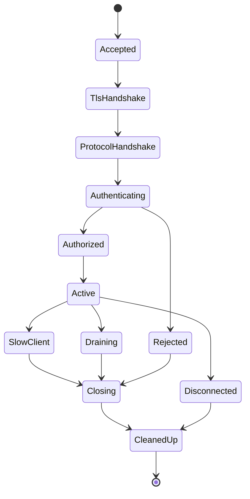
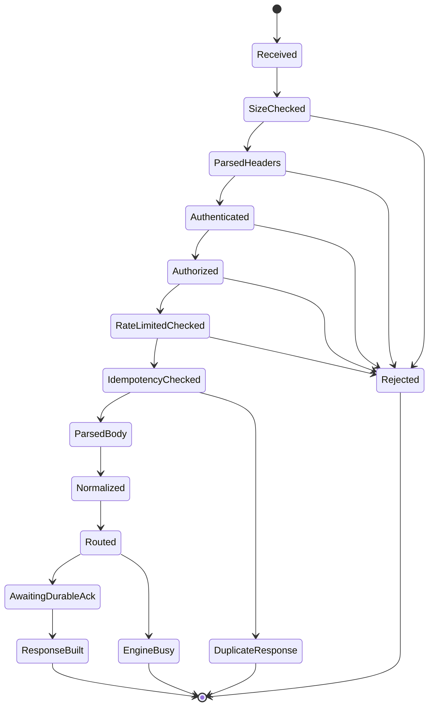
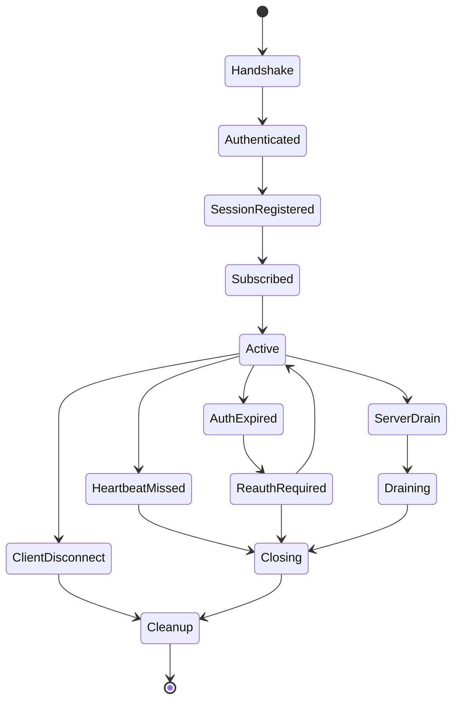
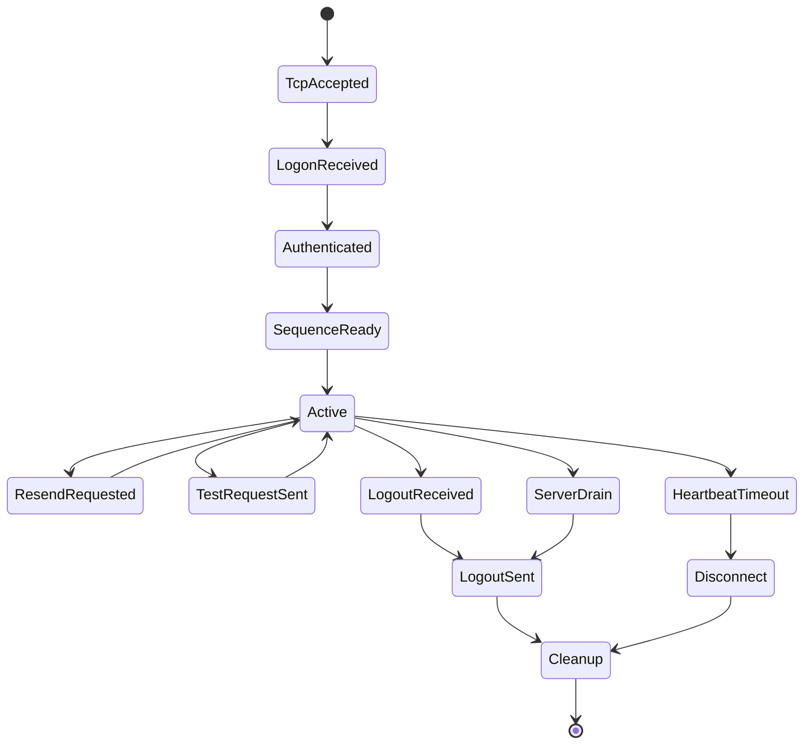
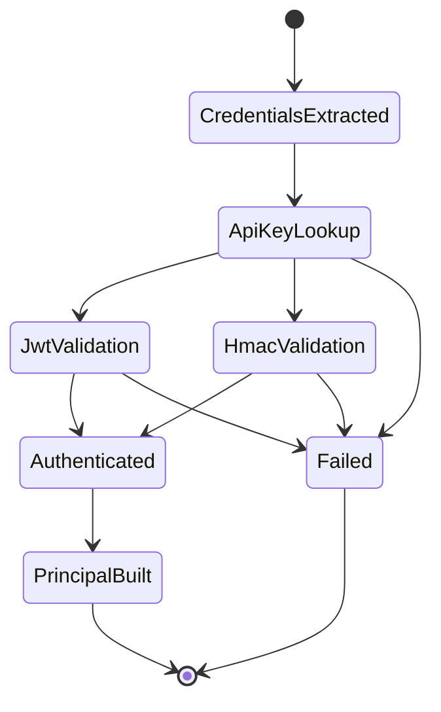
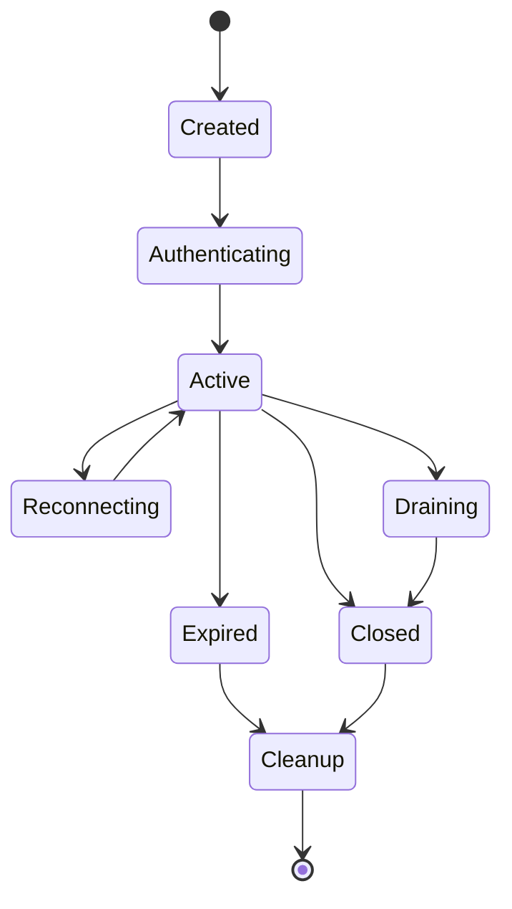

# HIH-002 Gateway Implementation

## 1. Purpose

This handbook defines the production implementation plan for the HermesNet Gateway. It is the authoritative implementation guide for building `hermes-gateway` and `hermes-connectivity` without guessing architecture, crate boundaries, runtime ownership, security flow, overload behavior, replay interaction, or test expectations.

The Gateway is the authenticated, rate-limited, observable ingress and private-egress layer for HermesNet. It terminates client protocols, validates identity and authority, normalizes requests into deterministic domain commands, submits commands to bounded router queues, maps Book Core and router outcomes into protocol responses, and publishes private execution reports derived from durable events.

## 2. Scope

### 2.1 In scope

- REST ingress for public and private HTTP APIs.
- WebSocket ingress and private stream egress.
- FIX session ingress and drop-copy/private report egress.
- OUCH ingress for low-latency order entry.
- SBE boundary definitions for binary command/report envelopes.
- API-key, JWT, and HMAC authentication.
- Authorization against account, subaccount, route, symbol, and operation permissions.
- Token-bucket and sliding-window rate limiting.
- Idempotency for order, cancel, replace, and client retry flows.
- Session registry, heartbeat, reconnect, connection draining, and graceful restart.
- Order request parsing, validation, and normalization.
- Router communication, book routing, backpressure, `ENGINE_BUSY`, and overload handling.
- Private stream and execution report publishing after durable event observation.
- Health, readiness, liveness, metrics, tracing, structured logging, and benchmark hooks.
- Gateway replay awareness and interpretation of replay-derived reports.
- Implementation sequence, Codex tasks, review checklist, and completion criteria.

### 2.2 Out of scope

- Production Rust source code in this handbook.
- HES changes.
- Book Core matching logic.
- Risk reservation internals beyond calling established services/contracts.
- Wallet, clearing, settlement, liquidation, and market-data internals.
- DOCX/PDF generation.

## 3. Responsibilities

The Gateway must:

1. Accept REST, WebSocket, FIX, OUCH, and SBE-framed requests at explicit network boundaries.
2. Authenticate every private request or session before authorization or command admission.
3. Authorize operations with deterministic policy inputs and stable rejection reasons.
4. Enforce per-IP, per-API-key, per-account, per-session, per-route, and optionally per-symbol limits.
5. Reject malformed, unauthorized, forbidden, duplicate-in-flight, rate-limited, overloaded, and stale requests before durable command admission.
6. Normalize protocol-specific request shapes into canonical `OrderEnvelope` and `NormalizedOrder` values.
7. Route normalized commands to the correct bounded router/book path.
8. Preserve event-before-success semantics: externally visible success must not precede the durable event/ack required by downstream modules.
9. Publish execution reports and private stream messages from durable event-derived data only.
10. Protect secrets, signatures, JWTs, and API-key material from logs, traces, metrics labels, and memory retention.
11. Handle backpressure predictably by returning `ENGINE_BUSY`, disconnecting slow clients, or draining connections.
12. Support graceful shutdown, restart, reconnect, session cleanup, and recovery without duplicate submissions.
13. Expose operational signals sufficient for SREs to diagnose overload, auth failures, slow clients, and router pressure.

## 4. Architecture overview

```text
client
  │
  ├── REST ───────┐
  ├── WebSocket ──┤
  ├── FIX ────────┤
  ├── OUCH ───────┤
  └── SBE ────────┘
        │
        ▼
hermes-connectivity
  protocol codecs, accept loops, TLS boundary, session IO, heartbeats
        │
        ▼
hermes-gateway
  authn → authz → rate limit → idempotency → parse → normalize → route
        │                                                   │
        │                                                   ▼
        │                                            bounded router client
        │                                                   │
        ▼                                                   ▼
private stream publisher ◄──── durable execution/report projections ◄── Book Core / Event Log
```

`hermes-connectivity` owns network/protocol mechanics. `hermes-gateway` owns business ingress semantics. Connectivity may parse protocol frames, but it must not decide account authority, risk semantics, book state, or durable success.

## 5. Crate boundary

### 5.1 `crates/hermes-gateway/`

Owns:

- Gateway configuration schema and validation.
- Authentication/authorization orchestration.
- API-key cache abstractions.
- JWT and HMAC verification contracts.
- Rate limiter and idempotency abstractions.
- Session registry semantics.
- Request context and response context.
- Order envelope and normalized order construction.
- Router client contract and error mapping.
- Private stream and execution report publishing contracts.
- Gateway metrics/tracing contracts.
- Shutdown, restart, readiness, and recovery orchestration.

Must not own:

- Socket accept loops.
- TLS implementation details.
- Book Core mutable state.
- Clearing or ledger mutation.
- Database-specific persistence code in hot-path modules.

### 5.2 `crates/hermes-connectivity/`

Owns:

- REST server adapter and request extraction.
- WebSocket handshake, frame IO, outbound queues, ping/pong, and close frames.
- FIX acceptor, sequence/session transport, logon/logout, heartbeat, resend handling at the protocol layer.
- OUCH session framing, login, heartbeat, and binary frame decoding.
- SBE encode/decode boundary wrappers and schema version negotiation.
- TLS binding, socket options, listener lifecycle, and connection draining.
- Protocol-specific conformance tests and codec benchmarks.

Must not own:

- Permission decisions.
- API-key secret loading policy.
- Rate-limit policy decisions beyond invoking gateway services.
- Idempotency terminal decisions.
- Direct Book Core calls except through `RouterClient` abstractions supplied by `hermes-gateway`.

## 6. Dependency graph

```text
hermes-connectivity
  ├── hermes-gateway
  ├── hermes-domain
  ├── hermes-events
  ├── hermes-fixed
  ├── hermes-ids
  └── external protocol crates behind adapters only

hermes-gateway
  ├── hermes-domain
  ├── hermes-events
  ├── hermes-fixed
  ├── hermes-ids
  ├── hermes-risk contracts only
  └── hermes-observability contracts only
```

Forbidden dependency directions:

- `hermes-domain` must not depend on `hermes-gateway` or `hermes-connectivity`.
- Book Core must not depend on connectivity adapters.
- Hot-path normalization must not depend on SQL, HTTP clients, dynamic scripting, unbounded channel implementations, or wall-clock reads except through injected `Clock`/`TimeSource` traits.

## 7. File layout

```text
crates/
  hermes-gateway/
    Cargo.toml
    src/
      lib.rs
      config.rs
      server.rs
      rest.rs
      websocket.rs
      fix.rs
      ouch.rs
      sbe.rs
      router.rs
      authentication.rs
      authorization.rs
      apikey.rs
      jwt.rs
      hmac.rs
      ratelimit.rs
      idempotency.rs
      session.rs
      heartbeat.rs
      private_stream.rs
      execution_reports.rs
      metrics.rs
      tracing.rs
      shutdown.rs
      error.rs
    tests/
      rest_order_flow.rs
      websocket_order_flow.rs
      fix_order_flow.rs
      ouch_order_flow.rs
      auth_security.rs
      overload.rs
      restart_recovery.rs
    benches/
      rest_latency.rs
      websocket_latency.rs
      fix_latency.rs
      auth_latency.rs
      gateway_throughput.rs

  hermes-connectivity/
    Cargo.toml
    src/
      lib.rs
      config.rs
      rest.rs
      websocket.rs
      fix.rs
      ouch.rs
      sbe.rs
      tls.rs
      framing.rs
      heartbeat.rs
      drain.rs
      metrics.rs
      error.rs
    tests/
      protocol_conformance.rs
      reconnect.rs
      codec_roundtrip.rs
    benches/
      codec_decode.rs
      websocket_fanout.rs
      fix_session.rs
```

## 8. Module contracts

Every module below must expose narrow public interfaces, prefer immutable input structs, return typed `GatewayResult<T>`, avoid panics on malformed client input, and include unit tests for all externally observable rejection paths.

| Module | Purpose | Public interfaces | Allowed dependencies | Forbidden dependencies | Testing requirements | Benchmark requirements |
|---|---|---|---|---|---|---|
| `config.rs` | Parse and validate gateway/connectivity configuration. | `GatewayConfig`, `ProtocolConfig`, `RateLimitConfig`, `validate()`. | serde config loaders, IDs, duration types. | Secret literals, network IO in validation. | invalid config, bounds, defaults. | config validation time for large route tables. |
| `server.rs` | Compose services and lifecycle. | `GatewayServer`, `GatewayServerHandle`, `GatewayServer::start/drain/shutdown`. | Tokio runtime handles, module traits. | Book internals, SQL in accept path. | start/stop/drain, dependency wiring. | startup and drain latency. |
| `rest.rs` | REST route semantics and response mapping. | `RestGateway`, route handlers, `RestRequestContext`. | auth, rate limit, idempotency, router. | Direct socket/TLS details, FIX codecs. | place/cancel/replace/errors. | p50/p99 signed order latency. |
| `websocket.rs` | WebSocket session semantics. | `WebSocketGateway`, subscription handlers. | session, heartbeat, private stream. | Blocking DB, unbounded queues. | reconnect, slow client, auth expiry. | fanout and per-message latency. |
| `fix.rs` | FIX business mapping. | `FixGateway`, FIX command mapper. | domain, auth, session, router. | REST JSON-specific logic. | logon, sequence, NewOrderSingle, cancel. | FIX order-entry latency. |
| `ouch.rs` | OUCH business mapping. | `OuchGateway`, OUCH command mapper. | domain, auth, router. | JSON parsing, floating point. | binary decode failures, cancel/replace. | decode+normalize latency. |
| `sbe.rs` | SBE binary envelope boundary. | `SbeCodec`, `SbeGatewayBoundary`. | SBE generated codec adapter, domain. | Business authorization. | schema version, unknown template. | encode/decode throughput. |
| `router.rs` | Bounded router admission and ack handling. | `RouterClient`, `BookRoute`, `RouterAck`. | channels, IDs, domain commands. | Unbounded queues, book mutable state. | queue full, timeout, ack mapping. | admission latency, busy rejection rate. |
| `authentication.rs` | Orchestrate auth schemes. | `AuthenticationService`, `AuthenticatedUser`. | API key, JWT, HMAC traits. | Authorization policy decisions. | missing/invalid/expired credentials. | auth cache hit latency. |
| `authorization.rs` | Enforce permissions. | `AuthorizationService`, `Permission`, `AuthorizationDecision`. | authenticated user, domain symbols. | Signature verification. | account/symbol/route denial. | policy lookup latency. |
| `apikey.rs` | API-key records and cache. | `ApiKeyStore`, `ApiKey`, `ApiKeyCache`. | secret loader trait, TTL cache. | Logging secrets, hot-path SQL. | cache expiry/revocation. | lookup hit/miss latency. |
| `jwt.rs` | JWT validation. | `JwtVerifier`, `JwtClaims`. | crypto/JWK adapter, clock trait. | API-key HMAC secret use. | issuer/audience/expiry/kid. | verification latency. |
| `hmac.rs` | Request signature verification. | `HmacVerifier`, `CanonicalRequest`. | constant-time compare, hash crate. | Non-canonical JSON reserialization. | canonical vectors, timestamp skew. | signing verify latency. |
| `ratelimit.rs` | Token bucket and sliding window. | `RateLimiter`, `RateLimitDecision`. | clock trait, atomics/shards. | Blocking persistence. | refill, burst, concurrency. | millions decisions/sec target. |
| `idempotency.rs` | Retry safety and duplicate suppression. | `IdempotencyStore`, `IdempotencyTicket`. | bounded map, durable optional backend. | Non-atomic check-then-set. | races, terminal replay. | begin/complete latency. |
| `session.rs` | Session registry. | `SessionRegistry`, `GatewaySession`, `SessionState`. | concurrent map, IDs, heartbeat. | Book mutable state. | insert/remove/reconnect. | connection scalability. |
| `heartbeat.rs` | Heartbeat policies. | `HeartbeatService`, timers. | clock/timer, session. | Business parsing. | missed heartbeat disconnect. | timer scalability. |
| `private_stream.rs` | Private stream fanout. | `PrivateStreamPublisher`. | session registry, bounded outbox. | Publishing before durable events. | ordering, slow clients. | fanout throughput. |
| `execution_reports.rs` | Execution report projection/publication. | `ExecutionReportPublisher`, mapper. | events, domain IDs. | Matching calculations. | event-to-report mapping. | report build latency. |
| `metrics.rs` | Gateway metric recording. | `GatewayMetrics`. | metrics facade. | Secrets/cardinality explosions. | labels, counters, histograms. | low overhead. |
| `tracing.rs` | Trace/span contracts. | `GatewayTracing`, span builders. | tracing facade, request IDs. | Secret fields. | field allowlist. | span creation overhead. |
| `shutdown.rs` | Drain, graceful restart, stop. | `ShutdownCoordinator`. | server/session/router traits. | Abrupt task abort in normal path. | drain deadlines, readiness flips. | drain time under load. |
| `error.rs` | Stable error taxonomy. | `GatewayError`, protocol mappers. | domain error types. | Stringly typed matching. | all mappings and redaction. | mapping overhead negligible. |

## 9. Runtime model and Tokio tasks

The gateway runtime uses bounded tasks and explicit ownership:

- Listener tasks accept connections and hand them to protocol session tasks.
- REST request tasks are short-lived and must hold no locks across router awaits.
- WebSocket/FIX/OUCH sessions have an inbound task, outbound writer task, heartbeat task, and session supervisor.
- Private stream fanout reads durable report projections and enqueues into bounded per-session outboxes.
- Router client tasks maintain bounded per-book queues and await durable acks with deadlines.
- Shutdown coordinator flips readiness, stops new admission, drains in-flight work, closes idle sessions, and force-closes after deadline.

No task may create unbounded channels for client input, router admission, execution reports, or outbound session messages.

## 10. Connection lifecycle



Lifecycle rules:

- `Accepted` allocates only bounded per-connection state.
- `Authenticating` must complete before private route/session activation.
- `Active` requests may be admitted only while readiness is true and overload thresholds permit.
- `Draining` refuses new private commands and allows in-flight durable acknowledgements until deadline.
- `CleanedUp` removes session registry entries, subscriptions, idempotency in-flight tickets, and rate-limit session leases.

## 11. REST request lifecycle



REST must respond with stable JSON error bodies, stable HTTP status mapping, and `request_id`. Private order success requires downstream durable acknowledgement. `ENGINE_BUSY` means no durable order event was created by the gateway submission attempt.

## 12. WebSocket lifecycle



WebSocket sessions must use bounded inbound and outbound queues. Slow private stream consumers are disconnected after policy-defined queue pressure; reports are not silently dropped unless the protocol explicitly supports gap detection and recovery.

## 13. FIX session lifecycle



FIX protocol sequence handling belongs to connectivity. Business message authorization, normalization, idempotency, and router submission belong to gateway.

## 14. Authentication lifecycle



Authentication must be deterministic for the same credential record, request canonicalization, timestamp input, and key set version. Time-window decisions use injected time sources so tests and replay interpretation can pin time.

## 15. Session lifecycle



## 16. Public trait contracts

Rust-style signatures below are contracts, not production source.

### 16.1 `GatewayServer`

Responsibilities: start protocol adapters, expose health, coordinate readiness, drain connections, and stop background tasks.

```rust
trait GatewayServer {
    fn start(&self) -> GatewayResult<GatewayServerHandle>;
    fn readiness(&self) -> GatewayResult<ReadinessState>;
    fn liveness(&self) -> GatewayResult<LivenessState>;
    fn drain(&self, deadline: Instant) -> GatewayResult<()>;
    fn shutdown(&self, deadline: Instant) -> GatewayResult<()>;
}
```

Ownership: owns service graph through `Arc` handles and cancellation tokens. Error behavior: startup failures return typed configuration, bind, TLS, or dependency errors. Performance: health checks must be non-blocking and O(1). Testing: start/stop, readiness flip, drain deadline, task leak detection.

### 16.2 `RestGateway`

```rust
trait RestGateway {
    async fn handle_public(&self, ctx: RequestContext, req: RestRequest) -> GatewayResult<GatewayResponse>;
    async fn handle_private(&self, ctx: RequestContext, req: RestRequest) -> GatewayResult<GatewayResponse>;
    async fn submit_order(&self, ctx: RequestContext, req: RestOrderRequest) -> GatewayResult<GatewayResponse>;
    async fn cancel_order(&self, ctx: RequestContext, req: RestCancelRequest) -> GatewayResult<GatewayResponse>;
    async fn replace_order(&self, ctx: RequestContext, req: RestReplaceRequest) -> GatewayResult<GatewayResponse>;
}
```

Determinism: canonical request body and idempotency key determine retry result. Performance: no heap-heavy reserialization in hot signature path. Testing: all routes, malformed JSON, duplicate retry, `ENGINE_BUSY`.

### 16.3 `WebSocketGateway`

```rust
trait WebSocketGateway {
    async fn open_session(&self, handshake: WsHandshake) -> GatewayResult<SessionId>;
    async fn handle_frame(&self, session_id: SessionId, frame: WsFrame) -> GatewayResult<()>;
    async fn subscribe_private(&self, session_id: SessionId, scope: PrivateScope) -> GatewayResult<()>;
    async fn close_session(&self, session_id: SessionId, reason: CloseReason) -> GatewayResult<()>;
}
```

Ownership: session registry owns session state; connectivity owns socket. Error behavior: malformed frames return protocol reject or close according to policy. Testing: ping/pong, auth expiry, reconnect, slow-client eviction.

### 16.4 `FixGateway`

```rust
trait FixGateway {
    async fn on_logon(&self, msg: FixLogon) -> GatewayResult<SessionId>;
    async fn on_business_message(&self, session_id: SessionId, msg: FixMessage) -> GatewayResult<Vec<FixMessage>>;
    async fn on_logout(&self, session_id: SessionId) -> GatewayResult<()>;
}
```

FIX gateway must preserve protocol sequence behavior through connectivity while mapping business rejects to stable FIX reject/execution-report forms.

### 16.5 `OuchGateway`

```rust
trait OuchGateway {
    async fn on_login(&self, login: OuchLogin) -> GatewayResult<SessionId>;
    async fn on_packet(&self, session_id: SessionId, packet: OuchPacket) -> GatewayResult<OuchResponse>;
    async fn on_disconnect(&self, session_id: SessionId) -> GatewayResult<()>;
}
```

OUCH path is optimized for low latency; avoid JSON, dynamic maps, and unnecessary allocation.

### 16.6 `RouterClient`

```rust
trait RouterClient {
    async fn submit(&self, route: BookRoute, order: NormalizedOrder, ctx: RequestContext) -> GatewayResult<RouterAck>;
    fn try_admit(&self, route: BookRoute) -> GatewayResult<AdmissionPermit>;
    fn queue_depth(&self, route: BookRoute) -> usize;
}
```

Error behavior: full bounded queue maps to `GatewayError::EngineBusy`; timeout maps according to whether durable admission is known. Testing: queue full, route missing, durable ack, unknown ack, cancellation.

### 16.7 Authentication and authorization traits

```rust
trait AuthenticationService {
    async fn authenticate(&self, ctx: &RequestContext, credentials: Credentials) -> GatewayResult<AuthenticatedUser>;
}

trait AuthorizationService {
    fn authorize(&self, user: &AuthenticatedUser, action: GatewayAction, resource: ResourceRef) -> GatewayResult<AuthorizationDecision>;
}

trait ApiKeyStore {
    async fn get_api_key(&self, key_id: ApiKeyId) -> GatewayResult<Option<ApiKey>>;
    async fn mark_revoked(&self, key_id: ApiKeyId) -> GatewayResult<()>;
}

trait JwtVerifier {
    fn verify_jwt(&self, token: &str, expected: JwtExpected) -> GatewayResult<JwtClaims>;
}

trait HmacVerifier {
    fn verify_hmac(&self, req: &CanonicalRequest, api_key: &ApiKey) -> GatewayResult<()>;
}
```

Expect constant-time signature comparison, no secret logging, bounded cache lookups, and deterministic error classes (`Unauthorized` vs `BadSignature` vs `ClockSkew`).

### 16.8 Rate, session, stream, health, metrics, tracing

```rust
trait RateLimiter { fn check(&self, key: RateLimitKey, cost: u32, now: Timestamp) -> GatewayResult<RateLimitDecision>; }
trait SessionRegistry { fn insert(&self, session: GatewaySession) -> GatewayResult<()>; fn get(&self, id: SessionId) -> Option<GatewaySession>; fn remove(&self, id: SessionId) -> GatewayResult<()>; }
trait PrivateStreamPublisher { async fn publish(&self, report: PrivateReport) -> GatewayResult<()>; }
trait ExecutionReportPublisher { async fn publish_execution_report(&self, event_ref: EventRef) -> GatewayResult<()>; }
trait HeartbeatService { fn observe(&self, session_id: SessionId, heartbeat: HeartbeatKind) -> GatewayResult<()>; fn expired(&self, now: Timestamp) -> Vec<SessionId>; }
trait HealthService { fn readiness(&self) -> ReadinessState; fn liveness(&self) -> LivenessState; }
trait GatewayMetrics { fn record_request(&self, route: RouteName, outcome: Outcome, latency: Duration); fn record_engine_busy(&self, route: RouteName); }
trait GatewayTracing { fn request_span(&self, ctx: &RequestContext) -> TraceSpan; fn record_error(&self, span: &TraceSpan, err: &GatewayError); }
```

Performance expectations: rate-limit decisions should be O(1); session lookup should be O(1) average; metrics/tracing must not allocate large strings in hot loops or use unbounded labels.

## 17. Core structs

- `GatewayConfig`: validated listen addresses, protocol toggles, auth settings, rate limits, queue sizes, deadlines, heartbeat intervals, health thresholds, metrics/tracing settings, and secret references.
- `GatewayServer`: composition root containing protocol adapters, auth services, limiter, idempotency store, router clients, session registry, private stream publisher, metrics, tracing, and shutdown coordinator.
- `GatewaySession`: session ID, authenticated user, protocol, state, subscriptions, connection metadata, heartbeat state, bounded outbox handle, and created/last-active timestamps.
- `GatewayConnection`: transport-level connection ID, remote address, protocol, TLS identity, connection state, drain flag, and task handles.
- `ApiKey`: key ID, account scope, permissions, HMAC secret reference/material wrapper, status, expiry, allowed IPs, and cache version.
- `AuthenticatedUser`: subject, account IDs, roles, permissions, auth scheme, key ID or JWT ID, auth time, expiry, and policy version.
- `OrderEnvelope`: protocol-neutral incoming order with request ID, account, symbol, side, type, quantities, price constraints, time-in-force, client order ID, idempotency key, and raw protocol metadata.
- `NormalizedOrder`: validated fixed-point, domain-ready order command with book route, deterministic IDs, account/subaccount, side, quantity, price, flags, and audit metadata.
- `GatewayResponse`: success, reject, duplicate, pending, or busy response with protocol mapping data and correlation IDs.
- `GatewayMetrics`: counters, gauges, histograms, and metric-label policy for gateway paths.
- `GatewayError`: stable error enum with redaction-safe display and protocol mapping.
- `ConnectionState`: `Accepted`, `Handshaking`, `Authenticating`, `Active`, `Draining`, `Closing`, `Closed`.
- `RateLimitDecision`: allowed/denied, remaining tokens, retry-after, bucket key, policy version.
- `SessionState`: `Created`, `Authenticating`, `Active`, `ReauthRequired`, `Draining`, `Expired`, `Closed`.
- `RequestContext`: request ID, trace ID, connection ID, protocol, route, remote address, received timestamp, body size, auth hints, and optional session ID.
- `ResponseContext`: request ID, route, outcome, error code, latency, durable event reference if any, and retry metadata.

## 18. Configuration

`GatewayConfig` must validate:

- REST bind address, max body bytes, header limits, timeout, route enablement.
- WebSocket bind address, max frame bytes, inbound/outbound queue sizes, heartbeat interval, missed heartbeat limit, max subscriptions.
- FIX/OUCH listener addresses, comp IDs/session IDs, heartbeat intervals, resend policy, sequence persistence adapter reference.
- SBE schema ID/version, compatibility policy, max message bytes.
- HMAC timestamp window, nonce policy, canonicalization version.
- JWT issuers, audiences, JWK cache TTL, accepted algorithms, clock skew.
- API-key cache TTL, negative cache TTL, revocation refresh interval.
- Rate-limit buckets by route/key/account/IP/session with burst and sustained values.
- Idempotency TTL, in-flight TTL, terminal-result TTL, max entries.
- Router queue sizes, ack deadline, busy thresholds, route map.
- Private stream queue sizes, slow-client threshold, replay gap policy.
- Shutdown drain deadline, readiness flip behavior, force-close deadline.
- Metrics/tracing enablement, sampling policy, label allowlist.

Secrets are referenced by secret IDs or loader paths, never embedded directly in config values committed to source control.

## 19. Authentication flow

1. Extract credentials from headers, FIX logon, OUCH login, WebSocket query/header, or SBE envelope.
2. Identify scheme: API key + HMAC, JWT bearer, session resume token, or protocol logon credential.
3. Load API key/JWK/session record through bounded cache.
4. Verify expiry, status, allowed IP/source, and credential-specific cryptographic proof.
5. Build `AuthenticatedUser` with permissions and policy version.
6. Attach auth context to request/session and continue to authorization.

## 20. Authorization flow

Authorization checks must include:

- Account/subaccount membership.
- Route/action permission (`orders:create`, `orders:cancel`, `orders:replace`, `stream:private`, `fix:logon`, `ouch:order`).
- Symbol/product permission.
- Trading status restrictions and account mode.
- IP/session constraints carried by API-key policy.
- Read-only vs trade-capable credential restrictions.

Authorization denial is a stable `Forbidden` error and must not leak whether a different account or symbol exists beyond approved error wording.

## 21. API-key cache

The cache must:

- Use bounded capacity and explicit TTL.
- Support revocation invalidation and policy-version changes.
- Negative-cache missing keys for a short TTL to protect backing stores.
- Store secret material in a redaction/zeroization-aware wrapper.
- Avoid per-request backing-store lookups on cache hit.
- Emit cache hit/miss/revocation metrics without key material labels.

## 22. JWT validation

JWT validation must verify:

- Token structure and supported algorithm.
- Signature against issuer JWK set and `kid`.
- Issuer, audience, subject, expiry, not-before, issued-at, and optional JWT ID.
- Required scopes and policy version.
- Clock skew bounded by config.

Rejected JWTs map to `Unauthorized`; expired JWTs may include stable token-expired code without echoing token content.

## 23. HMAC validation

HMAC uses canonical request signing:

- Method uppercased.
- Canonical path and query sorted by byte order.
- Required signed headers normalized by lowercase name and trimmed values.
- Raw body hash, not parsed/re-serialized JSON.
- Timestamp and nonce included in canonical payload.
- HMAC-SHA256 or approved algorithm configured per key version.
- Constant-time comparison.

Clock skew maps to `ClockSkew`; invalid signature maps to `BadSignature` with no detail about which component failed.

## 24. Rate limiting

Use two complementary policies:

- Token bucket for sustained throughput with bursts.
- Sliding window for hard caps over short intervals and abuse detection.

Keys may combine IP, API key, account, route, protocol, and session. Rate-limit checks happen after authentication for private routes so account/key buckets are available, and before expensive parsing/normalization where possible.

`RateLimitDecision::Denied` must include retry-after when safe. Denials do not create idempotency records or router submissions.

## 25. Idempotency cache

Idempotency is keyed by account/subaccount, route/action, and client order ID or explicit idempotency key. The store states are:

- `Absent`: first request may create in-flight ticket.
- `InFlight`: duplicate receives `DuplicateInFlight` or waits only if route policy allows.
- `TerminalAccepted`: duplicate receives the same accepted response summary.
- `TerminalRejected`: duplicate receives the same deterministic reject summary when safe.
- `Expired`: treated as absent only after configured TTL and replay safety window.

Atomic begin/complete is mandatory. A router queue-full `ENGINE_BUSY` before admission should not become a terminal order decision unless policy intentionally records busy as retryable metadata.

## 26. Request parser and order normalizer

Parsing validates protocol shape and size. Normalization validates business shape and converts into fixed-point domain values.

Normalizer rules:

- Decimal strings convert to fixed-point wrappers; floats are forbidden.
- Symbol, side, order type, time-in-force, quantity, price, post-only, reduce-only, self-trade policy, and client order ID are validated against domain constraints.
- Protocol-specific fields map into canonical fields or explicit metadata.
- REST, WebSocket, FIX, OUCH, and SBE equivalent inputs must produce equivalent `NormalizedOrder` values.
- Normalization must not read mutable book state.

## 27. Router communication and book routing

`RouterClient` uses route maps from symbol/product to book shard. It performs bounded admission:

1. Resolve `BookRoute` from normalized order.
2. Check readiness and route health.
3. Attempt to acquire admission permit or bounded queue slot.
4. Submit command with request context and idempotency ticket reference.
5. Await durable ack, deterministic reject, or timeout according to route policy.
6. Complete idempotency and build response.

Retry rules:

- Never automatically retry a command after unknown admission state unless idempotency and router protocol prove no duplicate submission.
- Retry transport-only failures before admission if permit was not consumed.
- Map full queue or overload to `ENGINE_BUSY`.
- Map deterministic book/risk rejects to stable client reject codes.

## 28. Error mapping

| `GatewayError` | REST | WebSocket | FIX | OUCH | Notes |
|---|---:|---|---|---|---|
| `MalformedRequest` | 400 | reject frame/close | BusinessReject | Reject packet | no router admission |
| `Unauthorized` | 401 | close/auth reject | Logout/Reject | Login reject | no details |
| `Forbidden` | 403 | reject | BusinessReject | Reject | permission denial |
| `BadSignature` | 401 | close/auth reject | Reject | Login/order reject | no signature detail |
| `ClockSkew` | 401/400 | reject | Reject | Reject | include safe time window code |
| `RateLimited` | 429 | reject/throttle | BusinessReject | Reject | include retry-after if safe |
| `DuplicateInFlight` | 409/202 | duplicate status | BusinessReject | Reject | no new admission |
| `DuplicateResolved` | 200/201/4xx | duplicate result | ExecutionReport/Reject | prior result | same terminal summary |
| `EngineBusy` | 503 | busy reject | BusinessReject | Busy | no durable order event |
| `QueueFull` | 503 | busy/slow | BusinessReject | Busy | internal queue pressure |
| `SlowClient` | n/a | close | Logout | Disconnect | session cleanup |
| `SessionClosed` | 409 | close | Logout | Disconnect | no admission |
| `InternalColdPathFailure` | 500 | reject/close | Reject | Reject | alert-worthy |

## 29. Response generation

Responses must include correlation IDs and stable client-facing codes. They must not include secrets, internal topology, raw stack traces, or sensitive policy details. Accepted responses include durable event reference or order ID only after the downstream durable ack contract permits it.

## 30. Execution report, drop copy, and private stream publishing

Execution reports originate from durable events or event-derived projections. The gateway may transform event data into protocol reports but must not invent fills, cancels, or state transitions. Private streams must preserve per-account ordering policy and expose gap/reconnect semantics. FIX drop copy uses the same event-derived report source as WebSocket private streams.

## 31. Replay awareness

During replay or recovery:

- Gateway does not re-authenticate historical commands as live requests.
- Replay-derived private reports are marked as replay/recovery if delivered to reconnecting clients.
- Idempotency terminal records may be rebuilt from durable events where supported.
- If a client retries after restart, the gateway consults rebuilt idempotency/report state before submitting.
- `ENGINE_BUSY` responses from live overload are not interpreted as durable events.

## 32. Shutdown, restart, and recovery

Graceful restart sequence:

1. Mark readiness false.
2. Stop accepting new connections or private command admission.
3. Send drain notices where protocols support them.
4. Let in-flight router submissions reach durable ack or deadline.
5. Complete idempotency for known terminal outcomes.
6. Flush private reports already derived from durable events within bounded deadline.
7. Close sessions with stable close/logout reasons.
8. Persist required session/idempotency checkpoints if configured.
9. Stop tasks and release resources.

Recovery sequence rebuilds caches, session-independent idempotency state, route maps, and private stream positions before readiness becomes true.

## 33. Health endpoints

- Liveness: process event loop responsive, core tasks alive, no fatal self-check failure.
- Readiness: listeners active, auth dependencies usable or cache policy sufficient, router routes healthy, queue pressure below threshold, replay/recovery complete, not draining.
- Startup: configuration validated, secrets loaded, JWK/API-key cache warm policy satisfied, route map loaded.

Health responses must be cheap and must not perform expensive live dependency checks on every request.

## 34. Observability

Metrics:

- Requests by protocol, route, outcome, and error code.
- Latency histograms for auth, rate limit, parse, normalize, router admission, durable ack, response build.
- API-key cache hits/misses, JWT verification failures, HMAC failures.
- Rate-limit allowed/denied counts and retry-after buckets.
- Idempotency in-flight, duplicate, terminal-hit counts.
- Router queue depth, admission failures, `ENGINE_BUSY` count.
- Active connections/sessions/subscriptions, slow-client disconnects, reconnects.
- Private stream enqueue latency, outbox depth, report gaps.

Tracing/logging:

- Carry `request_id`, `trace_id`, `session_id`, `client_order_id`, `order_id`, route, protocol, and safe account hash.
- Never log API secrets, bearer tokens, HMAC signatures, raw authorization headers, or full private payloads.
- Use structured logs with stable event names.

## 35. Security rules

- TLS is mandatory for public/private network exposure unless explicitly disabled for local test profiles.
- Secrets use redaction and zeroization-aware wrappers.
- Constant-time comparison for signatures.
- Fail closed on unknown auth scheme, unsupported JWT algorithm, stale key-set policy, or missing permission.
- Apply max body/frame/message size before allocation-heavy parsing.
- Avoid timing or wording differences that reveal key existence where policy forbids it.
- Enforce replay/nonce/timestamp policy for HMAC requests.
- Restrict metrics labels to prevent high-cardinality abuse.

## 36. Pseudocode

```rust
async fn accept_connection(listener, registry, shutdown) -> GatewayResult<()> {
    let socket = listener.accept().await?;
    if shutdown.is_draining() { return reject_new_connection(socket); }
    let conn = GatewayConnection::new(socket.remote_addr(), ConnectionState::Accepted);
    registry.insert_connection(conn.clone())?;
    spawn_bounded(protocol_supervisor(conn));
    Ok(())
}

async fn authenticate(ctx: &RequestContext, credentials: Credentials) -> GatewayResult<AuthenticatedUser> {
    match credentials.scheme() {
        Scheme::ApiKeyHmac => {
            let key = api_keys.get_api_key(credentials.key_id()).await?.ok_or(GatewayError::Unauthorized)?;
            verify_hmac(&credentials.canonical_request(), &key)?;
            Ok(AuthenticatedUser::from_api_key(key, ctx))
        }
        Scheme::Jwt => {
            let claims = jwt.verify_jwt(credentials.bearer(), expected(ctx))?;
            Ok(AuthenticatedUser::from_claims(claims))
        }
        _ => Err(GatewayError::Unauthorized),
    }
}

fn verify_hmac(req: &CanonicalRequest, key: &ApiKey) -> GatewayResult<()> {
    ensure_timestamp_window(req.timestamp, clock.now(), config.hmac_window)?;
    ensure_nonce_not_replayed(key.id, req.nonce)?;
    let payload = req.canonical_bytes();
    let expected = hmac_sha256(key.secret(), payload);
    constant_time_eq(expected, req.signature).then_some(()).ok_or(GatewayError::BadSignature)
}

fn verify_jwt(token: &str) -> GatewayResult<JwtClaims> {
    let header = parse_jwt_header(token)?;
    ensure_algorithm_allowed(header.alg)?;
    let jwk = jwks.get(header.kid).ok_or(GatewayError::Unauthorized)?;
    let claims = verify_signature_and_claims(token, jwk)?;
    ensure_issuer_audience_expiry(&claims, clock.now())?;
    Ok(claims)
}

fn authorize(user: &AuthenticatedUser, action: GatewayAction, resource: ResourceRef) -> GatewayResult<()> {
    let decision = policy.authorize(user, action, resource)?;
    if decision.allowed { Ok(()) } else { Err(GatewayError::Forbidden) }
}

fn enforce_rate_limit(user: &AuthenticatedUser, ctx: &RequestContext, cost: u32) -> GatewayResult<()> {
    let key = RateLimitKey::from(user, ctx.route, ctx.remote_addr);
    match limiter.check(key, cost, clock.now())? {
        RateLimitDecision::Allowed { .. } => Ok(()),
        denied @ RateLimitDecision::Denied { .. } => Err(GatewayError::RateLimited { decision: denied }),
    }
}

fn parse_request(raw: ProtocolFrame) -> GatewayResult<OrderEnvelope> {
    ensure_size_limits(&raw)?;
    let envelope = protocol_parser.parse(raw)?;
    validate_required_fields(&envelope)?;
    Ok(envelope)
}

fn normalize_order(envelope: OrderEnvelope, user: &AuthenticatedUser) -> GatewayResult<NormalizedOrder> {
    authorize(user, GatewayAction::CreateOrder, envelope.resource())?;
    let qty = FixedQty::parse_decimal_str(envelope.quantity_str())?;
    let price = envelope.price_str().map(FixedPrice::parse_decimal_str).transpose()?;
    validate_domain_shape(envelope.symbol, envelope.side, envelope.order_type, qty, price)?;
    Ok(NormalizedOrder::from_envelope(envelope, qty, price))
}

async fn submit_to_router(order: NormalizedOrder, ctx: RequestContext) -> GatewayResult<RouterAck> {
    let route = route_map.resolve(order.symbol())?;
    let permit = router.try_admit(route).map_err(|_| GatewayError::EngineBusy)?;
    router.submit_with_permit(permit, order, ctx).await
}

async fn wait_for_book_response(ack_rx: AckReceiver, deadline: Instant) -> GatewayResult<RouterAck> {
    match timeout_at(deadline, ack_rx).await {
        Ok(RouterAck::DurableAccepted(a)) => Ok(RouterAck::DurableAccepted(a)),
        Ok(RouterAck::Rejected(r)) => Ok(RouterAck::Rejected(r)),
        Ok(RouterAck::Busy) => Err(GatewayError::EngineBusy),
        Err(_) => Err(GatewayError::RouterAckTimeout),
    }
}

async fn publish_execution_report(event_ref: EventRef) -> GatewayResult<()> {
    let report = report_projector.build_from_event(event_ref).await?;
    execution_reports.publish_execution_report(report.event_ref).await?;
    Ok(())
}

async fn publish_private_stream(report: PrivateReport) -> GatewayResult<()> {
    for session in sessions.subscribers(report.account_id) {
        if session.outbox.try_send(report.clone()).is_err() {
            metrics.record_slow_client(session.id);
            websocket.close_session(session.id, CloseReason::SlowClient).await?;
        }
    }
    Ok(())
}

async fn handle_websocket_disconnect(session_id: SessionId, reason: DisconnectReason) -> GatewayResult<()> {
    tracing.record_disconnect(session_id, reason);
    cleanup_session(session_id).await
}

async fn cleanup_session(session_id: SessionId) -> GatewayResult<()> {
    private_stream.unsubscribe_all(session_id)?;
    heartbeat.remove(session_id)?;
    sessions.remove(session_id)?;
    limiter.release_session(session_id)?;
    Ok(())
}

async fn shutdown_gateway(deadline: Instant) -> GatewayResult<()> {
    health.set_readiness(false);
    listeners.stop_accepting()?;
    sessions.mark_draining()?;
    router.stop_new_admission()?;
    await_inflight_or_deadline(deadline).await?;
    sessions.close_all(CloseReason::ServerRestart).await?;
    tasks.cancel_and_join(deadline).await?;
    Ok(())
}

async fn recover_gateway() -> GatewayResult<()> {
    config.validate()?;
    secrets.load_required().await?;
    route_map.load().await?;
    idempotency.rebuild_from_events().await?;
    private_stream.restore_positions().await?;
    health.set_readiness(true);
    Ok(())
}
```

## 37. Testing matrix

| Layer | Area | Required tests |
|---|---|---|
| Unit | Authentication | missing credentials, bad key, revoked key, expired key, source IP restriction, cache hit/miss. |
| Unit | Authorization | route denied, account denied, symbol denied, read-only key trade attempt, policy version change. |
| Unit | JWT | invalid structure, unsupported alg, bad signature, wrong issuer/audience, expired, not-before, unknown kid. |
| Unit | HMAC | canonical path/query/header vectors, raw body hash, timestamp skew, nonce replay, constant-time compare wrapper. |
| Unit | Rate limiter | token refill, burst exhaustion, sliding window cap, per-route keys, concurrent decisions. |
| Unit | Parser | REST JSON shape, WebSocket frame shape, FIX tags, OUCH packets, SBE template/version rejection. |
| Unit | Normalizer | decimal-to-fixed, symbol/side/type/TIF validation, equivalent protocol inputs, no floats. |
| Integration | REST order | signed place/cancel/replace, durable ack before success, rejection mapping. |
| Integration | WebSocket order | authenticate, submit, receive private report, heartbeat, reconnect. |
| Integration | FIX order | logon, NewOrderSingle, cancel, replace, execution report/drop copy. |
| Integration | OUCH order | login, enter order, cancel, replace, busy reject. |
| Integration | Cancel/replace | idempotent duplicate, unknown order, forbidden account, route busy. |
| Integration | Reconnect | WebSocket resume, FIX sequence recovery, private report gap handling. |
| Integration | Disconnect | cleanup session, release limiter lease, unsubscribe private stream. |
| Integration | Private stream | ordering, durable event source, slow-client disconnect, no secret leakage. |
| Integration | Gateway restart | readiness false, drain, rebuild idempotency, duplicate retry after restart. |
| Property | Idempotency | no two terminal submissions for same key under races. |
| Property | Request parsing | arbitrary malformed input never panics and never bypasses auth. |
| Property | No duplicate submission | retry/timeout/disconnect combinations do not duplicate router admission unless idempotency proves safety. |
| Property | Replay consistency | rebuilt terminal state matches durable events and retry responses. |
| Performance | REST latency | signed order p50/p95/p99 under configured concurrency. |
| Performance | WebSocket latency | frame-to-router and report fanout latency. |
| Performance | FIX latency | NewOrderSingle decode-to-admission latency. |
| Performance | Authentication latency | API-key cache hit, JWT verify, HMAC verify. |
| Performance | Throughput | gateway accepted orders/sec until configured busy threshold. |
| Performance | Connection scalability | active WebSocket/FIX sessions, heartbeat overhead, slow-client eviction. |

## 38. Benchmark targets

Exact numeric targets are environment-specific and must be set during certification, but implementation must expose benchmarks for:

- REST signed private order latency with warm API-key cache.
- WebSocket order latency and private report fanout.
- FIX NewOrderSingle parse/normalize/admit path.
- OUCH packet decode/normalize/admit path.
- HMAC verification throughput.
- JWT verification with warm JWK cache.
- Rate-limit decision throughput under sharded buckets.
- Idempotency begin/complete under contention.
- Router `ENGINE_BUSY` rejection rate under queue saturation.
- Shutdown drain time under in-flight load.

## 39. Implementation sequence

1. Define `GatewayError`, config structs, core context/response structs, and protocol-independent traits.
2. Implement API-key cache, JWT verifier, HMAC verifier contracts, and authentication orchestration.
3. Implement authorization policy adapter and tests.
4. Implement rate limiter and idempotency store abstractions.
5. Implement order envelope parsing boundaries and normalizer contracts.
6. Implement router client bounded admission and error mapping.
7. Implement REST gateway flow.
8. Implement WebSocket session registry, heartbeat, subscriptions, private stream publisher.
9. Implement FIX and OUCH business mappers through shared normalizer.
10. Implement SBE boundary and codec compatibility checks.
11. Add metrics, tracing, health, readiness, liveness, and logging redaction.
12. Add graceful shutdown, restart, recovery, and connection draining.
13. Complete integration, property, fuzz, performance, and replay-awareness tests.
14. Run security review and operational readiness review.

## 40. Codex implementation tasks

- Create `hermes-gateway` crate skeleton with config, error, context, response, and trait modules only.
- Create `hermes-connectivity` crate skeleton with protocol adapter boundaries only.
- Add gateway module tests from this handbook before full implementation.
- Implement auth/security golden vectors and ensure logs redact credentials.
- Implement shared order normalizer and prove REST/WebSocket/FIX/OUCH/SBE equivalence.
- Implement bounded router client with deterministic `ENGINE_BUSY` tests.
- Implement private stream publisher from durable event-derived reports.
- Implement shutdown/restart recovery tests.
- Add criterion benchmarks for latency, throughput, and connection scalability.

## 41. Review checklist

- [ ] Only allowed target files changed in this documentation update.
- [ ] `hermes-gateway` and `hermes-connectivity` responsibilities are distinct.
- [ ] All protocol paths share auth, authz, rate limit, idempotency, normalization, and router semantics.
- [ ] No private success path precedes durable event/ack requirements.
- [ ] All queues are bounded and overload maps to stable errors.
- [ ] `ENGINE_BUSY` is explicitly no durable order event for the attempted admission.
- [ ] API keys, JWTs, HMAC signatures, and secrets are never logged or labeled.
- [ ] Replay/recovery behavior is documented.
- [ ] Health, readiness, liveness, shutdown, restart, and drain are documented.
- [ ] Unit, integration, property, replay, performance, and benchmark requirements are complete.

## 42. Completion criteria

Gateway is implementation-ready when:

- Engineers can create `hermes-gateway` and `hermes-connectivity` crates from this handbook without architecture guesswork.
- Every module has purpose, public interfaces, dependency rules, tests, and benchmarks.
- REST, WebSocket, FIX, OUCH, and SBE boundaries normalize into shared domain commands.
- Authentication, authorization, API-key cache, JWT, HMAC, rate limit, idempotency, session, heartbeat, and private stream behavior are specified.
- Router admission, backpressure, `ENGINE_BUSY`, retry, duplicate, and error mapping are deterministic.
- Observability, security, shutdown, restart, recovery, and replay awareness are specified.
- The testing and benchmarking matrix is sufficient for implementation certification.
