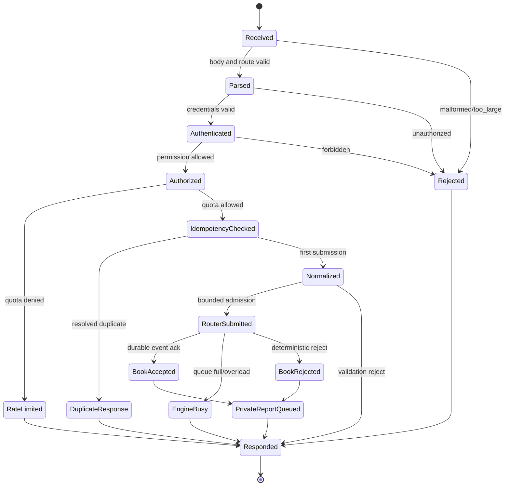
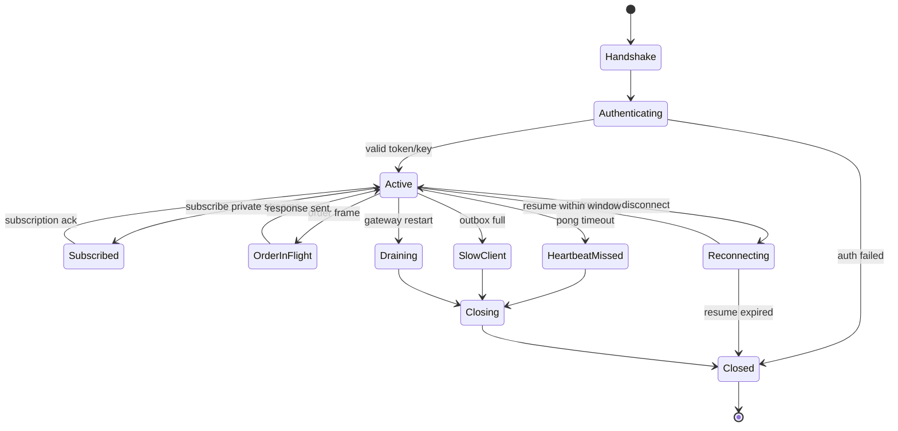
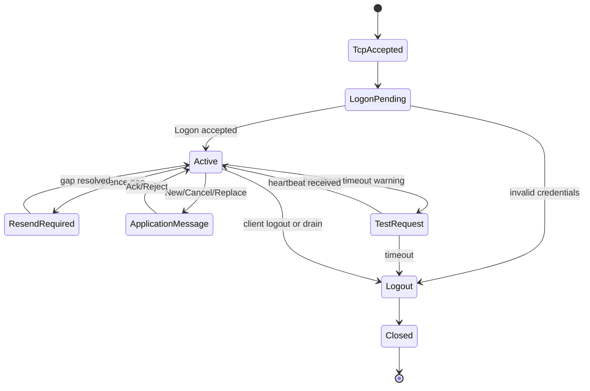
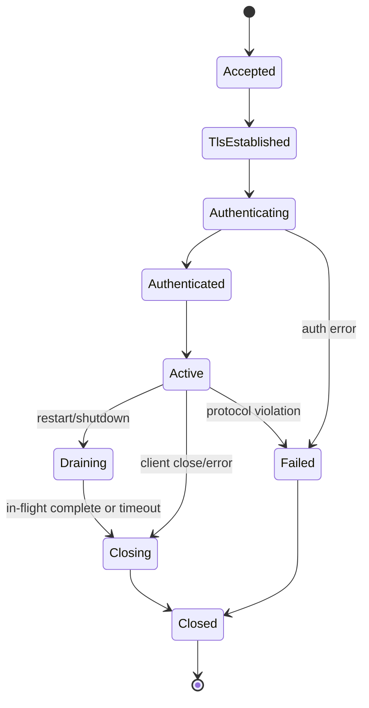
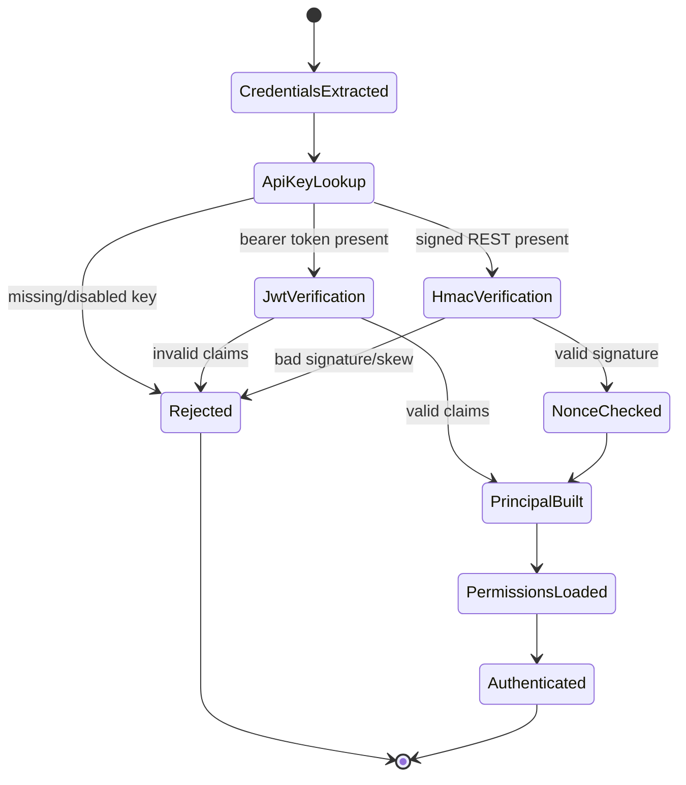
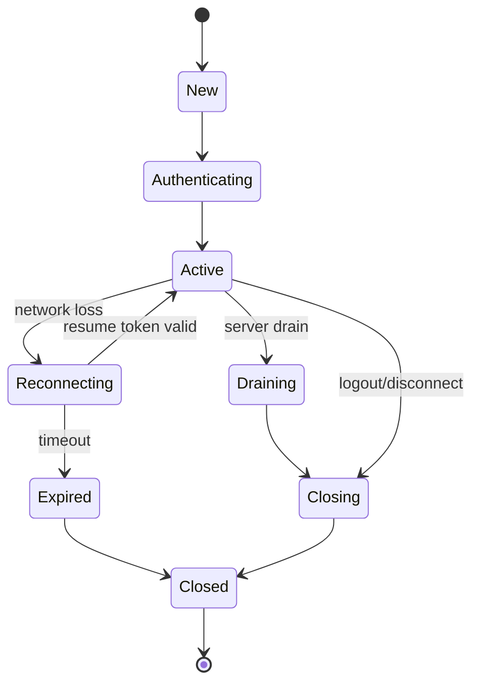

# HIH-002 Gateway Implementation

## 1. Purpose

This chapter defines the implementation handbook for `hermes-gateway` and `hermes-connectivity`, the externally facing ingress, session, authentication, normalization, and private-stream boundary for HermesNet.

It is intentionally concrete enough for engineers or Codex agents to scaffold and implement both crates without inventing architecture. The Gateway is not the matching engine, risk engine, clearing engine, or event log. It is the deterministic admission and protocol boundary that accepts client traffic, authenticates and authorizes principals, enforces admission controls, normalizes commands, submits commands to bounded router queues, maps results to protocol responses, and publishes private event-derived reports.

The Gateway must preserve these non-negotiable properties:

- all externally visible order success must correspond to durable engine state produced downstream;
- all queues, caches, sessions, and outbound streams are bounded;
- overload is explicit and stable, primarily `ENGINE_BUSY`, never hidden by unbounded buffering;
- authentication, authorization, signatures, and rate limits run before book admission;
- REST, WebSocket, FIX, OUCH, and SBE ingress normalize to one canonical domain command vocabulary;
- API keys, JWTs, HMAC secrets, bearer tokens, and session credentials are never logged;
- gateway replay awareness correlates responses and private reports to `EngineEvent` references without replaying gateway-local wall-clock effects;
- gateway tasks are cancel-safe and drainable during graceful restart;
- no production Rust source code is generated by this handbook.

## 2. Related HES Volumes

Related HES material remains authoritative. This chapter maps HES requirements into crate-level implementation boundaries without modifying HES.

- HES connectivity and API volumes: REST, WebSocket, FIX, OUCH, SBE, authentication, and API behavior.
- HES exchange core and book volumes: bounded admission, `ENGINE_BUSY`, durable event-before-success, replay correlation.
- HES security volumes: API keys, JWT validation, HMAC signing, least privilege, and secret handling.
- HES observability volumes: metrics, tracing, health, readiness, liveness, audit logging, and operations.
- HES replay volumes: deterministic reconstruction from engine events and snapshot metadata.

## 3. Implementation Scope

In scope:

- `crates/hermes-gateway/` crate boundary and module layout;
- `crates/hermes-connectivity/` crate boundary and codec/session module layout;
- REST lifecycle, private WebSocket lifecycle, FIX lifecycle, OUCH lifecycle, and SBE boundary;
- authentication using API keys, JWTs, HMAC signatures, and session credentials;
- authorization for account, key, route, symbol, product, and action permissions;
- API-key cache behavior, key rotation, disabled keys, and permission cache invalidation;
- rate limiting using token buckets and sliding windows;
- idempotency cache for duplicate retries and no duplicate book submission;
- session registry, heartbeats, reconnect, disconnect, connection draining, restart, and shutdown;
- request parsing, canonicalization, order normalization, response generation, and error mapping;
- router communication, bounded admission, retry rules, backpressure, and `ENGINE_BUSY` handling;
- private stream publishing, execution report publishing, and drop copy fanout from durable events;
- health, readiness, liveness, metrics, tracing, structured logging, benchmarking, and testing.

Out of scope:

- production Rust source files;
- HES modifications;
- book, risk, clearing, wallet, derivatives, market-data, or deployment chapter rewrites;
- DOCX/PDF generation;
- replacing downstream event-log, book-core, or replay semantics.

## 4. Gateway Design Summary

The Gateway is a horizontally scalable, stateless-for-orders but stateful-for-connections boundary. Each instance owns network listeners, session registries, authentication caches, idempotency entries, rate-limit buckets, private-stream outboxes, and router clients. It does not own book state. It submits normalized commands to downstream book routers over bounded channels or bounded RPC clients defined by workspace contracts.

A successful private order path is:

1. accept connection or request;
2. parse protocol envelope with maximum body/frame/message limits;
3. authenticate principal;
4. authorize route and account action;
5. verify HMAC/JWT/API-key requirements for the route;
6. enforce rate limit and session policies;
7. check idempotency key or client order id;
8. normalize protocol order into `NormalizedOrder` inside `OrderEnvelope`;
9. submit once to a bounded `RouterClient`;
10. wait for a downstream durable acknowledgement or deterministic reject;
11. complete idempotency record;
12. generate protocol response;
13. publish execution report and private stream messages only from durable event references.

The gateway may retry transport-level router sends only when it can prove no downstream admission occurred. It must not retry after ambiguous admission. Ambiguous outcomes must be represented as unknown/pending and reconciled through event-derived reports or query endpoints.

## 5. Target Crates and Ownership

### 5.1 `hermes-gateway`

Owns the product-level gateway runtime:

- network server startup and shutdown orchestration;
- REST handlers;
- WebSocket handlers;
- authentication and authorization services;
- API-key, JWT, HMAC, rate-limit, idempotency, session, and heartbeat services;
- router clients and response mapping;
- private stream and execution report publishers;
- health endpoints, metrics, tracing, and configuration.

`hermes-gateway` may depend on protocol-neutral domain crates, event reference contracts, auth primitives, fixed integer wrappers, IDs, and the `hermes-connectivity` protocol codecs. It must not depend on book internal state, matching data structures, wallet internals, SQL clients in hot handlers, Kafka in the admission path, or unbounded async channels.

### 5.2 `hermes-connectivity`

Owns protocol codecs and protocol boundary adapters:

- REST DTO shape definitions when shared between server and tests;
- WebSocket message envelope schemas;
- FIX session parsing, encoding, sequence validation, logout, and resend behavior;
- OUCH binary message parsing and encoding;
- SBE schema version selection and binary frame parsing/encoding;
- canonical protocol-to-domain adapter helpers that do not perform authorization or book submission.

`hermes-connectivity` must be usable by gateway tests without starting a network server. It must not reach into `hermes-gateway` session maps, secret stores, router clients, or downstream mutable engine state.

## 6. Crate Dependency Graph

Allowed direction:

```text
hermes-gateway
  -> hermes-connectivity
  -> hermes-domain
  -> hermes-fixed
  -> hermes-ids

hermes-gateway
  -> hermes-events          # event references and private report inputs only
  -> hermes-router-contract # bounded command/result interface
  -> hermes-observability   # metrics/tracing traits if split out
  -> hermes-time            # injected clock only
```

Forbidden direction:

```text
hermes-book        -> hermes-gateway
hermes-matching    -> hermes-gateway
hermes-clearing    -> hermes-gateway
hermes-gateway     -> book internals, matching internals, clearing internals
hermes-connectivity-> hermes-gateway
```

Gateway hot-path modules may use Tokio for network concurrency, but deterministic command data handed to downstream crates must not contain hidden wall-clock reads or runtime handles.

## 7. File Layout

The intended implementation file layout is:

```text
crates/
  hermes-gateway/
    Cargo.toml
    src/
      lib.rs
      config.rs
      server.rs
      rest.rs
      websocket.rs
      fix.rs
      ouch.rs
      sbe.rs
      router.rs
      authentication.rs
      authorization.rs
      apikey.rs
      jwt.rs
      hmac.rs
      ratelimit.rs
      idempotency.rs
      session.rs
      heartbeat.rs
      private_stream.rs
      execution_reports.rs
      metrics.rs
      tracing.rs
      shutdown.rs
      health.rs
      error.rs
    tests/
      rest_order.rs
      websocket_order.rs
      fix_order.rs
      ouch_order.rs
      auth_security.rs
      rate_limit.rs
      idempotency.rs
      restart.rs
      private_stream.rs
    benches/
      rest_latency.rs
      websocket_latency.rs
      fix_latency.rs
      auth_latency.rs
      throughput.rs

  hermes-connectivity/
    Cargo.toml
    src/
      lib.rs
      rest_codec.rs
      websocket_codec.rs
      fix_codec.rs
      ouch_codec.rs
      sbe_codec.rs
      canonical.rs
      config.rs
      error.rs
      metrics.rs
    tests/
      fix_codec.rs
      ouch_codec.rs
      sbe_codec.rs
      canonical_vectors.rs
    benches/
      parse_encode.rs
```

## 8. Module Contracts

Every module below must expose narrow public interfaces, keep implementation details private, and include unit tests for all error paths.

| Module | Purpose | Public interfaces | Allowed dependencies | Forbidden dependencies | Tests | Benchmarks |
|---|---|---|---|---|---|---|
| `config.rs` | Parse and validate gateway configuration. | `GatewayConfig`, `ProtocolConfig`, `RateLimitConfig`, `AuthConfig`, `RouterConfig`. | serde on cold path, secret-loader traits, typed durations. | hard-coded secrets, network listeners, book internals. | default validation, invalid limits, secret references. | config parse not required unless dynamic reload is hot. |
| `server.rs` | Own top-level runtime, listeners, task supervision, graceful restart. | `GatewayServer`, `GatewayServerHandle`, `GatewayServer::run`. | Tokio, modules in this crate, metrics/tracing. | order parsing details, secret material logging, blocking DB calls. | startup, drain, shutdown, task failure propagation. | connection accept throughput. |
| `rest.rs` | REST routing, request context creation, response mapping. | `RestGateway`, route handlers, DTO adapters. | HTTP framework, auth/rate/idempotency/router traits. | book internals, unbounded request bodies, floats. | order/cancel/replace/query lifecycle. | signed order latency and throughput. |
| `websocket.rs` | WebSocket private sessions and bidirectional order entry if enabled. | `WebSocketGateway`, frame handlers. | session, heartbeat, private streams, auth. | direct event-log writes, unbounded outboxes. | connect, auth, subscribe, order, disconnect. | fanout, slow client eviction. |
| `fix.rs` | FIX acceptor lifecycle and FIX order mapping. | `FixGateway`, FIX session hooks. | `hermes-connectivity::fix_codec`, session, router. | REST DTOs as canonical source, book internals. | logon, sequence, new order, cancel, logout. | FIX parse/roundtrip latency. |
| `ouch.rs` | OUCH binary order-entry lifecycle. | `OuchGateway`, OUCH session hooks. | `ouch_codec`, session, router. | JSON, floating decimal parsing, book internals. | binary vectors, new/cancel/replace. | OUCH parse/encode latency. |
| `sbe.rs` | SBE boundary and version negotiation. | `SbeBoundary`, `SbeMessageAdapter`. | `sbe_codec`, schema registry. | mutable downstream state, runtime globals. | version compatibility, unknown template reject. | binary decode throughput. |
| `router.rs` | Bounded command admission and response wait. | `RouterClient`, `BookRoute`, `RouterAck`. | bounded channels/RPC, domain commands, event refs. | unbounded retry queues, Kafka in decision path. | full queue, timeout, busy, durable ack. | admission latency under contention. |
| `authentication.rs` | Principal resolution across API key, JWT, HMAC, sessions. | `AuthenticationService`, `AuthenticatedUser`. | API-key/JWT/HMAC traits, injected clock. | route authorization logic beyond identity, logs of secrets. | bad credentials, expiry, disabled keys. | auth cache p99. |
| `authorization.rs` | Permission checks. | `AuthorizationService`, `PermissionDecision`. | domain IDs, account permissions, product permissions. | network I/O in hot path, policy scripting. | account/symbol/action allow/deny. | permission cache lookup. |
| `apikey.rs` | API-key store and cache. | `ApiKeyStore`, `ApiKeyCache`, `ApiKey`. | secret loader, cold-path repository trait, zeroize. | plaintext secret logging, hot-path SQL. | rotation, disable, TTL, cache miss. | cache hit p99. |
| `jwt.rs` | JWT validation and claims mapping. | `JwtVerifier`, `JwtClaims`. | JWK cache, injected clock, constant-time checks where applicable. | accepting `none`, remote fetch in hot path. | issuer/audience/exp/nbf/kid tests. | verification latency. |
| `hmac.rs` | Canonical request signing. | `HmacVerifier`, `CanonicalRequest`. | cryptographic HMAC, constant-time compare, injected clock. | stringly ad hoc canonicalization, debug logs of signature base. | golden vectors, timestamp skew, nonce replay. | canonicalize+verify latency. |
| `ratelimit.rs` | Per-IP, key, account, route, and session limiting. | `RateLimiter`, `RateLimitDecision`, token bucket, sliding window. | bounded maps, injected monotonic clock. | unbounded key cardinality, wall-clock globals. | refill, burst, concurrent access, eviction. | decision throughput. |
| `idempotency.rs` | Duplicate prevention and terminal-result replay. | `IdempotencyStore`, `IdempotencyRecord`. | bounded cache or durable low-latency store by trait. | double-submit on retry, unbounded growth. | in-flight duplicate, resolved duplicate, expiry. | begin/complete p99. |
| `session.rs` | Session registry and connection state. | `SessionRegistry`, `GatewaySession`, `ConnectionState`. | bounded maps, heartbeat, metrics. | global mutable statics, blocking cleanup. | register/remove/reconnect/drain. | concurrent session operations. |
| `heartbeat.rs` | Heartbeat scheduling and timeout policy. | `HeartbeatService`, heartbeat ticks. | Tokio timers, injected clock, session registry. | order admission logic. | missed heartbeats, ping/pong, FIX test request. | large session scan. |
| `private_stream.rs` | Private event-derived publishing. | `PrivateStreamPublisher`. | execution reports, bounded outboxes, event refs. | publishing non-durable decisions, unbounded fanout. | ordering, slow client, replay catchup. | fanout throughput. |
| `execution_reports.rs` | Execution-report construction. | `ExecutionReportPublisher`, `ExecutionReport`. | event refs, domain IDs, protocol adapters. | fresh business decisions, book state mutation. | fill/cancel/reject mappings. | report encode latency. |
| `metrics.rs` | Gateway metrics. | `GatewayMetrics`. | metrics backend traits. | high-cardinality labels with secrets/order IDs. | label allowlist, counters. | metric overhead. |
| `tracing.rs` | Trace/span creation and redaction. | `GatewayTracing`, `TraceContext`. | tracing backend traits. | secret fields, full payload logging. | redaction, propagation. | span overhead sampling. |
| `shutdown.rs` | Drain and graceful shutdown. | `ShutdownCoordinator`, drain tokens. | server/session/router traits. | killing in-flight accepted requests without status. | drain, timeout, force close. | drain thousands of sessions. |
| `health.rs` | Liveness/readiness endpoints. | `HealthService`, `HealthSnapshot`. | server state, router health, auth cache state. | deep slow database checks on liveness. | liveness/readiness transitions. | endpoint latency. |
| `error.rs` | Canonical error enum and protocol mapping. | `GatewayError`, `GatewayResult`, mapping helpers. | domain error codes. | protocol-specific strings as source of truth. | mapping stability. | not required. |

## 9. Public Trait Contracts

Signatures are Rust-style pseudocode and define shape, ownership, and behavior. Implementations may use `async_trait` or associated future types, but public contracts should minimize heap allocation and dynamic dispatch on hot paths.

### 9.1 `GatewayServer`

Responsibilities: start listeners, supervise protocol tasks, expose health state, and coordinate drain/shutdown.

```rust
trait GatewayServer {
    async fn run(self, shutdown: ShutdownSignal) -> Result<GatewayServerHandle, GatewayError>;
    fn health(&self) -> HealthSnapshot;
    fn readiness(&self) -> ReadinessState;
}
```

Ownership: owns listeners, registries, service handles, and task groups. Error behavior: startup errors are fatal; child task failures transition readiness to not-ready and may trigger controlled shutdown. Determinism: must not mutate downstream business state. Performance: accept loop must not block on auth or router calls. Tests: startup failure, child failure, readiness, drain.

### 9.2 `RestGateway`

```rust
trait RestGateway {
    async fn handle_order(&self, req: HttpRequest) -> GatewayResult<HttpResponse>;
    async fn handle_cancel(&self, req: HttpRequest) -> GatewayResult<HttpResponse>;
    async fn handle_replace(&self, req: HttpRequest) -> GatewayResult<HttpResponse>;
    async fn handle_query(&self, req: HttpRequest) -> GatewayResult<HttpResponse>;
}
```

Responsibilities: HTTP parsing limits, context creation, auth/rate/idempotency, normalization, router submission, protocol response. Must not store request bodies unbounded. Malformed requests reject before auth-dependent side effects where possible. Tests cover all routes and stable error bodies.

### 9.3 `WebSocketGateway`

```rust
trait WebSocketGateway {
    async fn accept_ws(&self, handshake: WsHandshake) -> GatewayResult<SessionId>;
    async fn handle_frame(&self, session: SessionId, frame: WsFrame) -> GatewayResult<()>;
    async fn disconnect(&self, session: SessionId, reason: DisconnectReason) -> GatewayResult<()>;
}
```

Responsibilities: handshake auth, optional re-auth, subscriptions, private report delivery, heartbeat, inbound order frames, slow-client disconnect. Outbound queues are bounded. Tests cover reconnect, missed pong, duplicate session, and slow consumer.

### 9.4 `FixGateway`

```rust
trait FixGateway {
    async fn on_logon(&self, msg: FixLogon, peer: PeerAddr) -> GatewayResult<SessionId>;
    async fn on_application(&self, session: SessionId, msg: FixMessage) -> GatewayResult<Vec<FixMessage>>;
    async fn on_logout(&self, session: SessionId) -> GatewayResult<()>;
}
```

Responsibilities: FIX acceptor sequence/session lifecycle, application message normalization, reject/logout mapping, resend handling as configured. Must preserve FIX sequence correctness separately from book event ordering. Tests use FIX golden vectors.

### 9.5 `OuchGateway`

```rust
trait OuchGateway {
    async fn on_login(&self, login: OuchLogin, peer: PeerAddr) -> GatewayResult<SessionId>;
    async fn on_packet(&self, session: SessionId, packet: OuchPacket) -> GatewayResult<Vec<OuchPacket>>;
    async fn on_end(&self, session: SessionId) -> GatewayResult<()>;
}
```

Responsibilities: binary OUCH auth, packet validation, canonical order mapping, bounded response packets. Tests include binary roundtrip and malformed packet fuzzing.

### 9.6 `RouterClient`

```rust
trait RouterClient {
    async fn submit(&self, envelope: OrderEnvelope) -> GatewayResult<RouterAck>;
    fn try_submit(&self, envelope: OrderEnvelope) -> Result<RouterAdmission, GatewayError>;
    async fn wait_for_response(&self, admission: RouterAdmission) -> GatewayResult<BookResponse>;
    fn queue_depth(&self, book: BookId) -> QueueDepth;
}
```

Responsibilities: route by book/symbol, bounded admission, wait for durable downstream response, map full queues to `EngineBusy`. Ownership: does not own order; takes envelope by value. Error behavior: no automatic retry after possible admission. Performance: p99 admission budget is microseconds excluding downstream book work. Tests cover full queue, route missing, timeout, duplicate admission prevention.

### 9.7 Authentication and Authorization

```rust
trait AuthenticationService {
    async fn authenticate(&self, ctx: &RequestContext) -> GatewayResult<AuthenticatedUser>;
    async fn authenticate_session(&self, token: SessionToken) -> GatewayResult<AuthenticatedUser>;
}

trait AuthorizationService {
    fn authorize(&self, user: &AuthenticatedUser, action: GatewayAction, resource: ResourceRef) -> GatewayResult<()>;
}
```

Authentication may perform cold-path cache refresh. Authorization must be hot-path local after user/account permissions are loaded. Both must return stable `Unauthorized` versus `Forbidden` mappings without revealing secret validity details.

### 9.8 Credential Traits

```rust
trait ApiKeyStore {
    async fn load(&self, key_id: ApiKeyId) -> GatewayResult<Option<ApiKey>>;
    fn cached(&self, key_id: ApiKeyId) -> Option<ApiKey>;
    async fn refresh(&self, key_id: ApiKeyId) -> GatewayResult<Option<ApiKey>>;
}

trait JwtVerifier {
    fn verify_jwt(&self, token: &str, now: Timestamp) -> GatewayResult<JwtClaims>;
}

trait HmacVerifier {
    fn verify_hmac(&self, req: &CanonicalRequest, key: &ApiKey, now: Timestamp) -> GatewayResult<()>;
}
```

API-key records containing secret material must be zeroized on eviction. JWT verification must validate issuer, audience, expiration, not-before, algorithm, key id, and signature. HMAC verification must canonicalize method, path, query, timestamp, nonce, body hash, and key id, then compare signatures in constant time.

### 9.9 Limiting, Sessions, Streams, Health, Metrics, Tracing

```rust
trait RateLimiter {
    fn check(&self, key: RateLimitKey, cost: Cost, now: Instant) -> RateLimitDecision;
    fn commit(&self, decision: RateLimitDecision) -> GatewayResult<()>;
    fn refund(&self, decision: RateLimitDecision);
}

trait SessionRegistry {
    fn insert(&self, session: GatewaySession) -> GatewayResult<SessionId>;
    fn get(&self, id: SessionId) -> Option<GatewaySession>;
    fn transition(&self, id: SessionId, from: SessionState, to: SessionState) -> GatewayResult<()>;
    fn remove(&self, id: SessionId) -> Option<GatewaySession>;
}

trait PrivateStreamPublisher {
    fn publish_private_stream(&self, session: SessionId, msg: PrivateMessage) -> GatewayResult<()>;
    fn publish_account_event(&self, account: AccountId, report: ExecutionReport) -> GatewayResult<PublishStats>;
}

trait ExecutionReportPublisher {
    fn publish_execution_report(&self, event_ref: EngineEventRef) -> GatewayResult<()>;
}

trait HeartbeatService {
    fn record_inbound(&self, session: SessionId, now: Instant);
    fn due_heartbeats(&self, now: Instant) -> Vec<HeartbeatAction>;
}

trait HealthService {
    fn liveness(&self) -> HealthSnapshot;
    fn readiness(&self) -> HealthSnapshot;
}

trait GatewayMetrics {
    fn record_request(&self, route: RouteName, outcome: Outcome, latency: Duration);
    fn record_auth_failure(&self, reason: AuthFailureReason);
    fn set_router_queue_depth(&self, book: BookId, depth: usize);
    fn increment_engine_busy(&self, route: RouteName);
}

trait GatewayTracing {
    fn start_request_span(&self, ctx: &RequestContext) -> TraceSpan;
    fn annotate_error(&self, span: &TraceSpan, error: &GatewayError);
}
```

Rate-limit `check` plus `commit` allows rejecting before side effects; implementations must make concurrent decisions atomic. Private streams must drop/disconnect slow clients according to policy rather than blocking event processors. Metrics and traces must use bounded-cardinality labels.

## 10. Core Structs and Enums

```rust
struct GatewayConfig {
    instance_id: GatewayInstanceId,
    rest: RestConfig,
    websocket: WebSocketConfig,
    fix: FixConfig,
    ouch: OuchConfig,
    sbe: SbeConfig,
    auth: AuthConfig,
    rate_limits: RateLimitConfig,
    idempotency: IdempotencyConfig,
    router: RouterConfig,
    private_stream: PrivateStreamConfig,
    shutdown: ShutdownConfig,
    observability: ObservabilityConfig,
}

struct GatewayServer { config: GatewayConfig, services: GatewayServices, state: ServerState }
struct GatewaySession { id: SessionId, user: AuthenticatedUser, protocol: Protocol, state: SessionState, outbox: BoundedOutbox, last_seen: Instant }
struct GatewayConnection { connection_id: ConnectionId, peer: PeerAddr, protocol: Protocol, state: ConnectionState, created_at: Instant }
struct ApiKey { key_id: ApiKeyId, account_id: AccountId, secret_ref: SecretRef, permissions: Permissions, status: KeyStatus, expires_at: Option<Timestamp> }
struct AuthenticatedUser { principal_id: PrincipalId, account_id: AccountId, key_id: Option<ApiKeyId>, roles: Roles, permissions: Permissions, auth_method: AuthMethod }
struct RequestContext { request_id: RequestId, protocol: Protocol, route: RouteName, peer: PeerAddr, received_at: Timestamp, trace: TraceContext }
struct ResponseContext { request_id: RequestId, outcome: Outcome, latency: Duration, event_ref: Option<EngineEventRef> }
struct OrderEnvelope { context: RequestContext, user: AuthenticatedUser, idempotency_key: IdempotencyKey, order: NormalizedOrder }
struct NormalizedOrder { account_id: AccountId, symbol: Symbol, side: Side, order_type: OrderType, tif: TimeInForce, quantity: FixedQty, price: Option<FixedPrice>, client_order_id: ClientOrderId, flags: OrderFlags }
struct GatewayResponse { status: ResponseStatus, body: ResponseBody, event_ref: Option<EngineEventRef>, retry_after: Option<Duration> }
struct GatewayMetrics { counters: MetricCounters, histograms: MetricHistograms, gauges: MetricGauges }

enum GatewayError { MalformedRequest, Unauthorized, Forbidden, BadSignature, ClockSkew, RateLimited, DuplicateInFlight, DuplicateResolved(GatewayResponse), EngineBusy, QueueFull, RouterTimeout, SlowClient, SessionClosed, ReplayGap, InternalColdPathFailure }
enum ConnectionState { Accepted, TlsEstablished, Authenticating, Authenticated, Active, Draining, Closing, Closed, Failed }
enum SessionState { New, Authenticating, Active, Reconnecting, Draining, Closing, Closed, Expired }
enum RateLimitDecision { Allow { cost: Cost, remaining: Tokens }, Deny { retry_after: Duration }, ShadowDeny { reason: String } }
```

All IDs must use typed wrappers. Prices and quantities use fixed-point integer wrappers. `GatewayError` maps to stable HTTP status codes, WebSocket close codes, FIX rejects, OUCH rejects, and SBE reject templates.

## 11. Runtime Model and Tokio Tasks

A gateway instance runs a supervised Tokio runtime with these task groups:

- listener tasks for REST, WebSocket, FIX, OUCH, and optional SBE TCP/UDP boundaries;
- per-connection tasks that parse frames/messages and push work into bounded request pipelines;
- auth cache refresh tasks with rate-limited secret-store access;
- JWK refresh task with atomic key-set replacement;
- idempotency expiry task;
- rate-limit bucket expiry task;
- heartbeat scanner task;
- private-stream fanout task using bounded per-session outboxes;
- router health watcher;
- metrics exporter;
- shutdown coordinator.

Task rules:

- Every task receives a cancellation token.
- Every channel has explicit capacity configured in `GatewayConfig`.
- Per-connection inbound work must be bounded by frame size, request count, and rate limit.
- Slow outbound clients are disconnected or downgraded before they block publisher tasks.
- Blocking secret-store or disk operations run on dedicated cold-path workers, never in protocol event loops.

## 12. Lifecycle State Machines

### 12.1 REST Request Lifecycle



### 12.2 WebSocket Lifecycle



### 12.3 FIX Session Lifecycle



### 12.4 Gateway Connection Lifecycle



### 12.5 Authentication Lifecycle



### 12.6 Session Lifecycle



## 13. Request and Order Control Flow

### 13.1 REST Lifecycle

REST routes must apply the same sequence for private mutating routes:

1. create `RequestContext` and trace span;
2. enforce maximum headers/body/query sizes;
3. parse JSON or binary body without floats for financial values;
4. authenticate API key/JWT/HMAC as route requires;
5. authorize action and resource;
6. check route/account/key/IP rate limits;
7. begin idempotency for mutating requests;
8. normalize order/cancel/replace;
9. submit once to router;
10. wait for response bounded by route timeout;
11. complete idempotency with terminal response;
12. return mapped response;
13. publish private stream from event reference if available.

### 13.2 WebSocket Lifecycle

WebSocket sessions authenticate at handshake or first auth frame. Each inbound frame is size-limited and sequence-aware when configured. Private stream subscriptions attach to account scope from `AuthenticatedUser`; clients cannot subscribe to arbitrary accounts. Order frames pass through the same authz, rate-limit, idempotency, normalization, and router services as REST.

Reconnect uses resume tokens with bounded validity. On reconnect, the gateway may replay missed private stream messages only from durable event-derived buffers or downstream replay/query services. It must not fabricate fills from gateway-local memory.

### 13.3 FIX Lifecycle

FIX logon authenticates CompID/session credentials and maps to account permissions. Application messages are normalized to the canonical command vocabulary. FIX sequence numbers govern protocol replay/resend only; they are not engine event sequence numbers. FIX rejects must distinguish protocol-level rejects from downstream order rejects.

### 13.4 OUCH Lifecycle

OUCH binary login authenticates session credentials. Binary packets are decoded by `hermes-connectivity`, validated for length and template, normalized without floating-point conversion, and submitted through `RouterClient`. Unknown packet types are protocol rejects and never reach the router.

### 13.5 SBE Boundary

SBE is a schema-versioned binary boundary. Gateway must negotiate or configure schema version, reject unknown templates, and map accepted messages to canonical commands. SBE compatibility tests are required for each supported schema version.

### 13.6 Private Stream Lifecycle

Private streams are event-derived:

1. downstream durable event reference arrives in `BookResponse` or event subscription;
2. `ExecutionReportPublisher` builds account-scoped report;
3. `PrivateStreamPublisher` enqueues to active account sessions;
4. bounded session outboxes preserve per-session order;
5. slow clients are warned, dropped, or disconnected by policy;
6. reconnect catchup uses durable event references, not gateway transient memory.

## 14. Authentication and Authorization Details

### 14.1 API Key Cache

API-key cache keys by `ApiKeyId`. Cache entries contain status, account, permissions, secret reference/material as permitted by secret policy, version, and expiry. Cache refresh is cold path. Cache invalidation must support key rotation and disable events. Disabled or expired keys reject immediately after cache refresh confirms state.

Cache rules:

- bounded maximum entries;
- TTL and jittered refresh;
- zeroize secrets on eviction;
- negative-cache misses for a short bounded interval;
- metric for hit, miss, stale refresh, and disabled-key use;
- no plaintext key material in logs, metrics, or traces.

### 14.2 JWT Validation

JWT validation must check:

- algorithm allowlist;
- signature using trusted JWK set;
- issuer;
- audience;
- `exp` and `nbf` with configured clock skew;
- subject/principal mapping;
- account and role claims;
- token revocation or session generation where supported.

JWK fetch is cold path with atomic key-set replacement. Hot-path validation uses current cached keys only. Missing key id may trigger refresh but must not block all gateway workers.

### 14.3 HMAC Validation

HMAC signing uses canonical request components:

- HTTP method;
- normalized path;
- canonical query string;
- key id;
- timestamp;
- nonce;
- SHA-256 body hash;
- route version.

Validation rejects timestamp skew, replayed nonce, unknown key, disabled key, body hash mismatch, and signature mismatch. Signature compare must be constant time. Nonce cache is bounded by timestamp window.

### 14.4 Authorization

Authorization checks action, account, route, symbol/product, order capability, and session scope. Example actions include `PlaceOrder`, `CancelOrder`, `ReplaceOrder`, `ReadOwnOrders`, `SubscribePrivateStream`, and `AdminHealthRead`. Authorization uses loaded permission sets, not ad hoc route strings in handlers.

## 15. Rate Limiting

Gateway supports two algorithms:

- token bucket for burst control;
- sliding window for exact request ceilings over recent intervals.

Recommended keys:

- source IP for unauthenticated routes;
- API key id;
- account id;
- route name;
- protocol session id;
- symbol for high-risk routes if required.

Decision flow:

1. derive one or more `RateLimitKey`s;
2. check cheapest/global limits first;
3. atomically reserve tokens/windows;
4. on pre-admission reject, return `RateLimited` with optional `retry_after`;
5. on internal validation failure, refund only policies configured as refundable;
6. never refund after router admission unless explicit policy allows.

Maps are bounded. Eviction must prefer inactive keys. Over-cardinality must fail closed for abusive sources or use coarse fallback buckets.

## 16. Idempotency

Idempotency prevents duplicate book submission for mutating requests. The key is protocol-specific but canonicalized to:

```text
(account_id, route, client_order_id or idempotency_key)
```

States:

- `Vacant`: first request may proceed;
- `InFlight`: duplicate gets `DuplicateInFlight` or wait behavior by route policy;
- `Resolved`: duplicate returns stored terminal response;
- `Expired`: key can be reused only after configured retention and downstream safety policy.

The idempotency store must complete records exactly once after router terminal response. If a gateway crashes after router admission but before completion, recovery must reconcile from durable event/query state before allowing another submission for the same key.

## 17. Router Communication and Backpressure

`RouterClient` chooses book route from symbol/product metadata and sends `OrderEnvelope` to a bounded downstream interface. Outcomes:

- `Admitted`: downstream accepted responsibility and will return terminal response;
- `RejectedBeforeAdmission`: no downstream side effect;
- `Full`: map to `ENGINE_BUSY`;
- `Unavailable`: readiness false and request reject;
- `TimeoutBeforeAdmission`: retry may be allowed;
- `TimeoutAfterAdmissionUnknown`: do not resubmit; reconcile through event/query path.

Backpressure rules:

- full gateway worker queues reject new requests;
- full router queues return `ENGINE_BUSY`;
- full private-stream outboxes disconnect slow clients;
- full auth refresh queue uses stale-valid cache if policy allows, otherwise rejects safely;
- readiness goes false when router unavailable or critical internal queues remain saturated.

## 18. Error Mapping

| Gateway error | REST | WebSocket | FIX | OUCH/SBE | Retry semantics |
|---|---:|---|---|---|---|
| `MalformedRequest` | 400 | error frame / close on protocol violation | Reject | Reject packet | fix request then retry |
| `Unauthorized` | 401 | close/auth error | Logout/Reject | Login reject | credentials required |
| `Forbidden` | 403 | error frame | Business reject | Reject | do not retry unchanged |
| `BadSignature` | 401 | auth error | Logout | Login reject | resign request |
| `ClockSkew` | 401 | auth error | Logout | Login reject | sync clock |
| `RateLimited` | 429 | error frame | Business reject | Reject | retry after delay |
| `DuplicateInFlight` | 409 | duplicate frame | Business reject/pending | Reject/pending | wait/query |
| `DuplicateResolved` | original status | original frame | original report | original packet | safe duplicate response |
| `EngineBusy` | 503 | error frame | Business reject | Reject | retry with same idempotency key |
| `RouterTimeout` | 504 or pending | pending/error | pending/reject by policy | pending/reject | query before retry |
| `SlowClient` | n/a | close | Logout | Disconnect | reconnect |
| `SessionClosed` | 401/409 | close | Logout | Disconnect | reconnect |
| `InternalColdPathFailure` | 500/503 | error frame | Reject | Reject | retry if documented |

Responses must include stable machine-readable codes. Human messages may change but must not reveal secrets or internal topology.

## 19. Pseudocode

```rust
async fn accept_connection(listener: Listener, registry: &SessionRegistry) -> GatewayResult<()> {
    let conn = listener.accept().await?;
    if registry.connection_count() >= config.max_connections {
        conn.reject_overload().await?;
        return Err(GatewayError::EngineBusy);
    }
    spawn_connection_task(conn, shutdown.child_token());
    Ok(())
}

async fn authenticate(ctx: &RequestContext, auth: &AuthenticationService) -> GatewayResult<AuthenticatedUser> {
    let user = auth.authenticate(ctx).await?;
    metrics.record_auth_success(user.auth_method);
    Ok(user)
}

fn verify_hmac(req: &HttpRequest, key: &ApiKey, verifier: &HmacVerifier, now: Timestamp) -> GatewayResult<()> {
    let canonical = CanonicalRequest::from_http(req)?;
    verifier.verify_hmac(&canonical, key, now)
}

fn verify_jwt(token: &str, verifier: &JwtVerifier, now: Timestamp) -> GatewayResult<JwtClaims> {
    verifier.verify_jwt(token, now)
}

fn authorize(user: &AuthenticatedUser, action: GatewayAction, resource: ResourceRef, authz: &AuthorizationService) -> GatewayResult<()> {
    authz.authorize(user, action, resource)
}

fn enforce_rate_limit(ctx: &RequestContext, user: Option<&AuthenticatedUser>, limiter: &RateLimiter) -> GatewayResult<RateLimitDecision> {
    let keys = derive_rate_limit_keys(ctx, user);
    for key in keys {
        let decision = limiter.check(key, route_cost(ctx.route), monotonic_now());
        match decision {
            RateLimitDecision::Allow { .. } => limiter.commit(decision.clone())?,
            RateLimitDecision::Deny { .. } => return Err(GatewayError::RateLimited),
            RateLimitDecision::ShadowDeny { .. } => metrics.record_shadow_limit(ctx.route),
        }
    }
    Ok(RateLimitDecision::Allow { cost: route_cost(ctx.route), remaining: Tokens::unknown() })
}

fn parse_request(req: HttpRequest) -> GatewayResult<ParsedRequest> {
    reject_if_too_large(&req)?;
    parse_route(req.method(), req.path())?;
    parse_body_without_float(req.body())
}

fn normalize_order(parsed: ParsedOrder, user: &AuthenticatedUser) -> GatewayResult<NormalizedOrder> {
    validate_account(parsed.account_id, user.account_id)?;
    let qty = FixedQty::parse_decimal_str(parsed.quantity)?;
    let price = parsed.price.map(FixedPrice::parse_decimal_str).transpose()?;
    validate_symbol_side_tif(parsed.symbol, parsed.side, parsed.tif)?;
    Ok(NormalizedOrder { account_id: user.account_id, symbol: parsed.symbol, side: parsed.side, order_type: parsed.order_type, tif: parsed.tif, quantity: qty, price, client_order_id: parsed.client_order_id, flags: parsed.flags })
}

async fn submit_to_router(router: &RouterClient, envelope: OrderEnvelope) -> GatewayResult<RouterAdmission> {
    match router.try_submit(envelope) {
        Ok(admission) => Ok(admission),
        Err(GatewayError::QueueFull) => Err(GatewayError::EngineBusy),
        Err(e) => Err(e),
    }
}

async fn wait_for_book_response(router: &RouterClient, admission: RouterAdmission) -> GatewayResult<BookResponse> {
    router.wait_for_response(admission).await
}

fn publish_execution_report(publisher: &ExecutionReportPublisher, event_ref: EngineEventRef) -> GatewayResult<()> {
    publisher.publish_execution_report(event_ref)
}

fn publish_private_stream(streams: &PrivateStreamPublisher, account: AccountId, report: ExecutionReport) -> GatewayResult<PublishStats> {
    streams.publish_account_event(account, report)
}

async fn handle_websocket_disconnect(session_id: SessionId, reason: DisconnectReason, sessions: &SessionRegistry) -> GatewayResult<()> {
    sessions.transition(session_id, SessionState::Active, SessionState::Closing)?;
    cleanup_session(session_id, sessions).await;
    metrics.record_disconnect(reason);
    Ok(())
}

async fn cleanup_session(session_id: SessionId, sessions: &SessionRegistry) {
    if let Some(session) = sessions.remove(session_id) {
        session.outbox.close();
        private_stream.unsubscribe_all(session_id);
        heartbeat.remove(session_id);
        zeroize_session_tokens(session_id);
    }
}

async fn shutdown_gateway(server: GatewayServerHandle) -> GatewayResult<()> {
    server.readiness_not_ready();
    server.stop_accepting_new_connections().await?;
    server.mark_sessions_draining()?;
    server.wait_for_inflight_or_timeout(config.shutdown.drain_timeout).await?;
    server.close_remaining_sessions().await?;
    server.flush_metrics().await?;
    Ok(())
}

async fn recover_gateway(config: GatewayConfig) -> GatewayResult<GatewayServer> {
    let services = GatewayServices::build(config.clone()).await?;
    services.idempotency.reconcile_unfinished_from_events().await?;
    services.private_stream.rebuild_offsets_from_event_refs().await?;
    Ok(GatewayServer::new(config, services))
}
```

## 20. Health, Readiness, Liveness, Restart, and Recovery

Liveness answers whether the process can serve its event loop and supervision tasks. It must avoid slow dependencies. Readiness answers whether new traffic should be sent to this instance. Readiness is false when:

- configuration is invalid;
- listeners failed;
- router is unavailable;
- auth/JWK state is not initialized;
- critical queues remain above saturation threshold;
- shutdown drain has started;
- event-derived private stream dependency is in replay gap beyond policy.

Graceful restart sequence:

1. readiness false;
2. stop accepting new connections;
3. send drain notices to WebSocket/FIX/OUCH sessions where protocol supports it;
4. finish or timeout in-flight admitted requests;
5. reject new mutating requests with retryable overload/drain code;
6. close idle sessions;
7. flush metrics and traces;
8. exit after bounded timeout.

Recovery sequence:

1. load config and secrets references;
2. initialize auth/JWK/API-key caches;
3. reconcile idempotency unresolved records from durable events/query service;
4. initialize router clients and health watchers;
5. initialize private stream offsets;
6. set readiness true only after dependencies are healthy.

## 21. Gateway Replay Awareness

Gateway does not replay business state by itself. It is replay-aware by storing and propagating correlation identifiers:

- `request_id` for gateway traces;
- `client_order_id`/idempotency key for duplicate detection;
- `order_id` when downstream assigns it;
- `book_id` and book-local sequence when returned;
- `EngineEventRef` for durable success/reject reports;
- private stream offset per account/session.

During replay or recovery, gateway private stream catchup must read event-derived reports and preserve per-account ordering. Gateway-local rate-limit buckets, TCP sessions, request latencies, and transient auth cache hits are not replayed as business truth.

## 22. Security Requirements

- TLS is mandatory for external protocols unless explicitly disabled only in local tests.
- Secrets are loaded from approved secret providers and zeroized where practical.
- Never log API key secrets, HMAC signature bases with secrets, bearer tokens, JWTs, session tokens, cookies, or authorization headers.
- Use constant-time comparison for HMAC signatures and secret equality.
- Validate request size before parsing.
- Reject unknown protocol versions and message templates.
- Enforce least privilege by route/action/resource.
- Bound nonce, session, idempotency, and rate-limit caches.
- Use separate admin and public listeners where configured.
- Metrics labels must not include user-supplied unbounded values.
- Error responses must not reveal whether a key id exists beyond required protocol semantics.

## 23. Performance Targets

Targets are implementation goals subject to hardware certification:

- REST signed order p99 gateway overhead excluding downstream book work: under 2 ms;
- WebSocket order gateway overhead p99 excluding downstream book work: under 1 ms;
- FIX/OUCH decode plus normalization p99: under 500 microseconds;
- auth cache hit p99: under 100 microseconds;
- HMAC canonicalize plus verify p99: under 250 microseconds for normal payloads;
- rate-limit decision p99: under 50 microseconds;
- idempotency begin/complete p99: under 200 microseconds with hot cache;
- private report enqueue p99: under 250 microseconds per active session fanout group;
- overload rejection path must remain bounded under sustained router-full load.

Benchmarks must report p50, p95, p99, p99.9, throughput, allocations, and queue-depth behavior.

## 24. Testing Matrix

| Category | Tests |
|---|---|
| Unit: authentication | missing credentials, disabled key, expired key, key rotation, cache stale, auth method precedence. |
| Unit: authorization | account mismatch, route permission, symbol/product permission, read-only key cannot trade. |
| Unit: JWT | bad issuer, bad audience, expired, not-before, bad kid, algorithm confusion, malformed token. |
| Unit: HMAC | canonical golden vectors, timestamp skew, nonce replay, body hash mismatch, constant-time compare harness. |
| Unit: rate limiter | token refill, burst exhaustion, sliding window boundaries, concurrent decisions, key eviction. |
| Unit: parser | malformed JSON, oversized body, invalid decimal, FIX field errors, OUCH/SBE length errors. |
| Unit: normalizer | side/type/tif validation, fixed-point conversion, symbol mapping, account mapping. |
| Integration: REST order | successful order event-ref response, malformed reject, auth reject, busy reject. |
| Integration: WebSocket order | handshake, subscription, order, response, private report, slow-client close. |
| Integration: FIX order | logon, sequence, new order, cancel, replace, logout, rejects. |
| Integration: OUCH order | login, binary new/cancel/replace, rejects, disconnect. |
| Integration: cancel/replace | idempotent cancel, replace validation, event-derived report. |
| Integration: reconnect/disconnect | resume token, missed messages catchup, expired resume, cleanup. |
| Integration: private stream | execution reports after durable events, drop copy delivery, ordering. |
| Integration: gateway restart | drain, in-flight completion, new request reject, post-restart readiness. |
| Property: idempotency | concurrent duplicates never submit more than once. |
| Property: request parsing | arbitrary bytes never panic and never produce invalid fixed values. |
| Property: no duplicate submission | retries after every pre-admission failure do not duplicate downstream commands. |
| Property: replay consistency | event-derived private stream equals replayed event sequence. |
| Performance: REST latency | signed new order p50/p95/p99/p99.9 under configured concurrency. |
| Performance: WebSocket latency | order frame to response and private report enqueue. |
| Performance: FIX latency | decode, normalize, route, encode reject/ack. |
| Performance: authentication latency | API-key cache hit/miss, JWT verify, HMAC verify. |
| Performance: throughput | sustained orders/sec until router busy threshold. |
| Performance: connection scalability | idle and active WebSocket/FIX sessions, heartbeat scan overhead. |

## 25. Benchmarking Plan

Benchmarks must be reproducible and include fixture configuration. Required benchmark groups:

- REST signed place-order with hot API-key cache;
- REST signed place-order with HMAC failure;
- WebSocket authenticated order frame;
- FIX new-order single session and many sessions;
- OUCH binary new-order decode/encode;
- JWT validation with hot JWK cache;
- API-key cache hit and miss with mocked cold store;
- rate-limit decision under high-cardinality keys;
- idempotency begin/complete under duplicate storms;
- router full path returning `ENGINE_BUSY`;
- private-stream fanout with slow-client eviction;
- graceful drain with many active sessions.

## 26. Implementation Sequence

1. Define shared types, `GatewayError`, and config validation.
2. Implement `hermes-connectivity` codecs and canonical protocol DTOs with golden-vector tests.
3. Implement authentication primitives: API-key cache, JWT verifier, HMAC verifier.
4. Implement authorization service and permission models.
5. Implement rate limiter and idempotency store.
6. Implement router client trait and bounded mock router for tests.
7. Implement REST private order/cancel/replace flow.
8. Implement session registry, heartbeat, and WebSocket private streams.
9. Implement FIX and OUCH adapters using the same normalizer/router services.
10. Implement SBE boundary and schema compatibility tests.
11. Implement private execution report publisher and drop copy.
12. Implement health/readiness/liveness, metrics, tracing, and redaction tests.
13. Implement shutdown, drain, restart, and recovery reconciliation.
14. Add integration, property, fuzz, and performance benchmarks.
15. Run security review and replay correlation review.

## 27. Codex Implementation Tasks

- Scaffold `hermes-gateway` and `hermes-connectivity` crates with only module skeletons and contracts.
- Add `GatewayConfig` validation and fixture configs.
- Implement `GatewayError` and protocol mapping tests.
- Implement API-key cache with zeroization and rotation tests.
- Implement JWT verifier with JWK cache fixtures.
- Implement HMAC canonicalization from golden vectors.
- Implement authorization service with permission fixtures.
- Implement rate limiter token bucket and sliding-window tests.
- Implement idempotency store with concurrent duplicate property tests.
- Implement normalizer shared by REST, WebSocket, FIX, OUCH, and SBE.
- Implement bounded mock `RouterClient` and `ENGINE_BUSY` tests.
- Implement REST mutating routes end-to-end with mock router.
- Implement WebSocket session lifecycle, heartbeat, reconnect, and private streams.
- Implement FIX and OUCH protocol adapters with golden vectors.
- Implement private execution report publisher from event refs.
- Implement shutdown drain and restart recovery tests.
- Add criterion benchmarks for all performance targets.

## 28. Review Checklist

- [ ] Only gateway/connectivity crate boundaries are changed for this chapter.
- [ ] REST, WebSocket, FIX, OUCH, and SBE normalize to the same command vocabulary.
- [ ] Private mutating routes require authentication, authorization, rate limit, and idempotency checks.
- [ ] HMAC uses stable canonicalization and constant-time compare.
- [ ] JWT verification rejects algorithm confusion and invalid issuer/audience/time claims.
- [ ] API-key cache supports rotation, disable, expiry, and zeroization.
- [ ] All queues, maps, sessions, outboxes, and caches have explicit bounds.
- [ ] Router full maps to stable `ENGINE_BUSY` and does not create a durable event.
- [ ] Gateway never retries after ambiguous downstream admission.
- [ ] Duplicate retry cannot submit twice to Book Core.
- [ ] Private reports originate only from durable event references.
- [ ] Slow clients cannot block publishers.
- [ ] Readiness goes false during drain, router outage, and critical saturation.
- [ ] Logs, traces, and metrics redact secrets and avoid unbounded labels.
- [ ] Benchmarks include latency percentiles and allocation counts.

## 29. Completion Criteria

HIH-002 is implementation-ready when engineers can build `hermes-gateway` and `hermes-connectivity` from this handbook with no architectural gaps for:

- REST, WebSocket, FIX, OUCH, and SBE ingress;
- API key, JWT, and HMAC authentication;
- authorization and permission enforcement;
- rate limiting, idempotency, sessions, heartbeats, reconnect, and draining;
- canonical normalization and bounded router submission;
- `ENGINE_BUSY`, retry, duplicate, and ambiguous admission behavior;
- execution reports, drop copy, and private stream publishing;
- metrics, tracing, logging, health, readiness, liveness, shutdown, restart, and recovery;
- unit, integration, property, fuzz, and benchmark coverage.
