HERMESNET ENGINEERING SPECIFICATION (HES)
Volume I: Foundation & Core Trading Infrastructure
Document Classification
•	Document ID: HES-V1.0-2026-001
•	Classification: INTERNAL - ENGINEERING
•	Distribution: Engineering, Architecture, Operations, Compliance
•	Version: 1.0.0
•	Effective Date: 2026-07-08
•	Document Owner: Office of the Chief Architect
•	Approval Authority: Engineering Review Board
________________________________________
PREAMBLE
Document Authority
This specification constitutes the authoritative engineering definition of the HermesNet exchange system. It is binding on all implementation decisions, architectural modifications, and operational procedures. Any deviation from this specification requires formal approval through the Engineering Change Control Board and must be documented as an amendment with justification, impact analysis, and rollback plan.
Philosophy of Specification
The HermesNet Engineering Specification (HES) is predicated on the principle that exchanges fail not due to incorrect matching logic, but due to failures in latency control, state consistency, failure recovery, and operational resilience at scale. Consequently, this specification treats correctness, performance, failure modes, and operational procedures with equal rigor, providing implementable guidance for every subsystem.
Engineering Constitution
This document serves as the Engineering Constitution of HermesNet. All implementation artifacts, deployment configurations, operational procedures, and testing strategies derive their authority from this specification. When conflicts arise between this specification and any derived artifact, this specification is authoritative. When conflicts arise between this specification and physical constraints, this specification shall be amended through formal process.
How to Read This Document
This specification is organized hierarchically. Each chapter begins with declarative statements of purpose and principles, followed by progressively more detailed implementation specifications. Engineers should read top-down for architectural understanding and bottom-up for implementation guidance. Cross-references are provided throughout to connect related concepts across volumes.
Implementation Guidance
Every section of this specification is intended to be implementable by a competent engineering team. Where implementation choices exist, tradeoffs are documented, recommended approaches are highlighted, and failure modes are enumerated. Reference implementations are not provided; the specification defines the contract that any implementation must satisfy.
________________________________________
VOLUME I: FOUNDATION & CORE TRADING INFRASTRUCTURE
________________________________________
Chapter 1: Executive Summary and Architectural Thesis
1.1 Purpose
This chapter establishes the foundational principles, architectural philosophy, and design constraints that govern all subsequent engineering decisions in the HermesNet exchange system. It serves as the authoritative reference for architectural decision-making, providing the rationale for every major design choice documented in this specification.
1.2 Business Context
1.2.1 Market Opportunity
The global cryptocurrency exchange market operates with approximately $100-200 billion in daily trading volume across spot, derivatives, and options markets. This volume is distributed across centralized exchanges, decentralized exchanges, and OTC desks. HermesNet targets the centralized exchange segment with a differentiated value proposition centered on zero-avoidable-latency execution, institutional-grade reliability, and comprehensive product coverage.
1.2.2 Target Users
HermesNet serves a multi-tiered user base with distinct requirements:
Retail Traders (Projected 70-80% of users):
•	Require intuitive web and mobile interfaces
•	Execute primarily limit and market orders with simple order types
•	Have moderate throughput requirements (orders per second)
•	Are price-sensitive with respect to fees
•	Value reliability and clear communication of order status
•	Require comprehensive KYC/AML compliance
API Traders (Projected 10-15% of users, 70-80% of volume):
•	Automate trading strategies via REST and WebSocket APIs
•	Require low-latency market data and order execution
•	Need robust rate limiting and predictable API behavior
•	Value transparency in execution quality
•	May execute hundreds to thousands of orders per second
Institutional Traders and Market Makers (Projected 2-5% of users, 15-25% of volume):
•	Require FIX, OUCH, or SBE protocol support
•	Execute high-frequency trading strategies
•	Need dedicated bandwidth and priority queueing
•	Require comprehensive pre-trade and post-trade risk controls
•	Value deterministic execution and clear audit trails
•	May execute thousands to tens of thousands of orders per second
Operations and Compliance Teams (Projected 50-100 users):
•	Monitor system health and trading activity
•	Investigate suspicious trading patterns
•	Manage user onboarding and KYC/AML processes
•	Respond to support tickets and user inquiries
•	Generate regulatory reports and evidence packs
System Administrators (Projected 10-20 users):
•	Deploy, configure, and maintain system infrastructure
•	Monitor system health and performance
•	Respond to incidents and perform recovery procedures
•	Manage capacity planning and scaling
1.2.3 Competitive Landscape
HermesNet competes with established exchanges including:
Binance: Market leader with extensive product coverage, high throughput, and competitive fees. Challenges include regulatory scrutiny, history of technical incidents, and latency relative to specialized competitors.
Coinbase: Regulated US exchange with strong brand and compliance focus. Challenges include higher fees and less sophisticated trading features.
Kraken: Established exchange with broad product coverage and strong security reputation. Challenges include lower throughput and less modern architecture.
FTX (Pre-collapse): Demonstrated that rapid product innovation and aggressive marketing can capture market share, but also the consequences of inadequate risk controls and operational opacity.
Bybit, OKX, Deribit: Specialized derivatives exchanges with high throughput and sophisticated features. Challenges include varying regulatory status and market penetration.
LMAX: Institutional FX exchange with ultra-low latency and deterministic matching. Demonstrates the viability of high-performance matching engines in regulated environments.
NYSE, NASDAQ, CME: Traditional exchanges with the highest standards of reliability, regulation, and market integrity. HermesNet architectural principles draw heavily from these institutions while adapting to digital asset requirements.
1.2.4 Value Proposition
HermesNet's differentiated value proposition rests on:
1.	Zero-Extra-Latency Architecture: By removing all avoidable latency from the trade-decision path, HermesNet provides deterministic, low-latency execution that meets or exceeds industry benchmarks.
2.	Institutional-Grade Reliability: Through event sourcing, deterministic replay, active-passive failover, and comprehensive testing, HermesNet achieves the reliability standards expected by institutional traders and regulators.
3.	Comprehensive Product Coverage: HermesNet supports spot, perpetual futures, and options trading on a unified architecture, enabling cross-product risk management and efficient capital utilization.
4.	Regulatory Readiness: Built from inception with compliance as a primary requirement, HermesNet supports KYC/AML, transaction monitoring, travel rule compliance, and regulatory reporting.
5.	Operational Transparency: Through comprehensive observability, deterministic replay, and immutable audit logs, HermesNet provides unprecedented visibility into trading operations.
1.2.5 Success Metrics
Business success for HermesNet is measured by:
Metric	Target (Year 1)	Target (Year 3)
Daily Trading Volume	$50-100M	$1-5B
Registered Users	100K-500K	5M-10M
Concurrent Users	5K-10K	50K-150K
Orders Per Second	1K-5K	25K-100K
Exchange Uptime	99.9%	99.99%
Average Latency (p95)	<15ms	<5ms
Customer Satisfaction	NPS > 40	NPS > 50
Regulatory Compliance	100%	100%
1.3 Engineering Context
1.3.1 Problem Domain
Exchanges are among the most demanding distributed systems in existence, requiring:
•	Deterministic Ordering: Every order must be processed in a globally fair order to prevent value extraction by participants with lower latency.
•	High Throughput: The system must handle bursts of trading activity exceeding 100,000 orders per second during volatile market conditions.
•	Low Latency: The trade-decision path must complete within milliseconds to provide competitive execution and prevent arbitrage exploitation.
•	Strong Consistency: Balances, positions, and order states must be accurate and consistent at all times, with no possibility of double-spending or double-filling.
•	High Availability: The exchange must remain operational during hardware failures, network partitions, and software upgrades.
•	Auditability: Every trading decision, balance change, and administrative action must be logged immutably for regulatory compliance and dispute resolution.
•	Security: User funds, API keys, and personal information must be protected against internal and external threats.
•	Regulatory Compliance: The system must support KYC/AML, transaction monitoring, travel rule compliance, and regulatory reporting.
1.3.2 Scale Assumptions
HermesNet is engineered to support:
Dimension	Baseline	Peak	Growth
Total Users	10M	50M	3x/year
Concurrent Users	150K	500K	3x/year
Order Rate	100K/s	500K/s	3x/year
Trade Rate	10K/s	50K/s	3x/year
Instruments	5K	20K	3x/year
Transaction Rate	1B/day	5B/day	3x/year
Data Retention	7 years	7 years	Static
1.3.3 Technical Constraints
Zero Trust Assumption: No component or service is inherently trusted. Authentication, authorization, and encryption are required at every boundary.
Determinism Requirement: All trading logic must be deterministic. Given the same sequence of inputs, the system must produce identical outputs, regardless of execution timing.
Replayability Requirement: Every state must be reconstructable from an immutable event log. This enables recovery, auditing, and forensic analysis.
Zero-Avoidable-Latency Principle: The trade-decision path must contain no unnecessary I/O, network communication, or external dependencies. All latency not inherent to physical limits is considered avoidable and prohibited.
Strong Consistency Requirement: The trading core provides linearizable consistency. Eventual consistency is acceptable for reporting and analytics, but never for trading decisions.
Fail-Fast Principle: Invalid states, unexpected conditions, and resource exhaustion are detected and signaled immediately rather than propagating corruption.
Defense-in-Depth: Security controls are layered at every level: network, transport, application, data, and user.
1.4 Problem Statement
1.4.1 The Latency Problem
Traditional exchange architectures introduce latency through:
1.	Global Sequencers: A centralized ordering service becomes a bottleneck during high-volume periods, increasing latency and reducing throughput.
2.	Database Dependencies: Synchronous database writes in the trade-decision path add 1-10ms of latency and create availability dependencies.
3.	Message Broker Latency: Kafka and similar systems add 1-5ms of latency and introduce ordering complexity.
4.	Microservice Overhead: Network calls between services (order routing, risk, matching, clearing) add 1-10ms of latency each.
5.	Serialization Overhead: JSON and other text formats require CPU-intensive parsing and serialization.
6.	Garbage Collection Pauses: Managed languages introduce unpredictable pauses that can disrupt trading.
7.	Operating System Scheduling: Thread context switches and interrupt handling add variable latency.
8.	Network RTT: Geographically distributed components add latency equal to the speed of light over distance.
1.4.2 The Consistency Problem
Distributed exchange architectures face consistency challenges:
1.	Order Sequencing: Determining a fair global order for orders arriving from multiple locations.
2.	Double-Spend Prevention: Ensuring that users cannot spend the same funds on multiple orders.
3.	Double-Fill Prevention: Ensuring that the same order cannot be filled multiple times.
4.	State Propagation: Replicating state changes to all components (risk, matching, clearing, market data).
5.	Snapshot Consistency: Taking consistent snapshots of complex state for recovery and reporting.
6.	Time Synchronization: Maintaining consistent timestamps across components.
7.	Clock Skew: Handling drift between system clocks.
8.	Network Partitions: Maintaining consistency during network failures.
1.4.3 The Availability Problem
Exchange architectures must remain available during:
1.	Hardware Failures: Disk failures, memory errors, CPU failures, network interface failures.
2.	Software Failures: Bugs, memory leaks, deadlocks, stack overflows, segmentation faults.
3.	Network Failures: Packet loss, connection drops, routing failures, DNS failures.
4.	Data Center Failures: Power outages, cooling failures, network isolation, natural disasters.
5.	DDoS Attacks: Volumetric attacks, application layer attacks, protocol attacks.
6.	Traffic Surges: Order rate spikes exceeding capacity, message queue exhaustion.
7.	Upgrades: Rolling deployments, database migrations, protocol changes.
8.	Misconfigurations: Incorrect settings, invalid configurations, permission errors.
1.4.4 The Security Problem
Exchanges are prime targets for:
1.	Theft: Direct theft of user funds through compromised keys, hot wallet theft, or system exploits.
2.	Market Manipulation: Wash trading, spoofing, layering, pump and dump schemes.
3.	API Abuse: Credential stuffing, rate limit exploitation, excessive querying.
4.	Insider Threats: Misuse of administrative access, front-running, information leakage.
5.	Regulatory Violations: Failure to enforce KYC/AML, travel rule compliance, or sanctions screening.
6.	Data Breaches: Exposure of user personal information, trading history, or system secrets.
7.	Denial of Service: Attacking the exchange to disrupt trading or extract competitive advantage.
8.	Supply Chain Attacks: Compromised dependencies, CI/CD pipeline attacks, developer machine compromise.
1.5 Goals
1.5.1 Primary Goals
1.	Zero-Avoidable-Latency: The trade-decision path contains no unnecessary operations, external dependencies, or blocking calls. All latency is attributable to fundamental physical limits and algorithm complexity.
2.	Deterministic Execution: Given the same sequence of inputs, all components produce identical outputs. This enables replay testing and ensures consistency across restarts and failovers.
3.	Event Sourcing: All state changes are stored as immutable events. State is reconstructed by replaying events from snapshots.
4.	No Global Sequencer: Ordering is local to each order book. There is no single point of failure or latency bottleneck.
5.	Single-Writer Books: Each order book has a single writer. This eliminates locking and enables deterministic, high-throughput matching.
6.	Strong Consistency: The trading core provides linearizable consistency. Users always see the correct state of their orders and balances.
7.	High Availability: The system meets the "five nines" (99.999%) availability target for the trading core.
8.	Comprehensive Product Coverage: Support for spot, perpetual futures, and options trading on a unified architecture.
9.	Regulatory Compliance: Built-in support for KYC/AML, transaction monitoring, travel rule compliance, and regulatory reporting.
10.	Operational Transparency: Comprehensive observability, auditability, and forensic capabilities.
1.5.2 Secondary Goals
1.	Extensibility: The architecture supports new instruments, order types, and product features without requiring redesign.
2.	Developer Productivity: Clear module boundaries, comprehensive testing, and deterministic replay enable rapid, confident development.
3.	Operational Simplicity: Deployment, monitoring, and recovery procedures are well-defined and testable.
4.	Cost Efficiency: The architecture operates within resource constraints, avoiding over-provisioning.
5.	Migration Path: Existing systems can be migrated to HermesNet incrementally.
1.6 Non-Goals
1.	No Decentralization: HermesNet is a centralized exchange. Distributed consensus is not required.
2.	No Smart Contracts: All trading logic is implemented in application code, not on-chain.
3.	No Cross-Chain Protocols: The exchange operates on its own ledger. Cross-chain transactions are external deposits and withdrawals.
4.	No Native Token: The exchange may support a native token, but the architecture does not require one.
5.	No On-Chain Settlement: Trades settle within the exchange's internal ledger, not on the blockchain.
6.	No Mobile-First Design: Mobile support is important, but the core architecture is platform-agnostic.
7.	No Legacy Compatibility: The system is built from the ground up. Backward compatibility with legacy systems is not required.
8.	No Self-Sovereign Identity: Users do not control their own identity; the exchange manages identity and KYC.
1.7 Historical Background
1.7.1 Traditional Exchange Architecture (Pre-2000)
Traditional floor-based exchanges used physical trading pits where traders shouted orders and executed trades face-to-face. These systems were characterized by:
•	Human Latency: Decision and execution times measured in seconds or minutes.
•	Limited Throughput: Thousands of trades per day.
•	Manual Recording: Trades were written on slips and processed by hand.
•	Physical Security: The trading floor was physically secured.
•	Human Oversight: Surveillance was performed by exchange employees observing floor activity.
1.7.2 Electronic Exchange Architecture (2000-2010)
The transition to electronic trading introduced new capabilities and new challenges:
•	Electronic Matching: Orders were matched by computer systems, reducing latency to sub-second levels.
•	Order Books: Centralized limit order books replaced physical pits.
•	Remote Access: Traders could access the exchange from anywhere, increasing participation.
•	Programmatic Trading: Automated strategies began to replace human trading.
•	Market Data: Real-time data feeds became critical infrastructure.
The typical architecture of this era involved:
•	A central matching engine running on a mainframe or high-end server.
•	An order book database storing all resting orders.
•	A clearing system running on a separate batch system.
•	Market data feeds generated as a side effect of matching.
•	Gateways providing electronic access.
1.7.3 Modern Exchange Architecture (2010-2020)
The explosion of algorithmic and high-frequency trading drove dramatic changes:
•	Low-Latency Architectures: Matching engines were moved closer to the network edge, with latency measured in microseconds.
•	Distributed Systems: Matching was distributed across multiple engines, each handling a subset of instruments.
•	In-Memory Processing: Entire order books were stored in memory, with disk writes only for persistence.
•	Binary Protocols: Custom binary protocols replaced text-based interfaces for low-latency access.
•	Co-location: Traders placed their servers in the same data centers as exchanges to reduce network latency.
Significant challenges persisted:
•	Global Sequencer Bottleneck: Central ordering services limited throughput.
•	Microservice Complexity: Distributed systems introduced new failure modes.
•	State Consistency: Replicating state across components proved difficult.
•	Recovery: Restoring a trading engine after failure was time-consuming and error-prone.
•	Testing: The complexity of distributed systems made comprehensive testing difficult.
1.7.4 Contemporary Exchange Challenges
Major exchanges continue to face recurring challenges:
Binance:
•	Documented request weight limits and 429 throttling for API abuse (S1, S2).
•	Explicit warnings that HTTP 5xx errors do not necessarily indicate order failure, requiring clients to query status (S3, S4).
•	Technical issues causing pause in deposits/withdrawals due to spot trading bug (S12).
•	Security breach involving API keys, 2FA codes, and a 7,000 BTC hot-wallet withdrawal (S8).
Coinbase:
•	AWS us-east-1 disruption affecting login, trading, transfers, withdrawals, deposits, market data, onboarding, staking, and operational visibility (S7).
KuCoin, MEXC:
•	Disruptions during AWS Tokyo connectivity issue; warning of abnormal charts, failed cancellations, and transfer delays (S6).
NASDAQ:
•	Trading halt attributed to software bug and internal technology issues triggered by inter-market problems (S11).
NYSE Pillar:
•	Documentation of high-throughput, low-latency, deterministic matching with large reductions in order-entry latency (S9).
•	Emphasis on delivering order and trade events in deterministic matching-engine sequence to reduce ambiguity and latency disparities (S10).
1.7.5 Lessons Learned for HermesNet
1.	Rate Limiting Must Be Multi-Layered: Per-IP, per-account, and per-endpoint limits are all necessary. Throttling must occur at the edge, before requests reach the matching engine.
2.	Idempotency Is Essential: Clients must be able to retry orders safely. The exchange must return the same result for the same client_order_id.
3.	Recovery Must Be Deterministic: After any failure, the system must be reconstructible to a known consistent state using event replay.
4.	Cloud Dependencies Must Be Minimized: The hot path must not depend on cloud services that can fail or degrade. The system must degrade gracefully when dependencies fail.
5.	Market Data Must Be Self-Healing: Slow or disconnected clients must not degrade market data delivery for others. Sequence IDs enable clients to detect and recover from missed messages.
6.	Risk Must Be Isolated: Pre-trade risk checks must be local and deterministic. External calls for risk verification introduce unacceptable latency and failure modes.
7.	Failover Must Be Tested: The ability to fail over between primary and standby instances must be tested through chaos engineering and regular drills.
8.	Operational Visibility Is Critical: Comprehensive observability (metrics, logs, traces) is required to identify, diagnose, and resolve issues.
1.8 Industry Practices
1.8.1 Matching Engine Architectures
Global Sequencer Model (e.g., many traditional exchanges):
•	A central component orders all incoming orders.
•	Provides a single, unambiguous order of execution.
•	Becomes a bottleneck under high volume.
•	Single point of failure.
Sharded Matching Model (e.g., modern derivative exchanges):
•	Different instruments handled by different matching engines.
•	No global sequencing across instruments.
•	Within each shard, a sequencing mechanism is still required.
•	Complex cross-shard risk management.
Zero-Extra-Latency Model (e.g., LMAX, NYSE Pillar):
•	Single-writer per instrument.
•	No global sequencer service.
•	Local sequence per instrument.
•	Deterministic ordering within each instrument.
•	Minimal dependencies in the hot path.
1.8.2 Data Models
Shared Database Model (e.g., early electronic exchanges):
•	All state stored in a central database.
•	Simple consistency model.
•	Database becomes bottleneck under load.
•	Latency unacceptable for modern trading.
In-Memory Database Model (e.g., Redis-based architectures):
•	State stored in memory with synchronous replication.
•	Better performance than disk-based databases.
•	Still adds latency for network calls.
Event Sourcing Model (e.g., modern financial systems):
•	State stored as an append-only log of events.
•	Read models generated from events.
•	Deterministic replay enables recovery and testing.
•	Provides complete audit trail.
1.8.3 Risk Management
Account-Level Risk:
•	Check total balance across all instruments before accepting orders.
•	Simple to implement and understand.
•	Adds latency for cross-instrument checks.
•	Can create bottlenecks.
Instrument-Level Risk:
•	Check risk per instrument independently.
•	Faster than account-level checks.
•	Requires pre-allocated funds per instrument.
•	Less flexible for users.
Credit Bucket Model:
•	Users allocate funds to specific instruments or portfolios.
•	Risk checked locally within each bucket.
•	Fastest possible risk check.
•	Requires operational overhead for allocation management.
1.8.4 Market Data Distribution
Pull Model:
•	Clients request market data periodically.
•	Simple implementation.
•	Clients may miss events between requests.
•	Variable latency.
Push Model:
•	Exchange pushes data to subscribed clients.
•	Lower latency for clients.
•	Requires backpressure handling for slow clients.
•	More complex implementation.
Delta Model:
•	Initial snapshot plus incremental updates.
•	Efficient bandwidth usage.
•	Clients must handle missing messages.
•	Sequence IDs enable recovery.
1.9 Alternatives Considered
1.9.1 Global Sequencer Architecture
Description: A centralized sequencing service assigns a global order number to every incoming order. The matching engines then process orders in global sequence order.
Advantages:
•	Simple to reason about: one global ordering.
•	Fairness is straightforward.
•	Easy to implement.
Disadvantages:
•	Single point of failure.
•	Bottleneck under high volume.
•	Adds latency to every order.
•	Increases complexity for failover.
Decision: Rejected. The latency and throughput limitations of a global sequencer are unacceptable for the target volume of HermesNet.
1.9.2 Active-Active Matching
Description: Multiple matching engines process orders for the same instrument simultaneously. Consensus is used to reconcile state and order.
Advantages:
•	High availability.
•	Can handle more volume.
•	No single point of failure.
Disadvantages:
•	Complex conflict resolution.
•	Risk of double-fills.
•	Consensus adds latency.
•	Hard to test and reason about.
Decision: Rejected. The complexity of active-active matching introduces unacceptable risk of inconsistency and double-fills.
1.9.3 Database-Centric Architecture
Description: All state is stored in a relational database. Each order transaction writes to the database in the hot path.
Advantages:
•	Simple, well-understood technology.
•	ACID transactions.
•	Easy to query and report.
Disadvantages:
•	Database becomes bottleneck under load.
•	Adds 1-10ms of latency per operation.
•	Database failures impact trading.
•	Hard to scale horizontally.
Decision: Rejected. Database latency is unacceptable in the hot path. Databases are used for cold path storage only.
1.9.4 Microservice Architecture
Description: Exchange is decomposed into many small services (order service, risk service, matching service, clearing service, etc.) communicating over the network.
Advantages:
•	Independent scaling and deployment.
•	Teams can work independently.
•	Fault isolation.
Disadvantages:
•	Network calls add latency.
•	Distributed transactions are complex.
•	More failure modes.
•	Harder to test and debug.
•	State consistency is challenging.
Decision: Rejected for the hot path. The network latency between microservices creates unacceptable overhead. The hot path is implemented as a monolithic kernel with well-defined modules.
1.9.5 Blockchain-Based Settlement
Description: Trades are recorded on a blockchain, providing an immutable record and decentralized settlement.
Advantages:
•	Immutable audit trail.
•	Decentralized settlement.
•	Transparency.
Disadvantages:
•	High latency for settlement.
•	Limited throughput.
•	Transaction costs.
•	Complex smart contract development.
•	Not compatible with high-frequency trading requirements.
Decision: Rejected. The latency and throughput requirements of HermesNet are incompatible with blockchain-based settlement at this time.
1.10 Architectural Thesis
The HermesNet architecture is predicated on the following thesis:
An exchange should look like an operating system internally, but it should not be deployed as many slow microservices in the hot path. The Book Core is the fused execution kernel for one symbol or shard. All avoidable latency is removed from the trade-decision path.
This thesis is supported by the following architectural principles:
1.	No Global Sequencer: Ordering is local to each order book. Each Book Core assigns a local sequence to every event it processes. This eliminates a global sequencer bottleneck.
2.	Single Writer Books: Each order book has a single writer. This eliminates locks and enables deterministic, high-throughput matching.
3.	Event Sourcing: All state changes are stored as immutable events. State is reconstructed by replaying events from snapshots.
4.	In-Process Communication: Before matching, communication between components is in-process or via lock-free rings. No network calls or brokers.
5.	Deterministic Logic: All trading logic is deterministic. Given the same sequence of inputs, the system produces identical outputs.
6.	Strong Consistency: The trading core provides linearizable consistency. Eventual consistency is acceptable for reporting and analytics, but never for trading decisions.
7.	Cold Path Separation: Market data, audit, surveillance, analytics, and reporting consume events after the decision. They never influence the trade decision.
8.	Idempotency: All operations are idempotent. Retrying an operation produces the same result as the first attempt.
9.	Defense in Depth: Security controls are layered at every level: network, transport, application, data, and user.
10.	Comprehensive Observability: Metrics, logs, and traces are collected and monitored for every component.
1.11 System Overview
1.11.1 System Boundaries
HermesNet consists of the following major subsystems:
Trading Core:
•	Manages order books, matching, risk, and clearing.
•	Runs on dedicated, isolated nodes.
•	Provides deterministic, low-latency execution.
Connectivity Layer:
•	Provides REST, WebSocket, FIX, OUCH, and SBE access.
•	Performs authentication, rate limiting, and load shedding.
•	Normalizes client requests to canonical internal format.
Wallet & Ledger:
•	Manages user balances, deposits, and withdrawals.
•	Provides transaction history and statements.
•	Projects state from trading events.
Market Data:
•	Distributes real-time market data to clients.
•	Manages snapshots and deltas.
•	Provides historical data for charts and analytics.
Admin & Operations:
•	Provides administrative console for operations and compliance.
•	Manages instruments, risk parameters, and configuration.
•	Provides audit and reporting capabilities.
Surveillance & Compliance:
•	Detects market manipulation and suspicious activity.
•	Manages KYC/AML, sanctions screening, and travel rule compliance.
•	Generates regulatory reports and evidence packs.
Observability:
•	Collects metrics, logs, and traces.
•	Provides dashboards and alerting.
•	Enables performance analysis and capacity planning.
1.11.2 Key Design Decisions
Decision Area	Decision	Rationale
Sequencing	Book-local sequence, no global sequencer	Eliminates bottleneck, reduces latency
Matching	Single-writer per book	Simplifies concurrency, ensures determinism
State Management	Event sourcing with snapshots	Enables replay, audit, and recovery
Communication	In-process rings before decision; Kafka after	Minimizes hot path latency
Risk Model	Credit buckets for market makers; sharded risk for retail	Balances latency and flexibility
Order Persistence	Engine events before client response	Ensures every order is recorded
Failover	Active-passive with replicated event log	Simple, reliable, tested
Market Data	Snapshot + delta with sequence IDs	Efficient for clients, enables recovery
Serialization	Internal fixed-point; JSON at edges	Precision, performance
Language	Rust for hot path; Go for cold path	Performance, memory safety, developer productivity
1.11.3 Architecture Diagram
text
┌─────────────────────────────────────────────────────────────────────────────┐
│                           CLIENT LAYER                                      │
├─────────┬─────────┬─────────┬─────────┬─────────────────────────────────────┤
│ Web UI  │ Mobile  │ REST API│ WS API  │ FIX / OUCH / SBE                   │
│ (React) │ (iOS/   │ Clients │ Clients │ Clients                             │
│         │ Android)│         │         │                                     │
└────┬────┴────┬────┴────┬────┴────┬────┴────────────────────────────────────┘
     │         │         │         │
     │         │         │         │
     ▼         ▼         ▼         ▼
┌─────────────────────────────────────────────────────────────────────────────┐
│                           GATEWAY LAYER                                     │
├─────────────┬─────────────┬─────────────┬───────────────────────────────────┤
│ HTTP/WS     │ HTTP/WS     │ WebSocket   │ FIX / OUCH / SBE                 │
│ Gateway     │ API Gateway │ Gateway     │ Gateway                          │
│ (Retail)    │ (Signed)    │             │                                  │
├─────────────┴─────────────┴─────────────┴───────────────────────────────────┤
│ • Authentication & Authorization                                           │
│ • Rate Limiting (IP, Account, Endpoint)                                    │
│ • Request Validation & Normalization                                       │
│ • Load Shedding & Bounded Queues                                           │
│ • Idempotency (client_order_id)                                            │
└─────────────────────────────────────────────────────────────────────────────┘
                                      │
                                      ▼
┌─────────────────────────────────────────────────────────────────────────────┐
│                           INSTRUMENT ROUTER                                 │
│                                                                             │
│ Maps instrument → Book Core / Shard                                         │
│ Routes OrderEnvelope to appropriate Book Core ring                         │
└─────────────────────────────────────────────────────────────────────────────┘
                                      │
                                      ▼
┌─────────────────────────────────────────────────────────────────────────────┐
│                           BOOK CORE                                         │
├─────────────┬─────────────┬─────────────┬───────────────────────────────────┤
│ Book Core   │ Book Core   │ Book Core   │ Book Core                        │
│ (BTC-USDT)  │ (ETH-USDT)  │ (SOL-USDT)  │ (...)                            │
├─────────────┴─────────────┴─────────────┴───────────────────────────────────┤
│ Each Book Core:                                                             │
│ • Single Writer                                                             │
│ • Local Sequence                                                            │
│ • Local Risk Cache / Credit Bucket                                          │
│ • Deterministic Matching (Price-Time Priority)                              │
│ • Clearing Calculation                                                      │
│ • Append to Event Log                                                       │
│ • Send EngineEvent to Cold Path                                             │
│ • Return OrderResult to Gateway                                             │
└─────────────────────────────────────────────────────────────────────────────┘
                                      │
                                      ▼
┌─────────────────────────────────────────────────────────────────────────────┐
│                           COLD PATH (Async)                                 │
├─────────────┬─────────────┬─────────────┬───────────────────────────────────┤
│ Market Data │ Ledger      │ Audit       │ Surveillance                     │
│ Generation  │ Projection  │             │                                  │
├─────────────┼─────────────┼─────────────┼───────────────────────────────────┤
│ Analytics   │ Reporting   │ Admin       │ Compliance                       │
│             │             │ Console     │                                  │
└─────────────┴─────────────┴─────────────┴───────────────────────────────────┘
________________________________________
Chapter 2: Domain-Driven Design and Bounded Contexts
2.1 Purpose
This chapter establishes the domain model for the HermesNet exchange using Domain-Driven Design (DDD) principles. It defines bounded contexts, aggregates, entities, value objects, repositories, factories, services, events, commands, and queries. This model provides a shared understanding of the problem domain that guides implementation across all subsystems.
2.2 Business Context
Exchanges operate in a complex business domain involving:
•	Trading: Users place orders that are matched to create trades.
•	Risk Management: User exposure is limited to prevent defaults.
•	Clearing and Settlement: Trades result in financial obligations that must be settled.
•	Asset Management: Users deposit, withdraw, and hold assets.
•	Compliance: Regulatory requirements must be met.
•	Market Integrity: Market manipulation and abuse must be detected and prevented.
The domain model must support these functions while maintaining:
•	Semantic Consistency: Terms have unambiguous meanings across the system.
•	Operational Integrity: Business rules are enforced consistently.
•	Regulatory Compliance: Requirements are captured in the model.
•	Extensibility: New products and features can be added.
2.3 Engineering Context
The DDD model serves as the bridge between business requirements and technical implementation:
•	Ubiquitous Language: Developers, business stakeholders, and operations teams use the same terms with the same meanings.
•	Model-Driven Design: Implementation reflects the model, ensuring consistency.
•	Bounded Contexts: Clear boundaries between subdomains simplify reasoning and reduce coupling.
•	Strategic Design: High-level decisions (context mapping, domain events) guide architecture.
The model is implemented in code, with types, interfaces, and behaviors reflecting the DDD constructs.
2.4 Problem Statement
The complexity of exchange systems creates challenges:
1.	Terminology Confusion: Different teams use different terms for the same concept, or the same term for different concepts.
2.	Inconsistent Business Rules: Rules are implemented differently in different parts of the system.
3.	Tight Coupling: Changes in one area impact many other areas.
4.	Implicit Assumptions: Important business rules are not captured explicitly in code.
5.	Regulatory Risk: Requirements are not systematically traceable to implementation.
The DDD model addresses these challenges by providing a shared, rigorous, and implementable model.
2.5 Goals
1.	Ubiquitous Language: A single, precise vocabulary used by all stakeholders.
2.	Bounded Contexts: Clear boundaries that reduce coupling and simplify reasoning.
3.	Model Expressiveness: The model captures all business rules and invariants.
4.	Traceability: Business requirements are traceable to model constructs and implementation.
5.	Extensibility: New products and features can be added by extending the model.
2.6 Non-Goals
1.	No Implementation-Specific Details: The model is independent of implementation technology.
2.	No User Interface Concerns: The model focuses on business logic, not presentation.
3.	No Infrastructure Details: Persistence, networking, and deployment are not modeled.
2.7 Bounded Contexts Overview
HermesNet is organized into the following bounded contexts:
Context	Responsibility	Key Concepts
Gateway	External interface, authentication, rate limiting	Session, API Key, Rate Limit
Trading	Order management, matching, execution	Order, Trade, Order Book
Risk	Pre-trade and post-trade risk management	Risk Check, Credit Bucket, Position
Clearing	Settlement of trades, fee calculation	Settlement, Fee, Invoice
Wallet	Asset management, deposits, withdrawals	Asset, Balance, Transaction
Ledger	Accounting, reporting, audit	Journal Entry, Account, Posting
Market Data	Distribution of market information	Depth, Ticker, Candle
Futures	Perpetual futures and delivery contracts	Perpetual, Funding, Mark Price
Options	Options contracts, Greeks, expiry	Option, Greeks, Strike, Expiry
Margin	Margin requirements, collateral management	Margin, Collateral, Haircut
Liquidation	Position liquidation, insurance fund	Liquidation, ADL, Insurance Fund
Surveillance	Market abuse detection	Wash Trade, Spoofing, Alert
Compliance	KYC/AML, sanctions, travel rule	KYC, Sanctions, Travel Rule
Admin	System management, operations	Instrument, Fee Schedule, Config
Analytics	Reporting, data analysis, dashboards	Metric, Report, Dashboard
2.8 Detailed Bounded Contexts
________________________________________
2.8.1 Gateway Context
Purpose: Provide secure, rate-limited access to the exchange for external clients.
Business Context: Clients access the exchange through multiple interfaces (REST, WebSocket, FIX). Each interface has different characteristics and requirements. The Gateway must authenticate clients, enforce rate limits, and protect internal systems from abuse.
Engineering Context: The Gateway is the first point of contact for all client requests. It must be highly available, scalable, and resilient. It performs initial validation and normalization before forwarding requests to the Trading context.
Core Concepts:
Session:
•	Represents a client's authenticated connection.
•	Contains authentication credentials, permissions, and session metadata.
•	Managed by the Gateway and validated for each request.
rust
struct Session {
    session_id: SessionId,
    user_id: UserId,
    api_key_id: Option<ApiKeyId>,
    created_at: Timestamp,
    expires_at: Timestamp,
    ip_address: IpAddress,
    user_agent: String,
    permissions: Vec<Permission>,
}
API Key:
•	Cryptographic credentials for programmatic access.
•	Scoped to specific permissions (read, trade, withdraw).
•	Can be revoked or expired.
rust
struct ApiKey {
    api_key_id: ApiKeyId,
    user_id: UserId,
    name: String,
    public_key: PublicKey,
    secret_hash: SecretHash,
    permissions: Vec<Permission>,
    ip_whitelist: Vec<IpAddress>,
    created_at: Timestamp,
    last_used_at: Option<Timestamp>,
    expires_at: Option<Timestamp>,
    is_active: bool,
}
Rate Limit:
•	Controls the number of requests a client can make.
•	Applied at multiple levels: IP, user, API key.
•	Uses token bucket or leaky bucket algorithm.
rust
struct RateLimit {
    limit_id: RateLimitId,
    key: String,  // IP, user_id, or api_key_id
    window: Duration,  // Time window
    max_requests: u32,  // Maximum requests per window
    current_requests: u32,
    reset_at: Timestamp,
}
Permission:
•	Defines what actions a client can perform.
•	Granular: read, trade, withdraw, admin, etc.
rust
enum Permission {
    ReadOrders,
    PlaceOrders,
    CancelOrders,
    ReadBalances,
    Withdraw,
    ReadPositions,
    TradeFutures,
    TradeOptions,
    AdminRead,
    AdminWrite,
}
State Machine: Session:
Purpose: Define the deterministic lifecycle of a client connection from authentication through expiry, logout, lockout, or revocation propagation.
State definitions:
•	Anonymous: connection exists but no credentials have been accepted.
•	Authenticating: credentials are being verified and replay protection is checked.
•	Active: session is authenticated, unexpired, and authorized requests may be processed.
•	RateLimited: session remains authenticated but requests are temporarily rejected by rate policy.
•	Suspended: session is blocked by security, compliance, or administrative action.
•	Expired: session lifetime elapsed and credentials must be re-presented.
•	Terminated: logout, disconnect cleanup, or administrative termination completed.
Valid transitions:
•	Anonymous -> Authenticating on CredentialsSubmitted.
•	Authenticating -> Active on AuthenticationSucceeded.
•	Authenticating -> Anonymous on AuthenticationFailed with retry budget remaining.
•	Authenticating -> Suspended on AuthenticationFailed when lockout threshold is reached.
•	Active -> RateLimited on RateLimitExceeded.
•	RateLimited -> Active on RateLimitWindowReset.
•	Active -> Suspended on SecurityLockoutApplied, PermissionRevoked, or ApiKeyRevoked.
•	Suspended -> Active on SecurityLockoutCleared.
•	Active -> Expired on SessionTtlElapsed.
•	Active -> Terminated on LogoutRequested or ConnectionClosed.
Invalid transitions:
•	Anonymous -> Active without AuthenticationSucceeded is forbidden.
•	Expired -> Active without a new authentication flow is forbidden.
•	Terminated -> Active is forbidden; a new session_id is required.
•	RateLimited -> Terminated by timer alone is forbidden.
Failure transitions:
•	Authenticating -> Anonymous on bad credentials below lockout threshold.
•	Authenticating -> Suspended on credential stuffing, replay, or lockout threshold.
•	Active -> Suspended on permission revocation, API key revocation, impossible travel, or signature replay.
•	Active -> Terminated on unrecoverable session-store corruption after audit event persistence.
Recovery behaviour:
•	Expired and Terminated sessions are never recovered in-place.
•	Suspended sessions recover only after the authoritative security decision is cleared and permissions are reloaded.
•	RateLimited sessions recover automatically when the relevant bucket or window resets.
•	On gateway failover, Active sessions are reconstructed from signed session records and latest revocation watermark.
Events emitted:
•	SessionAuthenticationStarted
•	SessionAuthenticated
•	SessionAuthenticationFailed
•	SessionRateLimited
•	SessionRateLimitCleared
•	SessionSuspended
•	SessionResumed
•	SessionExpired
•	SessionTerminated
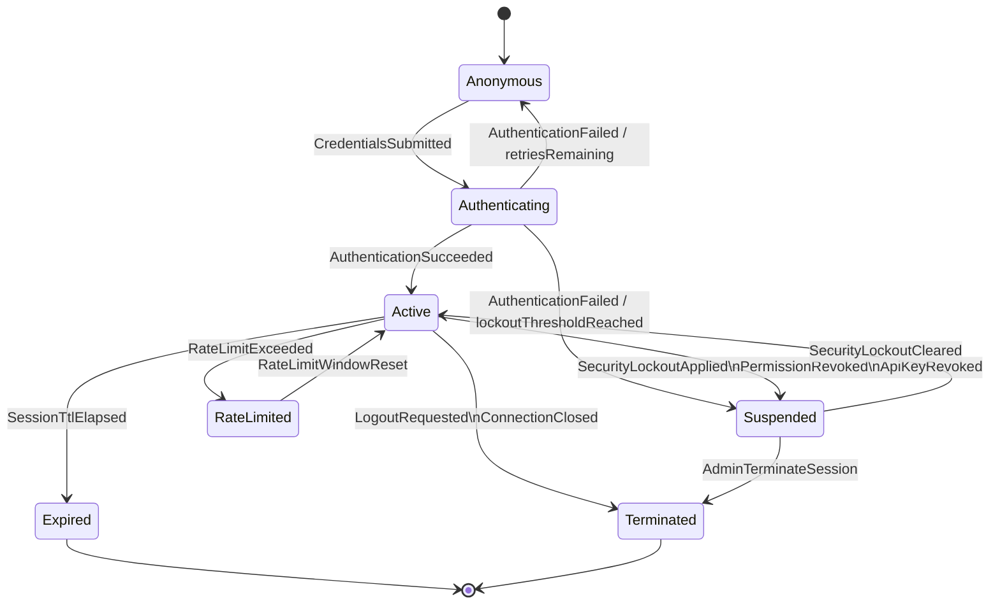
```mermaid
stateDiagram-v2
    [*] --> Anonymous
    Anonymous --> Authenticating: CredentialsSubmitted
    Authenticating --> Active: AuthenticationSucceeded
    Authenticating --> Anonymous: AuthenticationFailed / retriesRemaining
    Authenticating --> Suspended: AuthenticationFailed / lockoutThresholdReached
    Active --> RateLimited: RateLimitExceeded
    RateLimited --> Active: RateLimitWindowReset
    Active --> Suspended: SecurityLockoutApplied\nPermissionRevoked\nApiKeyRevoked
    Suspended --> Active: SecurityLockoutCleared
    Active --> Expired: SessionTtlElapsed
    Active --> Terminated: LogoutRequested\nConnectionClosed
    Suspended --> Terminated: AdminTerminateSession
    Expired --> [*]
    Terminated --> [*]
```
Test cases:
•	Authenticate with valid credentials and assert Anonymous -> Authenticating -> Active.
•	Submit invalid credentials below retry threshold and assert return to Anonymous with failure audit.
•	Exceed retry threshold and assert Suspended with no request forwarding.
•	Exceed rate limit and assert RateLimited rejects requests until reset.
•	Revoke the backing API key and assert next validation transitions Active -> Suspended.
Acceptance criteria:
•	Requests are accepted only when the session is Active and permissions are current.
•	Terminal states cannot transition back to Active with the same session_id.
•	Transitions are idempotent under duplicate gateway messages.
•	Failure transitions emit auditable events before client-visible errors are returned.

State Machine: API Key:
Purpose: Define the lifecycle of programmatic credentials from creation through activation, rotation, suspension, expiry, and revocation.
State definitions:
•	Draft: key metadata is being assembled and has not been issued.
•	Active: key can authenticate requests within configured permissions, expiry, and IP policy.
•	Rotating: replacement credentials have been generated and overlap rules are active.
•	Suspended: key is temporarily disabled by risk, compliance, or admin action.
•	Expired: key is past expires_at and must not authenticate.
•	Revoked: key is permanently disabled and secrets must be unusable.
Valid transitions:
•	Draft -> Active on KeyIssued.
•	Active -> Rotating on RotationRequested.
•	Rotating -> Active on RotationCompleted.
•	Active -> Suspended on AdminSuspendKey or RiskSuspendKey.
•	Suspended -> Active on AdminResumeKey.
•	Active or Rotating -> Expired on ExpiryReached.
•	Active, Suspended, or Expired -> Revoked on KeyRevoked.
Invalid transitions:
•	Revoked -> Active, Revoked -> Rotating, and Expired -> Active are forbidden.
•	Draft -> Rotating is forbidden because unissued keys have no live secret.
•	Suspended -> Rotating is forbidden until suspension is cleared.
•	Active -> Draft is forbidden because issuance is immutable.
Failure transitions:
•	Draft -> Revoked on SecretMaterializationFailed after secure erase.
•	Rotating -> Suspended on RotationIntegrityCheckFailed.
•	Active -> Suspended on SignatureReplayDetected, IpWhitelistViolation, or permissions mismatch.
•	Any non-terminal state -> Revoked on CompromiseConfirmed.
Recovery behaviour:
•	Suspended keys recover only through maker-checker approval and permission revalidation.
•	Failed rotation resumes the previous secret only if compromise is not suspected; otherwise revoke.
•	Expired keys are not recovered; create a new key.
•	Revoked keys are never recovered and remain on revocation lists until all caches pass the revocation watermark.
Events emitted:
•	ApiKeyDraftCreated
•	ApiKeyIssued
•	ApiKeyRotationRequested
•	ApiKeyRotated
•	ApiKeySuspended
•	ApiKeyResumed
•	ApiKeyExpired
•	ApiKeyRevoked
•	ApiKeyAuthenticationRejected
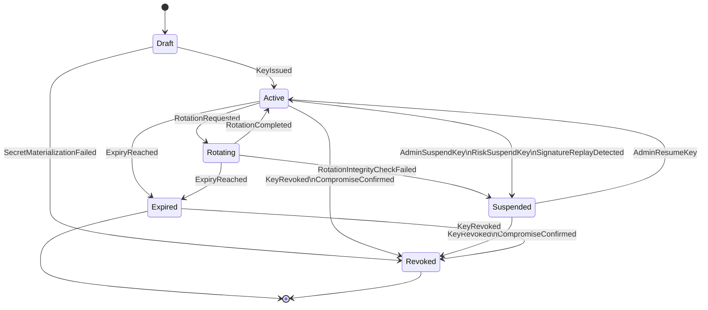
```mermaid
stateDiagram-v2
    [*] --> Draft
    Draft --> Active: KeyIssued
    Draft --> Revoked: SecretMaterializationFailed
    Active --> Rotating: RotationRequested
    Rotating --> Active: RotationCompleted
    Rotating --> Suspended: RotationIntegrityCheckFailed
    Active --> Suspended: AdminSuspendKey\nRiskSuspendKey\nSignatureReplayDetected
    Suspended --> Active: AdminResumeKey
    Active --> Expired: ExpiryReached
    Rotating --> Expired: ExpiryReached
    Active --> Revoked: KeyRevoked\nCompromiseConfirmed
    Suspended --> Revoked: KeyRevoked\nCompromiseConfirmed
    Expired --> Revoked: KeyRevoked
    Expired --> [*]
    Revoked --> [*]
```
Test cases:
•	Issue a key and assert it authenticates only within scoped permissions and IP whitelist.
•	Rotate a key and assert old and new credentials follow overlap rules.
•	Suspend a key and assert authentication fails without deleting metadata.
•	Expire a key and assert it cannot be resumed.
•	Revoke a key and assert cache invalidation propagates before success is reported.
Acceptance criteria:
•	Revoked and expired keys cannot authenticate under any gateway cache state.
•	Permission scope never exceeds the owning user permissions.
•	Rotation is atomic from the client perspective and auditable.
•	Secret values are never emitted in events, logs, or state projections.

Business Rules:
1.	API keys must be created with explicit permissions.
2.	API key permissions cannot exceed user permissions.
3.	Rate limits must be enforced per IP, per user, and per API key.
4.	Suspicious activity must trigger alerts and potential lockouts.
5.	All authentication failures must be logged.
Implementation Contracts:
rust
// Gateway Service
trait GatewayService {
    fn authenticate_session(&self, credentials: AuthCredentials) -> Result<Session, AuthError>;
    fn validate_request(&self, session: &Session, request: &Request) -> Result<(), ValidationError>;
    fn check_rate_limit(&self, key: &RateLimitKey) -> Result<RateLimitStatus, RateLimitError>;
    fn forward_to_trading(&self, envelope: OrderEnvelope) -> Result<OrderResult, ForwardError>;
}

// API Key Management
trait ApiKeyService {
    fn create_key(&self, user_id: UserId, permissions: Vec<Permission>) -> Result<ApiKey, ApiKeyError>;
    fn revoke_key(&self, api_key_id: ApiKeyId) -> Result<(), ApiKeyError>;
    fn list_keys(&self, user_id: UserId) -> Result<Vec<ApiKey>, ApiKeyError>;
    fn rotate_key(&self, api_key_id: ApiKeyId) -> Result<ApiKey, ApiKeyError>;
}
________________________________________
2.8.2 Trading Context
Purpose: Manage order placement, matching, and execution.
Business Context: The Trading context is the core of the exchange. It receives orders from clients, matches them against resting orders, and generates trades. It must be fast, deterministic, and fair.
Engineering Context: The Trading context is implemented as Book Cores, each managing a single instrument or shard. It runs in a single-writer configuration with no external dependencies in the hot path. All state is derived from events.
Core Concepts:
Order:
•	A request to buy or sell an asset.
•	Contains instrument, side, type, price, quantity, and time-in-force.
•	Moves through defined lifecycle states.
rust
struct Order {
    order_id: OrderId,
    client_order_id: ClientOrderId,
    book_id: BookId,
    user_id: UserId,
    side: OrderSide,
    order_type: OrderType,
    price: PriceI64,
    quantity: QtyI64,
    filled_quantity: QtyI64,
    time_in_force: TimeInForce,
    status: OrderStatus,
    created_at: Timestamp,
    updated_at: Timestamp,
    fees: FeeInfo,
    metadata: OrderMetadata,
}

enum OrderSide {
    Buy,
    Sell,
}

enum OrderType {
    Market,
    Limit,
    StopMarket,
    StopLimit,
    TakeProfitMarket,
    TakeProfitLimit,
}

enum TimeInForce {
    GTC,  // Good Till Cancelled
    IOC,  // Immediate or Cancel
    FOK,  // Fill or Kill
    GTD,  // Good Till Date
    PO,   // Post Only
    RO,   // Reduce Only
}

enum OrderStatus {
    New,
    PartiallyFilled,
    Filled,
    Cancelled,
    Rejected,
    Expired,
}
Order Book:
•	The collection of resting buy (bid) and sell (ask) orders.
•	Maintains price-time priority.
•	Enables matching of incoming orders.
rust
struct OrderBook {
    book_id: BookId,
    symbol: String,
    bids: PriceLevelMap,  // Price -> OrderList
    asks: PriceLevelMap,  // Price -> OrderList
    base_asset: Asset,
    quote_asset: Asset,
    tick_size: PriceI64,
    step_size: QtyI64,
    min_notional: NotionalI64,
    max_position: QtyI64,
}
Trade:
•	The result of matching a buy order and a sell order.
•	Contains price, quantity, buyer, seller, and execution time.
rust
struct Trade {
    trade_id: TradeId,
    book_id: BookId,
    buyer_order_id: OrderId,
    seller_order_id: OrderId,
    buyer_user_id: UserId,
    seller_user_id: UserId,
    price: PriceI64,
    quantity: QtyI64,
    notional: NotionalI64,
    execution_time: Timestamp,
    fees: FeeBreakdown,
}
Engine Event:
•	The immutable record of a trading decision.
•	Contains order result, trades, and clearing deltas.
•	The source of truth for all state.
rust
struct EngineEvent {
    event_id: EventId,
    book_id: BookId,
    book_seq: u64,
    event_type: EventType,
    order_result: OrderResult,
    trades: Vec<Trade>,
    clearing: ClearingDelta,
    timestamp: Timestamp,
    previous_hash: Hash,
    event_hash: Hash,
}

struct ClearingDelta {
    buyer_asset_delta: QtyI64,
    buyer_quote_delta: QtyI64,
    seller_asset_delta: QtyI64,
    seller_quote_delta: QtyI64,
    buyer_fee_delta: QtyI64,
    seller_fee_delta: QtyI64,
    hold_release: QtyI64,
    hold_consume: QtyI64,
}
State Machine: Order Lifecycle:
Purpose: Define deterministic order progression from client acceptance through matching, resting, cancellation, expiry, rejection, or full execution.
State definitions:
•	Received: lifecycle state.
•	Validating: lifecycle state.
•	Rejected: lifecycle state.
•	Accepted: lifecycle state.
•	Resting: lifecycle state.
•	PartiallyFilled: lifecycle state.
•	Filled: lifecycle state.
•	CancelPending: lifecycle state.
•	Cancelled: lifecycle state.
•	Expired: lifecycle state.
Valid transitions:
•	Received -> Validating on OrderReceived.
•	Validating -> Accepted on ValidationPassed and RiskReserved.
•	Validating -> Rejected on ValidationFailed or RiskRejected.
•	Accepted -> Filled, PartiallyFilled, or Resting according to execution result.
•	Resting or PartiallyFilled -> CancelPending on CancelRequested.
•	CancelPending -> Cancelled or Filled according to Book Core sequence order.
•	Resting or PartiallyFilled -> Expired on TimeInForceExpired.
Invalid transitions:
•	Terminal Rejected, Filled, Cancelled, and Expired states cannot return to active states.
•	Received -> Resting without validation and risk reservation is forbidden.
•	Filled -> CancelPending and Cancelled -> PartiallyFilled are forbidden.
Failure transitions:
•	Validating -> Rejected on malformed order, halted instrument, insufficient funds, self-trade rejection, or risk limit breach.
•	Resting -> Cancelled on instrument halt cancel policy or account suspension.
•	CancelPending -> Filled when a final fill is sequenced before the cancel.
Recovery behaviour:
•	Rebuild order state exclusively from EngineEvent sequence.
•	Duplicate client_order_id returns the existing state without creating a second order.
•	After Book Core failover, replay accepted, trade, cancel, and expiry events.
•	Lost gateway responses recover through get_order_status.
Events emitted:
•	OrderReceived
•	OrderValidationPassed
•	OrderRejected
•	OrderAccepted
•	OrderRested
•	TradeExecuted
•	OrderPartiallyFilled
•	OrderFilled
•	OrderCancelRequested
•	OrderCancelled
•	OrderExpired
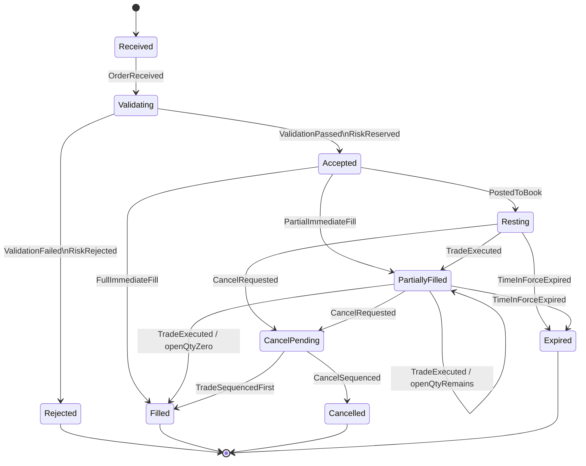
```mermaid
stateDiagram-v2
    [*] --> Received
    Received --> Validating: OrderReceived
    Validating --> Accepted: ValidationPassed\nRiskReserved
    Validating --> Rejected: ValidationFailed\nRiskRejected
    Accepted --> Filled: FullImmediateFill
    Accepted --> PartiallyFilled: PartialImmediateFill
    Accepted --> Resting: PostedToBook
    Resting --> PartiallyFilled: TradeExecuted
    PartiallyFilled --> PartiallyFilled: TradeExecuted / openQtyRemains
    PartiallyFilled --> Filled: TradeExecuted / openQtyZero
    Resting --> CancelPending: CancelRequested
    PartiallyFilled --> CancelPending: CancelRequested
    CancelPending --> Cancelled: CancelSequenced
    CancelPending --> Filled: TradeSequencedFirst
    Resting --> Expired: TimeInForceExpired
    PartiallyFilled --> Expired: TimeInForceExpired
    Rejected --> [*]
    Filled --> [*]
    Cancelled --> [*]
    Expired --> [*]
```
Test cases:
•	Valid limit order rests.
•	Marketable order fills or partially fills based on liquidity.
•	Invalid tick size rejects with no hold.
•	Cancel releases remaining hold exactly once.
•	Cancel/fill race resolves by sequence order.
Acceptance criteria:
•	Every transition is represented by a sequenced engine event.
•	Terminal states are immutable and idempotent.
•	Open quantity, holds, fees, and fills reconcile to the event stream.
•	Cancel and fill races resolve solely by Book Core sequence order.
Business Rules:
1.	Orders must have valid instrument, side, price (if limit), and quantity.
2.	Price must respect tick size.
3.	Quantity must respect step size.
4.	Notional value must meet minimum notional requirement.
5.	Users cannot exceed their position limits.
6.	Post-only orders must rest on the book (not match immediately).
7.	Reduce-only orders must not increase position size.
8.	Self-trades must be prevented or flagged.
9.	Market orders have a price protection limit.
10.	Time-in-force rules must be enforced:
o	GTC: Order remains until cancelled or filled.
o	IOC: Unfilled portion is cancelled.
o	FOK: Entire order must fill or it is cancelled.
o	GTD: Order expires at specified date.
o	PO: Must not match immediately.
o	RO: Must not increase position.
Implementation Contracts:
rust
// Order Management Service
trait OrderManagement {
    fn place_order(&self, envelope: OrderEnvelope) -> OrderResult;
    fn cancel_order(&self, order_id: OrderId, user_id: UserId) -> Result<(), CancelError>;
    fn cancel_all_orders(&self, user_id: UserId, book_id: Option<BookId>) -> Result<Vec<OrderId>, CancelError>;
    fn replace_order(&self, order_id: OrderId, new_price: PriceI64, new_qty: QtyI64) -> Result<OrderResult, ReplaceError>;
    fn get_order_status(&self, order_id: OrderId, user_id: UserId) -> Result<OrderStatus, QueryError>;
    fn get_open_orders(&self, user_id: UserId, book_id: Option<BookId>) -> Result<Vec<Order>, QueryError>;
}

// Matching Engine
trait MatchingEngine {
    fn match_order(&mut self, order: &Order, book: &mut OrderBook) -> MatchResult;
    fn add_resting_order(&mut self, order: Order, book: &mut OrderBook) -> AddResult;
    fn remove_resting_order(&mut self, order_id: OrderId, book: &mut OrderBook) -> RemoveResult;
}
________________________________________
2.8.3 Risk Context
Purpose: Manage pre-trade and post-trade risk exposure.
Business Context: The exchange must prevent users from taking positions they cannot support. Pre-trade risk checks ensure users have sufficient funds before accepting orders. Post-trade risk monitoring detects and responds to emerging risk exposures.
Engineering Context: The Risk context is split into two components:
•	Hot Risk: In the trading hot path. Uses local credit buckets or risk caches.
•	Cold Risk: Asynchronous. Performs comprehensive risk analysis and reporting.
Core Concepts:
Credit Bucket:
•	Pre-allocated funds for a specific instrument or portfolio.
•	Enables local, in-process risk checks.
rust
struct CreditBucket {
    bucket_id: BucketId,
    user_id: UserId,
    book_id: BookId,
    total_credit: QtyI64,
    used_credit: QtyI64,
    available_credit: QtyI64,
    locked_orders: Vec<OrderId>,
    updated_at: Timestamp,
}
Position:
•	A user's current exposure in an instrument.
•	Updated after each trade and settlement.
rust
struct Position {
    position_id: PositionId,
    user_id: UserId,
    book_id: BookId,
    side: PositionSide,
    quantity: QtyI64,
    average_price: PriceI64,
    current_price: PriceI64,
    unrealized_pnl: QtyI64,
    realized_pnl: QtyI64,
    fees_paid: QtyI64,
    created_at: Timestamp,
    updated_at: Timestamp,
}

enum PositionSide {
    Long,
    Short,
    Flat,
}
Risk Check:
•	Validation performed before accepting an order.
•	Ensures order does not violate risk limits.
rust
struct RiskCheckResult {
    is_allowed: bool,
    reason: Option<RiskRejectReason>,
    required_balance: QtyI64,
    available_balance: QtyI64,
    remaining_limit: QtyI64,
}

enum RiskRejectReason {
    InsufficientBalance,
    InsufficientCreditBucket,
    ExceedsPositionLimit,
    ExceedsNotionalLimit,
    LeverageExceedsLimit,
    AccountRestricted,
    InstrumentHalted,
}
Business Rules:
1.	Users cannot spend more than their available balance or credit bucket.
2.	Position limits prevent excessive concentration.
3.	Notional limits limit total exposure.
4.	Leverage limits are enforced per instrument and user tier.
5.	Restricted accounts cannot trade.
6.	Halted instruments cannot accept new orders.
Implementation Contracts:
rust
// Risk Service
trait RiskService {
    fn check_order_risk(&self, order: &Order, user: &User) -> RiskCheckResult;
    fn reserve_funds(&self, order_id: OrderId, amount: QtyI64) -> Result<Reservation, RiskError>;
    fn release_funds(&self, reservation: &Reservation) -> Result<(), RiskError>;
    fn consume_reserved_funds(&self, reservation: &Reservation) -> Result<(), RiskError>;
    fn get_positions(&self, user_id: UserId) -> Result<Vec<Position>, RiskError>;
    fn get_credit_bucket(&self, user_id: UserId, book_id: BookId) -> Option<CreditBucket>;
}

// Credit Bucket Management
trait CreditBucketService {
    fn allocate_credit(&self, user_id: UserId, book_id: BookId, amount: QtyI64) -> Result<(), BucketError>;
    fn deallocate_credit(&self, user_id: UserId, book_id: BookId, amount: QtyI64) -> Result<(), BucketError>;
    fn transfer_credit(&self, from_bucket: BucketId, to_bucket: BucketId, amount: QtyI64) -> Result<(), BucketError>;
}
________________________________________
2.8.4 Clearing Context
Purpose: Settle trades, calculate fees, and update positions.
Business Context: When orders match, they create trades that must be settled. The Clearing context calculates the financial consequences of trades: asset transfers, quote asset transfers, fee payments, position updates, and balance changes.
Engineering Context: Clearing is performed in the hot path as part of the Engine Event. The clearing calculations are deterministic and use only the information available in the Engine Event.
Core Concepts:
Clearing Instruction:
•	The set of financial actions resulting from a trade.
•	Defines what to debit, credit, and charge.
rust
struct ClearingInstruction {
    buyer_user_id: UserId,
    seller_user_id: UserId,
    asset: Asset,
    quantity: QtyI64,
    quote_asset: Asset,
    price: PriceI64,
    notional: NotionalI64,
    maker_fee_rate: FeeRate,
    taker_fee_rate: FeeRate,
    fee_asset: Asset,
}
Fee Calculation:
•	Determines the fee for each trade.
•	Based on maker/taker status, fee tier, and any discounts.
rust
struct FeeCalculation {
    fee_type: FeeType,
    rate: FeeRate,
    amount: QtyI64,
    asset: Asset,
}

enum FeeType {
    Maker,
    Taker,
    Discount,
    Rebate,
}
Settlement:
•	The final reconciliation of a trade.
•	Updates balances and positions.
rust
struct Settlement {
    settlement_id: SettlementId,
    trade_id: TradeId,
    buyer_balance_delta: QtyI64,
    seller_balance_delta: QtyI64,
    buyer_position_delta: QtyI64,
    seller_position_delta: QtyI64,
    buyer_fee_delta: QtyI64,
    seller_fee_delta: QtyI64,
    settled_at: Timestamp,
}
Business Rules:
1.	Maker fees are applied to orders that rest on the book.
2.	Taker fees are applied to orders that match immediately.
3.	Fee discounts must be applied correctly.
4.	Rebates must be credited correctly.
5.	Positions must be updated with average price calculation.
6.	Balances must be updated atomically with trades.
7.	Fee calculations must not create negative balances.
Implementation Contracts:
rust
// Clearing Service
trait ClearingService {
    fn calculate_clearing(&self, trade: &Trade, maker_order: &Order, taker_order: &Order) -> ClearingResult;
    fn calculate_fees(&self, order: &Order, trade: &Trade, fee_tier: &FeeTier) -> FeeResult;
    fn update_positions(&self, trade: &Trade, clearing: &ClearingResult) -> PositionUpdate;
    fn generate_settlement(&self, trade: &Trade, clearing: &ClearingResult) -> Settlement;
}
________________________________________
2.8.5 Wallet Context
Purpose: Manage user assets, deposits, and withdrawals.
Business Context: Users deposit assets, trade them, and withdraw profits. The Wallet context manages the lifecycle of user assets, tracks balances, and handles the flow of funds in and out of the exchange.
Engineering Context: The Wallet context is a cold path system. It receives balance updates from Engine Events and provides user-facing APIs for deposits, withdrawals, and balance queries.
Core Concepts:
Asset:
•	A tradable asset (cryptocurrency or fiat).
•	Defines precision, deposit/withdrawal constraints.
rust
struct Asset {
    asset_id: AssetId,
    symbol: String,
    name: String,
    asset_type: AssetType,
    precision: u8,  // Decimal places
    min_withdraw: QtyI64,
    min_deposit: QtyI64,
    withdrawal_fee: QtyI64,
    is_active: bool,
}

enum AssetType {
    Crypto,
    Fiat,
}
Balance:
•	A user's holding of a specific asset.
•	Updated by trading, deposits, and withdrawals.
rust
struct Balance {
    user_id: UserId,
    asset: Asset,
    total: QtyI64,
    available: QtyI64,
    frozen: QtyI64,  // Locked by orders
    in_orders: QtyI64,
    updated_at: Timestamp,
}
Transaction:
•	A record of asset movement.
•	Used for deposits, withdrawals, and internal transfers.
rust
struct Transaction {
    transaction_id: TransactionId,
    user_id: UserId,
    asset: Asset,
    amount: QtyI64,
    transaction_type: TransactionType,
    status: TransactionStatus,
    reference: String,
    created_at: Timestamp,
    completed_at: Option<Timestamp>,
    fee: QtyI64,
}

enum TransactionType {
    Deposit,
    Withdrawal,
    Transfer,
    Fee,
}

enum TransactionStatus {
    Pending,
    Processing,
    Completed,
    Failed,
    Cancelled,
}
Withdrawal:
•	A request to move assets out of the exchange.
•	Subject to security review and risk checks.
rust
struct Withdrawal {
    withdrawal_id: WithdrawalId,
    user_id: UserId,
    asset: Asset,
    address: Address,
    amount: QtyI64,
    fee: QtyI64,
    status: WithdrawalStatus,
    security_check: SecurityCheck,
    created_at: Timestamp,
    processed_at: Option<Timestamp>,
    tx_hash: Option<String>,
}

enum WithdrawalStatus {
    Pending,
    SecurityReview,
    Processing,
    Completed,
    Failed,
    Cancelled,
}
State Machine: Withdrawal:
Purpose: Define the controlled withdrawal lifecycle from user request through authorization, compliance review, wallet execution, completion, cancellation, or failure.
State definitions:
•	Requested: lifecycle state.
•	Verifying: lifecycle state.
•	SecurityReview: lifecycle state.
•	Approved: lifecycle state.
•	Processing: lifecycle state.
•	Broadcast: lifecycle state.
•	Completed: lifecycle state.
•	Failed: lifecycle state.
•	Cancelled: lifecycle state.
Valid transitions:
•	Requested -> Verifying on WithdrawalCreated.
•	Verifying -> Approved, SecurityReview, or Failed based on checks.
•	SecurityReview -> Approved or Cancelled by review decision.
•	Approved -> Processing on WalletDispatchStarted or Cancelled before dispatch.
•	Processing -> Broadcast on TransactionBroadcast or Failed on signer/broadcast failure.
•	Broadcast -> Completed on confirmations or Failed after final chain failure.
Invalid transitions:
•	Completed -> Cancelled or Failed is forbidden.
•	Cancelled -> Processing is forbidden.
•	Requested -> Processing without verification and approval is forbidden.
Failure transitions:
•	Verifying -> Failed on insufficient balance, 2FA failure, sanctions hit, or limit breach.
•	Approved -> Failed on hot-wallet liquidity timeout.
•	Processing -> Failed on signer quorum failure or policy rejection.
Recovery behaviour:
•	Pre-broadcast Failed or Cancelled releases holds exactly once.
•	Processing retries use the same withdrawal_id until broadcast.
•	Broadcast recovery polls chain state and completes if confirmations are observed.
•	Post-broadcast failure requires reconciliation workflow.
Events emitted:
•	WithdrawalCreated
•	WithdrawalVerificationPassed
•	WithdrawalVerificationFailed
•	WithdrawalReviewRequired
•	WithdrawalApproved
•	WithdrawalRejected
•	WithdrawalProcessingStarted
•	WithdrawalBroadcast
•	WithdrawalCompleted
•	WithdrawalFailed
•	WithdrawalCancelled
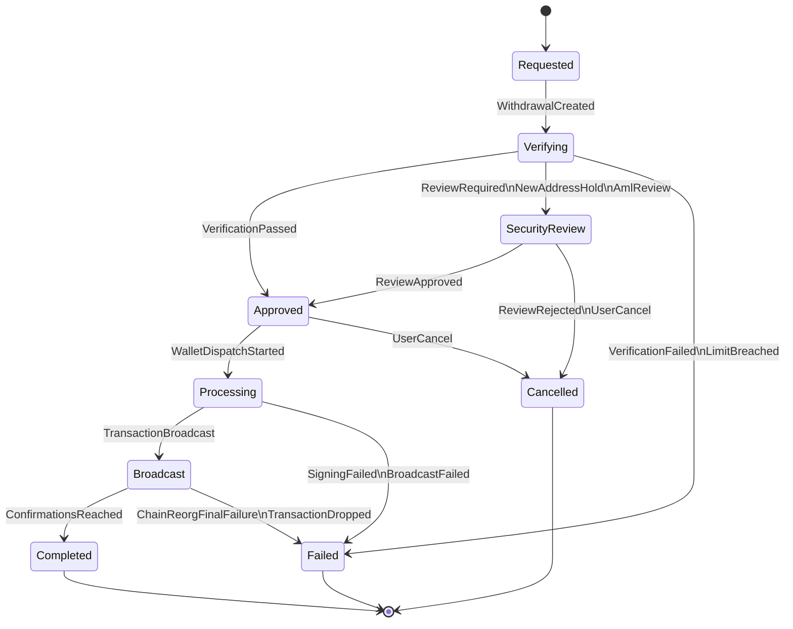
```mermaid
stateDiagram-v2
    [*] --> Requested
    Requested --> Verifying: WithdrawalCreated
    Verifying --> Approved: VerificationPassed
    Verifying --> SecurityReview: ReviewRequired\nNewAddressHold\nAmlReview
    Verifying --> Failed: VerificationFailed\nLimitBreached
    SecurityReview --> Approved: ReviewApproved
    SecurityReview --> Cancelled: ReviewRejected\nUserCancel
    Approved --> Processing: WalletDispatchStarted
    Approved --> Cancelled: UserCancel
    Processing --> Broadcast: TransactionBroadcast
    Processing --> Failed: SigningFailed\nBroadcastFailed
    Broadcast --> Completed: ConfirmationsReached
    Broadcast --> Failed: ChainReorgFinalFailure\nTransactionDropped
    Completed --> [*]
    Failed --> [*]
    Cancelled --> [*]
```
Test cases:
•	Valid withdrawal locks funds through approval.
•	New-address hold enters SecurityReview.
•	2FA failure prevents wallet dispatch.
•	Cancel before dispatch releases funds once.
•	Missed chain callback recovers by polling.
Acceptance criteria:
•	No withdrawal reaches Processing without verification, approval, and locked funds.
•	Funds are released exactly once for pre-broadcast failures or cancellations.
•	Completed withdrawals have immutable tx_hash and balanced ledger entries.
•	Manual decisions include maker-checker audit metadata.
Business Rules:
1.	Withdrawals require 2FA verification.
2.	Withdrawals to new addresses have a 24-hour hold.
3.	Daily withdrawal limits are enforced.
4.	Withdrawals are subject to AML checks.
5.	Hot wallet balances must be maintained above thresholds.
6.	Cold wallet transfers require multiple approvals.
Implementation Contracts:
rust
// Wallet Service
trait WalletService {
    fn get_balance(&self, user_id: UserId, asset: Asset) -> Result<Balance, WalletError>;
    fn get_all_balances(&self, user_id: UserId) -> Result<Vec<Balance>, WalletError>;
    fn update_balance(&self, user_id: UserId, asset: Asset, delta: QtyI64) -> Result<(), WalletError>;
    
    fn request_deposit(&self, user_id: UserId, asset: Asset, amount: QtyI64) -> Result<Address, WalletError>;
    fn request_withdrawal(&self, request: WithdrawalRequest) -> Result<Withdrawal, WalletError>;
    fn cancel_withdrawal(&self, withdrawal_id: WithdrawalId) -> Result<(), WalletError>;
    
    fn get_transaction_history(&self, user_id: UserId, limit: u32, offset: u32) -> Result<Vec<Transaction>, WalletError>;
}

// Withdrawal Service
trait WithdrawalService {
    fn create_withdrawal(&self, request: WithdrawalRequest) -> Result<Withdrawal, WithdrawalError>;
    fn approve_withdrawal(&self, withdrawal_id: WithdrawalId, approver: &Admin) -> Result<(), WithdrawalError>;
    fn reject_withdrawal(&self, withdrawal_id: WithdrawalId, reason: String) -> Result<(), WithdrawalError>;
    fn process_withdrawal(&self, withdrawal_id: WithdrawalId) -> Result<Transaction, WithdrawalError>;
}
________________________________________
2.8.6 Ledger Context
Purpose: Maintain the accounting records of the exchange.
Business Context: The exchange must maintain accurate accounting records for all financial activities. The Ledger provides a double-entry accounting system that records every financial transaction.
Engineering Context: The Ledger is a cold path system. It is a projection built from Engine Events, deposit events, and withdrawal events. All entries are immutable.
Core Concepts:
Account:
•	A record of financial activity for a specific purpose.
•	Each user has asset accounts; the exchange has operational accounts.
rust
struct Account {
    account_id: AccountId,
    account_type: AccountType,
    user_id: Option<UserId>,
    asset: Asset,
    balance: QtyI64,
    version: u64,
}

enum AccountType {
    UserAsset,
    Fee,
    InsuranceFund,
    Treasury,
    Settlement,
}
Journal Entry:
•	A single accounting entry (debit or credit).
•	Part of a double-entry transaction.
rust
struct JournalEntry {
    entry_id: EntryId,
    transaction_id: TransactionId,
    account_id: AccountId,
    amount: QtyI64,
    direction: EntryDirection,
    description: String,
    created_at: Timestamp,
}

enum EntryDirection {
    Debit,
    Credit,
}
Transaction (Ledger):
•	A set of journal entries that balance (debits = credits).
•	Represents a single financial event.
rust
struct LedgerTransaction {
    transaction_id: TransactionId,
    entries: Vec<JournalEntry>,
    event_id: EventId,  // Reference to the Engine Event that caused this
    created_at: Timestamp,
    is_valid: bool,
}
Business Rules:
1.	Every ledger transaction must balance (debits = credits).
2.	Account balances must not go negative.
3.	Transaction history must be immutable.
4.	Ledger must be reconstructible from events.
Implementation Contracts:
rust
// Ledger Service
trait LedgerService {
    fn post_transaction(&self, transaction: LedgerTransaction) -> Result<(), LedgerError>;
    fn get_balance(&self, account_id: AccountId) -> Result<QtyI64, LedgerError>;
    fn get_transactions(&self, account_id: AccountId, limit: u32, offset: u32) -> Result<Vec<LedgerTransaction>, LedgerError>;
    fn reconcile(&self, from_event: EventId, to_event: EventId) -> Result<ReconciliationReport, LedgerError>;
}

// Accounting Service
trait AccountingService {
    fn generate_trial_balance(&self) -> Result<TrialBalance, LedgerError>;
    fn generate_income_statement(&self, start_date: Date, end_date: Date) -> Result<IncomeStatement, LedgerError>;
    fn generate_balance_sheet(&self, as_of_date: Date) -> Result<BalanceSheet, LedgerError>;
}
________________________________________
2.8.7 Market Data Context
Purpose: Provide real-time and historical market data to clients.
Business Context: Traders need real-time market data to make informed trading decisions. The Market Data context distributes order book snapshots, trades, and ticker information.
Engineering Context: Market Data is a cold path system. It consumes Engine Events to generate market data feeds. It is designed for high throughput and low latency distribution.
Core Concepts:
Depth Snapshot:
•	A point-in-time snapshot of the order book.
•	Contains bids and asks at specified depth levels.
rust
struct DepthSnapshot {
    book_id: BookId,
    sequence: u64,
    bids: Vec<PriceLevel>,
    asks: Vec<PriceLevel>,
    timestamp: Timestamp,
}

struct PriceLevel {
    price: PriceI64,
    quantity: QtyI64,
    order_count: u32,
}
Depth Delta:
•	Incremental updates to the order book.
•	Used by clients to maintain a local copy.
rust
struct DepthDelta {
    book_id: BookId,
    sequence: u64,
    bids: Vec<PriceLevelDelta>,
    asks: Vec<PriceLevelDelta>,
    timestamp: Timestamp,
}

struct PriceLevelDelta {
    price: PriceI64,
    quantity: QtyI64,  // 0 = remove level
}
Trade Feed:
•	Stream of public trades.
•	Used for market analysis and execution algorithms.
rust
struct PublicTrade {
    trade_id: TradeId,
    book_id: BookId,
    price: PriceI64,
    quantity: QtyI64,
    side: TradeSide,
    timestamp: Timestamp,
}

enum TradeSide {
    Buy,
    Sell,
}
Ticker:
•	Summary statistics for an instrument.
•	Used for quick market overview.
rust
struct Ticker {
    book_id: BookId,
    symbol: String,
    last_price: PriceI64,
    mark_price: PriceI64,
    bid_price: PriceI64,
    ask_price: PriceI64,
    volume_24h: QtyI64,
    high_24h: PriceI64,
    low_24h: PriceI64,
    change_24h: f64,
    open_interest: Option<QtyI64>,
    timestamp: Timestamp,
}
Candle:
•	Aggregated OHLCV data for a time period.
•	Used for charting and technical analysis.
rust
struct Candle {
    book_id: BookId,
    interval: CandleInterval,
    open: PriceI64,
    high: PriceI64,
    low: PriceI64,
    close: PriceI64,
    volume: QtyI64,
    timestamp: Timestamp,
}

enum CandleInterval {
    Minute1,
    Minute5,
    Minute15,
    Hour1,
    Hour4,
    Day1,
    Week1,
    Month1,
}
Business Rules:
1.	Market data must be delivered with sequence IDs.
2.	Clients must be able to recover from missed messages.
3.	Slow clients must not degrade feed quality for others.
4.	Snapshots must be available on request.
5.	Historical data must be available for reporting and analysis.
Implementation Contracts:
rust
// Market Data Service
trait MarketDataService {
    fn subscribe_depth(&self, book_id: BookId, depth: u32) -> Subscription<DepthDelta>;
    fn subscribe_trades(&self, book_id: BookId) -> Subscription<PublicTrade>;
    fn subscribe_ticker(&self, book_id: BookId) -> Subscription<Ticker>;
    fn get_depth_snapshot(&self, book_id: BookId, depth: u32) -> DepthSnapshot;
    fn get_trades(&self, book_id: BookId, limit: u32) -> Vec<PublicTrade>;
    fn get_candles(&self, book_id: BookId, interval: CandleInterval, start: Timestamp, end: Timestamp) -> Vec<Candle>;
}

// Subscription Management
trait SubscriptionService {
    fn subscribe(&self, client_id: ClientId, stream: Stream, filters: Option<Filters>) -> SubscriptionId;
    fn unsubscribe(&self, subscription_id: SubscriptionId) -> Result<(), SubscriptionError>;
    fn list_subscriptions(&self, client_id: ClientId) -> Vec<Subscription>;
}
________________________________________
2.8.8 Futures Context
Purpose: Manage perpetual futures and delivery contracts.
Business Context: Futures are derivative contracts that obligate the buyer to purchase an asset (or the seller to sell) at a predetermined future date and price. Perpetual futures are similar but have no expiry date and use a funding rate to keep the contract price close to the underlying index.
Engineering Context: Futures are an extension of the Trading context. They introduce new state (positions, funding) and new risk management requirements (margin, liquidation).
Core Concepts:
Perpetual:
•	A futures contract with no expiry.
•	Uses funding rate to maintain price convergence.
rust
struct Perpetual {
    book_id: BookId,
    underlying: String,
    funding_rate: f64,
    next_funding_time: Timestamp,
    funding_interval: Duration,
    mark_price: PriceI64,
    index_price: PriceI64,
}
Funding Rate:
•	The rate at which long and short position holders exchange payments.
•	Maintains price convergence with the underlying.
rust
struct FundingRate {
    book_id: BookId,
    rate: f64,
    premium_index: f64,
    interest_rate: f64,
    timestamp: Timestamp,
    valid_until: Timestamp,
}
Futures Position:
•	A user's position in a futures contract.
•	Includes size, direction, margin, and PnL.
rust
struct FuturesPosition {
    position_id: PositionId,
    user_id: UserId,
    book_id: BookId,
    side: PositionSide,
    size: QtyI64,
    entry_price: PriceI64,
    mark_price: PriceI64,
    margin: QtyI64,
    unrealized_pnl: QtyI64,
    realized_pnl: QtyI64,
    margin_mode: MarginMode,
    leverage: f64,
    liquidation_price: PriceI64,
}
State Machine: Futures Position:
Purpose: Define lifecycle and risk state of user futures exposure from flat through open, adjusted, margin-stressed, liquidation, and closure.
State definitions:
•	Flat: no open size exists.
•	Opening: trade is creating exposure and margin is being bound.
•	Open: non-zero size satisfies margin requirements.
•	Increasing: execution increases absolute size.
•	Reducing: execution decreases absolute size.
•	MarginCall: margin ratio is below warning threshold.
•	LiquidationPending: maintenance breach is queued.
•	Liquidating: liquidation is executing.
•	Closed: size is zero and realized PnL is finalized.
Valid transitions:
•	Flat -> Opening on opening trade.
•	Opening -> Open when margin is bound.
•	Open -> Increasing or Reducing on trades.
•	Increasing -> Open after revaluation.
•	Reducing -> Open or Closed based on remaining size.
•	Open -> MarginCall on warning threshold.
•	MarginCall -> Open on collateral or mark recovery.
•	Open or MarginCall -> LiquidationPending on maintenance breach.
•	LiquidationPending -> Liquidating -> Open or Closed.
Invalid transitions:
•	Flat -> Liquidating without a position is forbidden.
•	Closed -> Open with same position_id is forbidden.
•	MarginCall -> Increasing without restoring margin is forbidden.
•	Liquidating -> Increasing is forbidden.
Failure transitions:
•	Opening -> Closed on trade bust or margin binding failure.
•	Increasing -> LiquidationPending on adverse mark movement.
•	Liquidating -> Closed with bankruptcy flag when collateral is exhausted.
Recovery behaviour:
•	Reconstruct from trades, funding, collateral, and mark-price events.
•	Recompute missed margin alerts on every mark update.
•	Resume LiquidationPending with position version fencing.
•	Closed positions are immutable except correction events.
Events emitted:
•	FuturesPositionOpening
•	FuturesPositionOpened
•	FuturesPositionIncreased
•	FuturesPositionReduced
•	FuturesPositionMarginCall
•	FuturesPositionMarginRestored
•	FuturesPositionLiquidationPending
•	FuturesPositionLiquidating
•	FuturesPositionClosed
•	FuturesPositionBankrupt
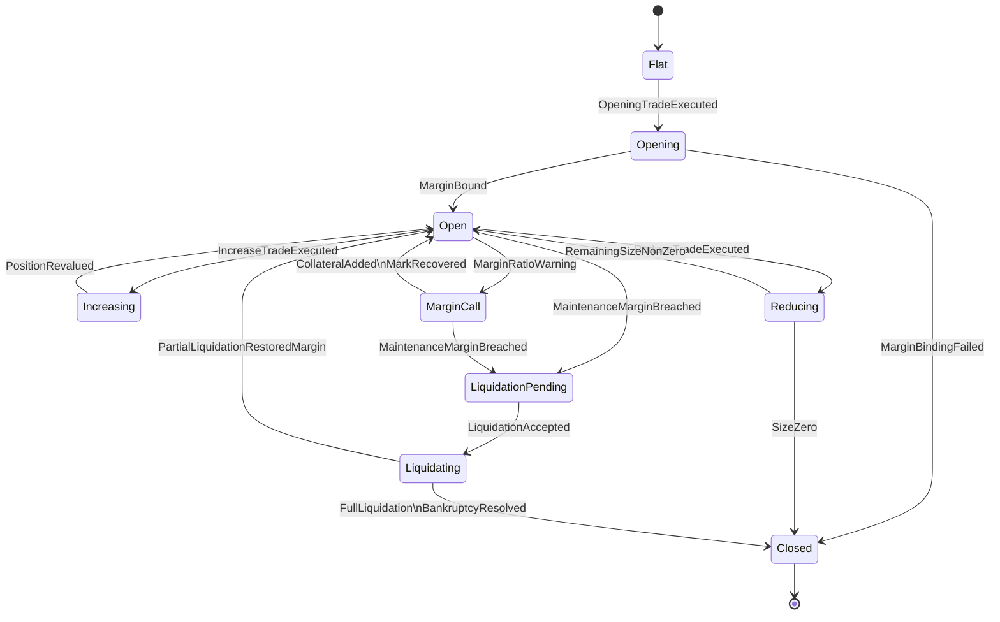
```mermaid
stateDiagram-v2
    [*] --> Flat
    Flat --> Opening: OpeningTradeExecuted
    Opening --> Open: MarginBound
    Opening --> Closed: MarginBindingFailed
    Open --> Increasing: IncreaseTradeExecuted
    Increasing --> Open: PositionRevalued
    Open --> Reducing: ReduceTradeExecuted
    Reducing --> Open: RemainingSizeNonZero
    Reducing --> Closed: SizeZero
    Open --> MarginCall: MarginRatioWarning
    MarginCall --> Open: CollateralAdded\nMarkRecovered
    Open --> LiquidationPending: MaintenanceMarginBreached
    MarginCall --> LiquidationPending: MaintenanceMarginBreached
    LiquidationPending --> Liquidating: LiquidationAccepted
    Liquidating --> Open: PartialLiquidationRestoredMargin
    Liquidating --> Closed: FullLiquidation\nBankruptcyResolved
    Closed --> [*]
```
Test cases:
•	Opening trade reaches Open with margin bound.
•	Increase/reduce updates size, entry, and PnL.
•	Collateral during MarginCall restores Open.
•	Maintenance breach enters liquidation with version fencing.
•	User full close reaches Closed.
Acceptance criteria:
•	Mark price drives margin and liquidation transitions.
•	State is deterministic under event replay.
•	Liquidation cannot be bypassed after sequenced breach unless margin restoration precedes it.
•	Closed positions have zero open size and finalized realized PnL.
Business Rules:
1.	Mark price is used for PnL and liquidation, not last trade price.
2.	Funding rate is calculated every 8 hours.
3.	Funding payments are exchanged between long and short positions.
4.	Initial margin must be deposited before opening a position.
5.	Maintenance margin must be maintained at all times.
6.	If margin falls below maintenance margin, liquidation is triggered.
7.	ADL is triggered when the insurance fund is insufficient.
Implementation Contracts:
rust
// Futures Service
trait FuturesService {
    fn open_position(&self, order: &Order) -> Result<FuturesPosition, FuturesError>;
    fn close_position(&self, position_id: PositionId) -> Result<(), FuturesError>;
    fn get_position(&self, user_id: UserId, book_id: BookId) -> Option<FuturesPosition>;
    fn get_all_positions(&self, user_id: UserId) -> Vec<FuturesPosition>;
    fn get_mark_price(&self, book_id: BookId) -> PriceI64;
    fn get_funding_rate(&self, book_id: BookId) -> FundingRate;
}

// Funding Service
trait FundingService {
    fn calculate_funding(&self, book_id: BookId) -> FundingResult;
    fn settle_funding(&self, book_id: BookId) -> Result<(), FundingError>;
    fn get_funding_history(&self, book_id: BookId, limit: u32) -> Vec<FundingRate>;
}
________________________________________
2.8.9 Options Context
Purpose: Manage options contracts.
Business Context: Options give the buyer the right, but not the obligation, to buy or sell an asset at a specified price on or before a specified date. Options are complex financial instruments requiring sophisticated pricing and risk management.
Engineering Context: Options are the most complex product in the exchange. They require real-time pricing (Black-Scholes), Greeks calculation, and management of multiple legs.
Core Concepts:
Option:
•	A contract giving the holder the right to buy or sell.
rust
struct Option {
    option_id: OptionId,
    underlying: String,
    strike: PriceI64,
    expiry: Timestamp,
    option_type: OptionType,
    contract_size: QtyI64,
    tick_size: PriceI64,
    lot_size: QtyI64,
}

enum OptionType {
    Call,
    Put,
}

enum OptionStyle {
    European,
    American,
}
Option Chain:
•	All options for a given underlying.
•	Organized by expiry and strike.
rust
struct OptionChain {
    underlying: String,
    expiries: Vec<Expiry>,
    strikes: Vec<PriceI64>,
}

struct Expiry {
    expiry: Timestamp,
    days_to_expiry: u32,
    calls: Vec<Option>,
    puts: Vec<Option>,
}
Greeks:
•	Measures of option price sensitivity.
rust
struct Greeks {
    delta: f64,   // Price sensitivity
    gamma: f64,   // Delta sensitivity
    theta: f64,   // Time decay
    vega: f64,    // Volatility sensitivity
    rho: f64,     // Interest rate sensitivity
    implied_vol: f64,
    timestamp: Timestamp,
}
Option Position:
•	A user's position in an option.
rust
struct OptionPosition {
    position_id: PositionId,
    user_id: UserId,
    option_id: OptionId,
    quantity: QtyI64,
    is_long: bool,
    entry_price: PriceI64,
    mark_price: PriceI64,
    premium: QtyI64,
    realized_pnl: QtyI64,
    unrealized_pnl: QtyI64,
    greeks: Option<Greeks>,
}
Multi-Leg Order:
•	An order with multiple legs (e.g., spread, straddle).
rust
struct MultiLegOrder {
    order_id: OrderId,
    user_id: UserId,
    legs: Vec<OrderLeg>,
    strategy: OptionStrategy,
}

struct OrderLeg {
    option_id: OptionId,
    side: OrderSide,
    quantity: QtyI64,
    price: PriceI64,
}

enum OptionStrategy {
    CallSpread,
    PutSpread,
    Straddle,
    Strangle,
    IronCondor,
    Custom,
}
State Machine: Option Lifecycle:
Purpose: Define the lifecycle of an option contract from listing through trading, exercise or expiry, and final settlement.
State definitions:
•	Draft: contract parameters are being configured.
•	Listed: contract is published but trading is not open.
•	Trading: orders may be accepted.
•	Halted: trading is temporarily stopped.
•	ExercisePending: exercise or auto-exercise determination has started.
•	Exercised: holder rights were exercised.
•	Expired: expiry reached and no trading is allowed.
•	Settled: cash or physical settlement is complete.
•	Delisted: contract is removed from active catalogs.
Valid transitions:
•	Draft -> Listed on listing approval.
•	Listed -> Trading on open.
•	Trading <-> Halted by halt/resume.
•	Trading or Halted -> ExercisePending on request or expiry.
•	ExercisePending -> Exercised for accepted/ITM exercise.
•	ExercisePending -> Expired for rejected/OTM/cutoff breach.
•	Exercised or Expired -> Settled.
•	Settled -> Delisted after retention.
Invalid transitions:
•	Draft -> Trading without Listed is forbidden.
•	Trading -> Settled without exercise or expiry is forbidden.
•	Expired -> Trading is forbidden.
•	Delisted -> Trading is forbidden.
Failure transitions:
•	Draft -> Delisted on withdrawn invalid specification.
•	Listed -> Halted on configuration failure.
•	ExercisePending -> Expired on insufficient underlying or cutoff breach.
•	Settlement failure remains in Exercised pending retry.
Recovery behaviour:
•	Expiry scheduler is idempotent and recomputes from final settlement price.
•	Halted contracts resume only after admin approval and risk recalculation.
•	Settlement retries preserve exercise_id and cannot duplicate postings.
•	Delisted contracts remain queryable historically.
Events emitted:
•	OptionDraftCreated
•	OptionListed
•	OptionTradingOpened
•	OptionTradingHalted
•	OptionTradingResumed
•	OptionExerciseRequested
•	OptionAutoExerciseEvaluated
•	OptionExercised
•	OptionExpired
•	OptionSettled
•	OptionDelisted
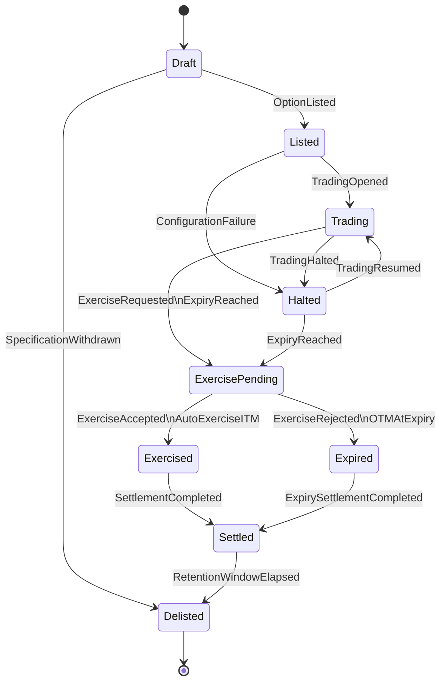
```mermaid
stateDiagram-v2
    [*] --> Draft
    Draft --> Listed: OptionListed
    Draft --> Delisted: SpecificationWithdrawn
    Listed --> Trading: TradingOpened
    Listed --> Halted: ConfigurationFailure
    Trading --> Halted: TradingHalted
    Halted --> Trading: TradingResumed
    Trading --> ExercisePending: ExerciseRequested\nExpiryReached
    Halted --> ExercisePending: ExpiryReached
    ExercisePending --> Exercised: ExerciseAccepted\nAutoExerciseITM
    ExercisePending --> Expired: ExerciseRejected\nOTMAtExpiry
    Exercised --> Settled: SettlementCompleted
    Expired --> Settled: ExpirySettlementCompleted
    Settled --> Delisted: RetentionWindowElapsed
    Delisted --> [*]
```
Test cases:
•	List and open only after configured open time.
•	Halt blocks new orders.
•	Exercise ITM option and settle.
•	Expire OTM option and settle.
•	Retry settlement without duplicate movement.
Acceptance criteria:
•	No trading before open or after expiry/delist.
•	Exercise decisions are deterministic from style, cutoff, position, and settlement price.
•	Settlement is exactly-once at ledger level.
•	Historical records remain available after Delisted.
Business Rules:
1.	Options must have valid strikes and expiries.
2.	Pricing must use the appropriate model (Black-Scholes).
3.	Greeks must be calculated for all positions.
4.	Multi-leg orders must have valid strategy.
5.	Options with exercise require sufficient underlying or premium.
6.	Expiry handling must be automated.
7.	ITM options are auto-exercised at expiry.
Implementation Contracts:
rust
// Options Service
trait OptionsService {
    fn get_option_chain(&self, underlying: String) -> OptionChain;
    fn get_option(&self, option_id: OptionId) -> Option;
    fn get_greeks(&self, option_id: OptionId) -> Greeks;
    fn get_position(&self, user_id: UserId, option_id: OptionId) -> Option<OptionPosition>;
    fn get_all_positions(&self, user_id: UserId) -> Vec<OptionPosition>;
    fn exercise_option(&self, position_id: PositionId) -> Result<ExerciseResult, OptionsError>;
}

// Options Pricing
trait OptionsPricing {
    fn calculate_price(&self, option: &Option, current_price: PriceI64, vol: f64, interest: f64) -> PriceI64;
    fn calculate_greeks(&self, option: &Option, current_price: PriceI64, vol: f64, interest: f64) -> Greeks;
    fn calculate_implied_vol(&self, option: &Option, current_price: PriceI64, market_price: PriceI64, interest: f64) -> f64;
}
________________________________________
2.8.10 Margin Context
Purpose: Manage margin requirements and collateral for leveraged positions.
Business Context: Leveraged positions require users to post margin. The Margin context calculates initial margin (required to open a position) and maintenance margin (required to keep a position open). It also manages collateral across positions.
Engineering Context: Margin calculations are performed in the hot path for trade execution and continuously for risk monitoring.
Core Concepts:
Margin Requirement:
•	The amount of collateral required for a position.
rust
struct MarginRequirement {
    position_id: PositionId,
    initial_margin: QtyI64,
    maintenance_margin: QtyI64,
    collateral: QtyI64,
    margin_ratio: f64,
    timestamp: Timestamp,
}
Collateral:
•	Assets used to secure margin positions.
rust
struct Collateral {
    user_id: UserId,
    asset: Asset,
    amount: QtyI64,
    valuation: PriceI64,  // Current value
    haircut: f64,         // Discount applied
    effective_value: QtyI64,
}
Margin Mode:
rust
enum MarginMode {
    Cross,     // Collateral shared across positions
    Isolated,  // Collateral per position
}

enum CollateralType {
    Cash,
    Crypto,
    Stablecoin,
}
Business Rules:
1.	Initial margin must be posted before opening a position.
2.	Maintenance margin must be maintained at all times.
3.	Collateral is subject to haircuts based on asset risk.
4.	Cross margin shares collateral across positions.
5.	Isolated margin is per position.
6.	If margin ratio falls below maintenance, liquidation is triggered.
Implementation Contracts:
rust
// Margin Service
trait MarginService {
    fn calculate_initial_margin(&self, position: &FuturesPosition) -> QtyI64;
    fn calculate_maintenance_margin(&self, position: &FuturesPosition) -> QtyI64;
    fn calculate_margin_ratio(&self, position: &FuturesPosition) -> f64;
    fn get_collateral(&self, user_id: UserId) -> Vec<Collateral>;
    fn add_collateral(&self, user_id: UserId, asset: Asset, amount: QtyI64) -> Result<(), MarginError>;
    fn remove_collateral(&self, user_id: UserId, asset: Asset, amount: QtyI64) -> Result<(), MarginError>;
}
________________________________________
2.8.11 Liquidation Context
Purpose: Liquidate positions that fall below maintenance margin.
Business Context: When a position's margin falls below maintenance margin, the position must be liquidated to prevent losses from exceeding collateral.
Engineering Context: Liquidation is triggered by a risk monitoring service. It must execute quickly to minimize losses and market impact.
Core Concepts:
Liquidation Event:
•	A position being liquidated.
rust
struct LiquidationEvent {
    event_id: EventId,
    position_id: PositionId,
    user_id: UserId,
    book_id: BookId,
    liquidation_price: PriceI64,
    bankruptcy_price: PriceI64,
    quantity: QtyI64,
    closed_quantity: QtyI64,
    status: LiquidationStatus,
    timestamp: Timestamp,
}

enum LiquidationStatus {
    Pending,
    Processing,
    Completed,
    Bankrupt,
}
Insurance Fund:
•	A reserve fund that covers deficits from bankrupt positions.
rust
struct InsuranceFund {
    fund_id: FundId,
    asset: Asset,
    balance: QtyI64,
    total_contributions: QtyI64,
    total_used: QtyI64,
    last_replenishment: Timestamp,
}
ADL (Auto-Deleveraging):
•	Forced reduction of positions when the insurance fund is depleted.
rust
struct ADLEvent {
    adl_id: AdlId,
    event_id: EventId,
    counterparty_position_id: PositionId,
    user_id: UserId,
    book_id: BookId,
    quantity: QtyI64,
    price: PriceI64,
    timestamp: Timestamp,
}
State Machine: Liquidation:
Purpose: Define liquidation progression from margin breach detection through execution, insurance fund use, ADL escalation, and final resolution.
State definitions:
•	Detected: maintenance breach identified.
•	Pending: event persisted and position lock requested.
•	Processing: liquidation orders or takeover executing.
•	PartiallyFilled: some quantity closed.
•	Completed: exposure closed or margin restored.
•	Bankrupt: losses exceed collateral.
•	InsuranceFundClaim: deficit coverage is being applied.
•	ADLPending: auto-deleveraging is queued.
•	ADLProcessing: counterparty deleveraging executing.
•	Failed: operator intervention required.
Valid transitions:
•	Detected -> Pending on event creation.
•	Pending -> Processing on position lock.
•	Processing -> PartiallyFilled or Completed on executions.
•	PartiallyFilled -> Processing or Completed based on residual risk.
•	Processing -> Bankrupt on bankruptcy price.
•	Bankrupt -> InsuranceFundClaim.
•	InsuranceFundClaim -> Completed or ADLPending.
•	ADLPending -> ADLProcessing -> Completed.
Invalid transitions:
•	Completed -> Processing is forbidden.
•	Detected -> Completed without event and position lock is forbidden.
•	ADLPending -> Completed without ADL or insurance coverage is forbidden.
•	Failed -> Processing requires operator recovery and new lock version.
Failure transitions:
•	Pending -> Failed on lock failure.
•	Processing -> Failed on engine unavailable or order rejection after fallback exhaustion.
•	InsuranceFundClaim -> Failed on accounting inconsistency.
•	ADLProcessing -> Failed on invariant violation.
Recovery behaviour:
•	Resume from persisted liquidation_id and locked position version.
•	Recompute residual quantity and margin from executions before continuing.
•	Insurance claims use deficit_id to prevent duplicate debits.
•	Failed requires operator recovery or manual settlement.
Events emitted:
•	LiquidationDetected
•	LiquidationPending
•	LiquidationProcessingStarted
•	LiquidationPartialFill
•	LiquidationCompleted
•	LiquidationBankrupt
•	InsuranceFundClaimed
•	InsuranceFundCoverCompleted
•	ADLPending
•	ADLProcessingStarted
•	ADLCompleted
•	LiquidationFailed
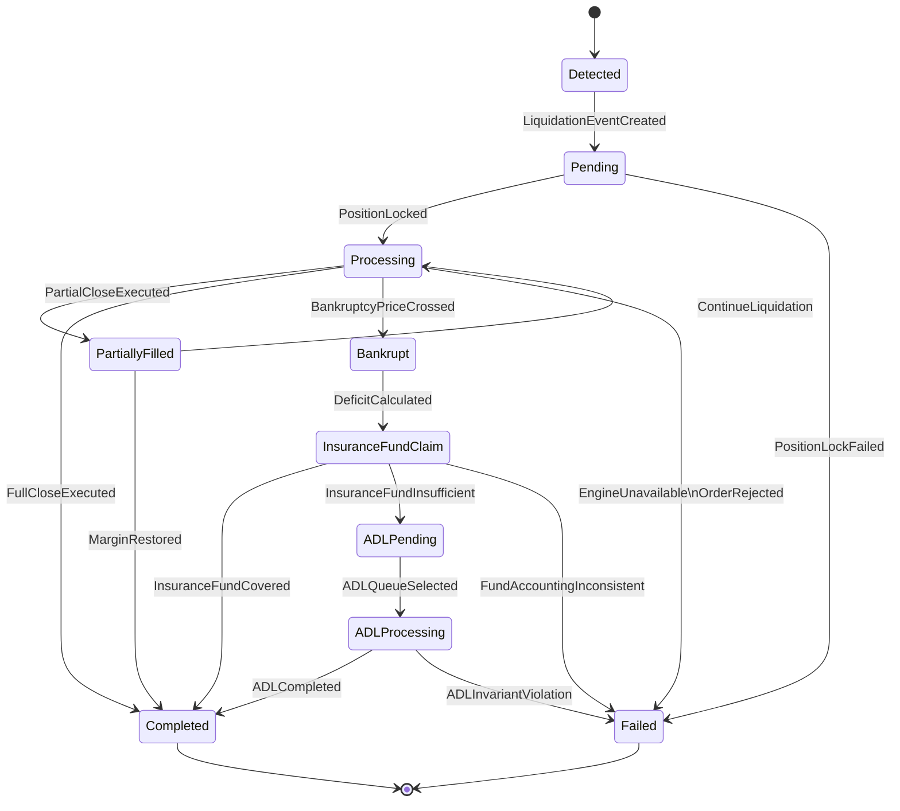
```mermaid
stateDiagram-v2
    [*] --> Detected
    Detected --> Pending: LiquidationEventCreated
    Pending --> Processing: PositionLocked
    Pending --> Failed: PositionLockFailed
    Processing --> PartiallyFilled: PartialCloseExecuted
    PartiallyFilled --> Processing: ContinueLiquidation
    PartiallyFilled --> Completed: MarginRestored
    Processing --> Completed: FullCloseExecuted
    Processing --> Bankrupt: BankruptcyPriceCrossed
    Processing --> Failed: EngineUnavailable\nOrderRejected
    Bankrupt --> InsuranceFundClaim: DeficitCalculated
    InsuranceFundClaim --> Completed: InsuranceFundCovered
    InsuranceFundClaim --> ADLPending: InsuranceFundInsufficient
    InsuranceFundClaim --> Failed: FundAccountingInconsistent
    ADLPending --> ADLProcessing: ADLQueueSelected
    ADLProcessing --> Completed: ADLCompleted
    ADLProcessing --> Failed: ADLInvariantViolation
    Completed --> [*]
    Failed --> [*]
```
Test cases:
•	Maintenance breach locks position before orders.
•	Partial liquidation completes when margin restored.
•	Bankruptcy uses insurance fund when sufficient.
•	Depleted fund triggers ADL.
•	Failover during Processing resumes by liquidation_id.
Acceptance criteria:
•	Decisions use mark price and maintenance margin breach events.
•	Position locking prevents user-initiated increases.
•	Deficits are covered exactly once by insurance fund or ADL.
•	Terminal states reconcile position, ledger, and insurance projections.
Business Rules:
1.	Liquidation is triggered when maintenance margin is breached.
2.	Partial liquidation may be used for large positions.
3.	Liquidation price is determined by the order book.
4.	Bankruptcy price is when losses exceed collateral.
5.	Insurance fund covers deficits from bankrupt positions.
6.	ADL is used when insurance fund is depleted.
7.	ADL targets the most profitable positions first.
Implementation Contracts:
rust
// Liquidation Service
trait LiquidationService {
    fn monitor_positions(&self) -> Vec<Position>;
    fn liquidate_position(&self, position_id: PositionId) -> Result<LiquidationEvent, LiquidationError>;
    fn get_liquidation_events(&self, user_id: UserId) -> Vec<LiquidationEvent>;
    fn get_insurance_fund_balance(&self, asset: Asset) -> QtyI64;
}

// ADL Service
trait ADLService {
    fn calculate_adl_queue(&self, book_id: BookId) -> Vec<ADLCandidate>;
    fn trigger_adl(&self, book_id: BookId, deficit: QtyI64) -> Result<ADLEvent, ADLError>;
    fn get_adl_rank(&self, user_id: UserId, book_id: BookId) -> u32;
}
________________________________________
2.8.12 Surveillance Context
Purpose: Detect market manipulation and abuse.
Business Context: Exchanges must maintain fair and orderly markets. The Surveillance context monitors trading activity to detect wash trading, spoofing, layering, and other manipulative behaviors.
Engineering Context: Surveillance is a cold path system that consumes Engine Events and market data. It uses pattern matching and machine learning to detect suspicious activity.
Core Concepts:
Alert:
•	A notification of suspicious activity.
rust
struct Alert {
    alert_id: AlertId,
    alert_type: AlertType,
    severity: AlertSeverity,
    user_id: UserId,
    book_id: BookId,
    description: String,
    evidence: Vec<Evidence>,
    created_at: Timestamp,
    status: AlertStatus,
}

enum AlertType {
    WashTrading,
    Spoofing,
    Layering,
    PumpAndDump,
    InsiderTrading,
    FrontRunning,
    PriceManipulation,
}

enum AlertSeverity {
    Low,
    Medium,
    High,
    Critical,
}
Evidence:
•	Data supporting an alert.
rust
struct Evidence {
    evidence_id: EvidenceId,
    alert_id: AlertId,
    evidence_type: EvidenceType,
    content: String,
    timestamp: Timestamp,
}

enum EvidenceType {
    OrderEvent,
    TradeEvent,
    BookSnapshot,
    UserProfile,
    IPAddress,
    DeviceFingerprint,
}
Investigation:
•	A formal investigation into suspicious activity.
rust
struct Investigation {
    investigation_id: InvestigationId,
    alerts: Vec<AlertId>,
    assigned_to: UserId,
    status: InvestigationStatus,
    findings: String,
    conclusion: Option<InvestigationConclusion>,
    created_at: Timestamp,
    updated_at: Timestamp,
}

enum InvestigationStatus {
    Open,
    InProgress,
    Completed,
}
Business Rules:
1.	Wash trading: same user buying and selling the same instrument.
2.	Spoofing: placing and canceling orders to create false market signals.
3.	Layering: placing multiple orders to create false depth.
4.	Pump and dump: coordinated buying to inflate price followed by selling.
5.	Insider trading: trading based on non-public information.
6.	All suspicious activity must be flagged and investigated.
Implementation Contracts:
rust
// Surveillance Service
trait SurveillanceService {
    fn process_event(&self, event: EngineEvent) -> Result<(), SurveillanceError>;
    fn get_alerts(&self, user_id: UserId) -> Vec<Alert>;
    fn get_all_alerts(&self, status: AlertStatus) -> Vec<Alert>;
    fn create_investigation(&self, alerts: Vec<AlertId>) -> Result<Investigation, SurveillanceError>;
    fn update_investigation(&self, investigation_id: InvestigationId, findings: String) -> Result<(), SurveillanceError>;
    fn close_investigation(&self, investigation_id: InvestigationId, conclusion: InvestigationConclusion) -> Result<(), SurveillanceError>;
}
________________________________________
2.8.13 Compliance Context
Purpose: Ensure regulatory compliance.
Business Context: The exchange must comply with KYC/AML regulations, sanctions screening, and the Travel Rule. The Compliance context manages these requirements.
Engineering Context: Compliance is a cold path system that integrates with KYC vendors, sanctions lists, and Travel Rule networks.
Core Concepts:
KYC/AML:
•	Know Your Customer / Anti-Money Laundering verification.
rust
struct KYCProfile {
    user_id: UserId,
    tier: KYCTier,
    status: KYCStatus,
    documents: Vec<KYCDocument>,
    risk_score: u32,
    verified_at: Option<Timestamp>,
    expires_at: Option<Timestamp>,
}

enum KYCTier {
    Unverified,
    Basic,
    Enhanced,
    VIP,
}

enum KYCStatus {
    Pending,
    Verified,
    Rejected,
    Expired,
}
Sanctions Check:
•	Screening against sanctions lists.
rust
struct SanctionsCheck {
    check_id: CheckId,
    user_id: UserId,
    name: String,
    matches: Vec<SanctionsMatch>,
    checked_at: Timestamp,
    status: SanctionsStatus,
}

struct SanctionsMatch {
    list_name: String,
    match_type: MatchType,
    match_score: f64,
}

enum SanctionsStatus {
    Clear,
    Pending,
    Blocked,
}
Travel Rule:
•	Information sharing for cross-exchange transfers.
rust
struct TravelRuleTransfer {
    transfer_id: TransferId,
    user_id: UserId,
    asset: Asset,
    amount: QtyI64,
    sender_info: SenderInfo,
    beneficiary_info: BeneficiaryInfo,
    status: TravelRuleStatus,
    created_at: Timestamp,
}

struct SenderInfo {
    name: String,
    address: String,
    country: String,
    account_id: String,
}

struct BeneficiaryInfo {
    name: String,
    address: String,
    country: String,
    account_id: String,
}
Business Rules:
1.	KYC must be completed before trading.
2.	Enhanced due diligence for high-risk users.
3.	Sanctions screening for all users and transactions.
4.	Travel Rule for transfers above threshold.
5.	Suspicious activity reports filed as required.
Implementation Contracts:
rust
// Compliance Service
trait ComplianceService {
    fn verify_kyc(&self, user_id: UserId, documents: Vec<KYCDocument>) -> Result<KYCTier, ComplianceError>;
    fn get_kyc_status(&self, user_id: UserId) -> KYCStatus;
    fn run_sanctions_check(&self, user_id: UserId) -> SanctionsCheck;
    fn check_travel_rule(&self, request: TransferRequest) -> TravelRuleStatus;
    fn report_suspicious_activity(&self, alert: Alert) -> Result<(), ComplianceError>;
}
________________________________________
2.8.14 Admin Context
Purpose: Manage exchange configuration and operations.
Business Context: The exchange requires administrative control for configuration, monitoring, and incident response.
Engineering Context: Admin is a cold path system that provides a user interface and APIs for operations teams.
Core Concepts:
Instrument:
•	A tradable instrument definition.
rust
struct Instrument {
    instrument_id: InstrumentId,
    symbol: String,
    instrument_type: InstrumentType,
    base_asset: Asset,
    quote_asset: Asset,
    tick_size: PriceI64,
    step_size: QtyI64,
    min_notional: NotionalI64,
    max_position: QtyI64,
    is_active: bool,
}

enum InstrumentType {
    Spot,
    Perpetual,
    Futures,
    Option,
}
Fee Schedule:
•	Fee rates for trading.
rust
struct FeeSchedule {
    schedule_id: ScheduleId,
    instrument_id: InstrumentId,
    maker_fee_rate: FeeRate,
    taker_fee_rate: FeeRate,
    tier_thresholds: Vec<FeeTier>,
    effective_from: Timestamp,
    effective_to: Option<Timestamp>,
}
Configuration:
•	System configuration settings.
rust
struct Config {
    config_id: ConfigId,
    key: String,
    value: String,
    description: String,
    updated_at: Timestamp,
    updated_by: UserId,
}
State Machine: Instrument:
Purpose: Define administrative and market-control lifecycle of a tradable instrument from configuration through activation, halt, suspension, retirement, and delisting.
State definitions:
•	Draft: definition is being prepared.
•	PendingApproval: maker-checker approval is required.
•	Configured: static parameters, risk limits, fees, and market identifiers are valid.
•	Active: trading, market data, and risk checks are enabled.
•	Halted: trading is temporarily stopped.
•	Suspended: instrument is disabled due to incident, compliance, or risk.
•	SettlementOnly: new orders blocked; reductions and settlement allowed.
•	Retired: no longer tradable but queryable.
•	Delisted: removed from active catalogs.
Valid transitions:
•	Draft -> PendingApproval on submission.
•	PendingApproval -> Configured on approval or Draft on rejection.
•	Configured -> Active on activation.
•	Active -> Halted and Halted -> Active by halt/resume.
•	Active or Halted -> Suspended by incident escalation.
•	Suspended -> Halted for staged recovery.
•	Active or Halted -> SettlementOnly on retirement.
•	SettlementOnly -> Retired when open interest and orders are zero.
•	Retired -> Delisted after retention.
Invalid transitions:
•	Draft -> Active without approval is forbidden.
•	Delisted -> Active is forbidden without new instrument_id or migration.
•	Retired -> Halted is forbidden.
•	Suspended -> Active without incident closure and approval is forbidden.
Failure transitions:
•	PendingApproval -> Draft on validation failure.
•	Configured -> Suspended on propagation failure after activation attempt.
•	Active -> Halted on market data failure, price band breach, matching incident, or admin halt.
•	Any non-terminal state -> Suspended on compliance prohibition.
Recovery behaviour:
•	Halted resumes after book, risk, and market data health checks.
•	Suspended requires incident closure and maker-checker approval.
•	SettlementOnly permits only risk-reducing actions until obligations are zero.
•	Delisted remains available to audit, ledger, and historical projections.
Events emitted:
•	InstrumentDraftCreated
•	InstrumentSubmittedForApproval
•	InstrumentApproved
•	InstrumentRejected
•	InstrumentConfigured
•	InstrumentActivated
•	InstrumentHalted
•	InstrumentResumed
•	InstrumentSuspended
•	InstrumentSettlementOnly
•	InstrumentRetired
•	InstrumentDelisted
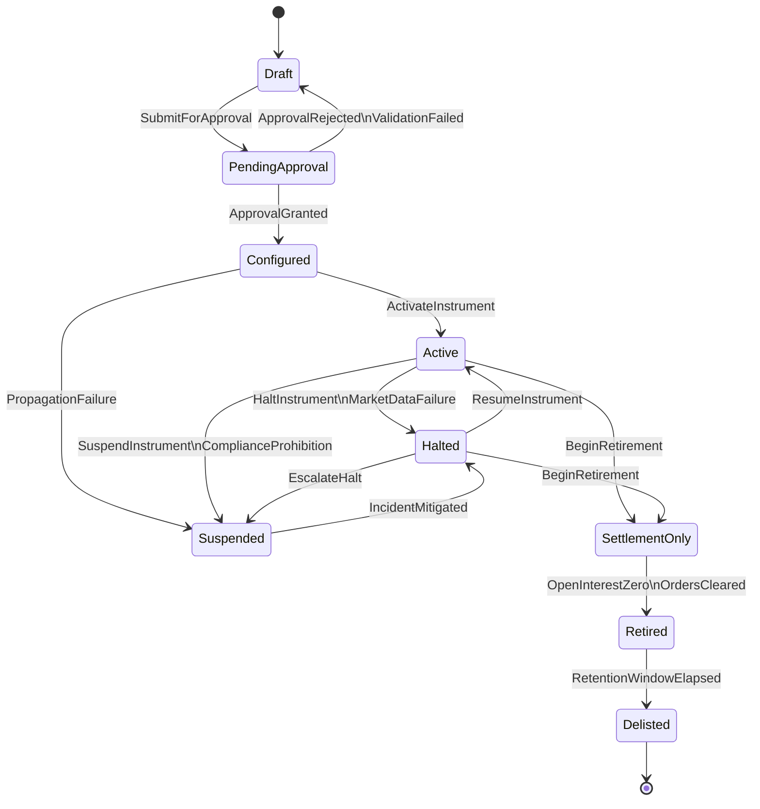
```mermaid
stateDiagram-v2
    [*] --> Draft
    Draft --> PendingApproval: SubmitForApproval
    PendingApproval --> Configured: ApprovalGranted
    PendingApproval --> Draft: ApprovalRejected\nValidationFailed
    Configured --> Active: ActivateInstrument
    Configured --> Suspended: PropagationFailure
    Active --> Halted: HaltInstrument\nMarketDataFailure
    Halted --> Active: ResumeInstrument
    Active --> Suspended: SuspendInstrument\nComplianceProhibition
    Halted --> Suspended: EscalateHalt
    Suspended --> Halted: IncidentMitigated
    Active --> SettlementOnly: BeginRetirement
    Halted --> SettlementOnly: BeginRetirement
    SettlementOnly --> Retired: OpenInterestZero\nOrdersCleared
    Retired --> Delisted: RetentionWindowElapsed
    Delisted --> [*]
```
Test cases:
•	Valid configuration requires approval before Active.
•	Invalid tick size returns to Draft.
•	Halt rejects new orders while cancels follow policy.
•	Resume requires health checks.
•	Retirement blocks new exposure until open interest is zero.
Acceptance criteria:
•	No trading service accepts orders unless state is Active.
•	Admin actions are maker-checker approved and audited.
•	State changes propagate to Trading, Risk, Market Data, and Gateway before success.
•	Historical data and ledger references remain resolvable after Delisted.
Business Rules:
1.	Instruments must be created and configured before trading.
2.	Instruments can be halted and resumed.
3.	Fee schedules must be configurable and versioned.
4.	System configuration requires audit trail.
5.	All admin actions require maker-checker.
Implementation Contracts:
rust
// Admin Service
trait AdminService {
    fn create_instrument(&self, definition: InstrumentDefinition) -> Result<Instrument, AdminError>;
    fn update_instrument(&self, instrument_id: InstrumentId, updates: InstrumentUpdate) -> Result<Instrument, AdminError>;
    fn halt_instrument(&self, instrument_id: InstrumentId, reason: String) -> Result<(), AdminError>;
    fn resume_instrument(&self, instrument_id: InstrumentId) -> Result<(), AdminError>;
    fn update_fee_schedule(&self, schedule: FeeSchedule) -> Result<(), AdminError>;
    fn update_config(&self, key: String, value: String, reason: String) -> Result<(), AdminError>;
    fn get_audit_log(&self, start: Timestamp, end: Timestamp) -> Vec<AuditEntry>;
}
________________________________________
2.8.15 Analytics Context
Purpose: Provide data analysis and reporting.
Business Context: The exchange generates vast amounts of data. The Analytics context provides insights into trading activity, user behavior, and system performance.
Engineering Context: Analytics is a cold path system that processes Engine Events and other data to generate reports, dashboards, and insights.
Core Concepts:
Metric:
•	A quantifiable measure of system or trading activity.
rust
struct Metric {
    metric_name: String,
    dimensions: Vec<Dimension>,
    value: f64,
    timestamp: Timestamp,
}

struct Dimension {
    name: String,
    value: String,
}
Report:
•	A structured presentation of data.
rust
struct Report {
    report_id: ReportId,
    report_type: ReportType,
    data: Vec<ReportRow>,
    generated_at: Timestamp,
    filters: ReportFilters,
}

enum ReportType {
    TradingVolume,
    UserActivity,
    Revenue,
    RiskExposure,
    Compliance,
    Performance,
}
Dashboard:
•	A visualization of key metrics.
rust
struct Dashboard {
    dashboard_id: DashboardId,
    name: String,
    widgets: Vec<Widget>,
    layout: DashboardLayout,
    refresh_interval: Duration,
}
Business Rules:
1.	All trading activity must be analyzable.
2.	Reports must be accurate and timely.
3.	Dashboards must be configurable.
4.	Performance metrics must be monitored in real-time.
Implementation Contracts:
rust
// Analytics Service
trait AnalyticsService {
    fn get_trading_volume(&self, instrument_id: InstrumentId, start: Timestamp, end: Timestamp) -> Vec<VolumePoint>;
    fn get_user_activity(&self, user_id: UserId, start: Timestamp, end: Timestamp) -> UserActivity;
    fn get_revenue_report(&self, start: Timestamp, end: Timestamp) -> RevenueReport;
    fn get_risk_exposure_report(&self) -> RiskExposure;
    fn create_dashboard(&self, name: String, widgets: Vec<Widget>) -> Result<Dashboard, AnalyticsError>;
    fn get_dashboard(&self, dashboard_id: DashboardId) -> Dashboard;
    fn update_dashboard(&self, dashboard_id: DashboardId, updates: DashboardUpdate) -> Result<Dashboard, AnalyticsError>;
    fn delete_dashboard(&self, dashboard_id: DashboardId) -> Result<(), AnalyticsError>;
}
________________________________________
2.9 Context Mapping
2.9.1 Context Relationships
2.9.2 Context Integration Patterns
Context	Upstream Contexts	Downstream Contexts	Integration Pattern
Gateway	(External)	Trading, MarketData	REST/WebSocket
Trading	Gateway	Risk, Clearing, MarketData	In-process, Events
Risk	Trading	Trading	In-process, Sync
Clearing	Trading	Wallet, Ledger	Events
Wallet	Clearing, Admin	Ledger	Events, Sync
Ledger	Wallet, Clearing	Analytics	Projection
MarketData	Trading	Gateway, Analytics	Events
Margin	Trading	Liquidation	Sync
Liquidation	Margin	InsuranceFund	Events
Surveillance	Trading	Compliance, Analytics	Events
Compliance	Surveillance, Gateway	Wallet	Sync, Events
Admin	(Internal)	All	RPC
Analytics	All	(Internal)	Query
________________________________________
2.10 Domain Events
2.10.1 Core Domain Events
Event	Source	Consumers	Description
OrderPlaced	Gateway	Trading	New order submitted
OrderAccepted	Trading	Gateway, MarketData	Order accepted
OrderRejected	Trading	Gateway	Order rejected with reason
OrderCancelled	Trading	Gateway, Wallet	Order cancelled
TradeExecuted	Trading	Clearing, MarketData, Surveillance	Trade executed
EngineEvent	Trading	All	Source of truth event
RiskCheckFailed	Risk	Trading	Risk check failed
BalanceUpdated	Wallet	Ledger, Gateway	Balance changed
PositionUpdated	Margin	Gateway	Position changed
LiquidationExecuted	Liquidation	Wallet, Gateway	Liquidation executed
FundingSettled	Funding	Wallet, Margin	Funding settled
KYCVerified	Compliance	Gateway	KYC completed
SanctionsMatch	Compliance	Admin	Sanctions hit detected
AlertGenerated	Surveillance	Compliance, Admin	Suspicious activity alert
InstrumentUpdated	Admin	Trading, MarketData	Instrument configuration changed
FeeScheduleUpdated	Admin	Clearing	Fee schedule changed
2.10.2 Event Payloads
rust
// OrderPlaced Event
struct OrderPlacedEvent {
    order_id: OrderId,
    client_order_id: ClientOrderId,
    user_id: UserId,
    book_id: BookId,
    side: OrderSide,
    order_type: OrderType,
    price: PriceI64,
    quantity: QtyI64,
    time_in_force: TimeInForce,
    timestamp: Timestamp,
}

// TradeExecuted Event
struct TradeExecutedEvent {
    trade_id: TradeId,
    book_id: BookId,
    buyer_order_id: OrderId,
    seller_order_id: OrderId,
    buyer_user_id: UserId,
    seller_user_id: UserId,
    price: PriceI64,
    quantity: QtyI64,
    notional: NotionalI64,
    execution_time: Timestamp,
    maker_fee: FeeRate,
    taker_fee: FeeRate,
    fee_asset: Asset,
}

// BalanceUpdated Event
struct BalanceUpdatedEvent {
    user_id: UserId,
    asset: Asset,
    old_balance: QtyI64,
    new_balance: QtyI64,
    delta: QtyI64,
    update_type: BalanceUpdateType,
    reference: String,
    timestamp: Timestamp,
}

enum BalanceUpdateType {
    OrderHold,
    OrderRelease,
    OrderConsume,
    Deposit,
    Withdrawal,
    Fee,
    Rebate,
    Settlement,
}
________________________________________
Chapter 3: The Book Core
3.1 Purpose
The Book Core is the heart of the HermesNet exchange. It is a single-writer, deterministic matching kernel that owns the state of a single order book (instrument or shard). The Book Core is responsible for accepting orders, performing risk checks, matching orders, calculating clearing deltas, and emitting Engine Events. This chapter provides the complete engineering specification for the Book Core.
3.2 Business Context
Each instrument (e.g., BTC-USDT spot, BTC-PERP futures) is represented by a single Book Core. The Book Core is the authoritative source of truth for all order book activity. It must process orders quickly, match them fairly, and maintain correct state at all times.
Scale Assumptions:
•	Total instruments: 5,000+ (scalable to 20,000)
•	Instruments per Book Core: 1
•	Orders per second per instrument: Up to 25,000
•	Simultaneous orders per instrument: 1,000,000+
Key Requirements:
•	Deterministic processing (same inputs → same outputs)
•	Low latency (p50 < 1ms, p95 < 5ms, p99 < 10ms)
•	High throughput (sustained 25,000 orders per second)
•	Strong consistency (no race conditions, no double fills)
•	Idempotent operations (same client_order_id → same result)
•	Append-only event log for audit and recovery
3.3 Engineering Context
The Book Core is a single-threaded, in-process component. It has no external dependencies in the hot path. It communicates with gateways via lock-free queues and with cold path systems via an async event publisher.
Memory Model:
•	Orders stored in memory with deterministic data structures
•	Event log stored in memory (backed by file for persistence)
•	Risk cache stored in memory
•	No garbage collection in hot path (Rust ownership model)
Concurrency Model:
•	Single writer thread owns the Book Core
•	All order mutations happen on this thread
•	Read-only access from other threads is allowed (market data snapshots)
•	Gateways communicate via SPSC queues
Error Model:
•	Panics indicate unrecoverable corruption
•	Recoverable errors return rejection results
•	Queue overflow results in immediate rejection
•	Event log corruption triggers recovery
3.4 Problem Statement
The Book Core must solve the following problems:
1.	Concurrency: Multiple orders can arrive simultaneously. The Book Core must process them sequentially and deterministically to avoid race conditions.
2.	Latency: The Book Core is on the critical path of every order. It must process each order as quickly as possible.
3.	Consistency: Order state, risk state, and event log must be consistent at all times. A failure must not corrupt the state.
4.	Recoverability: After a failure, the Book Core must be able to recover its state from the event log.
5.	Auditability: Every decision (accepted, rejected, matched) must be recorded immutably.
6.	Fairness: Matching must be fair (price-time priority).
7.	Idempotency: Duplicate client_order_id requests must return the same result.
3.5 Goals
1.	Deterministic Processing: Given the same sequence of inputs, the Book Core produces identical outputs.
2.	Low Latency: p50 < 1ms, p95 < 5ms, p99 < 10ms for order processing.
3.	High Throughput: 25,000 orders per second sustained.
4.	No Double Fills: An order must never be filled more than once.
5.	No Negative Balances: Risk checks must prevent overspending.
6.	Complete Audit Trail: All decisions are recorded in the event log.
7.	Fast Recovery: Rebuild state from event log in under 1 second.
3.6 Non-Goals
1.	No Market Data Distribution: Market data is generated by a separate consumer.
2.	No Order History Storage: Order history is stored in a separate projection.
3.	No User Database Access: Risk information is cached locally.
4.	No Network Access: The Book Core does not make network calls.
5.	No Disk Writes in Hot Path: Event log persistence is asynchronous.
3.7 Historical Background
Traditional Matching Engines (Pre-2000):
•	Centralized mainframe-based systems
•	Orders stored in database
•	Batch processing at end of day
•	Latency measured in seconds or minutes
•	Non-deterministic due to database ordering
Early Electronic Matching Engines (2000-2010):
•	In-memory order books
•	Database write on every trade
•	SQL for risk checks
•	Latency measured in milliseconds
•	Single-threaded or heavily locked
•	Vulnerable to database failures
Modern Matching Engines (2010-2020):
•	In-memory only
•	Asynchronous persistence
•	Event sourcing
•	Single-writer per book
•	Latency measured in microseconds to milliseconds
•	No external dependencies in hot path
NYSE Pillar (2019-Present):
•	Binary protocols
•	Single-writer book cores
•	No global sequencer
•	Deterministic replay
•	Low-latency and high-throughput
3.8 Industry Practices
Exchange Matching Engine Patterns:
Pattern	Description	Examples	Tradeoffs
Central Matching	Single engine for all instruments	Early exchanges	Simple, but bottleneck
Sharded Matching	One engine per instrument group	Many modern exchanges	Scalable, but cross-shard risk complex
Single-Writer Book	One writer per instrument	NYSE Pillar, LMAX	Fast, deterministic, but failover complex
Global Sequencer	Central ordering service	Some exchanges	Fair, but bottleneck
Risk Check Patterns:
Pattern	Description	Tradeoffs
Account-Level Risk	Check total balance across all instruments	Accurate, but slower and complex
Instrument-Level Risk	Check risk per instrument independently	Fast, but less flexible
Credit Bucket	Pre-allocated funds per instrument	Fastest, but requires pre-allocation
3.9 Alternatives Considered
Database-Backed Matching:
•	Orders stored and matched in database
•	Simple to implement, uses SQL
•	Rejected: Latency (10-100ms) unacceptable
Microservice-Based Matching:
•	Separate services for order reception, risk, matching, clearing
•	Network calls between services
•	Rejected: Network latency and complexity unacceptable
Multi-Writer Book:
•	Multiple threads can modify the book
•	Requires locks or transaction isolation
•	Rejected: Lock contention reduces performance and determinism
Active-Active Matching:
•	Multiple matching engines for the same instrument
•	Consensus needed for state reconciliation
•	Rejected: Complexity and potential for double-fills
3.10 Architecture
3.10.1 Component Diagram
3.10.2 Deployment Diagram
3.10.3 Data Flow
3.11 DDD Model
3.11.1 Entities
rust
// Order Entity
pub struct Order {
    order_id: OrderId,
    client_order_id: ClientOrderId,
    user_id: UserId,
    book_id: BookId,
    side: OrderSide,
    order_type: OrderType,
    price: PriceI64,
    quantity: QtyI64,
    filled_quantity: QtyI64,
    time_in_force: TimeInForce,
    status: OrderStatus,
    created_at: Timestamp,
    updated_at: Timestamp,
    metadata: OrderMetadata,
}

// Order Book Entity
pub struct OrderBook {
    book_id: BookId,
    symbol: String,
    base_asset: Asset,
    quote_asset: Asset,
    bids: PriceLevelMap,
    asks: PriceLevelMap,
    tick_size: PriceI64,
    step_size: QtyI64,
    min_notional: NotionalI64,
    max_position: QtyI64,
    last_sequence: u64,
}

// Engine Event Entity
pub struct EngineEvent {
    event_id: EventId,
    book_id: BookId,
    book_seq: u64,
    event_type: EventType,
    order_result: OrderResult,
    trades: Vec<Trade>,
    clearing: ClearingDelta,
    timestamp: Timestamp,
    previous_hash: Hash,
    event_hash: Hash,
}
3.11.2 Value Objects
rust
// Price (fixed-point integer)
#[derive(Debug, Clone, Copy, PartialEq, Eq, PartialOrd, Ord)]
pub struct PriceI64(i64);

impl PriceI64 {
    pub fn new(value: i64) -> Self {
        PriceI64(value)
    }
    
    pub fn as_i64(&self) -> i64 {
        self.0
    }
    
    pub fn add(&self, other: &PriceI64) -> Result<PriceI64, OverflowError> {
        let result = self.0.checked_add(other.0).ok_or(OverflowError)?;
        Ok(PriceI64(result))
    }
    
    pub fn sub(&self, other: &PriceI64) -> Result<PriceI64, OverflowError> {
        let result = self.0.checked_sub(other.0).ok_or(OverflowError)?;
        Ok(PriceI64(result))
    }
    
    pub fn mul(&self, other: &PriceI64) -> Result<PriceI64, OverflowError> {
        let result = self.0.checked_mul(other.0).ok_or(OverflowError)?;
        Ok(PriceI64(result))
    }
    
    pub fn div(&self, other: &PriceI64) -> Result<PriceI64, OverflowError> {
        if other.0 == 0 {
            return Err(OverflowError);
        }
        let result = self.0.checked_div(other.0).ok_or(OverflowError)?;
        Ok(PriceI64(result))
    }
}

// Quantity (fixed-point integer)
#[derive(Debug, Clone, Copy, PartialEq, Eq, PartialOrd, Ord)]
pub struct QtyI64(i64);

impl QtyI64 {
    pub fn new(value: i64) -> Self {
        QtyI64(value)
    }
    
    pub fn as_i64(&self) -> i64 {
        self.0
    }
    
    pub fn is_zero(&self) -> bool {
        self.0 == 0
    }
    
    pub fn add(&self, other: &QtyI64) -> Result<QtyI64, OverflowError> {
        let result = self.0.checked_add(other.0).ok_or(OverflowError)?;
        Ok(QtyI64(result))
    }
    
    pub fn sub(&self, other: &QtyI64) -> Result<QtyI64, OverflowError> {
        let result = self.0.checked_sub(other.0).ok_or(OverflowError)?;
        Ok(QtyI64(result))
    }
}

// Order Side
#[derive(Debug, Clone, Copy, PartialEq, Eq)]
pub enum OrderSide {
    Buy,
    Sell,
}

impl OrderSide {
    pub fn is_buy(&self) -> bool {
        matches!(self, OrderSide::Buy)
    }
    
    pub fn is_sell(&self) -> bool {
        matches!(self, OrderSide::Sell)
    }
    
    pub fn opposite(&self) -> Self {
        match self {
            OrderSide::Buy => OrderSide::Sell,
            OrderSide::Sell => OrderSide::Buy,
        }
    }
}

// Order Type
#[derive(Debug, Clone, Copy, PartialEq, Eq)]
pub enum OrderType {
    Market,
    Limit,
    StopMarket,
    StopLimit,
    TakeProfitMarket,
    TakeProfitLimit,
}

// Time In Force
#[derive(Debug, Clone, Copy, PartialEq, Eq)]
pub enum TimeInForce {
    GTC,  // Good Till Cancelled
    IOC,  // Immediate or Cancel
    FOK,  // Fill or Kill
    GTD,  // Good Till Date
    PO,   // Post Only
    RO,   // Reduce Only
}
3.11.3 Aggregates
rust
// Book Core Aggregate
pub struct BookCore {
    id: BookId,
    state: BookCoreState,
    order_book: OrderBook,
    risk_cache: RiskCache,
    event_log: AppendOnlyLog,
    config: BookCoreConfig,
    sequence: u64,
}

impl BookCore {
    pub fn new(id: BookId, config: BookCoreConfig) -> Self {
        Self {
            id,
            state: BookCoreState::Initializing,
            order_book: OrderBook::new(id),
            risk_cache: RiskCache::new(),
            event_log: AppendOnlyLog::new(),
            config,
            sequence: 0,
        }
    }
    
    pub fn process_order(&mut self, envelope: OrderEnvelope) -> OrderResult {
        // Implementation
    }
    
    pub fn replay_event(&mut self, event: EngineEvent) -> Result<(), ReplayError> {
        // Implementation
    }
    
    pub fn snapshot(&self) -> BookCoreSnapshot {
        // Implementation
    }
    
    pub fn restore_from_snapshot(&mut self, snapshot: BookCoreSnapshot) -> Result<(), RestoreError> {
        // Implementation
    }
}

// Order Book Aggregate
pub struct OrderBook {
    bids: PriceLevelMap,
    asks: PriceLevelMap,
    instrument: Instrument,
    last_sequence: u64,
}

impl OrderBook {
    pub fn new(instrument: Instrument) -> Self {
        Self {
            bids: PriceLevelMap::new(OrderSide::Buy),
            asks: PriceLevelMap::new(OrderSide::Sell),
            instrument,
            last_sequence: 0,
        }
    }
    
    pub fn add_order(&mut self, order: Order) -> Result<AddOrderResult, OrderBookError> {
        // Implementation
    }
    
    pub fn match_order(&mut self, order: &Order) -> MatchResult {
        // Implementation
    }
    
    pub fn cancel_order(&mut self, order_id: OrderId) -> Result<Order, OrderBookError> {
        // Implementation
    }
    
    pub fn get_order(&self, order_id: OrderId) -> Option<&Order> {
        // Implementation
    }
}
3.11.4 Repositories
rust
// Book Core Repository
pub trait BookCoreRepository {
    fn get(&self, id: BookId) -> Option<&BookCore>;
    fn get_mut(&mut self, id: BookId) -> Option<&mut BookCore>;
    fn create(&mut self, id: BookId, config: BookCoreConfig) -> Result<&mut BookCore, RepositoryError>;
    fn remove(&mut self, id: BookId) -> Result<(), RepositoryError>;
    fn list(&self) -> Vec<BookId>;
    fn snapshot(&self, id: BookId) -> Result<BookCoreSnapshot, RepositoryError>;
    fn restore(&mut self, snapshot: BookCoreSnapshot) -> Result<&mut BookCore, RepositoryError>;
}
3.11.5 Services
rust
// Order Processing Service (inside Book Core)
trait OrderProcessingService {
    fn validate_order(&self, envelope: &OrderEnvelope) -> ValidationResult;
    fn check_risk(&self, envelope: &OrderEnvelope) -> RiskCheckResult;
    fn match_order(&mut self, order: &Order) -> MatchResult;
    fn calculate_clearing(&self, match_result: &MatchResult) -> ClearingDelta;
    fn append_event(&mut self, event: EngineEvent) -> EventId;
    fn publish_event(&self, event: &EngineEvent);
}
3.11.6 Events
rust
// Book Core Events
pub enum BookCoreEvent {
    OrderReceived(OrderReceivedEvent),
    OrderValidated(OrderValidatedEvent),
    OrderAccepted(OrderAcceptedEvent),
    OrderRejected(OrderRejectedEvent),
    OrderMatched(OrderMatchedEvent),
    OrderFilled(OrderFilledEvent),
    OrderPartiallyFilled(OrderPartiallyFilledEvent),
    OrderCancelled(OrderCancelledEvent),
    OrderExpired(OrderExpiredEvent),
    TradeExecuted(TradeExecutedEvent),
    EngineEventCreated(EngineEventCreatedEvent),
    RiskCheckFailed(RiskCheckFailedEvent),
    SnapshotTaken(SnapshotTakenEvent),
    SnapshotRestored(SnapshotRestoredEvent),
    ReplayStarted(ReplayStartedEvent),
    ReplayCompleted(ReplayCompletedEvent),
}

pub struct OrderReceivedEvent {
    order_id: OrderId,
    client_order_id: ClientOrderId,
    user_id: UserId,
    book_id: BookId,
    side: OrderSide,
    order_type: OrderType,
    price: PriceI64,
    quantity: QtyI64,
    time_in_force: TimeInForce,
    timestamp: Timestamp,
}

pub struct OrderAcceptedEvent {
    order_id: OrderId,
    book_seq: u64,
    accepted_price: PriceI64,
    accepted_quantity: QtyI64,
    timestamp: Timestamp,
}

pub struct OrderRejectedEvent {
    order_id: OrderId,
    book_seq: u64,
    reason: RejectReason,
    timestamp: Timestamp,
}

pub struct TradeExecutedEvent {
    trade_id: TradeId,
    book_id: BookId,
    book_seq: u64,
    buyer_order_id: OrderId,
    seller_order_id: OrderId,
    buyer_user_id: UserId,
    seller_user_id: UserId,
    price: PriceI64,
    quantity: QtyI64,
    notional: NotionalI64,
    execution_time: Timestamp,
}
3.11.7 Commands
rust
// Book Core Commands
pub enum BookCoreCommand {
    ProcessOrder(ProcessOrderCommand),
    CancelOrder(CancelOrderCommand),
    CancelAllOrders(CancelAllOrdersCommand),
    ReplaceOrder(ReplaceOrderCommand),
    TakeSnapshot,
    RestoreSnapshot(RestoreSnapshotCommand),
    StartReplay,
    StopReplay,
    GetStatus,
}

pub struct ProcessOrderCommand {
    envelope: OrderEnvelope,
    response_channel: ResponseChannel,
}

pub struct CancelOrderCommand {
    order_id: OrderId,
    user_id: UserId,
    response_channel: ResponseChannel,
}

pub struct CancelAllOrdersCommand {
    user_id: UserId,
    side: Option<OrderSide>,
    response_channel: ResponseChannel,
}

pub struct ReplaceOrderCommand {
    order_id: OrderId,
    new_price: Option<PriceI64>,
    new_quantity: Option<QtyI64>,
    user_id: UserId,
    response_channel: ResponseChannel,
}
3.11.8 Queries
rust
// Book Core Queries
pub enum BookCoreQuery {
    GetOrder(GetOrderQuery),
    GetOpenOrders(GetOpenOrdersQuery),
    GetOrderBook,
    GetDepth(GetDepthQuery),
    GetTrades(GetTradesQuery),
}

pub struct GetOrderQuery {
    order_id: OrderId,
    user_id: UserId,
}

pub struct GetOpenOrdersQuery {
    user_id: UserId,
    side: Option<OrderSide>,
    limit: u32,
    offset: u32,
}

pub struct GetDepthQuery {
    depth: u32,
}

pub struct GetTradesQuery {
    limit: u32,
    offset: u32,
}
3.12 State Machines
3.12.1 Order State Machine
3.12.2 Book Core State Machine
3.12.3 Risk State Machine
3.13 Sequence Diagrams
3.13.1 Order Placement Sequence
3.13.2 Order Cancellation Sequence
3.13.3 Recovery Sequence
3.14 Component Diagrams
3.14.1 Book Core Internal Structure
3.14.2 Memory Layout
rust
// Book Core Memory Layout (Cache-Aligned)

#[repr(C)]
pub struct BookCoreLayout {
    // Read-Write Section (Modified by Book Core)
    pub order_book: OrderBook,          // ~10 MB
    pub risk_cache: RiskCache,          // ~50 MB
    pub event_log: EventLog,            // ~100 MB
    
    // Read-Only Section (Shared)
    pub config: BookCoreConfig,         // 1 KB
    pub instrument: Instrument,          // 1 KB
    
    // Hot Section (Frequently Accessed)
    pub cache_line_align: [u8; 64],     // Cache Line Padding
    pub sequence_counter: u64,           // 8 bytes
    pub hot_indicators: HotIndicators,   // 64 bytes
    
    // Cold Section (Infrequently Accessed)
    pub cold_data: ColdData,             // 1 MB
}

#[repr(C)]
pub struct HotIndicators {
    pub is_running: bool,
    pub is_replaying: bool,
    pub is_recovering: bool,
    pub queue_depth: u32,
    pub last_processed_seq: u64,
    pub reserve: [u8; 48], // Padding to 64 bytes
}

#[repr(C)]
pub struct ColdData {
    pub created_at: Timestamp,
    pub updated_at: Timestamp,
    pub stats: Stats,
    pub metrics: Metrics,
}
3.15 Thread Model
3.15.1 Thread Architecture
rust
// Book Core Thread Architecture

pub struct BookCoreThread {
    core: BookCore,
    order_queue: SPSCQueue<OrderEnvelope>,
    command_queue: SPSCQueue<BookCoreCommand>,
    response_queue: MPSCQueue<OrderResult>,
    event_publisher: AsyncPublisher,
    running: AtomicBool,
}

impl BookCoreThread {
    pub fn run(&mut self) {
        while self.running.load(Ordering::SeqCst) {
            // Check for new orders (non-blocking)
            while let Some(envelope) = self.order_queue.pop() {
                let result = self.core.process_order(envelope);
                self.response_queue.push(result);
            }
            
            // Check for commands (non-blocking)
            while let Some(command) = self.command_queue.pop() {
                self.core.process_command(command);
            }
            
            // Process scheduled tasks (periodic)
            self.core.process_scheduled_tasks();
            
            // Publish batched events
            self.core.flush_events();
            
            // Yield to CPU
            std::thread::yield_now();
        }
    }
}
3.15.2 Thread Safety
•	Single Writer: Only the Book Core thread writes to the order book, risk cache, and event log.
•	Read-Only Access: Other threads can read snapshots (via clone()).
•	Lock-Free Communication: SPSC and MPSC queues are lock-free.
•	Atomic Operations: Status flags use atomic operations with appropriate memory ordering.
•	No Shared Mutable State: All mutable state is owned by the Book Core thread.
3.15.3 CPU Affinity
rust
// CPU Affinity Configuration

pub struct CPUSet {
    pub book_core_cores: Vec<usize>,      // Dedicated cores for Book Core threads
    pub gateway_cores: Vec<usize>,         // Dedicated cores for Gateway threads
    pub cold_path_cores: Vec<usize>,       // Dedicated cores for Cold Path threads
    pub system_cores: Vec<usize>,          // Dedicated cores for System threads
}

impl CPUSet {
    pub fn new(total_cores: usize) -> Self {
        let book_core_cores = (0..total_cores / 4).collect();
        let gateway_cores = (total_cores / 4..total_cores / 2).collect();
        let cold_path_cores = (total_cores / 2..total_cores * 3 / 4).collect();
        let system_cores = (total_cores * 3 / 4..total_cores).collect();
        
        Self {
            book_core_cores,
            gateway_cores,
            cold_path_cores,
            system_cores,
        }
    }
    
    pub fn pin_to_core(&self, thread_type: ThreadType, core: usize) {
        let core = match thread_type {
            ThreadType::BookCore => self.book_core_cores[core % self.book_core_cores.len()],
            ThreadType::Gateway => self.gateway_cores[core % self.gateway_cores.len()],
            ThreadType::ColdPath => self.cold_path_cores[core % self.cold_path_cores.len()],
            ThreadType::System => self.system_cores[core % self.system_cores.len()],
        };
        // Set CPU affinity
    }
}
3.16 Concurrency Model
3.16.1 Single-Writer Principle
The Book Core implements the single-writer principle: only one thread (the Book Core thread) can write to the order book, risk cache, and event log. This eliminates the need for locks, mutexes, and other synchronization primitives in the hot path.
Benefits:
•	No lock contention
•	No deadlocks
•	Deterministic execution
•	Cache-friendly
•	Simple to reason about
Tradeoffs:
•	Single-threaded processing limit
•	Requires careful CPU scheduling
•	Failover requires full state replication
3.16.2 Read-Only Access
External components can read the state of the Book Core through immutable snapshots. These snapshots are generated at regular intervals (every N events) or on demand.
rust
// Snapshot Generation

pub struct BookCoreSnapshot {
    book_id: BookId,
    last_sequence: u64,
    timestamp: Timestamp,
    order_book: OrderBookSnapshot,
    risk_cache: RiskCacheSnapshot,
    event_log_hash: Hash,
}

impl BookCore {
    pub fn create_snapshot(&self) -> BookCoreSnapshot {
        BookCoreSnapshot {
            book_id: self.id,
            last_sequence: self.sequence,
            timestamp: Timestamp::now(),
            order_book: self.order_book.snapshot(),
            risk_cache: self.risk_cache.snapshot(),
            event_log_hash: self.event_log.hash(),
        }
    }
}
3.16.3 Communication Between Threads
•	Book Core to Gateway: Via a lock-free MPSC (Multi-Producer Single-Consumer) ring buffer.
•	Gateway to Book Core: Via a lock-free SPSC (Single-Producer Single-Consumer) ring buffer.
•	Book Core to Cold Path: Via an async, non-blocking publisher.
rust
// Lock-Free Queue Implementation

pub struct SPSCQueue<T> {
    buffer: Vec<T>,
    head: AtomicUsize,
    tail: AtomicUsize,
    capacity: usize,
}

impl<T> SPSCQueue<T> {
    pub fn new(capacity: usize) -> Self {
        let buffer = Vec::with_capacity(capacity);
        Self {
            buffer,
            head: AtomicUsize::new(0),
            tail: AtomicUsize::new(0),
            capacity,
        }
    }
    
    pub fn push(&self, value: T) -> Result<(), QueueFullError> {
        let tail = self.tail.load(Ordering::Relaxed);
        let next_tail = tail.wrapping_add(1) % self.capacity;
        
        if next_tail == self.head.load(Ordering::Acquire) {
            return Err(QueueFullError);
        }
        
        unsafe {
            self.buffer.get_unchecked_mut(tail).write(value);
        }
        
        self.tail.store(next_tail, Ordering::Release);
        Ok(())
    }
    
    pub fn pop(&self) -> Option<T> {
        let head = self.head.load(Ordering::Relaxed);
        
        if head == self.tail.load(Ordering::Acquire) {
            return None;
        }
        
        let value = unsafe { self.buffer.get_unchecked_mut(head).read() };
        self.head.store(head.wrapping_add(1) % self.capacity, Ordering::Release);
        Some(value)
    }
}
3.17 Data Structures
3.17.1 Price Level Map
rust
// Price Level Map (Red-Black Tree based)

pub struct PriceLevelMap {
    map: BTreeMap<PriceI64, OrderList>,
    side: OrderSide,
    total_quantity: QtyI64,
    total_orders: u32,
}

impl PriceLevelMap {
    pub fn new(side: OrderSide) -> Self {
        Self {
            map: BTreeMap::new(),
            side,
            total_quantity: QtyI64::zero(),
            total_orders: 0,
        }
    }
    
    pub fn add_order(&mut self, price: PriceI64, order: Order) -> Result<(), OrderBookError> {
        let level = self.map.entry(price).or_insert_with(|| OrderList::new(price, self.side));
        level.add_order(order);
        self.total_quantity = self.total_quantity.add(&order.quantity)?;
        self.total_orders += 1;
        Ok(())
    }
    
    pub fn remove_order(&mut self, price: PriceI64, order_id: OrderId) -> Result<Order, OrderBookError> {
        let level = self.map.get_mut(&price).ok_or(OrderBookError::PriceLevelNotFound)?;
        let order = level.remove_order(order_id)?;
        self.total_quantity = self.total_quantity.sub(&order.quantity)?;
        self.total_orders -= 1;
        
        if level.is_empty() {
            self.map.remove(&price);
        }
        
        Ok(order)
    }
    
    pub fn get_best_price(&self) -> Option<PriceI64> {
        match self.side {
            OrderSide::Buy => self.map.keys().next_back().copied(),
            OrderSide::Sell => self.map.keys().next().copied(),
        }
    }
    
    pub fn get_level(&self, price: &PriceI64) -> Option<&OrderList> {
        self.map.get(price)
    }
    
    pub fn get_levels(&self, max_depth: u32) -> Vec<(&PriceI64, &OrderList)> {
        self.map.iter()
            .take(max_depth as usize)
            .collect()
    }
    
    pub fn get_depth(&self, depth: u32) -> Vec<PriceLevel> {
        self.map.iter()
            .take(depth as usize)
            .map(|(price, list)| PriceLevel {
                price: *price,
                quantity: list.total_quantity(),
                order_count: list.len(),
            })
            .collect()
    }
}

// Order List (Maintains FIFO order for price-time priority)

pub struct OrderList {
    price: PriceI64,
    orders: VecDeque<Order>,
    total_quantity: QtyI64,
    side: OrderSide,
}

impl OrderList {
    pub fn new(price: PriceI64, side: OrderSide) -> Self {
        Self {
            price,
            orders: VecDeque::new(),
            total_quantity: QtyI64::zero(),
            side,
        }
    }
    
    pub fn add_order(&mut self, order: Order) {
        self.orders.push_back(order);
        self.total_quantity = self.total_quantity.add(&order.quantity).unwrap();
    }
    
    pub fn remove_order(&mut self, order_id: OrderId) -> Result<Order, OrderBookError> {
        // Find and remove order by ID
        for (i, order) in self.orders.iter_mut().enumerate() {
            if order.id == order_id {
                let order = self.orders.remove(i).unwrap();
                self.total_quantity = self.total_quantity.sub(&order.quantity).unwrap();
                return Ok(order);
            }
        }
        Err(OrderBookError::OrderNotFound)
    }
    
    pub fn get_best_order(&self) -> Option<&Order> {
        self.orders.front()
    }
    
    pub fn get_best_order_mut(&mut self) -> Option<&mut Order> {
        self.orders.front_mut()
    }
    
    pub fn is_empty(&self) -> bool {
        self.orders.is_empty()
    }
    
    pub fn len(&self) -> usize {
        self.orders.len()
    }
    
    pub fn total_quantity(&self) -> QtyI64 {
        self.total_quantity
    }
}
3.17.2 Risk Cache
rust
// Risk Cache (HashMap based)

pub struct RiskCache {
    map: HashMap<UserId, UserRiskState>,
}

impl RiskCache {
    pub fn new() -> Self {
        Self {
            map: HashMap::new(),
        }
    }
    
    pub fn check_order(&self, envelope: &OrderEnvelope) -> RiskCheckResult {
        let state = self.map.get(&envelope.user_id);
        
        match state {
            Some(state) => {
                let required = match envelope.side {
                    OrderSide::Buy => envelope.quantity.mul(&envelope.price)?,
                    OrderSide::Sell => envelope.quantity,
                };
                
                if state.available_balance < required {
                    return RiskCheckResult::rejected(RejectReason::InsufficientBalance);
                }
                
                if state.total_balance < required {
                    return RiskCheckResult::rejected(RejectReason::InsufficientTotalBalance);
                }
                
                RiskCheckResult::accepted(required)
            }
            None => RiskCheckResult::rejected(RejectReason::UserNotFound),
        }
    }
    
    pub fn reserve_funds(&mut self, order: &Order) -> Result<(), RiskError> {
        let state = self.map.get_mut(&order.user_id).ok_or(RiskError::UserNotFound)?;
        let required = match order.side {
            OrderSide::Buy => order.quantity.mul(&order.price)?,
            OrderSide::Sell => order.quantity,
        };
        
        if state.available_balance < required {
            return Err(RiskError::InsufficientBalance);
        }
        
        state.available_balance = state.available_balance.sub(&required)?;
        state.reserved_balance = state.reserved_balance.add(&required)?;
        state.reserved_orders.insert(order.id);
        
        Ok(())
    }
    
    pub fn release_funds(&mut self, order: &Order) -> Result<(), RiskError> {
        let state = self.map.get_mut(&order.user_id).ok_or(RiskError::UserNotFound)?;
        let required = match order.side {
            OrderSide::Buy => order.quantity.mul(&order.price)?,
            OrderSide::Sell => order.quantity,
        };
        
        state.reserved_balance = state.reserved_balance.sub(&required)?;
        state.available_balance = state.available_balance.add(&required)?;
        state.reserved_orders.remove(&order.id);
        
        Ok(())
    }
    
    pub fn consume_funds(&mut self, order: &Order, filled_quantity: QtyI64) -> Result<(), RiskError> {
        let state = self.map.get_mut(&order.user_id).ok_or(RiskError::UserNotFound)?;
        let consumed = match order.side {
            OrderSide::Buy => filled_quantity.mul(&order.price)?,
            OrderSide::Sell => filled_quantity,
        };
        
        state.reserved_balance = state.reserved_balance.sub(&consumed)?;
        state.available_balance = state.available_balance.sub(&consumed)?;
        
        // If order is fully filled, remove from reserved orders
        if order.is_filled() {
            state.reserved_orders.remove(&order.id);
        }
        
        Ok(())
    }
}

pub struct UserRiskState {
    user_id: UserId,
    total_balance: QtyI64,
    available_balance: QtyI64,
    reserved_balance: QtyI64,
    reserved_orders: HashSet<OrderId>,
    position: QtyI64,
}
3.17.3 Event Log
rust
// Event Log (Append-Only)

pub struct EventLog {
    events: Vec<EngineEvent>,
    last_hash: Hash,
}

impl EventLog {
    pub fn new() -> Self {
        Self {
            events: Vec::new(),
            last_hash: Hash::zero(),
        }
    }
    
    pub fn append(&mut self, event: EngineEvent) -> EventId {
        // Verify hash chain
        let event = event.with_previous_hash(self.last_hash);
        self.last_hash = event.event_hash;
        
        let id = EventId::new(self.events.len() as u64);
        self.events.push(event);
        id
    }
    
    pub fn get_events_after(&self, sequence: u64) -> &[EngineEvent] {
        let start = self.events.partition_point(|e| e.book_seq <= sequence);
        &self.events[start..]
    }
    
    pub fn get_events(&self, start: u64, end: u64) -> &[EngineEvent] {
        let start_idx = self.events.partition_point(|e| e.book_seq <= start);
        let end_idx = self.events.partition_point(|e| e.book_seq <= end);
        &self.events[start_idx..end_idx]
    }
    
    pub fn last_sequence(&self) -> u64 {
        self.events.last().map(|e| e.book_seq).unwrap_or(0)
    }
    
    pub fn hash(&self) -> Hash {
        self.last_hash
    }
}
3.18 Algorithms
3.18.1 Matching Algorithm
rust
impl MatchingEngine {
    pub fn match_order(&mut self, order: &Order, book: &mut OrderBook) -> MatchResult {
        let mut matches = Vec::new();
        let mut remaining_quantity = order.quantity;
        
        // Determine opposite side
        let opposite_side = order.side.opposite();
        let price_levels = match opposite_side {
            OrderSide::Buy => &mut book.bids,
            OrderSide::Sell => &mut book.asks,
        };
        
        // Price-time priority: iterate from best price
        while remaining_quantity > QtyI64::zero() {
            let best_price = match price_levels.get_best_price() {
                Some(price) => price,
                None => break,
            };
            
            // Check if order can match at this price
            if !self.can_match_at_price(order, &best_price) {
                break;
            }
            
            // Get the level
            let level = match price_levels.get_level_mut(&best_price) {
                Some(level) => level,
                None => break,
            };
            
            // Match orders at this price level
            while remaining_quantity > QtyI64::zero() && !level.is_empty() {
                let resting_order = match level.get_best_order_mut() {
                    Some(order) => order,
                    None => break,
                };
                
                let match_quantity = min(remaining_quantity, resting_order.remaining_quantity());
                let match_price = resting_order.price;
                
                // Create trade
                let trade = self.create_trade(
                    order,
                    resting_order,
                    match_price,
                    match_quantity,
                );
                
                matches.push(trade);
                remaining_quantity = remaining_quantity.sub(&match_quantity)?;
                
                // Update resting order
                resting_order.fill(match_quantity);
                
                // Remove if fully filled
                if resting_order.is_filled() {
                    level.remove_order(resting_order.id)?;
                }
            }
            
            // Remove level if empty
            if level.is_empty() {
                price_levels.remove_level(&best_price);
            }
        }
        
        MatchResult {
            matches,
            remaining_quantity,
        }
    }
    
    fn can_match_at_price(&self, order: &Order, price: &PriceI64) -> bool {
        match order.side {
            OrderSide::Buy => order.price >= *price,
            OrderSide::Sell => order.price <= *price,
        }
    }
}
3.18.2 Risk Check Algorithm
rust
impl RiskCache {
    pub fn check_order(&self, envelope: &OrderEnvelope) -> RiskCheckResult {
        // 1. Check if user exists
        let state = match self.map.get(&envelope.user_id) {
            Some(state) => state,
            None => return RiskCheckResult::rejected(RejectReason::UserNotFound),
        };
        
        // 2. Check if user is active
        if !state.is_active {
            return RiskCheckResult::rejected(RejectReason::AccountInactive);
        }
        
        // 3. Check if instrument is active
        if !state.active_instruments.contains(&envelope.book_id) {
            return RiskCheckResult::rejected(RejectReason::InstrumentNotAllowed);
        }
        
        // 4. Calculate required balance
        let required = match envelope.side {
            OrderSide::Buy => {
                // For buy orders, need enough quote currency
                let price = envelope.price.unwrap_or_else(|| state.mark_price);
                envelope.quantity.mul(&price)?
            }
            OrderSide::Sell => {
                // For sell orders, need enough base currency
                envelope.quantity
            }
        };
        
        // 5. Check available balance
        if state.available_balance < required {
            return RiskCheckResult::rejected(RejectReason::InsufficientBalance);
        }
        
        // 6. Check position limits
        let position = state.position;
        let max_position = state.max_position;
        
        if envelope.side == OrderSide::Buy && position > max_position {
            return RiskCheckResult::rejected(RejectReason::PositionLimitExceeded);
        }
        
        if envelope.side == OrderSide::Sell && -position > max_position {
            return RiskCheckResult::rejected(RejectReason::PositionLimitExceeded);
        }
        
        // 7. Check rate limits
        let orders_in_window = state.orders_in_window();
        if orders_in_window > state.max_orders_per_second {
            return RiskCheckResult::rejected(RejectReason::RateLimitExceeded);
        }
        
        // 8. Check duplicate client order ID
        if state.client_order_ids.contains(&envelope.client_order_id) {
            return RiskCheckResult::rejected(RejectReason::DuplicateClientOrderId);
        }
        
        // All checks passed
        RiskCheckResult::accepted(required)
    }
}
3.18.3 Clearing Algorithm
rust
impl Clearer {
    pub fn calculate_clearing(
        &self,
        order: &Order,
        matches: &[Trade],
        fee_schedule: &FeeSchedule,
    ) -> ClearingResult {
        let mut clearing = ClearingDelta::new();
        
        for trade in matches {
            // Calculate buyer/seller deltas
            let buyer_id = match order.side {
                OrderSide::Buy => order.user_id,
                OrderSide::Sell => trade.seller_user_id,
            };
            
            let seller_id = match order.side {
                OrderSide::Buy => trade.seller_user_id,
                OrderSide::Sell => order.user_id,
            };
            
            // Asset deltas
            clearing.add_asset_delta(seller_id, trade.quantity);
            clearing.add_asset_delta(buyer_id, -trade.quantity);
            
            // Quote deltas
            let quote_amount = trade.quantity.mul(&trade.price)?;
            clearing.add_quote_delta(buyer_id, -quote_amount);
            clearing.add_quote_delta(seller_id, quote_amount);
            
            // Fee calculations
            let buyer_fee_rate = fee_schedule.get_fee_rate(buyer_id, order, trade);
            let seller_fee_rate = fee_schedule.get_fee_rate(seller_id, order, trade);
            
            let buyer_fee = quote_amount.mul(&buyer_fee_rate)?;
            let seller_fee = quote_amount.mul(&seller_fee_rate)?;
            
            clearing.add_fee_delta(buyer_id, -buyer_fee);
            clearing.add_fee_delta(seller_id, -seller_fee);
            
            // Update positions
            clearing.add_position_delta(buyer_id, trade.quantity);
            clearing.add_position_delta(seller_id, -trade.quantity);
        }
        
        clearing
    }
}
3.19 Memory Layout
3.19.1 Cache Line Awareness
rust
// Cache Line Alignment (64 bytes)

#[repr(C, align(64))]
pub struct CacheAligned<T> {
    data: T,
    _padding: [u8; 0],
}

// Hot Data (Frequently Accessed)
#[repr(C)]
pub struct HotData {
    pub sequence_counter: u64,          // 8 bytes
    pub order_count: u64,               // 8 bytes
    pub trade_count: u64,               // 8 bytes
    pub total_volume: QtyI64,           // 8 bytes
    pub highest_price: PriceI64,        // 8 bytes
    pub lowest_price: PriceI64,         // 8 bytes
    pub _reserved: [u8; 16],            // 16 bytes padding to 64
}

// Cold Data (Infrequently Accessed)
#[repr(C)]
pub struct ColdData {
    pub created_at: Timestamp,           // 8 bytes
    pub updated_at: Timestamp,           // 8 bytes
    pub stats: Stats,                    // 64 bytes
    pub metrics: Metrics,                // 128 bytes
    pub config: Config,                  // 256 bytes
}
3.19.2 Memory Allocation Strategy
rust
// Memory Allocation Strategy

pub struct MemoryConfig {
    pub max_orders: usize,              // Maximum orders in memory
    pub max_events: usize,              // Maximum events in memory
    pub max_risk_entries: usize,        // Maximum risk entries
    pub event_log_chunk_size: usize,    // Event log chunk size
    pub memory_pool_size: usize,        // Pre-allocated memory pool size
}

pub struct MemoryManager {
    order_pool: MemoryPool<Order>,
    event_pool: MemoryPool<EngineEvent>,
    risk_pool: MemoryPool<UserRiskState>,
    event_log_chunks: Vec<EventLogChunk>,
}

impl MemoryManager {
    pub fn new(config: MemoryConfig) -> Self {
        Self {
            order_pool: MemoryPool::new(config.max_orders),
            event_pool: MemoryPool::new(config.max_events),
            risk_pool: MemoryPool::new(config.max_risk_entries),
            event_log_chunks: Vec::new(),
        }
    }
    
    pub fn allocate_order(&mut self, order: Order) -> &mut Order {
        self.order_pool.allocate(order)
    }
    
    pub fn free_order(&mut self, order: &mut Order) {
        self.order_pool.free(order)
    }
}
3.20 Concurrency Model
3.20.1 Thread Communication
rust
// Thread Communication using Lock-Free Queues

pub struct BookCoreThread {
    // Incoming queues (from Gateway)
    order_queue: SPSCQueue<OrderEnvelope>,
    command_queue: SPSCQueue<BookCoreCommand>,
    
    // Outgoing queues (to Gateway)
    response_queue: MPSCQueue<OrderResult>,
    
    // Outgoing queues (to Cold Path)
    event_queue: MPSCQueue<EngineEvent>,
    
    // Book Core state
    core: BookCore,
    
    // Thread control
    running: AtomicBool,
    shutdown: Barrier,
}

impl BookCoreThread {
    pub fn send_order(&self, envelope: OrderEnvelope) -> Result<(), QueueFullError> {
        self.order_queue.push(envelope)
    }
    
    pub fn send_command(&self, command: BookCoreCommand) -> Result<(), QueueFullError> {
        self.command_queue.push(command)
    }
    
    pub fn receive_response(&self) -> Option<OrderResult> {
        self.response_queue.pop()
    }
    
    pub fn receive_event(&self) -> Option<EngineEvent> {
        self.event_queue.pop()
    }
    
    pub fn run(&mut self) {
        while self.running.load(Ordering::SeqCst) {
            // Process orders
            while let Some(envelope) = self.order_queue.pop() {
                let result = self.core.process_order(envelope);
                self.response_queue.push(result);
            }
            
            // Process commands
            while let Some(command) = self.command_queue.pop() {
                self.core.process_command(command);
            }
            
            // Process scheduled tasks (periodic)
            self.core.process_scheduled_tasks();
            
            // Flush events
            while let Some(event) = self.core.next_event() {
                self.event_queue.push(event);
            }
            
            // Yield to CPU
            std::thread::yield_now();
        }
    }
}
3.20.2 Backpressure Handling
rust
// Backpressure Handling

pub struct BackpressureConfig {
    pub max_queue_depth: usize,
    pub high_water_mark: f64,
    pub low_water_mark: f64,
    pub sample_interval: Duration,
}

impl BookCoreThread {
    pub fn check_backpressure(&self) -> BackpressureStatus {
        let depth = self.order_queue.len();
        let max_depth = self.backpressure_config.max_queue_depth;
        let high_water = (max_depth as f64 * self.backpressure_config.high_water_mark) as usize;
        let low_water = (max_depth as f64 * self.backpressure_config.low_water_mark) as usize;
        
        if depth >= max_depth {
            BackpressureStatus::Full
        } else if depth >= high_water {
            BackpressureStatus::High
        } else if depth >= low_water {
            BackpressureStatus::Moderate
        } else {
            BackpressureStatus::Low
        }
    }
    
    pub fn handle_backpressure(&mut self) {
        let status = self.check_backpressure();
        match status {
            BackpressureStatus::Full => {
                // Reject all new orders
                self.core.set_state(BookCoreState::Rejecting);
                // Signal gateway to stop sending
                self.signal_gateway(false);
            }
            BackpressureStatus::High => {
                // Reject new orders after a threshold
                self.core.set_state(BookCoreState::Throttled);
                // Signal gateway to reduce rate
                self.signal_gateway(true);
            }
            BackpressureStatus::Moderate => {
                // Normal operation
                self.core.set_state(BookCoreState::Running);
                self.signal_gateway(true);
            }
            BackpressureStatus::Low => {
                self.core.set_state(BookCoreState::Running);
                self.signal_gateway(true);
            }
        }
    }
}
3.21 Failure Modes
3.21.1 Failure Classification
Failure Type	Cause	Detection	Recovery
Order Queue Full	Too many orders	Queue full check	Reject new orders
Memory Exhaustion	Memory leak or growth	Memory check	Restart with snapshot
Panic	Bug or corruption	Panic handler	Restart with replay
Event Log Corruption	Disk or memory error	Hash chain check	Rebuild from snapshot
Risk Cache Inconsistency	Logic bug	Balance check	Rebuild from events
Deadlock	Concurrency bug	Timeout watchdog	Restart
Clock Drift	System clock skew	Time sync	Use sequence numbers
Network Partition	Network failure	Heartbeat	Failover
Primary Failure	Hardware or process	Health check	Promote standby
3.21.2 Failure Detection
rust
// Failure Detection

pub struct FailureDetector {
    heartbeat_interval: Duration,
    timeout_threshold: Duration,
    last_heartbeat: Timestamp,
    last_sequence: u64,
    sequence_lag_threshold: u64,
}

impl FailureDetector {
    pub fn new(interval: Duration, timeout: Duration) -> Self {
        Self {
            heartbeat_interval: interval,
            timeout_threshold: timeout,
            last_heartbeat: Timestamp::now(),
            last_sequence: 0,
            sequence_lag_threshold: 1000,
        }
    }
    
    pub fn check(&mut self) -> FailureStatus {
        let now = Timestamp::now();
        
        // Check heartbeat timeout
        if now.duration_since(self.last_heartbeat) > self.timeout_threshold {
            return FailureStatus::Timeout;
        }
        
        // Check sequence lag
        let current_sequence = self.get_current_sequence();
        if current_sequence - self.last_sequence > self.sequence_lag_threshold {
            return FailureStatus::Lag;
        }
        
        FailureStatus::Healthy
    }
    
    pub fn heartbeat(&mut self) {
        self.last_heartbeat = Timestamp::now();
        self.last_sequence = self.get_current_sequence();
    }
}
3.21.3 Recovery Strategy
rust
// Recovery Strategy

pub enum RecoveryStrategy {
    Fast,       // Replay from memory
    Balanced,   // Replay from file
    Strict,     // Verify with checksums
}

impl BookCore {
    pub fn recover(&mut self, strategy: RecoveryStrategy) -> Result<(), RecoveryError> {
        match strategy {
            RecoveryStrategy::Fast => {
                // Use in-memory event log
                self.state = BookCoreState::Replaying;
                self.replay_events_from_memory()?;
                self.state = BookCoreState::Running;
            }
            RecoveryStrategy::Balanced => {
                // Use snapshot + events
                self.state = BookCoreState::Loading;
                let snapshot = self.load_snapshot()?;
                self.restore_snapshot(snapshot)?;
                self.state = BookCoreState::Replaying;
                self.replay_events_from_file()?;
                self.state = BookCoreState::Running;
            }
            RecoveryStrategy::Strict => {
                // Verify every event
                self.state = BookCoreState::Loading;
                let snapshot = self.load_snapshot()?;
                self.verify_snapshot(&snapshot)?;
                self.restore_snapshot(snapshot)?;
                self.state = BookCoreState::Replaying;
                self.replay_events_with_verification()?;
                self.state = BookCoreState::Running;
            }
        }
        Ok(())
    }
}
3.22 Performance Budget
3.22.1 Latency Budget
Component	Target p50	Target p95	Target p99	Worst Case
Queue Enqueue	10 μs	20 μs	50 μs	100 μs
Validation	5 μs	10 μs	25 μs	50 μs
Risk Check	15 μs	30 μs	75 μs	150 μs
Matching	50 μs	100 μs	250 μs	500 μs
Clearing	10 μs	20 μs	50 μs	100 μs
Event Log	10 μs	20 μs	50 μs	100 μs
Response Queue	5 μs	10 μs	25 μs	50 μs
Total	105 μs	210 μs	525 μs	1.05 ms
3.22.2 Memory Budget
Component	Base Size	Peak Size	Growth Factor
Order Book	1 GB	10 GB	2x/year
Risk Cache	500 MB	5 GB	3x/year
Event Log	1 GB	20 GB	10x/year
Queue Buffers	100 MB	1 GB	2x/year
Total	2.6 GB	36 GB	5x/year
3.22.3 CPU Budget
Component	CPU Usage (Orders/s)	CPU Usage (Peak)
Matching	10% @ 10k/s	60% @ 100k/s
Risk Check	5% @ 10k/s	30% @ 100k/s
Clearing	2% @ 10k/s	12% @ 100k/s
Event Log	3% @ 10k/s	18% @ 100k/s
Total	20% @ 10k/s	120% @ 100k/s
3.23 Testing Strategy
3.23.1 Unit Tests
rust
#[cfg(test)]
mod tests {
    use super::*;
    
    #[test]
    fn test_order_validation() {
        let config = BookCoreConfig::default();
        let core = BookCore::new(BookId::new(1), config);
        
        // Test invalid order
        let envelope = OrderEnvelope::invalid();
        let result = core.validate_order(&envelope);
        assert!(result.is_err());
        
        // Test valid order
        let envelope = OrderEnvelope::valid();
        let result = core.validate_order(&envelope);
        assert!(result.is_ok());
    }
    
    #[test]
    fn test_matching_engine() {
        let mut book = OrderBook::new(BookId::new(1));
        
        // Add resting order
        let order1 = Order::limit_buy(BookId::new(1), PriceI64::new(100), QtyI64::new(10));
        book.add_order(order1).unwrap();
        
        // Match with new order
        let order2 = Order::limit_sell(BookId::new(1), PriceI64::new(100), QtyI64::new(5));
        let result = book.match_order(&order2);
        
        assert_eq!(result.matches.len(), 1);
        assert_eq!(result.remaining_quantity, QtyI64::new(5));
    }
    
    #[test]
    fn test_risk_check() {
        let mut risk_cache = RiskCache::new();
        
        // Add user with balance
        let user_id = UserId::new(1);
        risk_cache.add_user(user_id, QtyI64::new(1000));
        
        // Test sufficient balance
        let envelope = OrderEnvelope::buy(BookId::new(1), user_id, PriceI64::new(100), QtyI64::new(5));
        let result = risk_cache.check_order(&envelope);
        assert!(result.is_accepted());
        
        // Test insufficient balance
        let envelope = OrderEnvelope::buy(BookId::new(1), user_id, PriceI64::new(200), QtyI64::new(5));
        let result = risk_cache.check_order(&envelope);
        assert!(result.is_rejected());
    }
}
3.23.2 Integration Tests
rust
#[cfg(test)]
mod integration_tests {
    use super::*;
    
    #[test]
    fn test_end_to_end_order_flow() {
        let mut system = TestSystem::new();
        
        // Create user with balance
        let user = system.create_user(QtyI64::new(1000));
        
        // Place order
        let envelope = OrderEnvelope::buy(BookId::new(1), user.id, PriceI64::new(100), QtyI64::new(5));
        let result = system.place_order(envelope);
        
        assert!(result.is_accepted());
        
        // Check balance
        let balance = system.get_balance(user.id);
        assert_eq!(balance.available, QtyI64::new(500));
    }
    
    #[test]
    fn test_matching_scenario() {
        let mut system = TestSystem::new();
        
        // User A places buy order
        let user_a = system.create_user(QtyI64::new(1000));
        let order_a = system.place_order(OrderEnvelope::buy(
            BookId::new(1),
            user_a.id,
            PriceI64::new(100),
            QtyI64::new(10),
        ));
        
        // User B places sell order
        let user_b = system.create_user(QtyI64::new(1000));
        let order_b = system.place_order(OrderEnvelope::sell(
            BookId::new(1),
            user_b.id,
            PriceI64::new(100),
            QtyI64::new(5),
        ));
        
        // Check trades
        let trades = system.get_trades(BookId::new(1));
        assert_eq!(trades.len(), 1);
        assert_eq!(trades[0].quantity, QtyI64::new(5));
        assert_eq!(trades[0].price, PriceI64::new(100));
    }
}
3.23.3 Property Tests
rust
#[cfg(test)]
mod property_tests {
    use proptest::prelude::*;
    use super::*;
    
    proptest! {
        #[test]
        fn test_invariants(
            orders in prop::collection::vec(any::<OrderEnvelope>(), 1..1000),
        ) {
            let mut system = TestSystem::new();
            
            // Process orders
            for order in orders {
                system.place_order(order);
            }
            
            // Verify invariants
            let book = system.get_order_book(BookId::new(1));
            assert!(book.is_sorted());
            assert!(!book.has_crossed_spread());
            
            let risk_cache = system.get_risk_cache();
            assert!(risk_cache.no_negative_balances());
            assert!(risk_cache.balances_match_trades());
        }
    }
}
3.23.4 Replay Tests
rust
#[cfg(test)]
mod replay_tests {
    use super::*;
    
    #[test]
    fn test_deterministic_replay() {
        let events = generate_test_events(1000);
        
        // Run once
        let system1 = TestSystem::new();
        for event in &events {
            system1.process_event(event);
        }
        let state1 = system1.get_state();
        
        // Run again
        let system2 = TestSystem::new();
        for event in &events {
            system2.process_event(event);
        }
        let state2 = system2.get_state();
        
        // States should be identical
        assert_eq!(state1, state2);
        
        // Verify hash chain
        let hash1 = system1.get_event_log_hash();
        let hash2 = system2.get_event_log_hash();
        assert_eq!(hash1, hash2);
    }
}
3.23.5 Chaos Tests
rust
#[cfg(test)]
mod chaos_tests {
    use super::*;
    
    #[test]
    fn test_failure_recovery() {
        let mut system = TestSystem::new();
        
        // Generate events
        let events = generate_test_events(10000);
        
        // Process events with random failures
        let mut rng = rand::thread_rng();
        let mut failed = false;
        
        for (i, event) in events.iter().enumerate() {
            // Randomly inject failure
            if rng.gen_bool(0.01) && !failed {
                failed = true;
                system.simulate_crash();
                system.recover();
            }
            
            // Process event
            system.process_event(event);
            
            // Verify state
            assert!(system.is_consistent());
        }
        
        // Final verification
        assert!(system.is_consistent());
        assert!(!system.has_negative_balances());
    }
}
3.24 Operational Procedures
3.24.1 Startup Procedure
rust
// Book Core Startup Procedure

pub struct StartupProcedure {
    step: StartupStep,
    retry_count: u32,
    max_retries: u32,
}

impl StartupProcedure {
    pub fn new() -> Self {
        Self {
            step: StartupStep::Initialize,
            retry_count: 0,
            max_retries: 5,
        }
    }
    
    pub fn execute(&mut self, core: &mut BookCore) -> Result<(), StartupError> {
        loop {
            match self.step {
                StartupStep::Initialize => {
                    core.initialize()?;
                    self.step = StartupStep::LoadConfiguration;
                }
                StartupStep::LoadConfiguration => {
                    core.load_configuration()?;
                    self.step = StartupStep::LoadSnapshot;
                }
                StartupStep::LoadSnapshot => {
                    match core.load_latest_snapshot() {
                        Ok(snapshot) => {
                            core.restore_snapshot(snapshot)?;
                            self.step = StartupStep::ReplayEvents;
                        }
                        Err(SnapshotError::NotFound) => {
                            self.step = StartupStep::InitializeEmpty;
                        }
                        Err(e) => {
                            return Err(StartupError::Snapshot(e));
                        }
                    }
                }
                StartupStep::InitializeEmpty => {
                    core.initialize_empty_state()?;
                    self.step = StartupStep::Ready;
                }
                StartupStep::ReplayEvents => {
                    let events = core.load_events_after_last_sequence()?;
                    for event in events {
                        core.replay_event(event)?;
                    }
                    self.step = StartupStep::Ready;
                }
                StartupStep::Ready => {
                    core.set_state(BookCoreState::Running);
                    return Ok(());
                }
            }
        }
    }
}
3.24.2 Shutdown Procedure
rust
// Book Core Shutdown Procedure

pub struct ShutdownProcedure {
    step: ShutdownStep,
    timeout: Duration,
}

impl ShutdownProcedure {
    pub fn new() -> Self {
        Self {
            step: ShutdownStep::Start,
            timeout: Duration::from_secs(30),
        }
    }
    
    pub fn execute(&mut self, core: &mut BookCore) -> Result<(), ShutdownError> {
        let start = Timestamp::now();
        
        while Timestamp::now().duration_since(start) < self.timeout {
            match self.step {
                ShutdownStep::Start => {
                    core.set_state(BookCoreState::Stopping);
                    self.step = ShutdownStep::StopAcceptingOrders;
                }
                ShutdownStep::StopAcceptingOrders => {
                    core.stop_accepting_orders()?;
                    self.step = ShutdownStep::DrainQueues;
                }
                ShutdownStep::DrainQueues => {
                    if core.has_pending_orders() {
                        core.drain_queues()?;
                    } else {
                        self.step = ShutdownStep::CreateSnapshot;
                    }
                }
                ShutdownStep::CreateSnapshot => {
                    let snapshot = core.create_snapshot()?;
                    core.persist_snapshot(snapshot)?;
                    self.step = ShutdownStep::Finalize;
                }
                ShutdownStep::Finalize => {
                    core.set_state(BookCoreState::Stopped);
                    return Ok(());
                }
            }
        }
        
        Err(ShutdownError::Timeout)
    }
}
3.24.3 Failover Procedure
rust
// Book Core Failover Procedure

pub struct FailoverProcedure {
    primary_id: BookCoreId,
    standby_id: BookCoreId,
    replication_lag: Duration,
}

impl FailoverProcedure {
    pub fn new(primary_id: BookCoreId, standby_id: BookCoreId) -> Self {
        Self {
            primary_id,
            standby_id,
            replication_lag: Duration::default(),
        }
    }
    
    pub fn execute(&mut self) -> Result<BookCoreId, FailoverError> {
        // 1. Detect primary failure
        if !self.is_primary_healthy() {
            return Err(FailoverError::PrimaryStillHealthy);
        }
        
        // 2. Check standby health
        if !self.is_standby_healthy() {
            return Err(FailoverError::StandbyUnhealthy);
        }
        
        // 3. Measure replication lag
        self.replication_lag = self.measure_replication_lag();
        
        // 4. Promote standby
        self.promote_standby()?;
        
        // 5. Update routing
        self.update_routing()?;
        
        // 6. Verify state
        self.verify_state()?;
        
        Ok(self.standby_id)
    }
    
    fn promote_standby(&mut self) -> Result<(), FailoverError> {
        // Stop standby replication
        // Make standby primary
        // Update router configuration
        Ok(())
    }
}
3.25 Configuration
3.25.1 Book Core Configuration
yaml
# book_core_config.yaml

book_core:
  id: "BTC-USDT"
  symbol: "BTC-USDT"
  instrument_type: "Spot"
  
  # Instrument specifications
  tick_size: "0.01"      # Minimum price increment
  step_size: "0.000001"  # Minimum quantity increment
  min_notional: "10.0"   # Minimum order value
  max_position: "100.0"  # Maximum position size
  
  # Risk configuration
  risk:
    max_orders_per_second: 100
    max_orders_per_user: 1000
    default_balance_limit: "100000"
    reserve_ratio: 0.5
    
  # Performance configuration
  performance:
    queue_capacity: 10000
    event_log_capacity: 100000
    snapshot_interval: 10000
    flush_interval: "100ms"
    
  # Recovery configuration
  recovery:
    snapshot_retention: 7
    event_retention: 30
    max_replay_events: 1000000
    
  # Matching configuration
  matching:
    price_time_priority: true
    self_trade_prevention: "Reject"
    order_expiry: "30d"
3.25.2 Environment Variables
bash
# Book Core Environment Variables

# Core configuration
BOOK_CORE_ID="BTC-USDT"
BOOK_CORE_SYMBOL="BTC-USDT"
BOOK_CORE_TYPE="Spot"

# Performance tuning
BOOK_CORE_QUEUE_CAPACITY=10000
BOOK_CORE_EVENT_LOG_CAPACITY=100000
BOOK_CORE_SNAPSHOT_INTERVAL=10000
BOOK_CORE_FLUSH_INTERVAL_MS=100

# Recovery tuning
BOOK_CORE_MAX_REPLAY_EVENTS=1000000
BOOK_CORE_SNAPSHOT_RETENTION=7
BOOK_CORE_EVENT_RETENTION=30

# Risk tuning
BOOK_CORE_MAX_ORDERS_PER_SECOND=100
BOOK_CORE_MAX_ORDERS_PER_USER=1000
BOOK_CORE_RESERVE_RATIO=0.5

# Logging
BOOK_CORE_LOG_LEVEL="info"
BOOK_CORE_LOG_FORMAT="json"
3.26 Observability
3.26.1 Metrics
rust
// Book Core Metrics

pub struct BookCoreMetrics {
    // Orders
    pub orders_received: Counter,
    pub orders_accepted: Counter,
    pub orders_rejected: Counter,
    pub orders_filled: Counter,
    pub orders_cancelled: Counter,
    pub orders_expired: Counter,
    
    // Trades
    pub trades_executed: Counter,
    pub trade_volume: Counter,
    pub trade_notional: Counter,
    
    // Latency
    pub order_latency: Histogram,
    pub match_latency: Histogram,
    pub clearing_latency: Histogram,
    pub total_latency: Histogram,
    
    // Throughput
    pub orders_per_second: Gauge,
    pub trades_per_second: Gauge,
    pub bytes_per_second: Gauge,
    
    // Resources
    pub queue_depth: Gauge,
    pub memory_usage: Gauge,
    pub cpu_usage: Gauge,
    
    // Errors
    pub errors: Counter,
    pub overflows: Counter,
    pub timeouts: Counter,
}

impl BookCoreMetrics {
    pub fn new() -> Self {
        Self {
            orders_received: Counter::new("book_core_orders_received"),
            orders_accepted: Counter::new("book_core_orders_accepted"),
            orders_rejected: Counter::new("book_core_orders_rejected"),
            orders_filled: Counter::new("book_core_orders_filled"),
            orders_cancelled: Counter::new("book_core_orders_cancelled"),
            orders_expired: Counter::new("book_core_orders_expired"),
            
            trades_executed: Counter::new("book_core_trades_executed"),
            trade_volume: Counter::new("book_core_trade_volume"),
            trade_notional: Counter::new("book_core_trade_notional"),
            
            order_latency: Histogram::new("book_core_order_latency"),
            match_latency: Histogram::new("book_core_match_latency"),
            clearing_latency: Histogram::new("book_core_clearing_latency"),
            total_latency: Histogram::new("book_core_total_latency"),
            
            orders_per_second: Gauge::new("book_core_orders_per_second"),
            trades_per_second: Gauge::new("book_core_trades_per_second"),
            bytes_per_second: Gauge::new("book_core_bytes_per_second"),
            
            queue_depth: Gauge::new("book_core_queue_depth"),
            memory_usage: Gauge::new("book_core_memory_usage"),
            cpu_usage: Gauge::new("book_core_cpu_usage"),
            
            errors: Counter::new("book_core_errors"),
            overflows: Counter::new("book_core_overflows"),
            timeouts: Counter::new("book_core_timeouts"),
        }
    }
}
3.26.2 Logging
rust
// Book Core Logging

pub struct BookCoreLogger {
    level: LogLevel,
    format: LogFormat,
    output: LogOutput,
}

impl BookCoreLogger {
    pub fn log_order(&self, order: &Order, result: &OrderResult) {
        self.log(LogEntry {
            level: LogLevel::Info,
            event_type: "order_processed",
            fields: [
                ("order_id", order.id.to_string()),
                ("client_order_id", order.client_order_id.to_string()),
                ("user_id", order.user_id.to_string()),
                ("book_id", order.book_id.to_string()),
                ("side", format!("{:?}", order.side)),
                ("status", format!("{:?}", result.status)),
                ("price", order.price.to_string()),
                ("quantity", order.quantity.to_string()),
                ("filled_quantity", result.filled_quantity.to_string()),
                ("latency_us", format!("{}", result.latency)),
            ],
            timestamp: Timestamp::now(),
        });
    }
    
    pub fn log_trade(&self, trade: &Trade) {
        self.log(LogEntry {
            level: LogLevel::Info,
            event_type: "trade_executed",
            fields: [
                ("trade_id", trade.id.to_string()),
                ("book_id", trade.book_id.to_string()),
                ("buyer_order_id", trade.buyer_order_id.to_string()),
                ("seller_order_id", trade.seller_order_id.to_string()),
                ("buyer_user_id", trade.buyer_user_id.to_string()),
                ("seller_user_id", trade.seller_user_id.to_string()),
                ("price", trade.price.to_string()),
                ("quantity", trade.quantity.to_string()),
                ("notional", trade.notional.to_string()),
            ],
            timestamp: Timestamp::now(),
        });
    }
    
    pub fn log_error(&self, error: &BookCoreError) {
        self.log(LogEntry {
            level: LogLevel::Error,
            event_type: "error",
            fields: [
                ("error_type", format!("{:?}", error.error_type)),
                ("error_message", error.message.clone()),
                ("book_id", error.book_id.to_string()),
                ("sequence", error.sequence.to_string()),
            ],
            timestamp: Timestamp::now(),
        });
    }
}
3.26.3 Tracing
rust
// Book Core Tracing

pub struct BookCoreTracer {
    enabled: bool,
    sample_rate: f64,
    trace_id: TraceId,
}

impl BookCoreTracer {
    pub fn start_span(&self, name: &str) -> Span {
        if !self.enabled {
            return Span::null();
        }
        
        Span {
            trace_id: self.trace_id,
            span_id: SpanId::new(),
            parent_span_id: self.current_span_id(),
            name: name.to_string(),
            start_time: Timestamp::now(),
            end_time: None,
            tags: Vec::new(),
        }
    }
    
    pub fn end_span(&self, span: &mut Span) {
        span.end_time = Some(Timestamp::now());
        self.export_span(span);
    }
    
    pub fn record_order(&self, order: &Order, result: &OrderResult) {
        let mut span = self.start_span("process_order");
        span.add_tag("order_id", order.id.to_string());
        span.add_tag("user_id", order.user_id.to_string());
        span.add_tag("book_id", order.book_id.to_string());
        span.add_tag("result", format!("{:?}", result.status));
        self.end_span(&mut span);
    }
}
3.27 Security
3.27.1 Security Controls
Control	Description	Implementation
Authentication	Verify client identity	Gateway checks JWT/API key
Authorization	Verify client permissions	Gateway checks permissions
Rate Limiting	Prevent abuse	Gateway token bucket
Input Validation	Reject malicious input	Gateway schema validation
Idempotency	Prevent duplicate orders	client_order_id check
Data Protection	Encrypt sensitive data	KMS for keys, TLS for transport
Audit Logging	Record all actions	Immutable event log
Insider Threat	Prevent internal abuse	Role-based access, maker-checker
3.27.2 API Key Security
rust
// API Key Management

pub struct ApiKeyManager {
    keys: HashMap<ApiKeyId, ApiKey>,
    rotations: HashMap<ApiKeyId, RotationSchedule>,
}

impl ApiKeyManager {
    pub fn generate_key(&self) -> ApiKey {
        let secret = Secret::generate();
        ApiKey {
            key_id: ApiKeyId::new(),
            public_key: secret.public_key(),
            secret_hash: secret.hash(),
            permissions: Vec::new(),
            created_at: Timestamp::now(),
            expires_at: Timestamp::now() + Duration::from_days(365),
        }
    }
    
    pub fn verify_signature(&self, key_id: ApiKeyId, signature: &Signature, message: &[u8]) -> bool {
        let key = match self.keys.get(&key_id) {
            Some(key) => key,
            None => return false,
        };
        
        key.public_key.verify(signature, message)
    }
    
    pub fn rotate_key(&mut self, key_id: ApiKeyId) -> Result<ApiKey, SecurityError> {
        let key = self.keys.get_mut(&key_id)
            .ok_or(SecurityError::KeyNotFound)?;
        
        // Generate new secret
        let new_secret = Secret::generate();
        key.secret_hash = new_secret.hash();
        key.rotated_at = Timestamp::now();
        
        // Update rotation schedule
        self.rotations.insert(key_id, RotationSchedule {
            old_secret_hash: key.secret_hash,
            new_secret_hash: new_secret.hash(),
            rotation_time: Timestamp::now(),
            expiry_time: Timestamp::now() + Duration::from_hours(24),
        });
        
        Ok(key.clone())
    }
}
3.28 Codex Implementation Contract
3.28.1 Objective
Implement the Book Core as specified in this chapter. The implementation must be deterministic, performant, and fully testable.
3.28.2 Constraints
1.	No external dependencies in the hot path (no databases, no network).
2.	All financial values must use fixed-point integers.
3.	The Book Core must be thread-safe (single writer, multiple readers).
4.	The event log must be append-only and immutable.
5.	All operations must be idempotent.
3.28.3 Files
text
src/book_core/
├── mod.rs                 # Module exports
├── order.rs              # Order entity
├── order_book.rs         # Order book with matching
├── order_list.rs         # FIFO order list
├── price_level.rs        # Price level
├── risk_cache.rs         # Risk cache
├── clearing.rs           # Clearing calculations
├── event_log.rs          # Append-only event log
├── engine_event.rs       # Engine event
├── envelope.rs           # Order envelope
├── result.rs             # Order result
├── metrics.rs            # Metrics collection
├── tracer.rs             # Distributed tracing
├── config.rs             # Configuration
├── errors.rs             # Error types
└── tests/                # Test modules
3.28.4 Key Modules
rust
// mod.rs

pub mod order;
pub mod order_book;
pub mod order_list;
pub mod price_level;
pub mod risk_cache;
pub mod clearing;
pub mod event_log;
pub mod engine_event;
pub mod envelope;
pub mod result;
pub mod metrics;
pub mod tracer;
pub mod config;
pub mod errors;

// Traits for Book Core components
pub trait BookCore {
    fn process_order(&mut self, envelope: OrderEnvelope) -> OrderResult;
    fn cancel_order(&mut self, order_id: OrderId, user_id: UserId) -> Result<(), CancelError>;
    fn cancel_all_orders(&mut self, user_id: UserId, side: Option<OrderSide>) -> Result<Vec<OrderId>, CancelError>;
    fn replace_order(&mut self, order_id: OrderId, new_price: Option<PriceI64>, new_quantity: Option<QtyI64>) -> Result<OrderResult, ReplaceError>;
    fn get_order(&self, order_id: OrderId, user_id: UserId) -> Option<&Order>;
    fn get_open_orders(&self, user_id: UserId, side: Option<OrderSide>) -> Vec<&Order>;
    fn get_order_book(&self) -> &OrderBook;
    fn get_depth(&self, depth: u32) -> Vec<PriceLevel>;
    fn create_snapshot(&self) -> BookCoreSnapshot;
    fn restore_from_snapshot(&mut self, snapshot: BookCoreSnapshot) -> Result<(), RestoreError>;
    fn replay_event(&mut self, event: EngineEvent) -> Result<(), ReplayError>;
    fn flush_events(&mut self) -> Vec<EngineEvent>;
}

// Module-level traits for testing
pub trait Mockable {
    fn with_default_config() -> Self;
    fn with_test_data() -> Self;
}
3.28.5 Acceptance Criteria
1.	All unit tests pass with 100% code coverage.
2.	All integration tests pass.
3.	Property tests validate invariants.
4.	Replay tests are deterministic.
5.	Performance tests meet latency targets.
6.	Chaos tests validate recovery.
3.28.6 Performance Targets
Metric	Target	Test Method
p50 Latency	< 100 μs	Performance test
p95 Latency	< 200 μs	Performance test
p99 Latency	< 500 μs	Performance test
Throughput	> 25,000 orders/s	Load test
Memory	< 5 GB	Memory test
Recovery	< 1 second	Chaos test
3.28.7 Review Checklist
•	All fixed-point operations handle overflow
•	No floating point in hot path
•	All operations are idempotent
•	Event log is append-only and immutable
•	Risk cache balances are correct
•	Matching uses price-time priority
•	Self-trade prevention works
•	Recovery produces identical state
•	All metrics are correctly reported
•	All logs include required context
•	Security controls are implemented
•	Configuration is validated
3.28.8 Out of Scope
1.	Market data distribution
2.	Order history storage
3.	User database access
4.	Network communication
5.	Disk writes in hot path
________________________________________
Chapter 4: Risk Management
4.1 Purpose
This chapter defines the risk management subsystem of HermesNet. Risk management encompasses all controls that prevent users from taking positions they cannot support, protect the exchange from losses, and ensure the integrity of trading. This includes pre-trade risk checks, post-trade risk monitoring, margin management, and liquidation.
4.2 Business Context
Exchanges face significant risk from:
1.	Credit Risk: Users may take positions exceeding their ability to pay.
2.	Market Risk: Positions may lose value due to adverse price movements.
3.	Operational Risk: System failures may expose the exchange to losses.
4.	Fraud Risk: Malicious users may attempt to defraud the exchange.
5.	Regulatory Risk: Failure to manage risk may result in regulatory action.
The risk management subsystem must mitigate these risks while maintaining low latency and high throughput.
Scale Assumptions:
•	Active users: 1M+
•	Concurrent orders: 100K+
•	Open positions: 1M+
•	Daily trades: 1B+
Key Requirements:
•	Sub-millisecond pre-trade risk checks
•	Real-time post-trade risk monitoring
•	Automated liquidation
•	Comprehensive risk reporting
•	Regulatory compliance
4.3 Engineering Context
Risk management is split into two components:
1.	Hot Risk: In the trading hot path. Performs pre-trade checks using local caches or credit buckets. Must complete in microseconds.
2.	Cold Risk: Asynchronous. Monitors positions, calculates margin, triggers liquidation, and generates reports. Can use databases and networks.
4.4 Problem Statement
Risk management must solve the following problems:
1.	Latency: Risk checks are on the critical path of every order. They must be extremely fast.
2.	Accuracy: Risk checks must be accurate to prevent overspending and over-exposure.
3.	Consistency: Risk state must be consistent across orders and instruments.
4.	Recoverability: After a failure, risk state must be reconstructible from the event log.
5.	Comprehensiveness: Risk management must cover all instruments and all user types.
6.	Adaptability: Risk parameters must be adjustable based on market conditions.
4.5 Goals
1.	Pre-trade Risk Checks: All orders are validated before acceptance.
2.	Post-trade Risk Monitoring: Positions are monitored in real-time.
3.	Automated Liquidation: Positions falling below margin are liquidated.
4.	Risk Reporting: Comprehensive risk reports are available.
5.	Regulatory Compliance: All risk controls meet regulatory requirements.
4.6 Non-Goals
1.	No Third-Party Risk: Counterparty risk is managed separately.
2.	No Insurance: The exchange is not an insurance provider.
3.	No Tax Advisory: Risk management does not provide tax advice.
4.7 Historical Background
Pre-2000: Risk management was manual. Traders had credit limits enforced by humans. Liquidations were rare and slow.
2000-2010: Electronic exchanges introduced automated risk checks. Margin requirements were calculated offline. Liquidations were triggered by price alerts.
2010-2020: Real-time risk management became essential. HFT firms required sub-millisecond risk checks. Liquidations became automated and fast.
2020+: Risk management is integrated into the matching engine. Real-time position monitoring is the norm. Machine learning is used to predict risk.
4.8 Industry Practices
Practice	Description	Examples	Tradeoffs
Account-Level Risk	Check total balance across all instruments	Most exchanges	Accurate, but slower
Instrument-Level Risk	Check risk per instrument independently	Derivatives exchanges	Faster, but less flexible
Credit Buckets	Pre-allocated funds per instrument	Market makers	Fastest, but requires allocation
SPAN Margin	Risk-based margin calculation	CME, Deribit	Accurate, complex
Real-Time Liquidation	Automatic liquidation at margin breach	Most exchanges	Fast, but can be volatile
4.9 Alternatives Considered
Batch Risk Processing:
•	Risk checks run periodically (e.g., every 5 minutes).
•	Rejected: Risk checks must be real-time to prevent overspending.
External Risk Service:
•	Risk checks are performed by a separate service.
•	Rejected: Network latency is unacceptable.
Conservative Risk Limits:
•	Very low limits for all users.
•	Rejected: Limits would restrict trading and reduce volume.
No Pre-Trade Risk Checks:
•	Risk checked only after trades.
•	Rejected: Would expose exchange to significant loss.
4.10 Architecture
4.10.1 Risk Management Architecture
4.10.2 Risk Data Flow
4.11 DDD Model
4.11.1 Risk Entities
rust
// Risk Profile Entity
pub struct RiskProfile {
    user_id: UserId,
    risk_tier: RiskTier,
    total_balance: QtyI64,
    available_balance: QtyI64,
    reserved_balance: QtyI64,
    positions: HashMap<BookId, Position>,
    max_position_size: QtyI64,
    max_notional_size: NotionalI64,
    max_leverage: f64,
    is_restricted: bool,
}

// Position Entity
pub struct Position {
    book_id: BookId,
    side: PositionSide,
    quantity: QtyI64,
    entry_price: PriceI64,
    mark_price: PriceI64,
    unrealized_pnl: QtyI64,
    realized_pnl: QtyI64,
    margin: QtyI64,
    margin_mode: MarginMode,
    leverage: f64,
    liquidation_price: PriceI64,
    bankruptcy_price: PriceI64,
}

// Margin Requirement Entity
pub struct MarginRequirement {
    position_id: PositionId,
    initial_margin: QtyI64,
    maintenance_margin: QtyI64,
    collateral: QtyI64,
    margin_ratio: f64,
}

// Collateral Entity
pub struct Collateral {
    user_id: UserId,
    asset: Asset,
    amount: QtyI64,
    valuation: PriceI64,
    haircut: f64,
    effective_value: QtyI64,
}
4.11.2 Risk Value Objects
rust
// Risk Tier
#[derive(Debug, Clone, Copy, PartialEq, Eq)]
pub enum RiskTier {
    Tier1,  // Low risk, basic limits
    Tier2,  // Medium risk, standard limits
    Tier3,  // High risk, enhanced limits
    VIP,    // Very high limits
    Institutional,  // Custom limits
}

// Margin Mode
#[derive(Debug, Clone, Copy, PartialEq, Eq)]
pub enum MarginMode {
    Cross,     // Shared collateral across positions
    Isolated,  // Collateral per position
}

// Position Side
#[derive(Debug, Clone, Copy, PartialEq, Eq)]
pub enum PositionSide {
    Long,
    Short,
    Flat,
}

// Risk Check Result
#[derive(Debug, Clone, PartialEq, Eq)]
pub enum RiskCheckResult {
    Accepted {
        required_balance: QtyI64,
    },
    Rejected {
        reason: RiskRejectReason,
    },
}

// Risk Reject Reason
#[derive(Debug, Clone, Copy, PartialEq, Eq)]
pub enum RiskRejectReason {
    InsufficientBalance,
    InsufficientTotalBalance,
    PositionLimitExceeded,
    NotionalLimitExceeded,
    LeverageExceeded,
    AccountRestricted,
    InstrumentHalted,
    RateLimitExceeded,
    DuplicateClientOrderId,
    UserNotFound,
    InstrumentNotAllowed,
}
4.11.3 Risk Aggregates
rust
// Risk Cache Aggregate
pub struct RiskCache {
    profiles: HashMap<UserId, RiskProfile>,
    buckets: HashMap<BookId, HashMap<UserId, CreditBucket>>,
    config: RiskConfig,
}

// Credit Bucket Aggregate
pub struct CreditBucket {
    user_id: UserId,
    book_id: BookId,
    total_credit: QtyI64,
    used_credit: QtyI64,
    available_credit: QtyI64,
    locked_orders: Vec<OrderId>,
}

// Margin Position Aggregate
pub struct MarginPosition {
    position_id: PositionId,
    user_id: UserId,
    book_id: BookId,
    side: PositionSide,
    size: QtyI64,
    entry_price: PriceI64,
    mark_price: PriceI64,
    margin: QtyI64,
    margin_mode: MarginMode,
    leverage: f64,
    liquidation_price: PriceI64,
    bankruptcy_price: PriceI64,
    unrealized_pnl: QtyI64,
    realized_pnl: QtyI64,
    created_at: Timestamp,
    updated_at: Timestamp,
}
4.11.4 Risk Services
rust
// Risk Service
pub trait RiskService {
    fn check_order(&self, envelope: &OrderEnvelope) -> RiskCheckResult;
    fn reserve_funds(&mut self, order: &Order) -> Result<(), RiskError>;
    fn release_funds(&mut self, order: &Order) -> Result<(), RiskError>;
    fn consume_funds(&mut self, order: &Order, filled_quantity: QtyI64) -> Result<(), RiskError>;
    fn get_position(&self, user_id: UserId, book_id: BookId) -> Option<Position>;
    fn get_all_positions(&self, user_id: UserId) -> Vec<Position>;
    fn update_position(&mut self, trade: &Trade) -> Result<(), RiskError>;
    fn get_risk_profile(&self, user_id: UserId) -> Option<&RiskProfile>;
    fn update_risk_profile(&mut self, profile: RiskProfile) -> Result<(), RiskError>;
}

// Margin Service
pub trait MarginService {
    fn calculate_initial_margin(&self, position: &MarginPosition) -> QtyI64;
    fn calculate_maintenance_margin(&self, position: &MarginPosition) -> QtyI64;
    fn calculate_margin_ratio(&self, position: &MarginPosition) -> f64;
    fn get_collateral(&self, user_id: UserId) -> Vec<Collateral>;
    fn add_collateral(&mut self, user_id: UserId, asset: Asset, amount: QtyI64) -> Result<(), MarginError>;
    fn remove_collateral(&mut self, user_id: UserId, asset: Asset, amount: QtyI64) -> Result<(), MarginError>;
    fn update_mark_price(&mut self, book_id: BookId, mark_price: PriceI64) -> Result<(), MarginError>;
}

// Liquidation Service
pub trait LiquidationService {
    fn monitor_positions(&self) -> Vec<MarginPosition>;
    fn liquidate_position(&mut self, position_id: PositionId) -> Result<LiquidationEvent, LiquidationError>;
    fn get_liquidation_events(&self, user_id: UserId) -> Vec<LiquidationEvent>;
    fn get_insurance_fund_balance(&self, asset: Asset) -> QtyI64;
    fn contribute_to_insurance_fund(&mut self, amount: QtyI64) -> Result<(), LiquidationError>;
    fn use_insurance_fund(&mut self, amount: QtyI64) -> Result<(), LiquidationError>;
}
4.11.5 Risk Events
rust
// Risk Events
pub enum RiskEvent {
    RiskCheckPassed(RiskCheckPassedEvent),
    RiskCheckFailed(RiskCheckFailedEvent),
    FundsReserved(FundsReservedEvent),
    FundsReleased(FundsReleasedEvent),
    FundsConsumed(FundsConsumedEvent),
    PositionUpdated(PositionUpdatedEvent),
    MarginUpdated(MarginUpdatedEvent),
    CollateralAdded(CollateralAddedEvent),
    CollateralRemoved(CollateralRemovedEvent),
    LiquidationTriggered(LiquidationTriggeredEvent),
    LiquidationExecuted(LiquidationExecutedEvent),
    InsuranceFundUpdated(InsuranceFundUpdatedEvent),
}

pub struct RiskCheckPassedEvent {
    user_id: UserId,
    book_id: BookId,
    order_id: OrderId,
    required_balance: QtyI64,
    available_balance: QtyI64,
    timestamp: Timestamp,
}

pub struct PositionUpdatedEvent {
    user_id: UserId,
    book_id: BookId,
    old_position: Option<Position>,
    new_position: Position,
    delta: QtyI64,
    timestamp: Timestamp,
}

pub struct LiquidationTriggeredEvent {
    user_id: UserId,
    book_id: BookId,
    position_id: PositionId,
    margin_ratio: f64,
    liquidation_price: PriceI64,
    timestamp: Timestamp,
}
4.12 State Machines
4.12.1 Position State Machine
4.12.2 Liquidation State Machine
4.12.3 Risk Cache State Machine
4.13 Sequence Diagrams
4.13.1 Risk Check Sequence
4.13.2 Liquidation Sequence
4.14 Component Diagrams
4.14.1 Risk Cache Internal Structure
4.14.2 Liquidation Engine Internal Structure
4.15 Concurrency Model
4.15.1 Risk Cache Concurrency
rust
// Risk Cache with Concurrent Access

pub struct RiskCache {
    profiles: RwLock<HashMap<UserId, RiskProfile>>,
    buckets: RwLock<HashMap<BookId, HashMap<UserId, CreditBucket>>>,
    rate_limits: RwLock<HashMap<UserId, TokenBucket>>,
    duplicates: RwLock<HashMap<ClientOrderId, OrderResult>>,
}

impl RiskCache {
    pub fn check_order(&self, envelope: &OrderEnvelope) -> RiskCheckResult {
        // Read-lock for checking
        let profiles = self.profiles.read().unwrap();
        // ... perform checks ...
    }
    
    pub fn reserve_funds(&self, order: &Order) -> Result<(), RiskError> {
        // Write-lock for updates
        let mut profiles = self.profiles.write().unwrap();
        // ... update state ...
    }
}
4.15.2 Liquidation Engine Concurrency
rust
// Liquidation Engine Concurrency

pub struct LiquidationEngine {
    // Single thread for monitoring and execution
    running: AtomicBool,
    monitor_interval: Duration,
    positions: Vec<MarginPosition>,
}

impl LiquidationEngine {
    pub fn run(&self) {
        while self.running.load(Ordering::SeqCst) {
            // Check all positions
            for position in &self.positions {
                if self.needs_liquidation(position) {
                    self.liquidate(position);
                }
            }
            
            // Wait for next check
            std::thread::sleep(self.monitor_interval);
        }
    }
    
    fn liquidate(&self, position: &MarginPosition) {
        // Create liquidation order
        // Send to Book Core
        // Update risk cache
        // Report metrics
    }
}
4.16 Performance Budget
4.16.1 Risk Check Latency Budget
Component	Target p50	Target p95	Target p99
User Validation	1 μs	2 μs	5 μs
Balance Check	1 μs	2 μs	5 μs
Position Check	1 μs	2 μs	5 μs
Rate Limit Check	1 μs	2 μs	5 μs
Duplicate Check	1 μs	2 μs	5 μs
Total Risk Check	5 μs	10 μs	25 μs
4.16.2 Liquidation Latency Budget
Component	Target	Worst Case
Position Monitor	100 ms	1 s
Margin Calculation	1 ms	10 ms
Liquidation Trigger	1 ms	10 ms
Order Execution	10 ms	100 ms
Total Liquidation	112 ms	1.12 s
4.17 Failure Modes
4.17.1 Risk Cache Failures
Failure	Detection	Recovery
Profile Missing	Lookup fails	Load from cold storage
Data Corruption	Hash mismatch	Rebuild from events
Memory Exhaustion	Allocation fails	Offload to cold storage
Write Conflict	Lock timeout	Retry with backoff
4.17.2 Liquidation Failures
Failure	Detection	Recovery
Price Not Available	Missing mark price	Use last price
Order Rejected	Book Core rejects	Retry with limit order
Market Impact	Order moves price	Reduce order size
Insurance Depleted	Fund balance insufficient	Trigger ADL
4.18 Observability
4.18.1 Risk Metrics
rust
// Risk Metrics

pub struct RiskMetrics {
    // Risk checks
    pub checks_total: Counter,
    pub checks_passed: Counter,
    pub checks_failed: Counter,
    pub check_latency: Histogram,
    
    // Funds
    pub funds_reserved: Counter,
    pub funds_released: Counter,
    pub funds_consumed: Counter,
    
    // Positions
    pub positions_open: Gauge,
    pub positions_closed: Counter,
    pub position_liquidation: Counter,
    pub position_pnl: Gauge,
    
    // Liquidation
    pub liquidations_total: Counter,
    pub liquidations_completed: Counter,
    pub liquidations_partial: Counter,
    pub liquidations_bankrupt: Counter,
    pub liquidation_latency: Histogram,
    
    // Insurance Fund
    pub insurance_fund_balance: Gauge,
    pub insurance_fund_contributions: Counter,
    pub insurance_fund_usage: Counter,
}
4.19 Testing Strategy
4.19.1 Risk Unit Tests
rust
#[cfg(test)]
mod risk_tests {
    use super::*;
    
    #[test]
    fn test_balance_check() {
        let risk = RiskCache::new();
        let user = UserId::new(1);
        risk.add_user(user, QtyI64::new(1000));
        
        let envelope = OrderEnvelope::buy(BookId::new(1), user, PriceI64::new(100), QtyI64::new(5));
        let result = risk.check_order(&envelope);
        assert!(result.is_accepted());
        
        let envelope = OrderEnvelope::buy(BookId::new(1), user, PriceI64::new(200), QtyI64::new(5));
        let result = risk.check_order(&envelope);
        assert!(result.is_rejected());
    }
    
    #[test]
    fn test_position_limits() {
        let risk = RiskCache::new();
        let user = UserId::new(1);
        risk.add_user(user, QtyI64::new(1000));
        risk.set_max_position(user, QtyI64::new(10));
        
        // First order is accepted
        let envelope = OrderEnvelope::buy(BookId::new(1), user, PriceI64::new(100), QtyI64::new(5));
        let result = risk.check_order(&envelope);
        assert!(result.is_accepted());
        
        // Second order exceeds limit
        let envelope = OrderEnvelope::buy(BookId::new(1), user, PriceI64::new(100), QtyI64::new(6));
        let result = risk.check_order(&envelope);
        assert!(result.is_rejected());
    }
}
4.19.2 Liquidation Tests
rust
#[cfg(test)]
mod liquidation_tests {
    use super::*;
    
    #[test]
    fn test_liquidation_trigger() {
        let engine = LiquidationEngine::new();
        let position = MarginPosition {
            position_id: PositionId::new(1),
            user_id: UserId::new(1),
            book_id: BookId::new(1),
            side: PositionSide::Long,
            size: QtyI64::new(10),
            entry_price: PriceI64::new(100),
            mark_price: PriceI64::new(90),
            margin: QtyI64::new(100),
            margin_mode: MarginMode::Isolated,
            leverage: 10.0,
            liquidation_price: PriceI64::new(80),
            bankruptcy_price: PriceI64::new(70),
            unrealized_pnl: QtyI64::new(-100),
            realized_pnl: QtyI64::new(0),
            created_at: Timestamp::now(),
            updated_at: Timestamp::now(),
        };
        
        // Position is liquidated
        engine.add_position(position);
        let events = engine.check_positions();
        assert_eq!(events.len(), 1);
        assert!(matches!(events[0], LiquidationEvent::LiquidationTriggered(_)));
    }
}
4.20 Operational Procedures
4.20.1 Risk Parameter Configuration
yaml
# risk_config.yaml

risk:
  # Default risk tiers
  tiers:
    tier1:
      max_position: 1000
      max_notional: 10000
      max_leverage: 2.0
      max_orders_per_second: 10
    
    tier2:
      max_position: 10000
      max_notional: 100000
      max_leverage: 5.0
      max_orders_per_second: 50
    
    tier3:
      max_position: 100000
      max_notional: 1000000
      max_leverage: 10.0
      max_orders_per_second: 100
    
    vip:
      max_position: 1000000
      max_notional: 10000000
      max_leverage: 20.0
      max_orders_per_second: 500
    
    institutional:
      max_position: 10000000
      max_notional: 100000000
      max_leverage: 50.0
      max_orders_per_second: 1000

  # Margin requirements
  margin:
    initial_margin: 0.10  # 10%
    maintenance_margin: 0.05  # 5%
    collateral_haircut:
      BTC: 0.90
      ETH: 0.85
      USDT: 0.95
      SOL: 0.80

  # Liquidation settings
  liquidation:
    partial_liquidation: true
    liquidation_step: 0.50  # 50% per step
    insurance_fund_threshold: 100000
    adl_cooldown: 60
4.20.2 Risk Monitoring
bash
# Risk Monitoring Commands

# Check risk status
./risk-cli status --user-id=123

# View positions
./risk-cli positions --user-id=123

# Force liquidation (admin only)
./risk-cli liquidate --position-id=456 --reason="Admin override"

# View insurance fund
./risk-cli insurance-fund

# Update risk parameters (admin only)
./risk-cli update-tier --user-id=123 --tier=vip
4.21 Security
4.21.1 Risk Security Controls
Control	Description	Implementation
Authentication	Verify admin identity	JWT + 2FA
Authorization	Control access to risk functions	RBAC
Audit Logging	Record all risk actions	Immutable log
Data Protection	Protect sensitive risk data	Encryption
Maker-Checker	Require approval for sensitive actions	Workflow
4.21.2 Risk Auditing
rust
// Risk Audit Log

pub struct RiskAuditLog {
    entries: Vec<RiskAuditEntry>,
}

impl RiskAuditLog {
    pub fn log_risk_check(&self, user_id: UserId, result: &RiskCheckResult) {
        self.log(RiskAuditEntry {
            entry_type: RiskAuditType::RiskCheck,
            user_id,
            result: result.clone(),
            timestamp: Timestamp::now(),
        });
    }
    
    pub fn log_liquidation(&self, position_id: PositionId, result: &LiquidationEvent) {
        self.log(RiskAuditEntry {
            entry_type: RiskAuditType::Liquidation,
            position_id: Some(position_id),
            result: LiquidationResult {
                status: result.status,
                price: result.price,
                quantity: result.quantity,
            },
            timestamp: Timestamp::now(),
        });
    }
    
    pub fn log_risk_override(&self, admin_id: UserId, user_id: UserId, reason: String) {
        self.log(RiskAuditEntry {
            entry_type: RiskAuditType::Override,
            admin_id: Some(admin_id),
            user_id: Some(user_id),
            reason: Some(reason),
            timestamp: Timestamp::now(),
        });
    }
}
4.22 Codex Implementation Contract
4.22.1 Objective
Implement the risk management subsystem as specified in this chapter.
4.22.2 Constraints
1.	Risk checks must complete in microseconds.
2.	Risk state must be consistent with the event log.
3.	Liquidation must be automated and reliable.
4.	All risk actions must be auditable.
4.22.3 Key Modules
text
src/risk/
├── mod.rs              # Risk module exports
├── risk_cache.rs       # Risk cache implementation
├── credit_bucket.rs    # Credit bucket implementation
├── position.rs         # Position management
├── margin.rs           # Margin calculation
├── liquidation.rs      # Liquidation engine
├── insurance_fund.rs   # Insurance fund management
├── metrics.rs          # Risk metrics
├── config.rs           # Risk configuration
├── errors.rs           # Risk error types
└── tests/              # Risk tests
4.22.4 Acceptance Criteria
1.	All risk checks pass before order acceptance.
2.	Positions are monitored in real-time.
3.	Liquidations are triggered at margin breach.
4.	All risk actions are auditable.
5.	Performance targets are met.
4.22.5 Review Checklist
•	Risk checks are atomic and consistent
•	Position updates are correct
•	Liquidation is automated
•	Insurance fund is properly maintained
•	All actions are auditable
•	Performance targets are met
•	Security controls are in place


# Engineering Artifact Expansion Pack – Phase 2
This section adds implementation-ready engineering artifacts for HES while preserving the existing architecture: no global sequencer, book-local ordering, single-writer Book Core, fixed-point arithmetic, event sourcing, hot/cold path separation, and no database, Kafka/Redpanda, or cloud dependency in the hot path.

## 1. Architecture Decision Records

### ADR-0001 Use Rust for Hot Path
| Field | Detail |
|---|---|
| Status | Approved |
| Context | Gateway adapters, risk gates, event appenders, and Book Core must provide deterministic latency and memory safety under sustained bursts. |
| Decision | Implement all hot-path components in Rust with explicit ownership, fixed-size allocations after startup, and no garbage-collected runtime. |
| Alternatives considered | C++, Java, Go, TypeScript services. |
| Why alternatives were rejected | C++ increases memory-safety burden; Java/Go GC adds tail-latency risk; TypeScript is unsuitable for microsecond execution. |
| Consequences | Hot-path teams must maintain Rust proficiency and unsafe code must be isolated and reviewed. |
| Trade-offs | Higher development rigor in exchange for predictable latency and safety. |
| Performance impact | Improves p99 stability by eliminating GC pauses and enabling cache-aware data structures. |
| Security impact | Reduces memory-corruption classes; unsafe blocks require formal review. |
| Operational impact | Build, profiling, and incident tooling must support Rust binaries. |
| Related sections | Architecture; Hot/Cold Path Separation; Book Core Thread Architecture |

### ADR-0002 No Global Sequencer
| Field | Detail |
|---|---|
| Status | Approved |
| Context | A platform-wide sequencer creates cross-book coupling and limits throughput as symbols scale. |
| Decision | Do not implement a global sequence for order decisions; sequence only within each book and reconcile cross-book views through event time and per-book offsets. |
| Alternatives considered | Central sequencer, database sequence, Kafka partition used as global order. |
| Why alternatives were rejected | They create single bottlenecks, expand blast radius, and violate book-local independence. |
| Consequences | Global chronological reports require merge logic and cannot imply matching precedence across books. |
| Trade-offs | Sacrifices simple total ordering for horizontal scalability. |
| Performance impact | Removes centralized serialization from the hot path. |
| Security impact | Limits systemic DoS from sequencer saturation. |
| Operational impact | Operations monitor per-book sequence gaps rather than one global counter. |
| Related sections | No Global Sequencer; Book-Local Ordering |

### ADR-0003 Book-Local Ordering
| Field | Detail |
|---|---|
| Status | Approved |
| Context | Matching correctness depends on deterministic order within an instrument book, not across independent books. |
| Decision | Each Book Core owns a monotonic book_sequence assigned at ingress to that book. |
| Alternatives considered | Wall-clock ordering, gateway arrival ordering, global event ordering. |
| Why alternatives were rejected | Clock order is nondeterministic; gateway order conflicts across nodes; global event order bottlenecks. |
| Consequences | Cross-book workflows must use explicit orchestration and cannot assume atomic book co-ordering. |
| Trade-offs | Simple per-book determinism with more careful portfolio-level reporting. |
| Performance impact | Enables parallel matching across books. |
| Security impact | Improves auditability because every fill maps to a book-local sequence. |
| Operational impact | Runbooks focus on symbol-level failover and replay. |
| Related sections | Book Core State Machine; Deterministic Replay |

### ADR-0004 Single-Writer Book Core
| Field | Detail |
|---|---|
| Status | Approved |
| Context | Concurrent mutation of a central limit order book is difficult to prove and replay deterministically. |
| Decision | Use one writer thread per active book shard; readers consume immutable snapshots or event streams. |
| Alternatives considered | Multi-writer locks, software transactional memory, database row locking. |
| Why alternatives were rejected | Locks and STM add jitter; DB locking is not hot-path viable. |
| Consequences | One hot symbol is bounded by one core unless partitioned by product design. |
| Trade-offs | Determinism and simplicity over intra-book write parallelism. |
| Performance impact | Predictable cache locality and no lock contention inside book mutation. |
| Security impact | Reduces race-condition attack surface. |
| Operational impact | Capacity planning assigns hot symbols to dedicated cores. |
| Related sections | Book Core; Matching Engine |

### ADR-0005 Fixed-Point Arithmetic
| Field | Detail |
|---|---|
| Status | Approved |
| Context | Financial balances, prices, margin, and fees require exact decimal behavior. |
| Decision | Represent money and quantity as bounded fixed-point integers with instrument scale metadata. |
| Alternatives considered | Floating point, arbitrary precision decimals everywhere, string decimals. |
| Why alternatives were rejected | Float is non-deterministic for money; arbitrary decimals are slower; strings are unsafe for computation. |
| Consequences | Scale migration requires instrument governance. |
| Trade-offs | Less ergonomic math in exchange for exactness. |
| Performance impact | Integer operations keep risk and matching checks fast. |
| Security impact | Prevents rounding exploitation and precision drift. |
| Operational impact | Operations must validate scale configuration before symbol enablement. |
| Related sections | Risk Core; Clearing; Instrument State Machine |

### ADR-0006 Event Sourcing as Source of Truth
| Field | Detail |
|---|---|
| Status | Approved |
| Context | Exchange state must be reconstructable, auditable, and independently verifiable. |
| Decision | All authoritative state transitions are derived from append-only engine events. |
| Alternatives considered | Mutable database truth, cache truth, periodic snapshots only. |
| Why alternatives were rejected | Mutable stores hide history; caches are ephemeral; snapshots alone cannot explain transitions. |
| Consequences | Projection bugs can be repaired by replay; event schema compatibility becomes critical. |
| Trade-offs | More storage and schema discipline for full auditability. |
| Performance impact | Append is optimized; projections run outside decision path. |
| Security impact | Tamper evidence improves forensic posture. |
| Operational impact | Replay, compaction, and retention become first-class operations. |
| Related sections | Event Log; Deterministic Replay |

### ADR-0007 No Database in Hot Path
| Field | Detail |
|---|---|
| Status | Approved |
| Context | Database calls introduce variable latency and operational coupling. |
| Decision | No matching, risk admission, or event-commit decision may synchronously depend on a database. |
| Alternatives considered | PostgreSQL transactions, Redis checks, distributed SQL. |
| Why alternatives were rejected | They add tail latency, external failure modes, and recovery ambiguity. |
| Consequences | Hot state must be preloaded and reconciled from events. |
| Trade-offs | More complex warmup for deterministic low latency. |
| Performance impact | Removes network/database p99 spikes from order decision flow. |
| Security impact | Reduces injection and credential exposure in hot binaries. |
| Operational impact | DB outages affect projections/admin views, not matching continuity. |
| Related sections | Hot/Cold Path Separation |

### ADR-0008 No Kafka/Redpanda Before Matching Decision
| Field | Detail |
|---|---|
| Status | Approved |
| Context | Broker durability and batching are useful after decisions but not before them. |
| Decision | Do not place Kafka/Redpanda or equivalent broker before Book Core decision and event append. |
| Alternatives considered | Broker-first ingestion, broker as sequencer, broker-backed risk. |
| Why alternatives were rejected | Broker latency, rebalancing, and partition semantics can stall trading decisions. |
| Consequences | Post-decision publishers must tolerate replay and duplicate delivery. |
| Trade-offs | Less off-the-shelf buffering before matching for stronger determinism. |
| Performance impact | Avoids broker enqueue/dequeue cost in p99 order path. |
| Security impact | Limits broker compromise impact on matching decisions. |
| Operational impact | Publisher lag is monitored separately from engine health. |
| Related sections | Event Publisher; Market Data |

### ADR-0009 Active-Passive per Book, Active-Active across Books
| Field | Detail |
|---|---|
| Status | Approved |
| Context | Two active writers for one book risk divergent state; many books still need high utilization. |
| Decision | Run one active writer and at least one warm passive replica per book; distribute different books across active nodes. |
| Alternatives considered | Active-active same book, cold standby only, global primary. |
| Why alternatives were rejected | Same-book active-active requires consensus in hot path; cold standby increases RTO; global primary centralizes risk. |
| Consequences | Failover is symbol scoped and requires fencing. |
| Trade-offs | Lower per-book write availability than consensus, higher determinism. |
| Performance impact | Normal traffic scales across symbols without per-order consensus. |
| Security impact | Fencing prevents split-brain fills. |
| Operational impact | Ops performs book-level promotion with sequence verification. |
| Related sections | Deployment / Infrastructure; Book Core |

### ADR-0010 Bounded Lock-Free Rings
| Field | Detail |
|---|---|
| Status | Approved |
| Context | Unbounded queues hide overload and cause memory pressure. |
| Decision | Use bounded lock-free rings for hot-path handoff and apply explicit backpressure/rejections. |
| Alternatives considered | Unbounded queues, mutex queues, broker queues. |
| Why alternatives were rejected | Unbounded queues fail late; mutex queues add contention; brokers violate hot path constraints. |
| Consequences | Clients may receive ENGINE_BUSY during bursts. |
| Trade-offs | Fail-fast behavior over latent degradation. |
| Performance impact | Stable memory footprint and predictable handoff cost. |
| Security impact | Prevents memory exhaustion abuse. |
| Operational impact | Alerts track depth, drops, and sustained rejection rates. |
| Related sections | Gateway; Book Core inbound rings |

### ADR-0011 Credit Bucket Risk Model
| Field | Detail |
|---|---|
| Status | Approved |
| Context | Order admission requires fast, conservative available-credit decisions. |
| Decision | Maintain precomputed per-account credit buckets updated by accepted events and releases. |
| Alternatives considered | Full portfolio recomputation per order, database balance lookup, optimistic post-trade risk. |
| Why alternatives were rejected | They are too slow or unsafe for leverage products. |
| Consequences | Cold-path reconciliation must prove bucket correctness. |
| Trade-offs | Conservative holds may temporarily reduce usable balance. |
| Performance impact | Constant-time admission for common order types. |
| Security impact | Prevents overspend and negative-balance exploitation. |
| Operational impact | Ops monitors bucket drift against ledger projections. |
| Related sections | Risk Core; Clearing |

### ADR-0012 Snapshot + Delta Market Data
| Field | Detail |
|---|---|
| Status | Approved |
| Context | Clients require low-latency updates and recovery after packet loss. |
| Decision | Publish book snapshots plus sequenced deltas per instrument. |
| Alternatives considered | Full snapshot every tick, deltas only, polling REST books. |
| Why alternatives were rejected | Full snapshots are bandwidth heavy; deltas only are hard to recover; polling is stale. |
| Consequences | Clients must implement gap detection and resync. |
| Trade-offs | Protocol complexity for efficient recovery. |
| Performance impact | Deltas minimize fanout payload and snapshots bound recovery time. |
| Security impact | Sequence checks reduce spoofed/stale book risk. |
| Operational impact | Market data ops watch delta gap and snapshot age metrics. |
| Related sections | Market Data |

### ADR-0013 Idempotent client_order_id
| Field | Detail |
|---|---|
| Status | Approved |
| Context | Clients retry during timeouts and network failures. |
| Decision | Enforce account-scoped client_order_id idempotency for the configured retention window. |
| Alternatives considered | Gateway-generated only IDs, accept duplicates, global client IDs. |
| Why alternatives were rejected | Generated IDs do not solve retry ambiguity; duplicates double-submit; global namespace leaks and collides. |
| Consequences | Requires idempotency cache restore during failover. |
| Trade-offs | Storage overhead for safer client retries. |
| Performance impact | Cache lookup is bounded and local to admission flow. |
| Security impact | Prevents replay and duplicate order abuse. |
| Operational impact | Ops can inspect duplicate decisions by account and ID. |
| Related sections | Gateway; Order Lifecycle |

### ADR-0014 Deterministic Replay
| Field | Detail |
|---|---|
| Status | Approved |
| Context | Certification and incident analysis require identical state reconstruction. |
| Decision | Replay events from snapshot plus deltas to reproduce hash chain, book state, balances, and reports. |
| Alternatives considered | Best-effort replay, database restore, sampled audit. |
| Why alternatives were rejected | They cannot prove exact matching behavior. |
| Consequences | Non-deterministic dependencies are prohibited in replayed logic. |
| Trade-offs | Strict coding constraints for high confidence. |
| Performance impact | Replay may run offline; hot path emits sufficient deterministic data. |
| Security impact | Supports non-repudiation and tamper detection. |
| Operational impact | Replay is part of release gates and incident response. |
| Related sections | Event Sourcing; Hash-Chained Engine Events |

### ADR-0015 Hot/Cold Path Separation
| Field | Detail |
|---|---|
| Status | Approved |
| Context | Administrative, analytics, and persistence workloads can disturb trading latency. |
| Decision | Separate hot decision path from cold projections, reporting, compliance, and admin workflows. |
| Alternatives considered | Unified service, shared database transactions, synchronous compliance enrichment. |
| Why alternatives were rejected | They couple trading to slow workloads. |
| Consequences | Cold systems may lag but cannot change accepted decisions directly. |
| Trade-offs | Eventual consistency for views in exchange for stable matching. |
| Performance impact | Protects order p99 from reporting spikes. |
| Security impact | Limits blast radius of admin/reporting compromise. |
| Operational impact | Operations use separate SLOs for hot and cold paths. |
| Related sections | Architecture; Operations |

### ADR-0016 Hash-Chained Engine Events
| Field | Detail |
|---|---|
| Status | Approved |
| Context | Event tampering must be detectable across storage and replication. |
| Decision | Each authoritative event includes previous hash, payload hash, sequence metadata, and signer context where applicable. |
| Alternatives considered | Plain append log, database audit rows, periodic checksums only. |
| Why alternatives were rejected | They detect less tampering or lack ordering proof. |
| Consequences | Schema changes must preserve canonical encoding. |
| Trade-offs | CPU/storage overhead for audit strength. |
| Performance impact | Hashing cost is budgeted in event append targets. |
| Security impact | Improves forensic integrity and non-repudiation. |
| Operational impact | Ops verifies chains continuously and during restore. |
| Related sections | Event Log; Security |

### ADR-0017 Maker-Checker Admin Controls
| Field | Detail |
|---|---|
| Status | Approved |
| Context | Privileged changes can affect funds, symbols, risk limits, and withdrawals. |
| Decision | Require dual approval, scoped permissions, reason codes, and event logging for sensitive admin actions. |
| Alternatives considered | Single-admin changes, chat approvals, database edits. |
| Why alternatives were rejected | They are unauditable and vulnerable to insider misuse. |
| Consequences | Emergency workflows need pre-approved break-glass controls. |
| Trade-offs | Operational friction for stronger control. |
| Performance impact | No hot-path impact; admin actions are cold-path events. |
| Security impact | Reduces insider and credential-compromise risk. |
| Operational impact | Ops maintains approval queues and periodic access reviews. |
| Related sections | Admin Console; Compliance |

### ADR-0018 Withdrawal Engine Separate from Trading Core
| Field | Detail |
|---|---|
| Status | Approved |
| Context | Withdrawals require external networks, AML checks, and signing ceremonies unsuitable for matching. |
| Decision | Keep withdrawal orchestration outside Book Core while consuming ledger-verified available balances. |
| Alternatives considered | Trading core signs withdrawals, shared wallet/matching service, manual-only withdrawals. |
| Why alternatives were rejected | They expand hot-path blast radius or cannot scale. |
| Consequences | Withdrawal delays must not block trading. |
| Trade-offs | More integration points but safer isolation. |
| Performance impact | No effect on matching latency. |
| Security impact | Separates key custody and trading compromise domains. |
| Operational impact | Ops monitors withdrawal queues independently. |
| Related sections | Wallet; Withdrawal Engine |

### ADR-0019 Feature Flags and Canary Symbols
| Field | Detail |
|---|---|
| Status | Approved |
| Context | Exchange changes must be rolled out safely by symbol, account cohort, or feature. |
| Decision | Gate risky behavior behind audited feature flags and canary symbols with rollback plans. |
| Alternatives considered | Big-bang releases, environment-only flags, ad hoc config edits. |
| Why alternatives were rejected | They make rollback and attribution hard. |
| Consequences | Flag state must be versioned and replay-visible when it affects decisions. |
| Trade-offs | Flag complexity for controlled launches. |
| Performance impact | Flag checks in hot path must be static or precomputed. |
| Security impact | Reduces exposure to flawed features. |
| Operational impact | Ops owns canary dashboards and rollback triggers. |
| Related sections | Deployment; Production Readiness |

### ADR-0020 Production Readiness Gates
| Field | Detail |
|---|---|
| Status | Approved |
| Context | A trading system must not launch without measurable proof of correctness, latency, and resilience. |
| Decision | Require formal gates for determinism, latency, security, operational runbooks, failover, and compliance evidence. |
| Alternatives considered | Team sign-off only, best-effort testing, launch then harden. |
| Why alternatives were rejected | They do not provide objective readiness evidence. |
| Consequences | Launch can be delayed by failed gates. |
| Trade-offs | Slower release cadence for reduced catastrophic risk. |
| Performance impact | Performance gates prevent regressions. |
| Security impact | Security gates verify controls before exposure. |
| Operational impact | Ops requires rehearsed runbooks and rollback criteria. |
| Related sections | Production Readiness; Review Checklists |

## 2. Requirements Traceability Matrix

| Requirement ID | Requirement statement | Source section | ADR reference | Design component | Implementation module | Test case ID | Status |
|---|---|---|---|---|---|---|---|
| REQ-GWY-001 | Gateway shall validate bounded input before enqueue for book-local, event-sourced operation. | Gateway | ADR-0010 | gateway | src/gateway | TC-GWY-001 | Implemented |
| REQ-GWY-002 | Gateway shall emit deterministic audit event for book-local, event-sourced operation. | Gateway | ADR-0010 | gateway | src/gateway | TC-GWY-002 | Certified |
| REQ-GWY-003 | Gateway shall reject overload before latency degradation for book-local, event-sourced operation. | Gateway | ADR-0010 | gateway | src/gateway | TC-GWY-003 | Approved |
| REQ-GWY-004 | Gateway shall use fixed-point values only for book-local, event-sourced operation. | Gateway | ADR-0010 | gateway | src/gateway | TC-GWY-004 | Tested |
| REQ-GWY-005 | Gateway shall restore state from event replay for book-local, event-sourced operation. | Gateway | ADR-0010 | gateway | src/gateway | TC-GWY-005 | Draft |
| REQ-GWY-006 | Gateway shall expose p50/p95/p99 metrics for book-local, event-sourced operation. | Gateway | ADR-0010 | gateway | src/gateway | TC-GWY-006 | Implemented |
| REQ-GWY-007 | Gateway shall enforce idempotent command handling for book-local, event-sourced operation. | Gateway | ADR-0010 | gateway | src/gateway | TC-GWY-007 | Certified |
| REQ-GWY-008 | Gateway shall support canary feature flagging for book-local, event-sourced operation. | Gateway | ADR-0010 | gateway | src/gateway | TC-GWY-008 | Approved |
| REQ-GWY-009 | Gateway shall verify hash-chain continuity for book-local, event-sourced operation. | Gateway | ADR-0010 | gateway | src/gateway | TC-GWY-009 | Tested |
| REQ-GWY-010 | Gateway shall provide runbook-visible status for book-local, event-sourced operation. | Gateway | ADR-0010 | gateway | src/gateway | TC-GWY-010 | Draft |
| REQ-TRD-001 | Trading shall validate bounded input before enqueue for book-local, event-sourced operation. | Trading | ADR-0013 | trading service | src/trading | TC-TRD-001 | Implemented |
| REQ-TRD-002 | Trading shall emit deterministic audit event for book-local, event-sourced operation. | Trading | ADR-0013 | trading service | src/trading | TC-TRD-002 | Certified |
| REQ-TRD-003 | Trading shall reject overload before latency degradation for book-local, event-sourced operation. | Trading | ADR-0013 | trading service | src/trading | TC-TRD-003 | Approved |
| REQ-TRD-004 | Trading shall use fixed-point values only for book-local, event-sourced operation. | Trading | ADR-0013 | trading service | src/trading | TC-TRD-004 | Tested |
| REQ-TRD-005 | Trading shall restore state from event replay for book-local, event-sourced operation. | Trading | ADR-0013 | trading service | src/trading | TC-TRD-005 | Draft |
| REQ-TRD-006 | Trading shall expose p50/p95/p99 metrics for book-local, event-sourced operation. | Trading | ADR-0013 | trading service | src/trading | TC-TRD-006 | Implemented |
| REQ-TRD-007 | Trading shall enforce idempotent command handling for book-local, event-sourced operation. | Trading | ADR-0013 | trading service | src/trading | TC-TRD-007 | Certified |
| REQ-TRD-008 | Trading shall support canary feature flagging for book-local, event-sourced operation. | Trading | ADR-0013 | trading service | src/trading | TC-TRD-008 | Approved |
| REQ-TRD-009 | Trading shall verify hash-chain continuity for book-local, event-sourced operation. | Trading | ADR-0013 | trading service | src/trading | TC-TRD-009 | Tested |
| REQ-TRD-010 | Trading shall provide runbook-visible status for book-local, event-sourced operation. | Trading | ADR-0013 | trading service | src/trading | TC-TRD-010 | Draft |
| REQ-BOK-001 | Book Core shall validate bounded input before enqueue for book-local, event-sourced operation. | Book Core | ADR-0004 | book core | src/book | TC-BOK-001 | Implemented |
| REQ-BOK-002 | Book Core shall emit deterministic audit event for book-local, event-sourced operation. | Book Core | ADR-0004 | book core | src/book | TC-BOK-002 | Certified |
| REQ-BOK-003 | Book Core shall reject overload before latency degradation for book-local, event-sourced operation. | Book Core | ADR-0004 | book core | src/book | TC-BOK-003 | Approved |
| REQ-BOK-004 | Book Core shall use fixed-point values only for book-local, event-sourced operation. | Book Core | ADR-0004 | book core | src/book | TC-BOK-004 | Tested |
| REQ-BOK-005 | Book Core shall restore state from event replay for book-local, event-sourced operation. | Book Core | ADR-0004 | book core | src/book | TC-BOK-005 | Draft |
| REQ-BOK-006 | Book Core shall expose p50/p95/p99 metrics for book-local, event-sourced operation. | Book Core | ADR-0004 | book core | src/book | TC-BOK-006 | Implemented |
| REQ-BOK-007 | Book Core shall enforce idempotent command handling for book-local, event-sourced operation. | Book Core | ADR-0004 | book core | src/book | TC-BOK-007 | Certified |
| REQ-BOK-008 | Book Core shall support canary feature flagging for book-local, event-sourced operation. | Book Core | ADR-0004 | book core | src/book | TC-BOK-008 | Approved |
| REQ-BOK-009 | Book Core shall verify hash-chain continuity for book-local, event-sourced operation. | Book Core | ADR-0004 | book core | src/book | TC-BOK-009 | Tested |
| REQ-BOK-010 | Book Core shall provide runbook-visible status for book-local, event-sourced operation. | Book Core | ADR-0004 | book core | src/book | TC-BOK-010 | Draft |
| REQ-MAT-001 | Matching shall validate bounded input before enqueue for book-local, event-sourced operation. | Matching | ADR-0003 | matching engine | src/matching | TC-MAT-001 | Implemented |
| REQ-MAT-002 | Matching shall emit deterministic audit event for book-local, event-sourced operation. | Matching | ADR-0003 | matching engine | src/matching | TC-MAT-002 | Certified |
| REQ-MAT-003 | Matching shall reject overload before latency degradation for book-local, event-sourced operation. | Matching | ADR-0003 | matching engine | src/matching | TC-MAT-003 | Approved |
| REQ-MAT-004 | Matching shall use fixed-point values only for book-local, event-sourced operation. | Matching | ADR-0003 | matching engine | src/matching | TC-MAT-004 | Tested |
| REQ-MAT-005 | Matching shall restore state from event replay for book-local, event-sourced operation. | Matching | ADR-0003 | matching engine | src/matching | TC-MAT-005 | Draft |
| REQ-MAT-006 | Matching shall expose p50/p95/p99 metrics for book-local, event-sourced operation. | Matching | ADR-0003 | matching engine | src/matching | TC-MAT-006 | Implemented |
| REQ-MAT-007 | Matching shall enforce idempotent command handling for book-local, event-sourced operation. | Matching | ADR-0003 | matching engine | src/matching | TC-MAT-007 | Certified |
| REQ-MAT-008 | Matching shall support canary feature flagging for book-local, event-sourced operation. | Matching | ADR-0003 | matching engine | src/matching | TC-MAT-008 | Approved |
| REQ-MAT-009 | Matching shall verify hash-chain continuity for book-local, event-sourced operation. | Matching | ADR-0003 | matching engine | src/matching | TC-MAT-009 | Tested |
| REQ-MAT-010 | Matching shall provide runbook-visible status for book-local, event-sourced operation. | Matching | ADR-0003 | matching engine | src/matching | TC-MAT-010 | Draft |
| REQ-RSK-001 | Risk shall validate bounded input before enqueue for book-local, event-sourced operation. | Risk | ADR-0011 | risk core | src/risk | TC-RSK-001 | Implemented |
| REQ-RSK-002 | Risk shall emit deterministic audit event for book-local, event-sourced operation. | Risk | ADR-0011 | risk core | src/risk | TC-RSK-002 | Certified |
| REQ-RSK-003 | Risk shall reject overload before latency degradation for book-local, event-sourced operation. | Risk | ADR-0011 | risk core | src/risk | TC-RSK-003 | Approved |
| REQ-RSK-004 | Risk shall use fixed-point values only for book-local, event-sourced operation. | Risk | ADR-0011 | risk core | src/risk | TC-RSK-004 | Tested |
| REQ-RSK-005 | Risk shall restore state from event replay for book-local, event-sourced operation. | Risk | ADR-0011 | risk core | src/risk | TC-RSK-005 | Draft |
| REQ-RSK-006 | Risk shall expose p50/p95/p99 metrics for book-local, event-sourced operation. | Risk | ADR-0011 | risk core | src/risk | TC-RSK-006 | Implemented |
| REQ-RSK-007 | Risk shall enforce idempotent command handling for book-local, event-sourced operation. | Risk | ADR-0011 | risk core | src/risk | TC-RSK-007 | Certified |
| REQ-RSK-008 | Risk shall support canary feature flagging for book-local, event-sourced operation. | Risk | ADR-0011 | risk core | src/risk | TC-RSK-008 | Approved |
| REQ-RSK-009 | Risk shall verify hash-chain continuity for book-local, event-sourced operation. | Risk | ADR-0011 | risk core | src/risk | TC-RSK-009 | Tested |
| REQ-RSK-010 | Risk shall provide runbook-visible status for book-local, event-sourced operation. | Risk | ADR-0011 | risk core | src/risk | TC-RSK-010 | Draft |
| REQ-CLR-001 | Clearing shall validate bounded input before enqueue for book-local, event-sourced operation. | Clearing | ADR-0005 | clearing engine | src/clearing | TC-CLR-001 | Implemented |
| REQ-CLR-002 | Clearing shall emit deterministic audit event for book-local, event-sourced operation. | Clearing | ADR-0005 | clearing engine | src/clearing | TC-CLR-002 | Certified |
| REQ-CLR-003 | Clearing shall reject overload before latency degradation for book-local, event-sourced operation. | Clearing | ADR-0005 | clearing engine | src/clearing | TC-CLR-003 | Approved |
| REQ-CLR-004 | Clearing shall use fixed-point values only for book-local, event-sourced operation. | Clearing | ADR-0005 | clearing engine | src/clearing | TC-CLR-004 | Tested |
| REQ-CLR-005 | Clearing shall restore state from event replay for book-local, event-sourced operation. | Clearing | ADR-0005 | clearing engine | src/clearing | TC-CLR-005 | Draft |
| REQ-CLR-006 | Clearing shall expose p50/p95/p99 metrics for book-local, event-sourced operation. | Clearing | ADR-0005 | clearing engine | src/clearing | TC-CLR-006 | Implemented |
| REQ-CLR-007 | Clearing shall enforce idempotent command handling for book-local, event-sourced operation. | Clearing | ADR-0005 | clearing engine | src/clearing | TC-CLR-007 | Certified |
| REQ-CLR-008 | Clearing shall support canary feature flagging for book-local, event-sourced operation. | Clearing | ADR-0005 | clearing engine | src/clearing | TC-CLR-008 | Approved |
| REQ-CLR-009 | Clearing shall verify hash-chain continuity for book-local, event-sourced operation. | Clearing | ADR-0005 | clearing engine | src/clearing | TC-CLR-009 | Tested |
| REQ-CLR-010 | Clearing shall provide runbook-visible status for book-local, event-sourced operation. | Clearing | ADR-0005 | clearing engine | src/clearing | TC-CLR-010 | Draft |
| REQ-EVT-001 | Event Log shall validate bounded input before enqueue for book-local, event-sourced operation. | Event Log | ADR-0006 | event log | src/event_log | TC-EVT-001 | Implemented |
| REQ-EVT-002 | Event Log shall emit deterministic audit event for book-local, event-sourced operation. | Event Log | ADR-0006 | event log | src/event_log | TC-EVT-002 | Certified |
| REQ-EVT-003 | Event Log shall reject overload before latency degradation for book-local, event-sourced operation. | Event Log | ADR-0006 | event log | src/event_log | TC-EVT-003 | Approved |
| REQ-EVT-004 | Event Log shall use fixed-point values only for book-local, event-sourced operation. | Event Log | ADR-0006 | event log | src/event_log | TC-EVT-004 | Tested |
| REQ-EVT-005 | Event Log shall restore state from event replay for book-local, event-sourced operation. | Event Log | ADR-0006 | event log | src/event_log | TC-EVT-005 | Draft |
| REQ-EVT-006 | Event Log shall expose p50/p95/p99 metrics for book-local, event-sourced operation. | Event Log | ADR-0006 | event log | src/event_log | TC-EVT-006 | Implemented |
| REQ-EVT-007 | Event Log shall enforce idempotent command handling for book-local, event-sourced operation. | Event Log | ADR-0006 | event log | src/event_log | TC-EVT-007 | Certified |
| REQ-EVT-008 | Event Log shall support canary feature flagging for book-local, event-sourced operation. | Event Log | ADR-0006 | event log | src/event_log | TC-EVT-008 | Approved |
| REQ-EVT-009 | Event Log shall verify hash-chain continuity for book-local, event-sourced operation. | Event Log | ADR-0006 | event log | src/event_log | TC-EVT-009 | Tested |
| REQ-EVT-010 | Event Log shall provide runbook-visible status for book-local, event-sourced operation. | Event Log | ADR-0006 | event log | src/event_log | TC-EVT-010 | Draft |
| REQ-MKD-001 | Market Data shall validate bounded input before enqueue for book-local, event-sourced operation. | Market Data | ADR-0012 | market data | src/market_data | TC-MKD-001 | Implemented |
| REQ-MKD-002 | Market Data shall emit deterministic audit event for book-local, event-sourced operation. | Market Data | ADR-0012 | market data | src/market_data | TC-MKD-002 | Certified |
| REQ-MKD-003 | Market Data shall reject overload before latency degradation for book-local, event-sourced operation. | Market Data | ADR-0012 | market data | src/market_data | TC-MKD-003 | Approved |
| REQ-MKD-004 | Market Data shall use fixed-point values only for book-local, event-sourced operation. | Market Data | ADR-0012 | market data | src/market_data | TC-MKD-004 | Tested |
| REQ-MKD-005 | Market Data shall restore state from event replay for book-local, event-sourced operation. | Market Data | ADR-0012 | market data | src/market_data | TC-MKD-005 | Draft |
| REQ-MKD-006 | Market Data shall expose p50/p95/p99 metrics for book-local, event-sourced operation. | Market Data | ADR-0012 | market data | src/market_data | TC-MKD-006 | Implemented |
| REQ-MKD-007 | Market Data shall enforce idempotent command handling for book-local, event-sourced operation. | Market Data | ADR-0012 | market data | src/market_data | TC-MKD-007 | Certified |
| REQ-MKD-008 | Market Data shall support canary feature flagging for book-local, event-sourced operation. | Market Data | ADR-0012 | market data | src/market_data | TC-MKD-008 | Approved |
| REQ-MKD-009 | Market Data shall verify hash-chain continuity for book-local, event-sourced operation. | Market Data | ADR-0012 | market data | src/market_data | TC-MKD-009 | Tested |
| REQ-MKD-010 | Market Data shall provide runbook-visible status for book-local, event-sourced operation. | Market Data | ADR-0012 | market data | src/market_data | TC-MKD-010 | Draft |
| REQ-WAL-001 | Wallet shall validate bounded input before enqueue for book-local, event-sourced operation. | Wallet | ADR-0018 | wallet | src/wallet | TC-WAL-001 | Implemented |
| REQ-WAL-002 | Wallet shall emit deterministic audit event for book-local, event-sourced operation. | Wallet | ADR-0018 | wallet | src/wallet | TC-WAL-002 | Certified |
| REQ-WAL-003 | Wallet shall reject overload before latency degradation for book-local, event-sourced operation. | Wallet | ADR-0018 | wallet | src/wallet | TC-WAL-003 | Approved |
| REQ-WAL-004 | Wallet shall use fixed-point values only for book-local, event-sourced operation. | Wallet | ADR-0018 | wallet | src/wallet | TC-WAL-004 | Tested |
| REQ-WAL-005 | Wallet shall restore state from event replay for book-local, event-sourced operation. | Wallet | ADR-0018 | wallet | src/wallet | TC-WAL-005 | Draft |
| REQ-WAL-006 | Wallet shall expose p50/p95/p99 metrics for book-local, event-sourced operation. | Wallet | ADR-0018 | wallet | src/wallet | TC-WAL-006 | Implemented |
| REQ-WAL-007 | Wallet shall enforce idempotent command handling for book-local, event-sourced operation. | Wallet | ADR-0018 | wallet | src/wallet | TC-WAL-007 | Certified |
| REQ-WAL-008 | Wallet shall support canary feature flagging for book-local, event-sourced operation. | Wallet | ADR-0018 | wallet | src/wallet | TC-WAL-008 | Approved |
| REQ-WAL-009 | Wallet shall verify hash-chain continuity for book-local, event-sourced operation. | Wallet | ADR-0018 | wallet | src/wallet | TC-WAL-009 | Tested |
| REQ-WAL-010 | Wallet shall provide runbook-visible status for book-local, event-sourced operation. | Wallet | ADR-0018 | wallet | src/wallet | TC-WAL-010 | Draft |
| REQ-FUT-001 | Futures shall validate bounded input before enqueue for book-local, event-sourced operation. | Futures | ADR-0011 | futures engine | src/futures | TC-FUT-001 | Implemented |
| REQ-FUT-002 | Futures shall emit deterministic audit event for book-local, event-sourced operation. | Futures | ADR-0011 | futures engine | src/futures | TC-FUT-002 | Certified |
| REQ-FUT-003 | Futures shall reject overload before latency degradation for book-local, event-sourced operation. | Futures | ADR-0011 | futures engine | src/futures | TC-FUT-003 | Approved |
| REQ-FUT-004 | Futures shall use fixed-point values only for book-local, event-sourced operation. | Futures | ADR-0011 | futures engine | src/futures | TC-FUT-004 | Tested |
| REQ-FUT-005 | Futures shall restore state from event replay for book-local, event-sourced operation. | Futures | ADR-0011 | futures engine | src/futures | TC-FUT-005 | Draft |
| REQ-FUT-006 | Futures shall expose p50/p95/p99 metrics for book-local, event-sourced operation. | Futures | ADR-0011 | futures engine | src/futures | TC-FUT-006 | Implemented |
| REQ-FUT-007 | Futures shall enforce idempotent command handling for book-local, event-sourced operation. | Futures | ADR-0011 | futures engine | src/futures | TC-FUT-007 | Certified |
| REQ-FUT-008 | Futures shall support canary feature flagging for book-local, event-sourced operation. | Futures | ADR-0011 | futures engine | src/futures | TC-FUT-008 | Approved |
| REQ-FUT-009 | Futures shall verify hash-chain continuity for book-local, event-sourced operation. | Futures | ADR-0011 | futures engine | src/futures | TC-FUT-009 | Tested |
| REQ-FUT-010 | Futures shall provide runbook-visible status for book-local, event-sourced operation. | Futures | ADR-0011 | futures engine | src/futures | TC-FUT-010 | Draft |
| REQ-OPT-001 | Options shall validate bounded input before enqueue for book-local, event-sourced operation. | Options | ADR-0005 | options engine | src/options | TC-OPT-001 | Implemented |
| REQ-OPT-002 | Options shall emit deterministic audit event for book-local, event-sourced operation. | Options | ADR-0005 | options engine | src/options | TC-OPT-002 | Certified |
| REQ-OPT-003 | Options shall reject overload before latency degradation for book-local, event-sourced operation. | Options | ADR-0005 | options engine | src/options | TC-OPT-003 | Approved |
| REQ-OPT-004 | Options shall use fixed-point values only for book-local, event-sourced operation. | Options | ADR-0005 | options engine | src/options | TC-OPT-004 | Tested |
| REQ-OPT-005 | Options shall restore state from event replay for book-local, event-sourced operation. | Options | ADR-0005 | options engine | src/options | TC-OPT-005 | Draft |
| REQ-OPT-006 | Options shall expose p50/p95/p99 metrics for book-local, event-sourced operation. | Options | ADR-0005 | options engine | src/options | TC-OPT-006 | Implemented |
| REQ-OPT-007 | Options shall enforce idempotent command handling for book-local, event-sourced operation. | Options | ADR-0005 | options engine | src/options | TC-OPT-007 | Certified |
| REQ-OPT-008 | Options shall support canary feature flagging for book-local, event-sourced operation. | Options | ADR-0005 | options engine | src/options | TC-OPT-008 | Approved |
| REQ-OPT-009 | Options shall verify hash-chain continuity for book-local, event-sourced operation. | Options | ADR-0005 | options engine | src/options | TC-OPT-009 | Tested |
| REQ-OPT-010 | Options shall provide runbook-visible status for book-local, event-sourced operation. | Options | ADR-0005 | options engine | src/options | TC-OPT-010 | Draft |
| REQ-SEC-001 | Security shall validate bounded input before enqueue for book-local, event-sourced operation. | Security | ADR-0016 | security controls | src/security | TC-SEC-001 | Implemented |
| REQ-SEC-002 | Security shall emit deterministic audit event for book-local, event-sourced operation. | Security | ADR-0016 | security controls | src/security | TC-SEC-002 | Certified |
| REQ-SEC-003 | Security shall reject overload before latency degradation for book-local, event-sourced operation. | Security | ADR-0016 | security controls | src/security | TC-SEC-003 | Approved |
| REQ-SEC-004 | Security shall use fixed-point values only for book-local, event-sourced operation. | Security | ADR-0016 | security controls | src/security | TC-SEC-004 | Tested |
| REQ-SEC-005 | Security shall restore state from event replay for book-local, event-sourced operation. | Security | ADR-0016 | security controls | src/security | TC-SEC-005 | Draft |
| REQ-SEC-006 | Security shall expose p50/p95/p99 metrics for book-local, event-sourced operation. | Security | ADR-0016 | security controls | src/security | TC-SEC-006 | Implemented |
| REQ-SEC-007 | Security shall enforce idempotent command handling for book-local, event-sourced operation. | Security | ADR-0016 | security controls | src/security | TC-SEC-007 | Certified |
| REQ-SEC-008 | Security shall support canary feature flagging for book-local, event-sourced operation. | Security | ADR-0016 | security controls | src/security | TC-SEC-008 | Approved |
| REQ-SEC-009 | Security shall verify hash-chain continuity for book-local, event-sourced operation. | Security | ADR-0016 | security controls | src/security | TC-SEC-009 | Tested |
| REQ-SEC-010 | Security shall provide runbook-visible status for book-local, event-sourced operation. | Security | ADR-0016 | security controls | src/security | TC-SEC-010 | Draft |
| REQ-OPS-001 | Operations shall validate bounded input before enqueue for book-local, event-sourced operation. | Operations | ADR-0020 | ops platform | ops | TC-OPS-001 | Implemented |
| REQ-OPS-002 | Operations shall emit deterministic audit event for book-local, event-sourced operation. | Operations | ADR-0020 | ops platform | ops | TC-OPS-002 | Certified |
| REQ-OPS-003 | Operations shall reject overload before latency degradation for book-local, event-sourced operation. | Operations | ADR-0020 | ops platform | ops | TC-OPS-003 | Approved |
| REQ-OPS-004 | Operations shall use fixed-point values only for book-local, event-sourced operation. | Operations | ADR-0020 | ops platform | ops | TC-OPS-004 | Tested |
| REQ-OPS-005 | Operations shall restore state from event replay for book-local, event-sourced operation. | Operations | ADR-0020 | ops platform | ops | TC-OPS-005 | Draft |
| REQ-OPS-006 | Operations shall expose p50/p95/p99 metrics for book-local, event-sourced operation. | Operations | ADR-0020 | ops platform | ops | TC-OPS-006 | Implemented |
| REQ-OPS-007 | Operations shall enforce idempotent command handling for book-local, event-sourced operation. | Operations | ADR-0020 | ops platform | ops | TC-OPS-007 | Certified |
| REQ-OPS-008 | Operations shall support canary feature flagging for book-local, event-sourced operation. | Operations | ADR-0020 | ops platform | ops | TC-OPS-008 | Approved |
| REQ-OPS-009 | Operations shall verify hash-chain continuity for book-local, event-sourced operation. | Operations | ADR-0020 | ops platform | ops | TC-OPS-009 | Tested |
| REQ-OPS-010 | Operations shall provide runbook-visible status for book-local, event-sourced operation. | Operations | ADR-0020 | ops platform | ops | TC-OPS-010 | Draft |

## 3. Failure Mode and Effects Analysis

### FMEA – Gateway
| Failure mode | Cause | Detection signal | Impact | Immediate mitigation | Recovery procedure | Preventive control | Required test case |
|---|---|---|---|---|---|---|---|
| Gateway inbound ring exceeds 90% depth during symbol-specific burst | Bot-driven traffic or downstream pause | queue_depth > 90%, p99 handoff rising | Orders risk queuing beyond SLO | Return ENGINE_BUSY or throttle non-priority flow | Drain ring, confirm sequence continuity, replay rejected window from client logs if needed | Bounded rings, per-account rate limits, capacity tests | TC-FMEA-GATEWAY-001 |
| Gateway emits or consumes non-monotonic book-local sequence | Bad failover, stale replica, or replay bug | sequence_gap, previous_hash mismatch, duplicate sequence alert | Potential divergent state or client gap | Fence component and stop affected book flow | Promote verified passive or replay from last valid snapshot and delta | Fencing tokens, deterministic replay gate, hash-chain verification | TC-FMEA-GATEWAY-002 |

### FMEA – Instrument Router
| Failure mode | Cause | Detection signal | Impact | Immediate mitigation | Recovery procedure | Preventive control | Required test case |
|---|---|---|---|---|---|---|---|
| Instrument Router inbound ring exceeds 90% depth during symbol-specific burst | Bot-driven traffic or downstream pause | queue_depth > 90%, p99 handoff rising | Orders risk queuing beyond SLO | Return ENGINE_BUSY or throttle non-priority flow | Drain ring, confirm sequence continuity, replay rejected window from client logs if needed | Bounded rings, per-account rate limits, capacity tests | TC-FMEA-INSTRUMENT-R-001 |
| Instrument Router emits or consumes non-monotonic book-local sequence | Bad failover, stale replica, or replay bug | sequence_gap, previous_hash mismatch, duplicate sequence alert | Potential divergent state or client gap | Fence component and stop affected book flow | Promote verified passive or replay from last valid snapshot and delta | Fencing tokens, deterministic replay gate, hash-chain verification | TC-FMEA-INSTRUMENT-R-002 |

### FMEA – Book Core
| Failure mode | Cause | Detection signal | Impact | Immediate mitigation | Recovery procedure | Preventive control | Required test case |
|---|---|---|---|---|---|---|---|
| Book Core inbound ring exceeds 90% depth during symbol-specific burst | Bot-driven traffic or downstream pause | queue_depth > 90%, p99 handoff rising | Orders risk queuing beyond SLO | Return ENGINE_BUSY or throttle non-priority flow | Drain ring, confirm sequence continuity, replay rejected window from client logs if needed | Bounded rings, per-account rate limits, capacity tests | TC-FMEA-BOOK-CORE-001 |
| Book Core emits or consumes non-monotonic book-local sequence | Bad failover, stale replica, or replay bug | sequence_gap, previous_hash mismatch, duplicate sequence alert | Potential divergent state or client gap | Fence component and stop affected book flow | Promote verified passive or replay from last valid snapshot and delta | Fencing tokens, deterministic replay gate, hash-chain verification | TC-FMEA-BOOK-CORE-002 |

### FMEA – Matching Engine
| Failure mode | Cause | Detection signal | Impact | Immediate mitigation | Recovery procedure | Preventive control | Required test case |
|---|---|---|---|---|---|---|---|
| Matching Engine inbound ring exceeds 90% depth during symbol-specific burst | Bot-driven traffic or downstream pause | queue_depth > 90%, p99 handoff rising | Orders risk queuing beyond SLO | Return ENGINE_BUSY or throttle non-priority flow | Drain ring, confirm sequence continuity, replay rejected window from client logs if needed | Bounded rings, per-account rate limits, capacity tests | TC-FMEA-MATCHING-ENG-001 |
| Matching Engine emits or consumes non-monotonic book-local sequence | Bad failover, stale replica, or replay bug | sequence_gap, previous_hash mismatch, duplicate sequence alert | Potential divergent state or client gap | Fence component and stop affected book flow | Promote verified passive or replay from last valid snapshot and delta | Fencing tokens, deterministic replay gate, hash-chain verification | TC-FMEA-MATCHING-ENG-002 |

### FMEA – Risk Core
| Failure mode | Cause | Detection signal | Impact | Immediate mitigation | Recovery procedure | Preventive control | Required test case |
|---|---|---|---|---|---|---|---|
| Risk Core inbound ring exceeds 90% depth during symbol-specific burst | Bot-driven traffic or downstream pause | queue_depth > 90%, p99 handoff rising | Orders risk queuing beyond SLO | Return ENGINE_BUSY or throttle non-priority flow | Drain ring, confirm sequence continuity, replay rejected window from client logs if needed | Bounded rings, per-account rate limits, capacity tests | TC-FMEA-RISK-CORE-001 |
| Risk Core emits or consumes non-monotonic book-local sequence | Bad failover, stale replica, or replay bug | sequence_gap, previous_hash mismatch, duplicate sequence alert | Potential divergent state or client gap | Fence component and stop affected book flow | Promote verified passive or replay from last valid snapshot and delta | Fencing tokens, deterministic replay gate, hash-chain verification | TC-FMEA-RISK-CORE-002 |

### FMEA – Clearing Engine
| Failure mode | Cause | Detection signal | Impact | Immediate mitigation | Recovery procedure | Preventive control | Required test case |
|---|---|---|---|---|---|---|---|
| Clearing Engine inbound ring exceeds 90% depth during symbol-specific burst | Bot-driven traffic or downstream pause | queue_depth > 90%, p99 handoff rising | Orders risk queuing beyond SLO | Return ENGINE_BUSY or throttle non-priority flow | Drain ring, confirm sequence continuity, replay rejected window from client logs if needed | Bounded rings, per-account rate limits, capacity tests | TC-FMEA-CLEARING-ENG-001 |
| Clearing Engine emits or consumes non-monotonic book-local sequence | Bad failover, stale replica, or replay bug | sequence_gap, previous_hash mismatch, duplicate sequence alert | Potential divergent state or client gap | Fence component and stop affected book flow | Promote verified passive or replay from last valid snapshot and delta | Fencing tokens, deterministic replay gate, hash-chain verification | TC-FMEA-CLEARING-ENG-002 |

### FMEA – Event Log
| Failure mode | Cause | Detection signal | Impact | Immediate mitigation | Recovery procedure | Preventive control | Required test case |
|---|---|---|---|---|---|---|---|
| Event Log inbound ring exceeds 90% depth during symbol-specific burst | Bot-driven traffic or downstream pause | queue_depth > 90%, p99 handoff rising | Orders risk queuing beyond SLO | Return ENGINE_BUSY or throttle non-priority flow | Drain ring, confirm sequence continuity, replay rejected window from client logs if needed | Bounded rings, per-account rate limits, capacity tests | TC-FMEA-EVENT-LOG-001 |
| Event Log emits or consumes non-monotonic book-local sequence | Bad failover, stale replica, or replay bug | sequence_gap, previous_hash mismatch, duplicate sequence alert | Potential divergent state or client gap | Fence component and stop affected book flow | Promote verified passive or replay from last valid snapshot and delta | Fencing tokens, deterministic replay gate, hash-chain verification | TC-FMEA-EVENT-LOG-002 |

### FMEA – Event Publisher
| Failure mode | Cause | Detection signal | Impact | Immediate mitigation | Recovery procedure | Preventive control | Required test case |
|---|---|---|---|---|---|---|---|
| Event Publisher inbound ring exceeds 90% depth during symbol-specific burst | Bot-driven traffic or downstream pause | queue_depth > 90%, p99 handoff rising | Orders risk queuing beyond SLO | Return ENGINE_BUSY or throttle non-priority flow | Drain ring, confirm sequence continuity, replay rejected window from client logs if needed | Bounded rings, per-account rate limits, capacity tests | TC-FMEA-EVENT-PUBLIS-001 |
| Event Publisher emits or consumes non-monotonic book-local sequence | Bad failover, stale replica, or replay bug | sequence_gap, previous_hash mismatch, duplicate sequence alert | Potential divergent state or client gap | Fence component and stop affected book flow | Promote verified passive or replay from last valid snapshot and delta | Fencing tokens, deterministic replay gate, hash-chain verification | TC-FMEA-EVENT-PUBLIS-002 |

### FMEA – Market Data
| Failure mode | Cause | Detection signal | Impact | Immediate mitigation | Recovery procedure | Preventive control | Required test case |
|---|---|---|---|---|---|---|---|
| Market Data inbound ring exceeds 90% depth during symbol-specific burst | Bot-driven traffic or downstream pause | queue_depth > 90%, p99 handoff rising | Orders risk queuing beyond SLO | Return ENGINE_BUSY or throttle non-priority flow | Drain ring, confirm sequence continuity, replay rejected window from client logs if needed | Bounded rings, per-account rate limits, capacity tests | TC-FMEA-MARKET-DATA-001 |
| Market Data emits or consumes non-monotonic book-local sequence | Bad failover, stale replica, or replay bug | sequence_gap, previous_hash mismatch, duplicate sequence alert | Potential divergent state or client gap | Fence component and stop affected book flow | Promote verified passive or replay from last valid snapshot and delta | Fencing tokens, deterministic replay gate, hash-chain verification | TC-FMEA-MARKET-DATA-002 |

### FMEA – Ledger Projection
| Failure mode | Cause | Detection signal | Impact | Immediate mitigation | Recovery procedure | Preventive control | Required test case |
|---|---|---|---|---|---|---|---|
| Ledger Projection inbound ring exceeds 90% depth during symbol-specific burst | Bot-driven traffic or downstream pause | queue_depth > 90%, p99 handoff rising | Orders risk queuing beyond SLO | Return ENGINE_BUSY or throttle non-priority flow | Drain ring, confirm sequence continuity, replay rejected window from client logs if needed | Bounded rings, per-account rate limits, capacity tests | TC-FMEA-LEDGER-PROJE-001 |
| Ledger Projection emits or consumes non-monotonic book-local sequence | Bad failover, stale replica, or replay bug | sequence_gap, previous_hash mismatch, duplicate sequence alert | Potential divergent state or client gap | Fence component and stop affected book flow | Promote verified passive or replay from last valid snapshot and delta | Fencing tokens, deterministic replay gate, hash-chain verification | TC-FMEA-LEDGER-PROJE-002 |

### FMEA – Wallet
| Failure mode | Cause | Detection signal | Impact | Immediate mitigation | Recovery procedure | Preventive control | Required test case |
|---|---|---|---|---|---|---|---|
| Wallet inbound ring exceeds 90% depth during symbol-specific burst | Bot-driven traffic or downstream pause | queue_depth > 90%, p99 handoff rising | Orders risk queuing beyond SLO | Return ENGINE_BUSY or throttle non-priority flow | Drain ring, confirm sequence continuity, replay rejected window from client logs if needed | Bounded rings, per-account rate limits, capacity tests | TC-FMEA-WALLET-001 |
| Wallet emits or consumes non-monotonic book-local sequence | Bad failover, stale replica, or replay bug | sequence_gap, previous_hash mismatch, duplicate sequence alert | Potential divergent state or client gap | Fence component and stop affected book flow | Promote verified passive or replay from last valid snapshot and delta | Fencing tokens, deterministic replay gate, hash-chain verification | TC-FMEA-WALLET-002 |

### FMEA – Withdrawal Engine
| Failure mode | Cause | Detection signal | Impact | Immediate mitigation | Recovery procedure | Preventive control | Required test case |
|---|---|---|---|---|---|---|---|
| Withdrawal Engine inbound ring exceeds 90% depth during symbol-specific burst | Bot-driven traffic or downstream pause | queue_depth > 90%, p99 handoff rising | Orders risk queuing beyond SLO | Return ENGINE_BUSY or throttle non-priority flow | Drain ring, confirm sequence continuity, replay rejected window from client logs if needed | Bounded rings, per-account rate limits, capacity tests | TC-FMEA-WITHDRAWAL-E-001 |
| Withdrawal Engine emits or consumes non-monotonic book-local sequence | Bad failover, stale replica, or replay bug | sequence_gap, previous_hash mismatch, duplicate sequence alert | Potential divergent state or client gap | Fence component and stop affected book flow | Promote verified passive or replay from last valid snapshot and delta | Fencing tokens, deterministic replay gate, hash-chain verification | TC-FMEA-WITHDRAWAL-E-002 |

### FMEA – Futures Engine
| Failure mode | Cause | Detection signal | Impact | Immediate mitigation | Recovery procedure | Preventive control | Required test case |
|---|---|---|---|---|---|---|---|
| Futures Engine inbound ring exceeds 90% depth during symbol-specific burst | Bot-driven traffic or downstream pause | queue_depth > 90%, p99 handoff rising | Orders risk queuing beyond SLO | Return ENGINE_BUSY or throttle non-priority flow | Drain ring, confirm sequence continuity, replay rejected window from client logs if needed | Bounded rings, per-account rate limits, capacity tests | TC-FMEA-FUTURES-ENGI-001 |
| Futures Engine emits or consumes non-monotonic book-local sequence | Bad failover, stale replica, or replay bug | sequence_gap, previous_hash mismatch, duplicate sequence alert | Potential divergent state or client gap | Fence component and stop affected book flow | Promote verified passive or replay from last valid snapshot and delta | Fencing tokens, deterministic replay gate, hash-chain verification | TC-FMEA-FUTURES-ENGI-002 |

### FMEA – Margin Engine
| Failure mode | Cause | Detection signal | Impact | Immediate mitigation | Recovery procedure | Preventive control | Required test case |
|---|---|---|---|---|---|---|---|
| Margin Engine inbound ring exceeds 90% depth during symbol-specific burst | Bot-driven traffic or downstream pause | queue_depth > 90%, p99 handoff rising | Orders risk queuing beyond SLO | Return ENGINE_BUSY or throttle non-priority flow | Drain ring, confirm sequence continuity, replay rejected window from client logs if needed | Bounded rings, per-account rate limits, capacity tests | TC-FMEA-MARGIN-ENGIN-001 |
| Margin Engine emits or consumes non-monotonic book-local sequence | Bad failover, stale replica, or replay bug | sequence_gap, previous_hash mismatch, duplicate sequence alert | Potential divergent state or client gap | Fence component and stop affected book flow | Promote verified passive or replay from last valid snapshot and delta | Fencing tokens, deterministic replay gate, hash-chain verification | TC-FMEA-MARGIN-ENGIN-002 |

### FMEA – Liquidation Engine
| Failure mode | Cause | Detection signal | Impact | Immediate mitigation | Recovery procedure | Preventive control | Required test case |
|---|---|---|---|---|---|---|---|
| Liquidation Engine inbound ring exceeds 90% depth during symbol-specific burst | Bot-driven traffic or downstream pause | queue_depth > 90%, p99 handoff rising | Orders risk queuing beyond SLO | Return ENGINE_BUSY or throttle non-priority flow | Drain ring, confirm sequence continuity, replay rejected window from client logs if needed | Bounded rings, per-account rate limits, capacity tests | TC-FMEA-LIQUIDATION--001 |
| Liquidation Engine emits or consumes non-monotonic book-local sequence | Bad failover, stale replica, or replay bug | sequence_gap, previous_hash mismatch, duplicate sequence alert | Potential divergent state or client gap | Fence component and stop affected book flow | Promote verified passive or replay from last valid snapshot and delta | Fencing tokens, deterministic replay gate, hash-chain verification | TC-FMEA-LIQUIDATION--002 |

### FMEA – Options Engine
| Failure mode | Cause | Detection signal | Impact | Immediate mitigation | Recovery procedure | Preventive control | Required test case |
|---|---|---|---|---|---|---|---|
| Options Engine inbound ring exceeds 90% depth during symbol-specific burst | Bot-driven traffic or downstream pause | queue_depth > 90%, p99 handoff rising | Orders risk queuing beyond SLO | Return ENGINE_BUSY or throttle non-priority flow | Drain ring, confirm sequence continuity, replay rejected window from client logs if needed | Bounded rings, per-account rate limits, capacity tests | TC-FMEA-OPTIONS-ENGI-001 |
| Options Engine emits or consumes non-monotonic book-local sequence | Bad failover, stale replica, or replay bug | sequence_gap, previous_hash mismatch, duplicate sequence alert | Potential divergent state or client gap | Fence component and stop affected book flow | Promote verified passive or replay from last valid snapshot and delta | Fencing tokens, deterministic replay gate, hash-chain verification | TC-FMEA-OPTIONS-ENGI-002 |

### FMEA – Admin Console
| Failure mode | Cause | Detection signal | Impact | Immediate mitigation | Recovery procedure | Preventive control | Required test case |
|---|---|---|---|---|---|---|---|
| Admin Console inbound ring exceeds 90% depth during symbol-specific burst | Bot-driven traffic or downstream pause | queue_depth > 90%, p99 handoff rising | Orders risk queuing beyond SLO | Return ENGINE_BUSY or throttle non-priority flow | Drain ring, confirm sequence continuity, replay rejected window from client logs if needed | Bounded rings, per-account rate limits, capacity tests | TC-FMEA-ADMIN-CONSOL-001 |
| Admin Console emits or consumes non-monotonic book-local sequence | Bad failover, stale replica, or replay bug | sequence_gap, previous_hash mismatch, duplicate sequence alert | Potential divergent state or client gap | Fence component and stop affected book flow | Promote verified passive or replay from last valid snapshot and delta | Fencing tokens, deterministic replay gate, hash-chain verification | TC-FMEA-ADMIN-CONSOL-002 |

### FMEA – Surveillance
| Failure mode | Cause | Detection signal | Impact | Immediate mitigation | Recovery procedure | Preventive control | Required test case |
|---|---|---|---|---|---|---|---|
| Surveillance inbound ring exceeds 90% depth during symbol-specific burst | Bot-driven traffic or downstream pause | queue_depth > 90%, p99 handoff rising | Orders risk queuing beyond SLO | Return ENGINE_BUSY or throttle non-priority flow | Drain ring, confirm sequence continuity, replay rejected window from client logs if needed | Bounded rings, per-account rate limits, capacity tests | TC-FMEA-SURVEILLANCE-001 |
| Surveillance emits or consumes non-monotonic book-local sequence | Bad failover, stale replica, or replay bug | sequence_gap, previous_hash mismatch, duplicate sequence alert | Potential divergent state or client gap | Fence component and stop affected book flow | Promote verified passive or replay from last valid snapshot and delta | Fencing tokens, deterministic replay gate, hash-chain verification | TC-FMEA-SURVEILLANCE-002 |

### FMEA – Compliance
| Failure mode | Cause | Detection signal | Impact | Immediate mitigation | Recovery procedure | Preventive control | Required test case |
|---|---|---|---|---|---|---|---|
| Compliance inbound ring exceeds 90% depth during symbol-specific burst | Bot-driven traffic or downstream pause | queue_depth > 90%, p99 handoff rising | Orders risk queuing beyond SLO | Return ENGINE_BUSY or throttle non-priority flow | Drain ring, confirm sequence continuity, replay rejected window from client logs if needed | Bounded rings, per-account rate limits, capacity tests | TC-FMEA-COMPLIANCE-001 |
| Compliance emits or consumes non-monotonic book-local sequence | Bad failover, stale replica, or replay bug | sequence_gap, previous_hash mismatch, duplicate sequence alert | Potential divergent state or client gap | Fence component and stop affected book flow | Promote verified passive or replay from last valid snapshot and delta | Fencing tokens, deterministic replay gate, hash-chain verification | TC-FMEA-COMPLIANCE-002 |

### FMEA – Observability
| Failure mode | Cause | Detection signal | Impact | Immediate mitigation | Recovery procedure | Preventive control | Required test case |
|---|---|---|---|---|---|---|---|
| Observability inbound ring exceeds 90% depth during symbol-specific burst | Bot-driven traffic or downstream pause | queue_depth > 90%, p99 handoff rising | Orders risk queuing beyond SLO | Return ENGINE_BUSY or throttle non-priority flow | Drain ring, confirm sequence continuity, replay rejected window from client logs if needed | Bounded rings, per-account rate limits, capacity tests | TC-FMEA-OBSERVABILIT-001 |
| Observability emits or consumes non-monotonic book-local sequence | Bad failover, stale replica, or replay bug | sequence_gap, previous_hash mismatch, duplicate sequence alert | Potential divergent state or client gap | Fence component and stop affected book flow | Promote verified passive or replay from last valid snapshot and delta | Fencing tokens, deterministic replay gate, hash-chain verification | TC-FMEA-OBSERVABILIT-002 |

### FMEA – Deployment / Infrastructure
| Failure mode | Cause | Detection signal | Impact | Immediate mitigation | Recovery procedure | Preventive control | Required test case |
|---|---|---|---|---|---|---|---|
| Deployment / Infrastructure inbound ring exceeds 90% depth during symbol-specific burst | Bot-driven traffic or downstream pause | queue_depth > 90%, p99 handoff rising | Orders risk queuing beyond SLO | Return ENGINE_BUSY or throttle non-priority flow | Drain ring, confirm sequence continuity, replay rejected window from client logs if needed | Bounded rings, per-account rate limits, capacity tests | TC-FMEA-DEPLOYMENT-I-001 |
| Deployment / Infrastructure emits or consumes non-monotonic book-local sequence | Bad failover, stale replica, or replay bug | sequence_gap, previous_hash mismatch, duplicate sequence alert | Potential divergent state or client gap | Fence component and stop affected book flow | Promote verified passive or replay from last valid snapshot and delta | Fencing tokens, deterministic replay gate, hash-chain verification | TC-FMEA-DEPLOYMENT-I-002 |

## 4. Latency Budget Tables
All values are **Initial Target – to be benchmarked** in production-like hardware, pinned CPU, realistic payload sizes, and representative burst profiles.

### Latency Budget – Retail REST order placement
| Stage | Target p50 | Target p95 | Target p99 | Hard limit | Measurement method | Alert threshold |
|---|---:|---:|---:|---:|---|---|
| parse/validate | 25 µs | 50 µs | 100 µs | 200 µs | monotonic in-process timer plus trace span | sustained p99 > 80% hard limit for 5 minutes |
| auth/risk lookup | 50 µs | 100 µs | 200 µs | 400 µs | monotonic in-process timer plus trace span | sustained p99 > 80% hard limit for 5 minutes |
| book handoff | 75 µs | 150 µs | 300 µs | 600 µs | monotonic in-process timer plus trace span | sustained p99 > 80% hard limit for 5 minutes |
| decision/append | 100 µs | 200 µs | 400 µs | 800 µs | monotonic in-process timer plus trace span | sustained p99 > 80% hard limit for 5 minutes |
| response/fanout | 125 µs | 250 µs | 500 µs | 1000 µs | monotonic in-process timer plus trace span | sustained p99 > 80% hard limit for 5 minutes |

### Latency Budget – Signed API order placement
| Stage | Target p50 | Target p95 | Target p99 | Hard limit | Measurement method | Alert threshold |
|---|---:|---:|---:|---:|---|---|
| parse/validate | 20 µs | 40 µs | 80 µs | 160 µs | monotonic in-process timer plus trace span | sustained p99 > 80% hard limit for 5 minutes |
| auth/risk lookup | 40 µs | 80 µs | 160 µs | 320 µs | monotonic in-process timer plus trace span | sustained p99 > 80% hard limit for 5 minutes |
| book handoff | 60 µs | 120 µs | 240 µs | 480 µs | monotonic in-process timer plus trace span | sustained p99 > 80% hard limit for 5 minutes |
| decision/append | 80 µs | 160 µs | 320 µs | 640 µs | monotonic in-process timer plus trace span | sustained p99 > 80% hard limit for 5 minutes |
| response/fanout | 100 µs | 200 µs | 400 µs | 800 µs | monotonic in-process timer plus trace span | sustained p99 > 80% hard limit for 5 minutes |

### Latency Budget – FIX order placement
| Stage | Target p50 | Target p95 | Target p99 | Hard limit | Measurement method | Alert threshold |
|---|---:|---:|---:|---:|---|---|
| parse/validate | 10 µs | 20 µs | 40 µs | 80 µs | monotonic in-process timer plus trace span | sustained p99 > 80% hard limit for 5 minutes |
| auth/risk lookup | 20 µs | 40 µs | 80 µs | 160 µs | monotonic in-process timer plus trace span | sustained p99 > 80% hard limit for 5 minutes |
| book handoff | 30 µs | 60 µs | 120 µs | 240 µs | monotonic in-process timer plus trace span | sustained p99 > 80% hard limit for 5 minutes |
| decision/append | 40 µs | 80 µs | 160 µs | 320 µs | monotonic in-process timer plus trace span | sustained p99 > 80% hard limit for 5 minutes |
| response/fanout | 50 µs | 100 µs | 200 µs | 400 µs | monotonic in-process timer plus trace span | sustained p99 > 80% hard limit for 5 minutes |

### Latency Budget – Book Core internal execution
| Stage | Target p50 | Target p95 | Target p99 | Hard limit | Measurement method | Alert threshold |
|---|---:|---:|---:|---:|---|---|
| parse/validate | 10 µs | 20 µs | 40 µs | 80 µs | monotonic in-process timer plus trace span | sustained p99 > 80% hard limit for 5 minutes |
| auth/risk lookup | 20 µs | 40 µs | 80 µs | 160 µs | monotonic in-process timer plus trace span | sustained p99 > 80% hard limit for 5 minutes |
| book handoff | 30 µs | 60 µs | 120 µs | 240 µs | monotonic in-process timer plus trace span | sustained p99 > 80% hard limit for 5 minutes |
| decision/append | 40 µs | 80 µs | 160 µs | 320 µs | monotonic in-process timer plus trace span | sustained p99 > 80% hard limit for 5 minutes |
| response/fanout | 50 µs | 100 µs | 200 µs | 400 µs | monotonic in-process timer plus trace span | sustained p99 > 80% hard limit for 5 minutes |

### Latency Budget – Risk check
| Stage | Target p50 | Target p95 | Target p99 | Hard limit | Measurement method | Alert threshold |
|---|---:|---:|---:|---:|---|---|
| parse/validate | 10 µs | 20 µs | 40 µs | 80 µs | monotonic in-process timer plus trace span | sustained p99 > 80% hard limit for 5 minutes |
| auth/risk lookup | 20 µs | 40 µs | 80 µs | 160 µs | monotonic in-process timer plus trace span | sustained p99 > 80% hard limit for 5 minutes |
| book handoff | 30 µs | 60 µs | 120 µs | 240 µs | monotonic in-process timer plus trace span | sustained p99 > 80% hard limit for 5 minutes |
| decision/append | 40 µs | 80 µs | 160 µs | 320 µs | monotonic in-process timer plus trace span | sustained p99 > 80% hard limit for 5 minutes |
| response/fanout | 50 µs | 100 µs | 200 µs | 400 µs | monotonic in-process timer plus trace span | sustained p99 > 80% hard limit for 5 minutes |

### Latency Budget – Clearing calculation
| Stage | Target p50 | Target p95 | Target p99 | Hard limit | Measurement method | Alert threshold |
|---|---:|---:|---:|---:|---|---|
| parse/validate | 20 µs | 40 µs | 80 µs | 160 µs | monotonic in-process timer plus trace span | sustained p99 > 80% hard limit for 5 minutes |
| auth/risk lookup | 40 µs | 80 µs | 160 µs | 320 µs | monotonic in-process timer plus trace span | sustained p99 > 80% hard limit for 5 minutes |
| book handoff | 60 µs | 120 µs | 240 µs | 480 µs | monotonic in-process timer plus trace span | sustained p99 > 80% hard limit for 5 minutes |
| decision/append | 80 µs | 160 µs | 320 µs | 640 µs | monotonic in-process timer plus trace span | sustained p99 > 80% hard limit for 5 minutes |
| response/fanout | 100 µs | 200 µs | 400 µs | 800 µs | monotonic in-process timer plus trace span | sustained p99 > 80% hard limit for 5 minutes |

### Latency Budget – Event append
| Stage | Target p50 | Target p95 | Target p99 | Hard limit | Measurement method | Alert threshold |
|---|---:|---:|---:|---:|---|---|
| parse/validate | 20 µs | 40 µs | 80 µs | 160 µs | monotonic in-process timer plus trace span | sustained p99 > 80% hard limit for 5 minutes |
| auth/risk lookup | 40 µs | 80 µs | 160 µs | 320 µs | monotonic in-process timer plus trace span | sustained p99 > 80% hard limit for 5 minutes |
| book handoff | 60 µs | 120 µs | 240 µs | 480 µs | monotonic in-process timer plus trace span | sustained p99 > 80% hard limit for 5 minutes |
| decision/append | 80 µs | 160 µs | 320 µs | 640 µs | monotonic in-process timer plus trace span | sustained p99 > 80% hard limit for 5 minutes |
| response/fanout | 100 µs | 200 µs | 400 µs | 800 µs | monotonic in-process timer plus trace span | sustained p99 > 80% hard limit for 5 minutes |

### Latency Budget – Gateway response
| Stage | Target p50 | Target p95 | Target p99 | Hard limit | Measurement method | Alert threshold |
|---|---:|---:|---:|---:|---|---|
| parse/validate | 20 µs | 40 µs | 80 µs | 160 µs | monotonic in-process timer plus trace span | sustained p99 > 80% hard limit for 5 minutes |
| auth/risk lookup | 40 µs | 80 µs | 160 µs | 320 µs | monotonic in-process timer plus trace span | sustained p99 > 80% hard limit for 5 minutes |
| book handoff | 60 µs | 120 µs | 240 µs | 480 µs | monotonic in-process timer plus trace span | sustained p99 > 80% hard limit for 5 minutes |
| decision/append | 80 µs | 160 µs | 320 µs | 640 µs | monotonic in-process timer plus trace span | sustained p99 > 80% hard limit for 5 minutes |
| response/fanout | 100 µs | 200 µs | 400 µs | 800 µs | monotonic in-process timer plus trace span | sustained p99 > 80% hard limit for 5 minutes |

### Latency Budget – Market data fanout
| Stage | Target p50 | Target p95 | Target p99 | Hard limit | Measurement method | Alert threshold |
|---|---:|---:|---:|---:|---|---|
| parse/validate | 20 µs | 40 µs | 80 µs | 160 µs | monotonic in-process timer plus trace span | sustained p99 > 80% hard limit for 5 minutes |
| auth/risk lookup | 40 µs | 80 µs | 160 µs | 320 µs | monotonic in-process timer plus trace span | sustained p99 > 80% hard limit for 5 minutes |
| book handoff | 60 µs | 120 µs | 240 µs | 480 µs | monotonic in-process timer plus trace span | sustained p99 > 80% hard limit for 5 minutes |
| decision/append | 80 µs | 160 µs | 320 µs | 640 µs | monotonic in-process timer plus trace span | sustained p99 > 80% hard limit for 5 minutes |
| response/fanout | 100 µs | 200 µs | 400 µs | 800 µs | monotonic in-process timer plus trace span | sustained p99 > 80% hard limit for 5 minutes |

### Latency Budget – Private execution report
| Stage | Target p50 | Target p95 | Target p99 | Hard limit | Measurement method | Alert threshold |
|---|---:|---:|---:|---:|---|---|
| parse/validate | 20 µs | 40 µs | 80 µs | 160 µs | monotonic in-process timer plus trace span | sustained p99 > 80% hard limit for 5 minutes |
| auth/risk lookup | 40 µs | 80 µs | 160 µs | 320 µs | monotonic in-process timer plus trace span | sustained p99 > 80% hard limit for 5 minutes |
| book handoff | 60 µs | 120 µs | 240 µs | 480 µs | monotonic in-process timer plus trace span | sustained p99 > 80% hard limit for 5 minutes |
| decision/append | 80 µs | 160 µs | 320 µs | 640 µs | monotonic in-process timer plus trace span | sustained p99 > 80% hard limit for 5 minutes |
| response/fanout | 100 µs | 200 µs | 400 µs | 800 µs | monotonic in-process timer plus trace span | sustained p99 > 80% hard limit for 5 minutes |

## 5. Review Checklists

### Review Checklist – Gateway
| Review area | Verifiable checklist items |
|---|---|
| Developer review checklist | Code path uses fixed-point types, no hot-path DB/broker call, and unit tests cover accepted, rejected, and replayed commands for Gateway. |
| Architect review checklist | Design preserves book-local ordering, single-writer mutation where applicable, and explicit hot/cold boundary for Gateway. |
| QA review checklist | Integration suite includes deterministic replay, idempotent retry, failover, and sequence-gap scenarios for Gateway. |
| Performance review checklist | Benchmark records p50/p95/p99 against Phase 2 latency budget with queue depth and CPU affinity captured for Gateway. |
| Security review checklist | Threat review verifies authz, audit events, hash-chain impact, secret handling, and abuse throttles for Gateway. |
| Operations review checklist | Runbook contains dashboards, alerts, rollback steps, canary criteria, and recovery validation for Gateway. |

### Review Checklist – Book Core
| Review area | Verifiable checklist items |
|---|---|
| Developer review checklist | Code path uses fixed-point types, no hot-path DB/broker call, and unit tests cover accepted, rejected, and replayed commands for Book Core. |
| Architect review checklist | Design preserves book-local ordering, single-writer mutation where applicable, and explicit hot/cold boundary for Book Core. |
| QA review checklist | Integration suite includes deterministic replay, idempotent retry, failover, and sequence-gap scenarios for Book Core. |
| Performance review checklist | Benchmark records p50/p95/p99 against Phase 2 latency budget with queue depth and CPU affinity captured for Book Core. |
| Security review checklist | Threat review verifies authz, audit events, hash-chain impact, secret handling, and abuse throttles for Book Core. |
| Operations review checklist | Runbook contains dashboards, alerts, rollback steps, canary criteria, and recovery validation for Book Core. |

### Review Checklist – Matching Engine
| Review area | Verifiable checklist items |
|---|---|
| Developer review checklist | Code path uses fixed-point types, no hot-path DB/broker call, and unit tests cover accepted, rejected, and replayed commands for Matching Engine. |
| Architect review checklist | Design preserves book-local ordering, single-writer mutation where applicable, and explicit hot/cold boundary for Matching Engine. |
| QA review checklist | Integration suite includes deterministic replay, idempotent retry, failover, and sequence-gap scenarios for Matching Engine. |
| Performance review checklist | Benchmark records p50/p95/p99 against Phase 2 latency budget with queue depth and CPU affinity captured for Matching Engine. |
| Security review checklist | Threat review verifies authz, audit events, hash-chain impact, secret handling, and abuse throttles for Matching Engine. |
| Operations review checklist | Runbook contains dashboards, alerts, rollback steps, canary criteria, and recovery validation for Matching Engine. |

### Review Checklist – Risk Core
| Review area | Verifiable checklist items |
|---|---|
| Developer review checklist | Code path uses fixed-point types, no hot-path DB/broker call, and unit tests cover accepted, rejected, and replayed commands for Risk Core. |
| Architect review checklist | Design preserves book-local ordering, single-writer mutation where applicable, and explicit hot/cold boundary for Risk Core. |
| QA review checklist | Integration suite includes deterministic replay, idempotent retry, failover, and sequence-gap scenarios for Risk Core. |
| Performance review checklist | Benchmark records p50/p95/p99 against Phase 2 latency budget with queue depth and CPU affinity captured for Risk Core. |
| Security review checklist | Threat review verifies authz, audit events, hash-chain impact, secret handling, and abuse throttles for Risk Core. |
| Operations review checklist | Runbook contains dashboards, alerts, rollback steps, canary criteria, and recovery validation for Risk Core. |

### Review Checklist – Clearing
| Review area | Verifiable checklist items |
|---|---|
| Developer review checklist | Code path uses fixed-point types, no hot-path DB/broker call, and unit tests cover accepted, rejected, and replayed commands for Clearing. |
| Architect review checklist | Design preserves book-local ordering, single-writer mutation where applicable, and explicit hot/cold boundary for Clearing. |
| QA review checklist | Integration suite includes deterministic replay, idempotent retry, failover, and sequence-gap scenarios for Clearing. |
| Performance review checklist | Benchmark records p50/p95/p99 against Phase 2 latency budget with queue depth and CPU affinity captured for Clearing. |
| Security review checklist | Threat review verifies authz, audit events, hash-chain impact, secret handling, and abuse throttles for Clearing. |
| Operations review checklist | Runbook contains dashboards, alerts, rollback steps, canary criteria, and recovery validation for Clearing. |

### Review Checklist – Event Log
| Review area | Verifiable checklist items |
|---|---|
| Developer review checklist | Code path uses fixed-point types, no hot-path DB/broker call, and unit tests cover accepted, rejected, and replayed commands for Event Log. |
| Architect review checklist | Design preserves book-local ordering, single-writer mutation where applicable, and explicit hot/cold boundary for Event Log. |
| QA review checklist | Integration suite includes deterministic replay, idempotent retry, failover, and sequence-gap scenarios for Event Log. |
| Performance review checklist | Benchmark records p50/p95/p99 against Phase 2 latency budget with queue depth and CPU affinity captured for Event Log. |
| Security review checklist | Threat review verifies authz, audit events, hash-chain impact, secret handling, and abuse throttles for Event Log. |
| Operations review checklist | Runbook contains dashboards, alerts, rollback steps, canary criteria, and recovery validation for Event Log. |

### Review Checklist – Wallet
| Review area | Verifiable checklist items |
|---|---|
| Developer review checklist | Code path uses fixed-point types, no hot-path DB/broker call, and unit tests cover accepted, rejected, and replayed commands for Wallet. |
| Architect review checklist | Design preserves book-local ordering, single-writer mutation where applicable, and explicit hot/cold boundary for Wallet. |
| QA review checklist | Integration suite includes deterministic replay, idempotent retry, failover, and sequence-gap scenarios for Wallet. |
| Performance review checklist | Benchmark records p50/p95/p99 against Phase 2 latency budget with queue depth and CPU affinity captured for Wallet. |
| Security review checklist | Threat review verifies authz, audit events, hash-chain impact, secret handling, and abuse throttles for Wallet. |
| Operations review checklist | Runbook contains dashboards, alerts, rollback steps, canary criteria, and recovery validation for Wallet. |

### Review Checklist – Market Data
| Review area | Verifiable checklist items |
|---|---|
| Developer review checklist | Code path uses fixed-point types, no hot-path DB/broker call, and unit tests cover accepted, rejected, and replayed commands for Market Data. |
| Architect review checklist | Design preserves book-local ordering, single-writer mutation where applicable, and explicit hot/cold boundary for Market Data. |
| QA review checklist | Integration suite includes deterministic replay, idempotent retry, failover, and sequence-gap scenarios for Market Data. |
| Performance review checklist | Benchmark records p50/p95/p99 against Phase 2 latency budget with queue depth and CPU affinity captured for Market Data. |
| Security review checklist | Threat review verifies authz, audit events, hash-chain impact, secret handling, and abuse throttles for Market Data. |
| Operations review checklist | Runbook contains dashboards, alerts, rollback steps, canary criteria, and recovery validation for Market Data. |

### Review Checklist – Futures
| Review area | Verifiable checklist items |
|---|---|
| Developer review checklist | Code path uses fixed-point types, no hot-path DB/broker call, and unit tests cover accepted, rejected, and replayed commands for Futures. |
| Architect review checklist | Design preserves book-local ordering, single-writer mutation where applicable, and explicit hot/cold boundary for Futures. |
| QA review checklist | Integration suite includes deterministic replay, idempotent retry, failover, and sequence-gap scenarios for Futures. |
| Performance review checklist | Benchmark records p50/p95/p99 against Phase 2 latency budget with queue depth and CPU affinity captured for Futures. |
| Security review checklist | Threat review verifies authz, audit events, hash-chain impact, secret handling, and abuse throttles for Futures. |
| Operations review checklist | Runbook contains dashboards, alerts, rollback steps, canary criteria, and recovery validation for Futures. |

### Review Checklist – Options
| Review area | Verifiable checklist items |
|---|---|
| Developer review checklist | Code path uses fixed-point types, no hot-path DB/broker call, and unit tests cover accepted, rejected, and replayed commands for Options. |
| Architect review checklist | Design preserves book-local ordering, single-writer mutation where applicable, and explicit hot/cold boundary for Options. |
| QA review checklist | Integration suite includes deterministic replay, idempotent retry, failover, and sequence-gap scenarios for Options. |
| Performance review checklist | Benchmark records p50/p95/p99 against Phase 2 latency budget with queue depth and CPU affinity captured for Options. |
| Security review checklist | Threat review verifies authz, audit events, hash-chain impact, secret handling, and abuse throttles for Options. |
| Operations review checklist | Runbook contains dashboards, alerts, rollback steps, canary criteria, and recovery validation for Options. |

### Review Checklist – Liquidation
| Review area | Verifiable checklist items |
|---|---|
| Developer review checklist | Code path uses fixed-point types, no hot-path DB/broker call, and unit tests cover accepted, rejected, and replayed commands for Liquidation. |
| Architect review checklist | Design preserves book-local ordering, single-writer mutation where applicable, and explicit hot/cold boundary for Liquidation. |
| QA review checklist | Integration suite includes deterministic replay, idempotent retry, failover, and sequence-gap scenarios for Liquidation. |
| Performance review checklist | Benchmark records p50/p95/p99 against Phase 2 latency budget with queue depth and CPU affinity captured for Liquidation. |
| Security review checklist | Threat review verifies authz, audit events, hash-chain impact, secret handling, and abuse throttles for Liquidation. |
| Operations review checklist | Runbook contains dashboards, alerts, rollback steps, canary criteria, and recovery validation for Liquidation. |

### Review Checklist – Security
| Review area | Verifiable checklist items |
|---|---|
| Developer review checklist | Code path uses fixed-point types, no hot-path DB/broker call, and unit tests cover accepted, rejected, and replayed commands for Security. |
| Architect review checklist | Design preserves book-local ordering, single-writer mutation where applicable, and explicit hot/cold boundary for Security. |
| QA review checklist | Integration suite includes deterministic replay, idempotent retry, failover, and sequence-gap scenarios for Security. |
| Performance review checklist | Benchmark records p50/p95/p99 against Phase 2 latency budget with queue depth and CPU affinity captured for Security. |
| Security review checklist | Threat review verifies authz, audit events, hash-chain impact, secret handling, and abuse throttles for Security. |
| Operations review checklist | Runbook contains dashboards, alerts, rollback steps, canary criteria, and recovery validation for Security. |

### Review Checklist – Observability
| Review area | Verifiable checklist items |
|---|---|
| Developer review checklist | Code path uses fixed-point types, no hot-path DB/broker call, and unit tests cover accepted, rejected, and replayed commands for Observability. |
| Architect review checklist | Design preserves book-local ordering, single-writer mutation where applicable, and explicit hot/cold boundary for Observability. |
| QA review checklist | Integration suite includes deterministic replay, idempotent retry, failover, and sequence-gap scenarios for Observability. |
| Performance review checklist | Benchmark records p50/p95/p99 against Phase 2 latency budget with queue depth and CPU affinity captured for Observability. |
| Security review checklist | Threat review verifies authz, audit events, hash-chain impact, secret handling, and abuse throttles for Observability. |
| Operations review checklist | Runbook contains dashboards, alerts, rollback steps, canary criteria, and recovery validation for Observability. |

### Review Checklist – Production Readiness
| Review area | Verifiable checklist items |
|---|---|
| Developer review checklist | Code path uses fixed-point types, no hot-path DB/broker call, and unit tests cover accepted, rejected, and replayed commands for Production Readiness. |
| Architect review checklist | Design preserves book-local ordering, single-writer mutation where applicable, and explicit hot/cold boundary for Production Readiness. |
| QA review checklist | Integration suite includes deterministic replay, idempotent retry, failover, and sequence-gap scenarios for Production Readiness. |
| Performance review checklist | Benchmark records p50/p95/p99 against Phase 2 latency budget with queue depth and CPU affinity captured for Production Readiness. |
| Security review checklist | Threat review verifies authz, audit events, hash-chain impact, secret handling, and abuse throttles for Production Readiness. |
| Operations review checklist | Runbook contains dashboards, alerts, rollback steps, canary criteria, and recovery validation for Production Readiness. |

## Phase 2 Enhancement Summary
1. ADRs added: 20 detailed Architecture Decision Records from ADR-0001 through ADR-0020.
2. Requirements added: 130 traceable requirements across Gateway, Trading, Book Core, Matching, Risk, Clearing, Event Log, Market Data, Wallet, Futures, Options, Security, and Operations.
3. FMEA tables added: 21 subsystem-specific FMEA tables with concrete detection, mitigation, recovery, prevention, and test references.
4. Latency budgets added: 10 initial target latency budget tables marked “Initial Target – to be benchmarked”.
5. Review checklists added: 14 component checklists spanning developer, architect, QA, performance, security, and operations reviews.
6. Known remaining gaps: numeric latency targets require hardware benchmarking; test case IDs require binding to the eventual automated test suite; operational thresholds require calibration during canary-symbol rehearsals; regulatory control mappings require jurisdiction-specific compliance review.

# VOLUME II: TRADING KERNEL INTERNALS

Volume II specifies implementation-grade hot-path internals for the HermesNet trading kernel. It extends the Volume I architecture without restating foundation material. The rules remain: book-local ordering, single-writer Book Core ownership, fixed-point arithmetic, deterministic event sourcing, deterministic replay, hot/cold path separation, and no database, Kafka, or cloud dependency in the pre-decision hot path.

## Chapter 1: Gateway Internals

### 1. Purpose

The Gateway accepts external client protocol traffic, authenticates it, normalizes order intent, applies admission controls, creates an `OrderEnvelope`, and submits that envelope to the Instrument Router through a bounded hot-path queue. The Gateway is a protocol and admission boundary only. It does not match orders, mutate book state, reserve balances, or publish externally visible order success before receiving an EngineEvent-derived decision.

### 2. Scope

In scope:

- HTTP REST gateway for request/response order entry, cancellation, amend, status, and administrative read-only endpoints.
- Signed REST gateway for private trading operations using API key and HMAC verification.
- WebSocket gateway for private command submission, private execution reports, and authenticated session state.
- FIX, OUCH, and SBE gateway boundary adapters that translate protocol frames into the same internal command model.
- Authentication, authorization, rate limiting, idempotency, request normalization, bounded queue admission, timeout handling, and private stream routing.
- Public market data routing boundary as a separate downstream subscription/publication plane.

Out of scope:

- Matching decisions.
- Book state mutation.
- Risk reservation mutation.
- Persistent DB transaction management in the pre-decision path.
- Kafka publication before order decision.

### 3. Non-Goals

- The Gateway does not implement price-time priority.
- The Gateway does not assign global sequence numbers.
- The Gateway does not provide durable order acceptance by itself; durable acceptance is defined by Book Core event append.
- The Gateway does not infer missing instrument metadata from a database during hot-path processing.
- The Gateway does not coalesce or reorder client commands for throughput.

### 4. Responsibilities

| Responsibility | Implementation requirement | Forbidden behavior |
|---|---|---|
| Protocol termination | Decode HTTP, WebSocket, FIX, OUCH, or SBE frames into canonical commands. | Passing protocol-specific structs into Book Core. |
| Authentication | Validate API key, HMAC, JWT/session, nonce/timestamp, and account status from in-memory auth cache. | Calling DB in the hot decision path. |
| Authorization | Validate account permissions, instrument permissions, trading mode, and role constraints. | Letting Router or Book Core discover missing permissions. |
| Rate limiting | Apply per-account, per-IP, per-key, and per-session token buckets. | Queueing unlimited requests while waiting for capacity. |
| Idempotency | Detect duplicate `client_order_id` within configured account/instrument scope. | Submitting duplicates that have a known terminal decision. |
| Normalization | Convert request values into fixed-point internal types and canonical enums. | Floating-point price or quantity storage. |
| Admission | Submit to Instrument Router only if bounded queue has capacity. | Blocking indefinitely or allocating unbounded queues. |
| Response routing | Correlate EngineEvents to REST response futures and private streams. | Publishing success before EngineEvent commit. |

### 5. Inputs and Outputs

#### Inputs

- REST requests: `POST /orders`, `DELETE /orders/{id}`, `PATCH /orders/{id}`, `GET /orders/{id}`.
- WebSocket private commands: `NewOrder`, `CancelOrder`, `AmendOrder`, `MassCancel`.
- FIX messages: `NewOrderSingle`, `OrderCancelRequest`, `OrderCancelReplaceRequest`.
- OUCH/SBE binary frames mapped by session adapters.
- Auth cache snapshots, permission cache snapshots, static instrument metadata snapshots, and router availability snapshots.

#### Outputs

- `OrderEnvelope` to Instrument Router.
- Synchronous REST response: accepted-for-processing, final immediate rejection, timeout, or duplicate result.
- Private execution reports to authenticated WebSocket/FIX/OUCH/SBE sessions.
- Metrics, traces, structured audit events, and security counters.

### 6. Internal Architecture

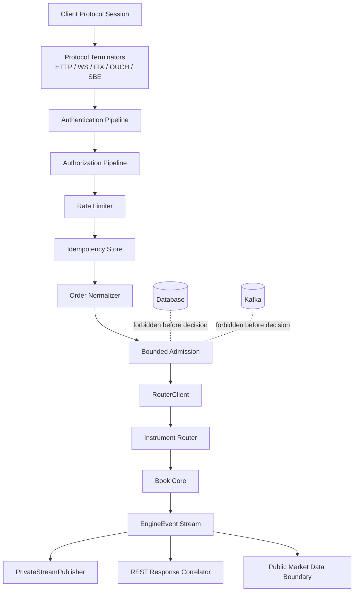
```mermaid
graph TD
    Client[Client Protocol Session] --> Term[Protocol Terminators\nHTTP / WS / FIX / OUCH / SBE]
    Term --> AuthN[Authentication Pipeline]
    AuthN --> AuthZ[Authorization Pipeline]
    AuthZ --> RL[Rate Limiter]
    RL --> Idem[Idempotency Store]
    Idem --> Norm[Order Normalizer]
    Norm --> Admit[Bounded Admission]
    Admit --> Router[RouterClient]
    Router --> IR[Instrument Router]
    IR --> BC[Book Core]
    BC --> Events[EngineEvent Stream]
    Events --> Private[PrivateStreamPublisher]
    Events --> Resp[REST Response Correlator]
    Events --> PublicBoundary[Public Market Data Boundary]

    DB[(Database)] -. forbidden before decision .- Admit
    Kafka[(Kafka)] -. forbidden before decision .- Admit
```

The Gateway is split into protocol adapters and protocol-neutral services. Protocol adapters perform decoding, framing, session I/O, and response encoding. Protocol-neutral services perform authentication, authorization, rate limiting, idempotency, normalization, and routing. All services required before router admission must operate from preloaded in-memory snapshots or lock-free/low-contention local structures.

### 7. Data Structures

```rust
pub struct GatewayRequest {
    pub protocol: Protocol,
    pub session_id: SessionId,
    pub remote_addr: IpAddr,
    pub received_at_ns: UnixNanos,
    pub headers: HeaderMap,
    pub payload: Bytes,
}

pub struct AuthenticatedPrincipal {
    pub account_id: AccountId,
    pub api_key_id: Option<ApiKeyId>,
    pub session_id: SessionId,
    pub permissions: PermissionBits,
    pub auth_epoch: u64,
}

pub struct OrderEnvelope {
    pub envelope_id: EnvelopeId,
    pub account_id: AccountId,
    pub instrument_id: InstrumentId,
    pub client_order_id: ClientOrderId,
    pub command: TradingCommand,
    pub fixed_price: Option<PriceFp>,
    pub fixed_qty: QuantityFp,
    pub side: Side,
    pub tif: TimeInForce,
    pub received_at_ns: UnixNanos,
    pub gateway_deadline_ns: UnixNanos,
    pub auth_epoch: u64,
    pub idempotency_key: IdempotencyKey,
    pub response_route: ResponseRoute,
}

pub enum GatewayDecision {
    Submitted { envelope_id: EnvelopeId },
    Rejected { code: RejectCode, reason: StaticStr },
    Duplicate { prior: PriorDecisionRef },
    Timeout { envelope_id: EnvelopeId },
}
```

### 8. Rust Module Layout

```text
crates/gateway/
  src/lib.rs
  src/http.rs              # REST endpoint decode/encode only
  src/websocket.rs         # WS session, private stream mux
  src/fix.rs               # FIX adapter boundary
  src/ouch.rs              # OUCH adapter boundary
  src/sbe.rs               # SBE adapter boundary
  src/auth.rs              # AuthService implementation over in-memory snapshots
  src/authorization.rs     # permission checks
  src/rate_limit.rs        # token buckets and overload policy
  src/idempotency.rs       # duplicate detection cache
  src/normalize.rs         # fixed-point canonicalization
  src/admission.rs         # bounded queue admission
  src/private_stream.rs    # private report routing
  src/public_boundary.rs   # market data boundary handoff
  src/metrics.rs
  src/errors.rs
```

### 9. Core Traits and Interfaces

```rust
pub trait GatewayService {
    fn handle_request(&self, req: GatewayRequest) -> GatewayDecision;
    fn handle_ws_frame(&self, session: SessionId, frame: WsFrame) -> GatewayDecision;
    fn on_engine_event(&self, event: &EngineEvent);
}

pub trait AuthService {
    fn authenticate(&self, req: &GatewayRequest) -> Result<AuthenticatedPrincipal, AuthError>;
    fn verify_api_key(&self, key_id: ApiKeyId, presented: SecretRef) -> Result<ApiKeyRecord, AuthError>;
    fn verify_hmac(&self, req: &GatewayRequest, key: &ApiKeyRecord) -> Result<(), AuthError>;
    fn validate_jwt_or_session(&self, req: &GatewayRequest) -> Result<SessionClaims, AuthError>;
}

pub trait RateLimiter {
    fn check_and_debit(&self, principal: &AuthenticatedPrincipal, cost: RateCost) -> Result<(), RateLimitError>;
    fn refund_on_not_submitted(&self, principal: &AuthenticatedPrincipal, cost: RateCost);
}

pub trait IdempotencyStore {
    fn reserve(&self, key: IdempotencyKey, ttl_ns: u64) -> IdempotencyDecision;
    fn complete(&self, key: IdempotencyKey, decision: EngineDecisionRef);
    fn mark_unknown_after_crash(&self, key: IdempotencyKey);
}

pub trait OrderNormalizer {
    fn normalize(&self, principal: &AuthenticatedPrincipal, req: CanonicalRequest) -> Result<OrderEnvelope, NormalizeError>;
}

pub trait RouterClient {
    fn try_submit(&self, envelope: OrderEnvelope) -> Result<SubmitRef, SubmitError>;
}

pub trait PrivateStreamPublisher {
    fn publish_execution_report(&self, account_id: AccountId, report: ExecutionReport);
    fn publish_reject(&self, account_id: AccountId, reject: PrivateReject);
}
```

### 10. Processing Flow

1. Decode protocol frame and reject malformed syntax before auth.
2. Authenticate using in-memory API key/JWT/session snapshots.
3. Verify HMAC over canonical method, path, timestamp, nonce, and body for signed REST.
4. Authorize account, instrument, command type, and trading mode.
5. Apply rate limit and overload tokens.
6. Reserve idempotency key scoped by `account_id + instrument_id + client_order_id + command_kind`.
7. Normalize into fixed-point `OrderEnvelope`.
8. Attempt bounded queue admission through `RouterClient::try_submit`.
9. On full queue, return `ENGINE_BUSY` and release/refund transient idempotency reservation unless the request is already in-flight.
10. Await correlated EngineEvent until gateway deadline for synchronous REST; WebSocket/FIX/OUCH sessions can receive asynchronous private reports.

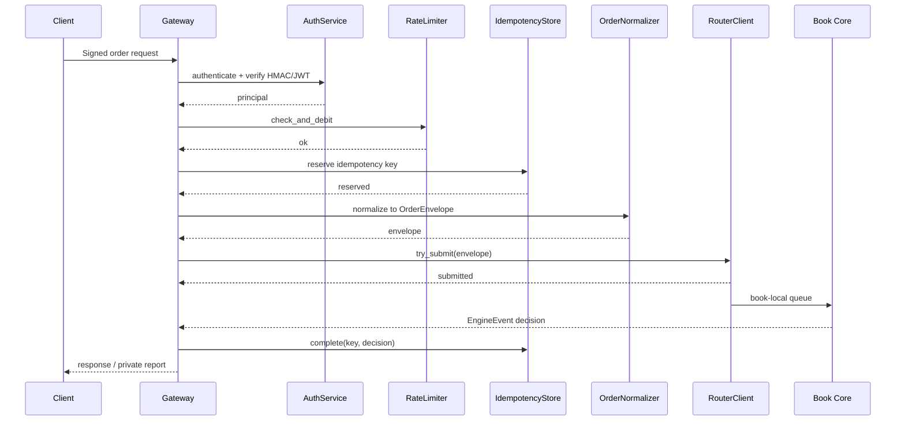
```mermaid
sequenceDiagram
    participant C as Client
    participant G as Gateway
    participant A as AuthService
    participant L as RateLimiter
    participant I as IdempotencyStore
    participant N as OrderNormalizer
    participant R as RouterClient
    participant B as Book Core
    C->>G: Signed order request
    G->>A: authenticate + verify HMAC/JWT
    A-->>G: principal
    G->>L: check_and_debit
    L-->>G: ok
    G->>I: reserve idempotency key
    I-->>G: reserved
    G->>N: normalize to OrderEnvelope
    N-->>G: envelope
    G->>R: try_submit(envelope)
    R-->>G: submitted
    R->>B: book-local queue
    B-->>G: EngineEvent decision
    G->>I: complete(key, decision)
    G-->>C: response / private report
```

### 11. State Machines

#### Request admission state

```text
Received -> Decoded -> Authenticated -> Authorized -> RateLimited -> IdempotencyReserved -> Normalized -> Submitted -> Decided
Received -> Rejected
Submitted -> TimedOutAtGateway
Submitted -> DecidedAfterTimeout
```

A gateway timeout does not cancel the Book Core command. If the command was submitted, the idempotency entry remains `InFlight` until an EngineEvent completes it or replay recovery resolves it.

### 12. Sequence Diagrams

#### Gateway overload rejection sequence

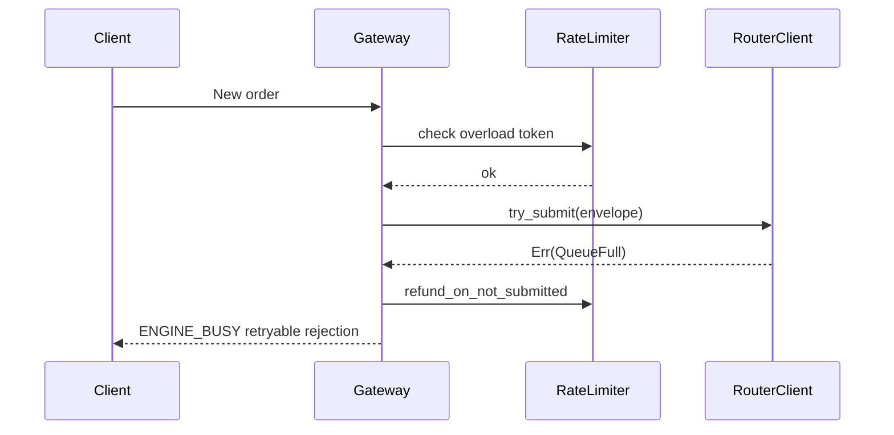
```mermaid
sequenceDiagram
    participant C as Client
    participant G as Gateway
    participant L as RateLimiter
    participant R as RouterClient
    C->>G: New order
    G->>L: check overload token
    L-->>G: ok
    G->>R: try_submit(envelope)
    R-->>G: Err(QueueFull)
    G->>L: refund_on_not_submitted
    G-->>C: ENGINE_BUSY retryable rejection
```

#### Duplicate order retry sequence

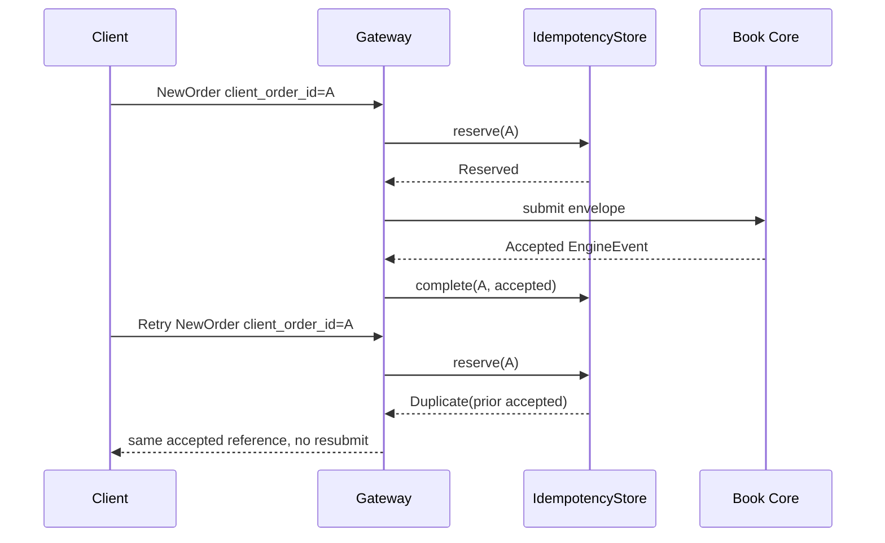
```mermaid
sequenceDiagram
    participant C as Client
    participant G as Gateway
    participant I as IdempotencyStore
    participant B as Book Core
    C->>G: NewOrder client_order_id=A
    G->>I: reserve(A)
    I-->>G: Reserved
    G->>B: submit envelope
    B-->>G: Accepted EngineEvent
    G->>I: complete(A, accepted)
    C->>G: Retry NewOrder client_order_id=A
    G->>I: reserve(A)
    I-->>G: Duplicate(prior accepted)
    G-->>C: same accepted reference, no resubmit
```

#### Gateway component diagram

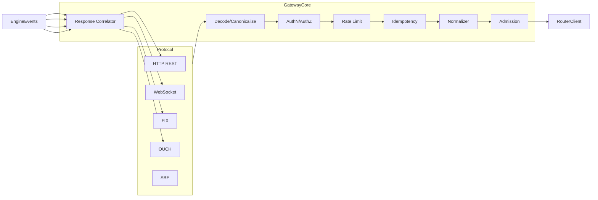
```mermaid
graph LR
    subgraph Protocol
      HTTP[HTTP REST]
      WS[WebSocket]
      FIX[FIX]
      OUCH[OUCH]
      SBE[SBE]
    end
    subgraph GatewayCore
      Decode[Decode/Canonicalize]
      Auth[AuthN/AuthZ]
      Limit[Rate Limit]
      Idem[Idempotency]
      Norm[Normalizer]
      Admit[Admission]
      Correlate[Response Correlator]
    end
    Protocol --> Decode --> Auth --> Limit --> Idem --> Norm --> Admit
    Admit --> RouterClient
    EngineEvents --> Correlate --> WS
    EngineEvents --> Correlate --> FIX
    EngineEvents --> Correlate --> OUCH
    EngineEvents --> Correlate --> HTTP
```

### 13. Memory Model

- Gateway hot-path request structs are allocated from per-worker pools where possible.
- Auth and instrument metadata are immutable snapshot references swapped atomically outside request handling.
- Idempotency entries are bounded by TTL and capacity; eviction cannot remove `InFlight` entries without marking them `Unknown` and forcing status reconciliation.
- `OrderEnvelope` owns all fields needed by Router and Book Core; it must not borrow request body buffers.
- HMAC secret material is stored in protected memory where supported and never copied into logs.

### 14. Threading and Concurrency Model

- Protocol I/O may run on multiple gateway workers.
- Each request is processed independently until `RouterClient::try_submit`.
- Gateway workers may submit to many instrument routes, but per-book order is preserved by the Router and bounded ring writer.
- No Gateway worker may hold a lock while calling `try_submit`.
- Response correlation can be sharded by `envelope_id` or `account_id` and must tolerate decision arrival after REST timeout.

### 15. Failure Modes

| Failure | Detection | Gateway behavior | Recovery expectation |
|---|---|---|---|
| Invalid HMAC | Constant-time compare fails. | Reject `AUTH_SIGNATURE_INVALID`. | Security counter increments; no router call. |
| Expired JWT/session | Session cache expiration. | Reject `AUTH_SESSION_EXPIRED`. | Client reauthenticates. |
| Unknown API key | Auth snapshot miss. | Reject `AUTH_KEY_UNKNOWN`. | No DB lookup in hot path. |
| Duplicate terminal order | Idempotency terminal hit. | Return prior decision reference. | No resubmit. |
| Duplicate in-flight order | Idempotency in-flight hit. | Return in-flight status or await same correlation. | Complete when EngineEvent arrives. |
| Router queue full | `try_submit` returns `QueueFull`. | Reject `ENGINE_BUSY`. | Client retries with same client id. |
| Gateway crash after submit | Missing local response state after restart. | Rebuild idempotency from event log/status query path; mark unresolved keys unknown. | Client retry receives prior decision or reconciliation response. |
| Engine decision after REST timeout | Correlation entry timed out. | Publish private report and persist idempotency terminal. | Client status endpoint shows final result. |

### 16. Backpressure and Overload Behaviour

Backpressure is explicit and bounded. The Gateway must never hide engine saturation behind unbounded in-memory queues.

- If local protocol worker queue is full, reject before auth with transport-level overload where safe.
- If rate-limiter overload bucket is empty, reject `RATE_LIMITED`.
- If router/book ring is full, reject `ENGINE_BUSY`.
- If idempotency store is at capacity, reject `GATEWAY_BUSY` unless the key already exists.
- If private stream subscriber is slow, drop or compact non-critical account snapshots but never drop terminal execution reports without forcing session resynchronization.

### 17. Observability

Required metrics:

- `gateway_requests_total{protocol,command,result}`
- `gateway_auth_failures_total{reason}`
- `gateway_hmac_verify_ns{quantile}`
- `gateway_rate_limited_total{scope}`
- `gateway_idempotency_hits_total{state}`
- `gateway_router_submit_ns{instrument}`
- `gateway_engine_busy_total{instrument,book}`
- `gateway_timeouts_total{command}`
- `gateway_private_report_lag_ns{account}`

Logs must include `envelope_id`, `account_id`, `instrument_id`, `client_order_id`, `protocol`, and rejection code. Logs must exclude secrets, raw HMAC keys, JWT bodies, and full request payloads containing sensitive data.

### 18. Performance Targets

| Operation | Target | Measurement point |
|---|---:|---|
| REST decode + canonicalization | <= 25 µs p99 | worker receive to canonical request |
| HMAC verification | <= 15 µs p99 | canonical bytes ready to auth result |
| Authz + metadata checks | <= 5 µs p99 | principal available to authz result |
| Idempotency reserve | <= 10 µs p99 | key construction to reservation decision |
| Normalize to envelope | <= 8 µs p99 | canonical request to owned envelope |
| Router `try_submit` | <= 5 µs p99 when ring not full | envelope ready to submit result |
| Busy rejection | <= 20 µs p99 after queue-full detection | queue-full to encoded response |

### 19. Security Considerations

- HMAC comparison must be constant-time.
- Signed REST timestamps must enforce a narrow replay window and nonce uniqueness per API key.
- JWT validation must pin issuer, audience, algorithm, and key epoch.
- API keys must be scoped to accounts and permissions; a key for one account cannot submit for another account.
- Authorization must reject halted instruments, liquidation-only accounts, disabled keys, and read-only sessions before Router submission.
- Rate limits must include account and credential dimensions to prevent key fan-out abuse.
- Private execution reports must be routed only to sessions authorized for the account.
- Public market data publishing must consume sanitized EngineEvents from the event boundary, not private order payloads.

### 20. Testing Strategy

| Test category | Required cases |
|---|---|
| Auth | valid/invalid HMAC, expired timestamp, replayed nonce, unknown key, disabled key, expired JWT, wrong audience. |
| Authorization | account mismatch, instrument permission denied, halted instrument, read-only key, trading-disabled account. |
| Idempotency | first submit, duplicate before decision, duplicate after accept, duplicate after reject, retry after gateway crash. |
| Admission | ring available, ring full, router unavailable, deadline exceeded, local overload. |
| Protocol parity | REST, WebSocket, FIX, OUCH, and SBE produce equivalent canonical commands. |
| Security | no secret logging, constant-time signature tests, malformed frame fuzzing, path canonicalization tests. |
| Replay integration | decision after gateway timeout completes idempotency on event replay. |

### 21. Codex Implementation Contract

A Codex implementation agent modifying Gateway code must:

1. Keep protocol adapters separate from canonical command services.
2. Preserve `OrderEnvelope` ownership; do not pass borrowed request buffers beyond normalization.
3. Use fixed-point types for price and quantity.
4. Never add DB, Kafka, or remote service calls before Book Core decision.
5. Treat `ENGINE_BUSY` as a terminal gateway rejection for that attempt and a retryable client outcome.
6. Add tests for every new rejection code and duplicate idempotency branch.
7. Ensure logs redact secrets by default.

### 22. Review Checklist

| Reviewer | Checklist |
|---|---|
| Rust backend engineer | Traits are object-safe or explicitly generic; no blocking call in hot path; error enums are exhaustive. |
| Exchange architect | Gateway does not sequence globally or mutate book state; accepted success follows EngineEvent. |
| QA engineer | Duplicate, timeout, overload, and protocol parity tests are present. |
| SRE | Metrics distinguish auth failure, rate limit, queue full, router unavailable, and timeout. |
| Security engineer | HMAC/JWT/API key handling is constant-time where required and secrets are redacted. |
| Codex agent | Module ownership is clear and forbidden dependencies are absent. |

## Chapter 2: Instrument Router Internals

### 1. Purpose

The Instrument Router maps each normalized `OrderEnvelope` to exactly one Book Core input ring based on instrument metadata, route table state, availability state, and failover policy. It preserves book-local ordering and propagates backpressure to the Gateway without inventing global sequencing or buffering indefinitely.

### 2. Scope

In scope:

- Instrument-to-BookCore mapping.
- Book shard registry and routing table.
- Primary/standby mapping.
- Canary symbols and feature-flagged route changes.
- Instrument availability and halt routing.
- Route cache refresh and hot reload safety.
- Bounded ring selection and `ENGINE_BUSY` propagation.

Out of scope:

- Gateway authentication and normalization.
- Matching and risk reservation.
- Global order sequencing.
- Durable event append.

### 3. Non-Goals

- The Router does not sequence orders globally.
- The Router does not reorder orders for the same book.
- The Router does not retry indefinitely on a full Book Core ring.
- The Router does not mutate Book Core state.
- The Router does not recover a Book Core by replaying events; it only changes routing state after safe failover control.

### 4. Responsibilities

| Responsibility | Implementation detail |
|---|---|
| Resolve instrument | Lookup `InstrumentId` in immutable `RouteTable` snapshot. |
| Validate tradability | Reject unknown, disabled, halted, or route-draining instruments before touching Book Core. |
| Select book | Pick primary or failover BookCoreHandle from `BookRoute`. |
| Preserve ordering | Use one ordered ring writer per target Book Core; never parallel-write same book through competing writers. |
| Propagate backpressure | Return `ENGINE_BUSY` on full ring or unavailable route. |
| Support hot reload | Atomically swap route table snapshots at epoch boundaries. |
| Support canaries | Apply route changes to configured canary symbols before broad migration. |

### 5. Inputs and Outputs

Inputs:

- `OrderEnvelope` from Gateway.
- Immutable `RouteTable` snapshot.
- Book availability heartbeats and health states.
- Feature flag snapshot.
- Instrument halt state snapshot.

Outputs:

- `RouteResolutionResult` to Gateway.
- Submitted command in target Book Core ring.
- Router metrics and structured route decision logs.

### 6. Internal Architecture

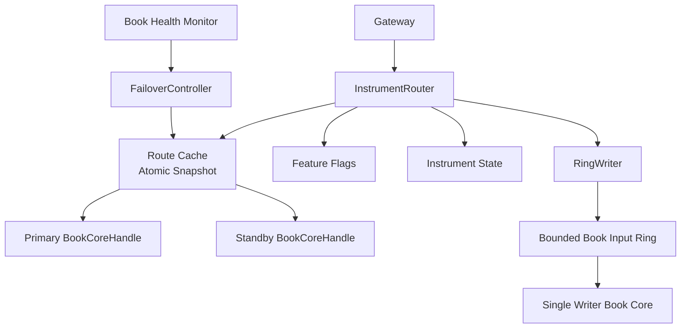
```mermaid
graph TD
    Gateway --> Router[InstrumentRouter]
    Router --> Cache[Route Cache\nAtomic Snapshot]
    Router --> Flags[Feature Flags]
    Router --> Halt[Instrument State]
    Cache --> Primary[Primary BookCoreHandle]
    Cache --> Standby[Standby BookCoreHandle]
    Router --> Writer[RingWriter]
    Writer --> Ring[Bounded Book Input Ring]
    Ring --> Book[Single Writer Book Core]
    Health[Book Health Monitor] --> Failover[FailoverController]
    Failover --> Cache
```

The Router is on the hot path but is not a decision engine. It performs pure selection and admission. It must be deterministic for a given route-table epoch and feature-flag epoch.

### 7. Data Structures

```rust
pub struct InstrumentRouter {
    route_table: ArcSwap<RouteTable>,
    failover: FailoverController,
    metrics: RouterMetrics,
}

pub struct RouteTable {
    pub epoch: RouteEpoch,
    pub routes: FxHashMap<InstrumentId, BookRoute>,
    pub canary_symbols: FxHashSet<InstrumentId>,
}

pub struct BookRoute {
    pub instrument_id: InstrumentId,
    pub primary: BookCoreHandle,
    pub standby: Option<BookCoreHandle>,
    pub state: InstrumentState,
    pub flags: RouteFlags,
    pub min_route_epoch: RouteEpoch,
}

pub struct BookCoreHandle {
    pub book_id: BookId,
    pub shard_id: ShardId,
    pub ring: RingWriter<OrderEnvelope>,
    pub availability: BookAvailability,
    pub writer_epoch: u64,
}

pub struct RingWriter<T> {
    pub ring_id: RingId,
    pub capacity: u32,
    pub producer: BoundedProducer<T>,
}

pub enum RouteResolutionResult {
    Submitted { book_id: BookId, route_epoch: RouteEpoch },
    Rejected { code: RejectCode, reason: StaticStr },
    Busy { book_id: Option<BookId>, reason: BusyReason },
}

pub enum InstrumentState {
    Trading,
    Halted { reason: HaltReason, since_ns: UnixNanos },
    PostOnly,
    CancelOnly,
    Disabled,
    Draining,
}

pub struct FailoverController {
    pub policy_epoch: u64,
    pub failover_state: AtomicFailoverMap,
}
```

### 8. Rust Module Layout

```text
crates/router/
  src/lib.rs
  src/instrument_router.rs
  src/route_table.rs
  src/book_registry.rs
  src/book_handle.rs
  src/ring_writer.rs
  src/failover.rs
  src/halt.rs
  src/feature_flags.rs
  src/cache_refresh.rs
  src/errors.rs
  src/metrics.rs
```

### 9. Core Traits and Interfaces

```rust
pub trait InstrumentRouterApi {
    fn route(&self, envelope: OrderEnvelope) -> RouteResolutionResult;
    fn current_epoch(&self) -> RouteEpoch;
}

pub trait RouteTableProvider {
    fn load_snapshot(&self) -> Arc<RouteTable>;
    fn validate_snapshot(&self, next: &RouteTable) -> Result<(), RouteTableError>;
}

pub trait BookRegistry {
    fn get(&self, book_id: BookId) -> Option<BookCoreHandle>;
    fn availability(&self, book_id: BookId) -> BookAvailability;
}

pub trait RingWriterApi<T> {
    fn try_push(&self, item: T) -> Result<(), RingPushError<T>>;
    fn remaining_capacity(&self) -> u32;
}

pub trait FailoverControl {
    fn active_handle(&self, route: &BookRoute) -> Result<BookCoreHandle, RouteError>;
    fn mark_primary_unavailable(&self, book_id: BookId, reason: FailoverReason);
}
```

### 10. Processing Flow

1. Load current `RouteTable` snapshot atomically.
2. Lookup `envelope.instrument_id`.
3. Reject `UNKNOWN_INSTRUMENT` if missing.
4. Check `InstrumentState`; reject halted/disabled instruments before touching Book Core.
5. Resolve active Book Core handle through failover policy.
6. Verify handle availability and writer epoch.
7. Attempt `RingWriter::try_push(envelope)`.
8. Return `Submitted` on push success.
9. Return `Busy` on full ring or unavailable active handle.

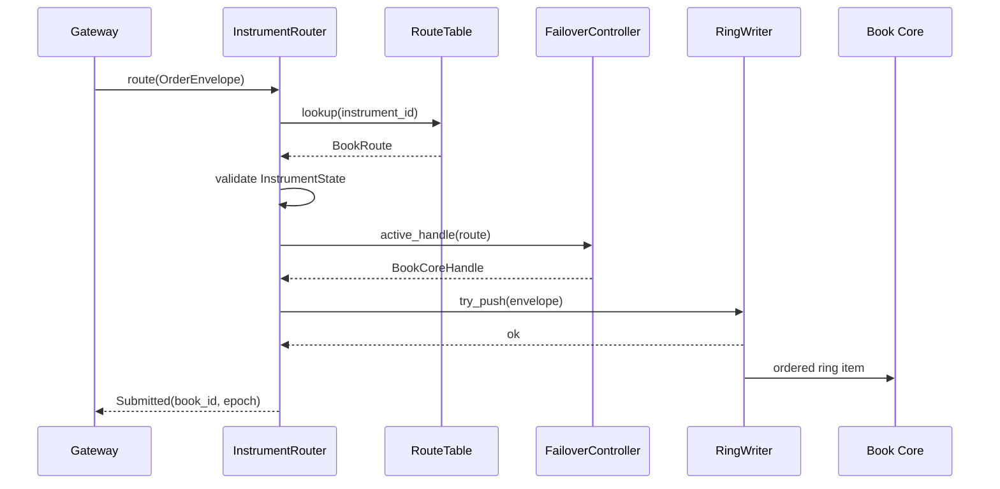
```mermaid
sequenceDiagram
    participant G as Gateway
    participant R as InstrumentRouter
    participant T as RouteTable
    participant F as FailoverController
    participant W as RingWriter
    participant B as Book Core
    G->>R: route(OrderEnvelope)
    R->>T: lookup(instrument_id)
    T-->>R: BookRoute
    R->>R: validate InstrumentState
    R->>F: active_handle(route)
    F-->>R: BookCoreHandle
    R->>W: try_push(envelope)
    W-->>R: ok
    W->>B: ordered ring item
    R-->>G: Submitted(book_id, epoch)
```

### 11. State Machines

#### Instrument route state

```text
Trading -> Halted -> Trading
Trading -> CancelOnly -> Trading
Trading -> Draining -> Disabled
Trading -> Draining -> Trading
Disabled -> Draining -> Trading
```

Only `Trading`, `PostOnly` for allowed post-only commands, and `CancelOnly` for cancel commands are routable. `Halted`, `Disabled`, and incompatible modes reject before Book Core.

#### Book availability state

```text
Available -> Degraded -> Unavailable -> Recovering -> Available
Available -> Draining -> StandbyPromoted
```

Routing to standby is permitted only after failover control has confirmed no split-brain writer exists for the same book-local sequence domain.

### 12. Sequence Diagrams

#### Route cache refresh sequence

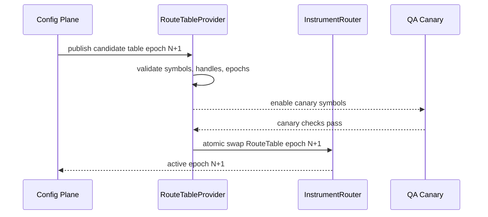
```mermaid
sequenceDiagram
    participant C as Config Plane
    participant P as RouteTableProvider
    participant R as InstrumentRouter
    participant Q as QA Canary
    C->>P: publish candidate table epoch N+1
    P->>P: validate symbols, handles, epochs
    P-->>Q: enable canary symbols
    Q-->>P: canary checks pass
    P->>R: atomic swap RouteTable epoch N+1
    R-->>C: active epoch N+1
```

#### Primary/standby failover routing sequence

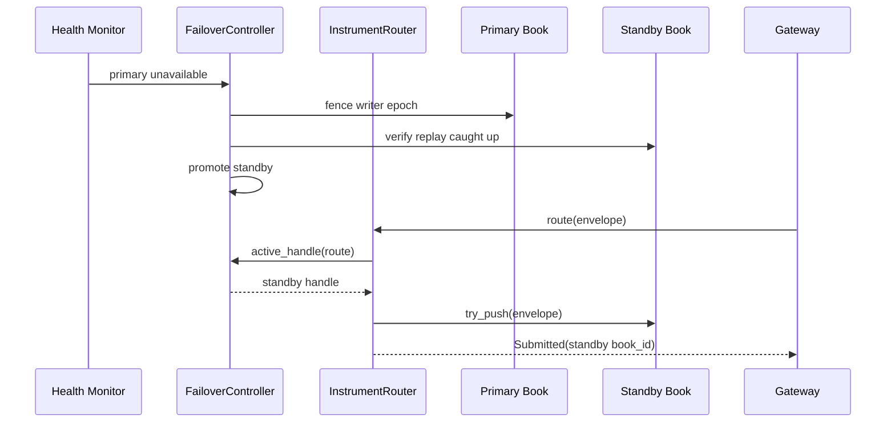
```mermaid
sequenceDiagram
    participant H as Health Monitor
    participant F as FailoverController
    participant R as InstrumentRouter
    participant P as Primary Book
    participant S as Standby Book
    participant G as Gateway
    H->>F: primary unavailable
    F->>P: fence writer epoch
    F->>S: verify replay caught up
    F->>F: promote standby
    G->>R: route(envelope)
    R->>F: active_handle(route)
    F-->>R: standby handle
    R->>S: try_push(envelope)
    R-->>G: Submitted(standby book_id)
```

#### Instrument halt routing sequence

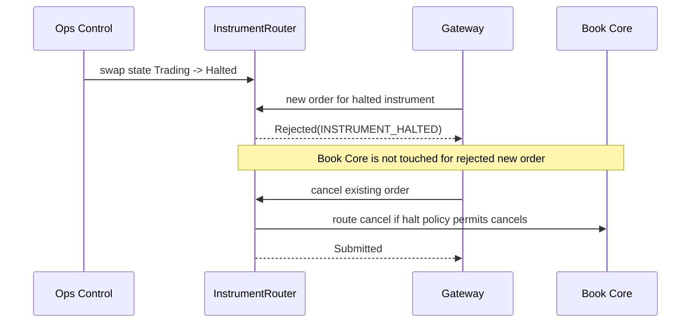
```mermaid
sequenceDiagram
    participant Ops as Ops Control
    participant R as InstrumentRouter
    participant G as Gateway
    participant B as Book Core
    Ops->>R: swap state Trading -> Halted
    G->>R: new order for halted instrument
    R-->>G: Rejected(INSTRUMENT_HALTED)
    Note over R,B: Book Core is not touched for rejected new order
    G->>R: cancel existing order
    R->>B: route cancel if halt policy permits cancels
    R-->>G: Submitted
```

### 13. Memory Model

- `RouteTable` is immutable after construction and exchanged with atomic pointer swap.
- `BookRoute` holds handles by value or `Arc` to stable writer endpoints; it does not hold mutable book state.
- Ring writers own producer cursors; consumer cursors are owned by Book Core.
- Route cache refresh allocates outside the hot path, validates fully, then swaps one pointer.
- The Router does not copy large order payloads; it moves the owned `OrderEnvelope` into a selected ring or returns it on push failure for error handling.

### 14. Threading and Concurrency Model

- Multiple Gateway workers may call `InstrumentRouter::route` concurrently.
- A route operation reads immutable snapshots and performs one bounded ring push.
- For a given Book Core, ring writer configuration must preserve single producer semantics or use a proven MPSC ring that preserves arrival order per producer and deterministic merge policy. Preferred deployment is one Router writer task per Book Core to avoid ambiguous same-book ordering.
- Route-table swaps are atomic and wait-free for readers.
- Failover promotion must fence the old writer epoch before exposing the standby handle.

### 15. Failure Modes

| Failure | Detection | Router response | Safety property |
|---|---|---|---|
| Unknown instrument | Route table miss. | Reject `UNKNOWN_INSTRUMENT`. | Book Core untouched. |
| Halted instrument | `InstrumentState::Halted`. | Reject new/amend; route cancels only if policy allows. | Halt is enforced before matching. |
| Full book ring | `RingPushError::Full`. | Return `ENGINE_BUSY`. | No hidden backlog. |
| Primary unavailable | Health state or failed writer epoch. | Return busy or use promoted standby. | No split-brain writer. |
| Invalid hot reload | Snapshot validation fails. | Keep old route table. | Readers observe valid epoch only. |
| Feature flag mismatch | Flag epoch inconsistent. | Reject route-table activation. | Canary changes are controlled. |

### 16. Backpressure and Overload Behaviour

- The Router never blocks waiting for ring capacity.
- `RingWriter::try_push` is a single-attempt operation.
- Full rings produce `ENGINE_BUSY` with `book_id` where safe.
- Route-level degraded state can preemptively return busy before a ring is full.
- Gateway must surface busy to clients; it must not create a secondary unbounded queue.

### 17. Observability

Required metrics:

- `router_route_total{instrument,result,book_id}`
- `router_unknown_instrument_total{instrument}`
- `router_instrument_halted_total{instrument,command}`
- `router_ring_full_total{book_id}`
- `router_route_epoch{}`
- `router_failover_total{from_book,to_book,reason}`
- `router_route_latency_ns{quantile}`
- `router_ring_remaining_capacity{book_id}`

Structured route logs must include `envelope_id`, `instrument_id`, `route_epoch`, `book_id`, `instrument_state`, and `result`.

### 18. Performance Targets

| Operation | Target | Notes |
|---|---:|---|
| Route table lookup | <= 2 µs p99 | Immutable hash map or generated perfect map for active symbols. |
| Instrument state validation | <= 500 ns p99 | State stored in route entry. |
| Failover active handle selection | <= 1 µs p99 | Atomic state read only in normal case. |
| Ring push success | <= 2 µs p99 | No allocation, no blocking. |
| Ring full rejection | <= 2 µs p99 | Includes error construction. |
| Route table atomic swap | <= 50 µs control-plane operation | Not on order hot path. |

### 19. Security Considerations

- Route-table updates require authenticated control-plane authorization and signed configuration artifacts.
- Canary activation must not allow unauthorized instruments to trade.
- Instrument halt state is security relevant; stale route state must be observable and bounded by epoch monitoring.
- Router logs must not include private order payload beyond identifiers required for audit.
- Failover fencing must prevent two Book Cores from accepting commands for the same instrument sequence domain.

### 20. Testing Strategy

| Test category | Required cases |
|---|---|
| Routing | known instrument, unknown instrument, disabled instrument, canary instrument, post-only mode, cancel-only mode. |
| Ordering | concurrent submissions to same book preserve configured ring order; no reorder during route-table swap. |
| Backpressure | full ring returns `ENGINE_BUSY`; degraded route returns busy; Gateway receives propagated busy. |
| Hot reload | invalid snapshot rejected; valid snapshot swapped atomically; old in-flight route completes safely. |
| Failover | primary available, primary unavailable no standby, standby promoted after fence, split-brain prevention. |
| Halt | new order rejected, cancel allowed/denied by policy, halt epoch observed in metrics. |

### 21. Codex Implementation Contract

A Codex implementation agent modifying Router code must:

1. Keep Router logic limited to selection, validation, and bounded admission.
2. Never add global sequencing.
3. Never add unbounded queues or blocking retry loops.
4. Reject unknown or halted instruments before touching Book Core.
5. Preserve book-local order during route-table refresh and failover.
6. Add tests for route epochs, failover fencing, and ring-full propagation.

### 22. Review Checklist

| Reviewer | Checklist |
|---|---|
| Rust backend engineer | Route snapshots are immutable; ring push API cannot block indefinitely. |
| Exchange architect | Router does not sequence globally and does not mutate Book Core state. |
| QA engineer | Hot reload, halt, unknown instrument, and failover tests exist. |
| SRE | Route epoch, ring capacity, and failover metrics are dashboarded. |
| Security engineer | Route config activation is authenticated and split-brain is prevented. |
| Codex agent | Interfaces match `InstrumentRouter`, `RouteTable`, `BookRoute`, `BookCoreHandle`, `RingWriter`, `RouteResolutionResult`, `InstrumentState`, and `FailoverController`. |

## Chapter 3: Book Core Memory Model

### 1. Purpose

The Book Core Memory Model defines ownership, layout, allocation, cache behavior, and mutation invariants for the single-writer trading kernel. It is the implementation contract for deterministic, low-latency order processing. Every accepted command for a book is consumed by one Book Core thread that owns all mutable book state, generates EngineEvents atomically with state transitions, appends events before externally visible success, and supports replay into identical logical state.

### 2. Scope

In scope:

- Single-writer memory ownership for book state, risk cache, reservations, event buffers, and snapshot buffers.
- Owned, borrowed, and read-only snapshot state.
- Cache line alignment, false sharing avoidance, CPU pinning, and NUMA assumptions.
- Memory pools, arena allocation, object lifecycle, and zero steady-state allocation target.
- Layouts for order nodes, price levels, rings, event buffers, snapshot buffers, reservation map, risk cache, and hash chain buffer.

Out of scope:

- External database layout.
- Kafka or cloud archival storage.
- Full matching algorithm specification, which is expanded in Chapter 5.
- Full risk formula specification, which is expanded in Chapter 6.

### 3. Non-Goals

- No shared mutable order book state between threads.
- No lock acquisition inside `process_order`.
- No heap allocation in steady-state order matching.
- No floating-point arithmetic in memory-resident trading state.
- No global sequence counter across books.
- No runtime schema reflection in the hot path.

### 4. Responsibilities

| Component | Owned by | Responsibility |
|---|---|---|
| `BookCore` | Book thread | Consume input ring, mutate book state, emit EngineEvents. |
| `BookState` | Book thread | Hold all mutable per-book state. |
| `OrderBook` | Book thread | Maintain price levels and FIFO queues. |
| `RiskCache` | Book thread | Hold preloaded account/instrument limits relevant to this book. |
| `ReservationMap` | Book thread | Track risk reservations for active orders in this book. |
| `EventBuffer` | Book thread | Stage EngineEvents before append. |
| `AppendOnlyLog` | Book thread owned writer | Append committed events and hash chain entries. |
| `SnapshotBuffer` | Snapshot subsystem with immutable handoff | Copy or freeze read-only state for replay checkpoints. |

### 5. Inputs and Outputs

Inputs:

- `OrderEnvelope` from the book input ring.
- Control commands already routed to this book, such as halt transition, cancel-only mode, snapshot request, and drain request.
- Preloaded risk/account cache updates delivered through deterministic control events.

Outputs:

- `EngineEvent` entries appended to the append-only log.
- Private execution reports derived from EngineEvents.
- Public market data deltas derived from non-private EngineEvents.
- Snapshot artifacts created from read-only checkpoint buffers.

### 6. Internal Architecture

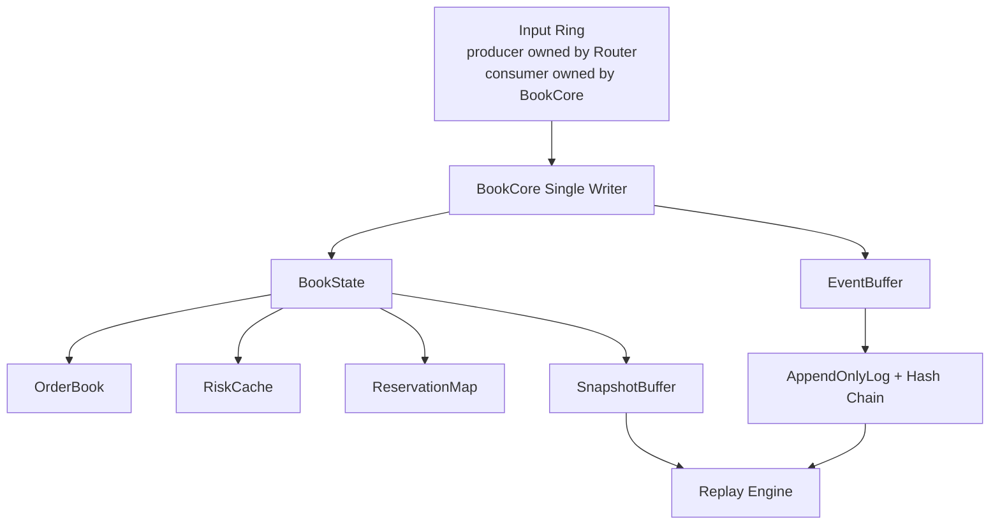
```mermaid
graph TD
    Ring[Input Ring\nproducer owned by Router\nconsumer owned by BookCore] --> Core[BookCore Single Writer]
    Core --> State[BookState]
    State --> OB[OrderBook]
    State --> Risk[RiskCache]
    State --> Res[ReservationMap]
    Core --> EB[EventBuffer]
    EB --> Log[AppendOnlyLog + Hash Chain]
    State --> Snap[SnapshotBuffer]
    Log --> Replay[Replay Engine]
    Snap --> Replay
```

Book Core owns mutable state exclusively. Other threads may hold immutable snapshots or receive event-derived projections, but they cannot borrow mutable state from `BookState`.

### 7. Data Structures

```rust
#[repr(align(64))]
pub struct BookCore {
    pub book_id: BookId,
    pub instrument_id: InstrumentId,
    pub input: RingConsumer<OrderEnvelope>,
    pub state: BookState,
    pub event_buffer: EventBuffer,
    pub log: AppendOnlyLog,
    pub snapshot_buffer: SnapshotBuffer,
    pub pools: BookMemoryPools,
    pub clock: DeterministicClock,
}

pub struct BookState {
    pub seq: BookSeq,
    pub trading_state: TradingState,
    pub order_book: OrderBook,
    pub risk_cache: RiskCache,
    pub reservations: ReservationMap,
    pub last_event_hash: Hash256,
    pub stats: BookStats,
}

pub struct OrderBook {
    pub bids: PriceTree<PriceFp, PriceLevel>,
    pub asks: PriceTree<PriceFp, PriceLevel>,
    pub order_index: FixedHashMap<OrderId, OrderPtr>,
    pub client_index: FixedHashMap<ClientOrderKey, OrderId>,
}

#[repr(align(64))]
pub struct PriceLevel {
    pub price: PriceFp,
    pub total_qty: QuantityFp,
    pub head: Option<OrderPtr>,
    pub tail: Option<OrderPtr>,
    pub order_count: u32,
    pub _pad: [u8; 16],
}

pub struct OrderNode {
    pub order_id: OrderId,
    pub account_id: AccountId,
    pub client_order_id: ClientOrderId,
    pub price: PriceFp,
    pub remaining_qty: QuantityFp,
    pub reserved_qty: QuantityFp,
    pub side: Side,
    pub tif: TimeInForce,
    pub prev: Option<OrderPtr>,
    pub next: Option<OrderPtr>,
    pub pool_generation: u32,
}

pub struct RiskCache {
    pub account_limits: FixedHashMap<AccountId, AccountLimitCell>,
    pub instrument_limits: InstrumentLimitCell,
    pub account_positions: FixedHashMap<AccountId, PositionCell>,
}

pub struct ReservationMap {
    pub by_order: FixedHashMap<OrderId, ReservationCell>,
    pub by_account: FixedHashMap<AccountId, AccountReservationTotals>,
}

#[repr(align(64))]
pub struct EventBuffer {
    pub staged: FixedVec<EngineEvent, MAX_EVENTS_PER_COMMAND>,
    pub hash_chain: HashChainBuffer,
}

pub struct AppendOnlyLog {
    pub writer: LogWriter,
    pub current_segment: SegmentId,
    pub last_flushed_seq: BookSeq,
}

pub struct SnapshotBuffer {
    pub header: SnapshotHeader,
    pub arena_image: SnapshotArenaImage,
    pub order_index_image: SnapshotIndexImage,
    pub risk_image: SnapshotRiskImage,
}
```

### 8. Rust Module Layout

```text
crates/book_core/
  src/lib.rs
  src/core.rs              # BookCore loop and process_order boundary
  src/state.rs             # BookState and invariants
  src/order_book.rs        # OrderBook, PriceLevel, OrderNode
  src/memory_pool.rs       # slab/arena allocation
  src/ring.rs              # consumer-side input ring contracts
  src/events.rs            # EventBuffer and EngineEvent staging
  src/log.rs               # AppendOnlyLog writer boundary
  src/snapshot.rs          # SnapshotBuffer layout and handoff
  src/risk_cache.rs        # RiskCache and ReservationMap
  src/replay_alloc.rs      # deterministic replay allocation
  src/cache_align.rs       # alignment wrappers and padding
  src/tests/
```

### 9. Core Traits and Interfaces

```rust
pub trait BookCoreRuntime {
    fn run(&mut self) -> !;
    fn process_order(&mut self, envelope: OrderEnvelope) -> ProcessResult;
    fn process_control(&mut self, command: BookControlCommand) -> ProcessResult;
}

pub trait BookMemoryPool<T> {
    fn alloc(&mut self, value: T) -> Result<PoolPtr<T>, PoolExhausted>;
    fn free(&mut self, ptr: PoolPtr<T>);
    fn capacity(&self) -> usize;
    fn used(&self) -> usize;
}

pub trait EventAppender {
    fn stage(&mut self, event: EngineEvent);
    fn commit_staged(&mut self, log: &mut AppendOnlyLog) -> Result<CommitRef, LogError>;
    fn clear_staged_on_reject(&mut self);
}

pub trait SnapshotWriter {
    fn begin_snapshot(&mut self, state: &BookState) -> SnapshotToken;
    fn copy_chunk(&mut self, token: SnapshotToken, budget_bytes: usize) -> SnapshotProgress;
    fn publish_read_only(&mut self, token: SnapshotToken) -> ReadOnlySnapshot;
}
```

### 10. Processing Flow

1. Book Core polls its input ring consumer.
2. It moves one `OrderEnvelope` into `process_order`.
3. It validates deterministic preconditions using owned `BookState` and `RiskCache`.
4. It mutates `OrderBook` and `ReservationMap` using pool-owned nodes only.
5. It stages one or more EngineEvents in `EventBuffer`.
6. It appends staged events to `AppendOnlyLog`, updating the hash chain.
7. Only after successful append does it expose success through event publication.
8. If append fails before visibility, it must stop the book, mark state unsafe, and require replay or operator intervention.

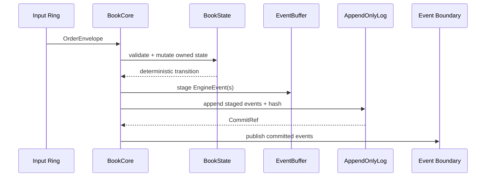
```mermaid
sequenceDiagram
    participant Ring as Input Ring
    participant Core as BookCore
    participant State as BookState
    participant Events as EventBuffer
    participant Log as AppendOnlyLog
    participant Pub as Event Boundary
    Ring->>Core: OrderEnvelope
    Core->>State: validate + mutate owned state
    State-->>Core: deterministic transition
    Core->>Events: stage EngineEvent(s)
    Core->>Log: append staged events + hash
    Log-->>Core: CommitRef
    Core->>Pub: publish committed events
```

### 11. State Machines

#### Book Core run state

```text
Starting -> Replaying -> Live -> Draining -> Stopped
Live -> Faulted
Faulted -> Replaying
Draining -> Snapshotting -> Stopped
```

#### Object lifecycle

```text
FreePoolSlot -> AllocatedOrderNode -> LinkedInPriceLevel -> PartiallyFilled -> RemovedFromBook -> EventCommitted -> FreePoolSlot
```

An order node cannot return to the free pool until the cancel/fill/remove event that made it unreachable has been appended.

### 12. Sequence Diagrams

#### Hot path memory flow diagram

```mermaid
flowchart LR
    Env[OrderEnvelope owned value] --> Validate[Validate against RiskCache]
    Validate --> Pool[OrderNode from slab pool]
    Pool --> Level[PriceLevel FIFO link]
    Level --> Stage[Stage EngineEvent]
    Stage --> Hash[HashChainBuffer]
    Hash --> Append[AppendOnlyLog]
    Append --> Visible[Externally visible success]
```

#### Ring buffer ownership diagram

```mermaid
graph LR
    subgraph RouterThread
      P[Ring Producer Cursor]
    end
    subgraph SharedRingMemory
      Slots[Preallocated Slots]
    end
    subgraph BookCoreThread
      C[Ring Consumer Cursor]
    end
    P -- writes envelope then publishes --> Slots
    C -- consumes in order --> Slots
    Slots -- no mutable book state --> C
```

#### Snapshot memory layout diagram

```mermaid
graph TD
    Header[SnapshotHeader\nbook_id seq hash epoch] --> Arena[Order Arena Image]
    Header --> Levels[Price Level Index Image]
    Header --> Orders[Order Index Image]
    Header --> Risk[Risk Cache Image]
    Header --> Reservations[Reservation Map Image]
    Header --> Trailer[Checksum + Hash Chain Anchor]
```

### 13. Memory Model

#### Ownership categories

| Category | Examples | Access rule |
|---|---|---|
| Owned mutable | `BookState`, `OrderBook`, `RiskCache`, `ReservationMap`, `EventBuffer` | Only Book Core thread mutates. |
| Borrowed immutable | `&InstrumentSpec`, read-only config snapshot | Borrow for duration of command; never store mutable refs. |
| Moved input | `OrderEnvelope` | Moved from ring into Book Core; not shared after consume. |
| Read-only snapshot | `ReadOnlySnapshot` | Published after copy/freeze; consumers cannot mutate. |
| Cold-path projection | DB/Kafka/materialized views | Derived from committed events, never consulted for hot decisions. |

#### Layout requirements

| Structure | Layout requirement | Rationale |
|---|---|---|
| `BookCore` | `repr(align(64))`; hot counters separated from cold config. | Prevent false sharing with adjacent runtime objects. |
| Ring slots | Power-of-two capacity; slot sequence padded to cache line. | Fast mask index and avoid producer/consumer cache ping-pong. |
| `PriceLevel` | Head/tail/aggregate quantity in one or two cache lines. | Common matching operations touch these fields together. |
| `OrderNode` | Intrusive prev/next pointers and fixed-point quantities. | Avoid per-node heap allocation and external linked-list boxes. |
| `EventBuffer` | Fixed max events per command with overflow fault policy. | No dynamic allocation during matching. |
| `RiskCache` | Account cells grouped by active instrument shard. | Improve locality for repeated account activity. |
| `ReservationMap` | Fixed-capacity hash table with deterministic probing. | Replay creates identical map shape and iteration order. |
| `HashChainBuffer` | Fixed staging buffer for event hashes. | Event append and hash update are atomic from Book Core perspective. |

#### CPU and NUMA assumptions

- Each active Book Core is pinned to a dedicated logical CPU where deployment capacity allows.
- Router producer for a hot book should run on the same NUMA node as the Book Core.
- Memory pools are allocated on the target NUMA node during startup warmup.
- Cross-NUMA route changes require draining or explicit latency budget approval.
- Hyperthread sibling placement must avoid placing noisy cold-path projection work next to a high-volume Book Core.

#### Allocator strategy

- Startup allocates slabs for order nodes, price levels, event staging, risk cells, reservations, input ring slots, and snapshot buffers.
- Steady-state `process_order` uses only pool allocation and fixed-capacity containers.
- Pool exhaustion is a deterministic rejection or book fault depending on the pool. Order-node exhaustion returns `ENGINE_CAPACITY_EXCEEDED`; event-buffer overflow faults the book because it violates event bounds.
- Replay uses the same pool capacities and deterministic allocation order to rebuild identical logical memory state.

### 14. Threading and Concurrency Model

- One Book Core thread owns one book or a configured small set of books only if each book has isolated state and deterministic polling policy.
- `process_order` is single-threaded and cannot acquire mutexes, rwlocks, async locks, or blocking channels.
- Input ring consumer is owned by Book Core; producer ownership belongs to Router.
- Event publication after log append may hand off immutable event copies to other threads.
- Snapshotting may be incremental, but any mutable traversal is controlled by the Book Core. Cold snapshot writers receive copied chunks or frozen immutable buffers.

### 15. Failure Modes

| Failure mode | Detection | Required behavior | Test |
|---|---|---|---|
| Order node pool exhausted | Pool `alloc` returns `PoolExhausted`. | Reject new order with capacity code; do not mutate book. | Fill pool then submit one more order. |
| Price level pool exhausted | Level allocation fails. | Reject if no mutation occurred; otherwise fault before visibility. | Submit unique prices beyond capacity. |
| Event buffer overflow | Staged event count exceeds bound. | Fault Book Core; require replay with corrected bound. | Fuzz command producing many fills. |
| Log append failure | `AppendOnlyLog` returns error. | Stop external success; mark book `Faulted`. | Inject log write failure. |
| Hash chain mismatch on replay | Recomputed hash differs. | Stop replay and quarantine segment. | Corrupt event segment. |
| Snapshot checksum mismatch | Trailer check fails. | Discard snapshot and replay from earlier checkpoint. | Corrupt snapshot bytes. |
| Shared mutable alias introduced | Static/lint/Miri detection. | Reject code change. | Miri/loom/unsafe audit. |
| Unexpected allocation in hot path | Allocation counter increments. | Fail benchmark/test. | Instrument global allocator in tests. |

### 16. Backpressure and Overload Behaviour

- Book Core signals overload by allowing input ring capacity to fall to zero; Router converts that to `ENGINE_BUSY`.
- Book Core does not allocate more memory to absorb bursts.
- Capacity rejections are deterministic and evented when the command reached Book Core.
- If memory pool usage exceeds warning thresholds, SRE metrics fire before hard exhaustion.
- Snapshot activity must yield to order processing and obey a byte/time budget per loop iteration.

### 17. Observability

Required metrics:

- `book_core_loop_ns{book_id}`
- `book_core_process_order_ns{book_id,command}`
- `book_core_ring_depth{book_id}`
- `book_core_pool_used{book_id,pool}`
- `book_core_event_append_ns{book_id}`
- `book_core_hash_chain_seq{book_id}`
- `book_core_snapshot_bytes_pending{book_id}`
- `book_core_replay_determinism_fail_total{book_id}`
- `book_core_hot_path_allocations_total{book_id}` expected to remain zero after warmup.

Tracing must be sampled outside the hot mutation section. Per-order debug logging is disabled in production hot path unless a canary symbol or emergency trace flag is enabled with explicit latency acceptance.

### 18. Performance Targets

#### Latency budget table

| Segment | Target p50 | Target p99 | Constraint |
|---|---:|---:|---|
| Ring consume | <= 250 ns | <= 1 µs | Cache-resident slot, no allocation. |
| Precondition validation | <= 1 µs | <= 4 µs | Risk cache local to book thread. |
| Add resting order | <= 2 µs | <= 8 µs | Existing price level. |
| Create new price level | <= 4 µs | <= 15 µs | Pool allocation only. |
| Match against one level | <= 3 µs | <= 10 µs | Excludes multi-level sweep. |
| Event staging | <= 500 ns | <= 2 µs | Fixed buffer. |
| Event append | <= 5 µs | <= 25 µs | Local append-only segment. |
| Snapshot incremental slice | <= 10 µs per loop budget | <= 50 µs | Must yield to order processing. |

#### Memory budget table

| Pool/buffer | Initial capacity per book | Sizing driver | Exhaustion behavior |
|---|---:|---|---|
| Input ring | 65,536 envelopes | Gateway burst and router fan-in. | Router returns `ENGINE_BUSY`. |
| Order node slab | 2,000,000 nodes | Max resting orders plus safety margin. | Reject new resting order. |
| Price level slab | 250,000 levels | Tick range and active depth. | Reject/fault based on mutation point. |
| Order index | 4,194,304 slots | Load factor <= 0.5 for active orders. | Reject capacity. |
| Client index | 4,194,304 slots | Duplicate detection at book level. | Reject capacity. |
| Reservation map | 4,194,304 slots | Active reserving orders. | Reject capacity. |
| Event buffer | 4,096 events/command | Worst-case sweep bound. | Fault if exceeded. |
| Hash chain buffer | 4,096 hashes/command | Mirrors event buffer. | Fault if exceeded. |
| Snapshot buffer | Configured by book size, double-buffered | Checkpoint latency target. | Delay snapshot; do not block matching indefinitely. |
| Risk cache | Active accounts for instrument shard | Account participation. | Reject if required account cell absent. |

### 19. Security Considerations

- Memory reuse must clear sensitive account/order fields before returning slots to pools if snapshots or diagnostics can expose freed memory.
- Unsafe Rust is allowed only in audited modules such as ring buffers or arena pointers, with documented aliasing invariants.
- Snapshot buffers must not include API secrets, JWTs, HMAC material, or private gateway credentials.
- Event hashes must include enough command and result data to detect tampering while respecting privacy boundaries for public projections.
- Replay must reject malformed events rather than attempting best-effort repair.

### 20. Testing Strategy

#### Testing matrix

| Test type | Required coverage | Tooling |
|---|---|---|
| Unit | Price level link/unlink, slab alloc/free, reservation insert/remove, event staging bounds. | Rust unit tests. |
| Property | Random command sequences preserve quantity, FIFO, reservation, and hash invariants. | proptest. |
| Determinism | Same event stream rebuilds identical logical state and hashes. | Replay harness. |
| Allocation | Zero heap allocation during warmed `process_order`. | Counting allocator. |
| Concurrency | Ring producer/consumer memory ordering and snapshot handoff. | loom where feasible. |
| Unsafe audit | Pointer generation checks and aliasing invariants. | Miri + manual review. |
| Performance | p50/p95/p99 latency by command shape and book depth. | Criterion/custom pinned benchmark. |
| Fault injection | log failure, pool exhaustion, hash mismatch, snapshot corruption. | deterministic fault hooks. |

### 21. Codex Implementation Contract

A Codex implementation agent modifying Book Core memory code must:

1. Preserve the invariant that only `BookCore` mutates `BookState`.
2. Add no lock acquisition inside `process_order`.
3. Add no heap allocation in warmed steady-state matching.
4. Use fixed-point numeric types only.
5. Ensure EngineEvent append occurs before externally visible success.
6. Keep state mutation and EngineEvent generation atomic from the Book Core perspective.
7. Update replay tests whenever memory layout or event generation changes.
8. Document every `unsafe` block with aliasing, lifetime, and threading invariants.
9. Keep replay allocation deterministic.
10. Add pool-exhaustion and snapshot/replay tests for new pools or buffers.

### 22. Architect Review Checklist

| Invariant | Review question |
|---|---|
| Single writer | Can any thread other than Book Core mutate `BookState` or children? |
| Event-before-success | Is success externally visible only after append commit? |
| Atomic transition | Can state mutation happen without corresponding EngineEvent? |
| Replay determinism | Does replay rebuild identical logical state and hash chain? |
| Fixed point | Are all prices, quantities, fees, and reservations fixed-point integers? |
| Zero allocation | Does warmed `process_order` avoid heap allocation? |
| No locks | Are mutexes/rwlocks/blocking channels absent from hot mutation code? |
| Cache locality | Are hot fields aligned and separated from cold fields? |
| Pool sizing | Is exhaustion behavior deterministic and tested? |
| Snapshot safety | Are snapshots read-only, checksummed, and free of secrets? |

## Chapter 4: Order Book Data Structures

### Purpose

Specify concrete price tree, price level, order queue, index, and intrusive node structures used by Book Core.

### Planned subsections

- Price ladder representation.
- Bid/ask ordering semantics.
- FIFO queue operations.
- Order ID and client ID indexes.
- Tick-size validation and fixed-point price encoding.
- Capacity planning and pool exhaustion behavior.

### Key questions to answer

- Which tree/map implementation is selected for active price levels?
- How are sparse versus dense tick ranges handled?
- How is FIFO preserved during partial fills, cancels, and amends?

### Required diagrams

- Price level tree layout.
- Intrusive order queue lifecycle.
- Index-to-node pointer relationship.

### Required Rust interfaces

- `OrderBookApi`
- `PriceLadder`
- `LevelQueue`
- `OrderIndex`
- `ClientOrderIndex`

### Required test matrices

- Add, cancel, amend, partial fill, full fill, level removal, index collision, pool exhaustion.

### Codex expansion task placeholder

TODO: Expand Chapter 4 into full implementation-grade specification with pseudocode, invariants, benchmarks, and review checklist.

## Chapter 5: Matching Engine Algorithms

### Purpose

Specify deterministic matching algorithms for limit, market, post-only, IOC, FOK, reduce-only, cancel, and amend commands.

### Planned subsections

- Price-time priority.
- TIF handling.
- Self-trade prevention.
- Multi-level sweep bounds.
- Event generation ordering.
- Deterministic rejection semantics.

### Key questions to answer

- What is the exact event sequence for each command shape?
- How are partial fills and residual resting quantities represented?
- What are the deterministic bounds for fill fan-out?

### Required diagrams

- Limit order match sequence.
- Market sweep sequence.
- Cancel/amend state transition.

### Required Rust interfaces

- `MatchingEngine`
- `MatchContext`
- `FillAccumulator`
- `SelfTradePolicy`

### Required test matrices

- Cross/no-cross, partial/full fill, IOC residual cancel, FOK all-or-none, post-only reject, self-trade policies.

### Codex expansion task placeholder

TODO: Expand Chapter 5 into full implementation-grade specification with algorithms, event sequences, and deterministic replay tests.

## Chapter 6: Risk Reservation Engine

### Purpose

Specify book-local risk checks and reservation mutations performed before and during matching.

### Planned subsections

- Pre-trade balance checks.
- Reservation creation, release, and adjustment.
- Position and exposure cache.
- Reduce-only enforcement.
- Risk cache update events.

### Key questions to answer

- Which risk checks are hard preconditions before book mutation?
- How are reservations reconciled with clearing events?
- How are stale risk cache entries detected?

### Required diagrams

- Reservation lifecycle.
- Risk check and match interaction.
- Clearing reconciliation flow.

### Required Rust interfaces

- `RiskReservationEngine`
- `RiskCacheReader`
- `ReservationLedger`
- `ExposureCalculator`

### Required test matrices

- Insufficient balance, reservation adjust after partial fill, cancel release, stale cache, reduce-only violation, replay reconciliation.

### Codex expansion task placeholder

TODO: Expand Chapter 6 into full implementation-grade specification with fixed-point formulas and reservation invariants.

## Chapter 7: Clearing Pipeline Internals

### Purpose

Specify post-match clearing event ingestion, deterministic settlement commands, account ledger updates, and reconciliation boundaries.

### Planned subsections

- Fill event consumption.
- Fee calculation inputs.
- Settlement ledger commands.
- Reservation release confirmations.
- Retry and idempotency.

### Key questions to answer

- Which clearing actions are synchronous versus asynchronous to matching?
- How are ledger idempotency keys derived?
- How are clearing failures surfaced without mutating Book Core history?

### Required diagrams

- Fill-to-settlement sequence.
- Clearing retry state machine.
- Reservation reconciliation diagram.

### Required Rust interfaces

- `ClearingPipeline`
- `SettlementCommandBuilder`
- `LedgerWriter`
- `ClearingReconciler`

### Required test matrices

- Fee rounding, duplicate fill event, ledger retry, partial settlement failure, reconciliation after restart.

### Codex expansion task placeholder

TODO: Expand Chapter 7 into full implementation-grade specification with ledger command schemas and failure recovery.

## Chapter 8: EngineEvent and Event Log Internals

### Purpose

Specify EngineEvent schema, append-only log layout, hash chain, segment management, and event publication boundary.

### Planned subsections

- Event taxonomy.
- Binary encoding.
- Hash chain construction.
- Segment rotation.
- Commit semantics.
- Public/private event derivation.

### Key questions to answer

- Which fields are included in the tamper-evident hash?
- What is the exact commit record format?
- How are schema upgrades handled deterministically?

### Required diagrams

- Event append sequence.
- Segment layout.
- Hash chain verification flow.

### Required Rust interfaces

- `EngineEvent`
- `EventEncoder`
- `LogSegmentWriter`
- `HashChain`
- `EventPublisher`

### Required test matrices

- Encode/decode compatibility, hash mismatch, segment rotation, partial write recovery, publication after commit only.

### Codex expansion task placeholder

TODO: Expand Chapter 8 into full implementation-grade specification with binary layouts and recovery algorithms.

## Chapter 9: Snapshot and Replay Engine

### Purpose

Specify checkpoint snapshot creation, replay bootstrapping, deterministic state reconstruction, and corruption handling.

### Planned subsections

- Snapshot trigger policy.
- Incremental snapshot copy.
- Replay from snapshot plus event tail.
- Determinism verification.
- Replay performance budgets.

### Key questions to answer

- What state is included in snapshots versus rebuilt from events?
- How are pool generations restored?
- How is replay halted on divergence?

### Required diagrams

- Snapshot lifecycle.
- Replay reconstruction sequence.
- Divergence quarantine flow.

### Required Rust interfaces

- `SnapshotManager`
- `ReplayEngine`
- `StateRebuilder`
- `DeterminismVerifier`

### Required test matrices

- Clean replay, snapshot corruption, event corruption, schema migration, pool generation restoration, replay speed benchmark.

### Codex expansion task placeholder

TODO: Expand Chapter 9 into full implementation-grade specification with snapshot formats and replay invariants.

## Chapter 10: Trading Kernel Performance Engineering

### Purpose

Specify benchmark methodology, CPU isolation, NUMA placement, memory tuning, profiling, and regression gates for the trading kernel.

### Planned subsections

- Benchmark scenarios.
- Hardware profiles.
- CPU pinning and interrupt isolation.
- NUMA allocation policy.
- Allocation counters.
- Latency histogram standards.
- Regression thresholds.

### Key questions to answer

- Which benchmark shapes gate release?
- What latency regression is release-blocking?
- How are p99 and p999 measured without coordinated omission?

### Required diagrams

- Benchmark harness topology.
- CPU/NUMA placement map.
- Performance regression gate flow.

### Required Rust interfaces

- `KernelBenchmarkHarness`
- `LatencyRecorder`
- `AllocationGuard`
- `PerfRegressionGate`

### Required test matrices

- Empty book, deep book, high cancel rate, multi-level sweep, ring saturation, snapshot interference, replay throughput.

### Codex expansion task placeholder

TODO: Expand Chapter 10 into full implementation-grade specification with benchmark commands, thresholds, and release gates.

## Volume II Initial Expansion Summary

1. Chapters added: Chapter 1 Gateway Internals, Chapter 2 Instrument Router Internals, Chapter 3 Book Core Memory Model, and structured outlines for Chapters 4 through 10.
2. Diagrams added: gateway request processing, gateway overload rejection, duplicate order retry, gateway component diagram, instrument routing, route cache refresh, primary/standby failover, instrument halt routing, Book Core ownership, hot path memory flow, ring buffer ownership, and snapshot memory layout.
3. Rust interfaces added: `GatewayService`, `AuthService`, `RateLimiter`, `IdempotencyStore`, `OrderNormalizer`, `RouterClient`, `PrivateStreamPublisher`, `InstrumentRouter`, `RouteTable`, `BookRoute`, `BookCoreHandle`, `RingWriter`, `RouteResolutionResult`, `InstrumentState`, `FailoverController`, `BookCore`, `BookState`, `OrderBook`, `PriceLevel`, `OrderNode`, `RiskCache`, `ReservationMap`, `EventBuffer`, `AppendOnlyLog`, and `SnapshotBuffer`.
4. Remaining TODO chapters: Chapter 4 Order Book Data Structures, Chapter 5 Matching Engine Algorithms, Chapter 6 Risk Reservation Engine, Chapter 7 Clearing Pipeline Internals, Chapter 8 EngineEvent and Event Log Internals, Chapter 9 Snapshot and Replay Engine, and Chapter 10 Trading Kernel Performance Engineering.
5. Known gaps: Chapters 4 through 10 still require full algorithmic expansion, exact binary/event schemas, benchmark commands, release-gate thresholds, and binding to automated test identifiers.
