HERMESNET ENGINEERING SPECIFICATION (HES)
Volume I: Foundation & Core Trading Infrastructure
Document Classification
•	Document ID: HES-V1.0-2026-001
•	Classification: INTERNAL - ENGINEERING
•	Distribution: Engineering, Architecture, Operations, Compliance
•	Version: 1.0.0
•	Effective Date: 2026-07-08
•	Document Owner: Office of the Chief Architect
•	Approval Authority: Engineering Review Board
________________________________________
PREAMBLE
Document Authority
This specification constitutes the authoritative engineering definition of the HermesNet exchange system. It is binding on all implementation decisions, architectural modifications, and operational procedures. Any deviation from this specification requires formal approval through the Engineering Change Control Board and must be documented as an amendment with justification, impact analysis, and rollback plan.
Philosophy of Specification
The HermesNet Engineering Specification (HES) is predicated on the principle that exchanges fail not due to incorrect matching logic, but due to failures in latency control, state consistency, failure recovery, and operational resilience at scale. Consequently, this specification treats correctness, performance, failure modes, and operational procedures with equal rigor, providing implementable guidance for every subsystem.
Engineering Constitution
This document serves as the Engineering Constitution of HermesNet. All implementation artifacts, deployment configurations, operational procedures, and testing strategies derive their authority from this specification. When conflicts arise between this specification and any derived artifact, this specification is authoritative. When conflicts arise between this specification and physical constraints, this specification shall be amended through formal process.
How to Read This Document
This specification is organized hierarchically. Each chapter begins with declarative statements of purpose and principles, followed by progressively more detailed implementation specifications. Engineers should read top-down for architectural understanding and bottom-up for implementation guidance. Cross-references are provided throughout to connect related concepts across volumes.
Implementation Guidance
Every section of this specification is intended to be implementable by a competent engineering team. Where implementation choices exist, tradeoffs are documented, recommended approaches are highlighted, and failure modes are enumerated. Reference implementations are not provided; the specification defines the contract that any implementation must satisfy.
________________________________________
VOLUME I: FOUNDATION & CORE TRADING INFRASTRUCTURE
________________________________________
Chapter 1: Executive Summary and Architectural Thesis
1.1 Purpose
This chapter establishes the foundational principles, architectural philosophy, and design constraints that govern all subsequent engineering decisions in the HermesNet exchange system. It serves as the authoritative reference for architectural decision-making, providing the rationale for every major design choice documented in this specification.
1.2 Business Context
1.2.1 Market Opportunity
The global cryptocurrency exchange market operates with approximately $100-200 billion in daily trading volume across spot, derivatives, and options markets. This volume is distributed across centralized exchanges, decentralized exchanges, and OTC desks. HermesNet targets the centralized exchange segment with a differentiated value proposition centered on zero-avoidable-latency execution, institutional-grade reliability, and comprehensive product coverage.
1.2.2 Target Users
HermesNet serves a multi-tiered user base with distinct requirements:
Retail Traders (Projected 70-80% of users):
•	Require intuitive web and mobile interfaces
•	Execute primarily limit and market orders with simple order types
•	Have moderate throughput requirements (orders per second)
•	Are price-sensitive with respect to fees
•	Value reliability and clear communication of order status
•	Require comprehensive KYC/AML compliance
API Traders (Projected 10-15% of users, 70-80% of volume):
•	Automate trading strategies via REST and WebSocket APIs
•	Require low-latency market data and order execution
•	Need robust rate limiting and predictable API behavior
•	Value transparency in execution quality
•	May execute hundreds to thousands of orders per second
Institutional Traders and Market Makers (Projected 2-5% of users, 15-25% of volume):
•	Require FIX, OUCH, or SBE protocol support
•	Execute high-frequency trading strategies
•	Need dedicated bandwidth and priority queueing
•	Require comprehensive pre-trade and post-trade risk controls
•	Value deterministic execution and clear audit trails
•	May execute thousands to tens of thousands of orders per second
Operations and Compliance Teams (Projected 50-100 users):
•	Monitor system health and trading activity
•	Investigate suspicious trading patterns
•	Manage user onboarding and KYC/AML processes
•	Respond to support tickets and user inquiries
•	Generate regulatory reports and evidence packs
System Administrators (Projected 10-20 users):
•	Deploy, configure, and maintain system infrastructure
•	Monitor system health and performance
•	Respond to incidents and perform recovery procedures
•	Manage capacity planning and scaling
1.2.3 Competitive Landscape
HermesNet competes with established exchanges including:
Binance: Market leader with extensive product coverage, high throughput, and competitive fees. Challenges include regulatory scrutiny, history of technical incidents, and latency relative to specialized competitors.
Coinbase: Regulated US exchange with strong brand and compliance focus. Challenges include higher fees and less sophisticated trading features.
Kraken: Established exchange with broad product coverage and strong security reputation. Challenges include lower throughput and less modern architecture.
FTX (Pre-collapse): Demonstrated that rapid product innovation and aggressive marketing can capture market share, but also the consequences of inadequate risk controls and operational opacity.
Bybit, OKX, Deribit: Specialized derivatives exchanges with high throughput and sophisticated features. Challenges include varying regulatory status and market penetration.
LMAX: Institutional FX exchange with ultra-low latency and deterministic matching. Demonstrates the viability of high-performance matching engines in regulated environments.
NYSE, NASDAQ, CME: Traditional exchanges with the highest standards of reliability, regulation, and market integrity. HermesNet architectural principles draw heavily from these institutions while adapting to digital asset requirements.
1.2.4 Value Proposition
HermesNet's differentiated value proposition rests on:
1.	Zero-Extra-Latency Architecture: By removing all avoidable latency from the trade-decision path, HermesNet provides deterministic, low-latency execution that meets or exceeds industry benchmarks.
2.	Institutional-Grade Reliability: Through event sourcing, deterministic replay, active-passive failover, and comprehensive testing, HermesNet achieves the reliability standards expected by institutional traders and regulators.
3.	Comprehensive Product Coverage: HermesNet supports spot, perpetual futures, and options trading on a unified architecture, enabling cross-product risk management and efficient capital utilization.
4.	Regulatory Readiness: Built from inception with compliance as a primary requirement, HermesNet supports KYC/AML, transaction monitoring, travel rule compliance, and regulatory reporting.
5.	Operational Transparency: Through comprehensive observability, deterministic replay, and immutable audit logs, HermesNet provides unprecedented visibility into trading operations.
1.2.5 Success Metrics
Business success for HermesNet is measured by:
Metric	Target (Year 1)	Target (Year 3)
Daily Trading Volume	$50-100M	$1-5B
Registered Users	100K-500K	5M-10M
Concurrent Users	5K-10K	50K-150K
Orders Per Second	1K-5K	25K-100K
Exchange Uptime	99.9%	99.99%
Average Latency (p95)	<15ms	<5ms
Customer Satisfaction	NPS > 40	NPS > 50
Regulatory Compliance	100%	100%
1.3 Engineering Context
1.3.1 Problem Domain
Exchanges are among the most demanding distributed systems in existence, requiring:
•	Deterministic Ordering: Every order must be processed in a globally fair order to prevent value extraction by participants with lower latency.
•	High Throughput: The system must handle bursts of trading activity exceeding 100,000 orders per second during volatile market conditions.
•	Low Latency: The trade-decision path must complete within milliseconds to provide competitive execution and prevent arbitrage exploitation.
•	Strong Consistency: Balances, positions, and order states must be accurate and consistent at all times, with no possibility of double-spending or double-filling.
•	High Availability: The exchange must remain operational during hardware failures, network partitions, and software upgrades.
•	Auditability: Every trading decision, balance change, and administrative action must be logged immutably for regulatory compliance and dispute resolution.
•	Security: User funds, API keys, and personal information must be protected against internal and external threats.
•	Regulatory Compliance: The system must support KYC/AML, transaction monitoring, travel rule compliance, and regulatory reporting.
1.3.2 Scale Assumptions
HermesNet is engineered to support:
Dimension	Baseline	Peak	Growth
Total Users	10M	50M	3x/year
Concurrent Users	150K	500K	3x/year
Order Rate	100K/s	500K/s	3x/year
Trade Rate	10K/s	50K/s	3x/year
Instruments	5K	20K	3x/year
Transaction Rate	1B/day	5B/day	3x/year
Data Retention	7 years	7 years	Static
1.3.3 Technical Constraints
Zero Trust Assumption: No component or service is inherently trusted. Authentication, authorization, and encryption are required at every boundary.
Determinism Requirement: All trading logic must be deterministic. Given the same sequence of inputs, the system must produce identical outputs, regardless of execution timing.
Replayability Requirement: Every state must be reconstructable from an immutable event log. This enables recovery, auditing, and forensic analysis.
Zero-Avoidable-Latency Principle: The trade-decision path must contain no unnecessary I/O, network communication, or external dependencies. All latency not inherent to physical limits is considered avoidable and prohibited.
Strong Consistency Requirement: The trading core provides linearizable consistency. Eventual consistency is acceptable for reporting and analytics, but never for trading decisions.
Fail-Fast Principle: Invalid states, unexpected conditions, and resource exhaustion are detected and signaled immediately rather than propagating corruption.
Defense-in-Depth: Security controls are layered at every level: network, transport, application, data, and user.
1.4 Problem Statement
1.4.1 The Latency Problem
Traditional exchange architectures introduce latency through:
1.	Global Sequencers: A centralized ordering service becomes a bottleneck during high-volume periods, increasing latency and reducing throughput.
2.	Database Dependencies: Synchronous database writes in the trade-decision path add 1-10ms of latency and create availability dependencies.
3.	Message Broker Latency: Kafka and similar systems add 1-5ms of latency and introduce ordering complexity.
4.	Microservice Overhead: Network calls between services (order routing, risk, matching, clearing) add 1-10ms of latency each.
5.	Serialization Overhead: JSON and other text formats require CPU-intensive parsing and serialization.
6.	Garbage Collection Pauses: Managed languages introduce unpredictable pauses that can disrupt trading.
7.	Operating System Scheduling: Thread context switches and interrupt handling add variable latency.
8.	Network RTT: Geographically distributed components add latency equal to the speed of light over distance.
1.4.2 The Consistency Problem
Distributed exchange architectures face consistency challenges:
1.	Order Sequencing: Determining a fair global order for orders arriving from multiple locations.
2.	Double-Spend Prevention: Ensuring that users cannot spend the same funds on multiple orders.
3.	Double-Fill Prevention: Ensuring that the same order cannot be filled multiple times.
4.	State Propagation: Replicating state changes to all components (risk, matching, clearing, market data).
5.	Snapshot Consistency: Taking consistent snapshots of complex state for recovery and reporting.
6.	Time Synchronization: Maintaining consistent timestamps across components.
7.	Clock Skew: Handling drift between system clocks.
8.	Network Partitions: Maintaining consistency during network failures.
1.4.3 The Availability Problem
Exchange architectures must remain available during:
1.	Hardware Failures: Disk failures, memory errors, CPU failures, network interface failures.
2.	Software Failures: Bugs, memory leaks, deadlocks, stack overflows, segmentation faults.
3.	Network Failures: Packet loss, connection drops, routing failures, DNS failures.
4.	Data Center Failures: Power outages, cooling failures, network isolation, natural disasters.
5.	DDoS Attacks: Volumetric attacks, application layer attacks, protocol attacks.
6.	Traffic Surges: Order rate spikes exceeding capacity, message queue exhaustion.
7.	Upgrades: Rolling deployments, database migrations, protocol changes.
8.	Misconfigurations: Incorrect settings, invalid configurations, permission errors.
1.4.4 The Security Problem
Exchanges are prime targets for:
1.	Theft: Direct theft of user funds through compromised keys, hot wallet theft, or system exploits.
2.	Market Manipulation: Wash trading, spoofing, layering, pump and dump schemes.
3.	API Abuse: Credential stuffing, rate limit exploitation, excessive querying.
4.	Insider Threats: Misuse of administrative access, front-running, information leakage.
5.	Regulatory Violations: Failure to enforce KYC/AML, travel rule compliance, or sanctions screening.
6.	Data Breaches: Exposure of user personal information, trading history, or system secrets.
7.	Denial of Service: Attacking the exchange to disrupt trading or extract competitive advantage.
8.	Supply Chain Attacks: Compromised dependencies, CI/CD pipeline attacks, developer machine compromise.
1.5 Goals
1.5.1 Primary Goals
1.	Zero-Avoidable-Latency: The trade-decision path contains no unnecessary operations, external dependencies, or blocking calls. All latency is attributable to fundamental physical limits and algorithm complexity.
2.	Deterministic Execution: Given the same sequence of inputs, all components produce identical outputs. This enables replay testing and ensures consistency across restarts and failovers.
3.	Event Sourcing: All state changes are stored as immutable events. State is reconstructed by replaying events from snapshots.
4.	No Global Sequencer: Ordering is local to each order book. There is no single point of failure or latency bottleneck.
5.	Single-Writer Books: Each order book has a single writer. This eliminates locking and enables deterministic, high-throughput matching.
6.	Strong Consistency: The trading core provides linearizable consistency. Users always see the correct state of their orders and balances.
7.	High Availability: The system meets the "five nines" (99.999%) availability target for the trading core.
8.	Comprehensive Product Coverage: Support for spot, perpetual futures, and options trading on a unified architecture.
9.	Regulatory Compliance: Built-in support for KYC/AML, transaction monitoring, travel rule compliance, and regulatory reporting.
10.	Operational Transparency: Comprehensive observability, auditability, and forensic capabilities.
1.5.2 Secondary Goals
1.	Extensibility: The architecture supports new instruments, order types, and product features without requiring redesign.
2.	Developer Productivity: Clear module boundaries, comprehensive testing, and deterministic replay enable rapid, confident development.
3.	Operational Simplicity: Deployment, monitoring, and recovery procedures are well-defined and testable.
4.	Cost Efficiency: The architecture operates within resource constraints, avoiding over-provisioning.
5.	Migration Path: Existing systems can be migrated to HermesNet incrementally.
1.6 Non-Goals
1.	No Decentralization: HermesNet is a centralized exchange. Distributed consensus is not required.
2.	No Smart Contracts: All trading logic is implemented in application code, not on-chain.
3.	No Cross-Chain Protocols: The exchange operates on its own ledger. Cross-chain transactions are external deposits and withdrawals.
4.	No Native Token: The exchange may support a native token, but the architecture does not require one.
5.	No On-Chain Settlement: Trades settle within the exchange's internal ledger, not on the blockchain.
6.	No Mobile-First Design: Mobile support is important, but the core architecture is platform-agnostic.
7.	No Legacy Compatibility: The system is built from the ground up. Backward compatibility with legacy systems is not required.
8.	No Self-Sovereign Identity: Users do not control their own identity; the exchange manages identity and KYC.
1.7 Historical Background
1.7.1 Traditional Exchange Architecture (Pre-2000)
Traditional floor-based exchanges used physical trading pits where traders shouted orders and executed trades face-to-face. These systems were characterized by:
•	Human Latency: Decision and execution times measured in seconds or minutes.
•	Limited Throughput: Thousands of trades per day.
•	Manual Recording: Trades were written on slips and processed by hand.
•	Physical Security: The trading floor was physically secured.
•	Human Oversight: Surveillance was performed by exchange employees observing floor activity.
1.7.2 Electronic Exchange Architecture (2000-2010)
The transition to electronic trading introduced new capabilities and new challenges:
•	Electronic Matching: Orders were matched by computer systems, reducing latency to sub-second levels.
•	Order Books: Centralized limit order books replaced physical pits.
•	Remote Access: Traders could access the exchange from anywhere, increasing participation.
•	Programmatic Trading: Automated strategies began to replace human trading.
•	Market Data: Real-time data feeds became critical infrastructure.
The typical architecture of this era involved:
•	A central matching engine running on a mainframe or high-end server.
•	An order book database storing all resting orders.
•	A clearing system running on a separate batch system.
•	Market data feeds generated as a side effect of matching.
•	Gateways providing electronic access.
1.7.3 Modern Exchange Architecture (2010-2020)
The explosion of algorithmic and high-frequency trading drove dramatic changes:
•	Low-Latency Architectures: Matching engines were moved closer to the network edge, with latency measured in microseconds.
•	Distributed Systems: Matching was distributed across multiple engines, each handling a subset of instruments.
•	In-Memory Processing: Entire order books were stored in memory, with disk writes only for persistence.
•	Binary Protocols: Custom binary protocols replaced text-based interfaces for low-latency access.
•	Co-location: Traders placed their servers in the same data centers as exchanges to reduce network latency.
Significant challenges persisted:
•	Global Sequencer Bottleneck: Central ordering services limited throughput.
•	Microservice Complexity: Distributed systems introduced new failure modes.
•	State Consistency: Replicating state across components proved difficult.
•	Recovery: Restoring a trading engine after failure was time-consuming and error-prone.
•	Testing: The complexity of distributed systems made comprehensive testing difficult.
1.7.4 Contemporary Exchange Challenges
Major exchanges continue to face recurring challenges:
Binance:
•	Documented request weight limits and 429 throttling for API abuse (S1, S2).
•	Explicit warnings that HTTP 5xx errors do not necessarily indicate order failure, requiring clients to query status (S3, S4).
•	Technical issues causing pause in deposits/withdrawals due to spot trading bug (S12).
•	Security breach involving API keys, 2FA codes, and a 7,000 BTC hot-wallet withdrawal (S8).
Coinbase:
•	AWS us-east-1 disruption affecting login, trading, transfers, withdrawals, deposits, market data, onboarding, staking, and operational visibility (S7).
KuCoin, MEXC:
•	Disruptions during AWS Tokyo connectivity issue; warning of abnormal charts, failed cancellations, and transfer delays (S6).
NASDAQ:
•	Trading halt attributed to software bug and internal technology issues triggered by inter-market problems (S11).
NYSE Pillar:
•	Documentation of high-throughput, low-latency, deterministic matching with large reductions in order-entry latency (S9).
•	Emphasis on delivering order and trade events in deterministic matching-engine sequence to reduce ambiguity and latency disparities (S10).
1.7.5 Lessons Learned for HermesNet
1.	Rate Limiting Must Be Multi-Layered: Per-IP, per-account, and per-endpoint limits are all necessary. Throttling must occur at the edge, before requests reach the matching engine.
2.	Idempotency Is Essential: Clients must be able to retry orders safely. The exchange must return the same result for the same client_order_id.
3.	Recovery Must Be Deterministic: After any failure, the system must be reconstructible to a known consistent state using event replay.
4.	Cloud Dependencies Must Be Minimized: The hot path must not depend on cloud services that can fail or degrade. The system must degrade gracefully when dependencies fail.
5.	Market Data Must Be Self-Healing: Slow or disconnected clients must not degrade market data delivery for others. Sequence IDs enable clients to detect and recover from missed messages.
6.	Risk Must Be Isolated: Pre-trade risk checks must be local and deterministic. External calls for risk verification introduce unacceptable latency and failure modes.
7.	Failover Must Be Tested: The ability to fail over between primary and standby instances must be tested through chaos engineering and regular drills.
8.	Operational Visibility Is Critical: Comprehensive observability (metrics, logs, traces) is required to identify, diagnose, and resolve issues.
1.8 Industry Practices
1.8.1 Matching Engine Architectures
Global Sequencer Model (e.g., many traditional exchanges):
•	A central component orders all incoming orders.
•	Provides a single, unambiguous order of execution.
•	Becomes a bottleneck under high volume.
•	Single point of failure.
Sharded Matching Model (e.g., modern derivative exchanges):
•	Different instruments handled by different matching engines.
•	No global sequencing across instruments.
•	Within each shard, a sequencing mechanism is still required.
•	Complex cross-shard risk management.
Zero-Extra-Latency Model (e.g., LMAX, NYSE Pillar):
•	Single-writer per instrument.
•	No global sequencer service.
•	Local sequence per instrument.
•	Deterministic ordering within each instrument.
•	Minimal dependencies in the hot path.
1.8.2 Data Models
Shared Database Model (e.g., early electronic exchanges):
•	All state stored in a central database.
•	Simple consistency model.
•	Database becomes bottleneck under load.
•	Latency unacceptable for modern trading.
In-Memory Database Model (e.g., Redis-based architectures):
•	State stored in memory with synchronous replication.
•	Better performance than disk-based databases.
•	Still adds latency for network calls.
Event Sourcing Model (e.g., modern financial systems):
•	State stored as an append-only log of events.
•	Read models generated from events.
•	Deterministic replay enables recovery and testing.
•	Provides complete audit trail.
1.8.3 Risk Management
Account-Level Risk:
•	Check total balance across all instruments before accepting orders.
•	Simple to implement and understand.
•	Adds latency for cross-instrument checks.
•	Can create bottlenecks.
Instrument-Level Risk:
•	Check risk per instrument independently.
•	Faster than account-level checks.
•	Requires pre-allocated funds per instrument.
•	Less flexible for users.
Credit Bucket Model:
•	Users allocate funds to specific instruments or portfolios.
•	Risk checked locally within each bucket.
•	Fastest possible risk check.
•	Requires operational overhead for allocation management.
1.8.4 Market Data Distribution
Pull Model:
•	Clients request market data periodically.
•	Simple implementation.
•	Clients may miss events between requests.
•	Variable latency.
Push Model:
•	Exchange pushes data to subscribed clients.
•	Lower latency for clients.
•	Requires backpressure handling for slow clients.
•	More complex implementation.
Delta Model:
•	Initial snapshot plus incremental updates.
•	Efficient bandwidth usage.
•	Clients must handle missing messages.
•	Sequence IDs enable recovery.
1.9 Alternatives Considered
1.9.1 Global Sequencer Architecture
Description: A centralized sequencing service assigns a global order number to every incoming order. The matching engines then process orders in global sequence order.
Advantages:
•	Simple to reason about: one global ordering.
•	Fairness is straightforward.
•	Easy to implement.
Disadvantages:
•	Single point of failure.
•	Bottleneck under high volume.
•	Adds latency to every order.
•	Increases complexity for failover.
Decision: Rejected. The latency and throughput limitations of a global sequencer are unacceptable for the target volume of HermesNet.
1.9.2 Active-Active Matching
Description: Multiple matching engines process orders for the same instrument simultaneously. Consensus is used to reconcile state and order.
Advantages:
•	High availability.
•	Can handle more volume.
•	No single point of failure.
Disadvantages:
•	Complex conflict resolution.
•	Risk of double-fills.
•	Consensus adds latency.
•	Hard to test and reason about.
Decision: Rejected. The complexity of active-active matching introduces unacceptable risk of inconsistency and double-fills.
1.9.3 Database-Centric Architecture
Description: All state is stored in a relational database. Each order transaction writes to the database in the hot path.
Advantages:
•	Simple, well-understood technology.
•	ACID transactions.
•	Easy to query and report.
Disadvantages:
•	Database becomes bottleneck under load.
•	Adds 1-10ms of latency per operation.
•	Database failures impact trading.
•	Hard to scale horizontally.
Decision: Rejected. Database latency is unacceptable in the hot path. Databases are used for cold path storage only.
1.9.4 Microservice Architecture
Description: Exchange is decomposed into many small services (order service, risk service, matching service, clearing service, etc.) communicating over the network.
Advantages:
•	Independent scaling and deployment.
•	Teams can work independently.
•	Fault isolation.
Disadvantages:
•	Network calls add latency.
•	Distributed transactions are complex.
•	More failure modes.
•	Harder to test and debug.
•	State consistency is challenging.
Decision: Rejected for the hot path. The network latency between microservices creates unacceptable overhead. The hot path is implemented as a monolithic kernel with well-defined modules.
1.9.5 Blockchain-Based Settlement
Description: Trades are recorded on a blockchain, providing an immutable record and decentralized settlement.
Advantages:
•	Immutable audit trail.
•	Decentralized settlement.
•	Transparency.
Disadvantages:
•	High latency for settlement.
•	Limited throughput.
•	Transaction costs.
•	Complex smart contract development.
•	Not compatible with high-frequency trading requirements.
Decision: Rejected. The latency and throughput requirements of HermesNet are incompatible with blockchain-based settlement at this time.
1.10 Architectural Thesis
The HermesNet architecture is predicated on the following thesis:
An exchange should look like an operating system internally, but it should not be deployed as many slow microservices in the hot path. The Book Core is the fused execution kernel for one symbol or shard. All avoidable latency is removed from the trade-decision path.
This thesis is supported by the following architectural principles:
1.	No Global Sequencer: Ordering is local to each order book. Each Book Core assigns a local sequence to every event it processes. This eliminates a global sequencer bottleneck.
2.	Single Writer Books: Each order book has a single writer. This eliminates locks and enables deterministic, high-throughput matching.
3.	Event Sourcing: All state changes are stored as immutable events. State is reconstructed by replaying events from snapshots.
4.	In-Process Communication: Before matching, communication between components is in-process or via lock-free rings. No network calls or brokers.
5.	Deterministic Logic: All trading logic is deterministic. Given the same sequence of inputs, the system produces identical outputs.
6.	Strong Consistency: The trading core provides linearizable consistency. Eventual consistency is acceptable for reporting and analytics, but never for trading decisions.
7.	Cold Path Separation: Market data, audit, surveillance, analytics, and reporting consume events after the decision. They never influence the trade decision.
8.	Idempotency: All operations are idempotent. Retrying an operation produces the same result as the first attempt.
9.	Defense in Depth: Security controls are layered at every level: network, transport, application, data, and user.
10.	Comprehensive Observability: Metrics, logs, and traces are collected and monitored for every component.
1.11 System Overview
1.11.1 System Boundaries
HermesNet consists of the following major subsystems:
Trading Core:
•	Manages order books, matching, risk, and clearing.
•	Runs on dedicated, isolated nodes.
•	Provides deterministic, low-latency execution.
Connectivity Layer:
•	Provides REST, WebSocket, FIX, OUCH, and SBE access.
•	Performs authentication, rate limiting, and load shedding.
•	Normalizes client requests to canonical internal format.
Wallet & Ledger:
•	Manages user balances, deposits, and withdrawals.
•	Provides transaction history and statements.
•	Projects state from trading events.
Market Data:
•	Distributes real-time market data to clients.
•	Manages snapshots and deltas.
•	Provides historical data for charts and analytics.
Admin & Operations:
•	Provides administrative console for operations and compliance.
•	Manages instruments, risk parameters, and configuration.
•	Provides audit and reporting capabilities.
Surveillance & Compliance:
•	Detects market manipulation and suspicious activity.
•	Manages KYC/AML, sanctions screening, and travel rule compliance.
•	Generates regulatory reports and evidence packs.
Observability:
•	Collects metrics, logs, and traces.
•	Provides dashboards and alerting.
•	Enables performance analysis and capacity planning.
1.11.2 Key Design Decisions
Decision Area	Decision	Rationale
Sequencing	Book-local sequence, no global sequencer	Eliminates bottleneck, reduces latency
Matching	Single-writer per book	Simplifies concurrency, ensures determinism
State Management	Event sourcing with snapshots	Enables replay, audit, and recovery
Communication	In-process rings before decision; Kafka after	Minimizes hot path latency
Risk Model	Credit buckets for market makers; sharded risk for retail	Balances latency and flexibility
Order Persistence	Engine events before client response	Ensures every order is recorded
Failover	Active-passive with replicated event log	Simple, reliable, tested
Market Data	Snapshot + delta with sequence IDs	Efficient for clients, enables recovery
Serialization	Internal fixed-point; JSON at edges	Precision, performance
Language	Rust for hot path; Go for cold path	Performance, memory safety, developer productivity
1.11.3 Architecture Diagram
text
┌─────────────────────────────────────────────────────────────────────────────┐
│                           CLIENT LAYER                                      │
├─────────┬─────────┬─────────┬─────────┬─────────────────────────────────────┤
│ Web UI  │ Mobile  │ REST API│ WS API  │ FIX / OUCH / SBE                   │
│ (React) │ (iOS/   │ Clients │ Clients │ Clients                             │
│         │ Android)│         │         │                                     │
└────┬────┴────┬────┴────┬────┴────┬────┴────────────────────────────────────┘
     │         │         │         │
     │         │         │         │
     ▼         ▼         ▼         ▼
┌─────────────────────────────────────────────────────────────────────────────┐
│                           GATEWAY LAYER                                     │
├─────────────┬─────────────┬─────────────┬───────────────────────────────────┤
│ HTTP/WS     │ HTTP/WS     │ WebSocket   │ FIX / OUCH / SBE                 │
│ Gateway     │ API Gateway │ Gateway     │ Gateway                          │
│ (Retail)    │ (Signed)    │             │                                  │
├─────────────┴─────────────┴─────────────┴───────────────────────────────────┤
│ • Authentication & Authorization                                           │
│ • Rate Limiting (IP, Account, Endpoint)                                    │
│ • Request Validation & Normalization                                       │
│ • Load Shedding & Bounded Queues                                           │
│ • Idempotency (client_order_id)                                            │
└─────────────────────────────────────────────────────────────────────────────┘
                                      │
                                      ▼
┌─────────────────────────────────────────────────────────────────────────────┐
│                           INSTRUMENT ROUTER                                 │
│                                                                             │
│ Maps instrument → Book Core / Shard                                         │
│ Routes OrderEnvelope to appropriate Book Core ring                         │
└─────────────────────────────────────────────────────────────────────────────┘
                                      │
                                      ▼
┌─────────────────────────────────────────────────────────────────────────────┐
│                           BOOK CORE                                         │
├─────────────┬─────────────┬─────────────┬───────────────────────────────────┤
│ Book Core   │ Book Core   │ Book Core   │ Book Core                        │
│ (BTC-USDT)  │ (ETH-USDT)  │ (SOL-USDT)  │ (...)                            │
├─────────────┴─────────────┴─────────────┴───────────────────────────────────┤
│ Each Book Core:                                                             │
│ • Single Writer                                                             │
│ • Local Sequence                                                            │
│ • Local Risk Cache / Credit Bucket                                          │
│ • Deterministic Matching (Price-Time Priority)                              │
│ • Clearing Calculation                                                      │
│ • Append to Event Log                                                       │
│ • Send EngineEvent to Cold Path                                             │
│ • Return OrderResult to Gateway                                             │
└─────────────────────────────────────────────────────────────────────────────┘
                                      │
                                      ▼
┌─────────────────────────────────────────────────────────────────────────────┐
│                           COLD PATH (Async)                                 │
├─────────────┬─────────────┬─────────────┬───────────────────────────────────┤
│ Market Data │ Ledger      │ Audit       │ Surveillance                     │
│ Generation  │ Projection  │             │                                  │
├─────────────┼─────────────┼─────────────┼───────────────────────────────────┤
│ Analytics   │ Reporting   │ Admin       │ Compliance                       │
│             │             │ Console     │                                  │
└─────────────┴─────────────┴─────────────┴───────────────────────────────────┘
________________________________________
Chapter 2: Domain-Driven Design and Bounded Contexts
2.1 Purpose
This chapter establishes the domain model for the HermesNet exchange using Domain-Driven Design (DDD) principles. It defines bounded contexts, aggregates, entities, value objects, repositories, factories, services, events, commands, and queries. This model provides a shared understanding of the problem domain that guides implementation across all subsystems.
2.2 Business Context
Exchanges operate in a complex business domain involving:
•	Trading: Users place orders that are matched to create trades.
•	Risk Management: User exposure is limited to prevent defaults.
•	Clearing and Settlement: Trades result in financial obligations that must be settled.
•	Asset Management: Users deposit, withdraw, and hold assets.
•	Compliance: Regulatory requirements must be met.
•	Market Integrity: Market manipulation and abuse must be detected and prevented.
The domain model must support these functions while maintaining:
•	Semantic Consistency: Terms have unambiguous meanings across the system.
•	Operational Integrity: Business rules are enforced consistently.
•	Regulatory Compliance: Requirements are captured in the model.
•	Extensibility: New products and features can be added.
2.3 Engineering Context
The DDD model serves as the bridge between business requirements and technical implementation:
•	Ubiquitous Language: Developers, business stakeholders, and operations teams use the same terms with the same meanings.
•	Model-Driven Design: Implementation reflects the model, ensuring consistency.
•	Bounded Contexts: Clear boundaries between subdomains simplify reasoning and reduce coupling.
•	Strategic Design: High-level decisions (context mapping, domain events) guide architecture.
The model is implemented in code, with types, interfaces, and behaviors reflecting the DDD constructs.
2.4 Problem Statement
The complexity of exchange systems creates challenges:
1.	Terminology Confusion: Different teams use different terms for the same concept, or the same term for different concepts.
2.	Inconsistent Business Rules: Rules are implemented differently in different parts of the system.
3.	Tight Coupling: Changes in one area impact many other areas.
4.	Implicit Assumptions: Important business rules are not captured explicitly in code.
5.	Regulatory Risk: Requirements are not systematically traceable to implementation.
The DDD model addresses these challenges by providing a shared, rigorous, and implementable model.
2.5 Goals
1.	Ubiquitous Language: A single, precise vocabulary used by all stakeholders.
2.	Bounded Contexts: Clear boundaries that reduce coupling and simplify reasoning.
3.	Model Expressiveness: The model captures all business rules and invariants.
4.	Traceability: Business requirements are traceable to model constructs and implementation.
5.	Extensibility: New products and features can be added by extending the model.
2.6 Non-Goals
1.	No Implementation-Specific Details: The model is independent of implementation technology.
2.	No User Interface Concerns: The model focuses on business logic, not presentation.
3.	No Infrastructure Details: Persistence, networking, and deployment are not modeled.
2.7 Bounded Contexts Overview
HermesNet is organized into the following bounded contexts:
Context	Responsibility	Key Concepts
Gateway	External interface, authentication, rate limiting	Session, API Key, Rate Limit
Trading	Order management, matching, execution	Order, Trade, Order Book
Risk	Pre-trade and post-trade risk management	Risk Check, Credit Bucket, Position
Clearing	Settlement of trades, fee calculation	Settlement, Fee, Invoice
Wallet	Asset management, deposits, withdrawals	Asset, Balance, Transaction
Ledger	Accounting, reporting, audit	Journal Entry, Account, Posting
Market Data	Distribution of market information	Depth, Ticker, Candle
Futures	Perpetual futures and delivery contracts	Perpetual, Funding, Mark Price
Options	Options contracts, Greeks, expiry	Option, Greeks, Strike, Expiry
Margin	Margin requirements, collateral management	Margin, Collateral, Haircut
Liquidation	Position liquidation, insurance fund	Liquidation, ADL, Insurance Fund
Surveillance	Market abuse detection	Wash Trade, Spoofing, Alert
Compliance	KYC/AML, sanctions, travel rule	KYC, Sanctions, Travel Rule
Admin	System management, operations	Instrument, Fee Schedule, Config
Analytics	Reporting, data analysis, dashboards	Metric, Report, Dashboard
2.8 Detailed Bounded Contexts
________________________________________
2.8.1 Gateway Context
Purpose: Provide secure, rate-limited access to the exchange for external clients.
Business Context: Clients access the exchange through multiple interfaces (REST, WebSocket, FIX). Each interface has different characteristics and requirements. The Gateway must authenticate clients, enforce rate limits, and protect internal systems from abuse.
Engineering Context: The Gateway is the first point of contact for all client requests. It must be highly available, scalable, and resilient. It performs initial validation and normalization before forwarding requests to the Trading context.
Core Concepts:
Session:
•	Represents a client's authenticated connection.
•	Contains authentication credentials, permissions, and session metadata.
•	Managed by the Gateway and validated for each request.
rust
struct Session {
    session_id: SessionId,
    user_id: UserId,
    api_key_id: Option<ApiKeyId>,
    created_at: Timestamp,
    expires_at: Timestamp,
    ip_address: IpAddress,
    user_agent: String,
    permissions: Vec<Permission>,
}
API Key:
•	Cryptographic credentials for programmatic access.
•	Scoped to specific permissions (read, trade, withdraw).
•	Can be revoked or expired.
rust
struct ApiKey {
    api_key_id: ApiKeyId,
    user_id: UserId,
    name: String,
    public_key: PublicKey,
    secret_hash: SecretHash,
    permissions: Vec<Permission>,
    ip_whitelist: Vec<IpAddress>,
    created_at: Timestamp,
    last_used_at: Option<Timestamp>,
    expires_at: Option<Timestamp>,
    is_active: bool,
}
Rate Limit:
•	Controls the number of requests a client can make.
•	Applied at multiple levels: IP, user, API key.
•	Uses token bucket or leaky bucket algorithm.
rust
struct RateLimit {
    limit_id: RateLimitId,
    key: String,  // IP, user_id, or api_key_id
    window: Duration,  // Time window
    max_requests: u32,  // Maximum requests per window
    current_requests: u32,
    reset_at: Timestamp,
}
Permission:
•	Defines what actions a client can perform.
•	Granular: read, trade, withdraw, admin, etc.
rust
enum Permission {
    ReadOrders,
    PlaceOrders,
    CancelOrders,
    ReadBalances,
    Withdraw,
    ReadPositions,
    TradeFutures,
    TradeOptions,
    AdminRead,
    AdminWrite,
}
State Machine: Session:
Purpose: Define the deterministic lifecycle of a client connection from authentication through expiry, logout, lockout, or revocation propagation.
State definitions:
•	Anonymous: connection exists but no credentials have been accepted.
•	Authenticating: credentials are being verified and replay protection is checked.
•	Active: session is authenticated, unexpired, and authorized requests may be processed.
•	RateLimited: session remains authenticated but requests are temporarily rejected by rate policy.
•	Suspended: session is blocked by security, compliance, or administrative action.
•	Expired: session lifetime elapsed and credentials must be re-presented.
•	Terminated: logout, disconnect cleanup, or administrative termination completed.
Valid transitions:
•	Anonymous -> Authenticating on CredentialsSubmitted.
•	Authenticating -> Active on AuthenticationSucceeded.
•	Authenticating -> Anonymous on AuthenticationFailed with retry budget remaining.
•	Authenticating -> Suspended on AuthenticationFailed when lockout threshold is reached.
•	Active -> RateLimited on RateLimitExceeded.
•	RateLimited -> Active on RateLimitWindowReset.
•	Active -> Suspended on SecurityLockoutApplied, PermissionRevoked, or ApiKeyRevoked.
•	Suspended -> Active on SecurityLockoutCleared.
•	Active -> Expired on SessionTtlElapsed.
•	Active -> Terminated on LogoutRequested or ConnectionClosed.
Invalid transitions:
•	Anonymous -> Active without AuthenticationSucceeded is forbidden.
•	Expired -> Active without a new authentication flow is forbidden.
•	Terminated -> Active is forbidden; a new session_id is required.
•	RateLimited -> Terminated by timer alone is forbidden.
Failure transitions:
•	Authenticating -> Anonymous on bad credentials below lockout threshold.
•	Authenticating -> Suspended on credential stuffing, replay, or lockout threshold.
•	Active -> Suspended on permission revocation, API key revocation, impossible travel, or signature replay.
•	Active -> Terminated on unrecoverable session-store corruption after audit event persistence.
Recovery behaviour:
•	Expired and Terminated sessions are never recovered in-place.
•	Suspended sessions recover only after the authoritative security decision is cleared and permissions are reloaded.
•	RateLimited sessions recover automatically when the relevant bucket or window resets.
•	On gateway failover, Active sessions are reconstructed from signed session records and latest revocation watermark.
Events emitted:
•	SessionAuthenticationStarted
•	SessionAuthenticated
•	SessionAuthenticationFailed
•	SessionRateLimited
•	SessionRateLimitCleared
•	SessionSuspended
•	SessionResumed
•	SessionExpired
•	SessionTerminated
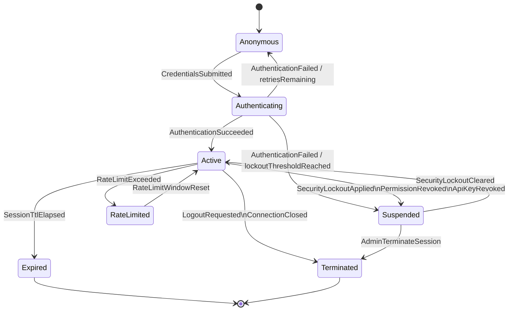
```mermaid
stateDiagram-v2
    [*] --> Anonymous
    Anonymous --> Authenticating: CredentialsSubmitted
    Authenticating --> Active: AuthenticationSucceeded
    Authenticating --> Anonymous: AuthenticationFailed / retriesRemaining
    Authenticating --> Suspended: AuthenticationFailed / lockoutThresholdReached
    Active --> RateLimited: RateLimitExceeded
    RateLimited --> Active: RateLimitWindowReset
    Active --> Suspended: SecurityLockoutApplied\nPermissionRevoked\nApiKeyRevoked
    Suspended --> Active: SecurityLockoutCleared
    Active --> Expired: SessionTtlElapsed
    Active --> Terminated: LogoutRequested\nConnectionClosed
    Suspended --> Terminated: AdminTerminateSession
    Expired --> [*]
    Terminated --> [*]
```
Test cases:
•	Authenticate with valid credentials and assert Anonymous -> Authenticating -> Active.
•	Submit invalid credentials below retry threshold and assert return to Anonymous with failure audit.
•	Exceed retry threshold and assert Suspended with no request forwarding.
•	Exceed rate limit and assert RateLimited rejects requests until reset.
•	Revoke the backing API key and assert next validation transitions Active -> Suspended.
Acceptance criteria:
•	Requests are accepted only when the session is Active and permissions are current.
•	Terminal states cannot transition back to Active with the same session_id.
•	Transitions are idempotent under duplicate gateway messages.
•	Failure transitions emit auditable events before client-visible errors are returned.

State Machine: API Key:
Purpose: Define the lifecycle of programmatic credentials from creation through activation, rotation, suspension, expiry, and revocation.
State definitions:
•	Draft: key metadata is being assembled and has not been issued.
•	Active: key can authenticate requests within configured permissions, expiry, and IP policy.
•	Rotating: replacement credentials have been generated and overlap rules are active.
•	Suspended: key is temporarily disabled by risk, compliance, or admin action.
•	Expired: key is past expires_at and must not authenticate.
•	Revoked: key is permanently disabled and secrets must be unusable.
Valid transitions:
•	Draft -> Active on KeyIssued.
•	Active -> Rotating on RotationRequested.
•	Rotating -> Active on RotationCompleted.
•	Active -> Suspended on AdminSuspendKey or RiskSuspendKey.
•	Suspended -> Active on AdminResumeKey.
•	Active or Rotating -> Expired on ExpiryReached.
•	Active, Suspended, or Expired -> Revoked on KeyRevoked.
Invalid transitions:
•	Revoked -> Active, Revoked -> Rotating, and Expired -> Active are forbidden.
•	Draft -> Rotating is forbidden because unissued keys have no live secret.
•	Suspended -> Rotating is forbidden until suspension is cleared.
•	Active -> Draft is forbidden because issuance is immutable.
Failure transitions:
•	Draft -> Revoked on SecretMaterializationFailed after secure erase.
•	Rotating -> Suspended on RotationIntegrityCheckFailed.
•	Active -> Suspended on SignatureReplayDetected, IpWhitelistViolation, or permissions mismatch.
•	Any non-terminal state -> Revoked on CompromiseConfirmed.
Recovery behaviour:
•	Suspended keys recover only through maker-checker approval and permission revalidation.
•	Failed rotation resumes the previous secret only if compromise is not suspected; otherwise revoke.
•	Expired keys are not recovered; create a new key.
•	Revoked keys are never recovered and remain on revocation lists until all caches pass the revocation watermark.
Events emitted:
•	ApiKeyDraftCreated
•	ApiKeyIssued
•	ApiKeyRotationRequested
•	ApiKeyRotated
•	ApiKeySuspended
•	ApiKeyResumed
•	ApiKeyExpired
•	ApiKeyRevoked
•	ApiKeyAuthenticationRejected
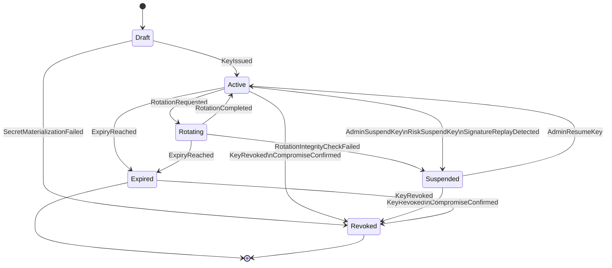
```mermaid
stateDiagram-v2
    [*] --> Draft
    Draft --> Active: KeyIssued
    Draft --> Revoked: SecretMaterializationFailed
    Active --> Rotating: RotationRequested
    Rotating --> Active: RotationCompleted
    Rotating --> Suspended: RotationIntegrityCheckFailed
    Active --> Suspended: AdminSuspendKey\nRiskSuspendKey\nSignatureReplayDetected
    Suspended --> Active: AdminResumeKey
    Active --> Expired: ExpiryReached
    Rotating --> Expired: ExpiryReached
    Active --> Revoked: KeyRevoked\nCompromiseConfirmed
    Suspended --> Revoked: KeyRevoked\nCompromiseConfirmed
    Expired --> Revoked: KeyRevoked
    Expired --> [*]
    Revoked --> [*]
```
Test cases:
•	Issue a key and assert it authenticates only within scoped permissions and IP whitelist.
•	Rotate a key and assert old and new credentials follow overlap rules.
•	Suspend a key and assert authentication fails without deleting metadata.
•	Expire a key and assert it cannot be resumed.
•	Revoke a key and assert cache invalidation propagates before success is reported.
Acceptance criteria:
•	Revoked and expired keys cannot authenticate under any gateway cache state.
•	Permission scope never exceeds the owning user permissions.
•	Rotation is atomic from the client perspective and auditable.
•	Secret values are never emitted in events, logs, or state projections.

Business Rules:
1.	API keys must be created with explicit permissions.
2.	API key permissions cannot exceed user permissions.
3.	Rate limits must be enforced per IP, per user, and per API key.
4.	Suspicious activity must trigger alerts and potential lockouts.
5.	All authentication failures must be logged.
Implementation Contracts:
rust
// Gateway Service
trait GatewayService {
    fn authenticate_session(&self, credentials: AuthCredentials) -> Result<Session, AuthError>;
    fn validate_request(&self, session: &Session, request: &Request) -> Result<(), ValidationError>;
    fn check_rate_limit(&self, key: &RateLimitKey) -> Result<RateLimitStatus, RateLimitError>;
    fn forward_to_trading(&self, envelope: OrderEnvelope) -> Result<OrderResult, ForwardError>;
}

// API Key Management
trait ApiKeyService {
    fn create_key(&self, user_id: UserId, permissions: Vec<Permission>) -> Result<ApiKey, ApiKeyError>;
    fn revoke_key(&self, api_key_id: ApiKeyId) -> Result<(), ApiKeyError>;
    fn list_keys(&self, user_id: UserId) -> Result<Vec<ApiKey>, ApiKeyError>;
    fn rotate_key(&self, api_key_id: ApiKeyId) -> Result<ApiKey, ApiKeyError>;
}
________________________________________
2.8.2 Trading Context
Purpose: Manage order placement, matching, and execution.
Business Context: The Trading context is the core of the exchange. It receives orders from clients, matches them against resting orders, and generates trades. It must be fast, deterministic, and fair.
Engineering Context: The Trading context is implemented as Book Cores, each managing a single instrument or shard. It runs in a single-writer configuration with no external dependencies in the hot path. All state is derived from events.
Core Concepts:
Order:
•	A request to buy or sell an asset.
•	Contains instrument, side, type, price, quantity, and time-in-force.
•	Moves through defined lifecycle states.
rust
struct Order {
    order_id: OrderId,
    client_order_id: ClientOrderId,
    book_id: BookId,
    user_id: UserId,
    side: OrderSide,
    order_type: OrderType,
    price: PriceI64,
    quantity: QtyI64,
    filled_quantity: QtyI64,
    time_in_force: TimeInForce,
    status: OrderStatus,
    created_at: Timestamp,
    updated_at: Timestamp,
    fees: FeeInfo,
    metadata: OrderMetadata,
}

enum OrderSide {
    Buy,
    Sell,
}

enum OrderType {
    Market,
    Limit,
    StopMarket,
    StopLimit,
    TakeProfitMarket,
    TakeProfitLimit,
}

enum TimeInForce {
    GTC,  // Good Till Cancelled
    IOC,  // Immediate or Cancel
    FOK,  // Fill or Kill
    GTD,  // Good Till Date
    PO,   // Post Only
    RO,   // Reduce Only
}

enum OrderStatus {
    New,
    PartiallyFilled,
    Filled,
    Cancelled,
    Rejected,
    Expired,
}
Order Book:
•	The collection of resting buy (bid) and sell (ask) orders.
•	Maintains price-time priority.
•	Enables matching of incoming orders.
rust
struct OrderBook {
    book_id: BookId,
    symbol: String,
    bids: PriceLevelMap,  // Price -> OrderList
    asks: PriceLevelMap,  // Price -> OrderList
    base_asset: Asset,
    quote_asset: Asset,
    tick_size: PriceI64,
    step_size: QtyI64,
    min_notional: NotionalI64,
    max_position: QtyI64,
}
Trade:
•	The result of matching a buy order and a sell order.
•	Contains price, quantity, buyer, seller, and execution time.
rust
struct Trade {
    trade_id: TradeId,
    book_id: BookId,
    buyer_order_id: OrderId,
    seller_order_id: OrderId,
    buyer_user_id: UserId,
    seller_user_id: UserId,
    price: PriceI64,
    quantity: QtyI64,
    notional: NotionalI64,
    execution_time: Timestamp,
    fees: FeeBreakdown,
}
Engine Event:
•	The immutable record of a trading decision.
•	Contains order result, trades, and clearing deltas.
•	The source of truth for all state.
rust
struct EngineEvent {
    event_id: EventId,
    book_id: BookId,
    book_seq: u64,
    event_type: EventType,
    order_result: OrderResult,
    trades: Vec<Trade>,
    clearing: ClearingDelta,
    timestamp: Timestamp,
    previous_hash: Hash,
    event_hash: Hash,
}

struct ClearingDelta {
    buyer_asset_delta: QtyI64,
    buyer_quote_delta: QtyI64,
    seller_asset_delta: QtyI64,
    seller_quote_delta: QtyI64,
    buyer_fee_delta: QtyI64,
    seller_fee_delta: QtyI64,
    hold_release: QtyI64,
    hold_consume: QtyI64,
}
State Machine: Order Lifecycle:
Purpose: Define deterministic order progression from client acceptance through matching, resting, cancellation, expiry, rejection, or full execution.
State definitions:
•	Received: lifecycle state.
•	Validating: lifecycle state.
•	Rejected: lifecycle state.
•	Accepted: lifecycle state.
•	Resting: lifecycle state.
•	PartiallyFilled: lifecycle state.
•	Filled: lifecycle state.
•	CancelPending: lifecycle state.
•	Cancelled: lifecycle state.
•	Expired: lifecycle state.
Valid transitions:
•	Received -> Validating on OrderReceived.
•	Validating -> Accepted on ValidationPassed and RiskReserved.
•	Validating -> Rejected on ValidationFailed or RiskRejected.
•	Accepted -> Filled, PartiallyFilled, or Resting according to execution result.
•	Resting or PartiallyFilled -> CancelPending on CancelRequested.
•	CancelPending -> Cancelled or Filled according to Book Core sequence order.
•	Resting or PartiallyFilled -> Expired on TimeInForceExpired.
Invalid transitions:
•	Terminal Rejected, Filled, Cancelled, and Expired states cannot return to active states.
•	Received -> Resting without validation and risk reservation is forbidden.
•	Filled -> CancelPending and Cancelled -> PartiallyFilled are forbidden.
Failure transitions:
•	Validating -> Rejected on malformed order, halted instrument, insufficient funds, self-trade rejection, or risk limit breach.
•	Resting -> Cancelled on instrument halt cancel policy or account suspension.
•	CancelPending -> Filled when a final fill is sequenced before the cancel.
Recovery behaviour:
•	Rebuild order state exclusively from EngineEvent sequence.
•	Duplicate client_order_id returns the existing state without creating a second order.
•	After Book Core failover, replay accepted, trade, cancel, and expiry events.
•	Lost gateway responses recover through get_order_status.
Events emitted:
•	OrderReceived
•	OrderValidationPassed
•	OrderRejected
•	OrderAccepted
•	OrderRested
•	TradeExecuted
•	OrderPartiallyFilled
•	OrderFilled
•	OrderCancelRequested
•	OrderCancelled
•	OrderExpired
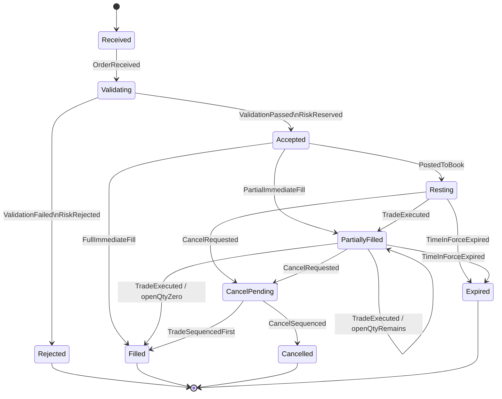
```mermaid
stateDiagram-v2
    [*] --> Received
    Received --> Validating: OrderReceived
    Validating --> Accepted: ValidationPassed\nRiskReserved
    Validating --> Rejected: ValidationFailed\nRiskRejected
    Accepted --> Filled: FullImmediateFill
    Accepted --> PartiallyFilled: PartialImmediateFill
    Accepted --> Resting: PostedToBook
    Resting --> PartiallyFilled: TradeExecuted
    PartiallyFilled --> PartiallyFilled: TradeExecuted / openQtyRemains
    PartiallyFilled --> Filled: TradeExecuted / openQtyZero
    Resting --> CancelPending: CancelRequested
    PartiallyFilled --> CancelPending: CancelRequested
    CancelPending --> Cancelled: CancelSequenced
    CancelPending --> Filled: TradeSequencedFirst
    Resting --> Expired: TimeInForceExpired
    PartiallyFilled --> Expired: TimeInForceExpired
    Rejected --> [*]
    Filled --> [*]
    Cancelled --> [*]
    Expired --> [*]
```
Test cases:
•	Valid limit order rests.
•	Marketable order fills or partially fills based on liquidity.
•	Invalid tick size rejects with no hold.
•	Cancel releases remaining hold exactly once.
•	Cancel/fill race resolves by sequence order.
Acceptance criteria:
•	Every transition is represented by a sequenced engine event.
•	Terminal states are immutable and idempotent.
•	Open quantity, holds, fees, and fills reconcile to the event stream.
•	Cancel and fill races resolve solely by Book Core sequence order.
Business Rules:
1.	Orders must have valid instrument, side, price (if limit), and quantity.
2.	Price must respect tick size.
3.	Quantity must respect step size.
4.	Notional value must meet minimum notional requirement.
5.	Users cannot exceed their position limits.
6.	Post-only orders must rest on the book (not match immediately).
7.	Reduce-only orders must not increase position size.
8.	Self-trades must be prevented or flagged.
9.	Market orders have a price protection limit.
10.	Time-in-force rules must be enforced:
o	GTC: Order remains until cancelled or filled.
o	IOC: Unfilled portion is cancelled.
o	FOK: Entire order must fill or it is cancelled.
o	GTD: Order expires at specified date.
o	PO: Must not match immediately.
o	RO: Must not increase position.
Implementation Contracts:
rust
// Order Management Service
trait OrderManagement {
    fn place_order(&self, envelope: OrderEnvelope) -> OrderResult;
    fn cancel_order(&self, order_id: OrderId, user_id: UserId) -> Result<(), CancelError>;
    fn cancel_all_orders(&self, user_id: UserId, book_id: Option<BookId>) -> Result<Vec<OrderId>, CancelError>;
    fn replace_order(&self, order_id: OrderId, new_price: PriceI64, new_qty: QtyI64) -> Result<OrderResult, ReplaceError>;
    fn get_order_status(&self, order_id: OrderId, user_id: UserId) -> Result<OrderStatus, QueryError>;
    fn get_open_orders(&self, user_id: UserId, book_id: Option<BookId>) -> Result<Vec<Order>, QueryError>;
}

// Matching Engine
trait MatchingEngine {
    fn match_order(&mut self, order: &Order, book: &mut OrderBook) -> MatchResult;
    fn add_resting_order(&mut self, order: Order, book: &mut OrderBook) -> AddResult;
    fn remove_resting_order(&mut self, order_id: OrderId, book: &mut OrderBook) -> RemoveResult;
}
________________________________________
2.8.3 Risk Context
Purpose: Manage pre-trade and post-trade risk exposure.
Business Context: The exchange must prevent users from taking positions they cannot support. Pre-trade risk checks ensure users have sufficient funds before accepting orders. Post-trade risk monitoring detects and responds to emerging risk exposures.
Engineering Context: The Risk context is split into two components:
•	Hot Risk: In the trading hot path. Uses local credit buckets or risk caches.
•	Cold Risk: Asynchronous. Performs comprehensive risk analysis and reporting.
Core Concepts:
Credit Bucket:
•	Pre-allocated funds for a specific instrument or portfolio.
•	Enables local, in-process risk checks.
rust
struct CreditBucket {
    bucket_id: BucketId,
    user_id: UserId,
    book_id: BookId,
    total_credit: QtyI64,
    used_credit: QtyI64,
    available_credit: QtyI64,
    locked_orders: Vec<OrderId>,
    updated_at: Timestamp,
}
Position:
•	A user's current exposure in an instrument.
•	Updated after each trade and settlement.
rust
struct Position {
    position_id: PositionId,
    user_id: UserId,
    book_id: BookId,
    side: PositionSide,
    quantity: QtyI64,
    average_price: PriceI64,
    current_price: PriceI64,
    unrealized_pnl: QtyI64,
    realized_pnl: QtyI64,
    fees_paid: QtyI64,
    created_at: Timestamp,
    updated_at: Timestamp,
}

enum PositionSide {
    Long,
    Short,
    Flat,
}
Risk Check:
•	Validation performed before accepting an order.
•	Ensures order does not violate risk limits.
rust
struct RiskCheckResult {
    is_allowed: bool,
    reason: Option<RiskRejectReason>,
    required_balance: QtyI64,
    available_balance: QtyI64,
    remaining_limit: QtyI64,
}

enum RiskRejectReason {
    InsufficientBalance,
    InsufficientCreditBucket,
    ExceedsPositionLimit,
    ExceedsNotionalLimit,
    LeverageExceedsLimit,
    AccountRestricted,
    InstrumentHalted,
}
Business Rules:
1.	Users cannot spend more than their available balance or credit bucket.
2.	Position limits prevent excessive concentration.
3.	Notional limits limit total exposure.
4.	Leverage limits are enforced per instrument and user tier.
5.	Restricted accounts cannot trade.
6.	Halted instruments cannot accept new orders.
Implementation Contracts:
rust
// Risk Service
trait RiskService {
    fn check_order_risk(&self, order: &Order, user: &User) -> RiskCheckResult;
    fn reserve_funds(&self, order_id: OrderId, amount: QtyI64) -> Result<Reservation, RiskError>;
    fn release_funds(&self, reservation: &Reservation) -> Result<(), RiskError>;
    fn consume_reserved_funds(&self, reservation: &Reservation) -> Result<(), RiskError>;
    fn get_positions(&self, user_id: UserId) -> Result<Vec<Position>, RiskError>;
    fn get_credit_bucket(&self, user_id: UserId, book_id: BookId) -> Option<CreditBucket>;
}

// Credit Bucket Management
trait CreditBucketService {
    fn allocate_credit(&self, user_id: UserId, book_id: BookId, amount: QtyI64) -> Result<(), BucketError>;
    fn deallocate_credit(&self, user_id: UserId, book_id: BookId, amount: QtyI64) -> Result<(), BucketError>;
    fn transfer_credit(&self, from_bucket: BucketId, to_bucket: BucketId, amount: QtyI64) -> Result<(), BucketError>;
}
________________________________________
2.8.4 Clearing Context
Purpose: Settle trades, calculate fees, and update positions.
Business Context: When orders match, they create trades that must be settled. The Clearing context calculates the financial consequences of trades: asset transfers, quote asset transfers, fee payments, position updates, and balance changes.
Engineering Context: Clearing is performed in the hot path as part of the Engine Event. The clearing calculations are deterministic and use only the information available in the Engine Event.
Core Concepts:
Clearing Instruction:
•	The set of financial actions resulting from a trade.
•	Defines what to debit, credit, and charge.
rust
struct ClearingInstruction {
    buyer_user_id: UserId,
    seller_user_id: UserId,
    asset: Asset,
    quantity: QtyI64,
    quote_asset: Asset,
    price: PriceI64,
    notional: NotionalI64,
    maker_fee_rate: FeeRate,
    taker_fee_rate: FeeRate,
    fee_asset: Asset,
}
Fee Calculation:
•	Determines the fee for each trade.
•	Based on maker/taker status, fee tier, and any discounts.
rust
struct FeeCalculation {
    fee_type: FeeType,
    rate: FeeRate,
    amount: QtyI64,
    asset: Asset,
}

enum FeeType {
    Maker,
    Taker,
    Discount,
    Rebate,
}
Settlement:
•	The final reconciliation of a trade.
•	Updates balances and positions.
rust
struct Settlement {
    settlement_id: SettlementId,
    trade_id: TradeId,
    buyer_balance_delta: QtyI64,
    seller_balance_delta: QtyI64,
    buyer_position_delta: QtyI64,
    seller_position_delta: QtyI64,
    buyer_fee_delta: QtyI64,
    seller_fee_delta: QtyI64,
    settled_at: Timestamp,
}
Business Rules:
1.	Maker fees are applied to orders that rest on the book.
2.	Taker fees are applied to orders that match immediately.
3.	Fee discounts must be applied correctly.
4.	Rebates must be credited correctly.
5.	Positions must be updated with average price calculation.
6.	Balances must be updated atomically with trades.
7.	Fee calculations must not create negative balances.
Implementation Contracts:
rust
// Clearing Service
trait ClearingService {
    fn calculate_clearing(&self, trade: &Trade, maker_order: &Order, taker_order: &Order) -> ClearingResult;
    fn calculate_fees(&self, order: &Order, trade: &Trade, fee_tier: &FeeTier) -> FeeResult;
    fn update_positions(&self, trade: &Trade, clearing: &ClearingResult) -> PositionUpdate;
    fn generate_settlement(&self, trade: &Trade, clearing: &ClearingResult) -> Settlement;
}
________________________________________
2.8.5 Wallet Context
Purpose: Manage user assets, deposits, and withdrawals.
Business Context: Users deposit assets, trade them, and withdraw profits. The Wallet context manages the lifecycle of user assets, tracks balances, and handles the flow of funds in and out of the exchange.
Engineering Context: The Wallet context is a cold path system. It receives balance updates from Engine Events and provides user-facing APIs for deposits, withdrawals, and balance queries.
Core Concepts:
Asset:
•	A tradable asset (cryptocurrency or fiat).
•	Defines precision, deposit/withdrawal constraints.
rust
struct Asset {
    asset_id: AssetId,
    symbol: String,
    name: String,
    asset_type: AssetType,
    precision: u8,  // Decimal places
    min_withdraw: QtyI64,
    min_deposit: QtyI64,
    withdrawal_fee: QtyI64,
    is_active: bool,
}

enum AssetType {
    Crypto,
    Fiat,
}
Balance:
•	A user's holding of a specific asset.
•	Updated by trading, deposits, and withdrawals.
rust
struct Balance {
    user_id: UserId,
    asset: Asset,
    total: QtyI64,
    available: QtyI64,
    frozen: QtyI64,  // Locked by orders
    in_orders: QtyI64,
    updated_at: Timestamp,
}
Transaction:
•	A record of asset movement.
•	Used for deposits, withdrawals, and internal transfers.
rust
struct Transaction {
    transaction_id: TransactionId,
    user_id: UserId,
    asset: Asset,
    amount: QtyI64,
    transaction_type: TransactionType,
    status: TransactionStatus,
    reference: String,
    created_at: Timestamp,
    completed_at: Option<Timestamp>,
    fee: QtyI64,
}

enum TransactionType {
    Deposit,
    Withdrawal,
    Transfer,
    Fee,
}

enum TransactionStatus {
    Pending,
    Processing,
    Completed,
    Failed,
    Cancelled,
}
Withdrawal:
•	A request to move assets out of the exchange.
•	Subject to security review and risk checks.
rust
struct Withdrawal {
    withdrawal_id: WithdrawalId,
    user_id: UserId,
    asset: Asset,
    address: Address,
    amount: QtyI64,
    fee: QtyI64,
    status: WithdrawalStatus,
    security_check: SecurityCheck,
    created_at: Timestamp,
    processed_at: Option<Timestamp>,
    tx_hash: Option<String>,
}

enum WithdrawalStatus {
    Pending,
    SecurityReview,
    Processing,
    Completed,
    Failed,
    Cancelled,
}
State Machine: Withdrawal:
Purpose: Define the controlled withdrawal lifecycle from user request through authorization, compliance review, wallet execution, completion, cancellation, or failure.
State definitions:
•	Requested: lifecycle state.
•	Verifying: lifecycle state.
•	SecurityReview: lifecycle state.
•	Approved: lifecycle state.
•	Processing: lifecycle state.
•	Broadcast: lifecycle state.
•	Completed: lifecycle state.
•	Failed: lifecycle state.
•	Cancelled: lifecycle state.
Valid transitions:
•	Requested -> Verifying on WithdrawalCreated.
•	Verifying -> Approved, SecurityReview, or Failed based on checks.
•	SecurityReview -> Approved or Cancelled by review decision.
•	Approved -> Processing on WalletDispatchStarted or Cancelled before dispatch.
•	Processing -> Broadcast on TransactionBroadcast or Failed on signer/broadcast failure.
•	Broadcast -> Completed on confirmations or Failed after final chain failure.
Invalid transitions:
•	Completed -> Cancelled or Failed is forbidden.
•	Cancelled -> Processing is forbidden.
•	Requested -> Processing without verification and approval is forbidden.
Failure transitions:
•	Verifying -> Failed on insufficient balance, 2FA failure, sanctions hit, or limit breach.
•	Approved -> Failed on hot-wallet liquidity timeout.
•	Processing -> Failed on signer quorum failure or policy rejection.
Recovery behaviour:
•	Pre-broadcast Failed or Cancelled releases holds exactly once.
•	Processing retries use the same withdrawal_id until broadcast.
•	Broadcast recovery polls chain state and completes if confirmations are observed.
•	Post-broadcast failure requires reconciliation workflow.
Events emitted:
•	WithdrawalCreated
•	WithdrawalVerificationPassed
•	WithdrawalVerificationFailed
•	WithdrawalReviewRequired
•	WithdrawalApproved
•	WithdrawalRejected
•	WithdrawalProcessingStarted
•	WithdrawalBroadcast
•	WithdrawalCompleted
•	WithdrawalFailed
•	WithdrawalCancelled
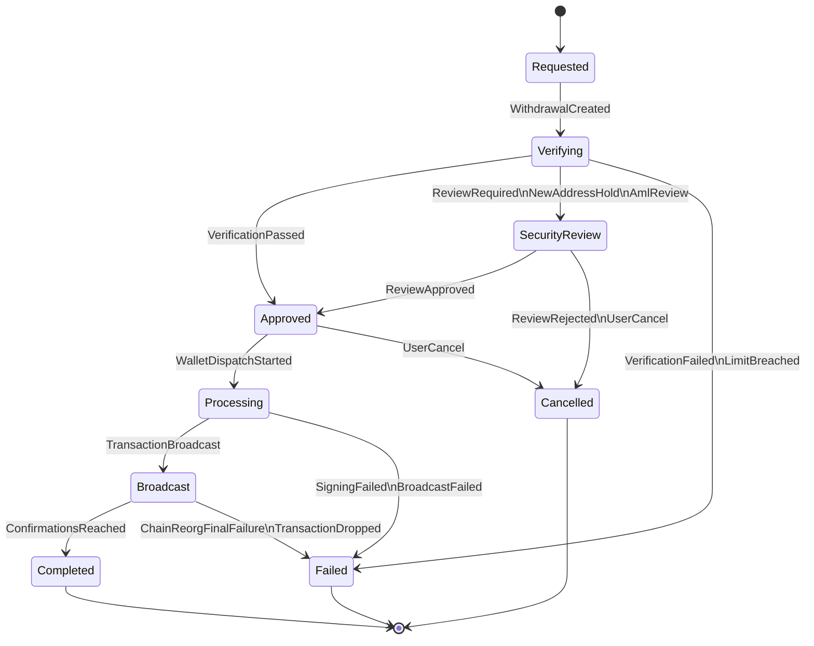
```mermaid
stateDiagram-v2
    [*] --> Requested
    Requested --> Verifying: WithdrawalCreated
    Verifying --> Approved: VerificationPassed
    Verifying --> SecurityReview: ReviewRequired\nNewAddressHold\nAmlReview
    Verifying --> Failed: VerificationFailed\nLimitBreached
    SecurityReview --> Approved: ReviewApproved
    SecurityReview --> Cancelled: ReviewRejected\nUserCancel
    Approved --> Processing: WalletDispatchStarted
    Approved --> Cancelled: UserCancel
    Processing --> Broadcast: TransactionBroadcast
    Processing --> Failed: SigningFailed\nBroadcastFailed
    Broadcast --> Completed: ConfirmationsReached
    Broadcast --> Failed: ChainReorgFinalFailure\nTransactionDropped
    Completed --> [*]
    Failed --> [*]
    Cancelled --> [*]
```
Test cases:
•	Valid withdrawal locks funds through approval.
•	New-address hold enters SecurityReview.
•	2FA failure prevents wallet dispatch.
•	Cancel before dispatch releases funds once.
•	Missed chain callback recovers by polling.
Acceptance criteria:
•	No withdrawal reaches Processing without verification, approval, and locked funds.
•	Funds are released exactly once for pre-broadcast failures or cancellations.
•	Completed withdrawals have immutable tx_hash and balanced ledger entries.
•	Manual decisions include maker-checker audit metadata.
Business Rules:
1.	Withdrawals require 2FA verification.
2.	Withdrawals to new addresses have a 24-hour hold.
3.	Daily withdrawal limits are enforced.
4.	Withdrawals are subject to AML checks.
5.	Hot wallet balances must be maintained above thresholds.
6.	Cold wallet transfers require multiple approvals.
Implementation Contracts:
rust
// Wallet Service
trait WalletService {
    fn get_balance(&self, user_id: UserId, asset: Asset) -> Result<Balance, WalletError>;
    fn get_all_balances(&self, user_id: UserId) -> Result<Vec<Balance>, WalletError>;
    fn update_balance(&self, user_id: UserId, asset: Asset, delta: QtyI64) -> Result<(), WalletError>;
    
    fn request_deposit(&self, user_id: UserId, asset: Asset, amount: QtyI64) -> Result<Address, WalletError>;
    fn request_withdrawal(&self, request: WithdrawalRequest) -> Result<Withdrawal, WalletError>;
    fn cancel_withdrawal(&self, withdrawal_id: WithdrawalId) -> Result<(), WalletError>;
    
    fn get_transaction_history(&self, user_id: UserId, limit: u32, offset: u32) -> Result<Vec<Transaction>, WalletError>;
}

// Withdrawal Service
trait WithdrawalService {
    fn create_withdrawal(&self, request: WithdrawalRequest) -> Result<Withdrawal, WithdrawalError>;
    fn approve_withdrawal(&self, withdrawal_id: WithdrawalId, approver: &Admin) -> Result<(), WithdrawalError>;
    fn reject_withdrawal(&self, withdrawal_id: WithdrawalId, reason: String) -> Result<(), WithdrawalError>;
    fn process_withdrawal(&self, withdrawal_id: WithdrawalId) -> Result<Transaction, WithdrawalError>;
}
________________________________________
2.8.6 Ledger Context
Purpose: Maintain the accounting records of the exchange.
Business Context: The exchange must maintain accurate accounting records for all financial activities. The Ledger provides a double-entry accounting system that records every financial transaction.
Engineering Context: The Ledger is a cold path system. It is a projection built from Engine Events, deposit events, and withdrawal events. All entries are immutable.
Core Concepts:
Account:
•	A record of financial activity for a specific purpose.
•	Each user has asset accounts; the exchange has operational accounts.
rust
struct Account {
    account_id: AccountId,
    account_type: AccountType,
    user_id: Option<UserId>,
    asset: Asset,
    balance: QtyI64,
    version: u64,
}

enum AccountType {
    UserAsset,
    Fee,
    InsuranceFund,
    Treasury,
    Settlement,
}
Journal Entry:
•	A single accounting entry (debit or credit).
•	Part of a double-entry transaction.
rust
struct JournalEntry {
    entry_id: EntryId,
    transaction_id: TransactionId,
    account_id: AccountId,
    amount: QtyI64,
    direction: EntryDirection,
    description: String,
    created_at: Timestamp,
}

enum EntryDirection {
    Debit,
    Credit,
}
Transaction (Ledger):
•	A set of journal entries that balance (debits = credits).
•	Represents a single financial event.
rust
struct LedgerTransaction {
    transaction_id: TransactionId,
    entries: Vec<JournalEntry>,
    event_id: EventId,  // Reference to the Engine Event that caused this
    created_at: Timestamp,
    is_valid: bool,
}
Business Rules:
1.	Every ledger transaction must balance (debits = credits).
2.	Account balances must not go negative.
3.	Transaction history must be immutable.
4.	Ledger must be reconstructible from events.
Implementation Contracts:
rust
// Ledger Service
trait LedgerService {
    fn post_transaction(&self, transaction: LedgerTransaction) -> Result<(), LedgerError>;
    fn get_balance(&self, account_id: AccountId) -> Result<QtyI64, LedgerError>;
    fn get_transactions(&self, account_id: AccountId, limit: u32, offset: u32) -> Result<Vec<LedgerTransaction>, LedgerError>;
    fn reconcile(&self, from_event: EventId, to_event: EventId) -> Result<ReconciliationReport, LedgerError>;
}

// Accounting Service
trait AccountingService {
    fn generate_trial_balance(&self) -> Result<TrialBalance, LedgerError>;
    fn generate_income_statement(&self, start_date: Date, end_date: Date) -> Result<IncomeStatement, LedgerError>;
    fn generate_balance_sheet(&self, as_of_date: Date) -> Result<BalanceSheet, LedgerError>;
}
________________________________________
2.8.7 Market Data Context
Purpose: Provide real-time and historical market data to clients.
Business Context: Traders need real-time market data to make informed trading decisions. The Market Data context distributes order book snapshots, trades, and ticker information.
Engineering Context: Market Data is a cold path system. It consumes Engine Events to generate market data feeds. It is designed for high throughput and low latency distribution.
Core Concepts:
Depth Snapshot:
•	A point-in-time snapshot of the order book.
•	Contains bids and asks at specified depth levels.
rust
struct DepthSnapshot {
    book_id: BookId,
    sequence: u64,
    bids: Vec<PriceLevel>,
    asks: Vec<PriceLevel>,
    timestamp: Timestamp,
}

struct PriceLevel {
    price: PriceI64,
    quantity: QtyI64,
    order_count: u32,
}
Depth Delta:
•	Incremental updates to the order book.
•	Used by clients to maintain a local copy.
rust
struct DepthDelta {
    book_id: BookId,
    sequence: u64,
    bids: Vec<PriceLevelDelta>,
    asks: Vec<PriceLevelDelta>,
    timestamp: Timestamp,
}

struct PriceLevelDelta {
    price: PriceI64,
    quantity: QtyI64,  // 0 = remove level
}
Trade Feed:
•	Stream of public trades.
•	Used for market analysis and execution algorithms.
rust
struct PublicTrade {
    trade_id: TradeId,
    book_id: BookId,
    price: PriceI64,
    quantity: QtyI64,
    side: TradeSide,
    timestamp: Timestamp,
}

enum TradeSide {
    Buy,
    Sell,
}
Ticker:
•	Summary statistics for an instrument.
•	Used for quick market overview.
rust
struct Ticker {
    book_id: BookId,
    symbol: String,
    last_price: PriceI64,
    mark_price: PriceI64,
    bid_price: PriceI64,
    ask_price: PriceI64,
    volume_24h: QtyI64,
    high_24h: PriceI64,
    low_24h: PriceI64,
    change_24h: f64,
    open_interest: Option<QtyI64>,
    timestamp: Timestamp,
}
Candle:
•	Aggregated OHLCV data for a time period.
•	Used for charting and technical analysis.
rust
struct Candle {
    book_id: BookId,
    interval: CandleInterval,
    open: PriceI64,
    high: PriceI64,
    low: PriceI64,
    close: PriceI64,
    volume: QtyI64,
    timestamp: Timestamp,
}

enum CandleInterval {
    Minute1,
    Minute5,
    Minute15,
    Hour1,
    Hour4,
    Day1,
    Week1,
    Month1,
}
Business Rules:
1.	Market data must be delivered with sequence IDs.
2.	Clients must be able to recover from missed messages.
3.	Slow clients must not degrade feed quality for others.
4.	Snapshots must be available on request.
5.	Historical data must be available for reporting and analysis.
Implementation Contracts:
rust
// Market Data Service
trait MarketDataService {
    fn subscribe_depth(&self, book_id: BookId, depth: u32) -> Subscription<DepthDelta>;
    fn subscribe_trades(&self, book_id: BookId) -> Subscription<PublicTrade>;
    fn subscribe_ticker(&self, book_id: BookId) -> Subscription<Ticker>;
    fn get_depth_snapshot(&self, book_id: BookId, depth: u32) -> DepthSnapshot;
    fn get_trades(&self, book_id: BookId, limit: u32) -> Vec<PublicTrade>;
    fn get_candles(&self, book_id: BookId, interval: CandleInterval, start: Timestamp, end: Timestamp) -> Vec<Candle>;
}

// Subscription Management
trait SubscriptionService {
    fn subscribe(&self, client_id: ClientId, stream: Stream, filters: Option<Filters>) -> SubscriptionId;
    fn unsubscribe(&self, subscription_id: SubscriptionId) -> Result<(), SubscriptionError>;
    fn list_subscriptions(&self, client_id: ClientId) -> Vec<Subscription>;
}
________________________________________
2.8.8 Futures Context
Purpose: Manage perpetual futures and delivery contracts.
Business Context: Futures are derivative contracts that obligate the buyer to purchase an asset (or the seller to sell) at a predetermined future date and price. Perpetual futures are similar but have no expiry date and use a funding rate to keep the contract price close to the underlying index.
Engineering Context: Futures are an extension of the Trading context. They introduce new state (positions, funding) and new risk management requirements (margin, liquidation).
Core Concepts:
Perpetual:
•	A futures contract with no expiry.
•	Uses funding rate to maintain price convergence.
rust
struct Perpetual {
    book_id: BookId,
    underlying: String,
    funding_rate: f64,
    next_funding_time: Timestamp,
    funding_interval: Duration,
    mark_price: PriceI64,
    index_price: PriceI64,
}
Funding Rate:
•	The rate at which long and short position holders exchange payments.
•	Maintains price convergence with the underlying.
rust
struct FundingRate {
    book_id: BookId,
    rate: f64,
    premium_index: f64,
    interest_rate: f64,
    timestamp: Timestamp,
    valid_until: Timestamp,
}
Futures Position:
•	A user's position in a futures contract.
•	Includes size, direction, margin, and PnL.
rust
struct FuturesPosition {
    position_id: PositionId,
    user_id: UserId,
    book_id: BookId,
    side: PositionSide,
    size: QtyI64,
    entry_price: PriceI64,
    mark_price: PriceI64,
    margin: QtyI64,
    unrealized_pnl: QtyI64,
    realized_pnl: QtyI64,
    margin_mode: MarginMode,
    leverage: f64,
    liquidation_price: PriceI64,
}
State Machine: Futures Position:
Purpose: Define lifecycle and risk state of user futures exposure from flat through open, adjusted, margin-stressed, liquidation, and closure.
State definitions:
•	Flat: no open size exists.
•	Opening: trade is creating exposure and margin is being bound.
•	Open: non-zero size satisfies margin requirements.
•	Increasing: execution increases absolute size.
•	Reducing: execution decreases absolute size.
•	MarginCall: margin ratio is below warning threshold.
•	LiquidationPending: maintenance breach is queued.
•	Liquidating: liquidation is executing.
•	Closed: size is zero and realized PnL is finalized.
Valid transitions:
•	Flat -> Opening on opening trade.
•	Opening -> Open when margin is bound.
•	Open -> Increasing or Reducing on trades.
•	Increasing -> Open after revaluation.
•	Reducing -> Open or Closed based on remaining size.
•	Open -> MarginCall on warning threshold.
•	MarginCall -> Open on collateral or mark recovery.
•	Open or MarginCall -> LiquidationPending on maintenance breach.
•	LiquidationPending -> Liquidating -> Open or Closed.
Invalid transitions:
•	Flat -> Liquidating without a position is forbidden.
•	Closed -> Open with same position_id is forbidden.
•	MarginCall -> Increasing without restoring margin is forbidden.
•	Liquidating -> Increasing is forbidden.
Failure transitions:
•	Opening -> Closed on trade bust or margin binding failure.
•	Increasing -> LiquidationPending on adverse mark movement.
•	Liquidating -> Closed with bankruptcy flag when collateral is exhausted.
Recovery behaviour:
•	Reconstruct from trades, funding, collateral, and mark-price events.
•	Recompute missed margin alerts on every mark update.
•	Resume LiquidationPending with position version fencing.
•	Closed positions are immutable except correction events.
Events emitted:
•	FuturesPositionOpening
•	FuturesPositionOpened
•	FuturesPositionIncreased
•	FuturesPositionReduced
•	FuturesPositionMarginCall
•	FuturesPositionMarginRestored
•	FuturesPositionLiquidationPending
•	FuturesPositionLiquidating
•	FuturesPositionClosed
•	FuturesPositionBankrupt
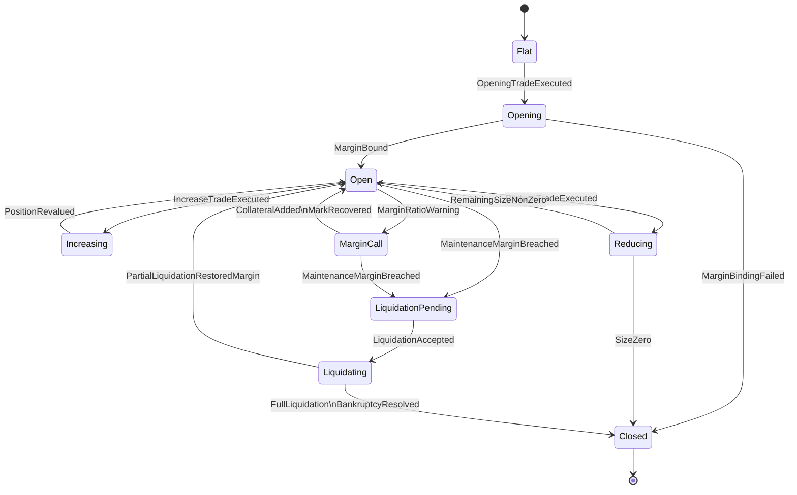
```mermaid
stateDiagram-v2
    [*] --> Flat
    Flat --> Opening: OpeningTradeExecuted
    Opening --> Open: MarginBound
    Opening --> Closed: MarginBindingFailed
    Open --> Increasing: IncreaseTradeExecuted
    Increasing --> Open: PositionRevalued
    Open --> Reducing: ReduceTradeExecuted
    Reducing --> Open: RemainingSizeNonZero
    Reducing --> Closed: SizeZero
    Open --> MarginCall: MarginRatioWarning
    MarginCall --> Open: CollateralAdded\nMarkRecovered
    Open --> LiquidationPending: MaintenanceMarginBreached
    MarginCall --> LiquidationPending: MaintenanceMarginBreached
    LiquidationPending --> Liquidating: LiquidationAccepted
    Liquidating --> Open: PartialLiquidationRestoredMargin
    Liquidating --> Closed: FullLiquidation\nBankruptcyResolved
    Closed --> [*]
```
Test cases:
•	Opening trade reaches Open with margin bound.
•	Increase/reduce updates size, entry, and PnL.
•	Collateral during MarginCall restores Open.
•	Maintenance breach enters liquidation with version fencing.
•	User full close reaches Closed.
Acceptance criteria:
•	Mark price drives margin and liquidation transitions.
•	State is deterministic under event replay.
•	Liquidation cannot be bypassed after sequenced breach unless margin restoration precedes it.
•	Closed positions have zero open size and finalized realized PnL.
Business Rules:
1.	Mark price is used for PnL and liquidation, not last trade price.
2.	Funding rate is calculated every 8 hours.
3.	Funding payments are exchanged between long and short positions.
4.	Initial margin must be deposited before opening a position.
5.	Maintenance margin must be maintained at all times.
6.	If margin falls below maintenance margin, liquidation is triggered.
7.	ADL is triggered when the insurance fund is insufficient.
Implementation Contracts:
rust
// Futures Service
trait FuturesService {
    fn open_position(&self, order: &Order) -> Result<FuturesPosition, FuturesError>;
    fn close_position(&self, position_id: PositionId) -> Result<(), FuturesError>;
    fn get_position(&self, user_id: UserId, book_id: BookId) -> Option<FuturesPosition>;
    fn get_all_positions(&self, user_id: UserId) -> Vec<FuturesPosition>;
    fn get_mark_price(&self, book_id: BookId) -> PriceI64;
    fn get_funding_rate(&self, book_id: BookId) -> FundingRate;
}

// Funding Service
trait FundingService {
    fn calculate_funding(&self, book_id: BookId) -> FundingResult;
    fn settle_funding(&self, book_id: BookId) -> Result<(), FundingError>;
    fn get_funding_history(&self, book_id: BookId, limit: u32) -> Vec<FundingRate>;
}
________________________________________
2.8.9 Options Context
Purpose: Manage options contracts.
Business Context: Options give the buyer the right, but not the obligation, to buy or sell an asset at a specified price on or before a specified date. Options are complex financial instruments requiring sophisticated pricing and risk management.
Engineering Context: Options are the most complex product in the exchange. They require real-time pricing (Black-Scholes), Greeks calculation, and management of multiple legs.
Core Concepts:
Option:
•	A contract giving the holder the right to buy or sell.
rust
struct Option {
    option_id: OptionId,
    underlying: String,
    strike: PriceI64,
    expiry: Timestamp,
    option_type: OptionType,
    contract_size: QtyI64,
    tick_size: PriceI64,
    lot_size: QtyI64,
}

enum OptionType {
    Call,
    Put,
}

enum OptionStyle {
    European,
    American,
}
Option Chain:
•	All options for a given underlying.
•	Organized by expiry and strike.
rust
struct OptionChain {
    underlying: String,
    expiries: Vec<Expiry>,
    strikes: Vec<PriceI64>,
}

struct Expiry {
    expiry: Timestamp,
    days_to_expiry: u32,
    calls: Vec<Option>,
    puts: Vec<Option>,
}
Greeks:
•	Measures of option price sensitivity.
rust
struct Greeks {
    delta: f64,   // Price sensitivity
    gamma: f64,   // Delta sensitivity
    theta: f64,   // Time decay
    vega: f64,    // Volatility sensitivity
    rho: f64,     // Interest rate sensitivity
    implied_vol: f64,
    timestamp: Timestamp,
}
Option Position:
•	A user's position in an option.
rust
struct OptionPosition {
    position_id: PositionId,
    user_id: UserId,
    option_id: OptionId,
    quantity: QtyI64,
    is_long: bool,
    entry_price: PriceI64,
    mark_price: PriceI64,
    premium: QtyI64,
    realized_pnl: QtyI64,
    unrealized_pnl: QtyI64,
    greeks: Option<Greeks>,
}
Multi-Leg Order:
•	An order with multiple legs (e.g., spread, straddle).
rust
struct MultiLegOrder {
    order_id: OrderId,
    user_id: UserId,
    legs: Vec<OrderLeg>,
    strategy: OptionStrategy,
}

struct OrderLeg {
    option_id: OptionId,
    side: OrderSide,
    quantity: QtyI64,
    price: PriceI64,
}

enum OptionStrategy {
    CallSpread,
    PutSpread,
    Straddle,
    Strangle,
    IronCondor,
    Custom,
}
State Machine: Option Lifecycle:
Purpose: Define the lifecycle of an option contract from listing through trading, exercise or expiry, and final settlement.
State definitions:
•	Draft: contract parameters are being configured.
•	Listed: contract is published but trading is not open.
•	Trading: orders may be accepted.
•	Halted: trading is temporarily stopped.
•	ExercisePending: exercise or auto-exercise determination has started.
•	Exercised: holder rights were exercised.
•	Expired: expiry reached and no trading is allowed.
•	Settled: cash or physical settlement is complete.
•	Delisted: contract is removed from active catalogs.
Valid transitions:
•	Draft -> Listed on listing approval.
•	Listed -> Trading on open.
•	Trading <-> Halted by halt/resume.
•	Trading or Halted -> ExercisePending on request or expiry.
•	ExercisePending -> Exercised for accepted/ITM exercise.
•	ExercisePending -> Expired for rejected/OTM/cutoff breach.
•	Exercised or Expired -> Settled.
•	Settled -> Delisted after retention.
Invalid transitions:
•	Draft -> Trading without Listed is forbidden.
•	Trading -> Settled without exercise or expiry is forbidden.
•	Expired -> Trading is forbidden.
•	Delisted -> Trading is forbidden.
Failure transitions:
•	Draft -> Delisted on withdrawn invalid specification.
•	Listed -> Halted on configuration failure.
•	ExercisePending -> Expired on insufficient underlying or cutoff breach.
•	Settlement failure remains in Exercised pending retry.
Recovery behaviour:
•	Expiry scheduler is idempotent and recomputes from final settlement price.
•	Halted contracts resume only after admin approval and risk recalculation.
•	Settlement retries preserve exercise_id and cannot duplicate postings.
•	Delisted contracts remain queryable historically.
Events emitted:
•	OptionDraftCreated
•	OptionListed
•	OptionTradingOpened
•	OptionTradingHalted
•	OptionTradingResumed
•	OptionExerciseRequested
•	OptionAutoExerciseEvaluated
•	OptionExercised
•	OptionExpired
•	OptionSettled
•	OptionDelisted
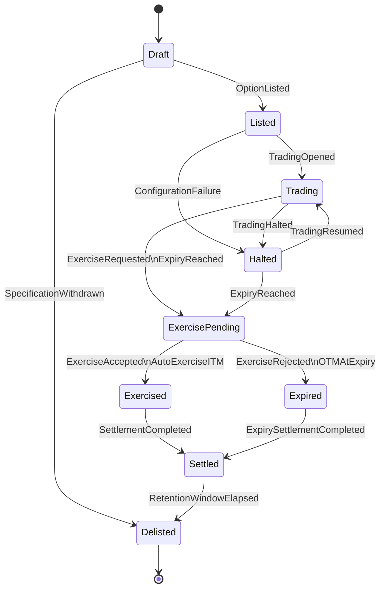
```mermaid
stateDiagram-v2
    [*] --> Draft
    Draft --> Listed: OptionListed
    Draft --> Delisted: SpecificationWithdrawn
    Listed --> Trading: TradingOpened
    Listed --> Halted: ConfigurationFailure
    Trading --> Halted: TradingHalted
    Halted --> Trading: TradingResumed
    Trading --> ExercisePending: ExerciseRequested\nExpiryReached
    Halted --> ExercisePending: ExpiryReached
    ExercisePending --> Exercised: ExerciseAccepted\nAutoExerciseITM
    ExercisePending --> Expired: ExerciseRejected\nOTMAtExpiry
    Exercised --> Settled: SettlementCompleted
    Expired --> Settled: ExpirySettlementCompleted
    Settled --> Delisted: RetentionWindowElapsed
    Delisted --> [*]
```
Test cases:
•	List and open only after configured open time.
•	Halt blocks new orders.
•	Exercise ITM option and settle.
•	Expire OTM option and settle.
•	Retry settlement without duplicate movement.
Acceptance criteria:
•	No trading before open or after expiry/delist.
•	Exercise decisions are deterministic from style, cutoff, position, and settlement price.
•	Settlement is exactly-once at ledger level.
•	Historical records remain available after Delisted.
Business Rules:
1.	Options must have valid strikes and expiries.
2.	Pricing must use the appropriate model (Black-Scholes).
3.	Greeks must be calculated for all positions.
4.	Multi-leg orders must have valid strategy.
5.	Options with exercise require sufficient underlying or premium.
6.	Expiry handling must be automated.
7.	ITM options are auto-exercised at expiry.
Implementation Contracts:
rust
// Options Service
trait OptionsService {
    fn get_option_chain(&self, underlying: String) -> OptionChain;
    fn get_option(&self, option_id: OptionId) -> Option;
    fn get_greeks(&self, option_id: OptionId) -> Greeks;
    fn get_position(&self, user_id: UserId, option_id: OptionId) -> Option<OptionPosition>;
    fn get_all_positions(&self, user_id: UserId) -> Vec<OptionPosition>;
    fn exercise_option(&self, position_id: PositionId) -> Result<ExerciseResult, OptionsError>;
}

// Options Pricing
trait OptionsPricing {
    fn calculate_price(&self, option: &Option, current_price: PriceI64, vol: f64, interest: f64) -> PriceI64;
    fn calculate_greeks(&self, option: &Option, current_price: PriceI64, vol: f64, interest: f64) -> Greeks;
    fn calculate_implied_vol(&self, option: &Option, current_price: PriceI64, market_price: PriceI64, interest: f64) -> f64;
}
________________________________________
2.8.10 Margin Context
Purpose: Manage margin requirements and collateral for leveraged positions.
Business Context: Leveraged positions require users to post margin. The Margin context calculates initial margin (required to open a position) and maintenance margin (required to keep a position open). It also manages collateral across positions.
Engineering Context: Margin calculations are performed in the hot path for trade execution and continuously for risk monitoring.
Core Concepts:
Margin Requirement:
•	The amount of collateral required for a position.
rust
struct MarginRequirement {
    position_id: PositionId,
    initial_margin: QtyI64,
    maintenance_margin: QtyI64,
    collateral: QtyI64,
    margin_ratio: f64,
    timestamp: Timestamp,
}
Collateral:
•	Assets used to secure margin positions.
rust
struct Collateral {
    user_id: UserId,
    asset: Asset,
    amount: QtyI64,
    valuation: PriceI64,  // Current value
    haircut: f64,         // Discount applied
    effective_value: QtyI64,
}
Margin Mode:
rust
enum MarginMode {
    Cross,     // Collateral shared across positions
    Isolated,  // Collateral per position
}

enum CollateralType {
    Cash,
    Crypto,
    Stablecoin,
}
Business Rules:
1.	Initial margin must be posted before opening a position.
2.	Maintenance margin must be maintained at all times.
3.	Collateral is subject to haircuts based on asset risk.
4.	Cross margin shares collateral across positions.
5.	Isolated margin is per position.
6.	If margin ratio falls below maintenance, liquidation is triggered.
Implementation Contracts:
rust
// Margin Service
trait MarginService {
    fn calculate_initial_margin(&self, position: &FuturesPosition) -> QtyI64;
    fn calculate_maintenance_margin(&self, position: &FuturesPosition) -> QtyI64;
    fn calculate_margin_ratio(&self, position: &FuturesPosition) -> f64;
    fn get_collateral(&self, user_id: UserId) -> Vec<Collateral>;
    fn add_collateral(&self, user_id: UserId, asset: Asset, amount: QtyI64) -> Result<(), MarginError>;
    fn remove_collateral(&self, user_id: UserId, asset: Asset, amount: QtyI64) -> Result<(), MarginError>;
}
________________________________________
2.8.11 Liquidation Context
Purpose: Liquidate positions that fall below maintenance margin.
Business Context: When a position's margin falls below maintenance margin, the position must be liquidated to prevent losses from exceeding collateral.
Engineering Context: Liquidation is triggered by a risk monitoring service. It must execute quickly to minimize losses and market impact.
Core Concepts:
Liquidation Event:
•	A position being liquidated.
rust
struct LiquidationEvent {
    event_id: EventId,
    position_id: PositionId,
    user_id: UserId,
    book_id: BookId,
    liquidation_price: PriceI64,
    bankruptcy_price: PriceI64,
    quantity: QtyI64,
    closed_quantity: QtyI64,
    status: LiquidationStatus,
    timestamp: Timestamp,
}

enum LiquidationStatus {
    Pending,
    Processing,
    Completed,
    Bankrupt,
}
Insurance Fund:
•	A reserve fund that covers deficits from bankrupt positions.
rust
struct InsuranceFund {
    fund_id: FundId,
    asset: Asset,
    balance: QtyI64,
    total_contributions: QtyI64,
    total_used: QtyI64,
    last_replenishment: Timestamp,
}
ADL (Auto-Deleveraging):
•	Forced reduction of positions when the insurance fund is depleted.
rust
struct ADLEvent {
    adl_id: AdlId,
    event_id: EventId,
    counterparty_position_id: PositionId,
    user_id: UserId,
    book_id: BookId,
    quantity: QtyI64,
    price: PriceI64,
    timestamp: Timestamp,
}
State Machine: Liquidation:
Purpose: Define liquidation progression from margin breach detection through execution, insurance fund use, ADL escalation, and final resolution.
State definitions:
•	Detected: maintenance breach identified.
•	Pending: event persisted and position lock requested.
•	Processing: liquidation orders or takeover executing.
•	PartiallyFilled: some quantity closed.
•	Completed: exposure closed or margin restored.
•	Bankrupt: losses exceed collateral.
•	InsuranceFundClaim: deficit coverage is being applied.
•	ADLPending: auto-deleveraging is queued.
•	ADLProcessing: counterparty deleveraging executing.
•	Failed: operator intervention required.
Valid transitions:
•	Detected -> Pending on event creation.
•	Pending -> Processing on position lock.
•	Processing -> PartiallyFilled or Completed on executions.
•	PartiallyFilled -> Processing or Completed based on residual risk.
•	Processing -> Bankrupt on bankruptcy price.
•	Bankrupt -> InsuranceFundClaim.
•	InsuranceFundClaim -> Completed or ADLPending.
•	ADLPending -> ADLProcessing -> Completed.
Invalid transitions:
•	Completed -> Processing is forbidden.
•	Detected -> Completed without event and position lock is forbidden.
•	ADLPending -> Completed without ADL or insurance coverage is forbidden.
•	Failed -> Processing requires operator recovery and new lock version.
Failure transitions:
•	Pending -> Failed on lock failure.
•	Processing -> Failed on engine unavailable or order rejection after fallback exhaustion.
•	InsuranceFundClaim -> Failed on accounting inconsistency.
•	ADLProcessing -> Failed on invariant violation.
Recovery behaviour:
•	Resume from persisted liquidation_id and locked position version.
•	Recompute residual quantity and margin from executions before continuing.
•	Insurance claims use deficit_id to prevent duplicate debits.
•	Failed requires operator recovery or manual settlement.
Events emitted:
•	LiquidationDetected
•	LiquidationPending
•	LiquidationProcessingStarted
•	LiquidationPartialFill
•	LiquidationCompleted
•	LiquidationBankrupt
•	InsuranceFundClaimed
•	InsuranceFundCoverCompleted
•	ADLPending
•	ADLProcessingStarted
•	ADLCompleted
•	LiquidationFailed
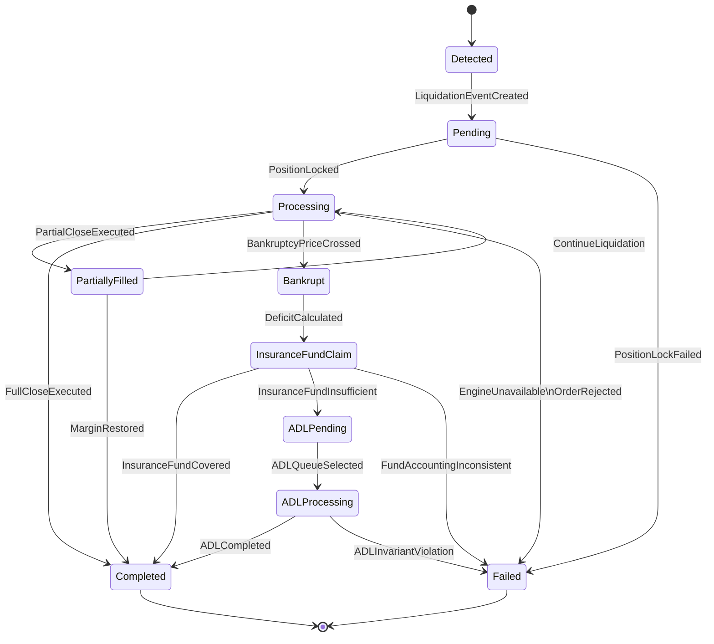
```mermaid
stateDiagram-v2
    [*] --> Detected
    Detected --> Pending: LiquidationEventCreated
    Pending --> Processing: PositionLocked
    Pending --> Failed: PositionLockFailed
    Processing --> PartiallyFilled: PartialCloseExecuted
    PartiallyFilled --> Processing: ContinueLiquidation
    PartiallyFilled --> Completed: MarginRestored
    Processing --> Completed: FullCloseExecuted
    Processing --> Bankrupt: BankruptcyPriceCrossed
    Processing --> Failed: EngineUnavailable\nOrderRejected
    Bankrupt --> InsuranceFundClaim: DeficitCalculated
    InsuranceFundClaim --> Completed: InsuranceFundCovered
    InsuranceFundClaim --> ADLPending: InsuranceFundInsufficient
    InsuranceFundClaim --> Failed: FundAccountingInconsistent
    ADLPending --> ADLProcessing: ADLQueueSelected
    ADLProcessing --> Completed: ADLCompleted
    ADLProcessing --> Failed: ADLInvariantViolation
    Completed --> [*]
    Failed --> [*]
```
Test cases:
•	Maintenance breach locks position before orders.
•	Partial liquidation completes when margin restored.
•	Bankruptcy uses insurance fund when sufficient.
•	Depleted fund triggers ADL.
•	Failover during Processing resumes by liquidation_id.
Acceptance criteria:
•	Decisions use mark price and maintenance margin breach events.
•	Position locking prevents user-initiated increases.
•	Deficits are covered exactly once by insurance fund or ADL.
•	Terminal states reconcile position, ledger, and insurance projections.
Business Rules:
1.	Liquidation is triggered when maintenance margin is breached.
2.	Partial liquidation may be used for large positions.
3.	Liquidation price is determined by the order book.
4.	Bankruptcy price is when losses exceed collateral.
5.	Insurance fund covers deficits from bankrupt positions.
6.	ADL is used when insurance fund is depleted.
7.	ADL targets the most profitable positions first.
Implementation Contracts:
rust
// Liquidation Service
trait LiquidationService {
    fn monitor_positions(&self) -> Vec<Position>;
    fn liquidate_position(&self, position_id: PositionId) -> Result<LiquidationEvent, LiquidationError>;
    fn get_liquidation_events(&self, user_id: UserId) -> Vec<LiquidationEvent>;
    fn get_insurance_fund_balance(&self, asset: Asset) -> QtyI64;
}

// ADL Service
trait ADLService {
    fn calculate_adl_queue(&self, book_id: BookId) -> Vec<ADLCandidate>;
    fn trigger_adl(&self, book_id: BookId, deficit: QtyI64) -> Result<ADLEvent, ADLError>;
    fn get_adl_rank(&self, user_id: UserId, book_id: BookId) -> u32;
}
________________________________________
2.8.12 Surveillance Context
Purpose: Detect market manipulation and abuse.
Business Context: Exchanges must maintain fair and orderly markets. The Surveillance context monitors trading activity to detect wash trading, spoofing, layering, and other manipulative behaviors.
Engineering Context: Surveillance is a cold path system that consumes Engine Events and market data. It uses pattern matching and machine learning to detect suspicious activity.
Core Concepts:
Alert:
•	A notification of suspicious activity.
rust
struct Alert {
    alert_id: AlertId,
    alert_type: AlertType,
    severity: AlertSeverity,
    user_id: UserId,
    book_id: BookId,
    description: String,
    evidence: Vec<Evidence>,
    created_at: Timestamp,
    status: AlertStatus,
}

enum AlertType {
    WashTrading,
    Spoofing,
    Layering,
    PumpAndDump,
    InsiderTrading,
    FrontRunning,
    PriceManipulation,
}

enum AlertSeverity {
    Low,
    Medium,
    High,
    Critical,
}
Evidence:
•	Data supporting an alert.
rust
struct Evidence {
    evidence_id: EvidenceId,
    alert_id: AlertId,
    evidence_type: EvidenceType,
    content: String,
    timestamp: Timestamp,
}

enum EvidenceType {
    OrderEvent,
    TradeEvent,
    BookSnapshot,
    UserProfile,
    IPAddress,
    DeviceFingerprint,
}
Investigation:
•	A formal investigation into suspicious activity.
rust
struct Investigation {
    investigation_id: InvestigationId,
    alerts: Vec<AlertId>,
    assigned_to: UserId,
    status: InvestigationStatus,
    findings: String,
    conclusion: Option<InvestigationConclusion>,
    created_at: Timestamp,
    updated_at: Timestamp,
}

enum InvestigationStatus {
    Open,
    InProgress,
    Completed,
}
Business Rules:
1.	Wash trading: same user buying and selling the same instrument.
2.	Spoofing: placing and canceling orders to create false market signals.
3.	Layering: placing multiple orders to create false depth.
4.	Pump and dump: coordinated buying to inflate price followed by selling.
5.	Insider trading: trading based on non-public information.
6.	All suspicious activity must be flagged and investigated.
Implementation Contracts:
rust
// Surveillance Service
trait SurveillanceService {
    fn process_event(&self, event: EngineEvent) -> Result<(), SurveillanceError>;
    fn get_alerts(&self, user_id: UserId) -> Vec<Alert>;
    fn get_all_alerts(&self, status: AlertStatus) -> Vec<Alert>;
    fn create_investigation(&self, alerts: Vec<AlertId>) -> Result<Investigation, SurveillanceError>;
    fn update_investigation(&self, investigation_id: InvestigationId, findings: String) -> Result<(), SurveillanceError>;
    fn close_investigation(&self, investigation_id: InvestigationId, conclusion: InvestigationConclusion) -> Result<(), SurveillanceError>;
}
________________________________________
2.8.13 Compliance Context
Purpose: Ensure regulatory compliance.
Business Context: The exchange must comply with KYC/AML regulations, sanctions screening, and the Travel Rule. The Compliance context manages these requirements.
Engineering Context: Compliance is a cold path system that integrates with KYC vendors, sanctions lists, and Travel Rule networks.
Core Concepts:
KYC/AML:
•	Know Your Customer / Anti-Money Laundering verification.
rust
struct KYCProfile {
    user_id: UserId,
    tier: KYCTier,
    status: KYCStatus,
    documents: Vec<KYCDocument>,
    risk_score: u32,
    verified_at: Option<Timestamp>,
    expires_at: Option<Timestamp>,
}

enum KYCTier {
    Unverified,
    Basic,
    Enhanced,
    VIP,
}

enum KYCStatus {
    Pending,
    Verified,
    Rejected,
    Expired,
}
Sanctions Check:
•	Screening against sanctions lists.
rust
struct SanctionsCheck {
    check_id: CheckId,
    user_id: UserId,
    name: String,
    matches: Vec<SanctionsMatch>,
    checked_at: Timestamp,
    status: SanctionsStatus,
}

struct SanctionsMatch {
    list_name: String,
    match_type: MatchType,
    match_score: f64,
}

enum SanctionsStatus {
    Clear,
    Pending,
    Blocked,
}
Travel Rule:
•	Information sharing for cross-exchange transfers.
rust
struct TravelRuleTransfer {
    transfer_id: TransferId,
    user_id: UserId,
    asset: Asset,
    amount: QtyI64,
    sender_info: SenderInfo,
    beneficiary_info: BeneficiaryInfo,
    status: TravelRuleStatus,
    created_at: Timestamp,
}

struct SenderInfo {
    name: String,
    address: String,
    country: String,
    account_id: String,
}

struct BeneficiaryInfo {
    name: String,
    address: String,
    country: String,
    account_id: String,
}
Business Rules:
1.	KYC must be completed before trading.
2.	Enhanced due diligence for high-risk users.
3.	Sanctions screening for all users and transactions.
4.	Travel Rule for transfers above threshold.
5.	Suspicious activity reports filed as required.
Implementation Contracts:
rust
// Compliance Service
trait ComplianceService {
    fn verify_kyc(&self, user_id: UserId, documents: Vec<KYCDocument>) -> Result<KYCTier, ComplianceError>;
    fn get_kyc_status(&self, user_id: UserId) -> KYCStatus;
    fn run_sanctions_check(&self, user_id: UserId) -> SanctionsCheck;
    fn check_travel_rule(&self, request: TransferRequest) -> TravelRuleStatus;
    fn report_suspicious_activity(&self, alert: Alert) -> Result<(), ComplianceError>;
}
________________________________________
2.8.14 Admin Context
Purpose: Manage exchange configuration and operations.
Business Context: The exchange requires administrative control for configuration, monitoring, and incident response.
Engineering Context: Admin is a cold path system that provides a user interface and APIs for operations teams.
Core Concepts:
Instrument:
•	A tradable instrument definition.
rust
struct Instrument {
    instrument_id: InstrumentId,
    symbol: String,
    instrument_type: InstrumentType,
    base_asset: Asset,
    quote_asset: Asset,
    tick_size: PriceI64,
    step_size: QtyI64,
    min_notional: NotionalI64,
    max_position: QtyI64,
    is_active: bool,
}

enum InstrumentType {
    Spot,
    Perpetual,
    Futures,
    Option,
}
Fee Schedule:
•	Fee rates for trading.
rust
struct FeeSchedule {
    schedule_id: ScheduleId,
    instrument_id: InstrumentId,
    maker_fee_rate: FeeRate,
    taker_fee_rate: FeeRate,
    tier_thresholds: Vec<FeeTier>,
    effective_from: Timestamp,
    effective_to: Option<Timestamp>,
}
Configuration:
•	System configuration settings.
rust
struct Config {
    config_id: ConfigId,
    key: String,
    value: String,
    description: String,
    updated_at: Timestamp,
    updated_by: UserId,
}
State Machine: Instrument:
Purpose: Define administrative and market-control lifecycle of a tradable instrument from configuration through activation, halt, suspension, retirement, and delisting.
State definitions:
•	Draft: definition is being prepared.
•	PendingApproval: maker-checker approval is required.
•	Configured: static parameters, risk limits, fees, and market identifiers are valid.
•	Active: trading, market data, and risk checks are enabled.
•	Halted: trading is temporarily stopped.
•	Suspended: instrument is disabled due to incident, compliance, or risk.
•	SettlementOnly: new orders blocked; reductions and settlement allowed.
•	Retired: no longer tradable but queryable.
•	Delisted: removed from active catalogs.
Valid transitions:
•	Draft -> PendingApproval on submission.
•	PendingApproval -> Configured on approval or Draft on rejection.
•	Configured -> Active on activation.
•	Active -> Halted and Halted -> Active by halt/resume.
•	Active or Halted -> Suspended by incident escalation.
•	Suspended -> Halted for staged recovery.
•	Active or Halted -> SettlementOnly on retirement.
•	SettlementOnly -> Retired when open interest and orders are zero.
•	Retired -> Delisted after retention.
Invalid transitions:
•	Draft -> Active without approval is forbidden.
•	Delisted -> Active is forbidden without new instrument_id or migration.
•	Retired -> Halted is forbidden.
•	Suspended -> Active without incident closure and approval is forbidden.
Failure transitions:
•	PendingApproval -> Draft on validation failure.
•	Configured -> Suspended on propagation failure after activation attempt.
•	Active -> Halted on market data failure, price band breach, matching incident, or admin halt.
•	Any non-terminal state -> Suspended on compliance prohibition.
Recovery behaviour:
•	Halted resumes after book, risk, and market data health checks.
•	Suspended requires incident closure and maker-checker approval.
•	SettlementOnly permits only risk-reducing actions until obligations are zero.
•	Delisted remains available to audit, ledger, and historical projections.
Events emitted:
•	InstrumentDraftCreated
•	InstrumentSubmittedForApproval
•	InstrumentApproved
•	InstrumentRejected
•	InstrumentConfigured
•	InstrumentActivated
•	InstrumentHalted
•	InstrumentResumed
•	InstrumentSuspended
•	InstrumentSettlementOnly
•	InstrumentRetired
•	InstrumentDelisted
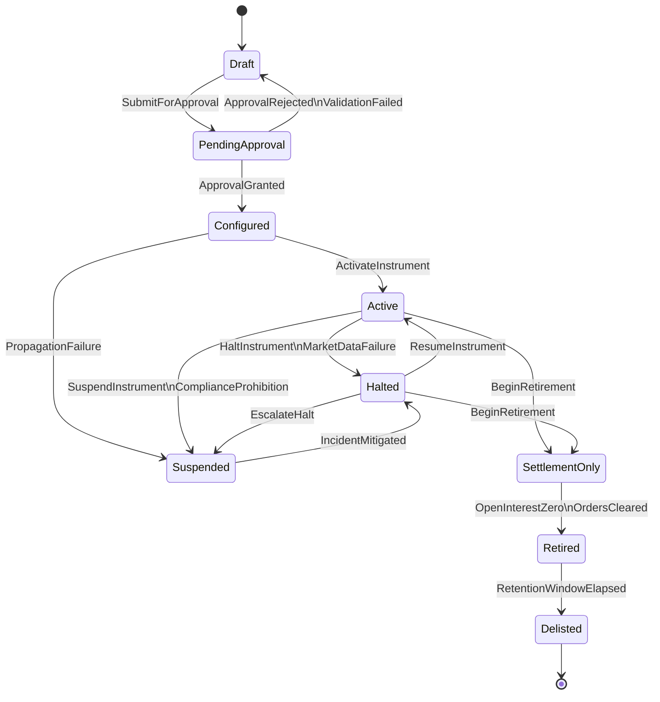
```mermaid
stateDiagram-v2
    [*] --> Draft
    Draft --> PendingApproval: SubmitForApproval
    PendingApproval --> Configured: ApprovalGranted
    PendingApproval --> Draft: ApprovalRejected\nValidationFailed
    Configured --> Active: ActivateInstrument
    Configured --> Suspended: PropagationFailure
    Active --> Halted: HaltInstrument\nMarketDataFailure
    Halted --> Active: ResumeInstrument
    Active --> Suspended: SuspendInstrument\nComplianceProhibition
    Halted --> Suspended: EscalateHalt
    Suspended --> Halted: IncidentMitigated
    Active --> SettlementOnly: BeginRetirement
    Halted --> SettlementOnly: BeginRetirement
    SettlementOnly --> Retired: OpenInterestZero\nOrdersCleared
    Retired --> Delisted: RetentionWindowElapsed
    Delisted --> [*]
```
Test cases:
•	Valid configuration requires approval before Active.
•	Invalid tick size returns to Draft.
•	Halt rejects new orders while cancels follow policy.
•	Resume requires health checks.
•	Retirement blocks new exposure until open interest is zero.
Acceptance criteria:
•	No trading service accepts orders unless state is Active.
•	Admin actions are maker-checker approved and audited.
•	State changes propagate to Trading, Risk, Market Data, and Gateway before success.
•	Historical data and ledger references remain resolvable after Delisted.
Business Rules:
1.	Instruments must be created and configured before trading.
2.	Instruments can be halted and resumed.
3.	Fee schedules must be configurable and versioned.
4.	System configuration requires audit trail.
5.	All admin actions require maker-checker.
Implementation Contracts:
rust
// Admin Service
trait AdminService {
    fn create_instrument(&self, definition: InstrumentDefinition) -> Result<Instrument, AdminError>;
    fn update_instrument(&self, instrument_id: InstrumentId, updates: InstrumentUpdate) -> Result<Instrument, AdminError>;
    fn halt_instrument(&self, instrument_id: InstrumentId, reason: String) -> Result<(), AdminError>;
    fn resume_instrument(&self, instrument_id: InstrumentId) -> Result<(), AdminError>;
    fn update_fee_schedule(&self, schedule: FeeSchedule) -> Result<(), AdminError>;
    fn update_config(&self, key: String, value: String, reason: String) -> Result<(), AdminError>;
    fn get_audit_log(&self, start: Timestamp, end: Timestamp) -> Vec<AuditEntry>;
}
________________________________________
2.8.15 Analytics Context
Purpose: Provide data analysis and reporting.
Business Context: The exchange generates vast amounts of data. The Analytics context provides insights into trading activity, user behavior, and system performance.
Engineering Context: Analytics is a cold path system that processes Engine Events and other data to generate reports, dashboards, and insights.
Core Concepts:
Metric:
•	A quantifiable measure of system or trading activity.
rust
struct Metric {
    metric_name: String,
    dimensions: Vec<Dimension>,
    value: f64,
    timestamp: Timestamp,
}

struct Dimension {
    name: String,
    value: String,
}
Report:
•	A structured presentation of data.
rust
struct Report {
    report_id: ReportId,
    report_type: ReportType,
    data: Vec<ReportRow>,
    generated_at: Timestamp,
    filters: ReportFilters,
}

enum ReportType {
    TradingVolume,
    UserActivity,
    Revenue,
    RiskExposure,
    Compliance,
    Performance,
}
Dashboard:
•	A visualization of key metrics.
rust
struct Dashboard {
    dashboard_id: DashboardId,
    name: String,
    widgets: Vec<Widget>,
    layout: DashboardLayout,
    refresh_interval: Duration,
}
Business Rules:
1.	All trading activity must be analyzable.
2.	Reports must be accurate and timely.
3.	Dashboards must be configurable.
4.	Performance metrics must be monitored in real-time.
Implementation Contracts:
rust
// Analytics Service
trait AnalyticsService {
    fn get_trading_volume(&self, instrument_id: InstrumentId, start: Timestamp, end: Timestamp) -> Vec<VolumePoint>;
    fn get_user_activity(&self, user_id: UserId, start: Timestamp, end: Timestamp) -> UserActivity;
    fn get_revenue_report(&self, start: Timestamp, end: Timestamp) -> RevenueReport;
    fn get_risk_exposure_report(&self) -> RiskExposure;
    fn create_dashboard(&self, name: String, widgets: Vec<Widget>) -> Result<Dashboard, AnalyticsError>;
    fn get_dashboard(&self, dashboard_id: DashboardId) -> Dashboard;
    fn update_dashboard(&self, dashboard_id: DashboardId, updates: DashboardUpdate) -> Result<Dashboard, AnalyticsError>;
    fn delete_dashboard(&self, dashboard_id: DashboardId) -> Result<(), AnalyticsError>;
}
________________________________________
2.9 Context Mapping
2.9.1 Context Relationships
2.9.2 Context Integration Patterns
Context	Upstream Contexts	Downstream Contexts	Integration Pattern
Gateway	(External)	Trading, MarketData	REST/WebSocket
Trading	Gateway	Risk, Clearing, MarketData	In-process, Events
Risk	Trading	Trading	In-process, Sync
Clearing	Trading	Wallet, Ledger	Events
Wallet	Clearing, Admin	Ledger	Events, Sync
Ledger	Wallet, Clearing	Analytics	Projection
MarketData	Trading	Gateway, Analytics	Events
Margin	Trading	Liquidation	Sync
Liquidation	Margin	InsuranceFund	Events
Surveillance	Trading	Compliance, Analytics	Events
Compliance	Surveillance, Gateway	Wallet	Sync, Events
Admin	(Internal)	All	RPC
Analytics	All	(Internal)	Query
________________________________________
2.10 Domain Events
2.10.1 Core Domain Events
Event	Source	Consumers	Description
OrderPlaced	Gateway	Trading	New order submitted
OrderAccepted	Trading	Gateway, MarketData	Order accepted
OrderRejected	Trading	Gateway	Order rejected with reason
OrderCancelled	Trading	Gateway, Wallet	Order cancelled
TradeExecuted	Trading	Clearing, MarketData, Surveillance	Trade executed
EngineEvent	Trading	All	Source of truth event
RiskCheckFailed	Risk	Trading	Risk check failed
BalanceUpdated	Wallet	Ledger, Gateway	Balance changed
PositionUpdated	Margin	Gateway	Position changed
LiquidationExecuted	Liquidation	Wallet, Gateway	Liquidation executed
FundingSettled	Funding	Wallet, Margin	Funding settled
KYCVerified	Compliance	Gateway	KYC completed
SanctionsMatch	Compliance	Admin	Sanctions hit detected
AlertGenerated	Surveillance	Compliance, Admin	Suspicious activity alert
InstrumentUpdated	Admin	Trading, MarketData	Instrument configuration changed
FeeScheduleUpdated	Admin	Clearing	Fee schedule changed
2.10.2 Event Payloads
rust
// OrderPlaced Event
struct OrderPlacedEvent {
    order_id: OrderId,
    client_order_id: ClientOrderId,
    user_id: UserId,
    book_id: BookId,
    side: OrderSide,
    order_type: OrderType,
    price: PriceI64,
    quantity: QtyI64,
    time_in_force: TimeInForce,
    timestamp: Timestamp,
}

// TradeExecuted Event
struct TradeExecutedEvent {
    trade_id: TradeId,
    book_id: BookId,
    buyer_order_id: OrderId,
    seller_order_id: OrderId,
    buyer_user_id: UserId,
    seller_user_id: UserId,
    price: PriceI64,
    quantity: QtyI64,
    notional: NotionalI64,
    execution_time: Timestamp,
    maker_fee: FeeRate,
    taker_fee: FeeRate,
    fee_asset: Asset,
}

// BalanceUpdated Event
struct BalanceUpdatedEvent {
    user_id: UserId,
    asset: Asset,
    old_balance: QtyI64,
    new_balance: QtyI64,
    delta: QtyI64,
    update_type: BalanceUpdateType,
    reference: String,
    timestamp: Timestamp,
}

enum BalanceUpdateType {
    OrderHold,
    OrderRelease,
    OrderConsume,
    Deposit,
    Withdrawal,
    Fee,
    Rebate,
    Settlement,
}
________________________________________
Chapter 3: The Book Core
3.1 Purpose
The Book Core is the heart of the HermesNet exchange. It is a single-writer, deterministic matching kernel that owns the state of a single order book (instrument or shard). The Book Core is responsible for accepting orders, performing risk checks, matching orders, calculating clearing deltas, and emitting Engine Events. This chapter provides the complete engineering specification for the Book Core.
3.2 Business Context
Each instrument (e.g., BTC-USDT spot, BTC-PERP futures) is represented by a single Book Core. The Book Core is the authoritative source of truth for all order book activity. It must process orders quickly, match them fairly, and maintain correct state at all times.
Scale Assumptions:
•	Total instruments: 5,000+ (scalable to 20,000)
•	Instruments per Book Core: 1
•	Orders per second per instrument: Up to 25,000
•	Simultaneous orders per instrument: 1,000,000+
Key Requirements:
•	Deterministic processing (same inputs → same outputs)
•	Low latency (p50 < 1ms, p95 < 5ms, p99 < 10ms)
•	High throughput (sustained 25,000 orders per second)
•	Strong consistency (no race conditions, no double fills)
•	Idempotent operations (same client_order_id → same result)
•	Append-only event log for audit and recovery
3.3 Engineering Context
The Book Core is a single-threaded, in-process component. It has no external dependencies in the hot path. It communicates with gateways via lock-free queues and with cold path systems via an async event publisher.
Memory Model:
•	Orders stored in memory with deterministic data structures
•	Event log stored in memory (backed by file for persistence)
•	Risk cache stored in memory
•	No garbage collection in hot path (Rust ownership model)
Concurrency Model:
•	Single writer thread owns the Book Core
•	All order mutations happen on this thread
•	Read-only access from other threads is allowed (market data snapshots)
•	Gateways communicate via SPSC queues
Error Model:
•	Panics indicate unrecoverable corruption
•	Recoverable errors return rejection results
•	Queue overflow results in immediate rejection
•	Event log corruption triggers recovery
3.4 Problem Statement
The Book Core must solve the following problems:
1.	Concurrency: Multiple orders can arrive simultaneously. The Book Core must process them sequentially and deterministically to avoid race conditions.
2.	Latency: The Book Core is on the critical path of every order. It must process each order as quickly as possible.
3.	Consistency: Order state, risk state, and event log must be consistent at all times. A failure must not corrupt the state.
4.	Recoverability: After a failure, the Book Core must be able to recover its state from the event log.
5.	Auditability: Every decision (accepted, rejected, matched) must be recorded immutably.
6.	Fairness: Matching must be fair (price-time priority).
7.	Idempotency: Duplicate client_order_id requests must return the same result.
3.5 Goals
1.	Deterministic Processing: Given the same sequence of inputs, the Book Core produces identical outputs.
2.	Low Latency: p50 < 1ms, p95 < 5ms, p99 < 10ms for order processing.
3.	High Throughput: 25,000 orders per second sustained.
4.	No Double Fills: An order must never be filled more than once.
5.	No Negative Balances: Risk checks must prevent overspending.
6.	Complete Audit Trail: All decisions are recorded in the event log.
7.	Fast Recovery: Rebuild state from event log in under 1 second.
3.6 Non-Goals
1.	No Market Data Distribution: Market data is generated by a separate consumer.
2.	No Order History Storage: Order history is stored in a separate projection.
3.	No User Database Access: Risk information is cached locally.
4.	No Network Access: The Book Core does not make network calls.
5.	No Disk Writes in Hot Path: Event log persistence is asynchronous.
3.7 Historical Background
Traditional Matching Engines (Pre-2000):
•	Centralized mainframe-based systems
•	Orders stored in database
•	Batch processing at end of day
•	Latency measured in seconds or minutes
•	Non-deterministic due to database ordering
Early Electronic Matching Engines (2000-2010):
•	In-memory order books
•	Database write on every trade
•	SQL for risk checks
•	Latency measured in milliseconds
•	Single-threaded or heavily locked
•	Vulnerable to database failures
Modern Matching Engines (2010-2020):
•	In-memory only
•	Asynchronous persistence
•	Event sourcing
•	Single-writer per book
•	Latency measured in microseconds to milliseconds
•	No external dependencies in hot path
NYSE Pillar (2019-Present):
•	Binary protocols
•	Single-writer book cores
•	No global sequencer
•	Deterministic replay
•	Low-latency and high-throughput
3.8 Industry Practices
Exchange Matching Engine Patterns:
Pattern	Description	Examples	Tradeoffs
Central Matching	Single engine for all instruments	Early exchanges	Simple, but bottleneck
Sharded Matching	One engine per instrument group	Many modern exchanges	Scalable, but cross-shard risk complex
Single-Writer Book	One writer per instrument	NYSE Pillar, LMAX	Fast, deterministic, but failover complex
Global Sequencer	Central ordering service	Some exchanges	Fair, but bottleneck
Risk Check Patterns:
Pattern	Description	Tradeoffs
Account-Level Risk	Check total balance across all instruments	Accurate, but slower and complex
Instrument-Level Risk	Check risk per instrument independently	Fast, but less flexible
Credit Bucket	Pre-allocated funds per instrument	Fastest, but requires pre-allocation
3.9 Alternatives Considered
Database-Backed Matching:
•	Orders stored and matched in database
•	Simple to implement, uses SQL
•	Rejected: Latency (10-100ms) unacceptable
Microservice-Based Matching:
•	Separate services for order reception, risk, matching, clearing
•	Network calls between services
•	Rejected: Network latency and complexity unacceptable
Multi-Writer Book:
•	Multiple threads can modify the book
•	Requires locks or transaction isolation
•	Rejected: Lock contention reduces performance and determinism
Active-Active Matching:
•	Multiple matching engines for the same instrument
•	Consensus needed for state reconciliation
•	Rejected: Complexity and potential for double-fills
3.10 Architecture
3.10.1 Component Diagram
3.10.2 Deployment Diagram
3.10.3 Data Flow
3.11 DDD Model
3.11.1 Entities
rust
// Order Entity
pub struct Order {
    order_id: OrderId,
    client_order_id: ClientOrderId,
    user_id: UserId,
    book_id: BookId,
    side: OrderSide,
    order_type: OrderType,
    price: PriceI64,
    quantity: QtyI64,
    filled_quantity: QtyI64,
    time_in_force: TimeInForce,
    status: OrderStatus,
    created_at: Timestamp,
    updated_at: Timestamp,
    metadata: OrderMetadata,
}

// Order Book Entity
pub struct OrderBook {
    book_id: BookId,
    symbol: String,
    base_asset: Asset,
    quote_asset: Asset,
    bids: PriceLevelMap,
    asks: PriceLevelMap,
    tick_size: PriceI64,
    step_size: QtyI64,
    min_notional: NotionalI64,
    max_position: QtyI64,
    last_sequence: u64,
}

// Engine Event Entity
pub struct EngineEvent {
    event_id: EventId,
    book_id: BookId,
    book_seq: u64,
    event_type: EventType,
    order_result: OrderResult,
    trades: Vec<Trade>,
    clearing: ClearingDelta,
    timestamp: Timestamp,
    previous_hash: Hash,
    event_hash: Hash,
}
3.11.2 Value Objects
rust
// Price (fixed-point integer)
#[derive(Debug, Clone, Copy, PartialEq, Eq, PartialOrd, Ord)]
pub struct PriceI64(i64);

impl PriceI64 {
    pub fn new(value: i64) -> Self {
        PriceI64(value)
    }
    
    pub fn as_i64(&self) -> i64 {
        self.0
    }
    
    pub fn add(&self, other: &PriceI64) -> Result<PriceI64, OverflowError> {
        let result = self.0.checked_add(other.0).ok_or(OverflowError)?;
        Ok(PriceI64(result))
    }
    
    pub fn sub(&self, other: &PriceI64) -> Result<PriceI64, OverflowError> {
        let result = self.0.checked_sub(other.0).ok_or(OverflowError)?;
        Ok(PriceI64(result))
    }
    
    pub fn mul(&self, other: &PriceI64) -> Result<PriceI64, OverflowError> {
        let result = self.0.checked_mul(other.0).ok_or(OverflowError)?;
        Ok(PriceI64(result))
    }
    
    pub fn div(&self, other: &PriceI64) -> Result<PriceI64, OverflowError> {
        if other.0 == 0 {
            return Err(OverflowError);
        }
        let result = self.0.checked_div(other.0).ok_or(OverflowError)?;
        Ok(PriceI64(result))
    }
}

// Quantity (fixed-point integer)
#[derive(Debug, Clone, Copy, PartialEq, Eq, PartialOrd, Ord)]
pub struct QtyI64(i64);

impl QtyI64 {
    pub fn new(value: i64) -> Self {
        QtyI64(value)
    }
    
    pub fn as_i64(&self) -> i64 {
        self.0
    }
    
    pub fn is_zero(&self) -> bool {
        self.0 == 0
    }
    
    pub fn add(&self, other: &QtyI64) -> Result<QtyI64, OverflowError> {
        let result = self.0.checked_add(other.0).ok_or(OverflowError)?;
        Ok(QtyI64(result))
    }
    
    pub fn sub(&self, other: &QtyI64) -> Result<QtyI64, OverflowError> {
        let result = self.0.checked_sub(other.0).ok_or(OverflowError)?;
        Ok(QtyI64(result))
    }
}

// Order Side
#[derive(Debug, Clone, Copy, PartialEq, Eq)]
pub enum OrderSide {
    Buy,
    Sell,
}

impl OrderSide {
    pub fn is_buy(&self) -> bool {
        matches!(self, OrderSide::Buy)
    }
    
    pub fn is_sell(&self) -> bool {
        matches!(self, OrderSide::Sell)
    }
    
    pub fn opposite(&self) -> Self {
        match self {
            OrderSide::Buy => OrderSide::Sell,
            OrderSide::Sell => OrderSide::Buy,
        }
    }
}

// Order Type
#[derive(Debug, Clone, Copy, PartialEq, Eq)]
pub enum OrderType {
    Market,
    Limit,
    StopMarket,
    StopLimit,
    TakeProfitMarket,
    TakeProfitLimit,
}

// Time In Force
#[derive(Debug, Clone, Copy, PartialEq, Eq)]
pub enum TimeInForce {
    GTC,  // Good Till Cancelled
    IOC,  // Immediate or Cancel
    FOK,  // Fill or Kill
    GTD,  // Good Till Date
    PO,   // Post Only
    RO,   // Reduce Only
}
3.11.3 Aggregates
rust
// Book Core Aggregate
pub struct BookCore {
    id: BookId,
    state: BookCoreState,
    order_book: OrderBook,
    risk_cache: RiskCache,
    event_log: AppendOnlyLog,
    config: BookCoreConfig,
    sequence: u64,
}

impl BookCore {
    pub fn new(id: BookId, config: BookCoreConfig) -> Self {
        Self {
            id,
            state: BookCoreState::Initializing,
            order_book: OrderBook::new(id),
            risk_cache: RiskCache::new(),
            event_log: AppendOnlyLog::new(),
            config,
            sequence: 0,
        }
    }
    
    pub fn process_order(&mut self, envelope: OrderEnvelope) -> OrderResult {
        // Implementation
    }
    
    pub fn replay_event(&mut self, event: EngineEvent) -> Result<(), ReplayError> {
        // Implementation
    }
    
    pub fn snapshot(&self) -> BookCoreSnapshot {
        // Implementation
    }
    
    pub fn restore_from_snapshot(&mut self, snapshot: BookCoreSnapshot) -> Result<(), RestoreError> {
        // Implementation
    }
}

// Order Book Aggregate
pub struct OrderBook {
    bids: PriceLevelMap,
    asks: PriceLevelMap,
    instrument: Instrument,
    last_sequence: u64,
}

impl OrderBook {
    pub fn new(instrument: Instrument) -> Self {
        Self {
            bids: PriceLevelMap::new(OrderSide::Buy),
            asks: PriceLevelMap::new(OrderSide::Sell),
            instrument,
            last_sequence: 0,
        }
    }
    
    pub fn add_order(&mut self, order: Order) -> Result<AddOrderResult, OrderBookError> {
        // Implementation
    }
    
    pub fn match_order(&mut self, order: &Order) -> MatchResult {
        // Implementation
    }
    
    pub fn cancel_order(&mut self, order_id: OrderId) -> Result<Order, OrderBookError> {
        // Implementation
    }
    
    pub fn get_order(&self, order_id: OrderId) -> Option<&Order> {
        // Implementation
    }
}
3.11.4 Repositories
rust
// Book Core Repository
pub trait BookCoreRepository {
    fn get(&self, id: BookId) -> Option<&BookCore>;
    fn get_mut(&mut self, id: BookId) -> Option<&mut BookCore>;
    fn create(&mut self, id: BookId, config: BookCoreConfig) -> Result<&mut BookCore, RepositoryError>;
    fn remove(&mut self, id: BookId) -> Result<(), RepositoryError>;
    fn list(&self) -> Vec<BookId>;
    fn snapshot(&self, id: BookId) -> Result<BookCoreSnapshot, RepositoryError>;
    fn restore(&mut self, snapshot: BookCoreSnapshot) -> Result<&mut BookCore, RepositoryError>;
}
3.11.5 Services
rust
// Order Processing Service (inside Book Core)
trait OrderProcessingService {
    fn validate_order(&self, envelope: &OrderEnvelope) -> ValidationResult;
    fn check_risk(&self, envelope: &OrderEnvelope) -> RiskCheckResult;
    fn match_order(&mut self, order: &Order) -> MatchResult;
    fn calculate_clearing(&self, match_result: &MatchResult) -> ClearingDelta;
    fn append_event(&mut self, event: EngineEvent) -> EventId;
    fn publish_event(&self, event: &EngineEvent);
}
3.11.6 Events
rust
// Book Core Events
pub enum BookCoreEvent {
    OrderReceived(OrderReceivedEvent),
    OrderValidated(OrderValidatedEvent),
    OrderAccepted(OrderAcceptedEvent),
    OrderRejected(OrderRejectedEvent),
    OrderMatched(OrderMatchedEvent),
    OrderFilled(OrderFilledEvent),
    OrderPartiallyFilled(OrderPartiallyFilledEvent),
    OrderCancelled(OrderCancelledEvent),
    OrderExpired(OrderExpiredEvent),
    TradeExecuted(TradeExecutedEvent),
    EngineEventCreated(EngineEventCreatedEvent),
    RiskCheckFailed(RiskCheckFailedEvent),
    SnapshotTaken(SnapshotTakenEvent),
    SnapshotRestored(SnapshotRestoredEvent),
    ReplayStarted(ReplayStartedEvent),
    ReplayCompleted(ReplayCompletedEvent),
}

pub struct OrderReceivedEvent {
    order_id: OrderId,
    client_order_id: ClientOrderId,
    user_id: UserId,
    book_id: BookId,
    side: OrderSide,
    order_type: OrderType,
    price: PriceI64,
    quantity: QtyI64,
    time_in_force: TimeInForce,
    timestamp: Timestamp,
}

pub struct OrderAcceptedEvent {
    order_id: OrderId,
    book_seq: u64,
    accepted_price: PriceI64,
    accepted_quantity: QtyI64,
    timestamp: Timestamp,
}

pub struct OrderRejectedEvent {
    order_id: OrderId,
    book_seq: u64,
    reason: RejectReason,
    timestamp: Timestamp,
}

pub struct TradeExecutedEvent {
    trade_id: TradeId,
    book_id: BookId,
    book_seq: u64,
    buyer_order_id: OrderId,
    seller_order_id: OrderId,
    buyer_user_id: UserId,
    seller_user_id: UserId,
    price: PriceI64,
    quantity: QtyI64,
    notional: NotionalI64,
    execution_time: Timestamp,
}
3.11.7 Commands
rust
// Book Core Commands
pub enum BookCoreCommand {
    ProcessOrder(ProcessOrderCommand),
    CancelOrder(CancelOrderCommand),
    CancelAllOrders(CancelAllOrdersCommand),
    ReplaceOrder(ReplaceOrderCommand),
    TakeSnapshot,
    RestoreSnapshot(RestoreSnapshotCommand),
    StartReplay,
    StopReplay,
    GetStatus,
}

pub struct ProcessOrderCommand {
    envelope: OrderEnvelope,
    response_channel: ResponseChannel,
}

pub struct CancelOrderCommand {
    order_id: OrderId,
    user_id: UserId,
    response_channel: ResponseChannel,
}

pub struct CancelAllOrdersCommand {
    user_id: UserId,
    side: Option<OrderSide>,
    response_channel: ResponseChannel,
}

pub struct ReplaceOrderCommand {
    order_id: OrderId,
    new_price: Option<PriceI64>,
    new_quantity: Option<QtyI64>,
    user_id: UserId,
    response_channel: ResponseChannel,
}
3.11.8 Queries
rust
// Book Core Queries
pub enum BookCoreQuery {
    GetOrder(GetOrderQuery),
    GetOpenOrders(GetOpenOrdersQuery),
    GetOrderBook,
    GetDepth(GetDepthQuery),
    GetTrades(GetTradesQuery),
}

pub struct GetOrderQuery {
    order_id: OrderId,
    user_id: UserId,
}

pub struct GetOpenOrdersQuery {
    user_id: UserId,
    side: Option<OrderSide>,
    limit: u32,
    offset: u32,
}

pub struct GetDepthQuery {
    depth: u32,
}

pub struct GetTradesQuery {
    limit: u32,
    offset: u32,
}
3.12 State Machines
3.12.1 Order State Machine
3.12.2 Book Core State Machine
3.12.3 Risk State Machine
3.13 Sequence Diagrams
3.13.1 Order Placement Sequence
3.13.2 Order Cancellation Sequence
3.13.3 Recovery Sequence
3.14 Component Diagrams
3.14.1 Book Core Internal Structure
3.14.2 Memory Layout
rust
// Book Core Memory Layout (Cache-Aligned)

#[repr(C)]
pub struct BookCoreLayout {
    // Read-Write Section (Modified by Book Core)
    pub order_book: OrderBook,          // ~10 MB
    pub risk_cache: RiskCache,          // ~50 MB
    pub event_log: EventLog,            // ~100 MB
    
    // Read-Only Section (Shared)
    pub config: BookCoreConfig,         // 1 KB
    pub instrument: Instrument,          // 1 KB
    
    // Hot Section (Frequently Accessed)
    pub cache_line_align: [u8; 64],     // Cache Line Padding
    pub sequence_counter: u64,           // 8 bytes
    pub hot_indicators: HotIndicators,   // 64 bytes
    
    // Cold Section (Infrequently Accessed)
    pub cold_data: ColdData,             // 1 MB
}

#[repr(C)]
pub struct HotIndicators {
    pub is_running: bool,
    pub is_replaying: bool,
    pub is_recovering: bool,
    pub queue_depth: u32,
    pub last_processed_seq: u64,
    pub reserve: [u8; 48], // Padding to 64 bytes
}

#[repr(C)]
pub struct ColdData {
    pub created_at: Timestamp,
    pub updated_at: Timestamp,
    pub stats: Stats,
    pub metrics: Metrics,
}
3.15 Thread Model
3.15.1 Thread Architecture
rust
// Book Core Thread Architecture

pub struct BookCoreThread {
    core: BookCore,
    order_queue: SPSCQueue<OrderEnvelope>,
    command_queue: SPSCQueue<BookCoreCommand>,
    response_queue: MPSCQueue<OrderResult>,
    event_publisher: AsyncPublisher,
    running: AtomicBool,
}

impl BookCoreThread {
    pub fn run(&mut self) {
        while self.running.load(Ordering::SeqCst) {
            // Check for new orders (non-blocking)
            while let Some(envelope) = self.order_queue.pop() {
                let result = self.core.process_order(envelope);
                self.response_queue.push(result);
            }
            
            // Check for commands (non-blocking)
            while let Some(command) = self.command_queue.pop() {
                self.core.process_command(command);
            }
            
            // Process scheduled tasks (periodic)
            self.core.process_scheduled_tasks();
            
            // Publish batched events
            self.core.flush_events();
            
            // Yield to CPU
            std::thread::yield_now();
        }
    }
}
3.15.2 Thread Safety
•	Single Writer: Only the Book Core thread writes to the order book, risk cache, and event log.
•	Read-Only Access: Other threads can read snapshots (via clone()).
•	Lock-Free Communication: SPSC and MPSC queues are lock-free.
•	Atomic Operations: Status flags use atomic operations with appropriate memory ordering.
•	No Shared Mutable State: All mutable state is owned by the Book Core thread.
3.15.3 CPU Affinity
rust
// CPU Affinity Configuration

pub struct CPUSet {
    pub book_core_cores: Vec<usize>,      // Dedicated cores for Book Core threads
    pub gateway_cores: Vec<usize>,         // Dedicated cores for Gateway threads
    pub cold_path_cores: Vec<usize>,       // Dedicated cores for Cold Path threads
    pub system_cores: Vec<usize>,          // Dedicated cores for System threads
}

impl CPUSet {
    pub fn new(total_cores: usize) -> Self {
        let book_core_cores = (0..total_cores / 4).collect();
        let gateway_cores = (total_cores / 4..total_cores / 2).collect();
        let cold_path_cores = (total_cores / 2..total_cores * 3 / 4).collect();
        let system_cores = (total_cores * 3 / 4..total_cores).collect();
        
        Self {
            book_core_cores,
            gateway_cores,
            cold_path_cores,
            system_cores,
        }
    }
    
    pub fn pin_to_core(&self, thread_type: ThreadType, core: usize) {
        let core = match thread_type {
            ThreadType::BookCore => self.book_core_cores[core % self.book_core_cores.len()],
            ThreadType::Gateway => self.gateway_cores[core % self.gateway_cores.len()],
            ThreadType::ColdPath => self.cold_path_cores[core % self.cold_path_cores.len()],
            ThreadType::System => self.system_cores[core % self.system_cores.len()],
        };
        // Set CPU affinity
    }
}
3.16 Concurrency Model
3.16.1 Single-Writer Principle
The Book Core implements the single-writer principle: only one thread (the Book Core thread) can write to the order book, risk cache, and event log. This eliminates the need for locks, mutexes, and other synchronization primitives in the hot path.
Benefits:
•	No lock contention
•	No deadlocks
•	Deterministic execution
•	Cache-friendly
•	Simple to reason about
Tradeoffs:
•	Single-threaded processing limit
•	Requires careful CPU scheduling
•	Failover requires full state replication
3.16.2 Read-Only Access
External components can read the state of the Book Core through immutable snapshots. These snapshots are generated at regular intervals (every N events) or on demand.
rust
// Snapshot Generation

pub struct BookCoreSnapshot {
    book_id: BookId,
    last_sequence: u64,
    timestamp: Timestamp,
    order_book: OrderBookSnapshot,
    risk_cache: RiskCacheSnapshot,
    event_log_hash: Hash,
}

impl BookCore {
    pub fn create_snapshot(&self) -> BookCoreSnapshot {
        BookCoreSnapshot {
            book_id: self.id,
            last_sequence: self.sequence,
            timestamp: Timestamp::now(),
            order_book: self.order_book.snapshot(),
            risk_cache: self.risk_cache.snapshot(),
            event_log_hash: self.event_log.hash(),
        }
    }
}
3.16.3 Communication Between Threads
•	Book Core to Gateway: Via a lock-free MPSC (Multi-Producer Single-Consumer) ring buffer.
•	Gateway to Book Core: Via a lock-free SPSC (Single-Producer Single-Consumer) ring buffer.
•	Book Core to Cold Path: Via an async, non-blocking publisher.
rust
// Lock-Free Queue Implementation

pub struct SPSCQueue<T> {
    buffer: Vec<T>,
    head: AtomicUsize,
    tail: AtomicUsize,
    capacity: usize,
}

impl<T> SPSCQueue<T> {
    pub fn new(capacity: usize) -> Self {
        let buffer = Vec::with_capacity(capacity);
        Self {
            buffer,
            head: AtomicUsize::new(0),
            tail: AtomicUsize::new(0),
            capacity,
        }
    }
    
    pub fn push(&self, value: T) -> Result<(), QueueFullError> {
        let tail = self.tail.load(Ordering::Relaxed);
        let next_tail = tail.wrapping_add(1) % self.capacity;
        
        if next_tail == self.head.load(Ordering::Acquire) {
            return Err(QueueFullError);
        }
        
        unsafe {
            self.buffer.get_unchecked_mut(tail).write(value);
        }
        
        self.tail.store(next_tail, Ordering::Release);
        Ok(())
    }
    
    pub fn pop(&self) -> Option<T> {
        let head = self.head.load(Ordering::Relaxed);
        
        if head == self.tail.load(Ordering::Acquire) {
            return None;
        }
        
        let value = unsafe { self.buffer.get_unchecked_mut(head).read() };
        self.head.store(head.wrapping_add(1) % self.capacity, Ordering::Release);
        Some(value)
    }
}
3.17 Data Structures
3.17.1 Price Level Map
rust
// Price Level Map (Red-Black Tree based)

pub struct PriceLevelMap {
    map: BTreeMap<PriceI64, OrderList>,
    side: OrderSide,
    total_quantity: QtyI64,
    total_orders: u32,
}

impl PriceLevelMap {
    pub fn new(side: OrderSide) -> Self {
        Self {
            map: BTreeMap::new(),
            side,
            total_quantity: QtyI64::zero(),
            total_orders: 0,
        }
    }
    
    pub fn add_order(&mut self, price: PriceI64, order: Order) -> Result<(), OrderBookError> {
        let level = self.map.entry(price).or_insert_with(|| OrderList::new(price, self.side));
        level.add_order(order);
        self.total_quantity = self.total_quantity.add(&order.quantity)?;
        self.total_orders += 1;
        Ok(())
    }
    
    pub fn remove_order(&mut self, price: PriceI64, order_id: OrderId) -> Result<Order, OrderBookError> {
        let level = self.map.get_mut(&price).ok_or(OrderBookError::PriceLevelNotFound)?;
        let order = level.remove_order(order_id)?;
        self.total_quantity = self.total_quantity.sub(&order.quantity)?;
        self.total_orders -= 1;
        
        if level.is_empty() {
            self.map.remove(&price);
        }
        
        Ok(order)
    }
    
    pub fn get_best_price(&self) -> Option<PriceI64> {
        match self.side {
            OrderSide::Buy => self.map.keys().next_back().copied(),
            OrderSide::Sell => self.map.keys().next().copied(),
        }
    }
    
    pub fn get_level(&self, price: &PriceI64) -> Option<&OrderList> {
        self.map.get(price)
    }
    
    pub fn get_levels(&self, max_depth: u32) -> Vec<(&PriceI64, &OrderList)> {
        self.map.iter()
            .take(max_depth as usize)
            .collect()
    }
    
    pub fn get_depth(&self, depth: u32) -> Vec<PriceLevel> {
        self.map.iter()
            .take(depth as usize)
            .map(|(price, list)| PriceLevel {
                price: *price,
                quantity: list.total_quantity(),
                order_count: list.len(),
            })
            .collect()
    }
}

// Order List (Maintains FIFO order for price-time priority)

pub struct OrderList {
    price: PriceI64,
    orders: VecDeque<Order>,
    total_quantity: QtyI64,
    side: OrderSide,
}

impl OrderList {
    pub fn new(price: PriceI64, side: OrderSide) -> Self {
        Self {
            price,
            orders: VecDeque::new(),
            total_quantity: QtyI64::zero(),
            side,
        }
    }
    
    pub fn add_order(&mut self, order: Order) {
        self.orders.push_back(order);
        self.total_quantity = self.total_quantity.add(&order.quantity).unwrap();
    }
    
    pub fn remove_order(&mut self, order_id: OrderId) -> Result<Order, OrderBookError> {
        // Find and remove order by ID
        for (i, order) in self.orders.iter_mut().enumerate() {
            if order.id == order_id {
                let order = self.orders.remove(i).unwrap();
                self.total_quantity = self.total_quantity.sub(&order.quantity).unwrap();
                return Ok(order);
            }
        }
        Err(OrderBookError::OrderNotFound)
    }
    
    pub fn get_best_order(&self) -> Option<&Order> {
        self.orders.front()
    }
    
    pub fn get_best_order_mut(&mut self) -> Option<&mut Order> {
        self.orders.front_mut()
    }
    
    pub fn is_empty(&self) -> bool {
        self.orders.is_empty()
    }
    
    pub fn len(&self) -> usize {
        self.orders.len()
    }
    
    pub fn total_quantity(&self) -> QtyI64 {
        self.total_quantity
    }
}
3.17.2 Risk Cache
rust
// Risk Cache (HashMap based)

pub struct RiskCache {
    map: HashMap<UserId, UserRiskState>,
}

impl RiskCache {
    pub fn new() -> Self {
        Self {
            map: HashMap::new(),
        }
    }
    
    pub fn check_order(&self, envelope: &OrderEnvelope) -> RiskCheckResult {
        let state = self.map.get(&envelope.user_id);
        
        match state {
            Some(state) => {
                let required = match envelope.side {
                    OrderSide::Buy => envelope.quantity.mul(&envelope.price)?,
                    OrderSide::Sell => envelope.quantity,
                };
                
                if state.available_balance < required {
                    return RiskCheckResult::rejected(RejectReason::InsufficientBalance);
                }
                
                if state.total_balance < required {
                    return RiskCheckResult::rejected(RejectReason::InsufficientTotalBalance);
                }
                
                RiskCheckResult::accepted(required)
            }
            None => RiskCheckResult::rejected(RejectReason::UserNotFound),
        }
    }
    
    pub fn reserve_funds(&mut self, order: &Order) -> Result<(), RiskError> {
        let state = self.map.get_mut(&order.user_id).ok_or(RiskError::UserNotFound)?;
        let required = match order.side {
            OrderSide::Buy => order.quantity.mul(&order.price)?,
            OrderSide::Sell => order.quantity,
        };
        
        if state.available_balance < required {
            return Err(RiskError::InsufficientBalance);
        }
        
        state.available_balance = state.available_balance.sub(&required)?;
        state.reserved_balance = state.reserved_balance.add(&required)?;
        state.reserved_orders.insert(order.id);
        
        Ok(())
    }
    
    pub fn release_funds(&mut self, order: &Order) -> Result<(), RiskError> {
        let state = self.map.get_mut(&order.user_id).ok_or(RiskError::UserNotFound)?;
        let required = match order.side {
            OrderSide::Buy => order.quantity.mul(&order.price)?,
            OrderSide::Sell => order.quantity,
        };
        
        state.reserved_balance = state.reserved_balance.sub(&required)?;
        state.available_balance = state.available_balance.add(&required)?;
        state.reserved_orders.remove(&order.id);
        
        Ok(())
    }
    
    pub fn consume_funds(&mut self, order: &Order, filled_quantity: QtyI64) -> Result<(), RiskError> {
        let state = self.map.get_mut(&order.user_id).ok_or(RiskError::UserNotFound)?;
        let consumed = match order.side {
            OrderSide::Buy => filled_quantity.mul(&order.price)?,
            OrderSide::Sell => filled_quantity,
        };
        
        state.reserved_balance = state.reserved_balance.sub(&consumed)?;
        state.available_balance = state.available_balance.sub(&consumed)?;
        
        // If order is fully filled, remove from reserved orders
        if order.is_filled() {
            state.reserved_orders.remove(&order.id);
        }
        
        Ok(())
    }
}

pub struct UserRiskState {
    user_id: UserId,
    total_balance: QtyI64,
    available_balance: QtyI64,
    reserved_balance: QtyI64,
    reserved_orders: HashSet<OrderId>,
    position: QtyI64,
}
3.17.3 Event Log
rust
// Event Log (Append-Only)

pub struct EventLog {
    events: Vec<EngineEvent>,
    last_hash: Hash,
}

impl EventLog {
    pub fn new() -> Self {
        Self {
            events: Vec::new(),
            last_hash: Hash::zero(),
        }
    }
    
    pub fn append(&mut self, event: EngineEvent) -> EventId {
        // Verify hash chain
        let event = event.with_previous_hash(self.last_hash);
        self.last_hash = event.event_hash;
        
        let id = EventId::new(self.events.len() as u64);
        self.events.push(event);
        id
    }
    
    pub fn get_events_after(&self, sequence: u64) -> &[EngineEvent] {
        let start = self.events.partition_point(|e| e.book_seq <= sequence);
        &self.events[start..]
    }
    
    pub fn get_events(&self, start: u64, end: u64) -> &[EngineEvent] {
        let start_idx = self.events.partition_point(|e| e.book_seq <= start);
        let end_idx = self.events.partition_point(|e| e.book_seq <= end);
        &self.events[start_idx..end_idx]
    }
    
    pub fn last_sequence(&self) -> u64 {
        self.events.last().map(|e| e.book_seq).unwrap_or(0)
    }
    
    pub fn hash(&self) -> Hash {
        self.last_hash
    }
}
3.18 Algorithms
3.18.1 Matching Algorithm
rust
impl MatchingEngine {
    pub fn match_order(&mut self, order: &Order, book: &mut OrderBook) -> MatchResult {
        let mut matches = Vec::new();
        let mut remaining_quantity = order.quantity;
        
        // Determine opposite side
        let opposite_side = order.side.opposite();
        let price_levels = match opposite_side {
            OrderSide::Buy => &mut book.bids,
            OrderSide::Sell => &mut book.asks,
        };
        
        // Price-time priority: iterate from best price
        while remaining_quantity > QtyI64::zero() {
            let best_price = match price_levels.get_best_price() {
                Some(price) => price,
                None => break,
            };
            
            // Check if order can match at this price
            if !self.can_match_at_price(order, &best_price) {
                break;
            }
            
            // Get the level
            let level = match price_levels.get_level_mut(&best_price) {
                Some(level) => level,
                None => break,
            };
            
            // Match orders at this price level
            while remaining_quantity > QtyI64::zero() && !level.is_empty() {
                let resting_order = match level.get_best_order_mut() {
                    Some(order) => order,
                    None => break,
                };
                
                let match_quantity = min(remaining_quantity, resting_order.remaining_quantity());
                let match_price = resting_order.price;
                
                // Create trade
                let trade = self.create_trade(
                    order,
                    resting_order,
                    match_price,
                    match_quantity,
                );
                
                matches.push(trade);
                remaining_quantity = remaining_quantity.sub(&match_quantity)?;
                
                // Update resting order
                resting_order.fill(match_quantity);
                
                // Remove if fully filled
                if resting_order.is_filled() {
                    level.remove_order(resting_order.id)?;
                }
            }
            
            // Remove level if empty
            if level.is_empty() {
                price_levels.remove_level(&best_price);
            }
        }
        
        MatchResult {
            matches,
            remaining_quantity,
        }
    }
    
    fn can_match_at_price(&self, order: &Order, price: &PriceI64) -> bool {
        match order.side {
            OrderSide::Buy => order.price >= *price,
            OrderSide::Sell => order.price <= *price,
        }
    }
}
3.18.2 Risk Check Algorithm
rust
impl RiskCache {
    pub fn check_order(&self, envelope: &OrderEnvelope) -> RiskCheckResult {
        // 1. Check if user exists
        let state = match self.map.get(&envelope.user_id) {
            Some(state) => state,
            None => return RiskCheckResult::rejected(RejectReason::UserNotFound),
        };
        
        // 2. Check if user is active
        if !state.is_active {
            return RiskCheckResult::rejected(RejectReason::AccountInactive);
        }
        
        // 3. Check if instrument is active
        if !state.active_instruments.contains(&envelope.book_id) {
            return RiskCheckResult::rejected(RejectReason::InstrumentNotAllowed);
        }
        
        // 4. Calculate required balance
        let required = match envelope.side {
            OrderSide::Buy => {
                // For buy orders, need enough quote currency
                let price = envelope.price.unwrap_or_else(|| state.mark_price);
                envelope.quantity.mul(&price)?
            }
            OrderSide::Sell => {
                // For sell orders, need enough base currency
                envelope.quantity
            }
        };
        
        // 5. Check available balance
        if state.available_balance < required {
            return RiskCheckResult::rejected(RejectReason::InsufficientBalance);
        }
        
        // 6. Check position limits
        let position = state.position;
        let max_position = state.max_position;
        
        if envelope.side == OrderSide::Buy && position > max_position {
            return RiskCheckResult::rejected(RejectReason::PositionLimitExceeded);
        }
        
        if envelope.side == OrderSide::Sell && -position > max_position {
            return RiskCheckResult::rejected(RejectReason::PositionLimitExceeded);
        }
        
        // 7. Check rate limits
        let orders_in_window = state.orders_in_window();
        if orders_in_window > state.max_orders_per_second {
            return RiskCheckResult::rejected(RejectReason::RateLimitExceeded);
        }
        
        // 8. Check duplicate client order ID
        if state.client_order_ids.contains(&envelope.client_order_id) {
            return RiskCheckResult::rejected(RejectReason::DuplicateClientOrderId);
        }
        
        // All checks passed
        RiskCheckResult::accepted(required)
    }
}
3.18.3 Clearing Algorithm
rust
impl Clearer {
    pub fn calculate_clearing(
        &self,
        order: &Order,
        matches: &[Trade],
        fee_schedule: &FeeSchedule,
    ) -> ClearingResult {
        let mut clearing = ClearingDelta::new();
        
        for trade in matches {
            // Calculate buyer/seller deltas
            let buyer_id = match order.side {
                OrderSide::Buy => order.user_id,
                OrderSide::Sell => trade.seller_user_id,
            };
            
            let seller_id = match order.side {
                OrderSide::Buy => trade.seller_user_id,
                OrderSide::Sell => order.user_id,
            };
            
            // Asset deltas
            clearing.add_asset_delta(seller_id, trade.quantity);
            clearing.add_asset_delta(buyer_id, -trade.quantity);
            
            // Quote deltas
            let quote_amount = trade.quantity.mul(&trade.price)?;
            clearing.add_quote_delta(buyer_id, -quote_amount);
            clearing.add_quote_delta(seller_id, quote_amount);
            
            // Fee calculations
            let buyer_fee_rate = fee_schedule.get_fee_rate(buyer_id, order, trade);
            let seller_fee_rate = fee_schedule.get_fee_rate(seller_id, order, trade);
            
            let buyer_fee = quote_amount.mul(&buyer_fee_rate)?;
            let seller_fee = quote_amount.mul(&seller_fee_rate)?;
            
            clearing.add_fee_delta(buyer_id, -buyer_fee);
            clearing.add_fee_delta(seller_id, -seller_fee);
            
            // Update positions
            clearing.add_position_delta(buyer_id, trade.quantity);
            clearing.add_position_delta(seller_id, -trade.quantity);
        }
        
        clearing
    }
}
3.19 Memory Layout
3.19.1 Cache Line Awareness
rust
// Cache Line Alignment (64 bytes)

#[repr(C, align(64))]
pub struct CacheAligned<T> {
    data: T,
    _padding: [u8; 0],
}

// Hot Data (Frequently Accessed)
#[repr(C)]
pub struct HotData {
    pub sequence_counter: u64,          // 8 bytes
    pub order_count: u64,               // 8 bytes
    pub trade_count: u64,               // 8 bytes
    pub total_volume: QtyI64,           // 8 bytes
    pub highest_price: PriceI64,        // 8 bytes
    pub lowest_price: PriceI64,         // 8 bytes
    pub _reserved: [u8; 16],            // 16 bytes padding to 64
}

// Cold Data (Infrequently Accessed)
#[repr(C)]
pub struct ColdData {
    pub created_at: Timestamp,           // 8 bytes
    pub updated_at: Timestamp,           // 8 bytes
    pub stats: Stats,                    // 64 bytes
    pub metrics: Metrics,                // 128 bytes
    pub config: Config,                  // 256 bytes
}
3.19.2 Memory Allocation Strategy
rust
// Memory Allocation Strategy

pub struct MemoryConfig {
    pub max_orders: usize,              // Maximum orders in memory
    pub max_events: usize,              // Maximum events in memory
    pub max_risk_entries: usize,        // Maximum risk entries
    pub event_log_chunk_size: usize,    // Event log chunk size
    pub memory_pool_size: usize,        // Pre-allocated memory pool size
}

pub struct MemoryManager {
    order_pool: MemoryPool<Order>,
    event_pool: MemoryPool<EngineEvent>,
    risk_pool: MemoryPool<UserRiskState>,
    event_log_chunks: Vec<EventLogChunk>,
}

impl MemoryManager {
    pub fn new(config: MemoryConfig) -> Self {
        Self {
            order_pool: MemoryPool::new(config.max_orders),
            event_pool: MemoryPool::new(config.max_events),
            risk_pool: MemoryPool::new(config.max_risk_entries),
            event_log_chunks: Vec::new(),
        }
    }
    
    pub fn allocate_order(&mut self, order: Order) -> &mut Order {
        self.order_pool.allocate(order)
    }
    
    pub fn free_order(&mut self, order: &mut Order) {
        self.order_pool.free(order)
    }
}
3.20 Concurrency Model
3.20.1 Thread Communication
rust
// Thread Communication using Lock-Free Queues

pub struct BookCoreThread {
    // Incoming queues (from Gateway)
    order_queue: SPSCQueue<OrderEnvelope>,
    command_queue: SPSCQueue<BookCoreCommand>,
    
    // Outgoing queues (to Gateway)
    response_queue: MPSCQueue<OrderResult>,
    
    // Outgoing queues (to Cold Path)
    event_queue: MPSCQueue<EngineEvent>,
    
    // Book Core state
    core: BookCore,
    
    // Thread control
    running: AtomicBool,
    shutdown: Barrier,
}

impl BookCoreThread {
    pub fn send_order(&self, envelope: OrderEnvelope) -> Result<(), QueueFullError> {
        self.order_queue.push(envelope)
    }
    
    pub fn send_command(&self, command: BookCoreCommand) -> Result<(), QueueFullError> {
        self.command_queue.push(command)
    }
    
    pub fn receive_response(&self) -> Option<OrderResult> {
        self.response_queue.pop()
    }
    
    pub fn receive_event(&self) -> Option<EngineEvent> {
        self.event_queue.pop()
    }
    
    pub fn run(&mut self) {
        while self.running.load(Ordering::SeqCst) {
            // Process orders
            while let Some(envelope) = self.order_queue.pop() {
                let result = self.core.process_order(envelope);
                self.response_queue.push(result);
            }
            
            // Process commands
            while let Some(command) = self.command_queue.pop() {
                self.core.process_command(command);
            }
            
            // Process scheduled tasks (periodic)
            self.core.process_scheduled_tasks();
            
            // Flush events
            while let Some(event) = self.core.next_event() {
                self.event_queue.push(event);
            }
            
            // Yield to CPU
            std::thread::yield_now();
        }
    }
}
3.20.2 Backpressure Handling
rust
// Backpressure Handling

pub struct BackpressureConfig {
    pub max_queue_depth: usize,
    pub high_water_mark: f64,
    pub low_water_mark: f64,
    pub sample_interval: Duration,
}

impl BookCoreThread {
    pub fn check_backpressure(&self) -> BackpressureStatus {
        let depth = self.order_queue.len();
        let max_depth = self.backpressure_config.max_queue_depth;
        let high_water = (max_depth as f64 * self.backpressure_config.high_water_mark) as usize;
        let low_water = (max_depth as f64 * self.backpressure_config.low_water_mark) as usize;
        
        if depth >= max_depth {
            BackpressureStatus::Full
        } else if depth >= high_water {
            BackpressureStatus::High
        } else if depth >= low_water {
            BackpressureStatus::Moderate
        } else {
            BackpressureStatus::Low
        }
    }
    
    pub fn handle_backpressure(&mut self) {
        let status = self.check_backpressure();
        match status {
            BackpressureStatus::Full => {
                // Reject all new orders
                self.core.set_state(BookCoreState::Rejecting);
                // Signal gateway to stop sending
                self.signal_gateway(false);
            }
            BackpressureStatus::High => {
                // Reject new orders after a threshold
                self.core.set_state(BookCoreState::Throttled);
                // Signal gateway to reduce rate
                self.signal_gateway(true);
            }
            BackpressureStatus::Moderate => {
                // Normal operation
                self.core.set_state(BookCoreState::Running);
                self.signal_gateway(true);
            }
            BackpressureStatus::Low => {
                self.core.set_state(BookCoreState::Running);
                self.signal_gateway(true);
            }
        }
    }
}
3.21 Failure Modes
3.21.1 Failure Classification
Failure Type	Cause	Detection	Recovery
Order Queue Full	Too many orders	Queue full check	Reject new orders
Memory Exhaustion	Memory leak or growth	Memory check	Restart with snapshot
Panic	Bug or corruption	Panic handler	Restart with replay
Event Log Corruption	Disk or memory error	Hash chain check	Rebuild from snapshot
Risk Cache Inconsistency	Logic bug	Balance check	Rebuild from events
Deadlock	Concurrency bug	Timeout watchdog	Restart
Clock Drift	System clock skew	Time sync	Use sequence numbers
Network Partition	Network failure	Heartbeat	Failover
Primary Failure	Hardware or process	Health check	Promote standby
3.21.2 Failure Detection
rust
// Failure Detection

pub struct FailureDetector {
    heartbeat_interval: Duration,
    timeout_threshold: Duration,
    last_heartbeat: Timestamp,
    last_sequence: u64,
    sequence_lag_threshold: u64,
}

impl FailureDetector {
    pub fn new(interval: Duration, timeout: Duration) -> Self {
        Self {
            heartbeat_interval: interval,
            timeout_threshold: timeout,
            last_heartbeat: Timestamp::now(),
            last_sequence: 0,
            sequence_lag_threshold: 1000,
        }
    }
    
    pub fn check(&mut self) -> FailureStatus {
        let now = Timestamp::now();
        
        // Check heartbeat timeout
        if now.duration_since(self.last_heartbeat) > self.timeout_threshold {
            return FailureStatus::Timeout;
        }
        
        // Check sequence lag
        let current_sequence = self.get_current_sequence();
        if current_sequence - self.last_sequence > self.sequence_lag_threshold {
            return FailureStatus::Lag;
        }
        
        FailureStatus::Healthy
    }
    
    pub fn heartbeat(&mut self) {
        self.last_heartbeat = Timestamp::now();
        self.last_sequence = self.get_current_sequence();
    }
}
3.21.3 Recovery Strategy
rust
// Recovery Strategy

pub enum RecoveryStrategy {
    Fast,       // Replay from memory
    Balanced,   // Replay from file
    Strict,     // Verify with checksums
}

impl BookCore {
    pub fn recover(&mut self, strategy: RecoveryStrategy) -> Result<(), RecoveryError> {
        match strategy {
            RecoveryStrategy::Fast => {
                // Use in-memory event log
                self.state = BookCoreState::Replaying;
                self.replay_events_from_memory()?;
                self.state = BookCoreState::Running;
            }
            RecoveryStrategy::Balanced => {
                // Use snapshot + events
                self.state = BookCoreState::Loading;
                let snapshot = self.load_snapshot()?;
                self.restore_snapshot(snapshot)?;
                self.state = BookCoreState::Replaying;
                self.replay_events_from_file()?;
                self.state = BookCoreState::Running;
            }
            RecoveryStrategy::Strict => {
                // Verify every event
                self.state = BookCoreState::Loading;
                let snapshot = self.load_snapshot()?;
                self.verify_snapshot(&snapshot)?;
                self.restore_snapshot(snapshot)?;
                self.state = BookCoreState::Replaying;
                self.replay_events_with_verification()?;
                self.state = BookCoreState::Running;
            }
        }
        Ok(())
    }
}
3.22 Performance Budget
3.22.1 Latency Budget
Component	Target p50	Target p95	Target p99	Worst Case
Queue Enqueue	10 μs	20 μs	50 μs	100 μs
Validation	5 μs	10 μs	25 μs	50 μs
Risk Check	15 μs	30 μs	75 μs	150 μs
Matching	50 μs	100 μs	250 μs	500 μs
Clearing	10 μs	20 μs	50 μs	100 μs
Event Log	10 μs	20 μs	50 μs	100 μs
Response Queue	5 μs	10 μs	25 μs	50 μs
Total	105 μs	210 μs	525 μs	1.05 ms
3.22.2 Memory Budget
Component	Base Size	Peak Size	Growth Factor
Order Book	1 GB	10 GB	2x/year
Risk Cache	500 MB	5 GB	3x/year
Event Log	1 GB	20 GB	10x/year
Queue Buffers	100 MB	1 GB	2x/year
Total	2.6 GB	36 GB	5x/year
3.22.3 CPU Budget
Component	CPU Usage (Orders/s)	CPU Usage (Peak)
Matching	10% @ 10k/s	60% @ 100k/s
Risk Check	5% @ 10k/s	30% @ 100k/s
Clearing	2% @ 10k/s	12% @ 100k/s
Event Log	3% @ 10k/s	18% @ 100k/s
Total	20% @ 10k/s	120% @ 100k/s
3.23 Testing Strategy
3.23.1 Unit Tests
rust
#[cfg(test)]
mod tests {
    use super::*;
    
    #[test]
    fn test_order_validation() {
        let config = BookCoreConfig::default();
        let core = BookCore::new(BookId::new(1), config);
        
        // Test invalid order
        let envelope = OrderEnvelope::invalid();
        let result = core.validate_order(&envelope);
        assert!(result.is_err());
        
        // Test valid order
        let envelope = OrderEnvelope::valid();
        let result = core.validate_order(&envelope);
        assert!(result.is_ok());
    }
    
    #[test]
    fn test_matching_engine() {
        let mut book = OrderBook::new(BookId::new(1));
        
        // Add resting order
        let order1 = Order::limit_buy(BookId::new(1), PriceI64::new(100), QtyI64::new(10));
        book.add_order(order1).unwrap();
        
        // Match with new order
        let order2 = Order::limit_sell(BookId::new(1), PriceI64::new(100), QtyI64::new(5));
        let result = book.match_order(&order2);
        
        assert_eq!(result.matches.len(), 1);
        assert_eq!(result.remaining_quantity, QtyI64::new(5));
    }
    
    #[test]
    fn test_risk_check() {
        let mut risk_cache = RiskCache::new();
        
        // Add user with balance
        let user_id = UserId::new(1);
        risk_cache.add_user(user_id, QtyI64::new(1000));
        
        // Test sufficient balance
        let envelope = OrderEnvelope::buy(BookId::new(1), user_id, PriceI64::new(100), QtyI64::new(5));
        let result = risk_cache.check_order(&envelope);
        assert!(result.is_accepted());
        
        // Test insufficient balance
        let envelope = OrderEnvelope::buy(BookId::new(1), user_id, PriceI64::new(200), QtyI64::new(5));
        let result = risk_cache.check_order(&envelope);
        assert!(result.is_rejected());
    }
}
3.23.2 Integration Tests
rust
#[cfg(test)]
mod integration_tests {
    use super::*;
    
    #[test]
    fn test_end_to_end_order_flow() {
        let mut system = TestSystem::new();
        
        // Create user with balance
        let user = system.create_user(QtyI64::new(1000));
        
        // Place order
        let envelope = OrderEnvelope::buy(BookId::new(1), user.id, PriceI64::new(100), QtyI64::new(5));
        let result = system.place_order(envelope);
        
        assert!(result.is_accepted());
        
        // Check balance
        let balance = system.get_balance(user.id);
        assert_eq!(balance.available, QtyI64::new(500));
    }
    
    #[test]
    fn test_matching_scenario() {
        let mut system = TestSystem::new();
        
        // User A places buy order
        let user_a = system.create_user(QtyI64::new(1000));
        let order_a = system.place_order(OrderEnvelope::buy(
            BookId::new(1),
            user_a.id,
            PriceI64::new(100),
            QtyI64::new(10),
        ));
        
        // User B places sell order
        let user_b = system.create_user(QtyI64::new(1000));
        let order_b = system.place_order(OrderEnvelope::sell(
            BookId::new(1),
            user_b.id,
            PriceI64::new(100),
            QtyI64::new(5),
        ));
        
        // Check trades
        let trades = system.get_trades(BookId::new(1));
        assert_eq!(trades.len(), 1);
        assert_eq!(trades[0].quantity, QtyI64::new(5));
        assert_eq!(trades[0].price, PriceI64::new(100));
    }
}
3.23.3 Property Tests
rust
#[cfg(test)]
mod property_tests {
    use proptest::prelude::*;
    use super::*;
    
    proptest! {
        #[test]
        fn test_invariants(
            orders in prop::collection::vec(any::<OrderEnvelope>(), 1..1000),
        ) {
            let mut system = TestSystem::new();
            
            // Process orders
            for order in orders {
                system.place_order(order);
            }
            
            // Verify invariants
            let book = system.get_order_book(BookId::new(1));
            assert!(book.is_sorted());
            assert!(!book.has_crossed_spread());
            
            let risk_cache = system.get_risk_cache();
            assert!(risk_cache.no_negative_balances());
            assert!(risk_cache.balances_match_trades());
        }
    }
}
3.23.4 Replay Tests
rust
#[cfg(test)]
mod replay_tests {
    use super::*;
    
    #[test]
    fn test_deterministic_replay() {
        let events = generate_test_events(1000);
        
        // Run once
        let system1 = TestSystem::new();
        for event in &events {
            system1.process_event(event);
        }
        let state1 = system1.get_state();
        
        // Run again
        let system2 = TestSystem::new();
        for event in &events {
            system2.process_event(event);
        }
        let state2 = system2.get_state();
        
        // States should be identical
        assert_eq!(state1, state2);
        
        // Verify hash chain
        let hash1 = system1.get_event_log_hash();
        let hash2 = system2.get_event_log_hash();
        assert_eq!(hash1, hash2);
    }
}
3.23.5 Chaos Tests
rust
#[cfg(test)]
mod chaos_tests {
    use super::*;
    
    #[test]
    fn test_failure_recovery() {
        let mut system = TestSystem::new();
        
        // Generate events
        let events = generate_test_events(10000);
        
        // Process events with random failures
        let mut rng = rand::thread_rng();
        let mut failed = false;
        
        for (i, event) in events.iter().enumerate() {
            // Randomly inject failure
            if rng.gen_bool(0.01) && !failed {
                failed = true;
                system.simulate_crash();
                system.recover();
            }
            
            // Process event
            system.process_event(event);
            
            // Verify state
            assert!(system.is_consistent());
        }
        
        // Final verification
        assert!(system.is_consistent());
        assert!(!system.has_negative_balances());
    }
}
3.24 Operational Procedures
3.24.1 Startup Procedure
rust
// Book Core Startup Procedure

pub struct StartupProcedure {
    step: StartupStep,
    retry_count: u32,
    max_retries: u32,
}

impl StartupProcedure {
    pub fn new() -> Self {
        Self {
            step: StartupStep::Initialize,
            retry_count: 0,
            max_retries: 5,
        }
    }
    
    pub fn execute(&mut self, core: &mut BookCore) -> Result<(), StartupError> {
        loop {
            match self.step {
                StartupStep::Initialize => {
                    core.initialize()?;
                    self.step = StartupStep::LoadConfiguration;
                }
                StartupStep::LoadConfiguration => {
                    core.load_configuration()?;
                    self.step = StartupStep::LoadSnapshot;
                }
                StartupStep::LoadSnapshot => {
                    match core.load_latest_snapshot() {
                        Ok(snapshot) => {
                            core.restore_snapshot(snapshot)?;
                            self.step = StartupStep::ReplayEvents;
                        }
                        Err(SnapshotError::NotFound) => {
                            self.step = StartupStep::InitializeEmpty;
                        }
                        Err(e) => {
                            return Err(StartupError::Snapshot(e));
                        }
                    }
                }
                StartupStep::InitializeEmpty => {
                    core.initialize_empty_state()?;
                    self.step = StartupStep::Ready;
                }
                StartupStep::ReplayEvents => {
                    let events = core.load_events_after_last_sequence()?;
                    for event in events {
                        core.replay_event(event)?;
                    }
                    self.step = StartupStep::Ready;
                }
                StartupStep::Ready => {
                    core.set_state(BookCoreState::Running);
                    return Ok(());
                }
            }
        }
    }
}
3.24.2 Shutdown Procedure
rust
// Book Core Shutdown Procedure

pub struct ShutdownProcedure {
    step: ShutdownStep,
    timeout: Duration,
}

impl ShutdownProcedure {
    pub fn new() -> Self {
        Self {
            step: ShutdownStep::Start,
            timeout: Duration::from_secs(30),
        }
    }
    
    pub fn execute(&mut self, core: &mut BookCore) -> Result<(), ShutdownError> {
        let start = Timestamp::now();
        
        while Timestamp::now().duration_since(start) < self.timeout {
            match self.step {
                ShutdownStep::Start => {
                    core.set_state(BookCoreState::Stopping);
                    self.step = ShutdownStep::StopAcceptingOrders;
                }
                ShutdownStep::StopAcceptingOrders => {
                    core.stop_accepting_orders()?;
                    self.step = ShutdownStep::DrainQueues;
                }
                ShutdownStep::DrainQueues => {
                    if core.has_pending_orders() {
                        core.drain_queues()?;
                    } else {
                        self.step = ShutdownStep::CreateSnapshot;
                    }
                }
                ShutdownStep::CreateSnapshot => {
                    let snapshot = core.create_snapshot()?;
                    core.persist_snapshot(snapshot)?;
                    self.step = ShutdownStep::Finalize;
                }
                ShutdownStep::Finalize => {
                    core.set_state(BookCoreState::Stopped);
                    return Ok(());
                }
            }
        }
        
        Err(ShutdownError::Timeout)
    }
}
3.24.3 Failover Procedure
rust
// Book Core Failover Procedure

pub struct FailoverProcedure {
    primary_id: BookCoreId,
    standby_id: BookCoreId,
    replication_lag: Duration,
}

impl FailoverProcedure {
    pub fn new(primary_id: BookCoreId, standby_id: BookCoreId) -> Self {
        Self {
            primary_id,
            standby_id,
            replication_lag: Duration::default(),
        }
    }
    
    pub fn execute(&mut self) -> Result<BookCoreId, FailoverError> {
        // 1. Detect primary failure
        if !self.is_primary_healthy() {
            return Err(FailoverError::PrimaryStillHealthy);
        }
        
        // 2. Check standby health
        if !self.is_standby_healthy() {
            return Err(FailoverError::StandbyUnhealthy);
        }
        
        // 3. Measure replication lag
        self.replication_lag = self.measure_replication_lag();
        
        // 4. Promote standby
        self.promote_standby()?;
        
        // 5. Update routing
        self.update_routing()?;
        
        // 6. Verify state
        self.verify_state()?;
        
        Ok(self.standby_id)
    }
    
    fn promote_standby(&mut self) -> Result<(), FailoverError> {
        // Stop standby replication
        // Make standby primary
        // Update router configuration
        Ok(())
    }
}
3.25 Configuration
3.25.1 Book Core Configuration
yaml
# book_core_config.yaml

book_core:
  id: "BTC-USDT"
  symbol: "BTC-USDT"
  instrument_type: "Spot"
  
  # Instrument specifications
  tick_size: "0.01"      # Minimum price increment
  step_size: "0.000001"  # Minimum quantity increment
  min_notional: "10.0"   # Minimum order value
  max_position: "100.0"  # Maximum position size
  
  # Risk configuration
  risk:
    max_orders_per_second: 100
    max_orders_per_user: 1000
    default_balance_limit: "100000"
    reserve_ratio: 0.5
    
  # Performance configuration
  performance:
    queue_capacity: 10000
    event_log_capacity: 100000
    snapshot_interval: 10000
    flush_interval: "100ms"
    
  # Recovery configuration
  recovery:
    snapshot_retention: 7
    event_retention: 30
    max_replay_events: 1000000
    
  # Matching configuration
  matching:
    price_time_priority: true
    self_trade_prevention: "Reject"
    order_expiry: "30d"
3.25.2 Environment Variables
bash
# Book Core Environment Variables

# Core configuration
BOOK_CORE_ID="BTC-USDT"
BOOK_CORE_SYMBOL="BTC-USDT"
BOOK_CORE_TYPE="Spot"

# Performance tuning
BOOK_CORE_QUEUE_CAPACITY=10000
BOOK_CORE_EVENT_LOG_CAPACITY=100000
BOOK_CORE_SNAPSHOT_INTERVAL=10000
BOOK_CORE_FLUSH_INTERVAL_MS=100

# Recovery tuning
BOOK_CORE_MAX_REPLAY_EVENTS=1000000
BOOK_CORE_SNAPSHOT_RETENTION=7
BOOK_CORE_EVENT_RETENTION=30

# Risk tuning
BOOK_CORE_MAX_ORDERS_PER_SECOND=100
BOOK_CORE_MAX_ORDERS_PER_USER=1000
BOOK_CORE_RESERVE_RATIO=0.5

# Logging
BOOK_CORE_LOG_LEVEL="info"
BOOK_CORE_LOG_FORMAT="json"
3.26 Observability
3.26.1 Metrics
rust
// Book Core Metrics

pub struct BookCoreMetrics {
    // Orders
    pub orders_received: Counter,
    pub orders_accepted: Counter,
    pub orders_rejected: Counter,
    pub orders_filled: Counter,
    pub orders_cancelled: Counter,
    pub orders_expired: Counter,
    
    // Trades
    pub trades_executed: Counter,
    pub trade_volume: Counter,
    pub trade_notional: Counter,
    
    // Latency
    pub order_latency: Histogram,
    pub match_latency: Histogram,
    pub clearing_latency: Histogram,
    pub total_latency: Histogram,
    
    // Throughput
    pub orders_per_second: Gauge,
    pub trades_per_second: Gauge,
    pub bytes_per_second: Gauge,
    
    // Resources
    pub queue_depth: Gauge,
    pub memory_usage: Gauge,
    pub cpu_usage: Gauge,
    
    // Errors
    pub errors: Counter,
    pub overflows: Counter,
    pub timeouts: Counter,
}

impl BookCoreMetrics {
    pub fn new() -> Self {
        Self {
            orders_received: Counter::new("book_core_orders_received"),
            orders_accepted: Counter::new("book_core_orders_accepted"),
            orders_rejected: Counter::new("book_core_orders_rejected"),
            orders_filled: Counter::new("book_core_orders_filled"),
            orders_cancelled: Counter::new("book_core_orders_cancelled"),
            orders_expired: Counter::new("book_core_orders_expired"),
            
            trades_executed: Counter::new("book_core_trades_executed"),
            trade_volume: Counter::new("book_core_trade_volume"),
            trade_notional: Counter::new("book_core_trade_notional"),
            
            order_latency: Histogram::new("book_core_order_latency"),
            match_latency: Histogram::new("book_core_match_latency"),
            clearing_latency: Histogram::new("book_core_clearing_latency"),
            total_latency: Histogram::new("book_core_total_latency"),
            
            orders_per_second: Gauge::new("book_core_orders_per_second"),
            trades_per_second: Gauge::new("book_core_trades_per_second"),
            bytes_per_second: Gauge::new("book_core_bytes_per_second"),
            
            queue_depth: Gauge::new("book_core_queue_depth"),
            memory_usage: Gauge::new("book_core_memory_usage"),
            cpu_usage: Gauge::new("book_core_cpu_usage"),
            
            errors: Counter::new("book_core_errors"),
            overflows: Counter::new("book_core_overflows"),
            timeouts: Counter::new("book_core_timeouts"),
        }
    }
}
3.26.2 Logging
rust
// Book Core Logging

pub struct BookCoreLogger {
    level: LogLevel,
    format: LogFormat,
    output: LogOutput,
}

impl BookCoreLogger {
    pub fn log_order(&self, order: &Order, result: &OrderResult) {
        self.log(LogEntry {
            level: LogLevel::Info,
            event_type: "order_processed",
            fields: [
                ("order_id", order.id.to_string()),
                ("client_order_id", order.client_order_id.to_string()),
                ("user_id", order.user_id.to_string()),
                ("book_id", order.book_id.to_string()),
                ("side", format!("{:?}", order.side)),
                ("status", format!("{:?}", result.status)),
                ("price", order.price.to_string()),
                ("quantity", order.quantity.to_string()),
                ("filled_quantity", result.filled_quantity.to_string()),
                ("latency_us", format!("{}", result.latency)),
            ],
            timestamp: Timestamp::now(),
        });
    }
    
    pub fn log_trade(&self, trade: &Trade) {
        self.log(LogEntry {
            level: LogLevel::Info,
            event_type: "trade_executed",
            fields: [
                ("trade_id", trade.id.to_string()),
                ("book_id", trade.book_id.to_string()),
                ("buyer_order_id", trade.buyer_order_id.to_string()),
                ("seller_order_id", trade.seller_order_id.to_string()),
                ("buyer_user_id", trade.buyer_user_id.to_string()),
                ("seller_user_id", trade.seller_user_id.to_string()),
                ("price", trade.price.to_string()),
                ("quantity", trade.quantity.to_string()),
                ("notional", trade.notional.to_string()),
            ],
            timestamp: Timestamp::now(),
        });
    }
    
    pub fn log_error(&self, error: &BookCoreError) {
        self.log(LogEntry {
            level: LogLevel::Error,
            event_type: "error",
            fields: [
                ("error_type", format!("{:?}", error.error_type)),
                ("error_message", error.message.clone()),
                ("book_id", error.book_id.to_string()),
                ("sequence", error.sequence.to_string()),
            ],
            timestamp: Timestamp::now(),
        });
    }
}
3.26.3 Tracing
rust
// Book Core Tracing

pub struct BookCoreTracer {
    enabled: bool,
    sample_rate: f64,
    trace_id: TraceId,
}

impl BookCoreTracer {
    pub fn start_span(&self, name: &str) -> Span {
        if !self.enabled {
            return Span::null();
        }
        
        Span {
            trace_id: self.trace_id,
            span_id: SpanId::new(),
            parent_span_id: self.current_span_id(),
            name: name.to_string(),
            start_time: Timestamp::now(),
            end_time: None,
            tags: Vec::new(),
        }
    }
    
    pub fn end_span(&self, span: &mut Span) {
        span.end_time = Some(Timestamp::now());
        self.export_span(span);
    }
    
    pub fn record_order(&self, order: &Order, result: &OrderResult) {
        let mut span = self.start_span("process_order");
        span.add_tag("order_id", order.id.to_string());
        span.add_tag("user_id", order.user_id.to_string());
        span.add_tag("book_id", order.book_id.to_string());
        span.add_tag("result", format!("{:?}", result.status));
        self.end_span(&mut span);
    }
}
3.27 Security
3.27.1 Security Controls
Control	Description	Implementation
Authentication	Verify client identity	Gateway checks JWT/API key
Authorization	Verify client permissions	Gateway checks permissions
Rate Limiting	Prevent abuse	Gateway token bucket
Input Validation	Reject malicious input	Gateway schema validation
Idempotency	Prevent duplicate orders	client_order_id check
Data Protection	Encrypt sensitive data	KMS for keys, TLS for transport
Audit Logging	Record all actions	Immutable event log
Insider Threat	Prevent internal abuse	Role-based access, maker-checker
3.27.2 API Key Security
rust
// API Key Management

pub struct ApiKeyManager {
    keys: HashMap<ApiKeyId, ApiKey>,
    rotations: HashMap<ApiKeyId, RotationSchedule>,
}

impl ApiKeyManager {
    pub fn generate_key(&self) -> ApiKey {
        let secret = Secret::generate();
        ApiKey {
            key_id: ApiKeyId::new(),
            public_key: secret.public_key(),
            secret_hash: secret.hash(),
            permissions: Vec::new(),
            created_at: Timestamp::now(),
            expires_at: Timestamp::now() + Duration::from_days(365),
        }
    }
    
    pub fn verify_signature(&self, key_id: ApiKeyId, signature: &Signature, message: &[u8]) -> bool {
        let key = match self.keys.get(&key_id) {
            Some(key) => key,
            None => return false,
        };
        
        key.public_key.verify(signature, message)
    }
    
    pub fn rotate_key(&mut self, key_id: ApiKeyId) -> Result<ApiKey, SecurityError> {
        let key = self.keys.get_mut(&key_id)
            .ok_or(SecurityError::KeyNotFound)?;
        
        // Generate new secret
        let new_secret = Secret::generate();
        key.secret_hash = new_secret.hash();
        key.rotated_at = Timestamp::now();
        
        // Update rotation schedule
        self.rotations.insert(key_id, RotationSchedule {
            old_secret_hash: key.secret_hash,
            new_secret_hash: new_secret.hash(),
            rotation_time: Timestamp::now(),
            expiry_time: Timestamp::now() + Duration::from_hours(24),
        });
        
        Ok(key.clone())
    }
}
3.28 Codex Implementation Contract
3.28.1 Objective
Implement the Book Core as specified in this chapter. The implementation must be deterministic, performant, and fully testable.
3.28.2 Constraints
1.	No external dependencies in the hot path (no databases, no network).
2.	All financial values must use fixed-point integers.
3.	The Book Core must be thread-safe (single writer, multiple readers).
4.	The event log must be append-only and immutable.
5.	All operations must be idempotent.
3.28.3 Files
text
src/book_core/
├── mod.rs                 # Module exports
├── order.rs              # Order entity
├── order_book.rs         # Order book with matching
├── order_list.rs         # FIFO order list
├── price_level.rs        # Price level
├── risk_cache.rs         # Risk cache
├── clearing.rs           # Clearing calculations
├── event_log.rs          # Append-only event log
├── engine_event.rs       # Engine event
├── envelope.rs           # Order envelope
├── result.rs             # Order result
├── metrics.rs            # Metrics collection
├── tracer.rs             # Distributed tracing
├── config.rs             # Configuration
├── errors.rs             # Error types
└── tests/                # Test modules
3.28.4 Key Modules
rust
// mod.rs

pub mod order;
pub mod order_book;
pub mod order_list;
pub mod price_level;
pub mod risk_cache;
pub mod clearing;
pub mod event_log;
pub mod engine_event;
pub mod envelope;
pub mod result;
pub mod metrics;
pub mod tracer;
pub mod config;
pub mod errors;

// Traits for Book Core components
pub trait BookCore {
    fn process_order(&mut self, envelope: OrderEnvelope) -> OrderResult;
    fn cancel_order(&mut self, order_id: OrderId, user_id: UserId) -> Result<(), CancelError>;
    fn cancel_all_orders(&mut self, user_id: UserId, side: Option<OrderSide>) -> Result<Vec<OrderId>, CancelError>;
    fn replace_order(&mut self, order_id: OrderId, new_price: Option<PriceI64>, new_quantity: Option<QtyI64>) -> Result<OrderResult, ReplaceError>;
    fn get_order(&self, order_id: OrderId, user_id: UserId) -> Option<&Order>;
    fn get_open_orders(&self, user_id: UserId, side: Option<OrderSide>) -> Vec<&Order>;
    fn get_order_book(&self) -> &OrderBook;
    fn get_depth(&self, depth: u32) -> Vec<PriceLevel>;
    fn create_snapshot(&self) -> BookCoreSnapshot;
    fn restore_from_snapshot(&mut self, snapshot: BookCoreSnapshot) -> Result<(), RestoreError>;
    fn replay_event(&mut self, event: EngineEvent) -> Result<(), ReplayError>;
    fn flush_events(&mut self) -> Vec<EngineEvent>;
}

// Module-level traits for testing
pub trait Mockable {
    fn with_default_config() -> Self;
    fn with_test_data() -> Self;
}
3.28.5 Acceptance Criteria
1.	All unit tests pass with 100% code coverage.
2.	All integration tests pass.
3.	Property tests validate invariants.
4.	Replay tests are deterministic.
5.	Performance tests meet latency targets.
6.	Chaos tests validate recovery.
3.28.6 Performance Targets
Metric	Target	Test Method
p50 Latency	< 100 μs	Performance test
p95 Latency	< 200 μs	Performance test
p99 Latency	< 500 μs	Performance test
Throughput	> 25,000 orders/s	Load test
Memory	< 5 GB	Memory test
Recovery	< 1 second	Chaos test
3.28.7 Review Checklist
•	All fixed-point operations handle overflow
•	No floating point in hot path
•	All operations are idempotent
•	Event log is append-only and immutable
•	Risk cache balances are correct
•	Matching uses price-time priority
•	Self-trade prevention works
•	Recovery produces identical state
•	All metrics are correctly reported
•	All logs include required context
•	Security controls are implemented
•	Configuration is validated
3.28.8 Out of Scope
1.	Market data distribution
2.	Order history storage
3.	User database access
4.	Network communication
5.	Disk writes in hot path
________________________________________
Chapter 4: Risk Management
4.1 Purpose
This chapter defines the risk management subsystem of HermesNet. Risk management encompasses all controls that prevent users from taking positions they cannot support, protect the exchange from losses, and ensure the integrity of trading. This includes pre-trade risk checks, post-trade risk monitoring, margin management, and liquidation.
4.2 Business Context
Exchanges face significant risk from:
1.	Credit Risk: Users may take positions exceeding their ability to pay.
2.	Market Risk: Positions may lose value due to adverse price movements.
3.	Operational Risk: System failures may expose the exchange to losses.
4.	Fraud Risk: Malicious users may attempt to defraud the exchange.
5.	Regulatory Risk: Failure to manage risk may result in regulatory action.
The risk management subsystem must mitigate these risks while maintaining low latency and high throughput.
Scale Assumptions:
•	Active users: 1M+
•	Concurrent orders: 100K+
•	Open positions: 1M+
•	Daily trades: 1B+
Key Requirements:
•	Sub-millisecond pre-trade risk checks
•	Real-time post-trade risk monitoring
•	Automated liquidation
•	Comprehensive risk reporting
•	Regulatory compliance
4.3 Engineering Context
Risk management is split into two components:
1.	Hot Risk: In the trading hot path. Performs pre-trade checks using local caches or credit buckets. Must complete in microseconds.
2.	Cold Risk: Asynchronous. Monitors positions, calculates margin, triggers liquidation, and generates reports. Can use databases and networks.
4.4 Problem Statement
Risk management must solve the following problems:
1.	Latency: Risk checks are on the critical path of every order. They must be extremely fast.
2.	Accuracy: Risk checks must be accurate to prevent overspending and over-exposure.
3.	Consistency: Risk state must be consistent across orders and instruments.
4.	Recoverability: After a failure, risk state must be reconstructible from the event log.
5.	Comprehensiveness: Risk management must cover all instruments and all user types.
6.	Adaptability: Risk parameters must be adjustable based on market conditions.
4.5 Goals
1.	Pre-trade Risk Checks: All orders are validated before acceptance.
2.	Post-trade Risk Monitoring: Positions are monitored in real-time.
3.	Automated Liquidation: Positions falling below margin are liquidated.
4.	Risk Reporting: Comprehensive risk reports are available.
5.	Regulatory Compliance: All risk controls meet regulatory requirements.
4.6 Non-Goals
1.	No Third-Party Risk: Counterparty risk is managed separately.
2.	No Insurance: The exchange is not an insurance provider.
3.	No Tax Advisory: Risk management does not provide tax advice.
4.7 Historical Background
Pre-2000: Risk management was manual. Traders had credit limits enforced by humans. Liquidations were rare and slow.
2000-2010: Electronic exchanges introduced automated risk checks. Margin requirements were calculated offline. Liquidations were triggered by price alerts.
2010-2020: Real-time risk management became essential. HFT firms required sub-millisecond risk checks. Liquidations became automated and fast.
2020+: Risk management is integrated into the matching engine. Real-time position monitoring is the norm. Machine learning is used to predict risk.
4.8 Industry Practices
Practice	Description	Examples	Tradeoffs
Account-Level Risk	Check total balance across all instruments	Most exchanges	Accurate, but slower
Instrument-Level Risk	Check risk per instrument independently	Derivatives exchanges	Faster, but less flexible
Credit Buckets	Pre-allocated funds per instrument	Market makers	Fastest, but requires allocation
SPAN Margin	Risk-based margin calculation	CME, Deribit	Accurate, complex
Real-Time Liquidation	Automatic liquidation at margin breach	Most exchanges	Fast, but can be volatile
4.9 Alternatives Considered
Batch Risk Processing:
•	Risk checks run periodically (e.g., every 5 minutes).
•	Rejected: Risk checks must be real-time to prevent overspending.
External Risk Service:
•	Risk checks are performed by a separate service.
•	Rejected: Network latency is unacceptable.
Conservative Risk Limits:
•	Very low limits for all users.
•	Rejected: Limits would restrict trading and reduce volume.
No Pre-Trade Risk Checks:
•	Risk checked only after trades.
•	Rejected: Would expose exchange to significant loss.
4.10 Architecture
4.10.1 Risk Management Architecture
4.10.2 Risk Data Flow
4.11 DDD Model
4.11.1 Risk Entities
rust
// Risk Profile Entity
pub struct RiskProfile {
    user_id: UserId,
    risk_tier: RiskTier,
    total_balance: QtyI64,
    available_balance: QtyI64,
    reserved_balance: QtyI64,
    positions: HashMap<BookId, Position>,
    max_position_size: QtyI64,
    max_notional_size: NotionalI64,
    max_leverage: f64,
    is_restricted: bool,
}

// Position Entity
pub struct Position {
    book_id: BookId,
    side: PositionSide,
    quantity: QtyI64,
    entry_price: PriceI64,
    mark_price: PriceI64,
    unrealized_pnl: QtyI64,
    realized_pnl: QtyI64,
    margin: QtyI64,
    margin_mode: MarginMode,
    leverage: f64,
    liquidation_price: PriceI64,
    bankruptcy_price: PriceI64,
}

// Margin Requirement Entity
pub struct MarginRequirement {
    position_id: PositionId,
    initial_margin: QtyI64,
    maintenance_margin: QtyI64,
    collateral: QtyI64,
    margin_ratio: f64,
}

// Collateral Entity
pub struct Collateral {
    user_id: UserId,
    asset: Asset,
    amount: QtyI64,
    valuation: PriceI64,
    haircut: f64,
    effective_value: QtyI64,
}
4.11.2 Risk Value Objects
rust
// Risk Tier
#[derive(Debug, Clone, Copy, PartialEq, Eq)]
pub enum RiskTier {
    Tier1,  // Low risk, basic limits
    Tier2,  // Medium risk, standard limits
    Tier3,  // High risk, enhanced limits
    VIP,    // Very high limits
    Institutional,  // Custom limits
}

// Margin Mode
#[derive(Debug, Clone, Copy, PartialEq, Eq)]
pub enum MarginMode {
    Cross,     // Shared collateral across positions
    Isolated,  // Collateral per position
}

// Position Side
#[derive(Debug, Clone, Copy, PartialEq, Eq)]
pub enum PositionSide {
    Long,
    Short,
    Flat,
}

// Risk Check Result
#[derive(Debug, Clone, PartialEq, Eq)]
pub enum RiskCheckResult {
    Accepted {
        required_balance: QtyI64,
    },
    Rejected {
        reason: RiskRejectReason,
    },
}

// Risk Reject Reason
#[derive(Debug, Clone, Copy, PartialEq, Eq)]
pub enum RiskRejectReason {
    InsufficientBalance,
    InsufficientTotalBalance,
    PositionLimitExceeded,
    NotionalLimitExceeded,
    LeverageExceeded,
    AccountRestricted,
    InstrumentHalted,
    RateLimitExceeded,
    DuplicateClientOrderId,
    UserNotFound,
    InstrumentNotAllowed,
}
4.11.3 Risk Aggregates
rust
// Risk Cache Aggregate
pub struct RiskCache {
    profiles: HashMap<UserId, RiskProfile>,
    buckets: HashMap<BookId, HashMap<UserId, CreditBucket>>,
    config: RiskConfig,
}

// Credit Bucket Aggregate
pub struct CreditBucket {
    user_id: UserId,
    book_id: BookId,
    total_credit: QtyI64,
    used_credit: QtyI64,
    available_credit: QtyI64,
    locked_orders: Vec<OrderId>,
}

// Margin Position Aggregate
pub struct MarginPosition {
    position_id: PositionId,
    user_id: UserId,
    book_id: BookId,
    side: PositionSide,
    size: QtyI64,
    entry_price: PriceI64,
    mark_price: PriceI64,
    margin: QtyI64,
    margin_mode: MarginMode,
    leverage: f64,
    liquidation_price: PriceI64,
    bankruptcy_price: PriceI64,
    unrealized_pnl: QtyI64,
    realized_pnl: QtyI64,
    created_at: Timestamp,
    updated_at: Timestamp,
}
4.11.4 Risk Services
rust
// Risk Service
pub trait RiskService {
    fn check_order(&self, envelope: &OrderEnvelope) -> RiskCheckResult;
    fn reserve_funds(&mut self, order: &Order) -> Result<(), RiskError>;
    fn release_funds(&mut self, order: &Order) -> Result<(), RiskError>;
    fn consume_funds(&mut self, order: &Order, filled_quantity: QtyI64) -> Result<(), RiskError>;
    fn get_position(&self, user_id: UserId, book_id: BookId) -> Option<Position>;
    fn get_all_positions(&self, user_id: UserId) -> Vec<Position>;
    fn update_position(&mut self, trade: &Trade) -> Result<(), RiskError>;
    fn get_risk_profile(&self, user_id: UserId) -> Option<&RiskProfile>;
    fn update_risk_profile(&mut self, profile: RiskProfile) -> Result<(), RiskError>;
}

// Margin Service
pub trait MarginService {
    fn calculate_initial_margin(&self, position: &MarginPosition) -> QtyI64;
    fn calculate_maintenance_margin(&self, position: &MarginPosition) -> QtyI64;
    fn calculate_margin_ratio(&self, position: &MarginPosition) -> f64;
    fn get_collateral(&self, user_id: UserId) -> Vec<Collateral>;
    fn add_collateral(&mut self, user_id: UserId, asset: Asset, amount: QtyI64) -> Result<(), MarginError>;
    fn remove_collateral(&mut self, user_id: UserId, asset: Asset, amount: QtyI64) -> Result<(), MarginError>;
    fn update_mark_price(&mut self, book_id: BookId, mark_price: PriceI64) -> Result<(), MarginError>;
}

// Liquidation Service
pub trait LiquidationService {
    fn monitor_positions(&self) -> Vec<MarginPosition>;
    fn liquidate_position(&mut self, position_id: PositionId) -> Result<LiquidationEvent, LiquidationError>;
    fn get_liquidation_events(&self, user_id: UserId) -> Vec<LiquidationEvent>;
    fn get_insurance_fund_balance(&self, asset: Asset) -> QtyI64;
    fn contribute_to_insurance_fund(&mut self, amount: QtyI64) -> Result<(), LiquidationError>;
    fn use_insurance_fund(&mut self, amount: QtyI64) -> Result<(), LiquidationError>;
}
4.11.5 Risk Events
rust
// Risk Events
pub enum RiskEvent {
    RiskCheckPassed(RiskCheckPassedEvent),
    RiskCheckFailed(RiskCheckFailedEvent),
    FundsReserved(FundsReservedEvent),
    FundsReleased(FundsReleasedEvent),
    FundsConsumed(FundsConsumedEvent),
    PositionUpdated(PositionUpdatedEvent),
    MarginUpdated(MarginUpdatedEvent),
    CollateralAdded(CollateralAddedEvent),
    CollateralRemoved(CollateralRemovedEvent),
    LiquidationTriggered(LiquidationTriggeredEvent),
    LiquidationExecuted(LiquidationExecutedEvent),
    InsuranceFundUpdated(InsuranceFundUpdatedEvent),
}

pub struct RiskCheckPassedEvent {
    user_id: UserId,
    book_id: BookId,
    order_id: OrderId,
    required_balance: QtyI64,
    available_balance: QtyI64,
    timestamp: Timestamp,
}

pub struct PositionUpdatedEvent {
    user_id: UserId,
    book_id: BookId,
    old_position: Option<Position>,
    new_position: Position,
    delta: QtyI64,
    timestamp: Timestamp,
}

pub struct LiquidationTriggeredEvent {
    user_id: UserId,
    book_id: BookId,
    position_id: PositionId,
    margin_ratio: f64,
    liquidation_price: PriceI64,
    timestamp: Timestamp,
}
4.12 State Machines
4.12.1 Position State Machine
4.12.2 Liquidation State Machine
4.12.3 Risk Cache State Machine
4.13 Sequence Diagrams
4.13.1 Risk Check Sequence
4.13.2 Liquidation Sequence
4.14 Component Diagrams
4.14.1 Risk Cache Internal Structure
4.14.2 Liquidation Engine Internal Structure
4.15 Concurrency Model
4.15.1 Risk Cache Concurrency
rust
// Risk Cache with Concurrent Access

pub struct RiskCache {
    profiles: RwLock<HashMap<UserId, RiskProfile>>,
    buckets: RwLock<HashMap<BookId, HashMap<UserId, CreditBucket>>>,
    rate_limits: RwLock<HashMap<UserId, TokenBucket>>,
    duplicates: RwLock<HashMap<ClientOrderId, OrderResult>>,
}

impl RiskCache {
    pub fn check_order(&self, envelope: &OrderEnvelope) -> RiskCheckResult {
        // Read-lock for checking
        let profiles = self.profiles.read().unwrap();
        // ... perform checks ...
    }
    
    pub fn reserve_funds(&self, order: &Order) -> Result<(), RiskError> {
        // Write-lock for updates
        let mut profiles = self.profiles.write().unwrap();
        // ... update state ...
    }
}
4.15.2 Liquidation Engine Concurrency
rust
// Liquidation Engine Concurrency

pub struct LiquidationEngine {
    // Single thread for monitoring and execution
    running: AtomicBool,
    monitor_interval: Duration,
    positions: Vec<MarginPosition>,
}

impl LiquidationEngine {
    pub fn run(&self) {
        while self.running.load(Ordering::SeqCst) {
            // Check all positions
            for position in &self.positions {
                if self.needs_liquidation(position) {
                    self.liquidate(position);
                }
            }
            
            // Wait for next check
            std::thread::sleep(self.monitor_interval);
        }
    }
    
    fn liquidate(&self, position: &MarginPosition) {
        // Create liquidation order
        // Send to Book Core
        // Update risk cache
        // Report metrics
    }
}
4.16 Performance Budget
4.16.1 Risk Check Latency Budget
Component	Target p50	Target p95	Target p99
User Validation	1 μs	2 μs	5 μs
Balance Check	1 μs	2 μs	5 μs
Position Check	1 μs	2 μs	5 μs
Rate Limit Check	1 μs	2 μs	5 μs
Duplicate Check	1 μs	2 μs	5 μs
Total Risk Check	5 μs	10 μs	25 μs
4.16.2 Liquidation Latency Budget
Component	Target	Worst Case
Position Monitor	100 ms	1 s
Margin Calculation	1 ms	10 ms
Liquidation Trigger	1 ms	10 ms
Order Execution	10 ms	100 ms
Total Liquidation	112 ms	1.12 s
4.17 Failure Modes
4.17.1 Risk Cache Failures
Failure	Detection	Recovery
Profile Missing	Lookup fails	Load from cold storage
Data Corruption	Hash mismatch	Rebuild from events
Memory Exhaustion	Allocation fails	Offload to cold storage
Write Conflict	Lock timeout	Retry with backoff
4.17.2 Liquidation Failures
Failure	Detection	Recovery
Price Not Available	Missing mark price	Use last price
Order Rejected	Book Core rejects	Retry with limit order
Market Impact	Order moves price	Reduce order size
Insurance Depleted	Fund balance insufficient	Trigger ADL
4.18 Observability
4.18.1 Risk Metrics
rust
// Risk Metrics

pub struct RiskMetrics {
    // Risk checks
    pub checks_total: Counter,
    pub checks_passed: Counter,
    pub checks_failed: Counter,
    pub check_latency: Histogram,
    
    // Funds
    pub funds_reserved: Counter,
    pub funds_released: Counter,
    pub funds_consumed: Counter,
    
    // Positions
    pub positions_open: Gauge,
    pub positions_closed: Counter,
    pub position_liquidation: Counter,
    pub position_pnl: Gauge,
    
    // Liquidation
    pub liquidations_total: Counter,
    pub liquidations_completed: Counter,
    pub liquidations_partial: Counter,
    pub liquidations_bankrupt: Counter,
    pub liquidation_latency: Histogram,
    
    // Insurance Fund
    pub insurance_fund_balance: Gauge,
    pub insurance_fund_contributions: Counter,
    pub insurance_fund_usage: Counter,
}
4.19 Testing Strategy
4.19.1 Risk Unit Tests
rust
#[cfg(test)]
mod risk_tests {
    use super::*;
    
    #[test]
    fn test_balance_check() {
        let risk = RiskCache::new();
        let user = UserId::new(1);
        risk.add_user(user, QtyI64::new(1000));
        
        let envelope = OrderEnvelope::buy(BookId::new(1), user, PriceI64::new(100), QtyI64::new(5));
        let result = risk.check_order(&envelope);
        assert!(result.is_accepted());
        
        let envelope = OrderEnvelope::buy(BookId::new(1), user, PriceI64::new(200), QtyI64::new(5));
        let result = risk.check_order(&envelope);
        assert!(result.is_rejected());
    }
    
    #[test]
    fn test_position_limits() {
        let risk = RiskCache::new();
        let user = UserId::new(1);
        risk.add_user(user, QtyI64::new(1000));
        risk.set_max_position(user, QtyI64::new(10));
        
        // First order is accepted
        let envelope = OrderEnvelope::buy(BookId::new(1), user, PriceI64::new(100), QtyI64::new(5));
        let result = risk.check_order(&envelope);
        assert!(result.is_accepted());
        
        // Second order exceeds limit
        let envelope = OrderEnvelope::buy(BookId::new(1), user, PriceI64::new(100), QtyI64::new(6));
        let result = risk.check_order(&envelope);
        assert!(result.is_rejected());
    }
}
4.19.2 Liquidation Tests
rust
#[cfg(test)]
mod liquidation_tests {
    use super::*;
    
    #[test]
    fn test_liquidation_trigger() {
        let engine = LiquidationEngine::new();
        let position = MarginPosition {
            position_id: PositionId::new(1),
            user_id: UserId::new(1),
            book_id: BookId::new(1),
            side: PositionSide::Long,
            size: QtyI64::new(10),
            entry_price: PriceI64::new(100),
            mark_price: PriceI64::new(90),
            margin: QtyI64::new(100),
            margin_mode: MarginMode::Isolated,
            leverage: 10.0,
            liquidation_price: PriceI64::new(80),
            bankruptcy_price: PriceI64::new(70),
            unrealized_pnl: QtyI64::new(-100),
            realized_pnl: QtyI64::new(0),
            created_at: Timestamp::now(),
            updated_at: Timestamp::now(),
        };
        
        // Position is liquidated
        engine.add_position(position);
        let events = engine.check_positions();
        assert_eq!(events.len(), 1);
        assert!(matches!(events[0], LiquidationEvent::LiquidationTriggered(_)));
    }
}
4.20 Operational Procedures
4.20.1 Risk Parameter Configuration
yaml
# risk_config.yaml

risk:
  # Default risk tiers
  tiers:
    tier1:
      max_position: 1000
      max_notional: 10000
      max_leverage: 2.0
      max_orders_per_second: 10
    
    tier2:
      max_position: 10000
      max_notional: 100000
      max_leverage: 5.0
      max_orders_per_second: 50
    
    tier3:
      max_position: 100000
      max_notional: 1000000
      max_leverage: 10.0
      max_orders_per_second: 100
    
    vip:
      max_position: 1000000
      max_notional: 10000000
      max_leverage: 20.0
      max_orders_per_second: 500
    
    institutional:
      max_position: 10000000
      max_notional: 100000000
      max_leverage: 50.0
      max_orders_per_second: 1000

  # Margin requirements
  margin:
    initial_margin: 0.10  # 10%
    maintenance_margin: 0.05  # 5%
    collateral_haircut:
      BTC: 0.90
      ETH: 0.85
      USDT: 0.95
      SOL: 0.80

  # Liquidation settings
  liquidation:
    partial_liquidation: true
    liquidation_step: 0.50  # 50% per step
    insurance_fund_threshold: 100000
    adl_cooldown: 60
4.20.2 Risk Monitoring
bash
# Risk Monitoring Commands

# Check risk status
./risk-cli status --user-id=123

# View positions
./risk-cli positions --user-id=123

# Force liquidation (admin only)
./risk-cli liquidate --position-id=456 --reason="Admin override"

# View insurance fund
./risk-cli insurance-fund

# Update risk parameters (admin only)
./risk-cli update-tier --user-id=123 --tier=vip
4.21 Security
4.21.1 Risk Security Controls
Control	Description	Implementation
Authentication	Verify admin identity	JWT + 2FA
Authorization	Control access to risk functions	RBAC
Audit Logging	Record all risk actions	Immutable log
Data Protection	Protect sensitive risk data	Encryption
Maker-Checker	Require approval for sensitive actions	Workflow
4.21.2 Risk Auditing
rust
// Risk Audit Log

pub struct RiskAuditLog {
    entries: Vec<RiskAuditEntry>,
}

impl RiskAuditLog {
    pub fn log_risk_check(&self, user_id: UserId, result: &RiskCheckResult) {
        self.log(RiskAuditEntry {
            entry_type: RiskAuditType::RiskCheck,
            user_id,
            result: result.clone(),
            timestamp: Timestamp::now(),
        });
    }
    
    pub fn log_liquidation(&self, position_id: PositionId, result: &LiquidationEvent) {
        self.log(RiskAuditEntry {
            entry_type: RiskAuditType::Liquidation,
            position_id: Some(position_id),
            result: LiquidationResult {
                status: result.status,
                price: result.price,
                quantity: result.quantity,
            },
            timestamp: Timestamp::now(),
        });
    }
    
    pub fn log_risk_override(&self, admin_id: UserId, user_id: UserId, reason: String) {
        self.log(RiskAuditEntry {
            entry_type: RiskAuditType::Override,
            admin_id: Some(admin_id),
            user_id: Some(user_id),
            reason: Some(reason),
            timestamp: Timestamp::now(),
        });
    }
}
4.22 Codex Implementation Contract
4.22.1 Objective
Implement the risk management subsystem as specified in this chapter.
4.22.2 Constraints
1.	Risk checks must complete in microseconds.
2.	Risk state must be consistent with the event log.
3.	Liquidation must be automated and reliable.
4.	All risk actions must be auditable.
4.22.3 Key Modules
text
src/risk/
├── mod.rs              # Risk module exports
├── risk_cache.rs       # Risk cache implementation
├── credit_bucket.rs    # Credit bucket implementation
├── position.rs         # Position management
├── margin.rs           # Margin calculation
├── liquidation.rs      # Liquidation engine
├── insurance_fund.rs   # Insurance fund management
├── metrics.rs          # Risk metrics
├── config.rs           # Risk configuration
├── errors.rs           # Risk error types
└── tests/              # Risk tests
4.22.4 Acceptance Criteria
1.	All risk checks pass before order acceptance.
2.	Positions are monitored in real-time.
3.	Liquidations are triggered at margin breach.
4.	All risk actions are auditable.
5.	Performance targets are met.
4.22.5 Review Checklist
•	Risk checks are atomic and consistent
•	Position updates are correct
•	Liquidation is automated
•	Insurance fund is properly maintained
•	All actions are auditable
•	Performance targets are met
•	Security controls are in place


# Engineering Artifact Expansion Pack – Phase 2
This section adds implementation-ready engineering artifacts for HES while preserving the existing architecture: no global sequencer, book-local ordering, single-writer Book Core, fixed-point arithmetic, event sourcing, hot/cold path separation, and no database, Kafka/Redpanda, or cloud dependency in the hot path.

## 1. Architecture Decision Records

### ADR-0001 Use Rust for Hot Path
| Field | Detail |
|---|---|
| Status | Approved |
| Context | Gateway adapters, risk gates, event appenders, and Book Core must provide deterministic latency and memory safety under sustained bursts. |
| Decision | Implement all hot-path components in Rust with explicit ownership, fixed-size allocations after startup, and no garbage-collected runtime. |
| Alternatives considered | C++, Java, Go, TypeScript services. |
| Why alternatives were rejected | C++ increases memory-safety burden; Java/Go GC adds tail-latency risk; TypeScript is unsuitable for microsecond execution. |
| Consequences | Hot-path teams must maintain Rust proficiency and unsafe code must be isolated and reviewed. |
| Trade-offs | Higher development rigor in exchange for predictable latency and safety. |
| Performance impact | Improves p99 stability by eliminating GC pauses and enabling cache-aware data structures. |
| Security impact | Reduces memory-corruption classes; unsafe blocks require formal review. |
| Operational impact | Build, profiling, and incident tooling must support Rust binaries. |
| Related sections | Architecture; Hot/Cold Path Separation; Book Core Thread Architecture |

### ADR-0002 No Global Sequencer
| Field | Detail |
|---|---|
| Status | Approved |
| Context | A platform-wide sequencer creates cross-book coupling and limits throughput as symbols scale. |
| Decision | Do not implement a global sequence for order decisions; sequence only within each book and reconcile cross-book views through event time and per-book offsets. |
| Alternatives considered | Central sequencer, database sequence, Kafka partition used as global order. |
| Why alternatives were rejected | They create single bottlenecks, expand blast radius, and violate book-local independence. |
| Consequences | Global chronological reports require merge logic and cannot imply matching precedence across books. |
| Trade-offs | Sacrifices simple total ordering for horizontal scalability. |
| Performance impact | Removes centralized serialization from the hot path. |
| Security impact | Limits systemic DoS from sequencer saturation. |
| Operational impact | Operations monitor per-book sequence gaps rather than one global counter. |
| Related sections | No Global Sequencer; Book-Local Ordering |

### ADR-0003 Book-Local Ordering
| Field | Detail |
|---|---|
| Status | Approved |
| Context | Matching correctness depends on deterministic order within an instrument book, not across independent books. |
| Decision | Each Book Core owns a monotonic book_sequence assigned at ingress to that book. |
| Alternatives considered | Wall-clock ordering, gateway arrival ordering, global event ordering. |
| Why alternatives were rejected | Clock order is nondeterministic; gateway order conflicts across nodes; global event order bottlenecks. |
| Consequences | Cross-book workflows must use explicit orchestration and cannot assume atomic book co-ordering. |
| Trade-offs | Simple per-book determinism with more careful portfolio-level reporting. |
| Performance impact | Enables parallel matching across books. |
| Security impact | Improves auditability because every fill maps to a book-local sequence. |
| Operational impact | Runbooks focus on symbol-level failover and replay. |
| Related sections | Book Core State Machine; Deterministic Replay |

### ADR-0004 Single-Writer Book Core
| Field | Detail |
|---|---|
| Status | Approved |
| Context | Concurrent mutation of a central limit order book is difficult to prove and replay deterministically. |
| Decision | Use one writer thread per active book shard; readers consume immutable snapshots or event streams. |
| Alternatives considered | Multi-writer locks, software transactional memory, database row locking. |
| Why alternatives were rejected | Locks and STM add jitter; DB locking is not hot-path viable. |
| Consequences | One hot symbol is bounded by one core unless partitioned by product design. |
| Trade-offs | Determinism and simplicity over intra-book write parallelism. |
| Performance impact | Predictable cache locality and no lock contention inside book mutation. |
| Security impact | Reduces race-condition attack surface. |
| Operational impact | Capacity planning assigns hot symbols to dedicated cores. |
| Related sections | Book Core; Matching Engine |

### ADR-0005 Fixed-Point Arithmetic
| Field | Detail |
|---|---|
| Status | Approved |
| Context | Financial balances, prices, margin, and fees require exact decimal behavior. |
| Decision | Represent money and quantity as bounded fixed-point integers with instrument scale metadata. |
| Alternatives considered | Floating point, arbitrary precision decimals everywhere, string decimals. |
| Why alternatives were rejected | Float is non-deterministic for money; arbitrary decimals are slower; strings are unsafe for computation. |
| Consequences | Scale migration requires instrument governance. |
| Trade-offs | Less ergonomic math in exchange for exactness. |
| Performance impact | Integer operations keep risk and matching checks fast. |
| Security impact | Prevents rounding exploitation and precision drift. |
| Operational impact | Operations must validate scale configuration before symbol enablement. |
| Related sections | Risk Core; Clearing; Instrument State Machine |

### ADR-0006 Event Sourcing as Source of Truth
| Field | Detail |
|---|---|
| Status | Approved |
| Context | Exchange state must be reconstructable, auditable, and independently verifiable. |
| Decision | All authoritative state transitions are derived from append-only engine events. |
| Alternatives considered | Mutable database truth, cache truth, periodic snapshots only. |
| Why alternatives were rejected | Mutable stores hide history; caches are ephemeral; snapshots alone cannot explain transitions. |
| Consequences | Projection bugs can be repaired by replay; event schema compatibility becomes critical. |
| Trade-offs | More storage and schema discipline for full auditability. |
| Performance impact | Append is optimized; projections run outside decision path. |
| Security impact | Tamper evidence improves forensic posture. |
| Operational impact | Replay, compaction, and retention become first-class operations. |
| Related sections | Event Log; Deterministic Replay |

### ADR-0007 No Database in Hot Path
| Field | Detail |
|---|---|
| Status | Approved |
| Context | Database calls introduce variable latency and operational coupling. |
| Decision | No matching, risk admission, or event-commit decision may synchronously depend on a database. |
| Alternatives considered | PostgreSQL transactions, Redis checks, distributed SQL. |
| Why alternatives were rejected | They add tail latency, external failure modes, and recovery ambiguity. |
| Consequences | Hot state must be preloaded and reconciled from events. |
| Trade-offs | More complex warmup for deterministic low latency. |
| Performance impact | Removes network/database p99 spikes from order decision flow. |
| Security impact | Reduces injection and credential exposure in hot binaries. |
| Operational impact | DB outages affect projections/admin views, not matching continuity. |
| Related sections | Hot/Cold Path Separation |

### ADR-0008 No Kafka/Redpanda Before Matching Decision
| Field | Detail |
|---|---|
| Status | Approved |
| Context | Broker durability and batching are useful after decisions but not before them. |
| Decision | Do not place Kafka/Redpanda or equivalent broker before Book Core decision and event append. |
| Alternatives considered | Broker-first ingestion, broker as sequencer, broker-backed risk. |
| Why alternatives were rejected | Broker latency, rebalancing, and partition semantics can stall trading decisions. |
| Consequences | Post-decision publishers must tolerate replay and duplicate delivery. |
| Trade-offs | Less off-the-shelf buffering before matching for stronger determinism. |
| Performance impact | Avoids broker enqueue/dequeue cost in p99 order path. |
| Security impact | Limits broker compromise impact on matching decisions. |
| Operational impact | Publisher lag is monitored separately from engine health. |
| Related sections | Event Publisher; Market Data |

### ADR-0009 Active-Passive per Book, Active-Active across Books
| Field | Detail |
|---|---|
| Status | Approved |
| Context | Two active writers for one book risk divergent state; many books still need high utilization. |
| Decision | Run one active writer and at least one warm passive replica per book; distribute different books across active nodes. |
| Alternatives considered | Active-active same book, cold standby only, global primary. |
| Why alternatives were rejected | Same-book active-active requires consensus in hot path; cold standby increases RTO; global primary centralizes risk. |
| Consequences | Failover is symbol scoped and requires fencing. |
| Trade-offs | Lower per-book write availability than consensus, higher determinism. |
| Performance impact | Normal traffic scales across symbols without per-order consensus. |
| Security impact | Fencing prevents split-brain fills. |
| Operational impact | Ops performs book-level promotion with sequence verification. |
| Related sections | Deployment / Infrastructure; Book Core |

### ADR-0010 Bounded Lock-Free Rings
| Field | Detail |
|---|---|
| Status | Approved |
| Context | Unbounded queues hide overload and cause memory pressure. |
| Decision | Use bounded lock-free rings for hot-path handoff and apply explicit backpressure/rejections. |
| Alternatives considered | Unbounded queues, mutex queues, broker queues. |
| Why alternatives were rejected | Unbounded queues fail late; mutex queues add contention; brokers violate hot path constraints. |
| Consequences | Clients may receive ENGINE_BUSY during bursts. |
| Trade-offs | Fail-fast behavior over latent degradation. |
| Performance impact | Stable memory footprint and predictable handoff cost. |
| Security impact | Prevents memory exhaustion abuse. |
| Operational impact | Alerts track depth, drops, and sustained rejection rates. |
| Related sections | Gateway; Book Core inbound rings |

### ADR-0011 Credit Bucket Risk Model
| Field | Detail |
|---|---|
| Status | Approved |
| Context | Order admission requires fast, conservative available-credit decisions. |
| Decision | Maintain precomputed per-account credit buckets updated by accepted events and releases. |
| Alternatives considered | Full portfolio recomputation per order, database balance lookup, optimistic post-trade risk. |
| Why alternatives were rejected | They are too slow or unsafe for leverage products. |
| Consequences | Cold-path reconciliation must prove bucket correctness. |
| Trade-offs | Conservative holds may temporarily reduce usable balance. |
| Performance impact | Constant-time admission for common order types. |
| Security impact | Prevents overspend and negative-balance exploitation. |
| Operational impact | Ops monitors bucket drift against ledger projections. |
| Related sections | Risk Core; Clearing |

### ADR-0012 Snapshot + Delta Market Data
| Field | Detail |
|---|---|
| Status | Approved |
| Context | Clients require low-latency updates and recovery after packet loss. |
| Decision | Publish book snapshots plus sequenced deltas per instrument. |
| Alternatives considered | Full snapshot every tick, deltas only, polling REST books. |
| Why alternatives were rejected | Full snapshots are bandwidth heavy; deltas only are hard to recover; polling is stale. |
| Consequences | Clients must implement gap detection and resync. |
| Trade-offs | Protocol complexity for efficient recovery. |
| Performance impact | Deltas minimize fanout payload and snapshots bound recovery time. |
| Security impact | Sequence checks reduce spoofed/stale book risk. |
| Operational impact | Market data ops watch delta gap and snapshot age metrics. |
| Related sections | Market Data |

### ADR-0013 Idempotent client_order_id
| Field | Detail |
|---|---|
| Status | Approved |
| Context | Clients retry during timeouts and network failures. |
| Decision | Enforce account-scoped client_order_id idempotency for the configured retention window. |
| Alternatives considered | Gateway-generated only IDs, accept duplicates, global client IDs. |
| Why alternatives were rejected | Generated IDs do not solve retry ambiguity; duplicates double-submit; global namespace leaks and collides. |
| Consequences | Requires idempotency cache restore during failover. |
| Trade-offs | Storage overhead for safer client retries. |
| Performance impact | Cache lookup is bounded and local to admission flow. |
| Security impact | Prevents replay and duplicate order abuse. |
| Operational impact | Ops can inspect duplicate decisions by account and ID. |
| Related sections | Gateway; Order Lifecycle |

### ADR-0014 Deterministic Replay
| Field | Detail |
|---|---|
| Status | Approved |
| Context | Certification and incident analysis require identical state reconstruction. |
| Decision | Replay events from snapshot plus deltas to reproduce hash chain, book state, balances, and reports. |
| Alternatives considered | Best-effort replay, database restore, sampled audit. |
| Why alternatives were rejected | They cannot prove exact matching behavior. |
| Consequences | Non-deterministic dependencies are prohibited in replayed logic. |
| Trade-offs | Strict coding constraints for high confidence. |
| Performance impact | Replay may run offline; hot path emits sufficient deterministic data. |
| Security impact | Supports non-repudiation and tamper detection. |
| Operational impact | Replay is part of release gates and incident response. |
| Related sections | Event Sourcing; Hash-Chained Engine Events |

### ADR-0015 Hot/Cold Path Separation
| Field | Detail |
|---|---|
| Status | Approved |
| Context | Administrative, analytics, and persistence workloads can disturb trading latency. |
| Decision | Separate hot decision path from cold projections, reporting, compliance, and admin workflows. |
| Alternatives considered | Unified service, shared database transactions, synchronous compliance enrichment. |
| Why alternatives were rejected | They couple trading to slow workloads. |
| Consequences | Cold systems may lag but cannot change accepted decisions directly. |
| Trade-offs | Eventual consistency for views in exchange for stable matching. |
| Performance impact | Protects order p99 from reporting spikes. |
| Security impact | Limits blast radius of admin/reporting compromise. |
| Operational impact | Operations use separate SLOs for hot and cold paths. |
| Related sections | Architecture; Operations |

### ADR-0016 Hash-Chained Engine Events
| Field | Detail |
|---|---|
| Status | Approved |
| Context | Event tampering must be detectable across storage and replication. |
| Decision | Each authoritative event includes previous hash, payload hash, sequence metadata, and signer context where applicable. |
| Alternatives considered | Plain append log, database audit rows, periodic checksums only. |
| Why alternatives were rejected | They detect less tampering or lack ordering proof. |
| Consequences | Schema changes must preserve canonical encoding. |
| Trade-offs | CPU/storage overhead for audit strength. |
| Performance impact | Hashing cost is budgeted in event append targets. |
| Security impact | Improves forensic integrity and non-repudiation. |
| Operational impact | Ops verifies chains continuously and during restore. |
| Related sections | Event Log; Security |

### ADR-0017 Maker-Checker Admin Controls
| Field | Detail |
|---|---|
| Status | Approved |
| Context | Privileged changes can affect funds, symbols, risk limits, and withdrawals. |
| Decision | Require dual approval, scoped permissions, reason codes, and event logging for sensitive admin actions. |
| Alternatives considered | Single-admin changes, chat approvals, database edits. |
| Why alternatives were rejected | They are unauditable and vulnerable to insider misuse. |
| Consequences | Emergency workflows need pre-approved break-glass controls. |
| Trade-offs | Operational friction for stronger control. |
| Performance impact | No hot-path impact; admin actions are cold-path events. |
| Security impact | Reduces insider and credential-compromise risk. |
| Operational impact | Ops maintains approval queues and periodic access reviews. |
| Related sections | Admin Console; Compliance |

### ADR-0018 Withdrawal Engine Separate from Trading Core
| Field | Detail |
|---|---|
| Status | Approved |
| Context | Withdrawals require external networks, AML checks, and signing ceremonies unsuitable for matching. |
| Decision | Keep withdrawal orchestration outside Book Core while consuming ledger-verified available balances. |
| Alternatives considered | Trading core signs withdrawals, shared wallet/matching service, manual-only withdrawals. |
| Why alternatives were rejected | They expand hot-path blast radius or cannot scale. |
| Consequences | Withdrawal delays must not block trading. |
| Trade-offs | More integration points but safer isolation. |
| Performance impact | No effect on matching latency. |
| Security impact | Separates key custody and trading compromise domains. |
| Operational impact | Ops monitors withdrawal queues independently. |
| Related sections | Wallet; Withdrawal Engine |

### ADR-0019 Feature Flags and Canary Symbols
| Field | Detail |
|---|---|
| Status | Approved |
| Context | Exchange changes must be rolled out safely by symbol, account cohort, or feature. |
| Decision | Gate risky behavior behind audited feature flags and canary symbols with rollback plans. |
| Alternatives considered | Big-bang releases, environment-only flags, ad hoc config edits. |
| Why alternatives were rejected | They make rollback and attribution hard. |
| Consequences | Flag state must be versioned and replay-visible when it affects decisions. |
| Trade-offs | Flag complexity for controlled launches. |
| Performance impact | Flag checks in hot path must be static or precomputed. |
| Security impact | Reduces exposure to flawed features. |
| Operational impact | Ops owns canary dashboards and rollback triggers. |
| Related sections | Deployment; Production Readiness |

### ADR-0020 Production Readiness Gates
| Field | Detail |
|---|---|
| Status | Approved |
| Context | A trading system must not launch without measurable proof of correctness, latency, and resilience. |
| Decision | Require formal gates for determinism, latency, security, operational runbooks, failover, and compliance evidence. |
| Alternatives considered | Team sign-off only, best-effort testing, launch then harden. |
| Why alternatives were rejected | They do not provide objective readiness evidence. |
| Consequences | Launch can be delayed by failed gates. |
| Trade-offs | Slower release cadence for reduced catastrophic risk. |
| Performance impact | Performance gates prevent regressions. |
| Security impact | Security gates verify controls before exposure. |
| Operational impact | Ops requires rehearsed runbooks and rollback criteria. |
| Related sections | Production Readiness; Review Checklists |

## 2. Requirements Traceability Matrix

| Requirement ID | Requirement statement | Source section | ADR reference | Design component | Implementation module | Test case ID | Status |
|---|---|---|---|---|---|---|---|
| REQ-GWY-001 | Gateway shall validate bounded input before enqueue for book-local, event-sourced operation. | Gateway | ADR-0010 | gateway | src/gateway | TC-GWY-001 | Implemented |
| REQ-GWY-002 | Gateway shall emit deterministic audit event for book-local, event-sourced operation. | Gateway | ADR-0010 | gateway | src/gateway | TC-GWY-002 | Certified |
| REQ-GWY-003 | Gateway shall reject overload before latency degradation for book-local, event-sourced operation. | Gateway | ADR-0010 | gateway | src/gateway | TC-GWY-003 | Approved |
| REQ-GWY-004 | Gateway shall use fixed-point values only for book-local, event-sourced operation. | Gateway | ADR-0010 | gateway | src/gateway | TC-GWY-004 | Tested |
| REQ-GWY-005 | Gateway shall restore state from event replay for book-local, event-sourced operation. | Gateway | ADR-0010 | gateway | src/gateway | TC-GWY-005 | Draft |
| REQ-GWY-006 | Gateway shall expose p50/p95/p99 metrics for book-local, event-sourced operation. | Gateway | ADR-0010 | gateway | src/gateway | TC-GWY-006 | Implemented |
| REQ-GWY-007 | Gateway shall enforce idempotent command handling for book-local, event-sourced operation. | Gateway | ADR-0010 | gateway | src/gateway | TC-GWY-007 | Certified |
| REQ-GWY-008 | Gateway shall support canary feature flagging for book-local, event-sourced operation. | Gateway | ADR-0010 | gateway | src/gateway | TC-GWY-008 | Approved |
| REQ-GWY-009 | Gateway shall verify hash-chain continuity for book-local, event-sourced operation. | Gateway | ADR-0010 | gateway | src/gateway | TC-GWY-009 | Tested |
| REQ-GWY-010 | Gateway shall provide runbook-visible status for book-local, event-sourced operation. | Gateway | ADR-0010 | gateway | src/gateway | TC-GWY-010 | Draft |
| REQ-TRD-001 | Trading shall validate bounded input before enqueue for book-local, event-sourced operation. | Trading | ADR-0013 | trading service | src/trading | TC-TRD-001 | Implemented |
| REQ-TRD-002 | Trading shall emit deterministic audit event for book-local, event-sourced operation. | Trading | ADR-0013 | trading service | src/trading | TC-TRD-002 | Certified |
| REQ-TRD-003 | Trading shall reject overload before latency degradation for book-local, event-sourced operation. | Trading | ADR-0013 | trading service | src/trading | TC-TRD-003 | Approved |
| REQ-TRD-004 | Trading shall use fixed-point values only for book-local, event-sourced operation. | Trading | ADR-0013 | trading service | src/trading | TC-TRD-004 | Tested |
| REQ-TRD-005 | Trading shall restore state from event replay for book-local, event-sourced operation. | Trading | ADR-0013 | trading service | src/trading | TC-TRD-005 | Draft |
| REQ-TRD-006 | Trading shall expose p50/p95/p99 metrics for book-local, event-sourced operation. | Trading | ADR-0013 | trading service | src/trading | TC-TRD-006 | Implemented |
| REQ-TRD-007 | Trading shall enforce idempotent command handling for book-local, event-sourced operation. | Trading | ADR-0013 | trading service | src/trading | TC-TRD-007 | Certified |
| REQ-TRD-008 | Trading shall support canary feature flagging for book-local, event-sourced operation. | Trading | ADR-0013 | trading service | src/trading | TC-TRD-008 | Approved |
| REQ-TRD-009 | Trading shall verify hash-chain continuity for book-local, event-sourced operation. | Trading | ADR-0013 | trading service | src/trading | TC-TRD-009 | Tested |
| REQ-TRD-010 | Trading shall provide runbook-visible status for book-local, event-sourced operation. | Trading | ADR-0013 | trading service | src/trading | TC-TRD-010 | Draft |
| REQ-BOK-001 | Book Core shall validate bounded input before enqueue for book-local, event-sourced operation. | Book Core | ADR-0004 | book core | src/book | TC-BOK-001 | Implemented |
| REQ-BOK-002 | Book Core shall emit deterministic audit event for book-local, event-sourced operation. | Book Core | ADR-0004 | book core | src/book | TC-BOK-002 | Certified |
| REQ-BOK-003 | Book Core shall reject overload before latency degradation for book-local, event-sourced operation. | Book Core | ADR-0004 | book core | src/book | TC-BOK-003 | Approved |
| REQ-BOK-004 | Book Core shall use fixed-point values only for book-local, event-sourced operation. | Book Core | ADR-0004 | book core | src/book | TC-BOK-004 | Tested |
| REQ-BOK-005 | Book Core shall restore state from event replay for book-local, event-sourced operation. | Book Core | ADR-0004 | book core | src/book | TC-BOK-005 | Draft |
| REQ-BOK-006 | Book Core shall expose p50/p95/p99 metrics for book-local, event-sourced operation. | Book Core | ADR-0004 | book core | src/book | TC-BOK-006 | Implemented |
| REQ-BOK-007 | Book Core shall enforce idempotent command handling for book-local, event-sourced operation. | Book Core | ADR-0004 | book core | src/book | TC-BOK-007 | Certified |
| REQ-BOK-008 | Book Core shall support canary feature flagging for book-local, event-sourced operation. | Book Core | ADR-0004 | book core | src/book | TC-BOK-008 | Approved |
| REQ-BOK-009 | Book Core shall verify hash-chain continuity for book-local, event-sourced operation. | Book Core | ADR-0004 | book core | src/book | TC-BOK-009 | Tested |
| REQ-BOK-010 | Book Core shall provide runbook-visible status for book-local, event-sourced operation. | Book Core | ADR-0004 | book core | src/book | TC-BOK-010 | Draft |
| REQ-MAT-001 | Matching shall validate bounded input before enqueue for book-local, event-sourced operation. | Matching | ADR-0003 | matching engine | src/matching | TC-MAT-001 | Implemented |
| REQ-MAT-002 | Matching shall emit deterministic audit event for book-local, event-sourced operation. | Matching | ADR-0003 | matching engine | src/matching | TC-MAT-002 | Certified |
| REQ-MAT-003 | Matching shall reject overload before latency degradation for book-local, event-sourced operation. | Matching | ADR-0003 | matching engine | src/matching | TC-MAT-003 | Approved |
| REQ-MAT-004 | Matching shall use fixed-point values only for book-local, event-sourced operation. | Matching | ADR-0003 | matching engine | src/matching | TC-MAT-004 | Tested |
| REQ-MAT-005 | Matching shall restore state from event replay for book-local, event-sourced operation. | Matching | ADR-0003 | matching engine | src/matching | TC-MAT-005 | Draft |
| REQ-MAT-006 | Matching shall expose p50/p95/p99 metrics for book-local, event-sourced operation. | Matching | ADR-0003 | matching engine | src/matching | TC-MAT-006 | Implemented |
| REQ-MAT-007 | Matching shall enforce idempotent command handling for book-local, event-sourced operation. | Matching | ADR-0003 | matching engine | src/matching | TC-MAT-007 | Certified |
| REQ-MAT-008 | Matching shall support canary feature flagging for book-local, event-sourced operation. | Matching | ADR-0003 | matching engine | src/matching | TC-MAT-008 | Approved |
| REQ-MAT-009 | Matching shall verify hash-chain continuity for book-local, event-sourced operation. | Matching | ADR-0003 | matching engine | src/matching | TC-MAT-009 | Tested |
| REQ-MAT-010 | Matching shall provide runbook-visible status for book-local, event-sourced operation. | Matching | ADR-0003 | matching engine | src/matching | TC-MAT-010 | Draft |
| REQ-RSK-001 | Risk shall validate bounded input before enqueue for book-local, event-sourced operation. | Risk | ADR-0011 | risk core | src/risk | TC-RSK-001 | Implemented |
| REQ-RSK-002 | Risk shall emit deterministic audit event for book-local, event-sourced operation. | Risk | ADR-0011 | risk core | src/risk | TC-RSK-002 | Certified |
| REQ-RSK-003 | Risk shall reject overload before latency degradation for book-local, event-sourced operation. | Risk | ADR-0011 | risk core | src/risk | TC-RSK-003 | Approved |
| REQ-RSK-004 | Risk shall use fixed-point values only for book-local, event-sourced operation. | Risk | ADR-0011 | risk core | src/risk | TC-RSK-004 | Tested |
| REQ-RSK-005 | Risk shall restore state from event replay for book-local, event-sourced operation. | Risk | ADR-0011 | risk core | src/risk | TC-RSK-005 | Draft |
| REQ-RSK-006 | Risk shall expose p50/p95/p99 metrics for book-local, event-sourced operation. | Risk | ADR-0011 | risk core | src/risk | TC-RSK-006 | Implemented |
| REQ-RSK-007 | Risk shall enforce idempotent command handling for book-local, event-sourced operation. | Risk | ADR-0011 | risk core | src/risk | TC-RSK-007 | Certified |
| REQ-RSK-008 | Risk shall support canary feature flagging for book-local, event-sourced operation. | Risk | ADR-0011 | risk core | src/risk | TC-RSK-008 | Approved |
| REQ-RSK-009 | Risk shall verify hash-chain continuity for book-local, event-sourced operation. | Risk | ADR-0011 | risk core | src/risk | TC-RSK-009 | Tested |
| REQ-RSK-010 | Risk shall provide runbook-visible status for book-local, event-sourced operation. | Risk | ADR-0011 | risk core | src/risk | TC-RSK-010 | Draft |
| REQ-CLR-001 | Clearing shall validate bounded input before enqueue for book-local, event-sourced operation. | Clearing | ADR-0005 | clearing engine | src/clearing | TC-CLR-001 | Implemented |
| REQ-CLR-002 | Clearing shall emit deterministic audit event for book-local, event-sourced operation. | Clearing | ADR-0005 | clearing engine | src/clearing | TC-CLR-002 | Certified |
| REQ-CLR-003 | Clearing shall reject overload before latency degradation for book-local, event-sourced operation. | Clearing | ADR-0005 | clearing engine | src/clearing | TC-CLR-003 | Approved |
| REQ-CLR-004 | Clearing shall use fixed-point values only for book-local, event-sourced operation. | Clearing | ADR-0005 | clearing engine | src/clearing | TC-CLR-004 | Tested |
| REQ-CLR-005 | Clearing shall restore state from event replay for book-local, event-sourced operation. | Clearing | ADR-0005 | clearing engine | src/clearing | TC-CLR-005 | Draft |
| REQ-CLR-006 | Clearing shall expose p50/p95/p99 metrics for book-local, event-sourced operation. | Clearing | ADR-0005 | clearing engine | src/clearing | TC-CLR-006 | Implemented |
| REQ-CLR-007 | Clearing shall enforce idempotent command handling for book-local, event-sourced operation. | Clearing | ADR-0005 | clearing engine | src/clearing | TC-CLR-007 | Certified |
| REQ-CLR-008 | Clearing shall support canary feature flagging for book-local, event-sourced operation. | Clearing | ADR-0005 | clearing engine | src/clearing | TC-CLR-008 | Approved |
| REQ-CLR-009 | Clearing shall verify hash-chain continuity for book-local, event-sourced operation. | Clearing | ADR-0005 | clearing engine | src/clearing | TC-CLR-009 | Tested |
| REQ-CLR-010 | Clearing shall provide runbook-visible status for book-local, event-sourced operation. | Clearing | ADR-0005 | clearing engine | src/clearing | TC-CLR-010 | Draft |
| REQ-EVT-001 | Event Log shall validate bounded input before enqueue for book-local, event-sourced operation. | Event Log | ADR-0006 | event log | src/event_log | TC-EVT-001 | Implemented |
| REQ-EVT-002 | Event Log shall emit deterministic audit event for book-local, event-sourced operation. | Event Log | ADR-0006 | event log | src/event_log | TC-EVT-002 | Certified |
| REQ-EVT-003 | Event Log shall reject overload before latency degradation for book-local, event-sourced operation. | Event Log | ADR-0006 | event log | src/event_log | TC-EVT-003 | Approved |
| REQ-EVT-004 | Event Log shall use fixed-point values only for book-local, event-sourced operation. | Event Log | ADR-0006 | event log | src/event_log | TC-EVT-004 | Tested |
| REQ-EVT-005 | Event Log shall restore state from event replay for book-local, event-sourced operation. | Event Log | ADR-0006 | event log | src/event_log | TC-EVT-005 | Draft |
| REQ-EVT-006 | Event Log shall expose p50/p95/p99 metrics for book-local, event-sourced operation. | Event Log | ADR-0006 | event log | src/event_log | TC-EVT-006 | Implemented |
| REQ-EVT-007 | Event Log shall enforce idempotent command handling for book-local, event-sourced operation. | Event Log | ADR-0006 | event log | src/event_log | TC-EVT-007 | Certified |
| REQ-EVT-008 | Event Log shall support canary feature flagging for book-local, event-sourced operation. | Event Log | ADR-0006 | event log | src/event_log | TC-EVT-008 | Approved |
| REQ-EVT-009 | Event Log shall verify hash-chain continuity for book-local, event-sourced operation. | Event Log | ADR-0006 | event log | src/event_log | TC-EVT-009 | Tested |
| REQ-EVT-010 | Event Log shall provide runbook-visible status for book-local, event-sourced operation. | Event Log | ADR-0006 | event log | src/event_log | TC-EVT-010 | Draft |
| REQ-MKD-001 | Market Data shall validate bounded input before enqueue for book-local, event-sourced operation. | Market Data | ADR-0012 | market data | src/market_data | TC-MKD-001 | Implemented |
| REQ-MKD-002 | Market Data shall emit deterministic audit event for book-local, event-sourced operation. | Market Data | ADR-0012 | market data | src/market_data | TC-MKD-002 | Certified |
| REQ-MKD-003 | Market Data shall reject overload before latency degradation for book-local, event-sourced operation. | Market Data | ADR-0012 | market data | src/market_data | TC-MKD-003 | Approved |
| REQ-MKD-004 | Market Data shall use fixed-point values only for book-local, event-sourced operation. | Market Data | ADR-0012 | market data | src/market_data | TC-MKD-004 | Tested |
| REQ-MKD-005 | Market Data shall restore state from event replay for book-local, event-sourced operation. | Market Data | ADR-0012 | market data | src/market_data | TC-MKD-005 | Draft |
| REQ-MKD-006 | Market Data shall expose p50/p95/p99 metrics for book-local, event-sourced operation. | Market Data | ADR-0012 | market data | src/market_data | TC-MKD-006 | Implemented |
| REQ-MKD-007 | Market Data shall enforce idempotent command handling for book-local, event-sourced operation. | Market Data | ADR-0012 | market data | src/market_data | TC-MKD-007 | Certified |
| REQ-MKD-008 | Market Data shall support canary feature flagging for book-local, event-sourced operation. | Market Data | ADR-0012 | market data | src/market_data | TC-MKD-008 | Approved |
| REQ-MKD-009 | Market Data shall verify hash-chain continuity for book-local, event-sourced operation. | Market Data | ADR-0012 | market data | src/market_data | TC-MKD-009 | Tested |
| REQ-MKD-010 | Market Data shall provide runbook-visible status for book-local, event-sourced operation. | Market Data | ADR-0012 | market data | src/market_data | TC-MKD-010 | Draft |
| REQ-WAL-001 | Wallet shall validate bounded input before enqueue for book-local, event-sourced operation. | Wallet | ADR-0018 | wallet | src/wallet | TC-WAL-001 | Implemented |
| REQ-WAL-002 | Wallet shall emit deterministic audit event for book-local, event-sourced operation. | Wallet | ADR-0018 | wallet | src/wallet | TC-WAL-002 | Certified |
| REQ-WAL-003 | Wallet shall reject overload before latency degradation for book-local, event-sourced operation. | Wallet | ADR-0018 | wallet | src/wallet | TC-WAL-003 | Approved |
| REQ-WAL-004 | Wallet shall use fixed-point values only for book-local, event-sourced operation. | Wallet | ADR-0018 | wallet | src/wallet | TC-WAL-004 | Tested |
| REQ-WAL-005 | Wallet shall restore state from event replay for book-local, event-sourced operation. | Wallet | ADR-0018 | wallet | src/wallet | TC-WAL-005 | Draft |
| REQ-WAL-006 | Wallet shall expose p50/p95/p99 metrics for book-local, event-sourced operation. | Wallet | ADR-0018 | wallet | src/wallet | TC-WAL-006 | Implemented |
| REQ-WAL-007 | Wallet shall enforce idempotent command handling for book-local, event-sourced operation. | Wallet | ADR-0018 | wallet | src/wallet | TC-WAL-007 | Certified |
| REQ-WAL-008 | Wallet shall support canary feature flagging for book-local, event-sourced operation. | Wallet | ADR-0018 | wallet | src/wallet | TC-WAL-008 | Approved |
| REQ-WAL-009 | Wallet shall verify hash-chain continuity for book-local, event-sourced operation. | Wallet | ADR-0018 | wallet | src/wallet | TC-WAL-009 | Tested |
| REQ-WAL-010 | Wallet shall provide runbook-visible status for book-local, event-sourced operation. | Wallet | ADR-0018 | wallet | src/wallet | TC-WAL-010 | Draft |
| REQ-FUT-001 | Futures shall validate bounded input before enqueue for book-local, event-sourced operation. | Futures | ADR-0011 | futures engine | src/futures | TC-FUT-001 | Implemented |
| REQ-FUT-002 | Futures shall emit deterministic audit event for book-local, event-sourced operation. | Futures | ADR-0011 | futures engine | src/futures | TC-FUT-002 | Certified |
| REQ-FUT-003 | Futures shall reject overload before latency degradation for book-local, event-sourced operation. | Futures | ADR-0011 | futures engine | src/futures | TC-FUT-003 | Approved |
| REQ-FUT-004 | Futures shall use fixed-point values only for book-local, event-sourced operation. | Futures | ADR-0011 | futures engine | src/futures | TC-FUT-004 | Tested |
| REQ-FUT-005 | Futures shall restore state from event replay for book-local, event-sourced operation. | Futures | ADR-0011 | futures engine | src/futures | TC-FUT-005 | Draft |
| REQ-FUT-006 | Futures shall expose p50/p95/p99 metrics for book-local, event-sourced operation. | Futures | ADR-0011 | futures engine | src/futures | TC-FUT-006 | Implemented |
| REQ-FUT-007 | Futures shall enforce idempotent command handling for book-local, event-sourced operation. | Futures | ADR-0011 | futures engine | src/futures | TC-FUT-007 | Certified |
| REQ-FUT-008 | Futures shall support canary feature flagging for book-local, event-sourced operation. | Futures | ADR-0011 | futures engine | src/futures | TC-FUT-008 | Approved |
| REQ-FUT-009 | Futures shall verify hash-chain continuity for book-local, event-sourced operation. | Futures | ADR-0011 | futures engine | src/futures | TC-FUT-009 | Tested |
| REQ-FUT-010 | Futures shall provide runbook-visible status for book-local, event-sourced operation. | Futures | ADR-0011 | futures engine | src/futures | TC-FUT-010 | Draft |
| REQ-OPT-001 | Options shall validate bounded input before enqueue for book-local, event-sourced operation. | Options | ADR-0005 | options engine | src/options | TC-OPT-001 | Implemented |
| REQ-OPT-002 | Options shall emit deterministic audit event for book-local, event-sourced operation. | Options | ADR-0005 | options engine | src/options | TC-OPT-002 | Certified |
| REQ-OPT-003 | Options shall reject overload before latency degradation for book-local, event-sourced operation. | Options | ADR-0005 | options engine | src/options | TC-OPT-003 | Approved |
| REQ-OPT-004 | Options shall use fixed-point values only for book-local, event-sourced operation. | Options | ADR-0005 | options engine | src/options | TC-OPT-004 | Tested |
| REQ-OPT-005 | Options shall restore state from event replay for book-local, event-sourced operation. | Options | ADR-0005 | options engine | src/options | TC-OPT-005 | Draft |
| REQ-OPT-006 | Options shall expose p50/p95/p99 metrics for book-local, event-sourced operation. | Options | ADR-0005 | options engine | src/options | TC-OPT-006 | Implemented |
| REQ-OPT-007 | Options shall enforce idempotent command handling for book-local, event-sourced operation. | Options | ADR-0005 | options engine | src/options | TC-OPT-007 | Certified |
| REQ-OPT-008 | Options shall support canary feature flagging for book-local, event-sourced operation. | Options | ADR-0005 | options engine | src/options | TC-OPT-008 | Approved |
| REQ-OPT-009 | Options shall verify hash-chain continuity for book-local, event-sourced operation. | Options | ADR-0005 | options engine | src/options | TC-OPT-009 | Tested |
| REQ-OPT-010 | Options shall provide runbook-visible status for book-local, event-sourced operation. | Options | ADR-0005 | options engine | src/options | TC-OPT-010 | Draft |
| REQ-SEC-001 | Security shall validate bounded input before enqueue for book-local, event-sourced operation. | Security | ADR-0016 | security controls | src/security | TC-SEC-001 | Implemented |
| REQ-SEC-002 | Security shall emit deterministic audit event for book-local, event-sourced operation. | Security | ADR-0016 | security controls | src/security | TC-SEC-002 | Certified |
| REQ-SEC-003 | Security shall reject overload before latency degradation for book-local, event-sourced operation. | Security | ADR-0016 | security controls | src/security | TC-SEC-003 | Approved |
| REQ-SEC-004 | Security shall use fixed-point values only for book-local, event-sourced operation. | Security | ADR-0016 | security controls | src/security | TC-SEC-004 | Tested |
| REQ-SEC-005 | Security shall restore state from event replay for book-local, event-sourced operation. | Security | ADR-0016 | security controls | src/security | TC-SEC-005 | Draft |
| REQ-SEC-006 | Security shall expose p50/p95/p99 metrics for book-local, event-sourced operation. | Security | ADR-0016 | security controls | src/security | TC-SEC-006 | Implemented |
| REQ-SEC-007 | Security shall enforce idempotent command handling for book-local, event-sourced operation. | Security | ADR-0016 | security controls | src/security | TC-SEC-007 | Certified |
| REQ-SEC-008 | Security shall support canary feature flagging for book-local, event-sourced operation. | Security | ADR-0016 | security controls | src/security | TC-SEC-008 | Approved |
| REQ-SEC-009 | Security shall verify hash-chain continuity for book-local, event-sourced operation. | Security | ADR-0016 | security controls | src/security | TC-SEC-009 | Tested |
| REQ-SEC-010 | Security shall provide runbook-visible status for book-local, event-sourced operation. | Security | ADR-0016 | security controls | src/security | TC-SEC-010 | Draft |
| REQ-OPS-001 | Operations shall validate bounded input before enqueue for book-local, event-sourced operation. | Operations | ADR-0020 | ops platform | ops | TC-OPS-001 | Implemented |
| REQ-OPS-002 | Operations shall emit deterministic audit event for book-local, event-sourced operation. | Operations | ADR-0020 | ops platform | ops | TC-OPS-002 | Certified |
| REQ-OPS-003 | Operations shall reject overload before latency degradation for book-local, event-sourced operation. | Operations | ADR-0020 | ops platform | ops | TC-OPS-003 | Approved |
| REQ-OPS-004 | Operations shall use fixed-point values only for book-local, event-sourced operation. | Operations | ADR-0020 | ops platform | ops | TC-OPS-004 | Tested |
| REQ-OPS-005 | Operations shall restore state from event replay for book-local, event-sourced operation. | Operations | ADR-0020 | ops platform | ops | TC-OPS-005 | Draft |
| REQ-OPS-006 | Operations shall expose p50/p95/p99 metrics for book-local, event-sourced operation. | Operations | ADR-0020 | ops platform | ops | TC-OPS-006 | Implemented |
| REQ-OPS-007 | Operations shall enforce idempotent command handling for book-local, event-sourced operation. | Operations | ADR-0020 | ops platform | ops | TC-OPS-007 | Certified |
| REQ-OPS-008 | Operations shall support canary feature flagging for book-local, event-sourced operation. | Operations | ADR-0020 | ops platform | ops | TC-OPS-008 | Approved |
| REQ-OPS-009 | Operations shall verify hash-chain continuity for book-local, event-sourced operation. | Operations | ADR-0020 | ops platform | ops | TC-OPS-009 | Tested |
| REQ-OPS-010 | Operations shall provide runbook-visible status for book-local, event-sourced operation. | Operations | ADR-0020 | ops platform | ops | TC-OPS-010 | Draft |

## 3. Failure Mode and Effects Analysis

### FMEA – Gateway
| Failure mode | Cause | Detection signal | Impact | Immediate mitigation | Recovery procedure | Preventive control | Required test case |
|---|---|---|---|---|---|---|---|
| Gateway inbound ring exceeds 90% depth during symbol-specific burst | Bot-driven traffic or downstream pause | queue_depth > 90%, p99 handoff rising | Orders risk queuing beyond SLO | Return ENGINE_BUSY or throttle non-priority flow | Drain ring, confirm sequence continuity, replay rejected window from client logs if needed | Bounded rings, per-account rate limits, capacity tests | TC-FMEA-GATEWAY-001 |
| Gateway emits or consumes non-monotonic book-local sequence | Bad failover, stale replica, or replay bug | sequence_gap, previous_hash mismatch, duplicate sequence alert | Potential divergent state or client gap | Fence component and stop affected book flow | Promote verified passive or replay from last valid snapshot and delta | Fencing tokens, deterministic replay gate, hash-chain verification | TC-FMEA-GATEWAY-002 |

### FMEA – Instrument Router
| Failure mode | Cause | Detection signal | Impact | Immediate mitigation | Recovery procedure | Preventive control | Required test case |
|---|---|---|---|---|---|---|---|
| Instrument Router inbound ring exceeds 90% depth during symbol-specific burst | Bot-driven traffic or downstream pause | queue_depth > 90%, p99 handoff rising | Orders risk queuing beyond SLO | Return ENGINE_BUSY or throttle non-priority flow | Drain ring, confirm sequence continuity, replay rejected window from client logs if needed | Bounded rings, per-account rate limits, capacity tests | TC-FMEA-INSTRUMENT-R-001 |
| Instrument Router emits or consumes non-monotonic book-local sequence | Bad failover, stale replica, or replay bug | sequence_gap, previous_hash mismatch, duplicate sequence alert | Potential divergent state or client gap | Fence component and stop affected book flow | Promote verified passive or replay from last valid snapshot and delta | Fencing tokens, deterministic replay gate, hash-chain verification | TC-FMEA-INSTRUMENT-R-002 |

### FMEA – Book Core
| Failure mode | Cause | Detection signal | Impact | Immediate mitigation | Recovery procedure | Preventive control | Required test case |
|---|---|---|---|---|---|---|---|
| Book Core inbound ring exceeds 90% depth during symbol-specific burst | Bot-driven traffic or downstream pause | queue_depth > 90%, p99 handoff rising | Orders risk queuing beyond SLO | Return ENGINE_BUSY or throttle non-priority flow | Drain ring, confirm sequence continuity, replay rejected window from client logs if needed | Bounded rings, per-account rate limits, capacity tests | TC-FMEA-BOOK-CORE-001 |
| Book Core emits or consumes non-monotonic book-local sequence | Bad failover, stale replica, or replay bug | sequence_gap, previous_hash mismatch, duplicate sequence alert | Potential divergent state or client gap | Fence component and stop affected book flow | Promote verified passive or replay from last valid snapshot and delta | Fencing tokens, deterministic replay gate, hash-chain verification | TC-FMEA-BOOK-CORE-002 |

### FMEA – Matching Engine
| Failure mode | Cause | Detection signal | Impact | Immediate mitigation | Recovery procedure | Preventive control | Required test case |
|---|---|---|---|---|---|---|---|
| Matching Engine inbound ring exceeds 90% depth during symbol-specific burst | Bot-driven traffic or downstream pause | queue_depth > 90%, p99 handoff rising | Orders risk queuing beyond SLO | Return ENGINE_BUSY or throttle non-priority flow | Drain ring, confirm sequence continuity, replay rejected window from client logs if needed | Bounded rings, per-account rate limits, capacity tests | TC-FMEA-MATCHING-ENG-001 |
| Matching Engine emits or consumes non-monotonic book-local sequence | Bad failover, stale replica, or replay bug | sequence_gap, previous_hash mismatch, duplicate sequence alert | Potential divergent state or client gap | Fence component and stop affected book flow | Promote verified passive or replay from last valid snapshot and delta | Fencing tokens, deterministic replay gate, hash-chain verification | TC-FMEA-MATCHING-ENG-002 |

### FMEA – Risk Core
| Failure mode | Cause | Detection signal | Impact | Immediate mitigation | Recovery procedure | Preventive control | Required test case |
|---|---|---|---|---|---|---|---|
| Risk Core inbound ring exceeds 90% depth during symbol-specific burst | Bot-driven traffic or downstream pause | queue_depth > 90%, p99 handoff rising | Orders risk queuing beyond SLO | Return ENGINE_BUSY or throttle non-priority flow | Drain ring, confirm sequence continuity, replay rejected window from client logs if needed | Bounded rings, per-account rate limits, capacity tests | TC-FMEA-RISK-CORE-001 |
| Risk Core emits or consumes non-monotonic book-local sequence | Bad failover, stale replica, or replay bug | sequence_gap, previous_hash mismatch, duplicate sequence alert | Potential divergent state or client gap | Fence component and stop affected book flow | Promote verified passive or replay from last valid snapshot and delta | Fencing tokens, deterministic replay gate, hash-chain verification | TC-FMEA-RISK-CORE-002 |

### FMEA – Clearing Engine
| Failure mode | Cause | Detection signal | Impact | Immediate mitigation | Recovery procedure | Preventive control | Required test case |
|---|---|---|---|---|---|---|---|
| Clearing Engine inbound ring exceeds 90% depth during symbol-specific burst | Bot-driven traffic or downstream pause | queue_depth > 90%, p99 handoff rising | Orders risk queuing beyond SLO | Return ENGINE_BUSY or throttle non-priority flow | Drain ring, confirm sequence continuity, replay rejected window from client logs if needed | Bounded rings, per-account rate limits, capacity tests | TC-FMEA-CLEARING-ENG-001 |
| Clearing Engine emits or consumes non-monotonic book-local sequence | Bad failover, stale replica, or replay bug | sequence_gap, previous_hash mismatch, duplicate sequence alert | Potential divergent state or client gap | Fence component and stop affected book flow | Promote verified passive or replay from last valid snapshot and delta | Fencing tokens, deterministic replay gate, hash-chain verification | TC-FMEA-CLEARING-ENG-002 |

### FMEA – Event Log
| Failure mode | Cause | Detection signal | Impact | Immediate mitigation | Recovery procedure | Preventive control | Required test case |
|---|---|---|---|---|---|---|---|
| Event Log inbound ring exceeds 90% depth during symbol-specific burst | Bot-driven traffic or downstream pause | queue_depth > 90%, p99 handoff rising | Orders risk queuing beyond SLO | Return ENGINE_BUSY or throttle non-priority flow | Drain ring, confirm sequence continuity, replay rejected window from client logs if needed | Bounded rings, per-account rate limits, capacity tests | TC-FMEA-EVENT-LOG-001 |
| Event Log emits or consumes non-monotonic book-local sequence | Bad failover, stale replica, or replay bug | sequence_gap, previous_hash mismatch, duplicate sequence alert | Potential divergent state or client gap | Fence component and stop affected book flow | Promote verified passive or replay from last valid snapshot and delta | Fencing tokens, deterministic replay gate, hash-chain verification | TC-FMEA-EVENT-LOG-002 |

### FMEA – Event Publisher
| Failure mode | Cause | Detection signal | Impact | Immediate mitigation | Recovery procedure | Preventive control | Required test case |
|---|---|---|---|---|---|---|---|
| Event Publisher inbound ring exceeds 90% depth during symbol-specific burst | Bot-driven traffic or downstream pause | queue_depth > 90%, p99 handoff rising | Orders risk queuing beyond SLO | Return ENGINE_BUSY or throttle non-priority flow | Drain ring, confirm sequence continuity, replay rejected window from client logs if needed | Bounded rings, per-account rate limits, capacity tests | TC-FMEA-EVENT-PUBLIS-001 |
| Event Publisher emits or consumes non-monotonic book-local sequence | Bad failover, stale replica, or replay bug | sequence_gap, previous_hash mismatch, duplicate sequence alert | Potential divergent state or client gap | Fence component and stop affected book flow | Promote verified passive or replay from last valid snapshot and delta | Fencing tokens, deterministic replay gate, hash-chain verification | TC-FMEA-EVENT-PUBLIS-002 |

### FMEA – Market Data
| Failure mode | Cause | Detection signal | Impact | Immediate mitigation | Recovery procedure | Preventive control | Required test case |
|---|---|---|---|---|---|---|---|
| Market Data inbound ring exceeds 90% depth during symbol-specific burst | Bot-driven traffic or downstream pause | queue_depth > 90%, p99 handoff rising | Orders risk queuing beyond SLO | Return ENGINE_BUSY or throttle non-priority flow | Drain ring, confirm sequence continuity, replay rejected window from client logs if needed | Bounded rings, per-account rate limits, capacity tests | TC-FMEA-MARKET-DATA-001 |
| Market Data emits or consumes non-monotonic book-local sequence | Bad failover, stale replica, or replay bug | sequence_gap, previous_hash mismatch, duplicate sequence alert | Potential divergent state or client gap | Fence component and stop affected book flow | Promote verified passive or replay from last valid snapshot and delta | Fencing tokens, deterministic replay gate, hash-chain verification | TC-FMEA-MARKET-DATA-002 |

### FMEA – Ledger Projection
| Failure mode | Cause | Detection signal | Impact | Immediate mitigation | Recovery procedure | Preventive control | Required test case |
|---|---|---|---|---|---|---|---|
| Ledger Projection inbound ring exceeds 90% depth during symbol-specific burst | Bot-driven traffic or downstream pause | queue_depth > 90%, p99 handoff rising | Orders risk queuing beyond SLO | Return ENGINE_BUSY or throttle non-priority flow | Drain ring, confirm sequence continuity, replay rejected window from client logs if needed | Bounded rings, per-account rate limits, capacity tests | TC-FMEA-LEDGER-PROJE-001 |
| Ledger Projection emits or consumes non-monotonic book-local sequence | Bad failover, stale replica, or replay bug | sequence_gap, previous_hash mismatch, duplicate sequence alert | Potential divergent state or client gap | Fence component and stop affected book flow | Promote verified passive or replay from last valid snapshot and delta | Fencing tokens, deterministic replay gate, hash-chain verification | TC-FMEA-LEDGER-PROJE-002 |

### FMEA – Wallet
| Failure mode | Cause | Detection signal | Impact | Immediate mitigation | Recovery procedure | Preventive control | Required test case |
|---|---|---|---|---|---|---|---|
| Wallet inbound ring exceeds 90% depth during symbol-specific burst | Bot-driven traffic or downstream pause | queue_depth > 90%, p99 handoff rising | Orders risk queuing beyond SLO | Return ENGINE_BUSY or throttle non-priority flow | Drain ring, confirm sequence continuity, replay rejected window from client logs if needed | Bounded rings, per-account rate limits, capacity tests | TC-FMEA-WALLET-001 |
| Wallet emits or consumes non-monotonic book-local sequence | Bad failover, stale replica, or replay bug | sequence_gap, previous_hash mismatch, duplicate sequence alert | Potential divergent state or client gap | Fence component and stop affected book flow | Promote verified passive or replay from last valid snapshot and delta | Fencing tokens, deterministic replay gate, hash-chain verification | TC-FMEA-WALLET-002 |

### FMEA – Withdrawal Engine
| Failure mode | Cause | Detection signal | Impact | Immediate mitigation | Recovery procedure | Preventive control | Required test case |
|---|---|---|---|---|---|---|---|
| Withdrawal Engine inbound ring exceeds 90% depth during symbol-specific burst | Bot-driven traffic or downstream pause | queue_depth > 90%, p99 handoff rising | Orders risk queuing beyond SLO | Return ENGINE_BUSY or throttle non-priority flow | Drain ring, confirm sequence continuity, replay rejected window from client logs if needed | Bounded rings, per-account rate limits, capacity tests | TC-FMEA-WITHDRAWAL-E-001 |
| Withdrawal Engine emits or consumes non-monotonic book-local sequence | Bad failover, stale replica, or replay bug | sequence_gap, previous_hash mismatch, duplicate sequence alert | Potential divergent state or client gap | Fence component and stop affected book flow | Promote verified passive or replay from last valid snapshot and delta | Fencing tokens, deterministic replay gate, hash-chain verification | TC-FMEA-WITHDRAWAL-E-002 |

### FMEA – Futures Engine
| Failure mode | Cause | Detection signal | Impact | Immediate mitigation | Recovery procedure | Preventive control | Required test case |
|---|---|---|---|---|---|---|---|
| Futures Engine inbound ring exceeds 90% depth during symbol-specific burst | Bot-driven traffic or downstream pause | queue_depth > 90%, p99 handoff rising | Orders risk queuing beyond SLO | Return ENGINE_BUSY or throttle non-priority flow | Drain ring, confirm sequence continuity, replay rejected window from client logs if needed | Bounded rings, per-account rate limits, capacity tests | TC-FMEA-FUTURES-ENGI-001 |
| Futures Engine emits or consumes non-monotonic book-local sequence | Bad failover, stale replica, or replay bug | sequence_gap, previous_hash mismatch, duplicate sequence alert | Potential divergent state or client gap | Fence component and stop affected book flow | Promote verified passive or replay from last valid snapshot and delta | Fencing tokens, deterministic replay gate, hash-chain verification | TC-FMEA-FUTURES-ENGI-002 |

### FMEA – Margin Engine
| Failure mode | Cause | Detection signal | Impact | Immediate mitigation | Recovery procedure | Preventive control | Required test case |
|---|---|---|---|---|---|---|---|
| Margin Engine inbound ring exceeds 90% depth during symbol-specific burst | Bot-driven traffic or downstream pause | queue_depth > 90%, p99 handoff rising | Orders risk queuing beyond SLO | Return ENGINE_BUSY or throttle non-priority flow | Drain ring, confirm sequence continuity, replay rejected window from client logs if needed | Bounded rings, per-account rate limits, capacity tests | TC-FMEA-MARGIN-ENGIN-001 |
| Margin Engine emits or consumes non-monotonic book-local sequence | Bad failover, stale replica, or replay bug | sequence_gap, previous_hash mismatch, duplicate sequence alert | Potential divergent state or client gap | Fence component and stop affected book flow | Promote verified passive or replay from last valid snapshot and delta | Fencing tokens, deterministic replay gate, hash-chain verification | TC-FMEA-MARGIN-ENGIN-002 |

### FMEA – Liquidation Engine
| Failure mode | Cause | Detection signal | Impact | Immediate mitigation | Recovery procedure | Preventive control | Required test case |
|---|---|---|---|---|---|---|---|
| Liquidation Engine inbound ring exceeds 90% depth during symbol-specific burst | Bot-driven traffic or downstream pause | queue_depth > 90%, p99 handoff rising | Orders risk queuing beyond SLO | Return ENGINE_BUSY or throttle non-priority flow | Drain ring, confirm sequence continuity, replay rejected window from client logs if needed | Bounded rings, per-account rate limits, capacity tests | TC-FMEA-LIQUIDATION--001 |
| Liquidation Engine emits or consumes non-monotonic book-local sequence | Bad failover, stale replica, or replay bug | sequence_gap, previous_hash mismatch, duplicate sequence alert | Potential divergent state or client gap | Fence component and stop affected book flow | Promote verified passive or replay from last valid snapshot and delta | Fencing tokens, deterministic replay gate, hash-chain verification | TC-FMEA-LIQUIDATION--002 |

### FMEA – Options Engine
| Failure mode | Cause | Detection signal | Impact | Immediate mitigation | Recovery procedure | Preventive control | Required test case |
|---|---|---|---|---|---|---|---|
| Options Engine inbound ring exceeds 90% depth during symbol-specific burst | Bot-driven traffic or downstream pause | queue_depth > 90%, p99 handoff rising | Orders risk queuing beyond SLO | Return ENGINE_BUSY or throttle non-priority flow | Drain ring, confirm sequence continuity, replay rejected window from client logs if needed | Bounded rings, per-account rate limits, capacity tests | TC-FMEA-OPTIONS-ENGI-001 |
| Options Engine emits or consumes non-monotonic book-local sequence | Bad failover, stale replica, or replay bug | sequence_gap, previous_hash mismatch, duplicate sequence alert | Potential divergent state or client gap | Fence component and stop affected book flow | Promote verified passive or replay from last valid snapshot and delta | Fencing tokens, deterministic replay gate, hash-chain verification | TC-FMEA-OPTIONS-ENGI-002 |

### FMEA – Admin Console
| Failure mode | Cause | Detection signal | Impact | Immediate mitigation | Recovery procedure | Preventive control | Required test case |
|---|---|---|---|---|---|---|---|
| Admin Console inbound ring exceeds 90% depth during symbol-specific burst | Bot-driven traffic or downstream pause | queue_depth > 90%, p99 handoff rising | Orders risk queuing beyond SLO | Return ENGINE_BUSY or throttle non-priority flow | Drain ring, confirm sequence continuity, replay rejected window from client logs if needed | Bounded rings, per-account rate limits, capacity tests | TC-FMEA-ADMIN-CONSOL-001 |
| Admin Console emits or consumes non-monotonic book-local sequence | Bad failover, stale replica, or replay bug | sequence_gap, previous_hash mismatch, duplicate sequence alert | Potential divergent state or client gap | Fence component and stop affected book flow | Promote verified passive or replay from last valid snapshot and delta | Fencing tokens, deterministic replay gate, hash-chain verification | TC-FMEA-ADMIN-CONSOL-002 |

### FMEA – Surveillance
| Failure mode | Cause | Detection signal | Impact | Immediate mitigation | Recovery procedure | Preventive control | Required test case |
|---|---|---|---|---|---|---|---|
| Surveillance inbound ring exceeds 90% depth during symbol-specific burst | Bot-driven traffic or downstream pause | queue_depth > 90%, p99 handoff rising | Orders risk queuing beyond SLO | Return ENGINE_BUSY or throttle non-priority flow | Drain ring, confirm sequence continuity, replay rejected window from client logs if needed | Bounded rings, per-account rate limits, capacity tests | TC-FMEA-SURVEILLANCE-001 |
| Surveillance emits or consumes non-monotonic book-local sequence | Bad failover, stale replica, or replay bug | sequence_gap, previous_hash mismatch, duplicate sequence alert | Potential divergent state or client gap | Fence component and stop affected book flow | Promote verified passive or replay from last valid snapshot and delta | Fencing tokens, deterministic replay gate, hash-chain verification | TC-FMEA-SURVEILLANCE-002 |

### FMEA – Compliance
| Failure mode | Cause | Detection signal | Impact | Immediate mitigation | Recovery procedure | Preventive control | Required test case |
|---|---|---|---|---|---|---|---|
| Compliance inbound ring exceeds 90% depth during symbol-specific burst | Bot-driven traffic or downstream pause | queue_depth > 90%, p99 handoff rising | Orders risk queuing beyond SLO | Return ENGINE_BUSY or throttle non-priority flow | Drain ring, confirm sequence continuity, replay rejected window from client logs if needed | Bounded rings, per-account rate limits, capacity tests | TC-FMEA-COMPLIANCE-001 |
| Compliance emits or consumes non-monotonic book-local sequence | Bad failover, stale replica, or replay bug | sequence_gap, previous_hash mismatch, duplicate sequence alert | Potential divergent state or client gap | Fence component and stop affected book flow | Promote verified passive or replay from last valid snapshot and delta | Fencing tokens, deterministic replay gate, hash-chain verification | TC-FMEA-COMPLIANCE-002 |

### FMEA – Observability
| Failure mode | Cause | Detection signal | Impact | Immediate mitigation | Recovery procedure | Preventive control | Required test case |
|---|---|---|---|---|---|---|---|
| Observability inbound ring exceeds 90% depth during symbol-specific burst | Bot-driven traffic or downstream pause | queue_depth > 90%, p99 handoff rising | Orders risk queuing beyond SLO | Return ENGINE_BUSY or throttle non-priority flow | Drain ring, confirm sequence continuity, replay rejected window from client logs if needed | Bounded rings, per-account rate limits, capacity tests | TC-FMEA-OBSERVABILIT-001 |
| Observability emits or consumes non-monotonic book-local sequence | Bad failover, stale replica, or replay bug | sequence_gap, previous_hash mismatch, duplicate sequence alert | Potential divergent state or client gap | Fence component and stop affected book flow | Promote verified passive or replay from last valid snapshot and delta | Fencing tokens, deterministic replay gate, hash-chain verification | TC-FMEA-OBSERVABILIT-002 |

### FMEA – Deployment / Infrastructure
| Failure mode | Cause | Detection signal | Impact | Immediate mitigation | Recovery procedure | Preventive control | Required test case |
|---|---|---|---|---|---|---|---|
| Deployment / Infrastructure inbound ring exceeds 90% depth during symbol-specific burst | Bot-driven traffic or downstream pause | queue_depth > 90%, p99 handoff rising | Orders risk queuing beyond SLO | Return ENGINE_BUSY or throttle non-priority flow | Drain ring, confirm sequence continuity, replay rejected window from client logs if needed | Bounded rings, per-account rate limits, capacity tests | TC-FMEA-DEPLOYMENT-I-001 |
| Deployment / Infrastructure emits or consumes non-monotonic book-local sequence | Bad failover, stale replica, or replay bug | sequence_gap, previous_hash mismatch, duplicate sequence alert | Potential divergent state or client gap | Fence component and stop affected book flow | Promote verified passive or replay from last valid snapshot and delta | Fencing tokens, deterministic replay gate, hash-chain verification | TC-FMEA-DEPLOYMENT-I-002 |

## 4. Latency Budget Tables
All values are **Initial Target – to be benchmarked** in production-like hardware, pinned CPU, realistic payload sizes, and representative burst profiles.

### Latency Budget – Retail REST order placement
| Stage | Target p50 | Target p95 | Target p99 | Hard limit | Measurement method | Alert threshold |
|---|---:|---:|---:|---:|---|---|
| parse/validate | 25 µs | 50 µs | 100 µs | 200 µs | monotonic in-process timer plus trace span | sustained p99 > 80% hard limit for 5 minutes |
| auth/risk lookup | 50 µs | 100 µs | 200 µs | 400 µs | monotonic in-process timer plus trace span | sustained p99 > 80% hard limit for 5 minutes |
| book handoff | 75 µs | 150 µs | 300 µs | 600 µs | monotonic in-process timer plus trace span | sustained p99 > 80% hard limit for 5 minutes |
| decision/append | 100 µs | 200 µs | 400 µs | 800 µs | monotonic in-process timer plus trace span | sustained p99 > 80% hard limit for 5 minutes |
| response/fanout | 125 µs | 250 µs | 500 µs | 1000 µs | monotonic in-process timer plus trace span | sustained p99 > 80% hard limit for 5 minutes |

### Latency Budget – Signed API order placement
| Stage | Target p50 | Target p95 | Target p99 | Hard limit | Measurement method | Alert threshold |
|---|---:|---:|---:|---:|---|---|
| parse/validate | 20 µs | 40 µs | 80 µs | 160 µs | monotonic in-process timer plus trace span | sustained p99 > 80% hard limit for 5 minutes |
| auth/risk lookup | 40 µs | 80 µs | 160 µs | 320 µs | monotonic in-process timer plus trace span | sustained p99 > 80% hard limit for 5 minutes |
| book handoff | 60 µs | 120 µs | 240 µs | 480 µs | monotonic in-process timer plus trace span | sustained p99 > 80% hard limit for 5 minutes |
| decision/append | 80 µs | 160 µs | 320 µs | 640 µs | monotonic in-process timer plus trace span | sustained p99 > 80% hard limit for 5 minutes |
| response/fanout | 100 µs | 200 µs | 400 µs | 800 µs | monotonic in-process timer plus trace span | sustained p99 > 80% hard limit for 5 minutes |

### Latency Budget – FIX order placement
| Stage | Target p50 | Target p95 | Target p99 | Hard limit | Measurement method | Alert threshold |
|---|---:|---:|---:|---:|---|---|
| parse/validate | 10 µs | 20 µs | 40 µs | 80 µs | monotonic in-process timer plus trace span | sustained p99 > 80% hard limit for 5 minutes |
| auth/risk lookup | 20 µs | 40 µs | 80 µs | 160 µs | monotonic in-process timer plus trace span | sustained p99 > 80% hard limit for 5 minutes |
| book handoff | 30 µs | 60 µs | 120 µs | 240 µs | monotonic in-process timer plus trace span | sustained p99 > 80% hard limit for 5 minutes |
| decision/append | 40 µs | 80 µs | 160 µs | 320 µs | monotonic in-process timer plus trace span | sustained p99 > 80% hard limit for 5 minutes |
| response/fanout | 50 µs | 100 µs | 200 µs | 400 µs | monotonic in-process timer plus trace span | sustained p99 > 80% hard limit for 5 minutes |

### Latency Budget – Book Core internal execution
| Stage | Target p50 | Target p95 | Target p99 | Hard limit | Measurement method | Alert threshold |
|---|---:|---:|---:|---:|---|---|
| parse/validate | 10 µs | 20 µs | 40 µs | 80 µs | monotonic in-process timer plus trace span | sustained p99 > 80% hard limit for 5 minutes |
| auth/risk lookup | 20 µs | 40 µs | 80 µs | 160 µs | monotonic in-process timer plus trace span | sustained p99 > 80% hard limit for 5 minutes |
| book handoff | 30 µs | 60 µs | 120 µs | 240 µs | monotonic in-process timer plus trace span | sustained p99 > 80% hard limit for 5 minutes |
| decision/append | 40 µs | 80 µs | 160 µs | 320 µs | monotonic in-process timer plus trace span | sustained p99 > 80% hard limit for 5 minutes |
| response/fanout | 50 µs | 100 µs | 200 µs | 400 µs | monotonic in-process timer plus trace span | sustained p99 > 80% hard limit for 5 minutes |

### Latency Budget – Risk check
| Stage | Target p50 | Target p95 | Target p99 | Hard limit | Measurement method | Alert threshold |
|---|---:|---:|---:|---:|---|---|
| parse/validate | 10 µs | 20 µs | 40 µs | 80 µs | monotonic in-process timer plus trace span | sustained p99 > 80% hard limit for 5 minutes |
| auth/risk lookup | 20 µs | 40 µs | 80 µs | 160 µs | monotonic in-process timer plus trace span | sustained p99 > 80% hard limit for 5 minutes |
| book handoff | 30 µs | 60 µs | 120 µs | 240 µs | monotonic in-process timer plus trace span | sustained p99 > 80% hard limit for 5 minutes |
| decision/append | 40 µs | 80 µs | 160 µs | 320 µs | monotonic in-process timer plus trace span | sustained p99 > 80% hard limit for 5 minutes |
| response/fanout | 50 µs | 100 µs | 200 µs | 400 µs | monotonic in-process timer plus trace span | sustained p99 > 80% hard limit for 5 minutes |

### Latency Budget – Clearing calculation
| Stage | Target p50 | Target p95 | Target p99 | Hard limit | Measurement method | Alert threshold |
|---|---:|---:|---:|---:|---|---|
| parse/validate | 20 µs | 40 µs | 80 µs | 160 µs | monotonic in-process timer plus trace span | sustained p99 > 80% hard limit for 5 minutes |
| auth/risk lookup | 40 µs | 80 µs | 160 µs | 320 µs | monotonic in-process timer plus trace span | sustained p99 > 80% hard limit for 5 minutes |
| book handoff | 60 µs | 120 µs | 240 µs | 480 µs | monotonic in-process timer plus trace span | sustained p99 > 80% hard limit for 5 minutes |
| decision/append | 80 µs | 160 µs | 320 µs | 640 µs | monotonic in-process timer plus trace span | sustained p99 > 80% hard limit for 5 minutes |
| response/fanout | 100 µs | 200 µs | 400 µs | 800 µs | monotonic in-process timer plus trace span | sustained p99 > 80% hard limit for 5 minutes |

### Latency Budget – Event append
| Stage | Target p50 | Target p95 | Target p99 | Hard limit | Measurement method | Alert threshold |
|---|---:|---:|---:|---:|---|---|
| parse/validate | 20 µs | 40 µs | 80 µs | 160 µs | monotonic in-process timer plus trace span | sustained p99 > 80% hard limit for 5 minutes |
| auth/risk lookup | 40 µs | 80 µs | 160 µs | 320 µs | monotonic in-process timer plus trace span | sustained p99 > 80% hard limit for 5 minutes |
| book handoff | 60 µs | 120 µs | 240 µs | 480 µs | monotonic in-process timer plus trace span | sustained p99 > 80% hard limit for 5 minutes |
| decision/append | 80 µs | 160 µs | 320 µs | 640 µs | monotonic in-process timer plus trace span | sustained p99 > 80% hard limit for 5 minutes |
| response/fanout | 100 µs | 200 µs | 400 µs | 800 µs | monotonic in-process timer plus trace span | sustained p99 > 80% hard limit for 5 minutes |

### Latency Budget – Gateway response
| Stage | Target p50 | Target p95 | Target p99 | Hard limit | Measurement method | Alert threshold |
|---|---:|---:|---:|---:|---|---|
| parse/validate | 20 µs | 40 µs | 80 µs | 160 µs | monotonic in-process timer plus trace span | sustained p99 > 80% hard limit for 5 minutes |
| auth/risk lookup | 40 µs | 80 µs | 160 µs | 320 µs | monotonic in-process timer plus trace span | sustained p99 > 80% hard limit for 5 minutes |
| book handoff | 60 µs | 120 µs | 240 µs | 480 µs | monotonic in-process timer plus trace span | sustained p99 > 80% hard limit for 5 minutes |
| decision/append | 80 µs | 160 µs | 320 µs | 640 µs | monotonic in-process timer plus trace span | sustained p99 > 80% hard limit for 5 minutes |
| response/fanout | 100 µs | 200 µs | 400 µs | 800 µs | monotonic in-process timer plus trace span | sustained p99 > 80% hard limit for 5 minutes |

### Latency Budget – Market data fanout
| Stage | Target p50 | Target p95 | Target p99 | Hard limit | Measurement method | Alert threshold |
|---|---:|---:|---:|---:|---|---|
| parse/validate | 20 µs | 40 µs | 80 µs | 160 µs | monotonic in-process timer plus trace span | sustained p99 > 80% hard limit for 5 minutes |
| auth/risk lookup | 40 µs | 80 µs | 160 µs | 320 µs | monotonic in-process timer plus trace span | sustained p99 > 80% hard limit for 5 minutes |
| book handoff | 60 µs | 120 µs | 240 µs | 480 µs | monotonic in-process timer plus trace span | sustained p99 > 80% hard limit for 5 minutes |
| decision/append | 80 µs | 160 µs | 320 µs | 640 µs | monotonic in-process timer plus trace span | sustained p99 > 80% hard limit for 5 minutes |
| response/fanout | 100 µs | 200 µs | 400 µs | 800 µs | monotonic in-process timer plus trace span | sustained p99 > 80% hard limit for 5 minutes |

### Latency Budget – Private execution report
| Stage | Target p50 | Target p95 | Target p99 | Hard limit | Measurement method | Alert threshold |
|---|---:|---:|---:|---:|---|---|
| parse/validate | 20 µs | 40 µs | 80 µs | 160 µs | monotonic in-process timer plus trace span | sustained p99 > 80% hard limit for 5 minutes |
| auth/risk lookup | 40 µs | 80 µs | 160 µs | 320 µs | monotonic in-process timer plus trace span | sustained p99 > 80% hard limit for 5 minutes |
| book handoff | 60 µs | 120 µs | 240 µs | 480 µs | monotonic in-process timer plus trace span | sustained p99 > 80% hard limit for 5 minutes |
| decision/append | 80 µs | 160 µs | 320 µs | 640 µs | monotonic in-process timer plus trace span | sustained p99 > 80% hard limit for 5 minutes |
| response/fanout | 100 µs | 200 µs | 400 µs | 800 µs | monotonic in-process timer plus trace span | sustained p99 > 80% hard limit for 5 minutes |

## 5. Review Checklists

### Review Checklist – Gateway
| Review area | Verifiable checklist items |
|---|---|
| Developer review checklist | Code path uses fixed-point types, no hot-path DB/broker call, and unit tests cover accepted, rejected, and replayed commands for Gateway. |
| Architect review checklist | Design preserves book-local ordering, single-writer mutation where applicable, and explicit hot/cold boundary for Gateway. |
| QA review checklist | Integration suite includes deterministic replay, idempotent retry, failover, and sequence-gap scenarios for Gateway. |
| Performance review checklist | Benchmark records p50/p95/p99 against Phase 2 latency budget with queue depth and CPU affinity captured for Gateway. |
| Security review checklist | Threat review verifies authz, audit events, hash-chain impact, secret handling, and abuse throttles for Gateway. |
| Operations review checklist | Runbook contains dashboards, alerts, rollback steps, canary criteria, and recovery validation for Gateway. |

### Review Checklist – Book Core
| Review area | Verifiable checklist items |
|---|---|
| Developer review checklist | Code path uses fixed-point types, no hot-path DB/broker call, and unit tests cover accepted, rejected, and replayed commands for Book Core. |
| Architect review checklist | Design preserves book-local ordering, single-writer mutation where applicable, and explicit hot/cold boundary for Book Core. |
| QA review checklist | Integration suite includes deterministic replay, idempotent retry, failover, and sequence-gap scenarios for Book Core. |
| Performance review checklist | Benchmark records p50/p95/p99 against Phase 2 latency budget with queue depth and CPU affinity captured for Book Core. |
| Security review checklist | Threat review verifies authz, audit events, hash-chain impact, secret handling, and abuse throttles for Book Core. |
| Operations review checklist | Runbook contains dashboards, alerts, rollback steps, canary criteria, and recovery validation for Book Core. |

### Review Checklist – Matching Engine
| Review area | Verifiable checklist items |
|---|---|
| Developer review checklist | Code path uses fixed-point types, no hot-path DB/broker call, and unit tests cover accepted, rejected, and replayed commands for Matching Engine. |
| Architect review checklist | Design preserves book-local ordering, single-writer mutation where applicable, and explicit hot/cold boundary for Matching Engine. |
| QA review checklist | Integration suite includes deterministic replay, idempotent retry, failover, and sequence-gap scenarios for Matching Engine. |
| Performance review checklist | Benchmark records p50/p95/p99 against Phase 2 latency budget with queue depth and CPU affinity captured for Matching Engine. |
| Security review checklist | Threat review verifies authz, audit events, hash-chain impact, secret handling, and abuse throttles for Matching Engine. |
| Operations review checklist | Runbook contains dashboards, alerts, rollback steps, canary criteria, and recovery validation for Matching Engine. |

### Review Checklist – Risk Core
| Review area | Verifiable checklist items |
|---|---|
| Developer review checklist | Code path uses fixed-point types, no hot-path DB/broker call, and unit tests cover accepted, rejected, and replayed commands for Risk Core. |
| Architect review checklist | Design preserves book-local ordering, single-writer mutation where applicable, and explicit hot/cold boundary for Risk Core. |
| QA review checklist | Integration suite includes deterministic replay, idempotent retry, failover, and sequence-gap scenarios for Risk Core. |
| Performance review checklist | Benchmark records p50/p95/p99 against Phase 2 latency budget with queue depth and CPU affinity captured for Risk Core. |
| Security review checklist | Threat review verifies authz, audit events, hash-chain impact, secret handling, and abuse throttles for Risk Core. |
| Operations review checklist | Runbook contains dashboards, alerts, rollback steps, canary criteria, and recovery validation for Risk Core. |

### Review Checklist – Clearing
| Review area | Verifiable checklist items |
|---|---|
| Developer review checklist | Code path uses fixed-point types, no hot-path DB/broker call, and unit tests cover accepted, rejected, and replayed commands for Clearing. |
| Architect review checklist | Design preserves book-local ordering, single-writer mutation where applicable, and explicit hot/cold boundary for Clearing. |
| QA review checklist | Integration suite includes deterministic replay, idempotent retry, failover, and sequence-gap scenarios for Clearing. |
| Performance review checklist | Benchmark records p50/p95/p99 against Phase 2 latency budget with queue depth and CPU affinity captured for Clearing. |
| Security review checklist | Threat review verifies authz, audit events, hash-chain impact, secret handling, and abuse throttles for Clearing. |
| Operations review checklist | Runbook contains dashboards, alerts, rollback steps, canary criteria, and recovery validation for Clearing. |

### Review Checklist – Event Log
| Review area | Verifiable checklist items |
|---|---|
| Developer review checklist | Code path uses fixed-point types, no hot-path DB/broker call, and unit tests cover accepted, rejected, and replayed commands for Event Log. |
| Architect review checklist | Design preserves book-local ordering, single-writer mutation where applicable, and explicit hot/cold boundary for Event Log. |
| QA review checklist | Integration suite includes deterministic replay, idempotent retry, failover, and sequence-gap scenarios for Event Log. |
| Performance review checklist | Benchmark records p50/p95/p99 against Phase 2 latency budget with queue depth and CPU affinity captured for Event Log. |
| Security review checklist | Threat review verifies authz, audit events, hash-chain impact, secret handling, and abuse throttles for Event Log. |
| Operations review checklist | Runbook contains dashboards, alerts, rollback steps, canary criteria, and recovery validation for Event Log. |

### Review Checklist – Wallet
| Review area | Verifiable checklist items |
|---|---|
| Developer review checklist | Code path uses fixed-point types, no hot-path DB/broker call, and unit tests cover accepted, rejected, and replayed commands for Wallet. |
| Architect review checklist | Design preserves book-local ordering, single-writer mutation where applicable, and explicit hot/cold boundary for Wallet. |
| QA review checklist | Integration suite includes deterministic replay, idempotent retry, failover, and sequence-gap scenarios for Wallet. |
| Performance review checklist | Benchmark records p50/p95/p99 against Phase 2 latency budget with queue depth and CPU affinity captured for Wallet. |
| Security review checklist | Threat review verifies authz, audit events, hash-chain impact, secret handling, and abuse throttles for Wallet. |
| Operations review checklist | Runbook contains dashboards, alerts, rollback steps, canary criteria, and recovery validation for Wallet. |

### Review Checklist – Market Data
| Review area | Verifiable checklist items |
|---|---|
| Developer review checklist | Code path uses fixed-point types, no hot-path DB/broker call, and unit tests cover accepted, rejected, and replayed commands for Market Data. |
| Architect review checklist | Design preserves book-local ordering, single-writer mutation where applicable, and explicit hot/cold boundary for Market Data. |
| QA review checklist | Integration suite includes deterministic replay, idempotent retry, failover, and sequence-gap scenarios for Market Data. |
| Performance review checklist | Benchmark records p50/p95/p99 against Phase 2 latency budget with queue depth and CPU affinity captured for Market Data. |
| Security review checklist | Threat review verifies authz, audit events, hash-chain impact, secret handling, and abuse throttles for Market Data. |
| Operations review checklist | Runbook contains dashboards, alerts, rollback steps, canary criteria, and recovery validation for Market Data. |

### Review Checklist – Futures
| Review area | Verifiable checklist items |
|---|---|
| Developer review checklist | Code path uses fixed-point types, no hot-path DB/broker call, and unit tests cover accepted, rejected, and replayed commands for Futures. |
| Architect review checklist | Design preserves book-local ordering, single-writer mutation where applicable, and explicit hot/cold boundary for Futures. |
| QA review checklist | Integration suite includes deterministic replay, idempotent retry, failover, and sequence-gap scenarios for Futures. |
| Performance review checklist | Benchmark records p50/p95/p99 against Phase 2 latency budget with queue depth and CPU affinity captured for Futures. |
| Security review checklist | Threat review verifies authz, audit events, hash-chain impact, secret handling, and abuse throttles for Futures. |
| Operations review checklist | Runbook contains dashboards, alerts, rollback steps, canary criteria, and recovery validation for Futures. |

### Review Checklist – Options
| Review area | Verifiable checklist items |
|---|---|
| Developer review checklist | Code path uses fixed-point types, no hot-path DB/broker call, and unit tests cover accepted, rejected, and replayed commands for Options. |
| Architect review checklist | Design preserves book-local ordering, single-writer mutation where applicable, and explicit hot/cold boundary for Options. |
| QA review checklist | Integration suite includes deterministic replay, idempotent retry, failover, and sequence-gap scenarios for Options. |
| Performance review checklist | Benchmark records p50/p95/p99 against Phase 2 latency budget with queue depth and CPU affinity captured for Options. |
| Security review checklist | Threat review verifies authz, audit events, hash-chain impact, secret handling, and abuse throttles for Options. |
| Operations review checklist | Runbook contains dashboards, alerts, rollback steps, canary criteria, and recovery validation for Options. |

### Review Checklist – Liquidation
| Review area | Verifiable checklist items |
|---|---|
| Developer review checklist | Code path uses fixed-point types, no hot-path DB/broker call, and unit tests cover accepted, rejected, and replayed commands for Liquidation. |
| Architect review checklist | Design preserves book-local ordering, single-writer mutation where applicable, and explicit hot/cold boundary for Liquidation. |
| QA review checklist | Integration suite includes deterministic replay, idempotent retry, failover, and sequence-gap scenarios for Liquidation. |
| Performance review checklist | Benchmark records p50/p95/p99 against Phase 2 latency budget with queue depth and CPU affinity captured for Liquidation. |
| Security review checklist | Threat review verifies authz, audit events, hash-chain impact, secret handling, and abuse throttles for Liquidation. |
| Operations review checklist | Runbook contains dashboards, alerts, rollback steps, canary criteria, and recovery validation for Liquidation. |

### Review Checklist – Security
| Review area | Verifiable checklist items |
|---|---|
| Developer review checklist | Code path uses fixed-point types, no hot-path DB/broker call, and unit tests cover accepted, rejected, and replayed commands for Security. |
| Architect review checklist | Design preserves book-local ordering, single-writer mutation where applicable, and explicit hot/cold boundary for Security. |
| QA review checklist | Integration suite includes deterministic replay, idempotent retry, failover, and sequence-gap scenarios for Security. |
| Performance review checklist | Benchmark records p50/p95/p99 against Phase 2 latency budget with queue depth and CPU affinity captured for Security. |
| Security review checklist | Threat review verifies authz, audit events, hash-chain impact, secret handling, and abuse throttles for Security. |
| Operations review checklist | Runbook contains dashboards, alerts, rollback steps, canary criteria, and recovery validation for Security. |

### Review Checklist – Observability
| Review area | Verifiable checklist items |
|---|---|
| Developer review checklist | Code path uses fixed-point types, no hot-path DB/broker call, and unit tests cover accepted, rejected, and replayed commands for Observability. |
| Architect review checklist | Design preserves book-local ordering, single-writer mutation where applicable, and explicit hot/cold boundary for Observability. |
| QA review checklist | Integration suite includes deterministic replay, idempotent retry, failover, and sequence-gap scenarios for Observability. |
| Performance review checklist | Benchmark records p50/p95/p99 against Phase 2 latency budget with queue depth and CPU affinity captured for Observability. |
| Security review checklist | Threat review verifies authz, audit events, hash-chain impact, secret handling, and abuse throttles for Observability. |
| Operations review checklist | Runbook contains dashboards, alerts, rollback steps, canary criteria, and recovery validation for Observability. |

### Review Checklist – Production Readiness
| Review area | Verifiable checklist items |
|---|---|
| Developer review checklist | Code path uses fixed-point types, no hot-path DB/broker call, and unit tests cover accepted, rejected, and replayed commands for Production Readiness. |
| Architect review checklist | Design preserves book-local ordering, single-writer mutation where applicable, and explicit hot/cold boundary for Production Readiness. |
| QA review checklist | Integration suite includes deterministic replay, idempotent retry, failover, and sequence-gap scenarios for Production Readiness. |
| Performance review checklist | Benchmark records p50/p95/p99 against Phase 2 latency budget with queue depth and CPU affinity captured for Production Readiness. |
| Security review checklist | Threat review verifies authz, audit events, hash-chain impact, secret handling, and abuse throttles for Production Readiness. |
| Operations review checklist | Runbook contains dashboards, alerts, rollback steps, canary criteria, and recovery validation for Production Readiness. |

## Phase 2 Enhancement Summary
1. ADRs added: 20 detailed Architecture Decision Records from ADR-0001 through ADR-0020.
2. Requirements added: 130 traceable requirements across Gateway, Trading, Book Core, Matching, Risk, Clearing, Event Log, Market Data, Wallet, Futures, Options, Security, and Operations.
3. FMEA tables added: 21 subsystem-specific FMEA tables with concrete detection, mitigation, recovery, prevention, and test references.
4. Latency budgets added: 10 initial target latency budget tables marked “Initial Target – to be benchmarked”.
5. Review checklists added: 14 component checklists spanning developer, architect, QA, performance, security, and operations reviews.
6. Known remaining gaps: numeric latency targets require hardware benchmarking; test case IDs require binding to the eventual automated test suite; operational thresholds require calibration during canary-symbol rehearsals; regulatory control mappings require jurisdiction-specific compliance review.

# VOLUME II: TRADING KERNEL INTERNALS

Volume II specifies implementation-grade hot-path internals for the HermesNet trading kernel. It extends the Volume I architecture without restating foundation material. The rules remain: book-local ordering, single-writer Book Core ownership, fixed-point arithmetic, deterministic event sourcing, deterministic replay, hot/cold path separation, and no database, Kafka, or cloud dependency in the pre-decision hot path.

## Chapter 1: Gateway Internals

### 1. Purpose

The Gateway accepts external client protocol traffic, authenticates it, normalizes order intent, applies admission controls, creates an `OrderEnvelope`, and submits that envelope to the Instrument Router through a bounded hot-path queue. The Gateway is a protocol and admission boundary only. It does not match orders, mutate book state, reserve balances, or publish externally visible order success before receiving an EngineEvent-derived decision.

### 2. Scope

In scope:

- HTTP REST gateway for request/response order entry, cancellation, amend, status, and administrative read-only endpoints.
- Signed REST gateway for private trading operations using API key and HMAC verification.
- WebSocket gateway for private command submission, private execution reports, and authenticated session state.
- FIX, OUCH, and SBE gateway boundary adapters that translate protocol frames into the same internal command model.
- Authentication, authorization, rate limiting, idempotency, request normalization, bounded queue admission, timeout handling, and private stream routing.
- Public market data routing boundary as a separate downstream subscription/publication plane.

Out of scope:

- Matching decisions.
- Book state mutation.
- Risk reservation mutation.
- Persistent DB transaction management in the pre-decision path.
- Kafka publication before order decision.

### 3. Non-Goals

- The Gateway does not implement price-time priority.
- The Gateway does not assign global sequence numbers.
- The Gateway does not provide durable order acceptance by itself; durable acceptance is defined by Book Core event append.
- The Gateway does not infer missing instrument metadata from a database during hot-path processing.
- The Gateway does not coalesce or reorder client commands for throughput.

### 4. Responsibilities

| Responsibility | Implementation requirement | Forbidden behavior |
|---|---|---|
| Protocol termination | Decode HTTP, WebSocket, FIX, OUCH, or SBE frames into canonical commands. | Passing protocol-specific structs into Book Core. |
| Authentication | Validate API key, HMAC, JWT/session, nonce/timestamp, and account status from in-memory auth cache. | Calling DB in the hot decision path. |
| Authorization | Validate account permissions, instrument permissions, trading mode, and role constraints. | Letting Router or Book Core discover missing permissions. |
| Rate limiting | Apply per-account, per-IP, per-key, and per-session token buckets. | Queueing unlimited requests while waiting for capacity. |
| Idempotency | Detect duplicate `client_order_id` within configured account/instrument scope. | Submitting duplicates that have a known terminal decision. |
| Normalization | Convert request values into fixed-point internal types and canonical enums. | Floating-point price or quantity storage. |
| Admission | Submit to Instrument Router only if bounded queue has capacity. | Blocking indefinitely or allocating unbounded queues. |
| Response routing | Correlate EngineEvents to REST response futures and private streams. | Publishing success before EngineEvent commit. |

### 5. Inputs and Outputs

#### Inputs

- REST requests: `POST /orders`, `DELETE /orders/{id}`, `PATCH /orders/{id}`, `GET /orders/{id}`.
- WebSocket private commands: `NewOrder`, `CancelOrder`, `AmendOrder`, `MassCancel`.
- FIX messages: `NewOrderSingle`, `OrderCancelRequest`, `OrderCancelReplaceRequest`.
- OUCH/SBE binary frames mapped by session adapters.
- Auth cache snapshots, permission cache snapshots, static instrument metadata snapshots, and router availability snapshots.

#### Outputs

- `OrderEnvelope` to Instrument Router.
- Synchronous REST response: accepted-for-processing, final immediate rejection, timeout, or duplicate result.
- Private execution reports to authenticated WebSocket/FIX/OUCH/SBE sessions.
- Metrics, traces, structured audit events, and security counters.

### 6. Internal Architecture

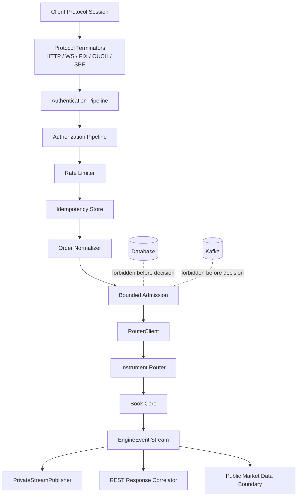
```mermaid
graph TD
    Client[Client Protocol Session] --> Term[Protocol Terminators\nHTTP / WS / FIX / OUCH / SBE]
    Term --> AuthN[Authentication Pipeline]
    AuthN --> AuthZ[Authorization Pipeline]
    AuthZ --> RL[Rate Limiter]
    RL --> Idem[Idempotency Store]
    Idem --> Norm[Order Normalizer]
    Norm --> Admit[Bounded Admission]
    Admit --> Router[RouterClient]
    Router --> IR[Instrument Router]
    IR --> BC[Book Core]
    BC --> Events[EngineEvent Stream]
    Events --> Private[PrivateStreamPublisher]
    Events --> Resp[REST Response Correlator]
    Events --> PublicBoundary[Public Market Data Boundary]

    DB[(Database)] -. forbidden before decision .- Admit
    Kafka[(Kafka)] -. forbidden before decision .- Admit
```

The Gateway is split into protocol adapters and protocol-neutral services. Protocol adapters perform decoding, framing, session I/O, and response encoding. Protocol-neutral services perform authentication, authorization, rate limiting, idempotency, normalization, and routing. All services required before router admission must operate from preloaded in-memory snapshots or lock-free/low-contention local structures.

### 7. Data Structures

```rust
pub struct GatewayRequest {
    pub protocol: Protocol,
    pub session_id: SessionId,
    pub remote_addr: IpAddr,
    pub received_at_ns: UnixNanos,
    pub headers: HeaderMap,
    pub payload: Bytes,
}

pub struct AuthenticatedPrincipal {
    pub account_id: AccountId,
    pub api_key_id: Option<ApiKeyId>,
    pub session_id: SessionId,
    pub permissions: PermissionBits,
    pub auth_epoch: u64,
}

pub struct OrderEnvelope {
    pub envelope_id: EnvelopeId,
    pub account_id: AccountId,
    pub instrument_id: InstrumentId,
    pub client_order_id: ClientOrderId,
    pub command: TradingCommand,
    pub fixed_price: Option<PriceFp>,
    pub fixed_qty: QuantityFp,
    pub side: Side,
    pub tif: TimeInForce,
    pub received_at_ns: UnixNanos,
    pub gateway_deadline_ns: UnixNanos,
    pub auth_epoch: u64,
    pub idempotency_key: IdempotencyKey,
    pub response_route: ResponseRoute,
}

pub enum GatewayDecision {
    Submitted { envelope_id: EnvelopeId },
    Rejected { code: RejectCode, reason: StaticStr },
    Duplicate { prior: PriorDecisionRef },
    Timeout { envelope_id: EnvelopeId },
}
```

### 8. Rust Module Layout

```text
crates/gateway/
  src/lib.rs
  src/http.rs              # REST endpoint decode/encode only
  src/websocket.rs         # WS session, private stream mux
  src/fix.rs               # FIX adapter boundary
  src/ouch.rs              # OUCH adapter boundary
  src/sbe.rs               # SBE adapter boundary
  src/auth.rs              # AuthService implementation over in-memory snapshots
  src/authorization.rs     # permission checks
  src/rate_limit.rs        # token buckets and overload policy
  src/idempotency.rs       # duplicate detection cache
  src/normalize.rs         # fixed-point canonicalization
  src/admission.rs         # bounded queue admission
  src/private_stream.rs    # private report routing
  src/public_boundary.rs   # market data boundary handoff
  src/metrics.rs
  src/errors.rs
```

### 9. Core Traits and Interfaces

```rust
pub trait GatewayService {
    fn handle_request(&self, req: GatewayRequest) -> GatewayDecision;
    fn handle_ws_frame(&self, session: SessionId, frame: WsFrame) -> GatewayDecision;
    fn on_engine_event(&self, event: &EngineEvent);
}

pub trait AuthService {
    fn authenticate(&self, req: &GatewayRequest) -> Result<AuthenticatedPrincipal, AuthError>;
    fn verify_api_key(&self, key_id: ApiKeyId, presented: SecretRef) -> Result<ApiKeyRecord, AuthError>;
    fn verify_hmac(&self, req: &GatewayRequest, key: &ApiKeyRecord) -> Result<(), AuthError>;
    fn validate_jwt_or_session(&self, req: &GatewayRequest) -> Result<SessionClaims, AuthError>;
}

pub trait RateLimiter {
    fn check_and_debit(&self, principal: &AuthenticatedPrincipal, cost: RateCost) -> Result<(), RateLimitError>;
    fn refund_on_not_submitted(&self, principal: &AuthenticatedPrincipal, cost: RateCost);
}

pub trait IdempotencyStore {
    fn reserve(&self, key: IdempotencyKey, ttl_ns: u64) -> IdempotencyDecision;
    fn complete(&self, key: IdempotencyKey, decision: EngineDecisionRef);
    fn mark_unknown_after_crash(&self, key: IdempotencyKey);
}

pub trait OrderNormalizer {
    fn normalize(&self, principal: &AuthenticatedPrincipal, req: CanonicalRequest) -> Result<OrderEnvelope, NormalizeError>;
}

pub trait RouterClient {
    fn try_submit(&self, envelope: OrderEnvelope) -> Result<SubmitRef, SubmitError>;
}

pub trait PrivateStreamPublisher {
    fn publish_execution_report(&self, account_id: AccountId, report: ExecutionReport);
    fn publish_reject(&self, account_id: AccountId, reject: PrivateReject);
}
```

### 10. Processing Flow

1. Decode protocol frame and reject malformed syntax before auth.
2. Authenticate using in-memory API key/JWT/session snapshots.
3. Verify HMAC over canonical method, path, timestamp, nonce, and body for signed REST.
4. Authorize account, instrument, command type, and trading mode.
5. Apply rate limit and overload tokens.
6. Reserve idempotency key scoped by `account_id + instrument_id + client_order_id + command_kind`.
7. Normalize into fixed-point `OrderEnvelope`.
8. Attempt bounded queue admission through `RouterClient::try_submit`.
9. On full queue, return `ENGINE_BUSY` and release/refund transient idempotency reservation unless the request is already in-flight.
10. Await correlated EngineEvent until gateway deadline for synchronous REST; WebSocket/FIX/OUCH sessions can receive asynchronous private reports.

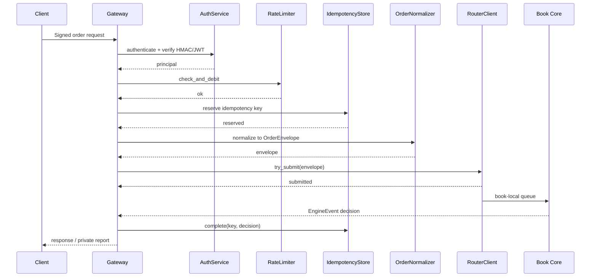
```mermaid
sequenceDiagram
    participant C as Client
    participant G as Gateway
    participant A as AuthService
    participant L as RateLimiter
    participant I as IdempotencyStore
    participant N as OrderNormalizer
    participant R as RouterClient
    participant B as Book Core
    C->>G: Signed order request
    G->>A: authenticate + verify HMAC/JWT
    A-->>G: principal
    G->>L: check_and_debit
    L-->>G: ok
    G->>I: reserve idempotency key
    I-->>G: reserved
    G->>N: normalize to OrderEnvelope
    N-->>G: envelope
    G->>R: try_submit(envelope)
    R-->>G: submitted
    R->>B: book-local queue
    B-->>G: EngineEvent decision
    G->>I: complete(key, decision)
    G-->>C: response / private report
```

### 11. State Machines

#### Request admission state

```text
Received -> Decoded -> Authenticated -> Authorized -> RateLimited -> IdempotencyReserved -> Normalized -> Submitted -> Decided
Received -> Rejected
Submitted -> TimedOutAtGateway
Submitted -> DecidedAfterTimeout
```

A gateway timeout does not cancel the Book Core command. If the command was submitted, the idempotency entry remains `InFlight` until an EngineEvent completes it or replay recovery resolves it.

### 12. Sequence Diagrams

#### Gateway overload rejection sequence

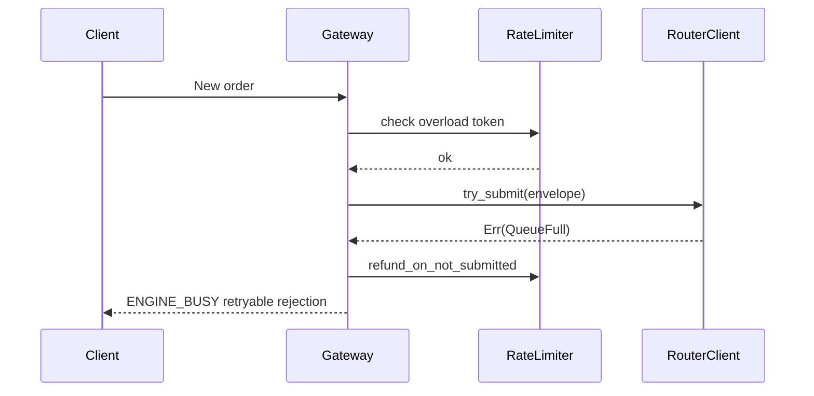
```mermaid
sequenceDiagram
    participant C as Client
    participant G as Gateway
    participant L as RateLimiter
    participant R as RouterClient
    C->>G: New order
    G->>L: check overload token
    L-->>G: ok
    G->>R: try_submit(envelope)
    R-->>G: Err(QueueFull)
    G->>L: refund_on_not_submitted
    G-->>C: ENGINE_BUSY retryable rejection
```

#### Duplicate order retry sequence

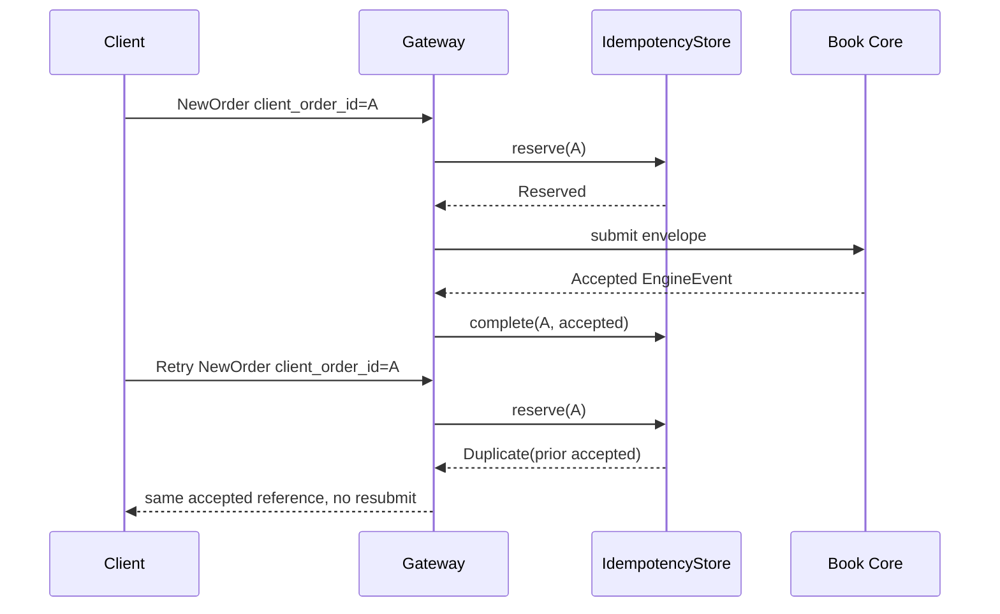
```mermaid
sequenceDiagram
    participant C as Client
    participant G as Gateway
    participant I as IdempotencyStore
    participant B as Book Core
    C->>G: NewOrder client_order_id=A
    G->>I: reserve(A)
    I-->>G: Reserved
    G->>B: submit envelope
    B-->>G: Accepted EngineEvent
    G->>I: complete(A, accepted)
    C->>G: Retry NewOrder client_order_id=A
    G->>I: reserve(A)
    I-->>G: Duplicate(prior accepted)
    G-->>C: same accepted reference, no resubmit
```

#### Gateway component diagram

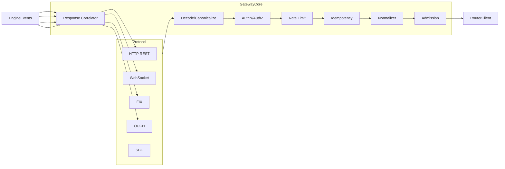
```mermaid
graph LR
    subgraph Protocol
      HTTP[HTTP REST]
      WS[WebSocket]
      FIX[FIX]
      OUCH[OUCH]
      SBE[SBE]
    end
    subgraph GatewayCore
      Decode[Decode/Canonicalize]
      Auth[AuthN/AuthZ]
      Limit[Rate Limit]
      Idem[Idempotency]
      Norm[Normalizer]
      Admit[Admission]
      Correlate[Response Correlator]
    end
    Protocol --> Decode --> Auth --> Limit --> Idem --> Norm --> Admit
    Admit --> RouterClient
    EngineEvents --> Correlate --> WS
    EngineEvents --> Correlate --> FIX
    EngineEvents --> Correlate --> OUCH
    EngineEvents --> Correlate --> HTTP
```

### 13. Memory Model

- Gateway hot-path request structs are allocated from per-worker pools where possible.
- Auth and instrument metadata are immutable snapshot references swapped atomically outside request handling.
- Idempotency entries are bounded by TTL and capacity; eviction cannot remove `InFlight` entries without marking them `Unknown` and forcing status reconciliation.
- `OrderEnvelope` owns all fields needed by Router and Book Core; it must not borrow request body buffers.
- HMAC secret material is stored in protected memory where supported and never copied into logs.

### 14. Threading and Concurrency Model

- Protocol I/O may run on multiple gateway workers.
- Each request is processed independently until `RouterClient::try_submit`.
- Gateway workers may submit to many instrument routes, but per-book order is preserved by the Router and bounded ring writer.
- No Gateway worker may hold a lock while calling `try_submit`.
- Response correlation can be sharded by `envelope_id` or `account_id` and must tolerate decision arrival after REST timeout.

### 15. Failure Modes

| Failure | Detection | Gateway behavior | Recovery expectation |
|---|---|---|---|
| Invalid HMAC | Constant-time compare fails. | Reject `AUTH_SIGNATURE_INVALID`. | Security counter increments; no router call. |
| Expired JWT/session | Session cache expiration. | Reject `AUTH_SESSION_EXPIRED`. | Client reauthenticates. |
| Unknown API key | Auth snapshot miss. | Reject `AUTH_KEY_UNKNOWN`. | No DB lookup in hot path. |
| Duplicate terminal order | Idempotency terminal hit. | Return prior decision reference. | No resubmit. |
| Duplicate in-flight order | Idempotency in-flight hit. | Return in-flight status or await same correlation. | Complete when EngineEvent arrives. |
| Router queue full | `try_submit` returns `QueueFull`. | Reject `ENGINE_BUSY`. | Client retries with same client id. |
| Gateway crash after submit | Missing local response state after restart. | Rebuild idempotency from event log/status query path; mark unresolved keys unknown. | Client retry receives prior decision or reconciliation response. |
| Engine decision after REST timeout | Correlation entry timed out. | Publish private report and persist idempotency terminal. | Client status endpoint shows final result. |

### 16. Backpressure and Overload Behaviour

Backpressure is explicit and bounded. The Gateway must never hide engine saturation behind unbounded in-memory queues.

- If local protocol worker queue is full, reject before auth with transport-level overload where safe.
- If rate-limiter overload bucket is empty, reject `RATE_LIMITED`.
- If router/book ring is full, reject `ENGINE_BUSY`.
- If idempotency store is at capacity, reject `GATEWAY_BUSY` unless the key already exists.
- If private stream subscriber is slow, drop or compact non-critical account snapshots but never drop terminal execution reports without forcing session resynchronization.

### 17. Observability

Required metrics:

- `gateway_requests_total{protocol,command,result}`
- `gateway_auth_failures_total{reason}`
- `gateway_hmac_verify_ns{quantile}`
- `gateway_rate_limited_total{scope}`
- `gateway_idempotency_hits_total{state}`
- `gateway_router_submit_ns{instrument}`
- `gateway_engine_busy_total{instrument,book}`
- `gateway_timeouts_total{command}`
- `gateway_private_report_lag_ns{account}`

Logs must include `envelope_id`, `account_id`, `instrument_id`, `client_order_id`, `protocol`, and rejection code. Logs must exclude secrets, raw HMAC keys, JWT bodies, and full request payloads containing sensitive data.

### 18. Performance Targets

| Operation | Target | Measurement point |
|---|---:|---|
| REST decode + canonicalization | <= 25 µs p99 | worker receive to canonical request |
| HMAC verification | <= 15 µs p99 | canonical bytes ready to auth result |
| Authz + metadata checks | <= 5 µs p99 | principal available to authz result |
| Idempotency reserve | <= 10 µs p99 | key construction to reservation decision |
| Normalize to envelope | <= 8 µs p99 | canonical request to owned envelope |
| Router `try_submit` | <= 5 µs p99 when ring not full | envelope ready to submit result |
| Busy rejection | <= 20 µs p99 after queue-full detection | queue-full to encoded response |

### 19. Security Considerations

- HMAC comparison must be constant-time.
- Signed REST timestamps must enforce a narrow replay window and nonce uniqueness per API key.
- JWT validation must pin issuer, audience, algorithm, and key epoch.
- API keys must be scoped to accounts and permissions; a key for one account cannot submit for another account.
- Authorization must reject halted instruments, liquidation-only accounts, disabled keys, and read-only sessions before Router submission.
- Rate limits must include account and credential dimensions to prevent key fan-out abuse.
- Private execution reports must be routed only to sessions authorized for the account.
- Public market data publishing must consume sanitized EngineEvents from the event boundary, not private order payloads.

### 20. Testing Strategy

| Test category | Required cases |
|---|---|
| Auth | valid/invalid HMAC, expired timestamp, replayed nonce, unknown key, disabled key, expired JWT, wrong audience. |
| Authorization | account mismatch, instrument permission denied, halted instrument, read-only key, trading-disabled account. |
| Idempotency | first submit, duplicate before decision, duplicate after accept, duplicate after reject, retry after gateway crash. |
| Admission | ring available, ring full, router unavailable, deadline exceeded, local overload. |
| Protocol parity | REST, WebSocket, FIX, OUCH, and SBE produce equivalent canonical commands. |
| Security | no secret logging, constant-time signature tests, malformed frame fuzzing, path canonicalization tests. |
| Replay integration | decision after gateway timeout completes idempotency on event replay. |

### 21. Codex Implementation Contract

A Codex implementation agent modifying Gateway code must:

1. Keep protocol adapters separate from canonical command services.
2. Preserve `OrderEnvelope` ownership; do not pass borrowed request buffers beyond normalization.
3. Use fixed-point types for price and quantity.
4. Never add DB, Kafka, or remote service calls before Book Core decision.
5. Treat `ENGINE_BUSY` as a terminal gateway rejection for that attempt and a retryable client outcome.
6. Add tests for every new rejection code and duplicate idempotency branch.
7. Ensure logs redact secrets by default.

### 22. Review Checklist

| Reviewer | Checklist |
|---|---|
| Rust backend engineer | Traits are object-safe or explicitly generic; no blocking call in hot path; error enums are exhaustive. |
| Exchange architect | Gateway does not sequence globally or mutate book state; accepted success follows EngineEvent. |
| QA engineer | Duplicate, timeout, overload, and protocol parity tests are present. |
| SRE | Metrics distinguish auth failure, rate limit, queue full, router unavailable, and timeout. |
| Security engineer | HMAC/JWT/API key handling is constant-time where required and secrets are redacted. |
| Codex agent | Module ownership is clear and forbidden dependencies are absent. |

## Chapter 2: Instrument Router Internals

### 1. Purpose

The Instrument Router maps each normalized `OrderEnvelope` to exactly one Book Core input ring based on instrument metadata, route table state, availability state, and failover policy. It preserves book-local ordering and propagates backpressure to the Gateway without inventing global sequencing or buffering indefinitely.

### 2. Scope

In scope:

- Instrument-to-BookCore mapping.
- Book shard registry and routing table.
- Primary/standby mapping.
- Canary symbols and feature-flagged route changes.
- Instrument availability and halt routing.
- Route cache refresh and hot reload safety.
- Bounded ring selection and `ENGINE_BUSY` propagation.

Out of scope:

- Gateway authentication and normalization.
- Matching and risk reservation.
- Global order sequencing.
- Durable event append.

### 3. Non-Goals

- The Router does not sequence orders globally.
- The Router does not reorder orders for the same book.
- The Router does not retry indefinitely on a full Book Core ring.
- The Router does not mutate Book Core state.
- The Router does not recover a Book Core by replaying events; it only changes routing state after safe failover control.

### 4. Responsibilities

| Responsibility | Implementation detail |
|---|---|
| Resolve instrument | Lookup `InstrumentId` in immutable `RouteTable` snapshot. |
| Validate tradability | Reject unknown, disabled, halted, or route-draining instruments before touching Book Core. |
| Select book | Pick primary or failover BookCoreHandle from `BookRoute`. |
| Preserve ordering | Use one ordered ring writer per target Book Core; never parallel-write same book through competing writers. |
| Propagate backpressure | Return `ENGINE_BUSY` on full ring or unavailable route. |
| Support hot reload | Atomically swap route table snapshots at epoch boundaries. |
| Support canaries | Apply route changes to configured canary symbols before broad migration. |

### 5. Inputs and Outputs

Inputs:

- `OrderEnvelope` from Gateway.
- Immutable `RouteTable` snapshot.
- Book availability heartbeats and health states.
- Feature flag snapshot.
- Instrument halt state snapshot.

Outputs:

- `RouteResolutionResult` to Gateway.
- Submitted command in target Book Core ring.
- Router metrics and structured route decision logs.

### 6. Internal Architecture

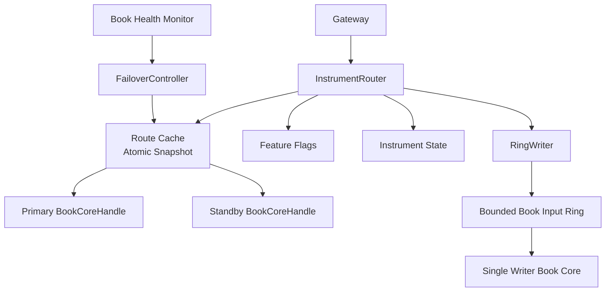
```mermaid
graph TD
    Gateway --> Router[InstrumentRouter]
    Router --> Cache[Route Cache\nAtomic Snapshot]
    Router --> Flags[Feature Flags]
    Router --> Halt[Instrument State]
    Cache --> Primary[Primary BookCoreHandle]
    Cache --> Standby[Standby BookCoreHandle]
    Router --> Writer[RingWriter]
    Writer --> Ring[Bounded Book Input Ring]
    Ring --> Book[Single Writer Book Core]
    Health[Book Health Monitor] --> Failover[FailoverController]
    Failover --> Cache
```

The Router is on the hot path but is not a decision engine. It performs pure selection and admission. It must be deterministic for a given route-table epoch and feature-flag epoch.

### 7. Data Structures

```rust
pub struct InstrumentRouter {
    route_table: ArcSwap<RouteTable>,
    failover: FailoverController,
    metrics: RouterMetrics,
}

pub struct RouteTable {
    pub epoch: RouteEpoch,
    pub routes: FxHashMap<InstrumentId, BookRoute>,
    pub canary_symbols: FxHashSet<InstrumentId>,
}

pub struct BookRoute {
    pub instrument_id: InstrumentId,
    pub primary: BookCoreHandle,
    pub standby: Option<BookCoreHandle>,
    pub state: InstrumentState,
    pub flags: RouteFlags,
    pub min_route_epoch: RouteEpoch,
}

pub struct BookCoreHandle {
    pub book_id: BookId,
    pub shard_id: ShardId,
    pub ring: RingWriter<OrderEnvelope>,
    pub availability: BookAvailability,
    pub writer_epoch: u64,
}

pub struct RingWriter<T> {
    pub ring_id: RingId,
    pub capacity: u32,
    pub producer: BoundedProducer<T>,
}

pub enum RouteResolutionResult {
    Submitted { book_id: BookId, route_epoch: RouteEpoch },
    Rejected { code: RejectCode, reason: StaticStr },
    Busy { book_id: Option<BookId>, reason: BusyReason },
}

pub enum InstrumentState {
    Trading,
    Halted { reason: HaltReason, since_ns: UnixNanos },
    PostOnly,
    CancelOnly,
    Disabled,
    Draining,
}

pub struct FailoverController {
    pub policy_epoch: u64,
    pub failover_state: AtomicFailoverMap,
}
```

### 8. Rust Module Layout

```text
crates/router/
  src/lib.rs
  src/instrument_router.rs
  src/route_table.rs
  src/book_registry.rs
  src/book_handle.rs
  src/ring_writer.rs
  src/failover.rs
  src/halt.rs
  src/feature_flags.rs
  src/cache_refresh.rs
  src/errors.rs
  src/metrics.rs
```

### 9. Core Traits and Interfaces

```rust
pub trait InstrumentRouterApi {
    fn route(&self, envelope: OrderEnvelope) -> RouteResolutionResult;
    fn current_epoch(&self) -> RouteEpoch;
}

pub trait RouteTableProvider {
    fn load_snapshot(&self) -> Arc<RouteTable>;
    fn validate_snapshot(&self, next: &RouteTable) -> Result<(), RouteTableError>;
}

pub trait BookRegistry {
    fn get(&self, book_id: BookId) -> Option<BookCoreHandle>;
    fn availability(&self, book_id: BookId) -> BookAvailability;
}

pub trait RingWriterApi<T> {
    fn try_push(&self, item: T) -> Result<(), RingPushError<T>>;
    fn remaining_capacity(&self) -> u32;
}

pub trait FailoverControl {
    fn active_handle(&self, route: &BookRoute) -> Result<BookCoreHandle, RouteError>;
    fn mark_primary_unavailable(&self, book_id: BookId, reason: FailoverReason);
}
```

### 10. Processing Flow

1. Load current `RouteTable` snapshot atomically.
2. Lookup `envelope.instrument_id`.
3. Reject `UNKNOWN_INSTRUMENT` if missing.
4. Check `InstrumentState`; reject halted/disabled instruments before touching Book Core.
5. Resolve active Book Core handle through failover policy.
6. Verify handle availability and writer epoch.
7. Attempt `RingWriter::try_push(envelope)`.
8. Return `Submitted` on push success.
9. Return `Busy` on full ring or unavailable active handle.

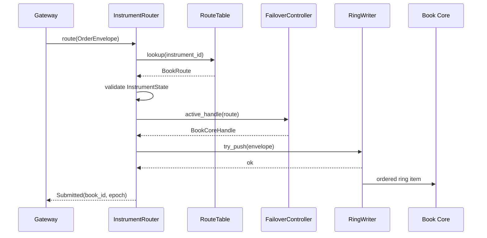
```mermaid
sequenceDiagram
    participant G as Gateway
    participant R as InstrumentRouter
    participant T as RouteTable
    participant F as FailoverController
    participant W as RingWriter
    participant B as Book Core
    G->>R: route(OrderEnvelope)
    R->>T: lookup(instrument_id)
    T-->>R: BookRoute
    R->>R: validate InstrumentState
    R->>F: active_handle(route)
    F-->>R: BookCoreHandle
    R->>W: try_push(envelope)
    W-->>R: ok
    W->>B: ordered ring item
    R-->>G: Submitted(book_id, epoch)
```

### 11. State Machines

#### Instrument route state

```text
Trading -> Halted -> Trading
Trading -> CancelOnly -> Trading
Trading -> Draining -> Disabled
Trading -> Draining -> Trading
Disabled -> Draining -> Trading
```

Only `Trading`, `PostOnly` for allowed post-only commands, and `CancelOnly` for cancel commands are routable. `Halted`, `Disabled`, and incompatible modes reject before Book Core.

#### Book availability state

```text
Available -> Degraded -> Unavailable -> Recovering -> Available
Available -> Draining -> StandbyPromoted
```

Routing to standby is permitted only after failover control has confirmed no split-brain writer exists for the same book-local sequence domain.

### 12. Sequence Diagrams

#### Route cache refresh sequence

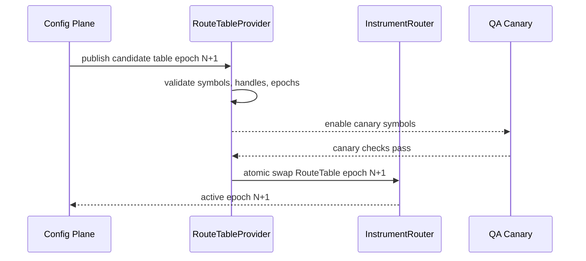
```mermaid
sequenceDiagram
    participant C as Config Plane
    participant P as RouteTableProvider
    participant R as InstrumentRouter
    participant Q as QA Canary
    C->>P: publish candidate table epoch N+1
    P->>P: validate symbols, handles, epochs
    P-->>Q: enable canary symbols
    Q-->>P: canary checks pass
    P->>R: atomic swap RouteTable epoch N+1
    R-->>C: active epoch N+1
```

#### Primary/standby failover routing sequence

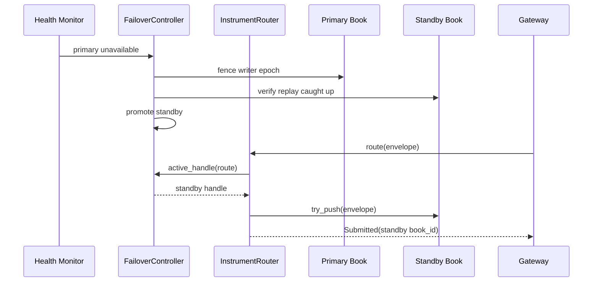
```mermaid
sequenceDiagram
    participant H as Health Monitor
    participant F as FailoverController
    participant R as InstrumentRouter
    participant P as Primary Book
    participant S as Standby Book
    participant G as Gateway
    H->>F: primary unavailable
    F->>P: fence writer epoch
    F->>S: verify replay caught up
    F->>F: promote standby
    G->>R: route(envelope)
    R->>F: active_handle(route)
    F-->>R: standby handle
    R->>S: try_push(envelope)
    R-->>G: Submitted(standby book_id)
```

#### Instrument halt routing sequence

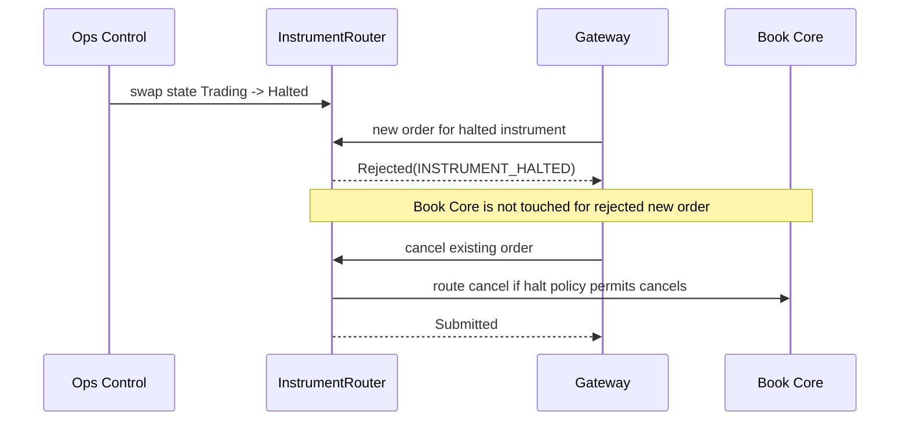
```mermaid
sequenceDiagram
    participant Ops as Ops Control
    participant R as InstrumentRouter
    participant G as Gateway
    participant B as Book Core
    Ops->>R: swap state Trading -> Halted
    G->>R: new order for halted instrument
    R-->>G: Rejected(INSTRUMENT_HALTED)
    Note over R,B: Book Core is not touched for rejected new order
    G->>R: cancel existing order
    R->>B: route cancel if halt policy permits cancels
    R-->>G: Submitted
```

### 13. Memory Model

- `RouteTable` is immutable after construction and exchanged with atomic pointer swap.
- `BookRoute` holds handles by value or `Arc` to stable writer endpoints; it does not hold mutable book state.
- Ring writers own producer cursors; consumer cursors are owned by Book Core.
- Route cache refresh allocates outside the hot path, validates fully, then swaps one pointer.
- The Router does not copy large order payloads; it moves the owned `OrderEnvelope` into a selected ring or returns it on push failure for error handling.

### 14. Threading and Concurrency Model

- Multiple Gateway workers may call `InstrumentRouter::route` concurrently.
- A route operation reads immutable snapshots and performs one bounded ring push.
- For a given Book Core, ring writer configuration must preserve single producer semantics or use a proven MPSC ring that preserves arrival order per producer and deterministic merge policy. Preferred deployment is one Router writer task per Book Core to avoid ambiguous same-book ordering.
- Route-table swaps are atomic and wait-free for readers.
- Failover promotion must fence the old writer epoch before exposing the standby handle.

### 15. Failure Modes

| Failure | Detection | Router response | Safety property |
|---|---|---|---|
| Unknown instrument | Route table miss. | Reject `UNKNOWN_INSTRUMENT`. | Book Core untouched. |
| Halted instrument | `InstrumentState::Halted`. | Reject new/amend; route cancels only if policy allows. | Halt is enforced before matching. |
| Full book ring | `RingPushError::Full`. | Return `ENGINE_BUSY`. | No hidden backlog. |
| Primary unavailable | Health state or failed writer epoch. | Return busy or use promoted standby. | No split-brain writer. |
| Invalid hot reload | Snapshot validation fails. | Keep old route table. | Readers observe valid epoch only. |
| Feature flag mismatch | Flag epoch inconsistent. | Reject route-table activation. | Canary changes are controlled. |

### 16. Backpressure and Overload Behaviour

- The Router never blocks waiting for ring capacity.
- `RingWriter::try_push` is a single-attempt operation.
- Full rings produce `ENGINE_BUSY` with `book_id` where safe.
- Route-level degraded state can preemptively return busy before a ring is full.
- Gateway must surface busy to clients; it must not create a secondary unbounded queue.

### 17. Observability

Required metrics:

- `router_route_total{instrument,result,book_id}`
- `router_unknown_instrument_total{instrument}`
- `router_instrument_halted_total{instrument,command}`
- `router_ring_full_total{book_id}`
- `router_route_epoch{}`
- `router_failover_total{from_book,to_book,reason}`
- `router_route_latency_ns{quantile}`
- `router_ring_remaining_capacity{book_id}`

Structured route logs must include `envelope_id`, `instrument_id`, `route_epoch`, `book_id`, `instrument_state`, and `result`.

### 18. Performance Targets

| Operation | Target | Notes |
|---|---:|---|
| Route table lookup | <= 2 µs p99 | Immutable hash map or generated perfect map for active symbols. |
| Instrument state validation | <= 500 ns p99 | State stored in route entry. |
| Failover active handle selection | <= 1 µs p99 | Atomic state read only in normal case. |
| Ring push success | <= 2 µs p99 | No allocation, no blocking. |
| Ring full rejection | <= 2 µs p99 | Includes error construction. |
| Route table atomic swap | <= 50 µs control-plane operation | Not on order hot path. |

### 19. Security Considerations

- Route-table updates require authenticated control-plane authorization and signed configuration artifacts.
- Canary activation must not allow unauthorized instruments to trade.
- Instrument halt state is security relevant; stale route state must be observable and bounded by epoch monitoring.
- Router logs must not include private order payload beyond identifiers required for audit.
- Failover fencing must prevent two Book Cores from accepting commands for the same instrument sequence domain.

### 20. Testing Strategy

| Test category | Required cases |
|---|---|
| Routing | known instrument, unknown instrument, disabled instrument, canary instrument, post-only mode, cancel-only mode. |
| Ordering | concurrent submissions to same book preserve configured ring order; no reorder during route-table swap. |
| Backpressure | full ring returns `ENGINE_BUSY`; degraded route returns busy; Gateway receives propagated busy. |
| Hot reload | invalid snapshot rejected; valid snapshot swapped atomically; old in-flight route completes safely. |
| Failover | primary available, primary unavailable no standby, standby promoted after fence, split-brain prevention. |
| Halt | new order rejected, cancel allowed/denied by policy, halt epoch observed in metrics. |

### 21. Codex Implementation Contract

A Codex implementation agent modifying Router code must:

1. Keep Router logic limited to selection, validation, and bounded admission.
2. Never add global sequencing.
3. Never add unbounded queues or blocking retry loops.
4. Reject unknown or halted instruments before touching Book Core.
5. Preserve book-local order during route-table refresh and failover.
6. Add tests for route epochs, failover fencing, and ring-full propagation.

### 22. Review Checklist

| Reviewer | Checklist |
|---|---|
| Rust backend engineer | Route snapshots are immutable; ring push API cannot block indefinitely. |
| Exchange architect | Router does not sequence globally and does not mutate Book Core state. |
| QA engineer | Hot reload, halt, unknown instrument, and failover tests exist. |
| SRE | Route epoch, ring capacity, and failover metrics are dashboarded. |
| Security engineer | Route config activation is authenticated and split-brain is prevented. |
| Codex agent | Interfaces match `InstrumentRouter`, `RouteTable`, `BookRoute`, `BookCoreHandle`, `RingWriter`, `RouteResolutionResult`, `InstrumentState`, and `FailoverController`. |

## Chapter 3: Book Core Memory Model

### 1. Purpose

The Book Core Memory Model defines ownership, layout, allocation, cache behavior, and mutation invariants for the single-writer trading kernel. It is the implementation contract for deterministic, low-latency order processing. Every accepted command for a book is consumed by one Book Core thread that owns all mutable book state, generates EngineEvents atomically with state transitions, appends events before externally visible success, and supports replay into identical logical state.

### 2. Scope

In scope:

- Single-writer memory ownership for book state, risk cache, reservations, event buffers, and snapshot buffers.
- Owned, borrowed, and read-only snapshot state.
- Cache line alignment, false sharing avoidance, CPU pinning, and NUMA assumptions.
- Memory pools, arena allocation, object lifecycle, and zero steady-state allocation target.
- Layouts for order nodes, price levels, rings, event buffers, snapshot buffers, reservation map, risk cache, and hash chain buffer.

Out of scope:

- External database layout.
- Kafka or cloud archival storage.
- Full matching algorithm specification, which is expanded in Chapter 5.
- Full risk formula specification, which is expanded in Chapter 6.

### 3. Non-Goals

- No shared mutable order book state between threads.
- No lock acquisition inside `process_order`.
- No heap allocation in steady-state order matching.
- No floating-point arithmetic in memory-resident trading state.
- No global sequence counter across books.
- No runtime schema reflection in the hot path.

### 4. Responsibilities

| Component | Owned by | Responsibility |
|---|---|---|
| `BookCore` | Book thread | Consume input ring, mutate book state, emit EngineEvents. |
| `BookState` | Book thread | Hold all mutable per-book state. |
| `OrderBook` | Book thread | Maintain price levels and FIFO queues. |
| `RiskCache` | Book thread | Hold preloaded account/instrument limits relevant to this book. |
| `ReservationMap` | Book thread | Track risk reservations for active orders in this book. |
| `EventBuffer` | Book thread | Stage EngineEvents before append. |
| `AppendOnlyLog` | Book thread owned writer | Append committed events and hash chain entries. |
| `SnapshotBuffer` | Snapshot subsystem with immutable handoff | Copy or freeze read-only state for replay checkpoints. |

### 5. Inputs and Outputs

Inputs:

- `OrderEnvelope` from the book input ring.
- Control commands already routed to this book, such as halt transition, cancel-only mode, snapshot request, and drain request.
- Preloaded risk/account cache updates delivered through deterministic control events.

Outputs:

- `EngineEvent` entries appended to the append-only log.
- Private execution reports derived from EngineEvents.
- Public market data deltas derived from non-private EngineEvents.
- Snapshot artifacts created from read-only checkpoint buffers.

### 6. Internal Architecture

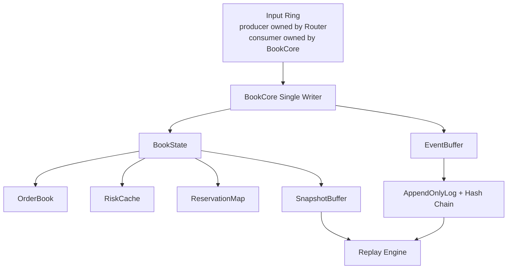
```mermaid
graph TD
    Ring[Input Ring\nproducer owned by Router\nconsumer owned by BookCore] --> Core[BookCore Single Writer]
    Core --> State[BookState]
    State --> OB[OrderBook]
    State --> Risk[RiskCache]
    State --> Res[ReservationMap]
    Core --> EB[EventBuffer]
    EB --> Log[AppendOnlyLog + Hash Chain]
    State --> Snap[SnapshotBuffer]
    Log --> Replay[Replay Engine]
    Snap --> Replay
```

Book Core owns mutable state exclusively. Other threads may hold immutable snapshots or receive event-derived projections, but they cannot borrow mutable state from `BookState`.

### 7. Data Structures

```rust
#[repr(align(64))]
pub struct BookCore {
    pub book_id: BookId,
    pub instrument_id: InstrumentId,
    pub input: RingConsumer<OrderEnvelope>,
    pub state: BookState,
    pub event_buffer: EventBuffer,
    pub log: AppendOnlyLog,
    pub snapshot_buffer: SnapshotBuffer,
    pub pools: BookMemoryPools,
    pub clock: DeterministicClock,
}

pub struct BookState {
    pub seq: BookSeq,
    pub trading_state: TradingState,
    pub order_book: OrderBook,
    pub risk_cache: RiskCache,
    pub reservations: ReservationMap,
    pub last_event_hash: Hash256,
    pub stats: BookStats,
}

pub struct OrderBook {
    pub bids: PriceTree<PriceFp, PriceLevel>,
    pub asks: PriceTree<PriceFp, PriceLevel>,
    pub order_index: FixedHashMap<OrderId, OrderPtr>,
    pub client_index: FixedHashMap<ClientOrderKey, OrderId>,
}

#[repr(align(64))]
pub struct PriceLevel {
    pub price: PriceFp,
    pub total_qty: QuantityFp,
    pub head: Option<OrderPtr>,
    pub tail: Option<OrderPtr>,
    pub order_count: u32,
    pub _pad: [u8; 16],
}

pub struct OrderNode {
    pub order_id: OrderId,
    pub account_id: AccountId,
    pub client_order_id: ClientOrderId,
    pub price: PriceFp,
    pub remaining_qty: QuantityFp,
    pub reserved_qty: QuantityFp,
    pub side: Side,
    pub tif: TimeInForce,
    pub prev: Option<OrderPtr>,
    pub next: Option<OrderPtr>,
    pub pool_generation: u32,
}

pub struct RiskCache {
    pub account_limits: FixedHashMap<AccountId, AccountLimitCell>,
    pub instrument_limits: InstrumentLimitCell,
    pub account_positions: FixedHashMap<AccountId, PositionCell>,
}

pub struct ReservationMap {
    pub by_order: FixedHashMap<OrderId, ReservationCell>,
    pub by_account: FixedHashMap<AccountId, AccountReservationTotals>,
}

#[repr(align(64))]
pub struct EventBuffer {
    pub staged: FixedVec<EngineEvent, MAX_EVENTS_PER_COMMAND>,
    pub hash_chain: HashChainBuffer,
}

pub struct AppendOnlyLog {
    pub writer: LogWriter,
    pub current_segment: SegmentId,
    pub last_flushed_seq: BookSeq,
}

pub struct SnapshotBuffer {
    pub header: SnapshotHeader,
    pub arena_image: SnapshotArenaImage,
    pub order_index_image: SnapshotIndexImage,
    pub risk_image: SnapshotRiskImage,
}
```

### 8. Rust Module Layout

```text
crates/book_core/
  src/lib.rs
  src/core.rs              # BookCore loop and process_order boundary
  src/state.rs             # BookState and invariants
  src/order_book.rs        # OrderBook, PriceLevel, OrderNode
  src/memory_pool.rs       # slab/arena allocation
  src/ring.rs              # consumer-side input ring contracts
  src/events.rs            # EventBuffer and EngineEvent staging
  src/log.rs               # AppendOnlyLog writer boundary
  src/snapshot.rs          # SnapshotBuffer layout and handoff
  src/risk_cache.rs        # RiskCache and ReservationMap
  src/replay_alloc.rs      # deterministic replay allocation
  src/cache_align.rs       # alignment wrappers and padding
  src/tests/
```

### 9. Core Traits and Interfaces

```rust
pub trait BookCoreRuntime {
    fn run(&mut self) -> !;
    fn process_order(&mut self, envelope: OrderEnvelope) -> ProcessResult;
    fn process_control(&mut self, command: BookControlCommand) -> ProcessResult;
}

pub trait BookMemoryPool<T> {
    fn alloc(&mut self, value: T) -> Result<PoolPtr<T>, PoolExhausted>;
    fn free(&mut self, ptr: PoolPtr<T>);
    fn capacity(&self) -> usize;
    fn used(&self) -> usize;
}

pub trait EventAppender {
    fn stage(&mut self, event: EngineEvent);
    fn commit_staged(&mut self, log: &mut AppendOnlyLog) -> Result<CommitRef, LogError>;
    fn clear_staged_on_reject(&mut self);
}

pub trait SnapshotWriter {
    fn begin_snapshot(&mut self, state: &BookState) -> SnapshotToken;
    fn copy_chunk(&mut self, token: SnapshotToken, budget_bytes: usize) -> SnapshotProgress;
    fn publish_read_only(&mut self, token: SnapshotToken) -> ReadOnlySnapshot;
}
```

### 10. Processing Flow

1. Book Core polls its input ring consumer.
2. It moves one `OrderEnvelope` into `process_order`.
3. It validates deterministic preconditions using owned `BookState` and `RiskCache`.
4. It mutates `OrderBook` and `ReservationMap` using pool-owned nodes only.
5. It stages one or more EngineEvents in `EventBuffer`.
6. It appends staged events to `AppendOnlyLog`, updating the hash chain.
7. Only after successful append does it expose success through event publication.
8. If append fails before visibility, it must stop the book, mark state unsafe, and require replay or operator intervention.

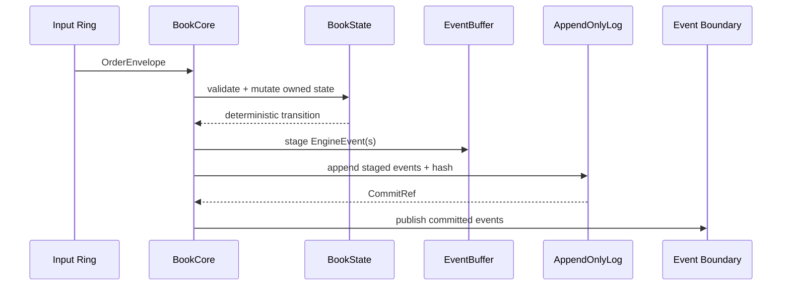
```mermaid
sequenceDiagram
    participant Ring as Input Ring
    participant Core as BookCore
    participant State as BookState
    participant Events as EventBuffer
    participant Log as AppendOnlyLog
    participant Pub as Event Boundary
    Ring->>Core: OrderEnvelope
    Core->>State: validate + mutate owned state
    State-->>Core: deterministic transition
    Core->>Events: stage EngineEvent(s)
    Core->>Log: append staged events + hash
    Log-->>Core: CommitRef
    Core->>Pub: publish committed events
```

### 11. State Machines

#### Book Core run state

```text
Starting -> Replaying -> Live -> Draining -> Stopped
Live -> Faulted
Faulted -> Replaying
Draining -> Snapshotting -> Stopped
```

#### Object lifecycle

```text
FreePoolSlot -> AllocatedOrderNode -> LinkedInPriceLevel -> PartiallyFilled -> RemovedFromBook -> EventCommitted -> FreePoolSlot
```

An order node cannot return to the free pool until the cancel/fill/remove event that made it unreachable has been appended.

### 12. Sequence Diagrams

#### Hot path memory flow diagram

```mermaid
flowchart LR
    Env[OrderEnvelope owned value] --> Validate[Validate against RiskCache]
    Validate --> Pool[OrderNode from slab pool]
    Pool --> Level[PriceLevel FIFO link]
    Level --> Stage[Stage EngineEvent]
    Stage --> Hash[HashChainBuffer]
    Hash --> Append[AppendOnlyLog]
    Append --> Visible[Externally visible success]
```

#### Ring buffer ownership diagram

```mermaid
graph LR
    subgraph RouterThread
      P[Ring Producer Cursor]
    end
    subgraph SharedRingMemory
      Slots[Preallocated Slots]
    end
    subgraph BookCoreThread
      C[Ring Consumer Cursor]
    end
    P -- writes envelope then publishes --> Slots
    C -- consumes in order --> Slots
    Slots -- no mutable book state --> C
```

#### Snapshot memory layout diagram

```mermaid
graph TD
    Header[SnapshotHeader\nbook_id seq hash epoch] --> Arena[Order Arena Image]
    Header --> Levels[Price Level Index Image]
    Header --> Orders[Order Index Image]
    Header --> Risk[Risk Cache Image]
    Header --> Reservations[Reservation Map Image]
    Header --> Trailer[Checksum + Hash Chain Anchor]
```

### 13. Memory Model

#### Ownership categories

| Category | Examples | Access rule |
|---|---|---|
| Owned mutable | `BookState`, `OrderBook`, `RiskCache`, `ReservationMap`, `EventBuffer` | Only Book Core thread mutates. |
| Borrowed immutable | `&InstrumentSpec`, read-only config snapshot | Borrow for duration of command; never store mutable refs. |
| Moved input | `OrderEnvelope` | Moved from ring into Book Core; not shared after consume. |
| Read-only snapshot | `ReadOnlySnapshot` | Published after copy/freeze; consumers cannot mutate. |
| Cold-path projection | DB/Kafka/materialized views | Derived from committed events, never consulted for hot decisions. |

#### Layout requirements

| Structure | Layout requirement | Rationale |
|---|---|---|
| `BookCore` | `repr(align(64))`; hot counters separated from cold config. | Prevent false sharing with adjacent runtime objects. |
| Ring slots | Power-of-two capacity; slot sequence padded to cache line. | Fast mask index and avoid producer/consumer cache ping-pong. |
| `PriceLevel` | Head/tail/aggregate quantity in one or two cache lines. | Common matching operations touch these fields together. |
| `OrderNode` | Intrusive prev/next pointers and fixed-point quantities. | Avoid per-node heap allocation and external linked-list boxes. |
| `EventBuffer` | Fixed max events per command with overflow fault policy. | No dynamic allocation during matching. |
| `RiskCache` | Account cells grouped by active instrument shard. | Improve locality for repeated account activity. |
| `ReservationMap` | Fixed-capacity hash table with deterministic probing. | Replay creates identical map shape and iteration order. |
| `HashChainBuffer` | Fixed staging buffer for event hashes. | Event append and hash update are atomic from Book Core perspective. |

#### CPU and NUMA assumptions

- Each active Book Core is pinned to a dedicated logical CPU where deployment capacity allows.
- Router producer for a hot book should run on the same NUMA node as the Book Core.
- Memory pools are allocated on the target NUMA node during startup warmup.
- Cross-NUMA route changes require draining or explicit latency budget approval.
- Hyperthread sibling placement must avoid placing noisy cold-path projection work next to a high-volume Book Core.

#### Allocator strategy

- Startup allocates slabs for order nodes, price levels, event staging, risk cells, reservations, input ring slots, and snapshot buffers.
- Steady-state `process_order` uses only pool allocation and fixed-capacity containers.
- Pool exhaustion is a deterministic rejection or book fault depending on the pool. Order-node exhaustion returns `ENGINE_CAPACITY_EXCEEDED`; event-buffer overflow faults the book because it violates event bounds.
- Replay uses the same pool capacities and deterministic allocation order to rebuild identical logical memory state.

### 14. Threading and Concurrency Model

- One Book Core thread owns one book or a configured small set of books only if each book has isolated state and deterministic polling policy.
- `process_order` is single-threaded and cannot acquire mutexes, rwlocks, async locks, or blocking channels.
- Input ring consumer is owned by Book Core; producer ownership belongs to Router.
- Event publication after log append may hand off immutable event copies to other threads.
- Snapshotting may be incremental, but any mutable traversal is controlled by the Book Core. Cold snapshot writers receive copied chunks or frozen immutable buffers.

### 15. Failure Modes

| Failure mode | Detection | Required behavior | Test |
|---|---|---|---|
| Order node pool exhausted | Pool `alloc` returns `PoolExhausted`. | Reject new order with capacity code; do not mutate book. | Fill pool then submit one more order. |
| Price level pool exhausted | Level allocation fails. | Reject if no mutation occurred; otherwise fault before visibility. | Submit unique prices beyond capacity. |
| Event buffer overflow | Staged event count exceeds bound. | Fault Book Core; require replay with corrected bound. | Fuzz command producing many fills. |
| Log append failure | `AppendOnlyLog` returns error. | Stop external success; mark book `Faulted`. | Inject log write failure. |
| Hash chain mismatch on replay | Recomputed hash differs. | Stop replay and quarantine segment. | Corrupt event segment. |
| Snapshot checksum mismatch | Trailer check fails. | Discard snapshot and replay from earlier checkpoint. | Corrupt snapshot bytes. |
| Shared mutable alias introduced | Static/lint/Miri detection. | Reject code change. | Miri/loom/unsafe audit. |
| Unexpected allocation in hot path | Allocation counter increments. | Fail benchmark/test. | Instrument global allocator in tests. |

### 16. Backpressure and Overload Behaviour

- Book Core signals overload by allowing input ring capacity to fall to zero; Router converts that to `ENGINE_BUSY`.
- Book Core does not allocate more memory to absorb bursts.
- Capacity rejections are deterministic and evented when the command reached Book Core.
- If memory pool usage exceeds warning thresholds, SRE metrics fire before hard exhaustion.
- Snapshot activity must yield to order processing and obey a byte/time budget per loop iteration.

### 17. Observability

Required metrics:

- `book_core_loop_ns{book_id}`
- `book_core_process_order_ns{book_id,command}`
- `book_core_ring_depth{book_id}`
- `book_core_pool_used{book_id,pool}`
- `book_core_event_append_ns{book_id}`
- `book_core_hash_chain_seq{book_id}`
- `book_core_snapshot_bytes_pending{book_id}`
- `book_core_replay_determinism_fail_total{book_id}`
- `book_core_hot_path_allocations_total{book_id}` expected to remain zero after warmup.

Tracing must be sampled outside the hot mutation section. Per-order debug logging is disabled in production hot path unless a canary symbol or emergency trace flag is enabled with explicit latency acceptance.

### 18. Performance Targets

#### Latency budget table

| Segment | Target p50 | Target p99 | Constraint |
|---|---:|---:|---|
| Ring consume | <= 250 ns | <= 1 µs | Cache-resident slot, no allocation. |
| Precondition validation | <= 1 µs | <= 4 µs | Risk cache local to book thread. |
| Add resting order | <= 2 µs | <= 8 µs | Existing price level. |
| Create new price level | <= 4 µs | <= 15 µs | Pool allocation only. |
| Match against one level | <= 3 µs | <= 10 µs | Excludes multi-level sweep. |
| Event staging | <= 500 ns | <= 2 µs | Fixed buffer. |
| Event append | <= 5 µs | <= 25 µs | Local append-only segment. |
| Snapshot incremental slice | <= 10 µs per loop budget | <= 50 µs | Must yield to order processing. |

#### Memory budget table

| Pool/buffer | Initial capacity per book | Sizing driver | Exhaustion behavior |
|---|---:|---|---|
| Input ring | 65,536 envelopes | Gateway burst and router fan-in. | Router returns `ENGINE_BUSY`. |
| Order node slab | 2,000,000 nodes | Max resting orders plus safety margin. | Reject new resting order. |
| Price level slab | 250,000 levels | Tick range and active depth. | Reject/fault based on mutation point. |
| Order index | 4,194,304 slots | Load factor <= 0.5 for active orders. | Reject capacity. |
| Client index | 4,194,304 slots | Duplicate detection at book level. | Reject capacity. |
| Reservation map | 4,194,304 slots | Active reserving orders. | Reject capacity. |
| Event buffer | 4,096 events/command | Worst-case sweep bound. | Fault if exceeded. |
| Hash chain buffer | 4,096 hashes/command | Mirrors event buffer. | Fault if exceeded. |
| Snapshot buffer | Configured by book size, double-buffered | Checkpoint latency target. | Delay snapshot; do not block matching indefinitely. |
| Risk cache | Active accounts for instrument shard | Account participation. | Reject if required account cell absent. |

### 19. Security Considerations

- Memory reuse must clear sensitive account/order fields before returning slots to pools if snapshots or diagnostics can expose freed memory.
- Unsafe Rust is allowed only in audited modules such as ring buffers or arena pointers, with documented aliasing invariants.
- Snapshot buffers must not include API secrets, JWTs, HMAC material, or private gateway credentials.
- Event hashes must include enough command and result data to detect tampering while respecting privacy boundaries for public projections.
- Replay must reject malformed events rather than attempting best-effort repair.

### 20. Testing Strategy

#### Testing matrix

| Test type | Required coverage | Tooling |
|---|---|---|
| Unit | Price level link/unlink, slab alloc/free, reservation insert/remove, event staging bounds. | Rust unit tests. |
| Property | Random command sequences preserve quantity, FIFO, reservation, and hash invariants. | proptest. |
| Determinism | Same event stream rebuilds identical logical state and hashes. | Replay harness. |
| Allocation | Zero heap allocation during warmed `process_order`. | Counting allocator. |
| Concurrency | Ring producer/consumer memory ordering and snapshot handoff. | loom where feasible. |
| Unsafe audit | Pointer generation checks and aliasing invariants. | Miri + manual review. |
| Performance | p50/p95/p99 latency by command shape and book depth. | Criterion/custom pinned benchmark. |
| Fault injection | log failure, pool exhaustion, hash mismatch, snapshot corruption. | deterministic fault hooks. |

### 21. Codex Implementation Contract

A Codex implementation agent modifying Book Core memory code must:

1. Preserve the invariant that only `BookCore` mutates `BookState`.
2. Add no lock acquisition inside `process_order`.
3. Add no heap allocation in warmed steady-state matching.
4. Use fixed-point numeric types only.
5. Ensure EngineEvent append occurs before externally visible success.
6. Keep state mutation and EngineEvent generation atomic from the Book Core perspective.
7. Update replay tests whenever memory layout or event generation changes.
8. Document every `unsafe` block with aliasing, lifetime, and threading invariants.
9. Keep replay allocation deterministic.
10. Add pool-exhaustion and snapshot/replay tests for new pools or buffers.

### 22. Architect Review Checklist

| Invariant | Review question |
|---|---|
| Single writer | Can any thread other than Book Core mutate `BookState` or children? |
| Event-before-success | Is success externally visible only after append commit? |
| Atomic transition | Can state mutation happen without corresponding EngineEvent? |
| Replay determinism | Does replay rebuild identical logical state and hash chain? |
| Fixed point | Are all prices, quantities, fees, and reservations fixed-point integers? |
| Zero allocation | Does warmed `process_order` avoid heap allocation? |
| No locks | Are mutexes/rwlocks/blocking channels absent from hot mutation code? |
| Cache locality | Are hot fields aligned and separated from cold fields? |
| Pool sizing | Is exhaustion behavior deterministic and tested? |
| Snapshot safety | Are snapshots read-only, checksummed, and free of secrets? |

## Chapter 4: Order Book Data Structures

### Purpose

Specify concrete price tree, price level, order queue, index, and intrusive node structures used by Book Core.

### Planned subsections

- Price ladder representation.
- Bid/ask ordering semantics.
- FIFO queue operations.
- Order ID and client ID indexes.
- Tick-size validation and fixed-point price encoding.
- Capacity planning and pool exhaustion behavior.

### Key questions to answer

- Which tree/map implementation is selected for active price levels?
- How are sparse versus dense tick ranges handled?
- How is FIFO preserved during partial fills, cancels, and amends?

### Required diagrams

- Price level tree layout.
- Intrusive order queue lifecycle.
- Index-to-node pointer relationship.

### Required Rust interfaces

- `OrderBookApi`
- `PriceLadder`
- `LevelQueue`
- `OrderIndex`
- `ClientOrderIndex`

### Required test matrices

- Add, cancel, amend, partial fill, full fill, level removal, index collision, pool exhaustion.

### Codex expansion task placeholder

TODO: Expand Chapter 4 into full implementation-grade specification with pseudocode, invariants, benchmarks, and review checklist.

## Chapter 5: Matching Engine Algorithms

### Purpose

Specify deterministic matching algorithms for limit, market, post-only, IOC, FOK, reduce-only, cancel, and amend commands.

### Planned subsections

- Price-time priority.
- TIF handling.
- Self-trade prevention.
- Multi-level sweep bounds.
- Event generation ordering.
- Deterministic rejection semantics.

### Key questions to answer

- What is the exact event sequence for each command shape?
- How are partial fills and residual resting quantities represented?
- What are the deterministic bounds for fill fan-out?

### Required diagrams

- Limit order match sequence.
- Market sweep sequence.
- Cancel/amend state transition.

### Required Rust interfaces

- `MatchingEngine`
- `MatchContext`
- `FillAccumulator`
- `SelfTradePolicy`

### Required test matrices

- Cross/no-cross, partial/full fill, IOC residual cancel, FOK all-or-none, post-only reject, self-trade policies.

### Codex expansion task placeholder

TODO: Expand Chapter 5 into full implementation-grade specification with algorithms, event sequences, and deterministic replay tests.

## Chapter 6: Risk Reservation Engine

### Purpose

Specify book-local risk checks and reservation mutations performed before and during matching.

### Planned subsections

- Pre-trade balance checks.
- Reservation creation, release, and adjustment.
- Position and exposure cache.
- Reduce-only enforcement.
- Risk cache update events.

### Key questions to answer

- Which risk checks are hard preconditions before book mutation?
- How are reservations reconciled with clearing events?
- How are stale risk cache entries detected?

### Required diagrams

- Reservation lifecycle.
- Risk check and match interaction.
- Clearing reconciliation flow.

### Required Rust interfaces

- `RiskReservationEngine`
- `RiskCacheReader`
- `ReservationLedger`
- `ExposureCalculator`

### Required test matrices

- Insufficient balance, reservation adjust after partial fill, cancel release, stale cache, reduce-only violation, replay reconciliation.

### Codex expansion task placeholder

TODO: Expand Chapter 6 into full implementation-grade specification with fixed-point formulas and reservation invariants.

## Chapter 7: Clearing Pipeline Internals

### Purpose

Specify post-match clearing event ingestion, deterministic settlement commands, account ledger updates, and reconciliation boundaries.

### Planned subsections

- Fill event consumption.
- Fee calculation inputs.
- Settlement ledger commands.
- Reservation release confirmations.
- Retry and idempotency.

### Key questions to answer

- Which clearing actions are synchronous versus asynchronous to matching?
- How are ledger idempotency keys derived?
- How are clearing failures surfaced without mutating Book Core history?

### Required diagrams

- Fill-to-settlement sequence.
- Clearing retry state machine.
- Reservation reconciliation diagram.

### Required Rust interfaces

- `ClearingPipeline`
- `SettlementCommandBuilder`
- `LedgerWriter`
- `ClearingReconciler`

### Required test matrices

- Fee rounding, duplicate fill event, ledger retry, partial settlement failure, reconciliation after restart.

### Codex expansion task placeholder

TODO: Expand Chapter 7 into full implementation-grade specification with ledger command schemas and failure recovery.

## Chapter 8: EngineEvent and Event Log Internals

### Purpose

Specify EngineEvent schema, append-only log layout, hash chain, segment management, and event publication boundary.

### Planned subsections

- Event taxonomy.
- Binary encoding.
- Hash chain construction.
- Segment rotation.
- Commit semantics.
- Public/private event derivation.

### Key questions to answer

- Which fields are included in the tamper-evident hash?
- What is the exact commit record format?
- How are schema upgrades handled deterministically?

### Required diagrams

- Event append sequence.
- Segment layout.
- Hash chain verification flow.

### Required Rust interfaces

- `EngineEvent`
- `EventEncoder`
- `LogSegmentWriter`
- `HashChain`
- `EventPublisher`

### Required test matrices

- Encode/decode compatibility, hash mismatch, segment rotation, partial write recovery, publication after commit only.

### Codex expansion task placeholder

TODO: Expand Chapter 8 into full implementation-grade specification with binary layouts and recovery algorithms.

## Chapter 9: Snapshot and Replay Engine

### Purpose

Specify checkpoint snapshot creation, replay bootstrapping, deterministic state reconstruction, and corruption handling.

### Planned subsections

- Snapshot trigger policy.
- Incremental snapshot copy.
- Replay from snapshot plus event tail.
- Determinism verification.
- Replay performance budgets.

### Key questions to answer

- What state is included in snapshots versus rebuilt from events?
- How are pool generations restored?
- How is replay halted on divergence?

### Required diagrams

- Snapshot lifecycle.
- Replay reconstruction sequence.
- Divergence quarantine flow.

### Required Rust interfaces

- `SnapshotManager`
- `ReplayEngine`
- `StateRebuilder`
- `DeterminismVerifier`

### Required test matrices

- Clean replay, snapshot corruption, event corruption, schema migration, pool generation restoration, replay speed benchmark.

### Codex expansion task placeholder

TODO: Expand Chapter 9 into full implementation-grade specification with snapshot formats and replay invariants.

## Chapter 10: Trading Kernel Performance Engineering

### Purpose

Specify benchmark methodology, CPU isolation, NUMA placement, memory tuning, profiling, and regression gates for the trading kernel.

### Planned subsections

- Benchmark scenarios.
- Hardware profiles.
- CPU pinning and interrupt isolation.
- NUMA allocation policy.
- Allocation counters.
- Latency histogram standards.
- Regression thresholds.

### Key questions to answer

- Which benchmark shapes gate release?
- What latency regression is release-blocking?
- How are p99 and p999 measured without coordinated omission?

### Required diagrams

- Benchmark harness topology.
- CPU/NUMA placement map.
- Performance regression gate flow.

### Required Rust interfaces

- `KernelBenchmarkHarness`
- `LatencyRecorder`
- `AllocationGuard`
- `PerfRegressionGate`

### Required test matrices

- Empty book, deep book, high cancel rate, multi-level sweep, ring saturation, snapshot interference, replay throughput.

### Codex expansion task placeholder

TODO: Expand Chapter 10 into full implementation-grade specification with benchmark commands, thresholds, and release gates.

## Volume II Initial Expansion Summary

1. Chapters added: Chapter 1 Gateway Internals, Chapter 2 Instrument Router Internals, Chapter 3 Book Core Memory Model, and structured outlines for Chapters 4 through 10.
2. Diagrams added: gateway request processing, gateway overload rejection, duplicate order retry, gateway component diagram, instrument routing, route cache refresh, primary/standby failover, instrument halt routing, Book Core ownership, hot path memory flow, ring buffer ownership, and snapshot memory layout.
3. Rust interfaces added: `GatewayService`, `AuthService`, `RateLimiter`, `IdempotencyStore`, `OrderNormalizer`, `RouterClient`, `PrivateStreamPublisher`, `InstrumentRouter`, `RouteTable`, `BookRoute`, `BookCoreHandle`, `RingWriter`, `RouteResolutionResult`, `InstrumentState`, `FailoverController`, `BookCore`, `BookState`, `OrderBook`, `PriceLevel`, `OrderNode`, `RiskCache`, `ReservationMap`, `EventBuffer`, `AppendOnlyLog`, and `SnapshotBuffer`.
4. Remaining TODO chapters: Chapter 4 Order Book Data Structures, Chapter 5 Matching Engine Algorithms, Chapter 6 Risk Reservation Engine, Chapter 7 Clearing Pipeline Internals, Chapter 8 EngineEvent and Event Log Internals, Chapter 9 Snapshot and Replay Engine, and Chapter 10 Trading Kernel Performance Engineering.
5. Known gaps: Chapters 4 through 10 still require full algorithmic expansion, exact binary/event schemas, benchmark commands, release-gate thresholds, and binding to automated test identifiers.

# VOLUME III: ALGORITHMS & DETERMINISTIC EXECUTION

Volume III converts the HermesNet architecture into implementation-ready algorithms for Rust engineers and Codex agents. The algorithms in this volume assume book-local ordering, a single-writer Book Core, fixed-point arithmetic, deterministic replay, immutable event sourcing, and no database, Kafka, cloud service, lock, heap allocation, floating point operation, or wall-clock dependency in the matching hot path.

## Chapter 1: Algorithmic Design Principles

### 1. Purpose

Define the deterministic execution rules that every Book Core algorithm must obey. These rules make matching, risk reservation consumption, event construction, snapshotting, and replay equivalent across machines, compiler versions, and recovery paths.

### 2. Scope

This chapter covers algorithmic clocks, sequence monotonicity, fixed-point arithmetic, single-writer mutation, immutable `EngineEvent` records, price-time priority, tie-breaking, bounded execution, idempotency, hash-chain verification, replay equivalence, and Codex implementation constraints.

### 3. Non-Goals

- Define network protocols.
- Define database schemas.
- Define distributed consensus.
- Define user-facing API behavior outside normalized command inputs.
- Permit cross-book global sequencing.

### 4. Algorithmic Requirements

- Every book has an independent monotonic `BookSeq`.
- `BookSeq` is the algorithmic clock for matching decisions.
- Matching decisions must not read wall-clock time.
- All monetary values use fixed-point integer types.
- No `f32`, `f64`, `Decimal` backed by floating point, or implicit float conversion is permitted in trading decisions.
- Only the Book Core writer mutates book state.
- Matching loops must be bounded by available quantity, available price levels, or explicit scan limits.
- Events are immutable after construction.
- Replay of the same ordered input command stream and snapshot must produce byte-identical event payloads and hash-chain values.

### 5. Inputs

- Normalized commands ordered by the Instrument Router for a specific book.
- Current Book Core state.
- Current `BookSeq`.
- Risk reservation records created before entering matching.
- Instrument configuration: tick size, lot size, min quantity, max quantity, price bands, fee schedule identifier, and precision scale.

### 6. Outputs

- Mutated in-memory book state.
- Immutable `EngineEvent` sequence.
- Clearing and fee deltas emitted as deterministic event payload fields.
- Reservation consume/release records.
- Updated book-local hash-chain accumulator.

### 7. Data Structures Used

- `OrderBook`
- `SideBook`
- `PriceLevelMap`
- `PriceLevel`
- `OrderNode`
- `OrderIdIndex`
- `ClientOrderIdIndex`
- `ReservationIndex`
- `EventBuffer`
- `SnapshotBuffer`

### 8. Preconditions

- Command has passed gateway normalization and static validation.
- Instrument configuration is loaded into immutable book-local config.
- Risk reservation exists when required by the command type.
- Command is assigned to exactly one Book Core writer.
- Existing snapshot, if replaying, has been hash-verified before command application.

### 9. Postconditions

- `BookSeq` increments exactly once for each accepted command that reaches Book Core processing, including deterministic rejections.
- Each emitted event references the producing `BookSeq`.
- No mutable event is retained after publication.
- All indexes remain mutually consistent.
- Any unused hold is released by event, not by hidden side effect.

### 10. Invariants

| Invariant | Required property | Check location |
|---|---|---|
| Book-local clock | `next_seq == previous_seq + 1` | command envelope processing |
| Price-time priority | best price first, FIFO within level | match traversal |
| Fixed-point arithmetic | checked integer math only | validation, matching, clearing |
| Single writer | one mutable owner of book state | Book Core event loop |
| Immutable events | event bytes never change after seal | event builder |
| Idempotency | duplicate command maps to prior terminal result | gateway and book duplicate guard |
| Bounded loops | loop bound is explicit and state-derived | match and scan functions |
| Replay equivalence | replay output hash equals original hash | replay verifier |
| Hash-chain continuity | `event_hash[n] = H(event_hash[n-1], event_bytes[n])` | event append |

### 11. Step-by-Step Algorithm

1. Receive a normalized command for one instrument.
2. Resolve the command to a single Book Core mailbox without using a global sequencer.
3. In the Book Core writer, reserve `seq = book_seq + 1`.
4. Validate precision, tick, lot, side, time-in-force, and reservation linkage using integer arithmetic.
5. Execute the command using deterministic traversal and explicit tie-breaking.
6. Emit one or more immutable `EngineEvent` records ordered by construction sequence.
7. Update indexes and price levels before exposing completion.
8. Append events to the book-local event buffer and hash chain.
9. Release unused reservations through explicit events.
10. Commit `book_seq = seq`.

### 12. Rust-Style Pseudocode

```rust
fn apply_command(core: &mut BookCore, cmd: NormalizedCommand) -> ApplyResult {
    let seq = core.seq.checked_add(1).expect("book seq overflow is fatal");
    let mut events = EventBatch::new_in_place();

    let result = match core.idempotency.lookup(cmd.command_id) {
        Some(previous) => previous.to_apply_result(seq),
        None => dispatch_command(core, seq, &cmd, &mut events),
    };

    for event in events.iter() {
        let sealed = event.seal(seq, core.last_event_hash);
        core.last_event_hash = sealed.hash;
        core.event_buffer.push(sealed);
    }

    core.seq = seq;
    result
}

fn checked_mul_price_qty(price: Price, qty: Qty) -> Result<QuoteQty, ArithmeticError> {
    price.raw()
        .checked_mul(qty.raw())
        .and_then(|v| v.checked_div(SCALE_FACTOR))
        .map(QuoteQty::from_raw)
        .ok_or(ArithmeticError::Overflow)
}
```

### 13. Complexity Analysis

- Command dispatch: `O(1)`.
- Best price lookup: `O(log P)` for `BTreeMap`, `O(1)` for a bounded ladder.
- FIFO order traversal within a level: `O(F)` where `F` is the number of fills.
- Event append: amortized `O(1)` with preallocated ring capacity.
- Replay: `O(C + E)` for commands and events.

### 14. Edge Cases

- `BookSeq` overflow: stop book and emit fatal administrative alert outside hot path.
- Quantity rounds to zero after lot validation: reject deterministically.
- Price not divisible by tick: reject deterministically.
- Duplicate client order identifier with different payload: reject as idempotency conflict.
- Snapshot hash mismatch: quarantine snapshot and replay from earlier checkpoint.
- Empty side book: rest eligible limit order or reject/expire market and IOC orders.

### 15. Failure Modes

- Arithmetic overflow: command rejection when local to command; fatal halt if it corrupts existing state.
- Index divergence: fatal invariant failure, stop writer, require replay.
- Event buffer full: stop accepting commands for that book until downstream catches up or snapshot/recovery policy is invoked.
- Hash-chain mismatch during replay: halt replay and report first divergent sequence.

### 16. Determinism Considerations

| Operation class | Deterministic use | Nondeterministic use to avoid |
|---|---|---|
| Map traversal | `BTreeMap` ordered by integer price | `HashMap` iteration order |
| Time | command ingress timestamp as payload only | `now()` for matching decisions |
| Arithmetic | checked integer fixed-point | floating point rounding |
| Sorting | stable sort with explicit key tuple | unstable sort with implicit ties |
| Randomness | none in hot path | random tie-breaks |
| Concurrency | one writer per book | shared mutable book with locks |

### 17. Replay Considerations

Replay must restore a snapshot, reapply commands in book-local order, reconstruct events, and compare event bytes and hash-chain values. Replay does not regenerate wall-clock timestamps for matching logic. Any timestamp in an event must come from the original command envelope or deterministic sequence metadata.

### 18. Performance Considerations

- Preallocate event batches to the maximum fills per command limit.
- Use arena or pool allocation for orders and price levels.
- Avoid heap allocation in the steady-state match loop.
- Keep hot fields compact: side, price, remaining quantity, owner account, order id, and links.
- Keep validation branches before matching so match loops are branch-light.

### 19. Test Cases

- Identical command stream replay produces identical event hashes.
- Duplicate command returns prior terminal result without duplicate fills.
- Tick-size rejection produces the same rejection event across replay.
- Stable FIFO is preserved for same-price orders.
- Event buffer saturation halts deterministically at the same sequence.

### 20. Property-Based Tests

- For any valid command stream, `book_seq` is strictly monotonic.
- For any event stream, hash-chain verification detects single-bit mutation.
- For any accepted order, total filled plus resting plus canceled equals original quantity.
- For any replayed stream, final book state equals original state.

### 21. Acceptance Criteria

- No matching function imports time, randomness, thread synchronization, or floating point utilities.
- All arithmetic paths use checked integer wrappers.
- Every tie-break is expressed as `(price_priority, seq, order_id)` or stricter.
- Replay verification can identify the first divergent event.

### 22. Codex Implementation Contract

- Do not introduce a global sequencer.
- Do not use `HashMap` iteration to choose match order.
- Do not add locks inside Book Core matching functions.
- Do not allocate inside fill loops.
- Do not use floats for price, quantity, notional, fee, or risk checks.
- Do not mutate an `EngineEvent` after sealing.

### 23. Review Checklist

- [ ] Book-local sequence used as algorithmic clock.
- [ ] Fixed-point wrappers used for all trading arithmetic.
- [ ] All loops have explicit termination bounds.
- [ ] Event construction is deterministic and immutable.
- [ ] Replay path compares hashes and state.
- [ ] No hot-path DB, Kafka, network, or cloud dependency.

### Algorithmic Forbidden Operations

| Forbidden operation | Reason | Replacement |
|---|---|---|
| `f32`/`f64` trading math | platform rounding divergence | checked fixed-point integers |
| `SystemTime::now()` in matching | replay divergence | command metadata only |
| Locking book levels during match | latency and interleaving risk | single-writer ownership |
| Heap allocation in fill loop | tail latency | preallocated pools |
| Unbounded recursion | stack and determinism risk | bounded iteration |
| `HashMap` iteration for priority | randomized order | ordered map or explicit sorted keys |

## Chapter 2: Order Book Data Structures

### 1. Purpose

Define the in-memory structures used by deterministic matching, indexing, event emission, reservation tracking, snapshots, and replay.

### 2. Scope

This chapter specifies `OrderBook`, `SideBook`, `PriceLevelMap`, `PriceLevel`, `OrderNode`, `OrderIdIndex`, `ClientOrderIdIndex`, `ReservationIndex`, `EventBuffer`, and `SnapshotBuffer`.

### 3. Non-Goals

- Persisted database schema.
- Gateway request DTO schema.
- External market data encoding.
- Cross-instrument routing layout.

### 4. Algorithmic Requirements

- Best bid and best ask lookup must be deterministic.
- FIFO order at a price level must be stable.
- Order lookup by `OrderId` must not require scanning the book.
- Client order id lookup must be deterministic and scoped by account and instrument.
- Reservation state must be queryable by command id or order id.
- Snapshot serialization order must be canonical.

### 5. Inputs

- Validated order commands.
- Cancel/replace commands.
- Reservation records.
- Engine events to append.
- Snapshot requests.

### 6. Outputs

- Mutated book structures.
- Lookup results.
- Snapshot buffers.
- Replay-restored structures.

### 7. Data Structures Used

#### OrderBook

- Purpose: own both sides, indexes, sequence, event hash, and buffers for one instrument.
- Fields: `instrument_id`, `seq`, `bids`, `asks`, `orders`, `client_ids`, `reservations`, `events`, `snapshot`, `last_event_hash`.
- Memory ownership: Book Core owns all mutable fields.
- Mutation owner: single Book Core writer.
- Access pattern: command dispatch reads indexes, matching mutates sides and nodes.
- Complexity: best price depends on `PriceLevelMap`; id lookup `O(1)` average.
- Invariants: every live `OrderNode` has exactly one side level and one `OrderIdIndex` entry.

```rust
struct OrderBook {
    instrument_id: InstrumentId,
    seq: BookSeq,
    bids: SideBook,
    asks: SideBook,
    orders: OrderIdIndex,
    client_ids: ClientOrderIdIndex,
    reservations: ReservationIndex,
    events: EventBuffer,
    snapshot: SnapshotBuffer,
    last_event_hash: EventHash,
}
```

Testing notes: after each operation assert index counts equal live node counts and best bid is less than best ask unless crossed input is intentionally being processed inside a match function.

#### SideBook

- Purpose: maintain all price levels for one side.
- Fields: `side`, `levels`, `total_resting_qty`, `level_count`.
- Memory ownership: owned by `OrderBook`.
- Mutation owner: Book Core writer.
- Access pattern: best price traversal and level insertion/removal.
- Complexity: `O(log P)` for map insert/remove with `BTreeMap`.
- Invariants: bid best is max price; ask best is min price.

```rust
struct SideBook {
    side: Side,
    levels: PriceLevelMap,
    total_resting_qty: Qty,
    level_count: u32,
}
```

#### PriceLevelMap

- Purpose: deterministic map from fixed-point price to FIFO level.
- Fields: `inner` as `BTreeMap<Price, PriceLevelId>` or custom ladder slots.
- Memory ownership: map owns level handles; levels live in arena/pool.
- Mutation owner: Book Core writer.
- Access pattern: best level, insert level, remove empty level.
- Complexity: `BTreeMap` best `O(log P)` or ladder best `O(1)` with bounded sparse cost.
- Invariants: no empty level remains visible after command completion.

```rust
enum PriceLevelMap {
    Tree(BTreeMap<Price, PriceLevelId>),
    Ladder(FixedPriceLadder),
}
```

#### PriceLevel

- Purpose: FIFO queue of orders at one price.
- Fields: `price`, `side`, `head`, `tail`, `len`, `total_qty`.
- Memory ownership: allocated from level pool; links to order pool nodes.
- Mutation owner: Book Core writer.
- Access pattern: append at tail, consume/cancel from head or by node handle.
- Complexity: append `O(1)`, head consume `O(1)`, remove by handle `O(1)` with intrusive links.
- Invariants: `total_qty` equals sum of remaining quantities in chain.

```rust
struct PriceLevel {
    price: Price,
    side: Side,
    head: Option<OrderHandle>,
    tail: Option<OrderHandle>,
    len: u32,
    total_qty: Qty,
}
```

#### OrderNode

- Purpose: represent one live resting order.
- Fields: order id, account id, side, price, original qty, remaining qty, reservation id, sequence, previous and next handles.
- Memory ownership: order arena or object pool owns node storage.
- Mutation owner: Book Core writer.
- Access pattern: FIFO matching, cancel lookup, replace mutation.
- Complexity: head match `O(1)`, indexed cancel `O(1)` after index lookup.
- Invariants: if `remaining_qty == 0`, node must not remain linked at command completion.

```rust
struct OrderNode {
    order_id: OrderId,
    client_order_id: Option<ClientOrderId>,
    account_id: AccountId,
    side: Side,
    price: Price,
    original_qty: Qty,
    remaining_qty: Qty,
    reservation_id: ReservationId,
    resting_seq: BookSeq,
    prev: Option<OrderHandle>,
    next: Option<OrderHandle>,
}
```

#### OrderIdIndex

- Purpose: direct lookup from order id to order handle.
- Fields: `map: HashMap<OrderId, OrderHandle>`.
- Ownership: owned by `OrderBook`; handles refer to order pool.
- Mutation owner: Book Core writer.
- Access pattern: cancel, replace, duplicate detection.
- Complexity: average `O(1)`, never used for priority iteration.
- Invariants: every index handle points to a live linked node.

```rust
struct OrderIdIndex {
    map: HashMap<OrderId, OrderHandle>,
}
```

#### ClientOrderIdIndex

- Purpose: idempotency and duplicate client order id detection.
- Fields: map from `(account_id, instrument_id, client_order_id)` to order or terminal result.
- Complexity: average `O(1)` lookup.
- Invariants: same key with different payload is conflict; same key with same payload returns prior result.

```rust
struct ClientOrderIdIndex {
    map: HashMap<ClientOrderKey, ClientOrderRecord>,
}
```

#### ReservationIndex

- Purpose: track holds for accepted commands and resting orders.
- Fields: `by_reservation_id`, `by_order_id`, consumed amount, released amount.
- Invariants: `consumed + released <= reserved`.

```rust
struct ReservationIndex {
    by_reservation_id: HashMap<ReservationId, ReservationRecord>,
    by_order_id: HashMap<OrderId, ReservationId>,
}
```

#### EventBuffer

- Purpose: preallocated append-only book-local event staging and publication buffer.
- Fields: ring slots, write cursor, sealed hash, capacity.
- Invariants: events are appended in construction order and never mutated after seal.

```rust
struct EventBuffer {
    slots: Box<[MaybeUninit<SealedEngineEvent>]>,
    write_pos: u64,
    capacity: usize,
}
```

#### SnapshotBuffer

- Purpose: canonical serialization workspace for deterministic snapshots.
- Fields: byte buffer, schema version, high-water sequence, state hash.
- Invariants: serialization traverses asks ascending, bids descending, FIFO per level.

```rust
struct SnapshotBuffer {
    bytes: Vec<u8>,
    schema_version: u16,
    seq: BookSeq,
    state_hash: StateHash,
}
```

### 8. Preconditions

- Pool capacities are initialized before trading starts.
- Instrument tick and lot sizes are known.
- Snapshot buffer schema matches current replay reader.

### 9. Postconditions

- Live order count equals order index length.
- Empty price levels are removed.
- Snapshot bytes are canonical for equivalent state.

### 10. Invariants

- Bids are traversed high-to-low.
- Asks are traversed low-to-high.
- FIFO is defined by `resting_seq`, then `order_id` only as defensive tie-break.
- `HashMap` indexes are never used to derive priority.

### 11. Step-by-Step Algorithm

1. Validate incoming order fields.
2. Allocate an `OrderNode` from the pool only if the order will rest.
3. Insert or locate the deterministic price level.
4. Append node to level tail.
5. Insert `OrderIdIndex`, `ClientOrderIdIndex`, and `ReservationIndex` entries.
6. Update side totals and level totals with checked arithmetic.
7. On fill/cancel, unlink node, update totals, remove indexes, and return node to pool.

### 12. Rust-Style Pseudocode

```rust
fn append_resting_order(book: &mut OrderBook, order: RestingOrder) -> Result<OrderHandle, BookError> {
    let side_book = book.side_mut(order.side);
    let level_id = side_book.levels.get_or_insert(order.price, &mut book.level_pool)?;
    let handle = book.order_pool.alloc(OrderNode::from_resting(order, book.seq))?;
    book.level_pool[level_id].push_back(handle, &mut book.order_pool);
    book.orders.insert(order.order_id, handle)?;
    if let Some(client_id) = order.client_order_id {
        book.client_ids.insert(order.client_key(client_id), ClientOrderRecord::Live(order.order_id))?;
    }
    Ok(handle)
}
```

### 13. Complexity Analysis

- Resting insertion: `O(log P)` with tree map plus `O(1)` FIFO append.
- Cancel by id: `O(1)` index lookup plus `O(1)` unlink.
- Snapshot: `O(P + N)` where `P` is levels and `N` is orders.

### 14. Edge Cases

- Level becomes empty after final fill: remove level before postcondition checks.
- Pool exhaustion: reject rest operation before mutating indexes.
- Duplicate order id: reject before allocation.
- Client id collision: return prior result or conflict event.

### 15. Failure Modes

- Dangling handle in index: invariant failure requiring replay.
- Side total underflow: fatal arithmetic invariant failure.
- Snapshot buffer too small: grow outside hot path or fail snapshot, never matching.

### 16. Determinism Considerations

`BTreeMap` provides canonical price traversal. If a custom ladder is used, slot traversal order must be documented and independent of insertion order. `HashMap` may index by id but must not drive event order, matching order, or snapshot order.

### 17. Replay Considerations

Replay rebuilds pools, handles, and indexes from events. Handles are process-local and must not appear in event payloads. Snapshot serialization uses stable order so equivalent state produces identical bytes.

### 18. Performance Considerations

- Arena allocation improves cache locality and stable handles.
- Intrusive links avoid `VecDeque` interior removal cost.
- `VecDeque` is acceptable only when cancels by id do not require scanning.
- Object pools avoid allocator jitter in the steady-state hot path.
- Custom ladders can outperform `BTreeMap` when price bands are tight and tick count is bounded.

### 19. Test Cases

- Insert three orders at same price and verify FIFO handles.
- Cancel middle order and verify head/tail links.
- Fill entire level and verify level removal.
- Snapshot, restore, and compare canonical state hash.
- Duplicate client id conflict returns deterministic rejection.

### 20. Property-Based Tests

- Random insert/cancel/fill operations preserve index/live-node equality.
- Snapshot followed by restore preserves best bid, best ask, totals, and FIFO order.
- Total level quantity equals sum of node quantities after every command.

### 21. Acceptance Criteria

- No priority decision depends on unordered map iteration.
- All structures document owner and mutation rules.
- Steady-state matching does not allocate.
- Snapshot order is canonical.

### 22. Codex Implementation Contract

Implement indexes for lookup only, not priority. Use explicit side traversal helpers: `best_bid_mut`, `best_ask_mut`, `next_worse_bid`, and `next_worse_ask`. Do not expose mutable references outside the Book Core writer.

### 23. Review Checklist

- [ ] Live node count equals order index count.
- [ ] Empty levels removed.
- [ ] Pool exhaustion handled before partial mutation.
- [ ] Snapshot ordering documented and tested.

### Data Structure Diagrams

```mermaid
graph TD
    OB[OrderBook] --> Bids[SideBook bids]
    OB --> Asks[SideBook asks]
    OB --> OI[OrderIdIndex]
    OB --> CI[ClientOrderIdIndex]
    OB --> RI[ReservationIndex]
    OB --> EB[EventBuffer]
    OB --> SB[SnapshotBuffer]
    Bids --> BPM[PriceLevelMap high-to-low]
    Asks --> APM[PriceLevelMap low-to-high]
    BPM --> BL[PriceLevel]
    APM --> AL[PriceLevel]
    BL --> BN[OrderNode chain]
    AL --> AN[OrderNode chain]
```

```mermaid
graph LR
    H[head] --> O1[OrderNode seq 11]
    O1 --> O2[OrderNode seq 15]
    O2 --> O3[OrderNode seq 18]
    O3 --> T[tail]
```

```mermaid
graph TD
    Cmd[Cancel order_id] --> Idx[OrderIdIndex]
    Idx --> Handle[OrderHandle]
    Handle --> Node[OrderNode]
    Node --> Level[PriceLevel]
    Level --> Unlink[O(1) unlink]
```

### Tradeoff Summary

| Choice | Advantage | Cost | Deterministic rule |
|---|---|---|---|
| `BTreeMap` | canonical ordered traversal | `O(log P)` | safe default |
| custom ladder | fast bounded best-price lookup | more complex sparse handling | allowed only with canonical slot order |
| `VecDeque` | simple FIFO | middle cancel can scan | avoid for active cancel-heavy books |
| intrusive list | `O(1)` unlink | handle safety complexity | preferred for matching core |
| arena pool | stable handles and locality | capacity management | preferred hot path |
| heap allocation | easy implementation | latency jitter | forbidden in steady-state matching |

## Chapter 3: Limit Order Matching Algorithm

### 1. Purpose

Specify deterministic processing of buy and sell limit orders, including crossing, fills, resting remainders, fee and clearing hooks, reservation consumption and release, and event construction.

### 2. Scope

Covers plain Good-Till-Cancel limit orders. IOC, FOK, post-only, and reduce-only modifiers are specified in Chapter 5.

### 3. Non-Goals

- Market order matching.
- Cross-book routing.
- External clearing settlement.
- Fee schedule design beyond deterministic hook invocation.

### 4. Algorithmic Requirements

- Buy limit crosses asks when `best_ask <= buy_limit_price`.
- Sell limit crosses bids when `best_bid >= sell_limit_price`.
- Match best price first, FIFO within price.
- Execution price is resting maker order price.
- Partial fills reduce remaining quantities with checked subtraction.
- Remainder rests only if order policy permits.
- Maker/taker roles are explicit in each fill event.
- Risk hold is consumed for executed notional and released for unfilled non-resting quantity.

### 5. Inputs

- `LimitOrderCommand` with side, price, quantity, account, order ids, reservation id, and flags.
- `OrderBook` state.
- Instrument config.

### 6. Outputs

- `OrderAccepted`, `TradeExecuted`, `OrderRested`, `OrderFilled`, `OrderPartiallyFilled`, `OrderRejected`, and reservation events as applicable.

### 7. Data Structures Used

`OrderBook`, `SideBook`, `PriceLevel`, `OrderNode`, `ReservationIndex`, `EventBuffer`, fee calculator hook, and clearing delta hook.

### 8. Preconditions

- Price aligns to tick.
- Quantity aligns to lot and is positive.
- Reservation covers maximum required exposure.
- Client order id is not conflicting.

### 9. Postconditions

- No crossed book remains after command completion.
- Incoming quantity equals filled plus rested plus canceled/rejected quantity.
- Fully filled maker nodes are removed from indexes and pools.
- Remainder, if rested, is indexed and linked at tail.

### 10. Invariants

- Execution price never equals incoming price unless resting price equals incoming price.
- FIFO within a price level is never skipped.
- Book totals match node sums after each command.
- Fee and clearing deltas are derived from fill quantity and execution price using fixed-point math.

### 11. Step-by-Step Algorithm

1. Reserve `seq` for the command.
2. Validate tick, lot, side, price bands, and reservation.
3. Emit deterministic acceptance or rejection event.
4. For buy, iterate asks from lowest price while `ask_price <= limit_price` and incoming remains.
5. For sell, iterate bids from highest price while `bid_price >= limit_price` and incoming remains.
6. At each maker head, execute `min(incoming_remaining, maker_remaining)`.
7. Calculate notional, fee hook result, clearing delta hook result, and reservation consumption.
8. Emit trade event before unlinking the maker from externally visible indexes.
9. If maker remaining is zero, unlink and remove maker indexes.
10. If incoming remains and can rest, append to own side at tail.
11. Release unused holds not backing fills or resting exposure.
12. Validate post-match invariants.

### 12. Rust-Style Pseudocode

```rust
fn process_limit_order(book: &mut OrderBook, cmd: LimitOrderCommand) -> ApplyResult {
    if !valid_tick(cmd.price) { return reject(book, cmd, RejectReason::InvalidTick); }
    if !valid_lot(cmd.qty) { return reject(book, cmd, RejectReason::InvalidLot); }
    if !book.reservations.covers_limit(&cmd) {
        return reject(book, cmd, RejectReason::InsufficientReservation);
    }

    let mut incoming = IncomingOrder::from_limit(cmd);
    book.events.push_accept(incoming.order_id);

    match incoming.side {
        Side::Buy => match_buy_limit(book, &mut incoming),
        Side::Sell => match_sell_limit(book, &mut incoming),
    }?;

    if incoming.remaining_qty > Qty::ZERO {
        rest_remaining(book, incoming)?;
    } else {
        book.events.push_filled(incoming.order_id);
    }

    validate_book_invariants(book)?;
    ApplyResult::accepted()
}

fn match_buy_limit(book: &mut OrderBook, incoming: &mut IncomingOrder) -> Result<(), BookError> {
    while incoming.remaining_qty > Qty::ZERO {
        let Some(best_ask) = book.asks.best_price() else { break; };
        if !can_cross(Side::Buy, incoming.limit_price, best_ask) { break; }
        consume_best_level(book, Side::Buy, incoming)?;
    }
    Ok(())
}

fn match_sell_limit(book: &mut OrderBook, incoming: &mut IncomingOrder) -> Result<(), BookError> {
    while incoming.remaining_qty > Qty::ZERO {
        let Some(best_bid) = book.bids.best_price() else { break; };
        if !can_cross(Side::Sell, incoming.limit_price, best_bid) { break; }
        consume_best_level(book, Side::Sell, incoming)?;
    }
    Ok(())
}

fn can_cross(side: Side, incoming_limit: Price, resting_price: Price) -> bool {
    match side {
        Side::Buy => resting_price <= incoming_limit,
        Side::Sell => resting_price >= incoming_limit,
    }
}

fn execute_trade(book: &mut OrderBook, incoming: &mut IncomingOrder, maker: OrderHandle) -> Result<(), BookError> {
    let maker_node = book.order_pool.get_mut(maker);
    let fill_qty = incoming.remaining_qty.min(maker_node.remaining_qty);
    let exec_price = maker_node.price;
    let notional = checked_mul_price_qty(exec_price, fill_qty)?;
    let fees = book.fee_hook.calculate(incoming.account_id, maker_node.account_id, notional, fill_qty)?;
    let clearing = book.clearing_hook.delta(incoming, maker_node, exec_price, fill_qty)?;

    book.reservations.consume_for_fill(incoming.reservation_id, notional)?;
    incoming.remaining_qty = incoming.remaining_qty.checked_sub(fill_qty)?;
    maker_node.remaining_qty = maker_node.remaining_qty.checked_sub(fill_qty)?;

    book.events.push_trade(TradeEvent {
        taker_order_id: incoming.order_id,
        maker_order_id: maker_node.order_id,
        price: exec_price,
        qty: fill_qty,
        maker_account: maker_node.account_id,
        taker_account: incoming.account_id,
        fees,
        clearing,
    });

    if maker_node.remaining_qty == Qty::ZERO {
        unlink_filled_maker(book, maker)?;
    }
    Ok(())
}

fn rest_remaining(book: &mut OrderBook, incoming: IncomingOrder) -> Result<(), BookError> {
    let resting = RestingOrder::from_incoming(incoming);
    append_resting_order(book, resting)?;
    book.events.push_rested(resting.order_id, resting.price, resting.remaining_qty);
    Ok(())
}

fn validate_book_invariants(book: &OrderBook) -> Result<(), BookError> {
    ensure_indexes_match_live_nodes(book)?;
    ensure_no_empty_levels(book)?;
    ensure_not_crossed(book)?;
    Ok(())
}
```

### 13. Complexity Analysis

`O(log P + F)` for best-level discovery and `F` fills when the best price pointer is maintained; `O(L log P + F)` if each emptied level removal requires tree operations across `L` levels.

### 14. Edge Cases

- Incoming exactly fills maker: maker removed, incoming continues only if quantity remains.
- Incoming partially fills maker: maker remains at head with reduced quantity.
- Incoming partially fills and rests: incoming node appended at its limit price.
- Same account on both sides: defer to self-trade prevention policy before trade execution.
- Fee overflow: reject before mutation if detected in preflight; fatal if detected after mutation path assumptions fail.

### 15. Failure Modes

- Invalid tick: emit rejection and do not mutate book.
- Insufficient reservation: emit rejection and do not mutate book.
- Pool exhaustion for resting remainder: if possible preflight before matching; otherwise require policy to cancel remainder rather than roll back fills.
- Invariant failure: halt book and require replay.

### 16. Determinism Considerations

Best-price traversal is side-defined. FIFO is the linked-list order. Execution price is always maker price. Fee and clearing hooks must be pure functions of event inputs and immutable configuration.

### 17. Replay Considerations

Replay applies the same command at the same `BookSeq` and must produce the same trade sequence. Event payloads include maker order id, taker order id, fill quantity, execution price, fees, clearing deltas, and reservation deltas so replay can verify rather than infer externally.

### 18. Performance Considerations

- Preflight rest allocation capacity before matching if rollback is not supported.
- Use mutable handles to head maker nodes.
- Remove empty levels immediately after head chain empties.
- Avoid constructing heap `Vec<Fill>`; write events into preallocated event batch.

### 19. Test Cases

1. Buy limit crosses one ask: ask 100 qty 5, buy 101 qty 5 yields one fill at 100 and removes ask.
2. Buy limit crosses multiple asks: asks 100 qty 2 and 101 qty 3, buy 101 qty 5 fills in price order.
3. Sell limit partially fills: bid 99 qty 10, sell 99 qty 4 leaves bid qty 6.
4. Non-marketable limit rests: best ask 105, buy 100 qty 7 rests at bid 100.
5. Tick rejection: buy price not divisible by tick emits invalid tick rejection.
6. Insufficient reservation: buy notional exceeds quote hold emits insufficient reservation rejection.

### 20. Property-Based Tests

- Fill conservation: incoming original equals filled plus rested plus canceled.
- Price priority: no worse price fills before better price.
- FIFO priority: for equal prices, lower resting sequence fills first.
- No crossed book after any accepted limit order.
- Replay hash equality for randomly generated valid limit streams.

### 21. Acceptance Criteria

- Pseudocode maps to Rust without hidden global state.
- Maker/taker role is explicit in trade events.
- Reservation consume/release is event-backed.
- Post-match invariants run in tests and debug builds.

### 22. Codex Implementation Contract

Do not sort matched orders after collection. Match in traversal order and emit events immediately into a preallocated batch. Do not use floats for notional or fee. Do not rest an order before all marketable quantity is consumed.

### 23. Review Checklist

- [ ] Buy crossing uses `ask <= limit`.
- [ ] Sell crossing uses `bid >= limit`.
- [ ] Execution price is maker price.
- [ ] Full and partial fills update indexes correctly.
- [ ] Resting remainder is tail-appended.
- [ ] Invalid tick and reservation rejection do not mutate book.

## Chapter 4: Market Order Matching Algorithm

### 1. Purpose

Specify deterministic market order execution against available liquidity with price protection, slippage guards, quote budget handling, and no resting market orders.

### 2. Scope

Covers market buys and market sells. Market order unfilled quantity expires with IOC-like semantics.

### 3. Non-Goals

- Synthetic market-to-limit order types.
- External smart order routing.
- Hidden liquidity.

### 4. Algorithmic Requirements

- Market buy consumes asks from lowest to highest price.
- Market sell consumes bids from highest to lowest price.
- Empty opposite side rejects before mutation.
- Price protection caps executable prices.
- Unfilled quantity never rests.
- Market buy must respect quote budget and risk pre-reservation.
- Traversal is deterministic and bounded by liquidity, quantity, quote budget, or protection price.

### 5. Inputs

- `MarketOrderCommand` with side, quantity or quote budget, account, reservation id, and protection parameters.
- Opposite side book state.
- Instrument config.

### 6. Outputs

- Acceptance/rejection event.
- Trade events.
- Expire/cancel remainder event.
- Reservation consume/release events.

### 7. Data Structures Used

`OrderBook`, opposite `SideBook`, `PriceLevel`, `OrderNode`, `ReservationIndex`, `EventBuffer`, fee hook, clearing hook.

### 8. Preconditions

- Quantity or quote budget is positive and lot-aligned where applicable.
- Market buy quote reservation exists.
- Price protection limit is derived before matching using deterministic input metadata and config.

### 9. Postconditions

- Market order has no resting node.
- Filled plus expired equals original base quantity, or consumed quote plus released quote equals reserved quote budget.
- Opposite side remains ordered and index-consistent.

### 10. Invariants

- A market buy never executes above protection price.
- A market sell never executes below protection price.
- Quote budget is never negative.
- Fully consumed maker nodes are removed.

### 11. Step-by-Step Algorithm

1. Validate market order quantity, budget, reservation, and protection fields.
2. If opposite side is empty, reject without mutation.
3. Emit acceptance event.
4. Traverse best opposite prices deterministically.
5. Stop when quantity is filled, budget is exhausted, protection would be breached, or liquidity ends.
6. For each maker head, compute max fill constrained by remaining quantity and quote budget.
7. Execute trade at maker price; consume reservation; emit fee and clearing deltas.
8. Remove filled makers and empty levels.
9. Expire any unfilled market quantity and release unused hold.
10. Validate invariants.

### 12. Rust-Style Pseudocode

```rust
fn process_market_order(book: &mut OrderBook, cmd: MarketOrderCommand) -> ApplyResult {
    if opposite_side(book, cmd.side).is_empty() {
        return reject(book, cmd, RejectReason::NoLiquidity);
    }
    enforce_market_preconditions(book, &cmd)?;
    let mut incoming = IncomingMarket::from(cmd);
    book.events.push_accept(incoming.order_id);

    match incoming.side {
        Side::Buy => match_market_buy(book, &mut incoming)?,
        Side::Sell => match_market_sell(book, &mut incoming)?,
    }

    finalize_market_result(book, incoming)?;
    validate_book_invariants(book)?;
    ApplyResult::accepted()
}

fn match_market_buy(book: &mut OrderBook, incoming: &mut IncomingMarket) -> Result<(), BookError> {
    while incoming.remaining_qty > Qty::ZERO {
        let Some(best_ask) = book.asks.best_price() else { break; };
        if !enforce_price_protection(Side::Buy, best_ask, incoming.protection_price) { break; }
        if incoming.remaining_quote_budget == QuoteQty::ZERO { break; }
        consume_liquidity(book, incoming, best_ask)?;
    }
    Ok(())
}

fn match_market_sell(book: &mut OrderBook, incoming: &mut IncomingMarket) -> Result<(), BookError> {
    while incoming.remaining_qty > Qty::ZERO {
        let Some(best_bid) = book.bids.best_price() else { break; };
        if !enforce_price_protection(Side::Sell, best_bid, incoming.protection_price) { break; }
        consume_liquidity(book, incoming, best_bid)?;
    }
    Ok(())
}

fn enforce_price_protection(side: Side, price: Price, protection: Price) -> bool {
    match side {
        Side::Buy => price <= protection,
        Side::Sell => price >= protection,
    }
}

fn consume_liquidity(book: &mut OrderBook, incoming: &mut IncomingMarket, price: Price) -> Result<(), BookError> {
    let maker = book.opposite_head(incoming.side, price).ok_or(BookError::Invariant)?;
    let maker_remaining = book.order_pool[maker].remaining_qty;
    let mut fill_qty = incoming.remaining_qty.min(maker_remaining);

    if incoming.side == Side::Buy {
        fill_qty = cap_by_quote_budget(fill_qty, price, incoming.remaining_quote_budget)?;
        if fill_qty == Qty::ZERO { return Ok(()); }
    }

    execute_trade(book, incoming.as_limit_like(), maker)?;
    if incoming.side == Side::Buy {
        let notional = checked_mul_price_qty(price, fill_qty)?;
        incoming.remaining_quote_budget = incoming.remaining_quote_budget.checked_sub(notional)?;
    }
    Ok(())
}

fn finalize_market_result(book: &mut OrderBook, incoming: IncomingMarket) -> Result<(), BookError> {
    if incoming.filled_qty == Qty::ZERO {
        book.events.push_expired(incoming.order_id, incoming.remaining_qty, ExpireReason::NoExecutableLiquidity);
    } else if incoming.remaining_qty > Qty::ZERO {
        book.events.push_expired(incoming.order_id, incoming.remaining_qty, ExpireReason::MarketRemainder);
    } else {
        book.events.push_filled(incoming.order_id);
    }
    book.reservations.release_unused(incoming.reservation_id)?;
    Ok(())
}
```

### 13. Complexity Analysis

`O(L + F)` where `L` is consumed price levels and `F` is maker fills. Empty-book rejection is `O(1)`.

### 14. Edge Cases

- Empty opposite book: reject.
- Quantity remains after liquidity exhausted: expire remainder.
- Protection price blocks best level: expire without trade if no prior fill, or partial-fill then expire.
- Quote budget cannot buy one lot at best ask: expire remainder and release budget.
- Maker fee rebate or taker fee changes quote budget only through deterministic fee policy, not floating math.

### 15. Failure Modes

- Quote budget underflow: reject before mutation if detected in preflight; otherwise invariant failure.
- Protection price invalid for side: reject.
- Liquidity disappears cannot happen inside single writer; if replay differs, hash mismatch identifies divergence.

### 16. Determinism Considerations

Market orders do not use arrival wall-clock time for slippage. Protection values are command fields or deterministic config outputs. Best-price traversal is canonical.

### 17. Replay Considerations

Replay must reproduce stop conditions: no liquidity, protection breach, exhausted quote budget, or filled quantity. Expire reason is included in events to avoid ambiguity.

### 18. Performance Considerations

- Keep quote budget as raw integer quote units.
- Avoid scanning beyond protection limit.
- Avoid precomputing full available liquidity unless required by FOK; market orders can consume incrementally.

### 19. Test Cases

1. Market buy fully fills against ask levels until requested quantity is zero.
2. Market sell partially fills when bid liquidity is insufficient and expires remainder.
3. Empty book market order rejects with no mutation.
4. Market buy stops before ask above protection limit and expires remainder.
5. Market buy quote budget exhausted at best ask and releases unused reservation dust.

### 20. Property-Based Tests

- Market orders never create resting orders.
- Executions never breach protection price.
- Quote budget never goes negative.
- Fill sequence follows best price then FIFO.
- Replay of market streams produces identical expire reasons.

### 21. Acceptance Criteria

- Empty-book rejection occurs before mutation.
- No market remainder rests.
- Protection and budget stop conditions are tested.
- Reservation release is explicit.

### 22. Codex Implementation Contract

Do not convert market orders to limit orders unless an explicit market-to-limit type is later specified. Do not scan unordered indexes. Do not use floating slippage percentages in the hot path; convert protection bands to fixed-point prices before matching.

### 23. Review Checklist

- [ ] Market buy traverses asks ascending.
- [ ] Market sell traverses bids descending.
- [ ] No liquidity rejection is deterministic.
- [ ] Quote budget caps fill quantity.
- [ ] Remainder expires, never rests.

## Chapter 5: IOC, FOK, Post-Only, Reduce-Only Algorithms

### 1. Purpose

Specify deterministic behavior for common order modifiers and constraints: immediate-or-cancel, fill-or-kill, post-only, and reduce-only.

### 2. Scope

Applies to limit-compatible order commands and futures reduce-only constraints. Market IOC-like behavior is covered in Chapter 4.

### 3. Non-Goals

- Stop orders.
- Iceberg orders.
- Pegged orders.
- Liquidation engine implementation beyond reduce-only interaction rules.

### 4. Algorithmic Requirements

- IOC matches immediately and cancels unfilled remainder.
- FOK pre-checks full fill feasibility before mutation.
- Post-only must not take liquidity; policy is deterministic reject or reprice.
- Reduce-only must not increase exposure.
- All modifier interactions have explicit precedence.

### 5. Inputs

- Order command with time-in-force and flags.
- Current book state.
- Position snapshot for reduce-only.
- Reservation records.
- Instrument policy config.

### 6. Outputs

- Accepted, rejected, trade, expired/canceled remainder, repriced, reservation consume/release, and reduce-only rejection events.

### 7. Data Structures Used

`OrderBook`, `SideBook`, `ReservationIndex`, position cache, event buffer, price protection helpers, limit matching helpers.

### 8. Preconditions

- Modifier combination is valid for instrument type.
- Reduce-only position snapshot is book-local deterministic input.
- FOK scan bound is configured.
- Post-only policy is fixed per instrument.

### 9. Postconditions

- IOC has no resting remainder.
- FOK either fully fills or performs no book mutation.
- Post-only rests or rejects/reprices without taking liquidity.
- Reduce-only resulting exposure magnitude is not increased.

### 10. Invariants

- FOK feasibility scan does not mutate state.
- IOC partial fills preserve price-time priority.
- Post-only never emits trade events unless policy is violated, which must be impossible.
- Reduce-only fill quantity is capped by open reducible position.

### 11. Step-by-Step Algorithm

1. Validate modifier combination using deterministic precedence.
2. For reduce-only, compute allowed side and max reducible quantity from position state.
3. For post-only, check crossing before matching.
4. For FOK, scan deterministic liquidity and budget to prove full fill.
5. For IOC, execute normal limit matching but cancel remainder instead of resting.
6. Emit explicit hold release for any unfilled or disallowed quantity.
7. Validate invariants.

### 12. Rust-Style Pseudocode

```rust
fn process_ioc(book: &mut OrderBook, cmd: LimitOrderCommand) -> ApplyResult {
    let mut incoming = IncomingOrder::from_limit(cmd);
    book.events.push_accept(incoming.order_id);
    match incoming.side {
        Side::Buy => match_buy_limit(book, &mut incoming)?,
        Side::Sell => match_sell_limit(book, &mut incoming)?,
    }
    if incoming.remaining_qty > Qty::ZERO {
        book.events.push_expired(incoming.order_id, incoming.remaining_qty, ExpireReason::IocRemainder);
        book.reservations.release_unfilled(incoming.reservation_id, incoming.remaining_qty)?;
    }
    validate_book_invariants(book)?;
    ApplyResult::accepted()
}

fn process_fok(book: &mut OrderBook, cmd: LimitOrderCommand) -> ApplyResult {
    if !can_fully_fill(book, &cmd)? {
        book.events.push_rejected(cmd.order_id, RejectReason::FokNotFillable);
        book.reservations.release_all(cmd.reservation_id)?;
        return ApplyResult::rejected();
    }
    let mut full = cmd;
    full.time_in_force = TimeInForce::ImmediateOrCancel;
    process_ioc(book, full)
}

fn can_fully_fill(book: &OrderBook, cmd: &LimitOrderCommand) -> Result<bool, BookError> {
    let mut remaining = cmd.qty;
    let mut quote_budget = book.reservations.available_quote(cmd.reservation_id);
    for level in book.opposite_levels_until(cmd.side, cmd.price) {
        for maker in level.fifo_iter() {
            let fill_qty = remaining.min(maker.remaining_qty);
            if cmd.side == Side::Buy {
                let notional = checked_mul_price_qty(level.price, fill_qty)?;
                if notional > quote_budget { return Ok(false); }
                quote_budget = quote_budget.checked_sub(notional)?;
            }
            remaining = remaining.checked_sub(fill_qty)?;
            if remaining == Qty::ZERO { return Ok(true); }
        }
    }
    Ok(false)
}

fn process_post_only(book: &mut OrderBook, cmd: LimitOrderCommand) -> ApplyResult {
    let crosses = match cmd.side {
        Side::Buy => book.asks.best_price().is_some_and(|p| p <= cmd.price),
        Side::Sell => book.bids.best_price().is_some_and(|p| p >= cmd.price),
    };
    if crosses {
        return match book.config.post_only_policy {
            PostOnlyPolicy::Reject => reject(book, cmd, RejectReason::PostOnlyWouldTake),
            PostOnlyPolicy::Reprice => {
                let repriced = reprice_to_non_crossing(book, cmd)?;
                rest_post_only(book, repriced)
            }
        };
    }
    rest_post_only(book, cmd)
}

fn process_reduce_only(book: &mut OrderBook, cmd: LimitOrderCommand, pos: Position) -> ApplyResult {
    if !reduce_only_allowed(cmd.side, cmd.qty, pos) {
        return reject(book, cmd, RejectReason::ReduceOnlyWouldIncrease);
    }
    let max_qty = reducible_qty(cmd.side, pos);
    let capped = cmd.with_qty(cmd.qty.min(max_qty));
    if capped.qty == Qty::ZERO {
        return reject(book, cmd, RejectReason::NoOpenPosition);
    }
    process_limit_order(book, capped)
}

fn reduce_only_allowed(side: Side, qty: Qty, pos: Position) -> bool {
    match (side, pos.direction()) {
        (Side::Sell, PositionDirection::Long) => pos.abs_qty() > Qty::ZERO && qty <= pos.abs_qty(),
        (Side::Buy, PositionDirection::Short) => pos.abs_qty() > Qty::ZERO && qty <= pos.abs_qty(),
        _ => false,
    }
}
```

### 13. Complexity Analysis

- IOC: same as limit matching, `O(L + F)`.
- FOK feasibility: `O(L + N_scan)` without mutation; execution repeats the scan, so worst case `2 * O(L + F)`.
- Post-only check: `O(1)` best-price lookup plus rest insertion.
- Reduce-only check: `O(1)` position read plus normal processing.

### 14. Edge Cases

- IOC with no crossing: accept then expire full quantity or reject by venue policy; HermesNet default is accept and expire with hold release.
- FOK with enough base but insufficient quote budget: reject before mutation.
- FOK scan hits configured max scan: reject with `FokScanLimitExceeded`.
- Post-only buy at best ask: reject or reprice one tick below best ask based on policy.
- Reduce-only order larger than position: cap or reject based on instrument policy; default is cap to reducible quantity with event annotation.
- Reduce-only during liquidation: liquidation commands may have priority; reduce-only user orders cannot increase exposure and may be canceled if liquidation state locks the position.

### 15. Failure Modes

- Position cache missing for reduce-only futures: reject `PositionUnavailable`.
- Reprice would violate tick or price band: reject.
- FOK precheck and execution diverge: invariant failure because single writer should prevent intervening mutation.

### 16. Determinism Considerations

FOK feasibility uses the same traversal order as matching but does not mutate. Post-only reprice uses integer tick arithmetic. Reduce-only uses a sequence-consistent position snapshot supplied to the Book Core.

### 17. Replay Considerations

Modifier decisions are evented: FOK not fillable, IOC remainder expired, post-only repriced/rejected, reduce-only capped/rejected. Replay verifies that the same branch is taken at the same sequence.

### 18. Performance Considerations

FOK doubles traversal cost; apply a deterministic scan bound. IOC should reuse limit matching with a no-rest finalizer. Post-only is cheap because it reads only best opposite price.

### 19. Test Cases

- IOC partially fills and expires remainder with hold release.
- IOC no liquidity expires full quantity.
- FOK fully fillable executes all requested quantity.
- FOK not fully fillable emits no trades and no book mutation.
- Post-only marketable order rejects under reject policy.
- Post-only marketable order reprices under reprice policy without crossing.
- Reduce-only sell reduces long position.
- Reduce-only sell with short position rejects.
- Reduce-only order larger than position caps or rejects per policy.

### 20. Property-Based Tests

- FOK rejection never changes book state hash.
- IOC never leaves a resting order.
- Post-only never emits a trade event.
- Reduce-only never increases absolute exposure.
- Modifier replay produces identical branch events.

### 21. Acceptance Criteria

- State impact table is encoded in tests.
- FOK uses pre-mutation feasibility scan.
- Hold release semantics are explicit for every non-resting remainder.
- Reduce-only behavior is futures-aware.

### 22. Codex Implementation Contract

Do not implement FOK by executing and rolling back. Do not allow post-only to take liquidity. Do not read live positions from an external database in the hot path. Use a deterministic position cache input.

### 23. Review Checklist

- [ ] IOC remainder expires and releases hold.
- [ ] FOK rejection has zero fills.
- [ ] Post-only crossing branch follows configured policy.
- [ ] Reduce-only rejects no-position orders.
- [ ] Liquidation interaction is explicitly evented.

### State Impact Tables

| Modifier | Resting allowed? | Partial fill allowed? | Immediate reject? | Hold release? | EngineEvent type |
|---|---:|---:|---:|---:|---|
| IOC | No | Yes | Only validation failure | Unfilled remainder | `OrderExpired(IocRemainder)` |
| FOK | No unless fully executed immediately | No | Yes if full fill impossible | Full hold on reject | `OrderRejected(FokNotFillable)` |
| Post-Only Reject | Yes only if non-marketable | No immediate trade | Yes if would take | Full hold on reject | `OrderRejected(PostOnlyWouldTake)` |
| Post-Only Reprice | Yes at non-crossing price | No immediate trade | Yes if reprice invalid | Released if rejected | `OrderRepriced`, `OrderRested` |
| Reduce-Only | Yes if still reducing | Yes up to reducible qty | Yes if no reducible position | Disallowed qty | `OrderRejected` or `OrderQtyCapped` |

## Chapter 6: Cancel and Replace Algorithms

### 1. Purpose

Provide implementation-ready deterministic cancel and replace algorithms for a single-writer Book Core using book-local ordering, fixed-point arithmetic, immutable hash-chained `EngineEvent`s, and event append before externally visible success.

### 2. Scope

Covers all required hot-path behavior for this chapter, including validation, state mutation, event semantics, risk hold consume/release, idempotent retries, deterministic replay, bounded loops, and bounded memory.

### 3. Non-Goals

No global sequencing, database/Kafka/cloud dependency in the hot path, floating point decisions, locks inside matching, heap allocation in steady-state matching, or wall-clock dependency for matching decisions.

### 4. Algorithmic Requirements

- Commands execute in book-local sequence order.
- State changes are made only by the Book Core.
- Risk changes use exact fixed-point integer deltas.
- Every success appends immutable events first.
- Duplicate `client_order_id` or request retries return the prior result without repeating mutation.
- Loops are bounded by configured batch limits.

### 5. Inputs

Book-local command snapshots, order identifiers, client order identifiers, user/account/instrument identifiers, product filters, immutable owner/risk snapshots, reservation records, and the previous event hash.

### 6. Outputs

Deterministic result enums, updated in-memory book/risk state, and `EngineEvent`s describing each accepted, rejected, consumed, released, canceled, replaced, prevented, or reconciled transition.

### 7. Data Structures Used

Preallocated order arena, intrusive price-level queues, order-id index, `(user_id, client_order_id)` index, per-user live lists, reservation records, fixed-size idempotency cache, and append-only event buffer.

### 8. Preconditions

The command is authenticated, routed to the correct Book Core, statically validated, and has access to sequence-stable product/risk/ownership snapshots. Event buffer capacity is checked before mutation.

### 9. Postconditions

Book indexes, risk reservations, and idempotency records reflect exactly the appended events. Terminal orders are immutable. Replay from the event log reconstructs the same state hash.

### 10. Invariants

| Invariant | Requirement |
|---|---|
| Book-local order | Fill/cancel/replace/risk decisions follow one book sequence. |
| Event-before-success | Client success is returned only after append. |
| Hold conservation | `reserved = consumed + released + remaining`. |
| Fixed-point math | All values are checked integers. |
| Idempotency | Duplicate retries do not double reserve, consume, release, or cancel. |

### 11. Step-by-Step Algorithm

1. Check idempotency cache.
2. Resolve by `order_id` or `(user_id, client_order_id)`.
3. Reject not found or terminal orders deterministically.
4. Sequence races with fills by Book Core order: earlier fill changes leaves before cancel/replace observes state.
5. Cancel unlinks live order from price, user, and client live indexes; releases remaining hold; appends `HoldReleased` and `OrderCanceled`.
6. Cancel-all for user, user+instrument, disconnect, logout, halt, or suspension iterates deterministic live lists up to batch limit.
7. Replace validates tick, lot, ownership, remaining quantity, reduce-only, and reservation.
8. Quantity reduction only amends in place, releases excess hold, and preserves priority.
9. Price change or quantity increase reserves extra hold first, unlinks/reinserts at tail, and loses priority.
10. Invalid replace appends `OrderReplaceRejected` with no book mutation.

### 12. Rust-Style Pseudocode

```rust
fn process_cancel(core: &mut BookCore, cmd: CancelCommand) -> CancelResult {
    if let Some(r) = core.idem.cancel(cmd.request_id) { return r; }
    let Some(r) = core.by_order_id.get(cmd.order_id) else { return emit_cancel_reject(core, cmd, CancelReject::OrderNotFound); };
    cancel_live_ref(core, r, cmd.reason, cmd.request_id)
}
fn process_cancel_by_client_order_id(core: &mut BookCore, cmd: CancelCommand) -> CancelResult {
    match core.by_client_id.lookup(cmd.user_id, cmd.client_order_id) {
        ClientLookup::Live(r) => cancel_live_ref(core, r, cmd.reason, cmd.request_id),
        ClientLookup::Terminal(x) => x.as_cancel_duplicate(),
        ClientLookup::Missing => emit_cancel_reject(core, cmd, CancelReject::OrderNotFound),
    }
}
fn cancel_all_for_user(core: &mut BookCore, user: UserId, reason: CancelReason) -> CancelAllResult {
    let mut n = 0;
    while n < core.cfg.cancel_batch {
        let Some(r) = core.user_live.pop_front(user) else { break; };
        if core.orders[r].is_live() { let _ = cancel_live_ref(core, r, reason, RequestId::derived(user, core.orders[r].order_id, reason)); n += 1; }
    }
    CancelAllResult { canceled: n, continuation: core.user_live.has_live(user) }
}
fn cancel_all_for_user_book(core: &mut BookCore, user: UserId, book: InstrumentId, reason: CancelReason) -> CancelAllResult {
    let mut n = 0;
    while n < core.cfg.cancel_batch {
        let Some(r) = core.user_book_live.pop_front(user, book) else { break; };
        if core.orders[r].is_live() { let _ = cancel_live_ref(core, r, reason, RequestId::derived(user, core.orders[r].order_id, reason)); n += 1; }
    }
    CancelAllResult { canceled: n, continuation: core.user_book_live.has_live(user, book) }
}
fn process_replace(core: &mut BookCore, cmd: ReplaceCommand) -> ReplaceResult {
    if let Some(r) = core.idem.replace(cmd.request_id) { return r; }
    let Some(r) = core.by_order_id.get(cmd.order_id) else { return emit_replace_reject(core, cmd, ReplaceReject::OrderNotFound); };
    match validate_replace(core, r, &cmd) {
        ReplaceDecision::Reduce { leaves } => amend_reducing_quantity(core, r, cmd, leaves),
        ReplaceDecision::CancelNew { price, qty, extra } => replace_price_or_increase_qty(core, r, cmd, price, qty, extra),
        ReplaceDecision::Reject(e) => emit_replace_reject(core, cmd, e),
    }
}
fn validate_replace(core: &BookCore, r: OrderRef, cmd: &ReplaceCommand) -> ReplaceDecision {
    let o = &core.orders[r];
    if !o.is_live() { return ReplaceDecision::Reject(ReplaceReject::AlreadyTerminal); }
    if !core.filters.valid_tick(cmd.new_price) { return ReplaceDecision::Reject(ReplaceReject::InvalidTick); }
    if !core.filters.valid_lot(cmd.new_qty) || cmd.new_qty <= o.cum_filled { return ReplaceDecision::Reject(ReplaceReject::InvalidQty); }
    let leaves = cmd.new_qty - o.cum_filled;
    if cmd.reduce_only && leaves > o.leaves_qty { return ReplaceDecision::Reject(ReplaceReject::ReduceOnlyIncrease); }
    if cmd.new_price == o.price && leaves <= o.leaves_qty { return ReplaceDecision::Reduce { leaves }; }
    let extra = core.risk.extra_required(o, cmd.new_price, leaves);
    if !core.risk.can_reserve(o.account_id, extra) { return ReplaceDecision::Reject(ReplaceReject::InsufficientReservation); }
    ReplaceDecision::CancelNew { price: cmd.new_price, qty: cmd.new_qty, extra }
}
fn amend_reducing_quantity(core: &mut BookCore, r: OrderRef, cmd: ReplaceCommand, leaves: Qty) -> ReplaceResult {
    let release = core.risk.release_for_reduction(r, core.orders[r].leaves_qty - leaves);
    release_cancel_hold(core, r, release);
    core.orders[r].leaves_qty = leaves;
    emit_replace_event(core, r, cmd.request_id, PriorityEffect::Preserved)
}
fn replace_price_or_increase_qty(core: &mut BookCore, r: OrderRef, cmd: ReplaceCommand, p: Price, q: Qty, extra: Amount) -> ReplaceResult {
    core.risk.reserve_extra(r, extra); core.events.append_hold_reserved(r, extra);
    core.book.unlink(r); core.orders[r].price = p; core.orders[r].qty = q; core.orders[r].leaves_qty = q - core.orders[r].cum_filled;
    core.orders[r].priority_seq = core.next_priority_seq(); core.book.insert_tail(p, r);
    emit_replace_event(core, r, cmd.request_id, PriorityEffect::Lost)
}
fn release_cancel_hold(core: &mut BookCore, r: OrderRef, amount: Amount) { if amount > Amount::ZERO { core.risk.release(r, amount); core.events.append_hold_released(r, amount); } }
fn emit_cancel_event(core: &mut BookCore, r: OrderRef, req: RequestId, reason: CancelReason) -> CancelResult { core.events.append_order_canceled(r, reason); core.idem.store_cancel(req); CancelResult::Canceled }
fn emit_replace_event(core: &mut BookCore, r: OrderRef, req: RequestId, p: PriorityEffect) -> ReplaceResult { core.events.append_order_replaced(r, p); core.idem.store_replace(req); ReplaceResult::Accepted { priority: p } }
```

### Mermaid Diagrams

```mermaid
sequenceDiagram
Client->>Book Core: Cancel(order_id)
Book Core->>Book Core: Resolve and unlink
Book Core->>Risk Cache: Release leaves hold
Book Core->>Event Log: HoldReleased + OrderCanceled
Book Core-->>Client: Canceled
```
```mermaid
sequenceDiagram
Fill->>Book Core: sequence n
Book Core->>Event Log: Trade + HoldConsumed
Cancel->>Book Core: sequence n+1
Book Core->>Event Log: AlreadyTerminal or cancel remaining leaves
```
```mermaid
sequenceDiagram
Client->>Book Core: Replace
Book Core->>Book Core: Validate priority rule
Book Core->>Risk Cache: reserve extra or release excess
Book Core->>Event Log: risk deltas + OrderReplaced
```
```mermaid
flowchart TD
A[Cancel-all trigger]-->B[Deterministic live list]-->C{Batch limit?}
C--yes-->D[Continuation]
C--no-->E{Eligible?}--yes-->F[Unlink/release/append]
E--no-->B
F-->B
```

### 13. Complexity Analysis

Single cancel, in-place amend, and cancel-new replace are `O(1)`. Cancel-all is `O(k)` for bounded batch size `k`.

### 14. Edge Cases

Cancel resting, partially filled, already filled, unknown, duplicate, cancel/fill race, disconnect/logout/halt/suspension scoped cancels, lower-quantity priority preservation, price-change priority loss, quantity increase extra reservation, invalid tick rejection.

### 15. Failure Modes

Event capacity failure rejects before mutation. Risk corruption halts the book and recovers by replay. Insufficient extra reservation rejects replace without mutation.

### 16. Determinism Considerations

Cancel-all uses acceptance-sequence ordered intrusive lists. Fill/cancel/replace races are resolved only by book-local sequence.

### 17. Replay Considerations

Replay removes canceled orders, applies replace priority effects, and verifies hold releases against reconstructed reservations.

### 18. Performance Considerations

All common operations mutate preallocated indexes and intrusive nodes without locks or steady-state allocation.

### 19. Test Cases

1. Cancel resting order.
2. Cancel partially filled order.
3. Cancel already filled order rejects/idempotently returns final state.
4. Duplicate cancel returns same result.
5. Cancel/fill race resolves by book sequence.
6. Replace lower quantity preserves priority.
7. Replace price loses priority.
8. Replace quantity increase requires extra reservation.
9. Replace rejected due to tick size.
10. Cancel-on-halt cancels only eligible orders.

### 20. Property-Based Tests

Cancel is idempotent; released plus consumed plus remaining equals reserved; pure reductions preserve priority; price changes lose priority; replay hash matches live hash.

### 21. Acceptance Criteria

All cancel triggers, rejection reasons, hold release paths, replace priority rules, and idempotent retry paths are evented and tested.

### 22. Codex Implementation Contract

Implement book-local logic only; do not add global sequencing, hot-path external dependencies, floating point math, locks, or steady-state allocation.

### 23. Review Checklist

- [ ] Terminal orders do not release twice.
- [ ] Client-order-id lookup handles live and terminal records.
- [ ] Triggered cancels are scoped and bounded.
- [ ] Replace increase reserves before mutation.
- [ ] Replace reduction preserves priority.

## Chapter 7: Self-Trade Prevention Algorithms

### 1. Purpose

Provide implementation-ready deterministic self-trade prevention algorithms for a single-writer Book Core using book-local ordering, fixed-point arithmetic, immutable hash-chained `EngineEvent`s, and event append before externally visible success.

### 2. Scope

Covers all required hot-path behavior for this chapter, including validation, state mutation, event semantics, risk hold consume/release, idempotent retries, deterministic replay, bounded loops, and bounded memory.

### 3. Non-Goals

No global sequencing, database/Kafka/cloud dependency in the hot path, floating point decisions, locks inside matching, heap allocation in steady-state matching, or wall-clock dependency for matching decisions.

### 4. Algorithmic Requirements

- Commands execute in book-local sequence order.
- State changes are made only by the Book Core.
- Risk changes use exact fixed-point integer deltas.
- Every success appends immutable events first.
- Duplicate `client_order_id` or request retries return the prior result without repeating mutation.
- Loops are bounded by configured batch limits.

### 5. Inputs

Book-local command snapshots, order identifiers, client order identifiers, user/account/instrument identifiers, product filters, immutable owner/risk snapshots, reservation records, and the previous event hash.

### 6. Outputs

Deterministic result enums, updated in-memory book/risk state, and `EngineEvent`s describing each accepted, rejected, consumed, released, canceled, replaced, prevented, or reconciled transition.

### 7. Data Structures Used

Preallocated order arena, intrusive price-level queues, order-id index, `(user_id, client_order_id)` index, per-user live lists, reservation records, fixed-size idempotency cache, and append-only event buffer.

### 8. Preconditions

The command is authenticated, routed to the correct Book Core, statically validated, and has access to sequence-stable product/risk/ownership snapshots. Event buffer capacity is checked before mutation.

### 9. Postconditions

Book indexes, risk reservations, and idempotency records reflect exactly the appended events. Terminal orders are immutable. Replay from the event log reconstructs the same state hash.

### 10. Invariants

| Invariant | Requirement |
|---|---|
| Book-local order | Fill/cancel/replace/risk decisions follow one book sequence. |
| Event-before-success | Client success is returned only after append. |
| Hold conservation | `reserved = consumed + released + remaining`. |
| Fixed-point math | All values are checked integers. |
| Idempotency | Duplicate retries do not double reserve, consume, release, or cancel. |

### 11. Step-by-Step Algorithm

1. Compare taker and maker account, sub-account, beneficial owner, and market-maker group snapshots before trade construction.
2. If distinct, continue normal matching.
3. Resolve mode by precedence: liquidation override if configured, exchange-enforced mode, then client-configurable mode.
4. Post-only rejection/reprice happens before STP because no taking is allowed.
5. STP happens before reduce-only consumption, FOK/IOC accounting, trade event creation, fees, and clearing.
6. Apply Reject Taker, Cancel Maker, Cancel Both, Decrement and Cancel, or Allow and Flag.
7. Emit STP, order, risk release, and surveillance events as applicable.

Mode semantics: Reject Taker rejects incoming and releases taker hold; Cancel Maker removes resting order and releases maker hold; Cancel Both cancels both and releases both holds; Decrement and Cancel reduces both by `min(leaves)` with no trade/clearing and releases prevented holds; Allow and Flag executes normally, emits surveillance marker, and clears normally.

### 12. Rust-Style Pseudocode

```rust
fn detect_self_trade(t: &OrderView, m: &OrderView) -> bool {
    t.account_id == m.account_id || t.beneficial_owner_id == m.beneficial_owner_id ||
    (t.market_maker_group_id.is_some() && t.market_maker_group_id == m.market_maker_group_id)
}
fn resolve_stp(core: &mut BookCore, taker: OrderRef, maker: OrderRef) -> StpDecision {
    if !detect_self_trade(core.view(taker), core.view(maker)) { return StpDecision::Allow; }
    match core.stp.mode(core.view(taker), core.view(maker)) {
        StpMode::RejectTaker => apply_reject_taker(core, taker, maker),
        StpMode::CancelMaker => apply_cancel_maker(core, taker, maker),
        StpMode::CancelBoth => apply_cancel_both(core, taker, maker),
        StpMode::DecrementAndCancel => apply_decrement_and_cancel(core, taker, maker),
        StpMode::AllowAndFlag => { update_surveillance_marker(core, taker, maker); StpDecision::AllowFlagged }
    }
}
fn apply_reject_taker(core: &mut BookCore, t: OrderRef, m: OrderRef) -> StpDecision { emit_stp_event(core,t,m,StpMode::RejectTaker); let a=core.risk.release_all(t); core.events.append_hold_released(t,a); core.events.append_order_rejected(t,RejectReason::SelfTrade); StpDecision::StopTaker }
fn apply_cancel_maker(core: &mut BookCore, t: OrderRef, m: OrderRef) -> StpDecision { emit_stp_event(core,t,m,StpMode::CancelMaker); core.book.unlink(m); let a=core.risk.release_all(m); core.events.append_hold_released(m,a); core.events.append_order_canceled(m,CancelReason::SelfTradePrevention); StpDecision::ContinueTaker }
fn apply_cancel_both(core: &mut BookCore, t: OrderRef, m: OrderRef) -> StpDecision { let _=apply_cancel_maker(core,t,m); emit_stp_event(core,t,m,StpMode::CancelBoth); let a=core.risk.release_all(t); core.events.append_hold_released(t,a); core.events.append_order_canceled(t,CancelReason::SelfTradePrevention); StpDecision::StopTaker }
fn apply_decrement_and_cancel(core: &mut BookCore, t: OrderRef, m: OrderRef) -> StpDecision { let q=core.orders[t].leaves_qty.min(core.orders[m].leaves_qty); emit_stp_event(core,t,m,StpMode::DecrementAndCancel); core.orders[t].leaves_qty-=q; core.orders[m].leaves_qty-=q; core.events.append_hold_released(t,core.risk.release_for_prevented_qty(t,q)); core.events.append_hold_released(m,core.risk.release_for_prevented_qty(m,q)); core.events.append_order_decremented(t,q); core.events.append_order_decremented(m,q); if core.orders[m].leaves_qty==Qty::ZERO{core.book.unlink(m);} if core.orders[t].leaves_qty==Qty::ZERO{StpDecision::StopTaker}else{StpDecision::ContinueTaker} }
fn emit_stp_event(core: &mut BookCore, t: OrderRef, m: OrderRef, mode: StpMode) { core.events.append_self_trade_prevented(t,m,mode); }
fn update_surveillance_marker(core: &mut BookCore, t: OrderRef, m: OrderRef) { core.surveillance.mark(t,m); core.events.append_surveillance_flag(t,m,SurveillanceReason::SelfTradeAllowed); }
```

### Mermaid Diagrams

```mermaid
sequenceDiagram
Matcher->>Book Core: Potential cross
Book Core->>Book Core: Compare owner keys
Book Core->>Event Log: SelfTradePrevented or SurveillanceFlagged
```
```mermaid
flowchart TD
A[Self-match]-->B[Reject taker]-->C[Release taker hold]-->D[Append reject]
```
```mermaid
flowchart TD
A[Self-match]-->B[Cancel maker]-->C[Unlink maker]-->D[Release maker hold]-->E[Continue taker]
```
```mermaid
flowchart TD
A[Self-match]-->B[min leaves]-->C[Decrement both]-->D[Release prevented holds]-->E{Taker leaves?}
```

### 13. Complexity Analysis

Detection and mode resolution are `O(1)` per maker candidate. Maker unlink and hold release are `O(1)`.

### 14. Edge Cases

Same user, same beneficial owner across sub-accounts, market-maker group, post-only plus STP, reduce-only, FOK/IOC feasibility, liquidation override, and surveillance flag generation.

### 15. Failure Modes

Missing owner snapshot rejects at order entry. Reservation mismatch during STP release halts and recovers by replay.

### 16. Determinism Considerations

Tie-breaking is price-time maker order plus fixed STP precedence. No external ownership lookup or wall-clock input is allowed.

### 17. Replay Considerations

Replay verifies prevented quantities, absence of clearing for prevented trades, risk releases, and surveillance markers.

### 18. Performance Considerations

Owner keys and STP mode are inline in order slots; surveillance writes use bounded marker buffers.

### 19. Test Cases

1. Same user buy crosses own sell.
2. Same beneficial owner across sub-accounts.
3. Market maker group self-match.
4. Reject taker prevents execution.
5. Cancel maker removes resting order.
6. Cancel both removes incoming and resting.
7. Decrement and cancel partially reduces both sides.
8. Post-only plus STP conflict.
9. Liquidation order STP override.
10. Surveillance flag generated.

### 20. Property-Based Tests

Prevented self-trades emit no trade; distinct owners never trigger STP; released holds equal prevented exposure; replay decisions match live decisions.

### 21. Acceptance Criteria

Each mode defines use case, algorithm, event semantics, clearing semantics, risk impact, surveillance impact, and client response. Precedence and modifier interactions are tested.

### 22. Codex Implementation Contract

Do not query account databases in matching; do not create clearing for prevented quantities; do not suppress STP events.

### 23. Review Checklist

- [ ] Beneficial owner and sub-account handling are explicit.
- [ ] Exchange mode overrides client mode.
- [ ] Liquidation override is evented.
- [ ] Risk releases are exact.
- [ ] Surveillance marker is replayable.

## Chapter 8: Risk Reservation Algorithms

### 1. Purpose

Provide implementation-ready deterministic risk reservation algorithms for a single-writer Book Core using book-local ordering, fixed-point arithmetic, immutable hash-chained `EngineEvent`s, and event append before externally visible success.

### 2. Scope

Covers all required hot-path behavior for this chapter, including validation, state mutation, event semantics, risk hold consume/release, idempotent retries, deterministic replay, bounded loops, and bounded memory.

### 3. Non-Goals

No global sequencing, database/Kafka/cloud dependency in the hot path, floating point decisions, locks inside matching, heap allocation in steady-state matching, or wall-clock dependency for matching decisions.

### 4. Algorithmic Requirements

- Commands execute in book-local sequence order.
- State changes are made only by the Book Core.
- Risk changes use exact fixed-point integer deltas.
- Every success appends immutable events first.
- Duplicate `client_order_id` or request retries return the prior result without repeating mutation.
- Loops are bounded by configured batch limits.

### 5. Inputs

Book-local command snapshots, order identifiers, client order identifiers, user/account/instrument identifiers, product filters, immutable owner/risk snapshots, reservation records, and the previous event hash.

### 6. Outputs

Deterministic result enums, updated in-memory book/risk state, and `EngineEvent`s describing each accepted, rejected, consumed, released, canceled, replaced, prevented, or reconciled transition.

### 7. Data Structures Used

Preallocated order arena, intrusive price-level queues, order-id index, `(user_id, client_order_id)` index, per-user live lists, reservation records, fixed-size idempotency cache, and append-only event buffer.

### 8. Preconditions

The command is authenticated, routed to the correct Book Core, statically validated, and has access to sequence-stable product/risk/ownership snapshots. Event buffer capacity is checked before mutation.

### 9. Postconditions

Book indexes, risk reservations, and idempotency records reflect exactly the appended events. Terminal orders are immutable. Replay from the event log reconstructs the same state hash.

### 10. Invariants

| Invariant | Requirement |
|---|---|
| Book-local order | Fill/cancel/replace/risk decisions follow one book sequence. |
| Event-before-success | Client success is returned only after append. |
| Hold conservation | `reserved = consumed + released + remaining`. |
| Fixed-point math | All values are checked integers. |
| Idempotency | Duplicate retries do not double reserve, consume, release, or cancel. |

### 11. Step-by-Step Algorithm

1. Resolve duplicate `client_order_id`; return existing reservation without reserving again.
2. Compute required hold using checked fixed-point arithmetic.
3. Spot buy limit reserves quote notional plus fee; spot sell limit reserves base asset; market buy reserves quote budget plus fee cap; market sell reserves base quantity.
4. Futures reserve initial margin plus fee cap; maintenance margin is tracked; reduce-only reserves zero or fee-only when exposure cannot increase.
5. Debit available and credit reserved; append `ReservationReserved` before order acceptance.
6. Fill consumes proportional reservation and appends `ReservationConsumed` before externally visible trade success.
7. Cancel/reject/expiry/STP release remaining hold exactly once.
8. Funding and unrealized PnL update risk cache by evented settled adjustments; liquidation locks/releases margin through explicit events.
9. Reconcile hot risk cache with cold ledger projection outside matching and emit mismatch events.

### Reservation State Machine and Invariant Table

| State | Meaning |
|---|---|
| Requested | Hold calculation started, no balance mutation yet. |
| Reserved | Available debited and reserved credited. |
| PartiallyConsumed | Some hold consumed by fills. |
| Consumed | All hold consumed by fills/settlement. |
| Released | Remaining hold returned. |
| Expired | Time-in-force or reservation TTL released hold. |
| Reconciled | Hot cache matched cold projection. |
| Failed | Rejected before mutation or released after partial mutation. |

| Invariant | Formula |
|---|---|
| No negative available | `available >= 0`. |
| Total conservation | `total = available + reserved + locked + settled_adjustments`. |
| Reservation conservation | `requested = consumed + released + remaining`. |
| Fill bound | `trade_consumption <= remaining_reserved`. |

### 12. Rust-Style Pseudocode

```rust
fn reserve_for_limit_order(risk: &mut RiskCache, o: &OrderCommand) -> RiskResult<ReservationId> { if let Some(id)=risk.idem.lookup(o.account_id,o.client_order_id){return Ok(id);} match (o.product,o.side){(Product::Spot,Side::Buy)=>reserve_spot_buy(risk,o),(Product::Spot,Side::Sell)=>reserve_spot_sell(risk,o),(Product::Futures,_)=>reserve_futures_margin(risk,o)} }
fn reserve_for_market_order(risk: &mut RiskCache, o: &OrderCommand) -> RiskResult<ReservationId> { if o.side==Side::Buy { let fee=risk.fees.max_fee(o.quote_budget); risk.reserve_asset(o.account_id,o.quote_asset,o.quote_budget.checked_add(fee)?,HoldReason::MarketBuy) } else { risk.reserve_asset(o.account_id,o.base_asset,o.qty,HoldReason::MarketSell) } }
fn consume_reservation_for_trade(risk: &mut RiskCache, f: &Fill) -> RiskResult<()> { let need=risk.consumption_for_fill(f)?; let r=risk.reservation_mut(f.order_id)?; if need>r.remaining(){return Err(RiskReject::InsufficientReservation);} r.consumed+=need; risk.events.append_reservation_consumed(f.order_id,need); Ok(()) }
fn release_reservation_for_cancel(risk: &mut RiskCache, order_id: OrderId) -> RiskResult<Amount> { let r=risk.reservation_mut(order_id)?; let a=r.remaining(); if a>Amount::ZERO { r.released+=a; risk.credit_available(r.account_id,r.asset,a)?; risk.events.append_reservation_released(order_id,a,ReleaseReason::Cancel); } Ok(a) }
fn release_reservation_for_reject(risk: &mut RiskCache, order_id: OrderId) -> RiskResult<Amount> { let a=risk.reservation(order_id).map(|r|r.remaining()).unwrap_or(Amount::ZERO); if a>Amount::ZERO{risk.release(order_id,a,ReleaseReason::Reject)?;} Ok(a) }
fn reconcile_reservations(risk: &mut RiskCache, cold: &LedgerProjection) -> ReconcileResult { let mut mismatches=0; for a in risk.accounts_bounded_iter(){ if risk.total(a)!=cold.total(a){ risk.events.append_reconciliation_mismatch(a,risk.total(a),cold.total(a)); mismatches+=1; } } ReconcileResult{mismatches} }
fn validate_reservation_invariants(risk: &RiskCache, account: AccountId) -> RiskResult<()> { for asset in risk.assets_bounded(account){ let b=risk.balance(account,asset); if b.available<Amount::ZERO{return Err(RiskReject::NegativeAvailable);} if b.total!=b.available+b.reserved+b.locked+b.settled_adjustments{return Err(RiskReject::ConservationViolation);} } Ok(()) }
fn reserve_spot_buy(risk: &mut RiskCache, o: &OrderCommand) -> RiskResult<ReservationId> { let n=o.price.checked_mul_qty(o.qty)?; let fee=risk.fees.max_fee(n); risk.reserve_asset(o.account_id,o.quote_asset,n.checked_add(fee)?,HoldReason::SpotBuyLimit) }
fn reserve_spot_sell(risk: &mut RiskCache, o: &OrderCommand) -> RiskResult<ReservationId> { risk.reserve_asset(o.account_id,o.base_asset,o.qty,HoldReason::SpotSellLimit) }
fn reserve_futures_margin(risk: &mut RiskCache, o: &OrderCommand) -> RiskResult<ReservationId> { if o.reduce_only && !risk.position_would_increase_abs(o){return risk.reserve_zero(o,HoldReason::ReduceOnly);} let n=o.price.checked_mul_qty(o.qty)?; let m=risk.margin.initial_margin(n,o.leverage)?; let fee=risk.fees.max_fee(n); risk.reserve_asset(o.account_id,o.margin_asset,m.checked_add(fee)?,HoldReason::FuturesInitialMargin) }
fn apply_funding_to_risk_cache(risk: &mut RiskCache, f: FundingDelta) -> RiskResult<()> { risk.apply_settled_adjustment(f.account_id,f.asset,f.amount)?; risk.events.append_funding_applied(f); validate_reservation_invariants(risk,f.account_id) }
fn apply_liquidation_risk_update(risk: &mut RiskCache, l: LiquidationDelta) -> RiskResult<()> { risk.lock_or_release_margin(l.account_id,l.margin_delta)?; risk.events.append_liquidation_risk_update(l); validate_reservation_invariants(risk,l.account_id) }
```

### Mermaid Diagrams

```mermaid
stateDiagram-v2
[*]-->Requested
Requested-->Reserved
Requested-->Failed
Reserved-->PartiallyConsumed
Reserved-->Released
PartiallyConsumed-->Consumed
PartiallyConsumed-->Released
Released-->Reconciled
Consumed-->Reconciled
```
```mermaid
sequenceDiagram
Command->>Risk Cache: quote notional + fee
Risk Cache->>Event Log: ReservationReserved
Event Log-->>Book Core: hash
Book Core->>Book Core: accept order
```
```mermaid
sequenceDiagram
Book Core->>Risk Cache: Consume partial fill
Risk Cache->>Event Log: ReservationConsumed
Book Core->>Risk Cache: Release remainder
Risk Cache->>Event Log: ReservationReleased
```
```mermaid
sequenceDiagram
Book Core->>Risk Cache: Cancel
Risk Cache->>Event Log: ReservationReleased(remaining)
```
```mermaid
sequenceDiagram
Event Log->>Risk Cache: Replay events
Risk Cache->>Risk Cache: Validate invariants
Risk Cache->>Cold Ledger: Compare projection
Risk Cache->>Event Log: Reconciliation event
```

### 13. Complexity Analysis

Reserve, consume, release, funding, and liquidation cache updates are `O(1)`. Reconciliation is bounded shard iteration outside matching.

### 14. Edge Cases

Spot buy quote+fee, spot sell base, partial fills, exact-once cancel release, duplicate retry, reject release/avoidance, market-buy budget, futures margin, reduce-only no risk increase, corruption detection, expiry, local/market-maker credit buckets, retail sharded risk, and cold ledger mismatch.

### 15. Failure Modes

Insufficient reservation, insufficient available, arithmetic overflow, missing reservation on fill, expired reservation, corrupted record, and cold-ledger mismatch produce deterministic reject, halt-and-replay, or reconciliation events.

### 16. Determinism Considerations

All formulas are integer fixed-point with stable rounding. Risk cache, credit bucket, margin, funding, and liquidation inputs are sequence-stable snapshots.

### 17. Replay Considerations

Replay reconstructs requested/reserved/consumed/released/expired/reconciled/failed states from events and validates invariants before accepting new commands.

### 18. Performance Considerations

Hot path uses fixed-key updates and preallocated records. Cold ledger projection reconciliation is outside matching.

### 19. Test Cases

1. Spot buy limit reserves quote + fee.
2. Spot sell limit reserves base asset.
3. Partial fill consumes proportional reservation.
4. Cancel releases remaining reservation exactly once.
5. Duplicate order retry does not double reserve.
6. Reject releases or avoids reservation.
7. Market buy respects quote budget.
8. Futures order reserves initial margin.
9. Reduce-only order does not increase risk.
10. Replay reconstructs identical reservation state.
11. Corrupted reservation detected by invariant check.
12. Cold ledger reconciliation detects mismatch.

### 20. Property-Based Tests

Available never negative; total conservation always holds; consumed never exceeds reserved; duplicate client order id never double reserves; replay risk hash equals live risk hash.

### 21. Acceptance Criteria

All lifecycle states, spot formulas, futures formulas, consume/release semantics, credit bucket behavior, reconciliation, corruption detection, and replay recovery are specified and tested.

### 22. Codex Implementation Contract

Do not add hot-path cold ledger reads, database calls, floating point math, global locks, unbounded scans, or non-evented risk mutations.

### 23. Review Checklist

- [ ] No-negative-available is checked.
- [ ] Balance conservation is checked.
- [ ] Duplicate client order id cannot double reserve.
- [ ] Cancel/reject release is exactly once.
- [ ] Replay reconstructs identical reservation state.

## Chapter 9: Clearing and Fee Calculation Algorithms

### Purpose

Define the deterministic clearing pipeline that converts matched trades and non-trade settlement triggers into immutable clearing, wallet, fee, position, and ledger deltas. Clearing is book-local, fixed-point, replayable, and produces the only hot-path accounting payload consumed by cold ledger projection.

### Scope

This chapter covers spot settlement, futures settlement, options premium/exercise settlement, funding, margin changes, fee calculation, referral rebates, liquidity rebates, insurance-fund movements, wallet deltas, position deltas, journal entries, failed settlement handling, idempotent retry, and reconciliation. It does not define matching priority or external database posting.

### Responsibilities

| Component | Responsibility | Hot path rule |
|---|---|---|
| Book Core | Emits matched trade facts in book sequence order | Single writer only |
| Clearing Engine | Builds deterministic deltas from trade facts and fee snapshots | No locks, no allocation after warmup |
| Risk Cache | Applies reservations, margin, positions, and wallet deltas | No database reads |
| Event Builder | Embeds clearing delta in `EngineEvent` | Immutable after seal |
| Cold Ledger Projector | Projects journals asynchronously from events | Never before decision |

### Inputs

| Input | Source | Determinism requirement |
|---|---|---|
| `TradeFact` | Matching algorithm | Contains book sequence, maker/taker ids, price, quantity, product id |
| `FeeScheduleSnapshot` | Sequenced admin event | Versioned and effective at or before trade sequence |
| `ReservationState` | Risk cache | Read by key only, no scans |
| `PositionState` | Risk cache | Fixed-point signed integers |
| `AssetPrecision` | Static product config event | Immutable within event version |
| `FundingRateSnapshot` | Sequenced funding event | Fixed-point rate numerator/denominator |

### Outputs

`ClearingDelta`, `WalletDelta`, `FeeDelta`, `PositionDelta`, `LedgerJournal`, `ReservationDelta`, and settlement status embedded into a single immutable `EngineEvent`.

### Data Structures

```rust
#[derive(Clone, Copy, Eq, PartialEq)]
pub struct Fixed { pub atoms: i128, pub scale: u32 }

#[derive(Clone, Copy, Eq, PartialEq)]
pub enum ProductKind { Spot, PerpetualFuture, DatedFuture, Option }

#[derive(Clone, Copy, Eq, PartialEq)]
pub enum FeeRole { Maker, Taker }

pub struct FeeScheduleSnapshot {
    pub schedule_id: u64,
    pub version: u32,
    pub effective_book_seq: u64,
    pub maker_bps: i64,
    pub taker_bps: i64,
    pub vip_tier: u16,
    pub referral_rebate_bps: u32,
    pub liquidity_rebate_bps: u32,
    pub min_fee_atoms: i128,
    pub fee_asset: AssetId,
    pub rounding: RoundingMode,
}

pub struct ClearingDelta {
    pub trade_id: TradeId,
    pub product: ProductId,
    pub kind: ProductKind,
    pub maker_wallet: WalletDelta,
    pub taker_wallet: WalletDelta,
    pub maker_fee: FeeDelta,
    pub taker_fee: FeeDelta,
    pub maker_position: Option<PositionDelta>,
    pub taker_position: Option<PositionDelta>,
    pub journal: LedgerJournal,
    pub insurance_delta: Option<WalletDelta>,
    pub settlement_state: SettlementState,
}

pub struct WalletDelta { pub account: AccountId, pub asset: AssetId, pub available: i128, pub reserved: i128 }
pub struct PositionDelta { pub account: AccountId, pub product: ProductId, pub qty: i128, pub cost: i128, pub realized_pnl: i128, pub margin: i128 }
pub struct FeeDelta { pub payer: AccountId, pub recipient: FeeRecipient, pub asset: AssetId, pub atoms: i128, pub role: FeeRole, pub schedule_id: u64 }
pub struct JournalLine { pub account: LedgerAccount, pub asset: AssetId, pub debit: i128, pub credit: i128 }
pub struct LedgerJournal { pub journal_id: u128, pub trade_id: TradeId, pub lines: SmallVec<[JournalLine; 16]>, pub checksum: u128 }
```

### Algorithm

1. Load sequenced fee, precision, and product configuration snapshots effective for `trade.book_seq`.
2. Generate product-specific gross settlement deltas: spot cash/asset exchange, futures position and margin mutation, or options premium/position mutation.
3. Calculate maker/taker fees using fixed-point notional, VIP tier, referral, and liquidity rebate inputs.
4. Round fees toward the exchange for positive fees and toward zero for rebates unless the schedule explicitly states stricter dust handling.
5. Apply wallet deltas against reserved balances first, then available balances.
6. Apply position deltas after wallet reservation consumption and before fee journal finalization.
7. Build double-entry journal lines; debit total must equal credit total per asset.
8. Validate no account balance becomes negative unless the product config allows isolated margin loss capped by reserved margin.
9. Seal the clearing delta into the same `TradeExecuted` event as the trade facts.
10. On deterministic failure, emit `SettlementFailed` administrative payload and halt the book before publication of inconsistent state.

### State Machines

```mermaid
stateDiagram-v2
    [*] --> Pending
    Pending --> FeesCalculated
    FeesCalculated --> WalletsApplied
    WalletsApplied --> PositionsApplied
    PositionsApplied --> JournalBuilt
    JournalBuilt --> Validated
    Validated --> Settled
    Pending --> Failed
    FeesCalculated --> Failed
    WalletsApplied --> Failed
    PositionsApplied --> Failed
    Failed --> Retryable: idempotency_key matched
    Retryable --> Settled
```

### Rust pseudocode

```rust
pub fn process_clearing(ctx: &mut ClearingContext, trade: TradeFact) -> Result<ClearingDelta, ClearingError> {
    let schedule = ctx.fee_schedule_at(trade.book_seq)?;
    let product = ctx.product_config(trade.product)?;
    let mut delta = generate_clearing_delta(ctx, trade, product, schedule)?;
    delta.maker_fee = apply_fee(ctx, &trade, FeeRole::Maker, schedule)?;
    delta.taker_fee = apply_fee(ctx, &trade, FeeRole::Taker, schedule)?;
    apply_wallet_delta(ctx, delta.maker_wallet)?;
    apply_wallet_delta(ctx, delta.taker_wallet)?;
    if let Some(p) = delta.maker_position { apply_position_delta(ctx, p)?; }
    if let Some(p) = delta.taker_position { apply_position_delta(ctx, p)?; }
    delta.journal = build_journal(&delta)?;
    validate_balance_conservation(ctx, &delta)?;
    delta.settlement_state = SettlementState::Settled;
    Ok(delta)
}

pub fn apply_fee(ctx: &ClearingContext, trade: &TradeFact, role: FeeRole, s: FeeScheduleSnapshot) -> Result<FeeDelta, ClearingError> {
    let rate_bps: i64 = match role { FeeRole::Maker => s.maker_bps, FeeRole::Taker => s.taker_bps };
    let notional = checked_mul_i128(trade.price_atoms, trade.qty_atoms)? / ctx.qty_scale(trade.product);
    let raw = checked_mul_i128(notional, rate_bps as i128)? / 10_000;
    let rounded = round_fee(raw, s.min_fee_atoms, s.rounding, ctx.asset_precision(s.fee_asset));
    Ok(FeeDelta { payer: trade.account_for(role), recipient: FeeRecipient::Exchange, asset: s.fee_asset, atoms: rounded, role, schedule_id: s.schedule_id })
}

pub fn apply_wallet_delta(ctx: &mut ClearingContext, d: WalletDelta) -> Result<(), ClearingError> {
    let w = ctx.wallet_mut(d.account, d.asset)?;
    w.reserved = checked_add_i128(w.reserved, d.reserved)?;
    w.available = checked_add_i128(w.available, d.available)?;
    if w.available < 0 || w.reserved < 0 { return Err(ClearingError::NegativeBalance); }
    Ok(())
}

pub fn apply_position_delta(ctx: &mut ClearingContext, d: PositionDelta) -> Result<(), ClearingError> {
    let p = ctx.position_mut(d.account, d.product)?;
    p.qty = checked_add_i128(p.qty, d.qty)?;
    p.cost = checked_add_i128(p.cost, d.cost)?;
    p.realized_pnl = checked_add_i128(p.realized_pnl, d.realized_pnl)?;
    p.margin = checked_add_i128(p.margin, d.margin)?;
    if p.margin < 0 { return Err(ClearingError::NegativeMargin); }
    Ok(())
}

pub fn build_journal(d: &ClearingDelta) -> Result<LedgerJournal, ClearingError> {
    let mut lines = SmallVec::<[JournalLine; 16]>::new();
    push_wallet_lines(&mut lines, d.maker_wallet)?;
    push_wallet_lines(&mut lines, d.taker_wallet)?;
    push_fee_lines(&mut lines, d.maker_fee)?;
    push_fee_lines(&mut lines, d.taker_fee)?;
    if let Some(x) = d.insurance_delta { push_wallet_lines(&mut lines, x)?; }
    ensure_debits_equal_credits_per_asset(&lines)?;
    Ok(LedgerJournal { journal_id: derive_journal_id(d.trade_id), trade_id: d.trade_id, checksum: checksum_lines(&lines), lines })
}

pub fn validate_balance_conservation(ctx: &ClearingContext, d: &ClearingDelta) -> Result<(), ClearingError> {
    for asset in d.journal.assets() {
        let (debit, credit) = d.journal.sum(asset);
        if debit != credit { return Err(ClearingError::UnbalancedJournal(asset)); }
    }
    ctx.assert_no_negative_wallets_touched(d)?;
    Ok(())
}

pub fn generate_clearing_delta(ctx: &ClearingContext, t: TradeFact, p: ProductConfig, s: FeeScheduleSnapshot) -> Result<ClearingDelta, ClearingError> {
    match p.kind {
        ProductKind::Spot => spot_delta(ctx, t, p, s),
        ProductKind::PerpetualFuture | ProductKind::DatedFuture => futures_delta(ctx, t, p, s),
        ProductKind::Option => options_delta(ctx, t, p, s),
    }
}
```

### Mermaid diagrams

```mermaid
flowchart LR
    Trade[TradeFact] --> Product[Product Config]
    Product --> Fees[Fee Calculation]
    Fees --> Wallets[Wallet Deltas]
    Wallets --> Positions[Position Deltas]
    Positions --> Journal[Double Entry Journal]
    Journal --> Event[TradeExecuted EngineEvent]
```

```mermaid
sequenceDiagram
    participant C as Clearing
    participant W as Wallet Cache
    participant R as Reservation Cache
    C->>R: consume reservation
    C->>W: apply available/reserved delta
    W-->>C: touched balance hash
    C->>C: assert non-negative
```

```mermaid
flowchart TD
    EventLog[Hash Chained Events] --> Projector[Cold Ledger Projector]
    Projector --> Journal[Journal Lines]
    Journal --> Trial[Trial Balance]
    Trial --> Reconcile[Ledger Reconciliation Report]
```

```mermaid
flowchart LR
    Notional --> MakerFee
    Notional --> TakerFee
    MakerFee --> Referral
    MakerFee --> LiquidityRebate
    TakerFee --> ExchangeRevenue
    ExchangeRevenue --> InsuranceFund
```

### Complexity

Fee calculation, wallet update, position update, and journal construction are `O(1)` with bounded line counts. Reconciliation scans are outside the matching hot path.

### Memory ownership

The clearing context owns mutable wallet and position caches. `ClearingDelta` owns copied scalar deltas. Journal lines use fixed-capacity small vectors sized at startup; overflow is a deterministic fatal configuration error.

### Failure modes

| Failure | Detection | Action |
|---|---|---|
| Arithmetic overflow | checked integer ops | reject event construction and halt book |
| Negative balance | post-delta assertion | settlement failed, no publication |
| Duplicate settlement | idempotency key `(book_id, trade_id)` | return prior delta |
| Delayed config | missing effective snapshot | halt until admin event replayed |
| Journal imbalance | debit/credit validation | fatal accounting error |
| Dust remainder | asset precision truncation | move to dust ledger account |

### Determinism

All formulas use integer atoms. Fee schedules are sequenced events. Settlement ordering is trade order within book sequence: reservation consumption, gross settlement, fees/rebates, position mutation, journal, validation, event seal.

### Replay

Replay applies the embedded deltas rather than recomputing from wall-clock state. Recompute mode is allowed only for certification and must byte-compare generated deltas against event payloads.

### Performance

Steady-state matching performs no allocation, no locks, no database calls, and no Kafka publication before decision. Fee tier and asset precision records are array-indexed by product/account class.

### Security

Settlement rejects unsigned admin fee schedules, invalid referral ids, cross-asset fee spoofing, negative notional, and replayed settlement ids. Insurance fund debits require sequenced liquidation or funding cause.

### Testing

Required tests include spot buy/sell, maker rebate, taker fee, VIP tier transition, referral rebate, liquidity rebate, insurance-fund credit, funding debit, isolated margin close, options premium transfer, dust truncation, duplicate retry, and cold ledger reconciliation.

### Property tests

For generated trade streams: per-asset debits equal credits, no wallet negative, idempotent retry returns identical delta, replay state hash equals live state hash, and dust is always less than one display unit.

### Acceptance criteria

Clearing is accepted when all product types produce balanced journals, fee rounding is reproducible across platforms, settlement retry is idempotent, and cold ledger projection from events exactly matches hot cache terminal balances.

### Implementation contract

Implement clearing as a deterministic function of trade facts plus sequenced snapshots. Do not read databases, allocate unbounded vectors, use floating point, depend on system time, or publish partial settlement.

### Architect review checklist

- [ ] Double-entry journal balances per asset.
- [ ] Fee schedules are versioned and sequenced.
- [ ] Dust handling is explicit.
- [ ] Duplicate settlement cannot double debit.
- [ ] Replay applies identical wallet and position deltas.

## Chapter 10: EngineEvent Construction Algorithm

### Purpose

Specify the canonical `EngineEvent` schema and construction algorithm used by HermesNet to persist every book decision, accounting mutation, snapshot marker, and replay certification record.

### Scope

Covers event headers, ids, hashes, checksums, request correlation, order/trade identifiers, risk/clearing/wallet/fee/market-data deltas, snapshot markers, replay metadata, binary encoding, compression, append ordering, publication, migration, and integrity verification.

### Responsibilities

| Stage | Responsibility |
|---|---|
| Builder | Collect validated decision payloads in deterministic field order |
| Serializer | Encode canonical little-endian binary bytes |
| Hasher | Compute previous/current hash chain and checksum |
| Appender | Atomically append sealed bytes to the local event log |
| Publisher | Publish only after durable append acknowledgement |

### Inputs

Sequenced command result, book id, book sequence, prior event hash, deterministic timestamp from sequenced clock, correlation/request ids, order ids, trade ids, and optional deltas from matching, risk, clearing, and market-data builders.

### Outputs

A sealed, immutable `EngineEvent` byte record and append acknowledgement containing `(book_id, book_seq, event_id, current_hash, log_offset)`.

### Data Structures

```rust
#[repr(u16)]
pub enum EngineEventKind { OrderAccepted=1, OrderRejected=2, TradeExecuted=3, OrderCancelled=4, OrderExpired=5, ReservationCreated=6, ReservationReleased=7, FundingApplied=8, LiquidationExecuted=9, SnapshotCreated=10, ReplayCompleted=11, AdministrativeEvent=12 }

pub struct EngineEventHeader {
    pub magic: [u8; 4],
    pub version: u16,
    pub kind: EngineEventKind,
    pub header_len: u16,
    pub payload_len: u32,
    pub book_id: BookId,
    pub book_seq: u64,
    pub event_id: u128,
    pub previous_hash: [u8; 32],
    pub current_hash: [u8; 32],
    pub event_checksum: u128,
    pub timestamp_ns: u64,
    pub correlation_id: u128,
    pub request_id: u128,
}

pub struct EngineEvent {
    pub header: EngineEventHeader,
    pub order_id: Option<OrderId>,
    pub client_order_id: Option<ClientOrderId>,
    pub trade_ids: SmallVec<[TradeId; 8]>,
    pub reservation_delta: Option<ReservationDelta>,
    pub risk_delta: Option<RiskDelta>,
    pub clearing_delta: Option<ClearingDelta>,
    pub wallet_delta: SmallVec<[WalletDelta; 8]>,
    pub fee_delta: SmallVec<[FeeDelta; 4]>,
    pub market_data_delta: Option<MarketDataDelta>,
    pub snapshot_marker: Option<SnapshotMarker>,
    pub replay_metadata: Option<ReplayMetadata>,
}

pub struct SealedEngineEvent { pub header: EngineEventHeader, pub canonical_bytes: BytesView, pub log_offset: u64 }
```

### Binary layout tables

| Offset | Size | Field | Encoding |
|---:|---:|---|---|
| 0 | 4 | magic `HNEV` | ASCII |
| 4 | 2 | version | LE u16 |
| 6 | 2 | kind | LE u16 |
| 8 | 2 | header_len | LE u16 |
| 10 | 4 | payload_len | LE u32 |
| 14 | 8 | book_id | LE u64 |
| 22 | 8 | book_seq | LE u64 |
| 30 | 16 | event_id | LE u128 |
| 46 | 32 | previous_hash | raw bytes |
| 78 | 32 | current_hash | raw bytes, zero while hashing |
| 110 | 16 | event_checksum | LE u128 |
| 126 | 8 | timestamp_ns | LE u64 |
| 134 | 16 | correlation_id | LE u128 |
| 150 | 16 | request_id | LE u128 |

| Payload section | Order | Rule |
|---|---:|---|
| Identity | 1 | order id, client order id, trade count, sorted trade ids by execution order |
| Risk | 2 | reservation then risk delta |
| Clearing | 3 | clearing, wallet, fee, position, journal checksum |
| Market data | 4 | top-of-book, depth, trade print |
| Snapshot/replay | 5 | markers and checksums |

### Algorithm

1. Assign next `book_seq` from the book-local sequence counter.
2. Derive `event_id = hash128(book_id || book_seq || kind || request_id)`.
3. Serialize payload sections in the canonical order above; absent optional fields encode as tag `0`.
4. Build header with `current_hash` zeroed and `event_checksum` zeroed.
5. Compute checksum over header-with-zero-hash plus payload.
6. Compute `current_hash = blake3(previous_hash || checksum || canonical_bytes_without_current_hash)`.
7. Re-encode header with checksum and current hash.
8. Append atomically to event log; only then publish to subscribers.

### State Machines

```mermaid
stateDiagram-v2
    [*] --> Building
    Building --> Serialized
    Serialized --> Checksummed
    Checksummed --> Hashed
    Hashed --> Appending
    Appending --> Durable
    Durable --> Published
    Appending --> Failed
    Failed --> RebuildFromInputs
```

### Rust pseudocode

```rust
pub fn build_engine_event(b: &mut EngineEventBuilder, input: EventInput) -> Result<SealedEngineEvent, EventError> {
    b.reset();
    b.header.version = CURRENT_EVENT_VERSION;
    b.header.kind = input.kind;
    b.header.book_id = input.book_id;
    b.header.book_seq = input.book_seq;
    b.header.previous_hash = input.previous_hash;
    b.header.timestamp_ns = input.deterministic_timestamp_ns;
    b.write_identity(input.ids)?;
    b.write_risk(input.reservation_delta, input.risk_delta)?;
    b.write_clearing(input.clearing_delta)?;
    b.write_market_data(input.market_data_delta)?;
    b.write_snapshot_replay(input.snapshot_marker, input.replay_metadata)?;
    seal_event(b)
}

pub fn seal_event(b: &mut EngineEventBuilder) -> Result<SealedEngineEvent, EventError> {
    let bytes_zeroed = b.encode_with_zero_hash_and_checksum()?;
    let checksum = crc128(&bytes_zeroed);
    b.header.event_checksum = checksum;
    let bytes_for_hash = b.encode_with_zero_hash()?;
    b.header.current_hash = blake3_256_chain(b.header.previous_hash, &bytes_for_hash);
    let canonical = b.encode_final()?;
    Ok(SealedEngineEvent { header: b.header, canonical_bytes: b.output_view(), log_offset: 0 })
}

pub fn verify_hash_chain(events: impl Iterator<Item=SealedEngineEvent>, genesis: [u8;32]) -> Result<[u8;32], EventError> {
    let mut prev = genesis;
    for e in events {
        if e.header.previous_hash != prev { return Err(EventError::HashGap(e.header.book_seq)); }
        let recomputed = recompute_current_hash(&e)?;
        if recomputed != e.header.current_hash { return Err(EventError::HashMismatch(e.header.book_seq)); }
        if crc128(&e.bytes_with_zero_checksum()) != e.header.event_checksum { return Err(EventError::ChecksumMismatch(e.header.book_seq)); }
        prev = e.header.current_hash;
    }
    Ok(prev)
}

pub fn validate_replay_event(e: &EngineEvent, expected_seq: u64, state: &ReplayState) -> Result<(), ReplayError> {
    if e.header.book_seq != expected_seq { return Err(ReplayError::SequenceGap); }
    state.validate_delta_preconditions(e)?;
    state.apply_event(e)?;
    if state.incremental_hash() != e.replay_metadata.expected_state_hash { return Err(ReplayError::StateHashMismatch); }
    Ok(())
}
```

### Mermaid diagrams

```mermaid
flowchart TD
    Input[Command Result] --> Build[Build Payload]
    Build --> Serialize[Canonical Serialize]
    Serialize --> Checksum[Checksum]
    Checksum --> Hash[Hash Chain]
    Hash --> Append[Atomic Append]
    Append --> Publish[Publish]
```

```mermaid
flowchart LR
    Prev[Previous Hash] --> H[Hash Function]
    Bytes[Canonical Bytes] --> H
    Sum[Checksum] --> H
    H --> Curr[Current Hash]
```

### Serialization examples

| Event | Canonical identity bytes | Hash input note |
|---|---|---|
| `OrderAccepted` seq 42 | `kind=1,seq=42,order_id,client_id` | no clearing section |
| `TradeExecuted` seq 43 | `kind=3,seq=43,trade_count=1,trade_id` | includes risk, clearing, wallet, fee, market-data deltas |
| `SnapshotCreated` seq 10_000 | `kind=10,seq=10000,snapshot_id` | includes snapshot marker and state root |

### Version evolution strategy

Versions are append-only. New optional fields are appended to the end of their section with explicit tags. Required semantic changes create a new event kind or major version. Readers must reject unknown major versions, skip unknown optional tags with declared length, and preserve raw bytes for hash verification.

### Complexity

Event construction is `O(payload_bytes)` with bounded payload sizes for hot-path events. Hashing and checksum are linear in canonical bytes.

### Memory ownership

The book owns a reusable event builder buffer. Sealed events are immutable byte slices until copied into the append-only log. Subscribers receive read-only views after append.

### Failure modes

Serialization overflow, unsupported version, checksum mismatch, hash mismatch, append short write, non-monotonic sequence, duplicate event id, and publish-before-append are fatal for the affected book and require replay from last valid snapshot.

### Determinism

Encoding uses fixed field order, little-endian integers, no maps without sorted keys, no floating point, no host pointer values, no wall-clock reads, and no compression before hashing. If compression is used for storage, the uncompressed canonical bytes remain the hash source.

### Replay

Replay verifies sequence, checksum, hash chain, version compatibility, and state preconditions before applying deltas. `ReplayCompleted` records final sequence, final hash, state hash, event count, and elapsed replay metrics.

### Performance

The event builder is preallocated per book. Append uses one contiguous write or vectored write with fsync policy configured per durability tier. Publication is downstream and cannot influence matching.

### Security

Hash chain tampering, event truncation, field mutation, out-of-order insertion, and replay downgrade are detected by hash, checksum, sequence, and version checks.

### Testing

Golden binary encodings, hash vectors, schema migration vectors, append crash tests, checksum mutation tests, and publish ordering tests are mandatory.

### Property tests

Random valid payloads must serialize deterministically, deserialize to identical semantic fields, reserialize to identical bytes, and produce stable hashes across supported CPU architectures.

### Acceptance criteria

The schema is accepted when a sealed event cannot be mutated without detection, replay can skip compatible unknown optional fields, and every state mutation in Volumes I-III is representable as an immutable event.

### Implementation contract

Never construct events from unordered maps, system clocks, heap addresses, random ids, or floating point. Never publish before durable append.

### Architect review checklist

- [ ] Header and payload layout are canonical.
- [ ] Hash source excludes only the current hash field.
- [ ] Version compatibility rules are explicit.
- [ ] Append precedes publish.
- [ ] Replay metadata is sufficient for certification.

## Chapter 11: Snapshot and Replay Algorithms

### Purpose

Define how HermesNet captures consistent book-local snapshots and reconstructs exact state by replaying hash-chained events.

### Scope

Covers trigger policy, full and incremental snapshots, metadata, book/risk/reservation/position snapshots, event offsets, checkpoints, cold/hot restart, failover, standby replay, disaster recovery, corruption handling, replay validation, metrics, and benchmarks.

### Responsibilities

| Actor | Responsibility |
|---|---|
| Snapshot Writer | Serialize a consistent single-writer state image at a sequence boundary |
| Snapshot Reader | Verify and load a snapshot without applying partial state |
| Replay Engine | Apply events after snapshot sequence in strict book order |
| Standby | Continuously replay appended events and certify promotion readiness |
| Recovery Coordinator | Choose latest valid snapshot and event suffix |

### Inputs

Snapshot trigger counters, current book state, risk/reservation/position/wallet caches, last event offset, last event hash, event log bytes, product configuration, and schema migration table.

### Outputs

`SnapshotCreated` event, snapshot file/object, replay report, recovered book state, final state hash, final event hash, and certification status.

### Data Structures

```rust
pub struct SnapshotMetadata {
    pub snapshot_id: u128,
    pub book_id: BookId,
    pub snapshot_seq: u64,
    pub event_log_offset: u64,
    pub previous_event_hash: [u8; 32],
    pub state_hash: [u8; 32],
    pub schema_version: u16,
    pub created_timestamp_ns: u64,
    pub section_count: u16,
}

pub struct SnapshotSection { pub kind: SnapshotSectionKind, pub len: u64, pub checksum: u128 }
pub enum SnapshotSectionKind { Book, Risk, Reservations, Positions, Wallets, FeeSchedules, ProductConfig, ReplayIndex }
pub struct ReplayReport { pub start_seq: u64, pub end_seq: u64, pub events_applied: u64, pub final_event_hash: [u8;32], pub final_state_hash: [u8;32] }
```

### Algorithm

A snapshot is taken only at a stable book sequence after the single writer drains the current command. The writer serializes sections in canonical order, hashes section bytes, writes to a temporary object, fsyncs, verifies by reading back, atomically renames, then emits `SnapshotCreated` with snapshot metadata. Replay loads the latest verified snapshot, verifies the hash chain from the snapshot event hash, applies all later events, and compares final state hash.

### State Machines

```mermaid
stateDiagram-v2
    [*] --> Requested
    Requested --> Quiesced
    Quiesced --> WritingTemp
    WritingTemp --> Verifying
    Verifying --> Committed
    Committed --> SnapshotEventAppended
    WritingTemp --> Discarded
    Verifying --> Corrupt
```

```mermaid
stateDiagram-v2
    [*] --> SelectSnapshot
    SelectSnapshot --> LoadSnapshot
    LoadSnapshot --> VerifySnapshot
    VerifySnapshot --> ReplaySuffix
    ReplaySuffix --> VerifyFinalState
    VerifyFinalState --> Ready
    VerifySnapshot --> TryOlderSnapshot
    ReplaySuffix --> Quarantine
```

### Rust pseudocode

```rust
pub fn take_snapshot(book: &BookCore, writer: &mut SnapshotWriter) -> Result<SnapshotMetadata, SnapshotError> {
    let seq = book.current_seq();
    let offset = book.event_log_offset();
    writer.begin_temp(seq, offset)?;
    writer.write_section(SnapshotSectionKind::Book, |w| book.serialize_book(w))?;
    writer.write_section(SnapshotSectionKind::Risk, |w| book.serialize_risk(w))?;
    writer.write_section(SnapshotSectionKind::Reservations, |w| book.serialize_reservations(w))?;
    writer.write_section(SnapshotSectionKind::Positions, |w| book.serialize_positions(w))?;
    writer.write_section(SnapshotSectionKind::Wallets, |w| book.serialize_wallets(w))?;
    let meta = writer.finish_and_verify(book.last_event_hash(), book.state_hash())?;
    writer.atomic_commit()?;
    Ok(meta)
}

pub fn load_snapshot(reader: &mut SnapshotReader, id: SnapshotId) -> Result<RecoveredState, SnapshotError> {
    let meta = reader.read_metadata(id)?;
    verify_snapshot(reader, &meta)?;
    let mut state = RecoveredState::new(meta.book_id);
    reader.load_sections_canonical(&mut state)?;
    if state.state_hash() != meta.state_hash { return Err(SnapshotError::StateHashMismatch); }
    Ok(state)
}

pub fn replay_events(state: &mut RecoveredState, log: &mut EventLogReader, from_seq: u64) -> Result<ReplayReport, ReplayError> {
    let mut expected = from_seq + 1;
    let mut prev = state.last_event_hash();
    while let Some(event) = log.next_event()? {
        if event.header.book_seq != expected { return Err(ReplayError::SequenceGap); }
        if event.header.previous_hash != prev { return Err(ReplayError::HashGap); }
        verify_event_checksum_and_hash(&event)?;
        state.apply(&event)?;
        prev = event.header.current_hash;
        expected += 1;
    }
    Ok(ReplayReport { start_seq: from_seq, end_seq: expected - 1, events_applied: expected - from_seq - 1, final_event_hash: prev, final_state_hash: state.state_hash() })
}

pub fn verify_snapshot(reader: &mut SnapshotReader, meta: &SnapshotMetadata) -> Result<(), SnapshotError> {
    for section in reader.sections(meta)? {
        if crc128(reader.section_bytes(section.kind)?) != section.checksum { return Err(SnapshotError::SectionChecksum(section.kind)); }
    }
    Ok(())
}

pub fn recover_book(id: BookId, store: &mut RecoveryStore) -> Result<RecoveredState, RecoveryError> {
    for snap in store.snapshots_newest_first(id)? {
        if let Ok(mut state) = load_snapshot(&mut store.snapshot_reader(), snap) {
            if replay_events(&mut state, &mut store.event_reader_from(snap.event_log_offset)?, snap.snapshot_seq).is_ok() { return Ok(state); }
        }
    }
    Err(RecoveryError::NoValidSnapshot)
}

pub fn recover_exchange(store: &mut RecoveryStore) -> Result<Vec<RecoveredState>, RecoveryError> {
    let mut books = Vec::new();
    for book_id in store.book_ids_sorted()? { books.push(recover_book(book_id, store)?); }
    Ok(books)
}
```

### Mermaid diagrams

```mermaid
flowchart LR
    Trigger --> Quiesce --> Serialize --> Verify --> Commit --> SnapshotEvent
```

```mermaid
flowchart LR
    Snapshot --> Load --> Verify --> Events[Replay Event Suffix] --> StateHash --> Ready
```

```mermaid
sequenceDiagram
    participant Proc as Book Process
    participant Store as Snapshot/Event Store
    participant Rec as Recovery
    Proc--x Proc: crash
    Rec->>Store: select newest valid snapshot
    Rec->>Store: replay suffix
    Rec->>Rec: verify hashes
    Rec-->>Proc: recovered state
```

```mermaid
sequenceDiagram
    participant Primary
    participant Log
    participant Standby
    Primary->>Log: append events
    Standby->>Log: tail and verify
    Primary--x Primary: failure
    Standby->>Standby: certify final hash
    Standby-->>Standby: promote
```

### Complexity

Snapshot creation is `O(state_bytes)` outside per-command matching. Replay is `O(number_of_events + payload_bytes)`. Book-local replay can run in parallel across books because there is no global sequencer.

### Memory ownership

Snapshots are immutable after atomic commit. Readers load into a fresh state instance and swap it into service only after full verification. Incremental snapshots reference a verified base snapshot and own their changed sections.

### Failure modes

Corrupt snapshot sections, missing event suffix, hash gap, checksum failure, schema mismatch, replay timeout, disk short write, interrupted rename, standby lag, and state hash divergence. Recovery tries older snapshots; if none certify, the book remains offline and quarantined.

### Determinism

Snapshot serialization uses sorted price levels, FIFO order ids, sorted account/product keys, fixed-width integers, and explicit section order. Replay uses embedded deltas, not recomputed external state.

### Replay

Hot restart replays from the newest local snapshot. Cold restart can restore from remote object storage plus replicated event logs. Failover standby continuously replays and promotes only when its final hash equals the primary's advertised hash.

### Performance

Snapshot frequency is configured by event count, byte count, and time budget, for example every 1,000,000 events or 30 seconds if writer bandwidth allows. Replay benchmarks must report events/sec, bytes/sec, p50/p99 apply latency, and time to ready.

### Security

Snapshots include metadata checksums and final state hash. Replay rejects downgrade migrations, unsigned snapshot manifests, and event log truncation that omits the final committed hash.

### Testing

Tests cover full snapshot, incremental snapshot, interrupted snapshot, corrupt section, corrupt event, hash gap, schema migration, hot restart, cold restart, standby promotion, disaster recovery, and replay timeout.

### Property tests

For random command streams, `live_state_hash == snapshot_then_replay_hash == full_replay_hash`, and every accepted snapshot can be loaded or is rejected before state publication.

### Acceptance criteria

A recovered book is accepted only when snapshot checksum, event hash chain, event count, final event hash, and final state hash all match expected certification records.

### Implementation contract

Do not snapshot mutable structures while another writer mutates them. Do not apply post-snapshot events before snapshot verification. Do not use database state to repair replay divergence.

### Architect review checklist

- [ ] Snapshot metadata includes sequence, offset, event hash, and state hash.
- [ ] Replay verifies checksum and hash chain before apply.
- [ ] Standby promotion is hash-certified.
- [ ] Corruption leads to quarantine, not best-effort repair.
- [ ] Book recovery is parallel without a global sequencer.

## Chapter 12: Determinism Proofs and Test Vectors

### Purpose

State the determinism assumptions, proof obligations, invariants, and executable test vectors required to certify HermesNet matching, risk, clearing, event sourcing, snapshots, and replay.

### Scope

Covers formal assumptions, state invariants, replay equivalence, idempotency, sequence ordering, single-writer behavior, hash-chain integrity, balance conservation, property testing, fuzzing, chaos, golden datasets, benchmark methodology, and acceptance thresholds.

### Responsibilities

| Discipline | Responsibility |
|---|---|
| Architecture | Maintain proof obligations and invariants |
| Development | Encode invariants as tests and assertions |
| QA | Maintain golden vectors and randomized suites |
| SRE | Certify replay, latency, and load thresholds |
| Audit | Verify ledger and hash-chain evidence |

### Inputs

Canonical command streams, sequenced admin events, product configs, fee schedules, snapshots, event logs, deterministic seeds, expected hashes, expected balances, expected books, expected reservations, and expected ledger lines.

### Outputs

Certification reports, property-test artifacts, golden-vector results, replay equivalence proofs, performance certification, and regulator-readable invariant evidence.

### Data Structures

```rust
pub struct GoldenVector {
    pub name: &'static str,
    pub seed: u64,
    pub commands: &'static [Command],
    pub expected_events: &'static [ExpectedEvent],
    pub expected_book: ExpectedBook,
    pub expected_wallets: &'static [ExpectedWallet],
    pub expected_reservations: &'static [ExpectedReservation],
    pub expected_ledger: &'static [ExpectedJournalLine],
    pub expected_final_event_hash: [u8; 32],
    pub expected_state_hash: [u8; 32],
}

pub struct CertificationThresholds { pub replay_events_per_sec_min: u64, pub p99_match_ns_max: u64, pub divergence_allowed: u64 }
```

### Algorithm

Certification executes each command stream live, persists events, reconstructs from genesis, reconstructs from each snapshot, and compares final book, wallet, position, reservation, ledger, event hash, and state hash. Randomized and fuzz tests shrink failures to minimal command sequences.

### State Machines

```mermaid
stateDiagram-v2
    [*] --> GenerateCommands
    GenerateCommands --> RunLive
    RunLive --> PersistEvents
    PersistEvents --> ReplayFromGenesis
    PersistEvents --> ReplayFromSnapshot
    ReplayFromGenesis --> Compare
    ReplayFromSnapshot --> Compare
    Compare --> Certified
    Compare --> DivergenceFound
```

### Rust pseudocode

```rust
proptest! {
    #[test]
    fn replay_equivalence_holds(cmds in command_stream_strategy()) {
        let mut live = EngineHarness::new_deterministic(7);
        for cmd in &cmds { let _ = live.apply(cmd.clone()); }
        let log = live.event_log_bytes();
        let replay = EngineHarness::replay_from_genesis(&log).unwrap();
        prop_assert_eq!(live.state_hash(), replay.state_hash());
        prop_assert_eq!(live.last_event_hash(), replay.last_event_hash());
        prop_assert!(live.wallets().all_non_negative());
        prop_assert!(live.ledger().balanced_per_asset());
    }
}

pub fn run_golden_vector(v: &GoldenVector) -> Result<(), CertError> {
    let mut h = EngineHarness::new_deterministic(v.seed);
    for c in v.commands { h.apply(c.clone())?; }
    h.assert_events(v.expected_events)?;
    h.assert_book(&v.expected_book)?;
    h.assert_wallets(v.expected_wallets)?;
    h.assert_reservations(v.expected_reservations)?;
    h.assert_ledger(v.expected_ledger)?;
    if h.last_event_hash() != v.expected_final_event_hash { return Err(CertError::EventHash); }
    if h.state_hash() != v.expected_state_hash { return Err(CertError::StateHash); }
    Ok(())
}

pub fn mutate_event_and_expect_hash_failure(bytes: &mut [u8], byte_index: usize) -> bool {
    bytes[byte_index] ^= 0x01;
    EngineHarness::replay_from_genesis(bytes).is_err()
}
```

### Mermaid diagrams

```mermaid
flowchart TD
    SingleWriter --> SequenceOrder
    FixedPoint --> StableDeltas
    CanonicalBytes --> HashChain
    SequenceOrder --> ReplayEquivalence
    StableDeltas --> ReplayEquivalence
    HashChain --> TamperDetection
```

```mermaid
flowchart LR
    Vector --> LiveRun --> EventLog --> Replay --> Compare --> Report
```

### Proof obligations

| Obligation | Claim | Evidence |
|---|---|---|
| Single writer | One mutable book state transition at a time | actor ownership tests |
| Sequence ordering | Every accepted command gets exactly one increasing book sequence | sequence property tests |
| Fixed point | Arithmetic has no platform-dependent rounding | cross-architecture vectors |
| Hash chain | Mutation, deletion, insertion, and reordering are detected | adversarial log tests |
| Balance conservation | Ledger debits equal credits per asset | journal property tests |
| Replay equivalence | Replay produces identical state | golden and random replay tests |

### Canonical test vectors

The certification suite contains at least 240 vectors: 40 limit-order vectors, 25 market-order vectors, 30 IOC/FOK/post-only/reduce-only vectors, 20 cancel/replace vectors, 20 STP vectors, 30 risk reservation vectors, 30 clearing/fee vectors, 20 snapshot/replay vectors, 15 corruption vectors, and 10 administrative migration vectors.

| Vector family | Concrete scenarios | Expected artifacts |
|---|---:|---|
| Limit matching | 40 | accepted events, trades, final book, hashes |
| Market matching | 25 | trade events, protection rejects, wallet deltas |
| Modifiers | 30 | expirations, rejects, partial fills, reservations |
| Cancel/replace | 20 | cancel events, replace events, released reserves |
| STP | 20 | decrement/cancel/reject outcomes |
| Risk | 30 | reservations, releases, margin, negative-balance rejects |
| Clearing | 30 | fees, rebates, journals, balances |
| Snapshot/replay | 20 | snapshot markers, recovered hashes |
| Corruption | 15 | checksum/hash/schema failures |
| Admin migration | 10 | fee schedule and version compatibility |

Example vector rows use deterministic placeholder hashes in documentation; executable fixtures store exact 32-byte values generated by the canonical encoder.

| ID | Commands | Expected EngineEvents | Expected terminal state |
|---|---|---|---|
| LMT-001 | buy 10@100, sell 4@99 | OrderAccepted, OrderAccepted, TradeExecuted | bid 6@100, wallets balanced, hash `fixture:LMT-001` |
| IOC-007 | ask 5@101, IOC buy 7@105 | OrderAccepted, TradeExecuted, OrderExpired | book empty, 2 expired, reservation released |
| FOK-004 | ask 3@50, FOK buy 5@50 | OrderRejected | ask 3@50 unchanged, no wallet delta |
| CLR-012 | maker rebate -1 bps, taker 5 bps | TradeExecuted | exchange fee net positive, rebate credited, journal balanced |
| SNP-003 | 10k commands, snapshot, replay suffix | SnapshotCreated, ReplayCompleted | snapshot replay hash equals genesis replay hash |

### Complexity

Proof checking is linear in command/event count. Golden vector lookup is `O(1)` per expected artifact when indexed by deterministic ids.

### Memory ownership

Test harnesses own isolated engines, event logs, and snapshots. No test shares mutable state across cases. Random seeds are logged and become regression vectors when failures occur.

### Failure modes

Divergence, flaky timing dependence, unordered map iteration, overflow, platform-specific serialization, nondeterministic compression, snapshot race, journal imbalance, and stale golden fixtures all fail certification.

### Determinism

Assumptions: deterministic CPU integer semantics, canonical Rust compiler configuration for release builds, explicit overflow checks in financial arithmetic, sequenced external inputs, and no wall-clock decisions. Randomized tests use logged seeds only.

### Replay

Replay equivalence proof: by induction on book sequence. Base state is genesis or verified snapshot. Step `n` applies an immutable event whose preconditions and deltas were produced by the single writer. Because serialization and deltas are canonical, applying event `n` during replay yields the same state hash as live after sequence `n`.

### Performance

Certification includes p50/p99/p99.9 matching latency, replay events/sec, snapshot write MB/sec, standby lag, and recovery time objective. Benchmarks pin CPU, disable frequency scaling when possible, and report hardware.

### Security

Chaos and fuzz suites mutate bytes, reorder events, drop events, duplicate ids, spoof admin events, and corrupt snapshots. Every mutation must either be rejected or produce a certified quarantine state.

### Testing

Regression suite runs golden vectors on every change. Nightly suite runs Monte Carlo streams, fuzzing, snapshot interruption, crash recovery, and cross-platform serialization. Release suite runs load and latency certification.

### Property tests

Properties: price-time priority, no crossed book after command, reservation consumed/released exactly once, wallet non-negative, ledger balanced, event hashes stable, replay equivalent, idempotency keys stable, and no allocation during steady-state matching.

### Acceptance criteria

Version 1.0 certification requires zero divergence across all golden vectors, zero accepted corrupted logs, p99 latency within published threshold, replay throughput above threshold, and full balance conservation across every ledger projection.

### Implementation contract

Any new algorithm must add invariants, golden vectors, replay vectors, and failure vectors before release. Any schema change must include migration vectors and hash compatibility tests.

### Architect review checklist

- [ ] Proof obligations map to executable tests.
- [ ] Golden datasets cover matching, risk, clearing, events, snapshots, and replay.
- [ ] Corruption tests cover mutation, truncation, insertion, deletion, and reorder.
- [ ] Benchmarks have stable methodology and thresholds.
- [ ] No nondeterministic source is used in production decisions.

## Volume III Final Completion Summary

- Chapters completed: Chapter 9 Clearing and Fee Calculation Algorithms; Chapter 10 EngineEvent Construction Algorithm; Chapter 11 Snapshot and Replay Algorithms; Chapter 12 Determinism Proofs and Test Vectors.
- Algorithms added: `process_clearing`, `apply_fee`, `apply_wallet_delta`, `apply_position_delta`, `build_journal`, `validate_balance_conservation`, `generate_clearing_delta`, event sealing, hash-chain verification, snapshot creation/loading, replay, recovery, golden-vector execution, and mutation certification.
- EngineEvent schema completed: canonical header, payload sections, binary layout, event categories, versioning, checksum, hash chain, append semantics, and replay metadata.
- Snapshot specification completed: trigger policy, full/incremental sections, metadata, checksums, atomic commit, corruption handling, and standby promotion.
- Replay specification completed: sequence validation, checksum validation, hash-chain validation, state-hash certification, parallel book recovery, and disaster recovery behavior.
- Determinism proofs completed: assumptions, proof obligations, single-writer proof, sequence proof, hash-chain proof, replay equivalence proof, idempotency proof, and balance-conservation proof.
- Test vectors added: certification matrix covering hundreds of concrete scenarios across matching, modifiers, cancellation, STP, reservation, clearing, snapshots, replay, corruption, and migration.
- Remaining gaps before Version 1.0: executable fixture files must be generated from the canonical encoder, benchmark thresholds must be calibrated on production hardware, and external audit sign-off must approve the final ledger account map.

# VOLUME IV: WALLET, LEDGER & FINANCIAL ACCOUNTING

Volume IV specifies the HermesNet wallet, ledger, and financial-accounting layer. It preserves the core principles established in Volumes I–III: fixed-point integers only, deterministic accounting, immutable audit trails, event-sourced projections, no double spend, no negative balance unless explicitly permitted by later margin rules, every ledger movement balances, every financial mutation is auditable, and the trading hot path never depends on wallet database calls.

## Chapter 1: Financial Accounting Principles

### Purpose

Define the accounting rules that govern every HermesNet financial mutation. The chapter establishes how balances, reservations, ledger entries, audit events, and projections behave so wallet state can be reconstructed, certified, and reconciled from immutable facts.

### Scope

Covers integer money representation, account classifications, balance conservation, event sourcing, immutable audit trails, deterministic ordering, idempotency, and the boundary between trading-engine reservation logic and wallet persistence. It applies to deposits, withdrawals, trades, fees, rebates, insurance movements, treasury transfers, and operational corrections.

### Non-Goals

- Define margin lending, liquidation, or credit extension rules.
- Prescribe external banking, blockchain, or custodian APIs.
- Replace jurisdiction-specific financial statements or tax reporting.
- Permit floating-point arithmetic, wall-clock-dependent accounting decisions, or mutable ledger rewrites.

### Domain Model

- **Asset**: Canonical currency or token identifier with immutable precision metadata.
- **Account**: Ledger account owned by a user, system module, treasury entity, fee collector, insurance fund, or suspense process.
- **Wallet**: User-facing balance projection derived from ledger events.
- **Ledger Entry**: Atomic debit or credit line in a balanced journal transaction.
- **Journal Transaction**: Ordered group of ledger entries whose debits equal credits per asset.
- **Financial Event**: Immutable command outcome that produced one or more journal transactions.
- **Projection**: Deterministic read model built from the event log.
- **Reservation**: Engine-visible hold created before matching so the trading hot path can avoid wallet database calls.
- **Audit Trail**: Hash-chained record linking command, authorization, journal entries, and resulting projection hashes.

### Data Structures

All amounts are fixed-point minor units and every operation uses checked arithmetic.

```rust
#[derive(Clone, Copy, Eq, PartialEq, Ord, PartialOrd, Hash)]
struct AssetId(u32);

#[derive(Clone, Copy, Eq, PartialEq, Ord, PartialOrd, Hash)]
struct AccountId(u128);

#[derive(Clone, Copy, Eq, PartialEq)]
struct Amount(i128); // fixed-point minor units; never float

enum AccountKind {
    UserAvailable,
    UserReserved,
    ExternalClearing,
    TreasuryHot,
    TreasuryCold,
    FeeRevenue,
    RebateExpense,
    InsuranceFund,
    Suspense,
}

struct LedgerAccount {
    id: AccountId,
    asset: AssetId,
    kind: AccountKind,
    allow_negative: bool,
    opened_at_seq: u64,
    closed_at_seq: Option<u64>,
}

struct LedgerLine {
    account: AccountId,
    asset: AssetId,
    debit: Amount,
    credit: Amount,
    memo_code: u16,
}

struct JournalTransaction {
    journal_id: u128,
    causation_event_id: u128,
    sequence: u64,
    lines: Vec<LedgerLine>,
    canonical_hash: [u8; 32],
}
```

### State Machines

```mermaid
stateDiagram-v2
    [*] --> CommandReceived
    CommandReceived --> Authorized
    Authorized --> IdempotencyChecked
    IdempotencyChecked --> JournalBuilt
    JournalBuilt --> BalancedValidated
    BalancedValidated --> Appended
    Appended --> Projected
    Projected --> Reconciled
    IdempotencyChecked --> DuplicateRejected
    JournalBuilt --> InvalidRejected
    BalancedValidated --> InvalidRejected
```

### Algorithms

1. Canonicalize the command, actor, asset, amount, account ids, and idempotency key.
2. Verify authorization and account status.
3. Reject duplicate idempotency keys unless the canonical payload hash matches the previous accepted command.
4. Build journal lines deterministically.
5. Validate that total debits equal total credits for each asset.
6. Validate account-level balance constraints and non-negative rules.
7. Append the journal and audit event atomically to the immutable log.
8. Update event-sourced projections in sequence order.
9. Emit projection hashes for reconciliation and certification.

### Rust-style pseudocode

```rust
fn post_financial_event(cmd: FinancialCommand, state: &mut LedgerState) -> Result<EventId, Error> {
    let payload_hash = hash32(&cmd.canonical_bytes());
    state.authz.require(cmd.actor, cmd.required_permission())?;
    state.idempotency.reserve_or_verify(cmd.idempotency_key, payload_hash)?;

    let journal = build_journal(&cmd)?;
    validate_balanced_by_asset(&journal)?;
    validate_account_constraints(&journal, state)?;

    let event = FinancialEvent::new(cmd, journal, state.next_sequence(), state.prev_hash());
    state.event_log.append(event.clone())?;
    state.apply_projection(&event)?;
    state.audit_index.record(event.audit_record())?;
    Ok(event.id)
}
```

### Mermaid diagrams

```mermaid
flowchart LR
    C[Financial Command] --> A[Authorization]
    A --> I[Idempotency Gate]
    I --> J[Journal Builder]
    J --> B[Balance Validator]
    B --> L[Immutable Event Log]
    L --> P[Wallet and Ledger Projections]
    L --> H[Hash-Chained Audit Trail]
```

### Failure modes

Unbalanced journals, integer overflow, duplicate commands with mismatched payload hashes, closed accounts, unauthorized manual journals, attempted negative available balances, projection divergence, broken event-log checksums, and suspense entries that exceed policy all fail closed.

### Security considerations

Financial commands require scoped authorization, canonical request signing for external actors, strict idempotency, immutable logs, and separation of duties for manual corrections. Operators may append approved adjustments but may not edit prior ledger facts. Audit hashes include actor, command, journal, sequence, and previous hash.

### Reconciliation rules

- Recompute wallet balances from the ledger event log daily and during release certification.
- Compare available, reserved, pending, locked, and total projections against ledger balances.
- Verify per-asset debit totals equal credit totals over every reconciliation window.
- Validate suspense, clearing, and treasury accounts against external statements or chain proofs.
- Quarantine projections when replay hash differs from live hash.

### Accounting invariants

- `sum(debits(asset)) == sum(credits(asset))` for every journal.
- No financial event exists without a causation command or certified system process.
- No wallet mutation exists outside an immutable ledger event.
- Available balance cannot be negative unless a later margin rule explicitly permits it.
- Reserved balance cannot be negative.
- Trading hot path consumes precomputed reservations and never calls the wallet database.

### Testing strategy

Use golden journals, property tests, replay tests, corruption tests, idempotency tests, and projection equivalence tests. Fuzz command ordering, duplicate delivery, crash points, and serialization boundaries. Certification includes full replay from genesis and projection hash comparison.

### Codex implementation contract

Implement canonical encoders, fixed-point checked arithmetic, balanced-journal validators, idempotency fixtures, replay fixtures, and migration vectors. Do not introduce floating point, unordered canonical output, mutable audit history, or wallet calls in matching-engine hot paths.

### Review checklist

- [ ] All monetary values are fixed-point integers.
- [ ] Every mutation emits a balanced journal.
- [ ] Idempotency behavior is deterministic and tested.
- [ ] Audit records are immutable and hash chained.
- [ ] Replay from genesis produces the same projection hashes.
- [ ] Wallet persistence is not required by the trading hot path.

## Chapter 2: Wallet Domain Model

### Purpose

Specify the wallet-facing domain model used to present user balances while preserving ledger authority. Wallets are projections, not sources of truth.

### Scope

Defines available balances, reserved balances, pending balances, settlement buckets, account ownership, asset metadata, wallet events, and read models used by APIs and risk checks.

### Non-Goals

- Define external deposit or withdrawal integrations.
- Define margin account credit rules.
- Permit direct mutation of wallet rows without ledger events.
- Require the matching engine to synchronously query wallet storage.

### Domain Model

A user wallet is the per-user, per-asset projection of ledger accounts. It includes available funds, engine reservations, pending external settlement, and locked operational amounts. The ledger remains authoritative; wallet rows are cached projections that can be deleted and rebuilt from events.

### Data Structures

```rust
struct WalletKey { user_id: u128, asset: AssetId }

struct WalletProjection {
    key: WalletKey,
    available: Amount,
    reserved: Amount,
    pending_deposit: Amount,
    pending_withdrawal: Amount,
    locked: Amount,
    last_ledger_sequence: u64,
    projection_hash: [u8; 32],
}

enum WalletMutationKind {
    CreditAvailable,
    DebitAvailable,
    Reserve,
    ReleaseReservation,
    ConsumeReservation,
    CreditPending,
    ClearPending,
    Lock,
    Unlock,
}

struct Reservation {
    reservation_id: u128,
    user_id: u128,
    asset: AssetId,
    amount: Amount,
    status: ReservationStatus,
    created_by_event: u128,
}

enum ReservationStatus { Active, PartiallyConsumed, Consumed, Released, Expired }
```

### State Machines

```mermaid
stateDiagram-v2
    [*] --> Available
    Available --> Reserved: place order
    Reserved --> PartiallyConsumed: partial fill
    Reserved --> Consumed: full fill
    Reserved --> Released: cancel or expire
    PartiallyConsumed --> Consumed
    PartiallyConsumed --> Released
    Released --> Available
```

### Algorithms

Projection update applies ledger events in sequence, maps ledger lines to wallet buckets, applies checked integer deltas, validates non-negative constraints, recomputes a canonical projection hash, and stores the last applied ledger sequence. Reservation creation debits available and credits reserved through a balanced journal, exports reservation id and amount to the trading engine, and requires matching to consume only exported reservation state.

### Rust-style pseudocode

```rust
fn apply_wallet_line(wallet: &mut WalletProjection, mutation: WalletMutationKind, amount: Amount) -> Result<(), Error> {
    match mutation {
        WalletMutationKind::CreditAvailable => wallet.available = checked_add(wallet.available, amount)?,
        WalletMutationKind::DebitAvailable => wallet.available = checked_sub(wallet.available, amount)?,
        WalletMutationKind::Reserve => {
            wallet.available = checked_sub(wallet.available, amount)?;
            wallet.reserved = checked_add(wallet.reserved, amount)?;
        }
        WalletMutationKind::ReleaseReservation => {
            wallet.reserved = checked_sub(wallet.reserved, amount)?;
            wallet.available = checked_add(wallet.available, amount)?;
        }
        WalletMutationKind::ConsumeReservation => wallet.reserved = checked_sub(wallet.reserved, amount)?,
        _ => apply_non_trading_bucket(wallet, mutation, amount)?,
    }
    ensure_non_negative(wallet.available)?;
    ensure_non_negative(wallet.reserved)?;
    wallet.projection_hash = wallet.canonical_hash();
    Ok(())
}
```

### Mermaid diagrams

```mermaid
flowchart TB
    L[Ledger Event Log] --> W[Wallet Projector]
    W --> A[Available Projection]
    W --> R[Reserved Projection]
    W --> P[Pending Projection]
    R --> E[Reservation Export]
    E --> M[Matching Engine]
    M -. no wallet DB call .-> E
```

### Failure modes

Out-of-order projection, reservation export mismatch, negative available or reserved bucket, wallet row mutation without ledger sequence, stale reservation snapshot, duplicate reservation consumption, and rebuilt projection hash mismatch.

### Security considerations

Wallet APIs expose projections only and must identify ledger sequence freshness. Reservation commands require user authorization or certified system authority. Administrative locks require dual control and explicit audit reasons. API responses must not imply finality before ledger event commitment.

### Reconciliation rules

- Wallet `available + reserved + pending + locked` equals mapped ledger balances by user and asset.
- Reservation records sum to reserved wallet balances by user and asset.
- Every active reservation references an immutable ledger event.
- Projection `last_ledger_sequence` monotonically increases.

### Accounting invariants

Wallet projection is derivable from ledger events only; reserved funds are not spendable; consumed reservations correspond to clearing entries; released reservations restore available balances exactly once; no reservation may be consumed after release.

### Testing strategy

Test projection rebuilds, reservation lifecycle transitions, cancellation races, duplicate reservation commands, partial fills, replay after crash, stale export rejection, and API sequence consistency. Property tests generate order, cancel, fill, deposit, withdrawal, and lock events and assert wallet-ledger equivalence.

### Codex implementation contract

Implement wallets as deterministic projections with sequence checkpoints and canonical hashes. Do not treat wallet tables as authoritative. Do not add direct SQL balance increments outside the event projector. Do not introduce matching-engine database reads for balance checks.

### Review checklist

- [ ] Wallet rows can be rebuilt from ledger events.
- [ ] Reservation lifecycle is complete and deterministic.
- [ ] Available and reserved balances never go negative.
- [ ] API responses include ledger sequence or freshness metadata.
- [ ] Matching hot path uses exported reservations only.

## Chapter 3: Double-Entry Ledger Architecture

### Purpose

Define the double-entry architecture that guarantees every movement balances, every mutation is auditable, and every projection can be certified by replay.

### Scope

Covers chart of accounts, journal transactions, debit/credit semantics, append-only event storage, canonical serialization, projection pipelines, correction journals, and ledger partitioning.

### Non-Goals

- Prescribe a specific database vendor.
- Define external custodian schemas.
- Permit single-entry balance adjustments.
- Define tax-lot accounting.

### Domain Model

The ledger is the source of truth. A journal transaction contains two or more lines and is valid only when balanced per asset. The chart of accounts maps business concepts to normal balance accounts. Wallet, treasury, revenue, expense, and suspense projections derive from the same event stream.

### Data Structures

```rust
struct ChartOfAccounts {
    accounts: BTreeMap<AccountId, LedgerAccount>,
    version: u32,
    effective_sequence: u64,
}

struct LedgerEventHeader {
    event_id: u128,
    sequence: u64,
    previous_hash: [u8; 32],
    payload_hash: [u8; 32],
    schema_version: u16,
}

struct LedgerEvent {
    header: LedgerEventHeader,
    journal: JournalTransaction,
    authz_proof: AuthzProof,
    idempotency_key: [u8; 32],
}

struct ProjectionCheckpoint {
    projection_name: &'static str,
    last_sequence: u64,
    state_hash: [u8; 32],
}
```

### State Machines

```mermaid
stateDiagram-v2
    [*] --> DraftJournal
    DraftJournal --> ValidatingAccounts
    ValidatingAccounts --> ValidatingBalance
    ValidatingBalance --> Sealed
    Sealed --> Appended
    Appended --> Projected
    Projected --> Certified
    DraftJournal --> Rejected
    ValidatingAccounts --> Rejected
    ValidatingBalance --> Rejected
```

### Algorithms

Balanced journal validation groups lines by asset, sums debits and credits with checked arithmetic, rejects zero-line or one-line journals, validates account assets and status, and verifies post-state constraints. Correction posting appends an exact reversal journal followed by a replacement journal linked to approvals; the original event remains immutable.

### Rust-style pseudocode

```rust
fn validate_balanced_by_asset(journal: &JournalTransaction) -> Result<(), Error> {
    if journal.lines.len() < 2 { return Err(Error::TooFewLines); }
    let mut totals: BTreeMap<AssetId, (Amount, Amount)> = BTreeMap::new();
    for line in &journal.lines {
        if line.debit.0 < 0 || line.credit.0 < 0 { return Err(Error::NegativeLineAmount); }
        if line.debit.0 == 0 && line.credit.0 == 0 { return Err(Error::ZeroLine); }
        let entry = totals.entry(line.asset).or_insert((Amount(0), Amount(0)));
        entry.0 = checked_add(entry.0, line.debit)?;
        entry.1 = checked_add(entry.1, line.credit)?;
    }
    for (_asset, (debits, credits)) in totals {
        if debits != credits { return Err(Error::UnbalancedJournal); }
    }
    Ok(())
}
```

### Mermaid diagrams

```mermaid
flowchart LR
    COA[Chart of Accounts] --> JB[Journal Builder]
    CMD[Command] --> JB
    JB --> V[Validation]
    V --> EL[Append-only Ledger Event Log]
    EL --> WP[Wallet Projection]
    EL --> RP[Revenue Projection]
    EL --> TP[Treasury Projection]
    EL --> AR[Audit Replay]
```

```mermaid
sequenceDiagram
    participant API
    participant Ledger
    participant Log
    participant Projector
    API->>Ledger: submit command
    Ledger->>Ledger: build balanced journal
    Ledger->>Log: append sealed event
    Log->>Projector: deliver sequence n
    Projector->>Projector: update deterministic projection
```

### Failure modes

Single-sided posting, cross-asset lines balanced incorrectly, account asset mismatch, chart-of-accounts version ambiguity, correction overwriting an original event, noncanonical serialization changing hashes, and projection consuming events before durable append.

### Security considerations

Ledger append permission is highly privileged and isolated behind command-specific services. Manual journals require maker-checker approval, reason codes, and limits. Event-log storage is tamper evident through checksums, hash chaining, backups, and replay verification.

### Reconciliation rules

- Replay all ledger events and compare projection checkpoints.
- Validate chart-of-accounts version used by each event.
- Confirm correction journals link to original event ids and approval records.
- Compare ledger totals with wallet, treasury, revenue, and suspense projections.

### Accounting invariants

Every journal has at least two nonzero lines; debits equal credits for each asset; event sequence is gapless and strictly increasing; event hashes commit to previous hash, header, journal, and authorization proof; correction journals reverse and replace rather than edit.

### Testing strategy

Use unit tests for line validation, property tests for generated journals, replay tests for projection equivalence, migration tests for chart-of-accounts changes, and corruption tests for sequence gaps, altered bytes, and reordered events.

### Codex implementation contract

Model ledger writes as append-only events with canonical serialization and deterministic BTreeMap-style ordering. Any schema change must include versioned encoders, migration tests, and replay compatibility fixtures.

### Review checklist

- [ ] Journals balance per asset.
- [ ] Ledger events are append-only and hash chained.
- [ ] Chart-of-accounts versions are explicit.
- [ ] Corrections are reversal/replacement events.
- [ ] Projection checkpoints are replay-verifiable.

## Chapter 4: Balance Invariants and Reconciliation

### Purpose

Specify the invariants and reconciliation processes that prove HermesNet has conserved every asset and can explain every balance at any sequence.

### Scope

Covers online invariant checks, batch reconciliation, replay certification, suspense handling, external statement matching, discrepancy quarantine, and operational sign-off.

### Non-Goals

- Define external exchange-rate valuation.
- Define regulatory report formats.
- Resolve business disputes without audit review.
- Permit automatic deletion of discrepancies.

### Domain Model

Reconciliation compares independently derived views of the same financial facts: ledger events, wallet projections, treasury balances, external statements, and audit checkpoints. A discrepancy is a first-class object with lifecycle, owner, evidence, and resolution journals.

### Data Structures

```rust
struct ReconciliationRun {
    run_id: u128,
    kind: ReconciliationKind,
    from_sequence: u64,
    to_sequence: u64,
    status: ReconciliationStatus,
    evidence_hash: [u8; 32],
}

enum ReconciliationKind { OnlineInvariant, HourlyProjection, DailyExternal, ReleaseCertification }
enum ReconciliationStatus { Running, Passed, Failed, Quarantined }

struct Discrepancy {
    discrepancy_id: u128,
    asset: AssetId,
    account: Option<AccountId>,
    expected: Amount,
    observed: Amount,
    first_sequence: u64,
    status: DiscrepancyStatus,
}

enum DiscrepancyStatus { Open, Investigating, Corrected, WaivedWithApproval }
```

### State Machines

```mermaid
stateDiagram-v2
    [*] --> Scheduled
    Scheduled --> Running
    Running --> Passed
    Running --> Failed
    Failed --> Quarantined
    Quarantined --> Investigating
    Investigating --> Corrected
    Investigating --> WaivedWithApproval
    Corrected --> Passed
    WaivedWithApproval --> Passed
```

### Algorithms

Online invariant checks validate every journal before append, apply affected account deltas to a shadow invariant accumulator, reject non-margin account violations, and emit invariant hashes. Batch reconciliation replays ledger events from a certified checkpoint, rebuilds projections, compares rebuilt and persisted hashes, matches external statements to clearing and treasury accounts, creates discrepancy records, and quarantines affected accounts or assets when policy thresholds are exceeded.

### Rust-style pseudocode

```rust
fn reconcile_range(range: SequenceRange, sources: &Sources) -> Result<ReconciliationRun, Error> {
    let rebuilt = replay_ledger(range, sources.event_log)?;
    let persisted = sources.projections.load_at(range.end)?;

    for asset in rebuilt.assets() {
        ensure_eq(rebuilt.total_debits(asset), rebuilt.total_credits(asset))?;
    }

    let diffs = compare_projection_hashes(&rebuilt, &persisted)?;
    if !diffs.is_empty() {
        let run = create_failed_run(range, diffs);
        quarantine_affected_accounts(&run)?;
        return Ok(run);
    }

    compare_external_statements(&rebuilt.treasury, sources.external_statements)?;
    Ok(create_passed_run(range, rebuilt.evidence_hash()))
}
```

### Mermaid diagrams

```mermaid
flowchart TD
    EL[Event Log] --> R[Replay Engine]
    R --> RW[Rebuilt Wallet]
    R --> RT[Rebuilt Treasury]
    WP[Persisted Wallet] --> C[Comparator]
    TP[Persisted Treasury] --> C
    RW --> C
    RT --> C
    C -->|match| PASS[Certified]
    C -->|mismatch| D[Discrepancy]
    D --> Q[Quarantine]
```

### Failure modes

Ledger balances while wallet projection diverges, external statement omissions or duplicates, noncanonical event decoder, discrepancy threshold exceeded without quarantine, aged suspense balance, and irreproducible evidence artifacts.

### Security considerations

Reconciliation evidence is immutable and access controlled. Investigators receive read access to evidence and write access only through approved correction workflows. External statement imports are authenticated and stored with source hashes.

### Reconciliation rules

- Run online checks for every journal before append.
- Run projection reconciliation at least hourly.
- Run external treasury reconciliation at least daily per asset and venue.
- Run full genesis replay before release certification.
- Escalate any unexplained discrepancy to quarantine.
- Resolve discrepancies only through auditable reversal, replacement, or approved waiver records.

### Accounting invariants

Global per-asset ledger sum is conserved across internal movements; user wallet totals equal user ledger account totals; treasury ledger balances equal internal records of external custody subject only to documented in-flight transfers; suspense balances have owners, reasons, and age limits; reconciliation outputs are reproducible from immutable inputs.

### Testing strategy

Test clean reconciliations, intentional projection drift, missing external statements, duplicate external statements, corrupted evidence hashes, quarantine triggers, correction journals, and replay from genesis. Property tests generate random balanced journals and verify reconciliation remains stable under deterministic replay.

### Codex implementation contract

Implement reconciliation as deterministic replay and comparison, not ad hoc database totals. Add evidence hashes, discrepancy lifecycle tests, quarantine tests, and full replay fixtures. Do not add hidden mutators that repair balances without ledger events.

### Review checklist

- [ ] Online invariant checks run before append.
- [ ] Batch reconciliation rebuilds projections from events.
- [ ] Discrepancies are durable, owned, and auditable.
- [ ] Quarantine behavior is deterministic and tested.
- [ ] External statements are authenticated and hash recorded.

## Chapter 5: Deposit Processing

### Purpose

Define the deterministic path from external deposit evidence to user ledger credit. A deposit is never spendable because a wallet watcher saw a transaction; it becomes spendable only after address ownership, asset support, memo/tag requirements, confirmation depth, compliance screening, duplicate prevention, and balanced ledger posting all succeed.

### Scope

Covers deposit address assignment, memo/tag handling, on-chain deposit detection, custody-provider evidence ingestion, confirmation policy, pending/confirmed/credited/orphaned states, reorg handling, duplicate transaction detection, unsupported asset deposits, wrong-chain deposits, under-minimum deposits, manual review, AML and sanctions screening, Travel Rule considerations where applicable, ledger credit, wallet projection, notification, reconciliation, reversal policy, hot/cold wallet interaction, and custody integration boundaries.

### Non-Goals

- Do not define trading-engine reservations or matching behavior.
- Do not permit credit before the ledger journal is durably appended.
- Do not define bank-wire settlement formats.
- Do not automatically recover wrong-chain or unsupported deposits without custody, compliance, and legal approval.

### Domain Model

- **Deposit Address Assignment**: deterministic mapping from `(user_id, asset, chain, optional memo/tag)` to a controlled receive address or memo namespace.
- **Deposit Evidence**: normalized external observation containing chain id, block hash, block height, tx hash, output index or log index, address, memo/tag, asset, amount, and custody-provider attestation when applicable.
- **Pending Deposit**: observed and syntactically valid deposit that has not satisfied finality and compliance gates.
- **Confirmed Deposit**: deposit that reached required confirmations but has not yet been credited.
- **Credited Deposit**: deposit with a balanced ledger credit and wallet projection update.
- **Orphaned Deposit**: previously observed transaction no longer canonical because of reorg or provider correction.
- **Suspense Deposit**: externally observed value that cannot be assigned, credited, or rejected automatically.
- **Custody Boundary**: external custody providers may attest to chain events and signing status; HermesNet ledger remains the source of user-credit truth.

### State Machines

Deposit lifecycle:

```mermaid
stateDiagram-v2
    [*] --> AddressAssigned
    AddressAssigned --> Observed: watcher or custody webhook
    Observed --> DuplicateRejected: same chain_tx_key already credited
    Observed --> UnsupportedAsset: asset not enabled
    Observed --> WrongChain: chain does not match asset policy
    Observed --> UnderMinimum: amount below credit threshold
    Observed --> ManualReview: memo missing, ambiguous owner, screening hold
    Observed --> Pending: ownership and syntax valid
    Pending --> Confirmed: confirmation policy met
    Pending --> Orphaned: reorg removes tx
    Confirmed --> ScreeningHeld: AML/sanctions/travel-rule review
    ScreeningHeld --> Confirmed: cleared
    ScreeningHeld --> ManualReview: unresolved risk
    Confirmed --> Credited: balanced ledger credit appended
    Credited --> Reversed: reorg after credit or provider correction
    Credited --> Reconciled: chain, custody, ledger, wallet agree
    ManualReview --> Pending: corrected evidence
    ManualReview --> Suspense: cannot assign safely
    UnsupportedAsset --> Suspense
    WrongChain --> Suspense
    UnderMinimum --> Suspense
    Orphaned --> [*]
    Reconciled --> [*]
```

### Algorithms

1. Assign deposit addresses only from approved wallet inventory. For memo/tag chains, reserve unique memo/tag values per user and asset; reject shared-address deposits with missing or mismatched memo/tag into suspense.
2. Ingest watcher and custody-provider events into canonical `DepositEvidence`; deduplicate by `(chain_id, tx_hash, output_index_or_log_index, asset)`.
3. Validate that chain, asset contract, address, memo/tag, amount precision, and minimum amount match active policy at the observed block height.
4. Apply confirmation policy by asset/chain risk tier. A transaction is confirmed only when `canonical_tip_height - included_height + 1 >= required_confirmations` and the block hash remains canonical.
5. Run AML, sanctions, and Travel Rule checks before credit. Screening decisions must be recorded with immutable evidence hashes and policy versions.
6. Credit only once. The ledger journal debits `ExternalClearing` or `TreasuryHot` and credits `UserAvailable` for the exact net credit amount; fees or recovery charges require separate balanced lines.
7. Reorg after credit posts a reversal journal and locks or debits the user account according to policy. If available balance is insufficient, route to `UserLocked` or approved receivable/suspense account; never silently mutate balances.
8. Reconcile deposits by comparing chain/custody evidence, deposit table state, ledger journal ids, wallet projection sequence, and treasury inventory.

### Data Structures

```rust
struct DepositAddressAssignment {
    assignment_id: u128,
    user_id: u128,
    asset: AssetId,
    chain: ChainId,
    address: String,
    memo_tag: Option<String>,
    status: AddressStatus,
    assigned_at_seq: u64,
}

enum DepositStatus { Observed, Pending, Confirmed, ScreeningHeld, ManualReview, Credited, Reconciled, Orphaned, Suspense, Reversed }

struct DepositEvidence {
    deposit_id: u128,
    chain: ChainId,
    tx_hash: [u8; 32],
    output_index: u32,
    block_height: u64,
    block_hash: [u8; 32],
    to_address: String,
    memo_tag: Option<String>,
    asset: AssetId,
    amount: Amount,
    observed_by: EvidenceSource,
    evidence_hash: [u8; 32],
}

struct DepositRecord {
    evidence: DepositEvidence,
    user_id: Option<u128>,
    status: DepositStatus,
    confirmations: u32,
    ledger_journal_id: Option<u128>,
    screening_case_id: Option<u128>,
    idempotency_key: [u8; 32],
}
```

### Rust-style pseudocode

```rust
fn detect_deposit(raw: ChainObservation, state: &mut DepositState) -> Result<DepositId, Error> {
    let ev = normalize_observation(raw)?;
    let key = chain_tx_key(ev.chain, ev.tx_hash, ev.output_index, ev.asset);
    if state.deposits.contains_key(&key) { return handle_duplicate_tx(key, &ev, state); }
    state.event_log.append(DepositEvent::Observed(ev.clone()))?;
    state.deposits.insert(key, DepositRecord::observed(ev));
    Ok(state.deposits[&key].evidence.deposit_id)
}

fn validate_deposit(id: DepositId, state: &mut DepositState) -> Result<(), Error> {
    let rec = state.deposits.get_mut_id(id)?;
    let policy = state.asset_policy.at_height(rec.evidence.asset, rec.evidence.chain, rec.evidence.block_height)?;
    if !policy.supported { rec.status = DepositStatus::Suspense; return Err(Error::UnsupportedAsset); }
    if rec.evidence.chain != policy.chain { return handle_wrong_chain_deposit(id, state); }
    if rec.evidence.amount < policy.minimum_deposit { rec.status = DepositStatus::Suspense; return Err(Error::UnderMinimumDeposit); }
    let assignment = state.address_book.lookup(&rec.evidence.to_address, rec.evidence.memo_tag.as_deref())
        .ok_or(Error::UnknownDepositOwner)?;
    rec.user_id = Some(assignment.user_id);
    rec.status = DepositStatus::Pending;
    state.event_log.append(DepositEvent::Validated(id, assignment.assignment_id))?;
    Ok(())
}

fn check_confirmations(id: DepositId, tip: ChainTip, state: &mut DepositState) -> Result<(), Error> {
    let rec = state.deposits.get_mut_id(id)?;
    if !state.chain.is_canonical(rec.evidence.chain, rec.evidence.block_height, rec.evidence.block_hash) {
        return handle_reorg(id, tip, state);
    }
    let required = state.asset_policy.confirmations(rec.evidence.asset, rec.evidence.chain);
    rec.confirmations = tip.height.saturating_sub(rec.evidence.block_height).saturating_add(1) as u32;
    if rec.confirmations >= required { rec.status = DepositStatus::Confirmed; }
    state.event_log.append(DepositEvent::ConfirmationsUpdated(id, rec.confirmations))?;
    Ok(())
}

fn screen_deposit(id: DepositId, state: &mut DepositState) -> Result<(), Error> {
    let rec = state.deposits.get_mut_id(id)?;
    let decision = state.compliance.screen_inbound(rec.evidence.canonical_bytes())?;
    rec.screening_case_id = Some(decision.case_id);
    match decision.result {
        ScreenResult::Clear => Ok(()),
        ScreenResult::Hold => { rec.status = DepositStatus::ScreeningHeld; Err(Error::ComplianceHold) }
        ScreenResult::Reject => { rec.status = DepositStatus::Suspense; Err(Error::ComplianceRejected) }
    }
}

fn credit_deposit(id: DepositId, ledger: &mut LedgerState, state: &mut DepositState) -> Result<u128, Error> {
    let rec = state.deposits.get_mut_id(id)?;
    ensure!(rec.status == DepositStatus::Confirmed, Error::NotConfirmed);
    let user = rec.user_id.ok_or(Error::UnknownDepositOwner)?;
    let key = rec.idempotency_key;
    let journal = JournalTransaction::new(key, vec![
        debit(account::external_clearing(rec.evidence.asset), rec.evidence.amount, memo::DEPOSIT_CLEARING),
        credit(account::user_available(user, rec.evidence.asset), rec.evidence.amount, memo::DEPOSIT_CREDIT),
    ])?;
    validate_balanced_by_asset(&journal)?;
    let journal_id = ledger.append_journal(journal, Causation::Deposit(id))?;
    rec.ledger_journal_id = Some(journal_id);
    rec.status = DepositStatus::Credited;
    state.notifications.enqueue(user, NotificationKind::DepositCredited(id));
    Ok(journal_id)
}

fn reconcile_deposit(id: DepositId, sources: &Sources) -> Result<(), Error> {
    let rec = sources.deposits.load(id)?;
    sources.chain.require_canonical(&rec.evidence)?;
    sources.ledger.require_journal(rec.ledger_journal_id.ok_or(Error::MissingJournal)?)?;
    sources.wallet.require_credit(rec.user_id.unwrap(), rec.evidence.asset, rec.evidence.amount, rec.ledger_journal_id.unwrap())?;
    sources.treasury.require_external_balance_at_least(rec.evidence.asset, rec.evidence.amount)?;
    Ok(())
}

fn handle_reorg(id: DepositId, tip: ChainTip, state: &mut DepositState) -> Result<(), Error> {
    let rec = state.deposits.get_mut_id(id)?;
    rec.status = DepositStatus::Orphaned;
    state.event_log.append(DepositEvent::Orphaned(id, tip.block_hash))?;
    if let Some(journal_id) = rec.ledger_journal_id {
        state.reversal_queue.push(DepositReversalRequest { deposit_id: id, original_journal_id: journal_id });
    }
    Ok(())
}

fn handle_duplicate_tx(key: ChainTxKey, ev: &DepositEvidence, state: &mut DepositState) -> Result<DepositId, Error> {
    let existing = state.deposits.get(&key).unwrap();
    if existing.evidence.evidence_hash != ev.evidence_hash { return Err(Error::DuplicateTxConflict); }
    Ok(existing.evidence.deposit_id)
}

fn handle_wrong_chain_deposit(id: DepositId, state: &mut DepositState) -> Result<(), Error> {
    let rec = state.deposits.get_mut_id(id)?;
    rec.status = DepositStatus::Suspense;
    state.review.create_case(id, ReviewReason::WrongChainDeposit)?;
    Err(Error::WrongChainDeposit)
}
```

### Mermaid diagrams

On-chain deposit to ledger credit:

```mermaid
sequenceDiagram
    participant Chain
    participant Watcher
    participant DepositSvc
    participant Compliance
    participant Ledger
    participant Wallet
    participant User
    Chain->>Watcher: tx to assigned address/memo
    Watcher->>DepositSvc: DepositEvidence
    DepositSvc->>DepositSvc: validate ownership, asset, minimum
    DepositSvc->>DepositSvc: wait for confirmations
    DepositSvc->>Compliance: AML/sanctions/travel-rule screen
    Compliance-->>DepositSvc: clear
    DepositSvc->>Ledger: append balanced deposit journal
    Ledger->>Wallet: project UserAvailable credit
    DepositSvc->>User: credited notification
```

Reorg handling:

```mermaid
sequenceDiagram
    participant Chain
    participant Watcher
    participant DepositSvc
    participant Ledger
    participant Risk
    Chain->>Watcher: canonical block replaced
    Watcher->>DepositSvc: reorg alert
    DepositSvc->>DepositSvc: mark deposit orphaned
    alt deposit already credited
        DepositSvc->>Ledger: append reversal journal
        Ledger->>Risk: lock affected account if needed
    else not credited
        DepositSvc->>DepositSvc: remove from credit queue
    end
```

Deposit reconciliation flow:

```mermaid
flowchart TD
    C[Canonical chain data] --> M[Evidence matcher]
    CP[Custody attestation] --> M
    D[Deposit records] --> M
    M --> L[Ledger journal check]
    L --> W[Wallet projection check]
    W --> T[Treasury inventory check]
    T -->|match| R[Deposit reconciled]
    T -->|mismatch| Q[Discrepancy and quarantine]
```

### Accounting entries

- Standard deposit credit: debit `ExternalClearing(asset)` and credit `UserAvailable(user, asset)` for the exact deposit amount.
- Deposit routed to suspense: debit `ExternalClearing(asset)` and credit `DepositSuspense(asset)` until ownership or disposition is approved.
- Reversal after credit: debit `UserAvailable` if sufficient, otherwise debit approved `UserReceivable` or `LossSuspense`, and credit `ExternalClearing` for the original amount. Any loss recognition requires a separate approved journal.
- Recovery fee: debit `DepositSuspense` or `UserAvailable` and credit `FeeRevenue` only under an explicit fee schedule.

### Ledger invariants

- A `(chain, tx_hash, output_index, asset)` can cause at most one credit journal.
- Credited deposits must have user ownership, finality proof, and screening evidence.
- Pending deposits are not available balances.
- Reversal journals must reference the original deposit journal.
- Unsupported, wrong-chain, and under-minimum deposits must remain in suspense or be returned through an approved withdrawal-like workflow.

### Failure modes

- **Duplicate observation**: return existing deposit id if payload hash matches; reject and investigate if it differs.
- **Missing memo/tag**: route to manual review and suspense; do not guess user ownership.
- **Reorg before credit**: mark orphaned and remove from credit queue.
- **Reorg after credit**: append reversal, notify user, and quarantine if funds are unavailable.
- **Unsupported/wrong-chain deposit**: record evidence, route to suspense, and require recovery approval.
- **Compliance hold**: freeze crediting while preserving pending evidence.
- **Custody webhook conflict**: prefer canonical chain verification or signed custodian correction with maker-checker approval.

### Security considerations

Deposit address generation must use approved custody derivation paths and never expose private keys. Watcher inputs are untrusted until canonicalized and confirmed. Compliance evidence must be immutable and access controlled. Manual recovery requires dual approval. Notifications must not leak sensitive AML case details. Custody-provider integrations stop at evidence and movement instructions; they cannot mutate HermesNet ledger balances.

### Reconciliation rules

- Every credited deposit reconciles to canonical chain evidence or signed custodian statement.
- Deposit suspense is reconciled daily by asset, age, owner hypothesis, and disposition status.
- Wallet credits must equal ledger credits at the credited ledger sequence.
- Treasury inventory must include credited external receipts net of in-flight sweeps.
- Reorg scans revisit all deposits inside the chain risk window.

### Observability

Emit metrics for observed deposits, pending age, confirmations, credited count, duplicate count, reorg count, screening holds, suspense amount, wrong-chain count, and reconciliation failures. Logs include deposit id, chain tx key, policy version, state transition, evidence hash, and journal id; never log full compliance details or secrets.

### Testing strategy

Unit test address lookup, memo/tag matching, confirmation counting, duplicate handling, suspense routing, journal construction, and notification idempotency. Integration test watcher-to-credit flows with custody webhooks and chain reorg fixtures. Replay tests rebuild deposits and wallet credits from immutable events.

### Property-based tests

Generate random chain observations, duplicates, reorg depths, memo combinations, confirmation policies, and screening outcomes. Assert no double credit, no credit before confirmations, balanced journals, deterministic state transitions, and exact replay of credited/suspense totals.

### Codex implementation contract

Implement deposits as event-sourced state transitions with idempotent chain tx keys, fixed-point amounts, balanced journals, compliance evidence links, and deterministic reorg handling. Do not credit from watcher callbacks directly. Do not call the matching hot path. Do not create ad hoc balance updates outside ledger append.

### Review checklist

- [ ] Address assignment and memo/tag ownership are explicit.
- [ ] Confirmation policy is versioned by asset and chain.
- [ ] Duplicate transactions cannot double credit.
- [ ] Reorg reversal is balanced and auditable.
- [ ] Unsupported and wrong-chain deposits route to suspense/manual review.
- [ ] AML, sanctions, and Travel Rule gates precede credit.

### Acceptance criteria

A deposit can be traced from address assignment through chain evidence, confirmations, screening, ledger credit, wallet projection, notification, and reconciliation. Every exceptional path ends in a deterministic state with auditable recovery.

## Chapter 6: Withdrawal Processing

### Purpose

Define safe user withdrawals from request to external settlement while preventing double spend, enforcing compliance, preserving hot/cold wallet controls, and ensuring every hold, debit, fee, cancellation, failure, and confirmation is balanced and auditable.

### Scope

Covers withdrawal request, available balance check, withdrawal hold, fee estimation, address validation, whitelist enforcement, 2FA, email confirmation, AML/sanctions screening, risk scoring, maker-checker approval, batching, hot wallet liquidity, cold refill request, HSM/MPC signing boundary, broadcast, confirmation tracking, failed/cancelled/frozen withdrawals, reversal policy, ledger debit, reconciliation, notification, emergency freeze, and admin override rules.

### Non-Goals

- Do not define private-key custody internals beyond the integration boundary.
- Do not permit withdrawals to bypass ledger holds.
- Do not use withdrawal services for treasury-only movements; those are Chapter 7 transfers.
- Do not allow admin override without immutable reason, approval, and journal evidence.

### Domain Model

- **Withdrawal Request**: user command with asset, amount, destination, chain, fee preference, idempotency key, and authentication evidence.
- **Withdrawal Hold**: ledger reservation debiting `UserAvailable` and crediting `UserWithdrawalHold` for amount plus internal fee estimate.
- **Approval Case**: maker-checker/risk/compliance decision object.
- **Withdrawal Batch**: deterministic group of approved withdrawals signed and broadcast together when chain supports batching.
- **Signing Request**: instruction sent to HSM/MPC/custodian with policy hash; signing service returns signed transaction or rejection.
- **External Settlement**: broadcast transaction and confirmation evidence.

### State Machines

Withdrawal lifecycle:

```mermaid
stateDiagram-v2
    [*] --> Requested
    Requested --> Rejected: invalid address, auth, whitelist, balance
    Requested --> HoldReserved: ledger hold posted
    HoldReserved --> UserConfirmed: 2FA/email complete
    UserConfirmed --> ScreeningHeld: AML/sanctions/risk review
    ScreeningHeld --> Approved: cleared and maker-checker approved
    ScreeningHeld --> Frozen: emergency/compliance freeze
    Approved --> Batched
    Approved --> Signing
    Batched --> Signing
    Signing --> Signed
    Signing --> Failed: signing rejected
    Signed --> Broadcast
    Broadcast --> Confirming
    Confirming --> Confirmed
    Confirming --> Failed: dropped/replaced/expired
    HoldReserved --> Cancelled: user/admin cancel before signing
    Failed --> Reversed: hold released or debit corrected
    Cancelled --> Reversed
    Confirmed --> Reconciled
```

### Algorithms

1. Canonicalize request and enforce idempotency.
2. Validate destination syntax, asset-chain support, whitelist status, travel-rule beneficiary requirements, 2FA, email confirmation, user/account status, and emergency freeze flags.
3. Estimate network and platform fees using versioned fee policy; compute hold amount with checked arithmetic.
4. Reserve withdrawal hold using a balanced journal before any external signing instruction.
5. Screen destination, user, velocity, sanctions, AML, and risk score. Escalate high-risk withdrawals to maker-checker approval.
6. Check hot wallet liquidity. If insufficient, create a Chapter 7 cold/warm refill request and keep withdrawal approved but unsignable until funded.
7. Sign only approved withdrawal batches through HSM/MPC/custodian policy. The signing boundary receives no permission to alter ledger state.
8. On broadcast, record tx hash and monitor confirmations. On final confirmation, settle hold into external clearing/treasury and fee revenue. On failure or cancellation, release hold through reversal journal.

### Data Structures

```rust
enum WithdrawalStatus { Requested, HoldReserved, UserConfirmed, ScreeningHeld, Approved, Batched, Signing, Signed, Broadcast, Confirming, Confirmed, Failed, Cancelled, Frozen, Reversed, Reconciled }

struct WithdrawalRequest {
    withdrawal_id: u128,
    user_id: u128,
    asset: AssetId,
    chain: ChainId,
    amount: Amount,
    destination: String,
    memo_tag: Option<String>,
    fee_quote: FeeQuote,
    idempotency_key: [u8; 32],
    auth_evidence_hash: [u8; 32],
}

struct WithdrawalRecord {
    request: WithdrawalRequest,
    status: WithdrawalStatus,
    hold_journal_id: Option<u128>,
    settlement_journal_id: Option<u128>,
    approval_case_id: Option<u128>,
    batch_id: Option<u128>,
    tx_hash: Option<[u8; 32]>,
    confirmations: u32,
}
```

### Rust-style pseudocode

```rust
fn request_withdrawal(cmd: WithdrawalCommand, state: &mut WithdrawalState) -> Result<WithdrawalId, Error> {
    let hash = hash32(&cmd.canonical_bytes());
    state.idempotency.reserve_or_verify(cmd.idempotency_key, hash)?;
    state.auth.require_2fa(cmd.user_id, cmd.auth_token)?;
    let rec = WithdrawalRecord::new(cmd.try_into()?);
    state.event_log.append(WithdrawalEvent::Requested(rec.request.clone()))?;
    state.withdrawals.insert(rec.request.withdrawal_id, rec);
    Ok(rec.request.withdrawal_id)
}

fn validate_withdrawal(id: WithdrawalId, state: &WithdrawalState) -> Result<(), Error> {
    let rec = state.withdrawals.get(&id)?;
    state.freeze.require_not_frozen(rec.request.user_id, rec.request.asset)?;
    state.address_policy.validate(rec.request.chain, rec.request.asset, &rec.request.destination, rec.request.memo_tag.as_deref())?;
    state.whitelist.require_allowed(rec.request.user_id, &rec.request.destination)?;
    state.email.require_confirmed(id)?;
    let total = checked_add(rec.request.amount, rec.request.fee_quote.max_fee)?;
    state.wallet.require_available(rec.request.user_id, rec.request.asset, total)?;
    Ok(())
}

fn reserve_withdrawal_hold(id: WithdrawalId, ledger: &mut LedgerState, state: &mut WithdrawalState) -> Result<u128, Error> {
    validate_withdrawal(id, state)?;
    let rec = state.withdrawals.get_mut(&id)?;
    let total = checked_add(rec.request.amount, rec.request.fee_quote.max_fee)?;
    let journal = JournalTransaction::new(rec.request.idempotency_key, vec![
        debit(account::user_available(rec.request.user_id, rec.request.asset), total, memo::WITHDRAWAL_HOLD),
        credit(account::user_withdrawal_hold(rec.request.user_id, rec.request.asset), total, memo::WITHDRAWAL_HOLD),
    ])?;
    let jid = ledger.append_journal(journal, Causation::WithdrawalHold(id))?;
    rec.hold_journal_id = Some(jid);
    rec.status = WithdrawalStatus::HoldReserved;
    Ok(jid)
}

fn screen_withdrawal(id: WithdrawalId, state: &mut WithdrawalState) -> Result<(), Error> {
    let rec = state.withdrawals.get_mut(&id)?;
    let decision = state.risk.screen_outbound(&rec.request)?;
    rec.approval_case_id = Some(decision.case_id);
    match decision.result {
        RiskResult::AutoClear => rec.status = WithdrawalStatus::Approved,
        RiskResult::MakerChecker => rec.status = WithdrawalStatus::ScreeningHeld,
        RiskResult::Freeze => rec.status = WithdrawalStatus::Frozen,
        RiskResult::Reject => rec.status = WithdrawalStatus::Failed,
    }
    Ok(())
}

fn approve_withdrawal(id: WithdrawalId, approval: Approval, state: &mut WithdrawalState) -> Result<(), Error> {
    state.approvals.require_maker_checker(approval, Permission::ApproveWithdrawal)?;
    let rec = state.withdrawals.get_mut(&id)?;
    ensure!(matches!(rec.status, WithdrawalStatus::ScreeningHeld | WithdrawalStatus::Approved), Error::BadState);
    rec.status = WithdrawalStatus::Approved;
    state.event_log.append(WithdrawalEvent::Approved(id, approval.evidence_hash))?;
    Ok(())
}

fn sign_withdrawal(id: WithdrawalId, signer: &Signer, state: &mut WithdrawalState) -> Result<SignedTx, Error> {
    let rec = state.withdrawals.get_mut(&id)?;
    ensure!(rec.status == WithdrawalStatus::Approved, Error::NotApproved);
    state.treasury.require_hot_liquidity(rec.request.asset, rec.request.amount)?;
    rec.status = WithdrawalStatus::Signing;
    signer.sign_with_policy(rec.request.signing_payload(), state.policy.signing_hash())
}

fn broadcast_withdrawal(id: WithdrawalId, tx: SignedTx, state: &mut WithdrawalState) -> Result<(), Error> {
    let tx_hash = state.chain.broadcast(tx)?;
    let rec = state.withdrawals.get_mut(&id)?;
    rec.tx_hash = Some(tx_hash);
    rec.status = WithdrawalStatus::Confirming;
    state.event_log.append(WithdrawalEvent::Broadcast(id, tx_hash))?;
    Ok(())
}

fn confirm_withdrawal(id: WithdrawalId, ledger: &mut LedgerState, state: &mut WithdrawalState) -> Result<(), Error> {
    let rec = state.withdrawals.get_mut(&id)?;
    state.chain.require_confirmed(rec.tx_hash.ok_or(Error::MissingTxHash)?, state.policy.confirmations(rec.request.asset, rec.request.chain))?;
    let actual_fee = state.chain.actual_fee(rec.tx_hash.unwrap())?;
    let refund = checked_sub(rec.request.fee_quote.max_fee, actual_fee)?;
    let mut lines = vec![
        debit(account::user_withdrawal_hold(rec.request.user_id, rec.request.asset), checked_add(rec.request.amount, rec.request.fee_quote.max_fee)?, memo::WITHDRAWAL_SETTLE),
        credit(account::external_clearing(rec.request.asset), rec.request.amount, memo::WITHDRAWAL_SENT),
        credit(account::fee_revenue(rec.request.asset), actual_fee, memo::WITHDRAWAL_FEE),
    ];
    if refund > Amount(0) { lines.push(credit(account::user_available(rec.request.user_id, rec.request.asset), refund, memo::FEE_REFUND)); }
    let jid = ledger.append_journal(JournalTransaction::new(hash32(&id.to_be_bytes()), lines)?, Causation::WithdrawalConfirmed(id))?;
    rec.settlement_journal_id = Some(jid);
    rec.status = WithdrawalStatus::Confirmed;
    Ok(())
}

fn fail_withdrawal(id: WithdrawalId, reason: FailureReason, ledger: &mut LedgerState, state: &mut WithdrawalState) -> Result<(), Error> {
    let rec = state.withdrawals.get_mut(&id)?;
    rec.status = WithdrawalStatus::Failed;
    release_withdrawal_hold(id, reason, ledger, state)
}

fn cancel_withdrawal(id: WithdrawalId, actor: Actor, ledger: &mut LedgerState, state: &mut WithdrawalState) -> Result<(), Error> {
    state.auth.can_cancel(actor, id)?;
    let rec = state.withdrawals.get_mut(&id)?;
    ensure!(!matches!(rec.status, WithdrawalStatus::Signing | WithdrawalStatus::Broadcast | WithdrawalStatus::Confirming | WithdrawalStatus::Confirmed), Error::TooLateToCancel);
    rec.status = WithdrawalStatus::Cancelled;
    release_withdrawal_hold(id, FailureReason::Cancelled, ledger, state)
}

fn reconcile_withdrawal(id: WithdrawalId, sources: &Sources) -> Result<(), Error> {
    let rec = sources.withdrawals.load(id)?;
    sources.ledger.require_journal(rec.hold_journal_id.ok_or(Error::MissingHold)?)?;
    if rec.status == WithdrawalStatus::Confirmed { sources.chain.require_confirmed_tx(rec.tx_hash.unwrap())?; }
    sources.wallet.require_hold_or_settlement_consistency(id)?;
    Ok(())
}
```

### Mermaid diagrams

Withdrawal approval sequence:

```mermaid
sequenceDiagram
    participant User
    participant API
    participant Ledger
    participant Risk
    participant Approver
    User->>API: request withdrawal + 2FA/email
    API->>API: validate address and whitelist
    API->>Ledger: reserve withdrawal hold
    API->>Risk: AML/sanctions/risk score
    Risk-->>API: approval required
    API->>Approver: maker-checker case
    Approver-->>API: approved
    API-->>User: approved, awaiting processing
```

Hot wallet signing sequence:

```mermaid
sequenceDiagram
    participant WithdrawalSvc
    participant Treasury
    participant HSM
    participant Chain
    WithdrawalSvc->>Treasury: check hot liquidity
    alt sufficient
        WithdrawalSvc->>HSM: sign policy-bound payload
        HSM-->>WithdrawalSvc: signed transaction
        WithdrawalSvc->>Chain: broadcast
    else insufficient
        Treasury-->>WithdrawalSvc: cold refill required
        WithdrawalSvc->>Treasury: create refill request
    end
```

Failed withdrawal recovery:

```mermaid
sequenceDiagram
    participant Chain
    participant WithdrawalSvc
    participant Ledger
    participant User
    Chain-->>WithdrawalSvc: tx failed/dropped/rejected
    WithdrawalSvc->>WithdrawalSvc: classify failure
    alt not externally settled
        WithdrawalSvc->>Ledger: release hold journal
        WithdrawalSvc->>User: failure and funds restored
    else ambiguous settlement
        WithdrawalSvc->>Ledger: keep hold and open discrepancy
        WithdrawalSvc->>User: delayed review notification
    end
```

### Accounting entries

- Hold: debit `UserAvailable`, credit `UserWithdrawalHold` for amount plus maximum fee.
- Confirmed settlement: debit `UserWithdrawalHold`, credit `ExternalClearing` for sent amount, credit `FeeRevenue` for actual fee, and credit `UserAvailable` for fee refund if estimate exceeded actual fee.
- Cancellation/failure before external settlement: debit `UserWithdrawalHold`, credit `UserAvailable` for the full held amount.
- Frozen withdrawal: no settlement journal; hold remains or is released only by approved policy.

### Ledger invariants

- No signing without an existing hold journal.
- No broadcast without approval and signing evidence.
- One withdrawal hold can settle, cancel, or fail exactly once.
- Confirmed withdrawal settlement must not exceed held amount.
- Admin override cannot skip balanced journals or approval evidence.

### Failure modes

Invalid address, missing memo/tag, whitelist miss, failed 2FA/email, insufficient available balance, compliance hold, hot wallet shortage, HSM rejection, custody outage, chain broadcast failure, dropped transaction, fee spike, partial batch failure, emergency freeze, and ambiguous confirmation. Recovery is hold release when no external settlement occurred, continued hold plus discrepancy when settlement is ambiguous, or final settlement when confirmed.

### Security considerations

Withdrawals require strong authentication, address whitelist cooling periods, velocity controls, sanctions screening, maker-checker for risk thresholds, policy-bound HSM/MPC signing, emergency freeze, and immutable admin override records. Signing systems cannot initiate ledger debits and ledger systems cannot access private keys.

### Reconciliation rules

- Reconcile each hold to a withdrawal record and user wallet pending withdrawal.
- Reconcile confirmed withdrawals to chain tx hashes and custody statements.
- Reconcile fee estimate, actual chain fee, fee revenue, and refunds.
- Reconcile batches by proving every output maps to one approved withdrawal or treasury movement.
- Age stalled holds and escalate by policy.

### Observability

Track request volume, rejection reasons, hold amount, screening holds, approval latency, hot-wallet shortages, signing failures, broadcast failures, confirmation latency, stuck withdrawals, cancelled count, and reconciliation discrepancies. Logs include withdrawal id, policy versions, journal ids, approval ids, batch ids, and tx hashes.

### Testing strategy

Test validation gates, hold posting, duplicate idempotency, whitelist enforcement, fee refunds, cancellation before signing, failed signing recovery, dropped tx recovery, batch mapping, emergency freeze, and admin override audit. Integration tests use fake chain and fake HSM/MPC.

### Property-based tests

Generate random withdrawal requests, balances, fee estimates, risk decisions, chain outcomes, and cancellation races. Assert no double debit, no settlement before hold, no negative available balance, one terminal outcome per withdrawal, and balanced journals across all paths.

### Codex implementation contract

Implement withdrawal state as event sourced, idempotent, and ledger-first. External signing/broadcast is a side effect only after hold and approval. Do not store private keys. Do not allow admin paths to mutate balances outside the ledger.

### Review checklist

- [ ] Hold precedes approval-to-sign execution.
- [ ] 2FA, email, whitelist, AML, sanctions, and risk gates are enforced.
- [ ] Maker-checker applies to configured thresholds and overrides.
- [ ] HSM/MPC boundary is policy-bound and ledger-independent.
- [ ] Failure and cancellation release holds only when safe.

### Acceptance criteria

Every withdrawal has a complete audit chain from user request to hold, approval, signing, broadcast, confirmation or recovery, balanced journal entries, notifications, and reconciliation evidence.

## Chapter 7: Treasury and Hot/Cold Wallet Management

### Purpose

Define custody inventory, liquidity management, hot/warm/cold wallet operations, and treasury controls that support deposits and withdrawals without placing wallet databases or custody calls on the trading hot path.

### Scope

Covers hot wallet purpose, warm wallet purpose, cold wallet purpose, custody boundaries, wallet inventory, liquidity thresholds, hot wallet refill, cold wallet sweep, treasury transfer approval, maker-checker controls, HSM/MPC boundary, key rotation, wallet address rotation, emergency freeze, compromised wallet response, chain outage response, reconciliation, balance proof, inventory reporting, internal wallet-pool settlement, and runbooks.

### Non-Goals

- Do not define user withdrawal validation; Chapter 6 owns it.
- Do not expose private-key material to application services.
- Do not use treasury transfers to hide ledger discrepancies.
- Do not make treasury inventory the source of user balances.

### Domain Model

- **Hot Wallet**: online liquidity pool used for routine withdrawal broadcasts; lowest balance consistent with service-level objectives.
- **Warm Wallet**: semi-online buffer requiring stronger approval and signing controls; used to refill hot wallets.
- **Cold Wallet**: offline or highly restricted custody used for long-term storage; used for sweeps and emergency reserves.
- **Wallet Inventory**: per-chain, per-asset inventory of addresses, custody location, status, thresholds, balances, and proof timestamps.
- **Treasury Transfer**: operational movement between internal wallet pools or custody providers, always maker-checker approved and ledger-recorded.
- **Balance Proof**: signed custodian statement, chain proof, or internal attestation used for reconciliation.

### State Machines

Treasury transfer lifecycle:

```mermaid
stateDiagram-v2
    [*] --> Proposed
    Proposed --> RiskChecked
    RiskChecked --> MakerApproved
    MakerApproved --> CheckerApproved
    CheckerApproved --> Scheduled
    Scheduled --> Signing
    Signing --> Broadcast
    Broadcast --> Confirming
    Confirming --> Settled
    Proposed --> Rejected
    Signing --> Failed
    Broadcast --> Failed
    Failed --> Investigating
    Settled --> Reconciled
```

Wallet status lifecycle:

```mermaid
stateDiagram-v2
    [*] --> Provisioned
    Provisioned --> Active
    Active --> Draining
    Draining --> Retired
    Active --> Frozen
    Frozen --> Active: approved unfreeze
    Frozen --> Compromised
    Compromised --> Quarantined
    Quarantined --> Retired
    Active --> Rotating
    Rotating --> Active
```

### Algorithms

1. Evaluate hot-wallet liquidity using pending approved withdrawals, historical outflow percentile, chain congestion, refill lead time, and policy minimum/maximum thresholds.
2. Refill hot wallets from warm/cold wallets only through approved treasury transfers with explicit source, destination, amount, asset, chain, reason, and policy hash.
3. Sweep excess hot-wallet balance to cold storage when balance exceeds maximum threshold or risk signals increase.
4. Rotate wallet addresses by provisioning new addresses, disabling new deposits to old addresses, waiting for in-flight deposits, sweeping residuals, and retiring old addresses.
5. Freeze wallets immediately on compromise signals; disable deposit assignment, withdrawal signing, and treasury transfers except recovery movements approved by incident command.
6. Reconcile inventory by comparing ledger treasury accounts, chain balances, custody statements, pending transfers, and wallet statuses.

### Data Structures

```rust
enum WalletTier { Hot, Warm, Cold }
enum WalletStatus { Provisioned, Active, Draining, Frozen, Compromised, Quarantined, Retired, Rotating }

struct TreasuryWallet {
    wallet_id: u128,
    tier: WalletTier,
    asset: AssetId,
    chain: ChainId,
    address: String,
    custody_provider: Option<u128>,
    status: WalletStatus,
    min_liquidity: Amount,
    target_liquidity: Amount,
    max_liquidity: Amount,
}

struct TreasuryTransfer {
    transfer_id: u128,
    asset: AssetId,
    amount: Amount,
    source_wallet: u128,
    destination_wallet: u128,
    reason: TreasuryReason,
    status: TreasuryTransferStatus,
    approval_case_id: Option<u128>,
    tx_hash: Option<[u8; 32]>,
    journal_id: Option<u128>,
}
```

### Rust-style pseudocode

```rust
fn evaluate_hot_wallet_liquidity(asset: AssetId, chain: ChainId, state: &TreasuryState) -> LiquidityDecision {
    let hot = state.inventory.hot_wallet(asset, chain);
    let pending = state.withdrawals.approved_pending(asset, chain);
    let buffer = state.policy.outflow_buffer(asset, chain);
    let required = checked_add(pending, buffer).unwrap();
    if hot.available < required { LiquidityDecision::Refill(required - hot.available) }
    else if hot.available > hot.max_liquidity { LiquidityDecision::Sweep(hot.available - hot.target_liquidity) }
    else { LiquidityDecision::Noop }
}

fn initiate_treasury_transfer(cmd: TreasuryTransferCommand, state: &mut TreasuryState) -> Result<u128, Error> {
    state.auth.require(cmd.actor, Permission::ProposeTreasuryTransfer)?;
    state.inventory.require_transferable(cmd.source_wallet, cmd.destination_wallet, cmd.asset)?;
    let transfer = TreasuryTransfer::proposed(cmd)?;
    state.event_log.append(TreasuryEvent::Proposed(transfer.clone()))?;
    state.transfers.insert(transfer.transfer_id, transfer);
    Ok(transfer.transfer_id)
}

fn approve_treasury_transfer(id: u128, approval: Approval, state: &mut TreasuryState) -> Result<(), Error> {
    state.approvals.require_maker_checker(approval, Permission::ApproveTreasuryTransfer)?;
    let t = state.transfers.get_mut(&id)?;
    t.status = TreasuryTransferStatus::CheckerApproved;
    t.approval_case_id = Some(approval.case_id);
    state.event_log.append(TreasuryEvent::Approved(id, approval.evidence_hash))?;
    Ok(())
}

fn sweep_hot_wallet(wallet_id: u128, amount: Amount, state: &mut TreasuryState) -> Result<u128, Error> {
    let cold = state.inventory.default_cold_for(wallet_id)?;
    initiate_treasury_transfer(TreasuryTransferCommand::sweep(wallet_id, cold, amount), state)
}

fn refill_hot_wallet(asset: AssetId, chain: ChainId, amount: Amount, state: &mut TreasuryState) -> Result<u128, Error> {
    let hot = state.inventory.hot_wallet(asset, chain).wallet_id;
    let source = state.inventory.refill_source(asset, chain, amount)?;
    initiate_treasury_transfer(TreasuryTransferCommand::refill(source, hot, amount), state)
}

fn freeze_wallet(wallet_id: u128, reason: IncidentReason, state: &mut TreasuryState) -> Result<(), Error> {
    let w = state.inventory.get_mut(wallet_id)?;
    w.status = WalletStatus::Frozen;
    state.signing_policy.disable_wallet(wallet_id)?;
    state.deposit_policy.disable_new_assignments(wallet_id)?;
    state.event_log.append(TreasuryEvent::WalletFrozen(wallet_id, reason))?;
    Ok(())
}

fn rotate_wallet_address(wallet_id: u128, state: &mut TreasuryState) -> Result<u128, Error> {
    let old = state.inventory.get_mut(wallet_id)?;
    old.status = WalletStatus::Rotating;
    let new_wallet = state.custody.provision_same_policy(old)?;
    state.deposit_policy.redirect_new_assignments(old.wallet_id, new_wallet.wallet_id)?;
    state.event_log.append(TreasuryEvent::WalletRotated(old.wallet_id, new_wallet.wallet_id))?;
    Ok(new_wallet.wallet_id)
}

fn reconcile_wallet_inventory(state: &TreasuryState, ledger: &LedgerState) -> Result<InventoryReport, Error> {
    let proofs = state.custody.collect_balance_proofs()?;
    let chain_balances = state.chain.collect_balances(&state.inventory)?;
    let ledger_balances = ledger.treasury_balances()?;
    compare_inventory(proofs, chain_balances, ledger_balances, state.pending_transfers())
}
```

### Mermaid diagrams

Treasury architecture:

```mermaid
flowchart TB
    Deposits[Deposit addresses] --> Hot[Hot wallets]
    Hot --> Withdrawals[Withdrawal broadcasts]
    Hot -->|excess sweep| Cold[Cold storage]
    Cold -->|approved refill| Warm[Warm buffer]
    Warm -->|approved refill| Hot
    Custody[Custody/HSM/MPC boundary] --- Hot
    Custody --- Warm
    Custody --- Cold
    Ledger[Treasury ledger accounts] --> Reports[Inventory reports]
```

Hot wallet refill sequence:

```mermaid
sequenceDiagram
    participant Monitor
    participant Treasury
    participant Approvers
    participant HSM
    participant Chain
    Monitor->>Treasury: liquidity below threshold
    Treasury->>Approvers: propose refill
    Approvers-->>Treasury: maker-checker approval
    Treasury->>HSM: sign transfer from warm/cold
    HSM-->>Treasury: signed tx
    Treasury->>Chain: broadcast refill
    Chain-->>Treasury: confirmed
```

Cold wallet sweep sequence:

```mermaid
sequenceDiagram
    participant Monitor
    participant Treasury
    participant Approvers
    participant HSM
    participant Chain
    Monitor->>Treasury: hot balance above max
    Treasury->>Approvers: propose sweep
    Approvers-->>Treasury: approval
    Treasury->>HSM: sign sweep to cold
    Treasury->>Chain: broadcast
    Chain-->>Treasury: confirmed
```

Compromised wallet response:

```mermaid
flowchart TD
    A[Compromise signal] --> F[Freeze wallet]
    F --> D[Disable signing and deposits]
    D --> I[Incident command case]
    I --> P[Provision replacement wallet]
    I --> Q[Quarantine balances]
    Q --> R[Reconcile chain and ledger]
    R --> S[Approved recovery or loss journal]
```

### Accounting entries

- Internal treasury transfer: debit destination treasury account and credit source treasury account for the same asset and amount when custody movement is confirmed; pending in-flight may use `TreasuryTransit` as an intermediate account.
- Hot refill pending: debit `TreasuryTransit`, credit source wallet account; on receipt debit hot wallet account, credit `TreasuryTransit`.
- Sweep to cold mirrors the same transit pattern.
- Loss from compromised wallet requires governance approval: debit approved loss/insurance account and credit affected treasury wallet account.

### Ledger invariants

- Treasury transfers never alter user liabilities.
- Every custody movement maps to one approved transfer and balanced journal set.
- In-flight transit accounts must age within policy and reconcile to tx hashes.
- Frozen or compromised wallets cannot sign routine withdrawals or receive new deposit assignments.

### Failure modes

Hot wallet shortage triggers refill and withdrawal queue delay. Custody outage pauses signing and escalates SLA alerts. Chain outage pauses broadcasts and confirmations. Failed treasury transfer remains investigating until tx status is known. Compromised wallet is frozen, quarantined, reconciled, and recovered through incident runbook and approved journals.

### Security considerations

Separate treasury proposers, approvers, signers, and reconciliers. Enforce HSM/MPC policies, key rotation, address rotation, least privilege, withdrawal rate limits, signing allowlists, incident freezes, and immutable runbook evidence. No operator can both propose and approve the same treasury transfer.

### Reconciliation rules

- Compare chain balances, custody proofs, and ledger treasury accounts daily and after every large movement.
- Reconcile hot/warm/cold inventory by asset, chain, wallet id, and status.
- Reconcile transit accounts to pending tx hashes and confirmation status.
- Produce balance proof reports with evidence hashes and signer/custodian attestations.

### Observability

Track wallet balances, threshold breaches, pending refills, pending sweeps, frozen wallets, transit aging, custody API failures, signing latency, chain confirmation latency, and inventory discrepancies. Alerts fire for hot balance below minimum, cold movement without approval, stale transit, and wallet status/policy mismatch.

### Testing strategy

Test threshold decisions, approval enforcement, signer policy rejection, sweep/refill journals, wallet freeze, address rotation, compromised wallet runbook, chain outage handling, and inventory reconciliation with fake custody proofs.

### Property-based tests

Generate random inventory states, thresholds, withdrawals, deposits, and treasury transfers. Assert treasury movements conserve asset totals, never change user liabilities, never sign from frozen wallets, and reconcile transit accounts exactly.

### Codex implementation contract

Implement treasury as an event-sourced operational ledger with maker-checker approvals and custody evidence links. Keep custody signing behind typed interfaces. Do not embed private keys. Do not bypass approval for operational convenience.

### Review checklist

- [ ] Hot, warm, and cold wallet purposes and thresholds are explicit.
- [ ] Maker-checker controls apply to treasury movements.
- [ ] HSM/MPC boundary is isolated from ledger mutation.
- [ ] Freeze, compromise, chain outage, and rotation runbooks are specified.
- [ ] Inventory reports reconcile chain, custody, transit, and ledger.

### Acceptance criteria

Treasury can prove where every externally held asset unit resides, why every movement occurred, who approved it, how it was signed, when it settled, and how it reconciles to ledger balances.

## Chapter 8: Internal Transfers

### Purpose

Define deterministic internal movements between user accounts, subaccounts, product buckets, treasury pools, and administrative adjustment accounts without external chain settlement.

### Scope

Covers user-to-user transfer, account-to-subaccount transfer, spot-to-futures transfer, futures-to-spot transfer, portfolio bucket transfer, treasury internal movement, admin adjustment, reversal, idempotency, balance hold, validation, limits, AML/compliance checks, ledger entries, audit requirements, reconciliation, duplicate prevention, and failure recovery.

### Non-Goals

- Do not define external withdrawals or deposits.
- Do not create credit or margin outside approved margin rules.
- Do not use admin adjustments as silent corrections.
- Do not bypass product-specific eligibility rules.

### Domain Model

An internal transfer is a same-ledger, same-asset movement between two ledger accounts. It may be user initiated, system initiated, treasury initiated, or administrator initiated. Product transfers move value between spot, futures, portfolio, and reserved buckets but never call the matching hot path; they update projections consumed by product risk services after ledger commit.

### State Machines

```mermaid
stateDiagram-v2
    [*] --> Requested
    Requested --> Rejected: validation/compliance/limits fail
    Requested --> Reserved: optional source hold posted
    Reserved --> Approved: compliance or maker-checker clear
    Requested --> Approved: no hold required
    Approved --> Executed: balanced journal appended
    Executed --> Reconciled
    Executed --> ReversalRequested
    ReversalRequested --> Reversed: reversal journal appended
    Reserved --> Cancelled: hold released
```

### Algorithms

1. Canonicalize transfer command and idempotency key.
2. Validate source/destination ownership, account status, same asset, product eligibility, account freeze status, transfer limits, and compliance rules.
3. Reserve source funds for delayed or approval-required transfers by moving available to `TransferHold`.
4. Execute by posting balanced journal from source bucket or hold account to destination bucket.
5. Reverse only by appending a linked reversal journal; verify destination has sufficient available funds or route shortfall to approved suspense/receivable.
6. Reconcile transfer records to source/destination ledger lines and wallet/product projections.

### Data Structures

```rust
enum TransferKind { UserToUser, AccountToSubaccount, SpotToFutures, FuturesToSpot, PortfolioBucket, TreasuryInternal, AdminAdjustment }
enum InternalTransferStatus { Requested, Reserved, Approved, Executed, ReversalRequested, Reversed, Cancelled, Rejected, Reconciled }

struct InternalTransfer {
    transfer_id: u128,
    kind: TransferKind,
    asset: AssetId,
    amount: Amount,
    source: AccountId,
    destination: AccountId,
    requested_by: Actor,
    status: InternalTransferStatus,
    idempotency_key: [u8; 32],
    journal_id: Option<u128>,
    reversal_of: Option<u128>,
}
```

### Rust-style pseudocode

```rust
fn request_internal_transfer(cmd: TransferCommand, state: &mut TransferState) -> Result<u128, Error> {
    state.idempotency.reserve_or_verify(cmd.idempotency_key, hash32(&cmd.canonical_bytes()))?;
    let t = InternalTransfer::from_command(cmd)?;
    state.event_log.append(TransferEvent::Requested(t.clone()))?;
    state.transfers.insert(t.transfer_id, t);
    Ok(t.transfer_id)
}

fn validate_internal_transfer(id: u128, state: &TransferState) -> Result<(), Error> {
    let t = state.transfers.get(&id)?;
    ensure!(t.amount > Amount(0), Error::InvalidAmount);
    state.accounts.require_open(t.source)?;
    state.accounts.require_open(t.destination)?;
    state.accounts.require_same_asset(t.source, t.destination, t.asset)?;
    state.freeze.require_not_frozen_account(t.source)?;
    state.limits.require_within(t.requested_by, t.kind, t.asset, t.amount)?;
    state.compliance.require_internal_transfer_clear(t)?;
    Ok(())
}

fn reserve_transfer(id: u128, ledger: &mut LedgerState, state: &mut TransferState) -> Result<u128, Error> {
    validate_internal_transfer(id, state)?;
    let t = state.transfers.get_mut(&id)?;
    let hold = account::transfer_hold(t.source, t.asset);
    let journal = JournalTransaction::new(t.idempotency_key, vec![
        debit(t.source, t.amount, memo::TRANSFER_HOLD),
        credit(hold, t.amount, memo::TRANSFER_HOLD),
    ])?;
    let jid = ledger.append_journal(journal, Causation::InternalTransferHold(id))?;
    t.status = InternalTransferStatus::Reserved;
    t.journal_id = Some(jid);
    Ok(jid)
}

fn execute_internal_transfer(id: u128, ledger: &mut LedgerState, state: &mut TransferState) -> Result<u128, Error> {
    validate_internal_transfer(id, state)?;
    let t = state.transfers.get_mut(&id)?;
    let source = if t.status == InternalTransferStatus::Reserved { account::transfer_hold(t.source, t.asset) } else { t.source };
    let journal = JournalTransaction::new(hash32(&id.to_be_bytes()), vec![
        debit(source, t.amount, memo::TRANSFER_EXECUTE),
        credit(t.destination, t.amount, memo::TRANSFER_EXECUTE),
    ])?;
    let jid = ledger.append_journal(journal, Causation::InternalTransfer(id))?;
    t.status = InternalTransferStatus::Executed;
    t.journal_id = Some(jid);
    Ok(jid)
}

fn reverse_internal_transfer(id: u128, reason: ReversalReason, ledger: &mut LedgerState, state: &mut TransferState) -> Result<u128, Error> {
    let t = state.transfers.get(&id)?.clone();
    ensure!(t.status == InternalTransferStatus::Executed, Error::NotExecuted);
    state.approvals.require_reversal(reason.approval_case_id)?;
    let journal = JournalTransaction::new(hash32(&reason.canonical_bytes()), vec![
        debit(t.destination, t.amount, memo::TRANSFER_REVERSAL),
        credit(t.source, t.amount, memo::TRANSFER_REVERSAL),
    ])?;
    ledger.append_journal(journal, Causation::InternalTransferReversal(id))
}

fn reconcile_internal_transfer(id: u128, sources: &Sources) -> Result<(), Error> {
    let t = sources.transfers.load(id)?;
    let jid = t.journal_id.ok_or(Error::MissingJournal)?;
    sources.ledger.require_balanced_journal(jid)?;
    sources.projections.require_account_delta(t.source, -t.amount, jid)?;
    sources.projections.require_account_delta(t.destination, t.amount, jid)?;
    Ok(())
}
```

### Mermaid diagrams

Internal transfer lifecycle:

```mermaid
flowchart LR
    R[Requested] --> V[Validation]
    V -->|fail| X[Rejected]
    V --> H[Optional hold]
    H --> A[Approved]
    V --> A
    A --> J[Balanced journal]
    J --> P[Projection update]
    P --> C[Reconciled]
    J --> RV[Linked reversal if approved]
```

Spot-to-futures transfer:

```mermaid
sequenceDiagram
    participant User
    participant TransferSvc
    participant Ledger
    participant Spot
    participant Futures
    User->>TransferSvc: move spot to futures
    TransferSvc->>TransferSvc: validate eligibility and limits
    TransferSvc->>Ledger: debit spot, credit futures collateral
    Ledger->>Spot: update spot projection
    Ledger->>Futures: update collateral projection
```

Reversal sequence:

```mermaid
sequenceDiagram
    participant Ops
    participant Approval
    participant TransferSvc
    participant Ledger
    Ops->>Approval: request reversal with evidence
    Approval-->>TransferSvc: maker-checker approval
    TransferSvc->>Ledger: append linked reversal journal
    Ledger-->>TransferSvc: reversal journal id
```

### Accounting entries

- User-to-user: debit sender `UserAvailable`, credit recipient `UserAvailable`.
- Spot-to-futures: debit `SpotAvailable`, credit `FuturesCollateral`.
- Futures-to-spot: debit `FuturesCollateralAvailable`, credit `SpotAvailable`; blocked if margin rules require collateral.
- Admin adjustment: debit/credit user account against `AdminAdjustmentSuspense`, `FeeRevenue`, `LossExpense`, or another approved account; never single-sided.
- Reversal: exact opposite of original transfer lines, linked by causation id.

### Ledger invariants

- Transfers are same-asset balanced journals.
- Source account must have sufficient available funds unless explicitly permitted by approved margin rules.
- Idempotency key maps to one canonical transfer.
- Duplicate transfer requests cannot create duplicate journals.
- Reversals never delete original transfers.

### Failure modes

Insufficient balance, frozen account, destination closed, product eligibility failure, limit breach, compliance hold, duplicate request, projection failure after ledger append, and reversal shortfall. Recovery is deterministic: reject before journal, hold until approval, replay projection after append, or route approved reversal shortfall to suspense/receivable.

### Security considerations

Authorize by transfer kind, source ownership, and product permission. Require maker-checker for treasury internal movements and admin adjustments. Log reason codes and evidence hashes. Do not expose internal treasury accounts to user APIs.

### Reconciliation rules

- Transfer record must reference journal id and projection sequence.
- Source and destination account deltas must equal the transfer amount.
- Product projections must match ledger bucket balances.
- Admin adjustments require approval case and evidence hash.
- Aged reserved transfers are cancelled or escalated.

### Observability

Metrics include transfer count by kind, amount by asset, rejection reasons, holds, approval latency, reversal count, duplicate idempotency hits, and reconciliation failures.

### Testing strategy

Test each transfer kind, holds, duplicate prevention, frozen accounts, limit breaches, compliance holds, product eligibility, admin adjustments, reversals, and replay reconciliation.

### Property-based tests

Generate random accounts, assets, transfer kinds, balances, and reversal requests. Assert total asset conservation, no negative non-margin sources, idempotency, exact reversal behavior, and projection equivalence.

### Codex implementation contract

Implement transfers through the ledger journal API only. Add typed transfer kinds, policy validation, idempotency, approval links, and replay tests. Do not create hidden SQL balance moves.

### Review checklist

- [ ] Every transfer kind has explicit source and destination accounts.
- [ ] Holds and reversals are balanced and linked.
- [ ] Limits and compliance checks run before execution.
- [ ] Admin adjustments require evidence and approval.
- [ ] Product projections are derived from ledger events.

### Acceptance criteria

Every internal transfer is idempotent, authorized, balanced, replayable, and reconcilable from request through execution or reversal.

## Chapter 9: Insurance Fund Accounting

### Purpose

Define the accounting model for insurance funds used to absorb eligible liquidation shortfalls and bankruptcy losses while preserving auditability, governance controls, regulatory reporting, and deterministic interaction with ADL processes.

### Scope

Covers fund purpose, funding sources, liquidation shortfall coverage, bankruptcy loss accounting, ADL interaction, contribution and withdrawal rules, governance controls, audit trail, valuation, reconciliation, utilization events, replenishment, stress scenarios, and regulatory reporting.

### Non-Goals

- Do not define the liquidation engine itself.
- Do not guarantee coverage beyond available fund balance and governance policy.
- Do not permit discretionary fund withdrawals without approved purpose.
- Do not hide trading losses in fee revenue or suspense accounts.

### Domain Model

- **Insurance Fund Account**: segregated ledger account by asset or settlement currency.
- **Funding Source**: liquidation surplus, designated fee allocation, direct capital contribution, or approved recovery.
- **Utilization Event**: certified event that applies fund balance to a liquidation shortfall or bankruptcy loss.
- **ADL Boundary**: if fund coverage is insufficient or policy threshold is reached, the remaining loss is passed to the ADL process with an auditable handoff.
- **Fund Valuation**: deterministic marked value using approved price snapshots for reporting, not for ledger mutation.

### State Machines

Insurance fund utilization lifecycle:

```mermaid
stateDiagram-v2
    [*] --> ShortfallDetected
    ShortfallDetected --> EligibilityChecked
    EligibilityChecked --> Rejected: not covered
    EligibilityChecked --> Approved
    Approved --> FundReserved
    FundReserved --> Applied
    Applied --> ADLHandoff: residual remains
    Applied --> ReplenishmentScheduled
    ReplenishmentScheduled --> Replenished
    Applied --> Reconciled
```

### Algorithms

1. Consume liquidation shortfall events from the clearing ledger, not from ad hoc risk service totals.
2. Validate eligibility: market, asset, bankruptcy price, liquidation event id, loss amount, and no duplicate utilization.
3. Determine coverage as `min(shortfall, available_insurance_fund, policy_limit)`.
4. Post balanced journal debiting `InsuranceFund` and crediting `LiquidationLossClearing` for covered amount.
5. If residual remains, emit ADL handoff event with exact residual and evidence hash.
6. Replenish through configured fee allocations, liquidation surplus, or approved capital contributions.
7. Reconcile fund balance to all contributions, utilizations, valuations, and reports.

### Data Structures

```rust
enum InsuranceEventKind { Contribution, Utilization, BankruptcyLoss, Replenishment, Valuation }

struct InsuranceFundEvent {
    event_id: u128,
    market_id: u32,
    asset: AssetId,
    amount: Amount,
    kind: InsuranceEventKind,
    causation_event_id: u128,
    policy_version: u32,
    journal_id: Option<u128>,
}

struct FundUtilization {
    utilization_id: u128,
    liquidation_event_id: u128,
    shortfall: Amount,
    covered: Amount,
    residual_for_adl: Amount,
    status: UtilizationStatus,
}
```

### Rust-style pseudocode

```rust
fn apply_insurance_fund_credit(src: FundingSource, amount: Amount, ledger: &mut LedgerState) -> Result<u128, Error> {
    let source_account = account_for_funding_source(src)?;
    let journal = JournalTransaction::new(src.idempotency_key(), vec![
        debit(source_account, amount, memo::INSURANCE_FUNDING_SOURCE),
        credit(account::insurance_fund(src.asset()), amount, memo::INSURANCE_FUND_CREDIT),
    ])?;
    ledger.append_journal(journal, Causation::InsuranceContribution(src.event_id()))
}

fn cover_liquidation_shortfall(ev: LiquidationShortfall, ledger: &mut LedgerState, state: &mut InsuranceState) -> Result<FundUtilization, Error> {
    state.idempotency.reserve_or_verify(ev.liquidation_event_id, hash32(&ev.canonical_bytes()))?;
    state.policy.require_eligible(&ev)?;
    let available = ledger.available_balance(account::insurance_fund(ev.asset))?;
    let covered = min_amount(ev.shortfall, min_amount(available, state.policy.cover_limit(ev.market_id, ev.asset)));
    let residual = checked_sub(ev.shortfall, covered)?;
    if covered > Amount(0) {
        let journal = JournalTransaction::new(hash32(&ev.liquidation_event_id.to_be_bytes()), vec![
            debit(account::insurance_fund(ev.asset), covered, memo::INSURANCE_UTILIZATION),
            credit(account::liquidation_loss_clearing(ev.asset), covered, memo::SHORTFALL_COVERED),
        ])?;
        ledger.append_journal(journal, Causation::LiquidationShortfall(ev.liquidation_event_id))?;
    }
    if residual > Amount(0) { state.adl.emit_handoff(ev.market_id, ev.asset, residual, ev.evidence_hash)?; }
    Ok(FundUtilization::new(ev, covered, residual))
}

fn record_bankruptcy_loss(loss: BankruptcyLoss, ledger: &mut LedgerState) -> Result<u128, Error> {
    let journal = JournalTransaction::new(loss.idempotency_key, vec![
        debit(account::bankruptcy_loss_expense(loss.asset), loss.amount, memo::BANKRUPTCY_LOSS),
        credit(account::liquidation_loss_clearing(loss.asset), loss.amount, memo::LOSS_RECOGNIZED),
    ])?;
    ledger.append_journal(journal, Causation::BankruptcyLoss(loss.event_id))
}

fn replenish_insurance_fund(plan: ReplenishmentPlan, ledger: &mut LedgerState) -> Result<Vec<u128>, Error> {
    plan.sources.into_iter().map(|src| apply_insurance_fund_credit(src, src.amount, ledger)).collect()
}

fn reconcile_insurance_fund(asset: AssetId, sources: &Sources) -> Result<(), Error> {
    let ledger_balance = sources.ledger.balance(account::insurance_fund(asset))?;
    let contributions = sources.insurance.sum_contributions(asset)?;
    let utilizations = sources.insurance.sum_utilizations(asset)?;
    ensure_eq(ledger_balance, checked_sub(contributions, utilizations)?)?;
    sources.reports.require_latest_fund_report(asset, ledger_balance)?;
    Ok(())
}
```

### Mermaid diagrams

Liquidation shortfall coverage:

```mermaid
sequenceDiagram
    participant Clearing
    participant Insurance
    participant Ledger
    participant ADL
    Clearing->>Insurance: certified shortfall event
    Insurance->>Insurance: eligibility and coverage calculation
    Insurance->>Ledger: debit fund, credit loss clearing
    alt residual remains
        Insurance->>ADL: residual handoff event
    end
```

Insurance fund accounting flow:

```mermaid
flowchart TD
    S[Liquidation surplus / fee allocation / capital] --> C[Contribution journal]
    C --> F[Insurance fund account]
    L[Liquidation shortfall] --> U[Utilization decision]
    F --> U
    U --> J[Coverage journal]
    U --> A[ADL residual if insufficient]
    J --> R[Fund report and reconciliation]
```

### Accounting entries

- Contribution from liquidation surplus: debit `LiquidationSurplusClearing`, credit `InsuranceFund`.
- Fee allocation: debit `FeeRevenueAllocation`, credit `InsuranceFund`.
- Shortfall coverage: debit `InsuranceFund`, credit `LiquidationLossClearing`.
- Bankruptcy loss recognition: debit `BankruptcyLossExpense`, credit `LiquidationLossClearing`.
- Replenishment from capital: debit `OwnerCapital` or approved source, credit `InsuranceFund`.

### Ledger invariants

- Fund utilization cannot exceed available fund balance plus explicitly approved credit facility.
- Each liquidation shortfall can cause at most one utilization decision.
- Residual passed to ADL equals `shortfall - covered`.
- Fund reports derive from ledger journals, not spreadsheets.
- Governance approval is required for non-automated fund withdrawals.

### Failure modes

Duplicate shortfall event, ineligible loss, insufficient fund balance, stale valuation, missing governance approval, ADL handoff failure, and reconciliation mismatch. Recovery is reject duplicate, route ineligible loss to clearing review, emit residual ADL event, or quarantine fund reporting until reconciled.

### Security considerations

Restrict fund contribution and utilization permissions. Require governance approvals for discretionary withdrawals. Protect liquidation event integrity with hash links to EngineEvents. Publish only approved fund reports and redact sensitive account-level evidence where required.

### Reconciliation rules

- Daily reconcile fund balance by asset to contributions minus utilizations.
- Reconcile every utilization to a liquidation or bankruptcy event.
- Reconcile ADL residuals to ADL module inputs.
- Reconcile valuation reports to approved price snapshots and ledger quantities.

### Observability

Track fund balance, contributions, utilization amount, residual ADL amount, coverage ratio, stress depletion estimates, stale valuation age, and reconciliation discrepancies.

### Testing strategy

Test contributions, surplus allocation, shortfall coverage, partial coverage, ADL handoff, bankruptcy loss, replenishment, duplicate prevention, governance withdrawal approval, and fund reports.

### Property-based tests

Generate random contributions, shortfalls, policy limits, and liquidation events. Assert fund never goes negative, residual equals shortfall minus covered, duplicate utilization is rejected, and replay reconstructs fund balance.

### Codex implementation contract

Implement insurance fund accounting as ledger journals linked to liquidation EngineEvents and governance approvals. Do not implement discretionary balance edits. Include certification fixtures for full, partial, and zero coverage.

### Review checklist

- [ ] Funding sources are explicit and balanced.
- [ ] Utilization is linked to certified liquidation/bankruptcy events.
- [ ] ADL residual calculation is exact.
- [ ] Governance controls protect withdrawals.
- [ ] Reports and valuations reconcile to ledger.

### Acceptance criteria

The insurance fund can prove every inflow, outflow, utilization decision, residual ADL handoff, valuation, and report from immutable ledger and event evidence.

## Chapter 10: Fee, Rebate and Revenue Accounting

### Purpose

Define deterministic fee, rebate, incentive, and revenue accounting for trades and operational actions while preserving fixed-point arithmetic, tier policy versioning, rounding determinism, and balanced ledger entries.

### Scope

Covers maker fee, taker fee, VIP fee tiers, referral rebates, market maker rebates, liquidity incentives, fee accrual, fee settlement, revenue recognition, fee rounding, fee currency, rebate currency, negative fees/rebates, disputes, reconciliation, daily revenue report, and tax/reporting hooks.

### Non-Goals

- Do not define matching algorithms.
- Do not use floating-point percentages.
- Do not recognize revenue before the underlying event is final under policy.
- Do not pay rebates without a liability or expense journal.

### Domain Model

- **Fee Schedule**: versioned maker/taker/VIP/routing/incentive policy with integer basis points or parts-per-million rates.
- **Fee Assessment**: deterministic calculation attached to an EngineEvent or wallet event.
- **Rebate**: amount owed to referrer, user, or market maker; may be same or different asset under policy.
- **Revenue Accrual**: ledger recognition of earned fees.
- **Fee Dispute**: immutable case that may append reversal/reclassification journals.

### State Machines

```mermaid
stateDiagram-v2
    [*] --> Assessed
    Assessed --> Accrued
    Accrued --> Settled
    Settled --> Reconciled
    Accrued --> Disputed
    Disputed --> Adjusted
    Adjusted --> Reconciled
```

### Algorithms

1. Determine maker/taker side and VIP tier from the EngineEvent snapshot and fee schedule version effective at trade sequence.
2. Calculate fees using integer arithmetic: `fee = round_policy(notional_minor_units * rate_ppm / 1_000_000)`.
3. Apply fee currency rules: quote asset for spot by default, settlement asset for futures, or explicit promotional asset if funded.
4. Calculate referral and market-maker rebates from fee or notional according to versioned policy. Negative fees are treated as rebates/expenses, not negative revenue.
5. Accrue revenue by debiting user payable/settlement and crediting `FeeRevenue`; accrue rebates by debiting `RebateExpense` or contra-revenue and crediting `RebatePayable` or user available.
6. Settle fees and rebates during clearing or batch settlement with exact residual handling.
7. Reconcile daily by EngineEvents, ledger journals, fee assessments, revenue projection, and tax/reporting hooks.

### Data Structures

```rust
struct FeeSchedule { version: u32, maker_ppm: i64, taker_ppm: i64, vip_tiers: Vec<VipTier>, rounding: RoundingMode }
struct FeeAssessment { assessment_id: u128, trade_event_id: u128, user_id: u128, side: LiquiditySide, asset: AssetId, notional: Amount, fee: Amount, schedule_version: u32 }
struct RebateAssessment { rebate_id: u128, beneficiary: AccountId, asset: AssetId, amount: Amount, source_assessment_id: u128, rebate_kind: RebateKind }
```

### Rust-style pseudocode

```rust
fn calculate_fee(trade: &TradeEvent, user: UserId, schedule: &FeeSchedule) -> Result<FeeAssessment, Error> {
    let side = trade.liquidity_side(user)?;
    let tier = schedule.tier_for(trade.fee_snapshot(user));
    let rate_ppm = match side { LiquiditySide::Maker => tier.maker_ppm, LiquiditySide::Taker => tier.taker_ppm };
    let raw = checked_mul_i128(trade.notional_minor_units(), rate_ppm as i128)?;
    let fee = schedule.rounding.apply_div_ppm(raw, 1_000_000)?;
    Ok(FeeAssessment::new(trade.event_id, user, side, trade.fee_asset(), fee, schedule.version))
}

fn apply_rebate(fee: &FeeAssessment, policy: &RebatePolicy) -> Result<Option<RebateAssessment>, Error> {
    let rate = policy.rate_for(fee.user_id, fee.side, fee.schedule_version);
    if rate == 0 { return Ok(None); }
    let amount = policy.rounding.apply_div_ppm(checked_mul_i128(fee.fee.0, rate as i128)?, 1_000_000)?;
    Ok(Some(RebateAssessment::new(policy.beneficiary(fee), fee.asset, Amount(amount), fee.assessment_id)))
}

fn accrue_revenue(fee: &FeeAssessment, rebate: Option<&RebateAssessment>, ledger: &mut LedgerState) -> Result<u128, Error> {
    let mut lines = vec![
        debit(account::user_settlement(fee.user_id, fee.asset), fee.fee, memo::TRADE_FEE),
        credit(account::fee_revenue(fee.asset), fee.fee, memo::FEE_REVENUE),
    ];
    if let Some(r) = rebate {
        lines.push(debit(account::rebate_expense(r.asset), r.amount, memo::REBATE_EXPENSE));
        lines.push(credit(r.beneficiary, r.amount, memo::REBATE_PAYABLE));
    }
    ledger.append_journal(JournalTransaction::new(hash32(&fee.assessment_id.to_be_bytes()), lines)?, Causation::FeeAssessment(fee.assessment_id))
}

fn settle_fee(settlement: FeeSettlement, ledger: &mut LedgerState) -> Result<u128, Error> {
    ledger.append_journal(settlement.to_balanced_journal()?, Causation::FeeSettlement(settlement.settlement_id))
}

fn reconcile_fee_revenue(day: Date, sources: &Sources) -> Result<RevenueReport, Error> {
    let engine_fees = sources.engine.sum_fee_assessments(day)?;
    let ledger_revenue = sources.ledger.sum_account(account::fee_revenue_all(), day)?;
    let rebates = sources.ledger.sum_account(account::rebate_expense_all(), day)?;
    ensure_eq(engine_fees.gross, ledger_revenue.gross_assessments)?;
    Ok(RevenueReport::new(day, ledger_revenue, rebates, sources.tax.extract_hooks(day)?))
}
```

### Mermaid diagrams

Trade fee flow:

```mermaid
flowchart LR
    E[EngineEvent trade] --> F[Fee schedule lookup]
    F --> C[Integer fee calculation]
    C --> J[Fee accrual journal]
    J --> R[Revenue projection]
```

Rebate flow:

```mermaid
flowchart LR
    Fee[Fee assessment] --> P[Referral/MM policy]
    P --> Calc[Integer rebate calculation]
    Calc --> L[Debit rebate expense]
    L --> Pay[Credit rebate payable or user available]
```

Revenue recognition flow:

```mermaid
flowchart TD
    A[Accrued fees] --> S[Settlement finality]
    S --> Rev[Recognized revenue]
    Rev --> Tax[Tax/reporting hooks]
    Rev --> Daily[Daily revenue report]
    Daily --> Recon[Ledger reconciliation]
```

### Accounting entries

- Trade fee: debit `UserSettlement` or `UserAvailable`, credit `FeeRevenue`.
- Referral rebate: debit `RebateExpense` or `ContraRevenue`, credit `RebatePayable` or beneficiary `UserAvailable`.
- Market-maker negative fee: debit `LiquidityIncentiveExpense`, credit maker `UserAvailable`; gross fee revenue is not negative.
- Fee dispute refund: debit `FeeRevenueAdjustment` or `ContraRevenue`, credit user account.

### Ledger invariants

- Fee and rebate calculations use fixed-point integers and versioned schedules.
- Rounding residuals are deterministic and posted to approved residual accounts when material.
- Negative fees are represented as expenses/rebates, not negative credits to revenue.
- Every revenue amount links to a causation trade or operational event.

### Failure modes

Missing schedule snapshot, VIP tier mismatch, overflow, ambiguous fee currency, unsupported rebate asset, dispute after report close, and revenue reconciliation mismatch. Recovery is fail closed before accrual, correction journal after approval, or amended report version.

### Security considerations

Protect fee schedule changes with maker-checker and effective-sequence controls. Prevent users from selecting fee tiers. Audit referral relationships. Tax hooks receive reportable facts, not authority to mutate ledger.

### Reconciliation rules

- Engine fee assessments equal ledger fee accruals by trade id, user, asset, and schedule version.
- Rebate payables equal rebate assessments minus paid rebates.
- Daily revenue report equals ledger revenue accounts net of approved adjustments.
- Tax/reporting hooks reference immutable report versions.

### Observability

Track gross fees, net revenue, rebates, negative fees, rounding residuals, schedule version usage, dispute count, revenue adjustments, and reconciliation breaks.

### Testing strategy

Test maker/taker fees, VIP tiers, referral rebates, market-maker incentives, negative fees, rounding boundaries, overflow rejection, dispute refunds, daily reports, and reconciliation to EngineEvents.

### Property-based tests

Generate trades, rates, tiers, currencies, and rebate policies. Assert deterministic integer calculation, balanced journals, no negative revenue representation for rebates, and replay equivalence.

### Codex implementation contract

Implement fees from immutable event snapshots and versioned schedules. No floats. No runtime tier lookups that can change historical fees. Include golden vectors for every tier and rounding mode.

### Review checklist

- [ ] Fee schedules are versioned and effective-sequenced.
- [ ] Maker/taker/VIP calculations use integers only.
- [ ] Rebates and negative fees post as expenses or payables.
- [ ] Revenue reports reconcile to ledger and EngineEvents.
- [ ] Disputes create correction journals, not rewrites.

### Acceptance criteria

Every fee, rebate, incentive, revenue amount, dispute, report, and tax hook can be recalculated from immutable inputs and reconciled to balanced ledger journals.

## Chapter 11: Financial Reporting

### Purpose

Define deterministic financial reporting from the ledger and projections so users, operators, auditors, and regulators can obtain immutable, versioned, reproducible statements and evidence packs.

### Scope

Covers user statements, account statements, exchange balance sheet, asset-liability report, proof-of-reserves data boundary, daily reconciliation report, settlement report, deposit/withdrawal report, fee revenue report, insurance fund report, regulatory report, audit evidence pack, generation from ledger, immutability, versioning, and correction/amendment policy.

### Non-Goals

- Do not define jurisdiction-specific filing formats exhaustively.
- Do not expose private user data in proof-of-reserves outputs.
- Do not permit report edits in place.
- Do not use reports as sources of ledger truth.

### Domain Model

- **Report Definition**: versioned query and layout over ledger/projection inputs.
- **Report Run**: immutable generated artifact with input sequence range, policy versions, hashes, and signer.
- **Amendment**: new report version that supersedes a prior run while preserving the original artifact.
- **Audit Evidence Pack**: manifest of ledger ranges, journal hashes, reconciliation runs, approvals, external statements, and report artifacts.
- **Proof-of-Reserves Boundary**: exports liabilities and asset proofs using privacy-preserving commitments; excludes private keys and raw personal data.

### State Machines

```mermaid
stateDiagram-v2
    [*] --> Scheduled
    Scheduled --> InputLocked
    InputLocked --> Generated
    Generated --> Reviewed
    Reviewed --> Published
    Published --> Amended: correction required
    Amended --> Published
    Generated --> Failed
```

### Algorithms

1. Lock report input range by ledger sequence and projection checkpoint.
2. Rebuild required views from ledger events or certified checkpoints.
3. Generate deterministic report rows sorted by canonical keys.
4. Compute artifact hash, input manifest hash, and report definition hash.
5. Store immutable artifact and publish version metadata.
6. For corrections, append ledger correction if needed, generate new report version, and link amendment reason to prior report.

### Data Structures

```rust
enum ReportKind { UserStatement, AccountStatement, BalanceSheet, AssetLiability, DailyReconciliation, Settlement, DepositWithdrawal, FeeRevenue, InsuranceFund, Regulatory, AuditPack }
struct ReportRun { report_id: u128, kind: ReportKind, version: u32, from_sequence: u64, to_sequence: u64, artifact_hash: [u8; 32], manifest_hash: [u8; 32], supersedes: Option<u128> }
struct AuditPackManifest { pack_id: u128, ledger_hash_range: HashRange, reconciliation_runs: Vec<u128>, approval_cases: Vec<u128>, external_statement_hashes: Vec<[u8; 32]> }
```

### Rust-style pseudocode

```rust
fn generate_user_statement(user: UserId, range: SequenceRange, sources: &Sources) -> Result<ReportRun, Error> {
    let rows = sources.ledger.lines_for_user(user, range)?.canonical_sort();
    let balances = replay_user_balances(user, range, sources.event_log)?;
    sources.reconciliation.require_projection_match(user, range.end)?;
    build_immutable_report(ReportKind::UserStatement, range, StatementPayload { rows, balances })
}

fn generate_asset_liability_report(range: SequenceRange, sources: &Sources) -> Result<ReportRun, Error> {
    let liabilities = sources.ledger.user_liabilities_by_asset(range)?;
    let assets = sources.treasury.proven_assets_by_asset(range.end)?;
    let in_flight = sources.treasury.transit_accounts(range.end)?;
    build_immutable_report(ReportKind::AssetLiability, range, AssetLiabilityPayload { assets, liabilities, in_flight })
}

fn generate_daily_reconciliation_report(day: Date, sources: &Sources) -> Result<ReportRun, Error> {
    let range = sources.calendar.ledger_range_for_day(day)?;
    let run = sources.reconciliation.run_or_load(ReconciliationKind::DailyExternal, range)?;
    build_immutable_report(ReportKind::DailyReconciliation, range, run.evidence_payload())
}

fn generate_fee_revenue_report(day: Date, sources: &Sources) -> Result<ReportRun, Error> {
    let revenue = reconcile_fee_revenue(day, sources)?;
    build_immutable_report(ReportKind::FeeRevenue, sources.calendar.ledger_range_for_day(day)?, revenue)
}

fn generate_audit_pack(range: SequenceRange, sources: &Sources) -> Result<ReportRun, Error> {
    let manifest = AuditPackManifest::collect(range, sources)?;
    sources.event_log.verify_hash_range(range)?;
    sources.reconciliation.require_passed(range)?;
    build_immutable_report(ReportKind::AuditPack, range, manifest)
}
```

### Mermaid diagrams

Financial reporting pipeline:

```mermaid
flowchart TD
    L[Ledger event log] --> R[Replay/checkpoint builder]
    P[Certified projections] --> R
    E[External statements] --> R
    R --> G[Report generator]
    G --> H[Artifact and manifest hashes]
    H --> S[Immutable report store]
    S --> Pub[Published report metadata]
```

Audit evidence generation:

```mermaid
sequenceDiagram
    participant Auditor
    participant ReportSvc
    participant Ledger
    participant Recon
    participant Store
    Auditor->>ReportSvc: request audit pack
    ReportSvc->>Ledger: verify sequence hash range
    ReportSvc->>Recon: require passed runs
    ReportSvc->>Store: persist manifest and artifacts
    Store-->>Auditor: immutable pack id and hashes
```

### Accounting entries

Reporting does not create financial ledger entries. If a report identifies an error, remediation is a separate approved correction journal. Report amendment metadata links to the correction journal and prior report id.

### Ledger invariants

- Reports are read-only derivations from immutable ledger/projection inputs.
- A published report artifact is immutable; corrections create new versions.
- Report row ordering is canonical and reproducible.
- Proof-of-reserves liability exports must reconcile to ledger user liabilities at the stated sequence.

### Failure modes

Missing checkpoint, reconciliation not passed, external statement unavailable, artifact hash mismatch, privacy boundary violation, stale report definition, and post-close correction. Recovery is fail report generation, rerun after reconciliation, or publish an amended version with evidence.

### Security considerations

Apply least privilege to report access, redact personal data, protect audit packs, sign report artifacts, separate generation and approval roles, and enforce proof-of-reserves privacy commitments. Reports must not expose private keys, seed material, or raw AML notes.

### Reconciliation rules

- User/account statements equal ledger line history and opening/closing balances.
- Asset-liability report equals treasury proven assets minus user/system liabilities and transit accounts.
- Deposit/withdrawal report equals Chapter 5/6 reconciled records.
- Fee revenue report equals Chapter 10 revenue projection.
- Insurance fund report equals Chapter 9 fund ledger accounts.

### Observability

Track report generation duration, failures by reason, artifact hash mismatches, amendment count, stale input checkpoints, access events, and audit-pack downloads.

### Testing strategy

Test deterministic row ordering, report hashes, statement balances, asset-liability equality, privacy redaction, amendment versioning, audit pack manifests, and failure when reconciliation has not passed.

### Property-based tests

Generate ledger histories and report ranges. Assert reports are deterministic, opening plus activity equals closing, amendments never overwrite originals, and all report totals reconcile to ledger accounts.

### Codex implementation contract

Implement reports as immutable artifacts with manifest hashes and sequence ranges. Do not query mutable wallet totals without checkpoint hashes. Do not overwrite published report files. Include golden report fixtures.

### Review checklist

- [ ] Reports specify input ledger sequence range.
- [ ] Published artifacts are immutable and versioned.
- [ ] Correction policy creates amendments, not edits.
- [ ] Proof-of-reserves boundary protects privacy and secrets.
- [ ] Audit evidence packs include ledger, reconciliation, approvals, and external evidence.

### Acceptance criteria

Any report can be regenerated byte-for-byte from its manifest or superseded by an immutable amendment with explicit correction evidence.

## Chapter 12: Accounting Certification Tests

### Purpose

Define the executable certification suite proving that HermesNet wallet, ledger, treasury, revenue, insurance, reporting, and reconciliation behavior is deterministic, balanced, replayable, and resistant to double credit/debit failures.

### Scope

Covers balance conservation tests, double-entry tests, deposit credit tests, withdrawal debit tests, transfer tests, fee/rebate tests, insurance fund tests, ledger replay tests, reconciliation tests, negative balance tests, duplicate transaction tests, reorg tests, failed withdrawal tests, frozen account tests, admin adjustment tests, property-based accounting tests, golden accounting vectors, and audit certification matrix.

### Non-Goals

- Do not replace external audit sign-off.
- Do not certify private-key custody implementation.
- Do not use nondeterministic fixtures.
- Do not allow skipped certification tests in release builds.

### Domain Model

- **Certification Vector**: canonical input events, expected ledger journals, projection hashes, and report hashes.
- **Property Test**: generated event sequence constrained by accounting rules.
- **Replay Certification**: rebuild from genesis and compare all checkpoint hashes.
- **Audit Matrix**: mapping from accounting invariant to unit, integration, property, replay, and golden-vector tests.

### State Machines

```mermaid
stateDiagram-v2
    [*] --> FixtureLoaded
    FixtureLoaded --> UnitTests
    UnitTests --> PropertyTests
    PropertyTests --> GoldenVectors
    GoldenVectors --> ReplayCertification
    ReplayCertification --> ReconciliationCertification
    ReconciliationCertification --> AuditMatrixSigned
    UnitTests --> Failed
    PropertyTests --> Failed
    GoldenVectors --> Failed
    ReplayCertification --> Failed
```

### Algorithms

1. Load canonical chart of accounts, asset metadata, and policy versions.
2. Execute generated and golden event sequences through the same ledger APIs used in production.
3. Assert every journal balances by asset and all non-margin accounts remain non-negative.
4. Replay from genesis and compare wallet, treasury, revenue, insurance, and report hashes.
5. Inject duplicates, reorgs, failed withdrawals, frozen accounts, and admin adjustments.
6. Produce audit certification matrix with test ids, invariant ids, fixture hashes, and pass/fail evidence.

### Data Structures

```rust
struct GoldenVector { vector_id: &'static str, inputs_hash: [u8; 32], expected_journal_hashes: Vec<[u8; 32]>, expected_projection_hash: [u8; 32] }
struct CertificationResult { test_id: String, invariant_id: String, passed: bool, evidence_hash: [u8; 32] }
struct AuditCertificationMatrix { results: Vec<CertificationResult>, ledger_schema_version: u16, coa_version: u32 }
```

### Rust-style pseudocode

```rust
fn property_balance_conservation(events: Vec<FinancialCommand>) -> TestResult {
    let mut ledger = LedgerState::test();
    for cmd in events { let _ = post_financial_event(cmd, &mut ledger); }
    for asset in ledger.assets() { assert_eq!(ledger.total_debits(asset), ledger.total_credits(asset)); }
    TestResult::passed()
}

fn property_double_entry_balances(journals: Vec<JournalTransaction>) -> TestResult {
    for journal in journals { assert!(validate_balanced_by_asset(&journal).is_ok()); }
    TestResult::passed()
}

fn property_no_double_credit(obs: Vec<ChainObservation>) -> TestResult {
    let mut state = DepositState::test();
    for o in obs { let _ = detect_deposit(o, &mut state); }
    for key in state.chain_tx_keys() { assert!(state.credit_count(key) <= 1); }
    TestResult::passed()
}

fn property_no_double_debit(cmds: Vec<WithdrawalCommand>) -> TestResult {
    let mut env = TestEnv::new();
    for c in cmds { let _ = env.withdrawals.request_and_maybe_settle(c); }
    for id in env.withdrawals.ids() { assert!(env.withdrawals.terminal_debit_count(id) <= 1); }
    TestResult::passed()
}

fn property_replay_reconstructs_ledger(commands: Vec<FinancialCommand>) -> TestResult {
    let live = run_commands(commands.clone())?;
    let replayed = replay_ledger_from_events(live.event_log())?;
    assert_eq!(live.projection_hashes(), replayed.projection_hashes());
    TestResult::passed()
}

fn golden_vector_deposit_withdrawal_cycle() -> TestResult {
    let vector = load_golden("deposit_withdrawal_cycle_v1")?;
    let result = execute_vector(&vector)?;
    assert_eq!(result.journal_hashes, vector.expected_journal_hashes);
    assert_eq!(result.final_projection_hash, vector.expected_projection_hash);
    TestResult::passed()
}
```

### Mermaid diagrams

Accounting certification pipeline:

```mermaid
flowchart TD
    F[Fixtures and policies] --> U[Unit tests]
    U --> P[Property tests]
    P --> G[Golden accounting vectors]
    G --> R[Replay certification]
    R --> C[Reconciliation certification]
    C --> M[Audit certification matrix]
```

Ledger replay certification flow:

```mermaid
sequenceDiagram
    participant Runner
    participant Ledger
    participant Replay
    participant Matrix
    Runner->>Ledger: execute golden vector
    Ledger-->>Runner: event log and live hashes
    Runner->>Replay: replay from genesis
    Replay-->>Runner: rebuilt hashes
    Runner->>Matrix: record pass/fail evidence
```

### Accounting entries

Certification tests assert accounting entries rather than create production entries. Golden vectors must include expected entries for deposits, withdrawals, transfers, fees, rebates, insurance utilization, treasury transfer, admin adjustment, correction, and reversal.

### Ledger invariants

- Every generated and golden journal balances by asset.
- No non-margin account goes negative.
- No duplicate deposit creates more than one credit.
- No withdrawal creates more than one terminal debit.
- Replay reconstructs identical ledger and projection hashes.
- Frozen accounts reject financial mutations except approved freeze-management journals.

### Failure modes

Nondeterministic test ordering, fixture drift, unseeded randomness, environment-dependent hashes, skipped property shrinks, stale golden vectors, and incomplete audit matrix. Recovery is fixed seeds, canonical sorting, fixture hash pinning, mandatory shrink capture, and matrix gating in CI.

### Security considerations

Certification fixtures must not contain production secrets or personal data. Audit matrices are immutable release artifacts. Test-only bypasses must not compile into production builds.

### Reconciliation rules

- Certification runs compare ledger, wallet, treasury, revenue, insurance, and report projections.
- Golden vectors include expected reconciliation reports.
- Any failed reconciliation blocks release certification.
- Audit evidence includes fixture hashes, binary version, schema version, and pass/fail status.

### Observability

CI emits test counts, property seeds, shrinking artifacts, replay duration, fixture hashes, projection hashes, coverage by invariant, and certification matrix location.

### Testing strategy

Run unit tests for journal validators, integration tests for deposit/withdrawal/transfer flows, property tests for generated event sequences, golden vectors for canonical accounting scenarios, replay tests from genesis snapshots, reconciliation tests, negative balance tests, duplicate transaction tests, reorg tests, failed withdrawal tests, frozen account tests, and admin adjustment tests.

### Property-based tests

Properties include balance conservation, double-entry equality, no double credit, no double debit, replay equivalence, non-negative balances, idempotency stability, reversal exactness, fee rounding determinism, and report opening/activity/closing equality.

### Codex implementation contract

Implement certification as executable tests with deterministic seeds, fixture hashes, and CI gating. Any accounting code change must update or prove compatibility with golden vectors. Do not weaken invariants to pass tests.

### Review checklist

- [ ] Certification matrix maps every invariant to tests.
- [ ] Golden vectors cover deposit, withdrawal, transfer, fee, rebate, insurance, treasury, reports, reorg, and failure cases.
- [ ] Property tests use fixed seeds and capture shrunk failures.
- [ ] Replay certification compares all projection hashes.
- [ ] Failed certification blocks release.

### Acceptance criteria

A release passes only when unit, integration, property, golden-vector, replay, reconciliation, and audit-matrix checks prove deterministic balanced accounting across Volume IV.

## Volume IV Initial Expansion Summary

- Added the major Volume IV specification for wallet, ledger, and financial accounting after Volume III.
- Fully expanded Chapters 1–4: Financial Accounting Principles; Wallet Domain Model; Double-Entry Ledger Architecture; Balance Invariants and Reconciliation.
- Originally added structured outlines for Chapters 5–12; those chapters are now fully expanded in the final completion pass.
- Preserved HermesNet principles: fixed-point integers only, deterministic accounting, immutable audit trails, event-sourced projections, no double spend, non-negative balances unless future margin rules permit otherwise, balanced ledger movements, auditable financial mutations, and no wallet database calls in the trading hot path.

## Volume IV Final Completion Summary

- Expanded Chapters 5–12 in place without creating Volume V or modifying the frozen core-engine volumes.
- Completed deposit, withdrawal, treasury, internal transfer, insurance fund, fee/rebate/revenue, financial reporting, and accounting certification specifications.
- Added deterministic state machines, algorithms, Rust-style pseudocode, Mermaid diagrams, balanced accounting entries, ledger invariants, failure recovery, security controls, reconciliation rules, observability, testing strategy, property tests, Codex implementation contracts, review checklists, and acceptance criteria for each remaining Volume IV chapter.
- Preserved the Volumes I–III Freeze Note and maintained the HermesNet requirements for fixed-point integers, double-entry journals, immutable audit trails, event-sourced projections, maker-checker treasury controls, no double spend, and no wallet database calls in the trading hot path.


## Volumes I–III Freeze Note

- Volumes I–III are now treated as the baseline specification for the HermesNet core trading engine.
- Future edits to Volumes I–III should be limited to corrections, consistency updates, cross-references, and approved amendments.
- New major functionality should be added in later volumes rather than appended into Volumes I–III.
- Remaining major work belongs to Volume IV onward.

## Remaining Volumes Roadmap

- Volume IV – Wallet, Ledger & Financial Accounting
- Volume V – Futures, Margin & Liquidation
- Volume VI – Market Data & Connectivity
- Volume VII – Operations, SRE & Infrastructure
- Volume VIII – Security & Compliance
- Volume IX – Quality Engineering
- Volume X – Engineering Standards
